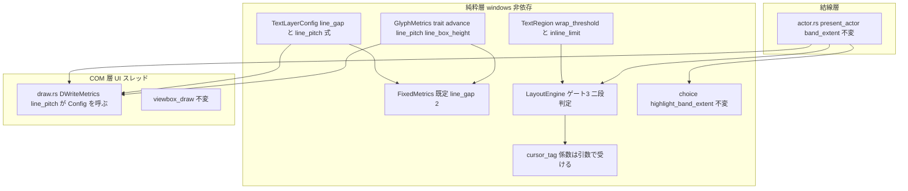
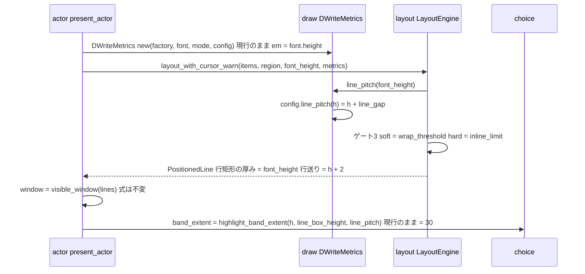
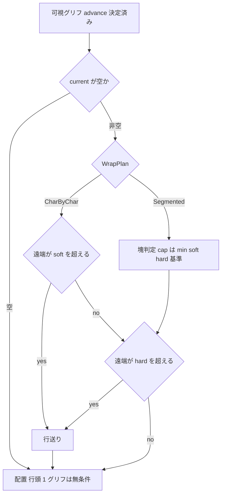

# Technical Design: areka-P0-emo-text-line-height-canon

> 作成 2026-09-05（設計フェーズ・対象ブランチ HEAD `36d1c323`＝`cursor-tag-canon` マージ済み）。**改訂 2026-09-05（設計ディスカッション議題 1）**: 開発者方針「SSP 実測主義は取らない。意味論は輸入する」により、`font.height` の意味（決定 1＝em・現行のまま）と行送りの式（決定 2＝`font.height + 行間`・行間の既定 2 image px）を**裁定で確定**した。SSP の画素実測・道具・複製バルーン・`metrics.rs` 切り出し・行ボックス丈と帯の撤去はすべて撤回した（§9 に撤回理由を残す）。file:line はすべて本ブランチで実読した値。開発者裁定（要件ディスカッション議題 1／2・設計ディスカッション議題 1）は `requirements.md` Requirement 1・3・5.5・6・8.3・10.4 の文言を正本とし、本書はそれを逐語で継承する。研究記録は `research.md` §12 B-1。

## Overview

**Purpose**: areka でゴースト `emo2` を動かす利用者が、相方側バルーン `emo2-kakukaku` のダブルクリックメニュー（`menu.pasta:15`／`:33`／`:62`）で**先頭の選択肢が描かれない**症状を、行送りの式を正典（ukadoc `\_l` の「1lh＝1em＋行間」）に揃えることで直す。`font.height` は現行どおり em サイズ（文字の大きさとベースラインは変えない）。併せて「閉じる」の右端欠けの裁定（折返し基準と描画範囲の二段構え）を実装に落とす。

**Users**: ゴースト利用者（同じバルーン・同じ `font.height` で SSP と同じ行数・同じ文字の大きさに見える）／運用者（正典表・裁量記録・決定論テストで確定値を後から再検証できる）／下流 spec（`emo2-conformance-e2e` が走行 A〜D を採り直す・`text-decoration-canon` が `\f[height]` の em 意味論を継承する）。

**Impact**: 行送りの源が 2 系統（係数 1.25 の `ceil`・実フォント比の行ボックス丈＝`research.md` §0）に散っている現状を、**`line_pitch = font.height + line_gap`（`TextLayerConfig::line_pitch` の 1 点）**へ畳む。`font.height` の解釈（em 素通し・`draw.rs:340-354`）・行ボックス丈（`GlyphMetrics::line_box_height`）・帯の防御式（`choice::highlight_band_extent`）は**変えない**。配置層に「描画範囲の当該辺を超えそうなら無条件折返し」を加える。あふれ判定 `visible_window` の式・`\_l` の座標解決・バルーン fixture は変えない。

### Goals

- `font.height` の意味・行送りの式・行間の既定値を裁定（ukadoc＋表示画像の比較）で確定し、本書 §4 の正典表と `doc/COMPAT_ARCHITECTURE.md` §8 に記録する（1.x・2.x）。
- `emo2-kakukaku`（高さ 93px）で 3 行が収まり、隣接する行のインクが重ならず、文字の大きさとベースラインが本仕様の前後で変わらない（3.x・5.x）。
- `\_l` の `lh`／`em` が新しい行送りへ自動追随する（4.x）。
- 折返し基準（`wordwrappoint`）と描画範囲（`validrect`）の二段構えを配置層に実装し、描画範囲の外に文字を置かない（6.x）。
- 既存 32 ファイルの決定論テストを緩めずに再導出し、新規の決定論テスト（実物 3 台本・裁定値の実フォント読み戻し・二段構え・旧式へ戻すと赤）を加える（7.x・8.x）。
- 成功基準: `cargo test -p areka-emo-text` と `cargo test --workspace` が終了コード 0・R8 の新規テストがすべて緑・R8.7 の対照が旧式で赤。

### Non-Goals

- `visible_window` の式の変更（9.1）・後戻り行のあふれ挙動（`text-decoration-canon` brief 追加登記 4・9.4）。
- `\_l` の語彙・原点・書字方向ごとの解決規則（`cursor-tag-canon` 完了実装・9.2）。
- 行末禁則文字のぶら下がり（折返しの遅延）の実装（6.9・引受先は §11.3）。
- `\f[...]` 文字装飾と `draw.rs` の分割（`text-decoration-canon`・W13）。本仕様は `draw.rs` を `DWriteMetrics::line_pitch` の式と doc 以外で触らない。
- SSP の画素実測（開発者方針 2026-09-05・1.6・10.4）。バルーン fixture・kanade・pasta・sakura の改変（9.3）。実機一周の採り直し（e2e が行う・10.4）。

## Boundary Commitments

### This Spec Owns

- **意味論**: `font.height` の意味（em）・行送りの式 `line_pitch = font.height + 行間`・行間の既定値（2）・`1lh` の実体値。正典表は本書 §4、裁量記録は `doc/COMPAT_ARCHITECTURE.md` §8、根拠画像と読み取り値は `verification/evidence/`。
- **折返しの二段構え**: 折返し基準（`wordwrappoint`＝超えたら折り返す）と描画範囲（`validrect`＝超えてはならない上限・無条件折返し）の意味論と、配置層 `layout.rs` のゲート③への実装。
- **テストの再導出と新規テスト**: `research.md` §3.3 の 32 ファイル（設計バリデーションで 2 本追加）の期待値と、R8 の新規テスト。
- **文書の改訂**: 完了 spec `emo-text-layer` の 1 行注記・`research.md:200` の消化注記・COMPAT §8 の行追加・`balloon-canon-residue` brief の登記・`text-decoration-canon` brief の相互参照・roadmap W12 A′・e2e 記録 §13.2 の欄。

### Out of Boundary

- `LayoutEngine::visible_window`（`layout.rs:634-680`）の判定分岐（「最新行の遠端 > 境界」・最小スキップ探索・飽和）。本仕様は入力（行矩形の位置・境界）だけが変わる。
- `cursor_tag.rs`（`\_l` の解決層）と `state.rs` の語彙層 `parse_cursor_coord`。`CursorBasis.line_pitch` へ渡す値が変わるだけ（`layout.rs:553-559`）。
- DirectWrite へ渡す em サイズの導出（`draw.rs:308-354`・値のまま＝決定 1）・行ボックス丈（`draw.rs:489-537`）・帯の防御式（`choice.rs:101-132`）・ダーティ帯の拡張（`viewbox_draw.rs:728-750`）——いずれも**現行のまま**。
  - **例外（タスク 3.4 で追加・2026-09-06）**: ダーティと描画対象の導出そのもの（`viewbox.rs` の `ScrollPlanner::derive_dirty_with_overhangs`）は**変えた**。行間が 2px に確定して「インクのはみ出し < 行と行の隙間」という前提が崩れ、スクロールで可視窓の外へ出た行の下端インクが面に残るようになったためで、参照描画との画素等価比較（要件 7.4）がその欠陥を捉えた。上の `viewbox_draw.rs:728-750`（ハイライト帯の拡張）は依然として不変であり、帯は広げていない。全容は `verification/derivation-ledger.md`「3.5.1 R-2 の決着」。
  - **例外 2（裁定 2026-09-06・決定 3・タスク 7.1）**: 実描画（`viewbox_draw.rs`）のダーティ矩形ごとの描画ループと、計画の値オブジェクト（`FramePlan::Update` の `dirty`）の形を**変える**——矩形ごとに、その矩形と交差する行だけを描く（§13）。`expand_overhang_for_band`（ハイライト帯の拡張）・帯の式・面内 blit・露出帯と残滓の導出は引き続き不変。
- 行末禁則のぶら下がり・`\f[height,N]`／`+N`／`N%` の実装（`text-decoration-canon`）・`\c[char]`／`\c[line]`（意図的非実装・COMPAT §8）。
- バルーン資産（`crates/pilot/examples/shiori-host-32/fixtures/emo2/` 配下）の是正。`wordwrappoint.x,-34` は粗さとして台帳へ登記するだけ。
- `draw.rs` の分割（`text-decoration-canon` の着手前提のまま・本仕様は先取りしない）。

### Allowed Dependencies

- 上流: `areka-P0-cursor-tag-canon`（完了・PR#137・`CursorBasis.line_pitch` を引数で受ける形）・完了 spec `areka-P0-emo-text-layer`（`GlyphMetrics` 注入点・DPI/スケール契約）・`areka-P0-balloon-vertical-canon`（`TextRegion::resolve` の領域解決）。
- ライブラリ: 既存のまま（`windows` 0.62.2・`wintf::com::dwrite`・`log-capture-kit`）。新規依存なし。`SetLineSpacing` 相当は**追加しない**（§9 DD-4）。
- 正典: ukadoc（`font.height`・`\_l` の `lh`・`\f[height]`・`wordwrappoint`・`validrect`）。参考: 里々 wiki「選択肢 › 2 段組メニュー」の経験則（既定フォント 12 で 1 行 14px）。
- 禁止: 純粋層（`state`／`region`／`cursor_tag`／`layout`／`canvas`／`viewbox`／`choice`）へ `windows` 系 import を持ち込むこと（`lib.rs:171-251` の構造テスト）。`areka-emo-present` → `areka-emo-text` の逆方向 import。

### Revalidation Triggers

- `TextLayerConfig` のフィールドが `line_pitch_factor` → `line_gap` へ変わる → `draw_format_metrics_tests.rs:403-406` の直接構築・`state_cue_apply_tests.rs:590-596`・`examples/emo-text-typewriter-demo.rs:227` の注記・`actor.rs:226-227,:473` の doc。`crates/areka` 側の `TextLayerConfig::default()` 呼び出しはコンパイルのみ。
- 本体側バルーン `emo2` の行容量が 3 行 → 4 行へ増える → `emo2-conformance-e2e` の走行期待（起動時の挨拶の行数）・`examples/emo-text-layer/scenario.rs` の容量前提・`viewbox_draw_oracle_regression_tests.rs` の行境界前提。
- `TextRegion` に `inline_limit` が加わる → `region.rs:178` の `PartialEq` 導出（`refresh_actor_binding` の同値判定 `actor.rs:383-385` はフィールド追加でも意味不変）。
- R5.6 の実フォント読み戻しで、帯（＝ピッチ 30）の外へ選択肢のインクが出た → 帯を広げずに開発者へ数値を添えて報告（§「帯の防御式を保つ」の残存リスク・R1.5 の手順）。**実施済み・裁定 2026-09-06 ＝ 1 画素のはみ出しを許容**（2 画素以上なら改めて裁定へ）。**第 2 回（同日・タスク 5.2）＝ 正典 `font.height,28` では 2 画素 → 2 画素を許容**（3 画素以上なら改めて裁定へ・§「帯の防御式を保つ」の第 2 回裁定）。
- 確定値と食い違う証跡（他バルーンでの行数差など）が見つかった → R1.5（推測で埋めず裁定へ）。

## Architecture

### Existing Architecture Analysis

行送りに関わる寸法の現状と本仕様後（`research.md` §1.1 を本ブランチで再確認）:

| 量 | 現在の式 | 定義点 | 本仕様後 |
|---|---|---|---|
| 行送りピッチ | `ceil(font.height × 1.25)`（旧式） | `state.rs:48-74`・`draw.rs:476-479`・`layout.rs:131-133` | `font.height + 行間`（`TextLayerConfig::line_pitch` の 1 点・行間の既定 2） |
| DirectWrite の em | `font.height` 素通し | `draw.rs:308-354` | **不変**（決定 1） |
| 行ボックス丈 | `font.height × (ascent+descent)/upem`（Yu Gothic UI 28 で 37.24） | `draw.rs:489-537` | **不変**（ピッチ 30 を超えるが、インク丈 ≈ 22 はピッチの内） |
| 行矩形の厚み | `font.height` | `layout.rs:780-819` | 不変 |
| 帯（ハイライト／ヒット） | `clamp(box, h, max(h, pitch))` | `choice.rs:129-132`・`actor.rs:785-789` | 式は**不変**・値は 35 → **30**（ピッチで頭打ち） |

維持する既存パターン: `GlyphMetrics` trait を唯一の注入点とする層分け（`layout.rs:76-104`）・probe と描画が同一 format を使う規約（`draw.rs:23-34`）・`SetTransform(scale(k))` 一点適用（`draw.rs:48-50`・3.11 は構造で保たれる）・log-first（`.kiro/steering/logging.md`）・兄弟テストファイル規約（`structure.md:146-181`）。

### Architecture Pattern & Boundary Map



**Architecture Integration**:

- 選択パターン: 既存の三層（純粋層 → COM 層 → 結線層・`lib.rs:10-26`）を保ったまま、行送りの式を `state.rs` の 1 点へ寄せる（Option A＝既存コンポーネントの拡張のみ・`research.md` §6。Option C の「計測部の切り出し」は撤回＝§9 DD-12）。
- 依存方向（強制）: `state`（式）→ `layout`（trait・配置）→ `draw`／`viewbox_draw`（描画）→ `actor`（結線）。新規モジュールなし。
- 撤去するもの: `TextLayerConfig.line_pitch_factor`（旧式の口を製品コードに残さない）だけ。`GlyphMetrics::line_box_height`・`FIXED_LINE_BOX_RATIO`・`choice::highlight_band_extent`・`viewbox_draw::expand_overhang_for_band` は**保つ**（em が不変ゆえ行ボックス丈 37.24 > ピッチ 30 のままで、帯をピッチで頭打ちにする防御が引き続き要る＝§9 DD-5／DD-6 撤回）。
- Steering 準拠: 純粋層の `windows` 非依存・log-first・1 ファイル 1,000 行・兄弟テストファイル・「決定論テストで固定するのは判断分岐のみ（証明済みの配線は再テストしない）」。

### Technology Stack

| Layer | Choice / Version | Role in Feature | Notes |
|---|---|---|---|
| Text（純粋層） | Rust 2024・f32 | 行送りの式・二段折返し | 新規依存なし |
| Text（COM 層） | DirectWrite（`windows` 0.62.2）既存の `DWriteMetrics` | `line_pitch` の実装本体を `TextLayerConfig::line_pitch` へ委譲 | `measure_line_box_ratio`（`draw.rs:499-537`）は不変。`SetLineSpacing` は使わない |
| 根拠画像 | 開発者提供の SSP 200% 表示画像＋コントローラ起動の areka 200% 表示画像（2026-09-05） | 決定 1／2 の根拠（字の大きさの一致・行送りの差） | `verification/evidence/README.md` に読み取り値を表で残す（§5）。道具は持たない |
| テスト | `cargo test`・`log-capture-kit`・実フォント Yu Gothic UI（Windows 標準） | 決定論テスト・読み戻し | 既存 `draw_format_metrics_tests.rs:417-450` が同フォントを前提にしている |

## 4. 正典表（Requirement 2.1・本仕様の design が正本）

### 4.1 行送り・文字寸法の正典表（裁定 2026-09-05・設計ディスカッション議題 1）

| 項目 | 正典 | 値（`font.height,28`・Yu Gothic UI） | 根拠 |
|---|---|---|---|
| `font.height` の意味 | **em サイズ**（DirectWrite の fontSize へ値のまま渡す・現行どおり） | 28 image px | ⑴ ukadoc `font.height`「使用するフォントの高さ方向の大きさ。(単位はピクセル：ポイントではない)」⑵ ukadoc `\f[height]`「スタイルシートのサイズ指定も可能」（CSS の font-size は em）⑶ 2026-09-05 の SSP／areka 200% 画像で字の大きさが一致（1 文字の送り ≈ 45 物理 px・インク丈 ≈ 45 物理 px・`verification/evidence/README.md`）。決定 1 |
| 行送りピッチ `line_pitch`（`1lh`） | `font.height + 行間`（`ceil` なし） | **30** | ukadoc `\_l` の `XXlh`「1lh＝1em＋行間」（`cursor-tag-canon` `requirements.md:193` 付録 A）を実体化。決定 2 |
| 行間の既定値 `line_gap` | **定数 2 image px**（`TextLayerConfig` で変えられる・areka 裁量として COMPAT §8 に登記） | 2 | ⑴ SSP 200% 画像の行送り ≈ 58〜60 物理 px ＝ 29〜30 image px（evidence README）⑵ 里々 wiki「選択肢 › 2 段組メニュー」の経験則「戻りたい行数×14」（既定フォント 12 で 1 行 14px＝行間 2）⑶ ukadoc は既定値に沈黙 |
| 行ボックス丈（`GlyphMetrics::line_box_height`） | `font.height × (ascent+descent)/upem`（現行のまま） | 37.24 | em 不変の帰結。ピッチ 30 を超えるが、判定はインクで行う（3.2） |
| インク丈（参考値・実フォント） | 読み戻しで固定（8.3） | ≈ 22 image px（45 物理 px ÷ 2） | evidence README。隣接行のインクは重ならない（22 < 30・8.5） |
| 1 文字の送り（参考値・実フォント） | probe の実測（現行の仕組み・3.4） | ≈ 23 image px（仮名・プロポーショナル） | evidence README。全角＝em（28）を仮定しない |
| `\_l` の `em` 係数 | `font.height` | `5em = 140` | `cursor_tag.rs:120-127`・現行と同じ（4.2） |
| `\_l` の `lh` 係数 | `line_pitch` | `2lh = 60` | `layout.rs:553-559` → `CursorBasis.line_pitch`（4.1／4.3） |
| 比率つき改行 `\n[ratio]` | `line_pitch × ratio` | `\n[half] = 15` | 意味不変（3.7） |
| ハイライト帯／ヒット帯 | `clamp(line_box_height, font.height, max(font.height, line_pitch))`（現行の防御式のまま） | **30**（37.24 をピッチで頭打ち） | 帯が隣接行の帯と重ならない（3.6／5.6）。実フォントの読み戻しでは選択肢のインクが帯の下端から **1 画素**はみ出す。**裁定 2026-09-06 ＝ 1 画素のはみ出しを許容**する（帯は広げない。行間の既定 2・行送り 30 は覆さない。詳細は §「帯の防御式を保つ」） |
| 縦書き（`vertical_rl`／`vertical_lr`） | 同じ式を列送りへ軸読み替え | 同上 | 意味論を新設しない（3.8） |
| フォント名・`font.height` の欠落／0 | `ＭＳ ゴシック`・12px／警告＋12 | 不変 | 3.9（`draw.rs:184-231` 不変） |
| face metrics 不取得時 | 行ボックス比を係数へ縮退＋警告（現行 `draw.rs:403-410`） | — | 3.10（縮退経路を保つ・縮退値の名前だけ `line_gap` へ追随） |
| 拡大率 k | レイアウトは image px・`SetTransform(scale(k))` 一点 | k で行数が変わらない | 3.11（構造不変） |
| 相方側の行容量（高さ 93） | `floor((93 − 28) ÷ 30) + 1` | **3 行**（3 行目の下端 40+60+28 = 128 ≤ 133） | 1.4／5.1〜5.4 |
| 本体側の行容量（高さ 122） | `floor((122 − 28) ÷ 30) + 1` | **4 行**（4 行目の下端 46+90+28 = 164 ≤ 168・5 行目 194 > 168） | 5.5（3 → 4 行へ増える・`research.md` §4.4） |

### 4.2 裁定の根拠と、採らなかった候補（Requirement 1.1／1.2／1.7）

**裁定の根拠（意味論の輸入）**: ukadoc の 3 記述（`font.height`＝ピクセル単位の高さ・`\f[height]`＝CSS のサイズ指定も可・`\_l` の「1lh＝1em＋行間」）に、2026-09-05 の 200% 表示画像 2 枚（SSP・areka）の比較を添える。画像の読み（詳細は §5）: 字の大きさ（1 文字の送り ≈ 45 物理 px・インク丈 ≈ 45 物理 px）は両者で一致し、違うのは行送りだけ（SSP ≈ 58〜60 物理 px ＝ 29〜30 image px・areka 72 物理 px ＝ 36 image px ≒ 実装値 35）。字の大きさが一致する以上、SSP も `font.height` を em として文字描画基盤へ渡していると判断できる（決定 1）。行送りの差 ≈ 2 image px は ukadoc の「1em＋行間」の「行間」に当たり、里々 wiki の経験則（既定フォント 12 で 1 行 14px）とも一致するので定数 2 と確定した（決定 2）。

**採らなかった候補**:

| 候補 | 内容 | 採らなかった理由 |
|---|---|---|
| α（研究の第一仮説） | `font.height`＝セル丈（ascent＋descent）。DirectWrite へ渡す em を `font.height ÷ 1.3301 = 21.05` へ縮め、行ボックス丈を 28 に揃える | 画像比較で字の大きさが SSP と一致（em 28 のまま）。α を採ると areka の文字だけ 0.75 倍に縮み、SSP と食い違う。`research.md` §4.1 の予測表が「advance＝em」を仮定したのも誤り（Yu Gothic UI はプロポーショナル・実送り ≈ 23） |
| 比例行間（`line_gap = round(font.height × r)`） | 行間を `font.height` に比例させる | ukadoc は「1em＋行間」と加算で書く。里々 wiki の経験則（12 → 14）と本 fixture（28 → 30）がどちらも定数 2 で説明でき、比例させる根拠がない。`TextLayerConfig.line_gap` を定数にしておけば、後から根拠が出ても値を差し替えるだけで済む |
| 係数 1.0（brief の「行ボックス丈 37.24 がピッチを超えてインクが重なる」） | `line_pitch = font.height`（行間 0） | 行ボックスとインクの取り違えであった（インク丈 ≈ 22 < 28）。行間 0 でもインクは重ならないが、SSP の行送り（≈ 30）と一致しない |
| SSP の画素実測で行間を求める | 道具 3 本（GDI 計測・SSTP 送信・画面読み取り）と複製バルーンで 2 水準 × 2 拡大率を撮る | 開発者方針「SSP 実測主義は取らない」（2026-09-05）。SSP の環境（profile・SSTP 受信・バルーン複製）へ手を入れることになり、意味論は ukadoc と画像比較で足りる |

食い違う証跡が後から見つかった場合（1.5）: 推測で埋めず、証跡と帰結（行数・文字の大きさ・インクの重なり）を並べて開発者の裁定へ回す。本書 §4 は裁定後に改訂する。

### 4.3 折返し基準と描画範囲の二段構え（Requirement 6・開発者裁定 2026-09-05）

| 項目 | 正典 | 根拠 |
|---|---|---|
| 折返し基準 `wordwrappoint.x`（縦書きは `.y`） | **ここを超えたら折り返す**（soft）。行末禁則文字は基準を超えてぶら下がってよい（折返しの遅延＝本仕様では未実装・§11.3） | ukadoc `wordwrappoint.x`「自動改行で折り返すX座標」・未指定は「validrect.right まで書けるものとして扱う」（`region.rs:250-257` の縮退どおり） |
| 描画範囲 `validrect` の当該遠辺（横書き `right`・縦書き `bottom`） | **ここを超えてはならない絶対上限**（hard）。文字の遠端が超えそうなら、折返し基準に関わらず無条件に折り返す | ukadoc `validrect`「テキスト描画範囲」・web の文字列折返しと同じ二段構え |
| 二段の関係 | `feed = 現在行が非空 ∧ (遠端 > soft ∨ 遠端 > hard)`。禁則が入るまでは `min(soft, hard)` と同じ出力になるが、**2 つの値と 2 つの判定を別に持つ**（丸め込み案 ⑶ を採らない・6.8） | 6.2／6.3／6.8 |
| 行頭の 1 グリフ | 折返し基準・描画範囲のどちらを超えても配置する（無限折返しの構造排除・`layout.rs:229`） | 描画範囲より広い 1 文字だけが唯一の例外。ログは出さない（正典の自然な帰結） |
| 供給面の寸法 | 描画範囲ちょうど（`actor.rs:663-671`・`canvas.rs:319-323`・`surface.rs:186-195`）のまま変えない | 6.3（描画範囲を広げる案は裁定に反する） |
| 折返し基準が描画範囲の外に解決されたバルーン | 実効の折返し位置は描画範囲の当該辺。警告ログ 1 回（バルーン名・解決値・辺の値・軸）＋`balloon-canon-residue` へ登記 | 6.3／6.7。本 fixture: `balloonk0s.txt` が `wordwrappoint.x` を上書きせず共通 `descript.txt:14` の `-34`（→254）を継ぐ。本体側 `balloons0s.txt` は `-49`（→351 ≤ 356）を自ら上書き |
| 「閉じる」（`\_l[5em,…]`＝x 164 起点・3 文字） | 実フォントの文字送り ≈ 23（Yu Gothic UI はプロポーショナル）→ 3 文字 ≈ 69px → x 164..≈233 ≤ 240＝収まる見込み（`kero_menu_capacity_test.rs` で確定）。brief の「x164..248（1 文字 28px）」は全角＝em の仮定による机上値 | 6.5。収まらなければ無条件折返し→あふれはバルーン定義側の粗さとして記録（6.6） |
| 選ばなかった案 | ⑴ 供給面を折返し基準まで広げる＝描画範囲を超えて描く（裁定に反する）⑵ 現状維持＝8px 欠ける ⑶ 折返し基準を描画範囲へ丸め込むだけ＝絶対上限の意味論と禁則の遅延を表せない | 6.8（`research.md` §5 の案 1〜5 の帰結を引く） |

## 5. 根拠画像の保存と読み取り値（Requirement 1.3・6.1）

- 置き場: `.kiro/specs/areka-P0-emo-text-line-height-canon/verification/evidence/`（画像 2 枚＋`README.md`）。README はコントローラが書く。道具・台本・SSP の設定変更は**持たない**。
- 画像: SSP の 200% 表示（開発者提供・2026-09-05）と areka の 200% 表示（コントローラが本ブランチの areka を起動して撮影・同日）。いずれも `emo2-kakukaku`（`font.height,28`・Yu Gothic UI）。
- 読み取り値の表（README に置く欄・物理 px・目視 ±5px）: 1 文字の送り（≈ 45／45）・インク丈（≈ 45／45）・行送り（SSP ≈ 58〜60・areka 72）・等倍の確認（バルーン画像幅 400 image px が画面上 ≈ 800px）・image px への換算（÷2: 行送り SSP 29〜30・areka 36 ≒ 実装 35）・「閉じる」の右端の見え方（6.1 の裏付け欄）。
- 使い方: §4.1 の根拠列・COMPAT §8 の根拠欄・`tests/line_pitch_readback_test.rs` の定数のコメントがこの表を引く。再測は同じ 2 画面を撮り直せばよい（手順は README に 3 行で書く）。

## File Structure Plan

### Directory Structure

```
crates/areka-emo-text/src/
├── layout_hard_limit_tests.rs        # 新設（兄弟）: 二段折返しの純粋層テスト（R8.4(b)・横書き＋縦書き・CharByChar＋Segmented）
├── region_inline_limit_tests.rs      # 新設（兄弟）: inline_limit の 3 方向・折返し基準が外のときの警告件数（R6.7）
├── state_cue_apply_tests.rs          # 既存（597 行）へ line_pitch の値と normalized の縮退を追加
├── state.rs                          # TextLayerConfig { line_gap }・line_pitch 式（唯一の定義点）・normalized
├── layout.rs                         # FixedMetrics::line_pitch が TextLayerConfig::default().line_pitch(h) を返す・ゲート③の二段判定
├── region.rs                         # TextRegion.inline_limit・折返し基準が描画範囲の外のときの警告 1 回
├── draw.rs                           # DWriteMetrics::line_pitch が config.line_pitch(h) を返す・doc の旧式記述を改める（他は不変）
├── choice.rs / actor.rs / canvas.rs  # doc のみ（帯の値が 35 → 30 になる旨・式は不変）
├── viewbox_draw.rs                   # 不変
└── cursor_tag_test_support.rs        # LINE_PITCH 13 → 12（font 10 + 行間 2）と doc
crates/areka-emo-text/tests/
├── kero_menu_capacity_test.rs        # 新設: 実物 emo2-kakukaku × menu.pasta 3 台本（R8.1／8.2／8.4(a)(c)／8.7・GPU 不要）
└── line_pitch_readback_test.rs       # 新設: 裁定値の実フォント読み戻し・2 行のインク非重なり・帯とインク（R8.3／8.5／5.6・headless GPU）
.kiro/specs/areka-P0-emo-text-line-height-canon/
├── verification/evidence/{README.md, ssp-200pct.png, areka-200pct.png}   # 根拠画像と読み取り値（§5）
└── verification/handoff.md           # e2e への引き渡し（R10.2・変化／不変の一覧・1 箇所）
```

### Modified Files

| ファイル（現行行数） | 変更 | 見込み行数 |
|---|---|---|
| `src/state.rs`（499） | `TextLayerConfig { line_gap: f32 }`（既定 2.0）・`line_pitch(&self, font_height) -> f32`・`normalized()`（非有限／負 → 警告＋0）。doc `:48-61` の旧式記述を改める | ≈ 530 |
| `src/layout.rs`（890） | `FixedMetrics::line_pitch`（`:131-133`）が `TextLayerConfig::default().line_pitch(font_height)` を返す（既定係数を読む現行の形のまま式だけ差し替え）・ゲート③（`:386-446`）に `hard = region.inline_limit()` の判定を足す・doc `:86-88,:106-111,:230` | ≈ 910 |
| `src/region.rs`（863） | `inline_limit: f32` フィールド＋`inline_limit()`・`resolve` 末尾で `wrap_threshold > inline_limit` なら `warn!`（バルーン名・値・辺・軸）・doc | ≈ 890 |
| `src/draw.rs`（980） | `DWriteMetrics::line_pitch`（`:476-479`）が `self.config.line_pitch(font_height)` を返す（保持するのは係数でなく `TextLayerConfig`）・縮退値の名前（`:403-410` の `fallback = config.line_pitch_factor`）を追随・doc `:368-370,:378-379,:476`。format 生成・行ボックス丈・オラクルは**不変** | ≈ 985 |
| `src/choice.rs`（550） | doc のみ（`:101-132` の実測例「`min(37.24, 35) = 35`」を「`min(37.24, 30) = 30`」へ・式は不変） | 不変 |
| `src/actor.rs`（879） | doc のみ（`:226-227,:473` を「調整値（行間）」へ・`:781-789` は不変） | 不変 |
| `src/viewbox.rs`（762） | **タスク 3.4 の製品修正**: `ScrollPlanner::derive_dirty_with_overhangs` の描画対象を可視窓（`first_visible_line` 以降）へ揃え、スクロールで可視窓の外へ出た行が残す下端はみ出しインクをダーティへ入れる（`block_axis_overhang` を新設）。行間が 2px に確定して「はみ出し < 行と行の隙間」が崩れた帰結で、`LineOverhang` の doc もあわせて是正。経緯と実測は `verification/derivation-ledger.md`「3.5.1 R-2 の決着」。**§13（決定 3・タスク 7.1）**: `DirtyRect { rect, lines }` を新設し `FramePlan::Update.dirty` を `Vec<DirtyRect>` へ・`derive_dirty*` が矩形ごとの交差行を割り当てる（`draw_lines` は和集合として残す） | ≈ 840 |
| `src/canvas.rs`（722） | 不変（`canvas.rs:176-182` の doc は帯の源を正しく述べている） | 不変 |
| `src/viewbox_draw.rs`（806） | **doc のみ**（`:199`・`:594` の「縮退時の描画対象＝全 GlyphRun 住人／レガシー全域再描画と等価」が上記 3.4 の変更で事実に反するため、「可視窓の GlyphRun 住人」へ是正）。タスク 3.4 ではコード不変。**§13（決定 3・タスク 7.1）でコードも変わる**: Phase 2 の二重ループを「矩形ごとに `lines` だけを描く」へ・Phase 1 は index 引きの資源表へ・`plan_inconsistency` に「各矩形の行は `draw_lines` の部分集合」を追加。`expand_overhang_for_band` は不変 | ≈ 830 |
| `src/cursor_tag_test_support.rs`（106） | `LINE_PITCH = 13` → `12`・doc `:21` を「`font_height 10 + 行間 2`」へ（7.5・係数 4 種 1／10／12／0.1 は引き続き相異なる） | 不変 |
| `src/draw_format_metrics_tests.rs`（737） | `:396-410` の値（`line_pitch(12) = 14`・`(10) = 12`）と非既定 `line_gap` の分岐・`:417-450` は不変 | 不変 |
| 32 ファイルの既存テスト（`research.md` §3.3） | §「Testing Strategy」の再導出台帳に従う | 各 ≤ 1,000 |
| `examples/emo-text-layer/scenario.rs`（116） | 容量前提 3 行 → 4 行・縦書き 9 列 → 10 列・pitch 35 → 30 の doc と定数（7.3・5.5）。あわせて `EXPOSURE_BAND_DRAW_BOUND` を実走実測値へ（3 → **16**）と、`cue()` の `duration` を `text_playback_duration` から取る是正（この example の typewriter が 2026-07-17 の PR#60 以降まったく進んでいなかった＝台帳「3.5.1」参照）。**§13（決定 4・タスク 7.2）**: `OVERFLOW_LINES` 9 → **13**・`T_CHECK[4..]`／Clear の注入時刻／`GATE_SAKURA[4]` を式で導き直し・`EXPOSURE_BAND_DRAW_BOUND` を削減後の実測へ（内訳は和） | ≈ 175 |
| `examples/emo-text-layer.rs`（221）・`examples/emo-text-layer/drive.rs`（856） | **doc とログ文言のみ**: 自動判定は k=1.0 が前提であること（高 DPI 機での固定手順）を明記し、`k=1.0 恒常` という事実に反する記述を改める。**§13（決定 4・タスク 7.2）で `drive.rs` のコードも変わる**: 完成プラトーの選び方（次のプラトーで先頭可視行が 1 進むもの）・統制された 2 段の選択（送り出される行が短行どうし）・プラトー走査の窓 | ≈ 240 ／ ≈ 880 |
| `src/viewbox_dirty_tests.rs`（658）・`src/viewbox_draw_frame_render_tests.rs`（502）・`src/viewbox_test_support.rs`（108） | **§13（タスク 7.1）**: 矩形ごとの割当の決定論テストを追加・「描画は積」の検査を「和」へ改訂・`DirtyRect` と `PhysicalRect` の比較補助（矩形だけを比べる既存 assert を保つため） | 各 < 1,000 |
| `examples/emo-text-typewriter-demo.rs` | `:227` の注記（`line_gap`） | 不変 |
| `crates/log-capture-kit/tests/file_length_guard_test.rs` | **触らない**（8.6・9.5）。上表の見込み行数がすべて 1,000 未満であることが根拠 | — |
| `doc/COMPAT_ARCHITECTURE.md` §8（`:122`） | 行を 2 本追加（§11.1） | — |
| `.kiro/specs/completed/areka-P0-emo-text-layer/design.md:725,:736`・`research.md:200` | 1 行注記のみ（2.1／2.2） | — |
| `.kiro/specs/areka-P0-balloon-canon-residue/brief.md`・`areka-P0-text-decoration-canon/brief.md`・`.kiro/steering/roadmap.md:73,:91`・`areka-P0-emo2-conformance-e2e/verification/acceptance-record.md:683-684` | §11 の登記 | — |

## System Flows

### 行配置から帯まで（1 actor・初回装着フレーム・変わる点は行送りの値だけ）



流れの決め事: probe（計測）と描画の format は従来どおり同一（`create_text_format`・`draw.rs:308-337`）で、本仕様は format 生成に触らない。`line_pitch` の実装本体は純粋層（`FixedMetrics`）も COM 層（`DWriteMetrics`）も `TextLayerConfig::line_pitch` を呼ぶだけで、足し算を自分で持たない（3.5）。

### ゲート③ の二段判定（`layout.rs:386-446` の置き換え）



- `hard` の判定は分岐（CharByChar／塊内／塊先頭／非被覆）に依らず**配置の直前に必ず**通る（塊内で「追加判定なし」だった箇所にも hard だけは効く＝描画範囲の外に文字を置かない 6.2 を構造で保つ）。
- Segmented の `cap_rem`／`cap_full`（`layout.rs:410-411`）は `limit = soft.min(hard)` を基準に計算する（塊が hard を超える長さなら塊の前で行送りするか長大塊として文字単位へ縮退する＝既存 3 分岐の意味は不変）。
- 本体側 `emo2`（soft 351 ≤ hard 356）では、soft を超えない限り hard は超えず、soft を超えた時点で既に行送りしているので**出力は 1 画素も変わらない**（6.4・R8.4(c) で固定）。

## Requirements Traceability

| Requirement | Summary | Components | Interfaces | Flows |
|---|---|---|---|---|
| 1.1 | `font.height`＝em を確定し根拠 3 点を記録 | §4.1・§4.2・`verification/evidence/README.md` | — | — |
| 1.2 | `line_pitch = font.height + 行間`・既定 2 | §4.1・§4.2・`TextLayerConfig::line_pitch` | `line_pitch(font_height)` | — |
| 1.3 | 根拠画像 2 枚と読み取り値の表を保存 | §5 | — | — |
| 1.4 | 28 代入で 3 行が 93 に収まる（128 ≤ 133） | §4.1 行容量の行・`kero_menu_capacity_test.rs` | — | — |
| 1.5 | 食い違う証跡は裁定へ | §4.2 末尾・Revalidation Triggers | — | — |
| 1.6 | SSP 実測は DoD 外・行間は `TextLayerConfig` で可変・COMPAT §8 に登記 | `TextLayerConfig.line_gap`・§11.1 | — | — |
| 1.7 | α を採らなかった理由・行ボックスとインクの取り違え | §4.2 の表 | — | — |
| 2.1 | 正典表は本書・アーカイブは 1 行注記 | §4・文書コンポーネント | — | §11.1 |
| 2.2 | `research.md:200` に消化注記 | 文書コンポーネント | — | §11.1 |
| 2.3 | COMPAT §8 に 2 行 | 文書コンポーネント | — | §11.1 |
| 2.4 | 1.25 の残存を機械的に検査 | Testing Strategy「機械検査」 | `rg` 条件 | — |
| 2.5 | `cursor-tag-canon` の `lh` 定義を改訂せず実体化 | §4.1 `lh` の行・COMPAT §8 の行 | — | — |
| 3.1 | ピッチ `h + 2` で 3 行収容 | `TextLayerConfig`・`DWriteMetrics::line_pitch` | `GlyphMetrics::line_pitch` | 行配置フロー |
| 3.2 | 隣接行のインク非重なり（行ボックス > ピッチは許容） | `line_pitch_readback_test.rs`（2 行） | — | — |
| 3.3 | em を値のまま・文字の大きさとベースライン不変 | `draw.rs:308-354`（不変）・`line_pitch_readback_test.rs` | — | — |
| 3.4 | 文字送りは probe の実測（現行）・全角＝em を仮定しない | `DWriteMetrics::advance`（不変）・`kero_menu_capacity_test.rs` の「閉じる」 | — | — |
| 3.5 | ピッチ・`lh`・比率改行・帯上限が同じ式 | `TextLayerConfig::line_pitch`・`FixedMetrics`／`DWriteMetrics` の委譲 | — | — |
| 3.6 | 帯の防御式を保つ・帯が重ならず・インクが帯に収まる | `highlight_band_extent`（不変）・`line_pitch_readback_test.rs`（帯とインク） | — | 行配置フロー |
| 3.7 | `\n[ratio]` の意味不変 | `layout.rs:740-757`（不変） | — | — |
| 3.8 | 縦書きは軸読み替え | `finish_line`（不変）・`layout_hard_limit_tests.rs` の縦書き | — | — |
| 3.9 | 欠落既定値・0 の縮退不変 | `ResolvedFont::resolve`（不変） | — | — |
| 3.10 | face metrics 不取得は警告＋縮退（現行経路） | `draw.rs:403-410`（名前の追随のみ） | — | — |
| 3.11 | k で行数不変 | `SetTransform` 一点（不変）・`scale_invariance_test.rs` 再導出 | — | — |
| 4.1 | `N lh` ＝ ピッチ × N（`2lh = 60`） | `layout.rs:553-559`（値のみ変わる） | `CursorBasis.line_pitch` | — |
| 4.2 | `N em` ＝ `font.height × N`（140） | `cursor_tag.rs:120-127`（不変） | — | — |
| 4.3 | 解決規則不変・係数だけ差替え | Out of Boundary | — | — |
| 4.4 | `\_l` テストを再導出・本数維持 | 再導出台帳 A | — | — |
| 5.1〜5.4 | 3 台本で先頭可視行 0・下端 ≤ 133 | `kero_menu_capacity_test.rs` | — | — |
| 5.5 | 本体側は 4 行（164 ≤ 168）・退行なし | §4.1 本体側の行・`scenario.rs`・§11.2 | — | — |
| 5.6 | 帯とヒット帯が同じ源・descent が切れない | `actor.rs:781-789`（不変）・`line_pitch_readback_test.rs` | — | 行配置フロー |
| 6.1 | 裁定の記録と SSP の見え方 | §4.3・COMPAT §8・§5（「閉じる」の欄） | — | — |
| 6.2 | 二段判定 | `LayoutEngine` ゲート③ | `TextRegion::inline_limit` | ゲート③フロー |
| 6.3 | 実効折返し＝描画範囲の辺・供給面不変 | 同上・`actor.rs:663-671`（不変） | — | — |
| 6.4 | 本体側の折返し位置不変 | `kero_menu_capacity_test.rs` R8.4(c) | — | — |
| 6.5 | 「閉じる」が 240 に収まる（≈ 69px） | `kero_menu_capacity_test.rs` R8.4(a) | — | — |
| 6.6 | 収まらなければ無条件折返し・粗さとして記録 | ゲート③・§11.3 | — | — |
| 6.7 | 警告 1 回＋residue 登記 | `TextRegion::resolve` の `warn!`・§11.3 | ログ欄 §Monitoring | — |
| 6.8 | 選ばなかった案の記録 | §4.3 | — | — |
| 6.9 | 禁則遅延は未実装・引受先登記 | §11.3 | — | — |
| 7.1 | 32 ファイルの期待値を計算で再導出 | 再導出台帳 | — | — |
| 7.2 | 緩めない・本数と名前を減らさない | 再導出台帳・退役台帳 D | — | — |
| 7.3 | 容量前提の導き直し | 再導出台帳 C | — | — |
| 7.4 | 画素等価比較の両側同寸・負の対照が赤 | 再導出台帳 B（`viewbox_draw_live_diff_tests`）・台帳 C（`viewbox_draw_oracle_regression_tests`） | — | — |
| 7.5 | 定数注入テストの doc | `cursor_tag_test_support.rs` | — | — |
| 7.6 | 終了コードで合否 | Testing Strategy「実行」 | — | — |
| 8.1 | 実物 3 台本・実経路で先頭可視行 0 | `kero_menu_capacity_test.rs` | — | — |
| 8.2 | 折返し 2 方式で同一 | 同上 | `WrapPlan` | — |
| 8.3 | 裁定値の実フォント読み戻し（30・≈ 23・≈ 22）＋証跡コメント | `line_pitch_readback_test.rs` | 定数（日付・証跡名） | — |
| 8.4 | 裁定の固定 (a)(b)(c) | `kero_menu_capacity_test.rs`・`layout_hard_limit_tests.rs` | — | — |
| 8.5 | 2 行のインク非重なり | `line_pitch_readback_test.rs` | — | — |
| 8.6 | 兄弟ファイル or `tests/`・1,000 行・例外表不変 | File Structure Plan | — | — |
| 8.7 | 旧式へ戻すと赤 | `kero_menu_capacity_test.rs` の `LegacyPitchMetrics` | — | — |
| 9.1 | `visible_window` 不変 | Out of Boundary・再導出台帳 A | — | — |
| 9.2 | `\_l`・`\c`・比率改行・reveal 不変 | Out of Boundary | — | — |
| 9.3 | fixture・kanade・pasta・sakura 不変 | Out of Boundary | — | — |
| 9.4 | 追加登記 4 は相互参照のみ | §11.3 | — | — |
| 9.5 | `draw.rs` 唯一の進行中 spec・各 1,000 行以下 | File Structure Plan の見込み行数・§12 | — | — |
| 9.6 | 連続したコミット列 | §12 コミット順 | — | — |
| 10.1 | e2e 記録 §13.2 の欄 | §11.2 | — | — |
| 10.2 | 変化／不変の一覧を 1 箇所に | §11.2（`verification/handoff.md`） | — | — |
| 10.3 | roadmap A′ 完了・decoration brief 相互参照 | §11.3 | — | — |
| 10.4 | 実機走行と SSP 実測は DoD 外・実フォント読み戻しは DoD | Testing Strategy「実行」・§12 | — | — |
| 11.1 | 矩形ごとに交差行だけを描く（和・積でない） | §13.3・`DirtyRect`・`ViewboxExecutor::render` Phase 2 | `FramePlan::Update.dirty: Vec<DirtyRect>` | §13.3 |
| 11.2 | 画素等価比較が両側緑・負の対照が赤のまま | 再導出台帳 B（`viewbox_draw_live_diff_tests`）・台帳 C（`viewbox_draw_oracle_regression_tests`） | — | — |
| 11.3 | 割当は純粋層で導出・決定論テストで固定・実描画側は和を固定 | `derive_dirty_with_overhangs`・`viewbox_dirty_tests.rs`・`viewbox_draw_frame_render_tests.rs` | `DirtyRect.lines` | — |
| 11.4 | 帯の拡張・帯の式・blit・露出帯・残滓は不変 | Out of Boundary 例外 2 | — | — |
| 11.5 | 完成プラトー＝次のプラトーで先頭可視行が 1 進むもの・旧来の選び方は落ちる | §13.4・`drive.rs::observe_redraw_less_stats` | — | — |
| 11.6 | 統制された 2 段（短行どうし）・時刻表の導き直し・C5 縦書き | §13.4・`scenario.rs` | `OVERFLOW_LINES`・`T_CHECK`・`GATE_SAKURA` | — |
| 11.7 | `EXPOSURE_BAND_DRAW_BOUND` の採り直し（和の内訳） | §13.4・`scenario.rs` | — | — |
| 11.8 | 両モード PASS（k=1.0・手動実走） | §13.6 | — | — |
| 11.9 | 採らなかった案の記録 | §13.5 | — | — |
| 11.10 | 製品の不変条件は保たれている・誤報の記録 | `tests/viewbox_scroll_test.rs`（不変）・台帳 §3.5.3 | — | — |

## Components and Interfaces

| Component | Domain/Layer | Intent | Req Coverage | Key Dependencies (P0/P1) | Contracts |
|---|---|---|---|---|---|
| `TextLayerConfig`＋`line_pitch` | 純粋層 `state.rs` | 行送りの式の唯一の定義点 | 1.2, 1.6, 3.1, 3.5, 3.7 | — | Service |
| `GlyphMetrics`／`FixedMetrics` | 純粋層 `layout.rs` | 注入点（3 口・不変）と決定論の代役 | 3.5, 4.4, 7.1 | `TextLayerConfig`（P0） | Service |
| `LayoutEngine` ゲート③ | 純粋層 `layout.rs` | 二段折返し | 6.2, 6.3, 6.4, 6.6, 3.8 | `TextRegion`（P0） | Service |
| `TextRegion.inline_limit`＋警告 | 純粋層 `region.rs` | 描画範囲の当該辺と粗さの警告 | 6.2, 6.3, 6.7 | ~~`BalloonModel::name`（P1）~~ **無し**（⚠訂正 2026-09-06: `BalloonModel` にバルーン名の取得口は無く、`balloon` 欄はプレースホルダ定数。台帳 §7 #10） | Service, State |
| 帯の防御式（`choice.rs`・`actor.rs`） | 純粋層／結線 | 現行の式を保ち、値だけピッチ 30 で頭打ち | 3.6, 5.6 | `GlyphMetrics::line_box_height`／`line_pitch`（P0） | Service |
| `DWriteMetrics::line_pitch` の追随 | COM 層 `draw.rs` | 式の委譲・doc | 3.1, 3.5, 3.10 | `TextLayerConfig`（P0） | Service |
| 根拠画像と読み取り値 | 運用（spec 配下） | 裁定の根拠の保存 | 1.1, 1.3, 6.1 | — | — |
| 文書・引き渡し | 文書 | 正典表・裁量記録・登記 | 2.x, 6.7, 6.9, 10.x | — | — |
| 新規テスト 4 本 | テスト | R8 | 8.x, 5.x, 6.x | 実フォント Yu Gothic UI（P0）・headless GPU（P1） | — |

### 純粋層

#### `TextLayerConfig` と行送りの式（`state.rs`）

| Field | Detail |
|---|---|
| Intent | 行送りの式 `line_pitch = font_height + line_gap` を 1 か所で定義し、純粋層・COM 層の両実装がここを呼ぶ |
| Requirements | 1.2, 1.6, 3.1, 3.5, 3.7, 2.4 |

**Responsibilities & Constraints**
- `line_gap` は image px の整数値（型は `f32`・演算の都合）。既定値は **2.0**（§4.1・裁定）。
- 不変条件: `line_pitch(h) ≥ h`（`line_gap ≥ 0`）。`normalized()` が非有限・負を `warn!`＋0 へ縮退する（log-first）。
- 旧 `line_pitch_factor` は撤去する（製品コードに旧式の口を残さない＝R8.7 の対照はテスト専用実装で作る）。

**Contracts**: Service [x]

```rust
/// テキスト層の調整値。行送りの式の唯一の定義点（design §4.1）。
#[derive(Clone, Copy, Debug, PartialEq)]
pub struct TextLayerConfig {
    /// 行間（image px・整数値）。`1lh = 1em + 行間` の「行間」。既定 2（裁定 2026-09-05・COMPAT §8）。
    pub line_gap: f32,
}
impl TextLayerConfig {
    /// 行送りピッチ `font_height + line_gap`（`ceil` なし・両項とも整数 px）。
    pub fn line_pitch(&self, font_height: f32) -> f32;
    /// 非有限／負の `line_gap` を warn!＋0 へ縮退した値（呼び手は構築直後に 1 度だけ通す）。
    pub fn normalized(self) -> TextLayerConfig;
}
```
- 事前条件: `font_height > 0`（`ResolvedFont::resolve` が保証）。事後条件: 同一入力→同一出力・失敗経路なし。

**Implementation Notes**
- Integration: `FixedMetrics::line_pitch` と `DWriteMetrics::line_pitch` は**この関数以外で足し算をしない**（R3.5 の検証は値の一致テストで固定する）。
- Validation: `state_cue_apply_tests.rs` に `line_pitch` の値テスト（28 → 30・12 → 14・10 → 12）と `normalized` の縮退テスト（NaN／負 → 0＋warn 1 件）を足す。既存 `:590-596` の「既定値 1.25」は「既定 `line_gap` 2.0」へ。

#### `GlyphMetrics` と `FixedMetrics`（`layout.rs:76-137`）

| Field | Detail |
|---|---|
| Intent | trait の 3 口（`advance`／`line_pitch`／`line_box_height`）は不変。`FixedMetrics::line_pitch` の式だけを差し替える |
| Requirements | 3.5, 4.4, 7.1, 7.2, 8.7 |

**Contracts**: Service [x]（trait の署名は不変）

- `FixedMetrics::line_pitch(h)` は現行と同じく `TextLayerConfig::default()` を読み（`:131-133`）、`.line_pitch(h)` を返す（仮想行間は持たない＝§9 DD-7 撤回）。よって純粋層の期待値は **font 10: 13 → 12・font 12: 15 → 14** に変わる。
- `FIXED_LINE_BOX_RATIO = 1.33`（`:120`）と `FixedMetrics::line_box_height`（`:135-137`）は不変。
- `em`（10）と `lh`（12）の弁別は保たれる（`cursor_tag_test_support.rs:21,:48` の意図）。

**Implementation Notes**
- Validation: 再導出台帳 A（値が変わる）。旧式 `ceil` そのものを検証していた `fixed_metrics_line_pitch_ceils_fractional_values`（`layout_wrap_tests.rs:24-28`）は退役台帳 D。
- Risks: 純粋層の多くのテストが「境界ちょうど」を pitch 13 の格子（下端 10／23／36 ＝ `validrect.bottom 36`）で書いている。pitch 12 では 3 行目の下端が 34 になり、境界 36 のままだと「ちょうど」の意図が消える（緑のまま意味を失う）。台帳 A は境界値を **36 → 34** へ導き直す（許容幅は広げない・意図を保つ）。

#### `LayoutEngine` ゲート③の二段判定（`layout.rs:386-446`）

| Field | Detail |
|---|---|
| Intent | 折返し基準（soft）と描画範囲の当該辺（hard）を別の値・別の判定として持ち、hard を配置直前に必ず通す |
| Requirements | 6.2, 6.3, 6.4, 6.6, 3.8, 8.4 |

**Contracts**: Service [x]（既存 `layout`／`layout_with_cursor_warn` の署名は不変）

- `let soft = region.wrap_threshold(); let hard = region.inline_limit();`（`layout.rs:315` の隣）。
- CharByChar: `feed = !current.is_empty() && (inline_pos + advance > soft || inline_pos + advance > hard)`。
- Segmented: `limit = soft.min(hard)` で `cap_rem`／`cap_full` を計算（`:410-411`）。塊内（`seg_remaining > 0`）も含め、配置直前に `!current.is_empty() && inline_pos + advance > hard` を最後に評価する（true なら行送りし `seg_remaining` は塊の残数として保つ＝塊は次行へ続く）。
- 縦書きは `inline_limit` が `bottom` になるだけ（`region.rs` が軸を解決済み・`layout` に mode 分岐を足さない・3.8）。
- 事後条件: どのグリフの遠端も `hard` を超えない（例外＝行頭 1 グリフ）。soft ≤ hard の入力では本仕様前後で出力がビット一致する（6.4）——**⚠限定 2026-09-06（台帳 §7 #12）**: `\_l` による行内位置の跳躍を伴わない入力に限る。跳躍先が描画範囲の遠辺付近なら 6.2（描画範囲の外に置かない）が優先して折り返す。

**Implementation Notes**
- Validation: `layout_hard_limit_tests.rs`（R8.4(b)）——横書き／縦書き × CharByChar／Segmented × {soft > hard, soft ≤ hard, 行頭超過 1 グリフ}。soft ≤ hard の入力は既存 `layout_wrap_tests.rs`／`layout_segmented_tests.rs` が引き続き固定する。
- Risks: 塊内で hard が発火すると `SegmentPlan` の「塊は途中分割されない」不変条件（`layout.rs:338-342`）に例外ができる——~~soft > hard の粗いバルーン定義でだけ起きる縮退~~ **⚠訂正 2026-09-06（台帳 §7 #11）**: `limit = soft.min(hard)` で塊の容量を先決するため送り幅の積み上がりでは到達せず、塊の途中で `\_l` が行内位置を進めた場合にだけ起きる（通常バルーンでも起きうる）。`debug!` を 1 件残す（分岐の理由が読める形に）。

#### `TextRegion.inline_limit` と警告（`region.rs:178-316`）

| Field | Detail |
|---|---|
| Intent | 描画範囲の当該遠辺を `resolve` で軸解決して保持し、折返し基準がその外にあるバルーンを 1 回だけ警告する |
| Requirements | 6.2, 6.3, 6.7 |

**Contracts**: Service [x] / State [x]

```rust
impl TextRegion {
    /// 描画範囲の行内軸の遠辺（横書き＝`right`・縦書き＝`bottom`・image px）＝無条件折返しの上限。
    pub fn inline_limit(&self) -> f32;
}
```
- `resolve`（`:211`）の末尾: `if wrap_threshold > inline_limit { warn!(balloon = BALLOON_NAME_PLACEHOLDER /* ⚠訂正 2026-09-06: `model.name()` は存在しない（台帳 §7 #10） */, axis = "x"|"y", wrap_threshold, inline_limit, "折返し基準が描画範囲の外に解決された——実効の折返し位置は描画範囲の辺になる（バルーン定義側の粗さ）") }`。
- 一回化: `resolve` は actor 登録（`actor.rs:313-314`）と k 再追従（`:383`）でしか呼ばれない（フレームごとには呼ばれない）ので、「バルーンの読込（装着）1 回につき 1 回」が構造で成り立つ。k 再追従（DPI 変化）でも 1 回ずつ出るが、これは再解決＝再読込として要件 6.7 の「読み込んだとき」に含める。持続 guard は持たない。
- State: `PartialEq` 導出（`:178`）に `inline_limit` が加わる（`refresh_actor_binding` の同値判定は同じ model からの再解決なので意味不変）。

**Implementation Notes**
- Validation: `region_inline_limit_tests.rs`——`inline_limit` の 3 方向テストと警告件数テスト（`log-capture-kit::count_levels`・`emo2-kakukaku` 相当で 1 件・本体側で 0 件）。
- Risks: ~~`model.name()`（`crates/areka-parsers/src/balloon/model.rs:379`）が `None` のバルーン~~ **⚠訂正 2026-09-06**: design が指した `pub fn name` は `impl Font` のフォント名で、`BalloonModel` にバルーン名の取得口は無い（`descript.txt` の `name,` を `map_merged` が写像していない）。ゆえに全バルーンでプレースホルダ定数 `BALLOON_NAME_PLACEHOLDER` を記録する（ログ無し失敗にしない）。名前の写像は `areka-P0-ukadoc-survey-assets` へ登記（台帳 §7 #10）。

#### 帯の防御式を保つ（`choice.rs:101-132`・`actor.rs:781-789`・`viewbox_draw.rs:728-750`）

| Field | Detail |
|---|---|
| Intent | ハイライト帯／ヒット帯を「行ボックス丈を `[font.height, max(font.height, ピッチ)]` に収める」現行の式のまま、ピッチだけ 35 → 30 に追随させる |
| Requirements | 3.6, 5.6 |

- 式・呼び出し・`expand_overhang_for_band`（ダーティ帯の拡張）はいずれも**不変**。`font.height,28`・Yu Gothic UI では `clamp(37.24, 28, max(28, 30)) = 30`。帯が隣接行の帯と重ならない（帯 ≤ ピッチ）ことは式が保証する。
- doc の実測例（`choice.rs:101-132` の「`min(37.24, 35) = 35`」・`canvas.rs:176-182`）を 30 へ改める。
- **残存リスク（設計時点で自覚しておく）**: 行 TextLayout の箱は 28px（`draw.rs:601-637`）だが、DirectWrite はベースラインを design metrics の ascent（2210/2048 × 28 = 30.2）に置く。和文グリフのインク下端はベースラインより約 1px 下＝**≈ 31 > 帯 30** となり得る。現行（帯 35）ではこの分が帯の内に入っていた。
  - 検査（R5.6・8.5）: `line_pitch_readback_test.rs` で「閉じる」「もどる」の hover 塗り帯（30）の下端 ≥ 文字インクの下端を実フォントで読み戻す（`tests/emo2_fixture_e2e_test.rs:520-534` と同じ判定）。
  - **結果と裁定（2026-09-06）**: 予測どおり赤になった。実フォント（Yu Gothic UI・`font.height,28`）で、帯の下端 y21 に対して文字のインクの下端が y22 ＝ **1 画素**はみ出す。開発者の裁定は「**1 画素のはみ出しを許容する**」。帯はピッチのまま広げない（広げると隣接する行の帯が重なり、どの選択肢を指しているかの一意性が壊れる）。採らなかった候補は「行間を 3 にする（行送り 31）」（§4.1 の行間の既定 2・行送り 30 を覆すことになり、SSP 表示画像の読み取り 29〜30 とも合わない）と、「帯を行ボックス丈で決める」（同じ一意性が壊れる）。利用者から見える差は、選択肢を指したときの塗りの下端から文字が 1 画素はみ出すだけで、ほぼ判別できない。
  - 以後、帯のインク包含の検査は「帯の下端から **1 画素まで**のはみ出しは可」とする。これは**裁定による意味の変更**であって、都合に合わせて許容幅を緩めたものではない（2 画素以上のはみ出しが出た場合は帯を広げず、数値を添えて改めて裁定を仰ぐ）。この検査を導き直すタスクは本裁定（2026-09-06）を根拠として引くこと。§4.1 の帯の行は改訂済み。
  - **第 2 回裁定（2026-09-06・タスク 5.2 の実走に対する回答）**: 上の実測（帯の下端 y21・インク y22＝1 画素）は `tests/choice_fixture_test.rs` の **`font.height,20` の fixture** での値であった。正典の `font.height,28`（Yu Gothic UI・帯の丈 30＝行送り・拡大率 1）で測り直すと、帯の下端 y29 に対し「閉」「も」「調」「頻」「度」のインクの下端は y31＝**2 画素**、「は」「い」「じ」「る」「ど」「整」は y30＝1 画素のはみ出しになる。開発者の裁定は「**2 画素を許容する**」。帯は 30 のまま広げず、ヒット帯も同じ源のまま。したがって帯のインク包含の検査は「帯の下端からのはみ出しは **2 画素以内**」とし、**3 画素以上**が出た場合は帯を広げずに数値を添えて改めて裁定を仰ぐ。これも裁定による意味の変更であって許容幅の緩和ではない。利用者から見える差は、選択肢を指したときの塗りの下端から漢字の下 2 画素がはみ出して見えるだけで、文字は欠けない。 上の「y21／y22」は font 20 の fixture の値であって 28 のものではない（出典の訂正）。テスト側は `tests/line_pitch_readback_test.rs`（正典 28・上限 2）と `tests/choice_fixture_test.rs`（font 20・実測 1・上限 2 へ揃える）。
  - **本裁定で片づかない別件（未決）**: `src/viewbox_draw_live_diff_tests.rs::yugothic_real_fixture_matches_oracle_byte_for_byte` も赤だが、これは参照描画との画素単位の等価比較であり、食い違いの中身は「実描画の経路が行の下へはみ出したインクを切り落とし、参照側は切り落とさない」ことである。本裁定はこれを認めていない（帯を広げて隠すことも、テストを緩めることも禁止）。行の下へはみ出したインクを再描画の対象範囲が覆えていない**製品側の欠陥の疑い**として、それ自体の是非を調べる。最初に見るのは `viewbox_draw.rs` の `expand_overhang_for_band`（はみ出しの分だけ再描画の範囲を広げるために置かれている関数）。**引受先はタスク 3.4**——要件 7.4 の「参照描画との画素等価比較が両側とも同じ寸法で動くことを確認する」がこの検査そのものであるため。3.4 の境界の中で根本原因を直せない場合は、その時点で改めて引受先を立てて登記する。

### COM 層

#### `DWriteMetrics::line_pitch` の追随（`draw.rs:356-492`）

- 保持する調整値を `line_pitch_factor: f32`（`:378-379`）から `config: TextLayerConfig` へ変え、`line_pitch(h)`（`:476-479`）は `self.config.line_pitch(h)` を返す。face metrics 不取得の縮退（`:403-410`）は現行どおり `warn!`＋継続で、ログ欄の名前だけ追随する（3.10）。
- `create_text_format`／`try_create_format`（`:308-354`）・`advance`（`:441-474`）・`line_box_height`（`:489-492`）・`measure_line_box_ratio`（`:499-537`）・`LineLayoutStore`（`:601-637`）・オラクル `DrawExecutor`（`:856-`）は**不変**。`viewbox_draw.rs` は不変。
- Validation: `draw_format_metrics_tests.rs:396-410`——`line_pitch(12) = 14`・`(10) = 12`・非既定 `line_gap`（例 5.0 → `line_pitch(10) = 15`）が反映される（テスト名 `dwrite_metrics_line_pitch_follows_config_canon` は保つ・旧「係数 2.0」の分岐は退役台帳 D）。`:417-450`（行ボックス丈 37.24）は不変のまま緑。

### 結線層

#### `actor.rs` の追随

- `present_actor`（`:718`）の `DWriteMetrics::new(factory, &resolved.font, resolved.mode, &config)` は不変（`config` は `runtime.config`・`TextLayerRuntime::new` で `normalized()` 済みにする）。
- `:781-789` の `highlight_band_extent(...)` 呼び出しは不変。doc `:226-227`／`:473` を「調整値（行間）」へ。

### 根拠画像と読み取り値（運用・§5 参照）

- Trigger: 設計ディスカッション議題 1 の裁定時に 1 回（コントローラが README を書く）。再測は任意（同じ 2 画面を撮り直す）。
- Output: `verification/evidence/`（PNG 2 枚＋README）。SSP の環境には手を入れない。

### 文書・引き渡し（§11 参照）

## Data Models

### Domain Model

- **正典値**（値オブジェクト）: `font.height`（em・image px）・`line_gap`（image px・整数・既定 2）・`line_pitch = font.height + line_gap`。不変条件: `line_pitch ≥ font.height`。
- **`TextRegion`**（純粋層・不変値）: 既存 7 フィールド＋`inline_limit`。`wrap_threshold`（soft）と `inline_limit`（hard）は独立に読める（丸め込まない）。
- **裁定値の定数**（テストの値オブジェクト・`line_pitch_readback_test.rs`）: `PITCH_28 = 30`・`ADVANCE_KANA_28 ≈ 23`（許容 ±1）・`INK_HEIGHT_28 ≈ 22`（許容 ±2・AA の二値化は α ≥ 128）と `RULED_ON = "2026-09-05"`／`EVIDENCE = "verification/evidence/README.md"`（コメント）。読み戻しは k = 1 の image px で行う。

### Logical Data Model（ログ欄）

| ログ | レベル | 欄 | 発生点 |
|---|---|---|---|
| 折返し基準が描画範囲の外 | `warn!`（読込 1 回） | `balloon`・`axis`・`wrap_threshold`・`inline_limit` | `TextRegion::resolve` |
| `line_gap` の縮退 | `warn!` | `line_gap`・`fallback = 0` | `TextLayerConfig::normalized` |
| 塊内で hard が発火 | `debug!` | `inline_pos`・`advance`・`hard` | `LayoutEngine` ゲート③ |
| face metrics 不取得 | `warn!` | 既存（`draw.rs:403-410`・欄名を `line_gap` へ） | `DWriteMetrics::new`（不変） |
| format 生成失敗 | `warn!`→`error!` | 既存（`draw.rs:316-331`） | `create_text_format`（不変） |

## Error Handling

### Error Strategy

log-first（`.kiro/steering/logging.md`）: 失敗は `error!`＋`Err`、縮退は `warn!`＋継続。panic は用いない。本仕様が新設する縮退はすべて **警告つき** で、ログ無しに別の寸法へ落ちる経路を作らない（3.10）。

### Error Categories and Responses

| 事象 | 分類 | 応答 |
|---|---|---|
| `TextLayerConfig.line_gap` が非有限／負 | 縮退 | `warn!`＋0（`normalized()`） |
| face metrics 不取得（行ボックス比） | 縮退 | 現行どおり `warn!`＋係数へ縮退（`draw.rs:403-410`・不変） |
| `CreateTextFormat` 失敗 | 縮退→失敗 | 既定フォント再試行→`Device` エラー（既存・不変） |
| `wrap_threshold > inline_limit` | 正常系の粗さ | `warn!` 1 回・配置は hard で折り返す（表示は欠けない） |
| 塊が hard を超える | 縮退 | 塊の途中で行送り・`debug!` |
| 実フォント読み戻しで選択肢のインクが帯（30）の外へ出る | **2 画素**までは正常系・3 画素以上は仕様の停止 | 第 2 回裁定 2026-09-06 ＝ 2 画素のはみ出しは許容（正典 28 の実測）。3 画素以上なら帯を広げず、差分の数値を添えて開発者の裁定へ（§「帯の防御式を保つ」） |
| 確定値と食い違う証跡 | 仕様の停止 | R1.5: 推測で埋めず裁定へ（コードは触らない） |

### Monitoring

上記ログ欄（Logical Data Model）を `log-capture-kit` で件数固定する。既存 `count_levels` の流儀（`region.rs:426-431`・`draw_test_support.rs:32-36`）を踏襲する。

## Testing Strategy

### 実行（7.6・10.4）

- `cargo test -p areka-emo-text` と `cargo test --workspace` を**終了コードで**判定する（`| tail` 等で隠さない）。
- DoD に含めるもの: 実フォント読み戻し（`line_pitch_readback_test.rs`）・R8 の新規テスト全緑・R8.7 の対照・R2.4 の機械検査 0 件・`file_length_guard_test.rs` 緑（例外表不変）。含めないもの: SSP の画素実測・実機一周（e2e）。
- **観測用 example の実走**（§13.6・11.8）: `__COMPAT_LAYER=DPIUNAWARE` で横書き・縦書きを各 1 回走らせ `PASS` を確かめる。自動テストの DoD には入れない（実窓と GPU が要る）が、タスク 7.2 の完了条件であり、実測値（`draw1/draw2`・`create1/create2`）を台帳へ残す。

### 再導出台帳（7.1〜7.5・`research.md` §3.3 の 32 ファイルを 4 分類・ピッチは `h + 2`）

すべて旧式 `ceil(h × 1.25)` → 新式 `h + 2` で**値が変わる**（font 10: 13 → **12**・font 12: 15 → **14**・font 20: 25 → **22**・font 28: 35 → **30**・font 40: 50 → **42**）。以下の数値は各ファイルの実定数から再計算した値。

| 分類 | 対象 | 作業（新しい値） |
|---|---|---|
| **A 純粋層・`FixedMetrics`**（font 10／12・値が変わる） | `layout_wrap_tests`（行 top 13 → 12・bottom 23 → 22・font 12 の `pitch × Σratio 1.5` 22.5 → 21・`\n[0.5]` 7.5 → 7・`:408` bottom 27 → 26・`:591-604` 満杯 3 行の境界 36 → **34**・4 行目 46 > 34 → `block_offset −12`）・`layout_segmented_tests`（`:12,:339-348,:525-585` 13 → 12・23 → 22・`:666` 15×1.5 → 21）・`layout_visible_window_tests`（`:12-46` 境界 36 → **34**：3 行の下端 10/22/34「ちょうど」・4 行目 46 > 34 → `−12`・6 行（最新行下端 70）→ 3 行スキップ 70−36 = 34 → `−36`；`:61-76` 縦 rl 列左端 390/378/366/354 → 4 列目 354 < 360 → `+12`；`:85-99` lr 列右端 10/22/34/46 → `−12`）・`layout_cursor_overflow_tests`（`:23-27` 境界 36 → **34**・手計算 `:92-152`: 素の 4 行 top 0/12/24/36・`\_l[,@-2lh]` = 36−24 = 12・5 行目 `{10,12,20,22}`・最新行 22 ≤ 34 で非発火／対照 `{1, −12}`；`:173-186`: 6 行 top 0..60・7 行目 top 48 下端 58 > 34 → 2 行スキップ 58−24 = 34 → `{2, −24}`；`:219-277,:298-322,:398-411` の 13/26/39 → 12/24/36）・`layout_cursor_tests`／`_center_origin`／`_vertical`／`_vertical_canon`／`_wiring`・`cursor_tag_tests`／`cursor_tag_resolve_tests`／`cursor_tag_test_support`（`LINE_PITCH` 13 → **12**・`lh` 係数 12 と `em` 10 は相異なる）・`state_cue_apply_tests`（`:590-596` `line_gap == 2.0`）・`state_reveal_tests`（1.25 は時刻・作業なし）・`choice_tests`（`:566-640` 帯の clamp 系は**退役させない**。注入ピッチ 35 → 30 に揃え、中間値の例 32 → 29：`clamp(29, 28, 30) = 29`・`clamp(37.242, 28, 30) = 30`）・`viewbox_axis_tests`（1.25 は k・作業なし）・`viewbox_dirty_tests`（`:22-82,:493-536` 13 → 12：露出帯 `{0,88,400,12}`→ガード→`{0,87,400,13}`・列帯 `{0,0,12,200}`→`{0,0,13,200}`・`by=−12`）・`viewbox_plan_commit_tests`（`:10` 前提 doc・`window(1, −13.0)` → `−12`・`:296-301` 13 → 12）・`actor_tests`／`actor_scale_refresh_tests`（1.25 は k・作業なし）・`actor_choice_contract_tests`（`:154-156` `pitch = FONT_H + 2.0 = 14`・`indent_y = 2lh = 28`。式を inline で書かず `TextLayerConfig::default().line_pitch(FONT_H)` を呼ぶ）・`tests/pipeline_test.rs`（横書き `:196,:277-293,:316-348`: 行下端 10/22/34/46・境界 36 で 4 行目 46 > 36 → `−12`（⚠**この「36 のままでよい」は誤り**——当該ファイルは期待表で「下端 36＝境界ちょうど」と明言しており、36 のままだと 2px の余りで主張が偽になる。正しくは 36 → **34**（タスク 3.2 の実走で是正・正本は台帳））；縦書き `:488-549`: 列 i の左端 = 346 − 12i。**25 列では 25 列目の左端 58 ≥ 36 であふれない**——27 列（27 列目の左端 346−312 = 34 < 36）へ導き直し、オフセット `+12`・reveal 途中の `lines.len()` 期待も列数に合わせて再計算） | 期待値は `h + 2` から再計算して `assert_eq` のまま更新。「境界ちょうど」の前提を持つテストは境界値を 34 へ導き直す（許容幅は広げない）。doc の「`ceil(×1.25)`」を「`font_height + 行間 2`」へ |
| **B COM 層・実フォント／既定フォント**（値が変わる） | `draw_format_metrics_tests`（`:396-410` `line_pitch(12) = 14`・`(10) = 12`・非既定 `line_gap` 分岐へ・`:417-450` 不変）・`viewbox_draw_frame_render_tests`（`:107-134` 6 行 y = 0,12,…,60・`block_offset −12`）・`viewbox_draw_live_diff_tests`（`:455` P = 20+2 = **22**・F = 20：`2P+F = 64 ≤ 80 ≤ 3P+F = 86` ゆえ image 寸 (160,80)／(80,160) は**据え置き**；`:476` P = 12+2 = **14**・F = 12：`40 ≤ 50 ≤ 54` ゆえ (80,50)／(50,80) 据え置き＝doc のみ。負の対照 `live_diff_detects_injected_divergence` が赤のまま＝7.4）・`viewbox_draw_choice_hover_tests`（`:166-170` 注入 `band_extent` 13 → **12**＝font 10 のピッチ上限。「帯 > em ボックス 10」の関係と `expand_overhang_for_band` の検査は保たれる）・`viewbox_draw_png_dump_tests`（pitch は実行時に `metrics.line_pitch` から読む＝自動追随）・`tests/draw_readback_test.rs`（`:74` `PITCH` 15 → **14**）・`tests/viewbox_blit_spike.rs`（`:75` `N` 15 → **14**・`:88` `BLOCK_POS` [10,25,40,55] → **[10,24,38,52]**・`:66,:73-74,:583` doc）・`tests/scale_invariance_test.rs`（`:334-340,:385-393` font 40: pitch 50 → **42**・`block_offset −50 → −42`・3 行目の下端 46+84+40 = **170 > 168** で縦スクロールは引き続き発火＝行数不変の検査は新式でも成立；`:462-473` 縦書き font 10: rl 4 列目の左端 400−10−36 = 354 < 360 → `+12`・lr 4 列目の右端 46 > 40 → `−12`）・`tests/emo2_fixture_e2e_test.rs`（本体側 pitch 35 → 30・`:531-534` の文言「帯はピッチ 35 で頭打ち」→ 30・hover 帯の y 範囲。文字送りは不変）・`tests/choice_fixture_test.rs`（hover 帯 30・文字送り不変） | 新式で計算し `assert_eq` のまま更新。em は不変なのでグリフ描画・文字送り・折返し位置は変わらず、ピッチ由来の差だけが出る（Yu Gothic UI を使うテストの x 座標は不変） |
| **C 容量前提**（7.3） | `tests/viewbox_scroll_test.rs:62-80`（`PITCH` 15 → **14**・`FILL_LINES` は **8 のまま**：7×14+12 = 110 ≤ 120・8×14+12 = 124 > 120 で `const _: () = assert!` が両方成り立つ・doc `:66-69` の式を書き直す）・`viewbox_draw_live_diff_tests.rs:455,:476`（上記 B のとおり面寸は据え置き・容量式の doc を P = 22／14 で書き直す）・`examples/emo-text-layer/scenario.rs:7-21,:30-36`（横書き容量 3 → **4** 行（4 行目の下端 164 ≤ 168・5 行目 194 > 168）・縦書き容量 9 → **10** 列（`floor((320−28)/30)+1`）・pitch 35 → 30・`LINE3` の「3 行ちょうどの最終行」前提を「4 行のうちの 3 行目」へ・`OVERFLOW_LINES 9` は据え置き〔3+9 = 12 行 > 4・13 列 > 10〕・`EXPOSURE_BAND_DRAW_BOUND 3` は実走で再確認）・`src/draw_oracle_tests.rs:430`（ＭＳ ゴシック 10・pitch 12 で行下端 **10/22/34/46**——`validrect.bottom 40` で 3 行目 34 ≤ 40・4 行目 46 > 40 ゆえ「4 行目があふれる」前提は**そのまま成立**・コメントの数値だけ書き直す・スクロール後は `−12`）・`src/viewbox_draw_oracle_regression_tests.rs:11,:112`（font 28・pitch 30 で「行 1 セル 0..28・行間 **28..30**・行 2 セル **30..58**」——2px の行間領域が残るので行境界の欠け診断は意味を保つ。本体側と同寸（320×122）で 4 行目 90..118 まで収まり 5 行目であふれる。R7.4 の「両側とも同じ寸法」の確認はこのファイルで行う） | 前提が「緑のまま意味を失う」ことを防ぐため、各テストの前提コメントを新しい容量で書き直す。数値が偶然一致して前提が保たれる箇所（`draw_oracle_tests`・`viewbox_scroll_test` の `FILL_LINES`・`live_diff` の面寸）も、その根拠の式を doc に残す |
| **D 退役**（7.2 の個別記録） | `fixed_metrics_line_pitch_ceils_fractional_values`（`layout_wrap_tests.rs:24-28`・`ceil` の端数検査そのもの）・`dwrite_metrics_line_pitch_follows_config_canon` の「係数 2.0」分岐（`draw_format_metrics_tests.rs:403-410`） | 根拠: 検証対象（`ceil` の端数・係数の乗算）が裁定で存在しなくなった。代替: 前者は `fixed_metrics_line_pitch_adds_default_gap`（`12 → 14`・`10 → 12`・`h + 2` 以外の式で赤）へ名前と本文を差し替え、後者は非既定 `line_gap` の分岐へ差し替える（本数は減らさない）。`line_box_height` 系・帯の clamp 系・`expand_overhang_for_band` 系は**退役しない** |

分類の入口は「§3.3 の一覧」ではなく **crate 全域の検索**とする: 着手時に `rg -l "1\.25|1\.33|37\.24|line_pitch|line_box|band|pitch" crates/areka-emo-text/src crates/areka-emo-text/tests crates/areka-emo-text/examples` の全ヒットを台帳へ載せ、§3.3 の一覧に無いものを追加してから確定する（設計バリデーション（重要指摘 2）で `draw_oracle_tests.rs`・`viewbox_draw_oracle_regression_tests.rs` の 2 本が漏れていたことが判明し、台帳 C へ加えた＝計 32 ファイル）。また `TextRegion::resolve` に加わる警告 1 件は行送り非依存だが、`region.rs` の in-file テスト（`:375-860`・kero 2 層マージ `:505`）・`tests/shipped_fixture_region_test.rs`・`cursor_tag_test_support.rs:95` のうちログ件数を固定しているものを赤にし得るので、「警告 1 件の追加による再導出」として台帳に 1 行置く。

### 新規の決定論テスト（8.x）

| ファイル | テスト | 要件 |
|---|---|---|
| `tests/kero_menu_capacity_test.rs`（GPU 不要・DirectWrite factory のみ。Yu Gothic UI 不在の環境では文字送りが縮退値（全角＝28）になるため、先頭で「あ」の advance が 28 未満であることを確かめて赤で止まる） | 実 `descript.txt`＋`balloonk0s.txt`（`shipped_fixture_region_test.rs:189-230` の読み込みを流用）→ 288×203 で解決（(24,40)-(240,133)・soft 254・hard 240）→ `menu.pasta:15`／`:33`／`:62` の本文抽出（`emo2_fixture_e2e_test.rs:105-118` の抽出関数を 3 台本へ一般化）→ 実 `parse`→`compile`→`TextLayerState`→`LayoutEngine`（`DWriteMetrics`・Yu Gothic UI）→ `visible_window`。3 台本 × {CharByChar, Segmented} で `first_visible_line == 0`・各選択肢行の `rect.bottom ≤ 133`（3 行目 100..128）・結果同一 | 8.1, 8.2, 5.1〜5.4 |
| 同上 | (a) 「閉じる」「もどる」の全グリフ遠端 ≤ 240（≈ 233）・行数が増えない（折り返されない） | 8.4(a), 6.5, 3.4 |
| 同上 | (c) 本体側 `balloons0s.txt`（soft 351 ≤ hard 356）で、閾値を超える長い行の折返し位置が hard 無しの参照実装（テスト内で soft だけを見る対照関数）と一致 | 8.4(c), 6.4 |
| 同上 | `LegacyPitchMetrics`（テスト専用 `GlyphMetrics`・`ceil(h × 1.25)`・`advance`／`line_box_height` は実測へ委譲）を注入すると `menu.pasta:15` で `first_visible_line == 1` になる（判定が生きている対照） | 8.7 |
| `src/layout_hard_limit_tests.rs` | (b) 純粋層固定寸: soft > hard の領域に hard を超える長さの文字列を置くと soft に達する前に折り返され、全グリフの遠端 ≤ hard（横書き・縦書き rl/lr・CharByChar・Segmented）。行頭 1 グリフの例外。soft ≤ hard では既存出力とビット一致 | 8.4(b), 6.2, 6.3, 3.8 |
| `tests/line_pitch_readback_test.rs`（headless GPU・`draw_readback_test.rs` の土台を流用・Yu Gothic UI・`font.height,28`・k = 1） | 裁定値の固定: `metrics.line_pitch(28) == 30`・「あ」等の仮名の advance ≈ 23（±1）・1 行の不透明画素（α ≥ 128）の縦範囲 ≈ 22（±2）。定数のコメントに evidence README の物理 px（45／45／58〜60・2026-09-05）を添える | 8.3, 1.1, 1.2, 3.3 |
| 同上 | 2 行を並べ、行 1 のインク下端 < 行 2 のインク上端（重ならない） | 8.5, 3.2 |
| 同上 | 選択肢行の hover 塗り帯（`band_extent = 30`）が「閉じる」「もどる」のインク上端を含み、下端からのはみ出しが **2 画素以内**であること（第 2 回裁定 2026-09-06・正典 28 の実測は「閉」2 画素）。3 画素以上なら帯を広げず差分を数値で報告（§「帯の防御式を保つ」）。文字インクは帯の塗り色と分離して測り、非退化（文字が在ること）を併せて固定する。「閉じる」「もどる」の両方（先頭行以外の帯も）を測る | 5.6, 3.6 |
| `src/region_inline_limit_tests.rs` | `inline_limit` 3 方向・警告 1 件（相方側相当）／0 件（本体側相当） | 6.7 |
| `src/state_cue_apply_tests.rs`（追加） | `line_pitch` の値（28 → 30・12 → 14・10 → 12）・`normalized` の縮退 | 1.2, 3.1 |
| `src/viewbox_dirty_tests.rs`（追加・§13） | 露出帯＋変化行＋残滓の 3 枚に別々の行が交差する入力で、矩形ごとの `lines`（昇順）と `draw_lines`＝和集合を固定。既存の残滓の検査は矩形だけを比べたまま | 11.3, 11.1 |
| `src/viewbox_draw_frame_render_tests.rs`（改訂・§13） | 可視窓のみ移動フレームの `draw_text_layout_calls` 増分 ＝ `Σ dirty[i].lines.len()`（積の検査を和へ）・全域ダーティは 1 枚 × 全住人＝和と積が一致 | 11.3, 11.1 |
| `src/viewbox_draw_live_diff_tests.rs`（不変・§13 の検証に流用） | 描く行を減らしても byte 等価が保たれる・負の対照は赤のまま | 11.2 |

置き場: 兄弟ファイル `<stem>_<theme>_tests.rs` または `tests/`（8.6）。各ファイル 1,000 行以下。

### 機械検査（2.4）

```
rg -n "1\.25" crates/areka-emo-text/src crates/areka-emo-text/tests crates/areka-emo-text/examples doc/COMPAT_ARCHITECTURE.md .kiro/specs/areka-P0-emo-text-line-height-canon/design.md \
  | rg "line_pitch|行送り|係数" | rg -v "旧式|本仕様で改訂|履歴"
```
期待 0 件。除外（R2.4）: DPI 拡大率 k の `1.25`（`region.rs:710-731`・`tests/scale_invariance_test.rs`・`crates/areka/src/placement/`）は第 2 段の絞り込みで自然に落ちる。第 3 段の除外語（`旧式|本仕様で改訂|履歴`）は現行式を述べる行に偶然含まれ得るため、第 2 段までの残り行を一覧に出して目視で「すべて履歴か注記つき引用である」ことを確認し、その一覧を DoD の証跡に添える。

## 9. 設計判断（研究記録 `research.md` §11・§12 B-1 の要約・本書が正本）

| # | 判断 | 内容と根拠 |
|---|---|---|
| DD-1 | `font.height`＝**em**（現行のまま）。候補 α（セル丈）は不採用 | 裁定 2026-09-05 議題 1。ukadoc の `font.height`（px）・`\f[height]`（CSS サイズ指定可）と、SSP／areka 200% 画像で字の大きさが一致したこと。α だと areka の文字だけ 0.75 倍に縮む（§4.2） |
| DD-2 | `line_pitch = font.height + line_gap`・`line_gap` は**定数 2**・`ceil` なし | ukadoc「1lh＝1em＋行間」の実体化。SSP 画像の行送り 29〜30 と里々 wiki の経験則（12 → 14）が定数 2 で説明できる。比例行間は根拠なし（§4.2） |
| DD-3 | 撤回（2026-09-05 議題 1）: 「2 つの em」を `FontBinding` で分ける | em を導出しない（DD-1）ので 2 つの em は存在しない |
| DD-4 | `SetLineSpacing` は使わない（研究 A2 不採用） | 行 TextLayout は 1 行ずつ箱 `font_height` で組む（`draw.rs:601-637`）。行送りは純粋層の `pitch` が決める。wintf ラッパの拡張も不要 |
| DD-5 | 撤回（2026-09-05 議題 1）: `line_box_height` を trait から撤去 | em 不変ゆえ行ボックス丈 37.24 > ピッチ 30 のままで、帯の防御式の入力として引き続き要る |
| DD-6 | 撤回（2026-09-05 議題 1）: 帯＝`font.height`・`highlight_band_extent`／`expand_overhang_for_band` 撤去 | 同上。帯は `clamp(37.24, 28, 30) = 30`（式不変・値だけ追随）。残存リスク（インク下端 ≈ 31）は実フォント読み戻しで検査し、赤だった（裁定 2026-09-06 ＝ 1 画素のはみ出しを許容・帯は広げない） |
| DD-7 | 撤回（2026-09-05 議題 1）: `FixedMetrics` に仮想行間 3 | `FixedMetrics` は現行どおり `TextLayerConfig::default()`（真の既定 2）を読む。純粋層の期待値は 13 → 12・15 → 14 に**変わる**（台帳 A）。`em`（10）と `lh`（12）の弁別は保たれる |
| DD-8 | 二段判定を 2 値・2 判定で持つ（`min` へ畳まない） | 6.8 ⑶ の却下理由（絶対上限の意味論・禁則の遅延の余地）。hard は配置直前に必ず通す |
| DD-9 | 警告 1 回は `TextRegion::resolve` | 呼び出しが読込時のみ（`actor.rs:313-314,:383`）＝持続 guard 不要。~~`BalloonModel::name()`（`model.rs:379`）でバルーン名を載せられる~~ ⚠訂正 2026-09-06: 載せられない（取得口が無い・台帳 §7 #10）。欄はプレースホルダ定数 |
| DD-10 | 縮退は現行経路のまま（警告つき） | 行ボックス比の不取得は `draw.rs:403-410` の `warn!`＋継続を保つ。新しい縮退経路を作らない |
| DD-11 | R8.7 の対照はテスト専用 `LegacyPitchMetrics` | 製品コードに旧式の口を残さない（`research.md` §10 B の方針） |
| DD-12 | 撤回（2026-09-05 議題 1）: `metrics.rs` 切り出し | em 導出が無くなり切り出す計測部が無い。`draw.rs` は `line_pitch` の式と doc 以外不変。分割は `text-decoration-canon` の前提のまま（先取り登記も撤回） |
| DD-13 | 撤回（2026-09-05 議題 1）: SSP 側は複製バルーンで測る | SSP 実測を行わない（開発者方針） |
| DD-14 | 撤回（2026-09-05 議題 1）: 台本は SSTP で送る | 同上 |
| DD-15 | 禁則遅延の引受先は `balloon-canon-residue` | 折返し規則はバルーン文字正典の残件であり、`\f` 装飾の spec より台帳の性格に合う。decoration brief には相互参照だけを置く（要件 6.9 の候補から変更・根拠を §11.3 に記す） |

## 10. Performance & Scalability

- 行送りの式は加算 1 回。フレーム経路に計測を足さない（`recompose-budget` の 1 コマ予算に影響しない）。
- ゲート③の hard 判定は比較 1 回／グリフの追加。Segmented の塊内でも 1 比較。

## 11. 文書の改訂と引き渡し

### 11.1 正典表・裁量記録（2.1〜2.3・2.5）

- `doc/COMPAT_ARCHITECTURE.md` §8（`:122`）に 2 行（先例の書式に揃える）:
  1. **`font.height` の意味・行送りの式・行間の既定**——裁量: em（DirectWrite の fontSize へ値のまま）／`line_pitch = font.height + 行間`／行間の既定 **2 image px**（`TextLayerConfig.line_gap`）。根拠: ukadoc（`font.height`・`\f[height]`・`\_l` の `lh`）・SSP／areka の 200% 表示画像の比較（`verification/evidence/README.md`・2026-09-05）・里々 wiki の経験則（12 → 14）・開発者裁定 2026-09-05（SSP 実測主義は取らない）。出典: 本仕様。「完了 spec `areka-P0-emo-text-layer` の design 補足正準（`:725`）と DPI/スケール契約表（`:736`）を上書きする」を明記。`cursor-tag-canon` の `lh` 定義（`requirements.md:63`）は改訂せず本行が実体化する旨を添える（2.5）。
  2. **折返し基準 `wordwrappoint` と描画範囲 `validrect` の二段構え**——裁量: §4.3。根拠: 開発者裁定 2026-09-05・ukadoc の記述・SSP の見え方（§5 の「閉じる」の欄）。出典: 本仕様。
- 完了 spec `areka-P0-emo-text-layer/design.md:725`（補足正準「行送りピッチ」）と `:736`（「フォントサイズの写像」）の直後に 1 行「> 本行は `areka-P0-emo-text-line-height-canon`（2026-09）で改訂。正本は `doc/COMPAT_ARCHITECTURE.md` §8 と同仕様の design.md §4」。表の中身は書き換えない。
- 同 `research.md:200` のリスク行末に「（消化: `areka-P0-emo-text-line-height-canon`・2026-09-XX）」。

### 11.2 e2e への引き渡し（10.1・10.2・5.5）

- `.kiro/specs/areka-P0-emo2-conformance-e2e/verification/acceptance-record.md:683-684` の #1／#2「引受先が実在することの確認」欄に本仕様のディレクトリと確認日を記入。
- `verification/handoff.md`（本仕様配下・1 箇所）: 利用者から見える変化（行送り 35 → 30・「閉じる」が欠けない・本体側の行容量 3 → 4 行＝起動時の挨拶の行数が変わり得る）と変わらないもの（文字の大きさとベースライン・`\_l` の語彙・あふれ判定の式・本体側の表示位置・折返し位置）を表にする。

### 11.3 登記（6.7・6.9・9.4・10.3）

- `.kiro/specs/areka-P0-balloon-canon-residue/brief.md` に本仕様からの追加登記節（番号は着地時に末尾採番を再確認・現在の末尾は項目 13〔`:91`〕）: **項目 N**「`wordwrappoint` が描画範囲の外に解決されるバルーン定義（`emo2-kakukaku` の `balloonk0s.txt` が `wordwrappoint.x` を上書きしない）——areka は hard で折り返し警告 1 回・fixture は改変しない」／**項目 N+1**「行末禁則文字のぶら下がり（折返し基準を超えてよいが描画範囲は超えない・本仕様は未実装）」。
- `.kiro/specs/areka-P0-text-decoration-canon/brief.md` に相互参照 2 点: (1) 追加登記 4（`:75`）は本仕様が引き受けなかった（式不変・値の再導出のみ）(2) `\f[height,N]`／`+N`／`N%` は本仕様の `font.height` 意味論（em・DirectWrite の fontSize へ値のまま）を継承し、行送りの式は `TextLayerConfig::line_pitch` にある。`draw.rs` の分割は本仕様では行わない（先取り分割の登記は置かない）。禁則遅延の引受先を residue にした旨も一言。
- `.kiro/steering/roadmap.md:73`（挙動バグ行）を「✅ 解決」・`:91`（W12 A′）を完了へ。

## 12. コミット順（9.6・9.5）

同じブランチの連続したコミット列で、正典表と実装がずれた中間状態を残さない:

1. `verification/evidence/`（画像 2 枚＋README）＋本書 §4 の正典表＋COMPAT §8 の 2 行＋アーカイブ注記＋`research.md:200`（意味論の確定＝文書だけ）。
2. `state.rs`（`line_gap`・`line_pitch`・`normalized`）＋`draw.rs`（`DWriteMetrics::line_pitch` の委譲・doc）＋`layout.rs`（`FixedMetrics::line_pitch`・doc）＋`choice.rs`／`actor.rs` の doc＝実装の追随（この時点で既存テストは赤でよいが、次のコミットまでに緑にする）。
3. 再導出台帳 A〜D の更新（緑）。
   3′. 裁定 2026-09-06 の追補（§13）: `viewbox.rs`＋`viewbox_draw.rs`（矩形ごとの描画・決定 3）→ example の前提の再導出（決定 4）。実装順では 5 の後・6 の前に置いてよい（`tasks.md` 7.1・7.2）。
4. `region.rs`（`inline_limit`・警告）＋`layout.rs` ゲート③（二段判定）＋`layout_hard_limit_tests.rs`＋`region_inline_limit_tests.rs`。
5. 新規テスト `kero_menu_capacity_test.rs`・`line_pitch_readback_test.rs`（R8 全緑・R8.7 対照・R5.6 の帯検査＝赤なら裁定へ）。
6. 登記（residue／decoration brief・roadmap・e2e 記録・`handoff.md`）・R2.4 の機械検査・ワークスペース全体テスト（終了コード）。

着手時の確認（9.5）: `git log main..HEAD -- crates/areka-emo-text/src/draw.rs` で本ブランチ以外の進行中 spec が `draw.rs` を触っていないこと（`text-decoration-canon` は W13・未着手）。

## 13. 裁定 2026-09-06 の追補——スクロール描画量の削減と example の前提の再導出（Requirement 11）

### 13.1 経緯

タスク 3.4 が R-2（スクロールで可視窓の外へ出た行のインク残滓）を直し、2026-07-17 から止まっていた example `emo-text-layer` を復旧したところ、3 件が残った（`verification/derivation-ledger.md` §3.5.2）。開発者裁定（2026-09-06）:

| # | 残件 | 裁定 |
|---|---|---|
| 1 | 縦書きでスクロール描画増分が段によって 9／16 に分かれる（`draw1 == draw2` が落ちる） | **決定 3**: 描画量の削減を本仕様で今行う——ダーティ矩形ごとに、その矩形と交差する行だけを描く |
| 2 | 「確定行は行レイアウトを再生成しない（生成増分は流入 1 行分以下）」が落ちる（生成 2） | **決定 4**: 本仕様で直す（引受先を探さない・新 spec は起こさない） |
| 3 | 縦書きで C5「先頭バンドの行内インク範囲が縮む」が落ちる | 本仕様（要件 7.3・5.5）——決定 4 の導き直しと一緒に扱う |

### 13.2 深掘りの結果（2026-09-06・実走で確認）

- **#2 は製品の不変条件の破れではない。** example の「完成プラトー」＝「先頭可視行が直前のプラトーより 1 進んだプラトー」は、改行が到着即時に行を開いていた頃の前提である（そのとき先頭可視行が進むのは改行の到着時で、末尾行は完成している）。改行遅延（`areka-P0-newline-defer`・2026-07-18 着地）以降は**次の行の最初の文字**で先頭可視行が進むので、選ばれた点では末尾行が 1 文字だけ（実測: 可視グリフ数 37・39・41＝奇数・短行「ほな」は 2 文字）。2 段の間に「その行が 1 → 2 文字へ伸びる（作り直し 1）」と「次の行が入る（新規 1）」が重なって 2 になる。どちらも確定行の作り直しではなく、`LineLayoutStore` は内容不変の行を再生成していない（`tests/viewbox_scroll_test.rs` が緑のまま）。example は 2026-07-17（PR#60）から止まり、改行遅延はその翌日に着地したので、この前提は一度も検証されずに陳腐化した。タスク 3.4 の記録「行送りを旧式へ戻しても 2＝先行不具合」は事実だが、その解釈（製品側の不具合）は誤報。
- **#1 の 9／16 は積の帰結。** 実描画は「ダーティ矩形ごとに描画対象行を**全部**描く」二重ループで、1 段の増分＝`枚数 × 行数`（3 × 3・4 × 4）。残滓の矩形は「送り出された行に実測のはみ出しがあるとき」だけ立ち、縦書きは列ごとにはみ出しの有無が分かれる（漢字の列は 1 画素超・仮名の列は 0）ので、段によって枚数が 3／4 に分かれる。スクロール深さによる蓄積ではない。
- **#3 は容量の帰結。** 縦書きの列容量が 9 → 10 に増え、C5 の時点（`T_CHECK[4]`）で先頭可視列がまだ長い行の列（16 列 − 10 ＝ 6 列目＝3 行目の後半 4 文字）に留まり、1 列目（「おっはよ」4 文字）より縮まない。

### 13.3 決定 3 の設計——矩形ごとの交差行だけを描く

**データモデル**（`viewbox.rs`・純粋層）:

```rust
/// ダーティ矩形 1 枚と、その矩形を復元するために描く行（行送り軸で交差する GlyphRun/Choice 住人 index・昇順）。
pub struct DirtyRect { pub rect: PhysicalRect, pub lines: Vec<usize> }
FramePlan::Update { blit: (i32, i32), dirty: Vec<DirtyRect>, draw_lines: Vec<usize> }
```

`draw_lines` は `dirty[*].lines` の和集合（昇順・重複なし）として残す——実描画の Phase 1（TextLayout・ブラシ・hover 資源の準備）と不整合検査の対象を 1 語で指すため。不変条件「各 `dirty[i].lines` ⊆ `draw_lines`」は `plan_inconsistency` が検査し、破れていれば `warn!`＋全域ダーティへ縮退（既存の縮退規律と同型）。

**導出**（`derive_dirty_with_overhangs`）: 現行の (a) 露出帯 (b) 変化行 (c) 残滓 で矩形列を作った後、可視窓の GlyphRun/Choice 住人ごとに物理矩形（`resident_rect`・実測はみ出し込み）を 1 度だけ求め、各ダーティ矩形について `intersects_block_axis` が真の住人を `lines` へ入れる。`draw_lines` はその和集合。全域ダーティ（初回・Clear 後・縮退）は矩形 1 枚に可視窓の全住人が入る＝現行と同じ描画。

**実描画**（`viewbox_draw.rs` Phase 2）: `for d in dirty { clip(d.rect); clear; for i in d.lines { draw(i) }; unclip }`。Phase 1 は `draw_lines` の順に資源を組み、index → 資源の表で引く。`draw_text_layout_calls` の増分＝`Σ |d.lines|`。

**画素の等価性**: 矩形と交差しない行のインクは、その矩形の内側に 1 画素も無い（行の物理矩形は実測はみ出し＋ガード 1 image px を含む整数格子で、交差判定は半開区間）。ゆえに描かなくても画素は変わらない。証明はテストで行う——参照描画との byte 等価比較（`viewbox_draw_live_diff_tests.rs`・実 fixture Yu Gothic UI を含む）が緑のまま・注入差分の負の対照が赤のまま。

**見込みの数値**（横書き・本体側 fixture・1 段スクロール・完成行が流入）: 露出帯（下端 31px）は最下行と、はみ出し＋ガードで 2px 重なる直前行の 2 行に交差・流入行の矩形は自身と両隣で最大 3 行・残滓（上端 2px）は先頭行 1 行 → 高々 2 + 3 + 1 = 6（実測はタスク 7.2 で採る）。旧 16 → 一桁。

### 13.4 決定 4 の設計——example の前提の再導出

- **完成プラトーの選び方**: プラトー列（可視グリフ数が一定の区間）のうち「次のプラトーで先頭可視行が 1 進む」もの（かつ先頭可視行 ≥ 1）。改行遅延では次の行が開くのは次の文字の到着時なので、この条件は「末尾行が完成している最後のプラトー」と同値。旧来の選び方（先頭可視行が 1 進んだ直後）を残すと生成増分 2 で落ちる（負の対照として台帳 §3.5.3 に記録）。
- **統制された 2 段**: 比べる 2 段は「送り出される行がどちらも短行」であるものを選ぶ（長い行の列と短行の列ではみ出しの有無が異なり、残滓の矩形の有無が描画量に 0／1 の差を作るため）。長い行の本数は、短行の流入前（`t = 1.95`・可視グリフ 24）の配置行数から求める（横書き 3 行・縦書き 7 列）。深い側から、始点の先頭可視行 ≥ 長い行の本数 となる 3 連続の完成プラトーを採る。
- **短行の本数と時刻表**: 縦書きで上の条件を満たすには先頭可視行 9 の完成プラトー（＝短行 12 本目〔0 始まりで 11〕が完成し 13 本目が開く）が要るので `OVERFLOW_LINES` 9 → **13**。短行は 2 文字（`ほな`）のまま——1 文字にすると「完成」と「開く」が同じプラトーになり、選び方の是正が緑のまま意味を失う。リビールは `2.0 + 13 × 0.1 = 3.3` 秒に終わるので、`T_CHECK[4]` 3.0 → **3.4**・Clear（\0）3.1 → **3.5**・`T_CHECK[5]` 3.2 → **3.6**・Clear（\1）3.3 → **3.7**・`T_CHECK[6]` 3.4 → **3.8**・プラトー走査の窓 `[1.95, 2.95]` → **`[1.95, 3.35]`**・`GATE_SAKURA[4]` 53 → **65**（26 + 13 × 3）。横書きは 3 + 13 = 16 行（容量 4・先頭可視行 12 まで）。
- **C5 縦書き**: 7 + 13 = 20 列・容量 10 → 先頭可視列 10 ＝ 短行の列（7 列目以降が短行）→ 先頭バンドの行内範囲が「おっはよ」4 文字 ≈ 112 から「ほな」2 文字 ≈ 56 へ縮む。
- **`EXPOSURE_BAND_DRAW_BOUND`**: 7.1 の削減後に両モードで採り直し、和の内訳を doc に残す。

### 13.5 採らなかった案（Requirement 11.9）

| 案 | 理由 |
|---|---|
| 可視窓の先頭行を毎スクロールフレーム一律にダーティへ入れる（コスト一定） | 積のままでは実測で悪化（横 20/20・縦 20/25）。和にしても、はみ出しの無い行を毎回消して描き直す無駄が残り、最小性を失う |
| 残滓の幅をフォント既定値（行ボックス丈 − em）で固定して一定にする | 実測（`GetOverhangMetrics`）を捨てて推定に戻す。実測より大きい行（飾り・斜体）を取りこぼす危険を再び作る。一定性は example の観測の都合であって製品の性質ではない |
| example の検査を「上限以下」だけへ改める | 統制された比較（同じ短行どうし）を選べば等式のまま保てるので、検査を弱める必要がない |
| 新 spec を起こして #2 を引き受けさせる | 製品の不変条件は破れておらず、example の前提の陳腐化＝本仕様が復旧させた example の責任範囲 |

### 13.6 着地条件（タスク 7.1・7.2）

- `cargo test -p areka-emo-text --no-fail-fast` で viewbox 系（dirty／plan_commit／choice_marker／frame_render／live_diff／oracle_regression／`tests/viewbox_scroll_test.rs`）が緑・負の対照が赤。
- example を `__COMPAT_LAYER=DPIUNAWARE` で横書き・縦書きとも実走し `PASS`（`scale_k=1.0` をログで確認）。実測値（`draw1/draw2`・`create1/create2`）を台帳 §3.5.3 へ。

## Supporting References

- 行ボックス丈の根拠: `draw_format_metrics_tests.rs:417-450`（Yu Gothic UI upem 2048・ascent 2210・descent 514 → 比 1.3301 → 28px で 37.24）。ベースラインは箱上端から `2210/2048 × 28 = 30.2`。
- 根拠画像の読み取り値（物理 px・2026-09-05・目視 ±5px）: 1 文字の送り ≈ 45（SSP・areka とも）・インク丈 ≈ 45（同）・行送り SSP ≈ 58〜60／areka 72。image px 換算（÷2）: 送り ≈ 23・インク丈 ≈ 22・行送り 29〜30／36（≒ 実装 35）。正本は `verification/evidence/README.md`。
- ukadoc（2026-09-05 に MCP で確認）: `font.height`「使用するフォントの高さ方向の大きさ。(単位はピクセル：ポイントではない)」既定 12／`\f[height]`「スタイルシートのサイズ指定も可能」／`wordwrappoint.x`「自動改行で折り返すX座標。…未指定の場合はvalidrect.rightまで書けるものとして扱う」／`wordwrappoint.y`（2.8.80）「未指定の場合はvalidrect.bottomまで」／`validrect.*`「テキスト描画範囲」／`\_l` の `XXlh`「1lh＝1em＋行間」。
- 里々 wiki「選択肢 › 2 段組メニュー」: 「戻りたい行数×14」（既定フォント 12 で 1 行 14px＝行間 2）。
- 現行の症状の決定論再現値: `research.md` §1.3（相方側 3 行目 y110..138 > 133・`visible_window = {1, −35}`）。「閉じる」の x164..248 は全角＝em の机上値で、実フォントでは ≈ 233。
