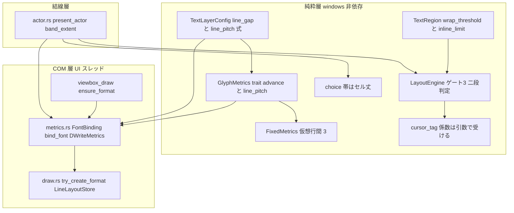
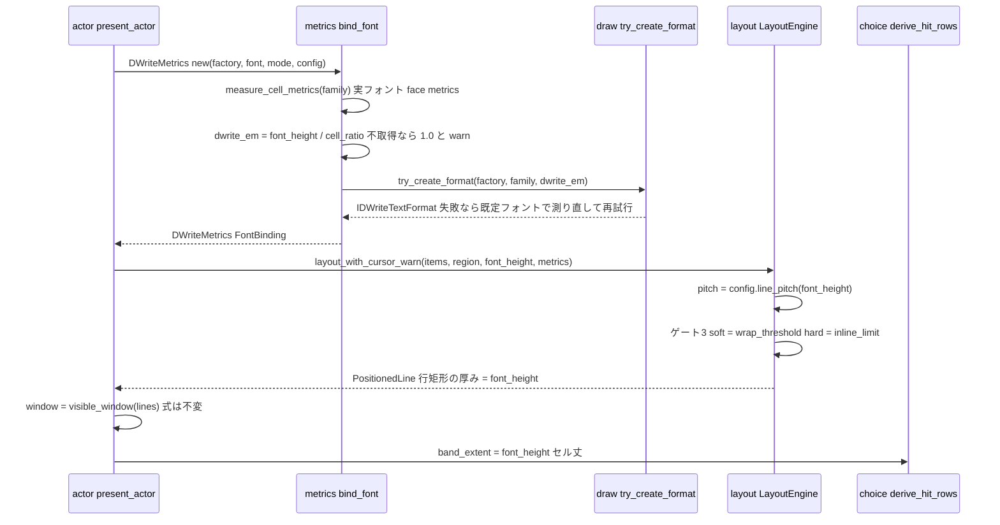
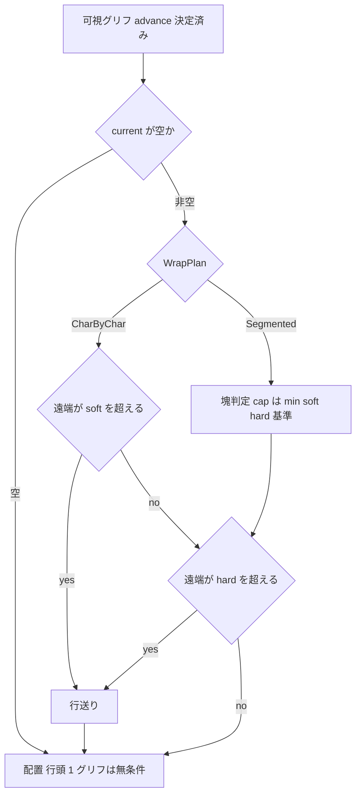

# Technical Design: areka-P0-emo-text-line-height-canon

> 作成 2026-09-05（設計フェーズ・対象ブランチ HEAD `36d1c323`＝`cursor-tag-canon` マージ済み）。file:line はすべて本ブランチで実読した値。開発者裁定（2026-09-05・要件ディスカッション議題 1／2）は `requirements.md` Requirement 6・2.1・2.3 の文言を正本とし、本書はそれを逐語で継承する。
> 正典表（§4）の数値欄のうち **【実測】** と記した欄は、実装フェーズの SSP 実測（Requirement 1・§5 の手順）で埋める。埋め方（決定手順）は §4.2 が定める。実測が候補のどれとも合わないときは Requirement 1.5 の手順で開発者裁定へ戻し、本書 §4 を改訂してから実装へ進む。

## Overview

**Purpose**: areka でゴースト `emo2` を動かす利用者が、相方側バルーン `emo2-kakukaku` のダブルクリックメニュー（`menu.pasta:15`／`:33`／`:62`）で**先頭の選択肢が描かれない**症状を、`font.height` の意味と行送りの式を SSP 実測で正典化することで直す。併せて「閉じる」の右端欠けの裁定（折返し基準と描画範囲の二段構え）を実装に落とす。

**Users**: ゴースト利用者（同じバルーン・同じ `font.height` で SSP と同じ行数・同じ文字の大きさに見える）／運用者（正典表・裁量記録・決定論テストで確定値を後から再検証できる）／下流 spec（`emo2-conformance-e2e` が走行 A〜D を採り直す・`text-decoration-canon` が `\f[height]` の意味を継承する）。

**Impact**: 行送りの源が 3 系統（係数 1.25・em 素通し・実フォント比の行ボックス丈＝`research.md` §0）に散っている現状を、**`font.height`＝セル丈（第一仮説 α）・`line_pitch = font.height + 行間`・DirectWrite へ渡す em は `font.height ÷ セル比`** の一つの源へ畳む。`draw.rs`（980/1,000 行）から計測部を `metrics.rs` へ切り出し、配置層に「描画範囲の当該辺を超えそうなら無条件折返し」を加える。あふれ判定 `visible_window` の式・`\_l` の座標解決・バルーン fixture は変えない。

### Goals

- `font.height` の意味・行送りの式・行間の既定値を SSP 実測で確定し、本書 §4 の正典表と `doc/COMPAT_ARCHITECTURE.md` §8 に記録する（1.x・2.x）。
- `emo2-kakukaku`（高さ 93px）で 3 行が収まり、行のインクが重ならず、文字の大きさとベースラインが SSP と許容幅内で一致する（3.x・5.x）。
- `\_l` の `lh`／`em` が新しい行送りへ自動追随する（4.x）。
- 折返し基準（`wordwrappoint`）と描画範囲（`validrect`）の二段構えを配置層に実装し、描画範囲の外に文字を置かない（6.x）。
- 既存 32 ファイルの決定論テストを緩めずに再導出し、新規の決定論テスト（実物 3 台本・SSP 実測値の固定・二段構え・旧式へ戻すと赤）を加える（7.x・8.x）。
- 成功基準: `cargo test -p areka-emo-text` と `cargo test --workspace` が終了コード 0・R8 の新規テストがすべて緑・R8.7 の対照が旧式で赤。

### Non-Goals

- `visible_window` の式の変更（9.1）・後戻り行のあふれ挙動（`text-decoration-canon` brief 追加登記 4・9.4）。
- `\_l` の語彙・原点・書字方向ごとの解決規則（`cursor-tag-canon` 完了実装・9.2）。
- 行末禁則文字のぶら下がり（折返しの遅延）の実装（6.9・引受先は §11.3）。
- `\f[...]` 文字装飾（`text-decoration-canon`・W13）。`draw.rs` の**全面**分割（本書は計測部の切り出しだけを先取りする）。
- バルーン fixture・kanade・pasta・sakura の改変（9.3）。実機一周の採り直し（e2e が行う・10.4）。

## Boundary Commitments

### This Spec Owns

- **意味論**: `font.height` の意味（セル丈／em）・行送りの式 `line_pitch = font.height + 行間`・行間の既定値・`1lh` の実体値・DirectWrite へ渡す em サイズの導出式・ハイライト帯／ヒット帯の寸法の源。正典表は本書 §4、裁量記録は `doc/COMPAT_ARCHITECTURE.md` §8。
- **折返しの二段構え**: 折返し基準（`wordwrappoint`＝超えたら折り返す）と描画範囲（`validrect`＝超えてはならない上限・無条件折返し）の意味論と、配置層 `layout.rs` のゲート③への実装。
- **計測部の所在**: `crates/areka-emo-text/src/metrics.rs`（新設・COM 層）＝フォント束縛（`FontBinding`）・セル比の実測・`DWriteMetrics`。
- **SSP 実測の手順と証跡**: `tools/` の道具 3 本と `verification/ssp-measurement/` の記録。
- **テストの再導出と新規テスト**: `research.md` §3.3 の 32 ファイル（設計バリデーションで 2 本追加）の期待値と、R8 の新規テスト。
- **文書の改訂**: 完了 spec `emo-text-layer` の 1 行注記・`research.md:200` の消化注記・COMPAT §8 の行追加・`balloon-canon-residue` brief の登記・`text-decoration-canon` brief の相互参照・roadmap W12 A′・e2e 記録 §13.2 の欄。

### Out of Boundary

- `LayoutEngine::visible_window`（`layout.rs:634-680`）の判定分岐（「最新行の遠端 > 境界」・最小スキップ探索・飽和）。本仕様は入力（行矩形の丈・境界）だけが変わる。
- `cursor_tag.rs`（`\_l` の解決層）と `state.rs` の語彙層 `parse_cursor_coord`。`CursorBasis.line_pitch` へ渡す値が変わるだけ（`layout.rs:553-559`）。
- 行末禁則のぶら下がり・`\f[height,N]`／`+N`／`N%` の実装（`text-decoration-canon`）・`\c[char]`／`\c[line]`（意図的非実装・COMPAT §8）。
- バルーン資産（`crates/pilot/examples/shiori-host-32/fixtures/emo2/` 配下）の是正。`wordwrappoint.x,-34` は粗さとして台帳へ登記するだけ。
- `draw.rs` の残り（`ResolvedFont`／`DirectionRecipe`／`LineLayoutStore`／比較用オラクル）の分割。`text-decoration-canon` の着手前提「`draw.rs` 分割」のうち、本仕様が先取りするのは計測部だけであることを同 brief へ登記する。

### Allowed Dependencies

- 上流: `areka-P0-cursor-tag-canon`（完了・PR#137・`CursorBasis.line_pitch` を引数で受ける形）・完了 spec `areka-P0-emo-text-layer`（`GlyphMetrics` 注入点・DPI/スケール契約）・`areka-P0-balloon-vertical-canon`（`TextRegion::resolve` の領域解決）。
- ライブラリ: `windows` 0.62.2（DirectWrite `IDWriteFontFace::GetMetrics`・`DWRITE_FONT_METRICS`）・`wintf::com::dwrite`（`DWriteFactoryExt`／`DWriteTextLayoutExt`・既存のまま。`SetLineSpacing` 相当は**追加しない**＝§9 DD-4）・`log-capture-kit`（テストのログ件数）。
- 参照実装: SSP 2.8.83（`C:\wintools\ssp\ssp.exe`・FileVersion 2.8.83.3000・2026-09-05 実読）＝受理オラクル（COMPAT §8 の先例と同じ書式で記録）。
- 禁止: 純粋層（`state`／`region`／`cursor_tag`／`layout`／`canvas`／`viewbox`／`choice`）へ `windows` 系 import を持ち込むこと（`lib.rs:170-251` の構造テスト）。`areka-emo-present` → `areka-emo-text` の逆方向 import。

### Revalidation Triggers

- `GlyphMetrics` trait の口が変わる（本書で `line_box_height` を撤去する）→ trait の実装は crate 内の 2 つ（`draw.rs:441`・`layout.rs:122`）だけで、`examples/emo-text-layer/`（`drive.rs:223,:371-376`）・`tests/viewbox_blit_spike.rs` は `DWriteMetrics` を消費するのみ。`crates/areka` 側の `TextLayerConfig::default()` 呼び出しはコンパイルのみ。
- `TextLayerConfig` のフィールドが `line_pitch_factor` → `line_gap` へ変わる → `draw_format_metrics_tests.rs:403` の直接構築・`examples/emo-text-typewriter-demo.rs:227` の注記。
- 本体側バルーン `emo2` の行容量が 3 行 → 4 行へ増える → `emo2-conformance-e2e` の走行期待（起動時の挨拶の行数）・`examples/emo-text-layer/scenario.rs` の容量前提。
- `create_text_format` が `metrics::bind_font` に吸収される → `viewbox_draw.rs:499-530`・`draw.rs:856-879`（オラクル）・`draw_format_metrics_tests.rs`（format 生成系のテストは `bind_font` 経由へ）。
- `TextRegion` に `inline_limit` が加わる → `region.rs` の `PartialEq` 導出（`refresh_actor_binding` の同値判定 `actor.rs:385` はフィールド追加でも意味不変）。
- 実測が α 以外を示した場合 → 本書 §4・§9 の改訂と実装形の再設計（R1.5・実装へ進まない）。

## Architecture

### Existing Architecture Analysis

行送りに関わる 4 つの寸法が別々の式で決まっている（`research.md` §1.1 を本ブランチで再確認）:

| 量 | 現在の式 | 定義点 | 本仕様後 |
|---|---|---|---|
| 行送りピッチ | `ceil(font.height × 1.25)`（旧式） | `state.rs:59-66`・`draw.rs:476-479`・`layout.rs:131-133` | `font.height + 行間`（`TextLayerConfig::line_pitch` の 1 点） |
| 行ボックス丈 | `font.height × (ascent+descent)/upem`（37.24） | `draw.rs:489-537` | `font.height` そのもの（em を逆算するので構成上一致） |
| 行矩形の厚み | `font.height` | `layout.rs:780-819` | 不変（＝セル丈） |
| DirectWrite の em | `font.height` 素通し | `draw.rs:313,321,340-353` | `font.height ÷ セル比`（`metrics.rs::bind_font`） |
| 帯（ハイライト／ヒット） | `clamp(box, h, max(h, pitch))` | `choice.rs:129-132`・`actor.rs:785-789` | `font.height`（セル丈＝行矩形の厚み） |

維持する既存パターン: `GlyphMetrics` trait を唯一の注入点とする層分け（`layout.rs:76-104`）・probe と描画が同一 format を使う規約（`draw.rs:23-34`）・`SetTransform(scale(k))` 一点適用（`draw.rs:48-50`・3.10 は構造で保たれる）・log-first（`.kiro/steering/logging.md`）・兄弟テストファイル規約（`structure.md:146-181`）。

### Architecture Pattern & Boundary Map



**Architecture Integration**:

- 選択パターン: 既存の三層（純粋層 → COM 層 → 結線層・`lib.rs:10-26`）を保ったまま、COM 層の計測責務を `metrics.rs` へ**集約**する（Option C＝`research.md` §6・意味論確定 → 実装追随 → テスト再導出の 3 相を同じコミット列で）。
- 依存方向（強制）: `state`（式）→ `layout`（trait・配置）→ `metrics`（COM 実装）→ `draw`／`viewbox_draw`（描画）→ `actor`（結線）。`metrics.rs` は `draw.rs` の `try_create_format` と `DirectionRecipe` を呼ぶ（`metrics → draw` の順方向 1 本）。`draw.rs` は `metrics.rs` を参照しない（`DWriteMetrics` の再輸出 `pub use crate::metrics::DWriteMetrics` だけを置く＝既存の呼び手の移行コストをゼロにする）。
- 新規コンポーネント: `metrics.rs`（計測部の集約＝R3.5「同じ一つの源」の構造的表現・`draw.rs` 残 20 行の解消）。`FontBinding`（`font.height` と DirectWrite em の 2 つの「em」を型で分ける＝§9 DD-3）。
- 撤去: `GlyphMetrics::line_box_height`・`FIXED_LINE_BOX_RATIO`・`choice::highlight_band_extent`・`viewbox_draw::expand_overhang_for_band`（セル丈解釈では帯＝行矩形の厚みになり、防御式が恒等になるため＝§9 DD-6）。
- Steering 準拠: 純粋層の `windows` 非依存（`lib.rs` 構造テストに `metrics.rs` は載せない＝COM 層）・log-first・1 ファイル 1,000 行・兄弟テストファイル・「決定論テストで固定するのは判断分岐のみ（証明済みの配線は再テストしない）」。

### Technology Stack

| Layer | Choice / Version | Role in Feature | Notes |
|---|---|---|---|
| Text（COM 層） | DirectWrite（`windows` 0.62.2）`IDWriteFontFace::GetMetrics` | セル比 `(ascent+descent)/upem` と外部レディング `lineGap/upem` の実測 | 現行 `measure_line_box_ratio`（`draw.rs:499-537`）の移設。`SetLineSpacing` は使わない |
| Text（純粋層） | Rust 2024・f32 | 行送りの式・二段折返し | 新規依存なし |
| 計測道具 | PowerShell 7（`System.Drawing`・P/Invoke `user32`／`gdi32`・`System.Net.Sockets.TcpClient`） | SSP の画面読み取り・GDI `GetTextMetricsW`・SSTP 送信 | 先例 `.kiro/specs/completed/areka-P0-scope-chain-gap/tools/measure-ssp-rects.ps1`（Per-Monitor v2 宣言・読み取り専用）を骨組みに流用 |
| 参照実装 | SSP 2.8.83.3000（`C:\wintools\ssp\`）・ghost `emo`（`shiori,emo.dll`）・balloon `emo2-kakukaku` | 受理オラクル | SSP 側 ghost は pasta 辞書を持たない（`dic/menu.pasta` 不在・2026-09-05 実読）→ 台本は SSTP で送る（§5.3） |
| テスト | `cargo test`・`log-capture-kit`・実フォント Yu Gothic UI（Windows 標準） | 決定論テスト・読み戻し | 既存 `draw_format_metrics_tests.rs:417-450` が同フォントを前提にしている |

## 4. 正典表（Requirement 2.1・本仕様の design が正本）

### 4.1 行送り・文字寸法の正典表

| 項目 | 正典 | 値（`font.height,28`・Yu Gothic UI） | 根拠 |
|---|---|---|---|
| `font.height` の意味 | **セル丈（ascent＋descent）**（第一仮説 α・実測で確定） | 28 image px | ukadoc は「高さ方向の大きさ（単位はピクセル）」のみ。GDI `lfHeight` 正値＝セル丈の慣習。**【実測】** §5 の手順で確定・確定日と証跡ファイル名をここへ記す |
| DirectWrite へ渡す em サイズ `dwrite_em` | `font.height ÷ cell_ratio(font)`・`cell_ratio = (ascent + descent) ÷ upem`（`DWRITE_FONT_METRICS`） | `28 ÷ 1.3301 = 21.05` | 構成上 `dwrite_em × cell_ratio = font.height`＝行ボックス丈がセル丈に一致する |
| 行ボックス丈 | `= font.height` | 28 | 上の帰結。ＭＳ ゴシックは比 1.0 ゆえ `dwrite_em = font.height`（既定フォントの描画は不変） |
| 行送りピッチ `line_pitch`（`1lh`） | `font.height + 行間` | `28 + 行間` | ukadoc `\_l` の `XXlh`「1lh＝1em＋行間」（`cursor-tag-canon` `requirements.md:193` 付録 A）を実体化する。`ceil` は用いない（両項とも整数 px） |
| 行間の既定値 `line_gap` | 既定設定の SSP の実測値 | **【実測】**（仮説 0） | ukadoc は沈黙。候補は §4.2 の α0／α1／α2 |
| ベースライン位置（行上端から） | `ascent ÷ upem × dwrite_em` | 22.7 | 3.4 の許容幅（実測した最小 k で ±1px）で SSP と照合 |
| `\_l` の `em` 係数 | `font.height` | `5em = 140` | `cursor_tag.rs:120-127`・現行と同じ（4.2） |
| `\_l` の `lh` 係数 | `line_pitch` | `2lh = 56 + 2×行間` | `layout.rs:553-559` → `CursorBasis.line_pitch`（4.1／4.3） |
| 比率つき改行 `\n[ratio]` | `line_pitch × ratio` | `\n[half] = 14 + 行間/2` | 意味不変（3.6） |
| ハイライト帯／ヒット帯 | `= font.height`（セル丈＝行矩形の厚み） | 28 | 帯・行矩形・行ボックスが同じ値（3.5／5.6） |
| 縦書き（`vertical_rl`／`vertical_lr`） | 同じ式を列送りへ軸読み替え | 同上 | 意味論を新設しない（3.7） |
| フォント名・`font.height` の欠落／0 | `ＭＳ ゴシック`・12px／警告＋12 | 不変 | 3.8（`draw.rs:184-231` 不変） |
| face metrics 不取得時 | `cell_ratio = 1.0`（`dwrite_em = font.height`）＋警告（フォント名・縮退値） | — | 3.9・§10 |
| 拡大率 k | レイアウトは image px・`SetTransform(scale(k))` 一点 | k で行数が変わらない | 3.10（構造不変） |
| 相方側の行容量（高さ 93） | `floor((93 − 28) ÷ line_pitch) + 1` | 行間 0 なら **3 行**（3 行目の下端 40+56+28 = 124 ≤ 133） | 1.4／5.1〜5.4 |
| 本体側の行容量（高さ 122） | 同式 | 行間 0 なら **4 行**（4 行目の下端 46+84+28 = 158 ≤ 168） | 5.5（`research.md` §4.4）・SSP の同じ撮影で確認 |

### 4.2 `font.height` の意味と行間の既定値を実測で確定する決定手順（Requirement 1.2／1.3／1.5）

候補と、Yu Gothic UI・`font.height,28` での予測値（`draw_format_metrics_tests.rs:417-450` の実測比 1.3301・ascent 比 0.8113 から計算）:

| 候補 | `font.height` の意味 | `dwrite_em` | 行ボックス丈 | ベースライン | 参照グリフのインク丈（相対） | 帰結（相方側 3 行） |
|---|---|---|---|---|---|---|
| **α**（第一仮説） | セル丈 | 21.05 | 28 | 22.7 | β の **0.75 倍** | 収まる（124 ≤ 133） |
| β（現行） | em | 28 | 37.24 | 30.2 | 1.0 | 収まらない／`line_pitch` を実測へ縮めるとインクが重なる（3.2 の裁定で不可） |

行間の源（α のとき）:

| 候補 | 行間 | ピッチ（28） | 弁別 |
|---|---|---|---|
| **α0** | 定数 0 | 28 | 実測ピッチ ÷ k − 28 = 0 |
| α1 | フォントの外部レディング `lineGap ÷ upem × dwrite_em`（整数へ丸め） | 28 + 丸め値 | 実測ピッチ ÷ k − 28 が Yu Gothic UI の外部レディング（§5.2 の GDI `tmExternalLeading`／DirectWrite `lineGap` で事前に求める）と一致 |
| α2 | SSP の既定設定の定数 c | 28 + c | 上のどちらでもない一定値（2 水準で同じ整数）。SSP の設定 UI に行間項目があればその値と照合 |
| α3 | `font.height` に比例する量 `round(font.height × r)`（r は SSP 固有の定率） | 28 + 28r | 第 2 の `font.height` 水準（S8・14／56）で `gap` が高さに比例して変わる。α2 とは h = 28 の 1 水準では区別できない（設計バリデーション 重要指摘 1） |

決定手順（実測値が揃ってから機械的に適用する。判断を挟まない）:

1. **意味の弁別（1.2）**: 参照グリフ「漢」「あ」のインク丈 `ink_ssp(k) ÷ k` を、areka 自身が同じ読み取り定義で得た 2 つの予測値 `ink_α`（em 21.05）・`ink_β`（em 28）と比べる。許容幅は 3.3 と同じ（k 1.5 で ±1px・k 2 で ±2px・image px 換算）。**2 水準の両方**で α だけが許容幅に入れば α、β だけなら β。両方入る／どちらも入らない／水準で食い違う → 手順 4。
2. **行間の確定（1.3）**: `gap(k, h) = pitch_ssp(k, h) ÷ k − h` を拡大率 2 水準 × `font.height` 2 水準以上（h = 28 の S1〜S7 と、S8 の h = 14／56）で求める。まず拡大率の両水準で同じ整数（±1 の丸め差は k 1.5 側を優先し、k 2 の値と 1 以内で整合すること）であることを確かめ、次に `font.height` の水準間で比べる: 全水準で 0 → α0、外部レディング（h ごとに `lineGap ÷ upem × dwrite_em(h)` を丸めた値）と一致 → α1、h に依らない一定値 → α2、h に比例（`gap ÷ h` が一定）→ α3。整数に収まらない／水準で食い違う／どの形にも当てはまらない → 手順 4。α2 と α3 は h = 28 の 1 水準では同じ値になり得るため、S8 を撮らずに手順 2 を閉じてはならない。
3. **裏付け（1.4・5.5・6.1）**: 確定した式で相方側 3 行（3 行目の下端 ≤ 133）が SSP の 3 行と一致し、本体側の行数が SSP の同じ撮影の行数と一致し、「閉じる」の右端が SSP でどう見えるか（欠ける／収まる／折り返す）を記録する。
4. **裁定へ回す（1.5）**: 手順 1／2 が決まらないときは、食い違いの実測値と候補それぞれの帰結（行数・文字の大きさ・インクの重なり）を表にして開発者へ回す。**推測で埋めない**。本書 §4 は裁定後に改訂する。

β が示された場合の実装形は本書の範囲外である（3.2 の裁定「係数 1.0 の応急処置は不可」により、β は「SSP はインクが重なり得る描き方をしている」ことを意味し、R1.5 の裁定事案になる）。

### 4.3 折返し基準と描画範囲の二段構え（Requirement 6・開発者裁定 2026-09-05）

| 項目 | 正典 | 根拠 |
|---|---|---|
| 折返し基準 `wordwrappoint.x`（縦書きは `.y`） | **ここを超えたら折り返す**（soft）。行末禁則文字は基準を超えてぶら下がってよい（折返しの遅延＝本仕様では未実装・§11.3） | ukadoc `wordwrappoint.x`「自動改行で折り返すX座標」・未指定は「validrect.right まで書けるものとして扱う」（`region.rs:250-258` の縮退どおり） |
| 描画範囲 `validrect` の当該遠辺（横書き `right`・縦書き `bottom`） | **ここを超えてはならない絶対上限**（hard）。文字の遠端が超えそうなら、折返し基準に関わらず無条件に折り返す | ukadoc `validrect`「テキスト描画範囲」・web の文字列折返しと同じ二段構え |
| 二段の関係 | `feed = 現在行が非空 ∧ (遠端 > soft ∨ 遠端 > hard)`。禁則が入るまでは `min(soft, hard)` と同じ出力になるが、**2 つの値と 2 つの判定を別に持つ**（丸め込み案 ⑶ を採らない・6.8） | 6.2／6.3／6.8 |
| 行頭の 1 グリフ | 折返し基準・描画範囲のどちらを超えても配置する（無限折返しの構造排除・`layout.rs:229`） | 描画範囲より広い 1 文字だけが唯一の例外。ログは出さない（正典の自然な帰結） |
| 供給面の寸法 | 描画範囲ちょうど（`actor.rs:663-671`・`canvas.rs:319-323`・`surface.rs:186-195`）のまま変えない | 6.3（描画範囲を広げる案は裁定に反する） |
| 折返し基準が描画範囲の外に解決されたバルーン | 実効の折返し位置は描画範囲の当該辺。警告ログ 1 回（バルーン名・解決値・辺の値・軸）＋`balloon-canon-residue` へ登記 | 6.3／6.7。本 fixture: `balloonk0s.txt` が `wordwrappoint.x` を上書きせず共通 `descript.txt:14` の `-34`（→254）を継ぐ。本体側 `balloons0s.txt` は `-49`（→351 ≤ 356）を自ら上書き |
| 「閉じる」（`\_l[5em,…]`＝x 164 起点・3 文字） | α の文字送り ≈ 21.05 → x 164..227.2 ≤ 240＝収まる。右端欠けは em 過大解釈（28 × 3 → 248）と同根 | 6.5。確定後も収まらなければ無条件折返し→あふれはバルーン定義側の粗さとして記録（6.6） |
| 選ばなかった案 | ⑴ 供給面を折返し基準まで広げる＝描画範囲を超えて描く（裁定に反する）⑵ 現状維持＝8px 欠ける ⑶ 折返し基準を描画範囲へ丸め込むだけ＝絶対上限の意味論と禁則の遅延を表せない | 6.8（`research.md` §5 の案 1〜5 の帰結を引く） |

## 5. SSP 実測の道具と手順（Requirement 1.1／1.6／1.7・6.1）

### 5.1 読み取りの定義（実測の前に固定する・1.7）

| 量 | 定義 |
|---|---|
| 不透明画素 | バルーン背景色（文字描画範囲内の空白部を 1 点サンプルして記録）との RGB 最大成分差 ≥ **128** の画素。アンチエイリアスの半透明はこの閾値で二値化する。areka の読み戻し（premultiplied BGRA）は α ≥ 128 を同じ意味の二値化とする |
| (d) インク丈 | 参照グリフ 1 文字の列範囲（文字送り幅ぶん）で、不透明画素の最上行から最下行まで（両端含む・行数）。参照グリフは「あ」「漢」「H」「g」 |
| (c) ベースライン位置 | 「H」の不透明画素の最下行の**次の行**（下端）を行のベースラインとし、行ボックスの上端（下の (b) の帯上端。帯が無い行は前の行のベースライン＋ピッチから逆算）からの距離 |
| (a) 行送りピッチ | 隣接する行のベースラインの差（同一基準点） |
| (b) 行ボックス丈 | 選択肢行では SSP の hover ハイライト塗り（`cursor.brush.color`＝(105,25,25)・許容 ±8）の連続行数。非選択肢行では観測不能のため「ピッチ − 行間」として記録し、(b) の直接値は選択肢行から採る |
| 単位 | 物理 px で読む（k 2＝192 DPI・k 1.5＝144 DPI）。§4.2 の弁別（行間 `gap = pitch ÷ k − 28` など）は `÷ k` して image px へ換算した値で行い、換算後の小数は捨てずに記録する |
| 許容幅 | 3.3／3.4 の定義を**当該 k の物理 px** で適用する（インク丈: k 1.5 で ±1px・k 2 で ±2px。ベースライン: 実測した最小 k で ±1px）。areka 側は同じ k で描いた読み戻しを物理 px のまま比べる（換算誤差を持ち込まない）。GDI（ヒンティング＋整数寸）と Direct2D（グレースケール AA）のラスタライズ差はこの幅に含める。幅を超えた差は「意味の違い」として扱う |

### 5.2 道具（`.kiro/specs/areka-P0-emo-text-line-height-canon/tools/`・すべて読み取り専用）

| 道具 | 役割 | 入出力 |
|---|---|---|
| `gdi-text-metrics.ps1` | 較正: `CreateFontW(lfHeight=+28)` と `(−28)`・`Yu Gothic UI` で `GetTextMetricsW` を読む | 出力 `tmHeight`／`tmAscent`／`tmDescent`／`tmInternalLeading`／`tmExternalLeading` の 2 組（JSON）。DirectWrite 側の `cell_ratio`・`lineGap` は `metrics_tests.rs` の診断テストが出力する。両者の一致／不一致を §4.2 の α1 判定と「セル丈の定義が GDI と DirectWrite で同じ数になるか」の記録に使う |
| `send-sstp.ps1` | SSP へ台本を送る（TCP 9801・`SEND SSTP/1.1`・`Charset: UTF-8`・`Sender: line-height-canon`） | 引数: 台本ファイル。SSP 側で SSTP 受信が無効なら設定で有効にし、その事実を記録する |
| `measure-ssp-text-metrics.ps1` | Per-Monitor v2 宣言 → SSP のバルーン窓（`measure-ssp-rects.ps1` と同じ列挙）→ `System.Drawing.Graphics.CopyFromScreen` で窓矩形を PNG 保存 → 文字描画範囲（`validrect × k` ＋窓原点）を走査し、§5.1 の定義で行ごとの数値を JSON へ出す | 引数: 走査対象の行数・参照グリフの列位置・hover 色。出力 `readings-k2.json`／`readings-k1_5.json`＋PNG |

### 5.3 手順（1.1・1.6）

1. **環境の記録**: SSP の版（`(Get-Item C:\wintools\ssp\ssp.exe).VersionInfo`＝2.8.83.3000）・モニタ DPI（DPI 対応プロセスから `GetDpiForMonitor`・192／144）・SSP の表示スケール設定と行間に関する設定項目の有無（設定画面のスクリーンショット）・日付。SSP の設定は既定（profile を退避して初期化した状態）で撮る。
2. **バルーンの同一化**: SSP 側 `C:\wintools\ssp\balloon\emo2-kakukaku\descript.txt` は repo fixture と **2 点で異なる**（2026-09-05 実読: SSP 側だけ `origin.x,0`／`origin.y,0` を宣言・repo 側だけ `budoux_newline,1`）。repo fixture を `C:\wintools\ssp\balloon\emo2-kakukaku-lh\` へ複製し `name` を一意（例 `kakukaku-lh (measure)`）にして、`\![change,balloon,kakukaku-lh (measure)]` で切り替える。SSTP 経由の `\![change,balloon,…]` を SSP の設定が拒む場合は SSP の右クリックメニュー（バルーン選択）で手動切替し、その事実を記録する。差分と複製の事実を記録する。
3. **較正**: `gdi-text-metrics.ps1` を実行し JSON を保存。areka 側の予測値（`ink_α`／`ink_β`・ベースライン・`cell_ratio`・`lineGap`）は `tests/ssp_metrics_parity_test.rs` の診断出力（環境変数 `AREKA_DIAG_OUT`・既存 `viewbox_draw_png_dump_tests.rs:148-151` と同じ流儀）で得て保存。
4. **台本**（すべて `send-sstp.ps1` で送る・UTF-8）:
   - S1: 相方側 3 行 `\1あ漢Hg\nあ漢Hg\nあ漢Hg\e`／S2: 相方側 4 行（4 行目があふれるか）／S3: 本体側 4 行 `\0…`（本体側の行容量・5.5）／S4: 本体側 5 行（4 行で収まり 5 行目であふれることの確認）。
   - S5／S6／S7: `menu.pasta:15`／`:33`／`:62` の選択肢行を逐語で（`\1` 前置・`emo2_fixture_e2e_test.rs:105-118` の抽出関数と同じ文字列）。S5 表示中に先頭の選択肢へマウスを載せ（`SetCursorPos`）hover 帯を撮る（(b)・5.6）。「閉じる」の右端の見え方を記録する（6.1）。
   - S8（第 2 の `font.height` 水準・重要指摘 1）: `\1\f[height,14]あ漢Hg\nあ漢Hg\f[height,56]\nあ漢Hg\nあ漢Hg\e` のように 14 と 56 の行を並べ、行ごとの `gap = pitch − height` を読む。`\f[height]` が SSP で効かない場合は `font.height,14` の複製バルーンをもう 1 つ置いて同じ 4 行を撮る。
5. **撮影と走査**: 各台本について k 2 の面と k 1.5 の面でバルーンを表示し（SSP のバルーン窓を当該モニタへ移して表示）、`measure-ssp-text-metrics.ps1` で PNG と JSON を得る。開発者がいずれかの面を 100% へ設定できる場合だけ k 1 を加える（1.1）——その場合 3.3／3.4 の「実測した最小の拡大率」は k 1 になり、許容幅 ±1px はその面の読みに適用する。
6. **判定**: §4.2 の決定手順を JSON の値に適用し、`verification/ssp-measurement/README.md` に「環境・台本・生ファイル名・読み取り値・換算値・判定」を表で残す。§4.1 の【実測】欄と `doc/COMPAT_ARCHITECTURE.md` §8 の行をこの表から転記する。
7. **定数の固定（8.3）**: 読み取り値を `tests/ssp_metrics_parity_test.rs` の定数へ書き写す（実測日・証跡ファイル名をコメントで添える）。

再測は手順 1〜5 をそのまま繰り返せる（道具は引数だけを取り、環境固有の値は JSON へ書き出す）。

## File Structure Plan

### Directory Structure

```
crates/areka-emo-text/src/
├── metrics.rs                        # 新設（COM 層）: FontBinding／bind_font／measure_cell_metrics／DWriteMetrics
├── metrics_tests.rs                  # 新設（兄弟）: セル比・em 導出・縮退・probe キャッシュ（draw_format_metrics_tests.rs から移る分＋新規）
├── layout_hard_limit_tests.rs        # 新設（兄弟）: 二段折返しの純粋層テスト（R8.4(b)・横書き＋縦書き・CharByChar＋Segmented）
├── region_inline_limit_tests.rs      # 新設（兄弟）: inline_limit の 3 方向・折返し基準が外のときの警告件数（R6.7）
├── state_cue_apply_tests.rs          # 既存（597 行）へ line_pitch の値と normalized の縮退を追加
├── state.rs                          # TextLayerConfig { line_gap }・line_pitch 式（唯一の定義点）
├── layout.rs                         # GlyphMetrics（line_box_height 撤去）・FixedMetrics（仮想行間）・ゲート③の二段判定
├── region.rs                         # TextRegion.inline_limit・折返し基準が描画範囲の外のときの警告 1 回
├── choice.rs                         # highlight_band_extent 撤去（帯＝セル丈）
├── draw.rs                           # create_text_format・DWriteMetrics・measure_line_box_ratio を metrics.rs へ移設・try_create_format を pub(crate) へ・再輸出
├── viewbox_draw.rs                   # ensure_format が bind_font 経由・expand_overhang_for_band 撤去
├── actor.rs                          # band_extent ＝ font.height・config の doc
├── canvas.rs                         # doc 注記のみ（band_extent の意味）
├── lib.rs                            # pub mod metrics
└── cursor_tag_test_support.rs        # LINE_PITCH の doc（10 + 仮想行間 3）
crates/areka-emo-text/tests/
├── kero_menu_capacity_test.rs        # 新設: 実物 emo2-kakukaku × menu.pasta 3 台本（R8.1／8.2／8.4(a)(c)／8.7・GPU 不要）
└── ssp_metrics_parity_test.rs        # 新設: SSP 実測定数との読み戻し照合・2 行のインク非重なり・帯とインク（R8.3／8.5／5.6・headless GPU）
.kiro/specs/areka-P0-emo-text-line-height-canon/
├── tools/{gdi-text-metrics,send-sstp,measure-ssp-text-metrics}.ps1
├── verification/ssp-measurement/{README.md, readings-k2.json, readings-k1_5.json, *.png}
└── verification/handoff.md           # e2e への引き渡し（R10.2・変化／不変の一覧・1 箇所）
```

### Modified Files

| ファイル（現行行数） | 変更 | 見込み行数 |
|---|---|---|
| `src/state.rs`（499） | `TextLayerConfig { line_gap: f32 }`（既定＝実測値・仮説 0.0）・`line_pitch(&self, font_height) -> f32`・`normalized()`（非有限／負 → 警告＋0）。doc `:48-61` の旧式記述を改める | ≈ 530 |
| `src/layout.rs`（890） | trait から `line_box_height` を撤去・`FIXED_LINE_BOX_RATIO` 撤去・`FIXED_LINE_GAP = 3.0` 新設・`FixedMetrics::line_pitch` が `TextLayerConfig { line_gap: FIXED_LINE_GAP }.line_pitch(h)` を返す・ゲート③（`:390-434`）に `hard = region.inline_limit()` の判定を足す・doc `:86-88,:106-111,:228` | ≈ 915 |
| `src/region.rs`（863） | `inline_limit: f32` フィールド＋`inline_limit()`・`resolve` 末尾で `wrap_threshold > inline_limit` なら `warn!`（バルーン名・値・辺・軸）・doc | ≈ 890 |
| `src/choice.rs`（550） | `highlight_band_extent` と doc `:101-132` を撤去。`derive_hit_rows` の doc を「帯＝セル丈」へ | ≈ 515 |
| `src/draw.rs`（980） | `DWriteMetrics`（`:356-492`）・`measure_line_box_ratio`（`:494-538`）・`create_text_format`（`:302-337`・既定フォント再試行）を `metrics.rs` へ移設・`try_create_format` を `pub(crate)` へ・`ensure_format`（オラクル）が `bind_font` 経由・`pub use crate::metrics::DWriteMetrics`・モジュール doc `:23-34,:368-370` | ≈ 800 |
| `src/metrics.rs`（新設） | §「Components」の COM 層ブロック | ≈ 260 |
| `src/viewbox_draw.rs`（806） | `ensure_format`（`:499-530`）が `bind_font` 経由・`expand_overhang_for_band`（`:731-745`）と呼び出し（`:240-245`）撤去・doc `:372-380,:698-700` | ≈ 780 |
| `src/actor.rs`（879） | `band_extent = resolved.font.height`（`:781-789` の呼び出しを置換）・`config` の doc `:226-227,:473`・`ActorRender.metrics` は `metrics::DWriteMetrics` | ≈ 870 |
| `src/canvas.rs`（722） | `:177` 付近の doc（帯の源）のみ | 不変 |
| `src/lib.rs`（252） | `pub mod metrics;`・層規律 doc に `metrics` を COM 層として追記（`PURE_SOURCES` には**載せない**） | ≈ 255 |
| `src/draw_format_metrics_tests.rs`（737） | `DWriteMetrics` 系のテストを `metrics_tests.rs` へ移し、残りは format／方向レシピ | ≈ 450 |
| `src/cursor_tag_test_support.rs`（106） | `LINE_PITCH = 13` の doc を「`font_height 10 + 仮想行間 3`（em と lh の係数を弁別するための仮想値）」へ（7.5） | 不変 |
| 32 ファイルの既存テスト（`research.md` §3.3） | §「Testing Strategy」の再導出台帳に従う | 各 ≤ 1,000 |
| `examples/emo-text-layer/scenario.rs`（116） | 容量前提 3 行 → 4 行・pitch 35 → 28 の doc と定数（7.3・5.5） | 不変 |
| `examples/emo-text-typewriter-demo.rs` | `:227` の注記（`line_gap`） | 不変 |
| `crates/log-capture-kit/tests/file_length_guard_test.rs` | **触らない**（8.6・9.5）。上表の見込み行数がすべて 1,000 未満であることが根拠 | — |
| `doc/COMPAT_ARCHITECTURE.md` §8 | 行を 2 本追加（§11.1） | — |
| `.kiro/specs/completed/areka-P0-emo-text-layer/design.md:725,:736`・`research.md:200` | 1 行注記のみ（2.1／2.2） | — |
| `.kiro/specs/areka-P0-balloon-canon-residue/brief.md`・`areka-P0-text-decoration-canon/brief.md`・`.kiro/steering/roadmap.md:73,:91`・`areka-P0-emo2-conformance-e2e/verification/acceptance-record.md:681-684` | §11 の登記 | — |

## System Flows

### フォント束縛から行配置・帯まで（1 actor・初回装着フレーム）



流れの決め事: `ViewboxExecutor::ensure_format` も同じ `bind_font` を呼ぶため、probe（計測）と描画の format は同一の導出から生まれる（probe 規約 `draw.rs:23-34` の保存。既存テスト `probe_advances_match_drawn_line_cluster_advances` が引き続き見張る）。`cell_ratio` の実測は actor ごと初回 1 回（`DWriteMetrics::new`）＋`ensure_format` の初回 1 回で、フレームごとには走らない。

### ゲート③ の二段判定（`layout.rs:390-434` の置き換え）



- `hard` の判定は分岐（CharByChar／塊内／塊先頭／非被覆）に依らず**配置の直前に必ず**通る（塊内で「追加判定なし」だった箇所にも hard だけは効く＝描画範囲の外に文字を置かない 6.2 を構造で保つ）。
- Segmented の `cap_rem`／`cap_full`（`layout.rs:410-411`）は `limit = soft.min(hard)` を基準に計算する（塊が hard を超える長さなら塊の前で行送りするか長大塊として文字単位へ縮退する＝既存 3 分岐の意味は不変）。
- 本体側 `emo2`（soft 351 ≤ hard 356）では、soft を超えない限り hard は超えず、soft を超えた時点で既に行送りしているので**出力は 1 画素も変わらない**（6.4・R8.4(c) で固定）。

## Requirements Traceability

| Requirement | Summary | Components | Interfaces | Flows |
|---|---|---|---|---|
| 1.1 | SSP で 2 水準（k 2／k 1.5）・4 量を実測 | 計測道具（§5.2）・`verification/ssp-measurement/` | `measure-ssp-text-metrics.ps1` の JSON | §5.3 手順 4〜5 |
| 1.2 | 意味をセル丈／em に確定 | §4.2 決定手順 1 | — | §5.3 手順 6 |
| 1.3 | `1lh = 1em + 行間`・行間の既定値 | §4.2 決定手順 2・`TextLayerConfig::line_pitch` | `line_pitch(font_height)` | — |
| 1.4 | 28 代入で 3 行が 93 に収まる | §4.1 行容量の行・`kero_menu_capacity_test.rs` | — | §5.3 手順 6 |
| 1.5 | 決まらないときは裁定へ | §4.2 決定手順 4 | — | — |
| 1.6 | 条件と証跡の所在を記録 | `verification/ssp-measurement/README.md` | — | §5.3 手順 1・6 |
| 1.7 | 読み取り定義を実測前に固定 | §5.1 | — | — |
| 2.1 | 正典表は本書・アーカイブは 1 行注記 | §4・文書コンポーネント | — | §11.1 |
| 2.2 | `research.md:200` に消化注記 | 文書コンポーネント | — | §11.1 |
| 2.3 | COMPAT §8 に 2 行 | 文書コンポーネント | — | §11.1 |
| 2.4 | 1.25 の残存を機械的に検査 | Testing Strategy「機械検査」 | `rg` 条件 | — |
| 2.5 | `cursor-tag-canon` の `lh` 定義を改訂せず実体化 | §4.1 `lh` の行・COMPAT §8 の行 | — | — |
| 3.1 | 確定式のピッチで 3 行収容 | `TextLayerConfig`・`DWriteMetrics::line_pitch` | `GlyphMetrics::line_pitch` | 束縛フロー |
| 3.2 | 行ボックス丈 ≤ ピッチ・インク非重なり | `bind_font`（em 逆算）・`ssp_metrics_parity_test.rs` | `FontBinding` | 束縛フロー |
| 3.3 | インク丈が SSP と一致（±1／±2） | `bind_font`・`ssp_metrics_parity_test.rs` | — | §5 |
| 3.4 | ベースラインが一致（±1） | 同上 | — | §5 |
| 3.5 | 4 寸法が同じ源 | `TextLayerConfig::line_pitch`・`band_extent = font.height`・撤去一覧 | — | — |
| 3.6 | `\n[ratio]` の意味不変 | `layout.rs:740-757`（不変） | — | — |
| 3.7 | 縦書きは軸読み替え | `finish_line`（不変）・`layout_hard_limit_tests.rs` の縦書き | — | — |
| 3.8 | 欠落既定値・0 の縮退不変 | `ResolvedFont::resolve`（不変） | — | — |
| 3.9 | face metrics 不取得は警告＋既定値 | `bind_font` の縮退・§Error Handling | `RatioSource::Fallback` | — |
| 3.10 | k で行数不変 | `SetTransform` 一点（不変）・`scale_invariance_test.rs` 再導出 | — | — |
| 4.1 | `N lh` ＝ ピッチ × N | `layout.rs:553-559`（値のみ変わる） | `CursorBasis.line_pitch` | — |
| 4.2 | `N em` ＝ `font.height × N`（140） | `cursor_tag.rs:120-127`（不変） | — | — |
| 4.3 | 解決規則不変・係数だけ差替え | Out of Boundary | — | — |
| 4.4 | `\_l` テストを再導出・本数維持 | 再導出台帳 A | — | — |
| 5.1〜5.4 | 3 台本で先頭可視行 0・下端 ≤ 133 | `kero_menu_capacity_test.rs` | — | — |
| 5.5 | 本体側は SSP と同じ行数（3→4） | §4.1 本体側の行・`scenario.rs`・§5.3 S3/S4・§11.2 | — | — |
| 5.6 | 帯とヒット帯が同じ源・descent が切れない | `band_extent = font.height`・`ssp_metrics_parity_test.rs` | — | 束縛フロー |
| 6.1 | 裁定の記録と SSP の見え方 | §4.3・COMPAT §8・§5.3 S5 | — | — |
| 6.2 | 二段判定 | `LayoutEngine` ゲート③ | `TextRegion::inline_limit` | ゲート③フロー |
| 6.3 | 実効折返し＝描画範囲の辺・供給面不変 | 同上・`actor.rs:663-671`（不変） | — | — |
| 6.4 | 本体側の折返し位置不変 | `kero_menu_capacity_test.rs` R8.4(c) | — | — |
| 6.5 | 「閉じる」が 240 に収まる | `kero_menu_capacity_test.rs` R8.4(a) | — | — |
| 6.6 | 収まらなければ無条件折返し・粗さとして記録 | ゲート③・§11.3 | — | — |
| 6.7 | 警告 1 回＋residue 登記 | `TextRegion::resolve` の `warn!`・§11.3 | ログ欄 §Monitoring | — |
| 6.8 | 選ばなかった案の記録 | §4.3 | — | — |
| 6.9 | 禁則遅延は未実装・引受先登記 | §11.3 | — | — |
| 7.1 | 30 ファイルの期待値を計算で再導出 | 再導出台帳 | — | — |
| 7.2 | 緩めない・本数と名前を減らさない | 再導出台帳・退役台帳 | — | — |
| 7.3 | 容量前提の導き直し | 再導出台帳 C | — | — |
| 7.4 | 画素等価比較の両側同寸・負の対照が赤 | 再導出台帳 B（`viewbox_draw_live_diff_tests`）・台帳 C（`viewbox_draw_oracle_regression_tests`） | — | — |
| 7.5 | 定数注入テストの doc | `cursor_tag_test_support.rs` | — | — |
| 7.6 | 終了コードで合否 | Testing Strategy「実行」 | — | — |
| 8.1 | 実物 3 台本・実経路で先頭可視行 0 | `kero_menu_capacity_test.rs` | — | — |
| 8.2 | 折返し 2 方式で同一 | 同上 | `WrapPlan` | — |
| 8.3 | SSP 実測定数との読み戻し照合 | `ssp_metrics_parity_test.rs` | 定数（日付・証跡名） | — |
| 8.4 | 裁定の固定 (a)(b)(c) | `kero_menu_capacity_test.rs`・`layout_hard_limit_tests.rs` | — | — |
| 8.5 | 2 行のインク非重なり | `ssp_metrics_parity_test.rs` | — | — |
| 8.6 | 兄弟ファイル or `tests/`・1,000 行・例外表不変 | File Structure Plan | — | — |
| 8.7 | 旧式へ戻すと赤 | `kero_menu_capacity_test.rs` の `LegacyPitchMetrics` | — | — |
| 9.1 | `visible_window` 不変 | Out of Boundary・再導出台帳 A | — | — |
| 9.2 | `\_l`・`\c`・比率改行・reveal 不変 | Out of Boundary | — | — |
| 9.3 | fixture・kanade・pasta・sakura 不変 | Out of Boundary | — | — |
| 9.4 | 追加登記 4 は相互参照のみ | §11.3 | — | — |
| 9.5 | `draw.rs` 唯一の進行中 spec・各 1,000 行以下 | File Structure Plan の見込み行数・§12 | — | — |
| 9.6 | 連続したコミット列 | §12 コミット順 | — | — |
| 10.1 | e2e 記録 §13.2 の欄 | §11.2 | — | — |
| 10.2 | 変化／不変の一覧を 1 箇所に | §11.2（`verification/handoff.md`） | — | — |
| 10.3 | roadmap A′ 完了・decoration brief 相互参照 | §11.3 | — | — |
| 10.4 | 実機走行は DoD 外・SSP 実測と読み戻しは DoD | §12 | — | — |

## Components and Interfaces

| Component | Domain/Layer | Intent | Req Coverage | Key Dependencies (P0/P1) | Contracts |
|---|---|---|---|---|---|
| `TextLayerConfig`＋`line_pitch` | 純粋層 `state.rs` | 行送りの式の唯一の定義点 | 1.3, 3.1, 3.5, 3.6 | — | Service |
| `GlyphMetrics`／`FixedMetrics` | 純粋層 `layout.rs` | 注入点（2 口）と決定論の代役 | 3.5, 4.4, 7.1 | `TextLayerConfig`（P0） | Service |
| `LayoutEngine` ゲート③ | 純粋層 `layout.rs` | 二段折返し | 6.2, 6.3, 6.4, 6.6, 3.7 | `TextRegion`（P0） | Service |
| `TextRegion.inline_limit`＋警告 | 純粋層 `region.rs` | 描画範囲の当該辺と粗さの警告 | 6.2, 6.3, 6.7 | `BalloonModel::name`（P1） | Service, State |
| `choice` 帯 | 純粋層 `choice.rs`／結線 `actor.rs` | 帯＝セル丈 | 3.5, 5.6 | — | Service |
| `metrics.rs`（`FontBinding`／`bind_font`／`DWriteMetrics`） | COM 層 | フォント束縛・em 導出・セル比実測・probe | 3.2, 3.3, 3.4, 3.8, 3.9 | `draw::try_create_format`＋`DirectionRecipe`（P0）・DirectWrite（P0） | Service, State |
| `draw.rs`／`viewbox_draw.rs` の追随 | COM 層 | 署名変更・撤去・再輸出 | 3.5, 9.5 | `metrics`（P0） | Service |
| 計測道具＋証跡 | 運用（spec 配下） | SSP 実測 | 1.1, 1.6, 1.7, 6.1 | SSP 2.8.83（P0） | Batch |
| 文書・引き渡し | 文書 | 正典表・裁量記録・登記 | 2.x, 6.7, 6.9, 10.x | — | — |
| 新規テスト 4 本 | テスト | R8 | 8.x, 5.x, 6.x | 実フォント Yu Gothic UI（P0）・headless GPU（P1） | — |

### 純粋層

#### `TextLayerConfig` と行送りの式（`state.rs`）

| Field | Detail |
|---|---|
| Intent | 行送りの式 `line_pitch = font_height + line_gap` を 1 か所で定義し、純粋層・COM 層の両実装がここを呼ぶ |
| Requirements | 1.3, 3.1, 3.5, 3.6, 2.4 |

**Responsibilities & Constraints**
- `line_gap` は image px の整数値（型は `f32`・演算の都合）。既定値は §4 の【実測】（第一仮説 0.0）。
- 不変条件: `line_pitch(h) ≥ h`（`line_gap ≥ 0`）。`normalized()` が非有限・負を `warn!`＋0 へ縮退する（log-first）。
- 旧 `line_pitch_factor` は撤去する（製品コードに旧式の口を残さない＝R8.7 の対照はテスト専用実装で作る）。

**Contracts**: Service [x]

```rust
/// テキスト層の調整値。行送りの式の唯一の定義点（design §4.1）。
#[derive(Clone, Copy, Debug, PartialEq)]
pub struct TextLayerConfig {
    /// 行間（image px・整数値）。`1lh = 1em + 行間` の「行間」。既定＝SSP 実測値（§4.1）。
    pub line_gap: f32,
}
impl TextLayerConfig {
    /// 行送りピッチ `font_height + line_gap`（`ceil` なし・両項とも整数 px）。
    pub fn line_pitch(&self, font_height: f32) -> f32;
    /// 非有限／負の `line_gap` を warn!＋0 へ縮退した値（呼び手は構築直後に 1 度だけ通す）。
    pub fn normalized(self) -> TextLayerConfig;
}
```
- 事前条件: `font_height > 0`（`ResolvedFont::resolve` が保証）。事後条件: 同一入力→同一出力・失敗経路なし。

**Implementation Notes**
- Integration: `FixedMetrics::line_pitch` と `DWriteMetrics::line_pitch` は**この関数以外で足し算をしない**（R3.5 の検証は「`line_pitch` の実装本体が `TextLayerConfig::line_pitch` を呼ぶだけ」を `include_str!` で見る構造テストにはせず、値の一致テストで固定する）。
- Validation: `state_cue_apply_tests.rs` に `line_pitch` の値テスト（28 → 28＋既定・10 → 10＋既定）と `normalized` の縮退テストを足す。
- Risks: α1（フォント外部レディング）が実測で選ばれた場合、`DWriteMetrics::line_pitch` は `config.line_pitch(h) + binding.external_leading` とし `FixedMetrics` は仮想定数のまま——式の定義点は依然 1 つで、**行間の値の源**だけが 2 つになる。その場合は本ブロックと §4.1 を改訂して記録する。

#### `GlyphMetrics` と `FixedMetrics`（`layout.rs:76-138`）

| Field | Detail |
|---|---|
| Intent | metrics 注入点を `advance`／`line_pitch` の 2 口へ絞り、決定論の代役に仮想行間を持たせる |
| Requirements | 3.5, 4.4, 7.1, 7.2, 8.7 |

**Contracts**: Service [x]

```rust
pub trait GlyphMetrics {
    /// グリフの行内送り幅（image px）。
    fn advance(&self, ch: char, font_height: f32) -> f32;
    /// 行送りピッチ（image px）。正典 `font_height + 行間`（`TextLayerConfig::line_pitch`）。
    fn line_pitch(&self, font_height: f32) -> f32;
}
/// 構造テスト用の決定論 metrics。全角＝`font_height`・半角＝`font_height / 2`・
/// ピッチ＝`font_height + FIXED_LINE_GAP`。
pub struct FixedMetrics;
/// `FixedMetrics` の仮想行間（正典値ではない）。`em` と `lh` の係数を弁別するために非零にする。
pub const FIXED_LINE_GAP: f32 = 3.0;
```

**Implementation Notes**
- Integration: `line_box_height` は撤去（唯一の消費 `actor.rs:787` が `font.height` になる）。`FixedMetrics` は `TextLayerConfig { line_gap: FIXED_LINE_GAP }.line_pitch(h)` を返す。
- Validation: 仮想行間 3 は `font_height 10 → 13`・`12 → 15` で旧式 `ceil(h × 1.25)` と**数値が一致する**（算術上の偶然）。よって純粋層の既存テストの期待値は font 10／12 の範囲では変わらず、再導出は「式の doc を改め、値が新式から出ることを確認する」作業になる（再導出台帳 A）。`\_l` の `lh`（13）と `em`（10）の弁別も保たれる（`cursor_tag_test_support.rs:48` の意図）。
- Risks: 「仮想行間が旧式の隠れ蓑」と読まれること——対策として `FixedMetrics` の doc に「正典値ではない・弁別のための仮想値・正典値の検証は `metrics_tests.rs`／`kero_menu_capacity_test.rs`／`ssp_metrics_parity_test.rs` が実フォントで行う」と明記し、R8.7 の対照は仮想値でなく実 fixture 経路で組む。

#### `LayoutEngine` ゲート③の二段判定（`layout.rs:386-446`）

| Field | Detail |
|---|---|
| Intent | 折返し基準（soft）と描画範囲の当該辺（hard）を別の値・別の判定として持ち、hard を配置直前に必ず通す |
| Requirements | 6.2, 6.3, 6.4, 6.6, 3.7, 8.4 |

**Contracts**: Service [x]（既存 `layout`／`layout_with_cursor_warn` の署名は不変）

- `let soft = region.wrap_threshold(); let hard = region.inline_limit();`（`layout.rs:315` の隣）。
- CharByChar: `feed = !current.is_empty() && (inline_pos + advance > soft || inline_pos + advance > hard)`。
- Segmented: `limit = soft.min(hard)` で `cap_rem`／`cap_full` を計算（`:410-411`）。塊内（`seg_remaining > 0`）も含め、配置直前に `!current.is_empty() && inline_pos + advance > hard` を最後に評価する（true なら行送りし `seg_remaining` は塊の残数として保つ＝塊は次行へ続く）。
- 縦書きは `inline_limit` が `bottom` になるだけ（`region.rs` が軸を解決済み・`layout` に mode 分岐を足さない・3.7）。
- 事後条件: どのグリフの遠端も `hard` を超えない（例外＝行頭 1 グリフ）。soft ≤ hard の入力では本仕様前後で出力がビット一致する（6.4）。

**Implementation Notes**
- Validation: `layout_hard_limit_tests.rs`（R8.4(b)）——横書き／縦書き × CharByChar／Segmented × {soft > hard, soft ≤ hard, 行頭超過 1 グリフ}。soft ≤ hard の入力は既存 `layout_wrap_tests.rs`／`layout_segmented_tests.rs` が引き続き固定する。
- Risks: 塊内で hard が発火すると `SegmentPlan` の「塊は途中分割されない」不変条件（`layout.rs:340-342`）に例外ができる——soft > hard の粗いバルーン定義でだけ起きる縮退で、`debug!` を 1 件残す（分岐の理由が読める形に）。

#### `TextRegion.inline_limit` と警告（`region.rs:172-316`）

| Field | Detail |
|---|---|
| Intent | 描画範囲の当該遠辺を `resolve` で軸解決して保持し、折返し基準がその外にあるバルーンを 1 回だけ警告する |
| Requirements | 6.2, 6.3, 6.7 |

**Contracts**: Service [x] / State [x]

```rust
impl TextRegion {
    /// 描画範囲の行内軸の遠辺（横書き＝`right`・縦書き＝`bottom`・image px）＝無条件折返しの上限。
    pub fn inline_limit(&self) -> f32;
}
```
- `resolve` の末尾: `if wrap_threshold > inline_limit { warn!(balloon = model.name().unwrap_or("(名前なし)"), axis = "x"|"y", wrap_threshold, inline_limit, "折返し基準が描画範囲の外に解決された——実効の折返し位置は描画範囲の辺になる（バルーン定義側の粗さ）") }`。
- 一回化: `resolve` は actor 登録（`actor.rs:313`）と k 再追従（`:383`）でしか呼ばれない（フレームごとには呼ばれない）ので、「バルーンの読込（装着）1 回につき 1 回」が構造で成り立つ。k 再追従（DPI 変化）でも 1 回ずつ出るが、これは再解決＝再読込として要件 6.7 の「読み込んだとき」に含める。持続 guard は持たない。
- State: `PartialEq` 導出に `inline_limit` が加わる（`refresh_actor_binding` の同値判定は同じ model からの再解決なので意味不変）。

**Implementation Notes**
- Validation: `region_vertical_canon_tests.rs` の隣へ `inline_limit` の 3 方向テストと警告件数テスト（`log-capture-kit::count_levels`・`emo2-kakukaku` 相当で 1 件・本体側で 0 件）を足す。
- Risks: `model.name()` が `None` のバルーン（`descript.txt` に `name` 無し）→ プレースホルダ文字列で記録する（ログ無し失敗にしない）。

#### 帯＝セル丈（`choice.rs`・`actor.rs:781-789`）

| Field | Detail |
|---|---|
| Intent | ハイライト帯／ヒット帯のブロック軸寸を `font.height`（セル丈）にし、行矩形・行ボックスと同じ源にする |
| Requirements | 3.5, 5.6 |

- `actor.rs`: `let band_extent = resolved.font.height;`（doc: 帯＝セル丈＝行矩形の厚み。descent はセル丈の内側にある）。`decorate_canvas`／`derive_hit_rows` の `band_extent` 引数と `ChoiceLineContent.band_extent` は**据え置く**（下流の形を変えない・将来の帯拡張の口）。
- `highlight_band_extent`（`choice.rs:101-132`）と `expand_overhang_for_band`（`viewbox_draw.rs:731-745`）は撤去。ダーティ矩形は `GetOverhangMetrics` の実測（`draw.rs:658-675`）で従来どおりインクのはみ出しを含む。
- Validation: `ssp_metrics_parity_test.rs` で「閉じる」「もどる」の hover 塗り帯の下端 ≥ 文字インクの下端（実フォント）を固定（5.6）。`choice_tests.rs` の帯 clamp テストは退役台帳へ。

### COM 層

#### `metrics.rs`——`FontBinding`／`bind_font`／`DWriteMetrics`（新設）

| Field | Detail |
|---|---|
| Intent | `font.height`（正典 px）から DirectWrite の em を導く唯一の場所。probe 由来の実測 `GlyphMetrics` 実装の住処 |
| Requirements | 3.2, 3.3, 3.4, 3.8, 3.9, 3.5, 9.5 |

**Responsibilities & Constraints**
- 「2 つの em」を型で分ける（§9 DD-3）: `font_height`＝ukadoc の `1em`＝セル丈（`\_l` の係数）／`dwrite_em`＝`CreateTextFormat` へ渡す値。混同を防ぐため `FontBinding` の外へ `dwrite_em` を裸の `f32` で流さない（`try_create_format` の引数名も `dwrite_em`）。
- セル比の実測は format 生成の**前**に family 名で行う（現行 `draw.rs:499-537` は format 生成後に format から辿る——順序を入れ替える）。既定フォント再試行（`warn!`→`ＭＳ ゴシック`→なお失敗は `error!`＋`Device`・現行 `draw.rs:313-334`）は **`bind_font` が所有**し、再試行後の family でセル比と `dwrite_em` を測り直してから format を作る（束縛した family と測った family が食い違う経路を作らない）。`draw.rs` の `create_text_format` は `bind_font` に吸収され、`try_create_format`（1 回試行・`:340-354`）だけを `pub(crate)` で残す。
- UI スレッド専有（COM 層規律）。失敗は log-first。

**Dependencies**
- Inbound: `actor.rs::present_actor`（`DWriteMetrics::new`・P0）・`viewbox_draw.rs::ensure_format`／`draw.rs::ensure_format`（`bind_font`・P0）・`examples/emo-text-layer/drive.rs:223`・`tests/viewbox_blit_spike.rs`（`DWriteMetrics`・P1）。
- Outbound: `draw::try_create_format`・`draw::DirectionRecipe`（P0）・`state::TextLayerConfig::line_pitch`（P0）。
- External: DirectWrite `IDWriteFontCollection::FindFamilyName`／`IDWriteFontFace::GetMetrics`（P0）。

**Contracts**: Service [x] / State [x]

```rust
/// セル比の出所（縮退の有無を型で残す・3.9）。
#[derive(Clone, Copy, Debug, PartialEq, Eq)]
pub enum RatioSource { Measured, Fallback }

/// 解決済みフォントを DirectWrite へ束縛した結果（2 つの em を型で分ける・design DD-3）。
#[derive(Clone, Debug)]
pub struct FontBinding {
    /// 描画・probe 共用 format（`dwrite_em` で生成済み・方向レシピ焼き込み済み）。
    pub format: IDWriteTextFormat,
    /// 正典 px（セル丈＝ukadoc の 1em）。`ResolvedFont::height` そのもの。
    pub font_height: f32,
    /// DirectWrite の em サイズ ＝ `font_height / cell_ratio`。
    pub dwrite_em: f32,
    /// `(ascent + descent) / upem`（実測）または 1.0（縮退）。
    pub cell_ratio: f32,
    /// 外部レディング `lineGap / upem × dwrite_em`（image px・整数へ丸め・α1 のときだけ line_pitch が読む）。
    pub external_leading: f32,
    pub ratio_source: RatioSource,
}

/// family 名の実フォント face metrics（`None`＝family 不在・upem 0 等）。
pub fn measure_cell_metrics(factory: &IDWriteFactory2, family: &str) -> Option<CellMetrics>;
pub struct CellMetrics { pub cell_ratio: f32, pub line_gap_ratio: f32, pub ascent_ratio: f32 }

/// em の導出（純関数・テスト容易）。`cell_ratio <= 0` は 1.0 として扱う。
pub fn derive_dwrite_em(font_height: f32, cell_ratio: f32) -> f32;

/// 解決済みフォント＋方向から束縛を作る（既定フォント再試行を含む・失敗は log-first）。
pub fn bind_font(factory: &IDWriteFactory2, font: &ResolvedFont, mode: WritingMode)
    -> Result<FontBinding, TextLayerError>;

pub struct DWriteMetrics { /* factory, binding: FontBinding, config: TextLayerConfig, cache */ }
impl DWriteMetrics {
    pub fn new(factory: &IDWriteFactory2, font: &ResolvedFont, mode: WritingMode, config: &TextLayerConfig)
        -> Result<DWriteMetrics, TextLayerError>;
    pub fn binding(&self) -> &FontBinding;
}
impl GlyphMetrics for DWriteMetrics {
    /// probe（`binding.format`）の cluster width 合計。失敗時の縮退値は `dwrite_em`（全角）／`dwrite_em / 2`（半角）。
    fn advance(&self, ch: char, font_height: f32) -> f32;
    /// `config.line_pitch(font_height)`（α1 確定時のみ `+ binding.external_leading`）。
    fn line_pitch(&self, font_height: f32) -> f32;
}
```
- 事前条件: `font.height > 0`。事後条件: `dwrite_em × cell_ratio == font_height`（Measured 時・f32 誤差内）。`Fallback` 時は `dwrite_em == font_height`。
- 不変条件: 同じ `(name, height, mode)` → 同じ `FontBinding` の数値（決定論。`FormatKey`＝`(name, height bits, mode)` が引き続きキャッシュ鍵として妥当）。

**Implementation Notes**
- Integration: `draw.rs` に `pub use crate::metrics::DWriteMetrics;` を置き、`examples`／`tests`／`actor.rs` の `use crate::draw::DWriteMetrics` を壊さない。`viewbox_draw.rs::ensure_format` と `draw.rs::ensure_format`（オラクル）は `bind_font(...)?.format` を使う。
- Validation: `metrics_tests.rs`——(1) ＭＳ ゴシックの `cell_ratio == 1.0`・`dwrite_em == 12`（既定フォントの描画不変） (2) Yu Gothic UI の `cell_ratio ≈ 1.3301`・`dwrite_em(28) ≈ 21.05`・`dwrite_em × cell_ratio ≈ 28` (3) family 不在で `Fallback`＋warn 1 件（フォント名・縮退値を含む） (4) `line_pitch(28) == 28 + 既定行間`・`(10) == 10 + 既定行間` (5) probe キャッシュ（既存 `:380-391` 相当の移設） (6) advance が `dwrite_em` 基準（全角「あ」≈ 21.05）。
- Risks: DirectWrite の `ascent`／`descent` が OS/2 win metrics か typo metrics かは GDI の `tmAscent`／`tmDescent` と §5.2 で照合する（一致しなければ「セル丈の定義が GDI と DirectWrite で違う」として R1.5 の材料にする）。

#### `draw.rs`／`viewbox_draw.rs` の追随

- `create_text_format`（`draw.rs:308-337`）は撤去し `metrics::bind_font` に吸収する（既定フォント再試行込み）。`try_create_format(factory, family, dwrite_em)`（`:340-354`）は `pub(crate)` に格上げして `bind_font` から呼ぶ。`DirectionRecipe::apply` は不変。
- `LineLayoutStore::line_layout`（`draw.rs:601-637`）: 行 TextLayout の箱＝行内軸 `PROBE_MAX_EXTENT`・行送り軸 `font_height`（セル丈）——**不変**。em が縮んだぶんベースラインは箱の内側（22.7）に落ちる。
- `DrawExecutor`（`#[cfg(test)]` オラクル）と `ViewboxExecutor` の `ensure_format` は `bind_font` を呼ぶ（両描画実行が同一導出＝byte 等価の構造前提 RN5 を保つ）。
- `viewbox_draw.rs:240-245`: `expand_overhang_for_band` の呼び出しを外し `measured` をそのまま使う。

### 結線層

#### `actor.rs` の追随

- `present_actor`（`:718`）: `DWriteMetrics::new(factory, &resolved.font, resolved.mode, &config)`——`config` は `runtime.config`（`TextLayerRuntime::new` で `normalized()` 済み）。
- `:781-789`: `let band_extent = resolved.font.height;`。
- doc `:226-227`／`:473`: 「調整値（行間）」へ。

### 計測道具と証跡（運用）

**Contracts**: Batch [x]
- Trigger: 実装フェーズの最初のタスク（意味論の確定）で 1 回。再測は任意。
- Input / validation: SSP 2.8.83・既定 profile・複製バルーン・台本 S1〜S7（§5.3）。DPI 対応プロセスで実行していることを `GetDpiForMonitor` の出力で自己検査する（非対応だと全モニタ 96 と読める——記憶 `effective-dpi-must-be-read-from-dpi-aware-process`）。
- Output / destination: `verification/ssp-measurement/`（README・JSON・PNG）。
- Idempotency & recovery: 読み取り専用。SSP の設定を変えた場合（SSTP 有効化・バルーン切替）は README に記す。

### 文書・引き渡し（§11 参照）

## Data Models

### Domain Model

- **正典値**（値オブジェクト）: `font.height`（セル丈・image px）・`line_gap`（image px・整数）・`line_pitch = font.height + line_gap`・`dwrite_em = font.height / cell_ratio`。不変条件: `line_pitch ≥ font.height`・`dwrite_em × cell_ratio = font.height`。
- **`FontBinding`**（COM 層の値オブジェクト・actor ごと 1 つ・`ActorRender.metrics` が所有）: 上記の導出結果と format。`ratio_source` が縮退の有無を保つ。
- **`TextRegion`**（純粋層・不変値）: 既存 7 フィールド＋`inline_limit`。`wrap_threshold`（soft）と `inline_limit`（hard）は独立に読める（丸め込まない）。
- **SSP 実測定数**（テストの値オブジェクト・`ssp_metrics_parity_test.rs`）: `SSP_PITCH_K2`／`SSP_PITCH_K1_5`／`SSP_INK_KAN_K2`／…（物理 px・u32）と `SSP_VERSION`／`MEASURED_ON`／`EVIDENCE_FILES`（コメント）。areka の読み戻しは同じ k で描いて `÷ k` せずに物理 px で比べる（換算誤差を持ち込まない）。

### Logical Data Model（ログ欄）

| ログ | レベル | 欄 | 発生点 |
|---|---|---|---|
| face metrics 不取得 | `warn!` | `font`・`font_height`・`fallback_em`（＝`font_height`）・`fallback_ratio = 1.0` | `metrics::bind_font` |
| 折返し基準が描画範囲の外 | `warn!`（読込 1 回） | `balloon`・`axis`・`wrap_threshold`・`inline_limit` | `TextRegion::resolve` |
| `line_gap` の縮退 | `warn!` | `line_gap`・`fallback = 0` | `TextLayerConfig::normalized` |
| 塊内で hard が発火 | `debug!` | `inline_pos`・`advance`・`hard` | `LayoutEngine` ゲート③ |
| format 生成失敗 | `warn!`→`error!` | 既存（`draw.rs:316-331`） | `metrics::bind_font`（旧 `create_text_format` の規律を移設） |

## Error Handling

### Error Strategy

log-first（`.kiro/steering/logging.md`）: 失敗は `error!`＋`Err`、縮退は `warn!`＋継続。panic は用いない。本仕様が新設する縮退はすべて **警告つき** で、ログ無しに別の寸法へ落ちる経路を作らない（3.9）。

### Error Categories and Responses

| 事象 | 分類 | 応答 |
|---|---|---|
| フォント family が見つからない／`upem == 0`／`GetMetrics` 不能 | 縮退 | `cell_ratio = 1.0`・`dwrite_em = font_height`・`RatioSource::Fallback`・`warn!`（フォント名・縮退値）。format は与えられた名前で生成（DirectWrite 自身のフォールバックに任せる＝現行と同じ）。**Yu Gothic UI で縮退が起きると行が 37px になり再びあふれる**——この事実を warn 文言に含め、`metrics_tests.rs` (3) で件数と欄を固定する |
| `TextLayerConfig.line_gap` が非有限／負 | 縮退 | `warn!`＋0 |
| `CreateTextFormat` 失敗 | 縮退→失敗 | 既定フォント再試行→`Device` エラー（既存・不変） |
| `wrap_threshold > inline_limit` | 正常系の粗さ | `warn!` 1 回・配置は hard で折り返す（表示は欠けない） |
| 塊が hard を超える | 縮退 | 塊の途中で行送り・`debug!` |
| 実測が候補のどれとも合わない | 仕様の停止 | R1.5: 実装へ進まず裁定へ（コードは触らない） |

### Monitoring

上記ログ欄（Logical Data Model）を `log-capture-kit` で件数固定する。既存 `count_levels` の流儀（`region.rs:428-431`・`draw_test_support.rs:32-36`）を踏襲する。

## Testing Strategy

### 実行（7.6・10.4）

- `cargo test -p areka-emo-text` と `cargo test --workspace` を**終了コードで**判定する（`| tail` 等で隠さない）。
- DoD に含めるもの: SSP 実測（§5）・実フォント読み戻し（`ssp_metrics_parity_test.rs`）・R8 の新規テスト全緑・R8.7 の対照・R2.4 の機械検査 0 件・`file_length_guard_test.rs` 緑（例外表不変）。含めないもの: 実機一周（e2e）。

### 再導出台帳（7.1〜7.5・`research.md` §3.3 の 32 ファイルを 4 分類）

| 分類 | 対象 | 作業 |
|---|---|---|
| **A 純粋層・`FixedMetrics`**（font 10／12 で値不変） | `layout_wrap_tests`・`layout_segmented_tests`・`layout_visible_window_tests`・`layout_cursor_*_tests`（7 本）・`cursor_tag_tests`／`cursor_tag_resolve_tests`／`cursor_tag_test_support`・`state_cue_apply_tests`・`state_reveal_tests`・`choice_tests`（帯以外）・`viewbox_axis_tests`・`viewbox_dirty_tests`・`viewbox_plan_commit_tests`・`actor_tests`・`actor_choice_contract_tests`・`actor_scale_refresh_tests`・`tests/pipeline_test.rs` | 期待値は新式 `h + 3` から再計算して同値を確認。doc の「`ceil(×1.25)`」を「`font_height + 仮想行間 3`」へ。`fixed_metrics_line_pitch_ceils_fractional_values`（`layout_wrap_tests.rs:24`）は意図（`ceil`）が退役するため名前と本文を「仮想行間の加算」へ差し替え（台帳に記録）。`layout_cursor_overflow_tests.rs:113-166` は値不変（行矩形の厚み＝`font_height` は不変） |
| **B COM 層・実フォント**（値が変わる） | `draw_format_metrics_tests`→`metrics_tests`（`line_pitch(12)=15→12`・`line_box_height` 系は退役／セル比へ）・`viewbox_draw_frame_render_tests`・`viewbox_draw_live_diff_tests`（P: 25→20・15→12・容量式 `2P+F ≤ block ≤ 3P+F` の面寸を再導出。負の対照 `live_diff_detects_injected_divergence` が赤のまま＝7.4）・`viewbox_draw_choice_hover_tests`（帯 35→28）・`viewbox_draw_png_dump_tests`（pitch グリッド）・`tests/draw_readback_test.rs`（PITCH 15→12）・`tests/viewbox_blit_spike.rs`（N 15→12）・`tests/scale_invariance_test.rs`（font 40: pitch 50→43〔FixedMetrics〕・`block_offset −50→−43`・行数不変の検査は新式でも成立）・`tests/emo2_fixture_e2e_test.rs`（本体側 pitch 35→28・hover 帯 y 範囲）・`tests/choice_fixture_test.rs` | 新式で計算し `assert_eq` のまま更新。既定フォント（比 1.0）を使うテストではグリフ描画が不変なのでピッチ由来の差だけが出る。Yu Gothic UI を使う `tests/emo2_fixture_e2e_test.rs`・`tests/choice_fixture_test.rs`・`draw_format_metrics_tests.rs:417-450` は**文字送りも 28 → 21.05 に変わる**ので、折返し位置・x 座標の期待値も再計算する |
| **C 容量前提**（7.3） | `tests/viewbox_scroll_test.rs:60-80`（`PITCH 12`・`FILL_LINES 10`＝行 i の下端 `12i+12 ≤ 120`・`const _: () = assert!` を保つ）・`viewbox_draw_live_diff_tests.rs:455,476`（面寸を `2P+F ≤ block ≤ 3P+F` へ導き直す）・`examples/emo-text-layer/scenario.rs:9-30`（横書き容量 3→**4** 行・pitch 35→28・`LINE3` の「3 行ちょうど」前提を 4 行目へ・`OVERFLOW_LINES 9` は据え置き〔4 行を確実に超える〕・`EXPOSURE_BAND_DRAW_BOUND` は実測で再確認）・`src/draw_oracle_tests.rs:430`（ＭＳ ゴシック 10・pitch 13→10 で行下端が 10/20/30/40 となり `validrect.bottom 40` で 4 行目があふれなくなる → `validrect.bottom` を 35 等へ導き直して「4 行目があふれる」前提を保つ）・`src/viewbox_draw_oracle_regression_tests.rs:11,:112`（font 28・pitch 35→28 で「行間 28..35」の領域が消える → 行 1 セル 0..28・行 2 セル 28..56 の寸法で行境界の欠け診断が意味を持つよう前提コメントごと書き直す。R7.4 の「両側とも同じ寸法」の確認はこのファイルで行う） | 前提が「緑のまま意味を失う」ことを防ぐため、各テストの前提コメントを新しい容量で書き直す |
| **D 退役**（7.2 の個別記録） | `choice_tests.rs` の `highlight_band_extent` clamp 系・`draw_format_metrics_tests.rs:417-450`（`line_box_height` が em を超える事実）・`viewbox_draw_*` の `expand_overhang_for_band` 系・`dwrite_metrics_line_pitch_follows_config_canon` の「係数 2.0」分岐（`:400-410`） | 根拠: セル丈解釈では行ボックス丈 ≡ `font.height`・帯 ≡ 行矩形となり、検証対象（「行ボックスが em を超える」「帯をピッチで頭打ち」）が仕様判断で存在しなくなった。各テストの代替（セル比・`dwrite_em`・帯とインクの包含）を B／新規で用意してから外す。退役の一覧は `tasks.md` の該当タスクと本書のこの表に残す。帯＝セル丈は「グリフのインクがフォントの descent の内側にある」ことに依拠するため、この前提は R5.6 の実フォント読み戻し（「閉じる」「もどる」）で固定する |

分類の入口は「§3.3 の一覧」ではなく **crate 全域の検索**とする: 着手時に `rg -l "1\.25|1\.33|37\.24|line_pitch|line_box|band|pitch" crates/areka-emo-text/src crates/areka-emo-text/tests crates/areka-emo-text/examples` の全ヒットを台帳へ載せ、§3.3 の一覧に無いものを追加してから確定する（本書の分類は設計時点の読み。設計バリデーション（重要指摘 2）で `draw_oracle_tests.rs`・`viewbox_draw_oracle_regression_tests.rs` の 2 本が漏れていたことが判明し、台帳 C へ加えた＝計 32 ファイル）。また `TextRegion::resolve` に加わる警告 1 件は行送り非依存だが、`region.rs` の in-file テスト（`:439-794`・kero 2 層マージ `:536`）・`tests/shipped_fixture_region_test.rs`・`cursor_tag_test_support.rs:95` のうちログ件数を固定しているものを赤にし得るので、「警告 1 件の追加による再導出」として台帳に 1 行置く。

### 新規の決定論テスト（8.x）

| ファイル | テスト | 要件 |
|---|---|---|
| `tests/kero_menu_capacity_test.rs`（GPU 不要・DirectWrite factory のみ。先頭で `binding().ratio_source == Measured` を確かめ、Yu Gothic UI 不在の環境では縮退のまま緑にならず赤で止まる） | 実 `descript.txt`＋`balloonk0s.txt`（`shipped_fixture_region_test.rs:189-230` の読み込みを流用）→ 288×203 で解決（(24,40)-(240,133)・soft 254・hard 240）→ `menu.pasta:15`／`:33`／`:62` の本文抽出（`emo2_fixture_e2e_test.rs:105-118` の抽出関数を 3 台本へ一般化）→ 実 `parse`→`compile`→`TextLayerState`→`LayoutEngine`（`DWriteMetrics`・Yu Gothic UI）→ `visible_window`。3 台本 × {CharByChar, Segmented} で `first_visible_line == 0`・各選択肢行の `rect.bottom ≤ 133`・結果同一 | 8.1, 8.2, 5.1〜5.4 |
| 同上 | (a) 「閉じる」「もどる」の全グリフ遠端 ≤ 240・行数が増えない（折り返されない） | 8.4(a), 6.5 |
| 同上 | (c) 本体側 `balloons0s.txt`（soft 351 ≤ hard 356）で、閾値を超える長い行の折返し位置が hard 無しの参照実装（テスト内で soft だけを見る対照関数）と一致 | 8.4(c), 6.4 |
| 同上 | `LegacyPitchMetrics`（テスト専用 `GlyphMetrics`・`ceil(h × 1.25)`）を注入すると `menu.pasta:15` で `first_visible_line == 1` になる（判定が生きている対照） | 8.7 |
| `src/layout_hard_limit_tests.rs` | (b) 純粋層固定寸: soft > hard の領域に hard を超える長さの文字列を置くと soft に達する前に折り返され、全グリフの遠端 ≤ hard（横書き・縦書き rl/lr・CharByChar・Segmented）。行頭 1 グリフの例外。soft ≤ hard では既存出力とビット一致 | 8.4(b), 6.2, 6.3, 3.7 |
| `tests/ssp_metrics_parity_test.rs`（headless GPU・`draw_readback_test.rs` の土台を流用） | SSP 実測定数（k 2／k 1.5・日付・証跡名つき）と、同 k で描いた areka の読み戻し（§5.1 と同じ二値化）のピッチ・インク丈・ベースラインを 3.3／3.4 の許容幅で比較 | 8.3, 3.3, 3.4, 1.4 |
| 同上 | 2 行を並べ、行 1 のインク下端 < 行 2 のインク上端（重ならない）・各行のインクが `[top, top + font.height)` に収まる | 8.5, 3.2 |
| 同上 | 選択肢行の hover 塗り帯（`band_extent = font.height`）が「閉じる」「もどる」のインク下端を含む | 5.6 |
| `src/metrics_tests.rs` | セル比・`dwrite_em`・縮退・probe キャッシュ（上記 COM 層ブロック） | 3.2, 3.3, 3.8, 3.9 |
| `src/region_inline_limit_tests.rs` | `inline_limit` 3 方向・警告 1 件（相方側相当）／0 件（本体側相当） | 6.7 |
| `src/state_cue_apply_tests.rs`（追加） | `line_pitch` の値・`normalized` の縮退 | 1.3, 3.1 |

置き場: 兄弟ファイル `<stem>_<theme>_tests.rs` または `tests/`（8.6）。各ファイル 1,000 行以下。

### 機械検査（2.4）

```
rg -n "1\.25" crates/areka-emo-text/src crates/areka-emo-text/tests crates/areka-emo-text/examples doc/COMPAT_ARCHITECTURE.md .kiro/specs/areka-P0-emo-text-line-height-canon/design.md \
  | rg "line_pitch|行送り|係数" | rg -v "旧式|本仕様で改訂|履歴"
```
期待 0 件。除外（R2.4）: DPI 拡大率 k の `1.25`（`region.rs:710-731`・`tests/scale_invariance_test.rs`・`crates/areka/src/placement/`）は第 2 段の絞り込みで自然に落ちる。第 3 段の除外語（`旧式|本仕様で改訂|履歴`）は現行式を述べる行に偶然含まれ得るため、第 2 段までの残り行を一覧に出して目視で「すべて履歴か注記つき引用である」ことを確認し、その一覧を DoD の証跡に添える。

## 9. 設計判断（研究記録 `research.md` §11 の要約・本書が正本）

| # | 判断 | 内容と根拠 |
|---|---|---|
| DD-1 | 第一仮説 α（セル丈） | GDI `lfHeight` 正値の慣習・相方側 3 行が式から収まる・インク丈 1 量で β と弁別できる（`research.md` §4.1）。確定は §4.2 の手順 |
| DD-2 | `line_pitch = font.height + line_gap`・`ceil` なし | 両項とも整数 px。`\n[ratio]` の端数は従来どおり。`TextLayerConfig` のフィールドの形（定数 `line_gap` か比率 `line_gap_ratio` か）は §4.2 手順 2 の実測（α2／α3 の弁別）後に確定する。α3 なら `line_pitch = font.height + round(font.height × r)` とし、定義点が 1 つであることは変わらない |
| DD-3 | 「2 つの em」を `FontBinding { font_height, dwrite_em }` で分ける | 名前の取り違えを型で塞ぐ。`try_create_format` の引数名も `dwrite_em` |
| DD-4 | `SetLineSpacing` は使わない（研究 A2 不採用） | 行 TextLayout は 1 行ずつ箱 `font_height` で組む（`draw.rs:614-620`）ので A1 だけで 1 行＝セル丈に収まる。wintf ラッパの拡張も不要 |
| DD-5 | `line_box_height` を trait から撤去 | セル丈解釈では恒等（＝`font_height`）。実装が 2 つとも定数関数になる口は残さない（Simplification） |
| DD-6 | 帯＝`font.height`・`highlight_band_extent`／`expand_overhang_for_band` 撤去 | 帯・行矩形・行ボックスが同値＝R3.5。descent はセル丈の内側（5.6 は読み戻しで固定） |
| DD-7 | `FixedMetrics` に仮想行間 3 | `em`／`lh` の弁別を保つ・font 10／12 の既存期待値が新式でも同値（再導出の摩擦を減らす）。正典値ではないことを doc に明記 |
| DD-8 | 二段判定を 2 値・2 判定で持つ（`min` へ畳まない） | 6.8 ⑶ の却下理由（絶対上限の意味論・禁則の遅延の余地）。hard は配置直前に必ず通す |
| DD-9 | 警告 1 回は `TextRegion::resolve` | 呼び出しが読込時のみ（`actor.rs:313,:383`）＝持続 guard 不要。`BalloonModel::name()`（`model.rs:379`）でバルーン名を載せられる |
| DD-10 | 縮退比は 1.0＋警告 | 最も無害（ＭＳ ゴシックと同じ）。Yu Gothic UI で縮退が起きれば再びあふれる事実を文言に含める |
| DD-11 | R8.7 の対照はテスト専用 `LegacyPitchMetrics` | 製品コードに旧式の口を残さない（`research.md` §10 B の方針） |
| DD-12 | `metrics.rs` 切り出し（Option B を Option C の相 2 で） | `draw.rs` 残 20 行・R3.5 の構造表現・decoration の分割前提と継ぎ目を合わせる（先取り分を brief へ登記） |
| DD-13 | SSP 側は repo fixture の複製バルーンで測る | SSP 側 descript は origin 宣言と `budoux_newline` で異なる（2026-09-05 実読）。同一定義で測らないと origin の差が混ざる |
| DD-14 | 台本は SSTP で送る | SSP 側 ghost `emo` は `emo.dll`（pasta 辞書なし）。ゴースト非依存で逐語の台本を出せる |
| DD-15 | 禁則遅延の引受先は `balloon-canon-residue` | 折返し規則はバルーン文字正典の残件であり、`\f` 装飾の spec より台帳の性格に合う。decoration brief には相互参照だけを置く（要件 6.9 の候補から変更・根拠を §11.3 に記す） |

## 10. Performance & Scalability

- セル比の実測は actor ごと初回 1 回（`DWriteMetrics::new`）＋`ensure_format` の初回 1 回。フレーム経路には足さない（`recompose-budget` の 1 コマ予算に影響しない）。
- ゲート③の hard 判定は比較 1 回／グリフの追加。Segmented の塊内でも 1 比較。

## 11. 文書の改訂と引き渡し

### 11.1 正典表・裁量記録（2.1〜2.3・2.5）

- `doc/COMPAT_ARCHITECTURE.md` §8 に 2 行（COMPAT の先例書式「実機確定（日付）＝参照実装 SSP を受理オラクルとした」に揃える）:
  1. **`font.height` の意味・行送りの式・行間の既定**——裁量: セル丈／`line_pitch = font.height + 行間`／既定【実測】。根拠: SSP 2.8.83 の実測（k 2・k 1.5・証跡パス）。出典: 本仕様。「完了 spec `areka-P0-emo-text-layer` の design 補足正準（`:725`）と DPI/スケール契約表（`:736`）を上書きする」を明記。`cursor-tag-canon` の `lh` 定義（`requirements.md:63`）は改訂せず本行が実体化する旨を添える（2.5）。
  2. **折返し基準 `wordwrappoint` と描画範囲 `validrect` の二段構え**——裁量: §4.3。根拠: 開発者裁定 2026-09-05・ukadoc の記述・SSP の見え方（§5.3 S5）。出典: 本仕様。
- 完了 spec `areka-P0-emo-text-layer/design.md:725`（補足正準「行送りピッチ」）と `:736`（「フォントサイズの写像」）の直後に 1 行「> 本行は `areka-P0-emo-text-line-height-canon`（2026-09）で改訂。正本は `doc/COMPAT_ARCHITECTURE.md` §8 と同仕様の design.md §4」。表の中身は書き換えない。
- 同 `research.md:200` のリスク行末に「（消化: `areka-P0-emo-text-line-height-canon`・2026-09-XX）」。

### 11.2 e2e への引き渡し（10.1・10.2・5.5）

- `.kiro/specs/areka-P0-emo2-conformance-e2e/verification/acceptance-record.md:681-684` の #1／#2「引受先が実在することの確認」欄に本仕様のディレクトリと確認日を記入。
- `verification/handoff.md`（本仕様配下・1 箇所）: 利用者から見える変化（行送り 35→28＋行間・文字の大きさ em 28→21.05・「閉じる」が欠けない・本体側の行容量 3→4 行＝起動時の挨拶の行数が変わり得る）と変わらないもの（`\_l` の語彙・あふれ判定の式・本体側の表示位置・既定フォントの描画）を表にする。

### 11.3 登記（6.7・6.9・9.4・10.3）

- `.kiro/specs/areka-P0-balloon-canon-residue/brief.md` に本仕様からの追加登記節（番号は着地時に末尾採番を再確認・現在の末尾は 13）: **項目 N**「`wordwrappoint` が描画範囲の外に解決されるバルーン定義（`emo2-kakukaku` の `balloonk0s.txt` が `wordwrappoint.x` を上書きしない）——areka は hard で折り返し警告 1 回・fixture は改変しない」／**項目 N+1**「行末禁則文字のぶら下がり（折返し基準を超えてよいが描画範囲は超えない・本仕様は未実装）」。
- `.kiro/specs/areka-P0-text-decoration-canon/brief.md` に相互参照 3 点: (1) 追加登記 4 は本仕様が引き受けなかった（式不変・値の再導出のみ）(2) `\f[height,N]`／`+N`／`N%` は本仕様の `font.height` 意味論（セル丈）を継承する (3) `draw.rs` の計測部は本仕様が `metrics.rs` へ先取り分割した（残りの分割は decoration の前提のまま）。`measure_cell_metrics`／`derive_dwrite_em` は family 単位の純関数なので、W13 で `\f[name]`／`\f[height]` が per-run になったときも family ごとに `cell_ratio` を引いてそのまま使える。禁則遅延の引受先を residue にした旨も一言。
- `.kiro/steering/roadmap.md:73`（挙動バグ行）を「✅ 解決」・`:91`（W12 A′）を完了へ。

## 12. コミット順（9.6・9.5）

同じブランチの連続したコミット列で、正典表と実装がずれた中間状態を残さない:

1. `tools/`＋`verification/ssp-measurement/`（実測の道具と証跡）→ 本書 §4 の【実測】欄と COMPAT §8・アーカイブ注記・`research.md:200`（意味論の確定＝文書だけ）。
2. `state.rs`（式）＋`metrics.rs` 新設＋`draw.rs`／`viewbox_draw.rs`／`actor.rs`／`layout.rs`（trait・`FixedMetrics`）＋`choice.rs`（帯）＋`lib.rs`＝実装の追随（この時点で既存テストは赤でよいが、次のコミットまでに緑にする）。
3. 再導出台帳 A〜D の更新（緑）。
4. `region.rs`（`inline_limit`・警告）＋`layout.rs` ゲート③（二段判定）＋`layout_hard_limit_tests.rs`。
5. 新規テスト `kero_menu_capacity_test.rs`・`ssp_metrics_parity_test.rs`・`metrics_tests.rs`（R8 全緑・R8.7 対照）。
6. 登記（residue／decoration brief・roadmap・e2e 記録・`handoff.md`）・R2.4 の機械検査・ワークスペース全体テスト（終了コード）。

着手時の確認（9.5）: `git log main..HEAD -- crates/areka-emo-text/src/draw.rs` で本ブランチ以外の進行中 spec が `draw.rs` を触っていないこと（`text-decoration-canon` は W13・未着手）。

## Supporting References

- 候補ごとの予測値の算出根拠: `draw_format_metrics_tests.rs:417-450`（Yu Gothic UI upem 2048・ascent 2210・descent 514 → 比 1.3301・ascent 比 0.8113）。`dwrite_em = 28 / 1.3301 = 21.05`・ベースライン `0.8113 × 28 = 22.7`。
- GDI の `LOGFONT.lfHeight`: 正値＝セル丈（`tmHeight`＝ascent＋descent）に一致させる／負値＝文字丈（`tmHeight − tmInternalLeading`）に一致させる（`research.md` §2）。§5.2 の `gdi-text-metrics.ps1` が両符号の `TEXTMETRIC` を出す。
- ukadoc（2026-09-05 に MCP で確認）: `font.height`「使用するフォントの高さ方向の大きさ（単位はピクセル：ポイントではない）」既定 12／`wordwrappoint.x`「自動改行で折り返すX座標。…未指定の場合はvalidrect.rightまで書けるものとして扱う」／`wordwrappoint.y`（2.8.80）「未指定の場合はvalidrect.bottomまで」／`validrect.*`「テキスト描画範囲」／`\_l` の `XXlh`「1lh＝1em＋行間」／`\![change,balloon,バルーン名]`。
- 先例の道具: `.kiro/specs/completed/areka-P0-scope-chain-gap/tools/measure-ssp-rects.ps1`（Per-Monitor v2・`EnumWindows`・読み取り専用）。
- 現行の症状の決定論再現値: `research.md` §1.3（相方側 3 行目 y110..138 > 133・`visible_window = {1, −35}`・「閉じる」x164..248）。
