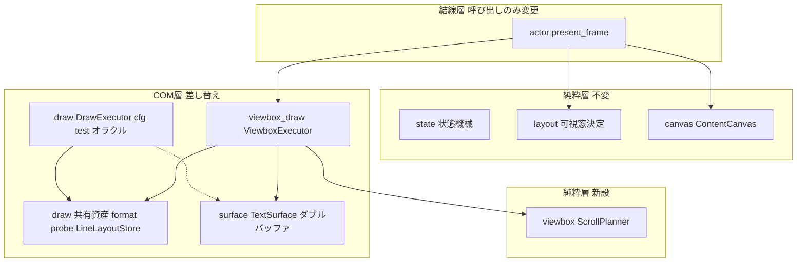
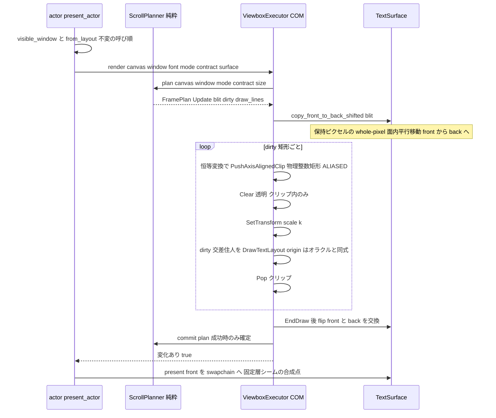

# 技術設計書 — areka-P0-emo-text-viewbox

## Overview

**Purpose**: 本ユニットは、emo-text-layer ✅ が実装したバルーンテキスト層のスクロール実現方式を、**全域ビットマップ再描画**（validrect サイズの描画面へ可視窓を毎フレーム描き直す）から **viewbox 方式（ダーティ矩形スクロール）** へ差し替える。古典 Win32 の `ScrollDC`／`InvalidateRect`／`WM_PAINT` の規律を写し、固定 validrect 物理寸の描画面（ダブルバッファ）の中で確定済みピクセルを whole-pixel 面内 blit で平行移動し、ダーティ領域（現在描画中の行 ∪ スクロール露出帯）だけを D2D `DrawTextLayout` で（再）描画する。

**Users**: バルーンテキスト表示（typewriter 進行・行スクロール）の描画実行として emo が消費する。下流は M2 スクロール演出（f32 連続量シームの消費者）・`\_b --option=fixed` 固定層増分（差し込み点の消費者）・choice-render（描画面座標契約の消費者）。

**Impact**: 改変は `areka-emo-text` の COM 層（`draw.rs`／`surface.rs`＋新設 2 モジュール）と結線層 `actor.rs` の描画呼び出し結線に閉じる。純粋層（state/writing/region/layout/canvas）・`sink.rs`・emo-present 消費経路（`TextSlotView`／`register_actor_view`／`present_frame` シグネチャ）は不変。差し替えの受け入れ基準は**再描画方式との pixel 等価**（k=1.0 byte 一致・同一プロセス live-diff が主檻）＝見た目を一切変えない純粋等価移行（wuc-migration と同型）。

### Goals

- スクロール（可視窓のみ移動）時に確定 content の文字（グリフ）再描画を発生させない——描画は面内 blit ＋露出帯のみ（R3）。
- content 変化（Text 追記／NewLine／typewriter 進行）時の D2D 描画をダーティ矩形に限定する（R3）。
- 描画面を validrect 物理寸に固定（ダブルバッファ 2 枚）し、talk の長さによらずメモリを固定上限に保つ（R1/R4）。
- 差し替え後の表示結果が再描画方式と pixel 等価（k=1.0 byte 一致・横書き/縦書き両方・スクロール前後・Clear 後）（R6）。
- スクロール位置 f32（連続量）と whole-pixel 量子化の分離＝M2 補間・慣性のシーム（R8）。固定層差し込み点の構造予約（R7）。

### Non-Goals

- スクロール状態機械・可視窓決定・レイアウト・折返し・typewriter 進行・writing_mode 解決の改変（emo-text-layer の責務・不変で消費）。
- オフセット補間・慣性の実挙動（M2。滑らか・crisp 両立には真位置再描画が要る点を含め M2 の設計事項）。
- `\_b` 固定層の実装（画像読込・実描画）——差し込み点の予約のみ。
- choice-render のクリック可能範囲の実導出——描画面座標系の契約点を残すのみ。
- sink の main 結線・バルーン枠描画（emo-present）・surface 合成（emo-compose）・wintf の改変。

## Boundary Commitments

### This Spec Owns

- `areka-emo-text` の**描画実行**: `DrawExecutor::render`（全域再描画）を「保持ピクセルの whole-pixel 面内 blit ＋ ダーティ矩形の D2D 描画」へ置換する実行部（新設 `ViewboxExecutor`）とそのスクロール計画（新設純粋モジュール `viewbox`）。
- **供給面の内部構造**: `TextSurface` のダブルバッファ化（front/back 2 枚の `source_tex`・面内 blit・flip・present/read_back の front 一本化）。外部契約（`attach` シグネチャ・donor 装着・`GraphicsCommandList` 不挿入・物理 px 直接）は不変。
- **スクロール位置の内部表現**: f32 連続量（真位置）＋ whole-pixel 量子化（committed）＋小数アキュムレータ（k≠1.0 の格子吸着）——M2 補間シームと choice-render 座標契約点の所有者。
- **固定層差し込み点の構造予約**（型シーム＋present 合成点の命名——実挙動なし）。
- **pixel 等価の検証檻**: 再描画方式 `DrawExecutor` を `#[cfg(test)]` 独立オラクルとして保持し、同一プロセス・同一ターゲット型で両方式を走らせる live-diff。

### Out of Boundary

- 純粋層 5 モジュール（`state.rs`／`writing.rs`／`region.rs`／`layout.rs`／`canvas.rs`）と `sink.rs`——**1 行も改変しない**（R2.4/R9.1）。`ContentCanvas`（バッキングストア）・`visible_window`（唯一のスクロール決定点）は不変で消費する。
- emo-present／emo-compose／sakura／balloon-parse／wintf の既存契約（R9.4/R9.5）。wintf の `ClipShape`／`clip_sync_system` は M1 の必須依存にしない（封じ込め＝描画面寸・ダーティ限定＝D2D 矩形クリップ）。
- emo2-boot が消費する経路（sink／装着 API／`present_frame`）の再定義（R9.2——本ユニットの改変面と非交差）。
- M2 補間の実挙動・`\_b` 固定層の実挙動・choice-render のクリック範囲実導出。

### Allowed Dependencies

- **emo-text-layer の分離シーム**（上流・不変消費）: `LayoutEngine::visible_window` → `VisibleWindow { first_visible_line, block_offset }`／`ContentCanvas::from_layout`／`ScaleContract`／軸読み替え正準表。
- **wintf COM ヘルパ**（既存依存の継続）: `create_composition_swap_chain`／`CompositorInteropExt`／`D2D1DeviceContextExt`（`clear`/`set_transform`/`draw_text_layout`）／`DWriteFactoryExt`。wintf 本体は改変しない。
- **windows-rs 直接呼び出し**（COM 層限定・既存規律）: D3D11 `CopyResource`／`CopySubresourceRegion`（面内 blit）・D2D `PushAxisAlignedClip`/`PopAxisAlignedClip`（ダーティ限定）。**新規外部クレート依存なし**。
- 依存方向（強制・lib.rs 檻の延長）: `viewbox（純粋）← viewbox_draw（COM）← actor（結線）`。純粋層に `windows` import が現れたらレビューエラー（`viewbox.rs` を lib.rs の構造檻へ追加する）。

### Revalidation Triggers

- `VisibleWindow`／`ContentCanvas`／`ScaleContract` の形が変わる（上流 emo-text-layer 側の破壊的変更）→ 本設計の写像式・指紋差分の再検証。
- `TextSurface::attach` の外部契約（donor 装着・物理 px 直接・`GraphicsCommandList` 不挿入）を変える変更 → emo-present／emo2-boot の再検証。
- スクロール位置の f32／quantize 分離（`ScrollState`）の形を変える変更 → M2 演出・choice-render の再検証。
- 固定層差し込み点（present 合成点）の位置・形を変える変更 → `\_b` 増分の再検証。
- k=1.0 恒常の現行契約が破れる（実スケール運用開始）→ R6.4 述語と手動確認手順の再検証。

## Architecture

### Existing Architecture Analysis

- **分離シームは納品済み**（emo-text-layer の設計意図）: 可視窓決定 `LayoutEngine::visible_window`（layout.rs:255・純粋）／内容キャンバス `ContentCanvas`（canvas.rs:200・全行保持・可視窓非適用＝バッキングストア）／描画実行 `DrawExecutor::render`（draw.rs:523・全域再描画）。結線点は actor.rs:448–457（`visible_window` → `ContentCanvas::from_layout` → `render` → `present`）。本ユニットは render＋供給面の中身だけを置換し、呼び順は保つ。
- **現行 render の構造**: 透明 clear → `SetTransform(scale(k))` 一点 → `first_visible_line` 以降の住人の origin に `block_offset` を軸加算して `DrawTextLayout`。行 TextLayout キャッシュ（`line_cache`・行 index キー・内容不変なら再利用）は既設——本ユニットはこれを共有資産として抽出する。
- **現行 TextSurface**: 単一 `source_tex`（validrect 物理寸・DEFAULT・RENDER_TARGET・premultiplied 透明初期化）→ `present`＝`CopyResource(backbuffer, source_tex)`→`Present(0)`・`read_back`＝staging 経由。ダブルバッファ化はこの構造の内部拡張（外部契約不変）。
- **技術的負債はなし**——emo-text-layer が本ユニットを名指しで移行先と明記した計画的シームの消費。

### Architecture Pattern & Boundary Map

パターン: **バッキングストア分離のダーティ矩形スクロール**（`WM_PAINT` 規律）。アプリ側の真のモデル＝`ContentCanvas`（全行・純粋）、画面側の保持機構＝描画面ピクセル＋blit。両者を `ScrollPlanner`（純粋・計画）と `ViewboxExecutor`（COM・実行）が仲介する。



**Architecture Integration**:

- Selected pattern: ダーティ矩形スクロール（要件ディスカッション §8 確定の案C）。growable content 面＋visual offset（旧 Option A/B/C）は棄却済み——端数 translate の再サンプルが ClearType 位相を崩すため（research.md §8）。
- Domain boundaries: 計画（純粋・決定論・headless テスト可）と実行（COM・UI スレッド専有）を分離。計画は `windows` 非依存で檻化する。
- Existing patterns preserved: log-first（`error!`＋`Err`・panic 禁止）／スケール一点適用（`SetTransform(scale(k))` のみ）／2 空間モデル（image px と物理 px の一点変換）／donor 装着・`GraphicsCommandList` 不挿入。
- New components rationale: `ScrollPlanner`＝blit 量・ダーティ導出を決定論檻に載せるため純粋分離。`ViewboxExecutor`＝オラクル（旧 `DrawExecutor`）と並存させ byte 比較するため別型。
- Steering compliance: Rust 2024・tokio 禁止・UI スレッド固定・thiserror 構造化エラー・新規依存なし。

### Technology Stack

| Layer | Choice / Version | Role in Feature | Notes |
|-------|------------------|-----------------|-------|
| 面内 blit | D3D11 `CopyResource` / `CopySubresourceRegion`（windows 0.62.2） | front→back の保持ピクセル平行移動（重なり安全） | 既存 `present`/`read_back` と同じ immediate context。新規依存なし |
| ダーティ描画 | Direct2D `PushAxisAlignedClip`（ALIASED）＋ `DrawTextLayout` | ダーティ矩形限定の（再）描画 | クリップは**恒等変換下で物理整数矩形**を push（格子厳密）。`Clear` はクリップを尊重する |
| テキスト | DirectWrite（既存 `create_text_format`／行 TextLayout 経路） | ダーティ行のレイアウト生成・オラクルと完全共有 | byte 等価の前提（RN5 解決） |
| 提示/読戻 | 自前 swapchain＋staging（既存構造の front 一本化） | `present`＝front→backbuffer・`read_back`＝front | flip model の backbuffer 直 Map 不可の既存制約に同じ |

## File Structure Plan

### Directory Structure

```
crates/areka-emo-text/
├── src/
│   ├── viewbox.rs          # 新規・純粋層: ScrollPlanner（f32 真位置・whole-pixel 量子化・
│   │                       #   小数アキュムレータ・ダーティ導出・軸写像・FramePlan・plan/commit 二相）
│   ├── viewbox_draw.rs     # 新規・COM 層: ViewboxExecutor（blit 指示・ダーティ D2D 描画・
│   │                       #   DrawStats・FullClear 実行）＋ in-source live-diff 檻
│   ├── draw.rs             # 変更: 共有資産（ResolvedFont/DirectionRecipe/create_text_format/
│   │                       #   DWriteMetrics）は現状維持。行 TextLayout キャッシュを LineLayoutStore
│   │                       #   として抽出（両 executor 共有）。DrawExecutor は #[cfg(test)] 独立オラクル化
│   ├── surface.rs          # 変更: TextSurface ダブルバッファ化（sources[2]+front index・
│   │                       #   copy_front_to_back_shifted・back_tex・flip・FixedOverlaySeam）
│   ├── actor.rs            # 変更: ActorRender の executor を ViewboxExecutor へ・apply_cue Clear →
│   │                       #   request_clear・present_actor は render の変化フラグで present
│   ├── lib.rs              # 変更: viewbox/viewbox_draw モジュール宣言・純粋層構造檻へ viewbox.rs 追加
│   ├── state.rs / writing.rs / region.rs / layout.rs / canvas.rs / sink.rs   # 不変（1 行も触らない）
├── examples/
│   └── emo-text-layer.rs   # 変更: スクロール経路は本番経路差し替えで自動的に viewbox 化。
│                           #   DrawStats による再描画レス checkpoint を追加（単一 PASS/FAIL 維持）
└── tests/
    ├── draw_readback_test.rs      # 不変で green（R2.5/R6 の述語檻・本番＝viewbox 経路を通る）
    ├── scale_invariance_test.rs   # 不変で green（R6.4 のスケール不変資産）
    ├── attach_wiring_test.rs / pipeline_test.rs / vertical_fixture_test.rs  # 不変で green
    └── viewbox_scroll_test.rs     # 新規: 再描画レス カウント檻・軸切替・Clear リセットの統合述語
```

### Modified Files（変更理由の要約）

- `src/draw.rs` — `line_layout`（行 TextLayout 取得・キャッシュ・生成カウント）を `LineLayoutStore` 型へ抽出し、`DrawExecutor` と `ViewboxExecutor` が**同一経路**で行レイアウトを得る（byte 等価の構造前提）。`DrawExecutor`／`create_target_bitmap` を `#[cfg(test)]` へ移し「比較専用の独立オラクル」と明記（除去は後続の別決断）。
- `src/surface.rs` — `source_tex: ID3D11Texture2D` → `sources: [ID3D11Texture2D; 2]`＋`front: usize`。`present`/`read_back` は front を読む（不変条件: front＝最新確定面）。`copy_front_to_back_shifted`／`back_tex`／`flip` を `pub(crate)` 追加。`FixedOverlaySeam` 型シームを追加し `present` の合成点を命名。attach の外部契約は不変。
- `src/actor.rs` — `ActorRender.executor: DrawExecutor` → `ViewboxExecutor`。`apply_cue` の Clear 適用点は `executor.request_clear()` へ写像。`present_actor` は `render` の戻り値（変化有無）に応じて `present` する。呼び順（`visible_window` → `from_layout` → render → present）は不変。
- `src/lib.rs` — モジュール宣言追加・純粋層構造檻（`pure_layer_modules_have_no_windows_imports`）の対象へ `viewbox.rs` を追加。
- `examples/emo-text-layer.rs` — 既存 7 checkpoint は不変（本番経路差し替えで viewbox を検証することになる）。スクロール checkpoint に DrawStats 檻（可視窓のみ移動区間で `draw_text_layout_calls` 増分がダーティ交差行数以下）を追加。

## System Flows

変化フレーム（scroll あり）の描画列。gating: `ScrollPlanner::plan` が `NoChange` を返したフレームは blit・描画・present をすべて行わない（描画呼び出し 0 の檻の対象）。



フロー上の決定:

- **plan/commit の二相**: `plan` は計画のみ・COM 実行が成功したときだけ `commit`（committed 状態と行指紋を確定）。デバイス失敗フレームは未 commit のまま次フレームで再計画＝再試行安全（現行の「当該フレーム skip・次フレーム再試行」規律を保つ）。
- **back の全被覆**: back は「blit の写域 ∪ ダーティ矩形」で毎回全被覆される（blit は面から露出帯を除いた全域を写す。blit=0 のときは `CopyResource` 全面コピー）。2 フレーム前の残像が漏れる経路は構造的にない。
- **FullClear**: Clear cue 受領後の次 render は back を全域透明 Clear→flip→present（描画 0 件）。`LineLayoutStore` と planner 状態はこの時点で初期化済み。

## Requirements Traceability

| Requirement | Summary | Components | Interfaces / Flows |
|-------------|---------|------------|--------------------|
| 1.1 | validrect 単一描画面・面内スクロール（2 層 visual 不使用） | TextSurface, ViewboxExecutor | `copy_front_to_back_shifted`・System Flows |
| 1.2 | whole-pixel blit＋ダブルバッファ | TextSurface, ScrollPlanner | `FramePlan::Update.blit`（整数）・sources[2] |
| 1.3 | スクロール中の面寸不変 | TextSurface | 面寸は attach 時確定・再確保 API なし |
| 1.4 | 封じ込め＝面寸・ダーティ＝D2D 矩形クリップ | ViewboxExecutor | `PushAxisAlignedClip`（ALIASED・物理整数） |
| 1.5 | 物理寸＝DPI/スケール契約に一致 | actor（attach 経路・不変） | `ScaleContract::physical_extent`（既存式） |
| 2.1 | `visible_window` を唯一の決定点として不変消費 | actor | 呼び順不変（actor.rs:448–457） |
| 2.2 | `ContentCanvas` をバッキングストアとして不変消費 | ScrollPlanner, ViewboxExecutor | `plan(canvas,…)`・ダーティ描画元 |
| 2.3 | `{first_visible_line, block_offset}`→blit 量＋ダーティ位置の写像 | ScrollPlanner | 写像正準式（Data Models） |
| 2.4 | 上流（状態機械・レイアウト等）不改変 | Boundary | 純粋層 5＋sink 無変更（File Structure Plan） |
| 2.5 | 純粋層の既存テスト資産が改変なしに green | Testing Strategy | 統合テスト 5 本無改変 |
| 3.1 | 確定 content＝面ピクセル保持・D2D 再描画なし | ViewboxExecutor, TextSurface | blit 保持機構 |
| 3.2 | 可視窓のみ移動→blit＋露出帯のみ | ScrollPlanner | `FramePlan::Update { dirty=露出帯 }` |
| 3.3 | content 伸長→ダーティ矩形のみ描画 | ScrollPlanner | 行指紋差分（変化行 ∪ 露出帯） |
| 3.4 | D2D コマンド維持・別キャッシュ不設 | ViewboxExecutor | command list／グリフ bitmap キャッシュなし（決定） |
| 3.5 | 決定論の描画呼び出しカウント | DrawStats | `draw_text_layout_calls` 等（常時コンパイル） |
| 3.6 | M1 ステップスクロール（補間なし） | ScrollPlanner | committed の即時追従 |
| 4.1 | 固定寸ダブルバッファ・成長なし | TextSurface | 再確保経路の不存在 |
| 4.2 | あふれ行は面外へ・必要時 canvas から再描画 | ScrollPlanner | 露出帯描画は canvas 由来（DD12） |
| 4.3 | Clear→全域透明・状態/行キャッシュ初期化 | ViewboxExecutor | `request_clear`→`FramePlan::FullClear` |
| 4.4 | メモリ固定上限（上限値管理不要） | TextSurface | 構造（固定 2 枚＋staging） |
| 4.5 | スクロール・リセット前後の pixel 等価 | live-diff 檻 | Testing Strategy（Integration #1） |
| 5.1 | 横書き＝縦 blit・下端露出 | ScrollPlanner | 軸写像表（Data Models） |
| 5.2 | 縦書き＝横 blit | ScrollPlanner | 同上 |
| 5.3 | 軸規約は正準表と一致・独自規則を発明しない | ScrollPlanner | `block_offset` の符号を素通し（軸単位ベクトルのみ切替） |
| 5.4 | 面寸は writing_mode によらず一定 | TextSurface | attach 寸は mode 非依存（既存） |
| 6.1 | k=1.0 byte 一致・同一プロセス live-diff 主檻 | DrawExecutor（オラクル）, ViewboxExecutor | in-source `#[cfg(test)]` live-diff |
| 6.2 | あふれ前後で等価 | live-diff 檻 | スクロール発火シナリオ比較 |
| 6.3 | 横書き・縦書き両方で等価 | live-diff 檻 | 両 mode パラメタライズ |
| 6.4 | k≠1.0＝小数アキュムレータ・≤0.5px・述語＋手動 | ScrollPlanner | `ScrollState`（\|committed−pos\|≤0.5 恒真檻）＋scale_invariance 資産 |
| 6.5 | Clear 後の等価（全域透明） | live-diff 檻 | FullClear 比較 |
| 7.1 | 固定層差し込み点の予約（blit 対象外の別合成層） | FixedOverlaySeam, TextSurface | `present` の合成点命名 |
| 7.2 | M1 実挙動なし（構造予約のみ） | FixedOverlaySeam | zero-sized `#[non_exhaustive]` |
| 7.3 | 増設時に blit 構成を再構築不要 | TextSurface | scroll 面（sources）と合成点（present）の分離 |
| 7.4 | 予約が pixel 等価に影響しない | FixedOverlaySeam | read_back は front のみ（present 合成点の外） |
| 8.1 | M1 ステップ＝golden 等価 | ScrollPlanner, live-diff | R6.1 と同檻 |
| 8.2 | f32 内部表現と whole-pixel 写像の分離 | ScrollState | `pos: f32`／`committed: i32` |
| 8.3 | 補間過程と可視窓決定の分離シーム | ScrollPlanner | `plan` 入力＝`VisibleWindow`・`pos` は独立更新可能な形 |
| 9.1 | emo-text-layer の公開契約・テスト資産不変 | Boundary | 純粋層無改変＋統合テスト無改変 green |
| 9.2 | emo2-boot 消費経路の非再定義 | actor, sink | `EmoTextSink`／`register_actor_view`／`present_frame` シグネチャ不変 |
| 9.3 | choice-render 向け描画面座標契約点 | ScrollState, viewbox docs | `scroll_state()` アクセサ＋座標写像式の文書化 |
| 9.4 | wintf クリップ機構非依存・wintf 不改変 | ViewboxExecutor | D2D `PushAxisAlignedClip`（wintf primitive 不使用） |
| 9.5 | additive・既存契約の非再定義 | Boundary | 変更ファイル一覧（COM 層＋結線点のみ） |
| 10.1 | example のスクロール経路差し替え・注入時刻駆動 | example | 本番経路差し替え＋既存注入時刻シナリオ維持 |
| 10.2 | golden と pixel 等価の観測（横/縦・readback） | example, live-diff | 既存 readback 述語維持＋live-diff 檻 |
| 10.3 | 再描画レスの決定論観測 | DrawStats, actor（`draw_stats` 読み口）, example | scroll 区間の counts 檻・新 checkpoint |
| 10.4 | 縦書き＝横 blit の観測 | example（vertical variant） | 既存縦書き variant＋stats 檻 |
| 10.5 | Clear リセットの観測 | example | 既存 Clear checkpoint（全域透明述語） |
| 10.6 | 実 DPI/スケール検証（k≠1.0 は述語＋手動） | example, Testing Strategy | 非 96 DPI 手動確認を DoD 申し送り（areka-placement-real-ghost-first） |

## Components and Interfaces

| Component | Domain/Layer | Intent | Req Coverage | Key Dependencies | Contracts |
|-----------|--------------|--------|--------------|------------------|-----------|
| ScrollPlanner | 純粋層（viewbox.rs） | 可視窓→blit 量＋ダーティ矩形の決定論計画 | 2.3, 3.2, 3.3, 3.6, 5.1–5.3, 6.4, 8.2, 8.3, 9.3 | ContentCanvas, VisibleWindow, ScaleContract（P0） | Service / State |
| ViewboxExecutor | COM 層（viewbox_draw.rs） | 計画の実行（blit 指示・ダーティ D2D 描画・FullClear） | 1.1, 1.4, 3.1–3.5, 4.3, 6.1–6.5 | ScrollPlanner（P0）, LineLayoutStore（P0）, TextSurface（P0） | Service |
| TextSurface（ダブルバッファ化） | COM 層（surface.rs） | 固定寸 2 枚の描画面・面内 blit・提示・読戻 | 1.1–1.3, 4.1, 4.4, 5.4, 7.1–7.4 | GraphicsCore, Compositor（P0・既存） | Service / State |
| LineLayoutStore ＋ 共有 format 経路 | COM 層（draw.rs） | 行 TextLayout の生成・キャッシュ（両 executor 共有） | 3.4, 6.1 | IDWriteFactory2（P0） | Service |
| DrawExecutor（#[cfg(test)] オラクル） | COM 層（draw.rs） | 再描画方式の独立オラクル（live-diff 比較専用） | 6.1–6.5, 4.5 | LineLayoutStore（P0） | Service（test 限定） |
| actor 結線 | 結線層（actor.rs） | 呼び順不変のまま executor 差し替え・Clear 写像・`draw_stats` 読み口 | 2.1, 2.2, 2.4, 4.3, 9.1, 9.2, 10.3 | ViewboxExecutor（P0） | State |
| FixedOverlaySeam | 型シーム（surface.rs） | 固定層差し込み点の構造予約（実挙動なし） | 7.1–7.4 | — | State（型のみ） |
| 観測 example | examples/ | 単一 pass/fail の viewbox スクロール観測 | 10.1–10.6 | DrawStats（P1） | — |

### 純粋層（新設）

#### ScrollPlanner（src/viewbox.rs）

| Field | Detail |
|-------|--------|
| Intent | `VisibleWindow`＋`ContentCanvas` の変化から blit ベクトル・ダーティ矩形・描画対象行を決定論に導く純粋計画者 |
| Requirements | 2.3, 3.2, 3.3, 3.6, 5.1–5.3, 6.4, 8.2, 8.3, 9.3 |

**Responsibilities & Constraints**

- スクロール位置の**真位置**（f32 連続量・物理 px）と**確定位置**（whole-pixel 整数）を分離して保持する（R8.2）。M1 の真位置は `pos = block_offset × k`（軸は正準表: horizontal_tb＝y・vertical_rl/lr＝x、**符号は `block_offset` を素通し**——独自の軸規則を発明しない・R5.3）。
- **量子化（DD11・小数アキュムレータ）**: 毎フレーム `target = round(pos)`（**真位置からの直接丸め**——増分丸めの累積をしない＝構造的にドリフトなし）。blit ベクトル＝`target − committed`（整数）。不変条件 `|committed − pos| ≤ 0.5`（k≠1.0 の R6.4 檻）。k=1.0 では行 pitch が整数（`ceil` 由来）のため `pos` が整数＝`committed == pos`（byte 一致の構造前提）。
- **ダーティ導出（DD4 確定）**: dirty ＝（a）露出帯（blit≠0 のとき、blit と逆側の辺に幅 `|blit|` の帯）∪（b）**変化行**（前回 commit の行指紋——内容文字列・ブロック軸位置・行寸——と新 canvas の差分行。typewriter リビール中の現在行・catch-up の複数行・新規行を一様に検出）∪（c）FullClear（Clear 後・format 組み直し後・初回は全域）。各ダーティ矩形は物理 px 整数格子へ拡張（floor/ceil）し、**ガード余白**（`DIRTY_GUARD_IMG_PX`＝1 image px を ×k・ceil）で AA こぼれを吸収して面寸へクランプする。
- **描画対象行**: dirty 領域とブロック軸で交差する**全住人**（クリップにより描画結果は dirty 内へ限定——隣接行の AA こぼれ再現の要）。
- **plan/commit 二相**: `plan` は状態を変えず計画のみ返す。COM 実行成功後の `commit` で committed 位置・行指紋を確定（失敗フレームの再試行安全）。
- 純粋層規律: `windows` 非依存（lib.rs 構造檻へ追加）。同一入力→同一出力。

**Contracts**: Service [x] / State [x]

##### Service Interface

```rust
/// スクロール位置の内部表現（R8.2/9.3 の契約点・choice-render と M2 が読む）。
pub struct ScrollState {
    /// 真位置（物理 px・f32 連続量）＝ block_offset × k を軸写像した値。
    /// M2 補間はこの値の生成を差し替える。
    pub pos: f32,
    /// 面に反映済みの whole-pixel 位置（真位置格子吸着・|committed − pos| ≤ 0.5 恒真）。
    pub committed: i32,
}

/// 1 フレームの描画計画（純粋・決定論）。
pub enum FramePlan {
    /// 変化なし——blit も描画も present も行わない（描画呼び出し 0 の檻の対象）。
    NoChange,
    /// Clear cue 適用——back を全域透明 Clear（描画 0 件）して flip。
    FullClear,
    /// blit ＋ ダーティ描画。
    Update {
        /// 面内 blit ベクトル（物理 px 整数・軸は writing_mode 追随・スクロールなしは 0）。
        blit: (i32, i32),
        /// ダーティ矩形（物理 px 整数・面寸クランプ済み・露出帯 ∪ 変化行）。
        dirty: Vec<PhysicalRect>,
        /// dirty と交差する canvas 住人 index（描画対象・クリップで dirty 限定）。
        draw_lines: Vec<usize>,
    },
}

impl ScrollPlanner {
    pub fn new() -> ScrollPlanner;
    /// 計画（状態不変・純粋）。surface_size は attach 済み物理寸。
    pub fn plan(&self, canvas: &ContentCanvas, window: &VisibleWindow,
                mode: WritingMode, contract: &ScaleContract,
                surface_size: (u32, u32)) -> FramePlan;
    /// COM 実行成功後の確定（committed 位置・行指紋の更新）。
    pub fn commit(&mut self, canvas: &ContentCanvas, window: &VisibleWindow,
                  mode: WritingMode, contract: &ScaleContract, plan: &FramePlan);
    /// Clear cue の適用点（次 plan が FullClear を返す・指紋/位置を初期化）。
    pub fn request_clear(&mut self);
    /// スクロール位置契約点（R9.3/R8.3——canvas image px → 描画面物理 px の写像は
    /// `p_surface = (p_canvas_block + block_offset) × k`・量子化状態は committed）。
    pub fn scroll_state(&self) -> ScrollState;
}
```

- Preconditions: `surface_size` は `ScaleContract::physical_extent` 由来（R1.5）。canvas 住人 index＝layout 行 index（emo-text-layer 不変条件）。
- Postconditions: `Update` の blit 写域 ∪ dirty ＝ 面全域（back 全被覆）。dirty は面寸クランプ済み。
- Invariants: `|committed − pos| ≤ 0.5`。M1 は補間なし（`pos` は `visible_window` 出力からのみ更新——R8.3 の分離は「`pos` の生成器を差し替えても plan/commit が変わらない」形で保持）。

**Implementation Notes**

- Integration: 行指紋は `(text: String, block_pos_img: f32, extent_img: (f32, f32))` 相当。float の同値比較はビット表現（既存 `FormatKey` の規律に同じ）。
- Validation: 純粋 unit テスト（軸 3 方向・累積ドリフト・dirty 導出・NoChange・plan/commit 再試行）。
- Risks: AA こぼれがガード 1 image px を超えるフォントが存在した場合 byte 不一致——live-diff が検出し、ガード定数の増加で吸収（定数一点）。

### COM 層

#### ViewboxExecutor（src/viewbox_draw.rs）

| Field | Detail |
|-------|--------|
| Intent | FramePlan の COM 実行——blit 指示・ダーティ矩形限定の D2D 描画・FullClear・統計 |
| Requirements | 1.1, 1.4, 3.1–3.5, 4.3, 6.1–6.5 |

**Responsibilities & Constraints**

- `render` は「`plan` → blit（`TextSurface::copy_front_to_back_shifted`）→ ダーティ描画 → flip → `commit`」を 1 フレームとして実行し、変化有無（present 要否）を返す。
- **ダーティ描画の正準列**（byte 等価の要）: ダーティ矩形ごとに①`SetTransform(identity)`→②`PushAxisAlignedClip(物理整数矩形, ALIASED)`→③`Clear(None)`（透明・クリップ内のみ）→④`SetTransform(scale(k))`→⑤描画対象住人を `DrawTextLayout`（origin は**オラクルと同一式**: `transform.offset()`＋現在 `block_offset` の軸加算）→⑥`PopAxisAlignedClip`。スケール適用はレガシー同様④の一点のみ。
- **共有経路**: format（`create_text_format`＋`FormatKey` 再利用規律）・行 TextLayout（`LineLayoutStore`）・専用 D2D DC（`D2D1_DEVICE_CONTEXT_OPTIONS_NONE`・オラクルと同一生成経路）を共有する（RN5——byte 等価の構造前提）。ターゲット AA モード等の描画状態は既定のまま両者同一。
- **確定 content 用の別キャッシュを設けない**（R3.4 の決定）: グリフ bitmap／`ID2D1CommandList` は不採用。保持機構は「描画面ピクセル＋blit」のみ。
- format 組み直し（フォント/方向変更・actor 固定ゆえ通常発火しない）は committed ピクセルの前提を崩すため `request_clear` 相当の全ダーティへ縮退（`debug!` 記録・レガシーの `ensure_format` 規律の延長）。
- 失敗は log-first: `error!`＋`Err`・当該フレーム skip（plan 未 commit）・次フレーム再計画。panic 禁止。
- 想定外の不整合（指紋と canvas の矛盾等）は `warn!`＋全ダーティ再描画へ縮退（正しさ優先——最悪でもレガシー全域再描画と等価）。

**Contracts**: Service [x]

##### Service Interface

```rust
/// 決定論観測用の描画統計（常時コンパイル・u64 加算のみ・R3.5/R10.3）。
#[derive(Clone, Copy, Debug, Default)]
pub struct DrawStats {
    /// 行 TextLayout の累計生成回数（LineLayoutStore 経由）。
    pub line_layout_creations: u64,
    /// DrawTextLayout の累計実行回数（ダーティ交差行ぶんに限られることの檻）。
    pub draw_text_layout_calls: u64,
    /// 面内 blit の累計回数。
    pub blits: u64,
    /// FullClear の累計回数。
    pub full_clears: u64,
}

impl ViewboxExecutor {
    pub fn new(core: &GraphicsCore) -> Result<ViewboxExecutor, TextLayerError>;
    /// Clear cue の適用点（planner 初期化＋LineLayoutStore 全破棄——破棄はこの口だけ）。
    pub fn request_clear(&mut self);
    /// 1 フレームの実行。戻り値＝変化有無（true なら呼び手が present する）。
    pub fn render(&mut self, canvas: &ContentCanvas, window: &VisibleWindow,
                  font: &ResolvedFont, mode: WritingMode, contract: &ScaleContract,
                  surface: &mut TextSurface) -> Result<bool, TextLayerError>;
    /// 決定論観測口（テスト・example 双方が読む）。
    pub fn stats(&self) -> DrawStats;
}
```

- Preconditions: UI スレッド専有（COM 層規律）。surface は同一 actor の attach 済み面。
- Postconditions: 成功時 front＝最新確定面（read_back 対象）・planner commit 済み。失敗時 front 不変・未 commit。
- Invariants: 可視窓のみ移動フレームの `draw_text_layout_calls` 増分 ≤ 露出帯交差行数。`NoChange` フレームは全カウンタ増分 0。

**Implementation Notes**

- Integration: in-source `#[cfg(test)]` に live-diff 檻（オラクル比較）を併設——headless World＋Compositor＋GraphicsCore の生成は surface.rs 既存テストのパターンを流用（`#[cfg(test)]` の DrawExecutor は同一 crate 内 unit テストからのみ見える制約に整合）。
- Validation: Testing Strategy（Integration #1/#2）。
- Risks: whole-pixel blit の ClearType 位相不変仮定（整数平行移動でラスタ結果が平行移動に一致）が前提——live-diff が第一檻・破れた場合はダーティ拡大（全ダーティ縮退）で正しさは保てる（性能のみ劣化）。

#### TextSurface ダブルバッファ化（src/surface.rs）

| Field | Detail |
|-------|--------|
| Intent | 固定 validrect 物理寸の 2 枚面・重なり安全な面内 blit・front 一本の提示/読戻 |
| Requirements | 1.1–1.3, 4.1, 4.4, 5.4, 7.1–7.4 |

**Responsibilities & Constraints**

- `sources: [ID3D11Texture2D; 2]`（ともに DEFAULT・B8G8R8A8・RENDER_TARGET・premultiplied 透明初期化）＋`front: usize`。**面寸は attach 時に確定し変更 API を持たない**（R1.3/R4.1——無限成長の構造的排除・R4.4）。
- `copy_front_to_back_shifted(blit)`: blit=0 は `CopyResource`（全面）・blit≠0 は `CopySubresourceRegion`（source box を面内へクランプした残存域を、ずらし先へコピー）。**src と dst が別テクスチャ**（front→back）ゆえ重なり未定義動作は構造的にない（R1.2 のダブルバッファの存在理由）。
- `flip()`: front/back の役割交換のみ（コピーなし）。`present()`/`read_back()` は常に front を読む（不変条件: front＝最新確定面。flip model backbuffer 直 Map 不可の既存制約もそのまま）。
- `back_tex()`（`pub(crate)`）: ViewboxExecutor が D2D ターゲット bitmap を巻く口（レガシー `source_tex()` と同型・オラクル用に `#[cfg(test)] front_tex()` も残す）。
- **FixedOverlaySeam**（R7）: zero-sized `#[non_exhaustive]` 型シームを `TextSurface` が保持し、`present` の「front→backbuffer コピーの直後・Present の直前」を**固定層の合成点**として doc 明記する。固定層は scroll 面（sources）に**描かない**（blit の影響を受けない別合成層・R7.1/7.3）。read_back は front（sources）を読むため予約は pixel golden に影響しない（R7.4）。M1 は型と doc のみ（R7.2）。
- attach の外部契約（donor 装着・`Arrangement` 物理 px 直接・`GraphicsCommandList` 不挿入・シグネチャ）は不変（R9.2）。

**Contracts**: Service [x] / State [x]

##### Service Interface（追加分・既存は不変）

```rust
impl TextSurface {
    /// 保持ピクセルの面内平行移動: front の残存域を blit ぶんずらして back へ写す。
    /// blit=(0,0) は全面 CopyResource。src/dst が別テクスチャ＝重なり安全。
    pub(crate) fn copy_front_to_back_shifted(&mut self, blit: (i32, i32));
    /// ダーティ描画のターゲット（この上に ViewboxExecutor が D2D bitmap を巻く）。
    pub(crate) fn back_tex(&self) -> &ID3D11Texture2D;
    /// front/back の役割交換（EndDraw 成功後に呼ぶ）。
    pub(crate) fn flip(&mut self);
}

/// `\_b --option=fixed` 固定層の型シーム（実挙動なし・R7）。
#[non_exhaustive]
#[derive(Clone, Copy, Debug, Default, PartialEq, Eq)]
pub struct FixedOverlaySeam {}
```

**Implementation Notes**

- Integration: staging は 1 枚のまま（read_back は front を copy）。既存テスト（往復檻・透明檻）は front 読みで無改変 green の見込み。
- Validation: 面寸不変・blit クランプの unit 檻（既存テストパターン＋UpdateSubresource 直書き）。
- Risks: `CopySubresourceRegion` の box 計算ミス（off-by-one）——既知パターン直書き→blit→read_back の往復檻で殺す。

#### draw.rs の再編（LineLayoutStore 抽出＋オラクル化）

| Field | Detail |
|-------|--------|
| Intent | 行 TextLayout 経路の一本化（両 executor 共有）と再描画方式の test 限定保全 |
| Requirements | 3.4, 6.1, 4.5 |

**Responsibilities & Constraints**

- `LineLayoutStore`: 現行 `DrawExecutor::line_layout`（行 index キー・内容不変再利用・生成カウント）をそのまま型として抽出。生成規則（行内軸＝`PROBE_MAX_EXTENT`・行送り軸＝`font_height`・同一 format）は不変。両 executor がこれを経由することで **TextLayout 生成経路の完全共有**（byte 等価の前提・RN5）を構造化する。
- `DrawExecutor`（全域再描画）と `create_target_bitmap` は `#[cfg(test)]` へ移す——**比較専用の独立オラクル**（除去は後続の別決断・要件 Adjacent expectations）。render のロジック・origin 式は一切変えない（オラクルの独立性——viewbox 都合の改変を入れたら比較の意味を失う）。
- `ResolvedFont`／`DirectionRecipe`／`create_text_format`／`DWriteMetrics`／log-first ヘルパは無変更で共有継続。

**Contracts**: Service [x]

**Implementation Notes**

- Integration: `line_layout_creations` カウンタは `LineLayoutStore` 側で常時コンパイル（`DrawStats` へ集計）。オラクル側の `#[cfg(test)]` カウンタは維持。
- Validation: 既存 draw.rs unit テストを無改変 green に保つ（抽出は移動のみ——式・キー・破棄規律不変）。
- Risks: 抽出リファクタでオラクルの挙動が変わる事故——移動のみの規律と既存テスト green で殺す。

### 結線層

#### actor.rs の結線差し替え

| Field | Detail |
|-------|--------|
| Intent | 呼び順不変のまま描画実行だけを ViewboxExecutor へ差し替える |
| Requirements | 2.1, 2.2, 2.4, 4.3, 9.1, 9.2 |

**Responsibilities & Constraints**

- `ActorRender { surface, executor: ViewboxExecutor, metrics }`。初回装着（attach＋executor/metrics 構築）の流れ・`resource_scope` 規律・log-first は不変。
- `present_actor`: `visible_window` → `ContentCanvas::from_layout` → `executor.render(...)` → **戻り値 true のときのみ** `surface.present()`（変化なしフレームは提示も省く——readback は front を読むため観測述語に影響しない）。
- `apply_cue` の Clear 適用点: `executor.clear_cache()` → `executor.request_clear()` へ写像（破棄・リセットの口は 1 つのまま）。
- **決定論観測の読み口（R10.3）**: `TextLayerRuntime::draw_stats(actor: &ActorKey) -> Option<DrawStats>` を追加する（既存 `surface(actor)` と同型・additive・R9.2 非抵触——emo2-boot 消費経路の再定義ではない）。example／テストはこの口から actor 別の `DrawStats` を読む（`ViewboxExecutor::stats()` は runtime 内部の `ActorRender` に抱えられており、この読み口がないと R10.3 checkpoint が example から成立しない）。
- `EmoTextSink`／`spawn_emo_text`／`register_actor_view`／`present_frame` のシグネチャ・終了規律は不変（R9.2）。

**Contracts**: State [x]

### 観測

#### examples/emo-text-layer.rs（スクロール経路の viewbox 差し替え）

- 本番経路の差し替えにより、既存の注入時刻駆動シナリオ（Text／NewLine／Clear・実時間 sleep 不使用）と 7 checkpoint（typewriter／改行／あふれ→スクロール／Clear／複数 actor 独立・横/縦 variant）はそのまま viewbox 方式を検証する（R10.1/10.2/10.4/10.5）。
- 追加 checkpoint（R10.3）: あふれ→スクロール区間の前後で `DrawStats` を **`TextLayerRuntime::draw_stats(actor)`**（actor 結線の追補アクセサ）から読み、「可視窓のみ移動のフレームで `draw_text_layout_calls` 増分 ≤ 露出帯交差行数」「内容・可視窓とも不変のフレームで増分 0」を assert する（決定論・目視非依存）。
- 実 DPI 検証（R10.6）: readback 述語は物理 px 直読みのため DPI 非依存で green になるが、**それを k≠1.0 の正しさの証明とはしない**——非 96 DPI モニタでの手動確認（文字の滲みなし・スクロール整合）を実装フェーズの DoD 申し送り事項として明記する（記憶 areka-placement-real-ghost-first）。

## Data Models

### Domain Model（純粋層・viewbox.rs）

- **ScrollState**（値オブジェクト）: `pos: f32`（真位置・物理 px・連続量）／`committed: i32`（面反映済み whole-pixel）。不変条件 `|committed − pos| ≤ 0.5`。M2 は `pos` の生成器（補間過程）だけを差し替える（R8.3）。
- **FramePlan**（値オブジェクト・enum）: `NoChange`／`FullClear`／`Update { blit, dirty, draw_lines }`。
- **CommittedLine**（行指紋・planner 内部）: `(text, block_pos_img_bits, extent_img_bits)`——前回 commit 時の canvas 行のスナップショット。差分＝ダーティ行検出の唯一の根拠（float はビット表現で同値比較）。
- **PhysicalRect**（値オブジェクト）: 物理 px 整数矩形（`x, y, w, h: u32`）。ダーティ矩形・露出帯・クリップの共通型。
- **写像正準式（DD1 確定）**:
  - 軸: horizontal_tb → blit/dirty 帯はブロック軸＝**y**（露出帯＝下端）／vertical_rl・vertical_lr → **x**（vertical_rl の露出帯＝左端・行が左へ流れる）。符号は `block_offset` を素通し（横書き＝負（内容が上へ）・vertical_rl＝正（内容が右へ）・vertical_lr＝負——layout.rs:130–137 の正準規約と 1:1・R5.3）。
  - 真位置: `pos = block_offset × k`。量子化: `target = round(pos)`・blit＝`target − committed`。
  - ダーティ描画の origin: オラクルと同一式（`resident.transform.offset()` に現在 `block_offset` を軸加算し、`SetTransform(scale(k))` 下で描く）。

### Data Contracts & Integration

- **choice-render 座標契約点（R9.3）**: canvas（image px・validrect-local）→描画面（物理 px）の写像は `p_surface_block = (p_canvas_block + block_offset) × k`（行内軸は `× k` のみ）。量子化状態（committed）は `ScrollPlanner::scroll_state()` で読める。クリック範囲の実導出は choice-render の責務（本ユニットは式と読み口を doc＋型で固定するのみ）。
- **M2 補間シーム（R8）**: `pos`（f32）の更新元を `visible_window` 由来の即時値から補間過程へ差し替えても、`plan/commit`・blit 量子化・ダーティ導出は再設計不要（滑らか・crisp 両立に要る「真位置再描画」は M2 で dirty=全可視域として表現可能な構造）。

## Error Handling

### Error Strategy

emo-text-layer の log-first 規律（`error!`＋`TextLayerError` の `Err`・panic 禁止・縮退は `warn!`＋継続）を全面継承する。エラー型は既存 `TextLayerError`（`Device`／`SlotNotAttached`）のまま増やさない。

### Error Categories and Responses

- **デバイス失敗**（`CreateBitmapFromDxgiSurface`／`EndDraw`／`Present` 等）: 失敗源で `error!`＋`Device` Err。当該フレームは **plan 未 commit のまま** skip（front 不変＝表示は前フレームを保持）→次フレーム再計画・再試行。`present_frame` の複数 actor 継続規律（最初の失敗を返し他 actor は継続）は不変。
- **想定外の不整合**（行指紋と canvas の矛盾・面寸と plan の矛盾）: `warn!`＋**全ダーティ再描画へ縮退**（正しさ優先——最悪でもレガシー全域再描画と等価な 1 フレーム）。ログ無し失敗経路は作らない（記憶 areka-log-first-no-silent-failure）。
- **フォント/方向変更**（actor 固定ゆえ通常発火しない）: `debug!`＋format・LineLayoutStore 組み直し＋全ダーティ縮退（committed ピクセルの前提消失）。

### Monitoring

`DrawStats`（常時コンパイル）が blit／DrawTextLayout／FullClear の決定論観測を提供する。既存の `tracing` 構造化ログ（`visible_window` 発火の debug! 等）は不変。

## Testing Strategy

（記憶 deterministic-test-coverage-mandate: 決定論化できる領域は全て実行テストで檻化・目視/構造担保では不十分）

### 実装順序制約（spike 先頭・タスク生成への指示）

本設計の byte 等価（R6.1）と再描画レス（R3.1）の両立は、**「整数平行移動の blit 結果 ≡ 新位置で `DrawTextLayout` し直した結果」という ClearType/AA 位相不変仮定ただ一点**に載っている（透明背景への premultiplied 描画ゆえ宛先依存ブレンドは効かず、k=1.0 では origin 差が整数のため成立見込みだが、実測未検証）。仮定が破れた場合の全ダーティ縮退 fallback は**性能劣化ではなく R3 の受け入れ基準そのものを満たせない＝前提崩壊**であるため、tasks 生成時は次を厳守する:

- **タスク 1（spike）**: 同一 format／同一 TextLayout で「位置 A に描いて blit で B へ」vs「最初から B に描く」の readback byte 比較（横書き/縦書き・数行・k=1.0）。`DIRTY_GUARD_IMG_PX` の実効値（AA こぼれ幅）もここで確定する。
- **GO 確認後**に ScrollPlanner／ViewboxExecutor の本実装へ進む。spike が NG の場合は実装を進めず設計再考（本設計の前提崩壊）として差し戻す。

### Unit Tests（純粋・viewbox.rs in-source）

1. **軸写像 3 方向**: horizontal_tb／vertical_rl／vertical_lr で blit 軸・露出帯の辺・符号が正準表と一致する（R5.1–5.3・独自規則の発明がないことを block_offset 素通しで檻化）。
2. **量子化とドリフト**: k=1.25 等の非整数スケールで長スクロール列（数百行）を回し `|committed − pos| ≤ 0.5` が恒真・k=1.0 で `committed == pos`（R6.4/8.2）。
3. **ダーティ導出**: 可視窓のみ移動→dirty＝露出帯のみ／typewriter 1 グリフ→dirty＝現在行のみ／catch-up 複数行→変化行の和／Clear→FullClear／変化なし→NoChange（R3.2/3.3/3.6/4.3）。
4. **back 全被覆の不変条件**: 任意の Update で blit 写域 ∪ dirty ＝ 面全域（残像漏れの構造檻）。
5. **plan/commit 二相**: commit しない plan の反復が同一計画を返す（失敗フレーム再試行の決定論）。

### Integration Tests（COM・in-source live-diff ＋ tests/）

1. **live-diff 主檻（in-source `#[cfg(test)]`・viewbox_draw.rs）**: 同一プロセス・同一ターゲット型（headless World＋Compositor＋GraphicsCore・surface.rs テストのパターン）で、同一 cue 列・同一注入時刻列をオラクル（`DrawExecutor` 全域再描画）と viewbox の両方式で描き、read_back を **k=1.0 で byte 比較**する。シナリオ軸: 横書き／縦書き（vertical_rl）×（あふれ前・スクロール発火直後・連続スクロール・Clear 直後・Clear 後再追記）（R6.1/6.2/6.3/6.5/4.5/8.1）。
2. **再描画レス カウント檻（tests/viewbox_scroll_test.rs・実 pump 通し）**: 可視窓のみ移動のフレームで `draw_text_layout_calls` 増分 ≤ 露出帯交差行数・`line_layout_creations` 増分 0（確定行再生成なし）・内容不変フレームで全カウンタ増分 0（R3.1/3.2/3.5/10.3）。
3. **既存資産の無改変 green**: `draw_readback_test.rs`（単調増加／Clear 全透明／validrect 封じ込め／スクロール先頭行消失／同一入力同一 pixel・横/縦）・`scale_invariance_test.rs`・`attach_wiring_test.rs`・`pipeline_test.rs`・`vertical_fixture_test.rs` を**一切改変せず** green（R2.5/9.1/9.2 の主要担保・純粋層構造檻に viewbox.rs 追加）。
4. **blit 往復檻（surface.rs in-source）**: 既知パターン直書き→`copy_front_to_back_shifted`（0／正負両方向・面外クランプ）→flip→read_back の byte 検証（off-by-one を殺す・R1.2/1.3）。

### E2E / 観測（examples/emo-text-layer.rs）

1. 既存 7 checkpoint（typewriter／改行／あふれ→スクロール／Clear／複数 actor・横/縦 variant）が viewbox 経路で単一 PASS/FAIL のまま通る（R10.1/10.2/10.4/10.5）。
2. 追加 checkpoint: スクロール区間の `DrawStats` 檻（R10.3）。
3. **手動確認（DoD 申し送り）**: 非 96 DPI（k≠1.0）実モニタでの表示確認——文字の滲みなし（サブピクセル維持）・スクロール位置の整合 ≤0.5px（R6.4/10.6・「テスト緑」を実 DPI 正しさの証明としない）。

## Performance & Scalability

- **律速の転換**: 旧方式のフレームコスト＝可視窓全行の `DrawTextLayout`（typewriter 毎グリフ更新と重なり累積）。新方式＝面内 GPU copy 1 回＋ダーティ交差行のみの D2D 発行（通常 1 行）。DirectWrite レイアウト生成は `LineLayoutStore` により確定行 0 生成（旧方式と同等以上）。
- **メモリ固定上限**: `source_tex` ×2＋staging ×1（validrect 物理寸・B8G8R8A8）＝旧方式＋1 枚。talk 長に非依存（R4.4）。
- **変化なしフレーム**: plan＝NoChange で blit・描画・present とも 0（旧方式は毎フレーム全再描画＋present）。
