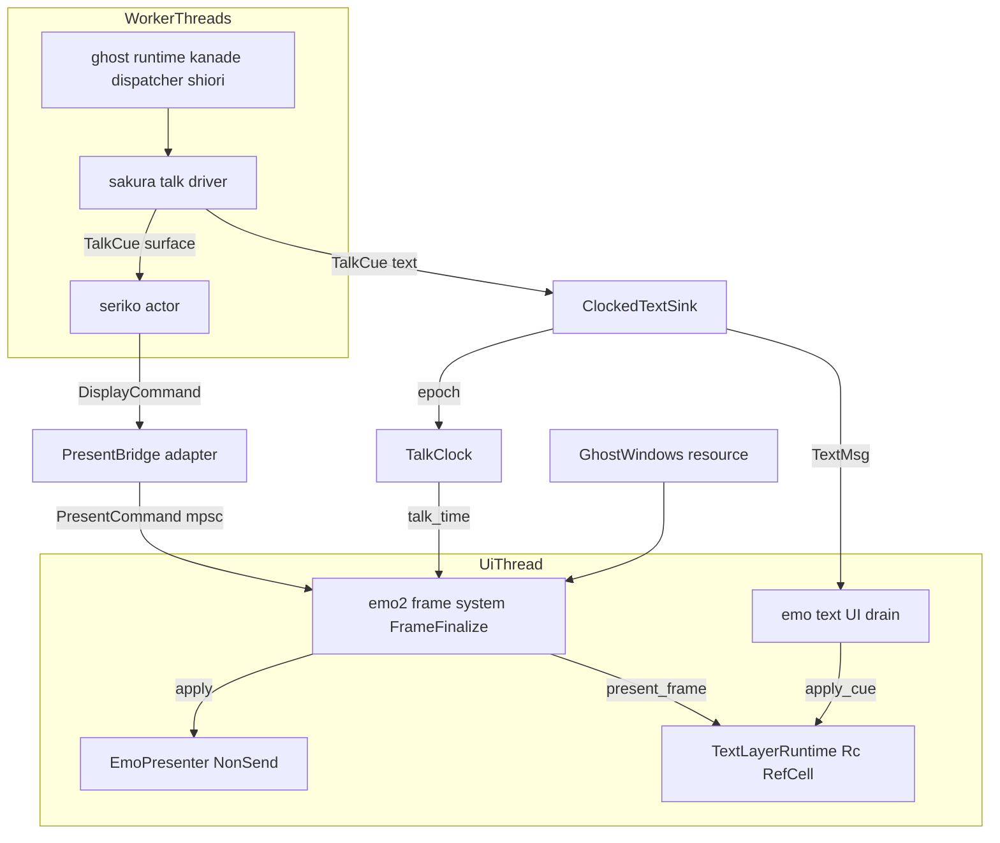
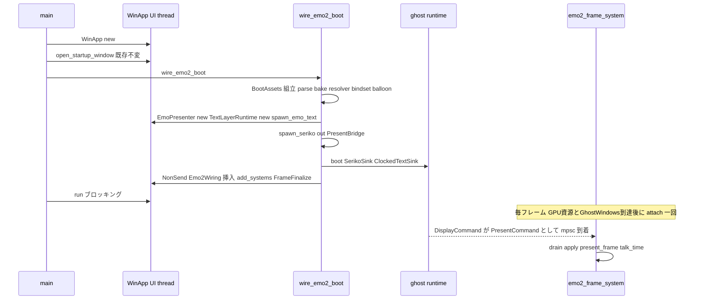
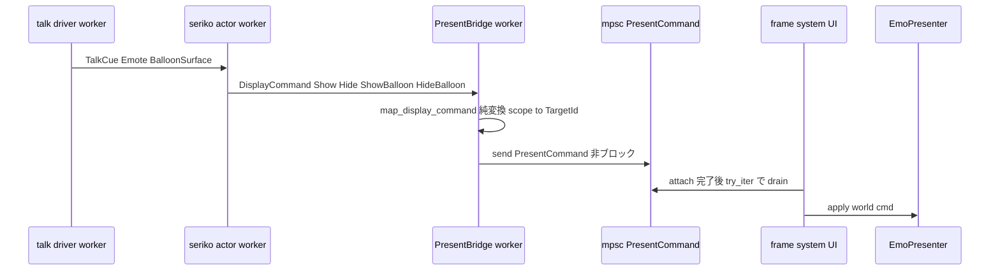
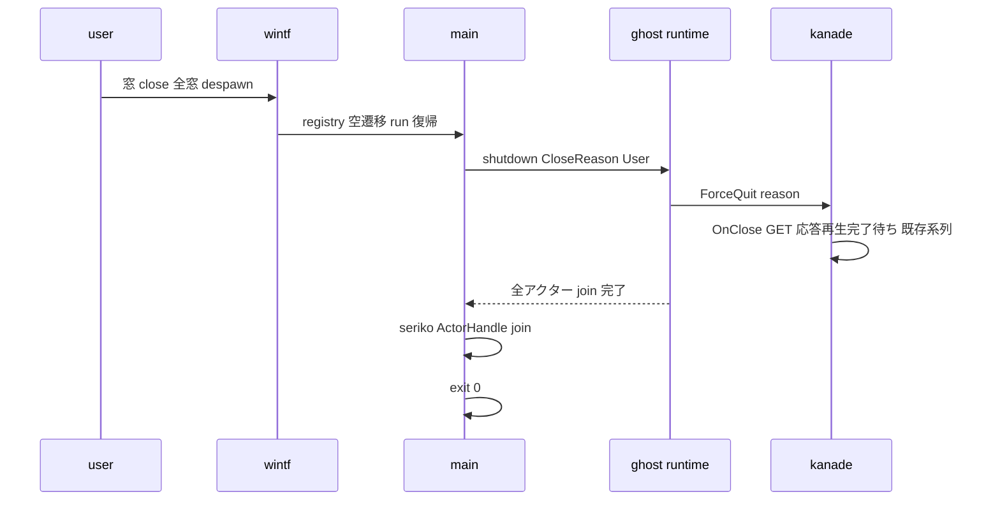

# 技術設計書: areka-P0-emo2-boot

## Overview

**Purpose**: 本仕様は M-boot マイルストーンの最終統合ユニットとして、単体完成済みの 5 トラックエンジン群を束ね、`areka.exe <emo2 path>` の一発起動で「実サーフェスが既定位置に表示され、OnBoot 応答スクリプトがバルーンに typewriter 進行で流れ、close で OnClose 握手を経て全エンジンが正常終了する」動くアプリを成立させる。

**Users**: 開発者は M1 の「最初の可視結果」を目視とテストの二段で得る。M-boot 後の全増分（M-life / M-dialogue / M-dual / M-e2e）は本ユニットが確立する結線と scope→表示対象写像の上に建つ。

**Impact**: 現行 `crates/areka/src/main.rs` の「boot が `WinApp::new()` より前・両 sink `LogSink`（表示なし）」という構造を、「UI 基盤 → 実 sink（`SerikoSink`＋`EmoTextSink`）→ boot」の順序へ再編する。新規実装は薄い変換アダプタ 1 個（`DisplayCommand`→`PresentCommand`）と結線モジュール、および二段の観測（決定論 spine ＋ env-gate 実走）に限定され、既存エンジンは一切改変しない。

### Goals

- `areka.exe <emo2 path>` 一発起動での実サーフェス表示（キャラクター窓＋バルーン窓の両表示対象）
- OnBoot トークのバルーン typewriter 表示（`present_frame` の毎 UI フレーム駆動を含む）
- シェルアニメーション側表示指令（`Show`/`Hide`/`ShowBalloon`/`HideBalloon`）の表示層への変換・配送と、scope→表示対象写像の正本確立
- 窓 close → OnClose 応答再生完了待ち → 全エンジン正常終了（exit 0）
- boot→talk 配送→close 握手の全経路を実 sink 経路（実描画→readback）で観測する決定論 spine（`cargo test --workspace` 常設・sleep 不使用・x64 完結）

### Non-Goals

- 窓の生成・配置・ドラッグ（`areka-P0-window-placement` 所有・完了済み）
- バルーン文字の描画そのもの（`areka-P0-emo-text-layer` 所有・完了済み）
- 撫で・メニュー・選択肢（M-life / M-dialogue）／boot→talk→touch→menu→close の一周適合証明（M-e2e）
- 二人立ち表示対象割当の本格化（M-dual・写像シームまで）／バルーン面キーの name 形・alias 解決（将来増分）
- `sakura.balloon.defaultsurface` の descript 消費（既定バルーン面は 0 固定・将来増分）／kero scope の bindgroup default 分離（M-dual 増分）
- 各エンジン（wintf 含む）の内部改変（必要と判明したら増分 issue として申し送る）

## Boundary Commitments

### This Spec Owns

- **scope→表示対象（`TargetId`）写像の正本**（`emo2_boot::target_map`・シェル表示対象とバルーン表示対象の双方）——本仕様が新たに立てる唯一の正本
- `SurfaceOutput` の本番実装＝変換アダプタ `PresentBridge`（`DisplayCommand`→`PresentCommand` の純変換＋UI 配送・状態なし）
- `crates/areka/src/main.rs` の構築順序再編と実 sink 結線（`LogSink`×2 → `SerikoSink`＋`ClockedTextSink<EmoTextSink>`）
- 生成済み窓写像（`GhostWindows`）の表示層装着（`attach_target`→初回 `ShowSurface`→`text_slot_view`→`register_actor_view` の順序遵守）
- バルーン文字層のアクター起動（`spawn_emo_text`）と `present_frame` の毎 UI フレーム駆動（`talk_time` 時刻源＝`TalkClock` を含む）
- 窓 close → `shutdown(CloseReason)` → 正常終了の総仕上げ（seriko アクターの join を含む）
- 決定論 spine 統合テストと env-gate 実走テスト（観測の二段）

### Out of Boundary

- 窓の生成・配置・ドラッグ・ダミー窓フォールバック（window-placement の良性失敗設計は**意図的残置・不改変**）
- 文字描画・リビール pacing・縦横レイアウト（emo-text-layer）／surface 合成（emo-atlas/compose/present の内部）
- talk 契約・再生出力契約・cue 語彙（ghost-setup / kanade / sakura / balloon-face-cue の正本を消費のみ）
- SHIORI 通信・helper 死活（shiori 系）／OnClose 握手の内部系列（kanade `ForceQuit` 系列を呼ぶだけ）
- wintf への close イベント購読口の増設（現行の「despawn→registry 空遷移→`run()` 復帰」funnel を維持）

### Allowed Dependencies

- 既存 workspace crate の path 依存昇格（R10.8）: `areka-seriko`／`areka-emo-present`（dev→通常昇格）／`areka-emo-text`／`areka-sakura`／`areka-actor`／`dola`（`clock::now` のみ消費）
- 消費する正本: `GhostBootOptions`/`boot`/`shutdown`（ghost-setup）・`DisplayCommand`/`SurfaceOutput`/`spawn_seriko`/`SurfaceResolver`/`build_static_bindset`（seriko）・`PresentCommand`/`TargetId`/`EmoPresenter`/`TextSlotView`/`build_balloon_target`（emo-present）・`EmoTextSink`/`spawn_emo_text`/`register_actor_view`/`present_frame`（emo-text）・`GhostWindows`（placement）・`SurfaceSink`/`TextSink`/`TalkCue`（sakura）・`spawn_ui`/`ActorHandle`（actor）
- **禁止**: 新規外部（crates.io）依存・tokio・既存エンジン内部の改変・wintf の API 増設

### Revalidation Triggers

- `DisplayCommand`／`PresentCommand`／`TargetId`／`TextSlotView` の contract 形状変更（上流変更時は本アダプタ・装着結線の再検証）
- `GhostBootOptions` の sink 型境界（`SurfaceSink + Clone + Send + 'static` 等）の変更
- `text_slot_view` の遅延生成タイミング（初回 `ShowSurface` 同期生成）が非同期化された場合（DD-4 の同一フレーム合流が崩れる）
- ghost dispatcher の Tick 中継意味論（talk 起点相対秒の due 配信）の変更（DD-2 の TalkClock 前提が崩れる）
- scope→`TargetId` 写像（本仕様正本）の変更は M-dual 以降の下流全消費者へ再検証を強制する

## Architecture

### Existing Architecture Analysis

- **現 main.rs**: `boot()`（sink=`LogSink`×2）→`WinApp::new()`→`open_startup_window`（本物ゴースト窓 spawn 済・surface 未装着＝不可視）→`run()`→`shutdown(System)`。実 sink は UI 基盤（`EmoPresenter`＝`!Send`・`spawn_emo_text`＝UI スレッド）を要するため boot が先にある現順序では注入不能。
- **並行モデル正本**（steering / areka-concurrency-model）: 各エンジン＝チャンネル通信のアクター・render/window は UI スレッド固定・worker→UI はチャンネル配送・フレームワーク化禁止。
- **donor**: `crates/areka/examples/emo-present.rs` の `boot_present_system`（GPU 資源到達ゲート・`Option::take` 高々 1 回・`FrameFinalize` 排他 system）が装着結線の実績パターン。
- **既存観測資産**: `crates/areka/tests/smoke_boot_loop_exit.rs`（実プロセス smoke）・`crates/areka-emo-text/tests/{draw_readback_test,attach_wiring_test}.rs`（MTA COM＋`GraphicsCore::new()`＋WARP 可 readback の素の `#[test]` 定石）・`crates/areka-ghost/tests/ghost/spine_e2e_test.rs`（`ShioriWiring::Custom`＋`TickerMode::Disabled`＋Tick 注入）。

### Architecture Pattern & Boundary Map



**Architecture Integration**:

- **Selected pattern**: 「worker アクター → 専用チャネル → UI 毎フレーム drain」＋「NonSend presenter の排他 system 駆動」。emo-text が確立した「drain＝純粋状態のみ／World 作業＝毎フレーム別口」の分離と、donor の boot_present_system パターンの直系合成。
- **Domain boundaries**: アダプタ（純変換＋配送・worker 側）／結線（main.rs＋frame system・UI 側）／観測（tests）の三片。写像正本は `target_map` の純関数に隔離。
- **Existing patterns preserved**: 非致命 boot 分類（`is_benign_boot_error`）・ダミー窓フォールバック・smoke ゲート・placement シーム・log-first 規律。
- **New components rationale**: `PresentBridge`（`SurfaceOutput` 本番実装の空白を埋める唯一の新規本体）・`TalkClock`（`present_frame` が要求する talk 起点相対秒の時刻源が未定義だった空白）・`emo2_frame_system`（`present_frame` 駆動義務と装着合流の所有者不在を埋める）。
- **Steering compliance**: tokio 不使用・新規外部依存ゼロ・Rust 2024・UI スレッド固定資源は NonSend・チャンネル I/O 契約・フレームワーク化なし（全て具象の直結線）。

### 主要設計判断（research.md §9.2 の要約・正本は本書）

| ID | 判断 | 決定 | 棄却案と理由 |
|----|------|------|--------------|
| DD-1 | worker→UI 配送経路 | 専用 `std::sync::mpsc<PresentCommand>`＋`FrameFinalize` 排他 system drain（装着完了まで drain せずチャネルが保留バッファを兼ねる） | `CommandSender` 経路: sender 公開口が無く wintf 改変（R10.3）が必要。`UiSender`+キュー Resource: 部品 3 点で過剰・handler が World を持てない |
| DD-2 | `talk_time` 時刻源 | `TalkClock`: `ClockedTextSink` が emit ごとに `epoch = max(epoch, clock() − cue.at)` を記録、毎フレーム `talk_time = FrameTime − epoch`（clamp ≥0・epoch なしは skip）。クロック注入可（既定 `dola::runtime::clock::now` = FrameTime と同源） | FrameTime 絶対値直渡し: epoch 不一致で typewriter 全瞬時表示。kanade 同期: エンジン改変 |
| DD-3 | scope→TargetId 写像 | `shell_target(n)=TargetId(2n)`／`balloon_target(n)=TargetId(2n+1)`・scope は `ActorKey` 数値 parse・非数値は warn＋drop | — （本仕様唯一の新正本・M-dual 拡張シーム） |
| DD-4 | 装着合流 | 単一排他 system の attach フェーズで「attach→初回 ShowSurface→`text_slot_view`→`register_actor_view`」を同期実行（apply 同期ゆえ同一フレームで `Some` 保証・None なら次フレーム再試行） | 複数 system 分割: FrameFinalize 内の順序保証が必要になり脆い |
| DD-5 | バルーン配送 | アダプタ純関数で `ShowBalloon`→`ShowSurface{binds: BindSet::default()}`／`HideBalloon`→`Hide`（seriko 解決済み数値 id をそのまま消費） | — （output.rs doc の指示どおり） |
| DD-6 | 置き場 | areka bin 内モジュール `src/emo2_boot/` | 新 lib crate: M-dual という仮定要件のための分割＝simplification 原則で棄却（純粋部 lift は将来機械的） |
| DD-7 | 構築順序 | `WinApp::new`→`open_startup_window`→`wire_emo2_boot`→`run`→shutdown。asset 組立失敗時は現行 `LogSink`×2 boot へフォールバック（非致命意味論・既存 smoke 温存） | boot スキップ: headless 診断経路と既存 smoke 前提を壊す |
| DD-8 | static bindset | shell descript KV `sakura.bindgroup{N}.default`==1 の N を抽出（ukadoc 正典・emo2 実測 [1100,1207,1302,1500,1800]） | ハードコード: fixture 固有値の埋め込みは正典違反 |
| DD-9 | 初期表示面 | scope0=surface 0・scope≥1=surface 10・バルーン=面 0 固定 | — （placement measure と同一慣行） |
| DD-10 | 終了理由 | `run()` 復帰（全窓 close funnel）→ `shutdown(CloseReason::User)` | close イベント購読の新設: wintf 改変 |
| DD-11 | spine の scripted 脳 | areka 側テストに最小 scripted `ShioriBackend` を自前実装（`ShioriWiring::Custom` は公開 API） | areka-ghost への test-support 公開: エンジン改変 |
| DD-12 | 窓×資産の scope 整合（設計ディスカッション議題1） | scope 集合は wire 時に placement と同じ入力から自前導出。装着時は **`GhostWindows::scopes()` を正**とし、純関数 `plan_attachments` で突き合わせ（窓あり資産なし=`warn!`＋skip 縮退・資産あり窓なし=`debug!`＋破棄・`usize`→`u32` 吸収・**計画件数の積極 assert** で縮退が導出バグを隠さない）。不一致パターンは GPU 不要の決定論ユニットテストで檻に入れる | attach 内遅延組立: UI フレーム内 I/O＋DD-7 フォールバック時系列崩壊。規約のみ: 検証不能な事前条件の残置＝沈黙バグ温床 |

### Technology Stack

| Layer | Choice / Version | Role in Feature | Notes |
|-------|------------------|-----------------|-------|
| アプリ結線 | `crates/areka`（bin・Rust 2024） | 統合結線の唯一の変更主体 | 新規モジュール `src/emo2_boot/` |
| 依存昇格 | `areka-seriko`／`areka-emo-present`／`areka-emo-text`／`areka-sakura`／`areka-actor`／`dola`（全て workspace path 依存） | 実 sink・presenter・文字層・契約型・clock の消費 | R10.8 の統合結線（外部依存追加ゼロ）。`areka-emo-present` は dev-dependencies から通常依存へ昇格 |
| UI 基盤 | wintf（既存・不改変） | `WinApp`／`FrameFinalize` schedule／`FrameTime`／GPU 資源（`GraphicsCore`・`WucGraphicsResource`） | API 増設なし |
| テスト | `cargo test --workspace`（外部 CI なし・ローカル DoD ゲート） | 決定論 spine（GPU 実描画＋WARP readback・素の `#[test]`）＋env-gate 実走 | draw_readback_test 定石の踏襲 |

### 依存方向（レイヤ規律）

`target_map`（純粋・std のみ）→ `adapter`（seriko/emo-present 型）→ `talk_clock`（sakura 型＋clock）→ `assets`（parsers/atlas/compose/seriko/emo-present）→ `frame`（bevy_ecs World・emo-present/emo-text 駆動）→ `main.rs`（全結線）。左のモジュールは右を import しない。エンジン crate への依存は常に一方向（areka bin → エンジン）で、逆流・エンジン間の新規結合は作らない。

## File Structure Plan

### Directory Structure

```
crates/areka/
├── Cargo.toml                        # [modified] path 依存昇格（areka-seriko / areka-emo-present（dev→通常） /
│                                     #   areka-emo-text / areka-sakura / areka-actor / dola）
├── src/
│   ├── main.rs                       # [modified] 構築順序再編（boot を WinApp 後へ）・wire_emo2_boot 結線・
│   │                                 #   shutdown(CloseReason::User)＋seriko join・LogSink フォールバック維持
│   └── emo2_boot/
│       ├── mod.rs                    # [new] モジュール公開面・BootWiringError（thiserror）・
│       │                             #   wire_emo2_boot（組立→sink 構築→spawn_seriko→boot→system 登録の統括）
│       ├── target_map.rs             # [new] scope→TargetId 写像の正本（純関数・std のみ）
│       ├── adapter.rs                # [new] map_display_command（純変換）＋ PresentBridge（SurfaceOutput 実装）
│       ├── talk_clock.rs             # [new] TalkClock（epoch 推定・クロック注入）＋ ClockedTextSink<T>
│       ├── assets.rs                 # [new] BootAssets 組立（mount→parse→bake→EmoWorld→resolver/bindset→
│       │                             #   balloon target/model）＋ default_bind_ids（descript KV 抽出）
│       └── frame.rs                  # [new] Emo2Wiring（NonSend）＋ emo2_frame_system（attach/drain/text 3 フェーズ）
└── tests/
    ├── emo2_boot_spine_test.rs       # [new] R8 決定論 spine（scripted SHIORI＋実 sink 経路＋GPU readback）
    └── emo2_real_run.rs              # [new] R9 env-gate 実走（AREKA_EMO2_REAL_RUN・実プロセス起動・DoD 外）
```

### Modified Files

- `crates/areka/src/main.rs` — `boot()` 呼び出しを `WinApp::new()`／`open_startup_window` の後へ移動し、`emo2_boot::wire_emo2_boot` の成否で実 sink boot／`LogSink` フォールバック boot を呼び分ける。`shutdown` の理由を `CloseReason::User` へ変更し、seriko `ActorHandle` の join を追加。既存のダミー窓・smoke ゲート・placement シーム・`is_benign_boot_error` は不変。
- `crates/areka/Cargo.toml` — 上記 path 依存昇格のみ（バージョン・外部依存の変更なし）。

## System Flows

### 起動シーケンス（R1／R2／R7）



- attach 前に届いた `PresentCommand` はチャネル内に保留され、attach 完了フレームから順に適用される（FIFO 保存・取りこぼしなし）。
- asset 組立が失敗した場合（fixture 不在等）は warn/error 分類の上で `LogSink`×2 の現行 boot 経路へフォールバックし、骨格の boot→loop→exit と既存 smoke テスト前提を維持する（R7.3/7.4）。

### 表示指令の変換・配送（R3／R5）



### 終了握手（R6）



- OnClose 応答の再生完了待ちは kanade の `ForceQuit` 終了系列内で処理される（本仕様は `shutdown` を呼ぶだけ・不改変）。
- `shutdown` 失敗は `error!` の上で main の `Result` へ伝播（現行どおり genuine な失敗を exit 0 で隠さない）。

## Requirements Traceability

| Requirement | Summary | Components | Interfaces | Flows |
|-------------|---------|------------|------------|-------|
| 1.1 | 一発起動で実サーフェス表示 | main 再結線・assets・frame(attach) | `wire_emo2_boot`・`attach_target`・`ShowSurface` | 起動シーケンス |
| 1.2 | 窓写像の表示層装着 | frame(attach) | `GhostWindows::char_window/balloon_window`→`attach_target` | 起動シーケンス |
| 1.3 | 装着完了まで不可視 | frame(attach) | 装着前は `ShowSurface` を発行しない（WUC 無内容窓＝不可視の現状維持） | 起動シーケンス |
| 1.4 | キャラ窓・バルーン窓の両結線 | target_map・frame(attach) | `shell_target`/`balloon_target` の両系装着 | 起動シーケンス |
| 2.1 | OnBoot トークのバルーン配送 | main 再結線（実 sink 注入） | `boot(surface_sink=SerikoSink, text_sink=ClockedTextSink<EmoTextSink>)` | 起動シーケンス |
| 2.2 | typewriter 表示 | emo-text（消費）＋frame(text) | `apply_cue`（UI drain・既存）＋`present_frame` | — |
| 2.3 | 毎 UI フレーム駆動 | frame(text) | `emo2_frame_system`（FrameFinalize 毎フレーム）→`present_frame` | — |
| 2.4 | サーフェス切替指令の変換配送 | adapter | `SurfaceOutput::send`→`map_display_command`→mpsc | 表示指令フロー |
| 3.1 | Show の shell target 写像 | adapter・target_map | `Show{scope,id,binds}`→`ShowSurface{shell_target(scope),id,binds}` | 表示指令フロー |
| 3.2 | Hide の shell target 非表示 | adapter・target_map | `Hide{scope}`→`Hide{shell_target(scope)}` | 表示指令フロー |
| 3.3 | ShowBalloon の balloon target 写像 | adapter・target_map | `ShowBalloon{scope,id}`→`ShowSurface{balloon_target(scope),id,BindSet::default()}` | 表示指令フロー |
| 3.4 | HideBalloon の balloon target 非表示 | adapter・target_map | `HideBalloon{scope}`→`Hide{balloon_target(scope)}` | 表示指令フロー |
| 3.5 | 写像正本の確立・他正本の非再定義 | target_map | `shell_target`/`balloon_target`/`scope_of`（唯一の新正本） | — |
| 3.6 | アダプタは変換と配送のみ・無状態 | adapter | `PresentBridge`＝純関数＋`Sender`（可変状態なし） | — |
| 3.7 | UI 配送経路で表示層へ | adapter・frame(drain) | mpsc→`FrameFinalize` 排他 system→`EmoPresenter::apply` | 表示指令フロー |
| 4.1 | 初回表示→slot 取得→文字層接続 | frame(attach) | `apply(ShowSurface)`→`text_slot_view`→`register_actor_view` | 起動シーケンス |
| 4.2 | slot 未生成の尊重 | frame(attach) | `text_slot_view`==None なら接続せず次フレーム再試行 | — |
| 4.3 | 接続後の cue 反映 | frame(text)・emo-text | 未装着間の cue 蓄積→登録後の次フレーム装着（emo-text 既存契約） | — |
| 5.1 | ShowBalloon→既定 bind の ShowSurface | adapter | DD-5 の写像（`BindSet::default()`・reply None） | 表示指令フロー |
| 5.2 | HideBalloon→非表示 | adapter | DD-5 の写像 | 表示指令フロー |
| 5.3 | 数値 id をそのまま消費 | adapter | `surface_id: u32` を非解釈で転写（alias 非再適用） | — |
| 5.4 | \b 経路の headless 観測 | spine test | `\b` 台本→受信 `PresentCommand` 記録＋balloon target readback | Testing Strategy |
| 5.5 | OnBoot デモは \b 不使用で完走 | spine test・assets | `\b` なし台本の完走ケース＋バルーン面 0 固定 | Testing Strategy |
| 6.1 | close→終了理由付与→shutdown | main 再結線 | `run()` 復帰→`shutdown(CloseReason::User)`（DD-10） | 終了握手 |
| 6.2 | OnClose 再生完了待ち | ghost/kanade（消費） | `shutdown` 内の `ForceQuit` 系列（不改変） | 終了握手 |
| 6.3 | 全エンジン終了→exit 0 | main 再結線 | shutdown Ok＋seriko join Ok→`Ok(())` | 終了握手 |
| 6.4 | smoke ゲートの本物経路成立 | main（既存温存） | `AREKA_APP_SMOKE_EXIT_MS`→`despawn_smoke_targets`（不変・実 sink 構成でも完走） | — |
| 7.1 | UI 基盤→実 sink→boot の順序 | main 再結線 | DD-7 の新 `main()` 順序 | 起動シーケンス |
| 7.2 | 記録 sink→実 sink 差し替え | main 再結線・mod.rs | `wire_emo2_boot` が実 sink を構築し boot へ注入 | 起動シーケンス |
| 7.3 | 非致命 boot 継続 | main 再結線 | asset 失敗→`LogSink` フォールバック boot・boot Err→warn/error＋継続 | 起動シーケンス |
| 7.4 | 致命/非致命の意味論維持 | main（既存） | `is_benign_boot_error`（不変）＋`BootWiringError` の同型分類 | — |
| 8.1 | scripted SHIORI＋実 sink 全経路 | spine test | 自前 scripted `ShioriBackend`＋`ShioriWiring::Custom`＋実 sink 結線 | Testing Strategy |
| 8.2 | 実描画→readback まで観測 | spine test | `EmoPresenter::apply` 実 draw＋`present_frame`→`read_back` | Testing Strategy |
| 8.3 | sleep 不使用・注入 Tick のみ | spine test | `TickerMode::Disabled`＋`DispatcherMsg::Tick` 注入＋注入 `talk_time` | Testing Strategy |
| 8.4 | headless GPU（WARP・MTA） | spine test | `CoInitializeEx(MULTITHREADED)`＋`GraphicsCore::new()`＋`WucGraphicsResource` | Testing Strategy |
| 8.5 | ピクセル述語 | spine test | `opaque_count` 単調増加・validrect 外透明・Clear 後全透明 | Testing Strategy |
| 8.6 | x64 完結・i686 非依存 | spine test | scripted backend（プロセス spawn なし・helper 不使用） | Testing Strategy |
| 9.1 | env-gate 実走 | real run test＋手順 | `AREKA_EMO2_REAL_RUN`＋実 pasta helper＋実表示 | Testing Strategy |
| 9.2 | DoD 前提にしない | real run test | env 未設定時は skip（既定 OFF） | — |
| 9.3 | 人間サインオフ | 実走手順書（テスト内 doc） | 目視チェックリスト（表示・typewriter・ドラッグ・close） | — |
| 10.1 | 窓の生成配置非所有 | 全体 | placement API の読み取り消費のみ（`GhostWindows`） | — |
| 10.2 | 文字描画非所有 | 全体 | emo-text API の呼び出し消費のみ | — |
| 10.3 | エンジン内部非改変 | 全体 | 変更ファイルは areka bin のみ（File Structure Plan） | — |
| 10.4 | アダプタ 1 個・結線・観測に限定 | 全体 | 新規は `emo2_boot` モジュール＋テストのみ | — |
| 10.5 | 新規外部依存なし・tokio なし・Rust 2024 | Cargo.toml | path 依存昇格のみ | — |
| 10.6 | 表示層 UI スレッド固定・UI 配送 | frame・adapter | NonSend `Emo2Wiring`＋mpsc 配送（DD-1） | 表示指令フロー |
| 10.7 | ダミー窓フォールバック存置 | main（不変） | `spawn_dummy_window` 経路に触れない | — |
| 10.8 | workspace path 依存昇格は in-scope | Cargo.toml | Allowed Dependencies の列挙どおり | — |

## Components and Interfaces

| Component | Domain/Layer | Intent | Req Coverage | Key Dependencies (P0/P1) | Contracts |
|-----------|--------------|--------|--------------|--------------------------|-----------|
| `target_map` | 写像正本（純粋） | scope→TargetId 写像の唯一の正本 | 1.4, 3.1–3.5 | areka-emo-present `TargetId`（P0） | Service |
| `adapter`（`PresentBridge`） | 変換アダプタ（worker） | `DisplayCommand`→`PresentCommand` 純変換＋UI 配送 | 2.4, 3.1–3.7, 5.1–5.3 | areka-seriko `SurfaceOutput`（P0）・mpsc（P0） | Service, Event |
| `talk_clock`（`TalkClock`/`ClockedTextSink`) | 時刻源（worker+UI 共有） | talk 起点相対秒の epoch 推定と talk_time 供給 | 2.2, 2.3 | areka-sakura `TextSink`（P0）・dola clock（P1） | Service, State |
| `assets`（`BootAssets`） | 構築入力（load-time） | shell/balloon 資産と resolver/bindset の組立 | 1.1, 5.5, 7.2 | areka-parsers（P0）・emo-atlas/compose（P0）・emo-present balloon（P0） | Service |
| `frame`（`Emo2Wiring`/`emo2_frame_system`） | UI 毎フレーム結線 | 装着合流・PresentCommand drain・present_frame 駆動 | 1.1–1.4, 2.3, 3.7, 4.1–4.3 | wintf FrameFinalize/GPU 資源（P0）・emo-present/emo-text（P0） | Service, State |
| `main.rs` 再結線＋`wire_emo2_boot` | エントリポイント | 構築順序再編・実 sink boot・終了総仕上げ | 6.1–6.4, 7.1–7.4 | areka-ghost `boot`/`shutdown`（P0） | Service |
| spine test | 観測（決定論） | boot→talk→close 全経路の実描画 readback 檻 | 5.4, 5.5, 8.1–8.6 | 上記全部（P0）・WARP GPU（P0） | Batch |
| real run test | 観測（env-gate） | 実 pasta・実 DPI の opt-in 追験 | 9.1–9.3 | 実 helper exe（P1） | Batch |

### 写像正本 / target_map

#### target_map

| Field | Detail |
|-------|--------|
| Intent | scope（`ActorKey`）→表示対象（`TargetId`）写像の正本。シェル・バルーン両系。 |
| Requirements | 1.4, 3.1, 3.2, 3.3, 3.4, 3.5 |

**Responsibilities & Constraints**
- 純関数のみ（状態・I/O なし）。本仕様が新たに立てる**唯一の正本**であり、M-dual はこのモジュールだけを拡張する。
- `TargetId` は emo-present 契約どおり「結線側採番の不透明 id」。採番規約: `shell = 2*scope`／`balloon = 2*scope + 1`（scope0 → TargetId(0)/(1) ＝ donor 慣行を包含）。

**Contracts**: Service [x]

##### Service Interface

```rust
/// scope 番号 → シェル表示対象（正本）。
pub fn shell_target(scope: u32) -> TargetId;   // TargetId(2 * scope)
/// scope 番号 → バルーン表示対象（正本）。
pub fn balloon_target(scope: u32) -> TargetId; // TargetId(2 * scope + 1)
/// ActorKey（"0"/"1" 等）→ scope 番号。数値でない key は None。
pub fn scope_of(key: &ActorKey) -> Option<u32>;
```

- 事前条件: なし（全域関数）。事後条件: 同一入力に対し常に同一出力（決定論）。
- 不変条件: shell と balloon の `TargetId` は全 scope で互いに素（衝突しない）。

### 変換アダプタ / adapter

#### PresentBridge（`SurfaceOutput` 本番実装）

| Field | Detail |
|-------|--------|
| Intent | seriko worker 上で `DisplayCommand` を `PresentCommand` へ純変換し UI へ非ブロック配送する。 |
| Requirements | 2.4, 3.1, 3.2, 3.3, 3.4, 3.6, 3.7, 5.1, 5.2, 5.3 |

**Responsibilities & Constraints**
- **変換と配送のみ・可変状態なし**（保持するのは `Sender` と写像純関数のみ＝R3.6）。到着順（FIFO）は単一チャネルで保存。
- `SurfaceOutput::send` は infallible 契約 → 送出失敗（UI 側 Receiver drop＝shutdown 中）は `tracing` で観測して黙って握り潰さない（log-first）。非数値 scope は `warn!`＋当該指令 drop。
- バルーン面キーは seriko が解決済みの数値 `u32` をそのまま転写する（alias 非再適用・R5.3）。

**Dependencies**
- Inbound: seriko actor — `SurfaceOutput::send` 呼び出し（P0・worker スレッド上）
- Outbound: `std::sync::mpsc::Sender<PresentCommand>` — UI への配送（P0）
- Outbound: `target_map` — scope 写像（P0）

**Contracts**: Service [x] / Event [x]

##### Service Interface

```rust
/// DisplayCommand → PresentCommand の純変換（テスト単体対象）。
/// 非数値 scope は None（呼び手が warn!＋drop）。reply は常に None（fire-and-forget）。
pub fn map_display_command(cmd: DisplayCommand) -> Option<PresentCommand>;

/// SurfaceOutput の本番実装。spawn_seriko(out=PresentBridge) で worker へ move される。
pub struct PresentBridge { /* tx: mpsc::Sender<PresentCommand> */ }
impl PresentBridge {
    pub fn new(tx: std::sync::mpsc::Sender<PresentCommand>) -> Self;
}
impl SurfaceOutput for PresentBridge {
    fn send(&mut self, command: DisplayCommand); // map → tx.send（非ブロック・失敗は log）
}
```

##### Event Contract
- Published: `PresentCommand`（mpsc・unbounded・FIFO）— `ShowSurface{target, surface_id, binds, reply: None}`／`Hide{target, reply: None}`
- 写像: `Show{scope,id,binds}`→shell target へそのまま／`ShowBalloon{scope,id}`→balloon target へ `binds: BindSet::default()`／`Hide`・`HideBalloon`→各 target の `Hide`
- Delivery: at-most-once（受信端 drop 後は破棄＝shutdown 中のみ）。順序保証: 単一 sender・単一 receiver で全順序。

### 時刻源 / talk_clock

#### TalkClock＋ClockedTextSink

| Field | Detail |
|-------|--------|
| Intent | `present_frame` が要求する talk 起点相対秒（`talk_time`）を、cue 到着観測から epoch 推定して供給する。 |
| Requirements | 2.2, 2.3 |

**Responsibilities & Constraints**
- **前提（検証済み）**: ghost dispatcher は talk ごとの初回 Tick を base とした相対秒で sakura を駆動し、sakura は due になった cue をその時点で emit する＝「cue 到着壁時刻 − `cue.at` ≒ talk 開始壁時刻」（量子化誤差 ≤ ticker base_interval 50ms）。
- epoch 更新は**単調 max**（`epoch = max(epoch, clock() − cue.at)`）: 新 talk では到着時刻が前方へ跳ぶため自動リベース、talk 内ジッタの逆行は抑制。
- **既知制約（talk 跨ぎ逆行）**: `Clear` を伴わずに新 talk が始まると、epoch の前方リベースにより旧 talk 基準の既リビール文字が一時的に未リビール側へ写り得る。これは emo-text 契約（リビール時刻は talk 起点相対・`Clear` が唯一のリセット）の固有性質であり本設計の新造欠陥ではない（実運用スクリプトは通常 `Clear` 開始）。spine の可視数単調増加述語（R8.5）は**単一 talk 内（`Clear` 起点後）に限定**して適用する。
- クロックは注入可能（既定 `dola::runtime::clock::now`＝`FrameTime` と同一の QPC 秒）。決定論テストは固定クロックを注入するか、frame フェーズを直接注入 `talk_time` で駆動する。
- `ClockedTextSink<T: TextSink + Clone>` は `TextSink + Clone + Send` を保ち（`GhostBootOptions` の型境界）、観測後は内側 `EmoTextSink` へ透過転送する（cue 内容の非改変）。

**Contracts**: Service [x] / State [x]

##### Service Interface

```rust
#[derive(Clone)]
pub struct TalkClock { /* epoch: Arc<Mutex<Option<f64>>>, clock: Arc<dyn Fn() -> f64 + Send + Sync> */ }
impl TalkClock {
    pub fn new(clock: Arc<dyn Fn() -> f64 + Send + Sync>) -> Self; // 既定は dola clock を渡す
    /// cue 到着観測（worker スレッドから呼ばれる）。epoch = max(epoch, clock() - at)。
    pub fn observe_cue(&self, at: f64);
    /// フレーム時刻から talk_time を導出（epoch 未確立は None・負値は 0.0 へ clamp）。
    pub fn talk_time(&self, frame_now: f64) -> Option<f64>;
}

#[derive(Clone)]
pub struct ClockedTextSink<T: TextSink + Clone> { /* inner: T, clock: TalkClock */ }
impl<T: TextSink + Clone> TextSink for ClockedTextSink<T> {
    fn emit(&mut self, cue: TalkCue); // clock.observe_cue(cue.at) → inner.emit(cue)
}
```

##### State Management
- State model: `Option<f64>` epoch 1 個のみ（`Arc<Mutex>` 共有・worker 書き／UI 読み）。
- Concurrency: Mutex 保持は代入/読取の瞬間のみ（ブロッキング実質ゼロ・await なし）。poisoned は `error!`＋現値維持（panic 伝播させない）。

### 構築入力 / assets

#### BootAssets

| Field | Detail |
|-------|--------|
| Intent | 表示結線に必要な load-time 資産（shell/balloon の EmoWorld・AtlasTable・resolver・static bindset・BalloonModel）を一括組立する。 |
| Requirements | 1.1, 5.5, 7.2 |

**Responsibilities & Constraints**
- 組立経路は donor（`examples/emo-present.rs`）と placement measure の実績どおり: `surfaces.txt` 読取→`areka_parsers::shell::parse`→`bake`（WIC decoder・`UseSelfAlpha::On`・`PackConfig::default()`）→ scope ごとに `EmoWorld::build`＋`bind_atlas(SetId(0))`（`EmoWorld` は非 Clone・`AtlasTable` は安価 Clone のため **parse/bake は 1 回、build は target 数だけ**）。
- balloon は `areka_emo_present::build_balloon_target(balloon_dir, &decoder)`＋`BalloonModel`（入力は balloon dir の `descript.txt`＋面別 `balloons0s.txt` の 2 層後勝ちマージ＝`areka_parsers::balloon` の既存契約をそのまま呼ぶ・emo2 fixture 実在確認済み）。
- `SurfaceResolver` は `EmoWorld::alias_snapshot()` から、static bindset は **shell descript KV の `sakura.bindgroup{N}.default`==1 抽出**（DD-8・`default_bind_ids`）→`build_static_bindset` で構築。
- placement measure の資産二重ロード（採寸後破棄）は既知の M1 受容トレードオフであり**本仕様では触らない**（R10.1・重複排除は増分候補として申し送り）。
- 失敗は `BootWiringError`（thiserror）で観測可能化し、呼び手（`wire_emo2_boot`）が warn/error 分類→`LogSink` フォールバックへ倒す（R7.3）。

**Contracts**: Service [x]

##### Service Interface

```rust
pub struct ScopeAssets {
    pub scope: u32,
    pub emo_world: EmoWorld,       // scope 専用 build（attach_target が消費）
    pub atlas: AtlasTable,          // Clone 共有
    pub initial_surface_id: u32,    // scope0=0 / scope>=1=10（DD-9）
}
pub struct BootAssets {
    pub shells: Vec<ScopeAssets>,               // GhostWindows の scope 集合に対応
    pub balloons: Vec<(u32, EmoWorld, AtlasTable)>, // scope ごとの balloon target 資産（面 0 初期表示）
    pub balloon_model: BalloonModel,            // register_actor_view が消費（全 scope 共有）
    pub resolver: SurfaceResolver,
    pub static_binds: BindSet,                  // sakura 系 bindgroup default（DD-8）
}
pub fn build_boot_assets(
    ghost_root: &Path,
    balloon_root: &Path,
    scopes: &[u32],
) -> Result<BootAssets, BootWiringError>;

/// shell descript KV から default==1 の bindgroup id を抽出（純粋・単体テスト対象）。
pub fn default_bind_ids(shell_kv: &BTreeMap<String, String>) -> Vec<u32>;
```

- 事前条件: `scopes` は `wire_emo2_boot` が placement と同じ入力（shell descript／surfaces）から**自前導出**する（placement 実結果は `open_startup_window` の async クロージャへ move 済みで同期参照不能・DD-12）。導出の二元性は M1 受容トレードオフとして増分申し送り（資産二重ロードと同枠）。
- 事後条件: 返る資産だけで attach フェーズが完結する（以後ファイル I/O なし）。装着時の scope 整合の正は `GhostWindows::scopes()` であり、突き合わせは frame の純関数 `plan_attachments` が行う（DD-12）。

### UI 毎フレーム結線 / frame

#### Emo2Wiring＋emo2_frame_system

| Field | Detail |
|-------|--------|
| Intent | 装着合流（一回）・PresentCommand drain・present_frame 駆動を単一の排他 system で毎フレーム実行する。 |
| Requirements | 1.1, 1.2, 1.3, 1.4, 2.3, 3.7, 4.1, 4.2, 4.3 |

**Responsibilities & Constraints**
- `Emo2Wiring` は NonSend resource（`EmoPresenter` が `!Send`・`Receiver` が `!Sync`・`Rc<RefCell<TextLayerRuntime>>` が `!Send` のため）。system は donor パターンどおり **remove→駆動→insert**（`&mut World` との借用衝突回避）。
- **フェーズ①（attach・高々 1 回）**: ゲート＝`GhostWindows` Resource 存在＋`GraphicsCore` 存在＋`WucGraphicsResource::is_valid()`。成立フレームでまず純関数 `plan_attachments(GhostWindows::scopes(), &assets)` が装着計画を確定する（DD-12: **窓一覧が正**・`usize`→`u32` 変換をここで吸収・窓あり資産なし＝`warn!`＋skip 縮退・資産あり窓なし＝`debug!`＋破棄）。計画の各項目について: shell target `attach_target`→`apply(ShowSurface{initial_surface_id, static_binds})`、balloon target `attach_target`→`apply(ShowSurface{0, BindSet::default()})`→`text_slot_view(balloon_target)`→`register_actor_view(ActorKey(scope), &view, &balloon_model)`。資産は `Option::take` で高々 1 回消費。装着完了 `info!` は計画件数と実装着件数を列挙し、spine が件数一致を積極 assert する（縮退が導出バグを隠さない檻）。`apply` は同期実行のため **同一フレーム内で `text_slot_view` が `Some` になる**のが正常経路。万一 `None`（上流の遅延化＝Revalidation Trigger）なら接続せず次フレーム再試行（R4.2・warn!）。
- **フェーズ②（drain）**: attach 完了後のみ `Receiver::try_iter` で `PresentCommand` を全件取り出し順に `presenter.apply(world, cmd)`。attach 前はチャネルに保留（取りこぼしなし・FIFO）。
- **フェーズ③（text）**: `FrameTime` を読み `TalkClock::talk_time` が `Some(t)` なら `present_frame(&mut runtime.borrow_mut(), world, t)`。`Err` は `error!`（present_frame 側で失敗源 log 済み）→継続（次フレーム再試行・R2.3）。
- 各フェーズの本体は `(&mut Emo2Wiring, &mut World)` を取る自由関数に分離し、headless 単体・統合テストが system を経ずに直接駆動できる形にする（決定論檻の駆動口）。

**Dependencies**
- Inbound: wintf `FrameFinalize` schedule — 毎フレーム起動（P0）
- Outbound: `EmoPresenter::attach_target/apply/text_slot_view`（P0）・`TextLayerRuntime::register_actor_view`／`present_frame`（P0）・`GhostWindows`（P0）・`FrameTime`（P0）

**Contracts**: Service [x] / State [x]

##### Service Interface

```rust
/// NonSend 結線資源（main が構築・挿入）。
pub struct Emo2Wiring {
    /* presenter: EmoPresenter, rx: mpsc::Receiver<PresentCommand>,
       runtime: Rc<RefCell<TextLayerRuntime>>, clock: TalkClock,
       assets: Option<BootAssets>, attached: bool */
}

/// FrameFinalize 登録の排他 system（remove→3 フェーズ→insert）。
pub fn emo2_frame_system(world: &mut World);

// テスト駆動口（フェーズ分離・純結線ロジック）
pub fn run_attach_phase(wiring: &mut Emo2Wiring, world: &mut World);
pub fn run_drain_phase(wiring: &mut Emo2Wiring, world: &mut World);
pub fn run_text_phase(wiring: &mut Emo2Wiring, world: &mut World, talk_time_override: Option<f64>);

/// 窓×資産の scope 突き合わせ（DD-12・純関数・GPU 不要の決定論単体テスト対象）。
/// GhostWindows::scopes()（usize・正）と BootAssets を照合し装着計画を返す。
pub struct AttachPlan {
    pub items: Vec<PlannedAttach>,   // (scope: u32, shell/balloon target, 初期面, static binds 参照)
    pub missing_assets: Vec<usize>,  // 窓あり資産なし → 呼び手が warn!＋skip（表示なし縮退）
    pub unused_assets: Vec<u32>,     // 資産あり窓なし → 呼び手が debug!＋破棄
}
pub fn plan_attachments(window_scopes: &[usize], assets: &BootAssets) -> AttachPlan;
```

##### State Management
- State model: `attached: bool`＋`assets: Option<BootAssets>`（take で高々 1 回）＋受信チャネル。トークの意味状態は一切持たない（それは emo-text/seriko の所有）。
- Concurrency: 全て UI スレッド内（NonSend）。worker との共有は mpsc と `TalkClock` のみ。

**Implementation Notes**
- Integration: `add_systems(FrameFinalize, emo2_frame_system)` の登録は `wire_emo2_boot` 内（placement の click-through 登録と同位置・順序依存なし＝self-gating）。
- Validation: `reply: None` 適用の `PresentError` が presenter 内部 log で観測できるか実装時に確認し、不足なら drain 側で `reply_channel` を添えて即 `try_recv`→`error!` する（research §9.3）。
- Risks: GPU 資源が恒久不在の環境では attach が起きず表示なしで完走する（hang しない・log-first で観測可能）。

### エントリポイント / main.rs＋wire_emo2_boot

#### main 再結線

| Field | Detail |
|-------|--------|
| Intent | 構築順序の再編（R7 の本丸）と終了総仕上げ。 |
| Requirements | 6.1, 6.2, 6.3, 6.4, 7.1, 7.2, 7.3, 7.4 |

**Responsibilities & Constraints**
- 新 `main()` 順序: logging→args/`ConfigInputs`（既存）→`WinApp::new()`→shiori demo（既存 env-gate）→`open_startup_window(&app, &cfg)`（既存・不変）→**`wire_emo2_boot(&app, &cfg)`**→`app.run()`→終了処理。
- `wire_emo2_boot` の統括（UI スレッド上・run 前）:
  1. `build_boot_assets`（失敗→warn/error 分類の上 `None` を返し、main は現行どおり `LogSink`×2 で `boot`＝フォールバック。既存 `is_benign_boot_error`・smoke テスト前提を温存）
  2. `EmoPresenter::new()`・`TextLayerRuntime::new(TextLayerConfig::default())`・`spawn_emo_text(Rc::clone(&runtime))`→`EmoTextSink`（UI スレッド前提を満たす）
  3. `TalkClock::new(dola clock)`・`ClockedTextSink::new(emo_text_sink, clock.clone())`
  4. `mpsc::channel::<PresentCommand>()`→`PresentBridge::new(tx)`→`spawn_seriko(resolver, static_binds, bridge)`→`(SerikoSink, ActorHandle)`
  5. `areka_ghost::boot(GhostBootOptions{ surface_sink: SerikoSink, text_sink: ClockedTextSink, shiori: Helper, ticker: Real, .. })`（Err は既存分類で warn/error＋継続＝R7.3）
  6. `Emo2Wiring` を NonSend 挿入・`add_systems(FrameFinalize, emo2_frame_system)`
  7. 戻り値: `(Option<GhostRuntime>, Option<ActorHandle /* seriko */>)`（main が終了処理で消費）
- 終了処理: `run()` 復帰後、`runtime.shutdown(CloseReason::User)`（DD-10・失敗は `error!`＋`Err` 伝播＝現行踏襲）→ seriko `ActorHandle::join`（ghost 側の `SerikoSink` drop により inbox 切断→worker 自然終了。join 失敗は `error!`＋`Err`）。main が保持する sink クローンは boot 後に drop し、shutdown 完了＝全 sender 消滅で各 drain/actor が終端する。
- smoke ゲート（`AREKA_APP_SMOKE_EXIT_MS`）・ダミー窓・`despawn_smoke_targets` は**不変**（R6.4/R10.7）。

**Contracts**: Service [x]

##### Service Interface

```rust
/// UI 基盤構築後・run() 前に呼ぶ統合結線（UI スレッド）。
/// main.rs 私有型（ConfigInputs）へは結合せず、解決済みルートパスを受け取る。
/// 資産組立失敗時は None 側へ倒し、呼び手が LogSink フォールバック boot を行う。
pub fn wire_emo2_boot(
    app: &WinApp,
    ghost_root: &Path,
    balloon_root: &Path,
    helper_exe: &Path,
) -> Emo2BootOutcome;

pub struct Emo2BootOutcome {
    pub ghost: Option<GhostRuntime>,
    pub seriko: Option<areka_actor::ActorHandle>,
    pub wired: bool, // 実 sink 結線が成立したか（false = LogSink フォールバック）
}

#[derive(Debug, thiserror::Error)]
pub enum BootWiringError { /* Mount / ShellRead / Bake / Balloon / SpawnUi ... （#[from] 変換） */ }
```

## Error Handling

### Error Strategy

log-first（steering: areka-log-first-no-silent-failure）。失敗は `error!`／`warn!`＋`Result` で観測可能化し、panic は使わない。統合層の失敗は「表示が出ない／talk が流れない」へ**縮退**してもアプリ実行と終了規律（exit 経路）は壊さない。

### Error Categories and Responses

- **構築時（load-time）**: `BootWiringError`（fixture 不在等の想定内＝`MountError::StartPointMissing` 系は `warn!`・他は `error!`）→ `LogSink`×2 フォールバック boot（R7.3・既存 smoke 完走を維持）。boot 自体の `GhostBootError` は既存 `is_benign_boot_error` 分類を不変で維持（R7.4）。
- **配送時（worker）**: `PresentBridge` の send 失敗（受信端 drop）＝shutdown 中のみ→`debug!`（期待事象）。非数値 scope →`warn!`＋drop（写像不能の観測）。
- **適用時（UI）**: `PresentError`（`TargetNotAttached`／`Device`）→ drain は attach 後にのみ走るため `TargetNotAttached` は原理上発生しない（発生＝結線バグとして `error!`）。`Device`（GPU 資源喪失）は `error!`＋継続（次フレームの供給面遅延再生成に委ねる）。
- **文字層（UI）**: `TextLayerError`→`present_frame` が失敗源 log 済み・first error 返却→frame は `error!`＋継続（次フレーム再試行・他 actor 非破壊＝emo-text 既存契約）。
- **終了時**: `shutdown` 失敗・seriko join 失敗→`error!`＋main `Err`（genuine 失敗を exit 0 で隠さない・現行踏襲）。

### Monitoring

全経路 `tracing`。観測点: wire 成立/フォールバックの info/warn・attach 完了 info（scope/target 列挙）・adapter drop warn・present_frame err。決定論檻はログでなく spine のピクセル述語と受信列 assert が担う。

## Testing Strategy

> 常設ゲートは `cargo test --workspace`（外部 CI なし・ローカル DoD）。GPU 実描画＋readback は emo-text の `draw_readback_test` 定石（素の `#[test]`・テスト内 MTA COM 初期化・`GraphicsCore::new()`＝WARP 可・注入時刻・sleep 不使用）を踏襲する。

### Unit Tests（`emo2_boot` モジュール内 `#[cfg(test)]`）

1. `target_map`: shell/balloon 採番の互いに素性・`scope_of("0"/"1")`＝Some・非数値（`"側"` 等）＝None（R3.5）。
2. `map_display_command`: `Show`/`Hide`/`ShowBalloon`（`BindSet::default()` 付与・数値 id 非改変）/`HideBalloon` の 4 写像全値比較＋非数値 scope の None（R3.1–3.4, 5.1–5.3）。
3. `TalkClock`: 単調 max 更新・新 talk リベース（at リセット＋前方到着）・epoch None→talk_time None・負値 clamp（固定注入クロックで決定論・R2.2 前提）。
4. `default_bind_ids`: emo2 相当 KV から [1100,1207,1302,1500,1800] 抽出・`default` 非 1／kero 系キーの非抽出（DD-8）。
5. `run_attach_phase` の順序遵守: GPU 資源なし World では装着しない（ゲート）・`text_slot_view` None 経路で接続しない（R4.2・emo-text テストの軽量リグ流用）。
6. `plan_attachments`（DD-12）: 完全一致（計画件数＝窓数の積極 assert）・窓あり資産なし（missing 検出＝skip 対象）・資産あり窓なし（unused 検出＝破棄対象）・`usize`→`u32` 変換境界、の 4 パターンを GPU 不要で全網羅（R1.2/1.4/4.2 の判断部の檻）。

### Integration Tests（`crates/areka/tests/emo2_boot_spine_test.rs`＝R8 決定論 spine）

構成: 自前 scripted `ShioriBackend`（OnBoot 応答台本を返す fake・DD-11）＋`ShioriWiring::Custom`＋`TickerMode::Disabled`（`DispatcherMsg::Tick` 注入）＋実 sink 結線（`spawn_seriko(out=PresentBridge)`／`ClockedTextSink<EmoTextSink>`）＋GPU World（MTA COM・`GraphicsCore::new()`・`WucGraphicsResource`）＋frame フェーズ直接駆動（注入 `talk_time`）。同期は Tick 注入＋有界 join＋`recv_timeout` の観測点のみ（sleep なし・R8.3）。x64 完結（helper 不使用・R8.6）。

1. **S1 boot→表示**: boot 後 Tick 注入→attach フェーズ→shell/balloon target の `read_back` が非全透明（初期面表示・R8.1/8.2/8.5、R1 系の檻）。装着は**期待 scope 数の全 target 完了を積極 assert**する（計画件数＝実装着件数・warn+skip 縮退が scope 導出バグを隠さない檻＝DD-12）。
2. **S2 talk→typewriter**: `\s[2100]` とテキストを含む台本→`Show` 系 `PresentCommand` 受信列 assert→apply→shell readback 変化。テキスト cue→`pump_until_idle`→注入 `talk_time` 階段で `opaque_count` 単調増加・validrect 外に非透明なし・`Clear` 後全域透明（R8.5、R2 系の檻）。単調増加述語の適用範囲は単一 talk 内（`Clear` 起点後）に限定する（talk_clock の既知制約＝talk 跨ぎ逆行は対象外）。
3. **S3 `\b` 配送**: `\b[-1]`→`\b[0]` を含む台本→受信列に `Hide{balloon}`→`ShowSurface{balloon, 0, binds=default}` が順序どおり現れる（headless 記録・R5.4）＋apply 後の balloon readback 遷移。
4. **S4 `\b` なし完走**: `\b` を含まない OnBoot 相当台本が S1/S2 経路を完走する（R5.5）。
5. **S5 close 握手**: `shutdown(CloseReason::User)`→OnClose 台本消化→全ハンドル有界 join・seriko join（R6.1–6.3 の檻・ghost spine S 系の手法）。

> **schedule 結線の観測境界（設計ディスカッションで確定）**: `add_systems(FrameFinalize, emo2_frame_system)` の登録と NonSend remove→insert は、証明済み内部（bevy_ecs スケジューラ・donor `boot_present_system` 実績パターン）への**配線**であり、入力依存の分岐を持たない（常に正しいか常に panic かの性質）＝決定論檻の対象外。担保は実 fixture smoke の end-to-end 一度の存在チェックに委ねる（下記 E2E）。合成 `Schedule` での決定論テストは設けない。

### E2E / Smoke

- 既存 `tests/smoke_boot_loop_exit.rs` は**不変で緑を維持**（フォールバック経路＝資産不在時の LogSink boot がこれを保証・R6.4/7.3 の回帰檻）。実 fixture 経路の smoke（`skeleton_boots_with_real_ghost_windows_and_exits_zero`）は実 sink 結線後も exit 0 を維持すること。加えて実 fixture smoke は **`emo2_frame_system` の schedule 登録（実結線経路）を少なくとも 1 回踏む end-to-end 存在チェック**を兼ねる — 実装時に実結線経路（フォールバックでない側）へ届くことを確認し、届いていなければ wire 成立ログマーカーの一行 assert を smoke へ追加する（決定論檻ではなく存在確認・R8.1 の観測境界注記）。
- `tests/emo2_real_run.rs`（R9・env-gate）: `AREKA_EMO2_REAL_RUN` 未設定なら即 return（DoD 非前提・R9.2）。設定時は `CARGO_BIN_EXE_areka` を emo2 fixture＋実 helper で起動し `AREKA_APP_SMOKE_EXIT_MS` で自動 close・exit 0 とログマーカー（wire 成立・attach 完了）を assert（R9.1 の自動部）。**人間サインオフ（R9.3）**はテスト doc 内チェックリスト（実 DPI≠96 で: 実サーフェス表示位置／typewriter 進行の目視／ドラッグ追従／close→静かな終了）として明文化し、マイルストーン完了宣言はその実施後のみ。

### Performance

- 毎フレーム増分は「mpsc try_iter（通常空）＋present_frame（変化フレームのみ Present）」で定常負荷は実質ゼロ。専用計測は設けない（emo-text 側の R9.3 契約に委譲）。
