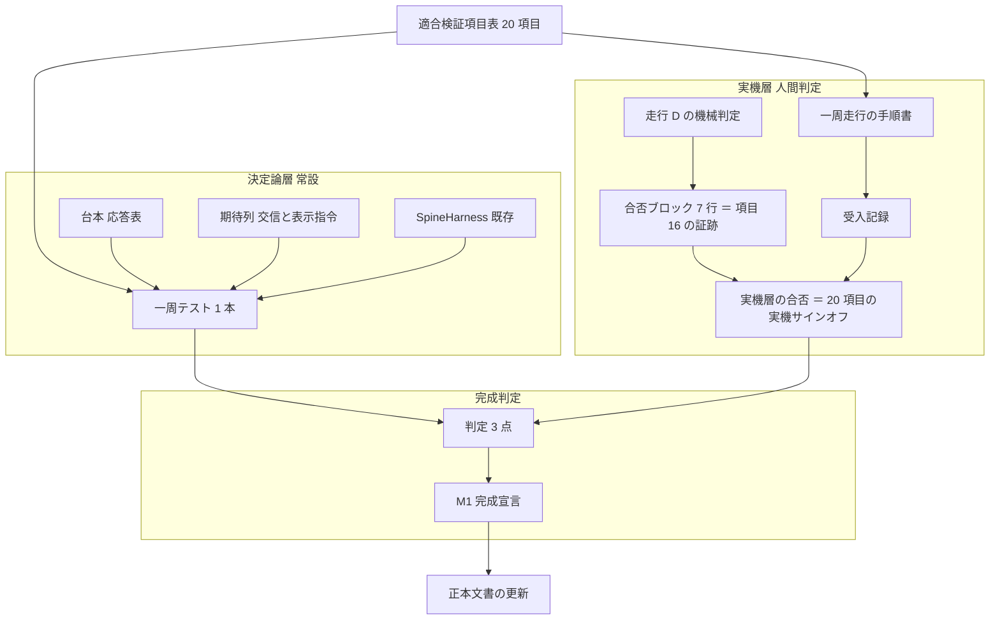
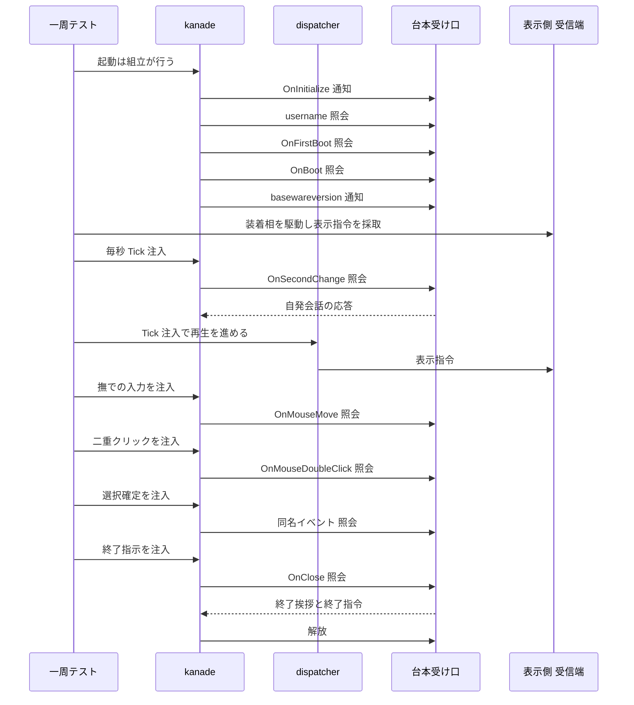
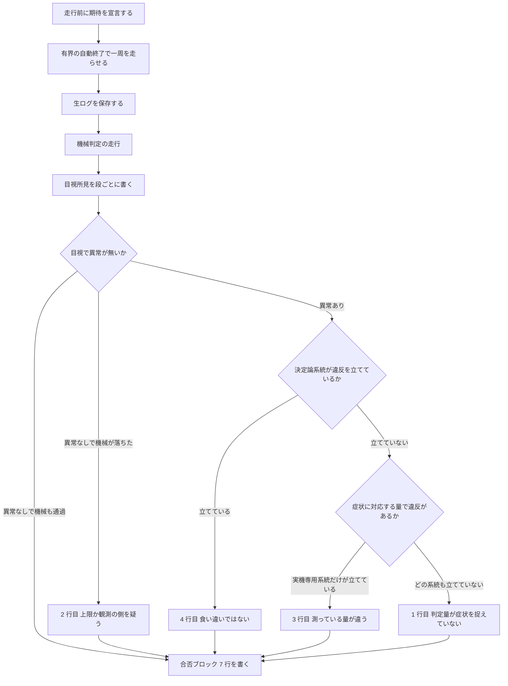

# Technical Design Document

## Overview

本仕様の成果物は**証明**である。動く機能を足すのではなく、「適合対象ゴースト emo2 が起動から終了までを一周する」ことを、⑴ 常時走る決定論的な一周テストと、⑵ 実機での一周走行の人間サインオフ、という二層の観測で確定させ、M1 完成の判定基準を 1 か所へ束ねる。ロードマップは本ユニットを M1 の最終ユニットと定め、「証明に徹する（`crates/` 本番コード改変 0 が原則）」を着手条件として課している（`.kiro/steering/roadmap.md:72`・`:88`）。

決定論層は新しいテスト機構を作らない。既に在る組立（`crates/areka/src/emo2_boot/spine.rs:617` の `SpineHarness`）へ、既に在る注入口（`crates/areka-ghost/src/runtime.rs:218` の kanade 送信端・同 `:223` の dispatcher 送信端）から入力を流し、既に在る記録（`spine.rs:287` の呼出記録・`crates/areka/src/emo2_boot/frame/wiring.rs:280` の表示指令の取り出し口）を読むだけである。本仕様が新たに書くのは**台本と期待列と段の駆動順**であって、仕組みではない。

実機層は判断そのものを人間へ委ねる。本仕様が作るのは、判断を再現可能にする**条件・手順・記録様式**と、機械判定と目視が食い違ったときの読み分けである。読み分けは先行仕様の完成品（`.kiro/specs/completed/areka-P0-dpi-transition-atomicity/signoff-procedure.md` の §6.5／§6.6）をそのまま引く。

### Goals

- 起動 → 起動挨拶 → 自発会話 → 撫で反応 → メニュー表示 → 選択によるシーン遷移 → 位置調整 → 終了挨拶 → 正常終了を、**1 本の決定論テスト**で辿り、交信の列と表示指令の列を期待と完全一致で判定する。
- **適合検証項目表**（20 項目）を本書 1 か所に置き、期待する結果・観測の層・由来ユニット・期待値の出典を各項目に持たせる。
- 実機一周走行の**条件・手順・記録様式**を固定し、走行の同定情報と根拠の種別を記録だけで後から検証できる形にする。
- 完成判定を 3 点（全体テストの成功・許諾の検査・実機サインオフ）へ一本化し、根拠を 1 か所から辿れる状態で宣言する。
- 完成判定を脅かす間欠的な赤（既知の 3 系統＋実測で足した系統）に**隔離か更新かの裁定**を下し、失う被覆と根治の引受先を記録する（既存テストの根治はしない。本仕様が新設した檻の欠陥だけは自ら直す＝D11 系統 ⑹・2026-09-04）。

### Non-Goals

- **走行で見つかった欠陥の是正そのもの**。仕分けて個別仕様へ渡す（本書「欠陥の仕分け規律」）。
- **間欠的な赤の根治**。引受先は `.kiro/specs/areka-P0-zorder-chain-residue/brief.md` の A-1／A-2。
- **参照実装との完全一致**。証明するのは適合対象ゴーストが動くことである。
- **新機能・新しい見た目・各エンジンの内部品質**。すべて上流ユニットが所有する。
- **画面更新の間引きの既定値の変更**（`roadmap.md:95`）。本走行と並走させない。

## Boundary Commitments

### This Spec Owns

- **決定論一周テスト**（新規・常設・明示実行の門を持たない）と、その台本・期待列・段の駆動順。
- **適合検証項目表**（20 項目）——M1 ゴールの単一定義。本書がその唯一の置き場である。
- **実機一周走行の手順書と記録**（条件・観測条件・記録様式・人間サインオフ・読み分け・既知症状の登記）。
- **間欠的な赤の隔離裁定**（除外するか更新するか。既存テストの判定ロジックには触れない）。R9.1 の「3 系統」は下限であり、実装中に実測された系統も同じ裁定表へ載せる（D11・2026-09-04）。本仕様が新設した檻に自らの競走欠陥が見つかった場合は、それだけは本仕様が直す（系統 ⑹）。
- **M1 完成判定の手順と宣言**、およびそれに伴う正本文書の更新（`doc/emo2-conformance-scope.md:24` の訂正・`.kiro/steering/roadmap.md` の M1 の節を閉じる）。

### Out of Boundary

- 走行で見つかった欠陥の是正コード（都度切る個別仕様が持つ）。
- `crates/` の本番コード（`#[cfg(test)]` でない経路）への一切の改変。
- 間欠的な赤の根治（`areka-P0-zorder-chain-residue` A-1／A-2）。
- 上流の確定済み期待値の見直し（本仕様は確かめる側であり、裁定を覆さない）。
- 完了置き場（`.kiro/specs/completed/`）の文書の改変。
- `crates/log-capture-kit/tests/file_length_guard_test.rs` の例外表（編成側で「誰も触らない」と決まっている・`roadmap.md:105`）。

### Allowed Dependencies

| 依存先 | 用途 | 制約 |
|---|---|---|
| `crates/areka/src/emo2_boot/spine.rs` の `SpineHarness` | 決定論一周テストの母体（起動・受け口・GPU World・後片付け） | 既存の公開面（構造体フィールドと関数）を使う。既存の判定・記録形は変えない |
| `crates/areka-ghost/src/runtime.rs:218`／`:223` | 撫で・二重クリック・選択確定・毎秒通知・終了指示の注入 | 既存の公開送信端のみ。新設しない |
| `crates/areka/src/emo2_boot/frame/wiring.rs:280` | 表示指令の列の取り出し | `#[cfg(test)]` の既存取り出し口。追加しない |
| `crates/areka/src/placement/transition_signoff_tests.rs` の走行 | 実機ログの機械判定 | 判定は決定論テストと同一の純関数を回す。判定を二重に書かない |
| `.kiro/specs/completed/areka-P0-dpi-transition-atomicity/signoff-procedure.md` §6.5／§6.6 | 読み分けの表と合否ブロック | 引用して使う。独自の突合規約を作らない |
| `.claude/skills/kiro-complete/SKILL.md` の DoD 手順 | 完成判定の ⑴⑵ | 手順を写すのではなく参照する。判定条件を二重に持たない |

### Revalidation Triggers

以下が起きたら、本仕様の期待列・項目表・記録様式を引き直す。

1. **本番の受け口列（`crates/areka-ghost/src/runtime.rs` の結線）に受け口が増える**——決定論テストが受け口の本数や表示指令の件数を固定していると崩れる。併走仕様側の保存義務として登記済み（`roadmap.md:100`）。
2. **送出イベントの許可集合（`crates/areka-kanade/src/schedule/events.rs:70-82`）が変わる**——交信列の期待が変わる。
3. **起動系列の順序が変わる**（`OnInitialize`→`username`→`OnFirstBoot`→`OnBoot`→`basewareversion`）。
4. **`SpineHarness` の受け口構成・起動手順が変わる**（`spine.rs:793-811`）——段の駆動が成立しなくなる。
5. **上流の確定済み期待値が改訂される**（二体の隣接・台本の移動量の拡大率倍・バルーン追従の相対位置）——適合検証項目表の期待値欄が陳腐化する。
6. **`transition_signoff` の走行の呼び方・環境変数名が変わる**（`crates/areka/src/placement/transition_signoff_tests.rs:59-61`）——実機の機械判定の手順が壊れる。

## Architecture

### Existing Architecture Analysis

一周を辿るテストの母体は 2 系統ある。台本化した応答による系統（`crates/areka-ghost/tests/ghost/spine_e2e_test.rs`）と、実ビルドの x64 テスト DLL を読み込む系統（同 `inproc_e2e_test.rs`）である。どちらも窓と画面を持たないため、**見た目に関わる段を観測できない**。

見た目まで組む系統は `areka` クレート側にしか無い（`crates/areka/src/emo2_boot/spine.rs:681` の `boot_with` が headless GPU の World・合成した窓一式・実 emo2 資産・本番と同じ 4 つの受け口を組む）。要件討議はここを一周テストの置き場と裁定した（research §7.1）。`areka` は bin のみで lib を持たないため、内部へ届くテストは同じディレクトリの兄弟ファイルとして置くのが唯一の形である（`crates/areka/src/emo2_boot/mod.rs:29-34`）。

既存の spine 兄弟テストは 8 ファイル（実テスト 19 本）が `spine.rs:907-930` の接続宣言（1 本 3 行）で繋がれている。本仕様の一周テストも同じ形で 3 本を繋ぐ。

**足りないのは 3 点だけである。**

1. **毎秒の通知が入っていない**。既存 spine は dispatcher へしか Tick を投げず（`spine.rs:857`）、kanade へ投げていないため `OnSecondChange` が発行されない（`spine.rs:666` が明記）。自発会話（適合項目 5）はここから駆動する。
2. **撫で・二重クリック・選択確定が一周を辿るテストから 1 度も使われていない**。注入口は公開済み（`crates/areka-kanade/src/msg.rs:134`／`:138`）だが、使用箇所は単体テストと本番配線だけである。
3. **進行状態のヘッダが記録に残っていない**。受け口は受け取っているが捨てている（`spine.rs:220`／`:241` の `_status`）。

### Architecture Pattern & Boundary Map

**選んだ形**: 観測を二層に分け、層ごとに独立した合否を持つ。層の間で結果を融通しない。決定論層は 1 本の走行で一周を辿り、実機層は同じ項目表を人間が判定する。項目表だけが両層に共有され、期待値の単一の源になる。



**責務の分け方**:

- 項目表は**期待値の単一の源**であり、両層はこれを参照して写しを持たない（R4.1）。
- 決定論層は「交信の列」と「表示指令の列」という 2 つの列だけを見る。見た目の善し悪しは見ない。
- 実機層は「見た目」と「実 SHIORI が実際に何を言うか」を見る。機械判定は実機ログに対してのみ走り、判定そのものは決定論層と同一の純関数である（R6.4）。
- 完成判定は両層の結果を**そのまま**受け取り、片方を他方で埋め合わせない（R1.3・R1.6）。

**維持する既存の型**: 兄弟テストファイルの配置（`.kiro/steering/structure.md:146`）・1 ファイル 1,000 行以下（同 `:176`）・明示実行の門を持たない常設テスト・注入時刻だけで進める決定論。

**新規に足す部品の理由**: 一周の段を順に駆動する駆動器（既存のヘルパは 1 段ぶんしか駆動しない）と、進行状態の記録（既存の記録形が捨てている）。それ以外は既存部品の組み替えである。

### Technology Stack

| 層 | 選択 | 本仕様での役割 | 備考 |
|---|---|---|---|
| テスト実行 | Rust 2024 / `cargo test`（外部 CI 無し） | 決定論一周テストの常設実行 | 新規依存なし。`tokio` 不使用 |
| テスト母体 | `crates/areka/src/emo2_boot/spine.rs` の `SpineHarness` | headless GPU World・合成窓・実 emo2 資産・本番同型の 4 受け口 | 既存。`make_world_with_gpu` は MTA COM 初期化＋WARP 可（`spine.rs:447-458`） |
| 注入 | `areka-ghost` の kanade／dispatcher 送信端 | 毎秒通知・撫で・二重クリック・選択確定・終了指示 | 既存の公開面（`runtime.rs:218`／`:223`） |
| 記録 | `ScriptedShioriHandle`（交信）／`Emo2Wiring::drain_received`（表示指令） | 列の採取 | 交信側に進行状態の記録を 1 系統追補する |
| 実機判定 | `crates/areka/src/placement/transition_signoff_tests.rs` の明示実行走行 | 実機ログの機械判定 | 環境変数 `AREKA_TRANSITION_LOG`（定義は `crates/areka/src/placement/transition_judge_verdict.rs:102`） |
| 完成判定 | `.claude/skills/kiro-complete/SKILL.md` の DoD 手順 | 全体テストと許諾の検査 | `deny.toml`・`about.toml`・`about.hbs` が実在するため許諾の検査は実際に走る |

## File Structure Plan

### Directory Structure

```
crates/areka/src/emo2_boot/
├── spine.rs                              # 既存。接続宣言 3 本と記録の追補のみ
├── spine_conformance_lap_tests.rs        # 新規: 一周の走行本体 #[test] 1 本
├── spine_conformance_script.rs           # 新規: 台本と期待列の逐語
└── spine_conformance_support.rs          # 新規: 段の駆動ヘルパと突合ヘルパ

.kiro/specs/areka-P0-emo2-conformance-e2e/
├── design.md                             # 本書。D4 適合検証項目表の唯一の置き場
├── brief.md                              # 既存。引き受けた 3 件へ「消化済み」を追記する
└── verification/
    ├── lap-procedure.md                  # 新規: 実機一周走行の手順書
    ├── acceptance-record.md              # 新規: 走行の受入記録
    ├── isolation-decision.md             # 新規: 間欠的な赤の隔離裁定の記録
    └── m1-completion.md                  # 新規: 完成判定と宣言
```

各ファイルの責務は 1 つに絞る。

- `spine_conformance_lap_tests.rs` — 一周の段を順に駆動し、最後に交信の列と表示指令の列を期待と突き合わせる。**判定はこのファイルだけが行う**。
- `spine_conformance_script.rs` — 台本（応答表）と期待列（交信・表示指令）の逐語。**駆動も判定も行わない**。期待値を 1 か所に集めることで、上流の裁定が変わったときの追随点が 1 つになる。
- `spine_conformance_support.rs` — 段の駆動（注入と有界待ちの組）と、記録の突合に使う投影関数。**期待値を持たない**。

### Modified Files

- `crates/areka/src/emo2_boot/spine.rs` — ⑴ 末尾（`:907-930` と同じ形）へ接続宣言 3 本を追加。⑵ 受け口へ**記録の第 2 系統**（呼出 id と組み立て済み進行状態の対の列）を追補し、取り出し口を 1 本足す。記録の型と取り出し口の本体は `spine_conformance_support.rs` に置き、`spine.rs` にはフィールドと書き込み（2 か所）だけを残す（`spine.rs` は 930 行で余白 70 行・追補の予算は接続宣言込みで 40 行以内・Testing Strategy §2）。既存の `RecordedCall`（`:109-118`）と `non_status_calls()`（`:287`）は変えない。
- `crates/areka-ghost/tests/ghost/spine_e2e_test_s3_helper_liveness_detected.rs` — `:174-185` の「待たずに数える」形を、既存の手本（`crates/areka/src/emo2_boot/spine_boot_smoke_tests.rs:32-36`）と同じ「条件が満たされるまで待つ」形へ更新（R9.2）。
- `crates/areka-ghost/tests/ghost/spine_e2e_test_s1_boot_success.rs` — 同形の兄弟。`:145-156` の待ちが表示記録の非空しか見ないまま `:185-196` が 5 要素を等値照合する形を、S3 と同じ「条件が満たされるまで待つ」形へ更新（R9.2・**2026-09-04 の開発者裁定で追加**＝requirements.md「改訂」節 2）。等値照合そのものは変えない。
- `crates/wintf/src/ecs/window/zorder_pair_maintain_always_on_top_tests.rs` — `:369` と `:740` の 2 本へ理由付きの `#[ignore]` と環境変数の門を付与（R9.3）。判定ロジックは 1 行も変えない。
- `crates/wintf/src/runtime/tick_bridge.rs` — `:346` の 1 本へ同じ形の門を付与（R9.3）。
- `doc/emo2-conformance-scope.md` — `:24` の訂正（R11.1）と、完成宣言時の充足済み注記（R11.2）。
- `.kiro/steering/roadmap.md` — M1 の節を閉じる・干渉台帳の e2e 行を新前提へ書き換える・申し送り生存先の行（`:66`）を閉じる（R11.2・R11.4）。
- `.kiro/specs/areka-P0-emo2-conformance-e2e/brief.md` — 引き受けた 3 件（申し送り B-1／B-3・掴んで動かしたときの追従）の該当ブロックへ「消化済み」を追記する（R11.4）。送り元は完了置き場に在って受け取れないため、生きた写しであるこの brief が登記先になる。

## System Flows

### 一周の段と注入・観測



段の切れ目は**注入時刻の区間**で表す。各段は自分の観測が成立するまで注入と観測を交互に回し、注入時刻がその段の上限（頭打ち）に達したら以後は注入せず観測だけを待つ。頭打ちを置く理由は、注入時刻が観測を追い越すと待っている条件そのものが壊れて永久に不成立になるためである（`spine.rs:318-326` が実測で記録している壊れ方）。

### 実機走行の合否の決まり方



3 つの問いは**上から順に当てる**。順序を入れ替えない（決定論系統の違反は、症状に対応する量でなくても「機械は症状ありと言っている」ことを意味するため）。全ての欄が満たされたときにのみ合格とする。

## 適合検証項目表（D4・R4 の実体・M1 ゴールの単一定義）

本表が M1 ゴールの唯一の定義である。決定論一周テストと実機走行の記録は**本表を参照し、写しを持たない**（R4.1）。

**総数の登記（R4.8）**: brief の 14 項目（`brief.md:83-98`）を基礎とし、上流からの申し送りで確定した追補 6 項目を加えた **20 項目**。ロードマップのゴール文「適合 14 項目一周」（`roadmap.md:72`）は、完成宣言でロードマップの M1 の節を閉じるとき（R11.2）に「14 を基礎＋追補 6 ＝ 20」へ書き換える。

**本仕様が証明する範囲（R4.7）**: 証明するのは**適合対象ゴースト emo2 が動くこと**であって、参照実装との完全一致ではない。重なりの手前・奥の規約が参照実装と逆向きであること（適合対象の資産では現れないため検出されない）と、台本の移動量に拡大率を掛けること（意図的な非互換）は、いずれも登記済みの差であり本走行の合否に載せない。

| # | 項目 | 期待する結果 | 観測の層 | 由来ユニット | 期待値の出典 |
|---|---|---|---|---|---|
| 1 | 起動と既定位置 | 起動だけで立ち絵が既定位置（本体は右下・相方は左）に出る。初回の `\s` まで非表示で、以後は実サーフェスが描かれる。拡大率が 96 dpi でない水準でも座標が破綻しない | 両層 | emo2-boot／window-placement | 決定論＝`spine_display_tests.rs:65` の装着と初回 `\s` の遷移。実機＝目視 |
| 2 | 起動挨拶の再生 | 応答が 1 文字ずつ流れ、待ちと改行と表情の切替が台本どおりに同期する | 両層 | cue-playback-duration | 決定論＝表示指令の列。実機＝目視 |
| 3 | 着せ替えの表情 | `\![bind]` で本体側の表情が変わり、切替後も固着しない | 両層 | mayuna-compose／bindoption-exclusivity | 決定論＝`crates/areka-seriko/tests/bind_e2e.rs`（台本 → 合成 → 表示指令までの貫通）と `crates/areka-seriko/src/state_bind_pattern_tests.rs:203-331`（同カテゴリの排他置換＝切替後に固着しない・5 本）。実機＝目視 |
| 4 | まばたき 2 系統 | 本体は着せ替え＋抽選、相方は抽選でまばたく | 両層 | seriko-loop | 決定論＝`spine_seriko_loop_tests.rs`（固定注入乱数列）。実機＝目視 |
| 5 | 放置で自発会話・会話中は割り込まない | 毎秒の変化通知で自発会話が始まる。会話中は同じ通知が片道になり、返ってきた応答が新しい会話を始めない | 両層 | idle-talk | 決定論＝本仕様の一周テスト（R3.2・照会と通知の別と Ref3）。実機＝目視 |
| 6 | 撫で反応（本体側と相方側の両方） | 頭・胸を撫でると当たり領域と話者が付随参照に載った照会が送られ、反応が返る | 両層 | collision-geometry＋input-events | 決定論＝R3.3。実機＝Head0／Bust0／Head1／Bust1 の 4 か所 |
| 7 | 二重クリックでメニュー | メニューが表示され、選択肢が字下げされる。選択肢の上にカーソルを載せると見た目が反転する | 決定論（表示まで）／実機（反転） | input-events＋sakura-dialogue-tags＋choice-render | 決定論＝R3.4 と表示指令の列。反転は処理系に 1 度だけ焼き付く環境変数のため実機層（`hover_inject.rs:29`・`:184`） |
| 8 | 選択によるシーン遷移の一周 | 選択 → サブメニュー → もどる → 閉じる、が一周する。適合対象の選択肢 ID は `On` 始まりゆえ**同名イベント 1 段のみ**が発火し、正典の選択確定イベントは先行しない | 両層 | choice-select-events | 決定論＝R3.5（`choice.rs:57-65`・実物 `menu.pasta:15`／`:33`／`:62`）。実機＝目視 |
| 9 | 位置調整 | `\![move,-353,,,0,base,base]` で相方の窓が算出位置へ動く。**移動量は拡大率倍で適用される**ため、実拡大率が 1 でない走行では着地が変わる | 両層 | sakura-dialogue-tags | 決定論＝`spine_move_cue_tests.rs`（k=1 で着地 1208,1063）。実機＝拡大率 200% で二体の重なりが 100% の 2 倍。出典は scope-chain-gap 申し送り（`brief.md:26`） |
| 10 | 二人立ち総合 | 相方の窓と相方用バルーンが表示され、話者が交替し、別名指定で相方の表情が変わり、両バルーンが追従し単独でも動かせる | 実機 | M-boot 充足＋本仕様（退役ユニット 2 本の吸収先） | 実機のみ＝束ねた見た目の総合判断であり、含まれる「両バルーンの追従と単独移動」は項目 17 と同じ理由で決定論層が指令の待ち行列までしか測らない（R1.4・`brief.md:55`）。**退役した 2 つのユニット名の検証を本項目が吸収した**（R4.5・`brief.md:109`）。旧名を復活させない |
| 11 | 利用者名の展開 | 利用者名が展開されて表示に載り、生の記法が漏れない | 両層 | sylphya／sakura-dialogue-tags | 決定論＝R3.10。実機＝目視 |
| 12 | 位置の永続化 | 窓を動かして終了し再起動すると位置が復元する。初回起動限定の位置調整は 2 回目以降の起動では既定配置へ戻る（許容仕様の裁定を実機で最終確定する） | 実機 | position-persist | 実機＝再起動が要るため決定論層で観測できない（R1.4）。裁定の確認は R7.3 |
| 13 | 終了 | 終了指示 → 終了挨拶 → 終了指令 → 解放、の順で進み、解放はちょうど 1 度だけ起きる。会話が途中で切れず静かに終わる | 両層 | input-events＋kanade | 決定論＝R3.9。実機＝目視と正常終了 |
| 14 | 省略した機能の縮退 | 更新系とバルーン変更のイベントを送らなくても破綻しない。未使用のバルーン資産（矢印・目印・通信系）が描かれなくても破綻しない。選択待ちの時間切れが裁定どおりに振る舞う | 両層 | 本仕様 | 決定論＝R3.7（期待列に無い送出は失敗）。実機＝目視。**「任意」は正典の明示宣言ではなく発火契機からの導出である**（research §9.5） |
| 15 | バルーンの表示ライフサイクル | 会話の始まりでバルーンが現れ、終わりから所定時間で消える。起動直後は不可視のまま確立される | 両層 | balloon-visibility | 決定論＝`balloon_visibility_lifecycle_e2e_tests.rs`（会話の占有終端が消灯の計測起点になること）と `spine_display_tests.rs:185`（起動直後は不可視のまま確立される）。実機＝目視 |
| 16 | 拡大率の切替 | 接地点が新しい作業領域の下端に載る。随伴バルーンが同一フレームで追従し、**追従の相対位置は拡大率倍へ更新される**。遷移の途中で中間の矩形が提示されない。窓が 1 枚ずつ順にずれていく形は観測されない | 両層 | dpi-transition-atomicity／balloon-offset-dpi | 決定論＝`frame_transition_atomicity_tests.rs`／`frame_balloon_offset_follow_tests.rs`。実機＝機械判定の走行。**見た目の跳ねは合否条件に含めない**（R7.1） |
| 17 | 掴んで動かしたときの追従 | 掴んで動かすと窓がカーソルへ 1 対 1 で付いてくる | 実機 | dpi-transition-atomicity（上流が明示的に未測定として渡した） | 実機のみ。決定論テストは指令の待ち行列までしか測らない（`brief.md:55`） |
| 18 | 二体の隣接 | 既定の間隔は隣接（隙間 0）。拡大率遷移の後も一度だけ解き直されて隣接に戻る。ただし明示的に動かされた側は対象外 | 両層 | scope-chain-gap／dpi-transition-atomicity | 決定論＝`frame_chain_realign_tests.rs`。実機＝目視。出典は `brief.md:25`・`:45` |
| 19 | 再表示直後の重なり順 | 再表示の直後もバルーンがキャラの手前に居続ける | 実機 | ghost-window-zorder（申し送り B-1） | 実機のみ＝重なり順は実窓を OS へ問い合わせて初めて見えるため、窓を持たない決定論層では観測できない（R1.4）。再断行の要求を挿す本番の箇所は owner 確立時の 1 か所だけで（`crates/wintf/src/ecs/window/zorder_pair_establish.rs:180`）、再表示経路には挿さない（同ファイル `:175-178` の注記が挙げる再表示・z 変化検知の挿入元は本番に存在せず、`spawn_zorder_pair_export_tests.rs:54` のテストのみ。research §2.4 は「本番に挿入 0 件」と書くが確立系の 1 か所を数え落としている）。**拡大率の切替は再表示を伴うので項目 16 の直後が確認の好機** |
| 20 | 子プロセスへの受け渡し | 実 32bit の脳が引数・環境変数・作業ディレクトリの 3 経路で立ち上がり、実際に応答する | 実機 | test-cage-determinism（申し送り B-3） | 実機のみ＝決定論層は台本化した応答で駆動し実 SHIORI を用いない（R2.1）ため、別プロセスの実 32bit の脳が立ち上がること自体を観測できない（R1.4）。「1 度通った」＝**3 経路の同時成立**。証跡は接続失敗が 0 行・実 SHIORI 由来の起動挨拶が出た・正規の解放完了が 1 行（research 決定 F） |

**期待値の出典追跡（R4.9）**: 各行の「期待値の出典」欄が出典を持つ。上流の裁定が改訂されたら、その出典を持つ行だけを引き直せばよい。出典が完了置き場の仕様であっても、参照は読み取り専用であり改変しない。

## Requirements Traceability

| 要件 | 要旨 | 実現する構成要素 | 契約・成果物 |
|---|---|---|---|
| 1.1 | 一周の定義を 1 つの走行として扱う | D1 一周テスト | 段の列（本書 System Flows） |
| 1.2 | 観測を二層に分ける | D1／D5 | 二層の境界図 |
| 1.3 | 層ごとに独立した合否 | D5／D10 | 受入記録の層別欄 |
| 1.4 | 決定論で観測できない項目を明示 | 適合検証項目表 | 「観測の層」欄と理由（項目 7・10・12・17・19・20） |
| 1.5 | 結合と一周でしか現れない事象を見る | D1 | 会話中の割り込み抑止・選択待ち中の自発会話の抑止（項目 5・8） |
| 1.6 | 1 段でも不成立なら不合格 | D1／D5 | 段ごとの完了条件と、部分結果を合格にしない規則 |
| 2.1 | 実時計・実 SHIORI 非依存 | D1／D2 | 台本化した応答と注入時刻のみ |
| 2.2 | 1 本の走行で一周を辿る | D1 | `#[test]` 1 本 |
| 2.3 | 交信列を完全一致で判定 | D3 交信の台帳 | 期待列との等値照合 |
| 2.4 | 表示指令の列（段＝注入時刻の区間・指令）を完全一致で判定 | D3 表示の台帳 | 〈段・指令〉列の等値（判定の本体）＋区間の自己検査＋判定が生きている対照 1 本 |
| 2.5 | 期待に無いものが 1 つでも出たら失敗 | D3 | 等値照合（部分一致・包含判定を使わない） |
| 2.6 | 新しい仕組みを発明しない | D1 | 既存 `SpineHarness`・既存注入口・既存取り出し口のみ |
| 2.7 | 全ての実行主体が有界時間で終わる | D1 | 終了段の完了条件（kanade の自己終了の観測）＋既存の有界な畳み方（`spine.rs:871`） |
| 2.8 | 明示実行の門を持たない | D1 | `#[ignore]` も環境変数も付けない |
| 2.9 | 製品コード非改変で注入 | D1 | 既存の公開送信端のみ。新設ゼロ |
| 2.10 | 壁時計だけの待ちを避ける | D6 段の駆動器 | 観測が成立するまで進める形＋注入時刻の頭打ち |
| 2.11 | 1 ファイルの分量規律 | File Structure Plan | 3 ファイル分割・各 1,000 行以下 |
| 3.1 | 起動の列を逐語で固定 | D2 期待列 | `OnInitialize`→`username`→`OnFirstBoot`→`OnBoot`→`basewareversion` |
| 3.2 | 自発会話は毎秒の変化通知で駆動 | D1／D6 | kanade へ Tick を直接投函 |
| 3.3 | 撫でで移動の通知・当たり領域と話者 | D2 期待列 | 参照 7 本・Ref3=話者・Ref4=当たり領域 |
| 3.4 | 二重クリックでメニュー用の通知 | D2 期待列 | 参照 7 本・Ref2="0"・Ref5=ボタン |
| 3.5 | 選択確定は同名イベント 1 段のみ | D2 期待列 | 正典の選択確定イベントが先行しないことを列で固定 |
| 3.6 | 会話の発火と時報を送らない | D3 | 等値照合で自動的に効く |
| 3.7 | 更新系 4 種とバルーン変更を送らない | D3 | 同上 |
| 3.8 | 進行状態が交信のヘッダに現れる | D3 進行状態の台帳 | 記録の第 2 系統（`spine.rs` の追補） |
| 3.9 | 終了握手の順序と解放 1 度 | D2／D3 | 通常の握手で駆動し、解放の件数を数える |
| 3.10 | 利用者名の展開・生の記法が漏れない | D2 期待列 | 照会の応答と表示指令 |
| 4.1 | 項目表は 1 か所・写しを持たない | 適合検証項目表 | 本書のみに置く |
| 4.2 | 追補 6 項目を含む | 適合検証項目表 | 項目 15〜20 |
| 4.3 | 各項目に期待・層・由来 | 適合検証項目表 | 表の 4 欄 |
| 4.4 | 上流の裁定で変わった期待値を反映 | 適合検証項目表 | 項目 18（隣接）・項目 9（拡大率倍）・項目 16（追従の相対位置） |
| 4.5 | 二人立ちを 1 項目で持ち吸収を記す | 適合検証項目表 | 項目 10 |
| 4.6 | 省略してよい機能の確認を 1 項目で持つ | 適合検証項目表 | 項目 14 |
| 4.7 | 証明する範囲の明記 | 適合検証項目表の前書き | 参照実装との完全一致ではない |
| 4.8 | 総数の登記とロードマップとの対応 | 適合検証項目表の前書き | 14＋6＝20・R11.2 で揃える |
| 4.9 | 期待値の出典を持ち追随できる | 適合検証項目表 | 「期待値の出典」欄 |
| 5.1 | 実ゴースト・絶対パス・実拡大率 | D5 手順書 | 起動コマンドを絶対パスで逐語に持つ |
| 5.2 | 採取を同定できる情報 | D5 記録様式 | 走行同定欄（本書 Data Models） |
| 5.3 | 環境変数の明示・未指定は「未指定（既定）」 | D5 記録様式 | 環境変数欄（既定値付き） |
| 5.4 | 項目ごとの結果と根拠・根拠の種別を区別 | D5 記録様式 | 判定行の「根拠の種別」欄 |
| 5.5 | 有界の自動終了と記録用の出力水準 | D5 手順書 | 自動終了の指定と出力水準の指定 |
| 5.6 | 結果を見る前に期待を宣言 | D5 手順書 | 宣言欄を走行前に埋める |
| 5.7 | 消灯した観測点の沈黙を根拠にしない | D5 手順書 | 点灯確認の欄と、消灯時の代替宣言 |
| 5.8 | 子プロセスへの受け渡しを実走で 1 度通す | D5 記録様式 | 3 経路の同時成立を 3 つの証跡で記録 |
| 5.9 | 実測目的の他仕様を並走させない | D5 手順書 | 走行前の確認欄 |
| 5.10 | 合否は人間が確定する | D10 完成判定 | AI 単独で宣言しない |
| 5.11 | 中断時は部分結果を合格にしない | D5 記録様式 | 中断点の欄 |
| 6.1 | 先行仕様の読み分け手順をそのまま用いる | D7 読み分け | 3 問と 4 行の表を引用 |
| 6.2 | 機械が通り目視で症状 → 判定量が捉えていない | D7 | 表の 1 行目 |
| 6.3 | 機械が落ち目視で症状なし → 上限か観測を疑う | D7 | 表の 2 行目 |
| 6.4 | 実機ログの判定は同一の純関数 | D7 | 既存の明示実行の走行を回す |
| 6.5 | 未指定・不達・観測 0 行を失敗にする | D7 | 既存判定が既に持つ |
| 6.6 | 窓ごとの書込違反は見送り一覧を先に見る | D7 | 判定器の既知の限界として扱う |
| 6.7 | 決まった書式の合否ブロック | D7 | 7 行の合否ブロック＝**項目 16 の証跡**（走行 D の出力）。「全ての欄が満たされたときにのみ合格」は 7 行すべて記入・未記入 0 行の意（2026-09-04 改訂） |
| 7.1 | 絵と窓の遅れを引受先なしの既知の未達として登記 | D8 既知症状の登記 | 拡大率遷移の見た目を合否条件に含めない。D7 の FAIL の読み分け（`SIGNOFF-BOUNDS: FAIL`＋`VISUAL: 跳ねあり`＋`AGREEMENT: 食い違い` は症状 #1 の再現ゆえ項目 16 の不合格理由にしない）はこの登記に依る |
| 7.2 | 話し始めの冒頭の空行を確認して登記 | D8 | 上流ゴースト側の未解決 |
| 7.3 | 初回限定の位置調整の裁定を実機で最終確定 | D8 | 項目 12 の実機判断 |
| 7.4 | 重なり規約の逆向きが本走行では現れない旨を明記 | D8 | 適合検証項目表の前書きと登記 |
| 7.5 | 「判定に載せない」と明示し是正対象としない | D8 | 登記表の「扱い」欄 |
| 7.6 | 引受先を作るなら実在を確かめてから登記 | D8 | 実在確認の欄 |
| 8.1 | 証明に徹し製品コードを改変しない | Boundary Commitments | 本番コード改変 0 |
| 8.2 | 症状を小さいものと構造的なものへ仕分ける | D9 仕分け規律 | 仕分けの 2 分岐 |
| 8.3 | 構造的なら個別仕様を切って先に完遂 | D9 | 完遂後に一周走行をやり直す |
| 8.4 | 仕分けの結果を記録 | D9 | 仕分け表 |
| 8.5 | 引受先の無い症状を閉じない | D9 | 引受先欄の空欄禁止 |
| 8.6 | 改変が避けられない場合は範囲と理由と挙動不変を残す | D9 | 例外欄 |
| 8.7 | 1 症状 1 引受先の粒度 | D9 | 仕分け表の粒度規則 |
| 9.1 | 3 系統に裁定を下し理由を記録 | D11 隔離裁定 | 裁定表。3 系統は下限であって上限ではない——実測で足した ⑸ ⑹ も同じ表に載せる（2026-09-04） |
| 9.2 | 「待たずに数える」形を待つ形へ更新 | D11 | `spine_e2e_test_s3_helper_liveness_detected.rs`（系統 ⑴）と `spine_e2e_test_s1_boot_success.rs`（系統 ⑸）の 2 ファイルの更新（S1 は 2026-09-04 改訂） |
| 9.3 | wintf 側 2 系統を明示実行の門へ隔離・emo2_boot 側は触らない | D11 | `#[ignore]`＋環境変数 |
| 9.4 | 失う被覆と根治の引受先を明記 | D11 | research §10.1 の表を記録へ写す |
| 9.5 | 根治は行わない | D11 | 判定ロジック非改変 |
| 9.6 | 隔離前・隔離後に各 3 回（上限・事前確定） | D11 | 走行回数の事前宣言 |
| 9.7 | 門を持たないことを要件にしているテストに門を付けない | D11 | 対象外一覧 |
| 9.8 | 編集集合の外に触れる範囲を 2 ファイルに限る | D11 | 併走仕様の非接触を着手前に確認 |
| 10.1 | 完成判定は 3 点 | D10 完成判定 | 全体テスト・許諾の検査・実機サインオフ |
| 10.2 | 許諾の設定不在なら「省略」と記録し通ったとしない | D10 | 本リポジトリでは設定が実在するため実際に走る |
| 10.3 | 32bit の橋渡し実行体の前提を判定手順に明記 | D10 | 前提の欄 |
| 10.4 | 実機サインオフは人間の判断 | D10 | AI 単独で宣言しない |
| 10.5 | 3 つの根拠を 1 か所から辿れる | D10 | 完成判定の記録が 3 つの参照を持つ |
| 10.6 | 未達があるなら未達・理由・引受先を明記 | D10 | 未達欄 |
| 10.7 | 隔離裁定の後に判定を行う | D10 | 手順の順序 |
| 11.1 | 実物定義の文書と実装の食い違いを訂正 | D12 正本更新 | `doc/emo2-conformance-scope.md:24` |
| 11.2 | 充足済み注記とロードマップの M1 の節を閉じる | D12 | 同文書＋`roadmap.md` |
| 11.3 | 退役ユニット名の吸収を登記し旧名を復活させない | D12 | 適合検証項目表 項目 10 |
| 11.4 | 引き受けた 3 件を消化済みとして登記 | D12 | 送り元が完了置き場の場合の登記先を定める |
| 11.5 | 判定に用いる語を実際に出力される語と一致させる | D12 | 語の突合欄 |
| 11.6 | 次の段階の起点が本宣言であることを記す | D12 | 完成宣言の末尾 |
| 12.1 | 編集集合を限る | Boundary Commitments／Modified Files | 例外は R9.2（**S3・S1 の 2 ファイル**・S1 は 2026-09-04 改訂）・R9.8 と、`spine.rs` の記録追補（具体化） |
| 12.2 | 既存の期待値を都合で緩めない | D11 | 判定ロジック非改変 |
| 12.3 | 共有ファイルが生じたら着手前に相互確認 | D11 | 着手前の確認欄 |
| 12.4 | 決定論層と実機層を独立した節に保つ | 本書の節構造 | 相 1＝D1〜D3・相 2＝D5〜D12 |
| 12.5 | 記録の無い縮退経路を作らない | 全体 | 縮退はすべて research §11 と本書に記録 |
| 12.6 | 常設テストの実行時間を実用の範囲に保つ | D1 | 既存 19 本 9.24 秒に対し追加 1 本 1 秒前後 |

## Components and Interfaces

**節構造が実装の相の境界を表す（R12.4）**: 仕様は分割しない。実装段階は 2 相に切る。**相 1** ＝ 決定論層（D1・D2・D3・D6）と、間欠的な赤の更新（D11 の系統 ⑴）。**相 2** ＝ 実機層と判定（D5・D7・D8・D9・D10・D12）と、間欠的な赤の隔離（D11 の系統 ⑵⑶）。実装中に実測されて裁定表へ足した系統 ⑸ ⑹ は、いずれも**相 2** で処置する（⑸ ＝ S1 の更新・⑹ ＝ 本仕様が新設した檻の是正。2026-09-04 改訂）。D4 適合検証項目表は両相が参照するため、相 1 の入口で確定させる。相 1 の成果物は相 2 の前提である（完成判定の ⑴ が相 1 のテストを含む全体テストの成功を要求するため）。

**層ごとに独立した合否（R1.2・R1.3）**: 決定論層の合否は常設テストの成否そのものであり、実機層の合否は**適合検証項目表 20 項目の実機サインオフ**である（R10.1 ⑶・R4.1）。**7 行の合否ブロックは実機層の合否そのものではなく、そのうちの項目 16 の証跡である**——走行 D（D5）のログへ機械判定を当てて得た出力を逐語で記録へ写したものであり、読み方は D7 に置く（2026-09-04 の開発者裁定・requirements.md「改訂」節 1）。受入記録は決定論層と実機層を**別の欄**に書き、片方を他方で置き換えない。完成判定は 2 つをそれぞれ受け取る。

| 構成要素 | 層 | 意図 | 要件 | 主な依存 | 契約 |
|---|---|---|---|---|---|
| D1 一周テスト | 決定論 | 一周を 1 本で辿り判定する | 1.1, 1.5, 1.6, 2.1, 2.2, 2.6, 2.7, 2.8, 2.9, 12.6 | `SpineHarness`（P0） | 状態 |
| D2 台本と期待列 | 決定論 | 応答と期待の逐語を 1 か所に集める | 3.1, 3.3, 3.4, 3.5, 3.9, 3.10 | 台本ビルダー（P0） | 状態 |
| D3 記録の台帳 | 決定論 | 交信・表示指令・進行状態を採取し照合する | 2.3, 2.4, 2.5, 3.6, 3.7, 3.8 | 呼出記録・表示の受信端（P0） | 状態 |
| D4 適合検証項目表 | 共有 | M1 ゴールの単一定義。両層が参照する期待値の源 | 4.1〜4.9, 1.4 | 上流の確定済み期待値（P1） | 文書 |
| D6 段の駆動器 | 決定論 | 段ごとに注入と観測を交互に回し頭打ちを守る | 2.10, 3.2 | kanade／dispatcher 送信端（P0） | サービス |
| D5 実機走行の手順書と記録 | 実機 | 条件・手順・記録様式を固定する | 5.1〜5.11, 1.2, 1.3 | 既存の実走注記（P1） | 文書 |
| D7 読み分けと合否 | 実機 | 機械判定と目視の食い違いを 1 つの手順で捌く | 6.1〜6.7 | 先行仕様の手順書（P0） | 文書 |
| D8 既知症状の登記 | 実機 | 判定に載せない症状を明示する | 7.1〜7.6 | 上流の記録（P1） | 文書 |
| D9 欠陥の仕分け規律 | 運用 | 走行を是正で膨らませない | 8.1〜8.7 | — | 文書 |
| D11 間欠的な赤の隔離 | 常設 | 完成判定の走行を汚さない | 9.1〜9.8, 12.2, 12.3 | 既存の門の書き方（P0） | 状態 |
| D10 完成判定 | 判定 | 3 点を 1 か所へ束ね宣言する | 10.1〜10.7, 5.10 | 完了手続き（P0） | 文書 |
| D12 正本の更新 | 文書 | 完成の事実を正本へ反映する | 11.1〜11.6 | 正本文書（P0） | 文書 |

### 決定論層

#### D1 一周テスト

| 項目 | 内容 |
|---|---|
| 意図 | 一周の全段を 1 本の走行で辿り、2 つの列を期待と突き合わせる |
| 要件 | 1.1, 1.5, 1.6, 2.1, 2.2, 2.6, 2.7, 2.8, 2.9, 12.6 |
| 置き場 | `crates/areka/src/emo2_boot/spine_conformance_lap_tests.rs` |

**責務と制約**

- `#[test]` は 1 本。明示実行の門（`#[ignore]`・環境変数）を持たない。
- 起動は `SpineHarness::boot_with`（`spine.rs:681`）に一周用の台本を渡して行う。GPU World・合成した窓一式・実 emo2 資産・本番と同じ 4 つの受け口は既存の組立がそのまま供給する。
- 段は次の順に駆動する。各段は自分の完了条件を持ち、成立しなければその時点で走行を不合格とする（後段の結果で埋め合わせない）。

| 段 | 注入 | 完了条件 |
|---|---|---|
| 起動 | なし（組立が行う） | 起動系列 5 呼出が記録に揃う |
| 装着 | 装着相を直接駆動 | 計画件数と実装着件数が一致する |
| 自発会話 | kanade へ毎秒の Tick | 自発会話の照会が応答を返し、表示指令が届く |
| 会話中の抑止 | 同上（会話中） | 同じ通知が片道になり Ref3 が "0" になる |
| 撫で | kanade へ移動入力（本体・相方） | 移動の照会が 2 件記録される |
| メニュー | kanade へ二重クリック | メニュー用の照会が記録され、選択肢の表示指令が届く |
| 選択確定 | kanade へ選択確定 | 同名イベントの照会が 1 段だけ記録される |
| サブメニューと戻り | 同上（もどる・閉じる） | 同名イベントの照会が続けて記録される |
| 位置調整 | 同上（位置調整の選択肢） | 移動指令が受信端へ届き、対象窓が算出位置へ動く |
| 終了 | kanade へ終了指示 | 終了の照会 → 終了挨拶の再生 → 解放、が記録され、解放がちょうど 1 件で、**かつ kanade の送信端への送信が Err になる（受信側が閉じた＝kanade の自己終了を観測）** |

- 判定は段の駆動をすべて終えた後にまとめて行う（段の途中で部分照合しない）。理由は、途中照合が「まだ届いていないだけ」を失敗と誤認するため。
- 後片付けは既存の有界な畳み方（`spine.rs:871`）を使う。同関数は強制終了経路（`OnClose` の片道通知と解放をもう 1 度送る経路）だが、終了段の完了条件が **kanade の自己終了の観測**を含むため、後片付けの時点で強制終了の届く先は無い（`GhostRuntime::shutdown` は送出失敗を「既に自発停止済み」の正常系として次段へ進む＝`crates/areka-ghost/src/runtime.rs:242-244`）。解放を出せる主体は kanade の終了系列だけであり（`crates/areka-kanade/src/shiori/real.rs:201`）、kanade が居なければ 2 度目の解放も台本に無い通知も**構造的に**起きない。「結果を捨てるから安全」ではなく、この順序が根拠である（設計討議 #1 裁定・2026-09-02）。

**依存**

- 入力: `SpineHarness`（P0）・D2 台本と期待列（P0）・D6 段の駆動器（P0）
- 出力: D3 記録の台帳（P0）

**契約: 状態**

- 状態モデル: 段は一方向に進み、後戻りしない。注入時刻は単調増加し、段ごとの上限を超えない。
- 一貫性: 交信の列・表示指令の列・進行状態の列はすべて同一の走行から採る。
- 並行性: 走行は別スレッド群を跨ぐ。待ち合わせは「観測が成立するまで進める」形で書き、壁時計の期限は打ち切りの上限としてのみ用いる。

**実装上の注意**

- 統合: 接続宣言は `spine.rs` 末尾（`:907-930` と同じ形）に足す。
- 検証: 走行時間は既存 19 本 9.24 秒（2026-09-02 実測）に対し 1 秒前後の増加に収める。超えたら段の待ち条件を見直す。
- 危険: 注入時刻が観測を追い越すと待っている条件そのものが壊れる（`spine.rs:318-326` の実測）。段ごとの頭打ちで構造的に防ぐ。

#### D2 台本と期待列

| 項目 | 内容 |
|---|---|
| 意図 | 応答表と期待列の逐語を 1 か所に集め、上流の裁定が変わったときの追随点を 1 つにする |
| 要件 | 3.1, 3.3, 3.4, 3.5, 3.9, 3.10 |
| 置き場 | `crates/areka/src/emo2_boot/spine_conformance_script.rs` |

**責務と制約**

- 台本は既存のビルダー（`spine.rs:141` の照会・`:154` の通知・`:163` の解放）で組む。応答は id ごとの待ち行列で、呼出のたびに先頭から 1 件消費される。**行列が尽きると受け口が落ちる**（`spine.rs:233`／`:254`／`:264`）ため、毎秒の通知には**駆動する Tick の本数ぶんに余裕を足した本数**の応答を積む。余裕を足しても余計な呼出は記録に残るので、列の等値照合が読みやすい失敗として拾う。
- 期待列は**送るもの**と**送らないもの**の両方を表す。送らないことは、等値照合（部分一致を使わない）によって自動的に効く。

**送出の期待（実装契約の逐語・出所は正典ではなく実装）**

| 段 | 呼出の別 | id | 参照列 |
|---|---|---|---|
| 起動 1 | 通知 | `OnInitialize` | なし |
| 起動 2 | 照会 | `username` | なし |
| 起動 3 | 照会 | `OnFirstBoot` | Ref0="0" |
| 起動 4 | 照会 | `OnBoot` | Ref0=シェル名 |
| 起動 5 | 通知 | `basewareversion` | Ref0=版・Ref1=名 |
| 自発会話（会話可） | 照会 | `OnSecondChange` | Ref0=注入時刻を時へ割った値・Ref1="0"・Ref2="0"・Ref3="1" |
| 自発会話（会話中） | 通知 | `OnSecondChange` | 同上・Ref3="0" |
| 撫で | 照会 | `OnMouseMove` | Ref0=x・Ref1=y・Ref2="0"・**Ref3=話者**・**Ref4=当たり領域**・Ref5="0"・Ref6="mouse" |
| メニュー | 照会 | `OnMouseDoubleClick` | 同じ 7 本。Ref2="0"・Ref5=ボタン |
| 選択確定 | 照会 | 選択肢 ID そのもの | 付随参照列のみ（空なら参照なし） |
| 終了 | 照会 | `OnClose` | Ref0="user" のみ（正典の Ref1／Ref2 は M1 では省略される） |
| 解放 | 解放 | — | — |

**送らないことの期待**

- 会話の発火と時報（適合対象が毎秒の通知の内部で自発生成するため、送ると二重になる）。
- 更新系のイベント群とバルーン変更のイベント。適合対象の辞書には受け口が在るが、契機（ネットワーク更新・バルーンの切替）が発生しないため送らない。**「任意」は正典の明示宣言ではなく契機からの導出である**（research §9.5）。
- 正典の選択確定イベント。適合対象の選択肢 ID は `On` 始まりであり、正典自身が「ID が "On" で始まっている場合は、選択後、SHIORI イベント OnID が開始される」と書く。先行段の有無については正典が沈黙しており、実装は先行させない（research §9.1）。

#### D3 記録の台帳

| 項目 | 内容 |
|---|---|
| 意図 | 3 つの列を採取し、期待と完全一致で判定する |
| 要件 | 2.3, 2.4, 2.5, 3.6, 3.7, 3.8 |
| 置き場 | 採取は `spine_conformance_support.rs`、判定は `spine_conformance_lap_tests.rs` |

**3 つの列**

| 台帳 | 採取元 | 要素 | 判定 |
|---|---|---|---|
| 交信の台帳 | `ScriptedShioriHandle::non_status_calls()`（`spine.rs:287`） | 呼出の別・id・参照列 | 期待列と等値。死活の問い合わせは既存の取り出し口が除外済み |
| 表示の台帳 | `Emo2Wiring::drain_received()`（`frame/wiring.rs:280`） | 段名・表示指令 | 期待列と等値（判定の本体）。採取時の注入時刻が当該段の宣言区間に入ることは駆動器の自己検査（製品の判定ではない） |
| 進行状態の台帳 | `spine.rs` へ追補する取り出し口 | 呼出 id・組み立て済みの進行状態 | 期待と等値（会話中は会話中、選択待ちの間は会話中かつ選択待ち） |

**進行状態の台帳が要る理由（R3.8）**

会話中であることは毎秒の通知の別（照会か片道か）と Ref3 で既に読める。**しかし選択待ちは Ref3 では会話中と区別できない**——選択待ちの間も会話の枠は占有されたままで、両方が同時に真になり複合値になる（`crates/areka-kanade/src/status.rs:211-216`）。ゆえに進行状態そのものを記録する必要がある。

**追補の形（挙動を変えない）**

- 受け口へ**記録の第 2 系統**（呼出 id と組み立て済み進行状態の対の列）を足し、観測ハンドルへ取り出し口を 1 本足す。
- 既存の記録型と既存の取り出し口は**一字も変えない**。ゆえに既存の兄弟テスト 8 ファイル（19 本）の照合はすべて素通しになる。
- 挙動が変わらないことの示し方: 追加した経路を読む既存の主張が 1 つも無いこと（追加は書き込みのみで、既存の読み手が増えない）。
- **編集集合の具体化（R12.1・R12.5 の記録）**: 要件は編集集合を「兄弟テストファイル＋`spine.rs` のモジュール宣言 1 行」と書く。`spine.rs` は編集集合の中のファイルであり、本設計はその中の分量を「宣言 3 行＋記録の追補 1 か所」へ具体化する。`spine.rs` は丸ごとテスト専用（`crates/areka/src/emo2_boot/mod.rs:33-34`）ゆえ本番コードの改変には当たらない。採らなかった案（一周テスト専用の受け口を自前で組む）は起動手順の複製を招き、「新しいテスト機構を発明しない」に反する（research 決定 D）。

**R2.4 の「時刻」が何を指すか（R2.4 の実現形）**

表示指令そのものは時刻を持たない（`crates/areka-emo-present/src/command.rs:39-73`）。時刻を持つのは演出の列だが、areka 側の 4 つの受け口はいずれも演出を記録せず、記録する受け口を足すと本番の受け口列と既存テストの分解へ波及する（research 決定 C）。よって時刻軸は**段の注入時刻の区間**とする（設計討議 #2 裁定・2026-09-02・R2.4 の文言も「段（注入時刻の区間）と指令」へ改訂済み）。役割は次のとおり書き分ける。\n\n- **判定の本体は〈段名・表示指令〉の列の完全一致である。** 遅れて出た指令は後段の採取に載って段名が食い違い、順序の退行は列の並びが食い違う——時刻の退行はすべてここで捕まる。完成宣言が根拠として言えるのは「段の順序と内容までを機械で証明した」であり、ミリ秒単位の時刻ではない。\n- **「採取した時点の注入時刻が当該段の宣言区間に入る」という検査は、駆動器（D6）が契約どおりに動いたことの自己検査であって製品の判定ではない。** 駆動器の不変条件（注入時刻は段の上限を超えない）が守られる限り必ず真になるため、製品の退行では赤にならない。残す理由は、テスト自身の駆動が壊れたときに段名の食い違いとして誤って製品の退行に見えることを防ぐためである。\n- **判定が生きていることの対照を 1 本添える**（Testing Strategy「決定論テスト」6）。段の上限を意図的に 1 段ずらして駆動すると、段名の照合が赤になることを示す。対照が緑のままなら判定は死んでいる。\n\n段の区間はテストが先に宣言する定数であり、走行のたびに変わらない。

#### D6 段の駆動器

| 項目 | 内容 |
|---|---|
| 意図 | 段ごとに注入と観測を交互に回し、注入時刻の頭打ちを守る |
| 要件 | 2.10, 3.2 |
| 置き場 | `crates/areka/src/emo2_boot/spine_conformance_support.rs` |

**契約: サービス**

- 入力: 段名・注入の種類・段の完了条件・注入時刻の上限。
- 出力: その段で採取した表示指令の列と、採取時の注入時刻。
- 事前条件: 注入時刻は前段の上限以上から始まる。
- 事後条件: 完了条件が成立したか、有界時間が尽きたかのいずれか。尽きた場合は呼び手が段名を名指しして失敗させる。
- 不変条件: 注入時刻はその段の上限を超えない。上限に達したら以後は注入せず観測だけを待つ。

**毎秒の通知の注入形（R3.2）**

`GhostRuntime::kanade()`（`crates/areka-ghost/src/runtime.rs:218`）へ `KanadeMsg::Tick { now }`（`crates/areka-kanade/src/msg.rs:123`）を直接投函する。既存 spine が投げているのは dispatcher 側（`spine.rs:857`）であり、そちらは再生の時刻を進めるだけで毎秒の通知を起こさない（`crates/areka-ghost/src/dispatcher.rs:126` → 再生層への中継のみ）。標準の台本が毎秒の通知を持たないのはこのためである（`spine.rs:666` が明記）。

**注入時刻と正典の一致**

毎秒の通知の Ref0 は注入時刻を時へ割った値である（`crates/areka-kanade/src/schedule/events.rs:171-180`）。一周の注入時刻は 1 時間に満たない範囲に収まるため、Ref0 は走行を通じて一定になり、期待列に逐語で書ける。

### 実機層

#### D5 実機走行の手順書と記録

| 項目 | 内容 |
|---|---|
| 意図 | 同じ条件で再現でき、記録だけで後から検証できる形にする |
| 要件 | 5.1〜5.11, 1.2, 1.3 |
| 置き場 | `verification/lap-procedure.md`（手順）・`verification/acceptance-record.md`（記録） |

**手順書の構成（先例の合成・research 決定 G）**

1. **大前提**——消灯した観測点の沈黙を「起きなかったことの根拠」に用いない（R5.7）。実測を目的とする他の仕様を並走させない（R5.9）。
2. **証跡の分類を先に置く**——描画の証跡・判定の証跡・機械判定の出力を混ぜて記録しない（R5.4）。
3. **準備**——実 32bit の橋渡し実行体を実バイナリの隣へ置く。実拡大率を 96 dpi でない水準に設定する。作業用の記録置き場を新品にする。
4. **起動**——絶対パスで実バイナリを直接起動する。相対パスだと脳の読み込みが失敗する。有界の自動終了（目視のため寛大に）と記録用の出力水準を付ける。番犬は付かないことを明記する。
5. **宣言**——結果を見る前に、項目ごとの期待と、狙う操作の順序を宣言して記録に書く（R5.6）。
6. **走行**——項目表の 20 項目を順に確かめる。項目 16 の直後に項目 19 を確かめる（拡大率の切替が再表示を伴うため）。走行は 1 本ではなく、下の **走行 A → 走行 B → 走行 D → 走行 C** に分かれる。
7. **判定**——機械判定の走行を回し、出力を全文残す。**入力は走行 D の生ログである**（下記）。目視所見を段ごとに書く。
8. **合否**——実機層の合否は項目表 20 項目の実機サインオフである。D7 の 7 行のブロックは**項目 16 の証跡**として、走行 D の出力から逐語で書く。

**走行の分割と走行 D（2026-09-04 の開発者裁定・requirements.md「改訂」節 1）**

| 走行 | 目的 | なぜ分けるか |
|---|---|---|
| A | 初回起動の一周（項目表のほぼ全項目） | 初回起動限定の系列を観測するため、永続状態を新品にして入る |
| B | 再起動（項目 12 の後半＝位置の永続化） | 「動かして終了 → 起動し直す」でしか観測できない。A と B のあいだで永続状態を消さない |
| D | **拡大率遷移の専用採取**（項目 16 の機械判定の入力） | 一周のログでは判定量が汚れる（下記）。**新設**（2026-09-04） |
| C | 選択肢の見た目の反転（項目 7 の後半） | 反転の注入は処理系の寿命で 1 度だけ焼き付くため走行の途中で切り替えられない（`crates/areka/src/emo2_boot/hover_inject.rs:29`・`:184-187`） |

**走行 D の中身**——先行仕様の採取手順（`.kiro/specs/completed/areka-P0-dpi-transition-atomicity/signoff-procedure.md:333-342` の §5 手順 1〜8）を**そのまま**行う短い専用採取である。独自の採取規約を作らない（R6.1 と同じ規律）。要点は 3 つ。

- **ゴースト窓に一切触れない。** ドラッグはもちろん左ボタンの押下も行わない（同 `:317-322` §4.4——ドラッグは配置系の別経路で窓位置を書き換え、遷移 1 回あたりの窓書込回数へそのまま混ざる）。拡大率の変更は OS の表示設定から行う。
- **2 つの拡大率水準を 3 往復以上切り替える。** 充足条件は経過時間ではなく遷移回数である（同 `:266-268` §4.1）。判定語の条件は `low2high >= 3` かつ `high2low >= 3`（同 `:309`）。
- **有界の自動終了で終える。** 先行仕様が「これが唯一の正規終了経路」と書く（同 `:341`）。

**機械判定の入力は走行 D のログであり、一周のログではない（R6.4）**——理由は判定器の遷移の切り方にある。`split_transitions`（`crates/areka/src/placement/transition_judge.rs:572` の doc・実体は `:600`）は**起点から次の起点の直前まで**を 1 遷移として切る。一周では拡大率の切替が A9 の 1 回しか無いため、A9 以降の全段（A10〜A20）が 1 本の遷移へ流れ込む。その中には位置調整（A16）と掴んで動かす操作（A18）の書込が含まれ、遷移 1 回あたりの窓書込回数（`writes_per_window`＝同 `:269`・積み上げは `:707`）を汚す。さらに切替 1 回では `ATOM-QUOTA` の各方向 3 回以上を満たせず、窓を掴む A18 が在る以上 `ATOM-NO-DRAG`（窓に触れていないという宣言）も立たない。

**一周の側の項目 16 は目視の観測として残す。** A9 の 1 回の切替を目で見て、項目表 行 16 の期待（接地点・随伴バルーンの追従・中間矩形の非提示・順ずれの非観測）を判定する。走行 D の機械判定はこれを置き換えるものではなく、**同じ項目 16 に対するもう 1 つの証跡**として並べる（D7）。

**走行の同定情報（R5.2）**

実施日時・コミット・ビルド構成・モニタ構成（各モニタの解像度と拡大率・作業領域・ゴーストが載っているモニタ）・ゴーストとバルーンの絶対パス・ログの保存先と行数・再現コマンドの逐語。

**環境変数の記録（R5.3）**

| 変数 | 既定 | 記録の書き方 |
|---|---|---|
| 画面更新の間引きの切替 | 既定は無効 | 指定しなければ「未指定（既定）」と明記する |
| 記録用の出力水準 | — | 実際に与えた文字列を逐語で書く |
| 有界の自動終了 | — | 与えた値を書く。番犬が無いことも書く |
| 選択肢の見た目の反転の注入 | 既定は無効 | **本走行では点けない**。点ける場合は別走行として分け、その旨を記録する（処理系に 1 度だけ焼き付くため走行中に切り替えられない） |
| 実機ログの機械判定の入力 | — | 判定の走行で与える絶対パス。指すのは**走行 D の生ログ**であり、一周（走行 A）のログではない（2026-09-04 改訂・上の「走行の分割と走行 D」） |
| 実 32bit の脳の絶対パス | — | 絶対パスで与える |

**子プロセスへの受け渡しの記録（R5.8）**

「1 度通った」の意味は**3 経路（引数・環境変数・作業ディレクトリ）の同時成立**とする。3 つのどれが欠けても脳の読み込みが成立しないため、経路を選り分ける必要がない。証跡は ⑴ 接続失敗のログが 0 行 ⑵ 実 SHIORI 由来の起動挨拶が画面に出たこと（目視） ⑶ 正規の解放完了のログが 1 行、の 3 点。**実走テストの改変は行わない**（当該ファイルは編集集合の外）。

**中断時（R5.11）**

中断点と観測できたところまでを残し、部分的な結果を合格として扱わない。記録の判定欄は「中断」と書き、合格・不合格のいずれにも数えない。

#### D7 読み分けと合否

| 項目 | 内容 |
|---|---|
| 意図 | 機械の判定と目で見た所見が食い違ったときの扱いを 1 つに決める |
| 要件 | 6.1〜6.7 |
| 置き場 | `verification/lap-procedure.md` |

**そのまま引く先**: `.kiro/specs/completed/areka-P0-dpi-transition-atomicity/signoff-procedure.md` の §6.5（3 問を上から当てる 4 行の表・`:426-465`）と §6.6（7 行の合否ブロック・`:467-481`）。**独自の突合規約を作らない**（R6.1）。

**4 行の意味（本走行での読み替え）**

| 行 | 組み合わせ | 採るべき行動 |
|---|---|---|
| 1 | 機械が通過・目視で症状あり | 判定量が症状を捉えていない。上限を目に合わせて緩めず、「判定に載らない症状」として D8 へ登記する |
| 2 | 機械が落ちた・目視で症状なし | 上限か観測の側を疑う。目視に合わせて上限を緩めない |
| 3 | 実機専用の系統だけが落ちた・決定論系統は通過・目視で症状あり | 判定器にも上限にも手を入れない。系統名と量の名前を記録に書き、引受先へ渡す |
| 4 | 決定論系統が落ちた・目視で症状あり | 食い違いではない。一致と書くが合格ではない |

**機械判定の走行（R6.4・R6.5）**

実機ログの判定は、決定論テストと**同一の純関数**を回す既存の明示実行の走行で行う（`crates/areka/src/placement/transition_signoff_tests.rs:59-61`）。環境変数の未設定・空・空白のみ、パスが読めない、観測行が 0 行——いずれも失敗として落ちる（同 `:35-56`）。判定を二重に書かない。**与えるログは走行 D の生ログである**（D5 の「走行の分割と走行 D」・2026-09-04 改訂）——一周のログを与えると `split_transitions` が A9 以降を 1 本の遷移へ畳み、位置調整と掴んで動かす操作の書込が判定量へ混ざる。

**判定器の既知の限界（R6.6）**

窓ごとの書込回数の違反が現れたら、当該窓が見送りの一覧に居るかを先に確かめる。居る場合は判定器の既知の限界であって製品の欠陥ではない（`brief.md:56`）。

**合否ブロック（R6.7）**

7 行の定型で書く。欄は先行仕様の逐語を用い、量の名前と上限値もそのまま引く（`.kiro/specs/completed/areka-P0-dpi-transition-atomicity/signoff-procedure.md:470-476` の 7 行）。R6.7 の「**全ての欄が満たされたときにのみ合格**」は、**7 行のすべてが記入され、未記入が 1 行も無いこと**を合格の必要条件とする、という意味である。ブロックの文法へ語を 1 つも足さない（R6.1）。

**ブロックの位置づけと FAIL の読み方（2026-09-04 の開発者裁定・requirements.md「改訂」節 1）**

- **ブロックは実機層の総合判定ではない。** 走行 D から採る**項目 16 の証跡**であり、逐語で記録へ写す。実機層の総合判定は適合検証項目表 20 項目の実機サインオフである（R10.1 ⑶・R4.1）。記録では両者を別の欄に置き、片方を他方で置き換えない。
- **`ATOM-SIGNOFF: FAIL` は想定どおりの結果である。** 落ちる原因は D8 の登記済み症状 #1（絵が新しい寸法で描かれてから窓がその寸へ動くまでの 0.2〜0.3 秒級の遅れ・**引受先なし**）であり、先行仕様自身がこの FAIL を抱えたまま完了している（`signoff-procedure.md:465` の実測——`ATOM-SIGNOFF: FAIL`・`AGREEMENT: 食い違い`）。総合語 `ATOM-SIGNOFF` が FAIL であること自体を項目 16 の不合格と読まない。
- **項目 16 の合否は `ATOM-QUOTA`・`ATOM-NO-DRAG`・`DETERMINISTIC` の 3 欄だけで決める。**
  - **3 欄がすべて `PASS` なら、項目 16 は適合検証項目表 行 16 の条件で判定する**（R7.1 が拡大率遷移の見た目を合否条件から外している）。
  - **3 欄のどれかが `FAIL` なら、項目 16 は不合格**とする。前 2 つは採取そのものが条件を満たしていないこと、`DETERMINISTIC` は決定論系統が違反を立てていること（＝4 行目の形）を意味する。
  - 前 2 つの不足は**採り直しで解消する**（先行仕様 §5 手順 8＝`signoff-procedure.md:342` が「充足していなければ採り直す。同じログへ追記しない」と書く）。採り直したときは新しいブロックを書き、古いブロックを消さずに並べる。
- **`SIGNOFF-BOUNDS: FAIL`・`VISUAL: 跳ねあり`・`AGREEMENT: 食い違い` の 3 つは項目 16 の不合格理由にしない。** これは症状 #1 が再現したときに**先行仕様 §6.5 の 3 行目が必ず書かせる組**である——3 つの問いを上から当てると（`signoff-procedure.md:444-450`）、決定論系統が PASS で実機専用系統だけが症状に対応する量で違反を立てている形は 3 行目に落ち（同 `:456`）、その行の `AGREEMENT` は `食い違い` と書くと裁定で固定されている（同 `:463`）。すなわち 3 つは独立した 3 つの兆候ではなく、**症状 #1 の 1 つの現れ方**である。加えて `AGREEMENT` は `PASS|FAIL` を採る欄ではなく**分類の欄**（`一致|食い違い`）なので、「落ちた／落ちない」で数えること自体ができない。決定論系統の違反は `DETERMINISTIC` が捕まえるため、この除外で見落としは生じない。
- **順序**——上の 4 行の表で行を 1 つに定めてから、この読み分けを当てる。閾値は目に合わせて緩めない（R6.2・R6.3）。

#### D8 既知症状の登記

| 項目 | 内容 |
|---|---|
| 意図 | 直さないと決まっている症状が合否を汚さないようにし、かつ忘れられないようにする |
| 要件 | 7.1〜7.6 |
| 置き場 | `verification/acceptance-record.md` の登記節 |

| # | 症状 | 扱い | 引受先 |
|---|---|---|---|
| 1 | 絵が新しい寸法で描かれてから窓がその寸へ動くまでの 0.2〜0.3 秒級の遅れ | **判定に載せない**。拡大率遷移の見た目を合否条件に含めない | **引受先なし**（上流は見送り＋登記で閉じた）。再着手には新規起票が要る |
| 2 | 話し始めの冒頭の空行 | 走行時に確認して登記する。M1 完成を妨げない | 上流のゴースト側（areka の範囲外） |
| 3 | 初回起動限定の位置調整が 2 回目以降の起動で既定配置へ戻る | 許容仕様とする既存の裁定を実機で確かめ、開発者の判断で最終確定して登記する | 違和感があればその時点で個別仕様を切る |
| 4 | 重なりの手前・奥の規約が参照実装と逆向き | 適合対象の資産では現れないため本走行では検出されない旨を明記する | なし（意図的な差） |

引受先を新たに作る場合は、**引受先が実在することを確かめてから**登記する（R7.6）。仕様名を書くだけでは登記にならない。

#### D9 欠陥の仕分け規律

| 項目 | 内容 |
|---|---|
| 意図 | 適合走行が欠陥の是正で膨らまないようにする |
| 要件 | 8.1〜8.7 |
| 置き場 | `verification/acceptance-record.md` の仕分け節 |

**分岐**

1. 症状が見つかったら、**その場で直せる小さなもの**と**構造的なもの**に仕分ける。
2. 構造的なら、個別の仕様を**その時点で切って先に完遂**し、完遂の後に一周走行をやり直す。
3. 仕分けの結果（症状・分類・引受先・引受先が実在することの確認）を記録する。
4. 引受先の無い症状を「いずれ誰かが直す」として閉じない。
5. 1 つの症状に 1 つの引受先という粒度を保つ。発見の都度に仕様を量産しない。

**例外（R8.6）**: 製品コードの改変が避けられない場合は、改変の範囲と理由を残し、走行の前後で見える挙動が変わらないことを示す。本設計の時点では、この例外に該当する改変は 1 件も予定していない（`spine.rs` への追補はテスト専用コードであり製品コードではない）。

### 常設テストの衛生

#### D11 間欠的な赤の隔離裁定

| 項目 | 内容 |
|---|---|
| 意図 | 「全通過」が実際に全通過を意味する状態を作る |
| 要件 | 9.1〜9.8, 12.2, 12.3 |
| 置き場 | 変更は各テストファイル、記録は `verification/isolation-decision.md` |

**表の行数について（2026-09-04）**——R9.1 が挙げる「既知の 3 系統」は**下限であって上限ではない**。実装中に実測された系統も同じ表へ載せる（⑸ ⑹）。裁定を書かずに閉じると、間欠的な赤が引受先のないまま完成判定へ流れ込む（R8.5・R10.7）。この読みは `verification/isolation-decision.md` §2 の前置きが既に採っている。

| 系統 | 実体 | 裁定 | 理由 |
|---|---|---|---|
| ⑴ 記録が非空になるのを待つだけで、直後の呼出数を待たずに数える | `crates/areka-ghost/tests/ghost/spine_e2e_test_s3_helper_liveness_detected.rs:174-185`（S3）。**同形の兄弟 S1 も同じ裁定に入る**（`crates/areka-ghost/tests/ghost/spine_e2e_test_s1_boot_success.rs:185-196`・2026-09-04 追加。個別の行は ⑸） | **更新する**（隔離しない） | 同じ確認を「条件が満たされるまで待つ」形で書いた手本が既に在る（`crates/areka/src/emo2_boot/spine_boot_smoke_tests.rs:32-36`）。移植は機械的で、被覆を 1 つも失わない。根因は 2 本とも同一——`crates/areka-kanade/src/schedule/boot.rs:241` が `Action::StartTalk` を basewareversion の要求より先に積むため、表示の発火が 5 呼出の完了を含意しない |
| ⑵ 実窓の重なり順が他プロセスの可視窓に割り込まれる | `crates/wintf/src/ecs/window/zorder_pair_maintain_always_on_top_tests.rs:369`（1 本）・`:740`（1 本） | **明示実行の門へ隔離する** | 実窓の位置関係を直に測るため、環境の窓に割り込まれると崩れる。根治は判定の作り直しであり本仕様の範囲外 |
| ⑶ 画面同期の通知の壁時計期限が負荷で飢える | `crates/wintf/src/runtime/tick_bridge.rs:346`（1 本） | **明示実行の門へ隔離する** | 期限そのものが判定に効く形であり、待つ形へ書き換えると判定の意味が変わる（＝根治にあたる） |
| ⑷ `emo2_boot` 側の同形 2 本 | `crates/areka/src/emo2_boot/spine_boot_smoke_tests.rs:46-49`・`spine_talk_close_tests.rs:306-309` | **触らない** | いずれも「条件が揃うまで待つ」形で既に書かれており、期限は打ち切りの上限にすぎない |
| ⑸ 系統 ⑴ と同形の兄弟（`areka-ghost` の S1） | `crates/areka-ghost/tests/ghost/spine_e2e_test_s1_boot_success.rs:145-156`（`spin_pumping_ticks` が表示記録の非空だけを待つ）→ `:185-196`（直後に 5 要素の起動系列を待たずに等値照合） | **更新する**（隔離しない・2026-09-04 の開発者裁定で「触らない」から改訂） | 機構も根因も系統 ⑴ と同一である。裁定に伴って R12.1 の事前登記済み例外を S1 の 1 ファイルぶん広げたため、境界の外ではなくなった（requirements.md「改訂」節 2・R9.2 改訂）。直しは S3 に当てたものと同形（等値照合の前に有界に待つ）で、照合そのものは 1 文字も変えないため被覆を 1 つも失わない |
| ⑹ 本仕様が新設した檻が終了指示の消化を待てず期限切れになる | `crates/areka/src/emo2_boot/spine_conformance_support_tests.rs:604-605`（`kanade_probe_raises_no_shiori_call_and_observes_the_close`・是正前は `:557`） | **本仕様が直す**（隔離せず、外へ渡す引受先も持たない・2026-09-04 の開発者裁定） | **檻の待ちの形の欠陥であって製品欠陥ではない**（機序はタスク 5.5 の実測で訂正した・2026-09-05）。本ハーネスは起動のたびに fixture の永続状態を消す（`crates/areka/src/emo2_boot/spine.rs:490-499`）ため boot は必ず初回起動となり、`OnBoot` が 204 でも kanade は空の起動記録トークを起こして `BootVersion{talk: Some}`→`Steady{talk: Some}` へ入る（`crates/areka-ghost/src/runtime.rs:459-464`・`crates/areka-kanade/src/schedule/boot.rs:253-273`）。`Steady{Some}` で届いた終了指示（および boot 中に届いて `pending_close` へ保留された終了指示・`boot.rs:31`・`:285-288`）を消化するのは記録トークの**再生完了通知**である（`crates/areka-kanade/src/schedule/steady.rs:847-849`）。再生は再生側（dispatcher）の Tick で進むが、檻の終了指示の段は何も注入しない待ち（`WaitInjection::Idle`）だったため、再生完了通知が段の前に届いていなければ保留は永久に残り `SPIN_WAIT` で期限切れになる。製品は毎秒の Tick で再生が進むので直す先は檻である。**残る危険（製品側・本仕様の外）**: 再生完了通知が kanade の `BootVersion` 滞在中に届くと `boot.rs:32-36` の防御アームが捨てる（経路は `schedule/mod.rs:543`→`dispatch_phase`（同 `:646`））ため、以後 `Steady{Some}` のまま握手が始まらない。窓は狭いが構造的であり、引受先は別途要る（`verification/isolation-decision.md` §3.3.1）。対象は編集集合の内側（`crates/areka/src/emo2_boot/` の兄弟テストファイル）ゆえ R12.1 の例外を要さない |

**門の形（R9.3）**

既存の書き方をそのまま使う——理由付きの `#[ignore]` と環境変数の併用（手本は `crates/areka/src/placement/transition_signoff_tests.rs:58-61`）。**判定ロジックは 1 行も変えない**（R9.5・R12.2）。

**失う被覆と引受先（R9.4）**

research §10.1 の表を記録へ写す。要旨は次のとおり。

- `zorder_pair_maintain_always_on_top_tests.rs:369` を止めると、3 つの挿入位置がいずれも常時最前面の帯の所属を変えないことを実 OS に対して主張しなくなる。対照 2 本（印の読み取りが常に真ではないこと・挿入位置が帯を跨ぐと OS が引き込むこと）も同時に止まり、残る単体判定が反証不能になる。
- 同 `:740` を止めると、実の所有リンクが実の持ち上げ後も隣接を保つことを測る唯一のテストが既定で走らなくなる。所有リンク無しの対照も止まる。
- `tick_bridge.rs:346` を止めると、実 DWM の垂直同期通知が待機側へ届くことと、同期スレッドが清く畳まれることの証跡が既定で止まる。隣の登録・命名だけを見るテストは代替にならない。

根治の引受先は `.kiro/specs/areka-P0-zorder-chain-residue/brief.md` の A-1（`:15`）と A-2（`:16`）。同 brief `:34` が「e2e が先に踏んだ場合は e2e が隔離裁定を行い根治は本 spec」という分担を明記している。**本仕様は ⑵ ⑶ の根治を 1 行も行わない**（R9.5）。

**引受先が要らない行（2026-09-04）**——上の引受先は**隔離を選んだ ⑵ ⑶ に対するもの**である。⑴ ⑸ は更新であり被覆を 1 つも失わないため引受先を要さない。⑹ は本仕様が直す（裁定表の理由欄）ため、外へ渡す引受先を持たない。⑷ はコードを改変しない。ゆえに「引受先の無い症状をいずれ誰かが直すとして閉じない」（R8.5）は表の全行で満たされる。

**妥当性の確認（R9.6）**

隔離前・隔離後に**各 3 回**（上限・事前確定）の走行で確かめる。決着が付かない長時間の反復は行わない。3 回で決着しない場合は「決着せず」と記録し、裁定は隔離のままとする（理由: 隔離の目的は完成判定の走行を汚さないことであり、間欠性の解明ではない）。

**門を付けない対象（R9.7）**

「門を持たないこと」を自ら要件として固定しているテスト（例: `crates/areka-emo-present/src/presenter/budget_tests.rs:50` 他）には門を付けない。隔離は無差別に行わない。

**編集集合の外に触れる範囲（R9.8・R12.3）**

`crates/wintf/src/ecs/window/zorder_pair_maintain_always_on_top_tests.rs` と `crates/wintf/src/runtime/tick_bridge.rs` の**2 ファイルのみ**（門の付与のみ・判定ロジック非改変）。着手前に、同時期に走る仕様がこれらに触れないことを確かめて記録する。ロードマップの干渉台帳（`roadmap.md:97-104`）は同時期の 3 系統（`cursor-tag-canon`＝`areka-emo-text/src`・調査系＝新規クレートと doc の注釈・`sakura-bare-tag-lexer`＝字句解析と復号）のいずれも `wintf` に触れないことを示している。

### 判定と正本

#### D10 完成判定

| 項目 | 内容 |
|---|---|
| 意図 | 「M1 完成」の基準を 1 か所に置き、根拠を 1 か所から辿れるようにする |
| 要件 | 10.1〜10.7, 5.10 |
| 置き場 | `verification/m1-completion.md` |

**手順（この順序で行う）**

0. **前提**: 32bit の橋渡し実行体を先にビルドし、実バイナリの隣へ置く。これが無いと全体テストが赤くなる。**完了手続きの検査項目には無い前提**であり、判定手順の側に書く（R10.3）。
1. **隔離裁定を先に済ませる**（D11）。間欠的な赤が残ったまま「全通過」と記録しない（R10.7）。
2. **⑴ 全体テストの成功**——完了手続きが 2 度計る（着手時と、完了置き場へ移した後）。**正の証跡は移した後の再実行**とする。移す前の緑は移した後の緑を保証しないためである。走行で間欠的な赤が出た場合は、同一コミットで再走を **1 回だけ**行い、再び赤なら D11 の裁定へ差し戻す（緑が出るまで回し続けない）。なお**移した後の再実行は完了手続き（`/kiro-complete`）が行う工程**であり、本仕様の作業単位が持つのは移す前の緑までである。
3. **⑵ 許諾の検査**——依存の許諾検査と第三者告知の生成。**本リポジトリには設定ファイルが実在するため実際に走る**。設定が無い場合の「設定不在により省略」は通ったものとして扱わない、という規則は維持するが、本仕様では発動しない（R10.2）。
4. **⑶ 適合検証項目表 20 項目の実機サインオフ**——人間の判断。AI 単独で完成を宣言しない（R10.4・R5.10）。
5. **宣言**——3 つの根拠（テストの出力・許諾の検査の出力・受入記録）を 1 か所から辿れる状態で行う（R10.5）。
6. **未達がある場合**——未達・理由・引受先を明記したうえで宣言する。判定結果そのものを書き換えない（R10.6）。

#### D12 正本の更新

| 項目 | 内容 |
|---|---|
| 意図 | 完成の事実を正本へ反映し、次に読む人が古い前提で判断しないようにする |
| 要件 | 11.1〜11.6 |
| 置き場 | `doc/emo2-conformance-scope.md`・`.kiro/steering/roadmap.md`・本仕様の記録 |

**⑴ 実物定義の文書の訂正（R11.1）**

対象は `doc/emo2-conformance-scope.md:24` の 1 行。現在は正典の選択確定イベントを「メニュー選択肢確定」として単独で挙げているが、**適合対象の選択肢 ID はすべて `On` 始まり**であり（`crates/pilot/examples/shiori-host-32/fixtures/emo2/ghost/master/dic/menu.pasta:15`／`:33`／`:62`）、確定時に発火するのは同名イベント 1 段のみである（`crates/areka-kanade/src/schedule/choice.rs:57-65`）。訂正文は次の 3 点を持つ。

- 適合対象が依存するのは**同名イベントの直接発火**であること。
- その根拠が正典に実在すること（`\q[タイトル,OnID,r0,r1,...]` の項が「ID が "On" で始まっている場合は、選択後、SHIORI イベント OnID が開始される」と書く）。付随引数は Reference0 以降へ入る。
- 正典の選択確定イベントは、`On` で始まらない ID の形（`\q[タイトル,ID,r2,r3...]`）で発火するものであり、適合対象では使われないこと。正典は**先行段の有無**（同名イベントの前に正典イベントを出すか）については沈黙している。

**⑵ 充足済みの注記とロードマップの M1 の節（R11.2）**

- `doc/emo2-conformance-scope.md` へ「M1 適合走行で充足済み」の注記を入れる。
- `.kiro/steering/roadmap.md` の M1 の節を閉じる。ゴール文の「適合 14 項目一周」は「14 を基礎＋追補 6 ＝ 20 項目一周」へ揃える（R4.8）。干渉台帳の e2e の行（`:99`）は旧前提（`areka-ghost/tests/ghost/*` 新規）のままなので、新前提（`emo2_boot/` の新規兄弟ファイル＋`spine.rs`）へ書き換える。

**⑶ 退役ユニットの登記（R11.3）**

二人立ちの 2 本の検証を適合検証項目表の項目 10 が吸収したことを登記し、旧名を復活させない。

**⑷ 引き受けた 3 件の登記（R11.4）**

| 引き受けた確認 | 送り元 | 登記先 |
|---|---|---|
| 再表示直後の重なり順 | 申し送り B-1（送り元は完了置き場） | 本仕様の brief の該当ブロックへ「消化済み」を追記し、ロードマップの申し送り生存先の行（`roadmap.md:66`）を閉じる |
| 掴んで動かしたときの追従 | 上流の実機サインオフ（送り元は完了置き場） | 同上 |
| 子プロセスへの受け渡し | 申し送り B-3（送り元は完了置き場） | 同上 |

**登記先を定めた理由（縮退の記録・R12.5）**: 3 件とも送り元が完了置き場に在り、完了置き場の文書は本仕様の編集集合の外である。一方でこれら 3 件は**既に本仕様の brief へ転記されている**（転記の理由は「台帳にだけ書いて受け手が知らない状態を作らない」・`brief.md:196`）。ゆえに生きた記録は本仕様の brief であり、そこへ消化済みを書くことが実質の登記になる。ロードマップの申し送り生存先の行を閉じることで、次に読む人が古い前提で探さない状態になる。

**⑸ 語の突合（R11.5）**

判定に用いる語を、実際に出力される語と一致させる。手順書に書く語は発行側のソースから転記し、転記元を `file:line` で併記する。ずれたら検出できる形を保つ（先行仕様は、手順書の語が発行側の単一の定義元と一致することを決定論テストで固定している）。

**⑹ 次の段階（R11.6）**

完成宣言の末尾に、次の段階（実物を見て組み直す）の起点が本宣言であることを記す。

## Data Models

### 決定論層の台帳

**交信の記録の要素**

- 呼出の別（照会・通知・解放）
- イベント id（文字列。選択起源は選択肢 ID を逐語で運ぶ）
- 参照列（文字列の列。記述順を保存する）

死活の問い合わせは既存の取り出し口が除外済みである。

**進行状態の記録の要素**

- 呼出 id
- 組み立て済みの進行状態（無いときは「ヘッダ行を出さない」ことを表す値）

正典の進行状態は 10 種（`talking` / `choosing` / `minimizing` / `induction` / `passive` / `timecritical` / `nouserbreak` / `online` / `opening(種類)` / `balloon(ID群)`）で、複数あるときはカンマで連結する。実装は 10 種すべてを正典順で第一級に持ち（`crates/areka-kanade/src/status.rs:19-38`）、M1 で実導出するのは会話中と選択待ちの 2 種、残 8 種は非アクティブへ縮退する。**brief `:118` の「9種」という数は古い**（research §9.2）。

**表示の記録の要素**

- 段名
- 表示指令（表示・非表示・キャッシュ破棄。表示指令自身は時刻を持たない）
- 採取した時点の注入時刻

**不変条件**

- 3 つの台帳はすべて同一の走行から採る。
- 注入時刻は走行を通じて単調増加し、各段の宣言した上限を超えない。
- 期待列との照合は等値である。部分一致・包含判定を使わない（R2.5）。

### 適合検証項目表の行の形

`# / 項目 / 期待する結果 / 観測の層 / 由来ユニット / 期待値の出典` の 6 欄。観測の層は「決定論」「実機」「両層」のいずれか。期待値の出典は、その期待値を確定させた仕様と要件を指す。

### 実機記録の欄

| 区分 | 欄 |
|---|---|
| 同定 | 実施日時・コミット・ビルド構成・OS |
| 実機構成 | モニタ台数・各モニタの解像度と拡大率・作業領域の下端・主副の別・ゴーストが載っているモニタ |
| 資産 | ゴーストの絶対パス・バルーンの絶対パス・実 32bit の脳の絶対パス |
| 環境変数 | 記録用の出力水準・有界の自動終了・画面更新の間引きの切替・選択肢の見た目の反転の注入（各々、未指定なら「未指定（既定）」） |
| 走行 | 起動コマンドの逐語・採取の開始と終了・ログの保存先と行数 |
| 宣言 | 項目ごとの期待（走行前に記入）・狙う操作の順序 |
| 点灯確認 | 使った観測点が実際に出力されていること |
| 判定 | 項目ごとの結果・根拠・根拠の種別（目視／ログの引用／機械判定の出力） |
| 機械判定 | 走行の出力の全文・入力に与えた絶対パス |
| 目視所見 | 段ごとの所見 |
| 合否（決定論層） | 常設テストの走行結果（成否と走行日時）。実機層の欄とは別に書く |
| 合否（実機層） | **適合検証項目表 20 項目の実機サインオフ**（R10.1 ⑶・R4.1）。7 行の合否ブロックで置き換えない（2026-09-04 改訂） |
| 項目 16 の証跡 | 7 行の合否ブロックを**走行 D の出力から逐語で**写す。上の実機層の欄とは**別の欄**に置く。FAIL の読み方は D7（2026-09-04 追加） |
| 登記 | 判定に載せない症状・仕分けの結果・中断点 |

## Error Handling

### 決定論一周テストの失敗の形

| 失敗 | 現れ方 | 意味 |
|---|---|---|
| 段の完了条件が有界時間内に成立しない | 段名を名指しした失敗 | その段が成立していない。後段の結果で埋め合わせない（R1.6） |
| 交信の列が期待と一致しない | 列の差分 | 送出の増減・順序の変化。期待に無い送出が 1 件でもあれば失敗（R2.5・R3.6・R3.7） |
| 表示指令の列が期待と一致しない | 段名つきの列の差分 | 表示経路の退行 |
| 採取時の注入時刻が段の宣言区間の外 | 段名と時刻 | 駆動器の自己検査の失敗＝テスト自身の駆動が壊れている（製品の退行ではない） |
| 進行状態が期待と一致しない | 呼出 id と状態の差分 | 会話中・選択待ちの表明が壊れている（R3.8） |
| 解放が 1 度でない | 件数 | 終了握手の退行（R3.9） |\n| 解放の後も kanade の送信端が閉じない | 段名「終了」の有界待ち切れ | 終了系列が `Stopped` へ落ちていない。後片付けの二重終了を防ぐ前提が崩れているため、この段で止める |
| 台本の応答が尽きた | 受け口が落ちる | 想定より多く呼ばれた。余裕を積んでも起きるなら送出側の退行 |
| 走行の終わりに実行主体が畳まれない | 有界待ちの期限切れ | 後片付けの退行（R2.7） |

**沈黙の失敗を作らない**: 段の駆動器は完了条件が成立しなかったことを必ず呼び手へ返し、呼び手が段名を名指しして失敗させる。有界時間が尽きたことを「観測なし」として素通りさせない。

### 実機判定の失敗の形

機械判定の走行は、入力の環境変数が未設定・空・空白のみ、パスが読めない、観測行が 0 行——いずれも失敗として落ちる（`crates/areka/src/placement/transition_signoff_tests.rs:35-56`）。無言の成功を作らない（R6.5）。

**消灯した観測点の扱い**: 出力が 0 件であることを「起きなかった」の根拠に用いない。使った観測点が実際に出力されていることを先に確かめ、確かめられない場合はその 1 語だけを目視の宣言で代替し、代替したことを記録に書く（R5.7）。

### 監視

決定論層は既存のログ捕捉（`spine.rs:583`）で装着時の重大な失敗が 0 件であることを併せて確かめる。実機層は記録用の出力水準を明示して走らせ、生ログを全文保存する。

## Testing Strategy

### 決定論テスト（本仕様が新規に書く）

1. **一周の走行**——起動から正常終了までを 1 本で辿り、交信の列・表示指令の列・進行状態の列を期待と完全一致で判定する（R2.2〜R2.5・R3.1〜R3.10）。
2. **自発会話の駆動**——毎秒の通知が発行され、応答が会話を始めること。会話中は同じ通知が片道になり Ref3 が "0" になること（R3.2・項目 5）。
3. **選択確定の発火形**——`On` 始まりの選択肢 ID で同名イベントが 1 段だけ発火し、正典の選択確定イベントが先行しないこと（R3.5・項目 8）。
4. **終了握手**——終了の照会 → 終了挨拶の再生 → 解放、の順序と、解放がちょうど 1 度であること、解放の後に kanade の送信端が閉じること（R3.9・R2.7・項目 13）。
5. **送らないことの固定**——会話の発火・時報・更新系・バルーン変更が 1 件も現れないこと（R3.6・R3.7・項目 14）。\n6. **判定が生きている対照**——段の上限を意図的に 1 段ずらして駆動すると、〈段名・表示指令〉の列の照合が赤になること（R2.4・R2.5）。対照が緑なら判定は死んでいる。

### 既存テストへの影響の確認

1. **既存の spine 兄弟テスト 19 本（8 ファイル）が素通しであること**——記録の追補は書き込みのみで、既存の取り出し口と記録型を変えないため。追補の前後で 19 本の結果が変わらないことを確かめる。
2. **1 ファイルの分量規律**——新規 3 ファイルと、**追補後の `spine.rs`**（現在 930 行・余白 70 行・例外表に無い）がいずれも 1,000 行以下であること。`spine.rs` への追補は接続宣言 9 行＋フィールドと書き込み・取り出しで **40 行以内**を予算とし、記録の型と取り出し口の本体は `spine_conformance_support.rs` 側へ置く。上限の見張り（`crates/log-capture-kit/tests/file_length_guard_test.rs:145`・`:252`）は常設で走る。例外表には触れない。
3. **走行時間**——既存 19 本 9.24 秒に対する増分が 1 秒前後であること（R12.6）。
4. **更新した間欠的な赤 ⑴**——待つ形へ移した後、同じ確認が同じ結果を出すこと。

### 実機走行（人間サインオフ）

1. **一周走行**——**走行 A → 走行 B → 走行 D → 走行 C** の順に回す（D5 の「走行の分割と走行 D」）。走行 A・B で適合検証項目表 20 項目を順に確かめ、項目 16 の直後に項目 19 を確かめる。走行 D は拡大率遷移の専用採取、走行 C は選択肢の見た目の反転。
2. **機械判定**——**走行 D の生ログ**を既存の明示実行の走行へ食わせ、出力を全文残す。一周（走行 A）のログは入力にしない（D5・D7）。
3. **読み分け**——機械と目視が食い違ったら 3 問を上から当てて 1 行に定め、合否ブロックへ書く。ブロックは**項目 16 の証跡**であり、実機層の合否は 20 項目の実機サインオフである（D7）。
4. **隔離の妥当性**——隔離前・隔離後に各 3 回（上限）の走行で確かめる。

### 完成判定

1. 32bit の橋渡し実行体を用意する。
2. 隔離裁定を済ませる。
3. 全体テストを回す（正の証跡は完了置き場へ移した後の再実行）。
4. 許諾の検査を回す。
5. 実機サインオフを人間が確定する。
6. 3 つの根拠を 1 か所から辿れる状態で宣言する。
