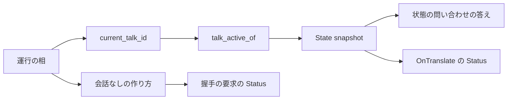
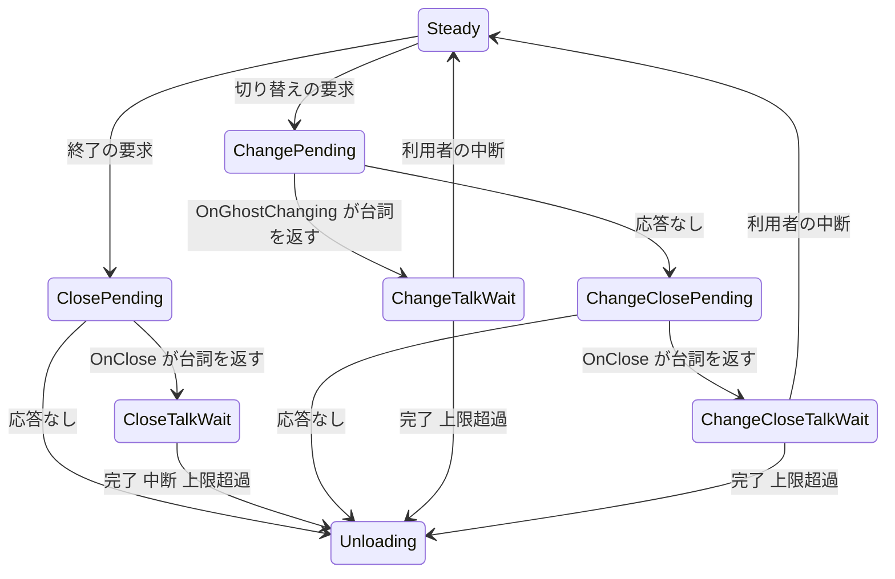

# Design Document

> 実測は **2026-10-10・本ブランチ**（main `414d43eb` から分かれたもの）。コードは「何の定義か」（関数名・型名＋ファイルパス）で指し、行番号では指さない。調べた経緯と捨てた案は `research.md` にある。

## Overview

**Purpose**: ゴーストが終了の挨拶・切り替えのお別れの台詞を話している間も、実行の状態（ukadoc `Status [SSP拡張]`）に `talking` が載るようにする。

**Users**: AI エージェントでゴーストを操らせる人（`get_status` で話している最中かを見る）と、ゴーストの作者（`OnTranslate` の `Status` を読む）。

**Impact**: kanade の「再生中か」の判定（`crates/areka-kanade/src/schedule/mod.rs` の `talk_active_of`）を、同じファイルの「再生中のトークの番号を引く関数」（`current_talk_id`）へ委ねる。変わる本番のコードはこの関数の本体 1 か所と、古くなった注記 2 か所。

### Goals

- お別れの台詞の 3 つの場面（終了の挨拶・切り替えの送り出しの台詞・切り替えの別れの台詞）の再生中に `talking`（中断の無効化モードなら `nouserbreak` も）が載る。
- その値が、状態の問い合わせ（`get_status`）の答えと、お別れの台詞の翻訳（`OnTranslate`）の `Status` に同じに出る。
- 握手の要求の `Status`・お別れの間に何を送るかの規則・お別れの台詞の進みは 1 つも変えない。変えないことをテストで固定する。

### Non-Goals

- SSP の旗 `changing`、出どころの無い 5 語（`minimizing`・`induction`・`passive`・`timecritical`・`opening(…)`）。
- お別れの台詞の再生中にイベントの依頼（`\![raise,…]`）・バルーンのイベント・リソースの照会を送るようにすること。
- MCP のツールの側（`crates/areka/src/mcp/get_status.rs`）と `currentghost.status` のプロパティ。
- 「再生中」の判定を相のメソッドへ移すなどの整理（`schedule/mod.rs` を割る予定の `mcp-kanade-tools` に任せる）。
- 実機での確認（要件の暫定の裁定 5）。

## Boundary Commitments

### This Spec Owns

- kanade の「再生中か」の判定の定義: **再生中のトークの番号が引ける相は、すべて再生中**（`talk_active_of` ≡ `current_talk_id` が番号を返す）。
- その定義を固定する決定論テスト（相の全種類の表・お別れの 3 つの場面の通し・握手の要求が変わらないこと）。
- 新しい振る舞いで古くなる既存のテストの期待 3 か所の書き換え。
- SSP との差の一覧（`doc/ssp-mcp/get-status-diff-areka.md`）のうち、お別れの台詞の行（消す）と「各旗の出る条件」の行（`talking` の説明）。

### Out of Boundary

- 実行の状態の素の形（`ExecutionSnapshot` の欄）と、`Status` の値を作る書式（`ExecutionStatus::derive`・`render`）。
- 会話なしの作り方（`State::snapshot_without_talk`）と、それを使う握手の要求。
- 相の種類（`Phase`）・相の移り方・各入口の門（`on_raise_event`・`talk_gap::begin`・`balloon_events` の 3 つの入口・`actor_resources::queryable`）。
- 再生中のトークの番号を引く関数 `current_talk_id` の中身（読むだけ・書き換えない）。
- kanade の殻（`actor.rs`）と MCP の側。

### Allowed Dependencies

- `talk_active_of` は同じファイルの `current_talk_id` だけに依る（新しい依存の向きは作らない・外部クレートの追加 0）。
- テストは既存の道具だけを使う: `schedule/external_state_tests.rs` の `full_copy`・`WITHOUT_TALK`・`last_request`、`schedule/translate_test_support.rs` の `pass_translate`、`tests/kanade/translate_test.rs` の `spawn_rig`・`WireSpec`・`calls_of`、`areka_actor::reply_channel`。

### Revalidation Triggers

- `Phase` に「トークの番号を持つが、話してはいない」相が足されたとき（`talk_active_of` と `current_talk_id` を分け直す。相の全種類の表のテストがコンパイルで止める）。
- `State::snapshot` を読んで SHIORI へ送る要求が、お別れの相で届くようになったとき（例: `on_raise_event` が定常の外でも送るようになる）。その要求にも `talking` が載る＝要件 2.3 のとおりだが、差の一覧と下流（`currentghost-property-others`）の読みを確かめ直す。
- 会話なしの作り方を使う握手の要求の一覧が変わったとき（要件 3.1 のテストの場面を足す）。

## Architecture

### Existing Architecture Analysis

- kanade の運行は純粋な状態機械（`schedule::step`）で、実行の状態は送る時点の `State` から 2 つの作り方で写す: 送出時点の作り方 `State::snapshot`（`talking`・`choosing`・`nouserbreak`・`online`・`balloon`）と、会話なしの作り方 `State::snapshot_without_talk`（`online`・`balloon` だけ）。
- `talking` と `nouserbreak` は `State::snapshot_with_choice` の中で `talk_active_of(&self.phase)` から決まる。`talk_active_of` の呼び手はここだけ。
- 「再生中のトークがあるか」を相から読む関数は、今は 2 つある。

  | 関数 | 真（番号あり）にする相 | 使う所 |
  |---|---|---|
  | `talk_active_of` | `Steady{talk: Some}`・`BootVersion{talk: Some}` | `State::snapshot_with_choice` |
  | `current_talk_id` | 上の 2 つ＋`CloseTalkWait`・`ChangeTalkWait`・`ChangeCloseTalkWait` | 完了の突き合わせ（`on_talk_done`）・利用者の中断（`user_break`）・印の台詞の追跡（`talk_gap`）・時間切れの知らせ（`balloon_events`） |

  本 spec が直すのは、この 2 つの表の食い違いである。

- お別れの相（`CloseTalkWait`・`ChangeTalkWait`・`ChangeCloseTalkWait`）で `State::snapshot` の値が外へ出るのは 2 か所だけ（要件の「波及の洗い出し」の表）: `actor.rs` の `answer_status`（状態の問い合わせ）と `schedule/translate.rs` の `capture`（お別れの台詞の翻訳の `Status`。腕が相を決めた後に取る）。

### Architecture Pattern & Boundary Map



**Architecture Integration**:

- Selected pattern: 既存の状態機械のまま。判定の表を 1 つに寄せる（`talk_active_of` → `current_talk_id`）。
- Domain/feature boundaries: 変えるのは図の `talk_active_of` の中身だけ。`current_talk_id`・会話なしの作り方・握手の要求には触れない。
- Existing patterns preserved: 送出時点の作り方と会話なしの作り方の 2 本立て。相の判定は `schedule/mod.rs` の自由関数。テストは兄弟のテストファイル。
- New components rationale: 新しい部品は無い。
- Steering compliance: 1 ファイル 1,000 行以下（`schedule/mod.rs` は 955 行から数行減る）・ログ無しの失敗経路を作らない（新しい分岐が無い）・ukadoc が正典（`talking`＝「喋っている途中」）。

### 設計の決定

| # | 決定 | 理由 |
|---|---|---|
| D1 | `talk_active_of` の本体を「`current_talk_id(phase)` が番号を返すか」にする。署名（`pub(crate) fn talk_active_of(phase: &Phase) -> bool`）は変えない | 同じ問いの表を 1 つにする。相を足す人が直す所が 1 つで済み、要件 1.7（中断で止められる場面＝`talking` の場面）が作りで保たれる。`matches!` に 3 つ足す案は、表が 2 つ残る |
| D2 | 握手の要求と各入口の門は 1 行も変えない | 握手の要求は `State::snapshot_without_talk` を使い、判定を読まない。お別れの間の依頼は門が断る。どちらも本 spec の直しの影響を受けない（要件 3.1・3.3） |
| D3 | 相の全種類の表のテストは、期待を手書きの `match`（ワイルドカード無し）で持つ | 期待を `talk_active_of` や `current_talk_id` から導くと、テストが自明になる。ワイルドカードを置かないので、相を足すとコンパイルが止まり、判断が求められる |
| D4 | 段のテストは `schedule/external_state_tests.rs`、殻を通すテストは `tests/kanade/translate_test.rs` に足す。新しいファイルは作らない | 要る道具（満たした写し・最後のリクエストの取り出し・任意の ID に台詞を返す偽の SHIORI・完了を返さない再生側）が両方にそろっている。`schedule/mod.rs` にテストの接続宣言を足さずに済む |
| D5 | 古い前提の既存のテスト 3 か所は、新しい振る舞い（`talking`）へ書き換える | お別れの台詞の翻訳の `Status` を「会話なし」または「行なし」と固定している所。3 か所目（通信中の旗のテスト）は実装で `cargo test -p areka-kanade` を全部回して見つけた。要件 4.9 |

### Technology Stack

| Layer | Choice / Version | Role in Feature | Notes |
|-------|------------------|-----------------|-------|
| 運行（kanade） | Rust 2024・`crates/areka-kanade` | 判定の本体と注記 | 外部クレートの追加 0 |
| テスト | `cargo test`（in-source の兄弟テスト＋`tests/kanade/`） | 段のテストと殻を通すテスト | 新しい道具 0 |
| 文書 | Markdown | SSP との差の一覧 | — |

## File Structure Plan

新しいファイルは 0。

### Modified Files

- `crates/areka-kanade/src/schedule/mod.rs` — `talk_active_of` の本体を D1 のとおりにし、注記を「再生中のトークの番号が引ける相（普段の会話・起動の挨拶・お別れの台詞の 3 つの場面）」の説明へ改める。ほかの関数には触れない（955 行 → 数行減る）。
- `crates/areka-kanade/src/status.rs` — `ExecutionSnapshot` の `talk_active` の欄の注記（「源＝運行状態 `Phase::Steady{talk: Some(_)}`」）を、お別れの台詞を含む説明へ改める。コードは変えない。
- `crates/areka-kanade/src/schedule/external_state_tests.rs` — 節「お別れの台詞の再生中の `talking`」を足す（テスト T1〜T3。402 行 → 600 行前後）。
- `crates/areka-kanade/tests/kanade/translate_test.rs` — お別れの 3 つの場面を殻ごと通すテスト T4 と、問い合わせを 1 通送って答えを受ける小さな補助を足す（637 行 → 750 行前後）。
- `crates/areka-kanade/tests/kanade/close_test_handshake_tests.rs` — `OnClose` の後の 1 件目（別れの台詞の `OnTranslate`）の期待を、会話なし（`ExecutionSnapshot::INACTIVE`）から再生中（`talk_active: true`）へ書き換え、文言「終了の相は会話なしの状態」を改める。
- `crates/areka-kanade/tests/kanade/external_status_test.rs` — 通信中の旗を落とした後の要求を見る最後の表明（「どれも `Status` の行なし」）を、「終了の挨拶の `OnTranslate` だけ `talking`、ほかは行なし」へ書き換える（実装で見つけた 3 か所目）。
- `crates/areka/src/emo2_boot/spine_conformance_script.rs` — `expected_statuses` の最後の行（終了の挨拶の `OnTranslate`）を `None` から `Some(STATUS_TALKING)` へ書き換え、その上の注記を改める。
- `doc/ssp-mcp/get-status-diff-areka.md` — 「終了の挨拶・切り替えのお別れの台詞の再生中」の行を消す。「各旗の出る条件」の行の `talking` の説明を「普段の会話・起動の挨拶・終了の挨拶・切り替えのお別れの台詞の再生中は `talking`」へ改める。見出しの日付を作業日に改める。

## System Flows

お別れの相と `talking` の対応（太字が本 spec で `talking` が載るようになる相）。



- `talking` が載る相: `CloseTalkWait`・`ChangeTalkWait`・`ChangeCloseTalkWait`（本 spec で足す）と、トークを持つ `Steady`・`BootVersion`（今のまま）。
- `talking` が載らない相: `ClosePending`・`ChangePending`・`ChangeClosePending`（台詞の応答待ち）・`Unloading`・`Stopped`・トークを持たない `Steady`（今のまま）。
- お別れの台詞の翻訳は、図の「台詞を返す」の矢印の直後、相が `…TalkWait` へ移った状態で `OnTranslate` を送る。だから翻訳の `Status` に `talking` が載る。
- 切り替えの送り出しの台詞の途中に終了の要求が届くと、その台詞は普段の会話（トークを持つ `Steady`）へ移る（今のまま）。本 spec の後は、移る前後とも `talking` が載り、途中で値が変わらなくなる。

## Requirements Traceability

| Requirement | Summary | Components | Interfaces | Flows / Tests |
|-------------|---------|------------|------------|---------------|
| 1.1 | 終了の挨拶の再生中に `talking` | 判定 | `talk_active_of` | `CloseTalkWait`／T1・T2・T4 |
| 1.2 | 切り替えの送り出しの台詞の再生中に `talking` | 判定 | `talk_active_of` | `ChangeTalkWait`／T1・T2・T4 |
| 1.3 | 切り替えの別れの台詞の再生中に `talking` | 判定 | `talk_active_of` | `ChangeCloseTalkWait`／T1・T2・T4 |
| 1.4 | 再生が終わった後は `talking` を含めない | 判定（D2: 相の移り方は変えない） | `talk_active_of` | `Unloading`・トーク無しの `Steady`／T1・T2 |
| 1.5 | 応答待ち・応答なしの間は含めない | 判定 | `talk_active_of` | `ClosePending`・`ChangePending`・`ChangeClosePending`／T1・T2 |
| 1.6 | 中断の無効化モードなら `nouserbreak` | `State::snapshot_with_choice`（変えない・判定に従う） | `talk_active_of` | T2 |
| 1.7 | 中断で止められる場面＝`talking` の場面 | 判定（D1） | `talk_active_of` ≡ `current_talk_id` | T1 |
| 2.1 | `get_status` の答えに `talking` | 殻の `answer_status`（変えない） | `State::snapshot` | T4 |
| 2.2 | お別れの台詞の翻訳の `Status` に `talking` | `translate::capture`（変えない） | `State::snapshot` | T2・T4 |
| 2.3 | 送る要求と問い合わせの答えが同じ値 | 同じ素（`State::snapshot`）を使う既存の作り | `State::snapshot` | T4（答えと `OnTranslate` の `Status` を比べる） |
| 3.1 | 握手の要求に `talking` 等を載せない | 会話なしの作り方（変えない・D2） | `State::snapshot_without_talk` | T3＋既存のテスト |
| 3.2 | 普段の会話・起動の挨拶・何も無い間は今のまま | 判定（D1 は今の 2 つの相を含む） | `talk_active_of` | T1＋既存のテスト |
| 3.3 | お別れの間に増える要求は 0 | 各入口の門（変えない・D2） | — | T2（行動の列に要求が無い）・T4（記録の列） |
| 3.4 | お別れの間に `choosing` を含めない | 選択の帳簿（変えない） | `State::snapshot` | T2 |
| 3.5 | お別れの台詞の進みを変えない | 相の移り方（変えない・D2） | — | 既存の `schedule/change_tests.rs`・`close.rs` のテスト・T2 |
| 3.6 | 書式と出さない語を変えない | `status.rs`（コードは変えない） | — | 既存の `status.rs` のテスト |
| 4.1 | 判定を相の全種類で固定 | テスト | — | T1 |
| 4.2 | 殻を通して問い合わせの答えを固定 | テスト | — | T4 |
| 4.3 | 翻訳の `Status` を 3 つの場面で固定 | テスト | — | T2（段）・T4（殻） |
| 4.4 | `nouserbreak` の有無を固定 | テスト | — | T2 |
| 4.5 | 握手の要求 4 つを固定 | テスト | — | T3（⑴⑷）＋既存（⑵⑶） |
| 4.6 | 判定と番号の引ける相の一致を固定 | テスト | — | T1 |
| 4.7 | 差の一覧を直す | 文書 | — | `doc/ssp-mcp/get-status-diff-areka.md` |
| 4.8 | 古い注記を直す | 注記 | — | `schedule/mod.rs`・`status.rs` |
| 4.9 | 既存のテストを緑に保つ | 既存のテスト 3 か所の書き換え（D5） | — | 検証の手順 |

## Components and Interfaces

| Component | Domain/Layer | Intent | Req Coverage | Key Dependencies | Contracts |
|-----------|--------------|--------|--------------|------------------|-----------|
| 判定 `talk_active_of` | kanade の運行（`schedule/mod.rs`） | 相が再生中のトークを運ぶかを答える | 1.1〜1.5, 1.7, 3.2 | `current_talk_id`（P0） | State |
| 段のテスト | `schedule/external_state_tests.rs` | 判定・お別れの通し・握手の固定 | 4.1, 4.3〜4.6 | `step`・`pass_translate`（P0） | — |
| 殻を通すテスト | `tests/kanade/translate_test.rs` | 問い合わせの答えと翻訳の `Status` | 4.2, 4.3 | `spawn_rig`・`reply_channel`（P0） | — |
| 文書と注記 | `doc/ssp-mcp/`・注記 | 古い説明を残さない | 4.7, 4.8 | — | — |

### kanade の運行

#### 判定 `talk_active_of`

| Field | Detail |
|-------|--------|
| Intent | 相が再生中のトークを運ぶか（実行の状態の `talking` の源） |
| Requirements | 1.1, 1.2, 1.3, 1.4, 1.5, 1.7, 3.2 |

**Responsibilities & Constraints**

- 相だけから答える純粋な関数（時刻・写し・帳簿を読まない）。
- 「再生中」の定義を自分では持たず、`current_talk_id` の答え（番号が引けるか）に従う。
- 呼び手は `State::snapshot_with_choice` の 1 か所のまま。`nouserbreak` はそこで「この判定 かつ 旗の写し」として決まる（変えない）。

**Dependencies**

- Inbound: `State::snapshot_with_choice` — `talking`・`nouserbreak` の導出（P0）
- Outbound: `current_talk_id` — 相から再生中のトークの番号を引く（P0）

**Contracts**: Service [ ] / API [ ] / Event [ ] / Batch [ ] / State [x]

##### State Management

```rust
/// 署名は今のまま。本体だけを「current_talk_id(phase) が番号を返すか」にする。
pub(crate) fn talk_active_of(phase: &Phase) -> bool;
```

- Preconditions: なし（どの相でも呼べる）。
- Postconditions（相ごとの答え。T1 の表そのもの）:

  | 相 | 答え | 今との違い |
  |---|---|---|
  | `Idle`・`BootInit`・`BootPrefetch`・`BootType`・`BootMain` | 偽 | なし |
  | `BootVersion{talk: None}`／`BootVersion{talk: Some}` | 偽／真 | なし |
  | `Steady{talk: None}`／`Steady{talk: Some}` | 偽／真 | なし |
  | `ClosePending`・`ChangePending`・`ChangeClosePending` | 偽 | なし |
  | `CloseTalkWait`・`ChangeTalkWait`・`ChangeCloseTalkWait` | **真** | **偽 → 真** |
  | `Unloading`・`Stopped` | 偽 | なし |

- Invariants: どの相でも `talk_active_of(phase) == current_talk_id(phase).is_some()`。

**Implementation Notes**

- Integration: 触るのは関数の本体と注記だけ。`State::snapshot`・`snapshot_with_choice`・`snapshot_without_talk` の本体は変えない。
- Validation: T1（表）・T2（通し）・T4（殻）。
- Risks: 同じ時期に `schedule/mod.rs` を触る spec との競合。数行なので先に着地させる。

## Error Handling

新しい失敗の経路・記録は無い。判定は全ての相に答える純粋な関数で、失敗しない。お別れの相での断り（`raise_event_not_steady`・`not_steady` など）の記録は今のまま出る。

## Testing Strategy

### 段のテスト（`crates/areka-kanade/src/schedule/external_state_tests.rs` の新しい節）

- **T1 相の全種類の表**（4.1・4.6／1.4・1.5・1.7・3.2）: `Phase` の 15 種類を、トークの有無で分かれる 2 種類（`BootVersion`・`Steady`）は両方作り、17 通り並べる。期待は手書きの `match`（ワイルドカード無し）で持つ。各相について ⑴ `talk_active_of` が期待どおり ⑵ `current_talk_id(..).is_some()` が同じ値 ⑶ その相の `State` の `snapshot().talk_active` が同じ値、を見る。
- **T2 お別れの 3 つの場面の通し**（1.1〜1.6・2.2・3.3・3.4・4.3・4.4）: トーク無しの定常（写しは `full_copy`＝旗・通信中・バルーンがすべて立つ）から、最上位の `step` で実際の入力を流す。場面は ⑴ 終了の要求 → `OnClose` に台詞 ⑵ 切り替えの要求 → `OnGhostChanging` に台詞 ⑶ 切り替えの要求 → 応答なし → `OnClose` に台詞。各場面で次を見る。
  - 台詞の応答の前（応答待ちの相）の `Status` は `online,balloon(0=2/1=0)`（`talking` 無し）。
  - 台詞の応答で返る一括は翻訳の行動 1 つで、その `Status` は `talking,nouserbreak,online,balloon(0=2/1=0)`。
  - 翻訳の結果を入れると再生の開始だけが返り（SHIORI への要求は 0）、`snapshot()` から導いた `Status` も同じ値。`choosing` は含まない。
  - 旗の写しを下ろす知らせ（`ExecutionStateUpdate::NoUserBreak(false)`）の後は `talking,online,balloon(0=2/1=0)`。
  - 終わり方 4 通り（最後まで＝`Ended`・`\-` に達した＝`Quit`・利用者の中断＝`UserBreak` の後の `Interrupted`・上限超過＝期限を過ぎた `Tick`）のそれぞれで、終わった後の `Status` に `talking`・`nouserbreak` が無い。
  - 切り替えの 2 つの場面の利用者の中断では、切り替えが中止されて定常へ戻った後に `OnBalloonBreak` が送られる（完了 `balloon-lifecycle-events` の今の振る舞い。お別れの台詞はもう終わっている）。その要求の `Status` も `online,balloon(0=2/1=0)`（`talking` 無し）であることを見る。
- **T3 握手の要求は会話なしのまま**（3.1・4.5 の ⑴⑷）: 写しは `full_copy`。⑴ 普段の会話の再生中に終了の要求 → その会話の完了 → 送られる `OnClose` の `Status` が `WITHOUT_TALK`。⑷ お別れの 3 つの場面それぞれの再生中に強制終了 → `OnClose` の通知の `Status` が `WITHOUT_TALK`。4.5 の ⑵⑶（`OnGhostChanging` と、その応答なしの後の `OnClose`）は既存の `switching_requests_carry_online_and_balloons_from_the_copy` が同じ写しで固定しているので、それを数える。

### 殻を通すテスト（`crates/areka-kanade/tests/kanade/translate_test.rs`）

- **T4 お別れの台詞: 問い合わせの答えと翻訳の `Status`**（2.1〜2.3・3.3・4.2・4.3）: 本物の殻に偽物（`spawn_rig`）をつなぎ、3 つの場面それぞれで「起動 → 問い合わせ → きっかけの入力（終了の要求／切り替えの要求）→ 問い合わせ → 台詞の完了」を同じ受信箱へ順に送る。再生側は完了を返さないので、2 回目の問い合わせは必ず再生中に処理される。見るもの:
  - 1 回目の答えは値なし、2 回目の答えは `talking`。
  - 記録の `OnTranslate` は 1 件で、`Status` は `talking`（2 回目の答えと同じ値）。
  - 握手の要求（`OnClose`・`OnGhostChanging`）の `Status` は行なし。
  - きっかけの入力から後の記録は、握手の要求・`OnTranslate`・再生の開始・降ろす往復だけ（増えた要求は 0）。

### 既存のテストの書き換え（4.9）

- `tests/kanade/close_test_handshake_tests.rs`: 別れの台詞の `OnTranslate` の期待を再生中の状態へ。
- `tests/kanade/external_status_test.rs`: 通信中の旗を落とした後の要求の表明を「終了の挨拶の `OnTranslate` だけ `talking`、ほかは行なし」へ（実装で見つけた 3 か所目）。
- `crates/areka/src/emo2_boot/spine_conformance_script.rs`: `expected_statuses` の最後の行を `Some(STATUS_TALKING)` へ。

### 検証の手順

1. T1〜T4 を先に書き、判定を直す前に赤になることを確かめる（T1 の 3 行・T2・T4 が赤、T3 は緑）。
2. 判定を直し、`cargo test -p areka-kanade` を全部回す（軽い）。赤が出たら、お別れの間に `talking` が無い前提のテストかを見分けて書き換える。
3. `crates/areka` は、進行状態の記録を読む一周のテスト（`spine_conformance_lap_tests.rs`）だけを名前で絞って 1 回回す（GPU の足場を使う重いテストなので繰り返さない）。全体は完了時の `tools/test-all.ps1` に任せる。
4. `cargo fmt --all` と `cargo clippy -p areka-kanade --all-targets` を通す。
