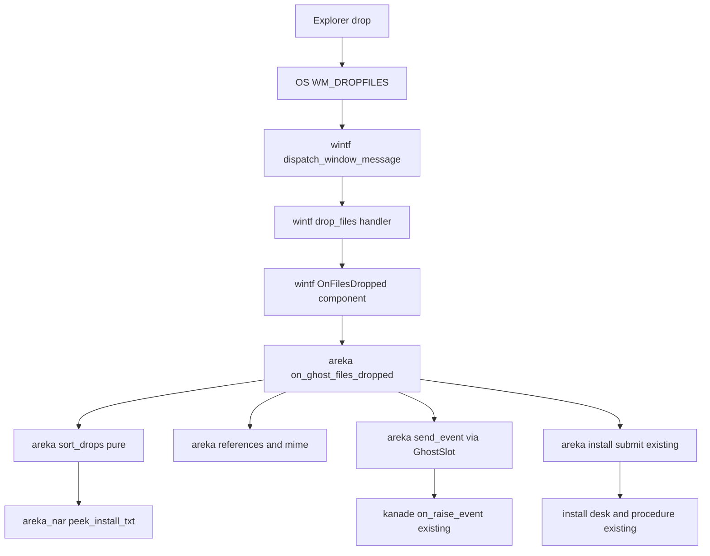
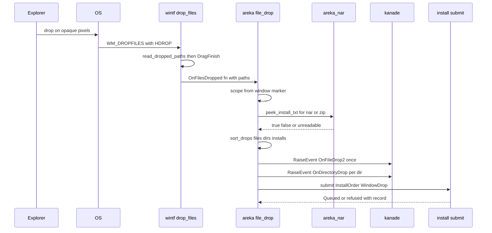

# Technical Design: areka-P0-file-drop

> 実測は **2026-09-29・本ブランチ**（main `c3876110`＝`ghost-install` の完了 PR#198 のコミット・ワークツリー `claude/areka-p0-file-drop-9fdc80`）。コードは「何の定義か」（関数名・型名・定数名＋ファイルパス）で指し、行番号では指さない。本文の「既存」の主張は全部ソースを開いて確かめた。
> 要件ディスカッションから設計へ預けられた判断（research.md §5 の 1〜11）は、下の「設計で決めたこと」の表に番号つきで全部の答えを書いた。

## Overview

**Purpose**: エクスプローラからゴーストの絵の上へ落とされた物を、areka が受け取って 3 つに分け、インストール対象（`install.txt` を持つ `.nar`／`.zip`）は完了 `ghost-install` の手続きへ依頼 1 つで渡し、それ以外のファイルは `OnFileDrop2`、フォルダは `OnDirectoryDrop` で今のゴーストへ知らせる。

**Users**: `.nar` を手に入れた第三者（伺かで覚えた「窓へ落とす」で入れられる）。ゴーストの作者（辞書に書いた `OnFileDrop2`・`OnDirectoryDrop` の返事が areka でも動く）。後続 `alpha-release-signoff` の開発者（第三者の手順「`.nar` を窓へ落とす」がこの着地で成り立つ）。

**Impact**: 今日は受け口が 0（`WM_DROPFILES`・`WS_EX_ACCEPTFILES`・振り分けのどれも本番に無い）。本仕様は、既に在る 4 つの部品——窓に関数を差す部品の型（wintf `OnSessionEnd`）・ゴースト窓へ部品を差す場所（`ghost_session::prepare_ghost_windows` の窓を作る閉包）・汎用の通知の入口（`KanadeMsg::RaiseEvent`）・依頼を渡す唯一の口（`install::submit`）——を **1 本の線でつなぐ**。新しい型は wintf の部品 1 つ・areka の振り分けの結果の型 1 つ・`InstallOrigin` の変種 1 つ・`areka-nar` の公開関数 1 つで足りる。新しいイベント名は作らない（0 個）。

### Goals

- キャラクター窓・バルーン窓の絵の上へ落とされた物の絶対パスの一覧を、落とされた窓のスコープ番号と一緒に受け取る（要件 1）。
- 落とされた物 1 つを「フォルダ → インストール対象 → インストール対象でないファイル」の順で 1 つの種類に決める（要件 2・裁定 3・7）。
- インストール対象は落とされた順に並べた依頼 1 つで `install::submit` へ渡す（要件 3・裁定 8）。
- `OnFileDrop2`（Reference 3 つ・MIME を含む）と `OnDirectoryDrop`（フォルダ 1 つにつき 1 回）を汎用の通知の入口から送る（要件 4・5・7）。
- 混ざった投げ込みは「ファイル → フォルダ → インストール対象」の順に、受け取ったその巡の中で終える（要件 6・裁定 1）。
- 受け取り・振り分け・送出・依頼のすべてに記録を残し、記録の無い失敗の経路を作らない。画面は 0 個（要件 8）。
- 判断の分かれ目を決定論テストで固定し、実機で一周を見る（要件 9）。

### Non-Goals

- インストールの手続きそのもの（`accept` の照合・利用条件・展開・`OnInstall*`・`OnInstallCompleteAll` の判断・`lastinstalled`・入れた後の切替）＝完了 `ghost-install`。本仕様が書庫について読むのは目次だけ。
- ドラッグ中の知らせ `OnFileDropping`・旧仕様 `OnFileDrop`／`OnFileDropEx`／`OnFileDropped`・応えが無いときのビューア（`OnArchiveViewerOpen` ほか）。
- 汎用の書庫の解凍機・ビューア（areka はデスクトップマスコットの枠を超えない・裁定 10.7）。
- テキスト・URL・「ファイル」として扱えない物の投げ込み（`OnTextDrop`・`OnURL*`・`OnOtherObject*`）＝α 後。
- 管理者として起動した areka へふつうの権限から落とせない件の手当て（既知の制限として申し送るだけ）。
- フォルダから `.nar` を作ること（`OnNarCreating`／`OnNarCreated`）。
- `dist/README.txt` の「■ .nar の入れ方」の本文（`alpha-release-signoff`）。

## Boundary Commitments

### This Spec Owns

- **wintf の受け口**: `WM_DROPFILES` の腕 1 本（`dispatch_window_message` の表）と、その受け手 `window_proc/drop_files.rs`（`HDROP` からパスの一覧を読む・`DragFinish` を必ず呼ぶ・窓に差された関数を呼ぶ）。窓に関数を差す部品 `OnFilesDropped`。wintf は areka を知らない（パスの一覧を渡すだけ）。
- **ゴースト窓の宣言と装着**: `placement::spawn::window_style` の `ex_style` に `WS_EX_ACCEPTFILES` の 1 ビット。ゴースト窓（キャラクター・バルーン）へ `OnFilesDropped` を差す関数 `input_events::file_drop::attach_file_drop_receivers` と、その呼び出し（窓を作る閉包の中・`prepare_ghost_windows`）。
- **振り分けと送出**: `input_events/file_drop.rs`——スコープ番号の読み取り → 純粋な振り分け `sort_drops` → `OnFileDrop2` の Reference 3 つ（MIME 表を含む）→ `OnDirectoryDrop` ×n → `install::submit`。ここで出す記録の語彙。
- **書庫の目次だけを読む口**: `areka_nar::peek_install_txt`（中央ディレクトリを読んで最上位に `install.txt` が在るかだけを答える・伸長しない・書かない）。`install.txt` の探し方は手続きと同じ `manifest::locate_install_txt`。
- **依頼の出どころの語**: `InstallOrigin::WindowDrop`。
- **kanade の許可表の 2 語**: `OnFileDrop2`・`OnDirectoryDrop`（正典の URL の行つき・21 → 23）。
- **台帳と文書**: `shiori.toml` の 2 行・報告書の作り直し・`roadmap-draft.md` の行（37 → 38）と束の表の「投げ込み」の行・`signoff.md`・`alpha-release-signoff` への既知の制限の申し送り。

### Out of Boundary

- `install/desk.rs`・`install/procedure.rs`・`install/worker.rs`（待ち行列・1 本ずつ・定常まで待つ・`OnInstallCompleteAll`・終了時に捨てる）: 触らない。本仕様が `install/` に足すのは `InstallOrigin` の変種 1 つ・`judge.rs` の `SEPARATOR` の可視性（`pub(crate)`）・`mod.rs` の `#[cfg(test)]` の待ち行列の読み口 `queued_orders`（本番には無い）だけ。
- `areka-kanade` の `on_raise_event`（許可表の照合・定常以外を捨てる規則）と `events::raise`: 触らない。足すのは許可表の 2 語だけ。
- `areka-nar` の `NarArchive::open`／`install`・`container.rs`・`names.rs`・`manifest.rs`: 触らない。足すのは `lib.rs` の公開関数 1 つ。
- wintf の透過の付け外し（`win_style::apply_click_through`）・`WindowStyle::default()`・`compute_ex_style`: 触らない（テストで宣言のビットが残ることを固定するだけ）。
- ドラッグ中の知らせ・OLE（`IDropTarget`）・`ChangeWindowMessageFilterEx`。
- 完了 spec の文書。

### Allowed Dependencies

- `areka::input_events::file_drop` → `areka::placement::spawn`（`CharWindowMarker`・`BalloonWindowMarker`・`GhostWindowMarker` を読む）／`areka::ghost_session::GhostSlot`（kanade への送出端を取る）／`areka::install`（`submit`・`InstallOrder`・`InstallOrigin`・`judge::SEPARATOR`）／`areka_nar::peek_install_txt`／`areka_kanade::{KanadeMsg, ShioriMethod}`／`wintf::ecs::window::OnFilesDropped`。
- `wintf::ecs::window_proc::drop_files` → `wintf::ecs::window::OnFilesDropped`・`windows::Win32::UI::Shell::{DragQueryFileW, DragFinish, HDROP}`（機能 `Win32_UI_Shell` は根の `Cargo.toml` で有効済み）。
- **依存の向き（違反は誤り）**: `areka-nar` → `areka::install` → `areka::input_events::file_drop` ← `wintf`。**wintf は areka を import しない**（`lifecycle.rs` の `DESPAWNED_SKIP_TAG` が同じ規律を doc に書いている）。`placement` は `crate::` パスを持てない（example の `#[path]` include）ので、装着は `input_events` 側が担う（`attach_char_pointer_handlers` と同じ理由）。
- 外部クレートの追加 0・`windows` の機能フラグの追加 0・本番コードが読む環境変数の追加 0・同期送信（`SendMessageW(`／`SendMessageTimeoutW(`）の追加 0。

### Revalidation Triggers

- `OnFilesDropped` の署名（`fn(&mut World, Entity, Vec<PathBuf>)`）を変える → `input_events::file_drop::on_ghost_files_dropped` と `attach_file_drop_receivers` を見直す。
- `install::submit`・`InstallOrder`・`InstallOrigin` の形を変える（完了 `ghost-install` の引き金と同じ）→ `on_ghost_files_dropped` の依頼の組み立てを見直す。
- `KanadeMsg::RaiseEvent` の欄を変える → 送出の 1 か所（`send_event`）を見直す。
- `areka_nar::peek_install_txt` の意味（「最上位に `install.txt`」の定義＝`manifest::locate_install_txt`）を変える → 振り分けと手続きの判定が食い違う。要件 2.2 の同一性テストが赤になる。
- 許可表の数を動かす spec（後続 `shell-balloon-switch`）→ `events_change_tests.rs` の 23 を動かす。
- ゴースト窓の様式（`window_style`）を分ける・他の窓に `WS_EX_ACCEPTFILES` を付ける → 要件 1.3 の「0 枚」が崩れる。

## Architecture

### Existing Architecture Analysis

確かめた実物（すべて 2026-09-29 の本ブランチ）:

- **窓手続きの振り分け表**: `crates/wintf/src/ecs/window_proc/mod.rs` の `dispatch_window_message(world: &Rc<RefCell<EcsWorld>>, entity, msg: &WindowMessage) -> Option<LRESULT>`。`match msg.msg` に 30 腕・`WM_DROPFILES` は無く `_ => None`（既定処理へ）。受け手の署名は `(world, entity, hwnd, wparam, lparam) -> Option<LRESULT>`。
- **窓に関数を差す部品の型**: `crates/wintf/src/ecs/window/components.rs` の `OnCloseRequest(pub fn(&mut World, Entity))`・`OnSessionEnd(pub fn(&mut World, Entity))`（`#[derive(Component, Clone, Copy)]`・`storage = "SparseSet"`）。`ecs/window/mod.rs` の `pub use components::*` で外へ出る。
- **OS のメッセージから部品を呼ぶ 4 腕の型**: `crates/wintf/src/ecs/window_proc/lifecycle.rs` の `WM_ENDSESSION`——`try_borrow_mut` 失敗→`warn!`／entity 破棄済み→`debug!`（`DESPAWNED_SKIP_TAG`）／部品なし→`debug!`／在れば `info!` して呼ぶ。戻り値はどの腕も `Some(LRESULT(0))`。
- **ゴースト窓の様式**: `crates/areka/src/placement/spawn.rs` の私有 `window_style()`＝`WS_POPUP | WS_VISIBLE`／`WS_EX_LAYERED | WS_EX_TOOLWINDOW`。キャラクター窓・バルーン窓の両方がこれを使う。wintf の `runtime/window_factory.rs` の `compute_ex_style` は `(ex_style & !WS_EX_LAYERED) | WS_EX_NOREDIRECTIONBITMAP`（他のビットは通す）。既存テスト `t_i2_no_window_has_ws_ex_topmost`（`placement/spawn_assembly_tests.rs`）が `ex_style == WS_EX_LAYERED | WS_EX_TOOLWINDOW` を直書きで判定している。
- **窓の識別**: `CharWindowMarker { scope: usize }`・`BalloonWindowMarker { scope: usize }`（バルーンは「対応するキャラ窓と同じ番号」）・`GhostWindowMarker`（`placement/spawn.rs`）。`app_exit::on_ghost_os_close` が両方の印からスコープを読む型を持つ。
- **ゴースト窓へ入力の受け手を差す場所**: `crates/areka/src/ghost_session.rs` の `prepare_ghost_windows` が組む「窓を作る閉包」の中で、`spawn_ghost_windows` の直後に `input_events::attach_char_pointer_handlers(world)`・`menu::attach_release_handlers(world)`・`input_events::balloon::attach_balloon_pointer_handlers(world)` を同期に呼ぶ。起こし直し `reopen_ghost_windows` は同じ `prepare_ghost_windows` へ委譲する（初回と同じ閉包を通る）。
- **依頼の口**: `crates/areka/src/install/mod.rs` の `InstallOrder { archives: Vec<PathBuf>, origin: InstallOrigin }`・`InstallOrigin { Menu, Script }`（`Debug` が記録の語）・`submit(world, order) -> SubmitVerdict { Queued, Empty, NoDesk, Closing }`。受けたら `info!(install_order_queued, origin, count)`、断ったら `warn!(install_order_refused)`。`origin` は `procedure.rs` の `run_archive`／`archive_steps` へ渡って `info!(install_begin, origin)` に載るだけで、分岐は 0。
- **区切りの定数**: `crates/areka/src/install/judge.rs` の私有 `const SEPARATOR: &str = "\u{1}"`。
- **送り口**: `install/desk.rs` の `send_held` が `world.get_non_send::<GhostSlot>() → slot.0.as_ref() → session.kanade().cloned()` で `Sender<KanadeMsg>` を取り、`KanadeMsg::RaiseEvent { id, references, method: ShioriMethod::Get, reply }` を送る。`GhostSession::kanade()` は `Option<&Sender<KanadeMsg>>`。切替の途中は `ghost_switch::take_down` が `slot.0.take()` するので送り口が無い。
- **汎用の通知の入口**: `crates/areka-kanade/src/schedule/change.rs` の `on_raise_event`——`events::allowed_static` に無ければ `warn!(raise_event_not_allowed)`、`Phase::Steady` でなければ `warn!(raise_event_not_steady)` で捨てる（積まない）。定常なら `events::raise` で渡された Reference 列のまま GET。許可表 `ALLOWED_EVENT_IDS`（`schedule/events.rs`）は 21 語で、各語の直上に `// ukadoc:` の行がある。`events_change_tests.rs` の `allowed_static_returns_the_table_spelling_for_the_two_change_events` が `assert_eq!(ALLOWED_EVENT_IDS.len(), 21)`。
- **書庫の読み方**: `crates/areka-nar/src/lib.rs` の `NarArchive::read`——`std::fs::read` → `container::read_central_directory(&bytes)` → `names::validate_entry_names` → **全エントリを `inflate_entry` で伸長** → `manifest::locate_install_txt(&names)` → `parse_manifest`。`locate_install_txt` は「`EntryName::path` が丸ごと `install.txt` に等しい（ASCII 大小無視）ファイルのエントリ」を探し、無ければ `RefuseReason::MissingInstallTxt`。`read_central_directory` はローカルヘッダの署名と範囲までしか見ず、伸長もファイルシステムへの書き込みも持たない。
- **終了の形**: `crates/areka/src/app_exit.rs` の `quit_app` は必ず先に `despawn_app_windows`（`GhostWindowMarker` を持つ全 entity を `despawn`）を呼んでから `FirstExit` を挿し `AppExit::request_exit` を呼ぶ。areka で `request_exit` を呼ぶのはここ 1 か所。OS のセッションの終了（`session_end.rs`）も `quit_app` を通る。
- **先進坑の結果**（`crates/pilot/examples/pilot-dropfiles-on-wuc-window/`）: `WS_EX_ACCEPTFILES` の 1 ビットで届く・`DragQueryFileW(hdrop, u32::MAX, None)` で件数・長さを問うてから取り出す `query_path`・`FinishOnDrop`（`Drop` で `DragFinish`）・絵の外は OS が背後へ渡す・透過の付け外し 36 回の後も宣言が残る。先進坑のコードは本坑へ写さない規律なので、同じ手順を wintf に書き起こす。

### Architecture Pattern & Boundary Map



**Architecture Integration**:

- **Selected pattern**: 「OS の境界（wintf）→ 窓に差した関数（areka）→ 純粋な振り分け → 既存の 2 つの口」。完了 `app-lifetime-separation`／`ghost-shell-balloon-switch` が OS の閉鎖要求・セッションの終了で敷いた型（wintf の 4 腕＋areka の受け手）と同じ。
- **Domain boundaries**: wintf は「パスの一覧と窓の entity」までで、種類も SHIORI も知らない。areka の `file_drop.rs` は振り分けと送出と依頼の組み立てまでで、インストールの手続きも kanade の運行判断も知らない。`areka-nar` は「目次に `install.txt` が在るか」を答えるだけ。
- **Existing patterns preserved**: 窓に関数を差す部品（`OnSessionEnd` と同型）／spawn 直後の同期装着（`attach_balloon_pointer_handlers` と同型）／記録は fs を触る入口で出し純粋な核は事実を戻り値に載せる（emo 三段の型）／依頼の出どころは記録の語で分岐しない（`ExitOrigin`・`InstallOrigin` の型）。
- **New components rationale**: `OnFilesDropped`（OS のメッセージを areka へ渡す唯一の口）・`drop_files.rs`（`unsafe` をここに閉じる）・`file_drop.rs`（振り分け・Reference・MIME・送出・装着を 1 ファイルに）・`peek_install_txt`（伸長せずに目次だけ読む口が無い）。
- **Steering compliance**: `unsafe` は Win32 境界（wintf）だけ・`thiserror` の構造化 enum・構造化フィールドの記録・テストは兄弟ファイル・1 ファイル 1,000 行以下・`log-capture-kit` 経由の捕捉。

### 設計で決めたこと（research.md §5 の 1〜11 への答え）

| # | 判断 | 決めたこと | 理由 |
|---|---|---|---|
| 1 | wintf の受け口の切り方と部品の署名 | **§4.1 の B**: OS 読み取り `read_dropped_paths(hdrop: HDROP) -> Result<Vec<PathBuf>, DropReadError>`（`unsafe` はここだけ）と World 側 `deliver_dropped_files(world, entity, paths) -> HandlerResult`（純粋・4 腕）に分け、`WM_DROPFILES` の腕は前者の結果で後者を呼ぶ。部品は `OnFilesDropped(pub fn(&mut World, Entity, Vec<PathBuf>))`。一覧の型は **`Vec<PathBuf>`**（`OsString::from_wide` で非可逆変換を挟まない） | World 側の 4 腕を偽の一覧で全部踏める。名前を `OnFileDrop` にしないのは正典の旧仕様のイベント名と紛れるため |
| 2 | 定常でないときの `warn!` の出し手 | **送り口が在れば送り、kanade が `raise_event_not_steady` を出す。送り口が無ければ areka が `warn!(file_drop_no_kanade)` を出す**。どちらも「送らなかったイベント 1 件につき warn 1 件」 | areka が常に自分で判定すると kanade の判定と二重になり、定常かどうかの正本（kanade）が 2 か所になる |
| 3 | 終了が指示された後の見分け | **本仕様は何も足さない**（`FirstExit` も `submit` の判定も見ない）。`quit_app` は終了を指示する前に必ず全ゴースト窓を `despawn` する（areka で `request_exit` を呼ぶ唯一の場所）ので、終了が指示された後にゴースト窓の受け手が呼ばれる道は無い。窓の HWND が壊れるまでの間に届いた `WM_DROPFILES` は wintf の「entity 破棄済み」の腕が `debug!`（`DESPAWNED_SKIP_TAG`）で打ち切り、`DragFinish` だけ呼ぶ | 要件 6.4「本仕様で足す経路 0」のとおり。`FirstExit` を見る腕を足すと、本番で到達しない腕をテストで踏むことになる |
| 4 | MIME 表の広さと置き場 | **`file_drop.rs` の定数表 `MIME_TABLE`（拡張子 41・MIME 33 種）**。下の「MIME の表」に全項目を書く。拡張子は ASCII 大小無視。表に無い・拡張子なしは空文字 | 要件 4.5 が「表を持ち全項目を判定する」と定める。OS のレジストリは機械ごとに答えが違い決定論に乗らない |
| 5 | 決定論テストで `HDROP` を偽造するか | **偽造しない**。振り分け表 → 受け手の線は「null の `HDROP`（wparam 0）→ `warn!` 1 件・受け手を呼ばない」で踏み、受け手の成功の腕は `deliver_dropped_files` を偽の一覧で踏む。成功の線の実物は実機 ⑶ | `GlobalAlloc` は `Win32_System_Memory` で、根の `Cargo.toml` に無い。本番が使わない機能を足してまで 1 本の直線（呼ぶだけ）を踏む価値が無い。resolver は `"2"` なので `[dev-dependencies]` の機能は `cargo build` には漏れないが、その道も取らない |
| 6 | 装着の置き場 | **§4.2 の A でも B でもなく、`input_events` の既存の型**: `input_events::file_drop::attach_file_drop_receivers(world)` を `prepare_ghost_windows` の窓を作る閉包の中（`attach_balloon_pointer_handlers` の直後）で呼ぶ。`GhostWindowMarker` を持つ entity へ `OnFilesDropped(on_ghost_files_dropped)` を差す | 入力の受け手は spawn 直後の同期装着が既存の型で、`Added<WindowHandle>` の系を増やさない。起こし直しは同じ閉包を通るので回数によらず差さる。`app_exit.rs` の系に「終了」以外の部品を混ぜない |
| 7 | `InstallOrigin` の変種の綴り | **`WindowDrop`** | `Debug` 出力がそのまま記録の検索語（`origin=WindowDrop`）。`Menu`・`Script` と並べて「窓への投げ込み」と読める |
| 8 | 区切り byte 値 1 の定数 | **`install/judge.rs` の `SEPARATOR` を `pub(crate)` に上げて共用** | 同じ値を 2 か所に持たない。`judge` は既に `pub(crate) mod` |
| 9 | `roadmap-draft.md` | 要件 8.4 で確定済み（行を足して 38・束の表の「投げ込み」の行を台帳に合わせる）。設計の判断は無い | — |
| 10 | パスの扱い | **正規化しない・検査しない**。`DragQueryFileW` が返した綴りを `PathBuf` のまま運び、Reference には `to_string_lossy` で載せる。`is_absolute()` の検査は置かない | エクスプローラは絶対パスしか渡さない。相対が来ても SHIORI へそのまま渡すのが正典（「ドロップされたファイルパス」）に忠実で、記録にパスが載るので後から分かる。検査を置くと「検査に落ちたときにどうするか」の腕が 1 つ増える |
| 11 | 書庫の目次だけを読む口 | **`areka_nar::peek_install_txt(path: &Path) -> Result<bool, NarError>`**: `std::fs::read` → `read_central_directory` → `validate_entry_names` → `locate_install_txt` の `is_ok()`。`Ok(true)`＝在る／`Ok(false)`＝`MissingInstallTxt`／`Err`＝読めない（I/O・構造・名前）。**伸長しない・書かない・記録を出さない**（記録は呼び手 areka が出す） | 探し方を手続きと同じ `locate_install_txt` に閉じる（要件 2.2）。伸長を省くので窓手続きの中で呼べる（要件 1.9）。読めない理由は呼び手が `warn!` に載せる（要件 2.4） |

### Technology Stack

| Layer | Choice / Version | Role in Feature | Notes |
|-------|------------------|-----------------|-------|
| OS 境界 | `windows` 0.62（`Win32_UI_Shell`: `DragQueryFileW`・`DragFinish`・`HDROP`／`Win32_UI_WindowsAndMessaging`: `WM_DROPFILES`・`WS_EX_ACCEPTFILES`） | 落とされた物の一覧の読み取りと受け入れの宣言 | 機能フラグの追加 0（両方とも根の `Cargo.toml` で有効済み） |
| UI 基盤 | wintf（bevy_ecs 0.19） | 振り分け表の腕・窓に差す部品 | `unsafe` は `drop_files.rs` に閉じる |
| アプリ | areka | 宣言・装着・振り分け・送出・依頼 | 新規ファイル 1 本＋変更 4 か所 |
| 書庫 | `areka-nar`（std＋`miniz_oxide` 伸長のみ） | 目次だけを読む公開関数 | 伸長は呼ばない |
| 運行 | `areka-kanade` | 許可表の 2 語 | 相は足さない |
| 記録 | `tracing`／テストは `log-capture-kit` | 受け取り・振り分け・送出・失敗の記録 | 新しい環境変数 0 |

## File Structure Plan

### Directory Structure

```
crates/wintf/src/ecs/
├── window/components.rs                 # 変更: OnFilesDropped の部品を OnSessionEnd の隣に足す
├── window_proc/mod.rs                   # 変更: mod drop_files; と WM_DROPFILES の腕 1 行
├── window_proc/drop_files.rs            # 新規: WM_DROPFILES の受け手・read_dropped_paths（unsafe はここだけ）・deliver_dropped_files・FinishOnDrop・DropReadError
└── window_proc/drop_files_tests.rs      # 新規: 腕の到達（null HDROP）・4 腕・偽の一覧で受け手が 1 回呼ばれる
crates/wintf/src/
├── win_style.rs                         # 変更: 末尾に接続宣言 1 つ
└── win_style_accept_files_tests.rs      # 新規: 透過の付け外し 36 回の後も WS_EX_ACCEPTFILES が残る（実 HWND）
crates/areka/src/
├── placement/spawn.rs                   # 変更: window_style の ex_style に WS_EX_ACCEPTFILES
├── placement/spawn_assembly_tests.rs    # 変更: t_i2 の直書きを 3 ビットへ・ACCEPTFILES を含む判定
├── ghost_session.rs                     # 変更: 窓を作る閉包に attach_file_drop_receivers の呼び出し 1 行
├── input_events/mod.rs                  # 変更: pub(crate) mod file_drop; 1 行
├── input_events/file_drop.rs            # 新規: attach_file_drop_receivers・on_ghost_files_dropped・sort_drops・DropSort・ProbeNote・file_drop2_references・directory_drop_references・mime_for・MIME_TABLE・send_event
├── input_events/file_drop_tests.rs      # 新規: 振り分け（2.1〜2.6）・順（6.1）・Reference（4.2〜4.6・5.2）
├── input_events/file_drop_mime_tests.rs # 新規: MIME 表の全項目・大文字・表に無い・拡張子なし・重複なし
├── input_events/file_drop_wiring_tests.rs # 新規: 装着（1.1〜1.3）・送出と依頼（3.1・3.3・3.8・4.1・5.1・5.3・6.2・6.3・8.1）・スコープ（1.4）・0 件（1.8）
├── install/mod.rs                       # 変更: InstallOrigin::WindowDrop・#[cfg(test)] の待ち行列の読み口 queued_orders
└── install/judge.rs                     # 変更: SEPARATOR を pub(crate) に
crates/areka-nar/src/
├── lib.rs                               # 変更: pub fn peek_install_txt と接続宣言 1 つ
└── lib_peek_tests.rs                    # 新規: 在る／無い／読めない／手続きと同じ判定
crates/areka-kanade/src/schedule/
├── events.rs                            # 変更: 許可表に 2 語（// ukadoc: の行つき）
└── events_change_tests.rs               # 変更: 21 → 23
doc/ukadoc-coverage/
├── ledger/shiori.toml                   # 変更: OnFileDrop2・OnDirectoryDrop の 2 行
├── report/*                             # 生成器で作り直す（手で直さない）
└── roadmap-draft.md                     # 変更: [[spec]] の行＋count 38＋段階 B の表の「投げ込み」の行
.kiro/specs/areka-P0-file-drop/signoff.md                     # 新規: 実機確認の記録
.kiro/specs/areka-P0-alpha-release-signoff/brief.md           # 変更: 既知の制限の候補に 1 項目（管理者として起動した areka へふつうの権限から落とせない）
```

### Modified Files（責務の 1 行）

- `crates/wintf/src/ecs/window/components.rs`（348 行）— 部品 `OnFilesDropped` を足す（署名にパスの一覧が増える以外は `OnSessionEnd` と同型）。
- `crates/wintf/src/ecs/window_proc/mod.rs`（332 行）— `mod drop_files;` と `WM_DROPFILES => drop_files::WM_DROPFILES(world, entity, hwnd, wparam, lparam)` の 1 腕。既存の `lifecycle.rs`（471 行・テスト同居）には足さない。
- `crates/wintf/src/win_style.rs`（857 行）— 末尾に `#[cfg(test)] #[path = "win_style_accept_files_tests.rs"] mod accept_files_tests;`。本文は触らない。
- `crates/areka/src/placement/spawn.rs`（769 行）— `window_style` の `ex_style` を `WS_EX_LAYERED | WS_EX_TOOLWINDOW | WS_EX_ACCEPTFILES` に。この関数はゴースト窓（キャラクター・バルーン）だけが使う（要件 1.3 は構造で守る）。
- `crates/areka/src/placement/spawn_assembly_tests.rs`（672 行）— `t_i2_no_window_has_ws_ex_topmost` の `assert_eq!(style.ex_style, …)` を 3 ビットへ改め、`contains(WS_EX_ACCEPTFILES)` を全窓で判定する行を足す（置き換え・要件 9.9）。
- `crates/areka/src/ghost_session.rs`（698 行）— 窓を作る閉包の `attach_balloon_pointer_handlers(world)` の直後に `input_events::file_drop::attach_file_drop_receivers(world);`。
- `crates/areka/src/input_events/mod.rs`（545 行）— `pub(crate) mod file_drop;`。
- `crates/areka/src/install/mod.rs`（103 行）— `InstallOrigin::WindowDrop`。`#[cfg(test)] pub(crate) fn queued_orders(world: &World) -> Vec<InstallOrder>`（`desk.queue` の写し・テストが依頼の中身と順を読む口）。
- `crates/areka/src/install/judge.rs`（213 行）— `pub(crate) const SEPARATOR`。
- `crates/areka-nar/src/lib.rs`（270 行）— `pub fn peek_install_txt` と `#[cfg(test)] #[path = "lib_peek_tests.rs"] mod peek_tests;`。
- `crates/areka-kanade/src/schedule/events.rs`（561 行）— 許可表の末尾に `// ukadoc: …#OnFileDrop2:1` `"OnFileDrop2"`・`// ukadoc: …#OnDirectoryDrop:1` `"OnDirectoryDrop"`（投げ込みの 2 語・汎用の入口から送る、の 1 行コメントつき）。
- `crates/areka-kanade/src/schedule/events_change_tests.rs`（216 行）— `assert_eq!(ALLOWED_EVENT_IDS.len(), 23)` と行コメントの数。
- `doc/ukadoc-coverage/ledger/shiori.toml` — `[entry."ukadoc:list_shiori_event:OnFileDrop2:1"]`・`[entry."ukadoc:list_shiori_event:OnDirectoryDrop:1"]` の `status = "implemented"`・`owner = "areka-P0-file-drop"`・`note`（壊れ方: 該当なし。areka は…）。`introduced`・`priority`・`values` は据え置き。`alias` の 3 行と `OnFileDropping` は触らない。
- `doc/ukadoc-coverage/report/` — `cargo run -p ukadoc-survey -- report` と `-- report-summary` で作り直す。
- `doc/ukadoc-coverage/roadmap-draft.md` — `[[spec]] name = "areka-P0-file-drop" stage = "B" bundle = "投げ込み" owner_count = 2 wave = "B6"` を末尾に足し `[briefs].count = 38`・`snapshot_on` を着地日に。段階 B の表の順位 4「投げ込み」の行を「`areka-P0-file-drop`（既存 spec が引受先・構成 12 件のうち 2 件）」／依存する既存 spec「`areka-P0-file-drop`（B6・2 件）」に直す（束の構成は `linkage.md` の `[bundle."投げ込み"]`）。行数の追記の段落を 1 つ足す（37 → 38 の数え直し）。

どのファイルも 1,000 行を超えない（本番・テストとも）。新規の本番ファイルは `drop_files.rs`（〜150 行）・`file_drop.rs`（〜300 行）の 2 本。

## System Flows



流れの上で決めたこと:

- **絵の外へ落とした物は OS が背後の窓へ渡す**（`WS_EX_TRANSPARENT` のビットで決まる・先進坑 ⓑ）ので、wintf にも areka にも「絵の外なら捨てる」腕は無い（要件 1.5＝コード 0 行）。
- **1 回の投げ込みは受け手の関数 1 回の中で全部終わる**（要件 6.5）。World は wintf の受け手が `try_borrow_mut` で借りたまま渡すので、areka の受け手は `&mut World` を持ち、`submit` も kanade への `send` もその場で呼べる。状態をためる資源は持たない。
- **順は「`OnFileDrop2` 1 回 → `OnDirectoryDrop` を落とされた順に 1 つずつ → 依頼 1 つ」**（要件 6.1・6.2・裁定 1）。
- **`DragFinish` は受け手に入った直後に `FinishOnDrop` で握り、どの腕でも必ず返す**（要件 1.7）。
- **依頼はゴーストが定常でなくても渡す**（要件 3.8）。待たせるのは `install/desk.rs` の待ち行列で、本仕様は捨てない。

## Requirements Traceability

| Requirement | Summary | Components | Interfaces | Flows |
|---|---|---|---|---|
| 1.1 | 両方の窓を落とせる窓に | `window_style`（宣言）・`attach_file_drop_receivers`（装着） | `WindowStyle.ex_style`・`OnFilesDropped` | — |
| 1.2 | 起こし直した窓も | `prepare_ghost_windows` の閉包（初回と起こし直しが同じ道） | `attach_file_drop_receivers` | — |
| 1.3 | 他の窓に付けない | `window_style` はゴースト窓専用・装着は `GhostWindowMarker` だけ | — | — |
| 1.4 | 絶対パスの一覧とスコープ番号 | `read_dropped_paths`・`on_ghost_files_dropped`（`CharWindowMarker`／`BalloonWindowMarker` から） | `OnFilesDropped` の引数 | 上の図 |
| 1.5 | 絵の外は何もしない | （コード 0 行・OS の挙動） | — | 流れの上で決めたこと |
| 1.6 | 受け取りの記録 1 件 | `on_ghost_files_dropped` の `info!(file_drop_received)` | — | — |
| 1.7 | 一覧を受け取り損ねたら `warn!`・資源を返す | `drop_files::WM_DROPFILES`・`FinishOnDrop`・`DropReadError` | — | — |
| 1.8 | 0 件は記録だけ | `on_ghost_files_dropped`（`count = 0` の `file_drop_received`・以降の段は空） | — | — |
| 1.9 | 描画・台詞を止めない | 振り分けは `metadata` と `peek_install_txt`（伸長なし）だけ・同期送信 0 | — | Performance |
| 1.10 | 透過の付け外しで宣言が消えない | `win_style::apply_click_through`（既存・`WS_EX_TRANSPARENT` だけ触る） | — | テスト `accept_files_survives_36_toggles` |
| 2.1 | 3 種の決め方と順 | `sort_drops`・`is_archive_ext` | `DropSort` | — |
| 2.2 | 判定に使う情報の限定・探し方の同一性 | `sort_drops`（閉包 2 つ以外を見ない）・`peek_install_txt`（`locate_install_txt` を共用） | — | — |
| 2.3 | `install.txt` を持つフォルダはフォルダ | `sort_drops`（フォルダを先に見る） | — | — |
| 2.4 | `install.txt` の無い／読めない書庫はファイル＋`warn!` | `sort_drops`（`ProbeNote::ArchiveUnreadable`）・`on_ghost_files_dropped` の `warn!(file_drop_archive_unreadable)` | — | — |
| 2.5 | 問い合わせ失敗はファイル側で決め `warn!` | `sort_drops`（`ProbeNote::IsDirFailed`）・`warn!(file_drop_probe_failed)` | — | — |
| 2.6 | 落とされた順を保つ | `sort_drops`（入力の順に 3 つの `Vec` へ押す） | — | — |
| 2.7 | 入らない書庫は手続きに任せる | （本仕様のコード 0 行・`OnInstallFailure` は `procedure.rs`） | — | — |
| 3.1 | インストール対象は依頼 1 つ | `on_ghost_files_dropped`（`InstallOrder { archives: sorted.installs, origin: WindowDrop }`） | `install::submit` | 上の図 |
| 3.2 | 手続きを重ねて作らない | （`install/` の既存部品に任せる） | — | — |
| 3.3 | 出どころの語 | `InstallOrigin::WindowDrop` | — | — |
| 3.4 | 別の依頼の最中は待ち行列 | （`install/desk.rs` の既存） | — | — |
| 3.5 | 終了後は入れず記録 | 設計で決めたこと 3（`quit_app` が先に窓を消す・wintf の破棄済みの腕が記録） | — | — |
| 3.6 | 入れた後も表示中のゴーストのまま | （完了 `ghost-install` 裁定 5・本仕様は切替を要求しない） | — | — |
| 3.7 | 全部入ったら `OnInstallCompleteAll` 1 回 | （`procedure.rs` の `run_order`・本仕様は依頼を 1 つにまとめるだけ） | — | — |
| 3.8 | 定常でなくても依頼は渡す | `on_ghost_files_dropped`（定常を見ずに `submit`） | — | — |
| 4.1 | `OnFileDrop2` を 1 回だけ | `on_ghost_files_dropped`・`send_event` | `KanadeMsg::RaiseEvent` | 上の図 |
| 4.2 | Reference0 の中身と区切り | `file_drop2_references`・`SEPARATOR` | — | — |
| 4.3 | Reference1＝スコープ番号 | `file_drop2_references` | — | — |
| 4.4 | Reference2＝MIME の並びと要素数 | `file_drop2_references`・`mime_for` | — | — |
| 4.5 | MIME の表・大小無視・`.nar`／`.zip`＝`application/zip` | `MIME_TABLE`・`mime_for` | — | MIME の表 |
| 4.6 | Reference は 3 つ | `file_drop2_references`（長さ 3） | — | — |
| 4.7 | 台本は再生中の台詞を置き換える | （kanade の `value_replaces_active_talk`・既存） | — | — |
| 4.8 | 応えが無ければ何もしない | （本仕様のコード 0 行・`reply: None`） | — | — |
| 5.1 | フォルダ 1 つにつき 1 回・落とされた順 | `on_ghost_files_dropped`（`for dir in sorted.dirs`） | — | — |
| 5.2 | Reference 2 つ | `directory_drop_references`（長さ 2） | — | — |
| 5.3 | 複数でも 1 つずつ | `on_ghost_files_dropped`（まとめない） | — | 裁定 2 |
| 6.1 | 混ざったときの順 | `on_ghost_files_dropped`（ファイル → フォルダ → 依頼） | — | 上の図 |
| 6.2 | 依頼は送出の後 | 同上 | — | — |
| 6.3 | 定常でないときは送らず `warn!` 1 件 | `send_event`（送り口なし → `warn!(file_drop_no_kanade)`）・kanade の `raise_event_not_steady`（送り口あり） | — | 設計で決めたこと 2 |
| 6.4 | 終了後は記録以外に何も起こさない | 設計で決めたこと 3 | — | — |
| 6.5 | その巡の中で終える | `on_ghost_files_dropped`（同期・資源なし） | — | 流れの上で決めたこと |
| 7.1 | 新しいイベント名 0 | `file_drop.rs` の `const ON_FILE_DROP2`・`ON_DIRECTORY_DROP` の 2 語だけ | — | — |
| 7.2 | 送らない 15 語 | （どこにも綴らない・テストが字面で見張る） | — | Testing |
| 7.3 | 許可表 21 → 23 | `ALLOWED_EVENT_IDS` | — | — |
| 7.4 | 汎用の通知の入口から | `send_event`（`KanadeMsg::RaiseEvent`） | — | — |
| 8.1 | 記録の網羅・記録の無い失敗 0 | Error Handling の表（全腕） | — | — |
| 8.2 | メッセージボックス 0・画面 0 | （`alert` を呼ばない） | — | — |
| 8.3 | 台帳 2 行・報告書 | `shiori.toml`・`report/` | — | — |
| 8.4 | `roadmap-draft.md` 37 → 38 | `roadmap-draft.md` | — | — |
| 8.5 | 環境変数 0・外部クレート 0 | Allowed Dependencies | — | — |
| 8.6 | 同期送信 0 | `send_event` は mpsc・`submit` は待ち行列 | — | — |
| 8.7 | 1,000 行 | File Structure Plan の行数 | — | — |
| 8.8 | 定義の場所に `// ukadoc:` | `events.rs` の 2 行・`file_drop.rs` の 2 定数の直上 | — | — |
| 8.9 | 管理者の件を申し送る | `alpha-release-signoff/brief.md` の既知の制限の候補 | — | — |
| 9.1 | 振り分け表の判定 | `drop_files_tests.rs` | — | Testing |
| 9.2 | 宣言と装着の判定 | `spawn_assembly_tests.rs`・`file_drop_wiring_tests.rs` | — | Testing |
| 9.3 | 振り分けの規則の判定 | `file_drop_tests.rs`・`lib_peek_tests.rs` | — | Testing |
| 9.4 | Reference の判定 | `file_drop_tests.rs`・`file_drop_wiring_tests.rs` | — | Testing |
| 9.5 | 順と依頼の判定 | `file_drop_wiring_tests.rs`（`queued_orders`） | — | Testing |
| 9.6 | 定常でないときの判定 | `file_drop_wiring_tests.rs`（送り口なし）・kanade の既存 `request_outside_steady_is_dropped_with_one_warn_and_not_queued` | — | Testing |
| 9.7 | 許可表 23 | `events_change_tests.rs` | — | Testing |
| 9.8 | MIME 表の判定 | `file_drop_mime_tests.rs` | — | Testing |
| 9.9 | `log-capture-kit`・置き換え無しに消さない | 全テスト・`t_i2` の書き換え | — | Testing |
| 9.10 | 実機の前に「何が起きないのが正しいか」 | `signoff.md` の前置き | — | Testing（実機） |
| 9.11 | 実機の 6 項目 | `signoff.md` | — | Testing（実機） |
| 10.1 | 裁定 1: 混ざった順 | `on_ghost_files_dropped`（6.1 と同じ） | — | 上の図 |
| 10.2 | 裁定 2: フォルダは `OnDirectoryDrop` だけ・1 つずつ | `sort_drops`（フォルダを `files` に入れない）・`on_ghost_files_dropped`（5.1・5.3） | — | — |
| 10.3 | 裁定 3: フォルダを先に見る | `sort_drops` の規則 1（2.1） | — | — |
| 10.4 | 裁定 4: 定常でないときは送らず `warn!` | 設計で決めたこと 2（6.3） | — | — |
| 10.5 | 裁定 5: MIME は拡張子から・決められなければ空 | `mime_for`・`MIME_TABLE`（4.4・4.5） | — | MIME の表 |
| 10.6 | 裁定 6: 問い合わせに失敗した物は拡張子で決め `warn!` | `sort_drops` の規則 2・`file_drop_probe_failed`（2.5） | — | — |
| 10.7 | 裁定 7: インストール対象かを先に決める・`install.txt` の無い書庫は `OnFileDrop2` | `sort_drops` の規則 3〜4・`peek_install_txt`（2.1・2.4・2.7） | — | — |
| 10.8 | 裁定 8: 依頼は 1 つ | `on_ghost_files_dropped` の手順 7（3.1） | — | — |

覆した裁定は 0。

## Components and Interfaces

| Component | Domain/Layer | Intent | Req Coverage | Key Dependencies (P0/P1) | Contracts |
|---|---|---|---|---|---|
| `OnFilesDropped` | wintf / window | 落とされた物の一覧を受ける関数を窓に差す部品 | 1.1, 1.2, 1.4 | — | State |
| `window_proc::drop_files` | wintf / window_proc | `WM_DROPFILES` → 一覧 → 部品の関数 | 1.4, 1.7, 9.1 | `OnFilesDropped`（P0）・`Win32_UI_Shell`（P0） | Service |
| `placement::spawn::window_style` | areka / placement | 受け入れの宣言 | 1.1, 1.3, 1.10 | wintf `compute_ex_style`（P1） | — |
| `input_events::file_drop`（装着） | areka / input_events | ゴースト窓へ部品を差す | 1.1, 1.2, 1.3 | `GhostWindowMarker`（P0） | Service |
| `input_events::file_drop`（受け手） | areka / input_events | スコープ → 振り分け → 送出 → 依頼 | 1.4, 1.6, 1.8, 3.1, 3.3, 3.8, 4.1, 5.1, 6.1〜6.5, 8.1 | `GhostSlot`（P0）・`install::submit`（P0）・`KanadeMsg`（P0） | Service, Event |
| `input_events::file_drop::sort_drops` | areka / input_events（純粋） | 3 種に分ける | 2.1〜2.6 | `peek_install_txt`（P0・閉包で注入） | Service |
| `input_events::file_drop`（Reference・MIME） | areka / input_events（純粋） | Reference の組み立てと MIME 表 | 4.2〜4.6, 5.2 | `judge::SEPARATOR`（P1） | Service |
| `InstallOrigin::WindowDrop` | areka / install | 依頼の出どころの語 | 3.3 | — | — |
| `areka_nar::peek_install_txt` | areka-nar | 目次に `install.txt` が在るか | 2.2, 2.4, 1.9 | `container`・`names`・`manifest`（P0） | Service |
| `ALLOWED_EVENT_IDS` の 2 語 | kanade / schedule | 送出の許可 | 7.3, 8.8 | — | — |
| 台帳・報告書・下書き・signoff・申し送り | doc | 実物と揃える | 8.3, 8.4, 8.9, 9.10, 9.11 | `ukadoc-survey`（P1） | — |

### wintf / window

#### `OnFilesDropped`

| Field | Detail |
|---|---|
| Intent | 落とされた物のパスの一覧を受ける関数を窓に差す部品（`OnSessionEnd` と同型・引数に一覧が増える） |
| Requirements | 1.1, 1.2, 1.4 |

**Responsibilities & Constraints**
- `#[derive(Component, Clone, Copy)]`・`#[component(storage = "SparseSet")]`・`pub struct OnFilesDropped(pub fn(world: &mut World, entity: Entity, paths: Vec<PathBuf>));`
- 付けなければ何もしない（受け手が `debug!` で流す）。関数は World 借用中に呼ばれる。
- 置き場は `components.rs` の `OnSessionEnd` の直後。`ecs/window/mod.rs` の `pub use components::*` で外へ出る（追記不要）。

**Contracts**: State [x]

##### State Management
- 窓の entity に 1 つ。`prepare_ghost_windows` の閉包が差し、窓と一緒に消える。持ち替えは無い。

### wintf / window_proc

#### `window_proc::drop_files`

| Field | Detail |
|---|---|
| Intent | `WM_DROPFILES` を受け、OS から一覧を読み、`DragFinish` を必ず返し、部品の関数を呼ぶ |
| Requirements | 1.4, 1.7, 9.1 |

**Responsibilities & Constraints**
- `unsafe` はこのファイルだけ（`DragQueryFileW`・`DragFinish`）。areka を知らない。
- 記録の本文は `[WM_DROPFILES]` を接頭に置く（`lifecycle.rs` の流儀）。

**Dependencies**
- Inbound: `dispatch_window_message`（`mod.rs`）— 腕 1 本（P0）
- Outbound: `OnFilesDropped` — 窓に差された関数（P0）
- External: `windows::Win32::UI::Shell::{DragQueryFileW, DragFinish, HDROP}`（P0）

**Contracts**: Service [x]

##### Service Interface
```rust
/// 一覧を読めなかった理由（thiserror）。
pub(crate) enum DropReadError {
    /// wParam が 0（取っ手が無い）。
    NullHandle,
    /// `index` 番目のパスの長さか中身が読めなかった（`total` 本のうち）。
    Query { index: u32, total: u32 },
}

/// `HDROP` からパスの一覧を読む（OS 境界・`unsafe` はここだけ）。`DragFinish` は呼ばない。
fn read_dropped_paths(hdrop: HDROP) -> Result<Vec<PathBuf>, DropReadError>;

/// World 側の 4 腕（純粋・OS を知らない）。戻り値は常に `Some(LRESULT(0))`。
fn deliver_dropped_files(world: &Rc<RefCell<EcsWorld>>, entity: Entity, paths: Vec<PathBuf>) -> HandlerResult;

/// 振り分け表から呼ばれる腕。
pub(super) fn WM_DROPFILES(world, entity, hwnd, wparam, lparam) -> HandlerResult;

/// 途中で失敗しても `DragFinish` を必ず呼ぶ（`Drop`）。
struct FinishOnDrop(HDROP);
```
- Preconditions: `WM_DROPFILES` は投函（待ち行列）で届く（先進坑: tick の途中の同期配送は 0 件）。
- Postconditions:
  - `WM_DROPFILES`: wParam が 0 なら返す資源が無いので `FinishOnDrop` を握らず、`warn!(event = "files_dropped_read_failed", entity, error = NullHandle)` 1 件で戻る（`DragFinish` を null に対して呼ばない）。0 でなければ最初に `FinishOnDrop(HDROP(wparam.0 as _))` を握り、`read_dropped_paths` が `Err` → 同じ `warn!` 1 件・受け手を呼ばない。`Ok(paths)` → `deliver_dropped_files`。どの腕も `Some(LRESULT(0))`。
  - `read_dropped_paths`（null でない `hdrop` を受ける）: `DragQueryFileW(hdrop, u32::MAX, None)` で本数 `n`。各 `i` について長さを問い（0 なら `Query`）、`len + 1` の `u16` バッファへ読み（0 なら `Query`）、`OsString::from_wide(&buf[..got])` を `PathBuf` に。`n == 0` は `Ok(vec![])`（受け取り損ねではない＝要件 1.8）。`NullHandle` は受け手が wParam で判定して作る（関数の中では作らない）。
  - `deliver_dropped_files`（`WM_ENDSESSION` と同じ 4 腕）: `try_borrow_mut` 失敗 → `warn!(event = "files_dropped_world_busy", entity, count)`／entity 破棄済み → `debug!("{DESPAWNED_SKIP_TAG} WM_DROPFILES: …")`／部品なし → `debug!(event = "files_dropped_no_receiver", entity, count)`／在れば `info!(event = "files_dropped", entity, count)` の上で `(cb.0)(w.world_mut(), entity, paths)`。
- Invariants: `HDROP` を受けた（wParam が 0 でない）腕では `DragFinish` がちょうど 1 回。`SendMessageW` を呼ばない。

**Implementation Notes**
- Integration: `mod.rs` の `match` に `WM_DROPFILES => drop_files::WM_DROPFILES(world, entity, hwnd, wparam, lparam),` の 1 行。`tick_wake::mark` は表に無い種も `FORCE` で回すので追記不要。
- Validation: `drop_files_tests.rs`（Testing Strategy）。
- Risks: 一覧が長い（数百件）ときの `String` 化は線形。上限は置かない。

### areka / placement

#### `placement::spawn::window_style`（宣言）

| Field | Detail |
|---|---|
| Intent | ゴースト窓（キャラクター・バルーン）の `ex_style` に `WS_EX_ACCEPTFILES` |
| Requirements | 1.1, 1.3, 1.10 |

- `ex_style: WS_EX_LAYERED | WS_EX_TOOLWINDOW | WS_EX_ACCEPTFILES`。doc コメントに「`WS_EX_ACCEPTFILES` は投げ込みの受け入れの宣言（`areka-P0-file-drop`）・`DragAcceptFiles` は呼ばない（先進坑 2）」を 1 行。
- 他の窓 0 枚は構造で守る: この関数は `spawn.rs` の私有で、呼び手はキャラクター窓とバルーン窓の spawn だけ。wintf の `WindowStyle::default()` は触らない。
- 透過の付け外し（`apply_click_through`）は `WS_EX_TRANSPARENT` のビットしか触らないので宣言は残る（要件 1.10・テストで固定）。

### areka / input_events

#### `input_events::file_drop`（装着・受け手・振り分け・Reference・MIME・送出）

| Field | Detail |
|---|---|
| Intent | ゴースト窓に受け手を差し、落とされた物を 3 つに分けて、今のゴーストへ知らせ、インストール対象を依頼 1 つで渡す |
| Requirements | 1.1〜1.4, 1.6, 1.8, 2.1〜2.6, 3.1, 3.3, 3.8, 4.1〜4.6, 5.1〜5.3, 6.1〜6.5, 7.1, 7.4, 8.1, 8.8 |

**Responsibilities & Constraints**
- 純粋な核（`sort_drops`・`file_drop2_references`・`directory_drop_references`・`mime_for`）は fs にも記録にも触れず、事実を戻り値に載せる。記録を出すのは受け手 `on_ghost_files_dropped` と `send_event` だけ。
- 送るイベント名はこのファイルの 2 定数だけ（直上に `// ukadoc:` の行）:
  - `// ukadoc: https://ssp.shillest.net/ukadoc/manual/list_shiori_event.html#OnFileDrop2:1` `const ON_FILE_DROP2: &str = "OnFileDrop2";`
  - `// ukadoc: https://ssp.shillest.net/ukadoc/manual/list_shiori_event.html#OnDirectoryDrop:1` `const ON_DIRECTORY_DROP: &str = "OnDirectoryDrop";`
- `alert` を呼ばない。`SendMessageW` を呼ばない。環境変数を読まない。

**Dependencies**
- Inbound: wintf `drop_files`（`OnFilesDropped` 経由）— 一覧と窓の entity（P0）／`ghost_session::prepare_ghost_windows` — 装着の呼び出し（P0）
- Outbound: `install::submit` — 依頼（P0）／`GhostSlot` → `Sender<KanadeMsg>` — 送出（P0）／`areka_nar::peek_install_txt` — 目次（P0）／`placement::spawn` の 3 つの印（P0）／`install::judge::SEPARATOR`（P1）

**Contracts**: Service [x] / Event [x]

##### Service Interface
```rust
/// `GhostWindowMarker` を持つ全 entity へ `OnFilesDropped(on_ghost_files_dropped)` を差す。
/// `spawn_ghost_windows` の直後に同一の `&mut World` 閉包の中で呼ぶ（`attach_balloon_pointer_handlers` と同じ契約）。
pub(crate) fn attach_file_drop_receivers(world: &mut World);

/// 窓に差す受け手（`OnFilesDropped` の署名）。1 回の投げ込みをこの 1 回の呼び出しで終える。
pub(crate) fn on_ghost_files_dropped(world: &mut World, entity: Entity, paths: Vec<PathBuf>);

/// 振り分けの結果（落とされた順を保つ）。
pub(crate) struct DropSort {
    pub files: Vec<PathBuf>,     // インストール対象でないファイル
    pub dirs: Vec<PathBuf>,      // フォルダ
    pub installs: Vec<PathBuf>,  // インストール対象
    pub notes: Vec<ProbeNote>,   // 問い合わせの失敗（記録は呼び手が出す）
}

/// 問い合わせの失敗（どちらも当該の物は「インストール対象でないファイル」側へ倒れる）。
pub(crate) enum ProbeNote {
    IsDirFailed { path: PathBuf, error: std::io::Error },
    ArchiveUnreadable { path: PathBuf, error: areka_nar::NarError },
}

/// 純粋な振り分け（要件 2.1）。`is_dir`・`has_install_txt` は注入（本番は `fs::metadata(p).map(|m| m.is_dir())` と `areka_nar::peek_install_txt`）。
pub(crate) fn sort_drops(
    paths: Vec<PathBuf>,
    is_dir: impl FnMut(&Path) -> std::io::Result<bool>,
    has_install_txt: impl FnMut(&Path) -> Result<bool, areka_nar::NarError>,
) -> DropSort;

/// 拡張子が `nar`／`zip`（ASCII 大小無視）か。
fn is_archive_ext(path: &Path) -> bool;

/// `OnFileDrop2` の Reference 3 つ: [パスを byte 値 1 で連結, scope, MIME を byte 値 1 で連結]。
pub(crate) fn file_drop2_references(files: &[PathBuf], scope: usize) -> Vec<String>;

/// `OnDirectoryDrop` の Reference 2 つ: [パス, scope]。
pub(crate) fn directory_drop_references(dir: &Path, scope: usize) -> Vec<String>;

/// 拡張子から MIME（表に無い・拡張子なしは ""）。
pub(crate) fn mime_for(path: &Path) -> &'static str;

/// 拡張子（小文字）→ MIME の定数表。
const MIME_TABLE: &[(&str, &str)];

/// 今のゴーストへ GET で 1 件送る（送り口が無ければ `warn!`）。
fn send_event(world: &World, id: &'static str, references: Vec<String>, scope: usize);
```
- `sort_drops` の規則（1 つの物につき上から順に最初に当たった種類）:
  1. `is_dir(p)` が `Ok(true)` → `dirs`。
  2. `Err(e)` → `notes.push(IsDirFailed)` の上で 3 へ（フォルダでないものとして扱う・要件 2.5）。
  3. `is_archive_ext(p)` でなければ → `files`。
  4. `has_install_txt(p)` が `Ok(true)` → `installs`／`Ok(false)` → `files`／`Err(e)` → `notes.push(ArchiveUnreadable)` の上で `files`（要件 2.4）。
  - 3 つの `Vec` はいずれも入力の順（要件 2.6）。`install.txt` の中身・他のエントリ・大きさは見ない（要件 2.2）。
- `on_ghost_files_dropped` の手順（この順で・途中で戻るのは印が無いときだけ）:
  1. `CharWindowMarker` → `BalloonWindowMarker` の順でスコープを読む。どちらも無ければ `warn!(event = "file_drop_unknown_window", entity, count)` で戻る（`os_close_unknown_window` と同型）。
  2. `let started = Instant::now();` `sort_drops(paths, metadata の閉包, areka_nar::peek_install_txt)`。
  3. `notes` を 1 件ずつ `warn!`: `IsDirFailed` → `event = "file_drop_probe_failed", path, error`／`ArchiveUnreadable` → `event = "file_drop_archive_unreadable", path, reason = %error`。
  4. `info!(event = "file_drop_received", scope, count, files, dirs, installs, elapsed_ms)`（0 も書く・要件 1.6・1.8）。
  5. `files` が空でなければ `send_event(world, ON_FILE_DROP2, file_drop2_references(&files, scope), scope)` を **1 回**。
  6. `dirs` を落とされた順に `send_event(world, ON_DIRECTORY_DROP, directory_drop_references(&dir, scope), scope)` を 1 つずつ。
  7. `installs` が空でなければ `install::submit(world, InstallOrder { archives: installs, origin: InstallOrigin::WindowDrop })`。戻り値は記録に任せる（`submit` 自身が `install_order_queued`／`install_order_refused` を出す・要件 8.1「渡した依頼のインストール対象の数」は `count` の欄）。
- `send_event`: `world.get_non_send::<GhostSlot>().and_then(|s| s.0.as_ref()).and_then(|s| s.kanade().cloned())`。無ければ `warn!(event = "file_drop_no_kanade", id, scope)`（切替の途中・結線なしの起動）。在れば `KanadeMsg::RaiseEvent { id: id.to_owned(), references, method: ShioriMethod::Get, reply: None }` を `send`。`Ok` → `info!(event = "file_drop_event_sent", id, scope, references = ?summary)`（summary＝Reference0 の要素数と先頭のパス・Reference2 は載せない）／`Err` → `warn!(event = "file_drop_send_failed", id, scope)`（kanade が止まっている）。**定常かどうかは見ない**（kanade が `raise_event_not_steady` で判定する・設計で決めたこと 2）。

##### Event Contract
- Published events（SHIORI へ・すべて GET・`reply: None`）:
  - `OnFileDrop2`: Reference0＝インストール対象でないファイルの絶対パス（落とされた順・`SEPARATOR` 連結）／Reference1＝スコープ番号（十進）／Reference2＝Reference0 と同じ並び・同じ数の MIME（`SEPARATOR` 連結・決められないものは空）。Reference3 以降なし。1 回の投げ込みにつき最大 1 回。
  - `OnDirectoryDrop`: Reference0＝フォルダの絶対パス／Reference1＝スコープ番号。フォルダ 1 つにつき 1 回・落とされた順。
- Subscribed events: なし（応えは kanade の定常の応答の腕が扱う・`value_replaces_active_talk`）。
- Ordering / delivery: `OnFileDrop2` → `OnDirectoryDrop` ×n → 依頼。送出は mpsc（`Sender<KanadeMsg>`）で到着順が保たれ、kanade は 1 件につき `Action::ShioriRequest` を 1 つ返す。許可表に無い・定常以外は kanade が捨てる（積まない・送り直さない）。

##### MIME の表（`MIME_TABLE`・拡張子は小文字で持ち `eq_ignore_ascii_case` で引く）

| 拡張子 | MIME |
|---|---|
| `png` | `image/png` |
| `jpg`・`jpeg` | `image/jpeg` |
| `gif` | `image/gif` |
| `bmp` | `image/bmp` |
| `webp` | `image/webp` |
| `ico` | `image/vnd.microsoft.icon` |
| `svg` | `image/svg+xml` |
| `mp3` | `audio/mpeg` |
| `wav` | `audio/wav` |
| `ogg` | `audio/ogg` |
| `flac` | `audio/flac` |
| `mid`・`midi` | `audio/midi` |
| `m4a` | `audio/mp4` |
| `mp4` | `video/mp4` |
| `webm` | `video/webm` |
| `avi` | `video/x-msvideo` |
| `mkv` | `video/x-matroska` |
| `mov` | `video/quicktime` |
| `txt` | `text/plain` |
| `csv` | `text/csv` |
| `htm`・`html` | `text/html` |
| `css` | `text/css` |
| `js` | `text/javascript` |
| `md` | `text/markdown` |
| `xml` | `application/xml` |
| `json` | `application/json` |
| `pdf` | `application/pdf` |
| `zip`・`nar` | `application/zip`（正典「実体はzip」・要件 4.5） |
| `7z` | `application/x-7z-compressed` |
| `gz` | `application/gzip` |
| `tar` | `application/x-tar` |
| `rar` | `application/vnd.rar` |
| `exe`・`dll` | `application/vnd.microsoft.portable-executable` |

拡張子 41・MIME 33 種。表に無い拡張子・拡張子なし（`Path::extension()` が `None`）は空文字。値は IANA の登録名（`image/vnd.microsoft.icon`・`application/vnd.microsoft.portable-executable` を含む）。表の広さを広げるときは行を足すだけで、テストが全項目を回す（要件 9.8）。

**Implementation Notes**
- Integration: `ghost_session::prepare_ghost_windows` の閉包に 1 行。`input_events/mod.rs` に `pub(crate) mod file_drop;`。
- Validation: `file_drop_tests.rs`・`file_drop_mime_tests.rs`・`file_drop_wiring_tests.rs`。
- Risks: `peek_install_txt` は書庫全体を `fs::read` する（伸長はしない）。大きな `.nar`（数十 MB）で数十 ms。`file_drop_received` の `elapsed_ms` で実機で測る（Performance）。

### areka / install

#### `InstallOrigin::WindowDrop`・`SEPARATOR`・`queued_orders`

| Field | Detail |
|---|---|
| Intent | 依頼の出どころの語を 1 つ足す・区切りの定数を共用にする・テストが待ち行列を読む口 |
| Requirements | 3.3, 4.2, 9.5 |

- `InstallOrigin { Menu, Script, WindowDrop }`（`Copy`・`Debug`）。手続きは出どころで分岐しない（`archive_steps` の `info!(install_begin, origin)` に載るだけ・不変）。
- `judge.rs`: `pub(crate) const SEPARATOR: &str = "\u{1}";`（値・使い手は不変）。
- `install/mod.rs`: `#[cfg(test)] pub(crate) fn queued_orders(world: &World) -> Vec<InstallOrder>`（`InstallDesk.queue` の `clone` を並べる・本番には無い）。

### areka-nar

#### `areka_nar::peek_install_txt`

| Field | Detail |
|---|---|
| Intent | 書庫の目次だけを読み、最上位に `install.txt` が在るかを答える |
| Requirements | 1.9, 2.2, 2.4 |

**Contracts**: Service [x]

##### Service Interface
```rust
/// 最上位に `install.txt` が在るか。中央ディレクトリと名前の検証までで、伸長も書き込みも記録も無い。
/// `Ok(true)`＝在る／`Ok(false)`＝無い（`RefuseReason::MissingInstallTxt`）／`Err`＝目次が読めない
/// （`NarError::Io`（読み取り）または `NarError::Refused`（構造・名前の拒否））。
pub fn peek_install_txt(path: &Path) -> Result<bool, NarError>;
```
- Postconditions: 探し方は `NarArchive::open` と同じ `manifest::locate_install_txt`（同じ `EntryName` 列に対して同じ答え）。`Err` の中身は `open` が同じ書庫で返すものと同じ語彙。
- 記録を出さないのは意図（`lib.rs` の「記録はここだけが出す」は `open`／`install` の契約・この関数は問い合わせで、失敗の記録は呼び手が 1 回出す）。doc に明記する。

### kanade

#### `ALLOWED_EVENT_IDS` の 2 語

- 末尾に `// 投げ込みの 2 語（areka-P0-file-drop）。汎用の入口から送る。` の行と、`// ukadoc:` つきの `"OnFileDrop2"`・`"OnDirectoryDrop"`。数は 23。`on_raise_event`・`events::raise` は不変。

### 文書

- `shiori.toml` 2 行（上記）。`cargo run -p ukadoc-survey -- check` で食い違い 0、`-- report`／`-- report-summary` で作り直し、`cargo test -p ukadoc-survey` で判定（`owner_count` は台帳の数え直し＝2、`[briefs].count` は行数＝38）。
- `signoff.md`: 完了 `ghost-install` の `signoff.md` の形（日時・HEAD・環境・実行体・検体・環境変数・起動・操作・結果・記録の抜粋）。**手で落とす前に**「何が起きないのが正しいか」を書く: 絵の外（透けた余白）へ落とすと areka の記録に `files_dropped` も `file_drop_received` も出ず、背後の窓（エクスプローラ等）が受け取る／落とす位置は絵の内側で縁から離す（先進坑 4）。記録の水準は `RUST_LOG=info,areka=debug,wintf::ecs::window_proc=debug,kanade=trace`（振り分けと送出の分かれ目と kanade の `raise_event_*` が見える）。
- `alpha-release-signoff/brief.md`: 既知の制限の候補に「管理者として起動した areka へ、ふつうの権限のエクスプローラから落としても届かない（OS の仕組み・`file-drop` は手当てしない）」を 1 項目。

## Data Models

### Domain Model

- **落とされた物（値）**: `PathBuf`（OS から受けた綴りのまま）。
- **振り分けの結果 `DropSort`**（集約・1 回の投げ込みにつき 1 つ・不変条件: `files.len() + dirs.len() + installs.len() == 入力の数`・各 `Vec` は入力の順）。
- **問い合わせの失敗 `ProbeNote`**（`IsDirFailed`／`ArchiveUnreadable`・当該の物は `files` にも入る＝失敗しても一覧から落ちない）。
- **読み取りの失敗 `DropReadError`**（wintf・`NullHandle`／`Query { index, total }`）。
- **依頼 `InstallOrder`**（既存・`origin = WindowDrop`）。
- **イベント**: `KanadeMsg::RaiseEvent`（既存・`reply: None`）。

### Data Contracts & Integration

- Reference の区切りは `install::judge::SEPARATOR`（`"\u{1}"`）。`OnFileDrop2` の Reference0 と Reference2 の要素数は常に等しい（空の MIME も区切りを残す）。
- パスの文字列化は `Path::to_string_lossy`（Reference は UTF-8 の `String`）。

## Error Handling

### Error Strategy

失敗はどれも「記録 1 件＋その物を安全側へ倒す」で、画面は 0・メッセージボックス 0・新しいイベント 0。`error!` は使わない（致命ではない）。

### 記録の表（記録の無い経路 0・要件 8.1）

| 場面 | 場所 | 水準 | `event` | 続き |
|---|---|---|---|---|
| wParam が 0（返す資源なし）・`DragQueryFileW` が長さ 0 か中身 0 を返した | wintf `WM_DROPFILES` | `warn` | `files_dropped_read_failed`（`error`） | 受け手を呼ばない・`HDROP` を受けた腕は `DragFinish` |
| World が借用中 | wintf `deliver_dropped_files` | `warn` | `files_dropped_world_busy`（`count`） | 呼ばない・`DragFinish` |
| entity が破棄済み（終了の直後・要件 3.5・6.4） | wintf | `debug` | `DESPAWNED_SKIP_TAG` の行 | 呼ばない・`DragFinish` |
| 部品なし（ゴースト窓以外に届いた・本番では起きない） | wintf | `debug` | `files_dropped_no_receiver` | 呼ばない |
| 受け手を呼ぶ | wintf | `info` | `files_dropped`（`entity`・`count`） | areka へ |
| 窓に印が無い | areka | `warn` | `file_drop_unknown_window` | 戻る（イベント 0・依頼 0） |
| フォルダかどうかを問えない | areka | `warn` | `file_drop_probe_failed`（`path`・`error`） | ファイル側で決める |
| 書庫の目次が読めない | areka | `warn` | `file_drop_archive_unreadable`（`path`・`reason`） | `OnFileDrop2` へ |
| 受け取り（0 件も） | areka | `info` | `file_drop_received`（`scope`・`count`・`files`・`dirs`・`installs`・`elapsed_ms`） | — |
| 送り口が無い（切替の途中・結線なし） | areka | `warn` | `file_drop_no_kanade`（`id`・`scope`） | 送らない・送り直さない |
| kanade が止まっている | areka | `warn` | `file_drop_send_failed`（`id`・`scope`） | 同上 |
| kanade へ渡した | areka | `info` | `file_drop_event_sent`（`id`・`scope`・要約） | — |
| 定常でない | kanade（既存） | `warn` | `raise_event_not_steady` | 捨てる |
| 依頼を受けた／断った | install（既存） | `info`／`warn` | `install_order_queued`／`install_order_refused`（`origin = WindowDrop`・`count`） | — |
| 入らない書庫 | install（既存） | 手続きの記録 | `OnInstallFailure`／`OnInstallRefuse` | 本仕様は回し直さない |

### Monitoring

- 実機の記録の水準は Testing（実機）を参照。`file_drop_received` 1 行で「何を受けてどう分けたか」が読め、`file_drop_event_sent`／`install_order_queued` で「どこへ渡したか」が読める。

## Testing Strategy

判定はすべて決定論（実 HWND を使うのは 1.10 の 1 本だけ・メッセージループは使わない）。記録の捕捉は `log-capture-kit`（wintf は `capture_under_filter`・areka は `capture`）。既存のテストは置き換え無しに消さない（`t_i2` は書き換え）。

### wintf（`drop_files_tests.rs`・要件 9.1）
1. `dispatch_window_message(WM_DROPFILES, wparam = 0)` → `Some(LRESULT(0))`・`WARN` の `files_dropped_read_failed` がちょうど 1 行（`error` が `NullHandle`）・受け手（部品の関数）が呼ばれない（関数は `Received(Vec<PathBuf>)` 資源を World へ挿す型・挿さっていないことで判定）。腕が表に在ることをここで踏む。対照: `WM_USER` は `None`（既存テスト）。
2. `deliver_dropped_files` に部品つきの entity と偽の一覧 2 件 → 資源に同じ一覧が挿さる・`INFO` の `files_dropped` に `count = 2`。
3. 部品なしの entity → 呼ばれない・`DEBUG` の `files_dropped_no_receiver`・`WARN` 0。
4. 破棄済みの entity → `DESPAWNED_SKIP_TAG` の `DEBUG` 1 行・`WARN` 0（`wm_close_skips_stale_entity_as_normal_teardown` と同じ自己証明の腕つき）。
5. World を `borrow_mut` したまま → `WARN` の `files_dropped_world_busy` 1 行・呼ばれない・panic なし。
6. `DropReadError` の 2 変種の `Display` が `warn!` の `error` 欄で読み分けられる（`NullHandle`／`Query { index, total }`）。`read_dropped_paths` の成功の腕（実物の `HDROP`）は決定論では踏まず実機 ⑶ で見る（設計で決めたこと 5）。

### wintf（`win_style_accept_files_tests.rs`・要件 1.10）
7. `WS_EX_ACCEPTFILES | WS_EX_TOOLWINDOW` で作った実 HWND（`"Static"`・非表示）に `apply_click_through` を true/false 交互に 36 回 → `GWL_EXSTYLE` に `WS_EX_ACCEPTFILES` が残り、`WS_EX_TRANSPARENT` は最後の値。

### areka placement（`spawn_assembly_tests.rs`・要件 9.2）
8. `t_i2`: 4 窓すべて `ex_style == WS_EX_LAYERED | WS_EX_TOOLWINDOW | WS_EX_ACCEPTFILES` かつ `contains(WS_EX_ACCEPTFILES)`・`WS_EX_TOPMOST` を含まない（既存の判定は残す）。

### areka `file_drop_tests.rs`（要件 9.3・9.4）
9. `sort_drops`: フォルダ優先（`foo.nar` という名のフォルダ → `dirs`）／`a.nar`・`b.ZIP`・`c.Nar` で `has_install_txt = true` → `installs`（大小無視）／`false` → `files`（`.nar`・`.zip` とも）／`Err` → `files`＋`ArchiveUnreadable` 1 件／`install.txt` を持つフォルダ（`is_dir = true`）→ `dirs`・`has_install_txt` は呼ばれない／拡張子なし・`.txt` → `files`・`has_install_txt` は呼ばれない／`is_dir` が `Err` → `IsDirFailed` 1 件の上で拡張子で決める（`.nar` なら `has_install_txt` へ）／混ざった 6 件で 3 つの `Vec` の順が入力の順。
10. `file_drop2_references`: 2 ファイルで長さ 3・Reference0 が `a\u{1}b`・Reference1 が `"1"`・Reference2 が `image/png\u{1}`（`b` は拡張子なし＝空でも区切りが残る）。1 ファイルで区切り 0。
11. `directory_drop_references`: 長さ 2・[パス, scope]。

### areka `file_drop_mime_tests.rs`（要件 9.8）
12. 表の全項目を回し、小文字・大文字・混在（`PNG`・`Png`）で同じ MIME。表の拡張子に重複なし。`nar`／`zip` が `application/zip`。表に無い `xyz`・拡張子なし・`.`（空の拡張子）は `""`。表の要素数（41）を直書きで判定（増やしたら数も直す）。

### areka `file_drop_wiring_tests.rs`（要件 9.2・9.4〜9.6）
13. 装着: `GhostWindowMarker+CharWindowMarker`・`GhostWindowMarker+BalloonWindowMarker`・印なしの `Window` の 3 entity → 前 2 つに `OnFilesDropped` が差さり（`fn_addr_eq` で `on_ghost_files_dropped`）、印なしには差さらない。新しい 2 entity を足してもう 1 度呼ぶ（起こし直しの形）→ 新しい 2 つにも差さる。
14. スコープ: バルーン窓（`scope = 1`）へ落とす → `OnFileDrop2` の Reference1 が `"1"`。
15. 混ざった投げ込み（ファイル 2・フォルダ 2・書庫 2・`peek` は一時フォルダに置いた実物の `.nar` 2 本＝`sample-ghost-kit` の `NarBuilder` で `install.txt` あり／なしを組む）→ 受信端に `RaiseEvent` が `OnFileDrop2` → `OnDirectoryDrop`（1 つ目）→ `OnDirectoryDrop`（2 つ目）の順に 3 件・`method = Get`・`reply = None`、`queued_orders` に依頼 1 つ・`archives` が落とされた順の 1 本（`install.txt` あり）・`origin = WindowDrop`・`install.txt` なしの 1 本は `OnFileDrop2` の Reference0 に載り MIME が `application/zip`。`file_drop_received` の欄が `count = 6, files = 3, dirs = 2, installs = 1`。
16. 0 件: `paths = []` → `file_drop_received` に `count = 0`・受信端 0 件・`queued_orders` 空。
17. 送り口なし（`GhostSlot` を置かない）: ファイル 1・フォルダ 2・書庫 1 → `WARN` の `file_drop_no_kanade` が 3 件（イベント 1 件につき 1 件）・`queued_orders` に依頼 1 つ（要件 3.8）。
18. 印なしの窓 → `file_drop_unknown_window` 1 件・受信端 0・依頼 0。
19. 問い合わせ失敗の記録: 存在しないパスの `x.nar` → `file_drop_archive_unreadable` 1 件（`reason` に `Io`）・`OnFileDrop2` に載る／`is_dir` の失敗は `sort_drops` の単体で判定済み（本番の閉包は `fs::metadata` で、存在しないパスは `Err`）→ `file_drop_probe_failed` 1 件も同じ入力で出る。
20. 字面の見張り（要件 7.2）: `file_drop.rs`・`drop_files.rs` の本番ソース（`include_str!`）に、正典の 15 語（`OnFileDropping`・`OnFileDrop`（`OnFileDrop2` を除く＝直後が `"` のもの）・`OnFileDropEx`・`OnFileDropped`・`OnArchiveViewerOpen`・`OnMediaPlayerOpen`・`OnPictureViewerOpen`・`OnTextDrop`・`OnURLDropping`・`OnURLDropped`・`OnURLDropFailure`・`OnOtherObjectDropping`・`OnOtherObjectDropped`・`OnNarCreating`・`OnNarCreated`）が 0 件。較正として `OnFileDrop2`・`OnDirectoryDrop` の 2 語はちょうど 1 件ずつ在ること（0 件の主張が空振りでない）。

### areka-nar `lib_peek_tests.rs`（要件 2.2・9.3）
21. `install.txt` を最上位に持つ書庫 → `Ok(true)`／`INSTALL.TXT` → `Ok(true)`／`wrap/install.txt` だけ → `Ok(false)`／EOCD の無いバイト列 → `Err(Refused)`／存在しないパス → `Err(Io)`。同じ 3 本に `NarArchive::open` を当て、`Ok(true)` ⇔ `open` が `MissingInstallTxt` 以外／`Ok(false)` ⇔ `open` が `MissingInstallTxt`（探し方の同一性）。捕捉で `peek` は記録 0 件（`open` の `error!` と対照）。

### kanade（要件 9.7）
22. `events_change_tests.rs` の 21 → 23。`allowed_static("OnFileDrop2")`・`("OnDirectoryDrop")` が `Some`。

### 実機（`signoff.md`・要件 9.10・9.11）
- 前置き（手で落とす前に書く）: 絵の外へ落とすと areka の記録に何も出ず背後の窓が受ける／落とす位置は絵の内側で縁から離す／記録の水準。
- ⑴ ゴーストの `.nar` をキャラクター窓へ → `file_drop_received installs=1` → `install_order_queued origin=WindowDrop` → 入る → 表示中のゴーストのまま（`ghost_switch_requested` が出ない）。
- ⑵ バルーン窓へ落としても同じ（`scope` がキャラクターの番号）。
- ⑶ インストール対象でないファイル（`.png` と拡張子なし）→ `shiori_request id=OnFileDrop2 references=[…]` で Reference 3 つと MIME を確かめる。
- ⑷ フォルダ 2 つ → `OnDirectoryDrop` が 2 回・順どおり。
- ⑸ 絵の外へ → `files_dropped`・`file_drop_received` が出ない。
- ⑹ 複数の `.nar` を一度に → 最後に `OnInstallCompleteAll` が 1 回。
- あわせて `file_drop_received` の `elapsed_ms` を控える（Performance）。

## Performance & Scalability

- 窓手続きの中で同期に行う仕事は「`fs::metadata` × 件数」「`.nar`／`.zip` の `fs::read`＋中央ディレクトリの走査（伸長なし）」「文字列の連結」「mpsc の `send`」「待ち行列への `push_back`」。数値の目標は置かず、`file_drop_received` の `elapsed_ms` を実機で控える。
- ponytail: `peek_install_txt` は書庫全体を読む（末尾だけを `seek` で読む道は取らない）。実機の `elapsed_ms` が目に見える長さ（描画が止まる）になったら、`container` に末尾読みの入口を足して置き換える。

## Open Questions / Risks

1. **`OnDirectoryDrop` を 2 回続けて送ったときの応答の順**: kanade は到着順に `ShioriRequest` を 1 つずつ返すので要求の順は保たれる。応答が前の台詞を置き換える様子（裁定 2 で承知済み）は実機 ⑷ で見る。
2. **`peek_install_txt` の所要**: 上の Performance。実機で控えるだけで、設計へ戻る判断は要らない。
3. **バルーン窓の絵の上に落とせる範囲**: バルーンの透けている所は OS が背後へ渡す（キャラクター窓と同じ）。実機 ⑵ で確かめる。

## 規模の見立て

| 段 | タスク |
|---|---|
| wintf の部品・腕・受け手・テスト | 2 |
| 宣言・装着・`t_i2`・36 回のテスト | 1 |
| `areka-nar` の `peek_install_txt`・テスト | 1 |
| 振り分け・Reference・MIME・送出・依頼・テスト 3 本 | 2〜3 |
| 許可表・台帳・報告書・下書き・申し送り | 1 |
| 実機（`signoff.md`） | 1 |

合計 8〜9（brief の 5〜7 に要件ディスカッション議題 1 の「目次だけを読む口」の +1〜2 を足した見立てどおり）。
