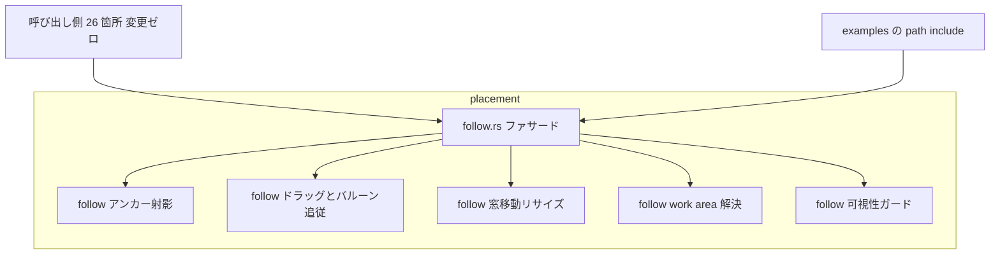
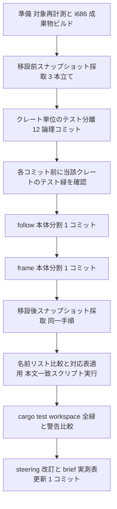

# 技術設計書: areka-P0-file-slimming

> 生成 2026-08-07（design フェーズ）／対象ブランチ `claude/areka-p0-file-slimming-64d065`
> 入力: `requirements.md`（確定済）・`research.md`（全域ギャップ分析 第 2 版・rustc 1.97.1 実測）・`brief.md`・`.kiro/steering/`
> 本書は要件ディスカッション（2026-08-07）で確定した裁定——動機は「1 ファイルの行数が大きすぎることそのもの」・対象はリポジトリ全 Rust ソース・1,000 行目安はテストファイルにも等しく適用——を前提に、残っていた設計判断 #1〜#13 をすべて裁定する。

## Overview

**Purpose**: 本 spec は areka ワークスペースの**ファイル構造のみ**を是正する。`#[cfg(test)]` テストモジュール（合計 500 行超）を持つ 49 ファイルからテストモジュール本体を専用テストファイルへ移設し、1,000 行を超えるテストファイルはテーマ単位の複数ファイルへ分割し、本番本体が突出して太い `follow.rs`・`frame.rs` の 2 本のみを責務単位のサブモジュールへ分割する。動かすのは「コードの置き場所」であって「コードの中身」でも「本番のふるまい」でもない。

**Users**: 全 spec の実装者・レビュアー・brief 保守（棚卸）が、エディタ・diff・レビュー・git マージで扱える大きさのファイルを得る。

**Impact**: リポジトリ最大ファイル 8,472 行（`follow.rs`）を解消し、テスト分離のみの試算で残る 6,476 行のテストファイルもテーマ分割により 1,000 行目安へ収める。受け入れの中心は 3 つの不変量——**テスト総数不変**・**公開 API 不変**・**挙動変更ゼロ**——であり、検証はテスト本数の一致とテスト本文の一致（空白非依存）＋旧→新テスト名の全単射対応表で行う。

### Goals

- 必須対象 49 ファイル（テストコード合計 68,921 行）のテストモジュール本体を、単一の裁定方式で専用テストファイルへ移設する（1.1〜1.5）
- 1,000 行を超えるテストファイルを作らない——テーマ単位のサブモジュール分割を本番・テストの区別なく適用する（1.7・4.2・4.6）
- `follow.rs`（本体 1,996 行）・`frame.rs`（本体 1,497 行）を責務単位サブモジュールへ分割する（4.1〜4.5）
- テスト総数一致・本文一致・公開 API 不変・警告非増加を**証跡**で示す（2.1〜2.9）
- 移設方式と命名規約を steering に明文化し、brief の実測表を更新する（6.1〜6.4）

### Non-Goals

- テストコードの内容変更・追加・削除（テスト関数の識別子・アサーション・入力値・期待値・属性・コメントは 1 文字も変えない）
- テストハーネスの一本化・共有化、テスト間の状態汚染の是正、時刻注入シームの変更（`test-cage-determinism` W6.9 の領分）
- `follow.rs`・`frame.rs` 以外の本番本体分割（本番本体 500〜1,000 行の水準は健全と判定済み）
- テストモジュールが 500 行以下のファイルの移設（任意移設は本 spec では**行わない**——設計判断 #10、§裁定一覧）
- 他 spec の brief に記載された file:line アンカーの更新
- テストモジュールを持たない巨大テストファイル（`choice_test.rs` 1,563 行等）の分割——「同居テストモジュールの外出し」という本 spec の操作が定義できないため対象外（将来 spec の受け皿は steering 追記でカバー）

## Boundary Commitments

### This Spec Owns

- **テストモジュールの「位置」**: 必須対象 49 ファイルの `#[cfg(test)] mod` ブロック本体の置き場所と、その接続宣言
- **`follow.rs`・`frame.rs` の本番本体のファイル内訳**（項目の中身は不変・置き場所のみ）
- **移設方式・命名規約の単一裁定**とその steering 明文化（`structure.md` のテスト配置規約）
- **移設前後の同一性証跡**: テスト名リスト・旧→新対応表・本文比較スクリプト・警告基準値（置き場所は本 spec ディレクトリ配下 `verification/`）
- brief.md の行数実測表の更新（更新前後の対比つき）

### Out of Boundary

- テストモジュールの**中身**（`test-cage-determinism` が所有。移設中に発見した壊れたテスト・状態汚染は file:line 付きで登記して送るだけ——5.2）
- テストハーネス・`capture_logs` 等の共有基盤・時刻注入シーム
- 他 spec の brief / 完了済 spec の手順書に書かれた file:line アンカー・`RUST_LOG` 手順書の文言（前置一致ディレクティブは分割後も有効——§本体分割の制約）
- `crates/areka` examples の test モード既存コンパイルエラー（E0433・main 時点で再現済みの既存状態。是正しない・登記して送る）
- テスト関数識別子の改名（許容するのは所属モジュールパスの変化のみ——2.9）

### Allowed Dependencies

- rustc / cargo 1.97.1 のモジュール解決意味論（`#[path]` 読込ファイルの子モジュール解決規則は research §2.3.3 で実測済）
- git（クレート単位の論理コミット・`git diff -w`）・PowerShell（証跡採取・比較スクリプト）
- i686 host-32 成果物の事前ビルド（`cargo test --workspace` 全緑の既存 DoD 前提——本 spec は変更しない）
- `.kiro/steering/structure.md`（テスト命名規約の改訂先）

### Revalidation Triggers

- 移設方式（§移設方式の裁定）または命名規約を変更したとき → steering 記述と全対象ファイルの再突合
- `follow.rs`／`frame.rs` のファサード形（再輸出集合）を変更したとき → 外部参照 26＋10 箇所と examples の `#[path]` include の再検証
- 実装中に他 spec の実装ブランチが同一ファイルへ着地したとき → 当該ファイルを対象から一時除外し衝突を登記（5.5）
- テーマ分割の粒度・名前を変更したとき → 旧→新テスト名対応表の再生成と全単射再検証

## Architecture

### Existing Architecture Analysis

research.md（第 2 版・全域 619 ファイル実測）で確定済みの前提のみ要約する:

- 必須対象は **49 ファイル・テストコード 68,921 行**（`src/` 48 本＋`crates/areka-ghost/tests/ghost/spine_e2e_test.rs`）。設計時再計測は要件記載値と完全一致（乖離なし——1.2）。`benches/`・`build.rs` はリポジトリに存在しない（空集合——設計判断 #11）。
- 必須対象のテストモジュールは**すべてファイル末尾に連続配置**（interleaved 0 件）——移設は「末尾切り出し＋de-indent」に還元できる。
- 既存のテスト分離前例は `src/` に 2 系統（同一ディレクトリ・フラット式 ／ `{module}/tests.rs` ディレクトリ式・計 55 宣言）、`crates/*/tests/` には `#[path]` 属性 115 箇所が唯一の標準（steering `structure.md` L135 明文）。
- **実測済みの決定的制約**: `#[path]` で読み込まれたファイルの子モジュールは、そのファイル自身のディレクトリ基準で解決される（素の `mod tests;` は E0583）。ゆえに案 A（素の `mod tests;` ＋ `foo/tests.rs`）は `tests/` ツリーで単独成立せず、**単一方式の候補から脱落**（3.1）。
- `crates/areka/examples/window-placement.rs`・`collision-probe.rs` は `#[path]` で `src/placement/mod.rs` 木を私有 include する。**placement 木の本番コードは `crate::` パスを使えない**（`follow.rs` 本体は現に 0 件）。
- `cargo test -p areka --examples` は main 時点で既にコンパイルエラー（E0433・`spawn.rs` テストモジュール内の `crate::` 参照＝`spawn.rs:871` に先行裁定の注記あり）。移設の前後で変わらない既存状態。

### 移設方式の裁定（設計判断 #1）: 案 C — `#[path]` フラット兄弟ファイル

**裁定**: テストモジュールの移設方式は**案 C**（同一ディレクトリのフラット兄弟テストファイル＋`#[cfg(test)] #[path]` 接続）とし、必須対象 49 ファイル全数へ同一方式を適用する（3.1）。

**接続規約（全対象で同一文言・3.2 の一意規則）**:

```rust
// 本番ファイル末尾（旧テストモジュールの位置）に置く接続宣言
#[cfg(test)]
#[path = "<テストファイル名>"]
mod <テストモジュール名>;
```

- **テストファイル名** = `<stem>_<テストモジュール名>.rs`、置き場所は**本番ファイルと同一ディレクトリ**。
- **stem** = 本番ファイル名（拡張子除く）。ただしモジュール root ファイルは次のとおり読み替える:
  - `mod.rs` → 親ディレクトリ名（例: `placement/mod.rs` → stem `placement`）
  - `main.rs` → `main` ／ `lib.rs` → `lib`（読み替えなし）
- `#[path]` はモジュール root ファイル（`mod.rs`・`main.rs`・`lib.rs`）では文法上省略可能だが、**常に明示する**（`src/` と `tests/` ツリーで文言まで同一の単一方式を保つため）。
- 逆引きも規則から一意: テストファイル名の先頭 `<stem>_` が本番ファイルを指す（3.2）。

例:

```rust
// crates/areka/src/placement/measure.rs（パス変更なし・末尾）
#[cfg(test)]
#[path = "measure_tests.rs"]
mod tests;
// → crates/areka/src/placement/measure_tests.rs（モジュールパス不変: placement::measure::tests::*）

// crates/areka-ghost/tests/ghost/spine_e2e_test.rs（パス変更なし・末尾）
#[cfg(test)]
#[path = "spine_e2e_test_s1_boot_success.rs"]
mod s1_boot_success;
// → crates/areka-ghost/tests/ghost/spine_e2e_test_s1_boot_success.rs（モジュールパス不変）
```

**裁定根拠**（3.4——候補対比の記録。詳細対比表は research §4）:

| 観点 | 案 A（素の `mod` ＋ `foo/tests.rs`） | 案 B（`foo/mod.rs` ディレクトリ化） | **案 C（採用）** |
|---|---|---|---|
| 単一方式（3.1） | ✗ `#[path]` 読込ファイルで素の `mod` が使えず（E0583 実測）`src/` と `tests/` で書き方が割れる | ○（ただし入口 `tests/ghost.rs` の `#[path]` 書き換えが要る） | ◎ `src/`・`tests/` で文言まで同一 |
| 本番ファイルのパス変更（3.5） | 0 本 | **44 本＋入口 1 編集**（他 spec のアンカーが 44 ファイル分一度に無効化） | **0 本** |
| 既存前例 | `foo.rs`＋`foo/` 共存は 1 例のみ | `src/` に最多（14 モジュール） | `#[path]` は `tests/` 115 箇所・`examples/` 11 箇所・steering L135 明文（`src/` は未導入なだけ） |
| steering | 要追記 | 無改訂 | L142-145 の書き換えが要る（6.2 の作業として本 spec が実施） |
| 副作用 | テストファイルしか入らないディレクトリが 41〜43 個 | `mod.rs` が 44 個増える（Rust 2018 の忌避形） | ディレクトリ増ゼロ・テストが本番の真横に並ぶ |

案 A は実測（E0583）により単一方式として成立しないため脱落。B と C の比較では、(i) 3.1 を文言レベルで満たす唯一の案であること、(ii) 本番ファイルのパス変更 0 本（3.5 の一覧が空になり、他 spec brief のアンカー無効化・`git blame` 断絶・examples include への影響が一切ない）、(iii) `mod.rs` 増殖なし、を決め手に **C を採用**する。C の代償である steering L144 の書き換えは、6.1/6.2 が要求する steering 改訂作業に吸収される。既存の分離済みテストファイル 55 宣言（26 ファイル）は 1.4 により**そのまま維持**し、新方式へ揃え直さない（移設対象の外延は必須対象 49 本のみ——research R-1 の裁定）。

### テストモジュールの集約単位（設計判断 #2）: 1 テストモジュール＝1 テストファイル

複数テストモジュールを持つ 8 ファイル（最大 `spine_e2e_test.rs` の 10 個・次いで `main.rs` の 7 個）は、要件 1.3 の「当該ファイル専用のテストモジュールの置き場」を**「同一ディレクトリ内の `<stem>_*` 名前空間」**と定め、**1 テストモジュール＝1 テストファイル**で個別に移設する。1 ファイルへの入れ子集約（`tests::tests::*` へのモジュールパス変化）は行わない。これによりこの 8 ファイルではテスト完全修飾名が**一切変わらず**、名前リストの完全一致という最強の証跡を保てる。テストモジュール間のコメントバナー（`spine_e2e_test.rs` の `// ===== S2: ... =====` 等）は、対応するテストファイルの先頭へ同伴させる（バナーはモジュールブロック外のコメントであり、本文一致検証の対象はモジュールブロック内部——§検証パイプライン）。

### テーマ分割ポリシー（設計判断 #4/#12）: 1,000 行超のテストファイルはテーマ単位に分割する

**裁定**: 開発者裁定（2026-08-07）のとおり、**1 ファイル 1,000 行以下の目安は本番ファイルとテストファイルの双方に等しく適用する**（1.7・4.2）。テストモジュールを 1 ファイルへ出しただけで 6,476 行のテストファイルが残る結果は本 spec の成果として認めない。

- **判定基準**: 1 テストモジュール＝1 ファイルの原則で移設した結果、テストファイルが 1,000 行を超えるもの。設計時再計測では、テストコード合計 1,000 行超の必須対象ファイルは 27 本あり、うち 3 本（`choice.rs`＝3 モジュール・`kanade/schedule/mod.rs`＝2 モジュール・`spine_e2e_test.rs`＝10 モジュール）は複数テストモジュールの個別ファイル化だけで全ファイル 1,000 行以下に収まる。残る **24 テストモジュール**（§File Structure Plan の表で「テーマ分割」と明記）がテーマ分割の対象である。
- **分割の形**: 対象テストモジュール（通例 `mod tests`）を廃し、本番ファイルからテーマごとの複数モジュールを直接宣言する。新モジュール名は `<テーマ>_tests` 形式、テストファイル名は接続規約どおり `<stem>_<モジュール名>.rs`:

```rust
// crates/areka/src/placement/follow.rs（末尾・テーマ分割後の接続宣言群）
#[cfg(test)]
#[path = "follow_test_support.rs"]
mod test_support;               // 複数テーマから参照される共有ヘルパ
#[cfg(test)]
#[path = "follow_anchor_tests.rs"]
mod anchor_tests;
#[cfg(test)]
#[path = "follow_drag_tests.rs"]
mod drag_tests;
// …（テーマ数ぶん続く）
```

- **テーマ境界の決め方**: テストモジュール内部の既存構造（対象関数のまとまり・コメントバナー・ヘルパの参照関係）に従い、**項目（テスト関数・ヘルパ項目）単位でのみ**振り分ける。関数の中を割ることは決してしない。`follow.rs`・`frame.rs` の 2 本は本番本体の責務シーム（§本体分割）に対応するテーマを初期案とする（4.6）。他 22 モジュールのテーマ名は実装時に各モジュールの内容から決定し、旧→新テスト名対応表に記録する。
- **共有ヘルパ**: 複数テーマから参照されるヘルパ項目（fixture 構築関数・定数・補助型）は `<stem>_test_support.rs`（モジュール名 `test_support`）へ置く。テーマモジュールからは `super::test_support::…` で参照する。ヘルパの可視性付与（`pub(super)` 等）と `use` 追加は 2.4 が許容する機械的調整の範囲。
- **テスト名の扱い**: テーマ分割によりモジュールパスが `follow::tests::X` → `follow::drag_tests::X` のように変わる。**テスト関数識別子そのものは改名しない**（2.9）。旧完全修飾名 → 新完全修飾名の対応表を証跡に残し、全単射（漏れ・重複なし）を機械検証する。
- **目安の運用**: 1,000 行は目安でありテーマの境界を壊してまで満たす強制値ではない（1.7）。僅少超過（例: `resolver.rs` の 1,011 行）で自然なテーマ境界が見いだせない場合に限り単一ファイル維持を許容し、その理由を対応表と同じ証跡ディレクトリに記録する。既定はあくまで分割である。

### 非 `mod` `#[cfg(test)]` 項目の裁定（設計判断 #3）: 全数残置

`#[cfg(test)]` が `mod` ブロック以外（`use`・`fn`・`impl`・フィールド・分岐）に付く項目は全域で **40 件・すべて `src/`**（全数は §Supporting References に転記）。うち 18 件（inherent impl メソッド 15・構造体フィールド 2・分岐 1）は本体の私有状態に結合しており構造的に移設不可。**裁定: 40 件全数を本番ファイルに残置し、移設対象は `#[cfg(test)] mod` ブロックのみとする**（1.6・全対象一貫適用）。`viewbox_draw.rs` の `fail_next_render`（本番構造体内の注入シーム）はテスト間の状態汚染に関わる所見として `test-cage-determinism` へ登記して送る（5.2）。

### 統合テストツリー内の冗長 `#[cfg(test)]`（設計判断 #13）: 残す

`tests/` 配下はクレート全体が test ターゲットであり `#[cfg(test)]` は常に真（意味論的に冗長）。**裁定: 属性は落とさず残す**。理由: (i) 属性の除去は 2.4 が禁じる「属性の変更」に当たる、(ii) 次回の行数計測（テストモジュール判定式）の一貫性を保つ。`spine_e2e_test.rs` の移設でも各接続宣言に `#[cfg(test)]` を付けたまま移す。

### 本体分割（設計判断 #5）: D1 ファサード再輸出型

`follow.rs`・`frame.rs` は**元ファイルをファサードとして残し**、本番項目を責務単位のサブモジュールファイルへ純移動したうえで `pub use` で再輸出する（D1）。クレート外から観測できる公開 API（型・関数・トレイト・モジュールパス・可視性）は完全に不変（2.5）、クレート内の呼び出し側も **0 箇所変更**で済む（4.3 を最短で満たす）。関数の分割・統合、責務の移動、ロジックの書き換えは行わない——許容するのは項目の移動とモジュールパスの追随のみ（4.4）。



**follow.rs（本体 1,996 行 → ファサード＋5 サブモジュール）** — research §2.6 の実測シームに従う:

| サブモジュール | 責務（移動する項目群） | 概算行 |
|---|---|---:|
| `follow/anchor.rs` | アンカー射影ポリシー（`DragPositionPolicy`・`BottomSnapPolicy`・`project_anchor`・`Anchored`） | ~166 |
| `follow/drag_follow.rs` | ドラッグ＋バルーン追従（`BalloonFollow`・`on_char_drag*`・`follow_balloon`・`guard_balloon_position`・`on_balloon_drag*`） | ~670 |
| `follow/window_move.rs` | 窓移動・リサイズ API（`move_window_to`・`resize_window_to`・`anchor_changed_system`・`resize_window_keep_position`） | ~642 |
| `follow/work_area.rs` | モニタ work area 解決（`MonitorSnapshot`・`work_area_for_window*`・`WorkAreaResolution`） | ~113 |
| `follow/visibility.rs` | 可視性ガード（`VisibilityVerdict`・`guard_visibility`・`apply_visibility_guard`・`evaluate_visibility_guard` ほか） | ~338 |

**frame.rs（本体 1,497 行 → ファサード＋サブモジュール）** — research §2.7 の 9 シームを近接責務でまとめ、全ファイル 1,000 行以下:

| サブモジュール | 責務 | 概算行 |
|---|---|---:|
| `frame/attach.rs` | attach 計画＋attach 相（`AttachPlan`・`plan_attachments`・`run_attach_phase`・`connect_balloon_text`） | ~370 |
| `frame/wiring.rs` | 配線コンテナ `Emo2Wiring`＋その impl 全体（**`#[cfg(test)]` メソッド 5 件を同伴**） | ~188 |
| `frame/dpi.rs` | DPI 相（`AuthorDpis`・`classify_ghost_window`・`run_dpi_phase` ほか） | ~423 |
| `frame/scale_text.rs` | テキスト scale 相＋テキスト相（`run_text_scale_phase`・`run_text_phase`・`resolve_talk_time`） | ~205 |
| `frame/drain_resnap.rs` | drain 相＋resnap（`run_drain_phase`・`run_move_drain_phase`・`resnap_*`・`PhysicalSizeSource`） | ~216 |
| `frame.rs`（ファサード） | `mod` 宣言＋`pub use` 再輸出＋フレーム統合 `emo2_frame_system` | ~60 |

**本体分割の制約（実測で確定済・実装時の必須遵守事項）**:

1. **`crate::` パス不使用（placement 木のみ）**: `follow.rs` とその新サブモジュールは `crate::` パスを 1 件も使ってはならない（examples が `#[path]` で placement 木を私有 include するため）。現本体は 0 件であり、移動後も `super::`／相対パスで書く。`frame.rs` は examples に include されないためこの制約の対象外（現に `crate::placement::follow::…` を使用しており、そのままでよい）。
2. **`Emo2Wiring` の同居**: impl 内の `#[cfg(test)]` メソッド 5 件（`frame.rs:301-346`）は私有フィールドに触るため、struct と impl を `frame/wiring.rs` に**一体で**移す。クレート内可視性の調整（`pub(super)`→`pub(crate)` 等）は 2.5 の基準（クレート外観測）に影響しないが、変更した場合は差分レビューで明示する。
3. **tracing target**: 項目の移動により既定 target が `areka::placement::follow::visibility` 等の子パスへ変わる。リポジトリ全域を突合した結果（research R-3・design 時 grep で完了）、(i) コード中に旧 target の完全一致判定は存在しない（`diag.rs` の完全一致判定は分割対象外の `areka::placement::diag` のみ）、(ii) 実行時フィルタはすべて前置一致ディレクティブ（`areka::placement::follow=debug` は子モジュールにもマッチ）、(iii) 完了済 spec の手順書に現れる旧 target 文字列も前置一致で引き続き有効。**よって挙動・観測互換は保たれる**（2.7）。診断向けの恒久 target `areka::placement::diag`（`diag.rs`）には触れない。
4. **`#[allow(dead_code)]` の同伴**: `follow.rs:149,217,1230,1927` 等の `#[allow]` は項目に付随して移動する。分割後に `cargo build --workspace --all-targets` の警告件数が増えないことを証跡で確認する（2.6）。
5. **examples の追随**: `window-placement.rs`・`collision-probe.rs` は `placement/mod.rs` 経由で include するため、ファサード維持により自動追随する（編集不要）。`cargo build -p areka --examples` の緑を分割コミット前に確認する。

### 裁定一覧（設計判断 #1〜#13 の対応表）

| # | 論点 | 裁定 | 本書の節 |
|---|---|---|---|
| 1 | 移設方式 | **案 C**: `#[path]` フラット兄弟＋常時明示の接続宣言。本番パス変更 0 本 | §移設方式の裁定 |
| 2 | 複数テストモジュール 8 本の集約単位 | 1 テストモジュール＝1 テストファイル（同一ディレクトリの `<stem>_*` 名前空間へ集約・名前完全保存） | §集約単位 |
| 3 | 非 `mod` `#[cfg(test)]` 40 件 | 全数残置・移設は `mod` ブロックのみ。`fail_next_render` は所見登記 | §非 mod 項目 |
| 4 | 本体分割 2 本のテスト配置 | サブモジュール対応のテーマ単位で複数ファイルへ分配（単一巨大ファイル禁止・対応表で名前変化を証跡化） | §テーマ分割・§本体分割 |
| 5 | 本体分割の形 | **D1 ファサード再輸出**（呼び出し側 0 変更・公開 API 完全不変） | §本体分割 |
| 6 | 証跡手順 | **3 本立て採取**＋名前リスト比較＋対応表適用。`--all-targets` 側は `--exclude areka` | §検証パイプライン |
| 7 | 本文一致の検証 | 行頭空白正規化の機械比較スクリプトを成果物に含める。置き場は spec 配下 `verification/` | §検証パイプライン |
| 8 | steering 改訂範囲 | `structure.md` L142-145 書き換え＋L133-140 追記＋L204 補記＋将来カテゴリ 1 行 | §steering 改訂 |
| 9 | 動機の枠組み | 再裁定しない（確定済: 行数そのもの） | — |
| 10 | 任意移設（500 行以下） | **行わない（0 件）**。差分最小化を優先し、混在ディレクトリの一貫性は steering の新規運用規律で将来収束させる | §裁定一覧（本行） |
| 11 | `benches/`・`build.rs` | 現状 0 件（該当なし）と明記。将来追加時も同一規律が適用される旨を steering に 1 行 | §steering 改訂 |
| 12 | 成果の定義 | テスト分離＋**テーマ分割まで**が成果（1.7 の開発者裁定に従う）。検証は本数一致＋本文一致＋全単射対応表 | §テーマ分割 |
| 13 | 統合テスト内の冗長 `#[cfg(test)]` | 残す（属性不変・計測一貫性） | §冗長 cfg(test) |

## File Structure Plan

### 新規テストファイル（必須対象 49 ファイルの全数）

命名はすべて接続規約 `<stem>_<モジュール名>.rs`（同一ディレクトリ）から機械的に導出される。「テーマ分割」印の 24 モジュールは `<stem>_<テーマ>_tests.rs` 複数本（＋必要に応じ `<stem>_test_support.rs`）となり、テーマ名は実装時に確定して対応表に記録する。それ以外は表のファイル名で確定である。

**crates/areka（13 ファイル）**

| 本番ファイル（`src/` 以下） | テスト行 | 新テストファイル |
|---|---:|---|
| `placement/follow.rs` | 6,476 | **テーマ分割**: `placement/follow_<テーマ>_tests.rs` ×約 5〜7 ＋ `follow_test_support.rs`（初期案テーマ: anchor / drag / move / work_area / visibility——本体シームに対応） |
| `emo2_boot/frame.rs` | 3,163 | **テーマ分割**: `emo2_boot/frame_<テーマ>_tests.rs` ×約 3〜4（初期案: attach / dpi / scale_drain 系） |
| `input_events/balloon.rs` | 1,996 | **テーマ分割**: `input_events/balloon_<テーマ>_tests.rs` ×約 2〜3 |
| `placement/mod.rs` | 1,336 | **テーマ分割**: `placement/placement_<テーマ>_tests.rs` ×約 2（stem＝親ディレクトリ名） |
| `placement/spawn.rs` | 1,156 | **テーマ分割**: `placement/spawn_<テーマ>_tests.rs` ×約 2 |
| `placement/persist.rs` | 1,070 | **テーマ分割**: `placement/persist_<テーマ>_tests.rs` ×約 2 |
| `placement/resolver.rs` | 1,011 | **テーマ分割**（僅少超過・自然な境界が無ければ単一維持を許容し理由記録）: `placement/resolver_<テーマ>_tests.rs` |
| `emo2_boot/move_cue.rs` | 934（4 モジュール） | `move_cue_tests.rs`・`move_cue_move_sink_tests.rs`・`move_cue_apply_move_tests.rs`・`move_cue_move_severity_log_tests.rs` |
| `placement/measure.rs` | 922 | `placement/measure_tests.rs` |
| `main.rs` | 901（7 モジュール） | `main_startup_window_tests.rs`・`main_seam_tests.rs`・`main_config_input_tests.rs`・`main_ghost_wiring_tests.rs`・`main_restore_seam_tests.rs`・`main_persist_wiring_seam_tests.rs`・`main_monitor_snapshot_seam_tests.rs` |
| `emo2_boot/assets.rs` | 820 | `emo2_boot/assets_tests.rs` |
| `input_events/mod.rs` | 731 | `input_events/input_events_tests.rs`（stem＝親ディレクトリ名） |
| `placement/source.rs` | 540 | `placement/source_tests.rs` |

**crates/areka-emo-text（7 ファイル）**

| 本番ファイル | テスト行 | 新テストファイル |
|---|---:|---|
| `layout.rs` | 2,545 | **テーマ分割**: `layout_<テーマ>_tests.rs` ×約 3 |
| `viewbox_draw.rs` | 2,305 | **テーマ分割**: `viewbox_draw_<テーマ>_tests.rs` ×約 3 |
| `actor.rs` | 2,109（2 モジュール） | `actor_tests.rs`（82 行）＋ `runtime_tests`（2,027 行）は**テーマ分割**: `actor_<テーマ>_tests.rs` ×約 2〜3 |
| `viewbox.rs` | 1,749 | **テーマ分割**: `viewbox_<テーマ>_tests.rs` ×約 2 |
| `draw.rs` | 1,330 | **テーマ分割**: `draw_<テーマ>_tests.rs` ×約 2 |
| `choice.rs` | 1,199（3 モジュール） | `choice_tests.rs`（585）・`choice_style_resolve_tests.rs`（211）・`choice_decorate_tests.rs`（403）——個別ファイル化のみで全ファイル 1,000 行以下 |
| `state.rs` | 1,174 | **テーマ分割**: `state_<テーマ>_tests.rs` ×約 2 |

**crates/areka-emo-present（4 ファイル）**: `presenter.rs` 4,375 → **テーマ分割** ×約 5 ／ `balloon.rs` 1,632 → **テーマ分割** ×約 2 ／ `cache.rs` 907 → `cache_tests.rs` ／ `scale.rs` 649 → `scale_tests.rs`

**crates/areka-kanade（6 ファイル）**: `schedule/steady.rs` 2,383 → **テーマ分割** ×約 3 ／ `schedule/mod.rs` 1,495（2 モジュール）→ `schedule/schedule_tests.rs`（885）・`schedule/schedule_log_firing_tests.rs`（610）——個別化のみで足りる ／ `schedule/boot.rs` 1,118 → **テーマ分割** ×約 2 ／ `actor.rs` 948 → `actor_tests.rs` ／ `shiori/real.rs` 623 → `shiori/real_tests.rs` ／ `schedule/events.rs` 583 → `schedule/events_tests.rs`

**crates/areka-sakura（2 ファイル）**: `drive.rs` 2,278 → **テーマ分割** ×約 3 ／ `compile.rs` 1,546 → **テーマ分割** ×約 2

**crates/areka-emo-compose（3 ファイル）**: `plan.rs` 1,536 → **テーマ分割** ×約 2 ／ `scale.rs` 1,311 → **テーマ分割** ×約 2 ／ `fold.rs` 868 → `fold_tests.rs`

**crates/areka-seriko（3 ファイル）**: `actor.rs` 1,847 → **テーマ分割** ×約 2 ／ `state.rs` 1,058 → **テーマ分割** ×約 2 ／ `looper.rs` 564 → `looper_tests.rs`

**crates/areka-ghost（3＋1 ファイル）**: `dispatcher.rs` 1,436 → **テーマ分割** ×約 2 ／ `runtime.rs` 963 → `runtime_tests.rs` ／ `ticker.rs` 504 → `ticker_tests.rs` ／ `tests/ghost/spine_e2e_test.rs` 2,091（10 モジュール）→ `tests/ghost/spine_e2e_test_<モジュール名>.rs` ×10（`…_tests.rs`・`…_broadcast_relevance_partition.rs`・`…_s1_boot_success.rs` 〜 `…_s7_second_boot_record_present.rs`・`…_global_log_probe.rs`。最大 300 行・共有 fixture `RecordingSink` 等は本体 L1-320 に残るため外部 4 ファイルの参照は不変）

**crates/wintf（4 ファイル）**: `ecs/window_proc/window_pos.rs` 716 → `window_pos_tests.rs` ／ `ecs/clickthrough/controller.rs` 637 → `controller_tests.rs` ／ `ecs/window_proc/dpi_helpers.rs` 598 → `dpi_helpers_tests.rs` ／ `ecs/layout/systems/monitor_systems.rs` 569 → `monitor_systems_tests.rs`

**crates/areka-sylphya（1 ファイル）**: `actor.rs` 866（3 モジュール）→ `actor_tests.rs`（354）・`actor_actor_integration_tests.rs`（344）・`actor_actor_criteria_cage.rs`（168・モジュール名は既存識別子のまま）

**crates/dola（1 ファイル）**: `cue/command.rs` 758 → `cue/command_tests.rs`

**crates/shiori-host32-helper（1 ファイル）**: `main.rs` 595（4 モジュール）→ `main_resolve_param_tests.rs`・`main_classify_tests.rs`・`main_load_ack_tests.rs`・`main_loopback_tests.rs`

新規テストファイルは合計およそ 110 本前後（単一モジュール移設 52 本＋テーマ分割 24 モジュール×2〜7 本）。

### 本体分割で新設するファイル

```
crates/areka/src/placement/
├── follow.rs                  # ファサード（mod 宣言＋pub use＋接続宣言群）— パス不変
└── follow/
    ├── anchor.rs              # アンカー射影ポリシー
    ├── drag_follow.rs         # ドラッグ＋バルーン追従
    ├── window_move.rs         # 窓移動・リサイズ API と反映
    ├── work_area.rs           # モニタ work area 解決
    └── visibility.rs          # 可視性ガード

crates/areka/src/emo2_boot/
├── frame.rs                   # ファサード（mod 宣言＋pub use＋emo2_frame_system＋接続宣言群）— パス不変
└── frame/
    ├── attach.rs              # attach 計画＋attach 相
    ├── wiring.rs              # Emo2Wiring（cfg(test) メソッド 5 件同伴）
    ├── dpi.rs                 # DPI 相
    ├── scale_text.rs          # テキスト scale 相＋テキスト相
    └── drain_resnap.rs        # drain 相＋resnap
```

`foo.rs`＋`foo/` 共存は Rust 2018 の正規形式であり、リポジトリ内前例（`areka-emo-atlas/src/decode.rs`＋`decode/`）で実証済み。

### 検証成果物（本 spec ディレクトリ配下）

```
.kiro/specs/areka-P0-file-slimming/verification/
├── Compare-RelocatedTests.ps1   # 空白非依存の本文一致検証スクリプト（成果物・設計判断 #7）
├── before_default.txt           # 移設前: cargo test --workspace -- --list（doctest 込み）
├── before_alltargets.txt        # 移設前: --exclude areka --all-targets -- --list（examples 込み）
├── before_build_warnings.txt    # 移設前: cargo build --workspace --all-targets の警告集計
├── after_default.txt / after_alltargets.txt / after_build_warnings.txt
├── test_name_mapping.csv        # 旧完全修飾名 → 新完全修飾名の全単射対応表（テーマ分割分のみ行を持つ）
└── notes.md                     # 僅少超過で単一維持した場合の理由記録・送付所見の登記控え
```

`scripts/` ディレクトリは現状リポジトリに存在せず、本スクリプトは spec のライフサイクル（完了時 `completed/` へアーカイブ）に属する検証道具のため、spec 配下を置き場とする。

### Modified Files

- **必須対象 49 ファイル**: 末尾のテストモジュールブロックを接続宣言（`#[cfg(test)] #[path = …] mod …;`）へ置換。本番本体は無変更
- `crates/areka/src/placement/follow.rs`・`crates/areka/src/emo2_boot/frame.rs`: 上記＋本体のファサード化（項目移動と `pub use`）
- `.kiro/steering/structure.md`: テスト配置規約の改訂（§steering 改訂）
- `.kiro/specs/areka-P0-file-slimming/brief.md`: 実測表の更新（更新前値を併記——6.3/6.4）

## System Flows

実装〜検証の全体フロー（コミット粒度は 7.1〜7.3 に対応）:



- 移設前スナップショットは**実装開始コミットの直前に一度だけ**採取し `verification/` へコミットする（コールドビルドの時間コストを 1 回に固定）。
- テスト分離コミットと本体分割コミットは分ける（7.3）。`follow.rs`・`frame.rs` のテスト分離（テーマ分割を含む）は areka クレートのテスト分離コミットに含め、本体分割コミットは本番項目の移動のみを含む。
- 着手時に `git worktree list`／実装ブランチ一覧で他 spec 実装の不在（W5.95 空白期）を確認して記録する（5.4）。実装中に他 spec 実装が同一ファイルへ着地した場合は当該ファイルを対象から一時除外して登記する（5.5）。

## Requirements Traceability

| Requirement | 要約 | 実現する設計要素 |
|---|---|---|
| 1.1 | 全 Rust ソースのテストモジュール 500 行超を外部テストファイルへ | §移設方式の裁定（案 C）・§File Structure Plan（49 本全数） |
| 1.2 | 設計時の全域再計測と乖離説明 | §Existing Architecture Analysis（49 本・68,921 行＝要件値と一致・乖離なし。`benches/`・`build.rs` は 0 件） |
| 1.3 | 複数テストモジュールの専用置き場への集約 | §集約単位（1 モジュール＝1 ファイル・`<stem>_*` 名前空間） |
| 1.4 | 分離済みファイルの除外・維持 | §移設方式の裁定（既存 55 宣言は維持・揃え直さない） |
| 1.5 | 500 行以下は必須としない | §裁定一覧 #10（任意移設 0 件） |
| 1.6 | 非 `mod` `#[cfg(test)]` の一貫裁定 | §非 mod 項目（40 件全数残置）・§Supporting References（全数表） |
| 1.7 | 1,000 行超テストファイルのテーマ分割（テストにも等しく適用） | §テーマ分割ポリシー（24 モジュール・分割の形と目安運用） |
| 1.8 | テーマ分割時は本数一致＋本文一致で検証 | §検証パイプライン（対応表適用後のリスト一致＋本文比較） |
| 2.1 | `cargo test --workspace` 全緑 | §System Flows（i686 成果物前提の最終全緑ラン） |
| 2.2 | 前後のテスト総数完全一致 | §検証パイプライン（3 本立てリストの機械比較） |
| 2.3 | 総数一致の証跡採取 | §検証成果物（before/after ファイルをコミット） |
| 2.4 | テスト内容不変（許容は接続調整と de-indent のみ） | §検証パイプライン（行頭空白正規化の本文一致スクリプト） |
| 2.5 | 公開 API 不変 | §本体分割（D1 ファサード・`pub use` 再輸出）・移設はモジュールパス自体不変 |
| 2.6 | ビルド警告非増加 | §検証成果物（before/after 警告集計）・§本体分割の制約 4 |
| 2.7 | 実行時挙動不変 | §本体分割の制約 3（tracing target の前置一致検証済）・コード内容は無変更 |
| 2.8 | コンパイル不能は接続側で解決 | §Error Handling（可視性・import・モジュール接続で解決、テストロジック不改変） |
| 2.9 | モジュールパス変化のみ許容・全単射対応表 | §テーマ分割ポリシー・§検証成果物（`test_name_mapping.csv`） |
| 3.1 | 単一方式の裁定と全対象適用 | §移設方式の裁定（案 C・`src/`／`tests/` 同一文言） |
| 3.2 | パスの規則からの一意導出 | §移設方式の裁定（`<stem>_<モジュール名>.rs`・stem 読み替え規則・逆引き可） |
| 3.3 | in-crate 配置維持（私有項目への到達） | 案 C は同一モジュール木内の移設（`super::` 到達不変）。外部 `tests/` への移動はしない |
| 3.4 | 候補対比と裁定根拠の記録 | §移設方式の裁定（A/B/C 対比表・A の E0583 実測脱落を含む） |
| 3.5 | パスが変わる本番ファイルの全数明示 | §移設方式の裁定（案 C により **0 本**——一覧は空） |
| 4.1 | follow/frame の責務単位分割 | §本体分割（実測シームに基づく 5＋5 サブモジュール） |
| 4.2 | 分割後 1,000 行以下の目安 | §本体分割（全サブモジュール 1,000 行以下・概算表） |
| 4.3 | 公開項目の可視性維持・呼び出し側はパス追随のみ | §本体分割（D1: 呼び出し側 0 変更） |
| 4.4 | 関数分割・責務移動・書き換え禁止 | §本体分割（項目の純移動のみ） |
| 4.5 | 2 本以外の本体分割禁止 | §Non-Goals（presenter.rs 1,042 行等は分割しない） |
| 4.6 | 2 本のテストはテーマ単位複数ファイル配置 | §テーマ分割ポリシー（本体シーム対応の初期案テーマ） |
| 5.1 | ハーネス一本化・状態汚染是正・注入シーム変更をしない | §Non-Goals・§Out of Boundary |
| 5.2 | 発見した問題は登記して所有 spec へ | §Error Handling（送付所見一覧: `fail_next_render`・examples E0433） |
| 5.3 | 他 spec brief のアンカー不改変 | §Out of Boundary（案 C は本番パス 0 変更で影響も最小） |
| 5.4 | 着手時の実装ウェーブ空白確認 | §System Flows（`git worktree list` 確認と記録） |
| 5.5 | 同一ファイル着地時は除外・登記 | §System Flows・§Error Handling |
| 5.6 | 正典ブランチの確定 | 本書冒頭（`claude/areka-p0-file-slimming-64d065`・重複ワークツリーは破棄済み） |
| 6.1 | 新規テストモジュールの置き場を steering に明文化 | §steering 改訂（規律文の草案） |
| 6.2 | 命名規約を参照可能な形で含める | §steering 改訂（接続規約・stem 規則を転記） |
| 6.3 | 移設後実測の brief 更新 | §Modified Files（brief 実測表） |
| 6.4 | 更新前後の対比可能な形 | §Modified Files（更新前値を併記） |
| 7.1 | クレート単位の論理コミット | §System Flows（12 クレート＋2 分割＋文書の計 15 前後） |
| 7.2 | コミット前に当該クレート緑確認 | §System Flows（`cargo test -p <crate>`） |
| 7.3 | テスト分離と本体分割のコミット分離 | §System Flows |

## Components and Interfaces

| Component | 層 | Intent | Req | 依存 | 契約 |
|---|---|---|---|---|---|
| TargetInventory | 計画 | 必須対象 49 本の確定と着手時再確認 | 1.2, 5.4 | git・自前スキャナ（research 実測手順） | Batch |
| TestRelocation | 実装 | 案 C による末尾切り出し・de-indent・接続宣言化 | 1.1, 1.3〜1.6, 3.1〜3.3, 2.4 | rustc モジュール解決（P0） | Batch |
| ThemeSplit | 実装 | 1,000 行超テストファイルのテーマ単位分割と対応表生成 | 1.7, 1.8, 2.9, 4.6 | TestRelocation（P0） | Batch |
| FollowBodySplit | 実装 | follow.rs の D1 ファサード分割 | 4.1〜4.4 | examples include 制約（P0） | Batch |
| FrameBodySplit | 実装 | frame.rs の D1 ファサード分割 | 4.1〜4.4 | Emo2Wiring 同居制約（P0） | Batch |
| EvidencePipeline | 検証 | 3 本立て採取・リスト比較・本文一致・警告比較 | 2.1〜2.3, 2.6, 2.9, 1.8 | cargo・PowerShell・i686 成果物（P0） | Batch |
| SteeringUpdate | 文書 | 規律明文化と brief 実測更新 | 6.1〜6.4, 1.5 の運用規律 | structure.md（P1） | — |

### 実装 / TestRelocation（テスト分離メカニズム）

| Field | Detail |
|---|---|
| Intent | 必須対象 49 ファイルのテストモジュール本体を接続規約に従い専用テストファイルへ機械移設する |
| Requirements | 1.1, 1.3, 1.4, 1.5, 1.6, 2.4, 3.1, 3.2, 3.3 |

**Responsibilities & Constraints**
- 移設単位はテストモジュールブロック（`#[cfg(test)]`＋付随属性＋`mod <name> { … }`）全体。ブロック外の非 `mod` 項目 40 件は残置。
- 移設先ファイルの内容 = ブロック内部の本文を**一律 4 スペース de-indent** したもの＋（あれば）同伴バナーコメント。`use super::*;` 等の既存 import はモジュール関係が不変のためそのまま有効。
- 許容される機械的調整は「`use`／可視性／モジュール接続」と de-indent のみ（2.4）。テスト本文には触れない。
- `tests/` ツリー内のファイル（`spine_e2e_test.rs`）でも同一文言の接続宣言を使う（`#[path]` は宣言ファイルのディレクトリ基準で解決——実測済）。

**手順契約（1 ファイルあたり・決定的）**
1. テストモジュールブロックの行範囲を確定（末尾連続が実測済——ズレがあれば実装を止めて再計測）
2. ブロック本体を新ファイルへ書き出し（de-indent 適用）
3. 元位置を接続宣言（1 モジュール 3 行）で置換
4. `cargo test -p <crate> -- --list` で名前集合の不変を確認

### 実装 / ThemeSplit（テーマ分割ポリシー）

| Field | Detail |
|---|---|
| Intent | 1,000 行超となるテストファイル（24 モジュール）をテーマ単位の複数モジュール・複数ファイルへ分割する |
| Requirements | 1.7, 1.8, 2.9, 4.6 |

**Responsibilities & Constraints**
- 分割は**項目単位の振り分け**のみ（テスト関数・ヘルパ項目・定数を丸ごとテーマファイルへ移す）。関数の中を割らない・識別子を改名しない。
- 共有ヘルパは `<stem>_test_support.rs`（`mod test_support`）へ。テーマモジュールから `super::test_support::…` 参照。
- 出力: テーマファイル群＋`test_name_mapping.csv` への追記（旧 FQN→新 FQN・1 テスト関数 1 行）。
- 全単射検証: 対応表のキー集合＝移設前リストの当該モジュール行、値集合＝移設後リストの当該行、重複ゼロ（EvidencePipeline が機械検証）。

### 検証 / EvidencePipeline（証跡パイプライン）

| Field | Detail |
|---|---|
| Intent | 移設前後の同一性を機械証跡で示す |
| Requirements | 1.8, 2.1, 2.2, 2.3, 2.6, 2.9 |

**採取手順（移設前／後で同一・PowerShell）**——examples のテストモジュールは既定 `--list` に現れず、`--all-targets` は doctest を落とし、`crates/areka` の examples は test モードで既存コンパイルエラー（E0433）のため、被覆は 3 本立てで構成する（research §2.10 実測に基づく）:

1. `cargo test --workspace --no-fail-fast -- --list` → `: test$` 行を sort して保存（lib/bin テストモジュール＋統合テスト＋doctest）
2. `cargo test --workspace --exclude areka --all-targets --no-fail-fast -- --list` → 同上（examples のテストモジュールを被覆・areka は既存赤ゆえ除外）
3. `cargo build --workspace --all-targets` → 成功と警告集計を保存（(2) が除外した areka examples を非 test モードで被覆・警告非増加の基準）

**判定契約**:
- リスト (1)(2): `対応表を旧リストへ適用した結果 == 新リスト`（テーマ分割が無いクレートは素の完全一致）。行数一致が 2.2 の総数一致を、名前一致が 2.9 を同時に担保する。
- doctest 名は全作業を通じて不変（対象 2 本にコードフェンス 0 件・必須対象のフェンスは全て text 指定・`crates/areka` は lib ターゲット無し——research 実測）。
- `Compare-RelocatedTests.ps1`: 各移設について「移設前コミットの元ファイルのモジュールブロック内部」と「移設後のテストファイル群」を行頭空白正規化（lstrip）で突合し、テーマ分割分は項目単位（テスト関数はキー＝識別子で 1:1、ヘルパ項目は正規化本文の多重集合）で一致判定する。出力ゼロ＝一致。
- 最終全緑（2.1）は i686 host-32 成果物ビルド後に `cargo test --workspace` で取る。

### 文書 / SteeringUpdate

| Field | Detail |
|---|---|
| Intent | 分離構造が再び崩れないよう規律を明文化し、実測を最新化する |
| Requirements | 6.1, 6.2, 6.3, 6.4 |

**steering 改訂（`.kiro/steering/structure.md`）**——設計判断 #8:

1. **L142-145「Unit Tests (in-source `#[cfg(test)]`)」を書き換え**（規律文の草案）:
   - 新規の `#[cfg(test)]` テストモジュールは本番ファイル内に書かず、同一ディレクトリの `<stem>_<モジュール名>.rs` へ置き `#[cfg(test)] #[path = "…"] mod <モジュール名>;` で接続する（stem 規則: 通常ファイル＝basename／`mod.rs`＝親ディレクトリ名／`main.rs`・`lib.rs`＝そのまま）
   - 1 ファイル 1,000 行以下の目安は本番ファイル・テストファイルの双方に適用する。超える場合はテーマ単位の複数モジュールへ分割する
   - 既存の `{module}/tests.rs` 分離済みファイルは歴史的形式として維持（新規には使わない）
2. **L133-140「Integration Tests」へ追記**: `#[path]` 読込ファイルの子モジュールはそのファイル自身のディレクトリ基準で解決される（素の `mod X;` は不成立・E0583）。テスト分離の接続規約は `src/` と同一
3. **L204 のモジュール分割パターンへ補記**: 本番本体の分割はファサード形式（`foo.rs`＝`pub use` 再輸出＋`foo/` サブモジュール）も可（`placement/follow.rs`・`emo2_boot/frame.rs` が代表例）
4. **将来カテゴリ 1 行**: `benches/`・`build.rs` は現状 0 件だが、追加時も同一の配置規律を適用する（設計判断 #11）

**brief 実測表更新**: 移設・分割完了後の総行・本番本体・テストコードの実測を brief.md の表へ、更新前の値と対比可能な形（旧値併記）で反映する。

## Data Models

本 spec が扱うデータは証跡ファイルのみ。

**テスト名リスト（`before_*.txt`／`after_*.txt`）**: 1 行 1 テスト。形式は cargo の `--list` 出力行そのまま（`<FQN>: test`）を辞書順 sort したもの。

**対応表（`test_name_mapping.csv`）**:

| 列 | 型 | 意味 |
|---|---|---|
| `old_fqn` | string（一意） | 移設前の完全修飾テスト名 |
| `new_fqn` | string（一意） | 移設後の完全修飾テスト名 |
| `reason` | enum | `theme_split`（テーマ分割）のみ——それ以外の移設は FQN 不変で行を持たない |

不変量: `old_fqn`・`new_fqn` とも重複なし（全単射）。関数識別子（FQN 末尾セグメント）は old/new で同一。

## Error Handling

- **移設でコンパイル不能になった場合**（2.8）: テストロジックは書き換えず、可視性（`pub(super)`／`pub(crate)` の付与）・`use` の追加・接続宣言の修正で解決する。接続側で解決できないケースが出た場合は方式の欠陥を意味するため、該当ファイルを保留して裁定へ戻す（機械作業の続行より優先）。
- **壊れたテスト・不正なテスト・テスト間の状態汚染を発見した場合**（5.2）: 本 spec では修正せず、`verification/notes.md` へ file:line 付きで登記し所有 spec へ送る。設計時点で確定済みの送付所見は 2 件: (i) `viewbox_draw.rs` の `fail_next_render` 注入シーム（→ `test-cage-determinism`）、(ii) `cargo test -p areka --examples` の既存 E0433（`spawn.rs` テストモジュール内 `crate::` 参照・`spawn.rs:871` に先行裁定注記あり。→ `test-cage-determinism` へ所見送付・証跡手順の areka 除外の根拠として本書に記録）。
- **他 spec 実装との衝突**（5.5): 当該ファイルの移設を強行せず、衝突を登記して対象から一時除外する。
- **証跡の不一致**: リスト比較・本文比較が不一致を示した場合、クレート単位コミット（7.1）を切り分け単位として該当コミットのみを修正する。一致するまで次のクレートへ進まない。

## Testing Strategy

本 spec の「テスト」は既存スイート全体の保全検証そのものである（新規テストは書かない——動かすのは置き場所のみで、判断分岐を新設しないため）。

- **移設の同一性検証**: EvidencePipeline の 3 本立てリスト比較＋対応表全単射＋本文一致スクリプト（各クレートコミット単位で実行）
- **本体分割の検証**: `cargo test -p areka` 全緑＋`cargo build -p areka --examples` 成功（examples include の追随確認）＋外部参照 26＋10 箇所の無変更確認（`git diff` で呼び出し側ファイルに差分が無いこと）
- **最終検証**: i686 host-32 成果物ビルド → `cargo test --workspace` 全緑（exit 0・失敗 0）＋警告件数の前後比較（増加ゼロ）
- **文書検証**: steering 改訂文と実ファイル配置の突合（命名規約どおりに全テストファイルが導出できること）

## Migration Strategy（段階着地計画）

| 順 | コミット単位 | 内容 | ゲート |
|---:|---|---|---|
| 0 | 準備 | 対象 49 本の再確認と他 spec 実装不在の確認（TargetInventory——結果は `verification/notes.md` へ記録）・i686 成果物ビルド・移設前スナップショット 3 本を `verification/` へ・**3 階層解決の事前スモーク**（下記） | スナップショット採取成功＋スモーク緑 |
| 1〜12 | クレート単位テスト分離（12 論理コミット: areka／emo-text／emo-present／kanade／sakura／emo-compose／seriko／ghost（tests/ 含む）／wintf／sylphya／dola／host32-helper） | 移設＋テーマ分割＋対応表追記 | `cargo test -p <crate>` 緑＋リスト比較一致＋**対応表の全単射検証**（7.2） |
| 13 | follow 本体分割 | ファサード化・項目純移動 | areka 緑＋examples ビルド緑 |
| 14 | frame 本体分割 | 同上 | 同上 |
| 15 | 文書 | steering 改訂・brief 実測表更新・移設後スナップショット・最終全緑証跡 | 全検証パス |

ロールバックはコミット単位の revert で完結する（各コミットが独立に緑であるため）。

**3 階層解決の事前スモーク**（バリデーション指摘 2 への対応）: research §2.3.3 の実測は「`#[path]` 読込ファイル → その子」の 2 階層までであり、follow 本体分割後の「`#[path]` include された `placement/mod.rs` → `follow.rs` → `follow/anchor.rs`」という 3 階層の example ビルド成立は意味論からの推論である。よって準備段階（順 0）で最小サブモジュール 1 本（例: `follow/work_area.rs` 相当のダミーでよい）を仮置きして `cargo build -p areka --examples` の緑を確認し、確認後に仮置きを撤去する。赤だった場合はテスト分離の成果に影響させず、ファサード形の裁定（§本体分割）へ戻る。

### Tasks フェーズへの申し送り（バリデーション指摘の反映・設計変更なし）

1. **テーマ分割の作業順序を各タスク内で固定する**（指摘 1）: テーマ分割対象 24 モジュールのうち初期テーマ案が確定しているのは `follow.rs`・`frame.rs` のみで、残り 22 モジュールのテーマ名は実装時に確定する（§テーマ分割ポリシー）。tasks 生成時は各対象モジュールについて「①テーマ案の確定（モジュール内部構造の確認）→ ②項目単位の分割 → ③`test_name_mapping.csv` への追記 → ④リスト一致＋全単射検証」の順序をタスク内ステップとして固定し、クレート単位コミットのゲート（7.2）に対応表の全単射検証を含める。
2. **事前スモークをタスク化する**（指摘 2）: 上記「3 階層解決の事前スモーク」を準備タスク（Migration 順 0）の明示ステップとして生成する。

## Supporting References

### 非 `mod` `#[cfg(test)]` 項目 40 件の全数（1.6 の残置対象・research §2.5 転記）

| 分類 | 件数 | file:line（全数） | 裁定 |
|---|---:|---|---|
| impl 内テスト専用 inherent メソッド | 15 | `areka/src/emo2_boot/frame.rs:301,316,328,337,346`・`areka/src/shiori_host.rs:292,309`・`areka-emo-text/src/segment.rs:77`・`areka-emo-text/src/surface.rs:381`・`areka-emo-text/src/draw.rs:692`・`dola/src/runtime/subscription_manager/mod.rs:104`・`wintf/src/ecs/widget/bitmap_source/systems.rs:49`・`wintf/src/ecs/widget/bitmap_source/task_pool.rs:91,97`・`wintf/src/runtime/window_registry.rs:99` | 残置（構造的に移設不可。frame.rs の 5 件は wiring.rs へ impl ごと同伴） |
| 自由関数（テスト専用ヘルパ） | 10 | `areka-emo-text/src/draw.rs:430,894,930,943`・`areka-emo-text/src/viewbox_draw.rs:154`・`areka/src/input_events/mod.rs:85`・`shiori-host32-helper/src/main.rs:418,424`・`shiori-host32-host/src/parent_window.rs:345,351` | 残置（一貫適用） |
| `use` 宣言 | 9 | `areka-emo-text/src/draw.rs:75,77,106,108,110,112,114,116,118` | 残置 |
| impl ブロック | 2 | `areka-emo-text/src/draw.rs:707`・`areka/src/placement/source.rs:77` | 残置 |
| 構造体フィールド | 2 | `areka-emo-text/src/viewbox_draw.rs:117,147` | 残置（本体内部状態・所見送付対象） |
| struct 定義 | 1 | `areka-emo-text/src/draw.rs:541` | 残置 |
| 分岐 | 1 | `areka-emo-text/src/viewbox_draw.rs:485` | 残置（移設不可） |

### 設計時点で確定している登記・送付所見

| 所見 | file:line | 送り先 |
|---|---|---|
| 本番構造体内のテスト注入シーム `fail_next_render` | `crates/areka-emo-text/src/viewbox_draw.rs:117,147,485` | `test-cage-determinism`（W6.9） |
| `cargo test -p areka --examples` の既存 E0433（テストモジュール内 `crate::` 参照） | `crates/areka/src/placement/spawn.rs:879`（先行裁定注記 `:871`） | `test-cage-determinism` へ所見送付（証跡手順は `--exclude areka` で運用） |
| テストモジュール後方に本番コードが残る唯一のファイル（`impl Debug` 5 行） | `crates/wintf/src/ecs/world/mod.rs:710-714` | 対象外（テストモジュール 123 行・500 行未満）。是正しない・記録のみ |
