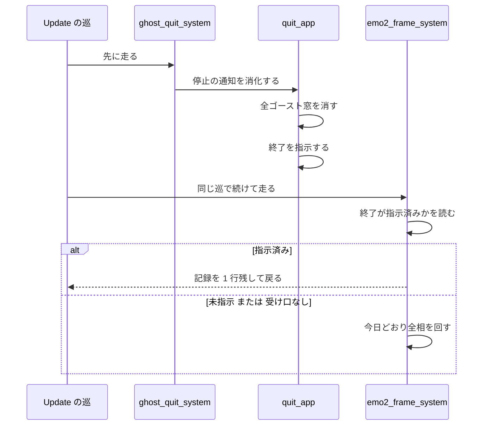

# Design Document

> 実測は 2026-09-28・本ブランチ（`c86708aa`。ソースは main `10a8d724` から不変）。コードは「何の定義か」（関数名・型名＋ファイルパス）で指し、行番号では指さない。
> 本件は判定 1 つとテストファイル 1 本の小さな修正である。新しい型・関数・補助・設定は **0 件**。

## Overview

**Purpose**: アプリの終了が指示された後の巡で、毎フレームの処理（`crates/areka/src/emo2_boot/frame.rs` の `emo2_frame_system`）が消えた窓へ何も適用しないようにする。正常な終了のログから ERROR と WARN が消え、α の実機確認で「ERROR 0 件」を合格の条件に使えるようになる。

**Users**: α の実機確認を判定する人（開発者・下流の `areka-P0-alpha-release-signoff`）。利用者の画面は変わらない。

**Impact**: `emo2_frame_system` の本文の最初に判定を 1 つ足す。終了が指示済みなら、記録を 1 行残して何もせずに戻る。未指示のとき・終了の受け口が無いときのふるまいは今日のまま。

### Goals

- 終了が指示された後の巡では、毎フレームの処理の相を 1 つも回さない（1.1）
- 読み飛ばした巡ごとに `frame_phases_skipped_after_exit` を debug で 1 行残す（1.2）
- 判定の有無・位置のずれ・常に真になる退行を、GPU なしの決定論テストで検出する（3.1〜3.3）
- 実機（emo2・メニューの終了）で ERROR 0 件・読み飛ばしの記録 1 件を確かめる（4.1〜4.4）

### Non-Goals

- `derive_scale`（`crates/areka-emo-present/src/scale.rs`）の「窓 DPI を取得できない」の水準を下げること。`error!` のまま
- 表示の出し手（`crates/areka-emo-present/**`）で「窓が無ければ読み飛ばす」こと
- `quit_app`・`close_windows_for_restart`（`crates/areka/src/app_exit.rs`）を変えること、終了の相で `Emo2Wiring` を取り除くこと
- 毎フレームの処理を 1 巡遅らせて解くこと（採らない。判定は同じ巡の中で効く）
- `quit_app` が外さない資源（重なりの鎖の計画など）が、終了の巡の後段で消えた窓を読むかどうかの調査と手当て（今回のログに症状 0 件）

## Boundary Commitments

### This Spec Owns

- `emo2_frame_system` の入口の判定 1 つ（終了が指示済みなら全相を読み飛ばす）
- 読み飛ばしの記録 `frame_phases_skipped_after_exit` の名前・水準・欄
- `run_ghost_quit_phase` と `emo2_frame_system` の説明文のうち、判定の場所を述べる部分
- 決定論テスト `crates/areka/src/emo2_boot/frame_exit_gate_tests.rs`（新規）
- 実機の確認の記録 `.kiro/specs/areka-P0-frame-phases-after-exit/signoff.md`（新規）

### Out of Boundary

- `crates/areka-emo-present/**`・`crates/wintf/**`・`crates/areka/src/app_exit.rs`・`crates/areka/src/main.rs`・`crates/areka/src/emo2_boot/mod.rs`・`crates/areka/src/emo2_boot/ghost_switch.rs`・`crates/areka/src/ghost_session.rs`・`crates/areka/src/emo2_boot/frame/**`（相の本体）
- `crates/areka/src/emo2_boot/frame_test_support.rs`（900 行・補助の関数を足さない）
- ゴースト切替の経路。同じ system 呼び出しの中で結線が新品へ差し替わるので穴が無い
- 終了の後始末（`main.rs` の終了統括）の内容と順序

### Allowed Dependencies

- `wintf::AppExit::is_requested`（`crates/wintf/src/runtime/message_loop.rs`・既存の公開の問い合わせ）を**読むだけ**。`request_exit` は呼ばない
- `bevy_ecs` の `World::get_non_send`（既存）
- `tracing` の `debug!`（既存）
- テストは既存の補助 `headless_wiring_with`・`zero_clock`・`capture_logs`・`count_level`（`frame_test_support.rs`）と、試験用の既存メソッド `Emo2Wiring::drain_received`（`crates/areka/src/emo2_boot/frame/wiring.rs`）だけを使う
- 新しい crate 依存は 0 件。`Cargo.toml` は触らない

### Revalidation Triggers

次のどれかが起きたら、本件の判定の前提を確かめ直す。

- `quit_app` が「窓を消してから終了を指示する」順をやめる、または `quit_app` を通らずに `AppExit::request_exit` を呼ぶ本番の経路が増える（`ExitPolicy` を `Explicit` 以外にする変更を含む）
- `emo2_frame_system` 以外の system から毎フレームの相を呼ぶようになる
- 終了が指示された後にも毎フレームの処理へ仕事をさせる要求が出る（例: 終了の演出を窓に描く）
- 記録の名前 `frame_phases_skipped_after_exit` を変える（下流の実機確認が判定語に使う）
- 作業領域の同期（`sync_monitor_snapshot_with`）が、モニタ 0 台のときに WARN を出さなくなる（下の決定 D3 の位置の固定が弱まる）

## Architecture

### Existing Architecture Analysis

ソースで確かめた事実（2026-09-28）。

- 毎フレームの相を呼ぶ本番の場所は `emo2_frame_system` の本文だけ。本文は「`Emo2Wiring` を `World::remove_non_send` で取り出す → 作業領域の同期 → 装着 → 拡大率 → （作業領域が変わったときだけ）再配置 → 表示の指令の取り出しと適用 → バルーンの可視性 → 窓寸の反映 → `\![move]` → 重なりの指令 → シェルの再配置 → 連鎖の確定 → 連鎖の再解決 → 文字層の拡大率 → 文字層の描画 → `Emo2Wiring` を戻す」の順
- 終了の相 `ghost_quit_system` は `wire_kanade_stop`（`crates/areka/src/emo2_boot/mod.rs`）が `Update` に `ghost_quit_system.before(emo2_frame_system)` で登録する。同じ巡で続けて走る
- 本番で終了を指示するのは `quit_app` だけ。本文は最初に私有部品 `despawn_app_windows` で全ゴースト窓を消し、その後で `AppExit::request_exit` を呼ぶ。areka は `main.rs` で `WinApp::with_exit_policy(ExitPolicy::Explicit)` を使うので、wintf 側から終了が指示される経路は無い。よって「終了が指示済み」なら「ゴースト窓はもう無い」
- `close_windows_for_restart`（ゴースト切替）は `AppExit` に触れない。切替の途中で判定が真になることは無い
- `wintf::AppExit` は `Rc` を持つ NonSend 資源で、`is_requested()` は `bool` を返す。受け口が World に無い構成（既存のテストの多く）では `get_non_send` が `None` を返す
- 素の World（モニタ 0 台）で作業領域の同期を回すと、`sync_monitor_snapshot_with` が「モニタ表が空（列挙異常）」の WARN を 1 件出す
- 未登録の対象への `Hide` は `EmoPresenter` の `apply_hide`（`crates/areka-emo-present/src/presenter/hub.rs`）が `error!(?target_id, "apply(Hide): 未装着ターゲット")` を 1 件出す。`reply: None` でも出る
- `frame.rs` の本文を `include_str!` で読む検査が 4 本ある。相の並びを見るのは 3 本（`zorder_wiring_tests.rs`・`frame_work_area_sync_tests.rs`・`frame_work_area_resnap_tests.rs`）で、うち後ろの 2 本は説明文を含む素の全文に対して最初に現れる字面を探す。残る 1 本（`frame_harness_tests.rs`）は並びではなく、`#[path = "frame_harness_tests.rs"]` の直前の属性が x64 限定であることを見る

### Architecture Pattern & Boundary Map

**Architecture Integration**:

- Selected pattern: 既存の排他 system の入口での早い戻り（`Emo2Wiring` が無いときの早い戻りと同じ形）
- Domain/feature boundaries: 相の並びの持ち主は `emo2_frame_system`。「どの巡で相を回すか」の判断もここに置く。相の本体・表示の出し手・終了の統合操作は変えない
- Existing patterns preserved: 取り出す→各相→戻すの流れ、終了処理の正常系の読み飛ばしを `debug!` で残す流儀（`quit_as_today` の `ghost_quit_no_windows`・`despawn_app_windows` の `DESPAWNED_SKIP_TAG`）
- New components rationale: 新しい部品は 0 件
- Steering compliance: ログ無しの読み飛ばしを作らない。1 巡遅らせない。決定論テストで固定する

### 設計で決めたこと

| 番号 | 項目 | 決定 | 理由 |
|---|---|---|---|
| D1 | 判定の置き場 | `emo2_frame_system` の本文の**最初の文**。`Emo2Wiring` の有無を見るより前、`remove_non_send` より前、作業領域の同期より前 | 判定は結線の中身に依らない。結線の有無を先に見る形にすると条件が 2 つになり、分岐とテストが増えるだけで得るものが無い。取り出した後に戻る形は戻し忘れの危険がある（1.4） |
| D2 | 記録に載せる欄 | `event = "frame_phases_skipped_after_exit"` と固定の本文だけ。ほかの欄は **0 個** | 終了の出所と閉じた窓の数は、直前の `event="app_exit"` の行（`quit_app`）に既にある。受信端の残件は数えると取り出してしまうので載せられない |
| D3 | 判定の位置を本文の並びでも検査するか | 足さない。位置は挙動のテストで固定する | 下の「位置の固定」を参照 |
| D4 | 説明文を直す範囲 | `run_ghost_quit_phase` の一文（2.4）と、`emo2_frame_system` の関数の説明文に判定の段落を 1 つ。`frame.rs` 冒頭のモジュールの説明（相の一覧）は変えない | 判定を持つ関数の説明文は判定を述べる必要がある。モジュールの説明は相の一覧であり、判定は相ではない。同じことを 3 か所に書かない |
| D5 | 判定の式と参照の書き方 | 表の下の式。`wintf::AppExit` は完全パスで書き、`use` は足さない | 受け口が無ければ偽（1.7）が式の形で決まる。`frame.rs` の `use` の並びを動かさない |
| D6 | 対照の観測 | 未指示の側は「ERROR の行のうち `apply(Hide)` を含むものが 1 件」で適用を観測する。WARN の件数と ERROR の総数は確かめない | 素の World では作業領域の同期が WARN を 1 件出す。ほかの相が素の World で出す記録は本件の対象ではない |

D5 の判定の式:

```rust
world.get_non_send::<wintf::AppExit>().is_some_and(|e| e.is_requested())
```

#### D1 の補足: 結線の無い構成でも記録が出る

LogSink の起動（`Emo2Wiring` が無い構成）でも、終了が指示された後に `emo2_frame_system` が呼ばれれば記録が 1 行出る。記録の意味は「終了が指示済みなので、この巡の毎フレームの処理は何もしなかった」であり、結線の有無に関わらず正しい。水準は debug で、出るのは終了の巡だけ（通常 1 行）。

#### D3 の補足: 位置の固定

判定の位置がずれる退行は、3.1 と 3.2 のテストの確認がそのまま捕まえる。

| 退行 | 赤になる確認 |
|---|---|
| 判定を外す | ERROR 0 件（`Hide` が適用されて 1 件になる）・WARN 0 件（「モニタ表が空」の WARN が 1 件出る）・記録 1 件（0 件になる）・受信端に 1 件残る（0 件になる） |
| 判定が常に真 | 3.2 の対照（適用の ERROR が 0 件になる・記録が 1 件出る・受信端に 1 件残る） |
| 判定を作業領域の同期より後ろへ動かす | WARN 0 件（「モニタ表が空」の WARN が 1 件出る） |
| 判定を `remove_non_send` より後ろへ動かし、戻さずに戻る | 結線が World に残ること |

「WARN 0 件」は要件 1.3 そのものの確認であり、同時に「作業領域の同期が走らなかった」ことの観測でもある。並びの字面の検査を別に足すと、同じことを 2 通りに確かめるだけになる。実装時に上の表の 1 行目（3.3 が求めるもの）と 3 行目の変異を一度ずつ作り、赤になることを確かめて記録する。

### Technology Stack

| Layer | Choice / Version | Role in Feature | Notes |
|-------|------------------|-----------------|-------|
| 実行時 | Rust・`bevy_ecs`（既存の版） | 排他 system の入口で NonSend 資源を読む | 依存の追加 0 件 |
| 終了の受け口 | `wintf::AppExit`（既存） | 「指示済みか」を読む | wintf は変えない |
| ログ | `tracing`（既存） | 読み飛ばしの記録 | target は `areka::emo2_boot::frame`（`RUST_LOG` の `areka=debug` で出る） |
| テスト | `log-capture-kit`（既存） | 全水準の記録を捕捉して数える | `-p log-capture-kit` は 1 ファイル 1,000 行の検査も担う |

## File Structure Plan

### Directory Structure

```
crates/areka/src/emo2_boot/
├── frame.rs                      # 変更: 入口の判定・説明文 2 か所・新しいテストの接続宣言
└── frame_exit_gate_tests.rs      # 新規: 終了指示の有無による分岐の決定論テスト

.kiro/specs/areka-P0-frame-phases-after-exit/
└── signoff.md                    # 新規: 変異の確認の記録と、実機の確認の記録
```

### Modified Files

- `crates/areka/src/emo2_boot/frame.rs`（509 行 → 見込み 530 行前後・上限 1,000 行）
  1. `emo2_frame_system` の本文の最初に判定と `debug!` を足す（D1・D2・D5）
  2. `emo2_frame_system` の関数の説明文に、判定の段落を 1 つ足す（D4）
  3. `run_ghost_quit_phase` の説明文の「終了が決まったフレームで他の相を走らせても、これから閉じる窓のために描き直すだけだからである」の一文を書き直す（2.4・D4）
  4. `#[cfg(test)] #[path = "frame_exit_gate_tests.rs"] mod exit_gate_tests;` を、既存のテストの接続宣言の並びに足す。GPU もハーネスも使わないので、`drain_text_tests` と同じ `#[cfg(test)]` だけで接続する

### New Files

- `crates/areka/src/emo2_boot/frame_exit_gate_tests.rs`（見込み 100〜150 行）— 終了指示の有無による分岐のテスト。補助は既存のものだけを使い、記録を数える絞り込みはこのファイルの中に閉じる
- `.kiro/specs/areka-P0-frame-phases-after-exit/signoff.md` — 変異の確認（3.3）と実機の確認（4.1〜4.4）の記録

### 触らないファイル

`crates/areka-emo-present/**`・`crates/wintf/**`・`crates/areka/src/app_exit.rs`・`crates/areka/src/main.rs`・`crates/areka/src/emo2_boot/mod.rs`・`crates/areka/src/emo2_boot/ghost_switch.rs`・`crates/areka/src/ghost_session.rs`・`crates/areka/src/emo2_boot/frame/**`・`crates/areka/src/emo2_boot/frame_test_support.rs`・すべての `Cargo.toml`。

## System Flows

メニューの終了の巡（`Update`）で起きること。



- 判定は受信端を見ない。指令が残っていたかどうかに関わらず、終了が指示された後の巡は毎回読み飛ばす
- 終了の指示の後に走る巡は通常 1 つ。`WinApp::run` は終了の待ちが戻ると以後の巡を回さない。巡の外で指示された場合（smoke の自動終了・OS のセッションの終了）は 0 行か 1 行
- 受信端に残った指令は捨てずに残す。受信端は上限の無い `mpsc::channel` で、本番で返事を待つ指令も無いので、残したまま終えても送り手は詰まらない

## Requirements Traceability

| Requirement | Summary | Components | Interfaces | Flows |
|-------------|---------|------------|------------|-------|
| 1.1 | 終了後は指令を取り出さず、相を 1 つも行わない | 入口の判定（D1） | `emo2_frame_system` | 指示済みの枝 |
| 1.2 | 読み飛ばした巡ごとに記録 1 行（debug） | 読み飛ばしの記録（D2） | 記録の契約 | 指示済みの枝 |
| 1.3 | その巡の ERROR 0 件・WARN 0 件 | 入口の判定（作業領域の同期より前・D1） | — | 指示済みの枝 |
| 1.4 | 結線を取り除かず壊さず残す | 入口の判定（`remove_non_send` より前・D1） | — | 指示済みの枝 |
| 1.5 | 終了の出所を問わず同じ | 入口の判定（`AppExit` だけを読む）。全出所が `quit_app` を通ることは既存の構造 | — | — |
| 1.6 | 未指示なら今日どおり・記録 0 行 | 入口の判定の偽の枝 | — | 未指示の枝 |
| 1.7 | 受け口が無ければ未指示として扱う | 判定の式（D5） | — | 未指示の枝 |
| 2.1 | 生きた窓の DPI 欠落は ERROR のまま | 触らないファイル（`crates/areka-emo-present/**`） | — | — |
| 2.2 | 終了の後始末の内容と順序を保つ | 触らないファイル（`main.rs`・`app_exit.rs`） | — | — |
| 2.3 | 切替は今日どおり・切替の途中の記録 0 行 | 判定の式（`close_windows_for_restart` は `AppExit` に触れない） | — | — |
| 2.4 | 終了の相の説明文を判定の場所と一致させる | 説明文の書き直し（D4） | — | — |
| 3.1 | 指示済みの World でのテスト | `frame_exit_gate_tests.rs` のテスト 1 | — | — |
| 3.2 | 未指示の World での対照 | `frame_exit_gate_tests.rs` のテスト 2（D6） | — | — |
| 3.3 | 判定を外すと 3.1 が赤になることの確認 | 変異の確認（D3）・`signoff.md` | — | — |
| 3.4 | 兄弟ファイル・1,000 行・補助を足さない | File Structure Plan | — | — |
| 3.5 | `-p log-capture-kit` も回す | Testing Strategy の実行の手順 | — | — |
| 4.1 | 実機で ERROR 0 件 | 実機の確認・`signoff.md` | — | メニューの終了の巡 |
| 4.2 | `app_exit` より後の「装着が未完了」の WARN 0 件 | 実機の確認・`signoff.md` | — | メニューの終了の巡 |
| 4.3 | `app_exit` 1 件・`session_mark_cleared` 1 件・終了コード 0 | 実機の確認・`signoff.md` | — | メニューの終了の巡 |
| 4.4 | 読み飛ばしの記録 1 件 | 実機の確認・`signoff.md` | 記録の契約 | メニューの終了の巡 |

## Components and Interfaces

| Component | Domain/Layer | Intent | Req Coverage | Key Dependencies (P0/P1) | Contracts |
|-----------|--------------|--------|--------------|--------------------------|-----------|
| 入口の判定と読み飛ばしの記録 | areka・毎フレームの処理（`frame.rs`） | 終了が指示済みの巡で全相を読み飛ばし、記録を残す | 1.1〜1.7, 2.3 | `wintf::AppExit`（P0） | Service・Event |
| 説明文の書き直し | areka・毎フレームの処理（`frame.rs`） | 判定の場所を説明文と一致させる | 2.4 | — | — |
| 終了指示の分岐のテスト | areka・テスト（`frame_exit_gate_tests.rs`） | 分岐を決定論で固定する | 3.1〜3.5 | 既存の補助 4 つ（P0） | — |
| 実機の確認 | spec 文書（`signoff.md`） | 直りを実物で裏付ける | 4.1〜4.4 | emo2 の検体・debug 版（P0） | — |

### areka・毎フレームの処理

#### 入口の判定と読み飛ばしの記録

| Field | Detail |
|-------|--------|
| Intent | 終了が指示済みなら、毎フレームの処理を何もせずに戻し、記録を 1 行残す |
| Requirements | 1.1, 1.2, 1.3, 1.4, 1.5, 1.6, 1.7, 2.3 |

**Responsibilities & Constraints**

- 判定は `emo2_frame_system` の本文の最初の文に置く。これより前に文を置かない
- 判定が真のとき、World に対して行うのは `get_non_send` の読み取りだけ。資源の取り出し・挿入・書き込みは 0 件
- 判定が偽のとき、続く本文は今日と 1 文字も変えない
- 判定は `AppExit` だけを読む。`FirstExit`・`Emo2Wiring`・`GhostWindows` は読まない

**Dependencies**

- Inbound: `Update` の schedule（`register_emo2_frame_system` の登録・既存） — 毎巡の呼び出し（P0）
- Outbound: `wintf::AppExit::is_requested` — 指示済みかの読み取り（P0）
- External: なし

**Contracts**: Service [x] / API [ ] / Event [x] / Batch [ ] / State [ ]

##### Service Interface

署名は変えない。

```rust
pub fn emo2_frame_system(world: &mut World)
```

- Preconditions: なし（受け口 `AppExit` も結線 `Emo2Wiring` も、無くてよい）
- Postconditions:
  - `AppExit` が在り指示済み → 相の実行 0 件、受信端から取り出した指令 0 件、World の資源の増減 0 件、記録 1 行
  - `AppExit` が無い、または未指示 → 今日どおり（`Emo2Wiring` が無ければ何もせず戻る。在れば全相を回して戻す）。読み飛ばしの記録 0 行
- Invariants: 呼び出しの前後で `Emo2Wiring` の有無は変わらない

##### Event Contract（記録の契約）

| 項目 | 値 |
|---|---|
| 水準 | DEBUG |
| target | `areka::emo2_boot::frame` |
| 欄 | `event = "frame_phases_skipped_after_exit"` の 1 個だけ |
| 本文 | 終了が指示済みなので毎フレームの相を読み飛ばした、と読める日本語の一文 |
| 出る回数 | 読み飛ばした巡ごとに 1 行。未指示の巡は 0 行 |

**Implementation Notes**

- Integration: 新しいテストの接続宣言は `drain_text_tests` の並びに置く。x64 限定の属性と `#[path = "frame_harness_tests.rs"]` の間には何も挟まない（`frame_harness_tests.rs` の `the_harness_tests_are_connected_under_an_x64_only_gate` が直前の属性を見ている）
- Integration: `frame.rs` を読む既存の検査のうち 2 本（`frame_work_area_sync_tests.rs`・`frame_work_area_resnap_tests.rs`）は、説明文を含む素の全文から最初に現れる字面を探す。新しく書く説明文と注釈には、次の字面を**そのままの形で書かない**（関数は名前だけで指す）: `work_area_sync::sync_monitor_snapshot(world)`・`run_dpi_phase(&mut wiring, world)`・`work_area_sync::resnap_for_work_area_change(`・`reconcile_reported_sizes(&mut wiring.presenter, world)`
- Integration: `zorder_wiring_tests.rs` は `pub fn emo2_frame_system(world: &mut World) {` の行と、説明文の「donor パターン: remove→各フェーズ→insert」の字面が在ることを確かめている。どちらも変えない
- Validation: 下の Testing Strategy
- Risks: 判定の前提（指示済みならゴースト窓は無い）は `quit_app` の構造に依る。崩れる変更は Revalidation Triggers に挙げた

#### 説明文の書き直し

| Field | Detail |
|-------|--------|
| Intent | 「他の相を止める判定」の実際の場所を、説明文と一致させる |
| Requirements | 2.4 |

**Implementation Notes**

- `run_ghost_quit_phase` の説明文: 「毎フレームの相より前に走る」は残す。理由の一文を次の内容へ書き直す — (a) ここで終了が指示されると全ゴースト窓はもう無い、(b) 同じ巡で続けて走る `emo2_frame_system` は入口の判定で全相を読み飛ばす、(c) 他の相を止める判定は本関数ではなく `emo2_frame_system` の入口に在る
- `emo2_frame_system` の説明文: 既存の「`Emo2Wiring` 未挿入なら早期 return」の段落の近くに、判定の段落を 1 つ足す — 終了が指示済みなら相を 1 つも回さずに戻ること、記録の名前、`Emo2Wiring` を取り出す前に判定すること
- 挙動の変更は 0 件

### areka・テスト

#### 終了指示の分岐のテスト

| Field | Detail |
|-------|--------|
| Intent | 判定の 3 つの入力（指示済み・未指示・受け口なし）のふるまいを固定する |
| Requirements | 3.1, 3.2, 3.3, 3.4, 3.5 |

**Implementation Notes**

- 共通の組み立て（`frame_drain_text_tests.rs` の `run_drain_phase_gates_on_attach_then_drains_all_in_fifo_order` と同じ形）: `mpsc::channel::<PresentCommand>()` の受信端で `headless_wiring_with(rx, zero_clock())` を組み、`attached = true` を立て、`PresentCommand::Hide { target: TargetId(0), reply: None }` を 1 件送る。素の `World::new()` に結線を `insert_non_send` で挿す
- `AppExit::request_exit` は記録の捕捉の外で呼ぶ（捕捉に入るのは `emo2_frame_system` の 1 回の呼び出しだけ）
- 記録の件数は、捕捉した行のうち `frame_phases_skipped_after_exit` を含むものを数える。その行が `level=DEBUG` であることも確かめる
- 受信端の残件は `Emo2Wiring::drain_received` の戻り値の長さで数える（確認の最後に 1 回だけ呼ぶ）
- 詳細は Testing Strategy

## Data Models

変更なし。新しい型・資源・欄は 0 件。

## Error Handling

### Error Strategy

本件は失敗の経路を足さない。足すのは正常系の読み飛ばし 1 つで、必ず記録を残す（ログ無しの読み飛ばしは作らない）。

| 状況 | ふるまい | 水準 |
|---|---|---|
| 終了が指示済み | 全相を読み飛ばして戻る | `debug!`（`frame_phases_skipped_after_exit`） |
| 終了の受け口が World に無い | 未指示として今日どおり進む。記録は出さない（既存のテストと結線前の構成の通常の状態） | なし |
| 生きた窓で DPI が得られない | 変更なし | `error!`（`derive_scale`・据え置き） |

メッセージボックスは出さない。利用者への知らせは無い（利用者から見える変化が無い）。

### Monitoring

実機の確認と下流の判定は、次の語でログを数える。

- `frame_phases_skipped_after_exit`（メニューの終了で 1 件）
- `level=ERROR` または ` ERROR `（0 件）
- `event="app_exit"` の `origin=KanadeStopped(Quit)`（1 件）・`session_mark_cleared`（1 件）

## Testing Strategy

### 決定論テスト（`frame_exit_gate_tests.rs`・GPU なし）

| テスト | 組み立ての差 | 確かめること | 要件 |
|---|---|---|---|
| 1. 指示済みなら読み飛ばす | `AppExit::new()` を `request_exit()` してから挿す | ERROR **0 件**・WARN **0 件**・読み飛ばしの記録 **1 件**（`level=DEBUG`）・結線が World に残る・受信端に指令が **1 件**残る | 3.1（1.1〜1.4） |
| 2. 未指示なら今日どおり | `AppExit::new()` を指示せずに挿す | ERROR の行のうち `apply(Hide)` を含むもの **1 件**・読み飛ばしの記録 **0 件**・受信端に残る指令 **0 件**・結線が World に残る | 3.2（1.6） |
| 3. 受け口が無ければ未指示と同じ | `AppExit` を挿さない | テスト 2 と同じ 4 項目 | 1.7 |

- テスト 2 と 3 は確かめる項目が同じなので、1 つの関数で 2 つの組み立てを順に回す形でよい
- テスト 2・3 では WARN の件数と ERROR の総数を確かめない（D6）
- `attached = true` のまま素の World で全相を回す既存のテストは 0 本である。実装時に 1 度、テスト 2 で捕捉した行を全部読み、`apply(Hide)` の ERROR 1 件と「モニタ表が空」の WARN 1 件のほかに行が出ていたら `signoff.md` に書き留める（本件の合否には使わない）
- 確かめないもの（新しいテスト 0 本）:
  - 終了の出所ごとの組み合わせ。判定は出所を読まず、本番の終了の指示が `quit_app` の 1 か所であることは既存の構造である
  - 切替の経路。判定の式から決まる。`close_windows_for_restart` が終了を指示しないことは、`app_exit_tests.rs` の既存のテスト `close_windows_for_restart_closes_all_windows_without_requesting_exit` が確かめている
  - 相の本体

### 変異の確認（実装時に 1 度ずつ・`signoff.md` に記録）

| 変異 | 期待 |
|---|---|
| 判定を外す | テスト 1 が赤（3.3） |
| 判定を作業領域の同期の後ろへ動かす | テスト 1 が赤（WARN 1 件） |

変異を戻した後は、対象のファイルの更新時刻を新しくしてから回し直し、緑に戻ることを確かめる。

### 実行の手順

1. `cargo test -p areka -j 4`（本件のテストと、`emo2_frame_system` を呼ぶ既存のテスト・`frame.rs` を読む検査 4 本を含む）— 失敗 **0 件**
2. `cargo test -p log-capture-kit`（1 ファイル 1,000 行の検査）— 失敗 **0 件**（3.5）
3. ワークスペース全体の 1 回は完了の手順（`tools/test-all.ps1`）が担う

### 実機の確認（1 回・開発者が手で操作する）

- 検体と実行体: emo2・debug 版。絶対パスかつ短いパスの根から起動する
- 環境: `RUST_LOG` に `areka=debug` を含める。`AREKA_PROFILE_DIR` は新しく作ったフォルダ。自動終了（`AREKA_APP_SMOKE_EXIT_MS`）は使わない
- 手順: 起動 → SERIKO のループ（animation_id=1400）の記録が出るのを待つ → メニューの「終了」
- 起動の前に告げること: 画面には何も起きないのが正常であること。読み飛ばしの記録は、指令が残っていたかどうかに関わらず毎回ちょうど 1 件出ること。この 1 件が判定の働いた証拠であること（ERROR 0 件だけでは、たまたま指令が無かった回と区別できない）
- 判定（`signoff.md` に件数を書く）:

| 確かめること | 期待 | 要件 |
|---|---|---|
| ERROR の行 | 0 件 | 4.1 |
| `event="app_exit"` より後の「装着が未完了」の WARN | 0 件 | 4.2 |
| `event="app_exit"` の `origin=KanadeStopped(Quit)` | 1 件 | 4.3 |
| `session_mark_cleared` | 1 件 | 4.3 |
| 終了コード | 0 | 4.3 |
| `frame_phases_skipped_after_exit` | 1 件 | 4.4 |

- 0 件を書く前に、数える語が同じログの別の行に当たることを確かめる（例: `level=` の書式がそのログで実際に使われている綴りか）
