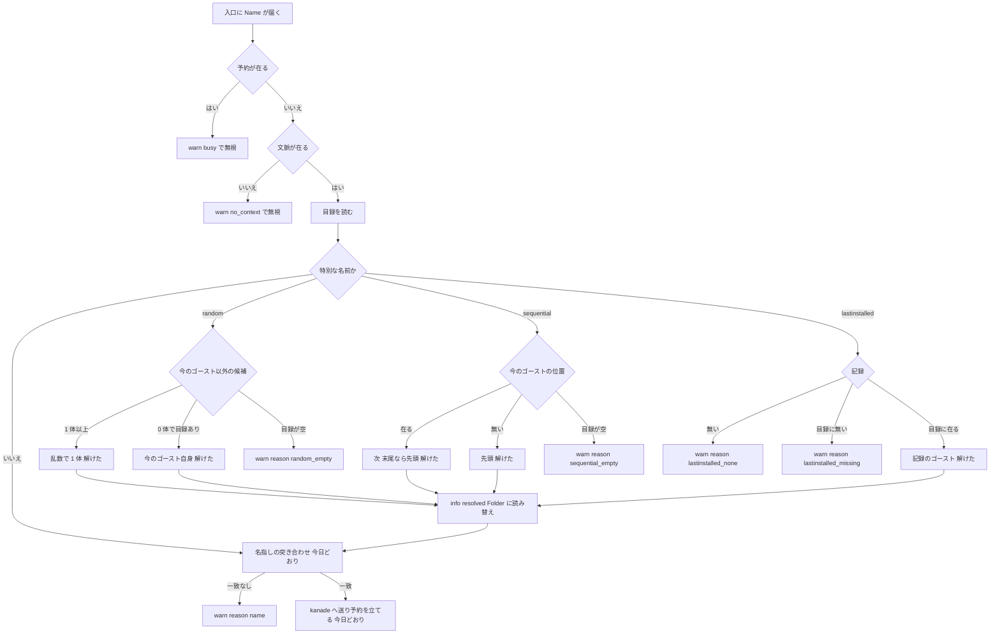

# Design Document: areka-P0-ghost-change-name-resolution

> 実測: 2026-09-27・本ブランチ（`claude/areka-p0-ghost-name-resolution-0d4fff`・main `55a2a1fd` の直後）。コードは「何の定義か」（関数名・型名＋ファイルパス）で指し、行番号では指さない。要件（`requirements.md`）と要件ディスカッションの仕分け（`research.md` §7.1）を入力とし、設計へ持ち越された 2 件（`lastinstalled` の記録の型と書く口の名前・解けないときのログの語）はこの文書の「設計で決めたこと」で確定する。

## Overview

**Purpose**: 台本の `\![change,ghost,random|sequential|lastinstalled]` と短い綴り `\+`／`\_+` を、完了 `ghost-shell-balloon-switch` が作った名指しの切替の経路へ「名前を解いて渡す」。α の利用者が `.nar` を入れた直後の「入れたゴーストに交代します」（`\![change,ghost,lastinstalled]`）と、ゴーストの作者が SSP 向けに書いた `\+`／`\_+` が、areka でもそのまま動く。

**Users**: α の利用者（第三者）とゴーストの作者。後続 `areka-P0-ghost-install` は本仕様が用意する「最後に入れたゴースト」の書く口を 1 行で呼ぶだけになる。

**Impact**: 変えるのは 2 か所だけ。⑴ `crates/areka/src/emo2_boot/ghost_switch.rs` の唯一の入口 `request_ghost_switch` の中、目録を読んだ直後・名指しの突き合わせ（`resolve_switch_target`）の直前に「特別な名前を目録のフォルダ名へ解く」純粋な関数を 1 段足し、`lastinstalled` の記録（プロセスの中だけの `Resource`）と書く口を同じファイルに置く。⑵ `crates/areka-parsers/src/sakura/decode.rs` の `decode_bare` に `\+`／`\_+` を角括弧付き `\![change,ghost,random|sequential]` と同じ値へ写す 2 腕を足す。切替の握手・降ろして起こし直す仕組み・kanade・`compile.rs`・`change_cue.rs`・`GhostSpec`／`SwitchRequest`／`SwitchVerdict` の形は変えない。

### Goals

- `\+`／`\_+` が転記の段で `\![change,ghost,random]`／`\![change,ghost,sequential]` と**同じ値**になり、以降の経路で区別がつかない（別名の転記・新しい命令を作らない）。
- `random`（今のゴースト以外から 1 体）・`sequential`（目録の並びの次・末尾なら先頭）・`lastinstalled`（同じプロセスで最後に入れたゴースト）が、名指しと同じ 1 本の経路（`OnGhostChanging` の有無・降ろす・起こす・失敗したら既定ゴーストへ戻す）を通る。
- 解けないときは理由の見分けがつく `warn!` を 1 件だけ残して無視する（黙って落ちる経路を残さない）。解けたときは何を何へ解いたかを `info!` に 1 件残す。
- 判断の分岐はすべて偽の目録・注入した乱数・手で入れた記録による決定論テストで固定する。実機は `\+` を言う検体 → 目録の他のゴースト、を 1 周見る。
- 台帳・§8・ロードマップが実装と一致し、`cargo test -p ukadoc-survey` の整合検査が緑のまま。

### Non-Goals

- シェル・バルーンの `random`／`lastinstalled`（`\![change,shell|balloon,…]`＝`areka-P0-shell-balloon-switch`）。
- `\![call,ghost,…]`（多重ゴースト・α 後）。
- `lastinstalled` を**書く側**（`areka-P0-ghost-install`）。本仕様の完了時点で本番の呼び手は無く、記録は常に「無い」。
- `sequential` の順を SSP の「ゴーストエクスプローラの下側」に合わせること。
- 切替の握手・二重要求の扱い・既定ゴーストへ戻すこと・メニューの「ゴースト」枠（完了 `ghost-shell-balloon-switch` のまま）。
- `random` の乱数の質（偏りの検定はしない）。
- argv で起こしたゴーストのパスを正規化して目録の位置を求めること（裁定 2・右クリックメニューの印の付け方と揃える）。

## Boundary Commitments

### This Spec Owns

- **特別な名前の解決の判断**: 純粋な関数 `resolve_special_name`（`ghost_switch.rs`）。入力は目録の項目・今のゴーストのフォルダ名・`lastinstalled` の記録・乱数（関数引数）だけ。出力は「特別な名前ではない／解けた（フォルダ名）／解けない（理由）」の 3 通り。
- **解決の段の配置**: `request_ghost_switch` の中の「目録を読んだ後・`resolve_switch_target` の前」。予約（`SwitchInFlight`）の判定より後。`GhostSpec::Name` だけに掛け、`GhostSpec::Folder`（メニュー）には掛けない。
- **`lastinstalled` の記録**: `Resource` `LastInstalledGhost(String)` と書く口 `record_last_installed(world, folder)`（どちらも `ghost_switch.rs`）。プロセスの中だけ・ファイルにも記憶（sylphya）にも書かない・使っても消えない。
- **`\+`／`\_+` の転記**: `decode_bare` の 2 腕（`GenericCommand { name: "change", raw_args: ["ghost", "random"|"sequential"] }`）と正典 URL の証拠行 2 本。角括弧付き形（`\+[…]`）は作らない。
- **記録の語彙**: `ghost_switch_unknown` の `reason` 欄（`name`／`random_empty`／`sequential_empty`／`lastinstalled_none`／`lastinstalled_missing`）と、解けたときの `ghost_switch_resolved`、書いたときの `last_installed_recorded`。
- **テスト**: `ghost_switch_tests.rs` の追加（純粋な関数と入口）と既存の「該当なし」テストの縮め、`decode_tests.rs` の追加、`parse_bare_tag_tests.rs` の `_+` 外し。
- **文書**: 台帳 `sakura-script.toml` の 3 行・`shiori.toml` の 2 か所の備考・`roadmap-draft.md` の `[[spec]]`＋`count`・`COMPAT_ARCHITECTURE.md` §8・`briefing-sakura-script.md`・`.kiro/steering/roadmap.md`・実機の `signoff.md`。

### Out of Boundary

- `crates/areka-sakura/src/compile.rs`（`GenericCommand` の腕がそのまま運ぶ・触らない）・`crates/areka/src/emo2_boot/change_cue.rs`（名前を無変形で運ぶ・触らない）・`consumer_ledger.rs`・`emo2_boot/mod.rs`・`ghost_session.rs`・`boot_config.rs`・`boot_resolve.rs`・`menu/*`・kanade・`areka-ghost`（目録の形は変えない）・字句解析 `lexer.rs`（`Bare("+")`／`Bare("_+")` の切れ目は変えない）。
- `SwitchRequest`・`GhostSpec`・`SwitchVerdict`・`SwitchTarget`・`resolve_switch_target` の形（変えない＝完了 `ghost-shell-balloon-switch` の Revalidation Trigger に当たらない・`ghost-install`／`shell-balloon-switch` への申し送りが要らない）。
- 生成物 `doc/ukadoc-coverage/report/*.md` を手で直すこと（生成器で作り直す）。
- `lastinstalled` の本番の書き込み・`OnInstallComplete` の送出（`ghost-install`）。

### Allowed Dependencies

- `areka_ghost::catalog::list_ghosts`（フォルダ名の昇順の目録）と `GhostEntry { dir, identity: Identity { folder, name, … } }`（読むだけ）。
- `crate::boot_resolve::pick_index(n) -> usize`（本番の乱数・`std::collections::hash_map::RandomState` 由来・新しい依存なし）。`ghost_switch.rs` は既に `use` 済み。
- `BootContext.current.ghost.folder: Option<String>`（今のゴースト・入口が既に読んでいる）。
- `bevy_ecs` の `Resource`（`#[derive(Resource)]`・`world.insert_resource`／`get_resource`＝`session_end.rs` の `SessionEnded` と同じ置き方）。
- `areka_parsers::sakura::model::Instruction::GenericCommand`（`#[non_exhaustive]` の既存の受け皿・`compile` の `GenericCommand` の腕が `CueCommand::command_carrier(name, raw_args)` へ載せる）。
- テスト: `log_capture_kit::capture`・`temp_path_kit::TempPath`・`GhostSession::for_test`（`ghost_switch_tests.rs` の既存の道具立て）。
- 依存の向き: `areka-parsers`（転記）→ `areka-sakura`（組み立て・無変更）→ `areka`（`change_cue` → `ghost_switch`）→ kanade。本仕様は上流の `areka-parsers` と最下流の `ghost_switch.rs` にだけ触り、中間は無変更。

### Revalidation Triggers

- `LastInstalledGhost`／`record_last_installed` の名前・引数（フォルダ名 `String` 1 つ）を変えたら `areka-P0-ghost-install` の brief を改める（同 spec はこの 2 つの名前で書く）。
- `ghost_switch_unknown` の `reason` の語彙・`ghost_switch_resolved` の欄を変えたら、実機サインオフの grep（`alpha-release-signoff`）と `signoff.md` を改める。
- `decode_bare` の 2 腕の値（`name`・`raw_args`）を変えたら `ChangeCueSink` の自己選別（`("change","ghost")`）に届かなくなる＝`decode_tests.rs` の「角括弧付きと同じ値」のテストが赤で知らせる。
- `list_ghosts` の並び（フォルダ名の昇順）が変わったら `sequential` の「次」が変わる（§8 の裁定 1 を改める）。
- `BootContext.current.ghost.folder` の意味（argv 起動で `None`）が変わったら裁定 2 の §8 の行を改める。

## Architecture

### Existing Architecture Analysis

実物で確かめた経路（研究 §2.1）は 1 本につながっている:

`\![change,ghost,名]` → 転記 `decode_bang` → `decode_passthrough_bang` → `Instruction::GenericCommand { name: "change", raw_args: ["ghost", 名, …] }` → 組み立て `compile` の `GenericCommand` の腕 → `CueCommand::command_carrier` → 受け口 `ChangeCueSink::emit`（`change_cue.rs`・`("change","ghost")` だけ受理・第 2 引数を無変形で `ChangeRequestRaw { name, raise_event }` に載せる）→ 受信端 `ChangeRx` → 入力の段の系 `drain_change_requests` → 唯一の入口 `request_ghost_switch(world, SwitchRequest { ghost: GhostSpec::Name(name), raise_event, origin: Automatic })`。

入口の順序: ⑴ `SwitchInFlight` が在れば `warn!(ghost_switch_busy)`・`Busy` → ⑵ `BootContext` が無ければ `warn!(ghost_switch_no_context, reason = "boot_context")`・`NoContext` → ⑶ `list_ghosts(&ctx.root)` → `resolve_switch_target(&entries, &req.ghost)` が `None` なら `warn!(ghost_switch_unknown)`・`NotFound` → ⑷ `current_folder = ctx.current.ghost.folder.clone()` → ⑸ `GhostSlot` の kanade 送出端が無ければ `NoContext` → ⑹ `sakura_name` を読み `KanadeMsg::ChangeGhost` を送って `SwitchInFlight` を立てる。

今日 `random`／`sequential`／`lastinstalled` は ⑶ でそのまま名指しとして突き合わされ「該当なし」に落ちる。`\+`／`\_+` は字句が `Bare("+")`／`Bare("_+")` にし、`decode_bare` の既定の腕 `decode_passthrough_bare` が `Raw` にして、`compile` の catch-all が `debug!` で捨てる。同じ `decode_bare` に裸の `\f` を `Font { args: [] }` に載せる前例がある。

### Architecture Pattern & Boundary Map

```mermaid
graph TB
    Script[台本の綴り] --> Lexer[字句解析 lexer]
    Lexer --> DecodeBare[転記 decode_bare 2 腕を足す]
    Lexer --> DecodeBang[転記 decode_bang 無変更]
    DecodeBare --> Carrier[GenericCommand change ghost]
    DecodeBang --> Carrier
    Carrier --> Compile[組み立て compile 無変更]
    Compile --> Sink[受け口 ChangeCueSink 無変更]
    Sink --> Drain[取り出し drain_change_requests 無変更]
    Drain --> Entry[唯一の入口 request_ghost_switch]
    Menu[メニューのゴースト枠 Folder] --> Entry
    Entry --> Catalog[目録 list_ghosts]
    Entry --> Special[純粋 resolve_special_name 新設]
    Record[記録 LastInstalledGhost 新設] --> Special
    Rng[乱数 pick_index 関数引数] --> Special
    Special --> Match[純粋 resolve_switch_target 無変更]
    Match --> Kanade[kanade ChangeGhost 無変更]
    Installer[後続 ghost-install] -. record_last_installed .-> Record
```



**Architecture Integration**:

- 選んだ形: **入口の中の 1 段の前処理**（研究 §4 の案 A）。特別な名前を目録のフォルダ名へ解き、`GhostSpec::Folder(folder)` に読み替えて今日の `resolve_switch_target` へ渡す。解けたあとは名指しと同じ値なので、経路が 2 本にならない。
- 境界: 転記（`areka-parsers`）は「別名を同じ値へ写す」だけで意味を持たない。判断は `ghost_switch.rs` の純粋な関数 1 つに閉じ、fs・World・乱数の出所は入口が渡す。
- 保つ前例: `pick_index` を関数で渡す注入（`boot_into` → `resolve_balloon_for_ghost(&root, dir, pick_index)`）・1 値の `Resource`（`SessionEnded`）・`ghost_switch_no_context` の `reason` 欄で理由を分ける記録の形・裸 `\f` の腕。
- 新しい部品の理由: 純粋な関数（決定論テストの前提・要件 5.2）、`Resource`（受け皿を本仕様が持つ・要件 4.1〜4.2）、`decode_bare` の 2 腕（`Raw` 落ちを閉じる・要件 1.4）。それ以外は足さない。
- 退けた形: `GhostSpec` に腕を足す（案 B・入口の形が変わり後続 2 spec へ申し送りが要る）、`areka-ghost` の新ファイル（案 C・`lib.rs` に触る・記録の置き場が 2 クレートに割れる）、`compile.rs` で `Raw("\\+")` の文字列を見分ける（転記層の約束に反する）。
- steering との整合: `\!` の命令は汎用の運び手 1 本（新しい typed 命令を作らない）・ログ無し失敗経路の禁止・決定論テスト網羅・1 ファイル 1,000 行以下（`ghost_switch.rs` 699 → 約 790・`ghost_switch_tests.rs` 545 → 約 830・`decode.rs` 391 → 約 400）。

### Technology Stack

| Layer | Choice / Version | Role in Feature | Notes |
|-------|------------------|-----------------|-------|
| 転記 | `areka-parsers`（既存・std のみ） | `decode_bare` に 2 腕 | 依存を足さない |
| 切替の入口 | `areka`（`bevy_ecs` の `World`／`Resource`・既存） | 純粋な関数・`Resource`・入口の 1 段 | 依存を足さない |
| 乱数 | `std::collections::hash_map::RandomState`（`boot_resolve::pick_index`・既存） | `random` の 1 体の選択（本番） | 呼ぶたびに値が変わる。テストは固定の関数を渡す |
| 記録 | `tracing`（既存） | `warn!`／`info!` の構造化ログ | `event` 欄と `reason` 欄 |
| テスト | `log_capture_kit`・`temp_path_kit`（既存の dev 依存） | ログの捕捉・一時フォルダの目録 | `ghost_switch_tests.rs` の道具立てを使う |

## File Structure Plan

### Modified Files

- `crates/areka/src/emo2_boot/ghost_switch.rs` — ⑴ `NameResolution`・`UnresolvedReason`・純粋な関数 `resolve_special_name` を `resolve_switch_target` の隣に足す。⑵ `LastInstalledGhost`（`Resource`）と `record_last_installed` を足す。⑶ `request_ghost_switch` の中身を `request_ghost_switch_with(world, req, pick)` に移し、`request_ghost_switch` は `pick_index` を渡す薄い皮にする。⑷ `request_ghost_switch_with` の中、目録を読んだ直後に解決の段を置く（`GhostSpec::Name` のみ）。⑸ 既存の `warn!(ghost_switch_unknown)` に `reason = "name"` を足す。ファイル冒頭の説明に本仕様の 1 段を 1 文足す。
- `crates/areka/src/emo2_boot/ghost_switch_tests.rs` — `unknown_names_warn_once_and_send_nothing` を `Nobody` だけに縮め `reason = "name"` を確かめる。純粋な関数のテスト群と入口の統合テスト群を足す（下の Testing Strategy）。既存の道具立て（`entry`・`fixture_root`・`boot_context`・`world_with_slot`・`sent_changes`・`assert_one_event`・`count_event`）をそのまま使うため、新しい兄弟ファイルは作らない（作ると道具立てを `ghost_switch_test_support.rs` へ括り出す接触が増える）。
- `crates/areka-parsers/src/sakura/decode.rs` — `decode_bare` に `"+"`／`"_+"` の 2 腕を `"f"` の腕の隣に足す（各腕の直前に `// ukadoc: <正典 URL>`）。`decode_tag` には `+` の腕を足さない（`\+[…]` は今日どおり `Raw`）。冒頭の説明の一覧に 1 行足す。
- `crates/areka-parsers/src/sakura/decode_tests.rs` — 別名の転記のテスト 3 本を `unknown_bare_tag_absorbed_as_raw` の隣に足す。
- `crates/areka-parsers/src/sakura/parse_bare_tag_tests.rs` — `CANONICAL_BRACKETLESS_SPELLINGS` から `"_+"` を外し（12 → 11）、定数の説明と P5 の説明の「12」を「11」に改め、`\_+` は本仕様で `\![change,ghost,sequential]` の別名になったと 1 文書く。
- `doc/ukadoc-coverage/ledger/sakura-script.toml` — `_5c_2b:1`（`\+`）と `_5c__2b:1`（`\_+`）を `status = "implemented"`・`owner = "areka-P0-ghost-change-name-resolution"`・`links` に `same-feature` で `\![change,ghost,…]` の項目を指し返す。備考の「壊れ方」を実装後の振る舞い（何へ解かれるか・解けないときの `warn!` の `reason`）へ書き換え、`\_+` の「所有先未定」の行を消す（「語境界の欠陥」の行は残す）。`\![change,ghost,…]` の備考の「…の持ち場で、本仕様では該当なしとして warn のログ（ghost_switch_unknown）を残し、切り替えない。」の 1 文を「解決済み（areka-P0-ghost-change-name-resolution・`ghost_switch.rs` の `resolve_special_name`）」へ改める。`\![change,shell|balloon,…]` の行には触らない。
- `doc/ukadoc-coverage/ledger/shiori.toml` — `OnGhostChanging`・`OnGhostChanged` の備考にある同じ 1 文を同じ文面へ改める（2 か所）。`OnShellChang*`／`OnBalloonChange` の行には触らない。
- `doc/ukadoc-coverage/roadmap-draft.md` — `[[spec]]` に `name = "areka-P0-ghost-change-name-resolution"`・`stage = "B"`・`bundle = "切替"`・`owner_count = 2`・`wave = "B4-②"` を 1 行足し、`[briefs].count` を 35 → 36、「2026-09-27 の追加」に倣う段落と段階ごとの表の「切替」の行に本仕様（2 件）を足す。
- `doc/COMPAT_ARCHITECTURE.md` §8 — 裁定 1〜7 を 1 行ずつ（並び・目録に無いとき・1 体だけ・消えた記録・記録の寿命・同名より優先・一様な選択）足し、「角括弧なし `\_` タグ」の行の `\_+` の所有先を本仕様へ改める。
- `doc/ukadoc-coverage/briefing-sakura-script.md` — `\+`・`\_+` の「未対応（書いてあるのに何も起きない）」を実装後の振る舞いへ、`\_+` の「無所有一覧で裁定」の行を本仕様へ改める。
- `.kiro/steering/roadmap.md` — 本仕様の行を完了へ。
- `.kiro/specs/areka-P0-ghost-change-name-resolution/signoff.md`（新規） — 実機サインオフの記録。

### Directory Structure

```
crates/areka/src/emo2_boot/
├── ghost_switch.rs            # 入口＋純粋な解決＋記録（本仕様が足す）
├── ghost_switch_tests.rs      # 入口・突き合わせ・解決の決定論テスト（本仕様が足す）
├── change_cue.rs              # 受け口（無変更）
crates/areka-parsers/src/sakura/
├── decode.rs                  # 転記（decode_bare に 2 腕）
├── decode_tests.rs            # 転記のテスト（3 本足す）
└── parse_bare_tag_tests.rs    # 角括弧なし _ タグの固定（_+ を外す）
```

## System Flows



- 解けたあとの段（置き場の確認・`sakura_name` の読み・送出・予約）は今日の形のまま。`raise_event`・`origin` は要求の値をそのまま通す（`\+`／`\_+` は受け口で `raise_event = false` になる＝`OnGhostChanging` を送らない。`--option=raise-event` 付きの特別な名前は `true` のまま通り、選ばれた切替先の Ref0〜3 で送られる）。
- 「今のゴースト自身へ解けた」場合は名指しの自分自身への切替と同じで、入口が受理し降ろして起こし直す（完了 spec 要件 1.8・既存テスト「今のゴースト自身も受理」で固定済み）。
- 解けない 4 通りは `SwitchVerdict::NotFound`（降ろさず kanade へ何も送らない）。`warn!` は 1 事象 1 件。

## Requirements Traceability

| Requirement | Summary | Components | Interfaces | Flows |
|-------------|---------|------------|------------|-------|
| 1.1 | `\+` ＝ `random` の要求 | BareAlias | `decode_bare` の `"+"` 腕 | 転記 → 受け口 → 入口 |
| 1.2 | `\_+` ＝ `sequential` の要求 | BareAlias | `decode_bare` の `"_+"` 腕 | 同上 |
| 1.3 | 別名の転記・新しい命令を作らない | BareAlias | `GenericCommand { "change", ["ghost", …] }` と同じ値 | — |
| 1.4 | `Raw` 落ちを閉じる・直後の本文が残る | BareAlias | 字句の切れ目は不変（1 文字／`_` 始まりは 2 文字） | — |
| 1.5 | 引数の形を新設しない | BareAlias | `decode_tag` に `+` の腕を足さない（`\+[…]` は `Raw`） | — |
| 1.6 | 証拠の行 | BareAlias | `// ukadoc: …#_5c_2b:1`／`#_5c__2b:1` | — |
| 2.1 | `random` は今のゴースト以外から 1 体 | SpecialNameResolver | `resolve_special_name`（候補＝目録 − 今のゴースト） | フロー R1 |
| 2.2 | どの候補も選ばれ得る | SpecialNameResolver | `pick(n)` で添字を選ぶ（0 と n−1 の両端をテスト） | R1 |
| 2.3 | 今のゴースト 1 体だけ → 自分自身 | SpecialNameResolver | 候補 0 かつ目録あり → 今のゴースト | R2 |
| 2.4 | 今のゴーストが目録に無い → 全ゴーストが候補 | SpecialNameResolver | `current = None` → 除くものが無い | R1 |
| 2.5 | `random,--option=raise-event` は `OnGhostChanging` を送る | SwitchEntry | `raise_event` をそのまま通す | F → K |
| 2.6 | 乱数を外から与える | SwitchEntry | `request_ghost_switch_with(world, req, pick)`・本番は `pick_index` | — |
| 2.7 | 目録が空 → 無視＋`warn!` | SpecialNameResolver・SwitchEntry | `UnresolvedReason::RandomEmpty` → `ghost_switch_unknown` `reason = "random_empty"` | R3 |
| 3.1 | `sequential` は並びの次 | SpecialNameResolver | 今の位置 +1 | S1 |
| 3.2 | 末尾 → 先頭 | SpecialNameResolver | `(i + 1) % len` | S1 |
| 3.3 | 今のゴーストが目録に無い → 先頭 | SpecialNameResolver | 位置が無ければ 0 | S2 |
| 3.4 | 1 体だけ → 自分自身 | SpecialNameResolver | `(0 + 1) % 1 = 0` | S1 |
| 3.5 | 目録が空 → 無視＋`warn!` | SpecialNameResolver・SwitchEntry | `SequentialEmpty` → `reason = "sequential_empty"` | S3 |
| 3.6 | `sequential,--option=raise-event` | SwitchEntry | `raise_event` をそのまま通す | F → K |
| 3.7 | 並び以外を使わない | SpecialNameResolver | 入力は目録・今のフォルダ名だけ（履歴なし） | — |
| 4.1 | 記録はプロセスの中だけ | LastInstalledRecord | `Resource` `LastInstalledGhost(String)`・永続化なし | — |
| 4.2 | 書く口 1 つ・最後の 1 件だけ | LastInstalledRecord | `record_last_installed(world, folder)`＝`insert_resource`（置き換え） | — |
| 4.3 | 記録あり・目録にある → 切替 | SpecialNameResolver | 記録のフォルダ名で目録を引く | L3 |
| 4.4 | 記録なし → 無視＋`warn!` | SpecialNameResolver・SwitchEntry | `LastInstalledNone` → `reason = "lastinstalled_none"` | L1 |
| 4.5 | 記録のゴーストが目録に無い → 無視＋`warn!` | SpecialNameResolver・SwitchEntry | `LastInstalledMissing` → `reason = "lastinstalled_missing"` | L2 |
| 4.6 | 記録は使っても消えない | LastInstalledRecord | 入口は読むだけ（`remove_resource` を呼ばない） | — |
| 4.7 | 記録＝今のゴースト → 起こし直す | SpecialNameResolver・SwitchEntry | 自分自身へ解けて入口が受理 | L3 → K |
| 4.8 | `lastinstalled,--option=raise-event` | SwitchEntry | `raise_event` をそのまま通す | F → K |
| 5.1 | 唯一の入口の中の突き合わせの段で解く | SwitchEntry | 目録を読んだ直後・`resolve_switch_target` の前 | D → E |
| 5.2 | 純粋な関数 | SpecialNameResolver | fs・World を読まない | — |
| 5.3 | 解けたあとは完了 spec の形のまま | SwitchEntry | `GhostSpec::Folder(folder)` へ読み替えて今日の経路へ | F → M → K |
| 5.4 | 大文字小文字を区別・正典の綴りだけ | SpecialNameResolver | `"random"`／`"sequential"`／`"lastinstalled"` の完全一致 | E |
| 5.5 | 同名のゴーストより特別な名前が優先 | SwitchEntry | 解決の段を `resolve_switch_target` の**前**に置く | E → F |
| 5.6 | 予約の判定より後 | SwitchEntry | 入口の順序は不変（Busy → 文脈 → 目録 → 解決） | B → C → D → E |
| 5.7 | メニュー（`Folder`）には掛けない | SwitchEntry | `GhostSpec::Name` だけ解決 | E |
| 6.1 | 解けない 4 通りを見分ける `warn!` 1 件 | SwitchEntry | `ghost_switch_unknown` の `reason` 欄 | R3・S3・L1・L2 |
| 6.2 | 解けたときの記録 | SwitchEntry | `info!(ghost_switch_resolved, name, to, position)` | F |
| 6.3 | 分岐の決定論テスト | Tests | `ghost_switch_tests.rs` の純粋な関数＋入口のテスト | — |
| 6.4 | 別名の転記のテスト・`_+` 外し | Tests | `decode_tests.rs`・`parse_bare_tag_tests.rs` | — |
| 6.5 | 既存テストの縮め | Tests | `unknown_names_warn_once_and_send_nothing` を `Nobody` だけに | — |
| 6.6 | `lastinstalled` は記録を手で入れた World で | Tests | `record_last_installed` を呼んでから入口 | — |
| 7.1 | 台帳 `\+`・`\_+` を実装済みに | Docs | `sakura-script.toml` | — |
| 7.2 | `\![change,ghost,…]` の備考 | Docs | 同上 | — |
| 7.3 | 生成物は生成器で | Docs | `cargo run -p ukadoc-survey -- report`／`report-summary` | — |
| 7.4 | §8 に裁定 1〜7 | Docs | `COMPAT_ARCHITECTURE.md` | — |
| 7.5 | roadmap.md | Docs | `.kiro/steering/roadmap.md` | — |
| 7.6 | `roadmap-draft.md` の `[[spec]]`＋`count` | Docs | 腕 a・c・f の整合 | — |
| 7.7 | §8「角括弧なし `\_` タグ」の行 | Docs | `\_+` の所有先を本仕様へ | — |
| 7.8 | `shiori.toml` の 2 か所 | Docs | `OnGhostChanging`／`OnGhostChanged` の備考 | — |
| 7.9 | `briefing-sakura-script.md` | Docs | `\+`・`\_+` の行 | — |
| 8.1 | 実機: `\+` を言う検体 → 他のゴースト | Signoff | 検体の複製＋`ghost_switch_resolved`・`ghost_switch_requested` の grep | — |
| 8.2 | level を開けて記録・`signoff.md` | Signoff | `RUST_LOG=info,areka=debug,kanade=trace` | — |
| 8.3 | `lastinstalled` の実機は `ghost-install` へ | Signoff | 申し送り（`signoff.md` と完了時の brief） | — |
| 9.1 | 並び＝目録の並び | SpecialNameResolver・Docs | `list_ghosts` の順をそのまま使う・§8 | — |
| 9.2 | 目録に無いとき先頭／全候補 | SpecialNameResolver・Docs | `current = None` の腕・§8 | — |
| 9.3 | 1 体だけは起こし直し | SpecialNameResolver・Docs | R2・S1・§8 | — |
| 9.4 | 消えた記録は無視 | SpecialNameResolver・Docs | `LastInstalledMissing`・§8 | — |
| 9.5 | 記録は消えない | LastInstalledRecord・Docs | 読むだけ・§8 | — |
| 9.6 | 同名より優先 | SwitchEntry・Docs | 解決の段が先・§8 | — |
| 9.7 | 一様な選択 | SpecialNameResolver・Docs | 候補の添字を `pick(n)` で 1 つ・§8 | — |

## Components and Interfaces

| Component | Domain/Layer | Intent | Req Coverage | Key Dependencies (P0/P1) | Contracts |
|-----------|--------------|--------|--------------|--------------------------|-----------|
| BareAlias | 転記（`areka-parsers`） | `\+`／`\_+` を角括弧付きと同じ値へ写す | 1.1〜1.6 | `Instruction::GenericCommand`（P0） | Service |
| SpecialNameResolver | 切替の入口（`areka`・純粋） | 特別な名前を目録のフォルダ名へ解く | 2.1〜2.4, 2.7, 3.1〜3.5, 3.7, 4.3〜4.5, 4.7, 5.2, 5.4, 9.1〜9.4, 9.7 | `GhostEntry`（P0） | Service |
| LastInstalledRecord | 切替の入口（`areka`・World） | 最後に入れたゴーストの記録と書く口 | 4.1, 4.2, 4.6, 9.5 | `bevy_ecs::Resource`（P0） | State |
| SwitchEntry | 切替の入口（`areka`） | 入口に解決の段を組み込み、記録を残す | 2.5, 2.6, 3.6, 4.8, 5.1, 5.3, 5.5〜5.7, 6.1, 6.2 | `request_ghost_switch`（P0）・`pick_index`（P1） | Service, Event |
| Tests | 決定論テスト | 分岐の固定 | 6.3〜6.6 | 既存の道具立て（P0） | — |
| Docs | 台帳・文書 | 実装と一致させる | 7.1〜7.9, 9.1〜9.7 | `ukadoc-survey` の整合検査（P1） | — |
| Signoff | 実機 | `\+` の 1 周 | 8.1〜8.3 | 完了 spec の `signoff.md` の手順（P1） | — |

### 転記（`crates/areka-parsers/src/sakura/decode.rs`）

#### BareAlias

| Field | Detail |
|-------|--------|
| Intent | 裸の `\+`／`\_+` を `\![change,ghost,random]`／`\![change,ghost,sequential]` の転記結果と同じ値に写す |
| Requirements | 1.1, 1.2, 1.3, 1.4, 1.5, 1.6 |

**Responsibilities & Constraints**
- `decode_bare(word)` に 2 腕を足す。値は `decode_passthrough_bang(["change","ghost","random"])` が作るものと同じ `Instruction::GenericCommand { name: "change", raw_args: ["ghost", "random"] }`（`sequential` も同型）。意味づけ（誰が消費するか）はしない。
- 各腕の直前に `// ukadoc: https://ssp.shillest.net/ukadoc/manual/list_sakura_script.html#_5c_2b:1`／`#_5c__2b:1` を置く（`check_evidence` が実装済みの証拠として数える）。
- `decode_tag` に `+` の腕を足さない。`\+[x]` は字句が `Tag { word: "+", args }` にし、今日どおり `decode_passthrough_tag` で `Raw` になる。
- 字句解析（`lex`）は触らない。`\+こんにちは` は `Bare("+")` ＋ `Text("こんにちは")` のまま。

##### Service Interface

```rust
// 既存の関数に腕を足すだけ。形は変えない。
fn decode_bare(word: &str) -> Instruction;
// "+"  => Instruction::GenericCommand { name: "change".into(), raw_args: vec!["ghost".into(), "random".into()] }
// "_+" => Instruction::GenericCommand { name: "change".into(), raw_args: vec!["ghost".into(), "sequential".into()] }
```

- Preconditions: `word` は字句解析が切り出した角括弧なしの綴り（`+` か `_+`）。
- Postconditions: 返り値は角括弧付き `\![change,ghost,random|sequential]` の転記結果と `==`。
- Invariants: 他の腕（`e`・`c`・`-`・`n`・`0|h`・`1|u`・`f`）と既定の腕は不変。

**Implementation Notes**
- Integration: `compile` の `GenericCommand` の腕・`ChangeCueSink` の自己選別（`("change","ghost")`）にそのまま届く。`raise_event` は `params[2..]` が空なので偽。
- Validation: `decode_tests.rs` の「角括弧付きと `==`」のテストが、値の綴りのずれ（`Ghost`・`Random` など）を赤で知らせる。
- Risks: `decode.rs` の裸タグの腕に「値を持つ `GenericCommand`」の初めての例が入る。腕の注釈に「別名の転記であって意味づけではない」と書く。

### 切替の入口（`crates/areka/src/emo2_boot/ghost_switch.rs`）

#### SpecialNameResolver

| Field | Detail |
|-------|--------|
| Intent | 目録・今のゴースト・記録・乱数だけから、特別な名前を目録のフォルダ名へ解く純粋な関数 |
| Requirements | 2.1, 2.2, 2.3, 2.4, 2.7, 3.1, 3.2, 3.3, 3.4, 3.5, 3.7, 4.3, 4.4, 4.5, 4.7, 5.2, 5.4, 9.1, 9.2, 9.3, 9.4, 9.7 |

**Responsibilities & Constraints**
- 特別な名前の判定は `"random"`・`"sequential"`・`"lastinstalled"` の完全一致（大文字小文字を区別）。それ以外は `Plain`（今日どおり名指し）。
- `random`: 候補＝目録から `current` と同じフォルダ名を除いたもの。候補が 1 体以上なら `候補[pick(候補数)]`。候補が 0 体で目録が空でなければ今のゴースト自身（目録に残っているのはそれだけ・裁定 3）。目録が空なら `RandomEmpty`。`pick` は候補が 1 体以上のときだけ呼ぶ。
- `sequential`: 目録が空なら `SequentialEmpty`。`current` の位置 `i` が在れば `(i + 1) % len`、無ければ `0`。1 体だけなら自分自身になる（`(0 + 1) % 1 = 0`・裁定 3）。並び以外（履歴・起動順）は入力に無い。
- `lastinstalled`: 記録が無ければ `LastInstalledNone`。記録のフォルダ名で目録を引き、無ければ `LastInstalledMissing`、在ればそのフォルダ名（今のゴースト自身でも解ける・4.7）。
- fs・World・時計を読まない。`pick` 以外に外から与えるものは無い。

##### Service Interface

```rust
/// 特別な名前の解決の結果。
#[derive(Debug, Clone, PartialEq, Eq)]
pub(crate) enum NameResolution {
    /// 特別な名前ではない（今日どおり名指しとして目録と突き合わせる）。
    Plain,
    /// 解けた。`position` は `sequential` のときの今のゴーストの位置（記録用・他は `None`）。
    Resolved { folder: String, position: Option<usize> },
    /// 特別な名前だが解けない（理由は記録の語彙）。
    Unresolved(UnresolvedReason),
}

/// 解けない理由（`ghost_switch_unknown` の `reason` 欄の語彙）。
#[derive(Debug, Clone, Copy, PartialEq, Eq)]
pub(crate) enum UnresolvedReason {
    RandomEmpty,          // "random_empty"
    SequentialEmpty,      // "sequential_empty"
    LastInstalledNone,    // "lastinstalled_none"
    LastInstalledMissing, // "lastinstalled_missing"
}
impl UnresolvedReason {
    pub(crate) fn as_ref_str(self) -> &'static str;
}

/// 純粋: 特別な名前を目録のフォルダ名へ解く。
pub(crate) fn resolve_special_name(
    name: &str,
    entries: &[GhostEntry],
    current: Option<&str>,
    last_installed: Option<&str>,
    pick: impl FnOnce(usize) -> usize,
) -> NameResolution;
```

- Preconditions: `entries` は `list_ghosts` の並び（フォルダ名の昇順）のまま。`pick(n)` は `0..n` の値を返す（本番 `pick_index` は `% n` で満たす）。
- Postconditions: `Resolved { folder }` の `folder` は必ず `entries` のいずれかの `identity.folder`。`Plain` は `name` が 3 語のどれでもないときだけ。
- Invariants: `entries`・`current`・`last_installed` を変えない。`pick` は `random` で候補が 1 体以上のときだけ、ちょうど 1 回呼ぶ。

#### LastInstalledRecord

| Field | Detail |
|-------|--------|
| Intent | 同じプロセスで最後に入れたゴーストのフォルダ名を World に 1 つ持ち、書く口を 1 つ出す |
| Requirements | 4.1, 4.2, 4.6, 9.5 |

**Responsibilities & Constraints**
- `#[derive(Resource)] pub(crate) struct LastInstalledGhost(pub String);`（`String` は `Send` なので `Resource`・NonSend にしない）。据え付けの結線は要らない（無ければ「入れていない」）。
- 書く口 `pub(crate) fn record_last_installed(world: &mut World, folder: String)`: `world.insert_resource(LastInstalledGhost(folder))`（置き換え＝最後の 1 件だけ残る）と `info!(event = "last_installed_recorded", folder = %folder)`。本番の呼び手は後続 `areka-P0-ghost-install`（インストール完了時に入れたゴーストのフォルダ名を渡す）で、本仕様では `#[allow(dead_code)]` に呼び手の spec 名を注釈する（`hit_region.rs` の前例と同じ「消費側が来る時期を明記」）。
- 入口は `world.get_resource::<LastInstalledGhost>()` で読むだけ。切替に使っても・別のゴーストへ切り替わっても消さない（`remove_resource` を呼ぶ箇所を作らない）。
- ファイル・記憶（sylphya）へは書かない。

##### State Management
- State model: `Option<LastInstalledGhost>`（無い＝このプロセスで何も入れていない）。
- Persistence & consistency: プロセスの中だけ。書く口は UI スレッド（World を持つ側）から呼ぶ。
- Concurrency strategy: World の `Resource` の規律に従う（他スレッドからは触らない）。

#### SwitchEntry

| Field | Detail |
|-------|--------|
| Intent | 唯一の入口に解決の段を組み込み、乱数を関数引数で受け、解けた／解けないを記録する |
| Requirements | 2.5, 2.6, 3.6, 4.8, 5.1, 5.3, 5.5, 5.6, 5.7, 6.1, 6.2 |

**Responsibilities & Constraints**
- `request_ghost_switch(world, req)` は `request_ghost_switch_with(world, req, pick_index)` を呼ぶ薄い皮（呼び手 `drain_change_requests`・メニューは変えない）。
- `request_ghost_switch_with` の順序: ⑴ 予約 → ⑵ 文脈 → ⑶ 目録 → **⑶′ 解決（`GhostSpec::Name` のみ）** → ⑷ `resolve_switch_target` → 以降は今日どおり。今のフォルダ名の読み（`ctx.current.ghost.folder`）は ⑶′ の前へ動かす。記録は `world.get_resource::<LastInstalledGhost>()` で読む（`ctx` と同じく不変の借用）。
- ⑶′ の結果: `Plain` → 要求の `GhostSpec` のまま。`Resolved { folder, position }` → `info!(event = "ghost_switch_resolved", name = %name, to = %folder, position = ?position, …)` を 1 件残し、`GhostSpec::Folder(folder)` に読み替える。`Unresolved(reason)` → `warn!(event = "ghost_switch_unknown", reason = reason.as_ref_str(), spec = ?req.ghost, …)` を 1 件残し `SwitchVerdict::NotFound`。
- 既存の「名指しの該当なし」の `warn!(ghost_switch_unknown)` に `reason = "name"` を足す（1 事象 1 件のまま・event 名は変えない）。
- `raise_event`・`origin` は要求の値をそのまま `ChangeRequest` へ。
- `GhostSpec::Folder`（メニュー）は解決に掛けない。

##### Service Interface

```rust
/// 唯一の入口（形は不変）。乱数は `pick_index`。
pub(crate) fn request_ghost_switch(world: &mut World, req: SwitchRequest) -> SwitchVerdict;

/// 入口の中身。乱数を外から受ける（決定論テスト用・本番は上の皮が `pick_index` を渡す）。
pub(crate) fn request_ghost_switch_with(
    world: &mut World,
    req: SwitchRequest,
    pick: impl FnOnce(usize) -> usize,
) -> SwitchVerdict;
```

- Preconditions: 今日の `request_ghost_switch` と同じ。
- Postconditions: 解けたときの kanade への `ChangeRequest` は、同じフォルダ名を `GhostSpec::Folder` で名指ししたときと同じ値（`sakura_name`・`name`・`dir`・`origin`・`raise_event`）。
- Invariants: 特別な名前で `NotFound` のとき、`ghost_switch_requested` は残らず、送出 0 件、予約なし。

##### Event Contract（記録）
- `ghost_switch_resolved`（`info!`）: `name`（台本の名前）・`to`（解けたフォルダ名）・`position`（`sequential` の今の位置・`Option<usize>`）。解けたとき 1 件。
- `ghost_switch_unknown`（`warn!`・既存）: `reason` 欄を足す。値は `name`（名指しの該当なし・既存の腕）・`random_empty`・`sequential_empty`・`lastinstalled_none`・`lastinstalled_missing`。解けないとき 1 件。
- `last_installed_recorded`（`info!`）: `folder`。書く口が呼ばれるたび 1 件。
- 既存の `ghost_switch_busy`・`ghost_switch_no_context`・`ghost_switch_requested` は不変。

**Implementation Notes**
- Integration: 既存テスト `assert_one_event(&events, "ghost_switch_unknown", WARN)` はそのまま使える。実機サインオフの grep は `ghost_switch_resolved` と `ghost_switch_requested`。
- Validation: 入口の統合テストは `fixture_root`（実 fs に `A`・`B`）と `world_with_slot`（今のゴースト `A`）で組む。空の目録は `TempPath` の根だけ（`ghost/` 無し）で `list_ghosts` が 0 件を返す。
- Risks: `ctx`（`&BootContext`）と `LastInstalledGhost` の読みは両方 World の不変の借用で共存する。`SwitchInFlight`（NonSend）の読みも今日と同じ位置。

## Data Models

### Domain Model

- **目録の項目** `GhostEntry { dir, identity: Identity { folder, name, … } }`（`areka-ghost`・読むだけ）。並び＝フォルダ名の昇順（`list_ghosts`）。`sequential` の「次」はこの並びで決まる。
- **今のゴースト** `BootContext.current.ghost.folder: Option<String>`。`None`＝目録に無い扱い（argv 起動・裁定 2）。
- **記録** `LastInstalledGhost(String)`（フォルダ名）。書く口が置き換える。目録との突き合わせはフォルダ名だけ（`descript.txt` の `name` とは突き合わせない）。
- **解決の結果** `NameResolution`（上）。`Resolved` のフォルダ名は必ず目録のフォルダ名なので、`GhostSpec::Folder` へ読み替えれば `resolve_switch_target` は必ず一致する。

不変条件: 解けたフォルダ名 ∈ 目録のフォルダ名の集合。特別な名前の 3 語は目録の `name`／フォルダ名と突き合わせない（同名のゴーストがいても特別な名前として解く・裁定 6）。

## Error Handling

### Error Strategy

失敗は利用者に見せない（メッセージボックスを出さない）。切替を無視して `warn!` を 1 件残し、ゴーストを降ろさず `OnGhostChanging` も送らない。解けたあとの失敗（切替先が起きない・kanade へ送れない）は完了 `ghost-shell-balloon-switch` の経路のまま（既定ゴーストへ戻す・`error!`）。

### Error Categories and Responses

| 事象 | 判定 | 記録（`warn!`・1 件） | 見える変化 |
|---|---|---|---|
| `random` で目録が空 | `NotFound` | `ghost_switch_unknown` `reason = "random_empty"` | なし |
| `sequential` で目録が空 | `NotFound` | `ghost_switch_unknown` `reason = "sequential_empty"` | なし |
| `lastinstalled` で記録なし | `NotFound` | `ghost_switch_unknown` `reason = "lastinstalled_none"` | なし |
| `lastinstalled` の記録が目録に無い | `NotFound` | `ghost_switch_unknown` `reason = "lastinstalled_missing"` | なし |
| 名指しの該当なし（既存） | `NotFound` | `ghost_switch_unknown` `reason = "name"` | なし |
| 切替中の 2 通目（既存） | `Busy` | `ghost_switch_busy`（解決はしない） | なし |
| 文脈なし（既存） | `NoContext` | `ghost_switch_no_context` | なし |

「黙って落ちる」経路: `\+`／`\_+` が `Raw` になる経路は 2 腕で閉じる。`decode_bare` の既定の腕は他の綴りのために残る（それは本仕様の外）。

### Monitoring

- 解けた: `ghost_switch_resolved`（`info!`）→ 続いて既存の `ghost_switch_requested`（`info!`）。
- 実機の判定に使う level: `info`（解決・要求）と `debug`（`compile` の catch-all の「無視」が**出ない**ことの確認）・kanade は `trace`（応答の生文字列で検体が `\+` を素通ししたことを見る）。

## Testing Strategy

すべて決定論（`#[test]`・時計／GPU／実機に依存しない）。分岐だけを固定し、証明済みの配線（`compile`・`ChangeCueSink`・kanade）は再テストしない。

### Unit Tests（純粋な関数・`ghost_switch_tests.rs`・偽の目録 `entry()`・固定の `pick`）

1. **特別な名前の判定**（5.4）: `"Random"`・`"RANDOM"`・`"Nobody"` は `Plain`。`"random"`・`"sequential"`・`"lastinstalled"` は `Plain` にならない。
2. **`random` の候補と両端**（2.1・2.2・9.7）: 目録 `[A, B, C]`・今 `B` → 候補 `[A, C]`。`pick = |n| { assert_eq!(n, 2); 0 }` → `A`、`|_| 1` → `C`（`B` は選ばれない）。
3. **`random` で今のゴースト 1 体だけ**（2.3・9.3）: 目録 `[A]`・今 `A` → `Resolved { folder: A }`。`pick` は呼ばれない（呼ばれたら panic する閉包を渡す）。
4. **`random` で今のゴーストが目録に無い**（2.4・9.2）: 目録 `[A, B]`・今 `None` → `pick(2)` が呼ばれ、`0` → `A`・`1` → `B`。
5. **`random` で目録が空**（2.7）: `Unresolved(RandomEmpty)`・`pick` は呼ばれない。
6. **`sequential` の次・末尾→先頭・目録に無い・1 体・空**（3.1〜3.5・9.1〜9.3）: 目録 `[A, B, C]` で今 `A` → `B`（`position = Some(0)`）、今 `C` → `A`（`Some(2)`）、今 `None` → `A`（`None`）、今 `"Zed"`（目録に無い名前）→ `A`；目録 `[A]`・今 `A` → `A`；空 → `Unresolved(SequentialEmpty)`。`pick` は呼ばれない。
7. **`lastinstalled`**（4.3〜4.5・4.7・9.4）: 記録 `None` → `LastInstalledNone`；記録 `B`・目録 `[A, B]` → `B`；記録 `"Gone"` → `LastInstalledMissing`；記録 `A`・今 `A` → `A`（自分自身）。`pick` は呼ばれない。
8. **同名のゴーストより特別な名前が優先**（5.5・9.6）: 目録に `entry("random", Some("random"))` と `B` があり今 `random` → `random` の解決は候補 `[B]` から `B`（`Plain` にならない・`random` 自身を名指ししない）。
9. **`UnresolvedReason::as_ref_str`** の 4 語（6.1 の語彙）。

### Integration Tests（入口・`ghost_switch_tests.rs`・`fixture_root` の `A`／`B`・`world_with_slot`）

1. **`random` が入口で `B` へ**（2.1・2.5・5.1・5.3・6.2）: 今 `A`・`request_ghost_switch_with(name("random"), raise_event, Automatic, pick = |n| n - 1)` → `Accepted`・kanade へ `ChangeRequest { target: B の `sakura_name`／`name`／絶対パス, origin: Automatic, raise_event }` 1 件・`ghost_switch_resolved` INFO 1 件・`ghost_switch_requested` 1 件。`raise_event` は `true`／`false` の両方でそのまま通る。
2. **`sequential` が入口で次へ・末尾→先頭**（3.1・3.2・3.6）: 今 `A` → `B`；`boot_context(&root, "B")` で今 `B` → `A`。`raise_event = true` もそのまま通る。
3. **目録が空**（2.7・3.5・6.1）: `ghost/` の無い根で `random`／`sequential` → `NotFound`・送出 0・予約なし・`ghost_switch_unknown` WARN 1 件（`reason` がそれぞれ `random_empty`／`sequential_empty`）。
4. **`lastinstalled` の 4 通り**（4.2〜4.8・6.1・6.6）: 記録なし → `NotFound`・`reason = "lastinstalled_none"`；`record_last_installed(world, "B")` → `B` へ `Accepted`（`raise_event = true` で `OnGhostChanging` の要求もそのまま）；`record_last_installed` を `"Zed"` → `"B"` の順で 2 回 → 最後の `B` へ（4.2）；`"Gone"` → `reason = "lastinstalled_missing"`；受理のあとも `world.get_resource::<LastInstalledGhost>()` が残る（4.6）；記録 `A`・今 `A` → `Accepted`（自分自身・4.7）。`last_installed_recorded` INFO が呼んだ回数だけ残る。
5. **予約の判定が解決より先**（5.6）: 1 通目 `Alice` で予約 → 2 通目 `random` → `Busy`・`ghost_switch_resolved` 0 件・送出は 1 件目だけ。
6. **メニューの `Folder` には掛けない**（5.7）: `folder("random")`（目録に無い）→ `NotFound`・`reason = "name"`・`ghost_switch_resolved` 0 件。
7. **既存の縮め**（6.5）: `unknown_names_warn_once_and_send_nothing` は `Nobody` だけ・`reason = "name"` を確かめる。

### Unit Tests（転記・`decode_tests.rs`・`parse_bare_tag_tests.rs`）

1. **別名の転記**（1.1〜1.3・6.4）: `dec(r"\+") == dec(r"\![change,ghost,random]")` かつ `== [GenericCommand { name: "change", raw_args: ["ghost","random"] }]`。`\_+` も `sequential` で同型。
2. **直後の本文が残る**（1.4）: `dec(r"\+こんにちは") == [GenericCommand…, Text("こんにちは")]`・`dec(r"\_+次へ") == [GenericCommand…, Text("次へ")]`。
3. **引数の形を作らない**（1.5）: `dec(r"\+[x]") == [Raw(r"\+[x]")]`（`GenericCommand` にならない）。
4. **`_+` 外し**（6.4）: `CANONICAL_BRACKETLESS_SPELLINGS` を 11 綴りに。`each_canonical_bracketless_tag_yields_exactly_one_raw` はそのまま通る。

### 実機サインオフ（`signoff.md`・8.1〜8.3）

- 検体: 完了 `ghost-shell-balloon-switch` の `signoff.md` と同じく、R_POST_and_KOMAINU の丸ごとの複製（例 `ghost\rpost_plus\`）の `dic02_Event.txt` の `＊OnBoot` を `：\+` の 1 行に差し替えたもの。目録は `{emo2, rpost_plus}`（他に在ればそれも候補）。
- 走らせる前に、里々が `\+` を自分の記法と誤読しないことを `kanade=trace` の応答の生文字列で確かめる（研究 §8）。
- 環境: `AREKA_PROFILE_DIR` を空のフォルダ・`RUST_LOG=info,areka=debug,kanade=trace`・`AREKA_APP_SMOKE_EXIT_MS` で有界。絶対パスで起動。
- 期待: `ghost_switch_resolved name=random to=emo2`（位置は `None`）→ `ghost_switch_requested from=… to=emo2 raise_event=false` → `ghost_switch_down_ms` → `ghost_switch_booted` → `ghost_switch_done`。`compile` の catch-all の「無視」の `debug!` に `\+` が**出ない**。
- 2 回以上起動して `random` の結果が散ること（目録が 3 体以上のとき）は分布の検定ではなく観察として記す（要件 2.2 は「固定しない」）。
- `lastinstalled` は実機で確かめない（書く側が無い）。`signoff.md` と完了時の `ghost-install` の brief に「`record_last_installed(world, folder)` を呼べば `\![change,ghost,lastinstalled]` が動く・実機一周は `ghost-install` で」と申し送る。

## 設計で決めたこと（要件ディスカッションから持ち越した 2 件）

1. **`lastinstalled` の記録の型と書く口の名前**（研究 §7 の論点 4）: `#[derive(Resource)] pub(crate) struct LastInstalledGhost(pub String);` と `pub(crate) fn record_last_installed(world: &mut World, folder: String)`。どちらも `ghost_switch.rs`。`String` は `Send` なので `Resource`（NonSend にしない）。受けるのはフォルダ名だけ（`GhostEntry` は受けない＝目録に無ければ無視するのは要件 4.5 で、`dir` は要らない）。本仕様では本番の呼び手が無いので `#[allow(dead_code)]` に呼び手 `areka-P0-ghost-install` を注釈する。完了時に `ghost-install` の brief へこの 2 つの名前を申し送る。
2. **解けないときのログの語**（論点 5）: 既存の `ghost_switch_unknown` に `reason` 欄を足す（`ghost_switch_no_context` の `reason` と同型）。新しい event 名（`ghost_switch_unresolved`）は作らない。理由: 既存テストの `assert_one_event(…, "ghost_switch_unknown", WARN)` がそのまま使え、実機の grep は「切替が無視された」を event 1 語で拾い、理由は `reason` で読み分けられる。値は `name`／`random_empty`／`sequential_empty`／`lastinstalled_none`／`lastinstalled_missing`。解けたときは `ghost_switch_resolved`（`info!`）を新設する（今日の語彙に「解けた」に当たる語が無い）。

## Supporting References

- 正典 `\![change,ghost,…]`: https://ssp.shillest.net/ukadoc/manual/list_sakura_script.html#_5c_21_5bchange_2cghost_2c_30b4_30fc_30b9_30c8_540d_28_2c--option_3draise-event_29_5d:1
- 正典 `\+`: https://ssp.shillest.net/ukadoc/manual/list_sakura_script.html#_5c_2b:1
- 正典 `\_+`: https://ssp.shillest.net/ukadoc/manual/list_sakura_script.html#_5c__2b:1
- 台帳の項目 ID: `ukadoc:list_sakura_script:_5c_2b:1`・`ukadoc:list_sakura_script:_5c__2b:1`・`ukadoc:list_sakura_script:_5c_21_5bchange_2cghost_2c_30b4_30fc_30b9_30c8_540d_28_2c--option_3draise-event_29_5d:1`
- 完了 `ghost-shell-balloon-switch` の `signoff.md`（`.kiro/specs/completed/areka-P0-ghost-shell-balloon-switch/signoff.md`）— 検体の作り方と有界の走行。
