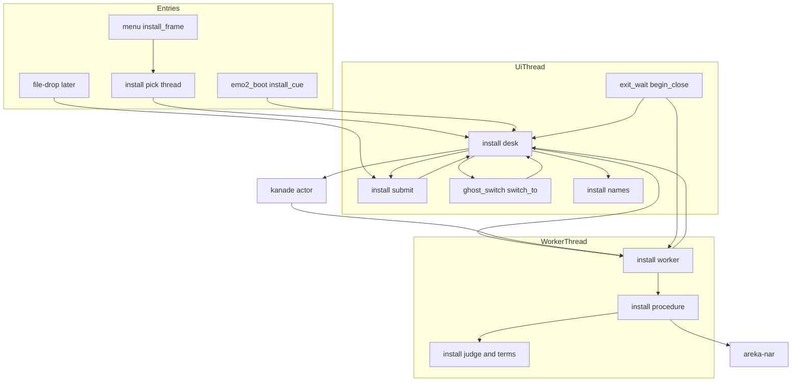
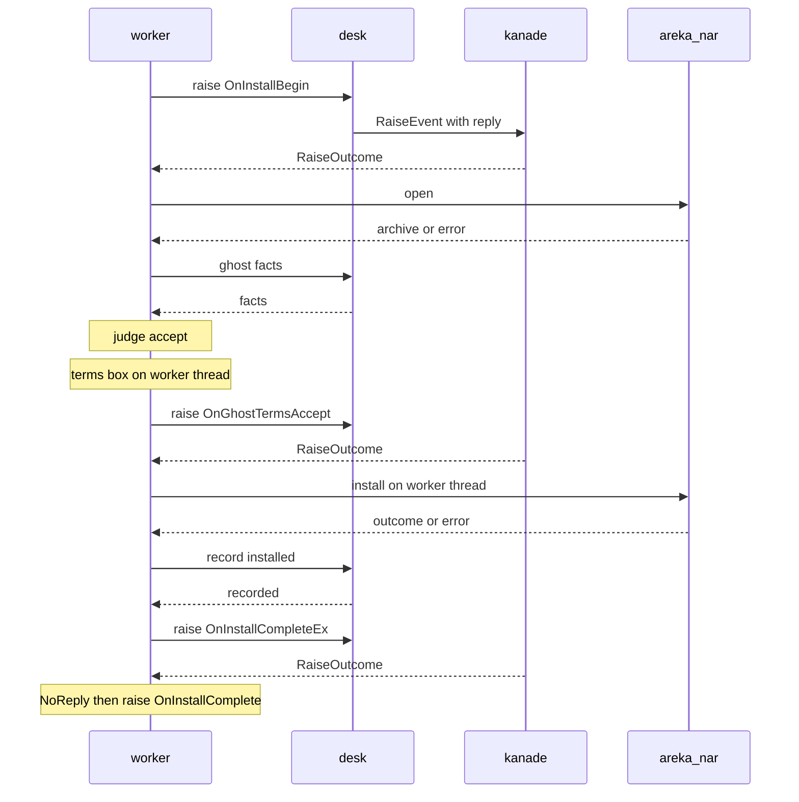
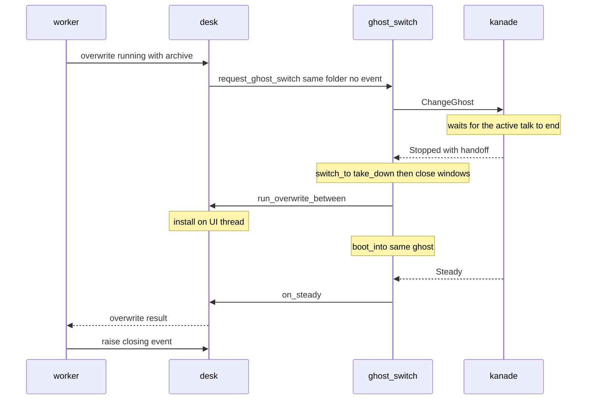
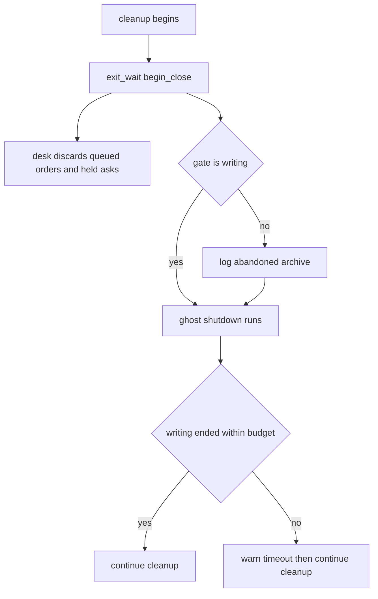

# Design Document: areka-P0-ghost-install

> 2026-09-28 作成（`/kiro-spec-design -y`）。対象はブランチ `claude/areka-p0-ghost-install-bd7d9c`（ソースは main `10a8d724` から不変）。コードは「何の定義か」（関数名・型名・定数名＋ファイルパス）で指し、行番号では指さない。本書の主張はソースを読んで確かめた。調査の経緯と採らなかった案は `research.md` の §10 にある。

## Overview

**Purpose**: `.nar` を手に入れた第三者が、右クリックメニューの「インストール…」か、台本の `\![execute,install,path,フルパス]` から、同じ 1 本の手続きでインストールできるようにする。手続きは正典のイベント 8 語を起動中のゴーストへ送り、利用条件があれば展開の前に受諾か拒否かを選ばせ、失敗はメッセージボックスではなくゴーストへの知らせと記録で伝える。

**Users**: 配布サイトから `.nar` を落としてきた利用者（フォルダを手で展開しなくてよい）。ゴーストの作者（辞書に書いた `OnInstallComplete` などの返事が動く）。後続 `areka-P0-file-drop` の開発者（窓へ落とされた書庫を、依頼 1 つで同じ手続きへ渡せる）。

**Impact**: 本体 `areka` が初めて `areka-nar` に依存する。kanade の汎用の通知の入口（`KanadeMsg::RaiseEvent`）に「応えがあったか」を返す口が付き、許可表が 13 語から 21 語になる。切替の道筋（`switch_to`）に「降ろした後・起こす前」の呼び出しが 1 行入る。終了の後始末 2 か所（`fn main`・OS の終了の受け手）に、背景の仕事を上限つきで待つ呼び出しが入る。切替の入口の型（`SwitchRequest`）・切替の予約の型（`SwitchInFlight`）・きれいな終わりの判定（`session_mark_verdict`）・`areka_nar::InstallRequest` は変えない。

### Goals
- 2 つの入口（メニュー・台本）が 1 つの受付 `install::submit` を通り、同じ手続きで扱われる。
- 手続きは「`OnInstallBegin` → 読み取りと検査 → `accept` の照合 → 利用条件 → 展開 → 締めの知らせ」の順に進み、書庫 1 本につき締めの知らせを 1 つだけ送る。
- `OnInstallCompleteEx` に応えが無いときだけ `OnInstallComplete` を続けて送る。areka は入れた後に切替を要求しない（0 件）。
- 起動中のゴーストのフォルダへ入れるときは、降ろしてから入れて同じゴーストを起こし直す。展開に失敗しても元の中身で戻る。
- 展開の最中にアプリや Windows が終わるときは、展開の終わりを 3 秒まで待つ。
- 判断の分かれ目（照合・失敗理由の表・Reference・応えの有無・終了で待つか）を、画面も実時間の待ちも使わない決定論テストで固定する。

### Non-Goals
- ゴーストの窓へのドラッグ＆ドロップの全部（`areka-P0-file-drop`）。本仕様は投げ込みの受け口を 1 つも作らない。
- `.nar` の読み取り・検査・展開の意味論（完了 `nar-install`／`nar-install-hardening`）。
- `\![execute,install,url,…]`（`network-update`）。`\![open,terms]`。インストール時に説明書を開くこと。
- 入れた後の切替を areka が主導すること。シェル・バルーンを実行中に切り替えること。
- 確定の前で展開を止める口を `areka-nar` に足すこと（設計で決めたこと 8）。
- emo2 の辞書にインストール系の台詞を足すこと。

## Boundary Commitments

### This Spec Owns
- **受付と依頼の型**: `crates/areka/src/install/mod.rs` の `InstallOrder`（書庫のパスを 1 本以上）・`submit`。メニュー・台本・後続 `file-drop` が呼ぶ唯一の口。
- **手続き 1 本**: `install/procedure.rs`（書庫 1 本の一周と、依頼 1 件の一周）と、その純粋な判断 `install/judge.rs`（`accept` の照合・宛先の種類・失敗理由の表・Reference の組み立て・台本の引数の検査）、利用条件 `install/terms.rs`。
- **背景スレッドと UI 側の窓口**: `install/worker.rs`（スレッド `install`）・`install/desk.rs`（待ち行列・取り出しの系・イベントの送出の保留・起動中のゴーストへ入れる一周・入れた後の記録）。
- **2 つの入口**: `emo2_boot/install_cue.rs`（台本の受け口）・`menu/install_frame.rs`（メニューの登記）・`install/pick.rs`（ファイルを選ぶ画面）。
- **置換語 2 つの値**: `install/names.rs`（プロセスで 1 つの値と、ゴーストを起こすたびの載せ直し）。
- **終了で背景の仕事を待つ口**: `crates/areka/src/exit_wait.rs`（`WorkGate`・`begin_close`）。後続 `network-update` が同じ口に乗る。
- **他クレートへ足す口**: kanade の `RaiseOutcome` と `KanadeMsg::RaiseEvent` の返信端・許可表の 8 語／`areka_nar::NarArchive::entry_bytes`／`areka_ghost::catalog::install_accept`／`alert::ask_yes_no`。
- **文書と台帳**: 網羅台帳 3 本の該当行・生成物・`dist/README.txt` の 2 行・`doc/COMPAT_ARCHITECTURE.md` §8・`crates/areka-nar/src/` の正典 URL の行・`signoff.md`。

### Out of Boundary
- wintf（`crates/wintf/`）の全部。`crates/areka/src/placement/`・`crates/areka/src/input_events/`。窓の様式と `WM_DROPFILES`（`file-drop`）。
- kanade の運行表（`schedule/mod.rs`・`schedule/change.rs`・`schedule/steady.rs`）。`Input::RaiseEvent` の欄は今の 3 つのまま。
- `areka-nar` の計画・組み上げ・確定（`plan.rs`・`install.rs`）と `InstallRequest`／`InstallOutcome` の欄。
- 切替の入口 `request_ghost_switch` の判定・`SwitchRequest`・`SwitchInFlight`・`on_ghost_stopped` の振り分け・既定へ戻す道筋 `switch_to_default`。
- `session_mark_verdict`・`settle_session_mark`・`Teardown`・`MarkInputs`（印の判定は引数も理由の語も変えない）。
- `crates/areka/src/emo2_boot/frame.rs`（並走する `frame-phases-after-exit` が触る）・`emo2_boot/spine.rs`・`emo2_boot/ghost_switch_tests.rs`（どちらも上限が近いので足さない）。
- 完了 spec の文書（`.kiro/specs/completed/` 以下）。

### Allowed Dependencies
- 依存の向き: `areka-nar`・`areka-ghost`・`areka-kanade`・`areka-sylphya`・`areka-parsers` → `areka`（bin）。本体の中は `install/judge.rs`・`install/terms.rs`（純粋）→ `install/procedure.rs` → `install/worker.rs` → `install/desk.rs` → 入口（`emo2_boot/install_cue.rs`・`menu/install_frame.rs`）。worker と `desk` の間の頼みの型は `worker.rs` が定義し、`desk` が読む。`exit_wait.rs` は `install/` を知らず、門を使うのは `worker.rs` と `desk.rs`（子の `overwrite.rs` を含む）と、門を作って登記し受付で閉じたかを読む `install/mod.rs` の `register`・`submit` だけ（手続きと判断は門を知らない）。
- 切替の道筋と `install/desk.rs` は互いを呼ぶ（`desk` は `request_ghost_switch`・`record_last_installed`・`SwitchInFlight` を使い、`ghost_switch.rs` は `desk::run_overwrite_between`・`desk::on_steady` を呼ぶ）。`ghost_switch.rs` が `install/` から使うのはこの 2 関数だけ。
- 足す依存: `crates/areka/Cargo.toml` に `areka-nar`（ワークスペースの中）と、`windows` の機能 `Win32_UI_Controls_Dialogs`（`crates/areka-update/Cargo.toml` と同じく自分のクレートで上乗せ・根の `Cargo.toml` は変えない）。外部クレートの追加は 0。
- 本番コードが読む環境変数は足さない（`AREKA_NO_ALERT` は既存）。
- 本番コードに `SendMessageW(`／`SendMessageTimeoutW(` を足さない（`session_end_sync_send_tests.rs` の検査）。
- テストだけ: `log-capture-kit`・`temp-path-kit`・`sample-ghost-kit`（`nar_writer`）。どれも既存の dev-dependencies。

### Revalidation Triggers
- `KanadeMsg::RaiseEvent` に欄 `reply` が増える＝後続（`file-drop`・`shell-balloon-switch`・`network-update`）がこの変種を組み立てるときは `reply` を必ず書く（応えを使わないなら `None`）。
- 許可表 `ALLOWED_EVENT_IDS` が 21 語になる＝後続は数の判定（`events_change_tests.rs`）を 21 から動かす。
- `InstallOrder`・`InstallOrigin`・`submit` の形を変える＝`file-drop` の入口を見直す（`file-drop` は `InstallOrigin` に自分の出どころを 1 つ足す）。
- `switch_to` の「全窓を閉じた直後・起こす前」に呼び出しが入った＝切替の道筋を触る後続は、この位置で UI スレッドが展開の長さだけ止まることを前提にする。
- `exit_wait::begin_close` の呼び出しが `fn main`（`run()` が戻った直後）と `end_session_from`（`end_session_within` の中身）に入った＝終了の経路を足す後続は同じ口を通す。
- `areka-sylphya` の語彙表 `FLAT_VOCAB` の 2 語の状態が変わる＝同クレートのテスト `only_four_tokens_are_m1_derived` の名前の一覧が 6 語になる。

## Architecture

### Existing Architecture Analysis

すべてソースで確認した。

- **`areka-nar` の公開の口は 3 つ**（`crates/areka-nar/src/lib.rs` の `NarArchive::open`・`manifest`・`install`）。`open` を通った値は伸長済みの中身を私有の欄 `names: Vec<EntryName>`・`contents: Vec<Vec<u8>>` に持つ。欄はどれも所有の値なので、`NarArchive` はスレッドをまたいで渡せる。失敗の記録は `log_failure` が `error!` で 1 回だけ出す。成功時は片付け残り 1 件ごとに `warn!` を出す（`install` の中）。
- **汎用の通知の入口**（`crates/areka-kanade/src/msg.rs` の `KanadeMsg::RaiseEvent { id, references, method }`）。殻 `crates/areka-kanade/src/actor.rs` の受信ループが `Input::RaiseEvent` へ写して `drive` を回す。`drive` は最初の一括の中の SHIORI の往復の結果（`BatchResult.last_reply`）を `Input::ShioriReply` として入れ直す。受け手 `on_raise_event`（`schedule/change.rs`）は、許可表に無い名前と定常以外を `warn!` の上で捨て、どちらの場合も動作を 1 つも返さない。**送り手へ戻る値は無い**。返信端を同梱する前例は `KanadeMsg::ResourceQuery { ids, reply }`。
- **空の値つきの応答は台本として届く**。`crates/shiori-host32-host/src/shiori3.rs` の `parse_response` は `Value` の行があれば値が空でも `Some` にし、`client.rs` の `map_get_result` は 200 ならそのまま返し、`crates/areka-kanade/src/shiori/real.rs` の `handle_call` が `ShioriOutcome::Value` に写す。定常の応答の腕（`schedule/steady.rs`）は空の台本でも再生の指示を出す。
- **切替の道筋**（`crates/areka/src/emo2_boot/ghost_switch.rs`）。`request_ghost_switch` が予約 `SwitchInFlight` を立てて `KanadeMsg::ChangeGhost` を送る。kanade は再生中なら要求を保留してトークの完了で始め（`schedule/change.rs` の `on_change_ghost`・`consume_pending`）、`raise_event` が偽なら `OnGhostChanging` も `OnClose` も送らずに降ろす（`begin_change`）。停止通知で `on_ghost_stopped` が `switch_to` を呼び、`switch_to` は 1 回の同期の呼び出しの中で `take_down` → `write_switch_drop` → `close_windows_for_restart` → `boot_into` を通す。起こせなければ `switch_to_default`、相手が既定ゴーストなら `fatal`。定常到達の通知は `on_notice` が受け、初回の起動の定常到達もここを通る。
- **受け皿**: 同ファイルの `record_last_installed`（`#[allow(dead_code)]` と「本番の呼び手は後続 areka-P0-ghost-install」の注釈つき）。
- **終了の後始末**: `crates/areka/src/main.rs` の `after_run`（置き場の単位と印の材料を取り出す）→ `finish_after_run` に渡す閉包（降ろす → 印の始末 → 告知）。`crates/areka/src/session_end.rs` の `end_session_within`（`started` から数える・`shutdown_within` に `WaitBudget { started, limit }`）。どちらも背景の仕事を知らない。
- **ゴーストごとの結線**: `crates/areka/src/ghost_session.rs` の `boot_wired`（`menu::wire_menu` → `menu::ghost_frame::register`）。系の登録は `register_systems`（プロセスに 1 回）。台本の受け口は `crates/areka/src/emo2_boot/mod.rs` の `wire_emo2_boot` が `sinks` の列（今 8 本）に並べ、担当は `consumer_ledger.rs` の `canonical`（今 9 行）に登記する。受け口の前例は `emo2_boot/change_cue.rs`。
- **メニュー**: `crates/areka/src/menu/mod.rs` の `Frame::Install`・`register`。動作の型 `MenuAction` は `Fn(&mut World, &MenuContext)`＝World を借りたまま呼ばれる。項目名は `menu/captions.rs` の `ghostinstallbutton.caption`。
- **告知の部品**: `crates/areka/src/alert.rs` の `raise` は `MessageBoxW(None, …, MB_OK | MB_ICONERROR)` で戻りを見ない。抑止は `suppressed`（`AREKA_NO_ALERT`）。
- **置換語**: 台詞の開始で凍結する表は `crates/areka-ghost/src/sylphya_wiring.rs` の `from_sylphya_provider` が `SylphyaReader::talk_snapshot`（`crates/areka-sylphya/src/reader.rs`）から作る。`talk_snapshot` は語彙表を見ず、値がある名前をすべて返す。`crates/areka-sakura/src/sysvar.rs` の `resolve_system_var` は表に値があれば置き換え、無ければ `%名前` のまま通す。値を載せる口は `SylphyaPublisher::publish_static`（`crates/areka-sylphya/src/actor.rs`）。記憶の置き場はゴーストを起こすたびに新しくなる（`crates/areka-ghost/src/runtime.rs` の `boot_with_origin`）。
- **tick の門**（`crates/wintf/src/ecs/world/tick_gate.rs`）は既定で無効。有効でも 30 画面更新ごとに必ず回る（`TICK_HEARTBEAT_FRAMES`）。台本の切替要求・説明書の受け口は起床の旗を立てていない。

### Architecture Pattern & Boundary Map

採る形は **「背景スレッドで上から順に走る手続き＋UI 側の窓口」**（`research.md` §5 案 C を具体にしたもの）。手続きは World もスレッドも知らず、外とのやり取りは口 `InstallPorts` の 7 つだけ。本番の口は UI 側の窓口 `desk` へ頼みを送って返事を待ち、テストの口は台本どおりに答える。降ろす・起こす・既定へ戻す・致命は切替の道筋をそのまま使う。



**Architecture Integration**:
- 選んだ形: 手続きは背景スレッド 1 本で 1 度に 1 本。UI スレッドは頼みを取り出して捌くだけ。
- 責務の分け方: 判断（純粋）／手続き（順序）／スレッドと画面（worker・pick）／World に触る所（desk）／入口。World に触るのは `desk`・入口・`names`・`exit_wait` だけ。
- 保つ既存の型: 台本の受け口は `*_cue.rs` の同型。メニューは枠への登記。切替は唯一の入口。記録は `event = "…"` の欄つき。
- 新しい部品が要る理由: 手続きと待ち行列・背景スレッド・応えの有無を返す道・書庫の中を読む口・終了で待つ口は、どれも今の実物に無い（`research.md` §3）。

### 設計で決めたこと

| # | 決めたこと | 理由 | 採らなかった案 |
|---|---|---|---|
| 1 | 応えの有無は `KanadeMsg::RaiseEvent` に足す返信端で返す。返す値は `RaiseOutcome` の 5 値（送っていない 2 種・台本あり・返事なし・失敗） | 送った本人にだけ返る。運行表に手を入れない（`Input::RaiseEvent` は 3 欄のまま）。この変種を組み立てる既存のコードは本番 0・テスト 0 なので、欄を足して直す所は殻の 1 か所 | 運行の通知に変種を足す（名前でしか引けず、上限の近い `steady.rs` に手が入る）。再生の開始を見て推し量る（取り違える） |
| 2 | 「空の台本」を返事なしと読むのは kanade の殻（`RaiseOutcome` を組む所）。空白だけの台本も返事なしに数える。運行表の再生の振る舞いは変えない | 空の値つきの応答は台本として届くことをソースで確かめた。判定を 1 か所に置けば、手続きは 2 値を見るだけで済む | areka の手続きで台本の中身を読む（台本を送り手へ運ぶことになる） |
| 3 | 起動中のゴーストへ入れる形は「間を空けない」。`switch_to` の全窓を閉じた直後・起こす前に `desk::run_overwrite_between` を 1 回呼び、UI スレッドで同期に展開する | 展開が成功しても失敗しても、続きは今日の `switch_to` のまま（同じゴーストを起こす → 起こせなければ既定へ戻す → 既定なら致命）で要件 7.4〜7.6 を満たす＝新しい枝 0。窓もゴーストも無いフレームが回らない | 間を空けて背景で展開する（`switch_to` を前後に割る・切替の段が増える・窓の無い間の OS の終了の受け手が要る） |
| 4 | 起動中のゴーストの起こし直しは、既存の入口 `request_ghost_switch` に「フォルダの名指し・知らせなし・出どころ＝自動」で頼む | 再生中の台詞の終わりを待つのは kanade の保留がそのまま行う（要件 7.1）。途中の切替要求の無視は予約の有無の判定のまま（要件 7.7） | 自前で降ろして起こす（印・既定へ戻す・致命を二重に持つ） |
| 5 | UI 側に「今定常か」の旗は持たない。切替の予約が無ければ送り、kanade が「定常でない」と返したら、次の定常到達まで待って送り直す。送った後に定常到達が届いていれば直ちに送り直す（定常到達の回数を数えて比べる） | 定常かどうかの正本は kanade。UI の写しを持つと、終了の握手に入った瞬間などで食い違う | UI に旗を持ち、起こす・降ろすのたびに上げ下げする |
| 6 | 台詞の置き換えはそのまま。始まりの知らせの返事が終わりの知らせの返事に置き換わること、起こし直した直後の挨拶が締めの知らせの返事に置き換わることを受け入れる | kanade の今日の規則（`events::value_replaces_active_talk`）のまま。再生の終わりを UI へ知らせる線は今日 0 で、足すと kanade の公開面が広がる | 再生の終わりを待ってから送る |
| 7 | 書庫の中を読む口は、書庫の中のパスを受ける汎用の口 `NarArchive::entry_bytes` | 同梱バルーンのフォルダの中の利用条件を「読み飛ばした」と記録する（要件 4.10）には、最上位でないファイルの有無も見る必要がある。正典の 2 つのファイル名は areka の側に置ける | 利用条件だけを返す専用の口 |
| 8 | 確定の前で展開を止める口は足さない。`InstallRequest` に欄を足さない | 欄を足すと組み立て 50 か所に波及する。終了が始まった後は展開へ入らないことを門が保証し、進行中の展開は 3 秒の内に終わるか打ち切られる。確定は付け替え 2 回で短い | `install` の隣に「続けてよいか」を尋ねる口を足す |
| 9 | 終了で待つ口は `install/` の外の `exit_wait.rs` に置き、門を登記する形にする | `network-update` の背景の更新が `install/` に依存せずに乗れる（要件 8.10） | `install/` の中に置く |
| 10 | 置換語の値はプロセスで 1 つ持ち（`LastInstallNames`）、入れ終えたときに今のゴーストの記憶の書き手へ `publish_static` で載せ、ゴーストを起こすたびに載せ直す。まだ 1 本も入れていなければ載せない | 凍結する表は語彙表を見ないので、載せた値はそのまま置き換えに使われる。記憶の置き場は起こすたびに新しくなるので載せ直しが要る | 起動の入力に欄を足す（`GhostBootOptions` の組み立て 31 か所に波及） |
| 11 | ファイルを選ぶ画面は `GetOpenFileNameW`。メニューを選ぶたびに短命のスレッド `install-pick` で出す。持ち主の窓は渡さない。作業フォルダを変えない旗（`OFN_NOCHANGEDIR`）を付ける | メニューの動作は World を借りたまま呼ばれるので、UI スレッドで画面を出すと、その間の窓のメッセージが捨てられる。手続きのスレッドで出すと、展開が終わるまで画面が出ない | `IFileOpenDialog`（実機で前面に出ないなどの不都合が出たときの代わり） |
| 12 | 利用条件の画面は `MessageBoxW` の `MB_YESNO`。本文の上限は先頭 25 行かつ 1,200 文字。1 行目が `charset,` で始まるときはその行を出さない | `MB_YESNO` は閉じるボタンが効かない（要件 4.4）。上限は縦 768 の画面に収まる量 | 自前の窓 |
| 13 | 失敗の記録は 2 件で役割を分ける。`areka-nar` の `error!` は部品の詳細（理由の文・確定済みの件数・作業フォルダ）。areka の `error!(event = "install_failed")` は手続きの要約（書庫・種類の語・段・元へ戻ったか・ゴーストへ送る語） | どちらも要件が求める欄を持つ。areka の側は `event` の欄で引ける | 片方に寄せる（`areka-nar` は areka のイベントの語を知らない） |
| 14 | 名前の出どころ: 同梱バルーンの名前と `%lastghostname` のゴーストの名前は、入れた後の目録（`catalog::list_balloons`・`list_ghosts`）の `name`。読めなければフォルダ名／`install.txt` の `name`。受け皿（`record_last_installed`）とバルーンの記憶へ渡すフォルダ名も目録の側の綴り（書庫の `directory` と大文字小文字を無視して突き合わせ、目録の綴りを採る） | メニューの「ゴースト」枠や `OnGhostChanging` と同じ名前の引き方 | `install.txt` の値だけを使う |
| 15 | 許可表は起動・終了のイベントと共用の `ALLOWED_EVENT_IDS` のまま 8 語を足す | 表を分けると `events.rs` の判定と `on_raise_event` に手が入る | 入口専用の表 |
| 16 | 起床の旗は足さない。取り出しの系は毎 tick 回り、門が有効でも心拍で回る | 既存の台本の受け口と同じ。遅れは最大で心拍 1 回ぶん | `tick_wake::mark` を足す（wintf の名簿と検査に手が入る） |

### Technology Stack

| Layer | Choice / Version | Role in Feature | Notes |
|---|---|---|---|
| 書庫 | `areka-nar`（ワークスペース） | 読む・検査する・入れる | 本体の依存に足す。口 `entry_bytes` を 1 つ足す |
| 運行 | `areka-kanade`（ワークスペース） | イベントの送出と応えの有無 | `RaiseOutcome`・返信端・許可表 8 語 |
| 画面 | `windows` 0.62・`Win32_UI_Controls_Dialogs`（足す）・`Win32_UI_WindowsAndMessaging`・`Win32_System_Com`（既存） | ファイルを選ぶ画面・利用条件の画面 | 機能は `crates/areka/Cargo.toml` で上乗せ |
| スレッド | `areka_actor::spawn_actor`・`std::thread::Builder`・`std::sync::{Mutex, Condvar, mpsc}` | 手続きのスレッド・選ぶ画面のスレッド・終了で待つ門 | 外部クレートの追加 0 |
| 文字コード | `areka_parsers::charset::decode` | 利用条件の本文の復号 | `install.txt` と同じ関数 |
| 記憶 | `areka-sylphya` の `SylphyaPublisher` | 置換語の値・最後に使ったバルーン | `publish_static`・`persist_put`・`barrier` |

## File Structure Plan

### 新設

```
crates/areka/src/
├── install/
│   ├── mod.rs                # 依頼の型 InstallOrder・受付 submit・系の登録 register・子の宣言
│   ├── judge.rs              # 純粋: accept の照合・宛先の種類・失敗理由の表・Reference・台本の引数の検査
│   ├── terms.rs              # 純粋: 利用条件のファイルを探す・復号する・上限で切る
│   ├── procedure.rs          # 手続き（書庫 1 本の一周・依頼 1 件の一周）と口 InstallPorts
│   ├── worker.rs             # スレッド install・本物の口（desk への頼み・利用条件の画面）
│   ├── desk.rs               # UI 側の窓口: 待ち行列・取り出しの系・送出の保留・入れた後の記録
│   ├── overwrite.rs          # desk の子: 起動中のゴーストへ入れる一周（預かった書庫・段・切替の入口の判定ごとの扱い）
│   ├── names.rs              # 置換語 2 つの値と載せ直し
│   └── pick.rs               # ファイルを選ぶ画面（unsafe はここに閉じる）
├── exit_wait.rs              # 終了で背景の仕事を待つ口（WorkGate・ExitWaits・begin_close）
├── emo2_boot/install_cue.rs  # 台本 \![execute,install,…] の受け口
└── menu/install_frame.rs     # メニュー「インストール」枠の供給関数と登記
```

テストは兄弟ファイルへ置く（`<stem>_<モジュール名>.rs`・どれも 1,000 行以下）:

- `install/judge_tests.rs`・`install/terms_tests.rs`
- `install/procedure_tests.rs`（書庫 5 種とイベントの列）・`install/procedure_branch_tests.rs`（宛先違い・利用条件・失敗・複数）・`install/procedure_test_support.rs`（偽の口と書庫の組み立て）
- `install/desk_tests.rs`（受付・待ち行列・送出の保留）・`install/desk_overwrite_tests.rs`（起動中のゴーストへ入れる一周・偽の SHIORI・切替の入口の判定 4 値）・`install/desk_exit_tests.rs`（終了で捨てる・送らない）
- `install/worker_tests.rs`（本物の口の写し・門が閉じているときの展開・本物の kanade を通した締めの知らせの列）
- `install/names_tests.rs`・`exit_wait_tests.rs`
- `emo2_boot/install_cue_tests.rs`・`menu/install_frame_tests.rs`
- `crates/areka-kanade/src/actor_raise_reply_tests.rs`（応えの有無の 5 値）
- `crates/areka-nar/src/lib_entry_tests.rs`（読む口）

### 変更

| ファイル | 何を変えるか |
|---|---|
| `crates/areka/Cargo.toml` | 依存に `areka-nar`。`windows` に機能 `Win32_UI_Controls_Dialogs` |
| `crates/areka/src/main.rs` | `mod install;`・`mod exit_wait;`。`fn main` で `run()` が戻った直後（`after_run` の前）に `exit_wait::begin_close`、後始末の閉包の「降ろす → 印の始末（`settle_session_mark`）」の後・告知の前で待つ。`AfterRun`・`after_run` は変えない |
| `crates/areka/src/session_end.rs` | 本体を `end_session_from(world, WaitBudget)` に移し、`end_session_within` は出発点を今にして呼ぶ薄い包みにする（テストが出発点を過去に置くため）。`end_session_from` で、済みの印を据えた直後に `exit_wait::begin_close`、`shutdown_within` と印の始末（`settle_session_mark`）の後に同じ `WaitBudget` で待つ |
| `crates/areka/src/ghost_session.rs` | `register_systems` に `install::register` を 1 行。`boot_wired` に `menu::install_frame::register` と `install::names::reseed` を各 1 行 |
| `crates/areka/src/emo2_boot/ghost_switch.rs` | `record_last_installed` の `#[allow(dead_code)]` と注釈の 2 行を消す。`switch_to` の `close_windows_for_restart` の直後に `desk::run_overwrite_between` を 1 行。`on_notice` の定常到達の腕（中が match の式）を波括弧で包み、末尾に `desk::on_steady` の呼び出しを足す |
| `crates/areka/src/emo2_boot/mod.rs` | `mod install_cue;`。`wire_emo2_boot` で受け口を組み、`sinks` の列の 9 本目に足す |
| `crates/areka/src/emo2_boot/consumer_ledger.rs` | `CommandConsumer::InstallSink` と、`canonical` に `("execute", Some("install"))` の 1 行 |
| `crates/areka/src/menu/mod.rs` | `pub(crate) mod install_frame;` |
| `crates/areka/src/alert.rs` | `YesNo` と `ask_yes_no` |
| `crates/areka-kanade/src/change.rs` | `RaiseOutcome` |
| `crates/areka-kanade/src/msg.rs` | `KanadeMsg::RaiseEvent` に欄 `reply` |
| `crates/areka-kanade/src/actor.rs` | 受信ループの `RaiseEvent` の腕と `drive` で、最初の往復の結果を `RaiseOutcome` へ写して返信端へ 1 回送る |
| `crates/areka-kanade/src/lib.rs` | `RaiseOutcome` の再公開 |
| `crates/areka-kanade/src/schedule/events.rs` | 許可表に 8 語（正典の URL の行つき）。冒頭の表に 8 行 |
| `crates/areka-kanade/src/schedule/events_change_tests.rs` | 数の判定を 13 から 21 へ |
| `crates/areka-nar/src/lib.rs` | `NarArchive::entry_bytes` |
| `crates/areka-nar/src/manifest.rs` ほか | 定義の場所に正典の URL の行（`// ukadoc:`）を 11 項目ぶん |
| `crates/areka-ghost/src/catalog.rs` | `install_accept` |
| `crates/areka-sylphya/src/vocab/flat.rs` | `lastghostname`・`lastobjectname` の状態を実装済みへ。同ファイルのテストの名前の一覧 |
| `doc/ukadoc-coverage/ledger/{assets,shiori,sakura-script}.toml` | 該当行の状態（下の「文書と台帳」） |
| `doc/ukadoc-coverage/roadmap-draft.md`・`doc/ukadoc-coverage/report/` | 生成器で作り直す |
| `dist/README.txt` | 「できないこと」の 2 行から「インストール」を消す |
| `doc/COMPAT_ARCHITECTURE.md` | §8 の表に行を足す |

## System Flows

### 書庫 1 本の一周（要件 2・3・4・5・6）



- 門番の条件: `desk` がイベントを送るのは「切替の予約が無い・終了が始まっていない・送り先のゴーストが居る」とき。満たさなければ頼みを手元に置き、毎 tick と定常到達の通知で見直す。
- 途中で止まる枝: 読み取りの失敗・`accept` の無い `shell`／`supplement`・展開の失敗は `OnInstallFailure`。`accept` の不一致は `OnInstallRefuse`。利用条件の拒否は `OnGhostTermsDecline` だけ。どの枝も 1 バイトも書かずに、または宛先を元のままにして止まる。
- 依頼に書庫が 2 本以上あり全部が成功で終わったときだけ、最後に `OnInstallCompleteAll` を 1 回送る。

### 起動中のゴーストへ入れる一周（要件 7）



- 展開の結果によらず `switch_to` は同じ道を進む。展開が失敗して宛先が元のままなら、同じゴーストが元の中身で起きる。宛先が無くなっていて起こせなければ、`switch_to` の既存の枝が既定ゴーストへ戻す（`OnBoot` の Reference6＝`halt`）。相手が既定ゴースト自身なら今日の致命の経路。
- 頼んだ時点で宛先が起動中のゴーストのフォルダでなくなっていたら（その間に利用者が切り替えた）、`desk` は書庫を返し、worker が自分のスレッドで入れる。
- kanade が切替を受理しなかったら（切替の中止の通知で予約が下りる）、`desk` は預かった書庫を持ち続け、次の定常到達で頼み直す。
- 切替の入口 `request_ghost_switch` の判定（`SwitchVerdict` の 4 値）ごとの扱い。どの判定でも手続きは止まらず、書庫 1 本につき締めの知らせが 1 つ出る:

| 判定 | 起きる場面 | `desk` の扱い | その後 |
|---|---|---|---|
| `Accepted` | 通常 | 段を「切替を頼んだ」へ進める | 上の図のとおり |
| `Busy` | 別の切替の最中 | 段は「預かった」のまま。予約が下りた tick か次の定常到達で頼み直す | 頼み直しが `Accepted` になれば上の図 |
| `NotFound` | 起動中のゴーストのフォルダが目録に無い | `warn!(event = "install_overwrite_unavailable", verdict)` を 1 件残し、書庫を worker へ返す（`Overwritten::NotRunning`） | worker が `install_elsewhere` で入れる。宛先が使用中で入れ替えられなければ要件 5 の失敗（宛先は元のまま・`OnInstallFailure`） |
| `NoContext` | 起動の文脈か送り先のゴーストが無い | 同上 | 同上（送り先が無ければ `raise` が `Closed` を返し `Abandoned`） |

- `run_overwrite_between` が展開するのは、段が「切替を頼んだ」で、かつ切替の予約（`SwitchInFlight`）の切替先のフォルダが預かった宛先と同じ（ASCII の大文字小文字を無視）ときだけ。それ以外の切替（利用者や台本が頼んだ別の切替）では無操作で、預かった書庫は「預かった」のまま次の定常到達を待つ。

### 終了で待つ（要件 8）



- 待つのは、worker が `areka-nar` の `install` の中に居る間だけ（本物の口 `install_elsewhere` が門に出入りを知らせる）。門は「書いている最中か」と「終了が始まったか」を 1 つの鍵の下で持つので、終了が始まった後に展開へ入ることはない。
- 上限は 3 秒。OS の終了では、ゴーストを降ろす待ちと同じ出発点から数える（足し算にしない）。
- 起動中のゴーストへ入れる展開は UI スレッドで同期に走るので、後始末（同じ UI スレッド）が始まる時点では必ず終わっている。
- 待った結果は記録に残すだけで、印の判定には渡さない。

## Requirements Traceability

| Requirement | Summary | Components | Interfaces | Flows |
|---|---|---|---|---|
| 1.1 | 入口は同じ手続きへ | install::submit・desk | `submit` | 書庫 1 本 |
| 1.2 | 投げ込みの受け口 0 | Boundary（Out） | — | — |
| 1.3 | メニューで選んだ 1 つを渡す | install_frame・pick・desk | `pick_and_submit` | — |
| 1.4 | 選ぶ画面の取り消し | pick・desk | `pick_archive` が `None` | — |
| 1.5 | 台本の絶対パス | install_cue・judge | `script_request` | — |
| 1.6 | 相対パス・空は始めない | install_cue・judge | `ScriptRefusal` | — |
| 1.7 | `path` 以外は何もしない | install_cue・judge | `ScriptRefusal` | — |
| 1.8 | 起こすたびに登記 | install_frame・ghost_session | `install_frame::register` | — |
| 1.9 | 1 度に 1 本・届いた順 | desk | 待ち行列 | — |
| 1.10 | 定常まで待たせる | desk | 送出の保留 | 書庫 1 本 |
| 1.11 | 表示中は止めない | worker・pick | スレッド 2 本 | — |
| 1.12 | 窓の無い起動では受けない | ghost_session（`boot_wired` だけが結ぶ） | — | — |
| 2.1 | `OnInstallBegin` | procedure | `InstallPorts::raise` | 書庫 1 本 |
| 2.2 | 手続きの順 | procedure | `run_archive` | 書庫 1 本 |
| 2.3 | 締めの知らせは 1 つ | procedure | `ArchiveEnd` | 書庫 1 本 |
| 2.4 | `OnInstallCompleteEx` の Reference | judge | `complete_ex_refs` | — |
| 2.5 | 識別子は 4 語 | judge | `kind_word` | — |
| 2.6 | 応えが無ければ旧仕様 | procedure・kanade | `RaiseOutcome::NoReply`・`complete_legacy_refs` | 書庫 1 本 |
| 2.7 | 応えがあれば送らない | procedure | `Raised::Script` | 書庫 1 本 |
| 2.8 | 全部成功で `OnInstallCompleteAll` | procedure | `run_order` | — |
| 2.9 | 1 本・失敗ありなら送らない | procedure | `run_order` | — |
| 2.10 | 締めの知らせも定常まで待つ | desk | 送出の保留 | 起動中のゴースト |
| 2.11 | `OnInstallReroute` 0 件 | kanade 許可表（足さない） | — | — |
| 2.12 | 新しいイベント名 0・許可表 21 語 | kanade events | `ALLOWED_EVENT_IDS` | — |
| 2.13 | 送り先は送る時点のゴースト | desk | 置き場の送出端を送るたびに引く | — |
| 3.1 | `accept` の照合 | judge・catalog | `judge_accept`・`install_accept` | — |
| 3.2 | 不一致は `OnInstallRefuse` | procedure・judge | `refuse_refs` | 書庫 1 本 |
| 3.3 | 展開の前・`install.txt` だけ | procedure | `manifest()` | 書庫 1 本 |
| 3.4 | `ghost`／`balloon` で `accept` 無し | judge | `AcceptVerdict::Accepted` | — |
| 3.5 | 宛先は起動中のゴースト | judge | `target_ghost` | — |
| 3.6 | `accept` の無い `shell`／`supplement` | judge | `AcceptVerdict::AcceptMissing` | — |
| 3.7 | 宛先違いは失敗に数えない | procedure | `warn!(install_refused)` | — |
| 4.1 | 利用条件を展開の前に | terms・procedure | `find_terms` | 書庫 1 本 |
| 4.2 | `terms.txt` が先 | terms | `find_terms` | — |
| 4.3 | 文字コードと Markdown | terms | `terms_notice` | — |
| 4.4 | はい／いいえの 2 択 | alert | `ask_yes_no` | — |
| 4.5 | 受諾 | procedure | `YesNo::Yes` | 書庫 1 本 |
| 4.6 | 拒否 | procedure | `YesNo::No` | — |
| 4.7 | 抑止は拒否 | alert・procedure | `YesNo::Suppressed` | — |
| 4.8 | 出せなければ拒否 | alert・procedure | `YesNo::Unavailable` | — |
| 4.9 | 長い本文は切る | terms | `TERMS_MAX_LINES`・`TERMS_MAX_CHARS` | — |
| 4.10 | 同梱バルーンの中は出さない | terms | `nested_terms` | — |
| 4.11 | 無ければ画面なし | terms・procedure | `find_terms` が `None` | — |
| 5.1 | 失敗は `OnInstallFailure` | procedure・judge | `failure_word` | 書庫 1 本 |
| 5.2 | 失敗理由の表 | judge | `failure_word`（網羅の match） | — |
| 5.3 | 送らない 3 語 | judge | `FailureWord` は 3 値だけ | — |
| 5.4 | メッセージボックス 0 | procedure（告知を呼ばない） | — | — |
| 5.5 | 失敗の記録 | procedure | `error!(install_failed)` | — |
| 5.6 | 戻せなかった宛先の記録 | procedure | `error!(install_survivor)` | — |
| 5.7 | 応えが無くても代わりを出さない | procedure | 締めの知らせの応えを見ない | — |
| 5.8 | 片付け残りは成功 | areka-nar（既存の `warn!`） | `InstallOutcome.leftovers` | — |
| 6.1 | 受け皿へ書く | desk | `record_last_installed` | 書庫 1 本 |
| 6.2 | 切替の要求 0 件 | procedure | 口に切替が無い | — |
| 6.3 | 台本の切替は既存の入口 | 既存（`change_cue`・`ghost_switch`） | — | — |
| 6.4 | 複数なら最後のゴースト | procedure・desk | 書庫ごとに記録 | — |
| 6.5 | 自分自身なら起こし直しだけ | desk | 起動中のゴーストへ入れる一周 | 起動中のゴースト |
| 6.6 | バルーンの記憶 | desk | `persist_put(Ghost, LastBalloon)` | — |
| 6.7 | シェルは替えない | procedure・desk | 記録だけ | — |
| 6.8 | 置換語 | names | `LastInstallNames` | — |
| 6.9 | 入れる前は置き換えない | names | 値が無ければ載せない | — |
| 6.10 | メニューから選べる | 既存（`menu/ghost_frame.rs`） | — | — |
| 7.1 | 台詞が終わってから降ろす | desk・kanade（既存の保留） | `request_ghost_switch` | 起動中のゴースト |
| 7.2 | 知らせを送らない切替と同じ | desk | `raise_event: false` | 起動中のゴースト |
| 7.3 | 降ろし終えてから展開 | ghost_switch・desk | `run_overwrite_between` | 起動中のゴースト |
| 7.4 | 失敗なら元の中身で起こし直す | ghost_switch（既存の続き） | `boot_into` | 起動中のゴースト |
| 7.5 | 起こせなければ既定へ | ghost_switch（既存） | `switch_to_default` | 起動中のゴースト |
| 7.6 | 既定自身なら致命 | ghost_switch（既存） | `fatal` | — |
| 7.7 | 途中の切替要求は無視 | ghost_switch（既存） | `SwitchVerdict::Busy` | — |
| 7.8 | シェル・バルーンは降ろさない | judge・procedure | `Destination::Elsewhere`・`install_elsewhere` | 書庫 1 本 |
| 7.9 | 印の判定を変えない | Boundary（Out） | — | — |
| 8.1 | 展開の終わりを 3 秒待つ | exit_wait | `EXIT_WAIT_LIMIT`・`ClosingWaits::wait` | 終了で待つ |
| 8.2 | OS の終了では合わせて 3 秒 | session_end・exit_wait | 同じ `WaitBudget` | 終了で待つ |
| 8.3 | 上限で `warn!` | exit_wait | `warn!(exit_wait_timeout)` | 終了で待つ |
| 8.4 | 書く前の段は待たない | exit_wait | `warn!(exit_wait_abandoned)` | 終了で待つ |
| 8.5 | 待っている依頼は捨てる | desk | `warn!(install_pending_discarded)` | 終了で待つ |
| 8.6 | 終了の後はイベント 0 | desk | 頼みを落とす | — |
| 8.7 | 印の理由にしない | Boundary（Out） | — | — |
| 8.8 | 次の起動は今日どおり | 既存（`boot_resolve`） | — | — |
| 8.9 | SHIORI の期限は不変 | Boundary（Out） | — | — |
| 8.10 | `network-update` が乗れる形 | exit_wait | `register_gate` | — |
| 9.1 | 書庫を 1 本以上 | install::mod | `InstallOrder.archives` | — |
| 9.2 | 並んだ順・依頼の単位 | procedure | `run_order` | — |
| 9.3 | 渡す口は 1 つ | install::mod | `submit` | — |
| 9.4 | 本番の呼び手は 2 つ | install_frame・install_cue | — | — |
| 10.1 | 各段の記録 | procedure・desk | Monitoring の表 | — |
| 10.2 | 同じコミットで URL の行と 11 行 | 文書と台帳 | — | — |
| 10.3 | 台帳の更新と生成物 | 文書と台帳 | — | — |
| 10.4 | README の 2 行 | 文書と台帳 | — | — |
| 10.5 | §8 に記す | 文書と台帳 | — | — |
| 10.6 | 環境変数 0・外部クレート 0 | Allowed Dependencies | — | — |
| 10.7 | 1,000 行 | File Structure Plan | — | — |
| 11.1 | 書庫 5 種 | Testing（手続き） | — | — |
| 11.2 | `accept` | Testing（判断） | — | — |
| 11.3 | 利用条件 4 通り | Testing（手続き） | — | — |
| 11.4 | 失敗理由の表 | Testing（判断） | — | — |
| 11.5 | 応えの有無・切替 0・All | Testing（手続き・kanade） | — | — |
| 11.6 | 2 つの入口 | Testing（入口） | — | — |
| 11.7 | 起動中のゴーストへ入れる一周 | Testing（窓口） | — | — |
| 11.8 | 終了で待つ口 | Testing（終了） | — | — |
| 11.9 | 許可表 21 語 | Testing（kanade） | — | — |
| 11.10 | 既存のテストを消さない | Testing（規律） | — | — |
| 11.11 | 実機の 4 項目 | Testing（実機） | — | — |
| 11.12 | 記録の水準 | Testing（実機） | — | — |
| 12.1 | 降ろして入れて起こし直す | 設計で決めたこと 3・4 | — | 起動中のゴースト |
| 12.2 | 巻き戻せなかったときの伝え方 | procedure | `install_survivor` | — |
| 12.3 | はい／いいえ・抑止は拒否 | alert・procedure | `ask_yes_no` | — |
| 12.4 | 展開の最中だけ待つ | exit_wait・設計で決めたこと 8 | — | 終了で待つ |
| 12.5 | areka は切替を主導しない | procedure | 口に切替が無い | — |
| 12.6 | 応えが無いの読み | kanade | `RaiseOutcome::NoReply` | — |
| 12.7 | 旧仕様の Reference0 は `ghost` | judge | `complete_legacy_refs` | — |
| 12.8 | イベントの前後 | procedure | `run_archive` | 書庫 1 本 |
| 12.9 | `accept` の無い `shell`／`supplement` | judge | `AcceptMissing` | — |
| 12.10 | 失敗理由の語 | judge | `failure_word` | — |
| 12.11 | 置換語の読み | names | `LastInstallNames` | — |
| 12.12 | All は 2 本以上 | procedure | `run_order` | — |
| 12.13 | バルーン窓への投げ込み | Boundary（Out・`file-drop`） | — | — |
| 12.14 | バルーンの記憶の読み | desk | `LastBalloon` | — |
| 12.15 | 利用条件の 2 つのファイル | terms | `find_terms` | — |
| 12.16 | 投げ込みの切り出しと規模 | Boundary・規模の見立て | — | — |

## Components and Interfaces

| Component | Layer | Intent | Req Coverage | Key Dependencies | Contracts |
|---|---|---|---|---|---|
| RaiseOutcome と返信端 | areka-kanade | 応えの有無を送り手へ返す | 2.6, 2.7, 12.6 | areka-actor (P0) | Service |
| 許可表 | areka-kanade | 8 語を送れるようにする | 2.11, 2.12 | — | State |
| NarArchive::entry_bytes | areka-nar | 書庫の中のファイルを読む | 4.1, 4.10 | — | Service |
| catalog::install_accept | areka-ghost | 受け手の名乗りを読む | 3.1 | areka-parsers (P0) | Service |
| alert::ask_yes_no | areka | はい／いいえを返す | 4.4, 4.7, 4.8 | windows (P0) | Service |
| judge | areka / install | 純粋な判断 | 2.4, 2.5, 3.1, 3.4, 3.5, 3.6, 5.2, 5.3, 7.8 | areka-nar の型 (P0) | Service |
| terms | areka / install | 利用条件の本文を用意する | 4.1, 4.2, 4.3, 4.9, 4.10, 4.11 | areka-parsers (P0) | Service |
| procedure | areka / install | 手続きの順序 | 2.1, 2.2, 2.3, 2.6, 2.7, 2.8, 2.9, 3.2, 3.3, 3.7, 4.5, 4.6, 5.1, 5.5, 5.6, 9.2 | judge, terms, areka-nar (P0) | Service |
| worker | areka / install | 背景スレッドと本物の口 | 1.11 | procedure, desk (P0) | Service |
| desk | areka / install | UI 側の窓口 | 1.1, 1.9, 1.10, 2.10, 2.13, 6.1, 6.6, 7.1, 7.2, 7.3, 8.4, 8.5, 8.6 | ghost_switch, kanade (P0) | Service, State |
| names | areka / install | 置換語の値 | 6.8, 6.9 | areka-sylphya (P0) | State |
| pick | areka / install | ファイルを選ぶ画面 | 1.3, 1.4 | windows (P0) | Service |
| exit_wait | areka | 終了で待つ口 | 8.1, 8.2, 8.3, 8.10 | kanade の `WaitBudget` (P1) | Service, State |
| install_cue | areka / emo2_boot | 台本の受け口 | 1.5, 1.6, 1.7 | dola の cue (P0) | Event |
| install_frame | areka / menu | メニューの登記 | 1.3, 1.8 | menu (P0) | Service |

### areka-kanade

#### RaiseOutcome と返信端（`change.rs`・`msg.rs`・`actor.rs`）

| Field | Detail |
|---|---|
| Intent | 汎用の通知の入口で送ったイベントに、ゴーストが応えたかを送り手へ 1 回返す |
| Requirements | 2.6, 2.7, 11.5, 12.6 |

**Responsibilities & Constraints**
- 返すのは最初の往復の結果だけ。運行表の判断（許可表・定常・置き換え）は変えない。
- 返事は、その依頼の処理（応答を運行表へ入れ直して動作を実行し終えるまで）が済んだ時点で送る。送り手は返事を受けた後に次の依頼を送るので、kanade の受信の順は「イベント → 次の依頼」になる。
- 返信端が `None` なら今日どおり（何も返さない）。受け手が居なくなっていても運行は続ける（`debug!` を 1 件）。

##### Service Interface
```rust
// crates/areka-kanade/src/change.rs
/// 汎用の通知の入口で送ったイベントの結果（送り手へ返す）。
#[derive(Debug, Clone, Copy, PartialEq, Eq)]
pub enum RaiseOutcome {
    /// 許可表に無い名前（送っていない）。
    NotAllowed,
    /// 定常でない（送っていない・積んでもいない）。
    NotSteady,
    /// 空でない台本が返った。
    Script,
    /// 返事なし（204・空か空白だけの台本・エラー応答・NOTIFY の完了）。
    NoReply,
    /// 往復が失敗した（kanade は今日どおり終了系列へ進む）。
    Failed,
}
// crates/areka-kanade/src/msg.rs の KanadeMsg
RaiseEvent {
    id: String,
    references: Vec<String>,
    method: crate::change::ShioriMethod,
    /// 結果の返信端（要らなければ None）。
    reply: Option<areka_actor::ReplySender<crate::change::RaiseOutcome>>,
},
```
- Preconditions: なし（どの相でも受ける）。
- Postconditions: `reply` が `Some` なら、返事はちょうど 1 回送られるか、kanade が止まって返信端が落ちる（送り手には `ReplyError::Dropped`）。
- Invariants: `Input::RaiseEvent` の欄は増えない。`NotAllowed` は `events::allowed_static` が `None` のとき。`NotSteady` は許可表に在るが最初の一括に SHIORI の往復が無かったとき。

**Implementation Notes**
- Integration: 値の写しは殻の 1 か所。`ShioriOutcome` は複製できないので、運行表へ入れ直す前に参照から写す。
- Validation: `actor_raise_reply_tests.rs` が 5 値を 1 つずつ出す（偽の shiori のスレッドで台本・空の台本・204・失敗、起動系列の途中、許可表に無い名前）。
- Risks: `actor_tests.rs` は 970 行なので足さない。

#### 許可表（`schedule/events.rs`）

`ALLOWED_EVENT_IDS` に `OnInstallBegin`・`OnInstallComplete`・`OnInstallCompleteEx`・`OnInstallCompleteAll`・`OnInstallFailure`・`OnInstallRefuse`・`OnGhostTermsAccept`・`OnGhostTermsDecline` を、正典の URL の行つきで足す（13 → 21）。`OnInstallReroute` は足さない。`events_change_tests.rs` の数を 21 にし、8 語が引けることと `OnInstallReroute` が引けないことを同じテストで判定する。

### areka-nar

#### NarArchive::entry_bytes（`lib.rs`）

```rust
impl NarArchive {
    /// 書庫の中のファイル 1 つの伸長済みの中身。`path` は書庫の中の `/` 区切りのパスで、
    /// ASCII の大文字小文字を区別しない。フォルダと、無いパスは `None`。
    pub fn entry_bytes(&self, path: &str) -> Option<&[u8]>;
}
```
- 読み直しも伸長のやり直しもしない（`names` と `contents` を引くだけ）。何も書かない。記録も出さない。
- 同じコミットで、`install.txt` の 11 項目の定義の場所に正典の URL の行を置く（要件 10.2）。

### areka-ghost

#### catalog::install_accept（`catalog.rs`）

```rust
/// `<ゴースト>/ghost/master/descript.txt` の `install.accept` をカンマで分け、前後の空白を
/// 落とした名前の列。無い・読めない → 空の列（読めないときは `warn!`）。素性には載せない。
pub fn install_accept(ghost_dir: &Path) -> Vec<String>;
```
`sakura_name` と同じ読み方（鍵は小文字化）。空の名前は落とす。

### areka / 告知

#### alert::ask_yes_no（`alert.rs`）

```rust
#[derive(Debug, Clone, Copy, PartialEq, Eq)]
pub(crate) enum YesNo {
    Yes,
    No,
    /// 抑止されていて出さなかった。
    Suppressed,
    /// 出せなかった。
    Unavailable,
}
/// はい／いいえの 2 択の画面を出して答えを返す（閉じるボタンは効かない）。
pub(crate) fn ask_yes_no(title: &str, body: &str, suppressed: bool) -> YesNo;
```
- `MessageBoxW(None, …, MB_YESNO | MB_ICONQUESTION | MB_SETFOREGROUND | MB_TOPMOST)`。持ち主の窓は渡さない。
- 記録は `info!(event = "ask", title, suppressed)` を 1 件。出せなければ `error!(event = "ask_box_failed")`。抑止と失敗を拒否へ倒すのは呼び手（手続き）。
- 既存の 5 場面と `raise` は変えない。`unsafe` はこのファイルの中に留まる。

### areka / install

#### 依頼と受付（`install/mod.rs`）

```rust
/// インストールの依頼（書庫のパスを 1 本以上・並んだ順に扱う）。
#[derive(Debug, Clone, PartialEq, Eq)]
pub(crate) struct InstallOrder {
    pub archives: Vec<PathBuf>,
    pub origin: InstallOrigin,
}
/// 依頼の出どころ（記録の語彙・手続きは分岐しない）。
#[derive(Debug, Clone, Copy, PartialEq, Eq)]
pub(crate) enum InstallOrigin {
    Menu,
    Script,
}
#[derive(Debug, Clone, Copy, PartialEq, Eq)]
pub(crate) enum SubmitVerdict {
    Queued,
    /// 書庫が 0 本。
    Empty,
    /// 窓口が無い（系の登録の前）。
    NoDesk,
    /// 終了が始まっている。
    Closing,
}
/// 別のスレッド（台本の受け口・選ぶ画面）から窓口へ届く、依頼になる前の要求。
#[derive(Debug, Clone, PartialEq, Eq)]
pub(crate) struct RawInstallRequest {
    pub path: PathBuf,
    pub origin: InstallOrigin,
}
/// 依頼を手続きへ渡す唯一の口（UI スレッド）。
pub(crate) fn submit(world: &mut World, order: InstallOrder) -> SubmitVerdict;
/// 窓口を据え、取り出しの系を Input の段へ登録し、門を終了の待ちへ登記する（プロセスに 1 回）。
pub(crate) fn register(world: &mut World);
```
- `submit` は `info!(event = "install_order_queued", origin, count)` を 1 件残す。`Queued` 以外は `warn!`。
- 名前は `areka_nar::InstallRequest`／`InstallOutcome` と重ならない。

#### judge（`install/judge.rs`）

| Field | Detail |
|---|---|
| Intent | 手続きの判断の分かれ目を、fs も World も読まない関数に集める |
| Requirements | 1.5, 1.6, 1.7, 2.4, 2.5, 3.1, 3.4, 3.5, 3.6, 5.2, 5.3, 7.8, 12.7, 12.9, 12.10 |

##### Service Interface
```rust
/// 照合と宛先の判断に要る、今のゴーストの素性。
#[derive(Debug, Clone, PartialEq, Eq)]
pub(crate) struct GhostFacts {
    pub root: PathBuf,
    /// 根の下のフォルダ名（argv で根の外から起こしたゴーストは None）。
    pub folder: Option<String>,
    pub name: String,
    pub sakura_name: Option<String>,
    pub install_accept: Vec<String>,
}
#[derive(Debug, Clone, PartialEq, Eq)]
pub(crate) enum AcceptVerdict {
    /// 受け取る。`shell`／`supplement` は宛先のゴーストのフォルダ名つき。
    Accepted { target_ghost: Option<String> },
    /// 宛先違い（`accept` の値つき）。
    Refused { accept: String },
    /// `accept` の無い `shell`／`supplement`。
    AcceptMissing,
}
pub(crate) fn judge_accept(manifest: &InstallManifest, ghost: &GhostFacts) -> AcceptVerdict;
#[derive(Debug, Clone, Copy, PartialEq, Eq)]
pub(crate) enum Destination {
    /// 起動中のゴーストのフォルダそのもの（`ghost` の上書き・`supplement`）。
    RunningGhost,
    Elsewhere,
}
pub(crate) fn destination_of(manifest: &InstallManifest, ghost: &GhostFacts) -> Destination;
/// 正典の失敗理由の語（3 値だけ）。
#[derive(Debug, Clone, Copy, PartialEq, Eq)]
pub(crate) enum FailureWord { Extraction, InvalidType, Unsupported }
impl FailureWord { pub(crate) fn as_ref_str(self) -> &'static str; }
pub(crate) fn failure_word(error: &NarError) -> FailureWord;
pub(crate) fn kind_word(kind: &ElementKind) -> &'static str;
/// 入れた物 1 つ（識別子・名前・場所）。
#[derive(Debug, Clone, PartialEq, Eq)]
pub(crate) struct InstalledItem { pub kind: &'static str, pub name: String, pub place: String }
pub(crate) fn complete_ex_refs(items: &[InstalledItem]) -> Vec<String>;
pub(crate) fn complete_legacy_refs(manifest_name: &str, items: &[InstalledItem]) -> Vec<String>;
pub(crate) fn refuse_refs(accept: &str, manifest: &InstallManifest) -> Vec<String>;
#[derive(Debug, Clone, PartialEq, Eq)]
pub(crate) enum ScriptRefusal { NotPath { found: String }, Empty, Relative { path: String } }
/// `\![execute,install,…]` の 2 番目以降の引数から書庫のパスを取り出す。
pub(crate) fn script_request(arguments: &[&str]) -> Result<PathBuf, ScriptRefusal>;
```
- `judge_accept`: `accept` が在れば `sakura_name` と `install_accept` の各名前に完全一致（大文字小文字を区別）で照合する。`ghost`／`balloon` で `accept` が無ければ照合なしで受け取る。
- `destination_of`: `supplement` は常に `RunningGhost`。`ghost` は `directory` と `folder` が ASCII の大文字小文字を無視して等しいとき `RunningGhost`。`shell`／`balloon` は `Elsewhere`。`folder` が `None`（argv で起こしたゴースト）のときは種類によらず `Elsewhere`＝降ろして入れる一周へは入らない。このとき `shell`／`supplement` は宛先のゴーストを名指しできないので `areka-nar` が断り（`OnInstallFailure`）、起動中のゴースト自身への `ghost` の上書きは使用中のフォルダの入れ替えになるので要件 5 の失敗になる（宛先は元のまま）。argv の起動は開発者の実走の経路で、配布物の利用者は通らない。
- `failure_word`: `RefuseReason` の 14 種と `NarError::Io` を要件 5.2 の表のとおりに写す。ワイルドカードの腕を置かないので、種類が増えるとビルドが止まる。`UnsupportedType` は欄 `found` が `None` なら `InvalidType`、`Some` なら `Unsupported`。
- 複数の値は byte 値 1（`'\u{1}'`）で繋ぐ。並びは `InstallOutcome.installed` の順（本体が先・同梱バルーンが後）。
- `complete_legacy_refs`: Reference0＝先頭の物の識別子、Reference1＝`install.txt` の `name`、Reference2＝同梱バルーンの名前（無ければ空）。
- `script_request`: 先頭が `path` でなければ `NotPath`（`url` を含む）。パスが空・欠けていれば `Empty`。`Path::is_absolute` が偽なら `Relative`。4 つ目以降の引数は読まない（受け口が `warn!` を残す）。

#### terms（`install/terms.rs`）

```rust
pub(crate) const TERMS_MAX_LINES: usize = 25;
pub(crate) const TERMS_MAX_CHARS: usize = 1200;
/// 出す利用条件（ファイル名と、復号して上限で切った本文）。
#[derive(Debug, Clone, PartialEq, Eq)]
pub(crate) struct TermsNotice { pub file: &'static str, pub body: String, pub clipped: bool }
/// 書庫の最上位の利用条件（`terms.txt` が先・無ければ `terms.md`）。無ければ None。
pub(crate) fn find_terms(archive: &NarArchive) -> Option<TermsNotice>;
/// 同梱バルーンの取り出し元フォルダの中に在る利用条件のパス（出さずに記録するため）。
pub(crate) fn nested_terms(archive: &NarArchive) -> Vec<String>;
```
- 復号は `areka_parsers::charset::decode(bytes, DefaultEncoding::Ansi)`。1 行目が `charset,` で始まればその行を本文から外す。Markdown は解釈しない。
- 上限を超えたら先頭だけを残し、末尾に「続きは書庫の中の <ファイル名> にあります」を足す。

#### procedure（`install/procedure.rs`）

| Field | Detail |
|---|---|
| Intent | 書庫 1 本の一周と依頼 1 件の一周を、正典の順で進める |
| Requirements | 2.1, 2.2, 2.3, 2.6, 2.7, 2.8, 2.9, 3.2, 3.3, 3.7, 4.5, 4.6, 4.7, 4.8, 5.1, 5.4, 5.5, 5.6, 5.7, 6.2, 6.4, 9.2, 10.1, 12.5, 12.8, 12.12 |

##### Service Interface
```rust
/// 手続きが外とやり取りする口（本番は worker・テストは偽物）。
pub(crate) trait InstallPorts {
    /// 書庫 1 本の手続きを始める（`path` は書庫のパス・終了の待ちの記録に載せる）。
    fn begin_archive(&mut self, path: &Path);
    /// イベントを今のゴーストへ GET で送り、応えを待つ。定常でなければ定常まで待つ。
    fn raise(&mut self, id: &'static str, references: Vec<String>) -> Raised;
    /// 今のゴーストの素性。ゴーストが居なければ None。
    fn ghost_facts(&mut self) -> Option<GhostFacts>;
    /// 利用条件を出して答えを受ける。
    fn ask_terms(&mut self, title: &str, notice: &TermsNotice) -> YesNo;
    /// 起動中のゴースト以外の宛先へ入れる。終了が始まっていて入らなかったら None。
    fn install_elsewhere(
        &mut self,
        archive: &NarArchive,
        target_ghost: Option<&str>,
    ) -> Option<Result<InstallOutcome, NarError>>;
    /// 起動中のゴーストを降ろしてから入れ、起こし直す。
    fn overwrite_running(&mut self, archive: NarArchive, target_ghost: Option<String>) -> Overwritten;
    /// 入れた後の記録（受け皿・バルーンの記憶・置換語）。反映が済んでから戻る。
    fn record(&mut self, record: InstalledRecord);
}
#[derive(Debug, Clone, Copy, PartialEq, Eq)]
pub(crate) enum Raised { Script, NoReply, /** 終了が始まった・ゴーストが居ない。 */ Closed }
pub(crate) enum Overwritten {
    Ran(Result<InstallOutcome, NarError>),
    /// 宛先はもう起動中のゴーストではない（書庫を返す）。
    NotRunning(NarArchive),
    Closed,
}
/// 入れた後に覚えること（書庫 1 本ぶん）。
#[derive(Debug, Clone, PartialEq, Eq)]
pub(crate) struct InstalledRecord {
    pub kind: InstallKind,
    /// `install.txt` の `name`。
    pub object_name: String,
    /// 入れた先のフォルダ名（`ghost` はゴースト・`balloon` はバルーン）。
    pub folder: String,
    /// 関わったゴーストのフォルダ名（`balloon` は None）。
    pub ghost_folder: Option<String>,
}
/// 書庫 1 本の終わり方。
#[derive(Debug, Clone, PartialEq, Eq)]
pub(crate) enum ArchiveEnd {
    Installed(Vec<InstalledItem>),
    Refused,
    Declined,
    Failed(FailureWord),
    /// 終了が始まったので途中でやめた（締めの知らせ 0 件）。
    Abandoned,
}
/// 依頼 1 件を並んだ順に扱い、書庫ごとの終わり方を返す。書庫 1 本の一周は私有の `run_archive`。
pub(crate) fn run_order(order: &InstallOrder, ports: &mut dyn InstallPorts) -> Vec<ArchiveEnd>;
```
- Preconditions: `order.archives` は 1 本以上。
- Postconditions: 書庫ごとに、締めの知らせ（`OnInstallCompleteEx`〔応えが無ければ続けて `OnInstallComplete`〕・`OnInstallRefuse`・`OnGhostTermsDecline`・`OnInstallFailure`）のどれか 1 つを送っているか、`Abandoned`。
- Invariants: 口に切替を頼む関数が無い＝手続きが切替を要求することは型の上で起きない。`raise` が `Closed` を、`install_elsewhere` が `None` を返したら、以後はイベントを送らず `Abandoned` で抜ける。
- 手続きは World・スレッド・門・根の場所を知らない（根は `GhostFacts.root` として口が持つ）。
- 失敗の記録: `error!(event = "install_failed", archive, kind, phase, rolled_back, word)`。`NarError::Io.survivors` が空でなければ、宛先ごとに `error!(event = "install_survivor", destination, kept_at)` を出し、7 日で消えることを本文に書く。
- 宛先違いは `warn!(event = "install_refused")`。利用条件の抑止は `warn!`、出せなかったら `error!`。

#### worker（`install/worker.rs`）

- スレッドは `areka_actor::spawn_actor("install", …)` で、最初の依頼が来たときに 1 度だけ起こす。受け取るのは依頼 1 件ずつ。
- 本物の口 `DeskPorts` は、`desk` への頼み（`mpsc`）と返信端（`areka_actor::reply_channel`）で UI とやり取りする。`raise` は kanade からの `RaiseOutcome` を直接受ける。`NotSteady` なら「送り直し」の印を付けて頼み直す。`NotAllowed` と `Failed` は `error!` を残し、`NotAllowed` は `NoReply`、`Failed` は `Closed` に読む。返信端が落ちたら `Closed`。
- 利用条件の画面はこのスレッドで `alert::ask_yes_no` を呼ぶ。
- 門への知らせ: 書庫を扱い始めるとき（手続きが `begin_archive` を呼ぶ・`OnInstallBegin` の前）に `gate.begin(書庫のパス)`。`install_elsewhere` はこのスレッドで `archive.install` を呼び、その前に `gate.begin` で名前を「書庫のパスと宛先」へ差し替え（要件 8.3）、`gate.enter_write()`、戻ったら `gate.leave_write()` の直後に続けて `gate.end()`。`begin`／`enter_write` が偽（終了が始まっている）なら入らずに `None` を返す。依頼 1 件の `run_order` が戻ったら `gate.end()`（断った・拒否・失敗・途中でやめた書庫の名前を門に残さない）。利用条件の画面や読み取りと検査の段で終了が始まれば、`begin_close` が途中でやめた書庫として `exit_wait_abandoned` に書庫のパスを残す（要件 8.4）。`begin_archive` で門が偽（終了が始まっている）なら `debug!(install_gate_closed)` を残して続ける（以後の頼みは窓口が落とし `Closed` に倒れる）。`overwrite_running` が `Ran` を受けたら `gate.end()`（書き終えた書庫が完了の知らせ待ちの間に終了しても「書く前にやめた」と記録しない）。
- 依頼が終わったら `desk` へ終わりを知らせる（次の依頼を受け取れる）。
- Validation: `worker_tests.rs` が本物の口の判断を固定する（Testing Strategy「背景スレッドの口」）。

#### desk（`install/desk.rs`）

| Field | Detail |
|---|---|
| Intent | World に触る仕事を 1 か所に集める UI 側の窓口 |
| Requirements | 1.1, 1.9, 1.10, 2.10, 2.13, 6.1, 6.5, 6.6, 6.7, 7.1, 7.2, 7.3, 8.4, 8.5, 8.6, 12.14 |

**Responsibilities & Constraints**
- 窓口 `InstallDesk` は World の NonSend・プロセスに 1 つ。ゴーストを起こし直しても作り直さない。
- 持つもの: 入口からの生の要求の受信端と送出端（台本の受け口と選ぶ画面のスレッドへ複製を配る）・待っている依頼の列・worker への送出端・worker からの頼みの受信端・手元に置いたイベントの頼み（高々 1 件）・預かった書庫（高々 1 件）と段・定常到達の回数・選ぶ画面が出ているかの旗・門。

##### Service Interface
```rust
/// 取り出しの系（Input の段・`dispatch_pointer_events` の後）。
pub(crate) fn drain(world: &mut World);
/// 定常到達の通知を受けた（`ghost_switch::on_notice` の定常到達の腕の末尾から）。
pub(crate) fn on_steady(world: &mut World);
/// 降ろして全窓を閉じた直後・起こす前（`ghost_switch::switch_to` から）。預かった書庫が無ければ無操作。
pub(crate) fn run_overwrite_between(world: &mut World);
/// メニュー「インストール…」を選べるか（窓口が在り・終了が始まっておらず・選ぶ画面が出ていない）。
pub(crate) fn can_pick(world: &World) -> bool;
/// メニューの動作: 選ぶ画面のスレッドを起こす。出ている最中なら `debug!` で無視する。
pub(crate) fn pick_and_submit(world: &mut World);
/// 台本の受け口へ配る送出端（窓口が無ければ受信端の無い送出端）。
pub(crate) fn raw_sender(world: &World) -> Sender<RawInstallRequest>;
/// 終了が始まった: 待っている依頼・手元の頼み・預かった書庫を捨てて記録に残す。
pub(crate) fn discard_for_exit(world: &mut World);
```

##### State Management
- 取り出しの系が毎 tick 行うこと: ⑴ 生の要求を `submit` へ ⑵ worker の頼みを捌く ⑶ 手元のイベントの頼みを、条件を満たせば送る ⑷ worker が空いていれば次の依頼を渡す ⑸ 預かった書庫の段を進める。
- イベントを送る条件: 切替の予約（`SwitchInFlight`）が無い・終了が始まっていない・置き場のゴーストに kanade への送出端がある。送り直しの頼みは、前に送った後に定常到達が届いているときだけ送る。
- 預かった書庫の段（中身は `install/overwrite.rs`。`desk.rs` は 1,000 行の上限から離すために段を持たず、公開の口 `run_overwrite_between`・`on_steady` から呼ぶだけ）: 預かった → 切替を頼んだ → 展開した（結果つき）。切替の入口の判定ごとの扱いは「System Flows／起動中のゴーストへ入れる一周」の表のとおり。「切替を頼んだ」のまま予約が消えていたら「預かった」へ戻し、次の定常到達で頼み直す。「展開した」は定常到達で worker へ結果を返して消す。
- 毎 tick の `overwrite::on_tick`（取り出しの系の末尾）は、終了が指示された後（`FirstExit` が在る）は別の切替の最中だった書庫（`Busy`）を頼み直さない（終了中に切替や展開を始めない・要件 8.6 の向き）。
- 入れた後の記録: `ghost` なら `record_last_installed`。`balloon` だけなら今のゴーストの記憶の書き手へ `persist_put(PersistScope::Ghost, [(PersistKey::LastBalloon, フォルダ名)])`。置換語は `names::update`。最後に `publisher.barrier()` を待ってから worker へ返す。
- 終了が始まった後は、届いた頼みの返信端をそのまま落とす（worker は `Closed` を受ける）。

**Implementation Notes**
- Integration: `run_overwrite_between` は展開の所要 ms を `info!(event = "install_overwrite_done", ms, ok)` に残す。根は起動の文脈（`BootContext.root`）から取る。
- Validation: `desk_overwrite_tests.rs` は既存の `SwitchRig`（`emo2_boot/ghost_switch_test_support.rs`）の上で、本物の kanade と偽の SHIORI を使い、偽の SHIORI に届いた呼び出しの列を突き合わせる。口は本物（`DeskPorts`）を通す。
- Risks: 展開の間 UI スレッドが止まる（窓は 0 枚）。Open Questions / Risks の 1。

#### names（`install/names.rs`）

```rust
/// 置換語 2 つの値（プロセスで 1 つ・入れるまでは World に無い）。
#[derive(Resource, Debug, Clone, Default, PartialEq, Eq)]
pub(crate) struct LastInstallNames { pub ghost: Option<String>, pub object: Option<String> }
/// 書庫を 1 本入れ終えた: 値を更新し、今のゴーストの記憶の書き手へ載せる。
pub(crate) fn update(world: &mut World, object: String, ghost: Option<String>);
/// ゴーストを起こした: 値が在れば、起こしたゴーストの記憶の書き手へ載せ直す。
pub(crate) fn reseed(world: &World, runtime: &areka_ghost::GhostRuntime);
```
- 載せる名前は `lastghostname`・`lastobjectname`。問い合わせ元は `areka_ghost::sylphya_wiring::ghost_asker_id(&runtime.mount().shiori.dir)`。値が `None` の語は載せない。
- `update` の `ghost` が `None`（バルーンだけを入れた）なら、前の値のまま。
- 正典の URL の行は `update` の定義の場所に置く。

#### pick（`install/pick.rs`）

```rust
/// ファイルを選ぶ画面を出して、選ばれたパスを返す（取り消しは None）。呼んだスレッドを塞ぐ。
pub(crate) fn pick_archive() -> Result<Option<PathBuf>, PickError>;
```
- `GetOpenFileNameW`。フィルタは「書庫（*.nar;*.zip）」と「すべてのファイル」。旗は `OFN_FILEMUSTEXIST | OFN_PATHMUSTEXIST | OFN_HIDEREADONLY | OFN_NOCHANGEDIR | OFN_EXPLORER`。選べるのは 1 つ。
- 呼ぶスレッド `install-pick` は、呼ぶ前に COM を単一スレッドの形で初期化し、戻ったら解放する。
- `AREKA_NO_ALERT` で抑止されているときは画面を出さず、`warn!(event = "install_pick_suppressed")` を 1 件残して取り消しと同じに扱う（自動の実走で画面が残らない）。判定は `desk::pick_and_submit` がスレッドを起こす前に `alert::suppressed()` で行う。
- 取り消しは `info!(event = "install_pick_cancelled")`。画面を出せなかったら `error!(event = "install_pick_failed")`。どちらもイベントは 0 件。

### areka / 終了

#### exit_wait（`exit_wait.rs`）

| Field | Detail |
|---|---|
| Intent | 背景で書いている仕事の終わりを、終了の後始末が上限つきで待つ |
| Requirements | 8.1, 8.2, 8.3, 8.4, 8.10, 11.8 |

##### Service Interface
```rust
pub(crate) const EXIT_WAIT_LIMIT: Duration = Duration::from_secs(3);
/// 背景の仕事 1 本ぶんの門（複製して持つのは `Arc`）。
pub(crate) struct WorkGate { /* Mutex<状態> と Condvar */ }
impl WorkGate {
    /// 今扱っている物の名前を置く（記録用）。終了が始まっていれば偽。
    pub(crate) fn begin(&self, label: String) -> bool;
    /// 書く段へ入る。終了が始まっていれば偽（入らない）。
    pub(crate) fn enter_write(&self) -> bool;
    pub(crate) fn leave_write(&self);
    pub(crate) fn end(&self);
    pub(crate) fn is_closing(&self) -> bool;
}
/// 門と、終了が始まったときに UI スレッドで呼ぶ片付けを登記する。
pub(crate) fn register_gate(world: &mut World, name: &'static str, gate: Arc<WorkGate>, on_close: fn(&mut World));
/// 終了が始まった: 全部の門を閉じ、登記された片付けを呼び、その時点の仕事を記録に残す。
pub(crate) fn begin_close(world: &mut World) -> ClosingWaits;
pub(crate) struct ClosingWaits { /* 閉じた門と、閉じた時点の仕事 */ }
impl ClosingWaits {
    /// 書いている最中の門だけを、`budget` の残りの時間だけ待つ。
    pub(crate) fn wait(self, budget: areka_kanade::WaitBudget);
}
```
- `begin_close` の記録: 書いていない仕事が在れば `warn!(event = "exit_wait_abandoned", name, label)`（`label` は途中でやめた書庫のパス）。書いている最中なら待ちへ回す。
- `wait` の記録: 間に合えば `info!(event = "exit_wait_done", ms)`。上限に達したら `warn!(event = "exit_wait_timeout", label, "元の中身が <根>/.nar-work/ の下に残っているかもしれない")`。
- 呼び手: `main.rs` の `fn main`（`run()` が戻った直後に `begin_close`）と後始末の閉包（降ろして印の始末を済ませた後・告知の前に `wait`・出発点は `begin_close` の時点・上限は `EXIT_WAIT_LIMIT`）。`session_end.rs` の `end_session_from`（`end_session_within` の中身・`shutdown_within` と印の始末の後に、同じ `started` と `limit` で `wait`）。
- 待ちを印の始末の後に置く理由: 先に待つと、待っている間に Windows にプロセスを終わらされたとき起動中の印が残り、次の起動が「前回落ちた」扱いになる（要件 8.7 の趣旨に反する）。
- 印の判定には何も渡さない。

### areka / 入口

#### install_cue（`emo2_boot/install_cue.rs`）

- `change_cue.rs` と同型。自己選別は `("execute", "install")`。引数を `judge::script_request` へ渡し、通れば `RawInstallRequest { path, origin: Script }` を送る。
- `NotPath` は `warn!(event = "install_cue_unsupported")`、`Empty`／`Relative` は `warn!(event = "install_cue_bad_path")`。どちらも送らない。
- 消費者台帳に `("execute", Some("install"))` → `CommandConsumer::InstallSink` を登記する。後続 `network-update` は同じ受け口に `url` を足す。

#### install_frame（`menu/install_frame.rs`）

- `ghost_frame.rs` と同型。`register(world)` が `Frame::Install` へ供給関数を登記する。呼び手は `boot_wired`（ゴーストを起こすたび）。
- 項目は既定名と `ghostinstallbutton.caption`。選べるのは、窓口が在り、終了が始まっておらず、選ぶ画面が出ていないとき。動作は `desk::pick_and_submit`。

### 文書と台帳

- **同じコミット**（要件 10.2）: `crates/areka/Cargo.toml` の `areka-nar`・`crates/areka-nar/src/` の URL の行・`assets.toml` の `descript_install` 11 行（`implemented`）・生成物。
- **台帳の残り**（要件 10.3）: `shiori.toml` の 8 イベントと `ghostinstallbutton.caption`、`sakura-script.toml` の `\![execute,install,path,…]`・`%lastghostname`・`%lastobjectname`、`assets.toml` の `install.accept` を `implemented` にし、それぞれ定義の場所に正典の URL の行を置く。`OnInstallReroute` の行は動かさない。数は `cargo run -p ukadoc-survey -- report` と `-- report-summary` で作り直す。
- **§8 に記す行**（要件 10.5）: イベントと利用条件の画面の前後／利用条件を拒否した後は失敗の知らせを送らない／`accept` の無い `shell`・`supplement`／入れた後に areka は切り替えない／起動中のゴーストの上書きは降ろしてから／途中でアプリが終わるときの待ち／`terms.txt` と `terms.md` の両方／応えが無いの読み／台詞の置き換え／置換語の読み／失敗理由の語の写し。
- **申し送り**: `alpha-release-signoff` へ、`dist/README.txt` の「■ .nar の入れ方」の本文と、既知の制限の候補（Open Questions / Risks の 1・2）。

## Data Models

### Domain Model
- **依頼**（`InstallOrder`）: 書庫のパスの列と出どころ。待ち行列の要素。ファイルへは書かない。
- **書庫 1 本の終わり方**（`ArchiveEnd`）: 5 値。依頼の単位の判断（`OnInstallCompleteAll`）の材料。
- **最後に入れたゴースト**（既存 `LastInstalledGhost`）と **置換語の値**（`LastInstallNames`）: プロセスの中だけ。
- **最後に使ったバルーン**（既存の記憶 `PersistKey::LastBalloon`・ゴーストの単位）: バルーンだけを入れたときに書き換える唯一の永続の値。
- 不変条件: 手続きは 1 度に 1 本。預かった書庫は高々 1 件。手元のイベントの頼みは高々 1 件（worker は返事を待って止まっているので、2 件目は届かない）。

## Error Handling

### Error Strategy
失敗は値で運び、記録の無い経路を作らない。利用者へは、ゴーストへの知らせ（イベント）と記録で伝える。メッセージボックスは出さない。

### Error Categories and Responses

| 起きたこと | 記録 | ゴーストへ | 宛先 |
|---|---|---|---|
| 書庫を読めない・壊れている・`install.txt` の不備・受けない書庫 | `areka-nar` の `error!`＋`error!(install_failed)` | `OnInstallFailure`（表の語） | 触れていない |
| `accept` の不一致 | `warn!(install_refused)` | `OnInstallRefuse` | 触れていない |
| `accept` の無い `shell`／`supplement` | `error!(install_failed)` | `OnInstallFailure`（`invalid type`） | 触れていない |
| 利用条件の拒否・抑止・出せない | `info!`／`warn!`／`error!` | `OnGhostTermsDecline` | 触れていない |
| 展開の失敗（元へ戻った） | `areka-nar` の `error!`＋`error!(install_failed)` | `OnInstallFailure`（`extraction`） | 元のまま |
| 確定の失敗（元へ戻せない） | 上に加えて `error!(install_survivor)` を宛先ごと | `OnInstallFailure`（`extraction`） | 無い。元の中身は作業フォルダに 7 日残る |
| 起動中のゴーストを起こせない | 既存の `error!(ghost_switch_boot_failed)` | 既定ゴーストの `OnBoot`（`halt`）の後に `OnInstallFailure` | 同上 |
| kanade が「定常でない」 | kanade の `warn!` | 次の定常到達で送り直す | — |
| kanade の往復の失敗 | kanade の `error!`＋`error!(install_event_failed)` | 以後は送らない（アプリは今日の失敗の経路で終わる） | — |
| 終了が始まった | `warn!(install_pending_discarded)`・`warn!(exit_wait_abandoned)`・`warn!(exit_wait_timeout)` | 送らない | 展開の最中なら 3 秒待つ |
| 相対パス・`path` 以外 | `warn!` | 送らない | — |

### Monitoring

手続きの段ごとの記録（要件 10.1）。水準は `info!` が基本で、判断の分かれ目は `debug!` にも残す。

| 段 | event |
|---|---|
| 依頼を受けた | `install_order_queued` |
| 書庫を始めた | `install_begin` |
| `accept` の照合 | `install_accept`（結果つき）・`install_refused` |
| 利用条件 | `install_terms`（答えつき）・`install_terms_nested_skipped` |
| 展開 | `install_done`・`install_overwrite_done`・`install_failed`・`install_survivor` |
| イベント | `install_event`（名前と応えの有無） |
| 受け皿・記憶 | `last_installed_recorded`（既存）・`install_balloon_remembered`・`install_names_updated` |
| 途中でやめた | `install_abandoned` |
| 終了 | `install_pending_discarded`・`exit_wait_abandoned`・`exit_wait_done`・`exit_wait_timeout` |

段の記録の欄のうち、実装で足したもの:
- `install_abandoned`（`warn!`・`procedure.rs` の `run_archive`）: 欄 `archive`（途中でやめた書庫）・`skipped`（同じ依頼のまだ始めていない書庫の数）・`skipped_archives`（そのパスの列）。
- `install_names_updated`（`info!`・`names.rs` の `update`）: 欄 `published`（今のゴーストの記憶の書き手へ載せたか。偽は今のゴーストが居なかった）。
- `install_pending_discarded`（`warn!`・`desk.rs` の `discard_for_exit`）: 欄 `count` は捨てた**書庫の数**（＝`paths` の数・依頼の数ではない・要件 8.5「まだ始めていない書庫」）・`paths`・`held`（捨てた手元のイベントの頼みの名前）・`overwrite`（預かった書庫の宛先のフォルダ名と段の語 `held`／`busy`／`requested`／`ran` の組。`ran` は結果を背景のスレッドへ返しただけで捨てていない）。預かった書庫のパスは同じ終了の `exit_wait_abandoned` の `label` に残る。

判断の分かれ目と道の途切れの記録（段の表に載らないもの・どれも実装に在ることを確かめた）:

| 部品 | event | 水準 | 何が起きたか |
|---|---|---|---|
| 受付（`mod.rs` の `submit`） | `install_order_refused` | `warn!` | 書庫が 0 本・窓口が無い・終了が始まっているので依頼を断った |
| worker（`worker.rs`） | `install_order_done` | `debug!` | 依頼 1 件を終えた（書庫ごとの終わり方つき） |
| worker | `install_desk_gone` | `debug!` | 窓口が居ないので、頼みや終わりの知らせを閉じた扱いにした |
| worker | `install_gate_closed` | `debug!` | 終了が始まっているので、書庫を扱い始めなかった（以後の頼みは窓口が落とす） |
| worker | `install_event_not_allowed` | `error!` | 許可表に無いイベントで送られなかった（返事なしとして続ける） |
| worker | `install_event_not_steady` | `debug!` | 定常でなかったので、定常到達の後に送り直す |
| 窓口（`desk.rs`） | `install_ask_dropped` | `debug!` | 終了が始まっているので、背景のスレッドの頼みに答えなかった |
| 窓口 | `install_raise_replaced` | `warn!` | 手元のイベントの頼みが 2 件になったので古い方を閉じた（起きないはずの形） |
| 窓口 | `install_facts_none` | `debug!` | 起動の文脈か置き場のゴーストが無いので、素性は無しと答えた |
| 窓口 | `install_record_received` | `debug!` | 入れた後の記録を受けた |
| 窓口 | `install_record_unsettled` | `error!` | 今のゴーストの記憶の書き手が止まっていて、記録の反映を確かめられない |
| 窓口 | `install_balloon_not_remembered` | `warn!` | 今のゴーストが居ないので、入れたバルーンを記憶へ書けない |
| 窓口 | `install_reply_unread` | `debug!` | 背景のスレッドが答えを待っていなかった |
| 窓口 | `install_event_sent` | `debug!` | イベントを今のゴーストへ送った（欄 `resend` は送り直しか） |
| 窓口 | `install_event_send_failed` | `warn!` | kanade が止まっていてイベントを送れない（背景のスレッドは閉じた扱いで止まる） |
| 窓口 | `install_worker_spawned` | `debug!` | 最初の依頼で背景のスレッドを起こした |
| 窓口 | `install_worker_gone` | `error!` | 背景のスレッドが居ないので依頼を扱えない |
| 窓口（選ぶ画面） | `install_pick_no_desk` | `debug!` | 窓口が無いので選ぶ画面を出さない |
| 窓口（選ぶ画面） | `install_pick_busy` | `debug!` | 選ぶ画面が出ているので 2 つ目は出さない |
| 窓口（選ぶ画面） | `install_pick_send_failed` | `warn!` | 選ばれた書庫を窓口へ送れない |
| 起動中のゴーストへ入れる一周（`overwrite.rs`） | `install_overwrite_requested` | `info!` | 同じゴーストへの知らせなしの切替を頼んだ |
| 同上 | `install_overwrite_returned` | `debug!` | 宛先がもう起動中のゴーストではないので、書庫を背景のスレッドへ返した |
| 同上 | `install_overwrite_replaced` | `warn!` | 預かった書庫が 2 件になったので古い方を閉じた（起きないはずの形） |
| 同上 | `install_overwrite_skipped` | `debug!` | 預かった宛先への切替ではない（または起動の文脈が無い）ので展開しなかった |
| 同上 | `install_overwrite_requeued` | `info!` | 頼んだ切替が中止されたので、書庫を預かり直した（次の定常到達で頼み直す） |
| 置換語（`names.rs`） | `install_names_reseeded` | `debug!` | 起こしたゴーストへ置換語の値を載せ直した |
| 台本の受け口（`emo2_boot/install_cue.rs`） | `install_cue_unopenable` | `warn!` | 自分宛（`execute`）の開けない荷物を読み飛ばした |
| 同上 | `install_cue_skip` | `debug!` | 担当外の cue・コマンドを読み飛ばした |
| 同上 | `install_cue_extra_ignored` | `warn!` | パスより後ろの引数を読まなかった（要求は出す） |
| 同上 | `install_cue_send_failed` | `warn!` | 要求を窓口へ送れなかった |

## Testing Strategy

テストはどれも画面を出さず、実時間の待ちに依らない。記録を見るテストは `log-capture-kit` を通す。書庫は `sample_ghost_kit::nar_writer` で組み、一時フォルダは `temp-path-kit` で取る。

### 判断（`judge_tests.rs`・`terms_tests.rs`）
- `judge_accept`: `sakura.name` に一致／`install.accept` の 2 番目の名前に一致／大文字小文字だけが違う（不一致）／どれにも一致しない／`accept` の無い `ghost`・`balloon`（受け取る）／`accept` の無い `shell`・`supplement`（11.2）。
- `failure_word`: `RefuseReason::ALL_KINDS` の 14 語を 1 つずつ組んで語を判定し、`UnsupportedType` は `found` の有無の 2 通り、`NarError::Io` は `IoPhase` の 4 段を判定する。判定した種類の数が `ALL_KINDS.len()` と等しいことも判定する（11.4）。
- Reference: 書庫 5 種の `installed` から Ex・旧仕様・`OnInstallRefuse` の列を突き合わせる。区切りは byte 値 1。`ghost with balloon` が現れないこと。
- `script_request`: 絶対パス／相対パス／空／引数なし／`url`／知らない語。
- `find_terms`: 無し／`terms.txt` だけ／`terms.md` だけ／両方（`terms.txt`）／Shift_JIS／`charset,UTF-8` の 1 行目／BOM／26 行（切る）／同梱バルーンの中だけに在る（出さない・`nested_terms` に載る）。

### 手続き（`procedure_tests.rs`・`procedure_branch_tests.rs`）
偽の口は、イベントの名前と Reference を順に記録し、台本どおりに応える。展開は本物の `areka-nar` を一時の根へ走らせる。
- 書庫 5 種（ゴースト・バルーン同梱のゴースト・バルーン・`accept` 付きのシェル・`accept` 付きの追加ファイル）で、イベントの名前・順・Reference を判定する（11.1）。
- 利用条件の 4 通り: ファイルなし／受諾／拒否／抑止。抑止と拒否で宛先に 1 バイトも無いこと、`OnInstallFailure` が 0 件であること（11.3）。
- `OnInstallCompleteEx` に台本が返れば `OnInstallComplete` は 0 件、返事なしなら 1 件（11.5）。
- 依頼に 2 本: 全部成功なら最後に `OnInstallCompleteAll` が 1 件で Reference が 2 本ぶん／1 本が失敗なら 0 件／1 本だけの依頼なら 0 件（11.5）。
- 宛先違いは `OnInstallRefuse` が 1 件で `error!` が 0 件。
- `raise` が `Closed` を返したら、以後のイベントが 0 件で `Abandoned`。
- `install_elsewhere` が `None` を返したら、締めの知らせが 0 件で `Abandoned`。

### kanade（`actor_raise_reply_tests.rs`・`events_change_tests.rs`）
- `RaiseOutcome` の 5 値（11.5）。空の台本と空白だけの台本が `NoReply` になること。返信端が `None` でも今日どおり動くこと。
- 許可表が 21 語で、8 語が引け、`OnInstallReroute` が引けないこと（11.9）。

### 窓口と入口（`desk_tests.rs`・`desk_overwrite_tests.rs`・`desk_exit_tests.rs`・`install_cue_tests.rs`・`install_frame_tests.rs`）
- 受付: 台本の文字列から始めて受け口 → 取り出し → `submit` まで通し、メニューの側（選ばれたパスを生の要求として流す）と同じ `InstallOrder` になること（出どころだけが違う）（11.6）。
- 待ち行列: 手続きの最中に届いた 2 件が届いた順に渡ること。
- 送出の保留: 切替の予約が在る間は送らず、予約が下りた tick で送ること。送り直しの頼みは定常到達の後に送ること。
- 起動中のゴーストへ入れる一周（偽の SHIORI・`SwitchRig`）: `OnGhostChanging` も `OnClose` も 0 件／降ろした後に宛先の中身が替わる／同じゴーストが起きる／定常到達の後に結果が返る（11.7）。
- 切替の入口の判定 4 値: `Busy` は予約が下りた後に頼み直して一周する／`NotFound`・`NoContext` は `warn!(install_overwrite_unavailable)` が 1 件で書庫が worker へ返り、締めの知らせが 1 つ出る（手続きが止まらない）／別のゴーストへの切替の最中は `run_overwrite_between` が展開しない。
- 展開が失敗する場合: 宛先の中のファイルを開いたまま走らせ、確定が失敗して元の中身で起き直ること。このとき `areka-nar` の失敗の記録の作業フォルダの欄が空でないこと（11.7）。
- 終了: 待っている依頼が捨てられて件数とパスが `warn!` に出ること／終了の後に届いたイベントの頼みが送られないこと（kanade に 0 件）。
- メニュー: 起こし直した後も「インストール」枠が登記されていること／選ぶ画面が出ている間は選べないこと／抑止のときは選ぶ画面のスレッドが起きず `warn!(install_pick_suppressed)` が 1 件でイベントが 0 件であること。

### 背景スレッドの口（`worker_tests.rs`）
- 写し: `RaiseOutcome` の 5 値と返信端の切断を 1 つずつ本物の口へ渡し、`NotSteady` は送り直しの頼み・`Script` は `Raised::Script`・`NoReply` と `NotAllowed` は `Raised::NoReply`・`Failed` と切断は `Raised::Closed` になること。
- 門: 門が閉じていれば、本物の口の `install_elsewhere` は宛先に 1 バイトも書かずに `None` を返すこと。
- 本番の道筋（窓口 → kanade → 背景スレッド → 手続き）: `SwitchRig` の上で本物の口を通し、偽の SHIORI に届く列が「`OnInstallCompleteEx` に 204 → 続けて `OnInstallComplete` が 1 件」「`OnInstallCompleteEx` に台本 → `OnInstallComplete` が 0 件」になること（11.5）。待ちは返信端と受信端の受け取りで揃え、実時間の待ちに依らない。

### 終了（`exit_wait_tests.rs`）
- 書いていない仕事は待たない（`wait` が直ちに戻る）。
- 書いている最中の仕事は、書き終わりの合図で戻る（別スレッドが合図を受けて `leave_write` を呼ぶ）。
- 出発点を過去に置いた `WaitBudget`（残り 0）では、直ちに戻って `warn!(exit_wait_timeout)` が 1 件。
- OS の終了の形: ゴーストを降ろす待ちと同じ `started` を渡し、合計が上限を超えないこと（11.8）。
- 門が閉じた後は `begin` と `enter_write` が偽を返すこと（`install/` の口を通す判定は `worker_tests.rs` に置く。`exit_wait.rs` は `install/` を知らない）。

### 規律（11.10）
既存のテストは消さない。数の判定（許可表 13 → 21・消費者台帳の行・語彙表の実装済みの名前の一覧）は新しい値へ書き換える。

### 実機（`signoff.md`・11.11・11.12）
`RUST_LOG` は `info,areka=debug,kanade=trace` を基準にし、イベントの送出（`shiori_request`）と `install_*` が見える所まで開ける。検体は絶対パスの短い場所へ置く。
1. メニュー「インストール…」からゴーストの `.nar` を入れる → `install_done` → 表示中のゴーストのまま → メニューの「ゴースト」枠に出る → 選ぶと切り替わる。
2. `\![change,ghost,lastinstalled]` で切り替わる（`ghost_switch_resolved name=lastinstalled`・`ghost_switch_done`）。
3. 起動中のゴーストの `.nar` をメニューから入れる → 引っ込んで戻る（`install_overwrite_done` の ms を記録する）。**この項目だけは最後まで待たず、`switch_to` に呼び出しを入れたタスクの直後に 1 回先に通す**（降ろした後にゴーストのフォルダを付け替えられるかは、本番の SHIORI が 32bit の補助プロセスなので偽の SHIORI のテストでは分からない。付け替えられなければ要件 7 の一周が毎回「失敗して元の中身で戻る」になるので、早く知る）。
4. 利用条件の画面で「はい」「いいえ」を手で押す。画面が前面に出るかも記録する。

## Security & Performance
- 書庫の中身は信用しない。パスの安全性・大きさ・名前の長さは `areka-nar` の検査のまま。`accept` の照合は展開の前に `install.txt` だけを材料に行う。利用条件の本文は文字として出すだけで解釈せず、上限で切る。
- 台本から渡るパスは絶対パスだけを受ける。ゴーストの台本は利用者の手元の任意の書庫を入れさせることができる（正典どおり）。利用条件が在れば利用者が拒否できる。
- 書庫の読み取り・展開・画面は UI スレッドの外。UI スレッドが増やす仕事は、毎 tick の取り出し（受信端を 2 本覗く）と、入れた後の記録の反映待ちだけ。起動中のゴーストへ入れる展開だけは UI スレッドで走り、所要は `install_overwrite_done` の ms で実機サインオフで測る。数値の目標は置かない。

## 規模の見立て

| 仕事 | 見立て |
|---|---|
| 本体から `areka-nar` を辿れるようにする（依存・読む口・URL の行・台帳 11 行・生成物） | 1 |
| kanade（許可表 8 語・応えの有無を返す口とテスト） | 1.5〜2 |
| `install.accept` の読み手 | 0.5 |
| 判断（照合・宛先・失敗理由の表・Reference・台本の引数） | 1.5〜2 |
| 利用条件（探す・復号・切る・はい／いいえ） | 1〜1.5 |
| 手続き（書庫 1 本・依頼 1 件）とテスト | 2 |
| 窓口と背景スレッド（受付・待ち行列・送出の保留・本物の口のテスト） | 2〜2.5 |
| 台本の受け口と消費者台帳 | 1 |
| メニューの登記とファイルを選ぶ画面 | 1〜1.5 |
| 起動中のゴーストへ入れる一周と失敗の場合（切替の入口の判定 4 値を含む） | 2〜2.5 |
| 入れた後の記録（受け皿・バルーンの記憶） | 0.5 |
| 置換語 2 つ | 0.5〜1 |
| 終了で待つ口と 2 か所の呼び出し | 1〜1.5 |
| 台帳・生成物・README・§8 | 1 |
| 実機確認 | 1 |
| **合計** | **17.5〜21.5** |

- 中央は 19.5 で、上限 20 に収まる見込み。ただし余裕は無く、上振れすると 1.5 超える（設計レビューの指摘 1・3 で足したテストの分を上端に入れた）。実機でしか分からない 3 点（Open Questions / Risks の 1〜3）が外れたときの手戻りは、この数に入っていない。
- 要件の段の見立て（16〜22）から幅が縮んだ理由: 起動中のゴーストへ入れる形を「間を空けない」にして `switch_to` を割らずに済んだ／UI 側に定常の旗を持たない／応えの有無を返す道が殻の 1 か所で済む。
- **開発者の確定（2026-09-28・設計ディスカッション議題 1）: これ以上は分けない。** 置換語 2 つ（要件 6.8・6.9）も終了で待つ口（要件 8）も本仕様で作る。後回しにする要件は 0。タスク数が 20 を超えても本仕様の中で進める（ドラッグ＆ドロップの切り出しで分割は打ち止め）。
- タスク生成への申し送り: 範囲は削らない。数を抑えるのは、同じファイルに閉じる仕事をまとめることで行う（置換語は `install/names.rs`、終了で待つ口は `exit_wait.rs`・本物の口 `worker.rs`・窓口の片付け `desk::discard_for_exit` に閉じている）。

## Open Questions / Risks

1. **起動中のゴーストへ入れる展開の間、UI スレッドが止まり、窓が 0 枚になる。** その間に Windows の終了が来ると、受け手の窓が無いので後始末が呼ばれずにプロセスが終わらされうる。今日の切替も同じ形だが、展開の長さぶん当たりやすくなる。確定の 2 手の間で断たれると宛先のフォルダは無く、元の中身は作業フォルダに 7 日残る（次の起動は要件 8.8 のとおり）。手当ては入れず、実機で所要を測り、`alpha-release-signoff` の既知の制限の候補へ申し送る。
2. **使用中のフォルダ。** 表示中のシェル・使用中のバルーンのフォルダを、areka 自身か SHIORI がファイルを開いたまま掴んでいるかは、ソースからは決められない。掴んでいれば要件 7.8 のとおり失敗（宛先は元のまま）になる。起動中のゴーストの上書きでも、降ろして窓を閉じた後に何かが掴んでいれば同じ結果になり、元の中身で起き直る。実機の項目 3 で確かめる。
3. **ファイルを選ぶ画面と利用条件の画面が前面に出るか。** 持ち主の窓を渡さない別スレッドの画面なので、実機で確かめる。出なければ `IFileOpenDialog` へ替えるか、旗を見直す。
4. **台詞の置き換え。** 展開が速いと、始まりの知らせの返事が終わりの知らせの返事に置き換わって見えない。起こし直した直後の挨拶も同じ。設計で決めたこと 6 のとおり受け入れ、§8 に記す。
5. **起こし直した最初の台詞の中の置換語。** 載せ直しは起こした直後に投函するが、最初の台詞（`OnGhostChanged` の返事）の凍結に間に合う保証は無い。締めの知らせの返事では、記録の反映を待ってから送るので必ず置き換わる。
6. **降ろした直後の起動中の印の名前。** `switch_to` は切替の予約の切替先の名前（上書きの前に読んだ値）で印を書く。上書きで `descript.txt` の `name` が変わる書庫では、定常到達で書き直されるまで古い名前が残る。その間にプロセスが落ちたときだけ、次の起動の Reference7 が古い名前になる。手当ては入れない。
