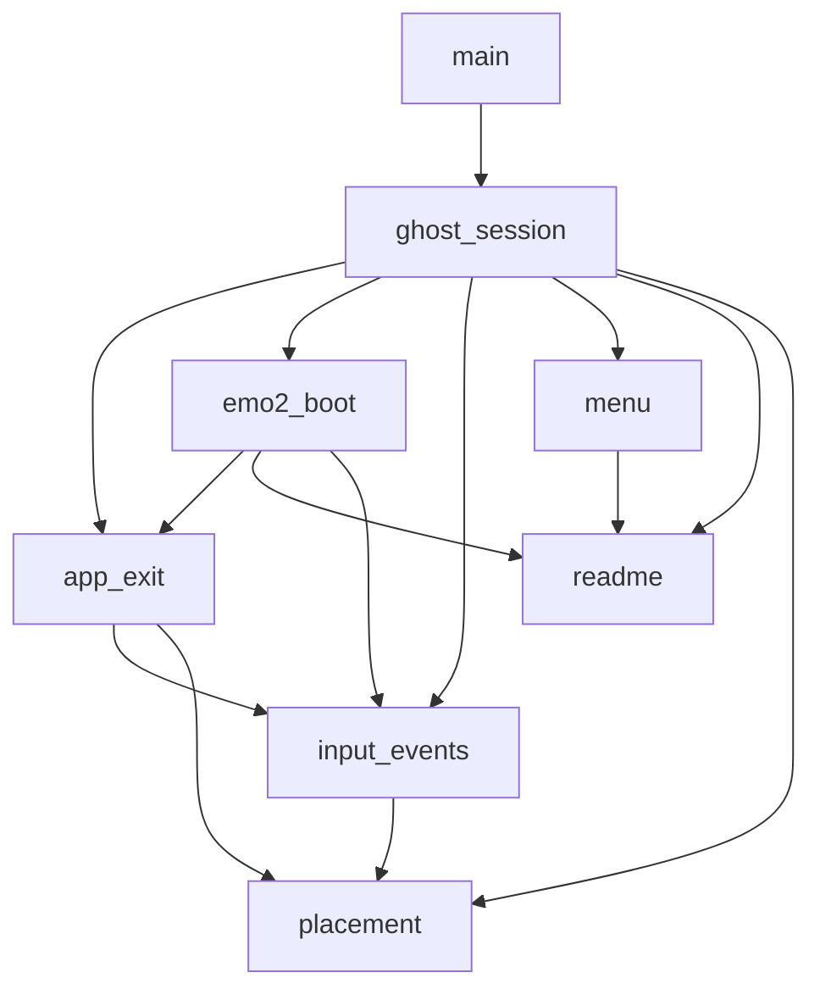
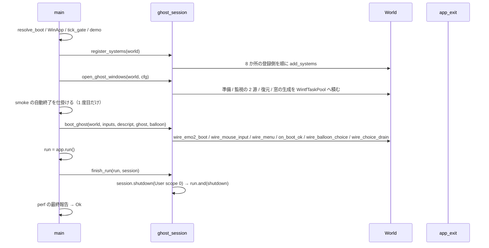
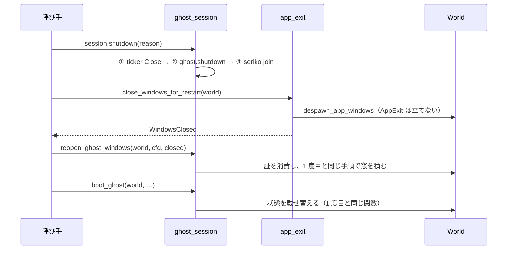

# 技術設計: areka-P0-ghost-restart-unit

> 2026-09-24 設計生成。対象コードはブランチ `claude/areka-p0-ghost-restart-a27fd7`（main `5db3672a` 相当）で読み直した。引用は「何の定義か」（関数名・型名＋ファイルパス）で指す。本文は `requirements.md` と `research.md`（ギャップ分析＋要件ディスカッションの決定）を根拠にし、`research.md` §5 の議題 2・3・5・6・7 に答える（議題 1・4 は要件ディスカッションで決着済み）。

## Overview

**Purpose**: 同じプロセスの中でゴーストを降ろして起こし直せる形にする。利用者から見える振る舞いは 1 つも変えず、「1 プロセスに 1 回だけ」を前提にした 4 つの構造だけを「n 回」へ広げる。

**Users**: 後続のゴースト切替（`areka-P0-ghost-shell-balloon-switch`・#13）・シェルとバルーンの切替（#50）・インストール直後の切替（#15）を作る開発者。

**Impact**: `fn main`（`crates/areka/src/main.rs`）にべた書きされた終了順序・起動窓・結線の呼出を、新しいモジュール `crates/areka/src/ghost_session.rs`（起こし直しの単位）へ移す。8 か所の結線は「系の登録（プロセスに 1 回）」と「ゴーストごとの状態の載せ替え」に分かれ、`app_exit.rs` に「全窓を閉じるが終了しない」操作が 1 つ増える。kanade・`areka-ghost`・wintf・examples は触らない。

### Goals
- 終了順序のゴーストごとの 3 段を、終了理由を引数に取る 1 つの関数にする（要件 1）。`app.run()` が失敗で戻る腕でもその関数を通す（台帳 #57 の相乗り・要件 7.1）。
- 8 か所の結線を「登録は 1 回・載せ替えは n 回」に分け、登録の入口を 1 本にする（要件 2）。
- 起動の結線を `&mut World` で呼べる形にし、`open_startup_window` を「登録」と「窓を作る」に分ける（要件 3）。
- 「全窓を閉じるが終了しない」操作を `app_exit.rs` に足し、呼び手を「直後に起こし直す」側へ限定する（要件 4・裁定 2）。
- 「2 周しても同じ」「閉じても終了しない」「失敗の腕でも降ろす」の 3 つの判断を決定論テストで固定する（要件 6）。

### Non-Goals
- 切替の語彙とイベント（`\![change,…]`・`OnGhostChanging`／`OnGhostChanged`・`\+`／`\_+`）・名前解決・kanade の握手・メニューの「ゴースト」枠の登記（#13）。
- シェル・バルーンの差し替え（#50）。SHIORI の失敗の告知と終了コードの改訂（#55）。
- `GhostRuntime` の中身と `crates/areka-ghost`・kanade・wintf・`crates/areka/examples`（要件 5.4）。
- `derive_scopes()` の `vec![0, 1]` 固定（`emo2_boot/mod.rs`）の是正（#13 の課題・振る舞い不変の範囲では現状維持）。

## Boundary Commitments

### This Spec Owns
- 起こし直しの単位 `crates/areka/src/ghost_session.rs`（新規）: 系の登録の入口 `register_systems`・窓を作る `open_ghost_windows`／`reopen_ghost_windows`・ゴーストごとの結線 `boot_ghost`（2 度目以降も同じ関数）・降ろす `GhostSession::shutdown`・`app.run()` の後始末 `finish_run`。
- 8 か所の結線の「登録」と「載せ替え」の分離（各ファイルの中で行い、登録関数は元のファイルに残す）。
- `app_exit.rs` の `close_windows_for_restart` と、その戻り値の型 `WindowsClosed`。
- `fn main` の並び（登録 → 窓 → smoke → 結線 → `run` → 後始末 → perf）。
- 決定論テスト 3 本と、本番ソースの字面で形を固定している既存テストの追随。

### Out of Boundary
- kanade（`crates/areka-kanade`）・`crates/areka-ghost`・wintf・examples（要件 5.4）。`GhostBootOptions` に欄を足さない（要件 5.7）。
- 終了経路（`quit_app`・`run_ghost_quit_phase`・`on_ghost_os_close`・強制退避・smoke）の判断（要件 4.6）。
- `MenuRegistry` の登記の中身（#13 が最初の登記者）。本仕様は「起こすたびに登記し直す」契約を doc に 1 行書くだけ（議題 4）。
- `#55 shiori-fault-notice` が触る告知・終了コード。共有ファイル（`main.rs`・`app_exit.rs`・`emo2_boot/frame.rs`）は #55 の着地後に settled main で引き直す。

### Allowed Dependencies
- 完了 `areka-P0-app-lifetime-separation`: `ExitPolicy::Explicit`・`quit_app`・`despawn_app_windows`（私有のまま）・`AppExit::is_requested`。
- 完了 `areka-P0-baseware-root-layout`: `on_boot_ok`・`resolve_boot`・`GhostDecision`／`BalloonDecision`。
- wintf の公開 API のうち既に使っているもの: `WintfTaskPool::spawn`（`EcsWorld::spawn` の中身と同じ経路）・`Schedules`・`AppExit`・`executor::spawn_local`。wintf は無改変。
- 既存の試験台: `emo2_boot::spine` の台本つき偽 SHIORI（`ScriptedShioriBackend`・`ScriptedShioriHandle`・`SpineHarness::standard_backend`）・有界待機（`run_bounded`・`spin_wait_until`）・`sample_test_support::acquire_emo2`。可視性を `pub(crate)` へ広げるだけで中身は変えない。

### Revalidation Triggers
- `boot_ghost`／`reopen_ghost_windows`／`GhostSession::shutdown`／`close_windows_for_restart` の署名が変わる（#13・#50・#15 が乗る契約）。
- `register_systems` に載せる系の集合か順序が変わる（`frame_schedule_tests.rs`・`zorder_wiring_tests.rs` の字面の追随が要る）。
- `Emo2BootInputs` の欄が変わる（`wire_emo2_boot` の入口）。
- `MenuWiring` を新品にしない形へ変える（議題 4 の契約が崩れる）。

## Architecture

### Existing Architecture Analysis

今日の `fn main` は次の一本道で、括弧内が本仕様で動く場所である（`research.md` §2 を再検証済み）。

1. 起動前の解決 `resolve_boot` → `WinApp::with_exit_policy(Explicit)` → `tick_gate_config` → 実走デモ（変えない）。
2. `open_startup_window(&app, &cfg)`: 準備 → 監視の 2 源 → **`FrameFinalize` へ 2 系の登録＋`wire_zorder_pair`** → 復元 → **窓の生成を非同期コマンドに積む** → **smoke の自動終了**（登録・窓・smoke が 1 関数に同居）。
3. `wire_emo2_boot(&app, …)`: 中で `app.world().borrow_mut()` を 4 回（`insert_non_send`・`add_systems`・`wire_readme`・`wire_user_break`）。
4. wired の腕: `wire_mouse_input` → `wire_menu` → `on_boot_ok` → `wire_balloon_choice` → `wire_choice_drain`。fallback の腕: `areka_ghost::boot` → `on_boot_ok`。
5. `app.run()?` → **① loop ticker 停止 → ② `GhostRuntime::shutdown` → ③ seriko join** → ④ perf の最終報告。`?` で失敗すると ①〜④ を通らない。

8 か所の結線は、どれも「状態の `insert_non_send`／`insert_resource`」と「`Schedules` への `add_systems` 1 行」が隣り合っているだけで、分離は行を 2 つの関数へ分けることに尽きる。例外は 2 つ: `wire_zorder_pair`（`placement/spawn.rs`）は状態が `ZOrderPairStrategy`＝プロセスに 1 回の設定値で**ゴーストごとの状態を持たない**、`wire_mouse_input`（`input_events/mod.rs`）は**系を登録しない**。

### Architecture Pattern & Boundary Map

採るのは `research.md` §4 の**案 C（折衷）**。各 `wire_*` の分割は元のファイルの中で行い（登録関数は同じファイルに残す＝`include_str!` の字面テストの走査先を動かさない）、新しいファイル `ghost_session.rs` には「登録の入口 1 本」と「起こし直しの単位」だけを置く。案 B（登録関数の定義まで新ファイルへ集める）を採らないのは、字面テストの走査先が増え、登録の 1 行を定義から引き離す利点が無いため。案 A（新ファイル無し）を採らないのは、`main` が登録を 8 回呼ぶ形のままでは「登録は 1 回」が構造で読めないため。



**依存方向**（左から右へだけ import する）: `placement` → `input_events` → `app_exit` → `readme`／`menu` → `emo2_boot` → `ghost_session` → `main`。`ghost_session` が使う `main.rs` 直下の私有関数（`on_boot_ok`・`restore_merged_placements`・`boot_monitor_snapshot`・`insert_persist_wiring`）は、クレートの根に定義された私有項目が子モジュールから見える規則（`emo2_boot` が `crate::is_benign_boot_error` を呼ぶのと同じ）で届く。これらは兄弟テスト（`main_restore_seam_tests.rs` ほか）が `main.rs` に繋がっているので動かさない。

**Architecture Integration**:
- 選んだ形: 「登録（プロセスに 1 回）」と「載せ替え（ゴーストごと）」を関数の境界で分け、後者を 1 つのモジュールに束ねる。
- 保った既存の形: 系はすべて自己防御（状態が無ければ無操作）なので、登録を先に済ませて状態を後から入れ替えても系は新しい状態を見る。bevy の `insert_non_send`／`insert_resource` は同型の既存資源を置き換えて古い方を落とす。
- 新しい部品の理由: `GhostSession`（3 ハンドルを束ねる型）は「降ろす」を 1 関数にするための最小の入れ物。`Emo2BootInputs` は偽の SHIORI を `wire_emo2_boot` に注入するための入口（要件 6.1 が偽の SHIORI を求める）。`WindowsClosed` は「閉じたら起こし直す」を型で結ぶ証。
- steering: 1 ファイル 1,000 行・兄弟テスト配置・`AREKA_` 名前空間・log-first（失敗経路は `error!`＋`Err`）を守る。

### Technology Stack

| Layer | Choice / Version | Role in Feature | Notes |
|-------|------------------|-----------------|-------|
| ECS | bevy_ecs 0.19（既存） | `Schedules::add_systems`・`insert_non_send` の置換意味論・`systems_len` | 新しい依存なし |
| UI 基盤 | wintf（既存・無改変） | `WintfTaskPool::spawn`・`AppExit`・`executor::spawn_local` | `EcsWorld::spawn` を経由せず資源を直接引く |
| 誤り型 | thiserror 2（既存） | `OpenWindowsError` | areka は既に依存 |

## File Structure Plan

### Directory Structure
```
crates/areka/src/
├── ghost_session.rs                 # 新規: 登録の入口・窓を作る・起こす・降ろす・run の後始末
├── ghost_session_restart_tests.rs   # 新規: 2 周テスト（要件 6.1）＋失敗の腕のテスト（要件 6.3）
├── main.rs                          # 変更: fn main の並び替え・open_startup_window の撤去・smoke を main へ
├── app_exit.rs                      # 変更: close_windows_for_restart・WindowsClosed
├── app_exit_tests.rs                # 変更: 閉じても終了しないテスト（要件 6.2）
├── readme.rs                        # 変更: wire_readme を状態だけに・register_readme_drain・path()
├── menu/mod.rs                      # 変更: wire_menu_with を状態だけに・register_menu_poll・MenuRegistry doc
├── input_events/user_break.rs       # 変更: wire_user_break を状態だけに・register_user_break_drain
├── input_events/choice_drain.rs     # 変更: wire_choice_drain を状態だけに・register_choice_drain
├── input_events/balloon.rs          # 変更: wire_balloon_choice を状態だけに・register_balloon_leave_system を pub(crate)
├── placement/spawn.rs               # 変更: wire_zorder_pair の doc（呼び手と「1 回」の言い方）だけ
├── emo2_boot/mod.rs                 # 変更: wire_emo2_boot(&mut World, Emo2BootInputs, …)・register_emo2_frame_system・Emo2BootInputs
├── emo2_boot/frame/wiring.rs        # 変更: 停止通知の受信端の生死を問う #[cfg(test)] の口
├── emo2_boot/spine.rs               # 変更: 台本つき偽 SHIORI・有界待機の可視性を pub(crate) へ（中身は不変）
├── emo2_boot/sample_test_support.rs # 変更: acquire_emo2 を pub(crate) へ
├── emo2_boot/zorder_wiring_tests.rs # 変更: t_zwi06・t_zwi08 の字面を新しい形へ
└── emo2_boot/frame_schedule_tests.rs# 変更: t_n10 の字面を新しい形へ
```

### Modified Files（責務）
- `ghost_session.rs`: 起こし直しの単位。`register_systems`／`open_ghost_windows`／`reopen_ghost_windows`／`boot_ghost`／`GhostSession`／`finish_run`／`StartupDescriptValues`（`main.rs` から移す）／`GhostBootInputs`／`OpenWindowsError`。
- `main.rs`: 器に徹する。`fn main` は「解決 → `WinApp` → 登録 → 窓 → smoke → 結線 → `run` → 後始末 → perf」。`open_startup_window`・終了順序・wired／fallback の腕を撤去し、`restore_merged_placements`・`boot_monitor_snapshot`・`insert_persist_wiring`・`on_boot_ok`・`smoke_exit_ms*` は残す。
- `emo2_boot/mod.rs`: `wire_emo2_boot` の署名を `&mut World`＋`Emo2BootInputs` にし、`add_systems(Update, …)` の 1 行を `register_emo2_frame_system` へ出す。`GhostBootOptions` のリテラルは欄を足さず、`shiori`／`ticker`／`app_profile_dir` の値だけを入力から取る。
- `app_exit.rs`: `close_windows_for_restart` を足す。`despawn_app_windows` は私有のまま、`quit_app` と共有する。
- `placement/spawn.rs`: `wire_zorder_pair` は分割しない（ゴーストごとの状態が無い）。doc の「呼び手は main.rs の起動窓シーム」「1 回だけ」を「呼び手は `ghost_session::register_systems`（プロセスに 1 回）」へ改める。`spawn_zorder_chain_wiring_tests.rs` が押さえる字面は不変。

## System Flows

### 1 度目の起動から終了まで（`fn main`）



### 起こし直し（2 周テストと #13 が踏む順）



流れの決め: **降ろしてから載せ替える**（逆だと降ろす途中の送出が新しい受信端へ届く）。`register_systems` はこの順に現れない＝起こし直しは登録を通らない。

## Requirements Traceability

| Requirement | Summary | Components | Interfaces | Flows |
|---|---|---|---|---|
| 1.1 | ゴーストごとの 3 段を 1 関数・理由を引数・perf は main 末尾 | GhostSession | `shutdown(self, reason)` | 1 度目 |
| 1.2 | 正常終了 7 種で同じ順序・同じ記録 | GhostSession・finish_run | `finish_run` | 1 度目 |
| 1.3 | fallback でも同じ関数・無い段を飛ばす | GhostSession | `Option` の 3 欄 | 1 度目 |
| 1.4 | `run` 失敗でも降ろしてから非 0 | finish_run | `run.and(shutdown)` | 1 度目 |
| 1.5 | 段の失敗は以降を飛ばし記録して返す | GhostSession | `?` の並び（今日と同じ） | — |
| 1.6 | 2 度目も同じ順序 | GhostSession | 値を消費する `shutdown` | 起こし直し |
| 1.7 | `Drop` を採らない | GhostSession | `Drop` 未実装 | — |
| 2.1 | 8 か所を登録と載せ替えに分ける | register_systems・各 `register_*`／`wire_*` | 下表 | — |
| 2.2 | 登録は二重にしない | register_systems | 呼び手は `main` の 1 か所 | 1 度目 |
| 2.3 | 載せ替えは前のものを残さない | boot_ghost | `insert_non_send` の置換・降ろしてから載せ替える | 起こし直し |
| 2.4 | `wire_mouse_input` も載せ替えの単位 | boot_ghost | 同上 | — |
| 2.5 | 「1 度」のコメントをすべて書き換える | 各 `wire_*`／`register_*` | 実装時に grep | — |
| 2.6 | `on_boot_ok` を載せ替えから呼べる | boot_ghost | `crate::on_boot_ok` | 1 度目 |
| 3.1 | 起動の結線は `&mut World` | wire_emo2_boot | `wire_emo2_boot(world, inputs, …)` | — |
| 3.2 | その形で呼ぶテストが通る | 2 周テスト | `boot_ghost` 経由 | 起こし直し |
| 3.3 | 登録と窓を作るを分ける | register_systems・open_ghost_windows | 下記 | 1 度目 |
| 3.4 | 2 度目も同じ手順で窓を作る | reopen_ghost_windows | `open_ghost_windows` に委譲 | 起こし直し |
| 3.5 | smoke は 1 度目だけ | main | `open_ghost_windows` の Ok の直後 | 1 度目 |
| 4.1 | 閉じるが終了しない操作 | app_exit | `close_windows_for_restart` | 起こし直し |
| 4.2 | AppExit を立てない・戻り値 | app_exit | `WindowsClosed` | 起こし直し |
| 4.3 | 別の語彙で info | app_exit | `event = "windows_closed_for_restart"` | — |
| 4.4 | 呼び手の限定 | app_exit・ghost_session | `#[must_use] WindowsClosed` の唯一の消費先＝`reopen_ghost_windows` | — |
| 4.5 | 同じ私有部品 | app_exit | `despawn_app_windows` | — |
| 4.6 | 終了経路は変えない | — | 無変更 | — |
| 5.1 | 起動の見え方（窓の順序と位置・記憶の書き込み・説明書とメニュー）不変 | open_ghost_windows・boot_ghost | 今日の手順を本文ごと移す | 1 度目 |
| 5.2 | 終了操作 7 種の後始末の順序・終了コード・記録の語彙不変 | GhostSession・finish_run | 記録の本文を 1 文字も変えずに移す | 1 度目 |
| 5.3 | 常設 smoke 3 方向が緑 | Testing Strategy | `WIRED`・`REAL_WINDOWS` の本文不変 | — |
| 5.4 | kanade・ghost・wintf・examples 不変 | — | 触るファイルの表 | — |
| 5.5 | 切替の語彙を持ち込まない | — | Non-Goals | — |
| 5.6 | 1,000 行 | File Structure | 見込み: main 約 500（774 から窓・結線・終了順序を出し、smoke の塊が戻る）・ghost_session 約 400・mod.rs 約 750 | — |
| 5.7 | `GhostBootOptions` に欄を足さない | Emo2BootInputs | 値の出所だけ変える | — |
| 6.1 | 2 周テスト | ghost_session_restart_tests | 判定を集めて 1 回 | 起こし直し |
| 6.2 | 閉じても終了しないテスト | app_exit_tests | `is_requested() == false` | — |
| 6.3 | 失敗の腕でも降ろすテスト | ghost_session_restart_tests | `finish_run(Err, session)` | — |
| 6.4 | 判断分岐に限る | Testing Strategy | 配線は再テストしない | — |
| 6.5 | 既存テストを落とさない・3 本は追随 | zorder_wiring_tests・frame_schedule_tests・spawn_zorder_chain_wiring_tests | 下記 | — |
| 6.6 | 兄弟配置・試験台の再利用 | ghost_session_restart_tests | spine の部品を `pub(crate)` | — |
| 7.1 | 裁定 1（#57 相乗り・#55 が先なら触らない） | finish_run | 着手時に settled main で判定 | — |
| 7.2 | 裁定 2（3.6 を上書きしない） | app_exit | `despawn_app_windows` 私有・§8 に書かない | — |
| 7.3 | 上書きが要ると分かったら議題へ | — | 設計では発生しない | — |
| 7.4 | 裁定 3（`Drop`・欄追加を採らない） | GhostSession・Emo2BootInputs | — | — |
| 7.5 | 裁定を覆すなら議題へ | — | 設計では発生しない | — |

## Components and Interfaces

| Component | Domain/Layer | Intent | Req Coverage | Key Dependencies (P0/P1) | Contracts |
|---|---|---|---|---|---|
| register_systems | ghost_session | 8 か所の登録側をプロセスに 1 回・1 か所から呼ぶ | 2.1, 2.2, 3.3 | 各 `register_*`（P0） | Service |
| open_ghost_windows / reopen_ghost_windows | ghost_session | 窓を作る側。1 度目も 2 度目も同じ手順 | 3.3, 3.4, 4.4 | `placement::prepare_ghost_windows`（P0）・`WintfTaskPool`（P0） | Service |
| boot_ghost | ghost_session | ゴーストごとの結線と状態の載せ替え（wired／fallback・2 度目以降も同じ関数） | 2.3, 2.4, 2.6, 3.2 | `wire_emo2_boot`（P0）・`on_boot_ok`（P0） | Service, State |
| GhostSession | ghost_session | 3 ハンドルの入れ物と「降ろす」 | 1.1〜1.7 | `GhostRuntime::shutdown`（P0）・`ActorHandle::join`（P0） | Service |
| finish_run | ghost_session | `app.run()` の結果と降ろす結果を合わせる | 1.2, 1.4, 7.1 | GhostSession（P0） | Service |
| wire_emo2_boot + Emo2BootInputs | emo2_boot | 起動の結線を `&mut World` で | 3.1, 5.7 | `GhostBootOptions`（P0） | Service |
| 各 register_* / wire_* | readme・menu・input_events・placement | 登録と状態の分離 | 2.1, 2.5 | `Schedules`（P0） | Service |
| close_windows_for_restart + WindowsClosed | app_exit | 全窓を閉じるが終了しない | 4.1〜4.5, 7.2 | `despawn_app_windows`（P0） | Service |

### ghost_session

#### register_systems

| Field | Detail |
|---|---|
| Intent | 系の登録をプロセスに 1 回・1 か所から行う |
| Requirements | 2.1, 2.2, 3.3 |

**Responsibilities & Constraints**
- `pub(crate) fn register_systems(world: &mut World)`。呼び手は `fn main` の 1 か所（`WinApp` 構築の後・`open_ghost_windows` の前）。起こし直しの経路（`shutdown` → `close_windows_for_restart` → `reopen` → `reboot`）には現れない。
- 載せる系と順序（今日の挿入順を保つ）: `Update` ← `emo2_boot::register_emo2_frame_system`／`Input` ← `readme::register_readme_drain` → `input_events::user_break::register_user_break_drain` → `menu::register_menu_poll` → `input_events::balloon::register_balloon_leave_system` → `input_events::choice_drain::register_choice_drain`／`FrameFinalize` ← `placement::spawn::register_ghost_windows_click_through` → `app_exit::attach_os_close_request` → `placement::spawn::wire_zorder_pair`（状態が無いので分割せずそのまま呼ぶ・起動時ログ 1 行もここで 1 回）。
- 各系の並び（`before`／`after(dispatch_pointer_events)`・`chain`）は各 `register_*` が今日のまま持つ。本関数は順に呼ぶだけ。
- **明示する差 1 件**: 今日は `Input` の 5 系（説明書・中断・メニュー・バルーンの離脱・選択肢の送り）が wired の起動でだけ登録されるが、本設計では fallback（LogSink）の起動でも登録される。5 系はどれも状態（NonSend）が無ければ `trace!`＋無操作で戻る自己防御を持つので、fallback の見え方は変わらず、既定の記録（info）にも出ない。増えるのは `RUST_LOG=trace` のときの毎フレームの無操作行だけである。

**議題 6 の答え（登録の 2 度目）**: ⒜ を採る。実行時の見張り（登録済みの印の Resource＋`warn!`）は持たない。理由: 見張りは判断分岐が 1 つ増えてテストが 1 本要るが、登録が起こし直しの経路に無いことは構造（本関数の呼び手が `main` 1 か所）で読める。要件 6.1 の判定 ⑴（2 周目の後の `systems_len()` が 1 周目の後と同じ）は「載せ替え側が系を 1 本も足さない」を固定し、それで足りる。

#### open_ghost_windows / reopen_ghost_windows

| Field | Detail |
|---|---|
| Intent | 窓を作る側。準備 → 監視の 2 源 → 復元 → 窓の生成と受け口の装着を非同期コマンドに積む |
| Requirements | 3.3, 3.4, 4.4 |

**Service Interface**
```rust
pub(crate) struct StartupDescriptValues { pub author_dpi: AuthorDpi, pub zorder_raw: Option<String> }  // main.rs から移す

#[derive(Debug, thiserror::Error)]
pub(crate) enum OpenWindowsError {
    #[error(transparent)] Placement(#[from] placement::PlacementError),
    #[error("窓を作るための作業プールが World に無い")] TaskPoolMissing,
}

pub(crate) fn open_ghost_windows(world: &mut World, cfg: &ConfigInputs)
    -> Result<StartupDescriptValues, OpenWindowsError>;
pub(crate) fn reopen_ghost_windows(world: &mut World, cfg: &ConfigInputs, closed: WindowsClosed)
    -> Result<StartupDescriptValues, OpenWindowsError>;   // 証の唯一の消費先。debug!(closed = n) を 1 行残してから open_ghost_windows へ委譲
```
- 前提: `register_systems` 済み（`Added<WindowHandle>` 駆動の系は窓より先に登録されていても取りこぼさない＝今日と同じ）。
- 手順は今日の `open_startup_window` から登録と smoke を抜いたもの。**最初に** `world.get_resource::<WintfTaskPool>()` の有無を確かめ（無ければ配置の準備に入る前に `Err(TaskPoolMissing)`＝素の `World` で決定論的に踏める）、あれば `prepare_ghost_windows` → `boot_monitor_snapshot` → `restore_merged_placements` → `world.get_resource::<WintfTaskPool>()` に `tx.send(Box::new(move |world| { 2 源の挿入 → spawn_ghost_windows → clear_default_char_pos → attach_char_pointer_handlers → menu::attach_release_handlers → attach_balloon_pointer_handlers → info!("本物のゴースト窓を開きました…") }))` を積む。`info!` の本文は smoke の目印（`REAL_WINDOWS`）なので 1 文字も変えない。
- 事後: `StartupDescriptValues` を返す（`wire_emo2_boot` へ運ぶ値の出所を 1 度の読取に揃える点は今日と同じ）。
- 失敗: `PlacementError` はそのまま包んで返す（`main` は今日と同じく「起動窓を開けません」を告知して終了コード 1）。`WintfTaskPool` が無い（本番では `EcsWorld::new` が必ず挿すので配線の誤り）は `error!(event = "task_pool_missing")` の上で `Err(TaskPoolMissing)`——`EcsWorld::spawn` が黙って何もしない形は log-first に反するので踏襲しない。

**議題 2 の答え（窓を作る側の経路）**: ⒜ を採る。素の `&mut World` から `WintfTaskPool` を引いて今日と同じ非同期コマンドに積む。理由: ⑴ 1 度目の見え方が変わらない（smoke と実機の再確認が要らない）、⑵ フレームの系の中から積んでも World の借用が衝突しない、⑶ 要件 3.4「1 度目と同じ手順」を字義どおり満たす。2 度目以降は積んだ次の tick の `Input`（`drain_task_pool_commands`）で窓が出る——これは今日の 1 度目と同じ経路であり、遅らせる細工ではない。同期経路（⒝）は見え方の再確認が要るので採らない。#13 が同期を要すると分かったときは、コマンドの中身が既に `fn(&mut World)` の並びなので、その並びを直接呼ぶ関数を足すだけで済む（本仕様では作らない）。

#### boot_ghost

| Field | Detail |
|---|---|
| Intent | ゴーストごとの結線と状態の載せ替え。wired の腕と fallback の腕を今日と同じ順・同じ記録で |
| Requirements | 2.3, 2.4, 2.6, 3.2 |

**Service Interface**
```rust
pub(crate) struct GhostBootInputs {
    pub wiring: emo2_boot::Emo2BootInputs,   // ghost_root・balloon_root・shiori・ticker・app_profile_dir
    pub helper_exe: PathBuf,                 // fallback（LogSink）の boot が使う
}
impl GhostBootInputs {
    /// 本番の値: shiori = Helper { helper_exe }・ticker = Real(既定)・app_profile_dir = Some(default_app_profile_dir())
    pub(crate) fn production(cfg: &ConfigInputs, helper_exe: PathBuf) -> Self;
}

pub(crate) fn boot_ghost(
    world: &mut World, inputs: GhostBootInputs, descript: &StartupDescriptValues,
    ghost: &GhostDecision, balloon: &BalloonDecision,
) -> GhostSession;   // 1 度目も 2 度目以降も同じ関数。証は取らない（証は窓を作る側 reopen_ghost_windows が消費する）
```
- 手順（wired）: `wire_emo2_boot(world, inputs.wiring, descript.author_dpi, descript.zorder_raw.as_deref())` → `info!("実 sink 結線で起動しました…")` → `wire_mouse_input` → `wire_menu` → `on_boot_ok` → `wire_balloon_choice` → `wire_choice_drain`。手順（fallback）: `areka_ghost::boot(ghost_boot_options(ghost_root, helper_exe))` → `info!("LogSink フォールバックで起動しました…")`／`warn!`／`error!` → `on_boot_ok`。すべて今日の `main` の腕を本文ごと移す（記録の本文は不変）。
- 載せ替えの意味論（要件 2.3）: 各状態（`Emo2Wiring`・`ReadmeWiring`・`UserBreakWiring`・`MouseWiring`・`MenuWiring`・`PersistWiring`・`BalloonWiring`／`ChoiceSelectionInbox`・`ChoiceForwarder`）は `insert_non_send` で置き換わり、古い値は落ちる。`Receiver` を持つ状態は古い受信端が落ち、古いゴーストの送出端は `Err` を返すようになる。前提として**呼び手は先に `GhostSession::shutdown` を済ませる**（下の流れ）。
- `MenuWiring` は新品になる（要件 2.3・議題 4 ⒜）。`MenuRegistry` の型 doc（`menu/mod.rs`）に「ゴーストを起こすたびに `MenuWiring` は新品になるので、登記は起こすたびにやり直す（`ghost-shell-balloon-switch` の契約）」を 1 行足す。位置を型 doc にするのは、登記の口（`register`）を読む人が必ず型を先に見るため。
- 2 度目以降の載せ替えに別名の関数（`reboot_ghost`）は置かない。証を受け取って捨てるだけの包みになり、証が 1 回しか消費できない（値渡し・`Clone` なし）のに `reopen_ghost_windows` と 2 か所で消費する矛盾を生むため（設計レビューの指摘 2）。載せ替えは `boot_ghost` そのものが n 回呼べる。

**議題 7 の答え（`GhostDecision`／`BalloonDecision` の合成）**: 合成して `on_boot_ok` を本当に通す。`GhostDecision { route: GhostRoute::Argv, dir: <検体の根>, folder: None }`・`BalloonDecision { route: BalloonRoute::Argv, dir: <同梱バルーン>, folder: None }` は `pub(crate)` の欄だけの構造体で、テストから直に組める（`boot_resolve.rs`）。`app_profile_dir: None` にすると App スコープの記憶は書く先が無く（`SpineHarness` の既存の使い方と同じ縮退）、Ghost スコープの記憶は使い捨ての検体の複製に書かれて捨てられる。`insert_persist_wiring` だけを通す形は採らない——載せ替えの単位の本文を 2 周テストと本番で違えないため。

#### GhostSession / finish_run

| Field | Detail |
|---|---|
| Intent | 3 ハンドルを束ね、「降ろす」を終了理由を引数に取る 1 関数にする。`app.run()` の後始末で必ず降ろす |
| Requirements | 1.1〜1.7, 7.1, 7.4 |

**Service Interface**
```rust
pub(crate) struct GhostSession {
    ghost: Option<areka_ghost::GhostRuntime>,
    seriko: Option<areka_actor::ActorHandle>,
    loop_ticker: Option<mpsc::Sender<areka_ghost::ticker::TickerMsg>>,
}
impl GhostSession {
    /// ① loop ticker の停止 → ② ゴースト実行系の終了（reason を渡す）→ ③ seriko の join。
    /// 無い段（None）は飛ばす。②③ の失敗は今日と同じ error! の上で Err(E_FAIL) を返し以降を飛ばす。
    pub(crate) fn shutdown(self, reason: areka_kanade::CloseReason) -> windows::core::Result<()>;
}
/// app.run() の後始末: 必ず shutdown(User { scope: 0 }) を通し、run.and(shutdown) を返す。
pub(crate) fn finish_run(run: windows::core::Result<()>, session: GhostSession) -> windows::core::Result<()>;
```
- `shutdown` の本文は今日の `fn main` の ①②③ を記録の本文ごと移す（`info!("seriko: loop ticker を Close しました…")`・`debug!`・`error!("ghost 結線層の終了統括に失敗しました")`・`error!("seriko アクターの join に失敗しました")`）。① の `drop(ticker)` も同じ。
- `finish_run` は `fn main` の `let run = app.run(); finish_run(run, session)?;` から呼ぶ。`run` が `Err` なら降ろした後にその `Err` を返す（終了コードは今日と同じ非 0）。`run` が `Ok` なら降ろす結果を返す。perf の最終報告（④）は `finish_run(...)?` の直後に `main` が今日のまま行う（早期 `return Err` の経路で最後の 1 枚が出ない性質も今日のまま）。
- `Drop` は実装しない（要件 1.7）。`GhostSession` を落としても何も起きない——降ろすのは必ず `shutdown` を呼ぶこと（doc に明記）。
- 裁定 1（要件 7.1）: B2 の着手時に settled main を見て、#55 が既に `app.run()` の `Err` の腕を終了順序へ通していれば、`finish_run` の `run.and(...)` はその形をそのまま関数の中に置くだけになり、要件 1.4・6.3 は「既に満たされている」と要件・設計の該当箇所に記す。2026-09-24 時点で #55 は brief のみ（`spec.json` 未生成）なので、本設計は採る前提で書く。

### emo2_boot

#### wire_emo2_boot + Emo2BootInputs + register_emo2_frame_system

| Field | Detail |
|---|---|
| Intent | 起動の結線を `&mut World` で呼べる形にし、系の登録の 1 行を別関数へ出す。偽の SHIORI を注入できる入口 |
| Requirements | 3.1, 3.2, 5.7 |

**Service Interface**
```rust
pub struct Emo2BootInputs {
    pub ghost_root: PathBuf,
    pub balloon_root: PathBuf,
    pub shiori: areka_ghost::ShioriWiring,          // 本番 Helper { helper_exe }・テスト Custom(偽)
    pub ticker: areka_ghost::TickerMode,             // 本番 Real(既定)・テスト Disabled
    pub app_profile_dir: Option<PathBuf>,            // 本番 Some(default_app_profile_dir())・テスト None
}
pub fn wire_emo2_boot(world: &mut World, inputs: Emo2BootInputs, author_dpi: AuthorDpi, zorder_descript: Option<&str>) -> Emo2BootOutcome;
pub fn register_emo2_frame_system(world: &mut World);   // add_systems(Update, emo2_frame_system.after(update_typewriters)); の 1 行
```
- 4 回の借用は `world.insert_non_send(wiring)`・`crate::readme::wire_readme(world, …)`・`crate::input_events::user_break::wire_user_break(world, …)` の 3 回の `&mut World` 渡しになり、`add_systems` は本関数から消える（`register_emo2_frame_system` へ）。
- `GhostBootOptions` のリテラルは欄を足さず、`shiori`・`ticker`・`app_profile_dir` の 3 値を `inputs` から取る（`ghost_root` も）。7 本の sink の並び・`boot_with_kanade_stop`・失敗の分類（`classify_wiring_error`・`is_benign_boot_error`）・`info!("emo2-boot: 実 sink 結線が成立しました（wire 成立）")` は不変。
- `Emo2BootInputs` を `emo2_boot` に置くのは依存方向のため（`ghost_session` → `emo2_boot` の向きを保つ）。`ShioriWiring::Custom` は複製できないので `inputs` は値渡し。
- `mod.rs` の `wire_tests::wire_emo2_boot_falls_back_to_unwired_on_missing_ghost_root` は `WinApp::new()` を `World::new()` に替えるだけ（存在しない根で早期に fallback を返すので World は触らない）。

### 各結線の分割（readme・menu・input_events・placement）

| 場所 | 載せ替え側（ゴーストごと・名前は今日のまま） | 登録側（プロセスに 1 回・新設） |
|---|---|---|
| `readme.rs` | `wire_readme(world, path, rx)`＝`ReadmeWiring` の挿入だけ | `register_readme_drain(world)`＝`Input` へ `drain_readme_requests.after(dispatch_pointer_events)` |
| `input_events/user_break.rs` | `wire_user_break(world, flag_rx, lifecycle_tx, kanade)`＝`UserBreakWiring` の挿入だけ | `register_user_break_drain(world)`＝`Input` へ `drain_no_user_break_signals.before(dispatch_pointer_events)` |
| `input_events/choice_drain.rs` | `wire_choice_drain(world, kanade)`＝`ChoiceForwarder` の挿入だけ | `register_choice_drain(world)`＝`Input` へ `drain_choice_selections.after(...)` |
| `input_events/balloon.rs` | `wire_balloon_choice(world)`＝channel＋`BalloonWiring`／`ChoiceSelectionInbox` の挿入だけ | 既存の私有 `register_balloon_leave_system(world)` を `pub(crate)` に（中身不変） |
| `menu/mod.rs` | `wire_menu(world, kanade)`／`wire_menu_with(world, wiring)`＝組込 2 項目の登記＋`MenuWiring` の挿入だけ | `register_menu_poll(world)`＝`Input` へ `trigger::poll_menu_query.after(...)` |
| `emo2_boot/mod.rs` | `wire_emo2_boot`（上） | `register_emo2_frame_system(world)` |
| `placement/spawn.rs` | **無し**（`ZOrderPairStrategy` はプロセスに 1 回の設定値・ゴーストごとの状態を持たない） | `wire_zorder_pair(world)` を分割せずそのまま登録側として呼ぶ（名前も字面も不変） |
| `main.rs` の `open_startup_window` | 窓を作る側 → `ghost_session::open_ghost_windows` | `FrameFinalize` の 2 系＋`wire_zorder_pair` → `ghost_session::register_systems` |
| `input_events/mod.rs` | `wire_mouse_input(world, sender)`（不変） | **無し**（系を登録しない） |

- 各登録関数は `world.resource_mut::<Schedules>().add_systems(...)` の 1 行だけを持つ。並びの指定（`before`／`after`）は今日のまま同じファイルに残る。
- 「1 度しか呼ばれない」を明記したコメント（要件 2.5）は、`grep -n -E "1 度しか|1 回だけ|1 回・同期|1 回の実行につき|schedule 実行外で 1 回"` を `main.rs`・`emo2_boot/mod.rs`・`menu/mod.rs`・`readme.rs`・`input_events/{mod,user_break,choice_drain,balloon}.rs`・`placement/spawn.rs` に掛けて該当箇所をすべて引き直し、「登録は `register_systems` からプロセスに 1 回・載せ替えは `boot_ghost` からゴーストごと」の言い方へ改める。2026-09-24 の実測では `emo2_boot/mod.rs`（`wire_readme`・`wire_user_break` の前提 2 か所）・`menu/mod.rs`（`wire_menu` doc）・`user_break.rs`・`choice_drain.rs`・`balloon.rs`（冒頭 doc と `wire_balloon_choice` doc の 2 か所）・`spawn.rs`（`wire_zorder_pair` doc）・`main.rs`（wired の腕の 2 か所＝移動で消える）が該当し、数は実装時の grep を正とする。

### app_exit

#### close_windows_for_restart + WindowsClosed

| Field | Detail |
|---|---|
| Intent | 全ゴースト窓を閉じるが終了は指示しない。呼び手を「直後に起こし直す」側へ限定する |
| Requirements | 4.1〜4.5, 7.2 |

**Service Interface**
```rust
/// 起こし直しのために全窓を閉じた証。作れるのは close_windows_for_restart だけ（欄は私有）。
/// 消費先は ghost_session::reopen_ghost_windows の 1 つに限る（値渡し・Clone なし＝1 回しか消費できない）。
#[must_use = "閉じた窓は起こし直しへ続けること（reopen_ghost_windows へ渡す）"]
pub(crate) struct WindowsClosed { closed: usize }
impl WindowsClosed { pub(crate) fn closed(&self) -> usize; }

pub(crate) fn close_windows_for_restart(world: &mut World) -> WindowsClosed;
```
- 本文: `let closed = despawn_app_windows(world);`（`quit_app` と同じ私有部品・要件 4.5）→ `info!(event = "windows_closed_for_restart", closed, "[close_windows_for_restart] 起こし直しのために全窓を閉じた（終了は指示しない）")` → `WindowsClosed { closed }`。`AppExit` には触れない（要件 4.2）。語彙は `app_exit` 事象と別（要件 4.3）。
- 事後条件: `GhostWindowMarker` を持つ entity は 0・`AppExit::is_requested()` は呼ぶ前と同じ。

**議題 3 の答え（呼び手の限定の形）**: ⒜ を採る。⒝（`pub(in crate::ghost_session)`）は Rust の可視性が**祖先モジュールにしか絞れない**ため、`app_exit.rs` の項目を兄弟の `ghost_session` へ絞ることはできない（`app_exit` を `ghost_session` の子に移せば可能だが、#55 と共有するファイルを動かすことになる）。⒞（doc と `#[must_use]` だけ）は続きを組ませる力が無い。⒜ は「呼べるが、戻り値の唯一の消費先が起こし直しの側なので、続きを組まざるを得ない」形で、`quit_app` の代わりに呼んで終わりにする使い方が `#[must_use]` の警告と型の消費先の無さで露わになる。証は値渡しで 1 回しか消費できないので、消費先は `reopen_ghost_windows` の 1 つに定める（載せ替え側は証を取らない）。完了 `app-lifetime-separation` 要件 3.6「片方だけを呼ぶ形を残さない」は、`despawn_app_windows` が私有のまま・`quit_app` は不変・新しい口は終了経路のどこからも呼ばれない（`main`・`frame.rs`・`app_exit.rs` の終了経路に呼び手を置かない）ことで守る＝上書きではないので `doc/COMPAT_ARCHITECTURE.md` §8 には書かない（要件 7.2）。

## Data Models

### Domain Model
- **プロセスに 1 回のもの**: 系の登録（`Schedules` の中身）・`ZOrderPairStrategy`・クリック透過の登録・perf の報告スレッド・smoke の自動終了。`register_systems` と `main` が所有する。
- **ゴーストごとのもの**: `GhostSession`（ゴースト実行系・seriko・loop ticker）と 9 つの World 上の状態（`Emo2Wiring`・`ReadmeWiring`・`UserBreakWiring`・`MouseWiring`・`MenuWiring`・`PersistWiring`・`BalloonWiring`・`ChoiceSelectionInbox`・`ChoiceForwarder`）。`boot_ghost` が置き、`shutdown`＋次の `boot_ghost` の置換で入れ替わる。
- **窓**: `GhostWindowMarker` を持つ entity。`open_ghost_windows` が積み、`close_windows_for_restart`／`quit_app` が消す。
- 不変条件: 起こし直しの順は必ず「降ろす → 閉じる → 窓を積む → 載せ替える」。`register_systems` はこの順に含まれない。

## Error Handling

### Error Strategy
- 変えない: `shutdown` の ②③ の失敗（`error!`＋`Err(E_FAIL)`・以降を飛ばす）、① の失敗（`debug!`）、`wire_emo2_boot` の失敗の分類、fallback の `warn!`／`error!`。
- 足す: `OpenWindowsError::TaskPoolMissing`（`error!(event = "task_pool_missing")`＋`Err`）。`main` の腕は今日の `PlacementError` と同じく「起動窓を開けません」の告知＋終了コード 1。
- `finish_run` は `run` の `Err` を優先して返す（降ろす側の `Err` は記録に残った上で捨てる）。両方 `Err` でも非 0 は変わらない。

### Monitoring
- 記録の本文は移すだけで変えない（smoke の目印 `WIRED`・`REAL_WINDOWS`・起動解決の行・`app_exit` 事象）。新しい語彙は `windows_closed_for_restart`（info）・`task_pool_missing`（error）・`reopen_ghost_windows` の `debug!(closed = n)` の 3 つで、いずれも今日の経路には現れない。

## Testing Strategy

判断分岐だけを固定し、配線（閉じる → 登録表から外れる・終了の指示 → ループが終わる・kanade の握手・seriko の join）は再テストしない（要件 6.4）。試験台は既存のものを `pub(crate)` に広げて再利用し、複製しない（要件 6.6）。

### 決定論テスト（新規 3 本）

1. **2 周テスト**（`ghost_session_restart_tests.rs`・要件 6.1・3.2・1.6）
   - 台: `CoInitializeEx(MTA)` → `World::new()`＋`init_resource::<Schedules>()`＋`insert_non_send(AppExit::new())`＋`GhostWindowMarker` の entity を 2 つ（窓の代わり）。`WintfTaskPool` は挿さない（窓を作る側は通さない）。
   - 偽の SHIORI と偽の資産: `spine::SpineHarness::standard_backend("\\s[0]\\e")`（`ScriptedShioriBackend`＋`ScriptedShioriHandle`）を `ShioriWiring::Custom` で、`sample_test_support::acquire_emo2()` の複製を根に、`TickerMode::Disabled`・`app_profile_dir: None` で `GhostBootInputs` を組む。周ごとに新しい台本と新しい複製を使う（複製は起動記録の無い新品なので毎周 `OnFirstBoot` から始まる）。
   - 手順: `register_systems` → 各段の `systems_len()` を控える → 1 周目 `boot_ghost` → 1 周目の `MenuWiring` へ余分な登記を 1 つ入れる（`menu::register`）→ `run_bounded` で `session.shutdown(User { scope: 0 })` → `close_windows_for_restart`（窓を作る側は通さないので、証は `closed()` を読んで束縛のまま落とす＝`let` に束縛した値は `#[must_use]` の警告対象にならない。証の消費先の型検査は本番の呼び手側で効く）→ 2 周目 `boot_ghost`。
   - 判定（集めてから 1 回・面ごとに止めない）: ⑴ `Input`／`Update`／`FrameFinalize` の `systems_len()` が控えと同じ／⑵ `ReadmeWiring::path()` が 2 周目の根の下・`MenuWiring` の登記が組込 2 項目だけ（1 周目の余分な登記が消えている）・`Emo2Wiring` の停止通知の受信端と `UserBreakWiring` の旗の受信端がつながっている。**「つながっている」の定義**: `try_recv` を `Err` が出るまで回し、最後の `Err` が `Empty` なら新しい（送出端が生きている）・`Disconnected` なら古い（1 周目の送出端は 1 周目の終了で落ちた）。1 周目の受信端には未読の値が残る（kanade は終了系列で `KanadeStopped` を必ず 1 件送る・`NoUserBreakCueSink` はトークごとに `TalkStarted` を送る）ので、「1 度の `try_recv` が `Disconnected` でなければ新しい」では古い受信端も `Ok(_)` を返して緑になってしまう（設計レビューの指摘 1）／⑶ `AppExit::is_requested() == false`。判定は 1 つの `assert!` に失敗の一覧を渡す形で行う。
   - 証拠の面が無い状態（`MouseWiring`・`ChoiceForwarder`・`PersistWiring`・`BalloonWiring`／`ChoiceSelectionInbox`）は **0 面**である——kanade の送出端や sylphya の投函端には副作用無しで生死を問う口が無い。これらは上の 4 面と同じ直線の手順（`boot_ghost` の wired の腕）で挿されるので、4 面が新しければ同じ手順を通ったことになる。
   - 後片付け: 2 周目の `session.shutdown` → `close_windows_for_restart`（証は捨てる）。すべて有界（`run_bounded`）。実時計の loop ticker は `shutdown` ① が止める。
   - `pub(crate)` へ広げるもの: `emo2_boot::spine`（`mod` 自体）・`ScriptedShioriBackend`／`ScriptedShioriHandle`／`SpineHarness::standard_backend`／`run_bounded`／`spin_wait_until`・`sample_test_support::acquire_emo2`。中身は変えない。`spine.rs` は 971 行なので行を足さない（可視性の語を足すだけ）。
   - 足す小さな口（テスト専用・`#[cfg(test)]`）: `ReadmeWiring::path(&self) -> &Path`・`Emo2Wiring::kanade_stop_connected(&mut self) -> bool`・`UserBreakWiring::flag_source_connected(&mut self) -> bool`（2 つとも本文は上の「空になるまで回して最後の `Err` を見る」）・`MenuRegistry::registered_frames(&self) -> Vec<Frame>`。
   - 較正: 実装時に**載せ替えをわざと省いた状態**（2 周目の `boot_ghost` を呼ばない）で 1 度赤を確認してから戻す（検証の道具そのものが壊れていないことを既知の赤で確かめる・戻したら touch）。
2. **閉じても終了しない**（`app_exit_tests.rs`・要件 6.2・4.2）: `GhostWindowMarker` の窓 3 枚＋印の無い entity 1 つ＋`AppExit::new()` の World で `close_windows_for_restart` → 集めて 1 回で判定: 窓 0 枚・印の無い entity は残る・`is_requested() == false`・`closed() == 3`。
3. **失敗の腕でも降ろす**（`ghost_session_restart_tests.rs`・要件 6.3・1.4）: 1 周テストと同じ台で `boot_ghost` → `finish_run(Err(E_FAIL), session)` → 判定: 戻り値が `Err`・台本の発火列に `OnClose`／`Unload` がある（降ろす関数が本当に走った証拠）。`WinApp::run` は触らず、`Result` を引数に取る純粋な関数で偽の失敗を作る（要件 5.4）。`finish_run` の本文は `run.and(session.shutdown(...))` と書く（`Result::and` は引数の値を先に評価するので降ろす側は必ず走る）。`run.and_then(|_| ...)` にすると `Err` の腕で降ろさなくなるので書かない。
4. **作業プールが無ければ窓を作らず失敗する**（`ghost_session_restart_tests.rs`・log-first の新しい判断分岐）: `WintfTaskPool` を挿していない素の `World` で `open_ghost_windows` を呼び、`Err(OpenWindowsError::TaskPoolMissing)` を主張する。上の「最初に有無を確かめる」順序のおかげで配置の準備（モニタ・DPI）に入らずに決定論で踏める。

### 既存テストの追随（要件 6.5・削除しない）
- `emo2_boot/zorder_wiring_tests.rs` `t_zwi08`: 走査先を `include_str!("../ghost_session.rs")` に替え、押さえる字面を `let zorder_raw = prepared.zorder_raw.clone();`・`open_ghost_windows` の戻りを受ける行・`descript.author_dpi, descript.zorder_raw.as_deref(), );`（`wire_emo2_boot` への末尾 2 引数）に改める。対照の語（「説明文が落ちていない」の番兵）は `ghost_session.rs` の doc に用意する。`t_zwi06` は `app.world().borrow_mut().world_mut().insert_non_send(wiring);` を `world.insert_non_send(wiring);` に改める。`t_zwi05`・`t_zwi09` は `mod.rs` 内の字面（channel・sink・`sinks: vec![…]`・`seed_zorder_descript_base` の位置）が動かないので不変。
- `emo2_boot/frame_schedule_tests.rs` `t_n10`: `BOOT_REGISTRATION` の 1 行は `mod.rs` の `register_emo2_frame_system` の中に残るので緑。`pub fn wire_emo2_boot(` の名前も保つ。
- `placement/spawn_zorder_chain_wiring_tests.rs`: `wire_zorder_pair` の署名も `FrameFinalize, (…).chain(),` も動かさないので**無変更で緑**（追随の対象だが編集は 0 件）。
- `emo2_boot/mod.rs` `wire_tests`: `WinApp::new()` → `World::new()`。
- 常設 smoke `tests/smoke_boot_loop_exit.rs` 3 方向: 記録の本文と順序を変えないので緑（要件 5.3）。
- 実装時の申し送り: ⑴ `open_startup_window` の名は doc の中でも参照されている（`input_events/mod.rs`・`menu/mod.rs`・`placement/chain_finalize.rs`・`placement/spawn.rs`・`emo2_boot/mod.rs` の `derive_scopes` doc）ので、要件 2.5 の grep 語に `open_startup_window` も足して言い換える。⑵ `register_emo2_frame_system` の登録行は `t_n10`／`t_zwi06` が `add_systems(Update, emo2_frame_system.after(update_typewriters));` の 1 行として押さえる——`world.resource_mut::<Schedules>().add_systems(...)` へ書き換えると rustfmt が鎖を折るので、`frame_schedule_tests.rs` の `register_like_the_boot` と同じ折り方で末尾の 1 行を保ち、実装後に両テストを回す。

### 実機
- 実機の再確認は要らない（1 度目の経路は今日と同じ）。念のため `cargo run -p areka` で起動 → メニューの「終了」→ 終了コード 0 と `app_exit` 事象の 1 走行を実装完了の証跡に添える。

## Open Questions / Risks
- **hang の危険**: 2 周テストは実検体＋実スレッド（seriko・文字層の UI アクター・実時計の loop ticker）を同じプロセスで 2 度起こす。後片付けは `SpineHarness::shutdown_bounded` の順（shutdown → 送出端の drop → seriko の有界 join）を `GhostSession::shutdown` が自然に踏む（① で ticker を止め、② で dispatcher 側の送出端が落ち、③ で join）。文字層の UI アクターは `spawn_local` の使い捨てで、pump を回さない限り何もせず落ちる（`areka_actor::spawn_ui` の doc）。
- **`LastUsed::record` の縮退**: `app_profile_dir: None` で App スコープの記憶を書くと sylphya 側の記録（縮退の `debug!`／`warn!`）が出る。テストは記録を判定しないので無害だが、実装時に赤い `error!` が出ないことを 1 度目視する。
- **`#[must_use]` は警告**: 証を式文として捨てる呼び手はコンパイル警告になる（`-D warnings` ではない・`let` に束縛して落とすと警告は出ない）。構造の限定は「消費先が `reopen_ghost_windows` の 1 つしか無い」ことが本体で、警告は補助。
