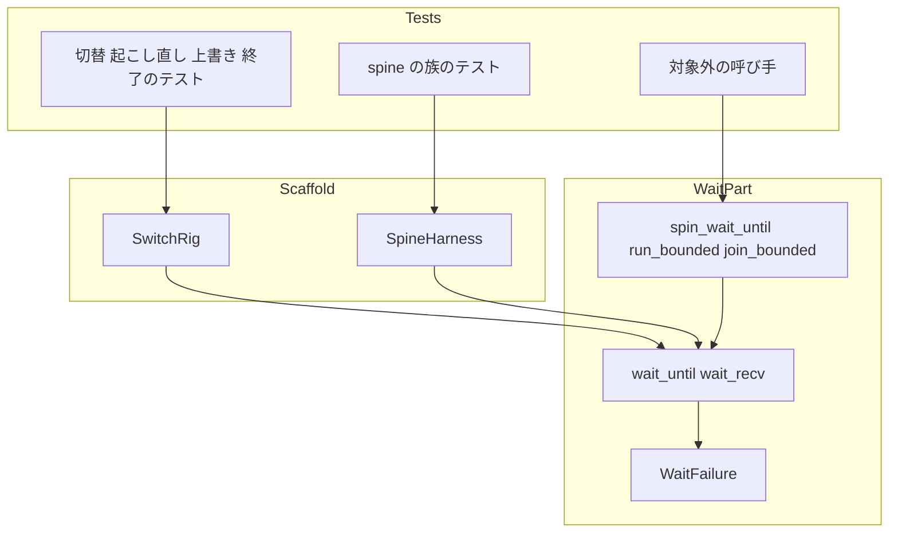
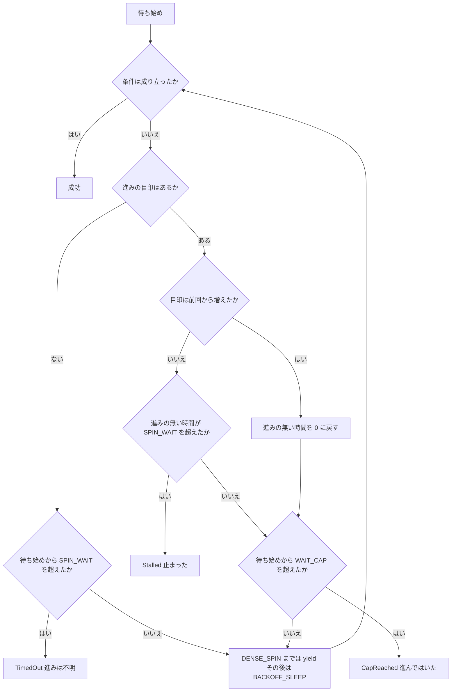
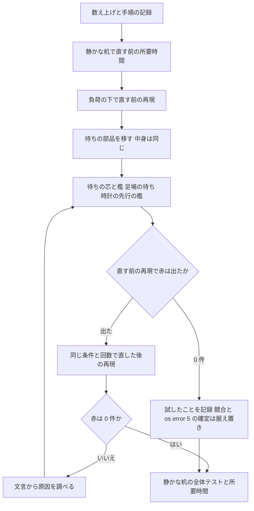

# Design Document

## Overview

**Purpose**: 機械が重いときに、ゴーストの切り替え・起こし直し・上書きのインストール・終了まわりのテストが「負荷で遅いだけ」で赤になるのを止め、赤になったときは文言から「負荷で遅い」と「止まった」を見分けられるようにする。

**Users**: 複数のワークツリーを並べて走らせる開発者と、実装の手順（`/kiro-impl` のレビュー・`/kiro-complete` の全体テスト）。

**Impact**: テストの待ちの部品（`emo2_boot/spine.rs` の `spin_wait_until`・`run_bounded`・`join_bounded` と、切替の足場 `SwitchRig` の待ち）の打ち切りの決め方を、「待ち始めからの総時間」から「相手が状態を進めなかった時間」へ変える。待っている間の空回しを時間で区切って CPU を返す。本番の処理は変えない。

設計の時点で cargo のビルドとテストは回していない（他のセッションと机を共有しているため）。下の「今あるもの」の記述は、すべてファイルと定義の名前で確かめたものである。実測が要る値（空回しの窓・所要時間）は、初期値と、実装で測り直す手順を決めてある。

### Goals

- 対象の族の待ちは、相手が状態を進めている限り実時間だけを理由に赤にならない（2.1）。
- 待ちが届かずに終わったとき、何を・何秒・相手が進んだかが失敗の文言に出る（3.1・3.2）。
- 待っている間に、同じ実行ファイルの他のテストの相手を飢えさせない（2.5）。
- 負荷をかけて赤を起こす手順が 1 つあり、直す前と後に同じ条件で回せる（1・6）。

### Non-Goals

- 本番のゴーストの切り替え・起こし直し・降ろしの振る舞いの変更（再現で本物の競合が見つかった場合を除く）。
- `tools/test-all.ps1` の並列度の変更、回し直しで赤を隠す仕組み。
- 赤の観測が無い待ち（他の crate の同じ名前の `run_bounded`／`join_bounded`・`install/` の自前の `join_bounded`・`spine_*_tests.rs` が自前で持つ Tick 注入の待ち・`session_end_deadline_tests.rs` が確かめる本番の実時間の締切）。再現の手順で赤になったものだけを対象に加える。
- `zorder-chain-residue` に残る族、`areka-test-threads-av` の範囲。

## Boundary Commitments

### This Spec Owns

- 待ちの部品の新しいファイル `emo2_boot/spine_wait.rs`（打ち切りの決め方・失敗の文言・空回しの区切り）。
- 切替の足場 `SwitchRig`（`emo2_boot/ghost_switch_test_support.rs`）の待ち方と、進みの目印。
- 対象の族のテストのファイルが自前で持つ待ち（`ghost_session_restart_tests.rs` の `run_input_until`・`emo2_boot/frame_ghost_quit_switch_tests.rs` の `wait_steady`）の、共通の部品への寄せ。
- 負荷の再現の手順 `tools/load-flake.ps1` と、その記録 `load-repro.md`。
- 条件つき: 作業フォルダの後片付け（`crates/sample-ghost-kit/src/devroot.rs` の `WorkDir` の破棄の順・`discard_tree`）。再現の記録が「同時の利用による os error 5」を示したときだけ直す（5.2）。

### Out of Boundary

- `emo2_boot/mod.rs`・`emo2_boot/frame/` の下・`emo2_boot/ghost_switch.rs` の本番の処理（同じウェーブの他の spec の持ち物）。本設計はどれにも触らない。
- `areka-ghost`（dispatcher）・`areka-sakura`（台詞の再生）・`areka-kanade` の本番のコード。時刻の受け取りの知らせを足す案は採らない（「2.6 の満たし方」）。
- 1 ファイル 1,000 行の番人の例外表、テスト用一時パスの見張りの例外表。
- `spin_wait_until` を呼ぶだけの対象外のテスト（`mcp/dump_surface.rs` の `WaitAnswer` など）の書き換え。呼び名と形を保つので、呼び手は変えない。

### Allowed Dependencies

- `std` だけ（`std::sync::mpsc`・`std::time`・`std::panic::Location`）。新しい crate は足さない。`Cargo.toml`・`Cargo.lock` に触らない。
- 進みの目印は、テストの持ち物（偽の SHIORI の記録 `ScriptedShioriHandle`・足場の起動の台帳）からだけ数える。本番のコードに数え口を足さない。
- 条件つき（2.7）: `wintf` には `WintfTaskPool` の作り口 `with_threads(n)` を 1 つ足すだけ（足し算。今の `new()` と本番の呼び手は変えない）。下の「足場のスレッドの絞り」。
- 向き: `spine_wait.rs`（何にも依存しない）← `spine.rs`（出し直し）← `ghost_switch_test_support.rs` ← 各テスト。`spine_wait.rs` は `SwitchRig` や偽の SHIORI を知らない。

### Revalidation Triggers

- `spin_wait_until`・`run_bounded`・`join_bounded` の呼び名・引数・戻り値を変えるとき（呼び手 20 ファイルを見直す）。
- 足場の時計の注入が、dispatcher の `DispatcherMsg::Tick` 以外（特に kanade の `KanadeMsg::Tick`）へ時刻を届けるようになるとき（「2.6 の満たし方」の前提が崩れる）。
- 定数 `SPIN_WAIT`（進みの無い時間の上限）・`WAIT_CAP`（総時間の上限）・`DENSE_SPIN`（空回しの窓）を変えるとき（所要時間の確かめ 6.5 をやり直す）。
- `sample-ghost-kit` の作業フォルダの札の決まり（札が先・木が見えている間は札が開いている）を変えるとき。

## Architecture

### Existing Architecture Analysis

確かめた事実（ファイルと定義の名前）。

| 事実 | 場所 |
|---|---|
| `spin_wait_until` は 30 秒（`SPIN_WAIT`）の総時間で打ち切る。最初の 1,000,000 回（`SPIN_YIELD_BUDGET`）は `yield_now` の空回し、その後に 1 ms（`BACKOFF_SLEEP`）の sleep。成否の真偽だけを返す | `emo2_boot/spine.rs` の `spin_wait_until` |
| `run_bounded`・`join_bounded` は呼び手が渡した総時間で打ち切り、「何を・何秒」だけを出して panic する | `emo2_boot/spine.rs` |
| 足場の `pump_until`・`pump_talking_until`・`pump_input_until` は `spin_wait_until` の条件の中で毎回 ECS の段（`run_ghost_quit_phase`・`drain_change_requests`・`world.run_schedule(Input)`）を回す。1 回が重いので 100 万回の空回しを使い切る前に待ちが終わるか 30 秒に届く＝待っている間ずっと 1 コアを使う | `emo2_boot/ghost_switch_test_support.rs` の `SwitchRig` |
| `wait_steady` は `recv_timeout`（20 秒）で眠って待つ。先に別の通知が来ると、何が来たかを捨てて `false` | 同上 |
| `pump_talking_until` は実時間 1 ms（`TICK_EVERY`）ごとに合成の時計を 100 ms（`TICK_STEP_MS`）進め、置き場のゴーストの dispatcher へ `DispatcherMsg::Tick` を送る。上限は無い | 同上 |
| dispatcher は `Tick` を、再生中の台詞へ「その台詞が最初に見た Tick からの経過秒」に直して渡すだけで、kanade へは渡さない。再生中の台詞が無ければ何もしない | `crates/areka-ghost/src/dispatcher.rs` の `DispatcherState::on_tick` |
| kanade へ `KanadeMsg::Tick` を送るのは本番の ticker と、適合の周回の駆動器だけ。足場は `TickerMode::Disabled` で起こすので、足場のゴーストの kanade は Tick を 1 つも受け取らない | `crates/areka-ghost/src/ticker.rs`・`emo2_boot/spine_conformance_support.rs` の `StageSink for SpineHarness`・足場の `GhostBootInputsSource` |
| kanade の合成の締切（送り出しの台詞の再生完了待ち `close_talk_deadline_ms` ＝ 30,000 ms・選択肢の待ち）は、kanade が受け取った Tick でだけ数える | `crates/areka-kanade/src/schedule/change.rs`・`close.rs`・`steady.rs` |
| 起こし直しのテストの `run_input_until` は 10 秒の総時間・`yield_now` だけの空回し（sleep へ落ちない） | `ghost_session_restart_tests.rs` |
| `frame_ghost_quit_switch_tests.rs` は同じ名前の自前の `wait_steady`（20 秒・別の通知は読み飛ばす）を持つ | `emo2_boot/frame_ghost_quit_switch_tests.rs` |
| 待ちが `false` を返すことを期待するテスト（`!rig.pump_…`・`!spin_wait_until`・`!rig.wait_steady`）は 0 件 | `git grep`（`crates/areka/src`・設計の時点） |
| `spine.rs` は 1,000 行ちょうど。`#[cfg(test)]` のモジュールで、兄弟のテストは `spine.rs` の末尾の `#[path]` の宣言でつながる | `emo2_boot/spine.rs`・`emo2_boot/mod.rs` |
| `WorkDir` の破棄は ⑴ 札を閉じる ⑵ 木を消す ⑶ 札を消す の順。`discard_tree` が作る `gc-…` の木には札が無い。掃除 `sweep` は「札を消せた＝持ち主が居ない」と読み、札の無い木を退避する。失敗は標準エラーへ出すだけ | `crates/sample-ghost-kit/src/devroot.rs` |

これから分かること。

- **足場の待ちは今、待っている間ずっと空回しである**（2.5 の欠け）。同じ実行ファイルの中で数十本のテストが同時に 1 コアずつ使い、互いの相手（kanade・dispatcher・SHIORI の各スレッド）を飢えさせる。
- **打ち切りは総時間だけで決まる**（2.1 の欠け）。相手が進んでいても 30・20・10 秒で赤になる。
- **足場の時計の追い越しで kanade の合成の締切が切れることは、構造上起きない。** 足場の kanade は Tick を受け取らないからである。ギャップ分析の候補 3（`change_deadline_exceeded` が足場で出る）は、足場については成り立たない。

### Architecture Pattern & Boundary Map



**Architecture Integration**:

- 選んだ形: ギャップ分析の案 C（部品を `spine.rs` の子のファイルへ出し、呼び名を保って中身を差し替え、足場と自前の待ちだけ形を変える）。待ちの芯は 1 つ（`wait_until`／`wait_recv`）で、古い呼び名はその薄い包みになる。
- 境界: 待ちの部品は「いつ打ち切るか・何と言うか」だけを決める。「相手が進んだか」の数え方は呼び手（足場）が渡す。
- 保つもの: `spine.rs` の doc が定める規律（反復の回数で打ち切らない・長引いたら CPU を返す）、時計を差し替える継ぎ目の型（`settle_bounded_with`）、型つきの失敗の型（`StageFailure`）。
- 新しい部品の理由: 打ち切りを「進みの無い時間」で決めるには、進みの目印を受け取る口が要る。今の `spin_wait_until(cond)` には無い。
- steering: テストは実装の兄弟ファイル・1 ファイル 1,000 行以下・一時の場所はワークツリーの `target\` の下だけ。

### Technology Stack

| Layer | Choice / Version | Role in Feature | Notes |
|-------|------------------|-----------------|-------|
| テストの土台 | Rust `std`（今の版のまま） | 待ちの部品・足場 | 依存を足さない |
| 再現の手順 | PowerShell 7（`tools/load-flake.ps1`） | 負荷を作って対象のテストを回し、記録を残す | `tools/test-all.ps1` は変えない |

## 設計の決定

ギャップ分析の論点 1〜10 と、要件の討議で足した論点（所要時間の目安）への答え。

| 論点 | 決定 |
|---|---|
| 1 直し方の向き | 両方。打ち切りを「進みの無い時間」で決め（観測）、届かなかったときは文言で見分ける |
| 2 文言の出し場所 | 新しい芯は型つきの失敗 `WaitFailure` を返す。`bool` を返す古い呼び名（`spin_wait_until`・足場の `pump_*`・`wait_steady`）は形を保ち、打ち切ったときに失敗の文言を `eprintln!` で標準エラーへ 1 行出してから `false` を返す（テストの実行器が拾える出し方に限る。実行器は赤のテストの標準エラーを失敗の報告に載せる）。`run_bounded`・`join_bounded` は今どおり panic の文言に入れる |
| 3 進みの目印 | 単調に増える数 1 つ（`u64`）。足場は「ゴーストの作り口が呼ばれた回数＋起こした全部の偽の SHIORI が受けた呼び出しの数（状態の問い合わせは除く）」。状態の問い合わせを除くのは、SHIORI のアクターが手の空いている間 500 ms ごとに問い合わせる（`areka-kanade` の `run_shiori_loop`・`IDLE_INTERVAL`）ので、数えると止まっていても目印が増え続けるからである。目印を持てない呼び手は「目印なし」と明示する |
| 4 「止まった」までの時間 | 進みの無い時間の上限 `SPIN_WAIT` ＝ 30 秒（今の定数をそのまま使う）。総時間の上限 `WAIT_CAP` ＝ 300 秒。目印なしの待ちは `SPIN_WAIT` を総時間として使う（今と同じ） |
| 5 CPU を占めない | 空回しの予算を回数から時間へ変える（`DENSE_SPIN` ＝ 60 ms）。それを過ぎたら 1 回ごとに `BACKOFF_SLEEP`（1 ms）で CPU を返す。受け口を待てる所（`wait_steady`・`run_bounded`）は `recv_timeout` で眠って待つ。足場のスレッドの数と同時の数を絞るのは 2.7 の条件を満たしたときだけ（下の「足場のスレッドの絞り」） |
| 6 合成の時計の頭打ちの形 | 数値の頭打ちは置かない（設計の討議で裁定・要件 2.6 の文を改めた）。足場が注入する時刻の受け手を「届いた順に消化し、締切を持たない相手」（dispatcher から再生中の台詞へ）だけに限る構造で守り、檻で固定する（下の「2.6 の満たし方」） |
| 7 対象の範囲 | 要件のとおり。赤の観測が無い待ちは触らない。再現で赤になったものだけ加える |
| 8 部品の置き場 | `spine.rs` の子のモジュール（`#[path = "spine_wait.rs"]`）。`emo2_boot/mod.rs` に触らない |
| 9 再現の手順 | スクリプト `tools/load-flake.ps1`（下の「LoadRepro」） |
| 10 os error 5 | 再現の記録で原因を見分けてから。同時の利用によるなら 2 か所を直す（下の「WorkDirCleanup」） |
| 所要時間の目安（6.5） | 直した後が直す前の 1.20 倍を超えたら「目立って延びた」（下の「Performance」。初めは 1.10 倍だったが、2026-10-08 に開発者が 1.20 倍へ改めた＝GPU の装置の許可の数との釣り合い・`load-repro.md` の 5） |

### 2.6 の満たし方

要件 2.6 は、起票時には「注入する合成の時刻を、相手がそれまでの時刻を処理し終えた観測より先へ進めない（相手が飢えている間に合成の締切だけが切れる赤を作らない）」だった（下の裁定で文を改めた）。

- 足場が注入する時刻は `DispatcherMsg::Tick` だけで、受け手は dispatcher と、その先の再生中の台詞だけである。台詞が受け取るのは「自分が最初に見た Tick からの経過」で、届いた順に消化する。つまり相手にとっての時刻は、相手が処理した分しか進まない。注入の側の数（`talk_clock_ms`）が先へ行っても、増えるのは順番待ちの列だけで、相手が見る時刻の並びは飢えていないときと同じになる。
- 合成の締切を持つのは kanade だけで、足場の kanade は Tick を受け取らない。よって「相手が飢えている間に合成の締切だけが切れる」経路は、足場には無い。
- この 2 つは今のコードで既に成り立っている。本設計はこれを**偶然でなく決まり**にする: 足場の時刻の注入を 1 つの関数（`SwitchRig` の中の時計を進める私的な関数）に集め、送り先を dispatcher の `Tick` だけと doc に書き、檻（下の Testing Strategy「時計の先行の檻」）で固定する。

採らなかった形と理由。

- **相手が前の Tick を処理し終えた知らせを待ってから次を送る**: 知らせを受け取る口がテストの側に無い。足すなら `areka-ghost` の dispatcher と `areka-sakura` の再生の本番のコードに数え口が要る。足場には守るべき合成の締切が無いので、本番に手を入れる理由が立たない。
- **1 回の待ちで進める合成の時間に上限を置く**: 台詞が着地する前に時計だけが上限へ届くと、以後は時刻が進まず台詞が凍る。負荷次第の赤を新しく作る（`spine_conformance_support.rs` の `StageSink::may_advance_clock` の doc が同じ実測を記録している）。足場には台詞の着地を見る口が無いので、据え置きの形も取れない。

設計の討議（2026-10-05）の裁定: この構造の形を採り、要件 2.6 の文をこの形へ改めた（「合成の時刻を送る相手を、届いた順に消化し、合成の締切も後戻りする状態も持たない相手に限る。待つ条件には後戻りしない観測だけを渡す」）。あわせて次の 2 つを doc に書く。

- `spine_wait.rs` へ移す `SPIN_WAIT` まわりの doc の「追い越しうる時刻には必ず頭打ちを置く」の文に、足場の時計はその例外であること（受け手が締切も後戻りする状態も持たない）と理由を足す。`spine` の族の Tick 注入の待ち（受け手が kanade で、頭打ちが要る）の決まりは変えない。
- `pump_talking_until` の doc に「`done` には後戻りしない観測（呼び出しの記録が増えた・切替の予約が下りた、など）だけを渡す。台詞の途中の状態を待たない」と書く。これは doc の約束で、檻では固定しない（今の呼び手 9 ファイルの条件は、設計の検証で後戻りしないことを確かめてある）。

## File Structure Plan

### Directory Structure

```
crates/areka/src/emo2_boot/
├── spine.rs                         # 待ちの部品を出して出し直す・偽の SHIORI に数え口を足す
├── spine_wait.rs                    # 新規: 待ちの芯・失敗の型・古い呼び名の包み
├── spine_wait_tests.rs              # 新規: 待ちの芯の檻（時計を差し替える・実時間を待たない）
├── ghost_switch_test_support.rs     # 足場の待ちを芯へ・進みの目印・時刻の注入を 1 か所へ
├── ghost_switch_talk_clock_tests.rs # 新規: 時計の先行の檻（2.6）
└── frame_ghost_quit_switch_tests.rs # 自前の wait_steady を芯へ寄せる
crates/areka/src/
└── ghost_session_restart_tests.rs   # run_input_until を芯へ寄せる
tools/
└── load-flake.ps1                   # 新規: 負荷の再現の手順
.kiro/specs/areka-P0-ghost-session-test-load-flake/
└── load-repro.md                    # 新規: 手順・数え上げ・回ごとの記録・所要時間
```

### Modified Files

- `crates/areka/src/emo2_boot/spine.rs` — `SPIN_WAIT`・`SPIN_YIELD_BUDGET`・`BACKOFF_SLEEP`・`spin_wait_until`・`run_bounded`・`join_bounded`（と各 doc）を `spine_wait.rs` へ移し、`#[path = "spine_wait.rs"] mod wait;` と `use self::wait::{…}`／`pub(crate) use self::wait::{…}` で同じ名前を出し直す（`super::SPIN_WAIT` と書いている兄弟のテストはそのまま通る）。`settle_bounded`・`settle_bounded_with` は残す。`ScriptedShioriHandle` に、状態の問い合わせを除いた呼び出しの数を返す口 `call_count()` を足す。`SpineHarness::shutdown_bounded` のゴーストの降ろしを、偽の SHIORI の数を目印にした待ちへ替える。移した後は 920 行前後になる（上限 1,000 行までの余裕は 80 行ほど）。
- `crates/areka/src/emo2_boot/ghost_switch_test_support.rs` — 下の「SwitchRig の待ち」。426 行から 500 行前後。末尾に `ghost_switch_talk_clock_tests.rs` の宣言（`#[path]`）を足す。
- `crates/areka/src/emo2_boot/frame_ghost_quit_switch_tests.rs`・`crates/areka/src/ghost_session_restart_tests.rs` — 自前の待ちを芯へ寄せる（確かめの内容は変えない）。
- 対象の族で `spin_wait_until` を直接呼んでいて、足場か偽の SHIORI の観測口が手元にあるファイル — 再現を待たずに、目印つきの待ち（足場があれば `SwitchRig::wait_for`、無ければ `wait_until` に `ScriptedShioriHandle::call_count()` の目印）へ移す（6.4: 定義の名前で確かめられる欠け）。設計の時点の数え: `ghost_session_switch_fallback_tests.rs`（2 か所）・`session_end_sync_send_tests.rs`（2 か所）・`shell_balloon_switch_session_tests.rs`（2 か所）・`shell_balloon_switch_session_lap_tests.rs`（1 か所）。最初の作業の数え上げ（1.4）で取り直し、全数を移す。
- 条件つき（再現で赤になったファイルだけ）: `ghost_session_switch_tests.rs`・`install/desk_overwrite_tests.rs`・`emo2_boot/ghost_switch_boot_event_tests.rs`・`emo2_boot/frame/switch_tests.rs`（テストのファイル）。足場の呼び名を保つので、既定では触らない。
- 条件つき（5.2）: `crates/sample-ghost-kit/src/devroot.rs` と兄弟のテスト `devroot_sweep_tests.rs`。
- 条件つき（2.7）: `crates/wintf/src/ecs/widget/bitmap_source/task_pool.rs`（作り口の足し算）と、下の「足場のスレッドの絞り」が挙げる、作業のプールと GPU の装置を作るテストのファイル。

### 同じウェーブの約束の外で触るファイル

約束は「触るのは `spine.rs`・`ghost_switch_test_support.rs`・切替と起こし直しと上書きと終了のテストのファイルだけ。`emo2_boot/mod.rs`・`frame/`・`ghost_switch.rs` の本番の処理は触らない」。本設計は後半（触らない 3 つ）を守る。前半の外に出るのは次のとおり。

| ファイル | 種別 | 条件 |
|---|---|---|
| `tools/load-flake.ps1` | 新規 | 必ず。他の spec と重ならない新しいファイル |
| `crates/sample-ghost-kit/src/devroot.rs`・`devroot_sweep_tests.rs` | 変更 | 再現の記録が同時の利用による os error 5 を示したときだけ。触る前に、同じウェーブでこの crate を触る spec が無いことを確かめる |
| `crates/wintf/src/ecs/widget/bitmap_source/task_pool.rs` | 変更（足し算だけ） | 2.7 の条件が記録で満たされたときだけ。触る前に、同じウェーブでこのファイルを触る spec が無いことを確かめる |
| GPU の装置を作るテストのファイル（`emo2_boot/frame_visibility_integration_tests.rs`・`emo2_boot/frame_attach_tests.rs`・`emo2_boot/film_playback_e2e_tests.rs`・`mcp/dump_surface_gpu_test_support.rs`）と、作業のプールを作る切替の族の外のテストのファイル（`boot_shell_tests.rs`・`mcp/dump_surface_tests.rs`・`update/` の下の 2 つ） | 変更（テストの持ち物だけ） | 同上。`emo2_boot/frame/` の下ではない（`emo2_boot/` の直下のテストのファイル） |

## System Flows

待ちの芯の打ち切りの決め方。



- 条件の確かめは打ち切りの判定より先に行う。届いていれば、どれだけ時間がかかっていても成功である。
- 目印は条件の確かめの直後に読む。足場の条件はその中でゴーストを同期で起こすことがあり（`run_ghost_quit_phase` の中の `boot_ghost`）、長くかかっても、戻ったときには作り口が呼ばれた回数が増えているので（どの `FakeShiori` で起こしても 1 つ増える）「進んだ」と数えられる。

## Requirements Traceability

| Requirement | Summary | Components | Interfaces | Flows |
|-------------|---------|------------|------------|-------|
| 1.1 | 再現の手順を始める前に記録 | LoadRepro | `tools/load-flake.ps1` の引数・`load-repro.md` の「手順」 | — |
| 1.2 | 赤の名前・文言・待ちを回ごとに記録 | LoadRepro・WaitCore | 回ごとの出力のフォルダ・`WaitFailure` の文言 | — |
| 1.3 | 作業場所は `target\` の下・負荷の子を止める | LoadRepro | `target\load-flake\`・`finally` での停止 | — |
| 1.4 | 待ちと足場の利用の数え上げ | LoadRepro | `load-repro.md` の「数え上げ」 | — |
| 2.1 | 進んでいる限り赤にしない | WaitCore・SwitchRig の待ち | `Progress::Count`・`SPIN_WAIT` の読み替え。目印を作れない待ちは下の「2.1 の例外」 | 打ち切りの決め方 |
| 2.2 | 到達で判定・確かめを弱めない | SwitchRig の待ち | `pump_*` の `done` は今のまま | — |
| 2.3 | sleep・延長だけ・1 フレーム遅らせで直さない | WaitCore | 打ち切りの基準を進みへ変える（秒数の延長ではない） | — |
| 2.4 | 無視・本数減らしで消さない | 全体 | テストの削除・`#[ignore]` を足さない | — |
| 2.5 | 待つ間 CPU を占めない | WaitCore | `DENSE_SPIN`・`BACKOFF_SLEEP`・`wait_recv` | 打ち切りの決め方 |
| 2.6 | 合成の時刻の送り先を締切も後戻りも持たない相手に限る | SwitchRig の待ち | 時刻の注入の 1 か所化・時計の先行の檻・`pump_talking_until` の doc の決まり | — |
| 2.7 | 条件つきで足場のスレッドの数と同時の数を絞る | 足場のスレッドの絞り | `WintfTaskPool::with_threads`・GPU の装置の許可（同時に 2 つ）。足場の同時の数の許可（RigPermit）は、`［進んではいた］` が残ったときだけ | — |
| 3.1 | 文言に何を・何秒・進んだか | WaitCore | `WaitFailure` の `Display` | — |
| 3.2 | 止まったら止まったと言う | WaitCore | `WaitFailure::Stalled` | 打ち切りの決め方 |
| 3.3 | どの待ちにも上限 | WaitCore | `SPIN_WAIT`・`WAIT_CAP` | 打ち切りの決め方 |
| 4.1 | 本物の競合はテストを添えて直す | 競合の扱い | 「競合の扱い」の手順 | — |
| 4.2 | 決定論で起こせなければ経路を記録 | 競合の扱い | `load-repro.md` の「競合」 | — |
| 4.3 | 他の spec の本番のファイルに触る前に止める | 競合の扱い | 止めて報告 | — |
| 4.4 | 競合の修正を除き本番を変えない | 全体 | 本番のファイルの差分 0 | — |
| 5.1 | 展開の後片付けの利用の数え上げと関わり | LoadRepro・WorkDirCleanup | `load-repro.md` の「os error 5」 | — |
| 5.2 | 同時の利用なら妨げない形へ | WorkDirCleanup | 破棄の順・`gc-` の札 | — |
| 5.3 | テストの側でなければ記録して外す | WorkDirCleanup | 見分けの表 | — |
| 6.1 | 同じ条件と回数で赤 0 件 | LoadRepro | `-Label after` | 進め方 |
| 6.2 | 1 件でも出たら原因を調べる | LoadRepro・WaitCore | 文言の読み分けの表 | 進め方 |
| 6.3 | 静かな机の全体テストが緑 | LoadRepro | `tools/test-all.ps1` | 進め方 |
| 6.4 | 再現しなければ記録・静的な欠けは直す | 進め方 | 「進め方」の分かれ道 | 進め方 |
| 6.5 | 所要時間を並べる・延びたら調整 | Performance | 1.20 倍の目安 | — |
| 7.1 | 1,000 行以下・例外表を増やさない | File Structure Plan | `spine.rs` からの切り出し | — |
| 7.2 | 一時パスは窓口を通す | WaitCore・LoadRepro | 新しい Rust のコードは一時パスを作らない | — |
| 7.3 | 部品の形を変えたら全利用者を移す | WaitCore | 古い呼び名は形を保つ・変える所は全数 | — |

### 2.1 の例外（目印を作れない待ち）

次の待ちは進みの目印を持てないので、総時間で打ち切る（文言は `［進みは不明］`、`run_bounded`／`join_bounded` は今の文言）。再現で赤になったら、目印に使える観測を探して対象に加える。

| 待ち | 目印を作れない理由 |
|---|---|
| `ghost_session_restart_tests.rs` の `run_input_until` | 待つ相手が作業プールで、進みを数える口がテストの側に無い。総時間は 10 秒から共通の `SPIN_WAIT`（30 秒）になり、空回しは 60 ms で CPU を返す形になる |
| `spine_*_tests.rs` が `spin_wait_until` を直接呼ぶ待ち・自前の Tick 注入の待ち（約 20 か所） | 待つ相手が描画と台詞の再生で、SHIORI の呼び出しを伴わない。赤の観測も無い（Non-Goals） |
| `join_bounded("spine seriko join", …)` と、古い呼び名 `run_bounded` の残りの呼び手 | スレッドの合流を待つだけで、途中の進みを外から読めない |

## Components and Interfaces

| Component | Domain/Layer | Intent | Req Coverage | Key Dependencies | Contracts |
|-----------|--------------|--------|--------------|------------------|-----------|
| WaitCore（`spine_wait.rs`） | テストの土台 | 進みを見て打ち切りを決め、失敗を型で返す | 2.1, 2.3, 2.5, 3.1, 3.2, 3.3, 7.1, 7.3 | `std`（P0） | Service |
| SwitchRig の待ち（`ghost_switch_test_support.rs`） | テストの足場 | 足場の待ちへ進みの目印を渡す・時刻の注入を 1 か所にする | 2.1, 2.2, 2.6, 3.1 | WaitCore（P0）・`ScriptedShioriHandle`（P0） | Service |
| 足場のスレッドの絞り（条件つき） | テストの足場 | テストのプロセスの中のスレッドの生まれと終わりを減らす | 2.7 | `WintfTaskPool`（P0）・`std`（P0） | State |
| LoadRepro（`tools/load-flake.ps1`・`load-repro.md`） | 手順 | 負荷の下で対象を回し記録する | 1.1〜1.4, 5.1, 6.1〜6.3, 6.5 | cargo・PowerShell 7（P0） | Batch |
| WorkDirCleanup（`sample-ghost-kit` の `devroot.rs`） | テスト専用の crate | 同時に走っても後片付けが妨げ合わない | 5.2, 5.3 | 札の決まり（P0） | State |

### テストの土台

#### WaitCore

| Field | Detail |
|-------|--------|
| Intent | 条件が成り立つまで待ち、届かなければ「止まった」「進んではいた」「進みは不明」を見分けて返す |
| Requirements | 2.1, 2.3, 2.5, 3.1, 3.2, 3.3, 7.1, 7.3 |

**Responsibilities & Constraints**

- 打ち切りを決めるのはここだけ。呼び手は「何を待つか」「進みの数え方」「条件」を渡す。
- 進みの目印は「単調に増える数」とだけ約束する。中身（SHIORI の呼び出しか、起こした回数か）は知らない。
- 時刻を進めるための sleep はしない。待っている間の `BACKOFF_SLEEP` は、今の `spine.rs` の規律と同じ「CPU を返すための短い休み」で、観測の内容を変えない。
- 一時パスを作らない。プロセスの番号を読まない（一時パスの見張りの語に当たらない）。

**Contracts**: Service [x]

##### Service Interface

```rust
/// 進みの無い時間の上限。進みの目印が無い待ちでは、総時間の上限として使う（今と同じ 30 秒）。
pub(super) const SPIN_WAIT: Duration = Duration::from_secs(30);
/// 進みの目印がある待ちの、総時間の上限。
pub(super) const WAIT_CAP: Duration = Duration::from_secs(300);
/// 空回し（`yield_now`）で待つ窓。過ぎたら 1 回ごとに `BACKOFF_SLEEP`。
pub(super) const DENSE_SPIN: Duration = Duration::from_millis(60);
pub(super) const BACKOFF_SLEEP: Duration = Duration::from_millis(1);

/// 相手が進んだかの数え方。
pub(crate) enum Progress<'a> {
    /// 目印を持てない待ち。失敗の文言は「進みは不明」と書く。
    Unknown,
    /// 単調に増える数。前回より増えていれば「進んだ」。
    Count(&'a dyn Fn() -> u64),
}

/// 待ちが届かずに終わった理由。
#[derive(Debug, Clone, PartialEq, Eq)]
pub(crate) enum WaitFailure {
    /// 相手が `idle` のあいだ 1 度も進まなかった＝止まった。
    Stalled { what: String, waited: Duration, idle: Duration, moves: u64 },
    /// 相手は進み続けていたが、総時間の上限に届いた。
    CapReached { what: String, waited: Duration, moves: u64, since_last_move: Duration },
    /// 進みの目印が無い待ちが、上限に届いた。
    TimedOut { what: String, waited: Duration },
    /// 受け口の相手が、何も送らずに居なくなった。
    Disconnected { what: String, waited: Duration },
}
impl std::fmt::Display for WaitFailure { /* 下の文言 */ }

/// `cond` が真になるまで待つ。
pub(crate) fn wait_until(
    what: &str,
    progress: Progress<'_>,
    cond: impl FnMut() -> bool,
) -> Result<(), WaitFailure>;

/// 受け口に 1 件届くまで眠って待つ（進みの確かめのために短く区切って起きる）。
pub(crate) fn wait_recv<T>(
    what: &str,
    progress: Progress<'_>,
    rx: &mpsc::Receiver<T>,
) -> Result<T, WaitFailure>;

/// 別スレッドで `f` を走らせ、進みを見ながら終わるのを待つ。届かなければ文言つきで panic。
pub(crate) fn run_bounded_watching<F: FnOnce() + Send + 'static>(
    what: &str,
    progress: Progress<'_>,
    f: F,
);

// 古い呼び名（形は今のまま）
#[track_caller]
pub(crate) fn spin_wait_until(cond: impl FnMut() -> bool) -> bool;
pub(crate) fn run_bounded<F: FnOnce() + Send + 'static>(what: &str, timeout: Duration, f: F);
pub(super) fn join_bounded(what: &str, timeout: Duration, handle: ActorHandle) -> Result<(), ActorError>;

/// 檻のための継ぎ目（時計と休みを差し替える・`settle_bounded_with` と同じ型）。
fn wait_until_with(
    now: impl FnMut() -> Instant,
    pause: impl FnMut(Duration),
    what: &str,
    progress: Progress<'_>,
    cond: impl FnMut() -> bool,
) -> Result<(), WaitFailure>;
```

- Preconditions: `Progress::Count` の数は減らない。
- Postconditions: `Ok` は条件が成り立った直後に返る。`Err` は上の流れ図の 3 つの出口（と `Disconnected`）のどれか 1 つ。どの呼び出しも `WAIT_CAP`（目印なしは `SPIN_WAIT`・古い `run_bounded`／`join_bounded` は渡された総時間）までに必ず返る。
- Invariants: 条件の確かめは打ち切りの判定より先。`DENSE_SPIN` を過ぎた後は、1 回の反復ごとに必ず CPU を返す。

失敗の文言（`Display`）。4 つとも先頭が違うので、赤の報告を読めば見分けられる。

| 失敗 | 文言の形 |
|---|---|
| `Stalled` | `待ちの打ち切り［止まった］: 「{what}」— 相手が {idle} 秒のあいだ状態を進めなかった（待ち始めから {waited} 秒・それまでの進み {moves} 回）` |
| `CapReached` | `待ちの打ち切り［進んではいた］: 「{what}」— 上限 {WAIT_CAP} 秒までに届かなかった（進み {moves} 回・最後の進みは {since_last_move} 秒前）。負荷で遅いか、終わらない繰り返し` |
| `TimedOut` | `待ちの打ち切り［進みは不明］: 「{what}」— {waited} 秒までに届かなかった（進みの目印の無い待ち）` |
| `Disconnected` | `待ちの打ち切り［相手が居ない］: 「{what}」— {waited} 秒待ったところで、相手が何も送らずに終わった` |

古い呼び名の中身。

- `spin_wait_until(cond)`: `wait_until(呼び出しの場所, Progress::Unknown, cond)`。`what` は `std::panic::Location::caller()` のファイルと行。`Err` なら文言を標準エラーへ 1 行出して `false`。打ち切りは今と同じ総時間 30 秒。変わるのは空回しの区切り（回数から時間へ）と、文言が出ることだけ。
- `run_bounded(what, timeout, f)`・`join_bounded(what, timeout, handle)`: 今どおり渡された総時間で打ち切る。panic の文言は今の文（`did not complete within …`）を先頭に保ち、後ろに上の形の文言を足す。相手が panic して居なくなった場合は `Disconnected` を足す。

**Implementation Notes**

- Integration: 最初の作業は中身を変えずに `spine.rs` から移すだけ（全テストが同じ結果になることを確かめてから中身を替える）。
- Validation: `spine_wait_tests.rs` の檻（Testing Strategy）。
- Risks: `DENSE_SPIN` ＝ 60 ms は、`spine.rs` の `SETTLE_MIN` の doc にある実測（`yield_now` 5,000 回＝無負荷 0.31 ms）から、今の予算 1,000,000 回を時間に直した値（約 62 ms）である。速い待ち（条件が読むだけ）の空回しは今と同じ長さになり、重い待ち（足場の `pump_*`）だけが 60 ms で CPU を返すようになる。実装で `pump_*` の 1 回の時間を測り、値の根拠を doc に書く。所要時間が 6.5 の目安を超えたら、この値を調整する。

### テストの足場

#### SwitchRig の待ち

| Field | Detail |
|-------|--------|
| Intent | 足場のすべての待ちへ進みの目印を渡し、呼び手の形を変えずに打ち切りと文言を新しくする |
| Requirements | 2.1, 2.2, 2.6, 3.1 |

**Responsibilities & Constraints**

- 進みの目印 `progress_probe()`: 「ゴーストの作り口（`GhostBootInputsSource` の閉包）が呼ばれた回数＋台帳の全部の `ScriptedShioriHandle::call_count()` の和」を返す関数を作る。作り口の回数は、台帳 `boots` の長さでなく専用の数え（`Rc<Cell<u64>>`）で持つ。台帳へ足すのは `FakeShiori::Scripted` と `ScriptedThenConnectFail` の最初の 1 回だけで、`ConnectFail`・`WiringFail`・`BalloonMissing` で起こした回（切替の失敗から既定ゴーストへ戻るテスト）が台帳の長さには入らないからである。数えと台帳（`Rc`）の写しだけを掴み、World を借りない（条件の関数が World を可変で借りている間も読める）。
- `pump_until`・`pump_talking_until`・`pump_input_until`: 引数・戻り値（`bool`）・`done` の中身は今のまま。中で `wait_until(呼び出しの場所, Progress::Count(目印), …)` を呼び、`Err` なら文言を標準エラーへ出して `false`。`#[track_caller]` で `what` に呼び出しの場所を入れる。
- `wait_for`（新規）: 足場を持つテストが `spin_wait_until` を直接呼んでいる所の移し先。`wait_until(呼び出しの場所, Progress::Count(目印), cond)` を呼び、`Err` なら文言を出して `false`。
- `wait_steady`: `wait_recv` で待つ。届いた通知が `Steady` でなければ、届いた通知を `{:?}` で標準エラーへ出して `false`（今は捨てている）。
- `shutdown`: `run_bounded_watching("置き場のゴーストを降ろす", Progress::Count(目印), …)`。
- 時刻の注入: `pump_talking_until` の中の「時計を進めて dispatcher へ `Tick` を送る」部分を私的な関数 1 つにまとめ、送り先は `DispatcherMsg::Tick` だけと doc に書く。進め方（1 ms ごとに 100 ms）は変えない。
- 条件つき（2.7）: 足場のスレッドの数と同時の数を絞る形は、下の「足場のスレッドの絞り」にまとめる。足場の同時の数の許可（RigPermit）は、そこでも今は入れない。

**Dependencies**

- Outbound: WaitCore — 打ち切りと文言（P0）
- Outbound: `ScriptedShioriHandle::call_count()` — 進みの数（P0）

**Contracts**: Service [x]

##### Service Interface

```rust
impl SwitchRig {
    /// 進みの目印（作り口が呼ばれた回数＋偽の SHIORI が受けた、状態の問い合わせを除く呼び出しの数）を数える関数。
    pub(crate) fn progress_probe(&self) -> impl Fn() -> u64 + 'static;

    #[track_caller] pub(crate) fn pump_until(&mut self, done: impl FnMut(&Self) -> bool) -> bool;
    #[track_caller] pub(crate) fn pump_talking_until(&mut self, done: impl FnMut(&Self) -> bool) -> bool;
    #[track_caller] pub(crate) fn pump_input_until(&mut self, done: impl FnMut(&Self) -> bool) -> bool;
    #[track_caller] pub(crate) fn wait_steady(&self) -> bool;
    /// 段を回さずに条件だけを待つ（別スレッドの到着を読むだけの待ち）。進みの目印つき。
    #[track_caller] pub(crate) fn wait_for(&self, cond: impl FnMut() -> bool) -> bool;
    pub(crate) fn shutdown(&mut self) -> bool;
}
impl ScriptedShioriHandle {
    /// 受けた呼び出しの数（`Get`・`Notify`・`Unload`。状態の問い合わせ `Status` は除く・写しを作らない）。
    pub(crate) fn call_count(&self) -> u64;
}
```

- Postconditions: 戻り値の意味は今と同じ（届けば `true`）。`false` のときは必ず、標準エラーに `待ちの打ち切り` で始まる 1 行がある。

**Implementation Notes**

- Integration: 足場を使う 28 ファイルは呼び出しの形が変わらないので、既定では触らない。自前の待ちを持つ 2 ファイルだけ寄せる。`frame_ghost_quit_switch_tests.rs` の `wait_steady` は、受け口を World から外して `wait_recv` を繰り返し（`Steady` 以外は読み飛ばす・今と同じ）、目印に `rig.progress_probe()` を渡す。`ghost_session_restart_tests.rs` の `run_input_until` は `wait_until(…, Progress::Unknown, …)` へ寄せる（作業プールの進みを数える口がテストの側に無い。総時間は共通の `SPIN_WAIT` になり、空回しは 60 ms で CPU を返す形になる）。
- Validation: 既存の切替のテスト全部が同じ確かめのまま緑。時計の先行の檻。
- Risks: 進みの目印は「SHIORI の呼び出し」と「起こした回数」だけなので、呼び出しを伴わない長い処理（ゴーストを降ろした後のスレッドの合流など）が 30 秒を超えると `［止まった］` になる。負荷の下の再現（6.1）で出たら、文言の `waited`・`moves` から読み、目印に足す観測を選ぶ。直した後の 2 回目の再現（`load-repro.md` の 4.2）では、進み 0 回の `［止まった］` は、相手のスレッドが OS のローダーの錠の待ちで始まれなかったものと読めた。目印の足りなさではないので、目印は足さずに下の「足場のスレッドの絞り」へ回した。

#### 足場のスレッドの絞り（条件つき・2.7）

| Field | Detail |
|-------|--------|
| Intent | テストのプロセスの中で、スレッドが生まれて消える数と、同時に生きているスレッドの数を減らし、相手のスレッドが始まれない・終われない時間を縮める |
| Requirements | 2.7 |

**Contracts**: State [x]

入る条件: 2.7 の後半（`［止まった］` で、相手のスレッドが始まれなかった・終われなかった根拠を記録した）が、`load-repro.md` の 4.2 で満たされた。

なぜ効くか（4.2 の記録の読み）:

- ゴーストを起こす `boot_ghost` が戻ってから、kanade が定常の知らせ（`KanadeNotice::Steady`）を送るまでの起動の鎖（`crates/areka-kanade/src/schedule/boot.rs`: `OnInitialize` の通知 → `username` の取得 → `OnBoot` → `basewareversion` → 定常）は、どの段も偽の SHIORI（`ScriptedShioriBackend`）の呼び出しで、足場の目印に数えられる。だから進み 0 回のまま 30 秒は、新しく起こした kanade と SHIORI のスレッドが Rust のコードを 1 行も走らせられなかったことを意味する。
- Windows では、スレッドの始まりと終わりがプロセスに 1 つのローダーの錠を取る。テストの途中で取ったスレッドのスタックには、始まり（`LdrInitializeThunk`）や終わり（`LdrShutdownThread`）で錠を待っているスレッドが並び、同じスレッドが 20〜30 秒あけた読みでも始まりで止まったままだった。
- スレッドを多く生んで消す出どころ（同じスタックで数えたもの）: GPU のテストが作る D3D11 の装置ごとの描画装置のドライバのスレッド（`wintf` の `GraphicsCore` は、テストの debug ビルドでは装置を確かめの層つきで作る・`create_device_3d`）、`WintfTaskPool::new()` がテストごとに作る論理 CPU の数（この机で 22 本）のスレッド（閉包を 1 つも走らせない足場でも作る）、起こしたゴーストごとのアクターのスレッド。

形（本番の振る舞いは変えない）:

1. **作業のプールのスレッドの数**: `wintf` の `WintfTaskPool`（`crates/wintf/src/ecs/widget/bitmap_source/task_pool.rs`）に、スレッドの数を受け取る作り口 `with_threads(n)` を足す。今の `new()` は論理 CPU の数のままで、本番の呼び手（`EcsWorld` の初期化・`crates/wintf/src/ecs/world/mod.rs`）も変えない。areka のテストで、閉包を置く場所としてだけ要り、閉包を 1 つも走らせない呼び出しを `with_threads(1)` にする。設計の時点の数え（`WintfTaskPool::new()` を呼ぶ areka のテスト）: 15 ファイル 19 か所（`boot_shell_tests.rs`・`emo2_boot/frame_ghost_quit_switch_tests.rs`・`emo2_boot/ghost_switch_balloon_tests.rs`・`emo2_boot/ghost_switch_boot_event_tests.rs`・`emo2_boot/ghost_switch_talk_clock_tests.rs`・`ghost_session_restart_tests.rs`（2）・`ghost_session_switch_fallback_tests.rs`・`ghost_session_switch_tests.rs`・`ghost_session_switch_translate_tests.rs`・`install/desk_overwrite_tests.rs`（2）・`mcp/dump_surface_tests.rs`・`shell_balloon_switch_session_abort_tests.rs`（2）・`shell_balloon_switch_session_update_tests.rs`・`update/desk_reload_tests.rs`（2）・`update/worker_path_tests.rs`）。どれが閉包を走らせるかは実装で定義の名前から確かめ、走らせる所（例: 切替の失敗からの戻りのテストは閉包が届いて窓が生えるのを待つ・起こし直しのテストは作業のプールを待つ）は今のままにする。
2. **GPU の装置の許可**: プロセスに 1 つの数え（`Mutex` と `Condvar`・`std` だけ）を置き、GPU の装置を同時に持てるのを 2 つにする。許可は `GraphicsCore::new()` を呼ぶ直前に取り、装置を持つ足場の最後の欄として持って、破棄で返す（欄は宣言の順に捨てられるので、装置が先に消え、許可が最後に返る）。World を返すだけの関数は、World と許可を組で返し、テストの関数が最後まで持つ。許可を待つ時間は待ちの時間に数えない（許可は待ちの関数の外、装置を作る前に取り、待ちはその後に始まる）。areka の実行ファイルで GPU の装置を作る所（`GraphicsCore::new` を呼ぶ所・設計の時点の数え 6 か所）:
   - `emo2_boot/spine.rs` の `make_world_with_gpu`（spine の GPU の足場。`SpineHarness::boot_with` が呼ぶ）
   - `emo2_boot/frame_visibility_integration_tests.rs` の `gpu_frame_world`（`frame_shell_box_integration_tests.rs` からも呼ばれる）
   - `emo2_boot/frame_attach_tests.rs` の `gpu_attach_world`
   - `emo2_boot/film_playback_e2e_tests.rs` の `gpu_world`
   - `mcp/dump_surface_gpu_test_support.rs` の `GpuRig::new`（`dump_surface_gpu_tests.rs`・`dump_balloon_gpu_tests.rs` の足場）
   - `shell_balloon_switch_session_lap_tests.rs` の `lap_rig_of`（lap の足場 `LapRig`。`shell_balloon_switch_session_abort_tests.rs` などからも呼ばれる）
   数えの置き場は `spine_wait.rs`（`std` だけで書け、どの足場からも届く）。`wintf` の中のテスト（別の実行ファイル）は対象外。
3. **足場の同時の数（RigPermit）**: 今は入れない。1・2 の後の再現で `［進んではいた］` の赤が残ったときだけ、元の形で足す（`SwitchRig::new` の最初でプロセスに 1 つの数えから許可を取り、`SwitchRig` の最後の欄として持って破棄で返す。同時の数は `std::thread::available_parallelism()` の半分（最小 1）。許可を待つ時間は待ちの時間に数えない）。

**Implementation Notes**

- Integration: 呼び手の形（`SwitchRig`・`GpuRig`・`LapRig` の作り口の引数と戻り値）は変えない。許可は足場の中に隠す。
- Validation: 檻 16・17（Testing Strategy「足場のスレッドの絞りの檻」）。直した後に同じ引数で負荷の下の再現を回し、待ちの打ち切りの赤が 0 件（6.1）。
- Risks: GPU のテストが 2 つずつしか並ばないので、負荷の下ではその族の時間が延びうる。静かな机の所要時間は 6.1 で測り、延びたら許可の数を増やす（Performance）。`mcp/dump_surface_tests.rs` はタスク 5.5 と同じファイルなので、5.5 の後に触る。

### 手順

#### LoadRepro

| Field | Detail |
|-------|--------|
| Intent | 負荷をかけて対象のテストを回し、回ごとの赤と文言を残す。直す前と後に同じ条件で回す |
| Requirements | 1.1, 1.2, 1.3, 1.4, 5.1, 6.1, 6.2, 6.3, 6.5 |

**Contracts**: Batch [x]

##### Batch / Job Contract

- Trigger: 開発者か実装の手順が `pwsh tools/load-flake.ps1 -Label before|after` を呼ぶ。`areka-test-threads-av` の測定と同時に走らせない。
- Input:

| 引数 | 既定 | 意味 |
|---|---|---|
| `-Label` | 必須 | `before`／`after`／任意の名前。出力のフォルダの名前になる |
| `-Rounds` | 5 | 回す回数 |
| `-Burners` | 論理 CPU の数 × 2 | CPU を回すだけの子プロセス（`pwsh -NoProfile` の空の繰り返し）の数。0 なら負荷なし（静かな机の所要時間の測定に使う） |
| `-Filter` | 空（実行ファイルの全部） | テストの名前の絞り込み |
| `-TestThreads` | 指定なし | `--test-threads` をそのまま渡す（`1` で緑になるかの対照に使う） |
| `-RoundTimeoutMin` | 30 | 1 回の上限。越えたらその回のテストのプロセスを止めて「上限越え」と記録 |

- 進み方: ⑴ 負荷を起こす前に `cargo test -p areka --bin areka --no-run` で実行ファイルを作る ⑵ マシン全体の CPU（`\Processor(_Total)\% Processor Time`）を 5 秒採って記録 ⑶ 負荷の子を起こし、プロセスの番号を控える ⑷ 回ごとに `cargo test -p areka --bin areka -- <Filter>` を回し、標準出力と標準エラーをそのまま保存 ⑸ `finally` で、控えた番号の子だけを止める（名前で探して止めない）。
- Output: `target\load-flake\<Label>-<日時>\` に、`conditions.txt`（引数・論理 CPU の数・コミット・負荷の前と最中の CPU）、回ごとの `round-N.log`、まとめ `summary.txt`（回ごとの赤のテストの名前・`待ちの打ち切り` の行・`sample-ghost-kit:` で始まる後片付けの失敗の行・所要時間）。
- Idempotency & recovery: 出力のフォルダは日時つきで毎回新しい。途中で止めても `finally` が負荷の子を止める。

`load-repro.md`（spec の記録）の節。

1. **手順**（1.1）: 上の引数の実際の値を、最初の実行の前に書く。
2. **数え上げ**（1.4・5.1）: 待ちの部品を使うファイル・足場を使うファイル・`SampleRoot::acquire` と `WorkDir` を使うテストを `git grep` で数え、起票時の数（足場 28・`spin_wait_until` か `SPIN_WAIT` を名指しするファイル 20）との差を書く。
3. **直す前の記録**（1.2・5.1）: `summary.txt` から、回ごとの赤・文言・待っていた部品と締切・os error 5 の有無を表にする。
4. **直した後の記録**（6.1・6.2）: 同じ引数で回した結果。
5. **所要時間**（6.5）: 下の「Performance」の表。
6. **競合**（4.2）・**os error 5 の結論**（5.1〜5.3）・**試して赤が 0 件だったこと**（6.4）。

直した後に赤が出たときの読み方（6.2）。

| 文言の先頭 | 読み | 次にすること |
|---|---|---|
| `［止まった］` | 相手が 30 秒進んでいない | 欠陥か、目印が見ていない長い処理か、相手のスレッドが始まれない・終われない。待っていた場所から相手の処理を読む。競合なら「競合の扱い」へ |
| `［止まった］`（進み 0 回・待ち始めから 30.0 秒＝待つ側は時間どおりに起きている） | 相手のスレッドが 1 度も動いていない | テストの最中のスレッドのスタックを取り、スレッドの始まり・終わりが OS のローダーの錠の待ちで止まっているかを見る。止まっていれば記録して 2.7（足場のスレッドの絞り）へ |
| `［進んではいた］` | 300 秒でも届かない | 負荷で遅い。記録して 2.7 を検討（足場のスレッドの絞りの後も残れば、足場の同時の数の許可 RigPermit） |
| `［進みは不明］` | 目印の無い待ちが 30 秒 | その待ちに目印を渡せるかを調べ、対象に加える |
| 待ちの文言が無い赤 | 判定の食い違い | 本物の競合の候補。「競合の扱い」へ |

### テスト専用の crate

#### WorkDirCleanup

| Field | Detail |
|-------|--------|
| Intent | 作業フォルダの後片付けが、同時に走る別のプロセスの掃除と妨げ合わない |
| Requirements | 5.2, 5.3 |

**Contracts**: State [x]

##### State Management

- 守る決まり（`devroot.rs` の doc が既に宣言している）: 棚に木が見えている間は、その木の札が開いている。
- 今この決まりが破れる所（定義の名前）:
  1. `impl Drop for WorkDir` — 札を閉じてから木を消すので、消している間、札は誰にも握られていない。別のプロセスの `sweep` が札を消せてしまい、消している最中の木を退避しようとする。
  2. `discard_tree` — `gc-…` へ移した木には札が無い。消している間に別のプロセスの `sweep` が「札の無い残骸」として同じ木の退避を試みる。
- 見分け（再現の記録の標準エラーの行のパスで決める）:

| 行が指す木 | 読み | すること |
|---|---|---|
| `work\<番号>-<連番>`（「残骸の退避」） | 上の 1 | `Drop` の順を「木を消す → 札を閉じる → 札を消す」へ替える |
| `work\gc-…`（「残骸の退避」） | 上の 2 | `discard_tree` が、移す前に `gc-….lock` を札と同じ開き方で作り、木を消してから閉じて消す（`sweep` は今の決まりのままで、札が握られている `gc-` の木を避ける） |
| どちらでもない・同じ木がテストのどのプロセスにも握られていない | テストの側の原因ではない | 結論と根拠を記録して対象から外す（5.3） |
| os error 5 が 1 度も出ない | 確かめられない | 試したことを記録して据え置き（6.4） |

- 退避の失敗は今どおり標準エラーへ出すだけで、赤にしない（赤との関わりは `load-repro.md` に並べて記録する＝5.1）。

**Implementation Notes**

- Integration: 兄弟のテスト `a_sweeper_running_alongside_never_disturbs_a_staging_tree_or_a_live_copy`・`the_lease_refuses_deletion_while_it_is_held` を緑のまま保つ。
- Validation: 直すときは檻を添える（Testing Strategy「後片付けの檻」）。
- Risks: `sample-ghost-kit` はワークスペースの約 13 crate のテストが使う。直すのは破棄と退避の順だけで、取得の形は変えない。

### 競合の扱い（4.1〜4.4）

設計の時点の静的な読みでは、本番の順序の取り違えの候補は無い。再現で「待ちの文言が無い赤」か「`［止まった］` で相手の処理に取り違えがある赤」が出たときの手順だけを決める。

1. 取り違えの経路を、定義の名前で `load-repro.md` の「競合」に書く。
2. 直す場所が `emo2_boot/mod.rs`・`emo2_boot/frame/` の下・`emo2_boot/ghost_switch.rs`、または同じウェーブの他の spec が持つ本番のファイルなら、触る前に止めて開発者へ報告する（4.3）。
3. 直せる場所なら、直す前に赤・直した後に緑のテストを 1 本以上添える（4.1）。時間待ちなしで起こせないときは、偽の SHIORI の固まり（`HoldAt`）で順序を固定する。それでも起こせなければ、経路が成り立たなくなったことを定義の名前で記録する（4.2）。
4. それ以外の本番のファイルの差分は 0 に保つ（4.4）。

## 進め方（6.4 の分かれ道）



- 「直す前」の測定（所要時間と再現）は、待ちの部品に手を入れる前に済ませる。後からは取り直せない。
- 直す前の再現で赤が 0 件でも、待ちの芯・足場の待ち・檻（2.5・2.6・3 の欠け）は直す（6.4）。その場合、6.1 の確かめは行わない。
- os error 5 の直しと 2.7（足場のスレッドの絞り）は、それぞれの条件が記録で満たされたときだけ入る。2.7 は直した後の 2 回目の再現（`load-repro.md` の 4.2）で満たされ、作業のプールのスレッドの数と GPU の装置の許可を入れる。足場の同時の数の許可（RigPermit）は、その後も `［進んではいた］` が残ったときだけ。

## Error Handling

- 待ちの打ち切りは `WaitFailure` の 4 つに分かれ、文言の先頭で見分ける。`bool` を返す包みは必ず標準エラーへ 1 行出してから `false` を返す（黙って `false` にしない）。
- 再現のスクリプトは、回の上限越え・cargo の失敗・負荷の子の起動の失敗を `summary.txt` に書き、最後に必ず負荷の子を止める。

## Testing Strategy

決まり: 檻に入れるのは判断の分かれ道だけ。実時間を待つ檻は作らない（時計と休みを差し替える）。テストは実装の兄弟ファイルに置く。

### 待ちの芯の檻（`spine_wait_tests.rs`・`wait_until_with` に偽の時計を渡す）

1. 条件が最初から真なら、時計を読む前に `Ok`（どれだけ遅れていても届いていれば成功＝2.1）。
2. 目印が増え続ける間は、偽の時計が `SPIN_WAIT` を何倍越えても打ち切らない。`WAIT_CAP` を越えた回で `CapReached`、`moves` は増えた回数（2.1・3.3）。
3. 目印が増えないまま偽の時計が `SPIN_WAIT` を越えたら `Stalled`。途中で 1 度増えると、進みの無い時間が 0 から数え直しになる（3.2）。
4. `Progress::Unknown` は `SPIN_WAIT` で `TimedOut`（今と同じ総時間）。
5. 偽の時計が `DENSE_SPIN` に届くまでは休みの関数が 1 度も呼ばれず、届いた後は反復ごとに 1 度ずつ `BACKOFF_SLEEP` で呼ばれる（2.5）。
6. 4 つの失敗の `Display` が、`what`・秒・進みの回数を含み、先頭の `［…］` が互いに違う（3.1）。
7. `wait_recv`: 送り手が何も送らずに落ちたら `Disconnected`。届けばその値。

### 足場の檻

8. 時計の先行の檻（`ghost_switch_talk_clock_tests.rs`・2.6）: A の台本で B への切替を始め、切替の握手の SHIORI の呼び出しを `HoldAt` で固める（相手が進めない状態を、時間でなく固まりで作る）。固まっている間に足場の時計を 30,000 ms（`close_talk_deadline_ms`）を大きく越えて進める。解いた後、B が定常に着き、A と B の呼び出しの並びが固めない場合の期待と同じで、error の記録（`change_deadline_exceeded` を含む）が 0 件であること。足場の時刻が kanade の合成の締切に届く結線が後から入ると赤になる。
9. 足場の待ちが届かないとき、標準エラーに出す文言の元（`WaitFailure`）が `what` に呼び出しの場所を持つ（`pump_until` を、決して真にならない条件と、差し替えた短い上限で呼ぶ私的な口で確かめる。30 秒は待たない）。
10. 進みの目印の檻: 偽の SHIORI の `status()` を何回呼んでも `call_count()` と足場の目印が増えないこと。`ConnectFail` で起こした回でも目印が 1 つ増えること（時間を待たずに確かめる・3.2）。

### 後片付けの檻（5.2 を直すときだけ・`devroot_sweep_tests.rs`）

11. `WorkDir` の破棄で、木を消している最中に札が消せないこと（破棄の手順を「木を消す関数」を受け取る私的な関数に分け、その関数の中から札の削除を試みて共有違反になることを確かめる）。
12. `discard_tree` の後、棚に `gc-…` の木も `gc-….lock` も残らない。握られた `gc-….lock` のある `gc-` の木を `sweep` が退避しない。

### 既存のテストと全体

13. 待ちの部品を移した直後（中身は同じ）と、差し替えた後のそれぞれで、`cargo test -p areka --bin areka` が同じ本数で緑（7.3・2.4: テストの本数は減らさない）。
14. 負荷の下の再現: 直す前と同じ引数で `待ちの打ち切り` の赤が 0 件（6.1）。
15. 静かな机の `tools/test-all.ps1` が、1 ファイル 1,000 行の番人・一時パスの見張りを含めて緑（6.3・7.1・7.2）。

### 足場のスレッドの絞りの檻（2.7 で入れるときだけ）

16. GPU の装置の許可: 2 つ取った後は 3 つ目が取れず、1 つ返すと取れる（数えに待たずに取ろうとする私的な口を置いて確かめる。実時間は待たない）。
17. `WintfTaskPool::with_threads(1)` のプールのスレッドの数が 1（`wintf` の兄弟のテスト）。

## Performance

所要時間の目安（6.5）。静かさは `tools/perf/check-quiet.ps1` で確かめ、その出力を記録に添える。

| 測るもの | 測り方 | 回数 | 「目立って延びた」 |
|---|---|---|---|
| 対象の族 | `tools/load-flake.ps1 -Burners 0`（`cargo test -p areka --bin areka` の全部） | 直す前 3 回・後 3 回 | 後の中央値 ＞ 前の中央値 × 1.20。ただし前の 3 回の最大がこの線より上なら、前の最大を線にする（机の揺れを延びと読まない） |
| 全体テスト | `tools/test-all.ps1` | 直す前 1 回・後 1 回 | 後 ＞ 前 × 1.20 |

- 延びたときの調整の順: ⑴ `DENSE_SPIN` を伸ばす（速い待ちが休みへ落ちる回数を減らす） ⑵ GPU の装置の許可の数（2）を増やす（RigPermit を入れていれば、その同時の数も増やす）。調整の後に同じ測り方で取り直す。`SPIN_WAIT`・`WAIT_CAP` は所要時間に効かないので触らない。
- 見込み: 緑の走行では、足場の待ちが 60 ms を過ぎてから反復ごとに約 1〜2 ms 休む。待ちの検出が最大でその分だけ遅れる一方、空回しをやめた分だけ相手のスレッドが早く進む。差し引きは実測で確かめる。
