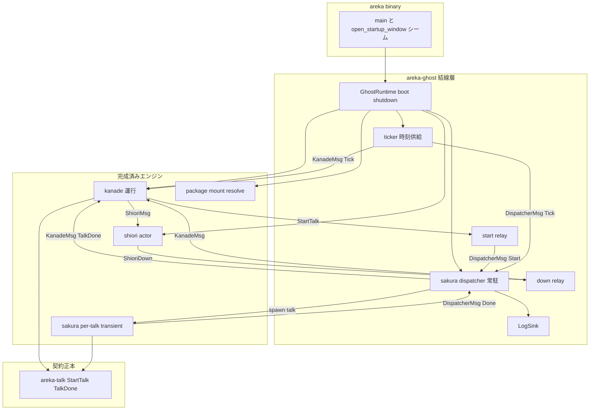
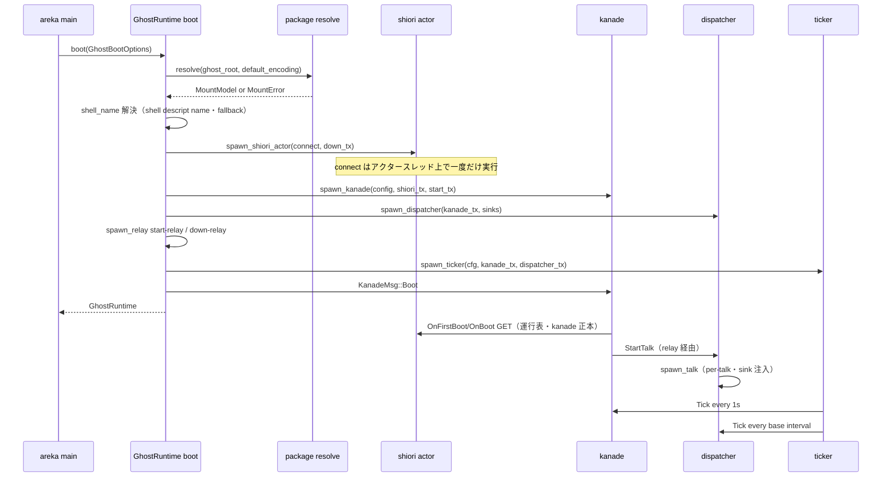
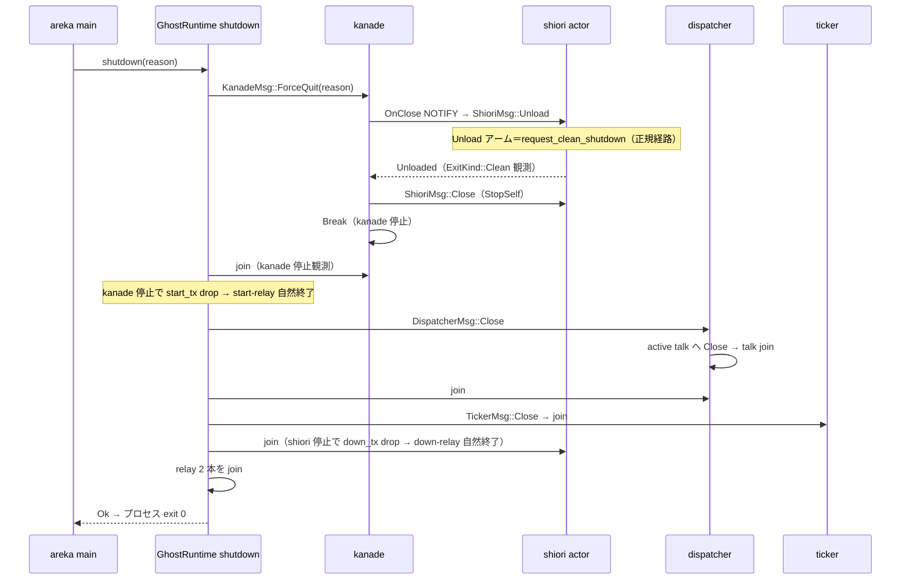

# 技術設計: areka-P0-ghost-setup

## Overview

**Purpose**: 本仕様は、完成済みの各エンジン（①shiori 通信層・③kanade・④sakura・②package-mount）を descript.txt 起点で実際に繋いで起動〜終了統括する **⓪ghost 結線層** を実装者へ提供する。結線の前提として、kanade と sakura に二重定義（フォーク）している talk 授受契約を**物理的に単一の正本**へ一本化する（WS-A）。

**Users**: 結線層の実装者と品質保証者が、決定論 spine e2e（偽 SHIORI 境界・注入 Tick・sleep 不使用）と env ゲート実 pasta 追験によって「boot→talk 再生→close」の背骨を回帰檻に入れるために利用する。後続の M-boot 統合（seriko／emo-text-layer）は本設計の sink 注入口へ実 sink を挿すだけで表示結線に到達する。

**Impact**: 既存 4 エンジンは授受面・結線面の隣接増分のみ改変する（運行表・再生意味論は不変）。新規クレートは 2 つ（`areka-talk`＝契約正本・`areka-ghost`＝結線層）。areka バイナリは `open_startup_window` シームとダミー窓・smoke を不変に保ったまま、その周囲（main）に ghost 起動／終了の結線を得る。

### Goals

- talk 授受契約（`StartTalk`／`TalkDone`／中断理由 3 値）を単一の物理定義（`areka-talk`）＋再エクスポートへ一本化し、下流 import パスを不変に保つ（WS-A）
- descript.txt 起点で mount → shiori actor → kanade → sakura dispatcher → ticker → 終了統括を結線する `areka-ghost` クレートを新設する（WS-B）
- 現行 `ShioriMsg::Unload` スタブを `request_clean_shutdown` の正規経路へ差し替え、helper 死活監視を結線する
- 決定論 spine e2e（純 x64・i686 非依存）＋ env ゲート実 pasta 追験＋ app smoke 維持の三観測を成立させる

### Non-Goals

- 表示結線（seriko サーフェス合成／emo-present／バルーンテキスト emo-text-layer）——sink は録音／ログ実装を挿す
- 本物ゴースト窓の生成（window-placement の領分・ダミー窓を維持）／窓位置の永続化（position-persist）
- OnSecondChange 起点の自発会話生成（idle-talk）——ticker は Tick を送るのみ
- SSTP／FMO 等の外部連携（M2）／kanade 運行表・sakura 再生意味論そのものの変更

## Boundary Commitments

### This Spec Owns

- **`areka-talk` クレート**: talk 授受契約（`TalkId`／`StartTalk`／`TalkDone`／`TalkEndReason`）の唯一の物理定義
- **`areka-ghost` クレート**: 起動統括（mount 消費・KanadeConfig 値源解決・spawn 順序）、sakura dispatcher、ticker、relay、本番 SHIORI connect 手続き、終了統括（Close→drain→join・exit 0）、LogSink
- **kanade の隣接増分**: `talk.rs` の再エクスポート化、schedule の quit:bool→3 値写像、`shiori/real.rs` の結線面（`ShioriBackend` 公開化・`ShioriConnection` の `HelperLifecycle` 化・Unload 正規化・死活監視・`on_down` 保持）
- **sakura の隣接増分**: `contract.rs` の授受型再エクスポート化、`spawn_talk` の完了通知ポート（`done: Sender<D>`）
- **areka main の結線**: ghost boot（非致命）と app 終了時 shutdown の呼び出し（シーム周辺・シーム本体は不変）
- **観測**: 決定論 spine e2e（`areka-ghost/tests/`）と env ゲート実 pasta 追験

### Out of Boundary

- kanade の運行表（boot／close の SHIORI イベント発火順序・close 握手意味論）と sakura の再生意味論（compile／TimedSchedule 駆動）——完了済み仕様の領分
- sakura の出力契約: `TalkCue`／`SurfaceSink`／`TextSink`／`cue_target_of`／dola cue 型（並走 seriko の消費面・**不改変**）
- shiori 通信層のプロトコル・IPC・語彙: `shiori-host32-ipc`／`Shiori3Client`／`RequestError`／`LifecycleReport`／`request_clean_shutdown` の API（**消費のみ**）
- `areka-actor` の公開面（actor-foundation 仕様で凍結。ドメイン型を追加しない）
- 本物窓生成・配置・DPI（window-placement）／表示 sink 実装（seriko／emo-text-layer）

### Allowed Dependencies

- `areka-talk` → std のみ（依存ゼロ）
- `areka-kanade` → 既存依存 ＋ `areka-talk`（新規）
- `areka-sakura` → 既存依存 ＋ `areka-talk`（新規）。**kanade へ依存しない**（sakura↔kanade の相互依存辺は作らない）
- `areka-ghost` → `areka-talk`／`areka-actor`／`areka-kanade`／`areka-sakura`／`areka-parsers`／`shiori-host32-host`／`windows`（GetTickCount64）／`tracing`／`thiserror`
- `areka`（bin） → 既存依存 ＋ `areka-ghost`（新規）
- 依存方向（左→右へのみ import 可）: `areka-talk` → `areka-actor` → {`areka-kanade`, `areka-sakura`} → `areka-ghost` → `areka`

### Revalidation Triggers

- `areka-talk` の型形状変更（`StartTalk`／`TalkDone`／`TalkEndReason` のフィールド・variant）→ kanade／sakura／ghost／下流全消費者の再検証
- `spawn_talk` シグネチャ（done ポートの形）変更 → dispatcher／M-boot 統合の再検証
- `ShioriBackend` trait・`spawn_shiori_actor` シグネチャ変更 → spine e2e／real 結線の再検証
- dispatcher の sink 注入口（構築時注入・`Clone` 制約）変更 → seriko／emo-text-layer 差し込み計画の再検証
- `open_startup_window` シーム署名変更・smoke ゲート語彙変更 → app-shell／window-placement 境界の再検証

## Architecture

### Existing Architecture Analysis

- **アクター基盤**: 全結線は `areka-actor` の原語（`spawn_actor`／`run_inbox`／`ActorHandle`／`reply_channel`）の上に建てる。std mpsc・tokio 禁止・スレッド独立・停止は「Close 受領」「全 Sender drop」の 2 経路（凍結規約）。
- **契約フォーク（実測）**: kanade `talk.rs`＝`StartTalk{talk_id, script}`／`TalkDone{talk_id, quit:bool}`・inbox 受領。sakura `contract.rs`＝`StartTalk{script, talk_id, reply}`／`TalkDone{talk_id, reason:3 値}`・oneshot 返信。両クレートに依存辺なし。
- **kanade の talk.rs は切り出し前提で設計済み**: 「std のみ依存・契約クレートへの切り出しは機械的な移動だけで完結」（kanade DD-1 rustdoc）。本仕様がその 2 例目消費者であり、切り出しを執行する。
- **`ShioriMsg::Unload` は暫定スタブ**: `Unloaded` を即返すのみ。`real.rs` の rustdoc が「正規経路確立時にこの 1 アームのみ差し替え」と明記する差し替え点。
- **`ShioriConnection.helper` は生 `HelperHandle`**: `request_clean_shutdown`／`status()`／`report_failure` は `HelperLifecycle` の API であり未結線。
- **接続手順の既存正解**: `areka-kanade/tests/kanade/real_helper_test.rs` の `connect_real_helper`（create 窓→spawn helper→HELLO pump→LOAD ack）が実証済み手順。本仕様はこれを `areka-ghost` の本番結線へ昇格する。

### Architecture Pattern & Boundary Map

パターン: **アクター結線ワークフロー**（既存パターン踏襲・新規抽象なし）。ghost 結線層は「所有と順序」だけを持ち、意味論は各エンジンに残す。



**Architecture Integration**:

- 選択パターン: 常駐アクター（dispatcher／ticker）＋ 微小 relay による循環結線の解消。フレームワーク化しない（記憶 areka-concurrency-model の「機構／経路／結線」三分の「結線」に徹する）。
- ドメイン境界: 契約（areka-talk）／運行（kanade）／再生（sakura）／結線（ghost）を crate 境界で分離。
- 既存パターン保存: inbox 規約・envelope 規約・停止規約・流量規約（areka-actor 規約正本）を全新規アクターに適用。
- 新規コンポーネントの根拠: dispatcher＝「永続 channel へ送る kanade」と「per-talk transient な sakura」の非対称吸収点（要件 4）。ticker＝時刻供給の差し替え可能化（要件 5）。relay＝spawn 順序の循環（kanade⇄dispatcher・kanade⇄shiori の相互 Sender 要求）を Sender API 変更なしに解く最小機構。
- Steering 準拠: Rust 2024・thiserror 構造化エラー・tracing 構造化ログ・正規実装原則（stand-in 禁止）・log-first。

#### 結線トポロジの要点（循環の解消）

`spawn_kanade` は構築時に `shiori: Sender<ShioriMsg>` と `sakura: Sender<StartTalk>` を要求し、`spawn_shiori_actor` は `on_down: Sender<KanadeMsg>` を、dispatcher は転送先 `Sender<KanadeMsg>` を要求する——素朴に結線すると相互に相手の Sender が要る循環になる。本設計は**中継チャンネル＋汎用 relay** で解く:

1. ghost が素の `mpsc::channel` を 2 本作る: `(start_tx, start_rx)`（StartTalk 用）・`(down_tx, down_rx)`（死活報告用）。
2. `spawn_shiori_actor(connect, down_tx)` → `shiori_tx` を得る。
3. `spawn_kanade(config, shiori_tx, start_tx)` → `kanade_tx` を得る（**kanade のシグネチャ不変**）。
4. `spawn_dispatcher(kanade_tx.clone(), sinks)` → `dispatcher_tx` を得る。
5. `spawn_relay("start-relay", start_rx, dispatcher_tx.clone())`（`StartTalk`→`DispatcherMsg::Start` へ `From` 変換）・`spawn_relay("down-relay", down_rx, kanade_tx.clone())`（恒等 `From`）。
6. `spawn_ticker(cfg, kanade_tx.clone(), dispatcher_tx.clone())`。

relay の停止は自然停止（上流の全 Sender drop → recv Err → 終了）であり、明示 Close を持たない（kanade 停止＝start_tx drop、shiori 停止＝down_tx drop に連動する）。

#### アクター別の停止経路（正本）

actor-foundation の停止 2 経路（Close／全 Sender drop）は、結線後のトポロジでは**アクターごとに成立範囲が異なる**。下表を停止設計の正本とし、shutdown 系列と spine e2e S6 はこの表の伝播順序を検証する。

| アクター | Close 経路 | 切断（全 Sender drop）経路 | 備考 |
|---|---|---|---|
| dispatcher | `DispatcherMsg::Close`（**唯一の停止経路**） | **構造的に不能**——per-talk done ポート用 self-sender を body が恒久保持するため inbox は切断に到達しない | Close-only は self-sending actor の固有性質（std mpsc に weak sender は無い）。done 専用 channel＋relay 化しても dispatcher⇄relay で同型の環が再生するだけで解消しない（却下） |
| kanade | `KanadeMsg::Close`／`ForceQuit`（終了系列→StopSelf） | 成立——ただし dispatcher・down-relay・runtime の全 kanade_tx 解放後に限る | 通常 shutdown は ForceQuit 経路。切断経路は S6 で（解体後に）検証 |
| shiori actor | `ShioriMsg::Close`（kanade 終了系列が送出） | 成立——kanade 停止（shiori_tx drop）で inbox 切断（**runtime は shiori_tx を保持しない**） | kanade panic 時のフォールバックが切断経路＝runtime 非保持がその前提 |
| ticker | `TickerMsg::Close` | 成立（制御端 drop） | 送出先切断は sticky 停止（対象ごと・一度だけ info!） |
| relay（start／down） | なし（明示 Close を持たない） | 成立（上流全 Sender drop で自然終了・下流切断は warn 終了） | 上流の停止に連動する設計 |

**Sender 環の存在（設計事実）**: on_down 保持（死活監視・要件 3.4）により kanade —(shiori_tx)→ shiori —(down_tx)→ down-relay —(kanade_tx)→ kanade の Sender 環が生じ、dispatcher は self-sender で自環を持つ。したがって**純粋な「全 Sender drop」だけでは全体は停止しない**。全体の停止は必ず Close 起点（`ForceQuit` または `Close`）で環を切ってから切断を伝播させる——これが shutdown 系列と S6 の設計原理である。

### Technology Stack

| Layer | Choice / Version | Role in Feature | Notes |
|-------|------------------|-----------------|-------|
| 契約 | `areka-talk`（新規・std のみ） | talk 授受契約の物理正本 | 依存ゼロ・kanade talk.rs の機械的移動 |
| 並行機構 | `areka-actor`（既存・凍結消費） | spawn／inbox／reply／join 原語 | 新規公開面追加なし |
| 結線 | `areka-ghost`（新規） | 起動〜終了統括・dispatcher・ticker | 新規外部依存なし（workspace 既存クレートのみ） |
| 時刻 | `windows` GetTickCount64 | ticker の既定 `MonotonicMs` 源 | kanade rustdoc の「OS 稼働ミリ秒」正準に一致 |
| SHIORI | `shiori-host32-host`（凍結消費） | connect／request／clean shutdown | `HelperLifecycle`／`Shiori3Client` を消費のみ |
| ログ／エラー | `tracing`／`thiserror` | log-first・構造化エラー | 全クレート共通規約 |

## File Structure Plan

### Directory Structure

```
crates/areka-talk/                  # 新規: talk 契約正本（WS-A）
├── Cargo.toml                      # 依存ゼロ（std のみ）
└── src/lib.rs                      # TalkId / StartTalk / TalkDone / TalkEndReason（唯一の物理定義＋単体テスト）

crates/areka-ghost/                 # 新規: ⓪ghost 結線層（WS-B）
├── Cargo.toml
├── src/lib.rs                      # 公開 facade（boot / GhostRuntime / GhostBootOptions / エラー型 re-export）
├── src/config.rs                   # KanadeConfig 値源解決（shell descript の name 読解・baseware 定数・純関数）
├── src/dispatcher.rs               # sakura dispatcher（DispatcherMsg / spawn_dispatcher / 単一 slot / stale 棄却 / Close funnel / Tick 中継）
├── src/ticker.rs                   # ticker（TickerConfig / TickerMsg / spawn_ticker / 発火判定純関数）
├── src/relay.rs                    # spawn_relay（汎用 1:1 転送 micro-actor・start/down の 2 箇所で使用）
├── src/shiori_wiring.rs            # 本番 connect 手続き（helper spawn → HELLO pump → LOAD ack → ShioriConnection）
├── src/runtime.rs                  # boot 手順（spawn 順序）・GhostRuntime・shutdown 統括（Close→drain→join・exit 0 前提）
├── src/sink.rs                     # LogSink（本番既定 sink＝tracing 出力・Clone・SurfaceSink/TextSink 実装）
└── tests/
    ├── ghost.rs                    # 束ねエントリポイント（テスト命名規約）
    └── ghost/
        ├── spine_e2e_test.rs       # R7 決定論 spine e2e（ScriptedShioriBackend + RecordingSink + 注入 Tick）
        └── real_pasta_test.rs      # R8.1 env ゲート実 pasta 追験（HOST32_PASTA_DLL / HOST32_HELPER_EXE 慣行）
```

### Modified Files

- `crates/areka-kanade/Cargo.toml` — `areka-talk` 依存を追加
- `crates/areka-kanade/src/talk.rs` — 物理定義を `pub use areka_talk::*` の再エクスポートへ差し替え（`areka_kanade::talk::*` パス不変・rustdoc は契約正本の所在を更新）
- `crates/areka-kanade/src/schedule/mod.rs` — 横断アームの `done.quit` 判定を `TalkEndReason` 写像（`Quit`→終了系列／`Ended`・`Interrupted`→非 quit 委譲）へ改稿・テスト追随
- `crates/areka-kanade/src/schedule/steady.rs`／`close.rs` — `TalkDone{quit:false}` 前提の遷移・テストを `reason` 前提へ追随（意味論は不変）
- `crates/areka-kanade/src/shiori/mod.rs`／`real.rs` — `ShioriBackend` trait を公開化＋`unload`／`status` を追加、`ShioriConnection.helper` を `HelperLifecycle` へ、`ShioriMsg::Unload` アームを `request_clean_shutdown` 正規経路へ差し替え、受信ループは blocking recv のまま**メッセージ到達時の死活チェック**を追加、`on_down` をループ中保持（死活報告経路）へ変更・テスト追随
- `crates/areka-sakura/Cargo.toml` — `areka-talk` 依存を追加
- `crates/areka-sakura/src/contract.rs` — `StartTalk`／`TalkDone`／`TalkEndReason`／`TalkId` を `pub use areka_talk::…` へ差し替え（`SakuraMsg`／`TalkHandle` は残置・`areka_sakura::contract::*` パス不変）
- `crates/areka-sakura/src/drive.rs` — `spawn_talk` に完了通知ポート `done: Sender<D>`（`D: From<TalkDone>`）を追加（`StartTalk` から reply 撤去に伴う）・高々 1 回機構は `Option<TalkState>::take()` で維持・テスト追随
- `crates/areka/Cargo.toml` — `areka-ghost` 依存を追加
- `crates/areka/src/main.rs` — `main` に ghost boot（失敗は warn/error＋継続＝非致命）と `app.run()` 復帰後の `shutdown` を結線。`open_startup_window`／ダミー窓／smoke ゲートは**不変**

> `crates/areka-sakura/src/sink.rs`（`SurfaceSink`／`TextSink`／`MockSink`）・`compile.rs`・dola cue 型は**変更しない**（凍結面・要件 1.5）。

## System Flows

### 起動（boot）シーケンス



### 終了（shutdown）シーケンス



フロー上の決定:

- shutdown の起動は `ForceQuit` 一本（DD-10 の OnClose NOTIFY→Unload→StopSelf 系列＝quit ゲート迂回・決定論的に完走）。kanade が既に自発停止済み（quit talk 等）の場合、送信は `Err` になるが kanade は自身の終了系列で Unload を既に実行済みであり、shutdown は debug ログの上で join 工程へ進む（冪等）。
- 要件 6.2 の「kanade の停止を観測したとき SHIORI へ Unload」は、**kanade の終了系列そのもの**（`Action::ShioriUnload` → 正規化された Unload アーム）として実現する。ghost が Unload を二重発行することはない（kanade の全終了経路——Quit／CloseRequest 完了／Fault／ForceQuit——が Unload を経由することは kanade 仕様で保証済み）。
- join の順序は「上流から」: kanade → dispatcher → ticker → shiori → relay。各 join の失敗（panic 観測）は `error!` の上で継続収集し、最後に `GhostShutdownError` へまとめる（silent failure なし・要件 6.5）。
- shiori actor の停止は kanade 終了系列の `ShioriMsg::Close` が正経路。kanade が panic した場合は kanade スレッド unwind による shiori_tx drop → inbox 切断がフォールバックとして機能する（**GhostRuntime は shiori_tx を保持しない**——保持すると join 時に切断フォールバックを自ら塞ぐ）。停止経路の成立範囲は「アクター別の停止経路」マトリクスを正本とする。

## Requirements Traceability

| Requirement | Summary | Components | Interfaces | Flows |
|-------------|---------|------------|------------|-------|
| 1.1 | talk 契約の単一定義化 | areka-talk / kanade talk.rs / sakura contract.rs | `StartTalk`・`TalkDone` | — |
| 1.2 | 中断理由 3 値の正本 | areka-talk | `TalkEndReason{Ended,Quit,Interrupted}` | — |
| 1.3 | sakura 暫定所有型の再エクスポート化 | sakura contract.rs | `pub use areka_talk::…` | — |
| 1.4 | import パス不変 | sakura contract.rs / lib.rs | `areka_sakura::contract::*` | — |
| 1.5 | 凍結面不改変 | （sink.rs／dola cue 無改変） | — | — |
| 1.6 | 両クレートのテスト追随 | kanade schedule／sakura drive のテスト | — | — |
| 1.7 | 変換アダプタ禁止・物理単一定義 | areka-talk（正本）＋再エクスポート | — | — |
| 2.1 | descript.txt 起点マウント入力 | GhostRuntime boot | `package::resolve(ghost_root, DefaultEncoding)` | boot |
| 2.2 | 起動順序の統括 | GhostRuntime boot | spawn 順序（shiori→kanade→dispatcher→ticker） | boot |
| 2.3 | KanadeConfig 値源解決 | config.rs | `resolve_kanade_config` | boot |
| 2.4 | boot 手順が動作する状態 | GhostRuntime boot | `KanadeMsg::Boot` 送信 | boot |
| 2.5 | マウント失敗の観測 | GhostRuntime boot | `GhostBootError::Mount` ＋ `error!` | boot |
| 3.1 | 接続をアクタースレッドで一度だけ | shiori actor（既存構造維持） | `spawn_shiori_actor(connect, …)` | boot |
| 3.2 | helper 死活監視 | shiori actor 受信ループ | `ShioriBackend::status`（メッセージ到達時・毎回）＋ ticker 駆動 pump が到達を保証 | — |
| 3.3 | 接続失敗の死活報告 | shiori actor ＋ down-relay | `KanadeMsg::ShioriDown` | boot |
| 3.4 | 異常終了検出の通知 | shiori actor 受信ループ | `ShioriDown`（sticky・1 回） | — |
| 3.5 | SHIORI 層は消費のみ | shiori_wiring.rs / real.rs | `HelperLifecycle`／`Shiori3Client` 不改変 | — |
| 4.1 | StartTalk→再生アクター起動 | dispatcher | `spawn_talk(start, done, sinks)` | boot |
| 4.2 | 単一 slot | dispatcher | `ActiveTalk`（Option） | — |
| 4.3 | 完了通知の kanade 転送 | dispatcher | `KanadeMsg::TalkDone` | — |
| 4.4 | stale 完了通知の棄却 | dispatcher | talk_id 突合 | — |
| 4.5 | 停止時 Close→join | dispatcher | `DispatcherMsg::Close` | shutdown |
| 4.6 | sink 注入口の公開 | dispatcher / GhostBootOptions | `spawn_dispatcher(kanade, S, T)` 構築時注入 | — |
| 5.1 | kanade へ毎秒 Tick | ticker | `KanadeMsg::Tick{now}` | — |
| 5.2 | active talk へ経過秒 Tick | ticker ＋ dispatcher | `DispatcherMsg::Tick{now}` → `SakuraMsg::Tick(f64)` | — |
| 5.3 | ticker 差し替え可能 | GhostBootOptions | `TickerMode::{Real,Disabled}`・clock 注入 | — |
| 5.4 | sleep 非依存の時刻駆動 | spine e2e | inbox への Tick 直接投函 | — |
| 6.1 | Close→drain→join の停止順 | GhostRuntime shutdown | shutdown 系列 | shutdown |
| 6.2 | kanade 停止観測→Unload | kanade 終了系列＋正規化 Unload アーム | `request_clean_shutdown` | shutdown |
| 6.3 | 正規 clean shutdown のみ | real.rs Unload アーム | スタブ撤去 | shutdown |
| 6.4 | 全 join・exit 0 | GhostRuntime shutdown / areka main | `shutdown() -> Result` | shutdown |
| 6.5 | 終了失敗の log-first | GhostRuntime shutdown | `GhostShutdownError` ＋ `error!` | shutdown |
| 7.1 | 偽 SHIORI 境界＋記録 sink | spine e2e | `ScriptedShioriBackend`（`Box<dyn ShioriBackend>` 注入）＋ `RecordingSink` | — |
| 7.2 | boot 観測（OnBoot→再生→sink 発火列） | spine e2e S1 | records 照合 | boot |
| 7.3 | close 観測（Clean 相当・全 join） | spine e2e S4 | scripted unload `Ok(ExitKind::Clean)`→`Unloaded` | shutdown |
| 7.4 | 注入 Tick・sleep 不使用 | spine e2e | `TickerMode::Disabled` ＋直接投函 | — |
| 7.5 | 主要経路の網羅 | spine e2e S1〜S6 | シナリオ表 | — |
| 7.6 | 純 x64・i686 非依存 | ShioriBackend シーム | プロセス spawn なしの scripted backend | — |
| 8.1 | env ゲート実 pasta 追験 | real_pasta_test | `HOST32_PASTA_DLL`／`HOST32_HELPER_EXE` gate | — |
| 8.2 | app smoke 維持 | areka main 結線 | boot 非致命＋`AREKA_APP_SMOKE_EXIT_MS` 不変 | — |
| 8.3 | ダミー窓維持 | areka main（シーム不変） | `open_startup_window` 無改変 | — |
| 8.4 | 追験は opt-in 限定 | real_pasta_test | 未設定 silent skip 慣行 | — |

## Components and Interfaces

| Component | Domain/Layer | Intent | Req Coverage | Key Dependencies (P0/P1) | Contracts |
|-----------|--------------|--------|--------------|--------------------------|-----------|
| areka-talk | 契約 | talk 授受契約の物理正本 | 1.1, 1.2, 1.7 | なし | State |
| kanade WS-A 追随 | 運行 | 再エクスポート化＋3 値写像 | 1.1, 1.6 | areka-talk (P0) | State |
| sakura WS-A 追随 | 再生 | 再エクスポート化＋done ポート | 1.3, 1.4, 1.6 | areka-talk (P0) | Service |
| shiori actor 増強 | 運行/SHIORI | backend 公開化・Unload 正規化・死活監視 | 3.1〜3.5, 6.2, 6.3, 7.1, 7.6 | shiori-host32-host (P0) | Service, Event |
| ghost::dispatcher | 結線 | 永続⇄transient 非対称吸収 | 4.1〜4.6, 5.2 | areka-sakura (P0), areka-kanade (P0) | Event |
| ghost::ticker | 結線 | 差し替え可能な時刻供給 | 5.1〜5.3 | areka-kanade (P0) | Event |
| ghost::relay | 結線 | 循環結線の解消（1:1 転送） | 2.2, 3.3 | areka-actor (P0) | Event |
| ghost::runtime | 結線 | boot／shutdown 統括 | 2.1〜2.5, 6.1〜6.5 | 全上流 (P0) | Service |
| ghost::config | 結線 | KanadeConfig 値源解決 | 2.3 | areka-parsers (P0) | Service |
| ghost::sink | 結線 | 本番既定 LogSink | 4.6 補助 | areka-sakura (P0) | Service |
| areka main 結線 | アプリ | シーム周辺の boot／shutdown 呼出 | 8.2, 8.3 | areka-ghost (P0) | — |
| spine e2e | 観測 | 決定論 spine 検証 | 7.1〜7.6 | areka-ghost (P0) | — |
| real pasta 追験 | 観測 | env ゲート実ブレイン一周 | 8.1, 8.4 | shiori-host32-host (P1) | — |

### 契約層

#### areka-talk（新規クレート）

| Field | Detail |
|-------|--------|
| Intent | talk 授受契約（4 型）の唯一の物理定義。std のみ・依存ゼロ |
| Requirements | 1.1, 1.2, 1.7 |

**Responsibilities & Constraints**

- kanade `talk.rs` の現行定義を機械的に移動し、`TalkDone` を 3 値 `reason` へ改める（kanade の quit:bool は撤去）
- script は不透明 `String`（解釈ロジックを持たない・kanade DD 継承）
- 本クレートに actor 型・host32 型・エンジン知識を持ち込まない

**Contracts**: State [x]

##### State Management（型定義）

```rust
/// talk の一意識別子（kanade が単調増番で採番・再利用しない）。
#[derive(Debug, Clone, Copy, PartialEq, Eq, Hash)]
pub struct TalkId(pub u64);

/// talk 起動要求（kanade → dispatcher → sakura）。reply を同梱しない（B1）。
#[derive(Debug, Clone)]
pub struct StartTalk {
    pub talk_id: TalkId,
    pub script: String,
}

/// 終端理由 3 値（旧 kanade quit:bool を置換・記憶 areka-interrupt-single-close-funnel の合意形）。
#[derive(Debug, Clone, Copy, PartialEq, Eq)]
pub enum TalkEndReason {
    /// `\e`／末尾到達／空列。
    Ended,
    /// `\-`（終了要求）。
    Quit,
    /// Close による中断（中断も ACK として通知される）。
    Interrupted,
}

/// 再生完了通知（sakura → dispatcher → `KanadeMsg::TalkDone`）。通算高々 1 回。
#[derive(Debug, Clone, Copy, PartialEq, Eq)]
pub struct TalkDone {
    pub talk_id: TalkId,
    pub reason: TalkEndReason,
}
```

- Invariants: `TalkDone` は 1 talk につき通算高々 1 回。`TalkId` は再利用されない。
- 導出 trait は両既存定義の**和集合**（kanade 側 Copy＋sakura 側 PartialEq/Eq）とし、両クレートの既存テストがそのまま型検査を通る形にする。

**Implementation Notes**

- Integration: kanade は `pub use areka_talk::{StartTalk, TalkDone, TalkEndReason, TalkId};` を `talk.rs` に置く（`areka_kanade::talk::*` 不変）。sakura は `contract.rs` で同様（`areka_sakura::contract::*` 不変・要件 1.3/1.4）。
- 「kanade 正本」（要件 1.1）の実現形: 契約の**意味論的正本は kanade**（形状＝kanade の `StartTalk{talk_id, script}`・inbox 受領、これに合意済みの reason 3 値を併合）であり、その物理定義を kanade DD-1 が予定していた契約クレート切り出し先（`areka-talk`）へ置く。これは要件ディスカッションで許容された A2（下位クレートへの昇格）であり、sakura→kanade の逆向き依存辺（A1）や `areka-actor` 公開面の凍結違反を回避する（research.md §7 DD-A 参照）。変換アダプタは存在しない（要件 1.7）。
- Validation: areka-talk の in-source テストへ kanade talk.rs の既存テスト（Copy／Hash／不透明 script）を移設し、3 値の網羅照合を追加。
- Risks: なし（機械的移動が kanade DD-1 で設計済み）。

### 運行層（kanade 隣接増分）

#### kanade schedule の 3 値写像

| Field | Detail |
|-------|--------|
| Intent | `TalkDone.quit:bool` 消費部を `TalkEndReason` へ写像し、運行意味論を不変に保つ |
| Requirements | 1.1, 1.6 |

**Responsibilities & Constraints**

- 写像規則（意味論保存）: `reason == Quit` → 旧 `quit:true` 経路（横断アームで `Unloading{Quit}`）。`reason == Ended` および `reason == Interrupted` → 旧 `quit:false` 経路（Steady 復帰／close 終了拒否）。
- `Interrupted` を `Ended` と同扱いにする根拠: M1 にはユーザー中断の結線が存在せず（input-events 未着手）、dispatcher の slot 差し替えで発生する `Interrupted` は stale として dispatcher が棄却するため、kanade へ届く `Interrupted` は実質発生しない。防御的に非 quit へ倒し `info!` で観測する。意味論の精緻化（中断＝close 扱い等）は input-events／idle-talk の領分。
- 既存テストは `quit:true`→`reason:Quit`／`quit:false`→`reason:Ended` の機械的置換で追随する。

**Contracts**: State [x]（`Input::TalkDone(areka_talk::TalkDone)`＝既存経路・型形状のみ変更）

### 再生層（sakura 隣接増分）

#### spawn_talk の完了通知ポート

| Field | Detail |
|-------|--------|
| Intent | `StartTalk` から reply を撤去し、完了通知先を spawn 引数の汎用 Sender へ移す |
| Requirements | 1.3, 1.4, 1.6 |

**Contracts**: Service [x]

##### Service Interface

```rust
/// per-talk transient を起動する。done は TalkDone の届け先（呼び出し側 inbox への変換投函）。
pub fn spawn_talk<D>(
    start: StartTalk,
    done: std::sync::mpsc::Sender<D>,
    surface_sink: impl SurfaceSink + Send + 'static,
    text_sink: impl TextSink + Send + 'static,
) -> TalkHandle
where
    D: From<TalkDone> + Send + 'static;
```

- Preconditions: `done` の受信端が生存している（切断時の送出失敗は `error!` の上で継続＝talk は静かに終わる）。
- Postconditions: 終端・中断のいずれでも `TalkDone` を**高々 1 回** `done` へ送出して body 復帰。高々 1 回は `Option<TalkState>::take()` の所有権スロットで維持する（従来 `ReplySender` の move-consume が担っていた保証の等価置換。take 後にのみ送出するため二重送出は型的に不能）。
- Invariants: `SakuraMsg`（`Start`／`Tick(f64)`／`Close`）・`TalkHandle{inbox, actor}`・compile／sink 層は不変。ghost を知らない（`D` は呼び出し側の inbox メッセージ型）。

**Implementation Notes**

- Integration: dispatcher は `D = DispatcherMsg`（`From<TalkDone>` 実装）で自身の inbox へ Done を巻き取る。sakura の既存テストは `D = TalkDone`（std の恒等 `From`）で `Sender<TalkDone>`＋`recv_timeout` へ機械的に追随。
- Risks: `TalkDriver` にジェネリクスが 1 つ増えるが、公開面は `spawn_talk` のみで影響は局所。

### SHIORI 結線層（kanade shiori actor 増強）

#### ShioriBackend の公開化と Unload 正規化・死活監視

| Field | Detail |
|-------|--------|
| Intent | 呼出面 trait を公開し、正規 clean shutdown と死活監視を同一 runner 上で結線する |
| Requirements | 3.1, 3.2, 3.3, 3.4, 3.5, 6.2, 6.3, 7.1, 7.6 |

**Responsibilities & Constraints**

- `real.rs` の private trait `ShioriBackend` を **pub** へ昇格し、`unload`／`status` を追加する。host32 の語彙（`RequestError`／`ShutdownError`／`ExitKind`／`HelperStatus`）を signature にそのまま用いる（再定義しない・要件 3.5）。
- `ShioriConnection` は `helper: HelperLifecycle` を所有する形へ変更（生 `HelperHandle` を `HelperLifecycle::new` で包む）。`impl ShioriBackend for ShioriConnection` を与え、既存の中間構造 `ConnectionBackend` は廃止する。
- `ShioriMsg::Unload` アーム: スタブ（`Unloaded` 即返し）を撤去し、`backend.unload()`＝`HelperLifecycle::request_clean_shutdown(&window)` を呼ぶ。`Ok(ExitKind::Clean)` → `info!`＋`Unloaded`。`Ok(その他)` → `warn!`（unload は完了・終了種別が Clean でない）＋`Unloaded`。`Err(ShutdownError)` → `error!`＋`Failed(ShioriFailure::Ipc(display))`。
- 死活監視（**設計ディスカッション #2 で簡素化**）: 受信ループは現行の blocking `recv` を維持し（タイマー poll は持たない）、**メッセージ到達のたびに冒頭で** `backend.status()` を確認する。`Exited(kind)` を初回観測したら `error!`＋`on_down.send(ShioriDown{reason})` を**一度だけ**送る（sticky フラグ）。unload 成功後は死活報告を発火しない（正規終了は死ではない）。**到達間隔の保証は結線トポロジが与える**: kanade の Steady／Closing 相は Tick ごとに OnSecondChange GET/NOTIFY を発行する（steady.rs／close.rs 実測）ため、本番（ticker 毎秒）では shiori actor へのメッセージ到達が ≤1s で構造的に保証される。加えて helper 死後の request は `RequestError` で失敗し kanade の Failed 処理（`classify_failure`）が第二の検出網になる。検出遅延の劣化は poll 案比で最悪 +0.5s＝無意味な差であり、検出機構が 1 本になることで**テスト経路＝本番経路が完全一致**する。
- `on_down` の寿命変更: 接続成功後も drop せず受信ループ中保持する（死活報告経路・要件 3.4）。**この保持は kanade→shiori→down-relay→kanade の Sender 環を作り、kanade の「全 Sender drop で正常終了」（旧 Req 4.9 の前提）は環の解体（kanade 自身の Close／StopSelf）後にのみ成立する**——「アクター別の停止経路」マトリクス参照。kanade rustdoc の Req 4.9 注記は「on_down 保持構成では、切断停止は Close 起点の解体後に伝播する」旨へ更新する（Revalidation Trigger として記録）。

**Contracts**: Service [x] / Event [x]

##### Service Interface

```rust
/// ShioriMsg dispatch の背後にある呼出面（本番＝ShioriConnection・テスト＝scripted fake）。
/// 窓所有スレッド上でのみ生きるため Send を要求しない。
pub trait ShioriBackend {
    fn get(&mut self, id: &str, references: &[String]) -> Result<Option<String>, RequestError>;
    fn notify(&mut self, id: &str, references: &[String]) -> Result<(), RequestError>;
    /// 正規 clean shutdown（unload → helper 正常終了観測）。
    fn unload(&mut self) -> Result<ExitKind, ShutdownError>;
    /// 非ブロッキング死活問い合わせ（sticky）。
    fn status(&mut self) -> HelperStatus;
}

/// connect は Box<dyn ShioriBackend> を返す形へ一般化する（純 x64 の偽装注入シーム・要件 7.1/7.6）。
pub fn spawn_shiori_actor(
    connect: impl FnOnce() -> Result<Box<dyn ShioriBackend>, String> + Send + 'static,
    on_down: Sender<KanadeMsg>,
) -> (Sender<ShioriMsg>, ActorHandle);
```

- Preconditions: `connect` はアクタースレッド上で一度だけ実行される（`!Send` 資材の生成点・既存不変・要件 3.1）。
- Postconditions: 接続失敗＝`ShioriDown` 死活報告＋ループ非突入（既存）。ループ終了時に backend drop＝RAII teardown（`HelperLifecycle::drop` の冪等 terminate が panic 経路のリーク防止を兼ねる）。
- Invariants: `ShioriMsg`／`ShioriOutcome`／`ShioriFailure` の境界型・`map_error` の機械的写像は不変。

##### Event Contract

- Published: `KanadeMsg::ShioriDown{reason}` — (a) 接続確立失敗（既存）、(b) 死活監視での `Exited(kind)` 初回観測（新規・sticky 1 回）。
- Ordering: 死活報告は request 応答（`Failed`）と独立に発火し得るが、kanade は両経路とも `Unloading{Fault}` へ収束させる（kanade 正本・本仕様は再定義しない）。

**Implementation Notes**

- Integration: 要件 7.1 の「偽 ShioriConnection」は、実 `ShioriConnection` の構築が実 helper 子プロセスを要する（`HelperHandle`＝`Child` 所有）ため、**そのシームの型を `Box<dyn ShioriBackend>` へ一般化して実現する**。connect closure という注入点・`spawn_shiori_actor(connect, on_down)` という呼出形は要件どおり不変であり、純 x64 で全経路を偽装できる（要件 7.6）。
- Validation: 既存 real.rs のテスト（fake backend 往復・接続失敗・全断線）は新 trait 形へ追随。Unload 正規化・死活監視は scripted backend の単体テスト＋spine e2e の両輪で固定する。
- Risks: 死活検出はメッセージ到達に依存する（本番は ticker 駆動 pump が ≤1s 到達を保証・ticker 停止構成では次の到達まで遅延）。検出経路が到達時チェック 1 本ゆえ、決定論テストは本番と同一経路を検証する（wall-clock 非依存が構造的に成立）。

### 結線層（areka-ghost 新規）

#### ghost::dispatcher（sakura dispatcher）

| Field | Detail |
|-------|--------|
| Intent | 「永続 channel へ送る」kanade と「per-talk transient」sakura の非対称を吸収する常駐アクター |
| Requirements | 4.1, 4.2, 4.3, 4.4, 4.5, 4.6, 5.2 |

**Responsibilities & Constraints**

- 単一 slot: `Option<ActiveTalk>`（`talk_id`・`TalkHandle`・`base_now: Option<MonotonicMs>`）を body ローカルに保持。同時 talk は常に 1（要件 4.2・記憶 areka-interrupt-single-close-funnel）。
- Close funnel: 新 `Start` 受領時に既存 active があれば `SakuraMsg::Close` 送出→`actor.join()`（join の panic は `error!` で観測し継続）→新 talk を spawn。停止（`Close`）時も同様に active を終了させてから Break（要件 4.5）。
- stale 棄却: `Done(done)` 受領時、`done.talk_id` が現 slot と一致する場合のみ `KanadeMsg::TalkDone` へ転送して slot を解放。不一致（slot 差し替え済みの旧 talk の `Interrupted` 等）は `info!` の上で棄却する（要件 4.3/4.4）。
- Tick 中継: `Tick{now}` 受領時、active があれば `base_now` を初回確定（elapsed=0.0）し、以降 `(now - base) / 1000.0` 秒を `SakuraMsg::Tick(f64)` として active の inbox へ送る（0 起点・単調非減少・要件 5.2）。active の送出失敗（talk 既終了）は `debug!` で無視。
- sink 注入口: 構築時注入（setter なし）。sink は `Clone` を要求し talk ごとに clone して `spawn_talk` へ渡す（後続 M-boot 統合は同じ口へ実 sink——channel Sender ベース——を挿す・要件 4.6）。

**Contracts**: Event [x]

##### Event Contract

```rust
/// dispatcher の inbox（1 アクター 1 enum・areka-actor inbox 規約）。
pub enum DispatcherMsg {
    /// kanade からの talk 起動（start-relay が From 変換で投函）。
    Start(StartTalk),
    /// per-talk transient からの完了通知（spawn_talk の done ポートが From 変換で投函）。
    Done(TalkDone),
    /// ticker からの時刻前進（dispatcher が active talk の経過秒へ換算して中継）。
    Tick { now: MonotonicMs },
    /// 停止規約の Close（active talk を終了させてから停止）。
    Close,
}
impl From<StartTalk> for DispatcherMsg { /* Start */ }
impl From<TalkDone> for DispatcherMsg { /* Done */ }

pub fn spawn_dispatcher<S, T>(
    kanade: Sender<KanadeMsg>,
    surface_sink: S,
    text_sink: T,
) -> (Sender<DispatcherMsg>, ActorHandle)
where
    S: SurfaceSink + Clone + Send + 'static,
    T: TextSink + Clone + Send + 'static;
```

- Delivery guarantees: 単一 inbox の FIFO 全順序。per-talk done ポート用の self-sender（`Sender<DispatcherMsg>` の clone）は、`spawn_dispatcher` が内部の受け渡しチャンネル（`areka_actor::reply_channel::<Sender<DispatcherMsg>>`）経由で body へ渡す——`spawn_actor` が返した送信端の clone を Sender を外部へ返す**前**に送り、body は受信ループ突入前に一度だけ受領する（`DispatcherMsg` enum を内部機構で汚さない・外部観測不能）。この self-sender 保持により dispatcher の inbox は決して切断に到達しない＝**dispatcher の停止経路は Close のみ**（「アクター別の停止経路」マトリクス参照・shutdown と S6 は Close 経路で停止させる）。
- kanade への転送失敗（kanade 既停止）は `debug!` で無視（shutdown 進行中の正常事象）。

#### ghost::ticker（時刻供給）

| Field | Detail |
|-------|--------|
| Intent | 実クロックから kanade（毎秒）と dispatcher（基本周期）へ Tick を養う差し替え可能な供給源 |
| Requirements | 5.1, 5.2, 5.3 |

**Responsibilities & Constraints**

- 単一スレッド・**絶対境界スケジューリング**（設計ディスカッション #2）: 発火目標を OS 時計（`clock()`）の**絶対グリッド**——`base_interval`＝50ms 境界（dispatcher）・`kanade_interval`＝1000ms 境界（kanade）——の時刻列とし、ループは「次に来る境界までの残時間」を計算して `stop_rx.recv_timeout(残時間)` で待つ。`Timeout` のたびに `now = clock()` から到来した境界の Tick を送る。「前回送出からの相対経過」でなく**グリッドへの整列**なので処理遅延が累積ドリフトにならない（OS 時計に対して正確）。`Ok(TickerMsg::Close)`／`Disconnected` で終了（areka-actor 停止規約準拠）。
- catch-up 政策: 大幅遅延（サスペンド復帰等）で複数境界を跨いだ場合は**各系統 1 発のみ**送り、次境界を未来へスナップする（burst 再送しない・`info!` で観測）。OnSecondChange Ref0（稼働時間 hour）は now 由来ゆえ跳びは意味論的に正しい。
- 副次効果（将来の複数ゴースト）: 発火が OS 時計の絶対グリッドに整列するため、**ticker インスタンス同士は共有コンポーネント無しで自然に同期**する（全ゴースト共通の秒鼓動）。将来 app 層で 1 本の ticker に複数 kanade を fan-out する昇格も、ticker が kanade の外（ghost 層）に居る現構造のまま結線差し替えで足りる——上位コンダクターの新設は不要で、kanade の役割にもしない（kanade は時刻を所有しない注入時刻の消費者）。
- 既定値: `base_interval = 50ms`（さくらスクリプト `\w`＝50ms 単位の再生解像度に一致）・`kanade_interval = 1000ms`（OnSecondChange は 1 秒周期・ukadoc）。周期の意味論は kanade が所有し、ticker は供給のみ。
- clock 注入: `clock: Box<dyn Fn() -> MonotonicMs + Send>`。既定は `GetTickCount64`（OS 稼働ミリ秒＝kanade `MonotonicMs` rustdoc の正準・分解能 10〜16ms は秒周期用途に十分）。単体テストは決定的 clock を注入する。
- 送出先切断（送出 `Err`）は対象ごとに sticky に停止し `info!` を一度だけ発火（shutdown 進行中のログ洪水防止・silent ではない）。
- 発火判定（「now と前回状態から、どの境界 Tick を打ち・次デッドラインはいつか」）は純関数へ分離し決定論単体テストの対象にする（境界整列・複数境界スキップ・catch-up を網羅）。**spine e2e は ticker を起動しない**（`TickerMode::Disabled`）——決定論はこの不使用によって成立する（C-inject-B・要件 5.4）。

**Contracts**: Event [x]

##### Event Contract

```rust
pub struct TickerConfig {
    pub base_interval: Duration,            // 既定 50ms
    pub kanade_interval: Duration,          // 既定 1000ms
    pub clock: Box<dyn Fn() -> MonotonicMs + Send>, // 既定 GetTickCount64
}
pub enum TickerMsg { Close }

pub fn spawn_ticker(
    config: TickerConfig,
    kanade: Sender<KanadeMsg>,
    dispatcher: Sender<DispatcherMsg>,
) -> (Sender<TickerMsg>, ActorHandle);
```

#### ghost::relay（汎用 1:1 転送）

| Field | Detail |
|-------|--------|
| Intent | 相互 Sender 要求の循環を、素の中継チャンネル＋変換転送で解消する最小 micro-actor |
| Requirements | 2.2（結線成立の機構）, 3.3（ShioriDown の kanade 到達） |

```rust
/// rx から受けたメッセージを From 変換して tx へ流す。上流全 Sender drop で自然終了。
/// 下流切断（送出 Err）は warn! の上で終了する（宙吊りなし）。
pub fn spawn_relay<A, B>(name: &str, rx: Receiver<A>, tx: Sender<B>) -> ActorHandle
where
    A: Send + 'static,
    B: From<A> + Send + 'static;
```

- 使用箇所は 2 つのみ: `start-relay`（`StartTalk` → `DispatcherMsg`）・`down-relay`（`KanadeMsg` → `KanadeMsg`＝恒等 `From`）。これにより **`spawn_kanade`／`spawn_shiori_actor` のシグネチャは不変**のまま結線が成立する。

#### ghost::config（KanadeConfig 値源解決）

| Field | Detail |
|-------|--------|
| Intent | shell 名と baseware 情報の値源を確定する純関数群 |
| Requirements | 2.3 |

**Responsibilities & Constraints**

- **shell_name（OnBoot Reference0＝「起動時のシェル名」・ukadoc）**: `MountModel.shell.dir` 直下の `descript.txt` を `charset::decode(bytes, default_encoding)` → `kv::parse_kv` で読み、`name` キーの値を採用する。読取不能・`name` 欠落時は `warn!` の上で shell ディレクトリ名（通常 `"master"`）へフォールバックする（shell descript は補助情報であり boot を落とさない。`GhostNames`＝ゴースト側 descript の name 系は**シェル名ではない**ため使わない）。
- **baseware 情報（areka 定数）**: `baseware_name = "areka"`（`KanadeConfig::new` の既定）・`baseware_version = env!("CARGO_PKG_VERSION")`（workspace 統一 version）。
- `close_talk_deadline_ms` は `KanadeConfig::new` の既定 30_000 を用いる（override 注入点は設けない——S5 は注入 `Tick{now}` で deadline を数値的に跨ぐため短縮構成は不要）。

##### Service Interface

```rust
/// MountModel と shell descript から KanadeConfig を解決する（純関数・I/O は shell descript 読取のみ）。
pub fn resolve_kanade_config(
    mount: &MountModel,
    default_encoding: DefaultEncoding,
) -> KanadeConfig;
```

#### ghost::shiori_wiring（本番 connect 手続き）

| Field | Detail |
|-------|--------|
| Intent | 実 32bit helper への接続手続き（spawn→HELLO→LOAD）を本番結線として所有する |
| Requirements | 3.1, 3.5, 8.1 |

**Responsibilities & Constraints**

- `real_helper_test.rs` の `connect_real_helper` 実証手順を昇格する: `ParentMessageWindow::create()` → `spawn(helper_exe, load_dir, shiori_name, parent_hwnd)` → `pump_until_hello_or(timeout)` → `send_request(MsgTag::Load, …)` ack 確認 → `ShioriConnection{window, helper: HelperLifecycle::new(handle)}` を `Box<dyn ShioriBackend>` として返す。
- `load_dir`／`shiori_name` は `MountModel.shiori`（`dir`＋`file`）から解決する。`file` が `None` の場合は接続失敗（`Err`＝`ShioriDown` へ写る・推測しない）。
- `helper_exe` は `GhostBootOptions` で呼び出し側が供給する（areka main＝実行ファイル隣接パス・env ゲートテスト＝`HOST32_HELPER_EXE`／target 探索の既存慣行）。存在しなければ connect 失敗として `ShioriDown` へ倒す（boot 自体は成立＝運行は Fault 系列で正規に閉じる）。

##### Service Interface

```rust
/// 本番 connect クロージャを構成する（実行は shiori アクタースレッド上・一度だけ）。
pub fn real_connect(
    helper_exe: PathBuf,
    shiori: ShioriMount,
) -> impl FnOnce() -> Result<Box<dyn ShioriBackend>, String> + Send + 'static;
```

#### ghost::runtime（boot／shutdown 統括）

| Field | Detail |
|-------|--------|
| Intent | 起動順・終了順の統括と全ハンドルの所有 |
| Requirements | 2.1, 2.2, 2.4, 2.5, 6.1, 6.4, 6.5 |

**Responsibilities & Constraints**

- boot 手順（要件 2.2 の順序）: ①`package::resolve` ②`resolve_kanade_config` ③shiori actor（connect＋down_tx） ④kanade（shiori_tx＋start_tx） ⑤dispatcher（kanade_tx＋sinks）＋start-relay／down-relay ⑥ticker（`TickerMode::Real` 時のみ） ⑦`KanadeMsg::Boot` 送出。手順①の失敗は `error!`＋`GhostBootError::Mount` で返す（要件 2.5）。
- shutdown 手順（要件 6.1・System Flows 参照）: `ForceQuit(reason)` 送出 → kanade join → `DispatcherMsg::Close`＋dispatcher join → `TickerMsg::Close`＋ticker join → shiori join → relay 2 本 join。各段の送出 `Err` は「対象既停止」として `debug!`、join の `Err(Panicked)` は `error!` の上で**継続**し、全段完了後に失敗集合が非空なら `GhostShutdownError` を返す（best-effort 完走・silent failure なし・要件 6.5）。全段成功なら `Ok(())`＝呼び出し側（main／e2e）が exit 0 へ到達する（要件 6.4）。
- 保持物: 各 `Sender`（kanade／dispatcher／ticker）と各 `ActorHandle`（kanade／dispatcher／ticker／shiori／relay×2）・`MountModel`（ログ／後続用）。

**Contracts**: Service [x]

##### Service Interface

```rust
pub enum ShioriWiring {
    /// 実 helper 結線（本番・env ゲート追験）。
    Helper { helper_exe: PathBuf },
    /// 任意 backend 注入（spine e2e＝scripted fake）。
    Custom(Box<dyn FnOnce() -> Result<Box<dyn ShioriBackend>, String> + Send>),
}

pub enum TickerMode {
    /// 実クロック駆動（本番）。
    Real(TickerConfig),
    /// ticker を起動しない（決定論テスト＝Tick は外部注入）。
    Disabled,
}

pub struct GhostBootOptions<S, T> {
    pub ghost_root: PathBuf,
    pub default_encoding: DefaultEncoding,   // 既定 Ansi（SSP 準拠・記憶 areka-descript-encoding）
    pub shiori: ShioriWiring,
    pub surface_sink: S,                     // 構築時注入（要件 4.6）
    pub text_sink: T,
    pub ticker: TickerMode,
}

pub fn boot<S, T>(options: GhostBootOptions<S, T>) -> Result<GhostRuntime, GhostBootError>
where
    S: SurfaceSink + Clone + Send + 'static,
    T: TextSink + Clone + Send + 'static;

pub struct GhostRuntime { /* senders + handles + mount */ }

impl GhostRuntime {
    /// 終了統括（ForceQuit → 全 join）。冪等: 各段の「既停止」を正常系として扱う。
    pub fn shutdown(self, reason: CloseReason) -> Result<(), GhostShutdownError>;
    /// kanade inbox への投函端（テスト駆動・後続 input-events の結線点）。
    pub fn kanade(&self) -> &Sender<KanadeMsg>;
    /// dispatcher inbox への投函端（テストの Tick 注入点）。
    pub fn dispatcher(&self) -> &Sender<DispatcherMsg>;
    /// 全断線シナリオ等の分解結線用（テスト／上級用途・通常は shutdown を使う）。
    pub fn into_parts(self) -> GhostParts;
}

/// into_parts の分解結果（S6 段階的解体の駆動口）。
/// shiori への投函端は**存在しない**（runtime 非保持＝停止経路マトリクスの正本どおり）。
pub struct GhostParts {
    pub kanade: Sender<KanadeMsg>,          // S6②の Close 送出・S3/S5 の Tick 注入
    pub dispatcher: Sender<DispatcherMsg>,  // S6①の Close 送出・Tick 注入
    pub ticker: Option<Sender<TickerMsg>>,  // TickerMode::Real 時のみ Some
    pub handles: GhostHandles,              // kanade／dispatcher／shiori／start-relay／down-relay／ticker(Option) の全 ActorHandle
}
```

- Preconditions: `boot` は UI スレッドを要求しない（headless・spine e2e はプレーンなテストスレッドで駆動）。
- Postconditions: `boot` 成功時、OnBoot 起点のトーク受領〜再生が（Tick 供給があれば）進行する状態（要件 2.4）。

#### ghost::sink（LogSink）

| Field | Detail |
|-------|--------|
| Intent | 本番既定の sink（発火を `tracing` へ出力・無蓄積・Clone） |
| Requirements | 4.6（差し込み口の既定実装） |

- `#[derive(Clone)]` の unit 相当構造体。`emit(&mut self, cue: TalkCue)` は `info!(target: "ghost-sink", …)` で at／actor／command 種別を構造化出力する。M-boot 統合はこの位置に seriko／emo-text-layer の実 sink を挿す（同じ trait 口・stand-in ではなく正規のシーム）。スパイク的な `MockSink`（無限蓄積）を本番へ置かないための最小実装。

### アプリ層（areka main 結線）

#### main の ghost boot／shutdown 結線

| Field | Detail |
|-------|--------|
| Intent | `open_startup_window` シームとダミー窓・smoke を不変に保ったまま、その周囲に ghost 起動と終了を結線する |
| Requirements | 8.2, 8.3 |

**Responsibilities & Constraints**

- `main`: `resolve_config_inputs` の `ghost_root` から `GhostBootOptions`（`ShioriWiring::Helper`＝実行ファイル隣接の `shiori-host32-helper.exe`・`LogSink`・`TickerMode::Real` 既定構成）を組み、`areka_ghost::boot` を試行する。失敗（既定プレースホルダ ghost_root の不在等）は `warn!`（起点不在）／`error!`（読取不能等）の上で **None として継続**——骨格起動・ダミー窓・smoke を阻害しない（要件 8.2）。
- `app.run()` 復帰後、boot 済みなら `shutdown(CloseReason::System)` を実行し、`Err` は `error!` の上で main の `Result` へ伝播する（正常時 exit 0・要件 6.4）。
- `open_startup_window`／`spawn_dummy_window`／smoke ゲート（`AREKA_APP_SMOKE_EXIT_MS`）は**一切変更しない**（要件 8.3。本物窓生成は window-placement の領分）。

### 観測層

#### spine e2e（決定論・純 x64）

| Field | Detail |
|-------|--------|
| Intent | boot→close の背骨を偽 SHIORI 境界＋記録 sink＋注入 Tick で決定論検証する |
| Requirements | 7.1, 7.2, 7.3, 7.4, 7.5, 7.6 |

**Responsibilities & Constraints**

- **ScriptedShioriBackend**（`tests/ghost/spine_e2e_test.rs` 内定義）: `ShioriBackend` を実装する台本 fake。イベント id ごとの応答列（`Ok(Some(script))`／`Ok(None)`／`Err(RequestError::…)`）・`unload` の結果（`Ok(ExitKind::Clean)` 等）・`status` の遷移（`Running`→`Exited(kind)`）と受領記録（`Arc<Mutex<Vec<…>>>`）をスクリプト化する。プロセス spawn・窓・i686 成果物を一切要さない（要件 7.6）。
- **RecordingSink**（同・約 20 行）: `Arc<Mutex<Vec<TalkCue>>>` 共有蓄積＋`Clone`。sakura `MockSink` と同型だが `Clone` 制約（dispatcher の per-talk 注入）を満たすために e2e 側で定義する（凍結面 sink.rs に手を入れない）。
- 駆動: `boot` を `ShioriWiring::Custom`＋`TickerMode::Disabled` で組み、`runtime.kanade()`／`runtime.dispatcher()` へ `Tick` を直接投函する（sleep 不使用・要件 7.4）。完了待ちは有界 `recv_timeout`／`join`（既存決定論テスト作法）。
- シナリオ網羅（要件 7.5）:
  - **S1 boot 成功**: Boot→OnBoot GET が Value→StartTalk→sakura 再生→RecordingSink の発火列（at 昇順・内容一致）→TalkDone{Ended} が kanade へ転送される。
  - **S2 接続失敗**: connect が `Err`→ShioriDown→Unloading{Fault}→全 join（有界）。
  - **S3 helper 死活**: scripted `status` を `Exited(Abnormal)` へ遷移させ、`runtime.kanade()` へ `Tick{now}` を注入→Steady pump の OnSecondChange が shiori actor へ到達→**到達時 status 確認**で検出→ShioriDown→Fault 系列→全 join（駆動は本番と同一経路・実時間ゼロ）。
  - **S4 close 握手**: CloseRequest→OnClose GET が close talk（`\-` 終端）→TalkDone{Quit}→Unload が呼ばれ scripted `Ok(ExitKind::Clean)`→`Unloaded` 観測→StopSelf→shutdown で全スレッド join（要件 7.3）。
  - **S5 close deadline**: close talk を意図的に完了させず、`KanadeMsg::Tick` の now を deadline 超過まで注入（既定 30_000ms を数値的に跨ぐ now を投函するだけ・実時間ゼロ・短縮構成不要）→Unloading{DeadlineExceeded}→Unload→全 join。
  - **S6 全断線（段階的解体）**: `into_parts` で分解し、①`DispatcherMsg::Close` 送出→dispatcher join（Close-only アクターの正規停止）②`KanadeMsg::Close` 送出→kanade join（運行意味論を経ない素の停止）③残る senders を全 drop→shiori actor（kanade の shiori_tx drop による inbox 切断）・down-relay（shiori 停止による down_tx drop）・start-relay（kanade 停止による start_tx drop）が**切断伝播だけで**有界時間内に正常終了することを join で確認する。純粋な「全 Sender drop 一斉解放」は Sender 環（停止経路マトリクス参照）ゆえ構造的に成立しない——本シナリオはマトリクスの全行（Close 経路×2・切断経路×3）を 1 シナリオで検証する再定義である。
- いずれのシナリオも `cargo test --workspace`（x64）で常時実行される（i686 成果物前提なし・要件 7.6）。

#### real pasta 追験（env ゲート）

| Field | Detail |
|-------|--------|
| Intent | 実 32bit helper＋実 pasta（emo2）で boot 一周〜clean shutdown を追験する |
| Requirements | 8.1, 8.4 |

- gate 慣行は既存 host32 E2E と同一: `HOST32_PASTA_DLL` 未設定→silent skip・設定済みで DLL 不在→明示 fail・helper exe は `HOST32_HELPER_EXE`→target/i686 探索。
- 駆動: emo2 fixture の ghost_root で `boot`（`ShioriWiring::Helper`・RecordingSink・`TickerMode::Real`）→OnBoot 一周（sink 発火の非空を有界待機で観測）→`shutdown(System)`→`Ok` を確認。応答スクリプトの内容は実ブレイン依存ゆえ照合しない（完走のみ・既存 real_helper_test と同じ検証水準）。

## Data Models

本仕様のデータランドスケープはメッセージ型が中心である（永続データなし・窓位置永続化はスコープ外）。

- **契約語彙（正本＝areka-talk）**: `TalkId`／`StartTalk`／`TalkDone`／`TalkEndReason`——上記 Components 参照。集約ルートは talk（`TalkId` がライフサイクル識別子・kanade が採番）。
- **結線語彙（ghost 所有）**: `DispatcherMsg`／`TickerMsg`／`GhostBootOptions`／`ShioriWiring`／`TickerMode`／`GhostBootError`／`GhostShutdownError`。いずれも `Send + 'static` 所有データ（envelope 規約）。
- **消費のみ（不改変）**: `KanadeMsg`／`ShioriMsg`／`ShioriOutcome`／`MonotonicMs`（kanade）・`SakuraMsg`／`TalkHandle`／`TalkCue`（sakura）・`MountModel`／`DefaultEncoding`（parsers）・`ExitKind`／`HelperStatus`／`ShutdownError`／`RequestError`（host32）。

## Error Handling

### Error Strategy

log-first（`error!`＋`Err` 戻り値・安易な panic 禁止・silent failure 禁止）を全新規経路に適用する。回復可能事象は `warn!`＋継続、shutdown 進行中の期待される切断は `debug!`。

### Error Categories and Responses

- **起動失敗（`GhostBootError`）**: `Mount(MountError)`（起点不在／読取不能／shell 不在・要件 2.5）を `#[non_exhaustive]` enum で返す。呼び出し側 areka main は骨格継続（warn/error＋ghost なし起動）、e2e は明示 fail。shell descript の name 欠落は**エラーではなく** warn＋フォールバック（boot を落とさない）。
- **SHIORI 死活（運行中）**: 接続失敗・helper 異常終了は `ShioriDown` として kanade へ通知し、kanade の Fault 系列（正本）が閉じる。ghost は再接続を試みない（M1 スコープ外・観測と正規終了のみ）。
- **終了失敗（`GhostShutdownError`）**: join で観測された panic（`ActorError::Panicked`）と予期しない送出失敗を段名つきで収集し、全段 best-effort 完走後にまとめて返す。main はこれを `error!` の上でプロセス終了コードへ反映する（正常時のみ exit 0）。
- **channel 切断の格付け**: boot 完了前の切断＝バグ（error!）。shutdown 開始後の切断＝正常進行（debug!）。ticker／dispatcher の送出先切断は sticky 停止＋一度だけの `info!`（ログ洪水防止）。

### Monitoring

全アクターは `spawn_actor` の tracing span（`actor` フィールド）下で動く。新規イベント語彙（回帰檻の対象）: `ghost-boot`（mount 解決・shell_name 確定・各 spawn）・`ghost-shutdown`（各段の完了／失敗）・`shiori-actor` の `unload_clean`／`unload_failed`／`helper_down`・dispatcher の `talk_started`／`talk_done_forwarded`／`stale_talk_done_dropped`。ログ発火はログ捕捉テスト（kanade の `log_capture` 慣行）で検証する。

## Testing Strategy

### Unit Tests

1. **areka-talk**: 型の導出（Copy／Hash／Clone）・3 値網羅・script 不透明性（kanade 既存テストの移設＋拡充）。
2. **dispatcher**（inbox 直接投函・スレッド実駆動・有界待機）: 単一 slot（Start 二連投で先行 talk へ Close→join→差し替え）／stale Done 棄却（差し替え後の旧 talk_id）／Done 転送（kanade 受領口で観測）／Tick 中継（base 確定・経過秒の単調性）／Close funnel（active あり停止）。
3. **ticker**: 発火判定純関数（グリッド境界整列・複数境界スキップ／catch-up・次デッドライン計算）・注入 clock での送出列・Close／切断停止（有界 join）。
4. **config**: shell descript の name 採用／欠落フォールバック／読取不能フォールバック（tempdir 合成）。
5. **kanade schedule 追随**: `reason:Quit`→Unloading{Quit}・`Ended`→Steady 復帰／close 終了拒否・`Interrupted`→非 quit 扱い＋info 発火（既存テストの機械的追随＋Interrupted アーム新規）。
6. **sakura drive 追随**: done ポート経由の TalkDone 受領（`Sender<TalkDone>` 恒等 From）・高々 1 回（Close 競合）・既存終端経路の緑維持。
7. **shiori actor 増強**: scripted backend で Unload 正規経路（Clean→Unloaded／ShutdownError→Failed＋error!）・死活検出（メッセージ到達時チェック）→ShioriDown 一度だけ（sticky）・unload 後は死活報告なし。

### Integration Tests

1. **spine e2e S1〜S6**（`areka-ghost/tests/ghost/spine_e2e_test.rs`・上記 Components 参照）——boot 成功・接続失敗・helper 死活・close 握手・close deadline・全断線を注入 Tick／sleep 不使用で網羅（要件 7.2〜7.5）。
2. **kanade／sakura の既存スイート**が新契約で全緑（要件 1.6・`cargo test --workspace` x64 で確認）。
3. **app smoke**（`crates/areka/tests/smoke_boot_loop_exit.rs`・既存不変）が ghost 結線追加後も exit 0（要件 8.2）。

### E2E/Manual Tests

1. **real pasta 追験**（env ゲート・`HOST32_PASTA_DLL`）: 実 emo2 の OnBoot 一周→clean shutdown 完走（要件 8.1/8.4）。
2. **手動確認（任意）**: `cargo run -p areka <emo2 ghost_root>` で boot ログ・LogSink 発火・ダブルクリック終了→exit 0。

### 低頻度 race の検出

独立レビュー時に spine e2e の複数回連続実行（10〜25 回・記憶 deterministic-test-coverage-mandate）で join ハング・順序依存を検出する。

## Supporting References

- 調査ログ・代替案比較・持越し項目 1〜9 の決定記録: `.kiro/specs/areka-P0-ghost-setup/research.md`（§3 候補比較・§7 設計決定）
- 接続手順の実証元: `crates/areka-kanade/tests/kanade/real_helper_test.rs`（`connect_real_helper`）
- 契約フォークの実測: `crates/areka-kanade/src/talk.rs`／`crates/areka-sakura/src/contract.rs`
