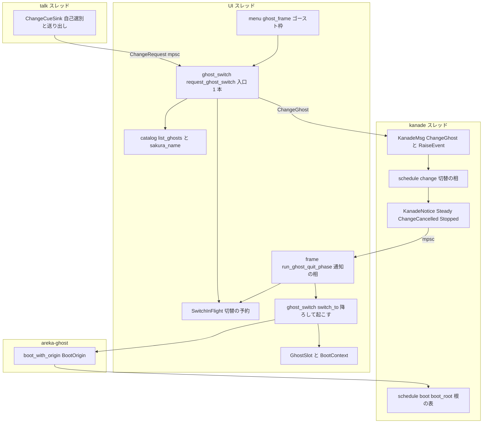
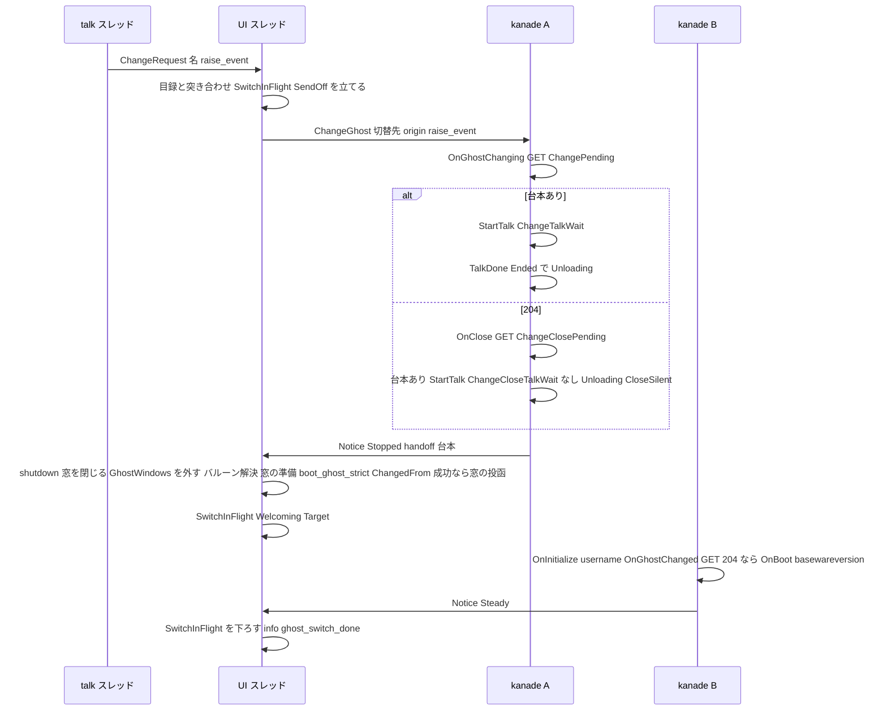
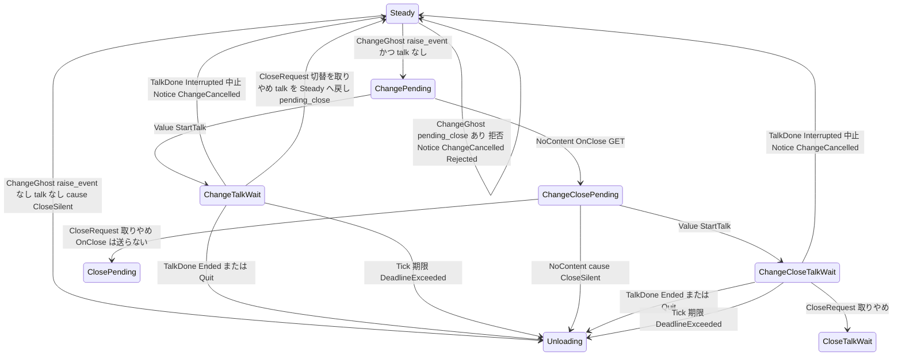
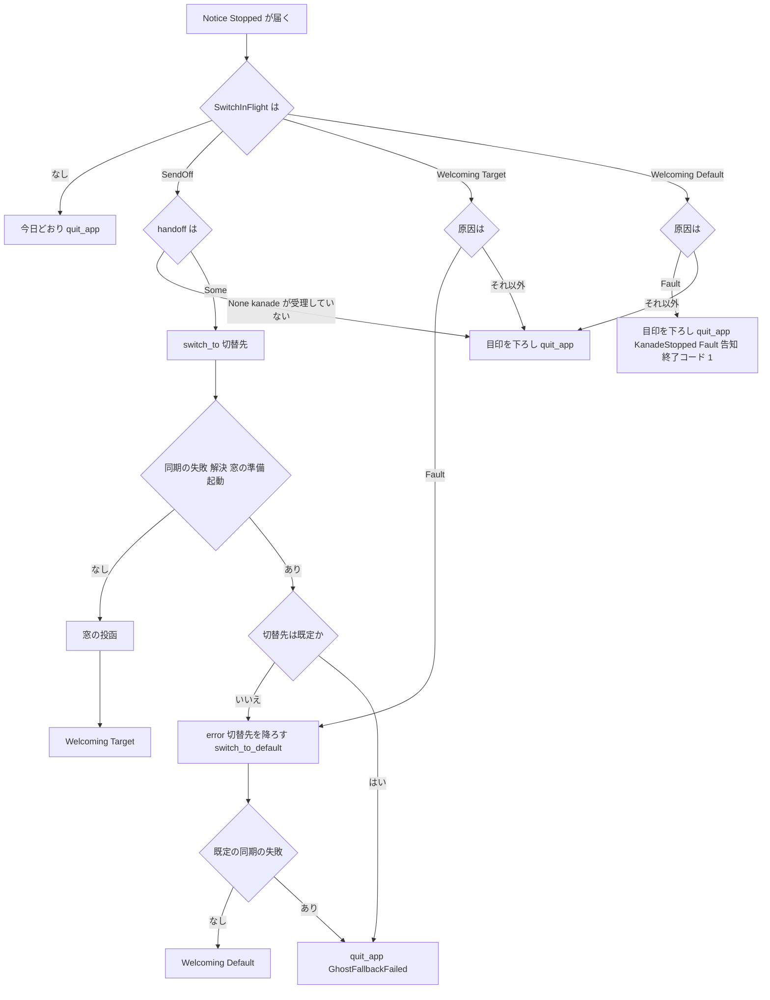

# Design Document — areka-P0-ghost-shell-balloon-switch

> 本文の実測は 2026-09-26・本ブランチ（main `13b72893` と同じソース）のもの。コードは「何の定義か」（関数名・型名＋ファイルパス）で指し、行番号では指さない。要件 11 の裁定 1〜12 は確定済みで、本設計はそれを覆さない。研究の経緯と選ばなかった案は `research.md` §9〜§11 にある。

## Overview

**Purpose**: プロセスを生かしたまま別のゴーストへ替わる。台本の `\![change,ghost,名(,--option=raise-event)]` と右クリックメニューの「ゴースト」枠が同じ 1 本の切替要求を出し、kanade が送り出しの握手（`OnGhostChanging` → 204 なら `OnClose` → 別れの台詞の再生完了）を行い、areka がゴーストを降ろして（全窓を閉じ・SHIORI を解放し・終了しない）切替先を起こし、kanade が迎え入れの握手（`OnGhostChanged` → 204 なら `OnBoot`）を行う。切替先が起動できなければ既定ゴースト（emo2）を起こし、その `OnBoot` の Ref6＝`halt`・Ref7＝落ちたゴースト名で伝える。あわせて kanade に外から SHIORI イベントを名前と Reference 列で頼める汎用の入口を 1 本作る。

**Users**: α の利用者（2 体目を入れた第三者）、ゴーストの作者（交代の台詞を書く）、後続 spec の開発者（`shell-balloon-switch`・`ghost-install`・`network-update`・`ghost-change-name-resolution`）。

**Impact**: 今日の「停止通知を受けると必ず終了へ進む一本道」（`crates/areka/src/emo2_boot/frame.rs` の `run_ghost_quit_phase` → `quit_app`）に、切替の目印が立っている間だけ「降ろして起こし直す」分岐が加わる。kanade の停止通知の線は「運行の通知」の線に広がり（停止・定常到達・切替の中止の 3 種を運ぶ）、`GhostSession` は `fn main` のローカル変数から World の資源へ移る。完了 `areka-P0-ghost-restart-unit` が用意した「登録 1 回・載せ替え n 回・全窓を閉じるが終了しない」の形が、本仕様で最初の本番の呼び手を得る。

### Goals

- 切替要求の入口を 1 本（`SwitchRequest`）にし、台本とメニューの両方がそこを通る（要件 1）。
- 送り出しと迎え入れの握手を正典の順序と Reference で行う（要件 2・4）。起動の根は 1 つ（初回起動が最優先）。
- 切替の間にプロセスを終了させない。降ろした側の停止通知を「切替による停止」として捌く（要件 3）。
- `raise-event` 付きの切替はバルーンブレークで中止でき、元の定常へ戻る（要件 5）。
- 切替先が起動できなければ既定ゴーストを起こし、`OnBoot` の Ref6/7 で伝える。既定ゴースト自身の失敗は致命（要件 6）。単独起動の失敗も次回は既定ゴーストへ倒す（要件 6.8）。
- kanade に汎用の通知の入口を 1 本作る（要件 7）。
- 判断の分岐を偽の SHIORI 2 体の決定論テストで固定し、実機で emo2 ⇄ R_POST_and_KOMAINU を往復する（要件 10）。

### Non-Goals

- 名前解決 `random`／`sequential`／`lastinstalled`・`\+`／`\_+`（`areka-P0-ghost-change-name-resolution`）。本仕様では「該当なし」として無視する。
- シェル切替・バルーン切替（`areka-P0-shell-balloon-switch`）。`(change,shell)`・`(change,balloon)` の消費者は 0 組のまま。
- `\![reload,…]`・`\![call,ghost,…]`・多重ゴースト・消滅・`\![set,scaling,…]`・`OnNotify*Info`・`currentghost.*`。
- 降ろす処理の別スレッド化（要件 3.8 の実測が 1 秒を超えたときの設計討議の議題として残す。`GhostSession` が `Send` であることは確認済み＝`ghost_session_restart_tests.rs` の `shutdown_bounded` が `run_bounded<F: Send>` へ move している）。
- 3 人以上のキャラの窓（`derive_scopes()` の `[0, 1]` 固定は据え置き）。
- 既定ゴースト emo2 の `halt` の台詞（開発者が後で足す）。
- 告知に押されたボタンを返す形（`ghost-install`）。

## Boundary Commitments

### This Spec Owns

- **切替要求の入口**: `crates/areka/src/emo2_boot/ghost_switch.rs` の `SwitchRequest` と `request_ghost_switch`（唯一の入口）。出どころ 2 つ＝台本の受け口 `ChangeCueSink`（`emo2_boot/change_cue.rs`）とメニューの「ゴースト」枠（`menu/ghost_frame.rs`）。
- **切替の目印**: UI 側の予約 `SwitchInFlight`（NonSend 資源・`ghost_switch.rs`）と、kanade の停止通知に載せる切替の中身 `ChangeHandoff`（`crates/areka-kanade/src/change.rs`）。二重要求の判定は UI 側（`SwitchInFlight` の有無）。
- **kanade の切替の相**: `crates/areka-kanade/src/schedule/change.rs`（`ChangePending`／`ChangeTalkWait`／`ChangeClosePending`／`ChangeCloseTalkWait` の 4 相と、中止して定常へ戻る経路・終了要求で切替を取りやめる経路）。
- **運行の通知の線**: `KanadeNotice`（`Steady`／`ChangeCancelled`／`Stopped`）と `Action::Notice`。停止通知の受け口 `KanadeStopRx` は `KanadeNoticeRx` に広がる。
- **起動の根の表**: `crates/areka-kanade/src/schedule/boot.rs` の `boot_root`（初回起動 → `OnFirstBoot`・切替 → `OnGhostChanged`・それ以外 → 根なし＝`OnBoot` だけ）と、`OnBoot` の Ref6/7（`BootOrigin::Halted`）。
- **直前のゴーストの情報を切替先へ渡す器**: `KanadeConfig` の `boot_origin: BootOrigin`（`Plain`／`ChangedFrom`／`Halted`）と `shell_folder`。派生関数 `areka_ghost::boot_with_origin`。
- **降ろして起こし直す経路**: `ghost_switch.rs` の `switch_to`／`switch_to_default`（`GhostSession::shutdown` → `close_windows_for_restart` → バルーンの解決 → 窓の準備 `reopen_ghost_windows` → `boot_ghost_strict` → 成功したときだけ窓の投函 `commit_ghost_windows`）。`GhostSession` の置き場 `GhostSlot`（NonSend）。根とプロファイルの置き場 `BootContext`（Resource）。
- **汎用の通知の入口**: `KanadeMsg::RaiseEvent` → `Input::RaiseEvent` → `change::on_raise_event`（許可表と定常の判定）→ `events::raise`。
- **切替後の記憶**: `GhostRoute::Switched`（記憶を書く経路）と、単独起動の失敗の記録 `PersistKey::LastHalted`（`areka.last.halted`・App スコープ）。
- **切替先の失敗と致命**: `ExitOrigin::GhostFallbackFailed(ShioriFault)`（既定ゴーストの同期の失敗を今日の告知の場面へ流す）。
- **網羅台帳・§8・決定論テスト・実機サインオフの記録**（`signoff.md`）。

### Out of Boundary

- 名前解決（`random`／`sequential`／`lastinstalled`・`\+`／`\_+`）。`ghost_switch.rs` の `resolve_switch_target` が「該当なし」として `warn!` で捨てる腕を、`ghost-change-name-resolution` が置き換える。`crates/areka-parsers/src/sakura/decode.rs`・`crates/areka-sakura/src/compile.rs` には触らない。
- シェル・バルーンの切替と、メニューの「シェル」「バルーン」枠。`ChangeCueSink` は `("change","ghost")` の 1 組だけを担当し、`(change,shell)`・`(change,balloon)` は担当外として読み飛ばす（台帳へも登記しない）。
- `boot_ghost` の LogSink fallback の契約（初回起動の非致命）。切替では `boot_ghost_strict` を使い、fallback の腕は触らない。
- `close.rs` の終了の握手（定常へ戻る経路は 0 本のまま）。切替の相は `close.rs` を流用せず `change.rs` に自分の `OnClose` の段を持つ。
- 告知の場面（`AlertScene` は 5 場面のまま）・メッセージボックスの新設。
- 3 人以上のキャラの窓・切替中の `status` 値・別スレッドで降ろす形。
- `steady.rs`（935 行）・`actor_tests.rs`（970）・`runtime_tests.rs`（986）・`schedule_tests.rs`（962）・`steady_flow_tests.rs`（931）への行の追加。`steady.rs` は既存の match の腕 1 つの書き換え（行数の増減 0）だけ。

### Allowed Dependencies

- 完了 `areka-P0-ghost-restart-unit`: `ghost_session::register_systems`（1 回）・`boot_ghost`（n 回）・`GhostSession::shutdown`・`app_exit::close_windows_for_restart` → `ghost_session::reopen_ghost_windows`・`Emo2BootInputs`。`#[cfg_attr(not(test), allow(dead_code))]` 2 か所を外す。
- 完了 `areka-P0-shiori-fault-notice`: `KanadeStopped{cause: Fault(ShioriFault)}`・`AlertScene::ShioriFault`・`FirstExit`／`fault_of`・`finish_after_run`。
- 完了 `areka-P0-baseware-root-layout`: `areka_ghost::catalog`（`list_ghosts`・`list_balloons`・`companion_balloon`・`BasewareRoot`）・`boot_resolve`（`resolve_balloon`・`read_last_balloon`・`LastUsed::record`・`DEFAULT_GHOST_FOLDER`）・`boot_config::resolve_root`・`main::on_boot_ok`。
- 完了 `areka-P0-popup-menu-minimal`: `menu::register`・`Frame::Ghost`・`ItemBody::Submenu`・`MenuRegistry`（起こすたびに新品）。
- 完了 `areka-P0-balloon-break`: `Input::UserBreak` → `user_break::on_user_break` → `Action::CancelChoice` → `TalkDone{Interrupted, quit_reserved}`。
- `dola::cue::CueSink`／`CueCommand::as_command_carrier`（受け口の型）・`areka_sylphya::persist`（`load_scope`／`save_scope`／`PersistKey`）・`std::sync::mpsc`。
- 依存の向き: `areka-talk` → `areka-kanade`（`change.rs`・`schedule/change.rs`・`events.rs`）→ `areka-ghost`（`runtime.rs`・`catalog.rs`）→ `areka`（`ghost_switch.rs`・`change_cue.rs`・`ghost_session.rs`・`menu/ghost_frame.rs`・`main.rs`）。上流は下流を知らない（kanade は areka の `SwitchInFlight` を知らず、`areka-ghost` は kanade の相を知らない）。

### Revalidation Triggers

- `KanadeNotice` の変種の増減・`KanadeStopped` の欄の増減（`shell-balloon-switch`・`network-update` が受け口の形を前提にする）。
- `SwitchRequest`／`GhostSpec` の形の変更（`ghost-install`・`ghost-change-name-resolution` が入口の形を前提にする）。
- `KanadeMsg::RaiseEvent` の引数の形・`ALLOWED_EVENT_IDS` の照合規則・再生中の応答の政策 `value_replaces_active_talk`（後続 3 spec が使う）。
- `KanadeConfig.boot_origin`（`BootOrigin`）の変種の増減（`OnGhostCalled`・`OnVanished` を足す spec が根の表へ行を足す）。
- `GhostSlot`／`BootContext` の欄の変更（`fn main` の後始末と `shell-balloon-switch` の「起動時に最後のシェルを効かせる口」が読む）。
- `PersistKey::LastHalted` の鍵の綴り（`areka.last.halted`）。
- `close_windows_for_restart` が `GhostWindows` 資源を外すこと（窓を作り直す経路の前提）。

## Architecture

### Existing Architecture Analysis

- **停止通知の一本道**: `frame.rs` の `run_ghost_quit_phase` は受け口 `KanadeStopRx`（プロセスに 1 つ・`emo2_boot::wire_kanade_stop` が据える）から `try_recv` で全件取り出し、最初の 1 件の原因で `quit_app(world, ExitOrigin::KanadeStopped(cause))` を呼ぶ。`KanadeStopped{cause}` は原因 5 値だけを運ぶ。kanade は `Action::StopSelf` の実行点（`actor.rs` の `execute_actions`）で `notify_stop` を 1 回呼ぶ。`GhostRuntime::shutdown` が送る `ForceQuit` は kanade が既に止まっていれば空振りする（通知は増えない）。
- **kanade の相**: `schedule/mod.rs` の `step` は横断の腕（`ForceQuit`・`ShioriDown`・`TalkDone`・`ShioriReply` の失敗）を先に判定し、残りを `dispatch_phase` で相ごとの `step`（`boot`／`steady`／`close`）へ委譲する。`close.rs` の握手は 3 つの終わり方すべてで `Unloading` へ進む（定常へ戻る経路 0 本）。`State` には `pending_close: Option<CloseReason>` の先例がある。`Phase` の `dispatch_phase`・`phase_label` は wildcard 無し（値を足せばコンパイルが漏れを止める）。
- **起動系列**: `boot.rs` の `on_prefetch_reply` が `config.first_boot` で `OnFirstBoot`（→ `BootType`）と `OnBoot`（→ `BootMain`）に分ける。`BootType` の応答は 204 → `OnBoot`・Value → `OnBoot` を飛ばして `basewareversion`。`BootVersion` + `Notified` で `Steady` へ（外へ知らせる手段は無い）。
- **外からの入力**: `KanadeMsg` は 12 変種。`actor.rs` の `spawn_kanade_with_stop_sink` が 1 対 1 で `Input` へ写す（`Close`・`ResourceQuery` だけ `step` を経ない）。`round_trip_request` は許可表に無い ID を `error!` ＋ `Failed(Internal)` にし、応答待ちの相では `Unloading{Fault}` へ倒す。
- **`GhostSession` の置き場**: `fn main` のローカル変数で、`finish_after_run` の後始末の閉包へ move される。フレームの系からは届かない。
- **窓**: `open_ghost_windows` は配置の準備を同期で行い、窓の生成は作業プール経由で次の `Input` 段に着く（同じ `Input` 段に閉包が 2 つ積まれれば両方の窓が生える＝切替先の起動に失敗したあと既定ゴーストの窓を頼むと、壊れた切替先の窓も孤児として生えてしまう）。`spawn_ghost_windows` が `GhostWindows` 資源を差し替える。`close_windows_for_restart` は窓を消すが `GhostWindows` を外さない（消した窓の `Entity` が残る＝`run_attach_phase` のゲートを通ってしまう）。
- **記憶**: `LastUsed::record` は `GhostRoute::Argv` のとき書かない。記憶ファイルは `areka_sylphya::persist::load_scope`／`save_scope` で実 fs から直接読み書きできる（起動前の解決が使っている）。
- **メニュー**: `Frame::Ghost` の枠・`ItemBody::Submenu`（`plan.rs`／`win32.rs` で表示まで結線済み）・`menu::register` が登記待ち。`MenuWiring` は `boot_ghost` の結線ありの腕で `wire_menu` が起こすたびに新品にする。メニューの動作は `trigger.rs` の `finish` で UI スレッドの `&mut World` を持って走る（系の外）。
- **受け口**: `ReadmeCueSink`（`readme_cue.rs`）＝自己選別＋送り出しの 2 段。UI 側は `wire_readme`（ゴーストごとに NonSend を挿す）と `register_readme_drain`（プロセスに 1 回・`Input` 段）の対。

### Architecture Pattern & Boundary Map



**Architecture Integration**:

- **選んだ形**: 案 C（既存の型と相に腕を足す拡張を基本に、迎え入れの状態だけを UI の小さな資源 `SwitchInFlight` に切り出す）。送り出しの目印は kanade の相（`Phase::Change*`）と `State.change`、迎え入れの目印は UI の `SwitchInFlight`。両者を結ぶのは 1 本の運行の通知の線（`KanadeNotice`）で、順序が保証される（同じ `mpsc` の FIFO）。
- **責務の分割**: 名前の突き合わせ・二重要求の判定・降ろして起こす・既定へ戻す＝UI（`ghost_switch.rs`）。握手の順序・中止・終了要求への譲り・Reference の組み立て＝kanade（`change.rs`・`events.rs`・`boot.rs`）。直前のゴーストの情報の運搬＝`areka-ghost`（`boot_with_origin`）。
- **既存のまま**: `close.rs` の握手・`quit_app`・`ExitPolicy::Explicit`・`register_systems` の 1 回・`boot_ghost` の fallback・`ALLOWED_EVENT_IDS` の 1 か所での照合・`*_cue.rs` の 2 段の型・`wire_*`／`register_*_drain` の対。
- **新しい部品の理由**: `KanadeNotice`＝切替先が定常に入った時点と中止を UI が知る唯一の手段（今日は無い・時間で区切らない）。`SwitchInFlight`＝切替先の失敗（非同期の `Fault`）を「切替の途中」と見分けるため。`BootContext`＝目録とバルーンの解決に要る根がどこにも無いため。`GhostSlot`＝フレームの系から降ろすため。`boot_root`＝ukadoc の「204 なら続けて」の木を 1 か所で持つため。
- **Steering との整合**: 失敗の経路はすべて記録付き（無視 `warn!`・戻す `error!`・中止 `info!`・各段 `info!`）。1 フレーム遅らせる解は無い（切替は 1 つの排他 system の中で降ろして起こし、`GhostWindows` を外して次のフレームの装着を状態で止める）。新しい環境変数 0・新しい依存クレート 0。

### Technology Stack

| Layer | Choice / Version | Role in Feature | Notes |
|-------|------------------|-----------------|-------|
| 運行（kanade） | `areka-kanade`（純粋状態機械 `step` ＋ アクターの殻） | 切替の相・根の表・汎用の入口・運行の通知 | 新規依存なし |
| 結線（ghost） | `areka-ghost` | `boot_with_origin`・`catalog::sakura_name` | `GhostBootOptions` に欄を足さない |
| UI／ECS | `bevy_ecs`（World の NonSend／Resource）・`wintf`（`Input`／`Update` 段） | `SwitchInFlight`・`GhostSlot`・`BootContext`・`Input` 段の取り出し | 既存の段と順序をそのまま使う |
| 記憶 | `areka-sylphya::persist`（TOML・`load_scope`／`save_scope`） | `LastGhost`・`LastHalted` | 鍵を 1 つ足す |
| 台本の受け口 | `dola::cue::CueSink` | `ChangeCueSink` | `ReadmeCueSink` の型 |
| メニュー | OS ネイティブ（`TrackPopupMenuEx`・既存） | 「ゴースト」枠の子メニュー | `ItemBody::Submenu` は結線済み |
| テスト | 偽の SHIORI（`ScriptedShioriBackend`・x64 偽境界）・`log-capture-kit`・`sample-ghost-kit` | 決定論テスト | 実機は emo2 ⇄ R_POST_and_KOMAINU |

## File Structure Plan

### Directory Structure（新規ファイル）

```
crates/areka-kanade/src/
├── change.rs                        # 切替の語彙（ChangeRequest・ChangeTarget・ChangeOrigin・ChangeHandoff・CancelReason・BootOrigin・ChangedFrom・KanadeNotice・ShioriMethod）。lib.rs から pub 再輸出
└── schedule/
    ├── change.rs                    # 切替の相（4 相の step・受理・中止・終了要求への譲り）と汎用の入口の判断 on_raise_event
    ├── change_tests.rs              # 上の決定論テスト（要件 10.2〜10.4・10.8・2.9・5.x の kanade 側）
    ├── boot_root_tests.rs           # 起動の根の表 boot_root と定常到達の通知の固定（boot.rs の子・非公開の補助を使う）
    └── events_change_tests.rs       # on_ghost_changing／on_ghost_changed／on_boot の Ref6-7／raise の Reference の固定

crates/areka/src/
├── emo2_boot/
│   ├── change_cue.rs                # \![change,ghost,…] の受け口（自己選別＋送り出し・ReadmeCueSink と同型）
│   ├── change_cue_tests.rs
│   ├── ghost_switch.rs              # 入口 request_ghost_switch・SwitchRequest・SwitchInFlight・名前の突き合わせ・取り出しの系・switch_to／switch_to_default・on_ghost_stopped／on_notice
│   ├── ghost_switch_tests.rs        # 突き合わせ・二重要求・該当なし・目印の上げ下げ・Fault の振り分け（要件 10.6・10.7 の UI 側・6.x）
│   ├── ghost_switch_test_support.rs # 2 体の偽ゴーストを持つ根（ghost/A・ghost/B・ghost/emo2・balloon/…）の組み立て
│   └── frame_ghost_quit_switch_tests.rs  # 目印が立っている間の停止通知は quit_app を呼ばない・下りたあとは呼ぶ（要件 10.7）
├── ghost_session_switch_tests.rs    # 偽の SHIORI 2 体で同じ World の 1 周（要件 10.1・10.13・1.8・10.5）
├── main_halt_record_tests.rs        # 単独起動の失敗の記憶の書き換え（要件 10.14）
└── menu/
    ├── ghost_frame.rs               # 「ゴースト」枠の供給関数と子項目の動作
    └── ghost_frame_tests.rs         # 要件 10.9

.kiro/specs/areka-P0-ghost-shell-balloon-switch/signoff.md   # 実機 5 走行の記録（要件 10.12）
```

### Modified Files

- `crates/areka-kanade/src/msg.rs` — `KanadeMsg` に `ChangeGhost(ChangeRequest)`・`RaiseEvent{id, references, method}` を足す。`KanadeStopped` に `handoff: Option<ChangeHandoff>` を足す（構築点は本番 1＝`actor::notify_stop`・テスト 7）。`KanadeConfig` に `boot_origin: BootOrigin`・`shell_folder: String` を足す（構造体リテラルは `new` の 1 か所だけ）。
- `crates/areka-kanade/src/lib.rs` — `change` モジュールの再輸出・`events` ファサードへ `on_ghost_changing`／`on_ghost_changed`／`raise`／`value_replaces_active_talk` を足す。
- `crates/areka-kanade/src/actor.rs` — `KanadeMsg` → `Input` の写し 2 変種・`Action::Notice` の実行・`stop_sink: Option<Sender<KanadeNotice>>`・`notify_stop` が `handoff_of(&state)` を載せて `KanadeNotice::Stopped` で送る。
- `crates/areka-kanade/src/actor_stop_notify_tests.rs` — 通知の型と欄の追随・`Steady`／`ChangeCancelled` の送出 2 本。
- `crates/areka-kanade/src/schedule/mod.rs` — `Input` に `ChangeGhost`／`RaiseEvent`、`Phase` に `ChangePending`／`ChangeTalkWait`／`ChangeClosePending`／`ChangeCloseTalkWait`、`Action` に `Notice(KanadeNotice)`、`State` に `change: Option<ChangeState>`・`pending_change: Option<ChangeRequest>`。`step` の横断の腕（`ChangeGhost`・`RaiseEvent` → `change` へ）、`on_talk_done` の 2 か所（切替の相では終了の予約を効かせない／`Steady{Some}` の完了で `pending_change` を消化）、`dispatch_phase`・`phase_label`・`current_talk_id`・`awaits_reply` の腕。
- `crates/areka-kanade/src/schedule/boot.rs` — `boot_root(config) -> Option<ShioriCall>` を足し、`on_prefetch_reply` の分岐をそれに置き換える。`BootVersion + Notified` で `Action::Notice(KanadeNotice::Steady)` を返す。
- `crates/areka-kanade/src/schedule/boot_sequence_tests.rs`・`boot_reply_branch_tests.rs` — `boot_complete` の Action が空でなくなる分の追随（形の固定。判断は `events_change_tests.rs`／`change_tests.rs`）。
- `crates/areka-kanade/src/schedule/events.rs` — `ALLOWED_EVENT_IDS` に `OnGhostChanging`・`OnGhostChanged`（13 語）。`on_ghost_changing`・`on_ghost_changed`・`raise`・`value_replaces_active_talk` を足し、`on_boot` を `boot_origin` で Ref6/7 付きに広げる。
- `crates/areka-kanade/src/schedule/steady.rs` — `on_reply` の `"OnMouseMove" | "OnMouseDoubleClick"` の腕を `origin if events::value_replaces_active_talk(origin)` に書き換える（**行数の増減 0**・`use` は既存の行へ足す）。
- `crates/areka-kanade/src/schedule/schedule_tests.rs`・`schedule_log_firing_tests.rs`・`close.rs` のテスト・`steady_test_support.rs`・`boot_test_support.rs`・`user_break_tests.rs`・`steady_flow_tests.rs` — `State` の構造体リテラル（21 か所）へ 2 欄の追随（値は `None`）。`steady_flow_tests.rs`・`schedule_tests.rs` は行を足さない＝`cargo fmt` が 1 欄 1 行に割るので欄の継ぎ足しでなく、`steady_test_support.rs` の基準の状態を使う構造体更新（`..base_state()`）で既存の欄の行を置き換え、差し引き 0 行以下にする。`schedule_tests.rs` の網羅の match（`Action`・既存の相）は腕が増えるので、その 2 本のテストを兄弟のテストファイルへ移す（消さない）。
- `crates/areka-ghost/src/runtime.rs` — `boot_with_origin(options, kanade_stop: Option<Sender<KanadeNotice>>, origin: BootOrigin)` を足し、`boot_with_kanade_stop` はそれを `BootOrigin::Plain` で呼ぶ。`config.shell_folder` を `mount.shell.dir` の末尾から詰める。
- `crates/areka-ghost/src/catalog.rs` — `sakura_name(ghost_dir) -> Option<String>`（`ghost/master/descript.txt` の `sakura.name` の単独の読み手・`companion_balloon` と同型）。`Identity` は変えない。
- `crates/areka-ghost/src/lib.rs` — `sakura_name` の再輸出。
- `crates/areka/src/emo2_boot/frame.rs` — `KanadeStopRx` → `KanadeNoticeRx(Receiver<KanadeNotice>)`。`run_ghost_quit_phase` は全件取り出したあと 1 件ずつ捌く: `Stopped` は目印が立っていれば `ghost_switch::on_ghost_stopped` へ委譲、立っていなければ今日どおり `quit_app`（最初の 1 件だけ）。`Steady`／`ChangeCancelled` は `ghost_switch::on_notice` へ。可視性を `pub(super)` から `pub(crate)` へ広げる（crate 直下の `ghost_session_switch_tests.rs` が回す）。
- `crates/areka/src/emo2_boot/frame_ghost_quit_tests.rs`・`frame_schedule_tests.rs`・`frame_ghost_quit_logsink_tests.rs` — 通知の型の追随（`KanadeNotice::Stopped(KanadeStopped{cause, handoff: None})`）。
- `crates/areka/src/emo2_boot/mod.rs` — `Emo2BootInputs` に `boot_origin: BootOrigin`。`wire_emo2_boot` で change の線を 1 本作り、`sinks` の 8 本目に `ChangeCueSink`、受信端を `ghost_switch::wire_change_rx` で World へ。`boot_with_origin` を呼ぶ。`wire_kanade_stop` の引数の型。
- `crates/areka/src/emo2_boot/consumer_ledger.rs` — `CommandConsumer::ChangeSink`・`canonical()` に `("change", Some("ghost"))`（9 組）。件数を固定するテスト `canonical_builds_without_duplicate` の 8 → 9。
- `crates/areka/src/ghost_session.rs` — `GhostSlot(Option<GhostSession>)`（NonSend）。`boot_ghost` の結線ありの腕を私有の `boot_wired` に括り出し、`boot_ghost`（fallback へ倒れる・署名不変）と `boot_ghost_strict`（倒れず `Err`）の 2 つの入口にする。`GhostSession::kanade()`・`ghost_dir()`／`names()` の読み口。`register_systems` に `ghost_switch::register_change_drain` を足す。結線ありの腕の `wire_menu` の直後に `menu::ghost_frame::register(world)`。窓を「準備」と「投函」に分ける: `open_ghost_windows` の中身を `prepare_ghost_windows(world, cfg) -> Result<PreparedWindows, OpenWindowsError>`（同期・配置の準備と descript の 1 度の読取・spawn の閉包を持つ）と `commit_ghost_windows(world, prepared)`（閉包を作業プールへ渡す）に括り出し、`open_ghost_windows` は両方を続けて呼ぶ（署名不変・初回起動の `main` の順序は据え置き）。`reopen_ghost_windows` は `PreparedWindows` を返す形に変える（本番の呼び手は本仕様が初めてなので形を変えてよい）。`#[cfg_attr(not(test), allow(dead_code))]` を外す。
- `crates/areka/src/ghost_session_restart_tests.rs` — 通知の型の追随・2 周目のメニューの登記の一覧に `Frame::Ghost` が加わる分の追随。
- `crates/areka/src/app_exit.rs` — `ExitOrigin::GhostFallbackFailed(ShioriFault)`・`fault_of` の腕・`close_windows_for_restart` が `GhostWindows` 資源を外す・`#[cfg_attr(not(test), allow(dead_code))]` を外す。
- `crates/areka/src/main.rs`（既出の行に加えて）— 初回起動の順序（`open_ghost_windows` → `boot_ghost`）は据え置き（そこでは失敗が告知と終了で終わるので孤児の窓は残らない）。
- `crates/areka/src/app_exit_tests.rs` — `fault_of` の新しい腕と `GhostWindows` を外す判断。
- `crates/areka/src/boot_config.rs` — `BootContext`（Resource）と `CurrentGhost`。`resolve_balloon_for_ghost(root, ghost_dir, pick)` を `resolve_boot_from` から括り出す。`BootResolved` に `halted: Option<String>`（`take_last_halted`）を足す。
- `crates/areka/src/main_config_input_tests.rs` — `BootResolved` の形の追随。
- `crates/areka/src/boot_resolve.rs` — `GhostRoute::Switched`。`read_last_halted`／`take_last_halted`／`record_halt(app_profile_dir, fallen_name)`（既定へ書き換え＋落ちた名前を控える・実 fs の `save_scope`）。
- `crates/areka/src/boot_resolve_tests.rs` — `record_halt`／`take_last_halted` の往復（1 回使ったら消える）。
- `crates/areka/src/main.rs` — `resolve_boot` の 4 つ目の戻り・`BootContext` と `GhostSlot` の据え付け・`boot_origin` の受け渡し・`run()` の後は `GhostSlot` から取り出して後始末・告知の場面は `BootContext.current` の根と `GhostSession` の名前で組む・`Fault` かつ単独起動なら `record_halt`。
- `crates/areka/src/menu/mod.rs` — `ItemBody::Submenu`・`register` の `#[allow(dead_code)]` を外す。`unregister` のコメントを「呼び手なし（枠の取り消しは今日の spec に無い）」へ改める。`ghost_frame` モジュールの宣言。
- `crates/areka-sylphya/src/persist/mod.rs`・`persist/format.rs`・`persist_tests.rs` — `PersistKey::LastHalted`（`areka.last.halted`・`[last] halted`）。空文字は「無し」と読む。
- `doc/ukadoc-coverage/ledger/shiori.toml`・`sakura-script.toml` — 3 行を `implemented`（owner＝本仕様）へ。生成物（`briefing-sakura-script.md` 等）は生成器で作り直す。
- `doc/COMPAT_ARCHITECTURE.md` — §8 に 9 行（要件 9.2 の (a)〜(i)）。
- `.kiro/steering/roadmap.md` — α 後の候補「壊れたゴーストを表示し続ける」を登記だけの行として足す（要件 11.10）。

行数の見込み（1,000 行の目安）: `msg.rs` 852 → 約 900・`schedule/mod.rs` 758 → 約 830・`events.rs` 431 → 約 520・`boot.rs` 323 → 約 350・`actor.rs` 541 → 約 580・`emo2_boot/mod.rs` 767 → 約 800・`frame.rs` 474 → 約 510・`ghost_session.rs` 454 → 約 540・`main.rs` 556 → 約 590・`boot_config.rs` 292 → 約 360・`boot_resolve.rs` 343 → 約 400・`app_exit.rs` 231 → 約 250・`consumer_ledger.rs` 726 → 約 740。新規ファイルはいずれも 500 行未満に収める。

## System Flows

### Flow 1: `raise-event` 付きの切替（成功）



流れの判断: ⑴ 突き合わせは降ろす前・`OnGhostChanging` を送る前に UI で行う（該当なしは `warn!` で終わり kanade へ何も送らない）。⑵ 降ろすのは通知を受けてから（`ForceQuit` は空振りし通知は 1 件）。⑶ 起動の根は `boot_root` が 1 つ選ぶ（B に起動記録が無ければ `OnFirstBoot`・`OnGhostChanged` 0 件）。⑷ 目印が下りるのは `Steady` の通知を受けた時点（切替先の非同期の `Fault` はそれより前に届くので既定へ戻す経路に乗る）。

### Flow 2: 切替の相の状態遷移（kanade）



流れの判断: `Unloading` の原因は今日の値（`Quit`・`CloseSilent`・`DeadlineExceeded`・`Fault`）を使い、新しい原因は足さない。「切替で止まった」ことは停止通知の `handoff`（`State.change` から写す）と UI の目印が表す。中止（`Interrupted`）は `quit_reserved` を見ない（衝突表 2）。終了要求は `ChangeCancelled{CloseRequest}` を通知してから今日の終了の握手へ合流する（`OnClose` を既に送っていれば二度送らない）。

### Flow 3: 切替先の失敗と既定ゴースト



流れの判断: `SendOff` で届いた停止通知は `handoff` が `Some` のときだけ切替として捌く（`handoff` は kanade が切替の相を経て止まった証。`None` は利用者の終了と切替要求がほぼ同時で kanade が要求を受理しないまま止まった形＝終了が勝つ。`warn!(event="ghost_switch_not_accepted")` の上で目印を下ろし今日どおり `quit_app(KanadeStopped(cause))`）。窓は切替先の起動（`boot_ghost_strict`）が成功したあとで投函する（失敗したときに壊れた切替先の窓と既定ゴーストの窓が両方生えるのを防ぐ）。戻す試みは 1 回だけ（`Welcoming{Default}` からは戻らない）。既定ゴーストの `OnBoot` は `BootOrigin::Halted{ghost_name}` により Ref6＝`halt`・Ref7＝落ちた名前を載せる。`Welcoming` で届いた `Fault` 以外の停止（例: `OnGhostChanged` の台本が `\-` で終わった）は「切替先が終了を望んだ」として今日どおり終わる。

### Flow 4: 汎用の通知の入口

`KanadeMsg::RaiseEvent{id, references, method}` → `Input::RaiseEvent` → `change::on_raise_event`: ⑴ `events::allowed_static(&id)` が `None`（許可表に無い）→ `warn!(event="raise_event_not_allowed")` で捨てる。⑵ 相が `Steady` でない → `warn!(event="raise_event_not_steady")` で捨てる。⑶ `Steady` → `Action::ShioriRequest(events::raise(id, references, method, snapshot))`。応答は `steady::on_reply` へ流れ、`talk: None` なら再生、`talk: Some` の `Value` は `value_replaces_active_talk(origin)`（`OnSecondChange` 以外は真）で置き換える。

## Requirements Traceability

| Requirement | Summary | Components | Interfaces | Flows |
|-------------|---------|------------|------------|-------|
| 1.1 | 入口 1 本 | GhostSwitch | `SwitchRequest`・`request_ghost_switch` | Flow 1 |
| 1.2, 1.3 | 台本からの要求（`raise-event` の有無） | ChangeCueSink → GhostSwitch | `ChangeRequest{name, raise_event}` | Flow 1 |
| 1.4 | メニューからの要求（`manual`） | GhostFrame → GhostSwitch | `SwitchRequest{GhostSpec::Folder, raise_event: true, Manual}` | Flow 1 |
| 1.5, 1.6, 1.7 | 名前の突き合わせ・該当なしは `warn!`・降ろす前に UI で判定 | GhostSwitch | `resolve_switch_target` | Flow 1 |
| 1.8 | 自分自身への切替 | GhostSwitch | `resolve_switch_target` は現在のゴーストを除外しない | Flow 1 |
| 1.9 | 二重要求は `warn!` | GhostSwitch | `SwitchInFlight` の有無 | Flow 1 |
| 1.10 | 汎用命令の名前の選別・型付き新設なし | ChangeCueSink・ConsumerLedger | `("change", Some("ghost"))` | — |
| 1.11 | 「ゴースト」枠の列挙 | GhostFrame・BootContext | `ghost_frame_item` | — |
| 1.12 | 起こすたびに登記をやり直す | GhostSession（`boot_wired`） | `menu::ghost_frame::register` | — |
| 2.1 | `OnGhostChanging` GET・Ref0〜3 | Events・ChangePhase | `on_ghost_changing` | Flow 2 |
| 2.2, 2.3 | 台本あり→再生完了で降ろす／204→`OnClose` | ChangePhase | `ChangePending`・`ChangeClosePending` | Flow 2 |
| 2.4 | 降ろすことで終わる・`quit_app` 0 回 | ChangePhase・NoticePhase | `handoff`・`SwitchInFlight` | Flow 1・3 |
| 2.5 | 30 秒の上限で打ち切って続ける | ChangePhase | `deadline_from`・`DeadlineExceeded` | Flow 2 |
| 2.6 | `raise-event` 無しは何も送らず命令の台本の終わりで降ろす | ChangePhase | `pending_change`・`CloseSilent` | Flow 2 |
| 2.7 | SHIORI の解放を待ってから起こす | GhostSwitch（`switch_to`） | `GhostSession::shutdown` の同期 | Flow 1 |
| 2.8 | 握手中の `Fault` でも切替を続ける | NoticePhase・GhostSwitch | `on_ghost_stopped(SendOff, Fault)` | Flow 3 |
| 2.9 | 終了要求は切替に勝つ | ChangePhase・GhostSwitch | `ChangeCancelled{CloseRequest}` | Flow 2 |
| 3.1 | 完了 spec の操作を本番で呼ぶ | GhostSwitch・AppExit | `close_windows_for_restart`→`reopen_ghost_windows` | Flow 1 |
| 3.2 | 窓 0 でも `AppExit` を出さない | GhostSwitch | `close_windows_for_restart`（`AppExit` に触れない） | Flow 1 |
| 3.3 | 降ろした側の停止通知を切替として捌く | NoticePhase | `run_ghost_quit_phase` の目印の分岐 | Flow 3 |
| 3.4 | どのゴーストの通知か取り違えない | NoticePhase・GhostSwitch | `SwitchStage`（段）と FIFO の順序 | Flow 3 |
| 3.5 | 目印は定常到達で下ろす・その後は今日どおり | Notice・NoticePhase | `KanadeNotice::Steady`・`on_notice` | Flow 1 |
| 3.6 | `GhostSession` の置き場 | GhostSession | `GhostSlot`（NonSend） | — |
| 3.7 | 切替の経路から終了の指示を出さない | GhostSwitch | `quit_app` の呼び出しは致命の 2 か所だけ | Flow 3 |
| 3.8 | 止まる時間 1 秒目標（実機で測る） | GhostSwitch | `info!(event="ghost_switch_down_ms")` | signoff |
| 3.9 | 閉じた事象を `info!` | AppExit | `windows_closed_for_restart`（既存の語彙） | — |
| 4.1 | `OnGhostChanged` GET・Ref0〜3・7 | Events・BootRoot | `on_ghost_changed`・`ChangedFrom` | Flow 1 |
| 4.2, 4.3 | 204 → `OnBoot`／台本 → `OnBoot` なし | BootRoot | `Phase::BootType` の既存の腕 | Flow 1 |
| 4.4 | 起動記録なしは `OnFirstBoot` 最優先・根は 1 つ | BootRoot | `boot_root` | Flow 1 |
| 4.5 | 以降は今日の定常 | BootRoot | `to_baseware_version`（不変） | — |
| 4.6 | `LastGhost` を書く | BootResolve・GhostSwitch | `GhostRoute::Switched`・`on_boot_ok` | — |
| 4.7 | 切替先のバルーンの解決・`LastBalloon`／`LastShell` | BootConfig | `resolve_balloon_for_ghost` | Flow 1 |
| 4.8 | 窓ごとの状態の置き換え | GhostSession | `boot_wired`（NonSend の挿し替え） | — |
| 4.9 | 1 スコープのゴースト | Emo2Boot（据え置き） | `derive_scopes` | signoff |
| 4.10 | 初回と同じ手順で窓を作る・位置の復元 | GhostSession | `reopen_ghost_windows` → `open_ghost_windows` | Flow 1 |
| 5.1 | 中断で中止・元の定常へ | ChangePhase | `ChangeTalkWait`／`ChangeCloseTalkWait` + `Interrupted` → `Steady` | Flow 2 |
| 5.2 | 目印を下ろし `info!`・次の要求を受ける | NoticePhase・GhostSwitch | `ChangeCancelled`・`on_notice` | Flow 2 |
| 5.3 | バルーンを隠す規則は不変 | （完了 `balloon-break`） | `TalkLifecycleSignal::UserBreak`（不変） | — |
| 5.4 | `\-` の予約を終了に結ばない | ChangePhase（mod.rs の腕） | `on_talk_done` の `break_quit && !is_change_phase` | Flow 2 |
| 5.5 | `raise-event` 無しの中断は切替を続ける | ChangePhase | `pending_change` の消化（`Ended`／`Interrupted` とも） | Flow 2 |
| 5.6 | 中止後の終了は今日の経路 | ChangePhase | 中止で `State.change` と `pending_change` を空にする | Flow 2 |
| 5.7 | 定常へ戻る経路は切替の相だけ | ChangePhase | `close.rs` 不変 | Flow 2 |
| 6.1 | 失敗は `error!`・切替先を降ろし既定を起こす・fallback へ倒れない | GhostSwitch・GhostSession | `boot_ghost_strict`・`switch_to_default` | Flow 3 |
| 6.2 | 既定の `OnBoot` に Ref6/7・`OnGhostChanged` 0 件・新イベント 0 | Events・BootRoot | `BootOrigin::Halted`・`on_boot` | Flow 3 |
| 6.3 | 告知を出さない | GhostSwitch | `alert::raise` を呼ばない | Flow 3 |
| 6.4 | 既定の失敗は致命・今日の `Fault` の経路 | GhostSwitch・AppExit | `ExitOrigin::GhostFallbackFailed`・`fault_of` | Flow 3 |
| 6.5 | 戻す試みは 1 回・壊れた切替先が既定なら即時終了 | GhostSwitch | `SwitchStage::Welcoming{attempt}` | Flow 3 |
| 6.6 | 切替先の `Fault` を戻す経路へ | NoticePhase | `on_ghost_stopped(Welcoming{Target}, Fault)` | Flow 3 |
| 6.7 | エラー応答は致命でない | （完了 `shiori-fault-notice`） | `round_trip_request` 不変 | — |
| 6.8 | 単独起動の失敗は次回を既定へ・Ref6/7・1 回で消す | BootResolve・Main | `record_halt`・`take_last_halted`・`BootOrigin::Halted` | — |
| 7.1 | 名前＋Reference＋GET/NOTIFY の口 | Msg・RaiseEvent | `KanadeMsg::RaiseEvent`・`ShioriMethod` | Flow 4 |
| 7.2 | 許可表に無ければ `warn!`・行を足すだけで送れる | RaiseEvent・Events | `allowed_static` | Flow 4 |
| 7.3 | 定常なら送り、再生中は置き換える | RaiseEvent・Steady | `value_replaces_active_talk` | Flow 4 |
| 7.4 | 定常以外は `warn!` で捨てる | RaiseEvent | `on_raise_event` | Flow 4 |
| 7.5 | `OnGhostChanging`／`OnGhostChanged` は専用の腕 | ChangePhase・BootRoot | `on_ghost_changing`／`on_ghost_changed` | Flow 1 |
| 7.6 | 入口の判断を決定論テストで固定 | Tests | `change_tests.rs` | — |
| 8.1, 8.2, 8.3 | 終了操作・終了コード・smoke は不変 | AppExit・Main | `quit_app`・`finish_after_run` 不変 | — |
| 8.4 | `run_ghost_quit_phase` の分岐は目印の間だけ | NoticePhase | `SwitchInFlight` の有無 | Flow 3 |
| 8.5 | シェル・バルーン・名前解決を持ち込まない | ChangeCueSink・GhostSwitch | 担当は `("change","ghost")` の 1 組 | — |
| 8.6 | `GhostBootOptions` に欄を足さない | Ghost（`boot_with_origin`） | 派生関数の引数で渡す | — |
| 8.7 | `sakura.name` は単独の読み手・切替先だけ読む | Catalog・GhostSwitch | `catalog::sakura_name` | Flow 1 |
| 8.8 | 1,000 行・上限に近いファイルへ足さない | File Structure Plan | 新規ファイル・`steady.rs` は増減 0 | — |
| 8.9 | `decode.rs`・`compile.rs` に触らない | — | — | — |
| 8.10 | 環境変数を足さない | — | — | — |
| 8.11 | 失敗の経路はすべて記録 | 全 Component | Error Handling の表 | — |
| 9.1 | 台帳 3 行と生成物 | Docs | `cargo run -p ukadoc-survey -- report`／`report-summary` | — |
| 9.2 | §8 に (a)〜(i) | Docs | `doc/COMPAT_ARCHITECTURE.md` | — |
| 9.3 | 登記待ちのコメントと「未対応」の行 | Docs・Menu | `menu/mod.rs`・生成物 | — |
| 10.1, 10.13 | 偽の SHIORI 2 体で 1 周・根は 1 つ | Tests | `ghost_session_switch_tests.rs` | Flow 1 |
| 10.2, 10.3, 10.4 | 204→`OnClose`／`raise-event` 無し／中止 | Tests | `change_tests.rs` | Flow 2 |
| 10.5 | 切替先の `Fault` → 既定・既定の失敗 → 即時終了 | Tests | `ghost_session_switch_tests.rs`・`ghost_switch_tests.rs` | Flow 3 |
| 10.6 | 該当なし・二重要求・自分自身 | Tests | `ghost_switch_tests.rs`・`ghost_session_switch_tests.rs` | — |
| 10.7 | 目印の間の停止通知は `quit_app` を呼ばない | Tests | `frame_ghost_quit_switch_tests.rs` | Flow 3 |
| 10.8 | 汎用の入口の判断 | Tests | `change_tests.rs` | Flow 4 |
| 10.9 | 「ゴースト」枠の登記 | Tests | `ghost_frame_tests.rs` | — |
| 10.10 | 判断の分岐だけ・既存は落とさない | Tests | Testing Strategy | — |
| 10.11, 10.12 | 実機 5 走行と記録 | signoff | `signoff.md` | — |
| 10.14 | 単独起動の失敗の記憶 | Tests | `main_halt_record_tests.rs`・`boot_resolve_tests.rs` | — |
| 11.1 | 裁定 1（中断で中止） | ChangePhase | Flow 2 | — |
| 11.2 | 裁定 2（既定へ戻す・既定の失敗は致命） | GhostSwitch | Flow 3 | — |
| 11.3 | 裁定 3（初回起動が最優先） | BootRoot | `boot_root` | — |
| 11.4 | 裁定 4（優先順・告知なし） | NoticePhase・GhostSwitch | Flow 3 | — |
| 11.5 | 裁定 5（`OnGhostChanged` の Ref1） | ChangePhase・Events | `ChangeHandoff.script` → `ChangedFrom.script` | — |
| 11.6 | 裁定 6（`raise-event` 無しは `OnClose` も送らない） | ChangePhase | `CloseSilent` へ直行 | — |
| 11.7 | 裁定 7（Ref1＝`manual`／`automatic`） | Events | `ChangeOrigin` | — |
| 11.8 | 裁定 8（`name` → フォルダ名・大文字小文字区別） | GhostSwitch | `resolve_switch_target` | — |
| 11.9 | 裁定 9（自分自身への切替） | GhostSwitch | 除外しない | — |
| 11.10 | 裁定 10（Ref6/7 で伝える・roadmap へ登記） | Events・Docs | `BootOrigin::Halted`・roadmap の行 | — |
| 11.11 | 裁定 11（単独起動の失敗も既定へ） | BootResolve・Main | `record_halt` | — |
| 11.12 | 裁定を覆すなら議題へ | — | 設計討議 | — |

## Components and Interfaces

| Component | Domain/Layer | Intent | Req Coverage | Key Dependencies (P0/P1) | Contracts |
|-----------|--------------|--------|--------------|--------------------------|-----------|
| Change 語彙（`areka-kanade/src/change.rs`） | kanade・型 | 切替とその通知の語彙を 1 か所に置く | 2.1, 3.4, 4.1, 7.1 | `areka-talk`（P2） | Event |
| ChangePhase（`schedule/change.rs`） | kanade・相 | 送り出しの握手・中止・終了要求への譲り・汎用の入口の判断 | 2.x, 5.x, 7.x | `events`（P0）・`mod.rs` の横断の腕（P0） | State |
| BootRoot（`schedule/boot.rs` の `boot_root`） | kanade・相 | 起動の根を 1 つ選ぶ・定常到達の通知 | 4.1〜4.5, 6.2, 3.5 | `KanadeConfig.boot_origin`（P0） | State |
| Events（`schedule/events.rs`） | kanade・Reference | 新しい 4 つの組み立てと許可表・置き換えの政策 | 2.1, 4.1, 6.2, 7.2, 7.3 | `ALLOWED_EVENT_IDS`（P0） | Event |
| Actor（`actor.rs`） | kanade・殻 | 写し・通知の送出・`handoff` | 3.3, 3.5, 7.1 | `stop_sink`（P0） | Event |
| Ghost（`areka-ghost/src/runtime.rs`・`catalog.rs`） | 結線 | `boot_with_origin`・`sakura_name` | 4.1, 8.6, 8.7 | `resolve_kanade_config`（P1） | Service |
| ChangeCueSink（`emo2_boot/change_cue.rs`） | areka・talk 側受け口 | `\![change,ghost,…]` の自己選別と送り出し | 1.2, 1.3, 1.10, 8.5 | `dola::cue`（P0） | Event |
| GhostSwitch（`emo2_boot/ghost_switch.rs`） | areka・UI | 入口・突き合わせ・目印・降ろして起こす・既定へ戻す | 1.x, 2.7, 2.8, 3.x, 6.x | GhostSession（P0）・BootContext（P0）・AppExit（P0） | Service, State |
| NoticePhase（`emo2_boot/frame.rs` の `run_ghost_quit_phase`） | areka・UI 相 | 運行の通知を 1 件ずつ捌く | 3.3, 3.5, 6.6, 8.4 | GhostSwitch（P0）・`quit_app`（P0） | State |
| GhostSession（`ghost_session.rs`） | areka・起こし直しの単位 | `GhostSlot`・`boot_ghost_strict`・登記のやり直し | 1.12, 3.1, 3.6, 4.8, 4.10, 6.1 | 完了 `ghost-restart-unit`（P0） | Service |
| BootConfig／BootResolve（`boot_config.rs`・`boot_resolve.rs`） | areka・起動解決 | `BootContext`・バルーンの解決・`Switched`・`LastHalted` | 4.6, 4.7, 6.8 | `catalog`（P0）・`sylphya::persist`（P0） | Service |
| GhostFrame（`menu/ghost_frame.rs`） | areka・メニュー | 「ゴースト」枠の子メニュー | 1.4, 1.11, 1.12 | `menu::register`（P0）・BootContext（P0） | — |
| AppExit（`app_exit.rs`） | areka・終了 | `GhostFallbackFailed`・`GhostWindows` を外す | 3.2, 3.9, 6.4 | — | Service |
| Main（`main.rs`） | areka・入口 | 据え付けと後始末・単独起動の失敗の記憶 | 6.8, 8.1, 8.2 | GhostSlot・BootContext（P0） | — |
| Docs／Tests | 文書・検査 | 台帳・§8・決定論テスト・実機 | 9.x, 10.x | — | — |

### kanade

#### Change 語彙（`crates/areka-kanade/src/change.rs`）

| Field | Detail |
|-------|--------|
| Intent | 切替の要求・手渡し・通知・起動の由来の型を 1 ファイルに置き、`lib.rs` から再輸出する |
| Requirements | 2.1, 3.4, 4.1, 5.2, 7.1 |

**Responsibilities & Constraints**
- 型だけを置く（判断は持たない）。`Debug, Clone, PartialEq, Eq` を付け、決定論テストで丸ごと突き合わせられるようにする。
- `ShioriMethod` は `ShioriCall` の `Get`／`Notify` に写す（`ShioriCall` に第 3 の形を作らない）。

##### Event Contract（型）

```rust
/// 切替の要求（UI → kanade）。名前の突き合わせは UI 側で済んでいる。
pub struct ChangeRequest { pub target: ChangeTarget, pub origin: ChangeOrigin, pub raise_event: bool }
/// 切替先（`OnGhostChanging` の Ref0〜3 の材料）。`sakura_name` は無ければ空。`dir` は絶対パスの文字列。
pub struct ChangeTarget { pub sakura_name: String, pub name: String, pub dir: String }
/// `OnGhostChanging` の Ref1。
pub enum ChangeOrigin { Manual, Automatic }   // as_ref_str: "manual" / "automatic"
/// 停止通知に載せる切替の中身（kanade が切替の相を経て止まったことの証）。
pub struct ChangeHandoff { pub script: Option<String> }   // OnGhostChanging が返した台本（送らなかった・204・Fault は None）
/// 中止の理由（記録の語彙）。
pub enum CancelReason { UserBreak, CloseRequest, Rejected }   // Rejected＝kanade が受理しなかった（終了要求と競合）
/// 運行の通知（kanade → UI の 1 本の線）。
pub enum KanadeNotice { Steady, ChangeCancelled { reason: CancelReason }, Stopped(KanadeStopped) }
/// 起動の由来（`KanadeConfig.boot_origin`）。根の表の入力。
pub enum BootOrigin { Plain, ChangedFrom(ChangedFrom), Halted { ghost_name: String } }
/// 直前のゴーストの情報（`OnGhostChanged` の Ref0〜3）。
pub struct ChangedFrom { pub sakura_name: String, pub script: String, pub name: String, pub dir: String }
/// 汎用の入口の GET／NOTIFY。
pub enum ShioriMethod { Get, Notify }
```

`msg.rs` 側の変更: `KanadeMsg::ChangeGhost(ChangeRequest)`・`KanadeMsg::RaiseEvent { id: String, references: Vec<String>, method: ShioriMethod }`・`KanadeStopped { cause, handoff: Option<ChangeHandoff> }`・`KanadeConfig { …, boot_origin: BootOrigin, shell_folder: String }`（`new` の既定は `Plain` と `shell_name` の写し）。既存の `existing_eight_kanade_msg_variants_are_unchanged_by_additive_growth` の網羅 match へ 2 腕を足す。

#### ChangePhase（`crates/areka-kanade/src/schedule/change.rs`）

| Field | Detail |
|-------|--------|
| Intent | 送り出しの握手（`OnGhostChanging` → 204 なら `OnClose` → 台詞の完了）を切替の 4 相で行い、中止と終了要求への譲りを持つ。汎用の入口の判断も置く |
| Requirements | 2.1〜2.6, 2.9, 5.1, 5.2, 5.4〜5.7, 7.2〜7.4, 11.1, 11.6 |

**Responsibilities & Constraints**
- 相: `Phase::ChangePending`（`OnGhostChanging` の応答待ち）・`ChangeTalkWait { talk_id, deadline }`・`ChangeClosePending`（切替の `OnClose` の応答待ち）・`ChangeCloseTalkWait { talk_id, deadline }`。`close.rs` の `ClosePending`／`CloseTalkWait` の写しに「中断 → 定常」の腕を足した形で、`close.rs` は触らない（定常へ戻る経路は切替の相にだけ在る＝要件 5.7）。
- 帳簿: `State.change: Option<ChangeState { req: ChangeRequest, script: Option<String> }>`（受理で `Some`・中止で `None`・停止通知の `handoff` の源）と `State.pending_change: Option<ChangeRequest>`（`Steady{Some}` で受けた要求の保留・`pending_close` と同型）。
- 受理（横断の腕 `Input::ChangeGhost`）: `pending_close` が無い `Steady{talk: None}` → `begin_change`。`pending_close` が無い `Steady{Some}` → `pending_change` に控える（`info!(change_pending)`）。それ以外（`pending_close` が在る・切替の相・起動系列・終了系列）→ `warn!(event="change_rejected_phase", reason)` の上で `Action::Notice(ChangeCancelled{Rejected})` を返す（受理しなかった要求は必ず UI へ返し、UI の目印を残さない。UI が二重要求を弾くので、ここへ届くのは終了要求と競合したときだけ）。
- `begin_change(req)`: `state.change = Some(..)`・選択の帳簿を消す。`raise_event` なら `OnGhostChanging` GET → `ChangePending`。`raise_event` でなければ `Unloading{CloseSilent}` ＋ `ShioriUnload`（`OnClose` を送らない＝裁定 6）。
- `ChangePending` + `Value(script)` → `state.change.script = Some(script)`・採番して `StartTalk`・`ChangeTalkWait{deadline: deadline_from(last_now)}`。`NoContent` → `OnClose` GET（`events::on_close(CloseReason::System, INACTIVE)`）→ `ChangeClosePending`。`Notified`／その他 → `warn!` で維持。
- `ChangeTalkWait`／`ChangeCloseTalkWait` + `TalkDone{Ended}` → `to_unloading_quit`（`Quit` は横断の腕が同じ終端へ送る）。`TalkDone{Interrupted}` → **中止**: `state.change = None`・`pending_change = None`・`Steady{talk: None}`・`Action::Notice(ChangeCancelled{UserBreak})`・`info!(event="change_cancelled", reason="user_break")`。`Tick` の期限超過 → `error!(change_deadline_exceeded)` → `Unloading{DeadlineExceeded}`。
- `ChangeClosePending` + `Value` → `StartTalk`・`ChangeCloseTalkWait`。`NoContent` → `Unloading{CloseSilent}`。
- 終了要求（`Input::CloseRequest{reason}` が切替の相に届く・要件 2.9）: 取りやめ＝`state.change = None`・`pending_change = None`・`Action::Notice(ChangeCancelled{CloseRequest})`・`info!(event="change_yield_to_close", phase)`。相ごとの着地: `ChangePending` → `pending_close = Some(reason)` に控えて相は維持し、応答が来た時点で `pending_close` を見て取りやめる（`Value(script)` → 台本を `Steady{talk: Some(ActiveTalk{origin: "OnGhostChanging", script})}` として再生し、`steady::on_talk_done` が `pending_close` を消化して `OnClose` の握手を始める／`NoContent` → `pending_close` を取り出して `OnClose` GET（`events::on_close(reason)`）→ `Phase::ClosePending{reason}`）。`ChangeTalkWait{talk_id}` → `Steady{talk: Some(ActiveTalk{talk_id, origin: "OnGhostChanging", script})}` ＋ `pending_close = Some(reason)`（台詞は最後まで流れる）。`ChangeClosePending` → `Phase::ClosePending{reason}`（`OnClose` は既に送ってあるので送らない）。`ChangeCloseTalkWait{talk_id, deadline}` → `Phase::CloseTalkWait{talk_id, deadline}`（その別れの台詞の終わりで終了）。
- `mod.rs` の横断の腕への追加は 3 か所: ⑴ `Input::ChangeGhost` と `Input::RaiseEvent` の委譲、⑵ `on_talk_done` の `break_quit` を `take_user_break_quit(..) && !change::is_change_phase(&state.phase)` にする（要件 5.4）、⑶ `on_talk_done` の `Ended`／`Interrupted` で `Steady{Some}` かつ `pending_change.is_some()` なら `change::consume_pending(state, done)` へ（`steady.rs` に行を足さないための置き場）。`consume_pending` は `pending_close` が在れば取りやめ（`state.change = None`・`pending_change = None`・`Notice(ChangeCancelled{CloseRequest})`）の上で `steady::step` へ委譲する（終了が勝つ＝要件 2.9）。無ければ `pending_change` を取り出して `begin_change` と同じ手順を行う（`raise_event` 無しなら `Unloading{CloseSilent}`＝要件 2.6・5.5）。
- `dispatch_phase`・`phase_label`・`current_talk_id`（`ChangeTalkWait`／`ChangeCloseTalkWait` の `talk_id`）・`awaits_reply`（`ChangePending`／`ChangeClosePending`）へ腕を足す。
- 汎用の入口 `on_raise_event(state, id, references, method)`: `events::allowed_static(&id)` が `None` → `warn!(event="raise_event_not_allowed", id)` で捨てる。相が `Steady` でない → `warn!(event="raise_event_not_steady", id, phase)` で捨てる。`Steady` → `Action::ShioriRequest(events::raise(static_id, references, method, &state.snapshot()))`。待ち行列に積まない（要件 7.4）。

**Contracts**: State [x]

##### State Management
- 状態は `State`（`Phase`・`change`・`pending_change`）だけ。時計は `Tick` の注入時刻（`last_now`）で、実時間を読まない。
- 不変条件: `state.change` は `begin_change` だけが立て、中止・取りやめでだけ消え、`Unloading` まで残る（停止通知の `handoff` の源）。`pending_change` だけを控えている間 `state.change` は `None` のまま（保留を捨てて `\-` で終わる停止の `handoff` は `None`＝UI は終了として捌く）。取りやめ・中止で両方空になる。`Unloading` に至った時点の `state.change` がそのまま停止通知の `handoff` になる。

**Implementation Notes**
- Integration: `close.rs` の `deadline_from` を `pub(super)` にして共有する。`events::on_close` の `CloseReason` は `System`（切替は利用者の窓の操作ではない・Ref0＝`system`）。
- Validation: `change_tests.rs`（`close.rs` の `mod tests` の状態の組み立てを写す）。
- Risks: `pending_close` と `pending_change` の両方が在るときは `pending_close` が勝つ（要件 2.9）。`Steady{Some}` に `pending_change` が在り、その台本（`raise-event` 無しの `\![change,ghost,B]` と `\-` を同じ台本に書いた形）を利用者が中断して `\-` の予約が真のときは、横断の腕 ⑵ が先に効いて今日どおり終了系列へ進み、保留の切替は捨てる（`info!(event="change_dropped_by_quit")`）。定常での `\-` の予約は終了で終わるという完了 `balloon-break` の規則を切替の保留は覆さない（要件 5.5 の「切替を続ける」は `\-` の予約が無いときの話）。中止で `Steady{None}` へ戻るとき `pending_close` が在れば次の `Tick` が `begin_close` を始める（既存の規則）。

#### BootRoot（`crates/areka-kanade/src/schedule/boot.rs`）

| Field | Detail |
|-------|--------|
| Intent | ukadoc の「204 なら続けて」の木を「根の表＋共通の葉」の 1 関数で持ち、定常到達を通知する |
| Requirements | 3.5, 4.1〜4.5, 6.2, 11.3 |

**Responsibilities & Constraints**
- `fn boot_root(config: &KanadeConfig) -> Option<ShioriCall>`: `config.first_boot` → `Some(on_first_boot(..))`。それ以外で `boot_origin` が `ChangedFrom(f)` → `Some(on_ghost_changed(f, &config.shell_folder, ..))`。`Plain`／`Halted` → `None`。範囲外の根（`OnGhostCalled`・`OnVanished`）は `BootOrigin` に値を足し、この表に行を足すだけで入る。
- `on_prefetch_reply` の分岐: `Some(call)` → `Phase::BootType` ＋ `[sink, call]`。`None` → `Phase::BootMain` ＋ `[sink, on_boot(config, ..)]`（今日の `boot_gate` の枝）。`BootType` の既存の腕（204 → `OnBoot`・Value → 飛ばして `basewareversion`）はそのまま使う（`OnGhostChanged` の 204 → `OnBoot`・台本 → `OnBoot` なし＝要件 4.2・4.3）。
- 起動記録: `first_boot` が真なら今日どおり `first_boot_epilogue` が書く（要件 4.4 の「同じ規則」）。切替で起きた `first_boot` 偽のゴーストは記録済み。
- `BootVersion + Notified`: `Steady` へ遷移し `vec![Action::Notice(KanadeNotice::Steady)]` を返す（要件 3.5 の「定常に入った時点」）。

**Contracts**: State [x]

#### Events（`crates/areka-kanade/src/schedule/events.rs`）

| Field | Detail |
|-------|--------|
| Intent | 新しい Reference の組み立てを単一列挙点に置く |
| Requirements | 2.1, 4.1, 6.2, 7.2, 7.3, 11.5, 11.7 |

##### Event Contract
| 組み立て | Method | References |
|---|---|---|
| `on_ghost_changing(req: &ChangeRequest, snapshot)` | GET | Ref0＝`target.sakura_name`・Ref1＝`origin.as_ref_str()`・Ref2＝`target.name`・Ref3＝`target.dir` |
| `on_ghost_changed(from: &ChangedFrom, shell_folder: &str, snapshot)` | GET | Ref0＝`sakura_name`・Ref1＝`script`・Ref2＝`name`・Ref3＝`dir`・Ref4〜6＝空・Ref7＝`shell_folder` |
| `on_boot(config, snapshot)`（拡張） | GET | Ref0＝`shell_name`。`boot_origin` が `Halted{ghost_name}` なら Ref1〜5＝空・Ref6＝`halt`・Ref7＝`ghost_name`。それ以外は Ref0 だけ（今日のまま） |
| `raise(id: &'static str, references: Vec<String>, method: ShioriMethod, snapshot)` | GET／NOTIFY | 渡された列をそのまま（欠番は呼び手が空で埋める） |

- `ALLOWED_EVENT_IDS` に `"OnGhostChanging"`・`"OnGhostChanged"` を足す（13 語）。`allowed_static(id: &str) -> Option<&'static str>`（許可表の一致した `&'static str` を返す＝`EventId::Static` と `origin` の両方に使える）。
- `value_replaces_active_talk(origin: &str) -> bool`: `origin != "OnSecondChange"`。マウス 2 語と汎用の入口の応答は置き換え、pump は今日どおり捨てる（要件 7.3）。`steady.rs` の腕はこの述語を呼ぶだけ。
- `origin` のラベル: 切替の相の `OnGhostChanging` の台本は `ActiveTalk.origin = "OnGhostChanging"`（取りやめで `Steady{Some}` へ戻すときに使う）。

#### Actor（`crates/areka-kanade/src/actor.rs`）

- `spawn_kanade_with_stop_sink(.., stop_sink: Option<Sender<KanadeNotice>>)`。`KanadeMsg::ChangeGhost` → `Input::ChangeGhost`・`RaiseEvent` → `Input::RaiseEvent`。
- `Action::Notice(n)` の実行: `stop_sink` があれば `send(n)`（失敗は `warn!(notice_send_failed)`・無ければ `debug!`）。`StopSelf` は `notify_stop(sink, term_cause, handoff)` で `KanadeNotice::Stopped(KanadeStopped{cause, handoff})` を送る。`handoff_of(&State) -> Option<ChangeHandoff>` は `drive` が `stop_cause_of` と同じ時点（`step` の直前）で控える。

### areka-ghost

#### Ghost（`crates/areka-ghost/src/runtime.rs`・`catalog.rs`）

##### Service Interface
```rust
pub fn boot_with_origin(options: GhostBootOptions, kanade_stop: Option<Sender<KanadeNotice>>, origin: BootOrigin) -> Result<GhostRuntime, GhostBootError>;
pub fn boot_with_kanade_stop(options, kanade_stop) -> Result<GhostRuntime, GhostBootError>; // = boot_with_origin(.., BootOrigin::Plain)
pub fn catalog::sakura_name(ghost_dir: &Path) -> Option<String>;  // ghost/master/descript.txt の sakura.name（companion_balloon と同型・読めなければ warn で None）
```
- `boot_with_origin` は `apply_boot_record_gate` の後に `config.boot_origin = origin`・`config.shell_folder = mount.shell.dir の末尾（無ければ shell_name）` を詰めてから kanade を起こす。`GhostBootOptions` に欄を足さない（要件 8.6）。

### areka（UI）

#### ChangeCueSink（`crates/areka/src/emo2_boot/change_cue.rs`）

| Field | Detail |
|-------|--------|
| Intent | `\![change,ghost,名(,--option=raise-event)]` を自己選別し、名前を無変形で UI へ運ぶ |
| Requirements | 1.2, 1.3, 1.10, 8.5 |

- `#[derive(Clone)] pub(crate) struct ChangeCueSink { tx: Sender<ChangeRequestRaw> }`。`impl dola::cue::CueSink`: ⑴ `as_command_carrier()` で開封（開けない荷物は `command == "change"` なら `warn!`・他は `debug!`）。⑵ `(name, params[0]) == ("change", "ghost")` だけ受理（`shell`／`balloon`・裸の `change` は `debug!` で担当外）。⑶ `params[1]` が無ければ `warn!(change_ghost_no_name)` で捨てる。⑷ `params[2..]` の `--option=raise-event` で `raise_event=true`。知らない option は `warn!` して無視する（切替は続ける）。⑸ `tx.send(ChangeRequestRaw { name: String, raise_event: bool })`。受信端が閉じていれば `warn!`（台本は殺さない）。
- 消費者台帳: `CommandConsumer::ChangeSink`・`canonical()` に `("change", Some("ghost"))`。`(change,shell)`・`(change,balloon)` は登記しない。
- `wire_emo2_boot` の `sinks` の 8 本目（文字 cue に依存しないので末尾）。受信端は `ghost_switch::wire_change_rx(world, rx)` が NonSend `ChangeRx` として World へ据える（ゴーストごとに新品）。

#### GhostSwitch（`crates/areka/src/emo2_boot/ghost_switch.rs`）

| Field | Detail |
|-------|--------|
| Intent | 切替要求の唯一の入口・名前の突き合わせ・切替の予約・降ろして起こし直す・既定へ戻す |
| Requirements | 1.1, 1.4〜1.9, 2.7, 2.8, 3.1〜3.4, 3.7, 3.8, 4.6, 4.7, 4.10, 6.1〜6.6, 8.4, 8.7, 11.2, 11.4, 11.8, 11.9 |

**Responsibilities & Constraints**
- UI スレッドだけで動く（`&mut World`）。talk スレッドからは `ChangeRx` 経由の要求だけが届く。
- 降ろすのは同期（`GhostSession::shutdown` の join を UI スレッドで待つ）。所要時間を `info!(event="ghost_switch_down_ms", ms)` で残す（要件 3.8 の実測）。

##### Service Interface
```rust
/// 切替要求（要件 1.1 の入口の型）。
pub(crate) struct SwitchRequest { pub ghost: GhostSpec, pub raise_event: bool, pub origin: ChangeOrigin }
/// 切替先の指し方。台本は名前（descript の name → フォルダ名の順・大文字小文字区別）、メニューはフォルダ名。
pub(crate) enum GhostSpec { Name(String), Folder(String) }
/// 唯一の入口。台本の取り出しの系とメニューの動作が呼ぶ。
pub(crate) fn request_ghost_switch(world: &mut World, req: SwitchRequest) -> SwitchVerdict;
pub(crate) enum SwitchVerdict { Accepted, Busy, NotFound, NoContext }   // 記録の語彙・呼び手は分岐しない
/// 純粋: 目録の項目と指し方から切替先を決める（現在のゴーストは除外しない）。
pub(crate) fn resolve_switch_target(entries: &[GhostEntry], spec: &GhostSpec) -> Option<SwitchTarget>;
/// 受信端の据え付け（ゴーストごと）と取り出しの系の登録（プロセスに 1 回・Input 段・dispatch_pointer_events の後）。
pub(crate) fn wire_change_rx(world: &mut World, rx: Receiver<ChangeRequestRaw>);
pub(crate) fn register_change_drain(world: &mut World);
/// 通知の相からの委譲。
pub(crate) fn on_ghost_stopped(world: &mut World, stopped: KanadeStopped);   // SwitchInFlight が在るときだけ呼ばれる
pub(crate) fn on_notice(world: &mut World, notice: KanadeNotice);            // Steady / ChangeCancelled
```
- Preconditions: `request_ghost_switch` は `BootContext` と `GhostSlot` が World に在ること（無ければ `warn!(ghost_switch_no_context)`・`NoContext`）。
- Postconditions: `Accepted` なら `SwitchInFlight{stage: SendOff}` が World に在り、`KanadeMsg::ChangeGhost` が kanade へ送られている（送出に失敗したら `error!` の上で目印を下ろし `NoContext`）。

##### State Management
```rust
/// 切替の予約（NonSend・在れば切替中）。
pub(crate) struct SwitchInFlight { pub target: SwitchTarget, pub prev: PrevGhost, pub stage: SwitchStage }
pub(crate) struct SwitchTarget { pub dir: PathBuf, pub folder: String, pub name: String, pub sakura_name: Option<String> }
pub(crate) struct PrevGhost { pub dir: PathBuf, pub name: Option<String>, pub sakura_name: Option<String> }
pub(crate) enum SwitchStage { SendOff, Welcoming { attempt: WelcomeAttempt } }
pub(crate) enum WelcomeAttempt { Target, Default }
```
- `request_ghost_switch`: ⑴ `SwitchInFlight` が在れば `warn!(event="ghost_switch_busy")`・`Busy`。⑵ `BootContext.root` で `catalog::list_ghosts` → `resolve_switch_target` → `None` なら `warn!(event="ghost_switch_unknown", name)`・`NotFound`（降ろさず・`OnGhostChanging` も送らない）。⑶ `sakura_name` は `catalog::sakura_name(&target.dir)` で切替先だけ読む（要件 8.7）。`prev` は `GhostSlot` の `GhostSession` の `mount().names` と `BootContext.current` から取る。⑷ 目印を立て、`KanadeMsg::ChangeGhost(ChangeRequest{target: ChangeTarget{sakura_name, name, dir: 絶対パス}, origin, raise_event})` を `GhostSession::kanade()` へ送る。`info!(event="ghost_switch_requested", from, to, raise_event, origin)`。
- `drain_change_requests`（`Input` 段の系）: `ChangeRx` が無ければ無操作。届いた要求ごとに `request_ghost_switch(world, SwitchRequest{ghost: Name(name), raise_event, origin: Automatic})`。
- `on_ghost_stopped(stopped)`: Flow 3 のとおり。`SendOff` ＋ `handoff: Some` → `switch_to(world, handoff)`。`SendOff` ＋ `handoff: None`（kanade が要求を受理しないまま止まった＝利用者の終了と競合）→ `warn!(event="ghost_switch_not_accepted", cause)`・目印を下ろし `quit_app(world, ExitOrigin::KanadeStopped(cause))`（今日どおり・`Fault` なら告知と終了コード 1）。`Welcoming{Target}` ＋ `Fault` → `error!(event="ghost_switch_target_fault", ghost, reason)` → `switch_to_default(world, fallen_name)`。`Welcoming{Default}` ＋ `Fault` → 目印を下ろし `quit_app(world, ExitOrigin::KanadeStopped(Fault))`（完了 `shiori-fault-notice` の告知と終了コード 1）。`Welcoming{..}` ＋ `Fault` 以外 → `info!(ghost_switch_target_quit)`・目印を下ろし `quit_app(world, ExitOrigin::KanadeStopped(cause))`。
- `switch_to(handoff)`（切替先を起こす）: ① `GhostSlot` から `GhostSession` を取り出し `shutdown(CloseReason::System)`（`Err` は `error!` の上で続ける＝戻す先は無い）・所要 ms を記録。② `close_windows_for_restart`。③ `resolve_balloon_for_ghost(root, &target.dir)`（`Err` は `error!`）。④ 窓の準備 `reopen_ghost_windows(world, &cfg, closed) -> PreparedWindows`（同期・descript の読取まで・窓はまだ作らない・`Err` は `error!`）。⑤ `boot_ghost_strict(world, inputs{boot_origin: ChangedFrom{prev.sakura_name, handoff.script, prev.name, prev.dir}}, &prepared.descript, &GhostDecision{route: Switched, dir, folder: Some}, &balloon)`（`Err` は `error!`）。③〜⑤ のどれかが失敗 → 窓は投函していないので何も生えない。切替先が既定（`folder == DEFAULT_GHOST_FOLDER`）なら `fatal(world, reason)`、そうでなければ `switch_to_default(world, target.name)`。⑥ 成功 → 窓の投函 `commit_ghost_windows(world, prepared)`・`GhostSlot` へ戻し、`BootContext.current` を切替先で更新、`stage = Welcoming{Target}`、`info!(event="ghost_switch_booted", ghost)`。
- `switch_to_default(fallen_name)`: 既定ゴーストが目録に無ければ `fatal`。在れば「切替先を降ろして」（`GhostSlot` に切替先が在れば `shutdown`・窓を閉じる。⑤ で失敗したときは `GhostSlot` が空で窓も 0 枚なので閉じるものは無い）から ③〜⑥ を `boot_origin: Halted{ghost_name: fallen_name}`・`GhostDecision{route: Default}` で行う。失敗 → `fatal`。成功 → `stage = Welcoming{Default}`。`OnGhostChanged` は送らない（`Halted` の根は無い）。告知は出さない（要件 6.3）。
- `fatal(reason)`: 目印を下ろし `quit_app(world, ExitOrigin::GhostFallbackFailed(ShioriFault{kind: Internal, reason}))`（`main` の後始末が今日の `Fault` の経路で告知し終了コード 1）。
- `on_notice(Steady)`: `stage == Welcoming{..}` → 目印を外し `info!(event="ghost_switch_done", ghost, attempt)`。目印が無ければ `debug!`（初回起動・LogSink の起動の定常到達）。`on_notice(ChangeCancelled{reason})`: 目印を外し `info!(event="ghost_switch_cancelled", reason)`。目印が無ければ `warn!`。

**Dependencies**
- Inbound: NoticePhase（`frame.rs`）・GhostFrame・`drain_change_requests`（P0）。
- Outbound: `ghost_session`（`GhostSlot`・`boot_ghost_strict`・`reopen_ghost_windows`・`GhostSession::shutdown`）・`app_exit`（`close_windows_for_restart`・`quit_app`）・`boot_config`（`BootContext`・`resolve_balloon_for_ghost`）・`catalog`（P0）。

**Implementation Notes**
- Integration: `run_ghost_quit_phase` は目印の有無だけを見て委譲する（要件 8.4）。切替の各段は `info!` のライフサイクル事象（`ghost_switch_requested`／`windows_closed_for_restart`（既存）／`ghost_switch_booted`／`ghost_switch_done`）。
- Validation: `ghost_switch_tests.rs`（実ゴースト無しで `SwitchInFlight` と偽の `GhostSlot` を組んで判断だけを見る）と `ghost_session_switch_tests.rs`（偽の SHIORI 2 体の 1 周）。
- Risks: `shutdown` の所要時間（helper の unload を含む）が 1 秒を超えると設計討議へ（別スレッド化の下地は `GhostSession: Send`）。

#### NoticePhase（`crates/areka/src/emo2_boot/frame.rs` の `run_ghost_quit_phase`）

- `KanadeNoticeRx(Receiver<KanadeNotice>)`。`run_ghost_quit_phase` は全件を `Vec` に取り出してから（受け口の借用を切って）順に捌く: `Stopped(s)` → `SwitchInFlight` が在れば `ghost_switch::on_ghost_stopped(world, s)`、無ければ今日どおり（最初の 1 件で `info!(ghost_quit)` → `quit_app(KanadeStopped(cause))`・2 件目以降は `debug!(ghost_quit_extra)`）。`Steady`／`ChangeCancelled` → `ghost_switch::on_notice`。返り値「通知を消化したか」は不変。
- 同じフレームで「切替の停止」と「切替先の起動」が起きるので、次のフレームの `emo2_frame_system` は新しい `Emo2Wiring` を見る。`GhostWindows` は `close_windows_for_restart` が外しているので、装着の相は新しい窓が spawn されるまでゲートで待つ（1 フレーム遅らせる仕掛けではなく、資源の有無という状態で決まる）。

#### GhostSession（`crates/areka/src/ghost_session.rs`）

##### Service Interface
```rust
/// 起こしたゴーストの置き場（NonSend・プロセスに 1 つ）。`main` が据え、切替が入れ替え、`main` が `run()` の後に取り出す。
pub(crate) struct GhostSlot(pub(crate) Option<GhostSession>);
/// 起こす材料の作り口（NonSend・プロセスに 1 つ）。切替が相手の構成入力から `GhostBootInputs` を組む。`main` は本番（helper の結線・停止通知の送り口の写し）を、試験は根のフォルダごとに偽の SHIORI を返すものを据える。
pub(crate) struct GhostBootInputsSource(pub(crate) Box<dyn Fn(&ConfigInputs, BootOrigin) -> GhostBootInputs>);
impl GhostSession { pub(crate) fn kanade(&self) -> Option<&Sender<KanadeMsg>>; pub(crate) fn names(&self) -> Option<&GhostNames>; }
/// 結線ありの腕（私有）。`wire_emo2_boot` が成立しなければ `Err(BootWiringFailed)`。
fn boot_wired(world, inputs, descript, ghost, balloon) -> Result<GhostSession, BootWiringFailed>;
/// 今日どおり（fallback へ倒れる・署名不変）。
pub(crate) fn boot_ghost(world, inputs, descript, ghost, balloon) -> GhostSession;
/// 切替用: fallback へ倒れず失敗を返す（要件 6.1）。
pub(crate) fn boot_ghost_strict(world, inputs, descript, ghost, balloon) -> Result<GhostSession, BootWiringFailed>;
```
- `boot_wired` の `wire_menu` の直後に `menu::ghost_frame::register(world)`（起こすたびに登記をやり直す＝要件 1.12）。`register_systems` に `ghost_switch::register_change_drain(world)` を足す（`Input` 段・説明書の取り出しと同じ位置）。
- `reopen_ghost_windows` の `#[cfg_attr(not(test), allow(dead_code))]` を外す。
- `GhostBootInputs::production(cfg, helper_exe, kanade_stop, boot_origin)` に由来を足す（`Emo2BootInputs.boot_origin`）。
- `switch_to`／`switch_to_default` の `inputs` は `GhostBootInputsSource` から組む（`ShioriWiring::Custom` は写せず、停止通知の送り口は `main` にしか無いため、作り口ごと World に置く）。無ければ `error!(ghost_switch_no_context)` で起動失敗と同じ扱い。

#### BootConfig／BootResolve（`crates/areka/src/boot_config.rs`・`boot_resolve.rs`）

```rust
/// 起動の文脈（Resource・プロセスに 1 つ）。目録・バルーンの解決・記憶の置き場・helper のパス・今のゴースト。
#[derive(Resource)] pub(crate) struct BootContext { pub root: BasewareRoot, pub app_profile_dir: PathBuf, pub helper_exe: PathBuf, pub current: CurrentGhost }
pub(crate) struct CurrentGhost { pub cfg: ConfigInputs, pub ghost: GhostDecision, pub balloon: BalloonDecision }
/// argv 無しの分岐（記憶 → 同梱 → 既定）で 1 ゴースト分のバルーンを解く（`resolve_boot_from` の後半を括り出す）。
pub(crate) fn resolve_balloon_for_ghost(root: &BasewareRoot, ghost_dir: &Path, pick: fn(usize) -> usize) -> Result<BalloonDecision, NoBalloon>;
/// 起動前の解決の戻りに「前回落ちたゴースト名」を足す（読んだら消す）。
pub(crate) type BootResolved = (ConfigInputs, GhostDecision, BalloonDecision, Option<String>);
/// boot_resolve.rs
pub(crate) enum GhostRoute { Argv, Memory, Only, Default, Random, Switched }   // Switched は記憶を書く経路
pub(crate) fn read_last_halted(app_profile_dir: &Path) -> Option<String>;      // 空文字は None
pub(crate) fn take_last_halted(app_profile_dir: &Path) -> Option<String>;      // 読んで空文字を書き戻す（1 回で消す）
pub(crate) fn record_halt(app_profile_dir: &Path, fallen_name: &str);          // App へ LastGhost=既定・LastHalted=名前（実 fs・save_scope）
```
- `PersistKey::LastHalted`（`areka.last.halted`・`[last] halted`）。`resolve_boot_from` は `take_last_halted` を最後に呼び（argv でゴーストを指定した起動では読まず消さない＝開発者の上書きは記憶に触れない）、`main` はそれを `BootOrigin::Halted{ghost_name}` として初回の `GhostBootInputs` へ渡す（`None` なら `Plain`）。

#### Main（`crates/areka/src/main.rs`）

- 据え付け: `register_systems` の後に `BootContext` と `GhostBootInputsSource`（`GhostBootInputs::production` を helper のパスと停止通知の送り口の写しで閉じたもの）を挿す。`boot_ghost` の戻りを `GhostSlot(Some(session))` として World へ挿す（ローカル変数には持たない）。
- `run()` の後: `GhostSlot` から取り出す（`None` なら降ろすものが無い）。告知の場面の `ghost_name`／`ghost_root` は `GhostSession::names()` と `BootContext.current.cfg.ghost_root` から組む（切替後の今のゴースト）。`fatal`（`GhostFallbackFailed`）で終わったときは起こそうとして失敗したのが既定ゴーストなので、`ghost_name`／`ghost_root` は既定ゴーストのフォルダ名と `root.ghost_dir(DEFAULT_GHOST_FOLDER)` で組む（`BootContext.current` は最後に起きた別のゴーストを指したままなので使わない）。`fault_of` が `Some` なら `AlertScene::ShioriFault`（`GhostFallbackFailed` も同じ場面）。
- 単独起動の失敗（要件 6.8・2026-09-26 設計討議で「処理中の失敗全般」に確定＝起動系列の途中か定常のあとかを見ない・定常到達の旗は持たない）: `FirstExit` が `KanadeStopped(Fault)` で、`BootContext.current.ghost.route` が `Argv` でなく、フォルダが `DEFAULT_GHOST_FOLDER` でないとき、後始末で `session.shutdown` の**後**（sylphya の flush が終わってから）に `record_halt(app_profile_dir, 落ちた名前)`（名前は `names().name`・無ければフォルダ名）。`Argv` の起動は開発者の上書きなので記憶を書き換えない（`LastUsed` の規則と同じ・`info!`）。`GhostFallbackFailed`（切替の途中の致命）では既定ゴーストの `on_boot_ok` が既に `LastGhost` を既定へ書いているので書かない。

#### GhostFrame（`crates/areka/src/menu/ghost_frame.rs`）

- `pub(crate) fn register(world: &mut World)`: `menu::register(world, Frame::Ghost, Rc::new(ghost_frame_item))`。
- `ghost_frame_item(world, ctx) -> MenuItem`: `BootContext.root` で `catalog::list_ghosts` を読み（メニューを出すたびに読む・`sakura.name` は読まない）、`ItemBody::Submenu` に目録の並びのまま子項目（ラベル＝`identity.name` か無ければ `folder`・`checked: Some(現在のゴーストか)`）を並べる。0 体でも枠は出す（子 0 の `Submenu`・`enabled: false`）。`BootContext` が無ければ `enabled: false` で枠だけ出す（`trace!`）。
- 子項目の動作: `request_ghost_switch(world, SwitchRequest{ghost: Folder(folder), raise_event: true, origin: Manual})`。戻り値は記録だけ（`Busy`／`NotFound` は入口が `warn!` 済み）。

#### AppExit（`crates/areka/src/app_exit.rs`）

- `ExitOrigin::GhostFallbackFailed(ShioriFault)`。`fault_of`: `KanadeStopped(Fault(f)) | GhostFallbackFailed(f) => Some(f)`。
- `close_windows_for_restart` は窓を消したあと `world.remove_resource::<GhostWindows>()` を行う（消えた窓の `Entity` を装着のゲートに見せない）。`quit_app` は変えない。`#[cfg_attr(not(test), allow(dead_code))]` を外す。

## Data Models

### Domain Model
- **切替の予約 `SwitchInFlight`**（UI・NonSend・高々 1 つ）: 目印そのもの。段 `SendOff` → `Welcoming{Target}` → （失敗なら）`Welcoming{Default}` → 消える。生成は `request_ghost_switch`、消去は `on_notice(Steady)`・`on_notice(ChangeCancelled)`・致命の直前・`Welcoming` での `Fault` 以外の停止。
- **kanade の帳簿 `State.change`／`pending_change`**: 受理で立ち、中止・取りやめで消える。`Unloading` に至った時点の `change` が停止通知の `handoff` になる。
- **起動の文脈 `BootContext`**（Resource）: 根・記憶の置き場・helper・今のゴースト（切替の成功で更新）。
- **起動の由来 `BootOrigin`**（kanade の設定）: `Plain`／`ChangedFrom`／`Halted`。根の表の入力。
- 不変条件: `SwitchInFlight` が在る間、`quit_app` を呼ぶのは `fatal`・「`Welcoming` での `Fault` 以外の停止」・「`SendOff` での `handoff: None` の停止」の 3 つだけ。`SwitchInFlight` が無い間、停止通知は今日どおり終了へ。
- 不変条件（`handoff`）: kanade が `begin_change` を通れば停止通知の `handoff` は必ず `Some`（`raise_event` 無し・204・`Fault` で台本が無くても `Some(ChangeHandoff{script: None})`）。`None` は「切替の相を経ていない停止」だけを意味する。

### Logical Data Model（記憶）
| 鍵 | スコープ | 書く時 | 読む時 |
|---|---|---|---|
| `areka.last.ghost` | App | 切替先の `on_boot_ok`（`Switched`）・既定への戻し（`Default`）・`record_halt` | 次回の起動解決 |
| `areka.last.halted` | App | `record_halt`（単独起動の `Fault`） | 次回の起動解決で `take_last_halted`（読んだら空文字を書く） |
| `areka.last.balloon`／`areka.last.shell` | Ghost（切替先） | 切替先の `on_boot_ok`（今日の規則） | 切替先のバルーンの解決 |
| `areka.boot.count` | Ghost（切替先） | 初回起動の `first_boot_epilogue`（今日の規則） | `apply_boot_record_gate` |

### Data Contracts & Integration
- `KanadeMsg::ChangeGhost(ChangeRequest)`（UI → kanade・1 件・二重要求は UI が弾く）。
- `KanadeNotice`（kanade → UI・`mpsc`・FIFO・`Stopped` はプロセスの kanade 1 体につき高々 1 件）。
- `ChangeRequestRaw{name, raise_event}`（talk → UI・`mpsc`・ゴーストごとの線）。

## Error Handling

### Error Strategy
失敗は必ず記録してから着地する（無視は `warn!`・戻すは `error!`・中止は `info!`・各段は `info!`）。着地先は 4 つだけ: ⑴ 何もしない（該当なし・二重要求・許可表に無い）、⑵ 元の定常へ戻る（中止）、⑶ 既定ゴーストを起こす（切替先の失敗）、⑷ 今日の `Fault` の経路で終了（既定ゴーストの失敗）。

### Error Categories and Responses
| 場面 | 記録 | 着地 |
|---|---|---|
| 切替先の名前が目録に無い（`random` 等を含む） | `warn!(ghost_switch_unknown)` | 何もしない（降ろさず・送らず） |
| 切替中に新しい要求 | `warn!(ghost_switch_busy)` | 何もしない |
| `BootContext`／`GhostSlot` が無い・kanade への送出に失敗 | `warn!(ghost_switch_no_context)`／`error!(ghost_switch_send_failed)` | 目印を下ろして何もしない |
| kanade が `Steady` 以外か `pending_close` 中に `ChangeGhost` を受けた | `warn!(change_rejected_phase)` → UI `info!(ghost_switch_cancelled reason=rejected)` | 捨て、UI の目印を下ろす |
| `OnGhostChanging`／`OnClose` の台詞を利用者が中断 | `info!(change_cancelled reason=user_break)` → UI `info!(ghost_switch_cancelled)` | 元の定常へ |
| 切替の相に終了要求 | `info!(change_yield_to_close)` → UI `info!(ghost_switch_cancelled reason=close_request)` | 今日の終了の握手へ |
| 送り出しの台詞が 30 秒を超えた | `error!(change_deadline_exceeded)` | 降ろして切替を続ける |
| 握手中の SHIORI の `Fault` | kanade の既存の `error!`（`shiori_failed`／`shiori_down`） | 目印が立っているので切替を続ける |
| `SendOff` の目印の下に `handoff: None` の停止が届く（kanade が要求を受理しないまま止まった） | `warn!(ghost_switch_not_accepted)` | 目印を下ろし今日どおり終了（`Fault` なら告知・終了コード 1） |
| 保留の切替を持つ台本が `\-` の予約つきで中断された | `info!(change_dropped_by_quit)` | 保留を捨て今日の終了系列へ |
| `GhostSession::shutdown` が `Err` | `error!`（既存） | 続ける（戻す先が無い） |
| 切替先のバルーンが解けない・窓を作れない・起動の結線が成立しない | `error!(ghost_switch_boot_failed stage=…)` | 既定へ（切替先が既定なら致命） |
| 切替先の SHIORI の `Fault`（非同期） | `error!(ghost_switch_target_fault)` | 既定へ |
| 既定ゴーストが目録に無い・既定の同期の失敗 | `error!(ghost_switch_fatal)` | `quit_app(GhostFallbackFailed)` → 告知・終了コード 1 |
| 既定ゴーストの SHIORI の `Fault` | kanade の既存の `error!` ＋ UI の `error!(ghost_switch_default_fault)`（切替先が既定ゴーストだった場合も） | `quit_app(KanadeStopped(Fault))` → 告知・終了コード 1 |
| 窓の準備を投函した後・窓が生える前に全窓を閉じた（切替先の非同期の失敗など） | `debug!(ghost_windows_stale)` | 古い閉包は窓を作らない（`app_exit::WindowsEpoch` の世代で判定・孤児の窓 0） |
| 切替先を起こす段で起動の文脈・起動入力の作り口が無い | `error!(ghost_switch_no_context)` ＋ `error!(ghost_switch_boot_failed, stage=no_context)` | 起動の失敗と同じ扱い（既定へ／致命） |
| 予約の無いときに切替の中止の通知が届いた | `warn!(ghost_switch_cancelled)` | 読み捨て |
| 迎え入れの段でないときに定常到達の通知が届いた（送り出し中の前のゴーストの遅れた通知など） | `debug!(ghost_switch_done)` | 予約を保つ |
| 汎用の入口: 許可表に無い／定常でない | `warn!(raise_event_not_allowed)`／`warn!(raise_event_not_steady)` | 捨てる |
| 通知の送出に失敗（受け口が消えた） | `warn!(notice_send_failed)` | 続ける |
| `record_halt`／`take_last_halted` の I/O 失敗 | `warn!`（`save_scope` の既存の縮退） | 続ける |

### Monitoring
実機サインオフは `RUST_LOG` を `kanade=info,areka=info`（判定の分岐の水準）に加えて `GhostRuntime::shutdown` の段ごとの記録（`areka_ghost` の runtime）の水準まで開け（`ghost_switch_down_ms` が 1 秒を超えたとき、kanade・dispatcher・SHIORI（helper の unload）・relay・ticker・sylphya のどの join が支配したかを切り分けるため）、`ghost_switch_requested`／`change_*`／`windows_closed_for_restart`／`ghost_switch_booted`／`ghost_switch_done`／`ghost_switch_cancelled`／`ghost_switch_target_fault`／`app_exit` の件数と順序、`ghost_switch_down_ms` の値を `signoff.md` に残す。

## Testing Strategy

判断の分岐だけを固定し、既に確かめられている配線（登録と載せ替え・終了の握手・seriko の join・窓の配置・告知の文面）は再テストしない（要件 10.10）。既存テストは 1 本も削除しない（字面で形を固定しているものは新しい字面へ追随させる）。判定は集めてから 1 回。

### Unit Tests（kanade の純粋な `step`・`schedule/change_tests.rs`／`events_change_tests.rs`）
- 受理: `Steady{None}` ＋ `ChangeGhost{raise_event}` → `OnGhostChanging` GET（Ref0〜3 の突き合わせ・`manual`／`automatic`）＋ `ChangePending`。`Steady{Some}` → `pending_change` に控え Action 0。`ChangePending`／`BootMain` 等で受けたら `warn!` 1 件・状態不変（要件 2.1・11.7・7.5）。
- 204 → `OnClose`（`Ref0=system`）→ 台本あり → `TalkDone{Ended}`／`TalkDone{Quit}`／期限超過のいずれも `Unloading{Quit|DeadlineExceeded}`・`handoff` に台本なし（要件 2.3〜2.5・10.2。`Interrupted` は `\-` の予約があっても中止＝要件 5.1・5.4）。`OnGhostChanging` の台本が `\-` で終わる（`TalkDone{Quit}`）でも `Unloading{Quit}` ＋ `handoff.script == Some`。
- `raise_event` 無し: `Steady{None}` → 即 `Unloading{CloseSilent}`・`OnGhostChanging` 0・`OnClose` 0。`Steady{Some}` → `pending_change` → `TalkDone{Ended}` と `TalkDone{Interrupted}` の両方で `Unloading{CloseSilent}`（要件 2.6・5.5・10.3）。
- 中止: `ChangeTalkWait` ＋ `TalkDone{Interrupted, quit_reserved: true}` → `Steady{None}` ＋ `Notice(ChangeCancelled{UserBreak})`・`Unloading` へ進まない・`state.change == None`。`ChangeCloseTalkWait` も同じ。中止のあと `CloseRequest` → `begin_close`（`OnClose` GET）が今日どおり出る（要件 5.1・5.4・5.6・10.4）。
- 終了要求: `ChangeTalkWait` ＋ `CloseRequest` → `Steady{Some}`・`pending_close`・`Notice(ChangeCancelled{CloseRequest})`、続く `TalkDone{Ended}` で `OnClose` GET が 1 件。`ChangeClosePending`／`ChangeCloseTalkWait` ＋ `CloseRequest` → `ClosePending`／`CloseTalkWait` へ・`OnClose` の追加送出 0（要件 2.9）。
- 根の表: `first_boot` 真 ＋ `ChangedFrom` → `OnFirstBoot`・`OnGhostChanged` 0。`first_boot` 偽 ＋ `ChangedFrom` → `OnGhostChanged`（Ref0〜3・Ref4〜6 空・Ref7）→ 204 → `OnBoot`／Value → `OnBoot` 0。`Halted` → `OnBoot` の Ref6＝`halt`・Ref7＝名前・Ref1〜5 空。`Plain` → `OnBoot` は Ref0 だけ（要件 4.1〜4.4・6.2・10.13）。
- 定常到達: `BootVersion` ＋ `Notified` → `Action::Notice(Steady)` 1 件（要件 3.5）。
- 汎用の入口: 許可表に無い → `warn!`・Action 0。`Steady` 以外 → `warn!`・Action 0。`Steady` → GET／NOTIFY が渡した Reference のまま。`value_replaces_active_talk("OnSecondChange") == false`・マウス 2 語と `OnGhostChanging` は真（要件 7.2〜7.4・7.6・10.8）。
- Actor: `Stopped` に `handoff` が載る・`Notice` が `stop_sink` へ流れる（`actor_stop_notify_tests.rs` に 2 本）。

### Unit Tests（areka の判断・実ゴースト無し）
- `ghost_switch_tests.rs`: `resolve_switch_target`（`name` 一致 → フォルダ名一致 → 該当なし・大文字小文字・現在のゴーストを除外しない）。`request_ghost_switch`: 二重要求 `Busy` ＋ `warn!` 1 件・該当なし `NotFound` ＋ `warn!` 1 件 ＋ kanade の受信端は空・受理で `SwitchInFlight{SendOff}` ＋ `ChangeGhost` 1 件。`on_notice(ChangeCancelled)` で目印が消え `info!` 1 件。`on_ghost_stopped(Welcoming{Default}, Fault)` → `AppExit` 要求 ＋ `FirstExit == KanadeStopped(Fault)`（要件 1.5〜1.9・5.2・6.4・10.6）。
- `frame_ghost_quit_switch_tests.rs`: `SwitchInFlight` が在る World に `Stopped{handoff: Some}` を積む → `quit_app` 0 回（`AppExit` 未要求）・委譲先の記録 1 件。目印を外して同じ通知 → `AppExit` 要求。`SwitchInFlight{SendOff}` ＋ `Stopped{handoff: None}` → `AppExit` 要求 ＋ `warn!` 1 件 ＋ 目印が消えている（要件 2.9・3.3・3.5・8.4・10.7）。
- `ghost_session_switch_tests.rs`（同じ土台）: 切替先の起動が同期で失敗（`ShioriWiring::Custom(|| Err)` を結線の失敗に見立てる）→ 次の `Input` 段を 1 回回したあと `GhostWindowMarker` の窓が既定ゴーストの分だけ（孤児 0）・`GhostWindows` が 1 つ（要件 6.1・4.10）。
- `change_tests.rs`: `Steady{Some}` ＋ `pending_change` ＋ `TalkDone{Interrupted, quit_reserved: true}` → 終了系列（`begin_close`）へ進み `pending_change == None`・`OnGhostChanging` 0 件（要件 5.5 の但し書き）。
- `ghost_frame_tests.rs`: 2 体の目録で `Submenu` の子 2 つ・並び・ラベル（`name` 無しはフォルダ名）・現在のゴーストに `checked`・子を選ぶと `SwitchRequest{Folder, raise_event: true, Manual}` が入口へ届く・`boot_wired` の 2 周目で登記が新品（`registered_frames` に `Ghost`）（要件 1.4・1.11・1.12・10.9）。
- `app_exit_tests.rs`: `close_windows_for_restart` の後 `GhostWindows` が無い・`fault_of(GhostFallbackFailed)` が `Some`。
- `boot_resolve_tests.rs`／`main_halt_record_tests.rs`: `record_halt` → `LastGhost == emo2`・`take_last_halted` が名前を返し 2 度目は `None`。定常に入ったあと（`Steady` の通知を受けたあと）の `Fault` でも書き換える。`Fault` ＋ 既定ゴースト → 書き換え 0 回。`Argv` → 書き換え 0 回（要件 6.8・10.14）。
- `change_cue_tests.rs`: `("change","ghost","B")` → 要求 1 件（`raise_event=false`）・`--option=raise-event` → 真・`("change","shell",…)` → 0 件（担当外）・名前なし → `warn!`（要件 1.2・1.3・1.10・8.5）。
- `consumer_ledger` の件数の固定を 9 へ。

### Integration Tests（偽の SHIORI 2 体・同じ World・`ghost_session_switch_tests.rs`）
- 土台: `ghost_switch_test_support.rs` が一時の根を組む（`ghost/A`・`ghost/B`・`ghost/emo2` ＝ emo2 検体の複製・`balloon/emo2-kakukaku`）。B と emo2 には起動記録（`ghost/master/profile/areka/sylphya.toml` の `[boot] count`）を先に書く。`World::new()` ＋ `Schedules` ＋ `AppExit` ＋ `register_systems` ＋ `BootContext`（`ghost_session_restart_tests.rs` の形）。偽の SHIORI は `SpineHarness::standard_backend` の型（`ScriptedShioriBackend::builder()`）で 1 体ずつ台本を組み、`ShioriWiring::Custom` で渡す（`GhostBootInputsSource` を試験用に据え、`cfg.ghost_root` のフォルダ名で B／emo2 の台本を選ぶ）。フレームは回さず、`run_ghost_quit_phase(world)` と `drain_change_requests(world)` を有界に回す（`spin_wait_until`＋`run_bounded`）。
- 1 周（要件 10.1・10.13）: A（`OnBoot` 台本）→ `request_ghost_switch(Name(B), raise_event: true, Automatic)` → A の `OnGhostChanging`（台本あり）→ 再生完了 → `Stopped` → B（`OnGhostChanged` 204 → `OnBoot`）→ `Steady`。判定（集めて 1 回）: ⑴ A・B の呼出列と Reference（`RecordedCall`）、⑵ `AppExit` 未要求、⑶ 系の数が 1 周目と同じ、⑷ `ReadmeWiring` が B の根の下・`MenuWiring` の登記に `Ghost`・`UserBreakWiring` と `KanadeNoticeRx` が生きた送出端につながっている、⑸ `SwitchInFlight` が消えている。
- 同じ土台で: 起動記録の無い B → `OnFirstBoot`・`OnGhostChanged` 0 件（要件 4.4・10.13）。A → A（自分自身・要件 1.8）。B の SHIORI が接続に失敗（`Custom(|| Err)`）→ emo2 が `OnBoot` の Ref6＝`halt`・Ref7＝B の名前で起き `OnGhostChanged` 0 件・`alert::raise` は呼ばれない（要件 6.1・6.2・10.5）。根に emo2 が無い ＋ B の失敗 → `AppExit` 要求 ＋ `FirstExit == GhostFallbackFailed`（要件 6.4・10.5）。

### E2E（実機・`signoff.md`・要件 10.11・10.12）
① emo2 → メニュー「ゴースト」→ R_POST_and_KOMAINU（交代の台詞 → 「○○から交代」）。② R_POST → emo2（往復）。③ ① の台詞の途中でダブルクリック → 中止・emo2 が残る。④ R_POST → SHIORI が失敗するゴースト（`shiori-host32-testdll-loadu`）→ emo2 が Ref6/7 つきで起きる（ログで判定）。⑤ ① のあと終了 → 再起動で R_POST。各走行のコマンド・終了コード・目印の事象の件数・`ghost_switch_down_ms` を記録する。1 スコープのゴーストへの切替が落ちないこと（要件 4.9）は ④ の失敗するゴーストを 1 人にして兼ねる。

## Performance & Scalability
- 目標: 降ろし始めから切替先の窓が出るまで 1 秒以内（要件 3.8）。UI スレッドを塞ぐのは `GhostSession::shutdown`（kanade → dispatcher → shiori（helper の unload）→ relay → ticker → sylphya の join → seriko の join）。`ghost_switch_down_ms` を実機で測る。超えたら設計討議へ（別スレッド化の下地: `GhostSession: Send`・フレームをまたぐ状態は `SwitchStage` に `Descending` を足す形）。
- 目録の読み取り（`list_ghosts`）はメニューを出すたびと要求ごと（fs I/O・数体なら無視できる）。`sakura_name` は切替先だけ 1 回。

## Supporting References
- 選ばなかった案と根拠: `research.md` §9（B-1〜B-8 の決定）・§10（危険と対策）・§11（設計の簡素化）。
- 正典の引用: `requirements.md` の「正典（ukadoc）の位置づけ」と「起動と終了の根の木」。
- 完了 spec の契約: `areka-P0-ghost-restart-unit`（登録 1 回・載せ替え n 回）・`areka-P0-shiori-fault-notice`（`Fault` の告知）・`areka-P0-balloon-break`（中断の受理）・`areka-P0-baseware-root-layout`（目録と記憶）。
