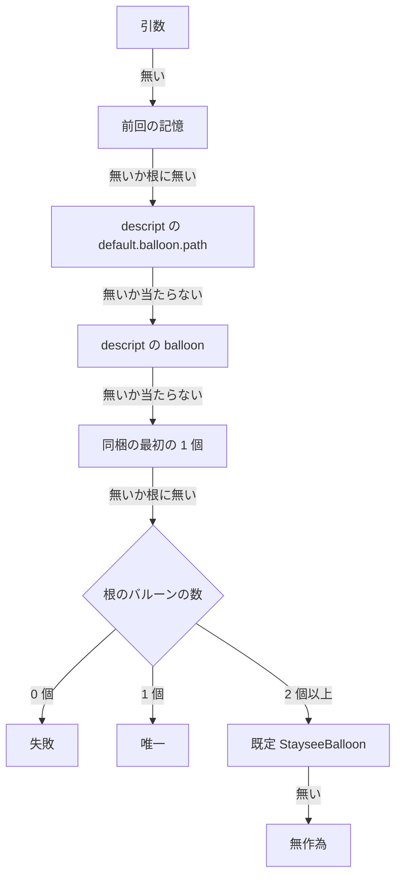

# Design Document: areka-P0-ghost-standard-balloon

## Overview

**Purpose**: ゴーストの作者が示した標準のバルーン（書庫に同梱した最初の 1 個・ゴーストの descript.txt の `default.balloon.path` と `balloon`）が、起動時とゴーストの切替でバルーンを決める段として効くようにする。

**Users**: ゴーストの作者（指定したバルーンでゴーストが出てくる・使われなかった理由をログで辿れる）と利用者（初めて起動したゴーストが作者の想定したバルーンで話す・自分で選んだバルーンは上書きされない）。

**Impact**: バルーンを決める鎖（`crates/areka/src/boot_resolve.rs` の `resolve_balloon`）の「記憶」と「同梱」の間に「descript の指定」の段を 1 つ足し、同梱の読み手（`crates/areka-ghost/src/catalog.rs` の `companion_balloon`）を「無印が無ければ `balloon0`」へ広げる。鎖の他の段・記憶の持ち方・切替の配線は変えない。

### Goals

- 同梱の段が「最初の 1 個」（無印 → `balloon0`）を使う。検体 `claudia` が記憶なしの起動で `claudia` のバルーンで出てくる。
- ゴーストの descript.txt の `default.balloon.path` → `balloon` が、記憶の次・同梱の前の段として効く。
- 当たらなかった指定ごとに警告が 1 件残り、ゴーストの切替でも「どの段で決まったか」が 1 件残る。
- 段の並びと areka が決めたことが `doc/COMPAT_ARCHITECTURE.md` §8 と網羅台帳に残る。
- 足した判断の分岐がすべて決定論の自動テストで固定される。

### Non-Goals

- `recommended.balloon`・`recommended.balloon.path` を読むこと（台帳の注記の文だけ直す）。
- ゴーストのフォルダの中の `balloon/` を探すこと（`areka-P0-ghost-inner-balloon`）。
- シェルに紐づくバルーン（`areka-P0-shell-companion-balloon`）。
- 記憶の持ち方・書き方を変えること（変更 0）。
- インストールの読み方（`crates/areka-nar/`）を変えること（変更 0 行）。
- 探索の規則を共有の関数へ移すこと（D1 で採らない）。

## Boundary Commitments

### This Spec Owns

- 同梱の最初の 1 個の読み方（`catalog::companion_balloon` の中身）。
- ゴーストの descript.txt の `default.balloon.path`・`balloon` の読み手（`catalog::standard_balloon_keys`・新設）。
- バルーンを決める鎖の「descript の指定」の段と、その段の警告 `descript_balloon_not_found`、決まった段の腕 `BalloonRoute::Descript`。
- ゴーストの切替で決まったバルーンの記録 `switch_balloon_resolved`。
- `doc/COMPAT_ARCHITECTURE.md` §8 の 2 行と、網羅台帳 `doc/ukadoc-coverage/ledger/assets.toml` の 5 行（`descript_ghost` の `balloon`・`default.balloon.path`・`recommended.balloon`・`recommended.balloon.path`、`descript_install` の `*.directory`）。
- 台帳の 2 行の状態と担当を変えたことに伴う、`doc/ukadoc-coverage/briefing.md` のページ別の数（`descript_ghost`）と `doc/ukadoc-coverage/roadmap-draft.md` の本 spec の 1 行（「文書と台帳」の節）。

### Out of Boundary

- `crates/areka-nar/`（差分 0 行）。`areka-ghost` から `areka-nar` への依存は足さない。
- 鎖の他の段（引数・記憶・唯一・既定・無作為・0 個の失敗）と、同梱の段の突き合わせ・警告 `companion_balloon_not_found` の形。
- 記憶の読み書き（`boot_resolve.rs` の `read_last_balloon`・`LastUsed::record`・`record_last_balloon`）。
- 実行中のバルーンの切替の決め方（`crates/areka/src/emo2_boot/shell_balloon_resolve.rs` の `resolve_skin_target`。差分 0 行）とシェルの切替（`emo2_boot/frame/switch.rs`・`shell_balloon_switch.rs`）、`ghost_session.rs`。
- 台帳の上の 5 行以外の行、`doc/ukadoc-coverage/linkage.md`、`briefing.md`・`roadmap-draft.md` の上に挙げた所以外、台帳の `priority` の欄と注記の末尾の「束: …」の文。
- `recommended.*` の 2 行の status（`absent` のまま）。

### Allowed Dependencies

- `areka-ghost` → `areka-parsers`（`charset::decode`・`kv::parse_kv`。今と同じ）。新しいクレート・新しい依存は 0。
- `areka`（bin）→ `areka-ghost::catalog`（今と同じ向き）。`boot_resolve.rs` は `catalog::BalloonEntry` を借りるだけで、`emo2_boot` の型を使わない（`emo2_boot` → `boot_resolve` の向きを逆にしない）。
- 上流から受け取るのは、完了 `areka-P0-install-companion-reading` の探索の順（無印 → 0 → 1…・「見つかった」は `*.directory` の行が在ること・先頭に 0 を付けた綴りは数えない）だけ。共有する関数は 0 個。

### Revalidation Triggers

次を変えたら、同じファイルを触る `areka-P0-shell-companion-balloon`・`areka-P0-ghost-inner-balloon` は設計を見直す。

- `BalloonInputs` の欄と `listed` の型、`BalloonRoute` の腕の並びと綴り（とくに `Companion`。`tools/package.ps1` と `crates/areka/tests/smoke_boot_loop_exit.rs` が `route=Companion` を見る）。
- `catalog::companion_balloon`・`catalog::standard_balloon_keys` の戻り値の意味。
- 記録の名前と欄（`balloon_resolved`・`switch_balloon_resolved`・`descript_balloon_not_found`・`companion_balloon_not_found`）。
- 段の並び（`doc/COMPAT_ARCHITECTURE.md` §8 の行）。

## Architecture

### Existing Architecture Analysis

- 鎖は純粋な関数 1 つ（`boot_resolve::resolve_balloon`）で、I/O を持たない。入力は `boot_config::resolve_balloon_for_ghost` が集める。この口を起動（引数なしの腕）とゴーストの切替（`emo2_boot/ghost_switch.rs` の `boot_into`＝1 体を起こす共通の手順）の両方が呼ぶ。
- 引数でバルーンを渡した起動は、`boot_config::resolve_boot_from` が鎖を直接呼び、入力を集める口を通らない（記憶も同梱も読まない）。
- 「バルーンを決めました」（`balloon_resolved`）を出すのは `resolve_boot_from` の 1 か所だけ。切替は今、決まった段を記録していない。
- `catalog.rs` の `lowercased`（鍵を小文字化した表を作る関数）は空の値の鍵を落とすので、「行は在るが値が空」と「行が無い」を見分けられない。
- 名前からバルーンを決める実行中の決め方（`resolve_skin_target` の最後の腕）は「`name` が一致する最初の候補 → 無ければフォルダ名が一致する候補」。その前に `random`・`lastinstalled` を特別に解く。

### Architecture Pattern & Boundary Map

今の型（読み手は `catalog.rs`・判断は純粋な鎖・集めるのは `boot_config.rs`）をそのまま伸ばす。新しい部品・新しいファイル（本番）は 0。



**Architecture Integration**:

- 採った型: 既存の 3 ファイルを伸ばす（research.md §4.1 の案 A）。切替の記録のために `ghost_switch.rs` へ記録 1 件だけ足す。
- 責務の分け方: ファイルを読むのは `catalog.rs` だけ。当たり・外れの判断と「当たらなかった」の警告は鎖だけ。`boot_config.rs` は読んだ値を渡すだけで判断しない。
- 保つもの: 鎖が純粋な関数であること・`BalloonRoute::Companion` の綴り・起動の `balloon_resolved` が 1 件であること・記憶の書き方。
- 新しい部品を作らない理由: 足す読み手は鍵 2 つ、足す段は 1 つで、どちらも今の部品に同じ型の先例が在る（`catalog::sakura_name`・鎖の記憶の段）。

### 設計の決め（D1〜D7 と切替の記録）

| 決め | 採ったもの | 採らなかったものと理由 |
|---|---|---|
| **D1** 探索の順をどこに書くか | `companion_balloon` の中で `balloon.directory` → `balloon0.directory` の 2 鍵を順に引く。最初の 1 個は、無印か `balloon0` か「無し」の 3 通りしか無い（探索は最初に無い番号で止まるので、`balloon0` が無ければ `balloon1` 以降は読まれない）。ループも番号の組み立ても要らない | `areka-parsers` へ共有の関数を移す案: 境界の外の `crates/areka-nar/src/manifest.rs` を触る。起動の側が要るのは 2 鍵だけで、共有する中身が無い。`areka-ghost` が `areka-nar` に依存する案: `catalog.rs` の冒頭の決まり（依存しない）に反する |
| **D2** `balloon` の決め方を実行中の切替とどう揃えるか | 鎖の中に「`name` が一致する最初 → 無ければフォルダ名」を書き、`resolve_skin_target` と同じ答えになることを突き合わせのテスト 1 本で固定する。`shell_balloon_resolve.rs` は差分 0 行 | 最後の腕を共有の関数へ切り出す案: 候補の型が違う（`SkinCandidate` と `BalloonEntry`）ので、取り出し方を引数で渡す関数になり、置き換える 2 行より長い。完了 spec のファイルも触る。`resolve_skin_target` を丸ごと呼ぶ案: `random`・`lastinstalled` が特別に解かれ 2.8 に反する |
| **D3** 鎖へ渡す列挙の形 | `listed: &[catalog::BalloonEntry]`（`list_balloons` の戻りをそのまま）。`boot_config.rs` のフォルダ名へ落とす 1 行が消える。並びと件数は今と同じなので、無作為の段の添字も変わらない | フォルダ名と `name` の組の新しい型: 使い手が 1 つの型を増やす。`SkinCandidate` の列: `boot_resolve` が `emo2_boot` に依存し、向きが逆になる |
| **D4** descript の 2 鍵の読み方 | `standard_balloon_keys` が `master_descript_keys`（`ghost/master/descript.txt` を 1 回読む関数）を 1 回だけ呼び、2 鍵を 1 つの値で返す。読めないときの記録は 1 件（5.4） | 鍵ごとの読み手 2 つ: 読めないとき `catalog_descript_unreadable` が 2 件出る |
| **D5** 記録の名前と欄 | 警告は 1 つの名前 `descript_balloon_not_found` に欄 `key`・`value`・`balloon_store`。値は切り詰めない（隣の `companion_balloon_not_found`・`last_balloon_not_found` と同じ扱い）。決まった段の腕は `BalloonRoute::Descript` の 1 つ | 鍵ごとに別の名前: 欄で足りる。腕を鍵ごとに 2 つ: 5.1 が求めるのは descript の段の区別だけ。値の切り詰め: 同じ関数の 2 つの警告と扱いが割れる |
| **D6** 台帳の状態と証拠 | `balloon` は `implemented`、`default.balloon.path` は `degraded`（相対パスのうち、根のバルーンの置き場の直下 1 段だけを読む。違いを注記に書く）。担当はどちらも本 spec。正典 URL の行は `StandardBalloonKeys` の 2 つの欄の上に置く。`priority` と「束: …」の文は触らない | `default.balloon.path` も `implemented`: 区切りを含む相対パスを読まないので「正典どおり」とは書けない。`linkage.md` を直す案: 束の帰属と数は対象の 4 状態（`implemented`・`vocabulary-only`・`degraded`・`absent`）をまとめて数えるので、状態を変えても動かない（直す必要が無い） |
| **D7** テストの置き場 | 兄弟の新しいテストファイル 4 本（File Structure Plan）。既存の `boot_resolve_tests.rs` は補助関数 1 つだけ追随 | 既存のテストファイルへ足す案: `boot_resolve_tests.rs` 824 行・`ghost_switch_tests.rs` 988 行で、1,000 行の番人に近い |
| **切替の記録**（5.8 と 5.1） | `ghost_switch.rs` の `boot_into` で、バルーンが決まった直後に `switch_balloon_resolved`（info）を 1 件出す。起動の `balloon_resolved` のコードは差分 0 行なので、起動は 1 件のまま。文面は「切替先のバルーンが決まりました」（`tools/package.ps1` が探す「バルーンを決めました」を含まない綴りにする） | `resolve_balloon_for_ghost` の中で `balloon_resolved` を出す案: 起動の引数の腕にも同じ記録をもう 1 か所書くことになり、起動の 1 件を 2 か所で保つ形になる。切替のたびに配布物の検査が探す文面が増える |

### Technology Stack

| Layer | Choice / Version | Role in Feature | Notes |
|-------|------------------|-----------------|-------|
| 読み手 | `areka-ghost`（`catalog.rs`）・`areka-parsers` の `charset::decode`・`kv::parse_kv` | install.txt と descript.txt の鍵を読む | 新しい依存 0 |
| 判断 | `areka`（bin）の `boot_resolve.rs` | 段の並びと当たり・外れ | 純粋な関数のまま |
| 記録 | `tracing` | 警告と「決まった段」 | 既存の欄の形（`event`・値・置き場） |
| 台帳の道具 | `ukadoc-survey` | 報告の作り直しと検査 | 道具そのものは変えない |

## File Structure Plan

### Directory Structure

```
crates/areka-ghost/src/
├── catalog.rs                         # 直す: companion_balloon の中身・standard_balloon_keys を足す
├── catalog_standard_balloon_tests.rs  # 新: 2 つの読み手のテスト
├── catalog_test_support.rs            # 直す: hold_exclusive を受け入れる（pub(super)）
└── catalog_tests.rs                   # 直す: hold_exclusive を手放す・古いコメント 1 か所
crates/areka/src/
├── boot_resolve.rs                    # 直す: BalloonInputs・BalloonRoute・resolve_balloon の段
├── boot_resolve_balloon_tests.rs      # 新: 鎖の純粋なテスト（段の並び・descript の突き合わせ）
├── boot_resolve_tests.rs              # 直す: 補助関数 balloon の 1 か所だけ
├── boot_config.rs                     # 直す: resolve_balloon_for_ghost・resolve_boot_from の引数の腕
├── boot_config_balloon_tests.rs       # 新: 実ファイルで入力を集める口と起動の入口を踏む
└── emo2_boot/
    ├── ghost_switch.rs                # 直す: boot_into に記録 1 件・テストの mod 1 つ
    └── ghost_switch_balloon_tests.rs  # 新: 切替の土台で切替先のバルーンと記録を確かめる
doc/
├── COMPAT_ARCHITECTURE.md             # 直す: §8 に 2 行
└── ukadoc-coverage/
    ├── ledger/assets.toml             # 直す: 5 行
    ├── briefing.md                    # 直す: descript_ghost のページ別の数
    ├── roadmap-draft.md               # 直す: 本 spec の [[spec]] 1 行と数
    └── report/                        # 作り直し（道具が書く・手で直さない）
```

### Modified Files

- `crates/areka-ghost/src/catalog.rs` — `companion_balloon` を最初の 1 個へ（名前と戻り値の型は変えない）。`StandardBalloonKeys` と `standard_balloon_keys` を足す。冒頭の説明の「同梱バルーン名（`install.txt` の `balloon.directory`）」を直す。新しいテストの `mod` を 1 つ足す。
- `crates/areka-ghost/src/catalog_test_support.rs`・`catalog_tests.rs` — 共有なしで開いて「読めない」を作る補助 `hold_exclusive` を support へ移し、2 本のテストファイルから使う（同じ補助を 2 か所に書かない）。`companion_balloon_reads_one_key` の「番号付きは読まない」というコメントを直す（検体と期待値はそのまま通る）。`catalog.rs` の `companion_balloon` の説明の「番号付きの鍵は読まない」も直す。
- `crates/areka/src/boot_resolve.rs` — `BalloonInputs` に 2 欄を足し `listed` の型を変える。`BalloonRoute::Descript` を `Memory` と `Companion` の間に足す。`resolve_balloon` に段を足す。冒頭の説明（「7 分岐」「列挙の並びは判断に使わない」・既定の段の番号）を直す。新しいテストの `mod` を 1 つ足す。
- `crates/areka/src/boot_resolve_tests.rs` — 補助関数 `balloon` が、受け取ったフォルダ名の列を `name` 無しの `BalloonEntry` の列へ直し、新しい 2 欄に `None` を入れる。既存のテスト本体は差分 0 行。
- `crates/areka/src/boot_config.rs` — `resolve_balloon_for_ghost` が descript の 2 鍵を読んで渡し、列挙をそのまま渡す。`resolve_boot_from` の引数の腕は新しい 2 欄に `None` を渡す。関数の説明の段の並びを直す。新しいテストの `mod` を 1 つ足す。
- `crates/areka/src/emo2_boot/ghost_switch.rs` — `boot_into` に `switch_balloon_resolved` を 1 件。新しいテストの `mod` を 1 つ足す（891 行 → 900 行前後）。
- `doc/COMPAT_ARCHITECTURE.md`・`doc/ukadoc-coverage/ledger/assets.toml` — 「文書と台帳」の節のとおり。

## Requirements Traceability

| Requirement | Summary | Components | Interfaces / 記録 |
|---|---|---|---|
| 1.1, 1.2, 1.3, 1.4, 1.5, 1.6 | 無印 → `balloon0` の最初の 1 個・行で判定・先頭 0 は数えない | 同梱の読み手 | `catalog::companion_balloon` |
| 1.7, 1.8, 1.9, 1.10, 1.15 | フォルダ名の完全一致・無ければ警告 1 件・繰り下げない・区切りは読み替えない | 鎖（同梱の段・差分 0 行）＋同梱の読み手（1 個しか返さない） | `companion_balloon_not_found` |
| 1.11, 1.12, 1.13 | install.txt が無い・読めない・無印は今のまま | 同梱の読み手（無い・読めないの腕は差分 0 行） | `catalog_install_unreadable` |
| 1.14 | 空の値も「見つかった」・記録 0 件 | 同梱の読み手 | 行の有無と値を別々に見る |
| 2.1, 2.2, 2.13, 2.14 | 2 鍵を読む・空は無し・`recommended.*` は読まない | descript の読み手 | `catalog::standard_balloon_keys` |
| 2.3, 2.4, 2.5 | `default.balloon.path` は置き場の直下 1 段・区切り等は当たらない・ゴーストの中は見ない | 鎖（descript の段）＋入力を集める口（列挙は根の置き場だけ） | `descript_balloon_not_found` |
| 2.6, 2.7, 2.8 | `balloon` は `name` → フォルダ名・特別な語は解かない | 鎖（descript の段） | 突き合わせのテストで実行中の決め方と固定 |
| 2.9, 2.10, 2.11, 2.12 | `default.balloon.path` が先・鍵ごとの記録 | 鎖（descript の段） | `descript_balloon_not_found` |
| 3.1, 3.3, 3.4, 3.5, 3.6, 3.7, 3.8 | 段の並び・記憶が最優先・0 個は失敗 | 鎖 | `resolve_balloon` |
| 3.2 | 引数が在れば他を読まない | 起動の入口（引数の腕） | `resolve_boot_from` |
| 3.9 | 記憶の書き方は変更 0 | —（`LastUsed::record` は差分 0 行。`Descript` は引数以外なので今どおり書かれる） | — |
| 4.1 | 切替も同じ並び | 入力を集める口（起動と切替が同じ口）＋切替の記録 | `resolve_balloon_for_ghost` |
| 4.2, 4.3 | 実行中のバルーンの切替・シェルの切替は変更 0 | —（`shell_balloon_resolve.rs`・`shell_balloon_switch.rs`・`frame/switch.rs` は差分 0 行） | — |
| 5.1 | 起動で決まった段の記録は 1 件・descript を区別 | 起動の入口（記録のコードは差分 0 行）＋`BalloonRoute::Descript` | `balloon_resolved` の `route=Descript` |
| 5.2, 5.5, 5.6 | 鍵ごとの警告・件数の上限・書かれていなければ 0 件 | 鎖（descript の段） | `descript_balloon_not_found` |
| 5.3 | 同梱の警告は今と同じ形 | 鎖（同梱の段・差分 0 行） | `companion_balloon_not_found` |
| 5.4 | descript.txt が読めない → 1 件 | descript の読み手 | `catalog_descript_unreadable` |
| 5.7 | 記録の無い失敗の経路 0 本 | 全部（Error Handling の表） | — |
| 5.8 | 切替で決まった段を 1 件 | 切替の記録 | `switch_balloon_resolved` |
| 6.1, 6.2, 6.3, 6.6, 6.8 | §8 に並び・決め・上書き・ゴーストの中は見ない・記憶の注意 | 文書 | `doc/COMPAT_ARCHITECTURE.md` §8 |
| 6.4, 6.5, 6.7 | 台帳の 5 行 | 台帳 | `assets.toml`・報告の作り直し |
| 7.1, 7.5 | 同梱の読み方と値 | テスト | `catalog_standard_balloon_tests.rs`・`boot_resolve_balloon_tests.rs` |
| 7.2, 7.3, 7.4 | 段の並び・descript の突き合わせ | テスト | `boot_resolve_balloon_tests.rs`・`boot_config_balloon_tests.rs`・`catalog_standard_balloon_tests.rs` |
| 7.6 | 切替 | テスト | `ghost_switch_balloon_tests.rs` |
| 7.7 | 検体は `target\` の下だけ | テスト | `temp_path_kit::TempPath`・切替の土台の検体の複製 |

## Components and Interfaces

| Component | 層 | Intent | Req Coverage | Key Dependencies |
|---|---|---|---|---|
| 同梱の読み手 `companion_balloon` | areka-ghost / catalog | install.txt から同梱の最初の 1 個の名前を返す | 1.1〜1.6, 1.10〜1.14 | `areka-parsers`（P0） |
| descript の読み手 `standard_balloon_keys` | areka-ghost / catalog | ゴーストの descript.txt の 2 鍵を 1 回で読む | 2.1, 2.2, 2.13, 2.14, 5.4 | `master_descript_keys`（P0） |
| 鎖 `resolve_balloon` | areka / boot_resolve | 段の並びと当たり・外れ・警告 | 1.7〜1.9, 1.15, 2.3〜2.12, 3.1, 3.3〜3.8, 5.2, 5.3, 5.5, 5.6 | `catalog::BalloonEntry`（P0） |
| 入力を集める口 `resolve_balloon_for_ghost`・起動の入口 | areka / boot_config | 読んだ値を鎖へ渡す | 2.5, 3.2, 4.1, 5.1 | 2 つの読み手・鎖（P0） |
| 切替の記録 | areka / emo2_boot | 切替で決まったバルーンと段を残す | 4.1, 5.8 | 入力を集める口（P0） |

### areka-ghost / catalog

#### 同梱の読み手と descript の読み手

| Field | Detail |
|-------|--------|
| Intent | ゴーストのフォルダから、標準のバルーンの指定を文字列として取り出す（当たり・外れは判断しない） |
| Requirements | 1.1, 1.2, 1.3, 1.4, 1.5, 1.6, 1.10, 1.11, 1.12, 1.13, 1.14, 2.1, 2.2, 2.13, 2.14, 5.4 |

**Contracts**: Service [x]

##### Service Interface

```rust
/// `<ゴースト>/install.txt` の同梱の最初の 1 個の `*.directory` の値。
/// 名前と戻り値の型は今と同じ。
pub fn companion_balloon(ghost_dir: &Path) -> Option<String>;

/// ゴーストの descript.txt に書かれた標準のバルーンの指定。
/// 書かれていない鍵・空の値は `None`。
#[derive(Clone, Debug, PartialEq, Eq, Default)]
pub struct StandardBalloonKeys {
    /// ukadoc: https://ssp.shillest.net/ukadoc/manual/descript_ghost.html#default.balloon.path_2c_30d1_30b9:1
    pub default_balloon_path: Option<String>,
    /// ukadoc: https://ssp.shillest.net/ukadoc/manual/descript_ghost.html#balloon_2c_30d0_30eb_30fc_30f3_540d:1
    pub balloon: Option<String>,
}

/// `<ゴースト>/ghost/master/descript.txt` を 1 回読み、2 鍵を返す。
pub fn standard_balloon_keys(ghost_dir: &Path) -> StandardBalloonKeys;
```

`companion_balloon` の決まり:

| install.txt の中身 | 戻り値 | 記録 |
|---|---|---|
| ファイルが無い | `None` | 0 件（今と同じ） |
| 在るのに読めない | `None` | `catalog_install_unreadable` 1 件（今と同じ） |
| `balloon.directory` の行が在り、値が空でない | その値 | 0 件（今と同じ式で引く） |
| `balloon.directory` の行が在り、値が空 | `None`（`balloon0` へ進まない） | 0 件 |
| `balloon.directory` の行が無く、`balloon0.directory` の行が在り、値が空でない | その値 | 0 件 |
| `balloon.directory` の行が無く、`balloon0.directory` の行が在り、値が空 | `None`（`balloon1` へ進まない） | 0 件 |
| どちらの行も無い（`balloon1.directory`・`balloon00.directory`・`balloon.source.directory` だけ、を含む） | `None` | 0 件 |

- 行の有無は、空の値を落とさない読み方で見る（今の `lowercased` は空の値を鍵ごと落とすので、行の有無には使わない）。鍵は ASCII 小文字化して比べる。
- 値は今の `lowercased` の表から引く。無印の行が在るときの戻り値は、今の式（`lowercased` の表の `balloon.directory`）と同じになる（1.13）。
- 引く鍵は `balloon.directory` と `balloon0.directory` の 2 つだけ。`balloon00.directory` のような綴りは引かないので当たらない（1.6）。
- `lowercased` そのものは変えない（他の読み手の「空の値は無し」を保つ）。

`standard_balloon_keys` の決まり:

- `master_descript_keys` を 1 回だけ呼ぶ。descript.txt が無ければ 2 欄とも `None`・記録 0 件。読めなければ 2 欄とも `None`・`catalog_descript_unreadable` が 1 件（`master_descript_keys` が出す。5.4）。
- 鍵は `default.balloon.path` と `balloon`。空の値は `lowercased` が落とすので `None`（2.2）。値は前後の空白を落としただけで、読み替えない。
- `recommended.balloon`・`recommended.balloon.path` は引かない（2.14）。

**Implementation Notes**

- 正典 URL の行は `StandardBalloonKeys` の 2 つの欄の上（`Identity` の欄と同じ置き方）。台帳の `implemented` の証拠になる。
- Risks: 無印の行の扱いを変えると `tools/package.ps1` の「初回のバルーンは同梱」が赤になる。既存の `catalog_tests.rs` の同梱のテスト（無印と `balloon0` の両方 → 無印・空の無印 → 無し・読めない → 警告 1 件・検体 emo2 → `emo2-kakukaku`）は書き換えずに通ること。

### areka / boot_resolve

#### 鎖 `resolve_balloon`

| Field | Detail |
|-------|--------|
| Intent | 引数 → 記憶 → descript の指定 → 同梱 → 唯一 → 既定 → 無作為 の順で、最初に当たった段のバルーンに決める |
| Requirements | 1.7, 1.8, 1.9, 1.15, 2.3, 2.4, 2.6, 2.7, 2.8, 2.9, 2.10, 2.11, 2.12, 3.1, 3.3, 3.4, 3.5, 3.6, 3.7, 3.8, 5.2, 5.3, 5.5, 5.6 |

**Contracts**: Service [x]

##### Service Interface

```rust
pub(crate) enum BalloonRoute { Argv, Memory, Descript, Companion, Only, Default, Random }

pub(crate) struct BalloonInputs<'a> {
    pub root: &'a BasewareRoot,
    pub argv: Option<&'a Path>,
    pub memory: Option<&'a str>,
    /// ゴーストの descript.txt の `default.balloon.path`
    pub default_balloon_path: Option<&'a str>,
    /// ゴーストの descript.txt の `balloon`
    pub balloon_name: Option<&'a str>,
    pub companion: Option<&'a str>,
    /// `list_balloons` の戻り（フォルダ名の昇順）
    pub listed: &'a [areka_ghost::catalog::BalloonEntry],
}

pub(crate) fn resolve_balloon(
    inputs: &BalloonInputs<'_>,
    pick: impl FnOnce(usize) -> usize,
) -> Result<BalloonDecision, NoBalloon>;
```

- Preconditions: `argv` が在るとき、他の欄は読まれない（空でよい）。`listed` は `list_balloons` の並びのまま。
- Postconditions: 引数以外で決まったとき `folder` は `listed` のどれかのフォルダ名で、`dir` は `<根>/balloon/<folder>`。
- Invariants: I/O・時計・乱数源を持たない。出す記録は下の表のものだけ。

descript の段（記憶の段の後・同梱の段の前）:

| 順 | 鍵 | 欄 | 当たりの決め方 | 当たらなかったとき |
|---|---|---|---|---|
| 1 | `default.balloon.path` | `default_balloon_path` | 値と**フォルダ名**が、大文字と小文字を区別して完全に一致する候補（同梱・記憶の段と同じ `find`） | `descript_balloon_not_found` を 1 件出して順 2 へ |
| 2 | `balloon` | `balloon_name` | `name` が値と完全に一致する候補のうち、列挙の並びで最初のもの。1 つも無いときに限り、フォルダ名が値と完全に一致する候補 | `descript_balloon_not_found` を 1 件出して同梱の段へ |

- 欄が `None` の鍵は突き合わせず、記録も出さない（2.13・5.6）。
- 順 1 が当たれば順 2 は突き合わせない（`balloon` についての記録は 0 件。2.10）。
- どちらで当たっても決まった段は `BalloonRoute::Descript`。
- 値の検査（`..`・絶対パス・区切り）は書かない。列挙のフォルダ名は置き場の直下の 1 段の名前なので、そういう値は完全一致で当たらず、上の警告 1 件になる（2.4・5.2。検査を足すと記録の出口が増える）。同梱の値の区切りも同じ理由で `companion_balloon_not_found` 1 件になる（1.15。足すコードは 0 行）。
- `random`・`lastinstalled` を特別に扱う分岐は書かない（2.8）。
- `balloon` の `name` の同着だけは列挙の並び（フォルダ名の昇順）を使う。冒頭の説明の「列挙の並びは判断に使わない」を、この 1 点を除く形に直す。
- 同梱の段・唯一・既定・無作為・0 個の失敗は、`listed` の型に合わせた読み替え（フォルダ名の取り出し）だけで、判断は差分 0。

記録:

| 名前 | 段 | 水準 | 欄 | 件数 |
|---|---|---|---|---|
| `last_balloon_not_found` | 記憶 | warn | `memory`・`balloon_store` | 今と同じ |
| `descript_balloon_not_found` | descript | warn | `key`（`default.balloon.path` か `balloon`）・`value`（書かれていた値そのまま）・`balloon_store` | 鍵ごとに最大 1 件・1 回の解決で最大 2 件 |
| `companion_balloon_not_found` | 同梱 | warn | `companion`・`balloon_store` | 今と同じ（最大 1 件） |
| `balloon_picked_randomly` | 無作為 | info | 今と同じ | 今と同じ |

### areka / boot_config と emo2_boot

#### 入力を集める口・起動の入口・切替の記録

| Field | Detail |
|-------|--------|
| Intent | 読み手の値を鎖へ渡し、決まった段を記録に残す |
| Requirements | 2.5, 3.2, 4.1, 5.1, 5.8 |

- `resolve_balloon_for_ghost`（署名は変えない）: 記憶 → `catalog::standard_balloon_keys` → `catalog::companion_balloon` → `catalog::list_balloons(root)` を読み、鎖へ渡す。バルーンの候補は根の置き場の列挙だけで、ゴーストのフォルダの中は読まない（2.5）。ここでは記録を出さない。
- 4 つの読みは、今の記憶・同梱と同じく、段が当たるかどうかに関わらず先にまとめて行う（鎖を純粋に保つため）。読めないファイルの記録（`catalog_descript_unreadable`・`catalog_install_unreadable`）は、記憶の段で決まった解決でも出る。これは「当たらなかった」の記録ではなく、今の同梱の読み方と同じ扱いである。
- `resolve_boot_from`: 引数の腕は鎖を直接呼び、新しい 2 欄に `None` を渡す（読み手を呼ばない。3.2）。`balloon_resolved` の行は差分 0 行（5.1。`route = ?balloon.route` が `Descript` を載せる）。
- `ghost_switch.rs` の `boot_into`: `resolve_balloon_for_ghost` が `Ok` を返した直後に 1 件。

| 名前 | 水準 | 欄 | 文面 | 件数 |
|---|---|---|---|---|
| `balloon_resolved`（既存） | info | `route`・`dir` | 「バルーンを決めました」 | 起動 1 回につき 1 件（差分 0） |
| `switch_balloon_resolved`（新） | info | `ghost`（切替先のフォルダ名）・`route`・`dir` | 「切替先のバルーンが決まりました」 | `boot_into` がバルーンを決めるたびに 1 件 |

- 切替先を起こせず既定ゴーストへ戻すときも `boot_into` を通るので、起こそうとした 1 体ごとに 1 件になる（切替先で 1 件・戻した既定で 1 件）。
- バルーンが 0 個で決まらなかったときは、今どおり `ghost_switch_boot_failed`（`stage` が `balloon`）で、`switch_balloon_resolved` は出ない。

## Error Handling

黙って次へ進む出口は、要件が「記録は 0 件」と決めたものだけである。それ以外の「使われなかった」はすべて記録が残る（5.7）。

| 出口 | 扱い | 記録 | 要件 |
|---|---|---|---|
| install.txt が無い | 同梱の指定なし | 0 件 | 1.11 |
| install.txt が読めない | 同梱の指定なし | `catalog_install_unreadable` | 1.12 |
| 無印も `balloon0` も行が無い | 同梱の指定なし | 0 件 | 1.5 |
| 最初の 1 個の値が空 | 同梱の指定なし | 0 件 | 1.14 |
| 最初の 1 個が根に無い（区切りを含む値も） | 次の段へ | `companion_balloon_not_found` | 1.9, 1.15, 5.3 |
| descript.txt が読めない | descript の指定なし | `catalog_descript_unreadable` 1 件 | 5.4 |
| 鍵が無い・値が空 | その鍵の指定なし | 0 件 | 2.2, 2.13, 5.6 |
| 鍵の値が当たらない | 次の鍵か次の段へ | `descript_balloon_not_found`（鍵ごと） | 2.12, 5.2 |
| 根のバルーンが 0 個 | 失敗（今と同じ） | 起動は告知・切替は `ghost_switch_boot_failed` | 3.7 |

「descript.txt が読めない」の出口へ届くのは、引数でゴーストを渡した起動か、列挙の後で読めなくなった場合だけ（`list_ghosts` が descript.txt を読めないゴーストを先に除くため）。

起動を止める出口は増やさない（0 本）。

## 文書と台帳

### `doc/COMPAT_ARCHITECTURE.md` §8（2 行を足す・既存の「【上書き】」の行の型に合わせる）

1. **【上書き】起動時にバルーンを決める段の並びと、同梱の最初の 1 個**（完了 spec `areka-P0-baseware-root-layout` 要件 5.3〔同梱は無印の `balloon.directory`〕を上書きする。同 5.2〔利用者の選択は同梱より優先〕は崩さない）。書くこと:
   - 並び: 引数 → 記憶 → descript の指定 → 同梱の最初の 1 個 → 唯一 → 既定 → 無作為。理由は「利用者の選択を最優先・文字で書いた指定を、書庫の詰め方から導いた指定より上」（6.1）。ゴーストの切替は引数を除いた同じ並び。
   - 同梱は無印 → `balloon0` の最初の 1 個だけ。根に無くても 2 個目へ繰り下げない。値が空・区切りを含むときは当たらなかったものとし、読み替えない。空の値の無印も「見つかった」に数える（6.2 の 1・2 つ目）。
   - 記憶は起動のたびに書かれるので、作者の指定が効くのは記憶を持たないゴーストだけ。一度起動したゴーストは、利用者がメニューで選び直すまで記憶のバルーンのまま（6.8）。
   - 定義点（`catalog::companion_balloon`・`boot_resolve::resolve_balloon`）と固定するテストの置き場。
2. **ゴーストの descript.txt の `balloon`・`default.balloon.path` の読み方**（正典は「バルーン名」を何と突き合わせるか・「相対パス」の起点・両方が書かれたときの順に沈黙）。書くこと:
   - `balloon` はバルーンの descript.txt の `name` を先に、当たらなければフォルダ名（実行中の `\![change,balloon,バルーン名]` と同じ）。`random`・`lastinstalled` は特別に解かない。`name` の同着は列挙の並びで最初（完了 spec `areka-P0-baseware-root-layout` 裁定 3「列挙の並びは解決順に使わない」を、この同着に限って上書きする）。
   - `default.balloon.path` の起点は根のバルーンの置き場で、値はフォルダ名 1 段。`..`・絶対パス・区切りを含む値は当たらないものとし、読み替えない。
   - 両方が書かれているときは `default.balloon.path` を先に、当たらなければ `balloon`（6.2 の 3〜5 つ目）。
   - ゴーストの中の `balloon/` は見ない。`areka-P0-ghost-inner-balloon` が扱う（6.6）。
   - 記録の名前（`descript_balloon_not_found`・`switch_balloon_resolved`）と定義点。

### 網羅台帳 `doc/ukadoc-coverage/ledger/assets.toml`（5 行）

| 行 | status | owner | 注記に書くこと |
|---|---|---|---|
| `descript_ghost` の `balloon` | `absent` → `implemented` | 本 spec | 読み手と段の位置・`name` → フォルダ名・当たらないときの警告・根拠の場所（`StandardBalloonKeys` の欄の上の正典 URL）。もう無い関数 2 つを指す文は消す |
| `descript_ghost` の `default.balloon.path` | `absent` → `degraded` | 本 spec | 上と同じ項目に加えて、正典との違い（根のバルーンの置き場の直下 1 段だけ・区切りを含む相対パスは当たらない・ゴーストの中は `areka-P0-ghost-inner-balloon`） |
| `descript_install` の `*.directory` | 変えない | 変えない | 1 文を足す: 起動時とゴーストの切替で、同梱の最初の 1 個（無印 → `balloon0`）がそのゴーストの標準のバルーンになる（`catalog::companion_balloon`） |
| `descript_ghost` の `recommended.balloon` | `absent` のまま | 変えない | もう無い関数 2 つを指す 1 文を、今の決め方（`boot_resolve::resolve_balloon` の段の並び・この欄は段に入っていない）へ書き換える |
| `descript_ghost` の `recommended.balloon.path` | 同上 | 同上 | 同上 |

- 5 行とも `priority` と注記の末尾の「束: …」の文は変えない（`linkage.md`・`briefing.md` から道具が導く値で、状態を変えても束の帰属と数は動かない）。
- 直した後、`boot_config::default_balloon_root`・`boot_config::resolve_config_inputs` の綴りが `assets.toml` に 0 か所であることを検索で確かめる（今は 4 か所）。
- 2 行の状態と担当を変えるので、整合のテスト（`crates/ukadoc-survey/tests/consistency/` の `briefing_arms.rs`・`spec_checks.rs`）が数え直す次の 2 か所も同じコミットで直す（先例: 完了 `areka-P0-mouse-drag-events`）。
  - `briefing.md` の `[[barrier]]` `page = "descript_ghost"` の数: `implemented` 16 → 17・`degraded` 0 → 1・`absent` 58 → 56（着手時に今の値を読み直してから直す）。
  - `roadmap-draft.md` に本 spec の `[[spec]]` を 1 行足す（`owner_count = 2`）。併せて `[briefs].count`・`snapshot_on`・説明の段落を先例と同じ形で直す。
  - 採らなかった案: `owner` を空のままにする（`roadmap-draft.md` は触らずに済むが、読むようにした行の担当が台帳から辿れなくなる）。
- `cargo run -p ukadoc-survey -- report` で報告を作り直し、`cargo test -p ukadoc-survey` を通す。テストが全体の報告の食い違いを指したら `report-summary` も作り直す。報告は手で直さない。

## Testing Strategy

方針: 足した判断の分岐を全部踏む。すでに固定されている配線（同梱の段の警告・記憶の読み・`list_balloons` の文字コードの復号）は踏み直さない。記録は件数と欄の中身まで判定する（`log_capture_kit::capture`。捕まえるのは呼んだスレッドの記録）。検体と一時フォルダは `temp_path_kit::TempPath` か切替の土台の検体の複製で、どちらもワークツリーの `target\` の下（7.7）。

### 読み手（`crates/areka-ghost/src/catalog_standard_balloon_tests.rs`）

1. `companion_balloon`（7.1・7.5）: 番号付きだけ（`balloon0`・`balloon1` → `balloon0` の値）／`balloon1` だけ → 無し／`balloon00.directory` だけ → 無し／`*.directory` の行が無く同じ接頭辞の他の鍵だけ → 無し／空の無印＋`balloon0` → 無し／空の `balloon0`＋`balloon1` → 無し。どれも記録 0 件まで判定する。無印だけ・無印と `balloon0` の両方・install.txt が無い・読めないは、既存の `catalog_tests.rs` がそのまま担う（足さない）。
2. `standard_balloon_keys`（7.4 の読みの部分）: 2 鍵とも書かれている／片方だけ／鍵の大文字が混じる／値が空 → `None`／descript.txt が読めない → 2 欄とも `None` で `catalog_descript_unreadable` がちょうど 1 件。

### 鎖（`crates/areka/src/boot_resolve_balloon_tests.rs`・I/O なし）

3. 段の並び（7.2・7.3）: 記憶が descript と同梱に勝つ／descript が同梱に勝つ／同梱が既定に勝つ（候補 3 個以上）／同梱が無作為に勝つ（候補 2 個以上・既定のバルーンなし。無作為の添字は呼ばれない）／記憶の先が無く descript へ（警告 1 件）／descript の先が無く同梱へ（警告は鍵の数だけ）／同梱の最初の 1 個が無く、候補に 2 個目の名前が在っても既定へ（警告 1 件）／引数が在れば、当たらない記憶・descript・同梱を渡しても記録 0 件で `Argv`。各場面で、決まったフォルダ・段・記録の件数と欄を判定する。
4. descript の突き合わせ（7.4）: `default.balloon.path` だけで当たる・当たらない／値が `../balloon/x`・`balloon/x`・`x/`・`C:\balloon\x` → どれも警告 1 件（`key`・`value`・`balloon_store` を判定）で次の段へ／`balloon` が `name` で当たる・フォルダ名で当たる・どちらにも当たらない／`name` と別のバルーンのフォルダ名の両方に一致 → `name` の側／同じ `name` が複数 → 列挙の並びで最初／大文字と小文字だけ違う → 当たらない／値が `random`（`random` という `name` のバルーンが在れば当たり、無ければ警告 1 件。無作為の添字は呼ばれない）／両方が書かれ `default.balloon.path` が当たる → 記録 0 件／先が当たらず `balloon` が当たる → 警告 1 件／どちらも当たらない → 警告 2 件で同梱へ／どちらも `None` → 記録 0 件。
5. 同梱の値が区切りを含む（7.5 の 3 つ目）: 読み替えず `companion_balloon_not_found` 1 件で次の段へ。
6. 実行中の決め方との突き合わせ（2.6）: 同じ候補と同じ名前（`name` で当たる・フォルダ名で当たる・両方に一致・複数の `name`・当たらない）について、鎖が descript の段で決めたフォルダ名と、`resolve_skin_target` に `SkinSpec::Name` を渡した答えが一致することを判定する。`SkinCandidate` の列は、鎖へ渡すのと同じ `BalloonEntry` の列 1 つから、本番の `balloon_candidates` と同じ写し方で作る（2 つの列を別々に手で書かない）。

### 実ファイル（`crates/areka/src/boot_config_balloon_tests.rs`）

7. `resolve_balloon_for_ghost`: `claudia` と同じ形（`balloon0.directory`・`balloon1.directory` だけ・候補に既定のバルーンも置く）→ `Companion` で `balloon0` の値／descript の `balloon` と無印の同梱の両方 → `Descript`／`default.balloon.path` と同じ名前のフォルダがゴーストの中の `balloon/` にだけ在る → 当たらず警告 1 件（7.4 の 3 つ目）。
8. `resolve_boot_from`: 引数なしで descript の指定が当たる起動 → `balloon_resolved` がちょうど 1 件で `route` が `Descript`（5.1）／引数でバルーンを渡し、ゴーストに当たらない descript・同梱・記憶を置いた起動 → `Argv`・「当たらなかった」の記録 0 件・`balloon_resolved` 1 件（3.2）。

### 切替（`crates/areka/src/emo2_boot/ghost_switch_balloon_tests.rs`・切替の土台 `SwitchRig`）

どちらの場面も、準備で切替先の検体の複製に記憶（`[last] balloon`）が無いことを確かめる（残っていると記憶の段が勝ち、場面が成り立たない）。

9. 土台の根に 2 つ目のバルーン（土台のバルーンの複製・フォルダ名と `name` を変える）を足し、切替先の descript.txt に `balloon,<2 つ目のバルーンの name>` を足して切り替える → 起動の文脈の今のバルーンが 2 つ目・段が `Descript`・`switch_balloon_resolved` がちょうど 1 件で `route` と `dir` が合う（7.6・5.8）。
10. 切替先の install.txt を番号付きだけ（`balloon0.directory` が 2 つ目・`balloon1.directory` が元のバルーン）に書き換えて切り替える → 2 つ目・`Companion`・記録 1 件（7.6）。

「切替先を起こせず既定ゴーストへ戻すと記録が 2 件」の場面は足さない。記録は `boot_into` の 1 か所で、2 件になるのは既存の「戻す」配線が `boot_into` を 2 回通るからであり、本 spec が足す判断の分岐ではない。

### 既存のテストと見張り（書き換えずに通ること）

- `catalog_tests.rs` の同梱のテスト・`boot_resolve_tests.rs` のバルーンのテスト（補助関数だけ追随）・`main_config_input_tests.rs` の `resolve_balloon_for_ghost` の 5 本・`smoke_boot_loop_exit.rs` と `tools/package.ps1` の `route=Companion`・1 ファイル 1,000 行の番人・`cargo test -p ukadoc-survey`。

### 実機の確認（実装の後・根は `target\` の下の短い絶対パス）

- 準備: `target\` の下に短い名前の根を作り、`ghost\claudia`・`balloon\claudia`・`balloon\claudia_vertical`・`balloon\StayseeBalloon`（`vendors/sample_ghost/` の書庫から）を並べる。`AREKA_ROOT` にその根、`AREKA_PROFILE_DIR` に同じ `target\` の下の空のフォルダを渡す。
- A（同梱の最初の 1 個）: `ghost\claudia\ghost\master\profile\areka\sylphya.toml` に `[last] balloon` が無いことを確かめてから起動する。ログの「バルーンを決めました」の行が `route=Companion` で `dir` の末尾が `\balloon\claudia`、画面のバルーンが `claudia` であること（本 spec の前は `route=Default`）。
- B（記憶が勝つ）: A の後、そのまま起動し直す。`route=Memory` で同じバルーンであること。
- C（descript の段）: 記憶のファイルを消し、`ghost\claudia\ghost\master\descript.txt` に `balloon,<claudia_vertical の name かフォルダ名>` を 1 行足して起動する。`route=Descript` で `dir` の末尾が `\balloon\claudia_vertical` であること。続けて記憶のファイルをもう一度消し（C の 1 回目の起動が記憶を書くため）、値を在りもしない名前に変えて起動し、`descript_balloon_not_found`（`key=balloon`）が 1 件出て `route=Companion` へ進むこと。
- 起動は有界の自動終了（`AREKA_APP_SMOKE_EXIT_MS`）で止め、判定はログの検索で行う。emo2 を使う確認を足すときは短い絶対パスにする。

## 実装の順（タスク分けの目安・6〜8 個）

1. `catalog.rs` の 2 つの読み手とそのテスト（`hold_exclusive` の移動を含む）。
2. `boot_resolve.rs` の欄・腕・descript の段とそのテスト、`boot_resolve_tests.rs` の補助関数、`boot_config.rs` の 2 か所（型が変わるので同じタスクで通す）。
3. `boot_config_balloon_tests.rs`。
4. `ghost_switch.rs` の記録と `ghost_switch_balloon_tests.rs`。
5. `doc/COMPAT_ARCHITECTURE.md` §8。
6. 台帳の 5 行・`briefing.md` と `roadmap-draft.md` の数・報告の作り直し・`cargo test -p ukadoc-survey`。
7. 実機の確認 A〜C。

1 と 2 は順に、5 と 6 は 2 の後ならどちらが先でもよい。

## Supporting References

- 調べたことと選ばなかった案の詳しい経緯は同じフォルダの `research.md`（§5 の D1〜D7・§9 の設計の段の決め）。
- 正典: ukadoc「Install設定」 https://ssp.shillest.net/ukadoc/manual/descript_install.html ・「ゴースト設定」 https://ssp.shillest.net/ukadoc/manual/descript_ghost.html
