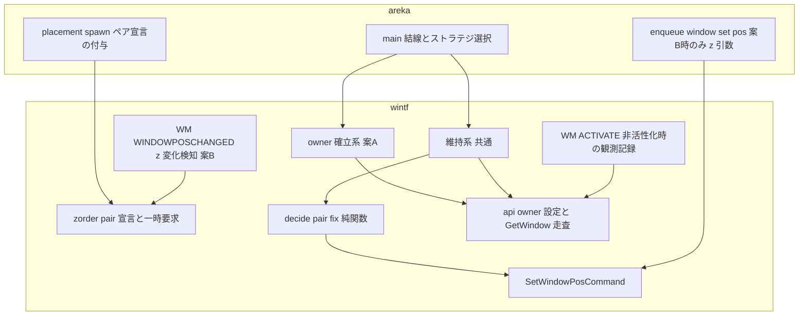
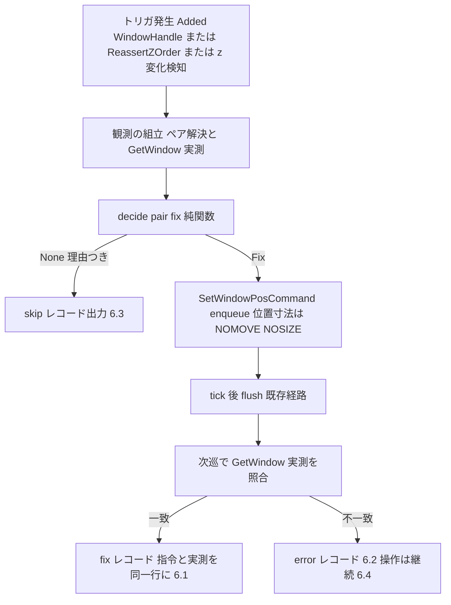
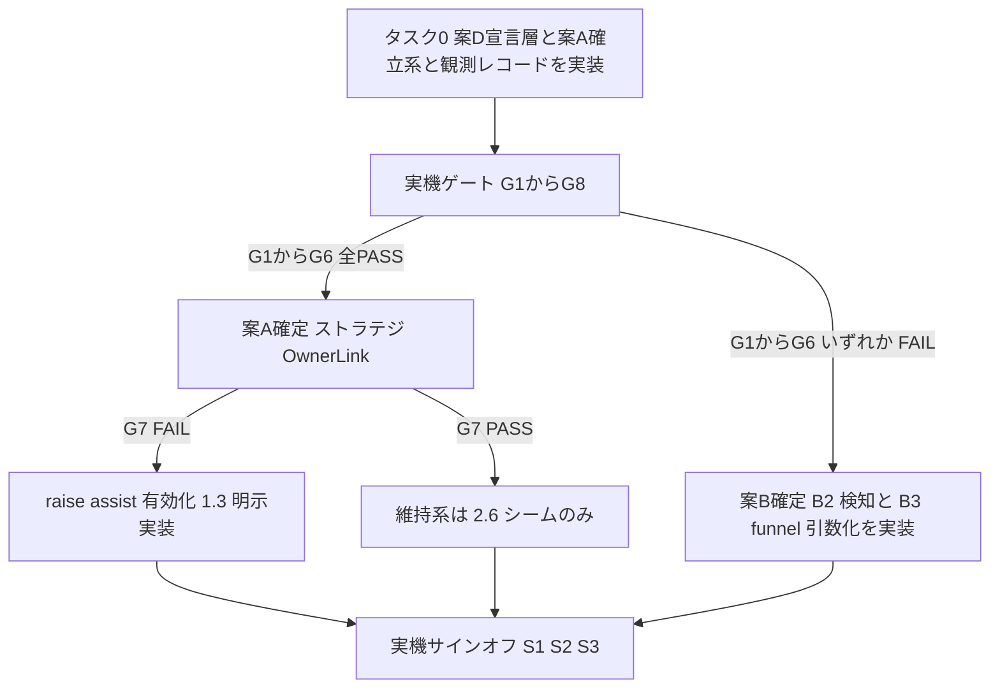

# Technical Design: areka-P0-ghost-window-zorder

## Overview

**Purpose**: 本フィーチャーは、ゴーストを構成するトップレベル窓（各スコープのキャラ窓・バルーン窓）の重なり順（Z オーダー）をベースウェアの責務として初めて管理し、「同一スコープにおいてバルーン窓は自分のキャラ窓のすぐ手前にある」という不変条件を全操作経路で成立させる。これにより、キャラ窓を操作するとバルーンが他アプリの窓の背後に埋もれて会話が読めなくなる中核体験の毀損を解消する。

**Users**: ゴーストを常駐させるエンドユーザーが、ドラッグ・クリック・DPI 変化・再配置のどの経路でも会話を読み続けられる。areka の開発者・運用者は、診断ログと実機観測レコードで重なりの不具合を切り分けられる。

**Impact**: 現状「語彙は完備・配線ゼロ」の `ZOrder`（wintf）に初めて本番の消費者を与える。本線は **案 A（Win32 owner 関係）**で OS 保証により経路網羅を構造化し、実機ゲートで問題が出た場合のみ **案 B（B2 z 変化検知＋B3 funnel 引数化の明示維持）**へフォールバックする（要件ディスカッション 2026-08-11 裁定・research.md §8-1）。いずれの案でも areka 側の窓生成コードは同一（**案 D 宣言コンポーネント層**を経由）。

### Goals

- 同一スコープの「バルーンはキャラのすぐ手前」不変条件の確立と全経路での維持（要件 1・2）
- スコープ間の上下関係を強制しない ukadoc 準拠（要件 3）
- 他アプリ活性化時にゴースト一式が一緒に背面へ回る既定挙動の保持（要件 4）
- 透過・クリック透過・ドラッグ・追従・タスクバー非露出の無損傷（要件 5）
- 指令と実測結果の 2 値を同じレコードに残す診断可能性（要件 6）と、純関数化した判断の決定論的テスト＋実機サインオフ（要件 7）
- `\v`（stayontop）相当を後から 1 ビットで足せる既定状態（要件 8）

### Non-Goals

- スコープ間（本体側 ⇄ 相方側）の上下関係の強制（ukadoc「ユーザの操作次第」）
- `\v`／`\![set,windowstate,*]`／`OnWindowState*`／`OnFullScreenApp*` の解釈・実装（要件 8.3/8.4・語彙は brief.md が正本）
- 最小化・タスクバー表示・Alt+Tab の扱いの変更（要件 8.5）
- バルーンの表示／非表示ライフサイクル（`areka-P0-balloon-visibility` の所有。本設計は要件 2.6 のシームのみ提供）
- 窓の位置・寸法の正しさ（`areka-P0-dpi-window-vanish`／`areka-P0-kero-balloon` の所有。本設計の Z 調整は位置・寸法を一切変更しない＝要件 1.6）

## Boundary Commitments

### This Spec Owns

- ゴースト窓ペア（同一スコープの キャラ窓 × バルーン窓）の**重なり関係の宣言・確立・維持**の全機構
- wintf 新設の窓ペア宣言コンポーネント `KeepDirectlyAbove` と再断行シーム `ReassertZOrder` の契約
- Z オーダー是正判断の純関数 `decide_pair_fix` と、その適用系（owner 確立系・維持系）
- Z オーダー調整の診断ログ語彙（指令＋実測の 2 値レコード）と実機サインオフの観測手段（`GetWindow` 走査）
- 案 A 実機可否ゲートの判定基準と、案 B へのフォールバック分岐の定義

### Out of Boundary

- バルーン show/hide の状態遷移判断（`areka-P0-balloon-visibility`）——同 spec が再表示時に `ReassertZOrder` を挿入する（相互登記。本設計「Components > ReassertZOrder」参照）
- 窓の位置・寸法の決定と書込値（`enqueue_window_set_pos` の x/y/size 系は既存所有のまま。本 spec が触るのは z 引数の追加のみ・案 B 限定）
- SERIKO・talk・SHIORI・描画合成（emo-*）
- `WS_EX_TOPMOST` の付与（要件 4.3/8.1。`ZOrder::TopMost` は本 spec では**使用禁止**）

### Allowed Dependencies

- wintf 既存資産: `ZOrder` 語彙（`window_pos/mod.rs`）・`SetWindowPosCommand`（`hwnd_insert_after` 搬送済み）・`is_self_initiated()` エコー判定・`dispatch_window_message` 配送表・`capture_under_filter` テスト支援
- areka 既存資産: `GhostWindows`／`CharWindowMarker`／`BalloonWindowMarker`（scope↔窓対応）・`register_ghost_windows_click_through` の `Added<WindowHandle>` パターン・`placement/diag.rs` の専用 target 方式
- Win32 API（`windows` crate・追加依存なし）: `SetWindowLongPtrW(GWLP_HWNDPARENT)`・`GetWindow(GW_HWNDPREV/GW_HWNDNEXT)`・`SetWindowPos`
- **依存方向の遵守**: areka → wintf のみ。**wintf → areka の import は禁止**（`lifecycle.rs:34-35` の既存規約）。ゆえにペア宣言は wintf 側コンポーネント、scope 解決は areka 側で行い、ログは entity を結合キーとして突合する（`window_move.rs` `log_window_move` の先例）

### Revalidation Triggers

- `KeepDirectlyAbove`／`ReassertZOrder` の契約形状変更 → `areka-P0-balloon-visibility` の設計へ波及（要件 2.6 シームの相互登記）
- 案 A → 案 B へのフォールバック発動 → `enqueue_window_set_pos` の署名変更が入るため、同 funnel を呼ぶ全 placement 経路（drag end／DPI 再射影／復元／リサイズ／追従／`\![move]`）の再確認
- `SetWindowPosCommand` flush 経路（`tick_bridge`／`command.rs`）の改造 → `dpi-transition-atomicity`（W6.75）と要着手時再突合（roadmap 干渉台帳 atom⇄zorder）
- ゴースト窓の破棄経路（despawn → `WindowRegistry` drop → `DestroyWindow`）の変更 → 要件 5.9 の owner 破棄カスケード対処の再検証

## Architecture

### Existing Architecture Analysis

- **窓生成**: `spawn_ghost_windows`（`spawn.rs:217-328`）はスコープごとに**バルーン → キャラの順**で spawn。owner/parent を渡す口は無く（`window_factory.rs:137` の `LibWindow::new_ex`）、既存 `Window.parent` は `SetParent`＝子窓化で owner とは別概念（`:151-157` に明記）。ゆえに owner は**両窓の HWND 確定後に後付け**するしかない。
- **位置書込**: ゴースト窓の実運用書込は areka 単一 funnel `enqueue_window_set_pos`（`window_move.rs:452-544`）が担い、`SWP_NOZORDER`＋`hwnd_insert_after: None` をハードコード、`WindowPos` は `bypass_change_detection` で書く。ゆえに `WindowPos.zorder` へ値を入れるだけでは効かない（wintf `apply_window_pos_changes` は `Changed<WindowPos>` 駆動で発火しない）。
- **活性化の観測**: `WM_ACTIVATE`（`keyboard.rs:119-169`）は非活性化のみ処理。`WM_WINDOWPOSCHANGED`（`window_proc/window_pos.rs:36-`）は位置・寸のみ消費し z を見ていないが、`is_self_initiated()` の自己ループ遮断は既設。
- **既存パターンの踏襲**: 政策コンポーネント（areka が付け wintf が読む）＝`DpiSuggestedRectPolicy`、entity 参照宣言＝`BalloonFollow`、判断の純関数化＝`dpi_suggested_position_decision`、HWND 付与検知＝`Added<WindowHandle>` system。本設計はこの 4 先例に完全に乗る。

### Architecture Pattern & Boundary Map



**Architecture Integration**:

- **選択パターン**: 宣言コンポーネント層（案 D）を共通の口として、本線＝案 A（Win32 owner の OS 保証）、フォールバック＝案 B（B2 検知＋B3 funnel 同乗の明示維持）。ストラテジは Resource `ZOrderPairStrategy` で切り替え、areka の spawn コードは両案で同一。
- **責務分界**: 「どの窓とどの窓がペアか」の宣言＝areka（scope を知る唯一の層）。「宣言をどう Win32 に反映するか」＝wintf（HWND と Win32 API を知る唯一の層）。
- **保存する既存パターン**: 判断の純関数化・`Added<WindowHandle>` での HWND 確定検知・`SetWindowPosCommand` 遅延 flush・`is_self_initiated()` エコー遮断・専用 target 診断ログ。
- **Steering 準拠**: wintf → areka import 禁止・WUC を触らない（窓スタイルと z のみ）・`tracing` 構造化ログ・テスト分離の兄弟ファイル規約。

### Technology Stack

| Layer | Choice / Version | Role in Feature | Notes |
|-------|------------------|-----------------|-------|
| Window System | Win32 API（`windows` 0.62.2・既存依存） | `SetWindowLongPtrW(GWLP_HWNDPARENT)`・`GetWindow`・`SetWindowPos` | 追加依存なし。`GetWindow`／owner 設定は本 spec で新設の safe wrapper 経由 |
| ECS | bevy_ecs 0.18（既存） | 宣言コンポーネント・維持系 system・Resource ストラテジ | Win32 を触る system は UI スレッド固定（NonSend パラメータで担保） |
| Logging | tracing（既存） | 指令＋実測 2 値レコード・専用 target | `RUST_LOG` grep で実機サインオフ判定 |

## Plan A 実機可否ゲートとフォールバック分岐

**最初の実装タスクはこのゲートである**（roadmap W6 編成条件⑶・research.md §8-1）。案 D 宣言層＋案 A の owner 確立系＋観測レコードだけを実装した状態で実機（混在 DPI 2 モニタ・emo2 fixture・release）を有界自動終了つきで走らせ、以下を判定する。

| # | 判定項目 | PASS 基準（ログ／観測） | FAIL 時の帰結 |
|---|---|---|---|
| G1 | WUC 合成の生存 | owner 付与後も両窓が描画され続ける（デバイスロスト・黒窓なし） | **案 B へ切替** |
| G2 | クリック透過の生存 | 透明部クリックが背後アプリへ届き、不透明部がゴーストへ届く（要件 5.1/5.2） | **案 B へ切替** |
| G3 | `WS_EX_TRANSPARENT` トグルの生存 | owner 付与後もトグルが機能し、スタイルがリセットされない（要件 5.3） | **案 B へ切替** |
| G4 | タスクバー／Alt+Tab 非露出 | `WS_EX_TOOLWINDOW` の現行の見え方が不変（要件 5.5） | **案 B へ切替** |
| G5 | ドラッグ＋バルーン追従 | キャラ窓ドラッグ・バルーン単独ドラッグ・追従が現行どおり（要件 5.4） | **案 B へ切替** |
| G6 | owner 活性化でペア浮上＋隣接 | キャラ窓クリック後 `GetWindow(char, GW_HWNDPREV) == balloon` の実測レコード（要件 1.1/1.2） | **案 B へ切替**（A の中核保証の不成立） |
| G7 | owned 活性化で owner も浮上 | バルーン窓クリック後、キャラ窓が他アプリ窓の背後に残らない（要件 1.3） | **案 A 継続＋raise assist 有効化**（z 変化検知を有効化し、維持系の `RaisedAbove` トリガで 1.3 を明示実装。research.md §8-6 の裁定どおり） |
| G8 | 破棄順序の双方向で異常終了なし | char 先行 despawn／balloon 先行 despawn の双方でプロセス継続（要件 5.9） | **owner 切離し機構を必須化**（下記「破棄経路」）。切離しでも解けない場合は案 B へ切替 |

- 判定は G1→G8 の順で行い、G1〜G6 のいずれかが FAIL した時点で案 B 確定（残項目の検証は案 B 構成で再実施）。
- 要件 5.6 の実装形がこの表である——「重なりを保証する手段が 5.1〜5.5 を損なうことが実機で判明した場合、その手段を採用しない」。
- ゲートの観測はすべて構造化ログ（下記診断ログ語彙）で残し、判定表を `verification/plan-a-gate.md` として spec 配下に記録する。

## File Structure Plan

### New Files

```
crates/wintf/src/ecs/window/
├── zorder_pair.rs             # ペア宣言・判断・診断記録の住処:
│                              #   KeepDirectlyAbove / ReassertZOrder / ExpectedOrder /
│                              #   OwnerLink / ZOrderPairStrategy /
│                              #   decide_pair_fix（純関数）/ 診断ログ出力（*_line と log_*）/
│                              #   apply_zorder_pair_maintenance（維持系）
├── zorder_pair_establish.rs   # establish_owner_links（案A系）
└── *_tests.rs                 # 各実装ファイルの兄弟テスト（決定論的 World テスト・
                               #   ログ捕捉は capture_under_filter）
```

> 1 ファイル 1,000 行の上限があるため実装フェーズで分割してよい（実際に確立系は
> `zorder_pair_establish.rs` へ分けた）。ただし **`tracing` の記録を出すマクロは
> `zorder_pair.rs` 内に置く**——出力先は呼び出し元の module path が既定であり、
> 他ファイルへ移すとサインオフ grep の target が分裂する。

```
.kiro/specs/areka-P0-ghost-window-zorder/verification/
└── plan-a-gate.md             # ゲート判定表の記録（実装フェーズで作成）
```

### Modified Files

- `crates/wintf/src/ecs/window/mod.rs` — `mod zorder_pair;` 接続と re-export
- `crates/wintf/src/ecs/mod.rs` — `KeepDirectlyAbove`／`ReassertZOrder`／`ZOrderPairStrategy` の公開エクスポート（`ZOrder` は `:49` で公開済み）
- `crates/wintf/src/api.rs` — safe wrapper 新設: `get_window_above(hwnd)`／`get_window_below(hwnd)`（`GetWindow` GW_HWNDPREV/GW_HWNDNEXT）・`set_window_owner(hwnd, owner)`／`clear_window_owner(hwnd)`（`SetWindowLongPtrW(GWLP_HWNDPARENT)`）
- `crates/wintf/src/ecs/window_proc/keyboard.rs` — `WM_ACTIVATE` の**非活性化枝（既存処理の後）**に読み取り専用の沈降観測**マーク**を追加。実測走査と `sink-observed` レコードは**次巡**に維持系が実施（即時走査は活性化トランザクション未完で偽陽性を生むため。要件 4.4/7.5 の証跡。挙動変更なし）
- `crates/wintf/src/ecs/window_proc/window_pos.rs` — 【案 B 発動時、**または案 A で raise assist 有効時**】`WM_WINDOWPOSCHANGED` で `WINDOWPOS.flags` の `SWP_NOZORDER` 不在（＝z が動いた）を検知し、エコーでなければ当該 entity へ `ReassertZOrder` を挿入（B2。raise assist のトリガ供給者はこの検知のみ）
- `crates/areka/src/placement/spawn.rs` — キャラ窓 spawn 後にバルーン窓へ `KeepDirectlyAbove { peer: char_window }` を insert（`OnDragEnd` 後付けと同じパターン・`:312-314` 隣接）。あわせてペア宣言レコード（scope／char entity／balloon entity）を診断 target へ出力（scope 結合キーの供給・要件 6.1）
- `crates/areka/src/main.rs` — 結線の呼出 1 行（`register_ghost_windows_click_through` の結線の直後に同居）。**結線の本体（`ZOrderPairStrategy` Resource の明示挿入と `establish_owner_links`／`apply_zorder_pair_maintenance` の `FrameFinalize` 登録）は `placement/spawn.rs` の `wire_zorder_pair` に置く**——main.rs は 962 行あり、doc つき関数と兄弟テスト宣言を足すと 1,000 行の上限を超えるため。先例は `input_events::balloon::wire_balloon_choice`（登録本体はモジュール側・main.rs は呼ぶだけ）。2 つの system は `.chain()` で確立 → 維持の順に登録する（`ApplyDeferred` の同期点が要る——確立系は `Commands` で `ReassertZOrder` を挿すため、同期点が無いと同じ巡の維持系に届かない）
- `crates/areka/src/placement/follow/window_move.rs` — 【案 B 発動時のみ】`enqueue_window_set_pos` へ `zorder: ZOrder` 引数を追加（B3。既定 `NoChange` で現行挙動不変・`SWP_NOZORDER` の付け外しは `zorder != NoChange` で分岐・`hwnd_insert_after` へ変換値を搬送）。同 funnel の呼出元（drag end／DPI 再射影／復元／リサイズ／追従／`\![move]`）はゴースト窓ペアに対して z 意図を渡す

> funnel z 引数（`window_move.rs`）は、ゲートが案 A PASS で確定した場合は**変更しない**（空虚な保険を作らない・brief の案 C 却下の裁定）。z 変化検知（`window_pos.rs`）は案 B 時に加えて **G7 FAIL の raise assist 時にも実装する**——供給者の居ないトリガを設計に置かない。G1〜G7 全 PASS なら両ファイルとも変更しない。

## System Flows

### 維持系の判断と適用（共通・1 フレーム 1 巡）



- **適用は常に `SWP_NOMOVE | SWP_NOSIZE | SWP_NOACTIVATE`**——z のみが動き、位置・寸法は不変（要件 1.6）。
- **収束**: 適用は `SetWindowPosCommand` flush（`guarded_set_window_pos`）経由ゆえ、誘発される `WM_WINDOWPOSCHANGED` は `is_self_initiated()` でエコー判定され再検知しない。さらに `decide_pair_fix` は実測隣接なら `None` を返す同値ガードを持つ（二重の停止条件）。
- **検証の遅延 1 巡**は `PendingVerify`（`ReassertZOrder` 内部の段階）で持ち、実測照合により「指令は出したが効かなかった」を切り分ける（research.md §4/§7 の裁定）。

### 案 A の確立フロー

1. spawn で両窓へ宣言が付く（バルーン: `KeepDirectlyAbove { peer: char }`）。
2. `establish_owner_links`（`Added<WindowHandle>` 駆動・両窓の HWND が揃った巡で 1 回）: `set_window_owner(balloon_hwnd, char_hwnd)` → 成功時 `OwnerLink` を insert し、初期隣接を確定するため `ReassertZOrder` を 1 発挿入 → 確立レコード出力。失敗時は `error!`＋ゲート FAIL 材料（要件 6.2）。
3. 以後の維持は OS 保証（owned は owner より手前・owner 活性化でペア浮上・他アプリ活性化で一括沈降）。維持系は `ReassertZOrder`（2.6 シーム）と、G7 FAIL 時のみ `RaisedAbove`（バルーン側の z 上昇でキャラを直後へ・トリガは z 変化検知が供給）を処理する。

### 案 B の維持フロー（フォールバック時のみ）

- **B2（OS 由来の raise 捕捉）**: `WM_WINDOWPOSCHANGED` の z 変化検知 → `ReassertZOrder` 挿入 → 維持系が是正。クリック活性化・`SetForegroundWindow` 相当を経路を問わず 1 点で捕まえる（要件 1.4/2.7 の網羅性）。活性化の既定処理**完了後**に届くメッセージで動くため、`WM_ACTIVATE` 内での是正が既定の前面化と競合するリスク（research.md §6-2・B1 却下理由）を構造的に回避する。
- **B3（areka 由来の書込に同乗）**: `enqueue_window_set_pos` の z 引数化により、ドラッグ確定・DPI 再射影・復元・リサイズ・追従・`\![move]` の全書込が同一コマンドで z を維持（要件 2.1〜2.5 を 1 箇所で）。同値ガード（実測隣接なら `NoChange`）でドラッグ中の毎フレーム z 指定を抑える（research.md §8-7）。

## Requirements Traceability

| Requirement | Summary | Components | Interfaces / Flows |
|-------------|---------|------------|--------------------|
| 1.1 | バルーンがキャラより手前 | 案 A: `OwnerLink`（OS 保証）／案 B: 維持系 | 確立フロー・維持フロー |
| 1.2 | キャラ活性化で「すぐ手前」へ | 案 A: OS のペア浮上（G6 で実測）／案 B: B2→`decide_pair_fix` | `PlaceAboveOverBelow` |
| 1.3 | バルーン活性化でキャラを直後へ | G7 PASS: OS／G7 FAIL: raise assist（`RaisedAbove`＋z 変化検知）／案 B: B2 | `PlaceBelowUnderAbove` |
| 1.4 | 全経路で反転させない | 案 A: OS 保証＋2.6 シーム／案 B: B2（1 点捕捉）＋B3 | 維持フロー |
| 1.5 | 片方不在なら何もしない | `decide_pair_fix` の peer 生存判定（`None`＋理由） | skip レコード |
| 1.6 | 表示順のみ動かし位置不変 | `PairFix` 型に座標フィールドが**存在しない**（構造的保証）＋`SWP_NOMOVE\|SWP_NOSIZE` 固定 | 維持フロー |
| 2.1 | キャラドラッグ完了時 | 案 A: OS（ドラッグ開始クリックで浮上済み）／案 B: B3（drag end 書込に同乗） | 維持フロー |
| 2.2 | 別ディスプレイへの移動 | 同上（DPI 跨ぎ書込は funnel 経由＝B3 が覆う） | 同上 |
| 2.3 | バルーンドラッグ完了時 | 同上（対称・1.3 系） | 同上 |
| 2.4 | DPI 変化後 | 案 A: OS（z は位置書込で不変）／案 B: B3（DPI 再射影書込に同乗） | 同上 |
| 2.5 | 復元・寸法変更後 | 同上（`PlacementRoute` 系書込は全て funnel 経由） | 同上 |
| 2.6 | 非表示→表示の再断行シーム | `ReassertZOrder`（vis が show 後に insert する契約） | 維持フロー |
| 2.7 | 他アプリ後の再活性化 | 案 A: OS のペア浮上／案 B: B2 | 維持フロー |
| 3.1 | スコープ間を固定規則で決めない | ペア単位の宣言のみ（スコープ間の宣言は存在しない） | — |
| 3.2 | 非活性スコープの相対順を変えない | 是正は `InsertAfter`（当該窓 1 個のみ移動）で実施 | `PairFix` |
| 3.3 | スコープ間は利用者の最後の操作 | 3.1/3.2 の帰結（能動的並べ替えを持たない） | — |
| 3.4 | 当該スコープの 2 窓のみ動かす | `PairFix` の対象は宣言ペアの 2 entity に型で限定 | `PairFix` |
| 4.1 | 他アプリ活性化で背面へ | **受動実装**（`WS_EX_TOPMOST` 無し＝OS 既定で沈む。research.md §8-11 ⑴ の読みを採用） | — |
| 4.2 | バルーンだけ前に残らない | 案 A: owner 群ごと沈降／案 B: 維持系はトリガ駆動のみで自発浮上しない | 4.4 検証 |
| 4.3 | 常時最前面に固定しない | `decide_pair_fix` は `TopMost` を**返さない**（テストで固定） | — |
| 4.4 | 背面でも相対順を保持 | `WM_ACTIVATE` 非活性化枝の観測マーク→次巡の遅延実測（`sink-observed`） | 観測記録 |
| 5.1〜5.5 | 透過・クリック・ドラッグ・追従・非露出 | ゲート G2〜G5（実機判定）＋維持系は窓スタイルに触れない | ゲート表 |
| 5.6 | 損なう手段は不採用 | ゲート表の FAIL→案 B 分岐そのもの | ゲート表 |
| 5.7 | 他スコープを破棄に巻き込まない | owner 関係はスコープ内ペアのみ（スコープ間リンク無し） | — |
| 5.8 | 同一スコープの対消滅を許容 | 案 A の owner 破棄カスケードは許容範囲（要件改訂済み） | 破棄経路 |
| 5.9 | 破棄重複でも異常終了しない | owner 切離し（`clear_window_owner`）＋ゲート G8 | 破棄経路 |
| 6.1 | 調整の診断ログ | fix レコード（entity・hwnd・insert_after・実測）＋spawn 時ペア宣言レコード（scope 結合キー） | ログ語彙 |
| 6.2 | 失敗を error で記録 | 確立失敗・検証不一致の `error!` | ログ語彙 |
| 6.3 | 見送り理由の記録 | skip レコード（`SkipReason` を文字列化） | ログ語彙 |
| 6.4 | 失敗しても継続 | flush の warn 継続（既設 `command.rs:195-203`）＋維持系は Err を伝播しない | — |
| 7.1 | 判断の決定論的テスト | `decide_pair_fix` 純関数（`dpi_suggested_position_decision` と同型） | Testing Strategy |
| 7.2 | 有界実機実行＋ログ照合 | `AREKA_APP_SMOKE_EXIT_MS`＋`RUST_LOG` grep＋実測レコード | サインオフ手順 |
| 7.3 | 混在 DPI 跨ぎ移動の観測 | サインオフシナリオ S1 | 同上 |
| 7.4 | バルーン側操作の観測 | サインオフシナリオ S2 | 同上 |
| 7.5 | 他アプリ活性化の観測 | サインオフシナリオ S3＋4.4 観測レコード | 同上 |
| 7.6 | 2.6 は決定論的テストのみで受入 | `ReassertZOrder` 経路の純関数・World テスト（実機確認は vis 側サインオフ） | Testing Strategy |
| 8.1 | 既定は非 topmost | 現状成立（`window_style()` に `WS_EX_TOPMOST` 無し）を不変条件として維持 | — |
| 8.2 | stayontop を後から 1 ビット | `ZOrder::TopMost` が既存語彙。ペア不変条件と直交（将来 spec が別政策として追加） | — |
| 8.3〜8.5 | 先送り語彙を実装しない | 本設計はパーサ・イベント・最小化系に一切触れない（Non-Goals） | — |

## Components and Interfaces

| Component | Domain/Layer | Intent | Req Coverage | Key Dependencies | Contracts |
|-----------|--------------|--------|--------------|------------------|-----------|
| KeepDirectlyAbove / ReassertZOrder / OwnerLink | wintf ecs/window | ペア関係の宣言と一時要求 | 1.1, 2.6, 3.4 | bevy_ecs (P0) | State |
| ZOrderPairStrategy | wintf ecs/window | 案 A／案 B の実行時切替 | 5.6 | — | State |
| decide_pair_fix | wintf ecs/window | 是正判断の純関数 | 1.2, 1.3, 1.5, 1.6, 4.3, 7.1 | なし（純関数） | Service |
| establish_owner_links | wintf ecs/window | 案 A owner 確立系 | 1.1, 6.1, 6.2 | api wrapper (P0), SetWindowPosCommand (P0) | Service |
| apply_zorder_pair_maintenance | wintf ecs/window | 維持系（トリガ→判断→適用→検証） | 1.2〜1.5, 2.6, 6.1〜6.4 | decide_pair_fix (P0), api wrapper (P0) | Service |
| api zorder wrappers | wintf api.rs | Win32 安全ラッパー | 5.9, 7.2 | windows crate (P0) | Service |
| WM_WINDOWPOSCHANGED z 検知 | wintf window_proc | B2 トリガ供給（案 B のみ） | 1.4, 2.7 | is_self_initiated (P0) | Event |
| WM_ACTIVATE 沈降観測 | wintf window_proc | 4.4/7.5 の読み取り専用証跡 | 4.4, 7.5 | api wrapper (P1) | Event |
| spawn ペア宣言 | areka placement | 宣言付与と scope 結合キー供給 | 1.1, 6.1 | GhostWindows (P0) | State |
| funnel z 引数（案 B のみ） | areka placement/follow | B3 同乗 | 2.1〜2.5 | SetWindowPosCommand (P0) | Service |

### wintf / ecs/window

#### zorder_pair（宣言・判断・適用の唯一の住処）

| Field | Detail |
|-------|--------|
| Intent | ゴースト窓ペアの重なり宣言と、その確立・維持・検証・記録 |
| Requirements | 1.1〜1.6, 2.6, 3.1〜3.4, 4.2, 4.3, 6.1〜6.4, 7.1 |

**Responsibilities & Constraints**

- ペア関係の唯一の宣言点。areka（または将来の任意の消費者）は entity 参照で宣言するだけでよく、HWND・Win32 を知らない。
- 維持系は**トリガ駆動のみ**——非活性化・タイマ・毎フレーム巡回では動かない（要件 4.1/4.2 の受動性の構造的保証）。
- 位置・寸法・窓スタイル・visibility には一切書き込まない（要件 1.6/5.x）。
- Win32 を呼ぶ system は UI スレッド固定（NonSend パラメータで executor に単一スレッド実行を強制。`SetWindowPosCommand` の TLS キューも UI スレッド前提）。

**Contracts**: Service [x] / State [x]

##### State（コンポーネント契約）

```rust
/// ペア宣言（バルーン窓へ付与・peer はキャラ窓 entity）。
/// 「この窓は peer 窓のすぐ手前に居るべき」の永続宣言。
#[derive(Component, Debug, Clone, Copy, PartialEq, Eq)]
pub struct KeepDirectlyAbove {
    pub peer: Entity,
}

/// 重なりの再断行の一時要求（one-shot）。挿入元:
///   ① establish_owner_links（初期隣接の確定）
///   ② balloon-visibility（要件 2.6: show 後に挿入）★相互登記の契約点
///   ③ WM_WINDOWPOSCHANGED z 変化検知（案 B の B2）
/// 維持系が消費し、適用→検証の完了で remove する。
#[derive(Component, Debug, Default, Clone, Copy, PartialEq, Eq)]
pub struct ReassertZOrder {
    /// 適用済みで実測検証待ち（expected は検証時の期待隣接）
    pub pending_verify: Option<ExpectedOrder>,
}

/// 案 A の owner 確立済み記録（バルーン窓へ付与・切離しに使う）。
#[derive(Component, Debug, Clone, Copy, PartialEq, Eq)]
pub struct OwnerLink {
    pub owner_hwnd: HWND,
}

/// 実行時ストラテジ（areka main が挿入。既定は OwnerLink { raise_assist: false }）。
#[derive(Resource, Debug, Clone, Copy, PartialEq, Eq)]
pub enum ZOrderPairStrategy {
    /// 案 A: owner 保証。raise_assist はゲート G7 FAIL 時のみ true（1.3 の明示実装）
    OwnerLink { raise_assist: bool },
    /// 案 B: B2 検知＋B3 同乗の明示維持
    ExplicitMaintenance,
}
```

##### Service Interface（純関数）

```rust
/// 是正判断（実 HWND・World 不要の純関数。dpi_suggested_position_decision と同型）。
pub(crate) fn decide_pair_fix(obs: &PairObservation) -> PairFixDecision;

pub(crate) struct PairObservation {
    pub trigger: PairTrigger,                 // Establish / Reassert / RaisedAbove(=バルーン側のz変化) / RaisedBelow(=キャラ側のz変化)
    pub strategy: ZOrderPairStrategy,
    pub above_alive: bool,                    // バルーン entity＋WindowHandle の生存
    pub below_alive: bool,                    // キャラ側の生存
    pub above_hwnd: Option<HWND>,
    pub below_hwnd: Option<HWND>,
    pub measured_below_of_above: Option<HWND>, // GetWindow(above, GW_HWNDNEXT) 実測
    pub measured_above_of_below: Option<HWND>, // GetWindow(below, GW_HWNDPREV) 実測
}

pub(crate) enum PairFixDecision {
    /// 何もしない（理由必須＝要件 6.3。PeerMissing は要件 1.5 の腕）
    Skip(SkipReason),   // AlreadyAdjacent / PeerMissing / HandleMissing / EchoOrIrrelevant / StrategyDisabled
    /// バルーンをキャラのすぐ手前へ（insert_after = キャラの直前窓。無ければ Top 縁）
    PlaceAboveOverBelow { insert_after: InsertSpec },
    /// キャラをバルーンのすぐ背後へ（insert_after = バルーン HWND）＝要件 1.3
    PlaceBelowUnderAbove { insert_after: HWND },
}

pub(crate) enum InsertSpec {
    After(HWND),   // ZOrder::InsertAfter へ写像
    TopEdge,       // below が最上位で直前窓が無い縁のみ。ZOrder::Top へ写像
}
```

- **Preconditions**: `obs` の実測値は呼出側（維持系）が同一巡で採取したもの。
- **Postconditions**: 返る fix は座標・寸法情報を持たない（型に存在しない＝要件 1.6 の構造的保証）。`TopMost` は決して返らない（要件 4.3/8.1）。対象は宣言ペアの 2 窓のみ（要件 3.4）。
- **Invariants**: `measured_below_of_above == below_hwnd`（既に隣接）なら必ず `Skip(AlreadyAdjacent)`（収束の同値ガード・research.md §8-7 は `GW_HWNDPREV` 実測方式を採る。キャッシュ方式は実 z が外部要因で動くと嘘になるため不採用）。

##### Service Interface（システム）

```rust
/// 案 A: 両窓の HWND が揃った巡に owner を 1 回だけ張る（Added<WindowHandle> 駆動・冪等）。
/// 成功: OwnerLink 付与＋ReassertZOrder 挿入＋確立レコード。失敗: error!（6.2）。
pub fn establish_owner_links(/* Query, Res<ZOrderPairStrategy>, NonSend 固定 */);

/// 維持系: トリガ（ReassertZOrder／raise assist）→観測組立→decide_pair_fix→
/// SetWindowPosCommand enqueue（SWP_NOMOVE|SWP_NOSIZE|SWP_NOACTIVATE）→次巡実測検証→記録。
/// 沈降観測マーク（WM_ACTIVATE 非活性化枝が付与）の遅延実測と sink-observed 出力もここで行う。
pub fn apply_zorder_pair_maintenance(/* Query, Res<ZOrderPairStrategy>, NonSend 固定 */);

/// 案 B（B3）専用の公開契約点: 観測組立→ decide_pair_fix を wintf 内で包み、
/// funnel（enqueue_window_set_pos）へ渡す z 意図を返す。ペア非当事者・同値ガード成立時は
/// ZOrder::NoChange。decide_pair_fix と入出力型は pub(crate) のまま——
/// 判断ロジックの一元点を別クレートへ漏らさない。
pub fn compute_pair_z_intent(/* &World, Entity */) -> ZOrder;
```

**Implementation Notes**

- Integration: 結線は areka main.rs（`FrameFinalize`・click_through 登録と同居）。wintf 自身は schedule に自動登録しない（既存流儀）。
- Validation: 適用後検証は次巡の実測照合（`pending_verify`）。「指令行」と「実測行」ではなく**同一レコードに指令と実測を併記**する（research.md §7 の裁定・過去の「指令は出たが効かない」型誤診の再発防止）。
- Risks: `SetWindowLongPtrW(GWLP_HWNDPARENT)` の後付け owner が WUC 窓で無効・部分的という未知（Research #3）はゲート G1〜G6 が吸収する。

#### 診断ログ語彙（要件 6）

| レコード | 水準 | 必須フィールド |
|---|---|---|
| `[zorder-pair] declared` | debug | scope, char_entity, balloon_entity（areka spawn 側・結合キー供給） |
| `[zorder-pair] owner-established` | info | entity, peer, owned_hwnd, owner_hwnd, measured_prev（確立直後実測） |
| `[zorder-pair] fix` | debug | entity, peer, insert_after, measured_next_after_fix（**指令と実測を同一行**） |
| `[zorder-pair] skip` | debug | entity, reason（PeerMissing 等・要件 6.3） |
| `[zorder-pair] verify-failed` | **error** | entity, expected, measured（要件 6.2） |
| `[zorder-pair] owner-establish-failed` | **error** | entity, error（要件 6.2・ゲート FAIL 材料) |
| `[zorder-pair] sink-observed` | debug | entity, adjacency_ok, foreground 相対（WM_ACTIVATE 非活性化枝・要件 4.4/7.5） |

- scope はレコードに直接載らない（wintf は scope を知れない）。`declared` レコードとの entity 結合で 2 段 grep する（`log_window_move` の確立済み先例）。
- ログ target は module path 既定（`wintf::ecs::window::zorder_pair`）。サインオフ grep はこの target 名で行う。

### wintf / window_proc

#### WM_WINDOWPOSCHANGED z 変化検知（案 B・B2）

- 既存ハンドラ第 1 借用セクションに追加: **strategy が z 変化検知を要する構成**（`ExplicitMaintenance`、または `OwnerLink { raise_assist: true }`）かつ `!is_echo` かつ `WINDOWPOS.flags` に `SWP_NOZORDER` が**無い**（＝z が動いた）とき、当該 entity がペア宣言の当事者（`KeepDirectlyAbove` 保持または peer として参照）なら `ReassertZOrder` を挿入する。判断・適用は行わない（維持系へ一元化）。
- トリガ種別（**正準定義**）: z が動いた窓が**バルーン側なら `RaisedAbove`**、**キャラ側なら `RaisedBelow`**。raise assist（G7 FAIL）が処理するのは `RaisedAbove`（要件 1.3）。
- 活性化既定処理の**事後**に走るため raise 上書き競合が無い（B1 却下理由の回避）。エコー遮断＋同値ガードの二重で往復を断つ。

#### WM_ACTIVATE 沈降観測（読み取り専用・両案共通・遅延 1 巡）

- 既存の非活性化枝（`keyboard.rs:129` 以降）の末尾では**沈降観測マークの付与のみ**を行う（当該窓がペア当事者の場合）。`GetWindow` 実測と `sink-observed` レコード出力は**次巡**に維持系が行う（`pending_verify` と同型の遅延 1 巡）。
- 理由: `WM_ACTIVATE(WA_INACTIVE)` は活性化トランザクションの**途中**に届き、新前面窓の raise 完了前でありうる。その瞬間の走査は実装欠陥が無くても「前面窓より背面」を満たさず、偽 FAIL を記録する——遅延観測がこの偽陽性を断つ（要件 4.4/7.5・research.md §8-10）。「前面から外れる瞬間」を確実に知る自窓イベントとして非活性化枝を**マーク付与**に使い、実測は安定後に行う分業である。**窓の挙動は一切変更しない**（読み取り専用）。

### areka / placement

#### spawn ペア宣言

- `spawn_ghost_windows` のキャラ窓 spawn 直後（`OnDragEnd` 後付け `:312-314` と同じ場所）に `world.entity_mut(balloon_window).insert(KeepDirectlyAbove { peer: char_window })` を追加。バルーン先行 spawn のため後付け必須（生成順は変えない）。
- 同時に `declared` レコードを出す（scope 結合キー・要件 6.1）。
- **案 A/案 B で本ファイルの変更は同一**（案 D の狙い）。

#### funnel z 引数（案 B・B3。ゲート FAIL 時のみ実装）

- `enqueue_window_set_pos(world, window, x, y, size, route, zorder: ZOrder)` へ拡張。`NoChange` は現行フラグ（`SWP_NOZORDER` 付き・`hwnd_insert_after: None`）と完全等価。`NoChange` 以外は `SWP_NOZORDER` を外し `get_hwnd_insert_after` 写像値を搬送。
- 呼出元は、対象窓がペア当事者のときだけ wintf 公開ヘルパ `compute_pair_z_intent`（観測組立→`decide_pair_fix` を wintf 内で包む）で z 意図を求めて渡す。`decide_pair_fix` と入出力型は `pub(crate)` のまま——判断の一元点を別クレートへ漏らさない。同値ガードにより定常時は `NoChange` になり、ドラッグ中の毎フレーム z 指定は発生しない。
- 「本経路を迂回する第二の書込経路を新設しない」既存規約（`window_move.rs` doc）を維持——z も本 funnel に同乗させ、別経路の `SetWindowPos` は作らない。

### 破棄経路（要件 5.7/5.8/5.9・案 A）

- **前提**: 現行破棄は despawn → `WindowRegistry` reconcile → `Window` drop → `DestroyWindow`（`lifecycle.rs:97-116`）。owner を張ると char 側 `DestroyWindow` が balloon HWND を OS カスケードで巻き込み、後発の balloon 側 drop が無効 HWND へ `DestroyWindow` を撃つ（要件 5.8 により対消滅自体は許容・5.9 により重複破棄の異常終了だけが禁止）。
- **標準機構＝owner 切離し**: ペア当事者の despawn を検知した巡（`GhostWindowMarker` の既存 hook とは独立に、wintf 側で `OwnerLink` 保持窓の peer 消滅を維持系が検知）で `clear_window_owner(owned_hwnd)` を実行し、OS カスケードを起こさず現行の独立破棄semanticsへ戻す。切離し後の despawn 順は現行どおりで、5.9 は構造的に満たされる。
- **ゲート G8** は「切離しが間に合わない順序（同一巡で両者 despawn・アプリ終了経路）」での実挙動を実測し、ピン留めライブラリ（`wintf-winmsg-executor` =0.0.5）の drop が無効 HWND を許容するか確認する。許容（`DestroyWindow` 失敗が warn 止まり）なら切離しは防御第 2 層となる。非許容（panic）なら切離しの適用点を registry reconcile 直前へ強化し、それでも塞げない場合のみ案 B へ切替（案 B は owner を張らないため 5.9 は現行と同一に自明成立）。
- スコープ間には owner リンクを一切張らないため、要件 5.7（他スコープ巻き込み禁止）は構造的に成立する。

## Error Handling

### Error Strategy

- **確立失敗**（`set_window_owner` エラー）: `error!` レコード＋当該ペアは未確立のまま継続（窓は現行どおり表示され続ける）。ゲート判定材料。回復は次の `Added<WindowHandle>` 巡では行わない（同一 HWND での再試行は同じ失敗を繰り返すのみ・ログ二重化を避ける）。
- **適用失敗**（`SetWindowPos` エラー）: 既設 flush の warn 継続（`command.rs:195-203`）＋次巡検証で `verify-failed` の `error!`。利用者操作は継続（要件 6.4）。panic 経路は作らない（[areka-log-first-no-silent-failure]）。
- **見送り**（peer 不在・HWND 未付与・ストラテジ無効）: `skip` レコード必須（要件 6.3・silent skip 禁止）。peer 不在は要件 1.5 の正常系であり残存窓の状態へ一切書き込まない。
- **検証不一致**: `error!` のみで再試行ループはしない（外部窓操作との競合で恒常再試行になる穴を避ける。次のトリガ発生時に自然に再是正される）。

## Testing Strategy

### Unit Tests（決定論的・実機不要）

1. `decide_pair_fix` 全腕: トリガ×生存×実測隣接の組——`Skip(PeerMissing)`（1.5）／`Skip(AlreadyAdjacent)`（収束ガード）／`PlaceAboveOverBelow`（1.2・`TopEdge` 縁含む）／`PlaceBelowUnderAbove`（1.3）／`Skip(StrategyDisabled)`（案 A で raise_assist=false のとき `RaisedAbove`／`RaisedBelow` のどちらも何もしない——この構成では z 変化検知自体を結線しないため、両トリガとも供給者が存在しない。上記「Modified Files」の `window_pos.rs` 行と直後の引用ブロックが根拠）
2. `decide_pair_fix` 不変条件: 返り値に `TopMost` が現れない（4.3/8.1）・`PairFix` 型が座標を持たない（1.6・コンパイル時保証の明文化テスト）・対象がペア 2 窓に限られる（3.4）
3. B3 funnel（案 B 時）: `zorder=NoChange` で現行フラグとコマンドが完全一致（回帰）／`InsertAfter` で `SWP_NOZORDER` が外れ `hwnd_insert_after` が載る
4. `ReassertZOrder` の段階遷移: 挿入→適用→`pending_verify`→remove の状態機械（bare World・7.6 の受入形）

### Integration Tests（wintf クレート内・headless World）

1. `establish_owner_links`: 両窓 `WindowHandle` 揃いで 1 回だけ発火・片方欠けで skip レコード（`capture_under_filter` 捕捉・対照ケース併置〔ログ捕捉ハーネスの盲点規律〕）
2. `WM_WINDOWPOSCHANGED` z 検知（案 B 時）: `SWP_NOZORDER` 有無×エコー有無の 4 象限で `ReassertZOrder` 挿入の有無を配送テストで固定（`window_proc/mod.rs:92-254` の既存配送テスト群へ追加）
3. areka spawn assembly: バルーン窓が `KeepDirectlyAbove { peer: char }` を持つ・`declared` レコードに scope が載る（`spawn_assembly_tests` 兄弟ファイルへ追加）
4. 片割れ despawn 後の維持系: skip 記録＋残存窓の `WindowPos`／スタイル不変（1.5/6.3）

### Real-Machine Signoff（有界自動終了＋ログ grep・要件 7.2〜7.5）

- 共通形: `AREKA_APP_SMOKE_EXIT_MS` 有界実行＋`RUST_LOG=wintf::ecs::window::zorder_pair=debug,areka=debug` で grep 判定。判定は常に「指令＋実測」レコードの実測側で行う。
- S1（7.3）: 拡大率の異なる 2 ディスプレイ間でキャラ窓をドラッグ往復 → 各移動後の実測レコードで `GetWindow(char, GW_HWNDPREV) == balloon` を確認。バルーンが他アプリ窓の背後に隠れないこと。
- S2（7.4）: バルーン窓をドラッグ・クリック → キャラ窓が他アプリ窓に埋もれない実測レコード（1.3・キャラ位置は不変であること＝1.6 も同時判定）。
- S3（7.5）: メモ帳等を活性化 → **非活性化の次巡に出る** `sink-observed` レコード（遅延観測）でゴースト全窓が前面窓より背面かつペア隣接が維持（4.1/4.2/4.4）。判定は非活性化ごとの**最後の** `sink-observed` レコードで行う。
- ゲート（G1〜G8）はこの手順の初回実施であり、結果を `verification/plan-a-gate.md` に判定表として残す。
- 2.6 の実機確認は行わない（要件 7.6——発火経路が無い。vis 着地後に vis 側サインオフで実施）。

## Migration Strategy



- ロールバック条件: サインオフ S1〜S3 で要件 5.1〜5.5 の毀損が観測された場合、要件 5.6 に従い当該手段を撤回し反対側の案へ移る（ゲート表と同じ判定基準を使う）。
- 案 A 確定（G1〜G7 全 PASS）時、案 B 限定の実装（`window_pos.rs` 検知・funnel 引数）は**行わない**。G7 のみ FAIL（raise assist）の場合は z 変化検知だけを実装し、funnel 引数（B3）は実装しない。案 B へ落ちた場合、案 A の owner 確立系はコードごと撤去する（`OwnerLink` は残さない——効いていない保険を残すと症状を隠す・brief 案 C 却下と同根）。

## Supporting References

- research.md §1〜§5: 現物実測（file:line）・実装アプローチ比較・規模とリスク
- research.md §8: 要件ディスカッション裁定（#1 案 A 本線・#4 5.7/5.8/5.9 改訂・#6 ペア浮上と位置分離・#9 2.6 シーム・#11 4.1 受動実装）
- brief.md: 実測証拠（`SWP_NOZORDER` 4242 件・owner 無し）と先送り正典 4 点セット
- ukadoc `\v` 項（`https://ssp.shillest.net/ukadoc/manual/list_sakura_script.html#_5cv:1`・2026-08-11 逐語確認）: 要件 3 の正典根拠
