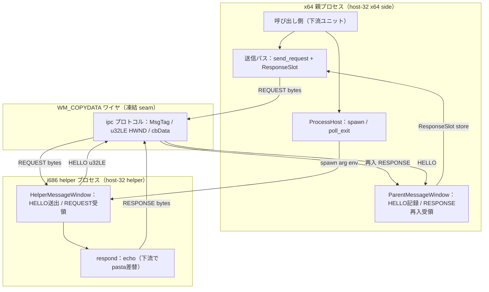
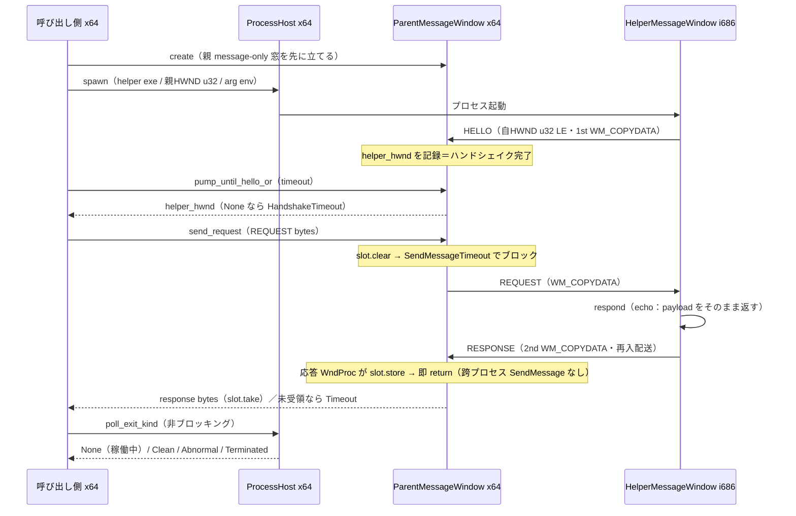
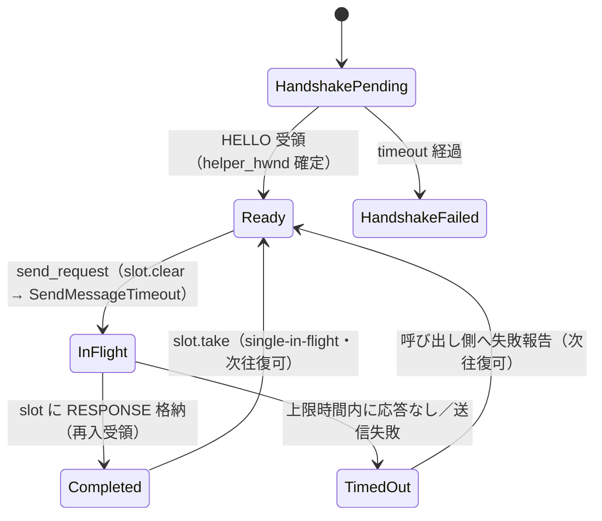

# 技術設計書: areka-P0-host32-ipc

## Overview

**Purpose**: 本ユニットは、x64 親プロセス（host-32 x64 side）と i686 ヘルパープロセス（host-32 helper）の間で **生バイト列を往復させる transport 層（bytes-over-wire）** を提供する。「request bytes を送り、response bytes を受ける」seam までを所有し、その上に載る SHIORI/3.0 セマンティクス・`pasta.dll` ロード・常駐 lifecycle は所有しない。

**Users**: 直接の利用者は下流の host-32 トラック各ユニット（`areka-P0-host32-shiori-load` / `-request` / `-lifecycle`）である。これらは本ユニットが公開する「往復送信 API」と「凍結された WM_COPYDATA ワイヤプロトコル」の上に SHIORI セマンティクスを構築する。検証者は「往復 echo（request bytes → 同一 response bytes）を無クラッシュ・無デッドロックで観測できること」で本層の完成を確認する。

**Impact**: 現状 transport は先進坑 `pilot-shiori-host-32`（✅ go 済・2026-07-01）に使い捨てコードとして存在するのみで、production 資産は存在しない。本ユニットはその検証結果（README/REPORT）を参照し、コードは **一から掘り直して**（コピペ禁止・two-tunnel 規律）production クレートとして新設する。これにより M1 の唯一の耐力壁（x64 が 32bit pasta 世界へ橋渡しできるか）の transport 基盤が production 品質で確立する。

### Goals

- x64 親が i686 helper を spawn し、非ブロッキングで生死（Clean/Abnormal）を観測できる。
- WM_COPYDATA による framing（MsgTag・u32 LE HWND・生バイト payload・cbData 境界）を x64/i686 双方で共有し、跨ビットネスの解釈齟齬を構造的に防ぐ。
- HELLO ハンドシェイクで両プロセスがウィンドウハンドルを交換し、完了までは往復を開始しない。
- 再入 RESPONSE 受信（single-in-flight）でクロスプロセスのデッドロックを起こさず 1 往復を成立させる。
- `SendMessageTimeout`（`SMTO_ABORTIFHUNG`）で timeout / wedge を検出し、無限待機を防ぐ。
- pasta 非依存の **echo 往復**（request bytes → 同一 response bytes）を無クラッシュで観測できる。
- helper を i686（32bit）ターゲットでビルドでき、32bit 可搬性（shift overflow 回避・生バイトのみ跨ぐ）を維持する。
- ホスト側（`shiori-host32-ipc` / `shiori-host32-host`）は **x64 と arm64 の両方でネイティブビルド**でき（CPU 非依存・64bit 幅統一）、x86 SHIORI（pasta.dll）を駆動する helper のみ i686 に隔離する。arm64 上では i686 helper は x86 エミュレーションで実行され、WM_COPYDATA が native/emulation 境界を跨ぐ。

### Non-Goals

- `LoadLibraryW pasta.dll` + `GetProcAddress` + load/unload/request 解決（下流 `areka-P0-host32-shiori-load`）。
- SHIORI/3.0 request の build + marshal + Value parse + charset 処理（下流 `areka-P0-host32-request`）。
- 常駐メッセージループ + `OnSecondChange` ポーリング + unload + crash 監視から成る lifecycle（下流 `areka-P0-host32-lifecycle`）。
- x64 `IShiori` ABI 実装本体（下流と結線・本ユニットは `shiori-abi` に依存しない方針）。
- pilot コード（使い捨て検証・仮 selftest）の再利用・コピペ。

## Boundary Commitments

### This Spec Owns

- **helper プロセスの spawn と非ブロッキング生存監視**: `std::process::Command` による起動、`try_wait` ベースの `poll_exit` / 終了種別分類（Clean / Abnormal / Terminated）。
- **WM_COPYDATA ワイヤプロトコル（凍結する cross-unit seam）**: `MsgTag`（`dwData` 低 32bit）・payload = 生バイト列（`cbData` = 長さ）・HWND = u32 LE 4 バイト・不正フレーム検出。この **ワイヤ形式**が下流と共有する凍結契約である。
- **HELLO ハンドシェイク**: helper→親の HWND 通知（u32 LE）、親側の記録・完了観測、完了前の往復抑止、timeout 失敗。
- **再入 RESPONSE 受信（ResponseSlot）**: single-in-flight のブロック送信中に helper の RESPONSE を親 WndProc へ再入配送し受信スロットへ格納・即 return（デッドロック回避の核）。
- **timeout / wedge 検出**: `SendMessageTimeout`（`SMTO_ABORTIFHUNG`）による上限時間送信と、送信失敗の一様な報告。
- **echo 往復の観測**: helper の REQUEST ブランチが受信 payload をそのまま返す echo（pasta 非依存）。
- **i686 helper のビルドと 32bit 可搬性**: i686 ターゲットビルド、shift overflow 回避、生バイトのみ跨ぐ規約。

### Out of Boundary

- pasta.dll のロード／SHIORI marshalling／常駐 lifecycle／`IShiori` ABI 実装（すべて下流ユニットの領分）。
- helper の REQUEST ブランチ**実装の中身**（下流が echo 行を pasta 駆動へ差し替える）。本ユニットが凍結するのは REQUEST/RESPONSE の**ワイヤ形式**であって、responder 実装ではない。
- HELLO/Response 以外のメッセージ種別（Load/Unload）の**セマンティクス**。`MsgTag` の判別子はワイヤ互換のため定義するが、Load/Unload の処理は本ユニットでは行わない（下流で結線）。

### Allowed Dependencies

- `wintf-winmsg-executor` 0.0.5（helper／親双方の message-only 窓＋メッセージループ基盤・i686 実証済）。
- `windows` 0.62.2（`Win32_System_DataExchange`・`Win32_UI_WindowsAndMessaging`・`Win32_Foundation` 系。COPYDATASTRUCT / SendMessageTimeout / WM_COPYDATA / PostMessage）。x64 側の framing/送信も同 crate を用いる。
- `windows-core` 0.62.2（`windows` 併用の基盤型）。
- `event-listener` 5（スレッド跨ぎ起床が必要な場合のみ・tokio 禁止）。
- `thiserror` 2（全クレート共通のエラー型規約）。
- 標準ライブラリ（`std::process` によるプロセス管理・`windows` 非依存の spawn 監視）。
- **依存してはならないもの**: `crates/shiori-abi`（bytes seam の純度を保つため非依存・ABI 実装本体は下流で結線）／pasta 系 crate／pilot クレート。

### Revalidation Triggers

以下の変更は下流ユニット（`host32-shiori-load` / `-request` / `-lifecycle`）へ再検証を強制する。

- **ワイヤプロトコル形状の変更**: `MsgTag` 判別子値、payload の生バイト規約、HWND の u32 LE 表現、`cbData` によるフレーム境界のいずれかが変わった場合。
- **往復送信 API シグネチャの変更**: 「request bytes を送り response bytes を受ける」公開関数の入出力・エラー型が変わった場合。
- **REQUEST responder の差し替え境界の変更**: helper の REQUEST ブランチを下流が pasta 駆動へ差し替える「置換点」の位置・形が変わった場合。
- **依存方向の変更**: 本ユニットが `shiori-abi` 等へ新たに依存する／させる方向転換が生じた場合。
- **transport の後退**: WM_COPYDATA 再入方式が成立せず named pipe 等へ後退する場合（pilot で go 済ゆえ現時点では不要だが、triggers として明示）。
- **クレート配置・構成の確定**: design discussion #1 で **Option B-2（3クレート `shiori-host32-ipc` / `-host` / `-helper`）** に確定済み。以後この配置・依存方向・命名の変更は下流へ再検証を強制する。

## Architecture

### Existing Architecture Analysis

- **上流アンカー（参照専用・go 済）**: `crates/pilot/examples/shiori-host-32/`。README/REPORT が一次記録（正本）であり、design は検証結果を参照するのみで二重化しない（No Hidden Shared Ownership）。pilot が実証した transport 構造（`ipc.rs` / `parent_window.rs` / `process_host.rs` / `helper_window.rs`）を「知見」として担ぐが、コードはコピペせず再掘する。
- **接続先（残す基盤・非依存）**: `crates/shiori-abi`（x64 `IShiori`/`IShioriHost` COM・HSTRING）。本ユニットは bytes transport のみ提供し、ABI 実装本体は下流で結線するため、`shiori-abi` へ依存しない。
- **ワークスペース定義**: `/Cargo.toml`（`members = ["crates/*"]`）。新クレートは glob で自動メンバー化され、`workspace.dependencies` に `wintf-winmsg-executor=0.0.5` / `event-listener=5` / `windows`(0.62.2) / `windows-core` / `thiserror` が既定義。
- **既存パターン準拠**: ファイル `snake_case.rs`・型 `PascalCase`・関数 `snake_case`・定数 `SCREAMING_SNAKE_CASE`。`unsafe` は Win32 境界へ集約し安全 API を上位へ。エラーは `thiserror` の構造化 enum（pilot は素の enum だったため本ユニットで `thiserror` 化）。in-source `#[cfg(test)]`（i686 でも `cargo test --target i686-pc-windows-msvc`）。

### Architecture Pattern & Boundary Map

選定パターン: **2 プロセス・single-in-flight 同期 request/response ブリッジ**（トランスポート = Window Message / WM_COPYDATA 一本化）。別プロセス境界が天然のアクター境界となり、parser/wintf トラックと非衝突で並走する。



**Architecture Integration**:

- **選定パターンの根拠**: pilot が「WM_COPYDATA 一方向＋再入 RESPONSE」で go 実証済（named pipe 後退は不要）。single-in-flight・厳密ネスト・両方向 `SMTO_ABORTIFHUNG` により循環待ちが構造的に発生しない。
- **境界分離**: `ipc`（共有プロトコル・両ターゲットビルド）／`ProcessHost`（x64・`windows` 非依存 std-only）／`ParentMessageWindow`（x64・`windows` + `wintf-winmsg-executor`）／`HelperMessageWindow`（i686・同）へ責務を分離。x64 側と i686 側は同一の `wintf-winmsg-executor` 窓 API を鏡像で用いる。
- **保持する既存パターン**: `wintf-winmsg-executor` の `Window<S>`（state 同居・WndProc へ `Pin<&S>`）、`MessageLoop::run` フィルタ、`unsafe` の Win32 境界集約。
- **新規コンポーネントの根拠**: production クレートとしての transport 一式が Missing（pilot は examples 隔離）。加えて pasta 非依存の echo responder は pilot に存在せず（pilot の REQUEST は pasta 駆動を hardwire）、Requirement 6 の要求ゆえ新規。
- **steering 準拠**: tokio 非依存（`event-listener` のみ）、`thiserror` 構造化エラー、`unsafe` 集約、Rust 2024、pin 依存版の遵守。

### Dependency Direction

```
shiori-host32-ipc（proto：型/framing/IpcError・全ターゲット可搬 x64/arm64/i686）
   ├→ shiori-host32-host（x64/arm64：ProcessHost・ParentMessageWindow・送信パス send_request）
   └→ shiori-host32-helper（i686：HelperMessageWindow・respond echo）
```

各クレートは左のみを cargo 依存する（host / helper は共に proto = `shiori-host32-ipc` を一方向依存し、host↔helper 間のコード依存は無い＝プロセス境界で WM_COPYDATA のみ）。`shiori-host32-ipc` はプロトコル定義の単一ソースであり、x64/arm64/i686 の全ターゲットから共有される。`ProcessHost` は `windows` 型（HWND 等）を引きずらず u32 ワイヤ値で親 HWND を子へ渡す。REQUEST responder（`respond`）は helper クレートに属し、下流 `shiori-host32-shiori-load` はこの helper クレートを編集して echo→pasta を差し替える。

### Technology Stack

| Layer | Choice / Version | Role in Feature | Notes |
|-------|------------------|-----------------|-------|
| プロセス管理 | Rust std `std::process` | helper の spawn / try_wait 生存監視 | `windows` 非依存で完結（親 HWND は u32 ワイヤ値で受け渡し） |
| Win32 IPC | `windows` 0.62.2 | COPYDATASTRUCT / SendMessageTimeout / WM_COPYDATA / PostMessage | `Win32_System_DataExchange` feature が本ユニットの追加要件。Memory/Globalization は不要（pasta proxy 用＝下流） |
| メッセージループ／窓 | `wintf-winmsg-executor` 0.0.5 | message-only 窓生成・`MessageLoop::run`・WndProc dispatch | i686 実行時 GO（pilot 実証・raw Win32 fallback 不要）。完全 pin（`=0.0.5`） |
| スレッド跨ぎ通知 | `event-listener` 5 | 必要時のみ（heartbeat 相当の起床） | tokio 禁止 |
| エラー型 | `thiserror` 2 | 構造化エラー enum | 全クレート共通規約（pilot の素 enum を昇格） |
| ビルドターゲット（ホスト） | x86_64 / aarch64-pc-windows-msvc | `-ipc` / `-host` のネイティブビルド | CPU 非依存・64bit 幅統一。arm64 上では i686 helper を x86 エミュで実行 |
| ビルドターゲット（helper） | i686-pc-windows-msvc | `-ipc` / `-helper` の 32bit ビルド | **PowerShell 必須**（Git Bash の GNU link.exe が MSVC link を遮蔽）。`rustup target add` 導入済 |

## File Structure Plan

> **確定（design discussion #1）**: クレート**配置と構成**は brief が「依頼者へ提示して確認を取る」ことを要求していた設計判断であり、design discussion で **Option B-2（3クレート）** に確定した。根拠は arm64: areka 最終成果物（wintf 含む）は **x64 と arm64 の両方でネイティブ動作**が要件で、x86 SHIORI（pasta.dll）を呼ぶ helper のみ i686。3クレートに割ると「64bit ホスト＝x64/arm64」と「i686 helper」の**ターゲット分離が `cfg` でなく crate 境界で構造的に表現**され、cross-compile された死にコードや `cfg` 分岐の綱渡りが生じない（単一クレート B-1 は dead-code 除去で成果物に無駄は出ないが、arm64 を含む3ターゲットの `cfg` 分岐が増えるため不採用）。命名は既存 `shiori-abi` と同じ `shiori-` ドメイン接頭辞で揃え、クレート名だけで所属（SHIORI/host32）・役割（ipc=proto / host / helper）が判別できるようにする。モジュール責務の粒度は不変（クレート境界へ配分するのみ）。

### Directory Structure（確定案 Option B-2 / 3クレート）

```
crates/shiori-host32-ipc/             # proto：ワイヤ規約（全ターゲット可搬 x64/arm64/i686）
├── Cargo.toml                        # windows feature = Win32_System_DataExchange（＋ WindowsAndMessaging / Foundation）
└── src/
    └── lib.rs                        # ipc：MsgTag / u32LE HWND / cbData / framing / ResponseSlot / send_copydata / send_request ＋ IpcError（thiserror）

crates/shiori-host32-host/            # x64 + arm64 ネイティブ・ホスト側 transport lib（shiori-host32-ipc 依存）
├── Cargo.toml                        # windows + wintf-winmsg-executor
├── src/
│   ├── lib.rs                        # 公開 API（送信 API の入口）
│   ├── error.rs                      # SpawnError / HandshakeError（thiserror）
│   ├── process_host.rs               # ProcessHost（spawn / poll_exit / ExitKind）。std-only（windows 非依存）
│   └── parent_window.rs              # ParentMessageWindow（HELLO記録 / RESPONSE再入受領 / pump_until_hello / ハンドシェイクゲート）＋ 送信パス send_request
└── tests/
    └── echo_roundtrip.rs             # 往復 echo 統合テスト（Requirement 6 のゲート指標・i686 helper を事前ビルドして spawn）

crates/shiori-host32-helper/          # i686 のみ・helper 実行バイナリ（shiori-host32-ipc 依存）
├── Cargo.toml                        # windows + wintf-winmsg-executor
└── src/
    └── main.rs                       # HelperMessageWindow（HELLO送出 / REQUEST受領 / respond echo / msg loop）＝下流 shiori-load の差し替え点
```

> 共有規約は `shiori-host32-ipc`（proto）クレートを **cargo 依存**で共有する（`-host` / `-helper` が依存）。pilot の `#[path = "ipc.rs"] mod ipc;` 物理共有は不要化。ターゲット分離は crate 境界で担保され、`-host` は x86_64/aarch64、`-helper` は i686 でビルドされる（`cfg` / `required-features` 不要）。

### Modified Files

- `Cargo.toml`（ワークスペースルート）: `members = ["crates/*"]` の glob で 3 クレートは自動メンバー化されるため**変更不要**。各クレートの `Cargo.toml` が `windows` の `Win32_System_DataExchange`（＋ `Win32_UI_WindowsAndMessaging` / `Win32_Foundation`）feature を明示する（Memory/Globalization は下流 pasta proxy 用ゆえ本ユニットでは不要）。

> 各クレート／ファイルは単一責務: `shiori-host32-ipc`=プロトコル＋`IpcError`、`shiori-host32-host`（`error.rs`=Spawn/Handshake エラー・`process_host.rs`=プロセス・`parent_window.rs`=x64/arm64 窓＋送信）、`shiori-host32-helper`（`main.rs`=i686 窓＋echo）。往復 echo テストは `-host` の `tests/` に置く（examples はテストの代替にしない）。

## System Flows

### 起動〜1 往復〜生存監視（シーケンス）



**フローレベルの決定**:

- **ハンドシェイクゲート（3.3）**: `send_request` は helper HWND 確定（`pump_until_hello_or` が `Some` を返した後）を前提とする。未確定での送信を**型/実行時で拒否**する（例: 送信 API が確定済み helper HWND を要求する／`ParentShared` が未ハンドシェイク時に `Err(HandshakeIncomplete)` を返す）。ゲートの具体形はタスクで確定（Open Questions §5）。
- **再入受領（4.1〜4.4）**: 親は `SendMessageTimeout` でブロックし、その最中に helper の RESPONSE が親 WndProc へ再入配送される。応答 WndProc は payload を `ResponseSlot` へ格納して**即 return**し、それ以上の跨プロセス `SendMessage` を発行しない（循環待ちなし）。
- **timeout / wedge（5.x）**: 送信は一律 `SMTO_ABORTIFHUNG` ＋ 上限時間。上限内に応答が返らなければ **timeout として一様に打ち切る**（送信失敗と timeout は同一の失敗結果として報告し、distinct な PeerGone は設けない）。peer の生死は Requirement 1 の `poll_exit`（Clean/Abnormal）で**別系統**で観測する。

### 送信結果の判定（プロセス／状態）



## Requirements Traceability

| Requirement | Summary | Components | Interfaces / Contracts | Flows |
|-------------|---------|------------|------------------------|-------|
| 1.1 | helper spawn ＋参照保持 | ProcessHost | `spawn(helper_exe, ...) -> HelperHandle` | 起動シーケンス |
| 1.2 | 非ブロッキング生死問い合わせ | ProcessHost | `poll_exit / poll_exit_kind`（try_wait） | 生存監視 |
| 1.3 | 正常終了（Clean）分類 | ProcessHost | `ExitKind::Clean`（code 0） | 生存監視 |
| 1.4 | 異常終了（Abnormal）分類 | ProcessHost | `ExitKind::Abnormal(i32) / Terminated` | 生存監視 |
| 1.5 | spawn 失敗の報告・稼働 helper 不在維持 | ProcessHost | `Result<HelperHandle, SpawnError>` | 起動シーケンス |
| 2.1 | 種別タグ＋長さ＋生バイトの WM_COPYDATA 送出 | ipc | `send_copydata` / `COPYDATASTRUCT`（dwData=tag, cbData=len） | 全送信 |
| 2.2 | HWND を u32 LE 符号化 | ipc | `encode_hwnd_le / decode_hwnd_le / hwnd_from_u32` | HELLO |
| 2.3 | 種別タグ＋長さで payload 取り出し | ipc（+ 窓 WndProc） | `copydata_payload`（cbData 境界） | 受信 |
| 2.4 | 生バイトのみ跨ぐ・ローカル資源共有せず | ipc | 生バイト規約（PAYLOAD_HEADER_LEN=0） | 全送受 |
| 2.5 | 不正フレーム検出・上位へ渡さない | ipc（+ 窓 WndProc） | `MsgTag::try_from_u32 -> Err` / payload 長検査 | 受信 |
| 3.1 | helper→親 HELLO（u32 LE HWND） | HelperMessageWindow | 起動時 HELLO 送出 | ハンドシェイク |
| 3.2 | 親が helper HWND 記録・完了観測 | ParentMessageWindow | `ParentShared.helper_hwnd` / `hellos` | ハンドシェイク |
| 3.3 | 完了まで往復開始しない | ParentMessageWindow（送信パス） | ハンドシェイクゲート（型/実行時拒否） | ゲート |
| 3.4 | HELLO timeout 失敗報告 | ParentMessageWindow | `pump_until_hello_or -> Option / Err(HandshakeTimeout)` | ハンドシェイク |
| 4.1 | 到達確認ブロック送信・single-in-flight | 送信パス（send_request） | `send_request(...) -> Result<Vec<u8>, IpcError>` | 1 往復 |
| 4.2 | helper 応答を受信スロットへ・即 return | HelperMessageWindow / ParentMessageWindow | respond ＋ `ResponseSlot.store` | 1 往復 |
| 4.3 | 処理中は次 request を出さず厳密ネスト受領 | 送信パス（ResponseSlot） | `ResponseSlot`（single-in-flight） | 1 往復 |
| 4.4 | デッドロックなしで 1 往復完了 | 全体（再入方式） | `SMTO_ABORTIFHUNG` ＋即 return | 1 往復 |
| 5.1 | 応答待機に上限時間 | 送信パス | `send_request(..., timeout)` | timeout |
| 5.2 | timeout 打ち切りと報告 | ipc / 送信パス | `IpcError::Timeout` | timeout |
| 5.3 | ハング送信の中断（無限待機防止） | ipc | `SendMessageTimeoutW(SMTO_ABORTIFHUNG)` | wedge |
| 6.1 | request bytes → 対応 response bytes | HelperMessageWindow（respond echo） | `respond(&[u8]) -> Vec<u8>`（echo） | echo 往復 |
| 6.2 | response と request の照合可能な観測 | tests/echo_roundtrip | 統合テスト assertion | echo 往復 |
| 6.3 | echo 中 無クラッシュ・無デッドロック | 全体 | 統合テスト（往復成立・両プロセス生存） | echo 往復 |
| 7.1 | i686 ターゲットビルド可能 | shiori-host32-helper（bin crate） | helper クレート ＋ i686 target ビルド | ビルド |
| 7.2 | 32bit ポインタ幅で shift overflow なし | ipc | dwData/HWND 演算は u64 cast で評価 | framing |
| 7.3 | 双方向で生バイトのみ表現・32bit 可搬 | ipc | 生バイト規約 | framing |
| 8.1 | SHIORI3 の build/parse/charset を行わない | 境界（negative） | echo のみ・SHIORI 非依存 | — |
| 8.2 | pasta.dll ロード/解決を行わない | 境界（negative） | LoadLibrary 非所有 | — |
| 8.3 | 常駐 lifecycle を所有しない | 境界（negative） | msg loop は echo 実証範囲のみ | — |
| 8.4 | pilot コードをコピペしない | 規律（negative） | README/REPORT 参照・クリーン再掘 | — |

## Components and Interfaces

| Component | Domain/Layer | Intent | Req Coverage | Key Dependencies (P0/P1) | Contracts |
|-----------|--------------|--------|--------------|--------------------------|-----------|
| ipc（プロトコル） | 共有（両ターゲット） | WM_COPYDATA 規約・framing・HWND 符号化・ResponseSlot・送信規約 | 2, 4.1/4.3, 5, 7 | windows DataExchange (P0) | Service, State |
| ProcessHost | x64（std-only） | helper spawn ＋非ブロッキング生存監視 ＋終了分類 | 1 | std::process (P0) | Service, State |
| ParentMessageWindow | x64（窓） | HELLO 記録・RESPONSE 再入受領・ハンドシェイクゲート・送信パス | 3.2/3.3/3.4, 4, 5 | wintf-winmsg-executor (P0), ipc (P0) | Service, State |
| HelperMessageWindow | i686（窓・bin） | HELLO 送出・REQUEST 受領・respond echo・msg loop | 3.1, 4.2, 6.1 | wintf-winmsg-executor (P0), ipc (P0) | Service, State |
| error | 共有 | thiserror 構造化エラー enum | 1.5, 3.4, 5.2 | thiserror (P0) | State |

### 共有プロトコル層

#### ipc

| Field | Detail |
|-------|--------|
| Intent | x64/i686 で共有する WM_COPYDATA トランスポート規約の単一ソース |
| Requirements | 2.1, 2.2, 2.3, 2.4, 2.5, 4.1, 4.3, 5.2, 5.3, 7.2, 7.3 |

**Responsibilities & Constraints**

- `MsgTag`（`#[repr(u32)]`）を定義し、`dwData` の**低 32bit のみ**に載る（跨ビットネス安全・`(tag as u64) >> 32 == 0`）。判別子: Hello=1 / Response=4 を本ユニットが使用。Load=2 / Request=3 / Unload=5 はワイヤ互換のため定義するが、REQUEST は echo として、Load/Unload は本ユニットでは未処理（下流で結線）。
- payload は**生バイト列**（`cbData` = 長さ・固定ヘッダ長 0）。ポインタ・HANDLE・struct を載せない。
- HWND を **u32 LE 4 バイト**へ符号化／復元（`encode_hwnd_le` / `decode_hwnd_le` / `hwnd_from_u32`）。x64 側は復元時に上位 32bit を zero-extend。
- 送信は `SendMessageTimeoutW`（`SMTO_ABORTIFHUNG` ＋ 上限時間）。0 返りは一律 timeout/失敗として `IpcError` を返す（distinct PeerGone を設けない）。
- `ResponseSlot`（`RefCell<Option<Vec<u8>>>`）で single-in-flight の応答格納。`clear → store → take` の 1 回消費。
- **不正フレーム検出**: 未知タグは `MsgTag::try_from_u32-> Err`、`cbData` と実 payload 長の不整合は破損として上位へ渡さない（要件 2.5）。
- **32bit 可搬**: `dwData`/HWND 関連の shift 評価は必ず `u64` cast で行う（i686 の `usize=32bit` shift overflow 回避）。

**Dependencies**

- External: `windows`（COPYDATASTRUCT / SendMessageTimeoutW / WM_COPYDATA） — P0
- Inbound: ProcessHost（u32 HWND 規約のみ）/ ParentMessageWindow / HelperMessageWindow — P0

**Contracts**: Service [x] / State [x]

##### Service Interface

```rust
/// 種別タグ（dwData 低 32bit・跨ビットネス安全）
#[repr(u32)]
pub enum MsgTag { Hello = 1, Load = 2, Request = 3, Response = 4, Unload = 5 }
impl MsgTag {
    pub const fn as_u32(self) -> u32;
    pub fn try_from_u32(raw: u32) -> Result<Self, u32>; // 未知 = Err(raw)（不正フレーム観測点）
}

/// HWND u32 LE 符号化
pub fn encode_hwnd_le(hwnd: HWND) -> [u8; 4];
pub fn decode_hwnd_le(bytes: [u8; 4]) -> u32;
pub fn hwnd_from_u32(value: u32) -> HWND;

/// 片道送出（SMTO_ABORTIFHUNG ＋ timeout）
pub fn send_copydata(target: HWND, self_hwnd: HWND, tag: MsgTag,
                     payload: &[u8], timeout: Duration) -> Result<(), IpcError>;

/// 1 往復送信（再入受領・single-in-flight）
pub fn send_request(target: HWND, self_hwnd: HWND, tag: MsgTag, payload: &[u8],
                    timeout: Duration, slot: &ResponseSlot) -> Result<Vec<u8>, IpcError>;
```

- Preconditions: `target` は有効な HWND（ハンドシェイク確定済）。`payload` は呼び出し中生存。`slot` は親の応答 WndProc が参照するものと同一。
- Postconditions: `send_request` は `Ok(response_bytes)` または `Err(IpcError::Timeout)` を返す。
- Invariants: 往復は同時に 1 つ（single-in-flight）。`dwData` は低 32bit のみ有意。

##### State Management

- State model: `ResponseSlot`（single-in-flight・UI スレッド固定ゆえ `RefCell` で足りる）。
- Concurrency strategy: 応答 WndProc は再入で store→即 return。跨プロセス SendMessage を発行しないため循環待ちなし。

**Implementation Notes**

- Integration: pilot の `ipc.rs`（`MsgTag`/`encode_hwnd_le`/`send_copydata`/`ResponseSlot`/`send_request`）の**構造を知見として**再掘。README §6 の feature 前提（`COPYDATASTRUCT` は `Win32_System_DataExchange` 配下）を踏襲。
- Validation: 単体テストで MsgTag の u32 往復・低 32bit 占有（`u64 >> 32 == 0`）・未知タグ Err・HWND u32 LE 往復・ResponseSlot の clear/store/take・payload 長不整合の拒否を検証。i686 でも `cargo test --target i686-pc-windows-msvc`。
- Risks: i686 の shift overflow（u64 cast で回避）。`windows` feature の不足（DataExchange を明示）。

### x64 側

#### ProcessHost

| Field | Detail |
|-------|--------|
| Intent | helper プロセスの起動と IPC 直交の非ブロッキング生存監視 |
| Requirements | 1.1, 1.2, 1.3, 1.4, 1.5 |

**Responsibilities & Constraints**

- `std::process::Command` で helper exe を起動。ghostdir 相当・親 HWND（**u32 ワイヤ値**）を arg / env で渡す（`windows` 型を引きずらない std-only）。
- `try_wait` ベースの `poll_exit`（`Option<i32>`）/ `poll_exit_kind`（`Option<ExitKind>`）で稼働中/終了を非ブロッキング観測。
- `ExitKind::classify`: code 0 = Clean、非 0 = Abnormal(i32)、code なし（シグナル/強制終了）= Terminated。
- spawn 失敗は `Err(SpawnError)` を返し、稼働中 helper が存在しない状態を保つ（要件 1.5）。
- （検証用 additive）`terminate` で helper 強制終了 → Abnormal/Terminated を観測可能にする。

**Dependencies**

- External: Rust std `std::process`（`windows` 非依存） — P0

**Contracts**: Service [x] / State [x]

##### Service Interface

```rust
pub struct HelperHandle { /* child: Child, helper_hwnd: Option<u32> */ }
pub enum ExitKind { Clean, Abnormal(i32), Terminated }

pub fn spawn(helper_exe: &Path, ghostdir: &Path, parent_hwnd: u32)
    -> Result<HelperHandle, SpawnError>;
pub fn poll_exit(handle: &mut HelperHandle) -> Option<i32>;         // None = 稼働中
pub fn poll_exit_kind(handle: &mut HelperHandle) -> Option<ExitKind>;
```

- Preconditions: `helper_exe` が i686 ビルド済 exe を指す。
- Postconditions: spawn 成功で `HelperHandle` を返す。`poll_*` は非ブロッキング。
- Invariants: `poll_exit` は呼び出し側スレッドをブロックしない（要件 1.2）。

**Implementation Notes**

- Integration: 親 HWND は u32 ワイヤ値で子へ（`ParentMessageWindow::hwnd_u32`）。helper_hwnd は HELLO 受領後に確定（本ユニット内で結線）。
- Validation: `cmd.exe /c exit N` 等の決定的 stand-in プロセスで spawn/poll/wait/分類を検証（i686 helper exe の有無に非依存）。
- Risks: なし（std-only・pilot 実証済＝低リスク）。

#### ParentMessageWindow（＋送信パス）

| Field | Detail |
|-------|--------|
| Intent | 親 message-only 窓で HELLO を記録し RESPONSE を再入受領、ハンドシェイクゲート下で 1 往復を送信 |
| Requirements | 3.2, 3.3, 3.4, 4.1, 4.2, 4.3, 4.4, 5.1, 5.2, 5.3 |

**Responsibilities & Constraints**

- `wintf-winmsg-executor` の `Window<ParentShared>`（`WindowType::MessageOnly`）を生成し、WndProc で inbound WM_COPYDATA を `MsgTag` で捌く。
- **HELLO**: payload（helper HWND u32 LE）を復号して `ParentShared.helper_hwnd` に記録＝ハンドシェイク完了観測（非ブロッキング）。
- **RESPONSE**: payload を `ResponseSlot` へ store して**即 return**（跨プロセス SendMessage を発行しない・デッドロック回避の核）。
- **想定外/未知タグ**: crash させず記録のみ（不正フレームを上位へ渡さない・要件 2.5）。
- **ハンドシェイクゲート（3.3）**: 送信 API は helper HWND 確定済を前提とし、未確定での送信を型/実行時で拒否（`Err(HandshakeIncomplete)` 等）。
- **送信パス（send_request）**: `slot.clear → SendMessageTimeout（REQUEST）→ slot.take`。上限時間内に未受領なら `Err(IpcError::Timeout)`。
- `pump_until_hello_or(timeout)`: HELLO 受領まで（または timeout まで）ループを bounded に回し、期限内未受領なら失敗（無入力でも抜けられる heartbeat 起床）。

**Dependencies**

- Inbound: 呼び出し側（下流ユニット） — P0
- Outbound: ipc（send_request / ResponseSlot / decode_hwnd_le） — P0
- External: `wintf-winmsg-executor`（Window / MessageLoop）— P0

**Contracts**: Service [x] / State [x]

##### Service Interface

```rust
pub struct ParentMessageWindow { /* window: Window<ParentShared> */ }
impl ParentMessageWindow {
    pub fn create() -> Result<Self, HandshakeError>;
    pub fn hwnd_u32(&self) -> u32;                                   // ProcessHost::spawn へ渡す
    pub fn pump_until_hello_or(&self, timeout: Duration) -> Option<u32>; // None = HandshakeTimeout
    /// ハンドシェイク確定済を前提に 1 往復（未確定なら Err）
    pub fn send_request(&self, tag: MsgTag, payload: &[u8], timeout: Duration)
        -> Result<Vec<u8>, IpcError>;
}
```

- Preconditions: `send_request` はハンドシェイク完了（`pump_until_hello_or` が `Some`）後に呼ぶ。
- Postconditions: `Ok(response_bytes)` または `Err(Timeout / HandshakeIncomplete)`。
- Invariants: 応答 WndProc は store 後即 return（跨プロセス SendMessage なし）。single-in-flight。

##### State Management

- State model: `ParentShared { helper_hwnd: Cell<Option<u32>>, response_slot: ResponseSlot, 観測カウンタ }`。`wintf-winmsg-executor` が state を窓と同居させ WndProc へ `Pin<&S>` で渡す（UI スレッド固定ゆえ `Cell`/`RefCell`）。
- Concurrency strategy: single-in-flight・再入受領・厳密ネスト。**heartbeat（別スレッドからの `PostMessageW(WM_NULL)`）は bounded な pump フェーズ（`pump_until_hello_or` のハンドシェイク待機）専用**である。`send_request` 実行中は親が `SendMessageTimeout` でブロックし `MessageLoop` を回さないため、この間に WndProc へ再入するのは **helper が `SendMessage` で送る RESPONSE のみ**（同期送出＝OS が再入配送）で、キューに積まれた WM_NULL（`PostMessage`）はブロック中は配送されない。仮に WndProc が WM_NULL／非 WM_COPYDATA を受けても `None`（DefWindowProc 委譲）で即 return するため、`ResponseSlot` の `clear→store→take` 不変条件（InFlight↔Ready 状態機械）を壊さない。

**Implementation Notes**

- Integration: `hwnd_u32` を ProcessHost::spawn に渡して親 HWND を helper へ通知。`response_slot` は send_request と WndProc が同一参照。
- Validation: HELLO 受領で helper_hwnd 確定・未ハンドシェイク送信の拒否・timeout 打ち切り・往復成立を統合テストで検証。
- Risks: 再入受領の production 品質での再現（Cell/RefCell の window state 共有パターンを `wintf-winmsg-executor` の `Pin<&S>` に忠実に踏襲）。

### i686 側

#### HelperMessageWindow（＋respond echo）

| Field | Detail |
|-------|--------|
| Intent | helper message-only 窓で起動時 HELLO を送出、REQUEST を受領して echo 応答を返す |
| Requirements | 3.1, 4.2, 6.1, 7.1 |

**Responsibilities & Constraints**

- `wintf-winmsg-executor` の message-only 窓＋`MessageLoop::run` を i686 で回す（実行時 GO・pilot 実証）。
- 起動時に親へ **HELLO**（自 HWND u32 LE）を 1st WM_COPYDATA で送出（送出先の親 HWND は arg/env の u32 ワイヤ値）。
- WndProc で **REQUEST** を受領 → `respond(&payload)` → RESPONSE を 1 通返送（`send_copydata`）→ **即 return**（それ以上跨プロセス SendMessage を発行しない）。
- **`respond` は echo**: `fn respond(req: &[u8]) -> Vec<u8> { req.to_vec() }`。pasta 非依存の単純 echo で、これが Requirement 6 の「意味を持たない生バイト往復」を成立させる。**これが下流 `host32-shiori-load` の差し替え点**（echo 行を pasta 駆動へ置換）である。trait RequestHandler 等の抽象は設けない（YAGNI・下流が同クレートを編集して差し替える）。
- helper は `shiori-host32-helper` クレート（binary crate）として i686 で独立ビルド。`usize=32bit` の shift overflow を u64 cast で回避（ipc 経由）。

**Dependencies**

- Inbound: 親（REQUEST）— P0
- Outbound: ipc（send_copydata / encode_hwnd_le / MsgTag）— P0
- External: `wintf-winmsg-executor`（Window / MessageLoop）— P0

**Contracts**: Service [x] / State [x]

##### Service Interface

```rust
/// 下流の差し替え点：本ユニットは echo。host32-shiori-load がこの中身を pasta 駆動へ置換する。
fn respond(req: &[u8]) -> Vec<u8> { req.to_vec() }

fn main() { /* 親HWND を arg/env で取得 → 窓生成 → HELLO 送出 → MessageLoop::run */ }
```

- Preconditions: 親 message-only 窓が先に立ち、親 HWND が u32 ワイヤ値で渡される。
- Postconditions: REQUEST に対し echo RESPONSE を 1 通返す。
- Invariants: WndProc は RESPONSE 送出後即 return（single-in-flight・厳密ネスト）。

##### State Management

- State model: `HelperShared { parent_hwnd: u32, 観測カウンタ }`。lifecycle 状態機械（pilot の Started→Pumping→…）は**本ユニットでは echo 実証に必要な最小**に留める（常駐 lifecycle は Out of Boundary・下流 `host32-lifecycle`）。
- Concurrency strategy: 単一 UI スレッド・再入 WndProc。

**Implementation Notes**

- Integration: `respond` の echo が下流の pasta 差し替え点。凍結する seam は WM_COPYDATA の REQUEST/RESPONSE **ワイヤ形式**であって respond 実装ではない。
- Validation: 単体では respond の echo 等価性、統合（`tests/echo_roundtrip.rs`）で親→helper→親の実 WM_COPYDATA 往復を検証。i686 ビルドは PowerShell で `cargo build ... --target i686-pc-windows-msvc`。
- Risks: `wintf-winmsg-executor` の i686 実行時挙動（pilot で GO 実証済＝リスク撤回・raw Win32 fallback 不要）。

### エラー型

#### error

| Field | Detail |
|-------|--------|
| Intent | 全クレート共通規約の thiserror 構造化エラー |
| Requirements | 1.5, 3.4, 5.2 |

**Responsibilities & Constraints**

- pilot の素 enum（`IpcError` 等）を `thiserror` enum へ昇格。バリアント: `IpcError::{Timeout, SendFailed}`（送信失敗と timeout は一様に扱う・distinct PeerGone は設けない）／`SpawnError`（spawn 失敗・要件 1.5）／`HandshakeError::{Timeout, Incomplete}`（要件 3.4・3.3 ゲート）。
- peer 消失は distinct なエラーとしては表さず、送信側は timeout/失敗として一様に、生死は `ExitKind`（ProcessHost）で別系統に観測（Requirement 1 と 5 の分離）。

**Contracts**: State [x]

**Implementation Notes**

- Integration: 各コンポーネントの `Result` の Err 型として用いる。
- Validation: 各エラー経路（spawn 失敗・HELLO timeout・応答 timeout）を統合/単体で観測。
- Risks: なし。

## Error Handling

### Error Strategy

- **Fail fast ＋ 一様な失敗報告**: 送信系は `SendMessageTimeout`（`SMTO_ABORTIFHUNG` ＋上限時間）で無限待機を構造的に排除し、失敗は `IpcError::Timeout`（または `SendFailed`）に一様化する。peer の生死は送信結果に混ぜず `ProcessHost` の `ExitKind` で別途観測する。
- **不正フレームは隔離**: 未知タグ・payload 長不整合は crash させず記録のみで上位へ渡さない（要件 2.5）。

### Error Categories and Responses

- **spawn 失敗（1.5）**: `Err(SpawnError)` を返し、稼働中 helper が存在しない状態を保つ。
- **ハンドシェイク未完/timeout（3.3/3.4）**: 送信は `HandshakeError::Incomplete`（未完での送信拒否）／`pump_until_hello_or` が `None`＝`HandshakeError::Timeout`。
- **応答 timeout / wedge（5.2/5.3）**: `IpcError::Timeout`。`SMTO_ABORTIFHUNG` によりハング peer でも上限時間で復帰。
- **不正フレーム（2.5）**: 破損として上位へ渡さず観測カウンタで記録。
- **helper 異常終了（1.4）**: `ExitKind::Abnormal(i32)` / `Terminated`（送信 timeout とは独立に観測）。

### Monitoring

- `ParentShared` / `HelperShared` の観測カウンタ（hellos / responses / unexpected / requests_handled / responses_sent / unknown_tags）で往復・不正フレームを観測。ログは steering `logging.md` の共通規約（`tracing`）に従う（feature 固有の追加は設けない）。

## Testing Strategy

### Unit Tests（ipc / process_host）

1. **MsgTag 跨ビットネス**（2.1, 7.2）: 全 `MsgTag` が `dwData` 低 32bit に収まる（`u64 >> 32 == 0`）・u32 往復ロスレス・未知タグ `try_from_u32 -> Err`。評価は必ず `u64` cast（i686 shift overflow 回避）。
2. **HWND u32 LE 往復**（2.2）: 代表 32bit 値（0x1・0x1234_5678・0xDEAD_BEEF・u32::MAX）が encode/decode を往復し LE 並びが一致。
3. **ResponseSlot semantics**（4.3）: `clear→take=None`・`store→take=Some`（1 回消費）・再 take=None・clear で残骸排除。
4. **payload 規約 / 不正フレーム**（2.4, 2.5）: 固定ヘッダ長 0・`cbData` と実長の不整合を破損として拒否。
5. **ExitKind 分類**（1.3, 1.4）: 0=Clean / 非 0=Abnormal(i32) / None=Terminated。stand-in（`cmd.exe /c exit N`）で spawn/poll/wait を検証（i686 exe 非依存）。

### Integration Tests（tests/echo_roundtrip.rs）

1. **往復 echo（ゲート指標）**（6.1, 6.2, 6.3）: 親 message-only 窓生成 → helper spawn → HELLO 受領（helper_hwnd 確定）→ 任意 request bytes を `send_request` → 同一 bytes を response として受領し照合 → 両プロセス生存（無クラッシュ・無デッドロック）。
2. **ハンドシェイク timeout**（3.4）: helper を起動しない／HELLO を送らせない条件で `pump_until_hello_or` が上限時間で `None` を返す。
3. **応答 timeout / wedge**（5.2, 5.3）: 応答しない helper に対し `send_request` が上限時間で `IpcError::Timeout` を返し、親がハングしない。
4. **helper 異常終了検出**（1.4）: helper 強制終了（`terminate`）を親が `poll_exit_kind` で `Abnormal`/`Terminated` として非ブロッキング検出。
5. **不正フレーム隔離**（2.5）: 親窓へ実 WM_COPYDATA で未知タグ／`cbData` 不整合フレームを送り、観測カウンタ（`unknown_tags` 等）が増加し、破損 payload が上位（`ResponseSlot` / 呼び出し側）へ渡らないことを確認する（framing 関数の単体テストでは覆えない **WndProc 受信経路の隔離**を実配送で検証）。

> i686 ビルド前提の統合テストは **PowerShell** で実行する（`cargo test`/`cargo build --target i686-pc-windows-msvc`）。往復 echo は helper exe（i686）を要するため、テスト手順（helper のビルド → 親テスト）を README/steering に固定する（Open Questions §4）。

## Open Questions / Risks

> 以下のうち **§1・§2 は design discussion #1 で確定済み**。§3〜§5 は入力と矛盾しない範囲で本設計が方向を確定済みの実装細部（タスクで具体化）。

1. **[確定・design discussion #1] クレート配置・構成と命名**: **Option B-2（3クレート）** に確定。`crates/shiori-host32-ipc`（proto・全ターゲット可搬）／`crates/shiori-host32-host`（x64+arm64 ホスト lib）／`crates/shiori-host32-helper`（i686 helper bin）。`-host` / `-helper` は `-ipc` を一方向依存し、host↔helper 間のコード依存は無い（プロセス境界で WM_COPYDATA のみ）。根拠: areka 最終成果物は **x64 と arm64 の両方でネイティブ動作**が要件であり、x86 SHIORI（pasta.dll）を呼ぶ helper のみ i686。3クレートに割ると「64bit ホスト＝x64/arm64」と「i686 helper」の**ターゲット分離が `cfg` でなく crate 境界で構造的に表現**され、cross-compile された死にコードや `cfg` 分岐の綱渡りが生じない（単一クレート B-1 は dead-code 除去で無駄は出ないが arm64 を含む3ターゲットの `cfg` 分岐が増える）。命名は `shiori-abi` と同じ `shiori-` 接頭辞で所属を自明化。
2. **[確定・design discussion #1] `windows` feature とビルド配線**: B-2 確定に伴い — (a) 共有 `ipc` は `shiori-host32-ipc`（proto）クレートを **cargo 依存**で共有（`-host` / `-helper` が依存）、pilot の `#[path]` 物理共有は不要化、(b) `windows` feature は各クレートの Cargo.toml で `Win32_System_DataExchange`（＋ `Win32_UI_WindowsAndMessaging` / `Win32_Foundation`）を明示（Memory/Globalization は pasta proxy 用＝下流ゆえ不要）、(c) target 分離は crate 境界で担保：`-host` は x86_64/aarch64、`-helper` は i686 でビルド（`cfg` / `required-features` 不要）。
3. **[再入受領の production 品質] window state 共有パターン**: `wintf-winmsg-executor` の `Window<S>`（`Pin<&S>` state 共有）を踏襲し、`ResponseSlot`（RefCell）/`Cell` を UI スレッド固定・single-in-flight 前提で用いる。独自ラッパを立てるかは実装細部（設計方針は pilot 構造の忠実な踏襲）。
4. **[i686 ビルド／テスト規律] PowerShell 手順の固定化**: production クレートでの i686 target ビルド＋往復 echo 統合テストの手順（helper ビルド → 親テスト）を README/steering にどう固定するか（`rustup target add i686-pc-windows-msvc` は導入済）。
5. **[ハンドシェイクゲート（3.3）の具体形]** 完了前の往復抑止を、型（helper HWND を要求する送信 API）で表すか、実行時 `Err(HandshakeIncomplete)` で表すか。設計は「未確定送信を拒否する」ことを要求し、表現手段はタスクで確定。

> §1・§2 は design discussion #1 で確定済み（3クレート B-2・`shiori-host32-ipc` / `-host` / `-helper`・arm64 を正式ターゲット化）。§3〜§5 は入力（requirements/research）と矛盾しない範囲で本設計が方向を確定済みの実装細部であり、要件レベルの gap や矛盾ではない。以降はタスク生成へ進める。
