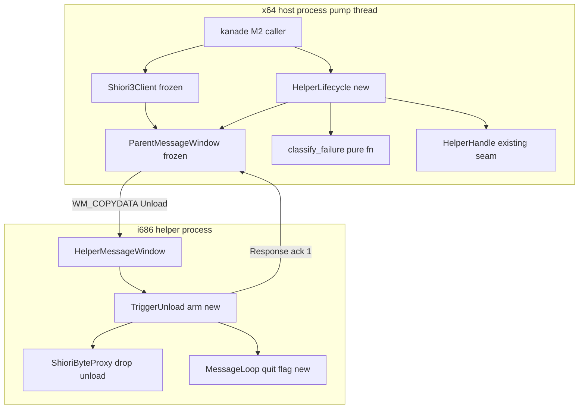
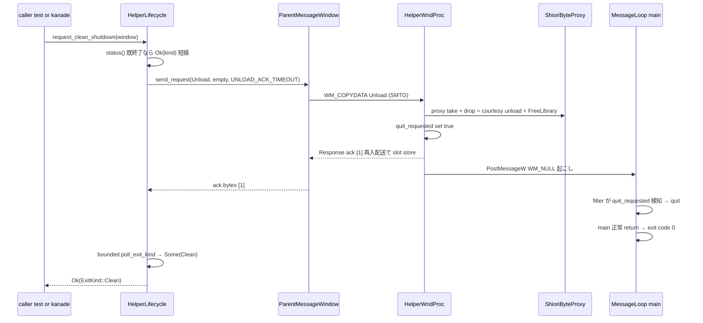
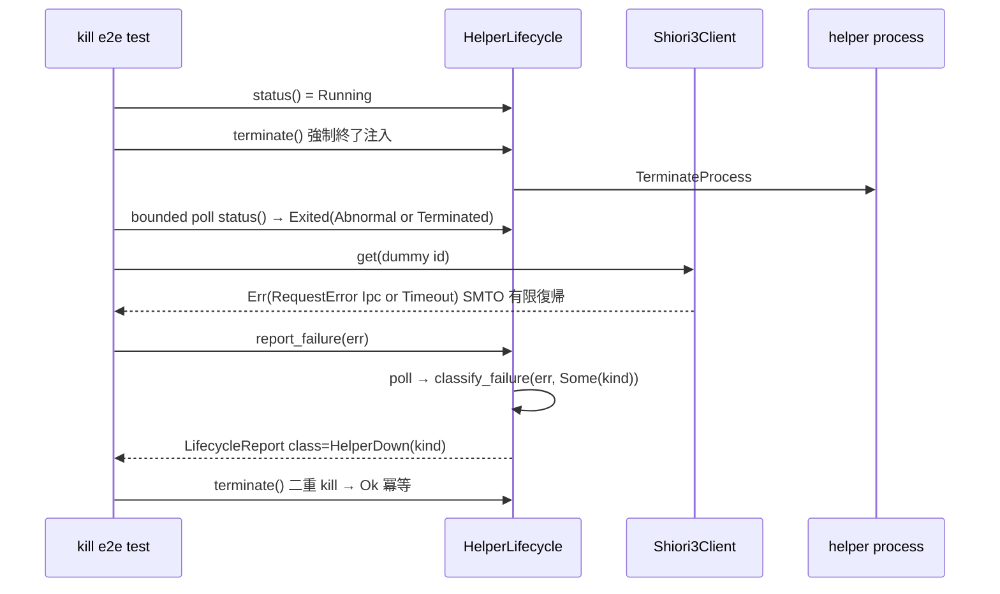

# Technical Design: areka-P0-host32-lifecycle

## Overview

**Purpose**: 本機能は host-32 トラックの最終ユニットとして、実 i686 helper の**常駐運転の健全性証明**と**死活報告 API の確定**を提供する。既存の死活 seam（`poll_exit`／`poll_exit_kind`／`ExitKind`）を常設監視 `HelperLifecycle` として器に載せ、request 失敗語彙（`RequestError`）と終了種別（`ExitKind`）を突合する統一報告語彙（`FailureClass`／`LifecycleReport`）を確定し、実 helper に正規の正常終了経路（UNLOAD → courtesy unload → メッセージループ正常終了 → exit 0 → `ExitKind::Clean`）を増設する。

**Users**: 下流 `areka-P0-kanade`（毎秒 pump の運行）が死活報告 API と統一失敗語彙をそのまま消費し、`ghost-setup` が shutdown 全経路（通常終了・異常後後始末）を終了系列の受け皿として共有する。

**Impact**: `shiori-host32-host` に新モジュール `lifecycle.rs` と `tracing` 依存（steering `logging.md` 準拠・新規承認事項ではない）を追加する。`shiori-host32-helper` に UNLOAD 契機の正常終了経路を増設する。凍結境界（`shiori-host32-ipc` の wire／framing／`MsgTag`／`ResponseSlot`／timeout）と `host32-request` の出口 API（`Shiori3Client`／`RequestError`）は一切改変しない——`MsgTag::Unload`(=5) は凍結 wire 語彙に**既に定義済み**（「下流が結線する」と明記）であり、本仕様はそれを消費するのみである。

### Goals

- 死活監視の常設化: 非ブロッキング・sticky な `HelperLifecycle::status()` を確立する（R1）
- 統一報告語彙の正本確定: `FailureClass`／`LifecycleReport`／`classify_failure`（`Send` な所有データ・kanade は再定義しない）（R2）
- 実 i686 helper の周期運転耐性を決定的ハーネスで実証する（R3）
- 強制 kill 注入で異常検出→観測可能エラー報告を単一 run で実証する（R4）
- 正規の正常終了経路を実 helper へ増設し、shutdown 全経路（通常・異常後）を決定的に通す（R5）
- env-gate 実 pasta 長時間追験（R6）・横断規律遵守（R7）

### Non-Goals

- 自動再起動・縮退戦略・プロセス処分方針（M2・`kanade`／`ghost-setup` の領分）
- イベントカタログ・OnSecondChange の意味論・発火順序・Value 配送（`kanade`）
- IPC フレーム・wire・`MsgTag`・`ResponseSlot`・timeout 機構の変更（凍結）
- `Shiori3Client` 出口 API・SHIORI/3.0 codec の意味論変更（消費のみ）
- 専用監視スレッド・`areka-actor` への結線（actor 非依存・先行可）
- SAORI（emo2 未使用）

## Boundary Commitments

### This Spec Owns

- **死活監視の常設化の器**: `HelperLifecycle`（`HelperHandle` を所有し、非ブロッキング・sticky な死活問い合わせと後始末を提供）
- **統一報告語彙の正本**: `HelperStatus`／`FailureClass`／`LifecycleReport`／`classify_failure`（下流 `kanade` は消費のみ・再定義しない）
- **ホスト側の正常終了要求経路**: `request_clean_shutdown`（UNLOAD 送出 → ack 観測 → 終了観測）と `ShutdownError` 語彙
- **helper の正規正常終了経路**: `TriggerUnload`（SHIORI unload → メッセージループ正常終了 → exit 0）の増設
- **常駐健全性の検証資産**: 周期運転試験・強制 kill 注入試験・env-gate 実 pasta 追験

### Out of Boundary

- `shiori-host32-ipc` の一切（凍結・cargo 依存で不透明消費。`MsgTag::Unload` は定義済み語彙の消費であり改変ではない）
- `Shiori3Client`／`RequestError`／`ShioriError`／SHIORI/3.0 codec の意味論（`host32-request` 完了資産・消費のみ）
- `spawn`／`poll_exit`／`poll_exit_kind`／`ExitKind`／`HelperHandle::terminate` の意味論（既存 seam・その上に増分するのみで `process_host.rs` は不改変）
- 再起動・縮退の判断ロジック（報告語彙に処分判断を含めない・R2.7）
- helper 側ログ機構の刷新（既存 `eprintln!` 流儀を踏襲する。helper を tracing-subscriber アプリ化する作業は本仕様の増分対象外。UNLOAD ack 送出失敗の `eprintln!` 観測は R7.6／steering からの**意図的逸脱として明文記録**——親の ack timeout 検出で silent failure にならないことが担保・validation Issue 2 決着）

### Allowed Dependencies

- `shiori-host32-host` → `shiori-host32-ipc`（凍結・既存 cargo 依存）
- `shiori-host32-host` → `tracing`（workspace 依存・steering `logging.md` 行 15-18 が `shiori-host32-*` を消費ライブラリとして明示列挙済み＝新規承認不要）
- `shiori-host32-helper` → `shiori-host32-ipc`・`wintf-winmsg-executor`（既存）
- `lifecycle.rs`（新規）→ `process_host`／`error`／`parent_window`（同 crate 内・一方向）
- helper → host のコード依存は引き続き **無し**（プロセス境界は WM_COPYDATA のみ）

### Revalidation Triggers

- `FailureClass`／`LifecycleReport`／`HelperStatus` の形状変更 → `kanade` の再検証（報告型は本仕様が正本）
- UNLOAD ack 契約（厳密 1 byte `[1]`）・正常終了系列（unload→quit→exit 0）の変更 → `ghost-setup`／`kanade` の終了系列再検証
- `ExitKind`／`RequestError` の上流変更（起きない前提＝凍結）→ 本仕様の突合表の再検証
- helper 起動パラメーター契約（arg/env 3 種）の変更 → spawn 経路の再検証

## Architecture

### Existing Architecture Analysis

- **死活 seam は完成済み**: `poll_exit_kind` は `try_wait` ベースで非ブロッキング、`ExitKind::classify` は `Some(0)→Clean`／`Some(n)→Abnormal(n)`／`None→Terminated` の純関数、`terminate` は `InvalidInput` を `Ok` に畳む冪等実装。R1.1〜1.5 の観測はすべて既存 seam が満たし、本仕様は「器」だけを増分する。
- **request 失敗語彙は区別保持済み**: `map_send_error` が `IpcError::Timeout`→`RequestError::Timeout`、その他→`Ipc` を手動振り分け（load-bearing・テスト済み）。本仕様はこの語彙を**所有内包**して死活と突合する。
- **helper は正常終了経路を持たない**: `MessageLoop::run(|_,_| Forward)` は無停止。「終了条件は下流が結線」と main.rs に明記済み＝本仕様がその下流である。
- **1 窓制約**: 同一テストプロセスで親 message-only 窓を同時 2 組生成できない。窓が要る試験は 1 バイナリ 1 windowed-test に分離する（`error_paths.rs` 踏襲）。
- **凍結 ipc の `MsgTag::Unload`(=5)**: 定義済み・未結線（helper は `IgnoreKnown`、親は能動送出なし）。本仕様が結線する正当な拡張点。

### Architecture Pattern & Boundary Map



**Architecture Integration**:

- **Selected pattern**: 既存 seam の**合成による増分**。新規機構は「監視の器（`HelperLifecycle`）」「突合純関数（`classify_failure`）」「helper 正常終了経路」の 3 点のみ。
- **監視駆動タイミング（決定・研究 Option A）**: **request 前後 poll・スレッド追加なし**。親窓は元来 pump スレッド専有（`Shiori3Client` は `!Send`）であり、毎秒 pump 前提の呼び手にとって「request していない間の死活変化が次 request まで観測されない」ことの実害は無い（次の観測点で必ず検出され、request 失敗も SMTO timeout で有限復帰する）。専用スレッド（Option C）は `HelperHandle` 所有権の共有問題と actor 化の先取りを招くため棄却。pump ループ内周期チェック（Option B）は常駐運行の器を本仕様が持つことになり kanade の領分を侵すため棄却。
- **Domain boundaries**: `HelperLifecycle` は**プロセス死活と後始末**のみを所有し、request 経路（`Shiori3Client`）を包まない・仲介しない。呼び手が両者を並べて使い、失敗時のみ `report_failure` で突合する。
- **Existing patterns preserved**: 純関数切り出し（`classify_inbound`／`resolve_param` と同型の `classify_failure`）、bounded ループ（`wait_kind` 意匠）、HelperGuard の Drop 冪等 terminate（`HelperLifecycle` の Drop へ昇格）、resolve panic（silent-skip 禁止）、env-gate 意匠。
- **Steering compliance**: tokio 禁止（std thread/blocking のみ）、`tracing` 消費ライブラリ規約、log-first（`error!`＋`Err`）、i686 は PowerShell ビルド。

### Technology Stack

| Layer | Choice / Version | Role in Feature | Notes |
|-------|------------------|-----------------|-------|
| ホスト監視・報告 | Rust 2024 / `shiori-host32-host`（x64/arm64） | `lifecycle.rs` 新設（監視の器・統一報告語彙・shutdown 経路） | 新規外部依存なし |
| ログ | `tracing = { workspace = true }`（0.1） | 失敗経路の `error!` 発行（ライブラリはマクロのみ・subscriber 初期化しない） | steering `logging.md` 準拠＝承認済み扱い |
| helper | Rust 2024 / `shiori-host32-helper`（i686） | `TriggerUnload` アーム＋quit フラグ＋main フィルタ | PowerShell ビルド必須 |
| transport | `shiori-host32-ipc`（凍結） | `MsgTag::Unload` の消費・`SMTO_ABORTIFHUNG`＋timeout に有限復帰を委ねる | 不改変 |
| 検証 | cargo test（x64 統合 tests ＋ i686 unit/loopback） | 周期運転・kill 注入・shutdown・env-gate 追験 | testdll fixture 決定的応答 |

## File Structure Plan

### Directory Structure

```
crates/shiori-host32-host/
├── Cargo.toml                        # 変更: tracing = { workspace = true } 追加
├── src/
│   ├── lib.rs                        # 変更: mod lifecycle と再 export 追加
│   └── lifecycle.rs                  # 新規: HelperLifecycle / HelperStatus / FailureClass /
│                                     #       LifecycleReport / classify_failure /
│                                     #       request_clean_shutdown / ShutdownError / 定数
└── tests/
    ├── lifecycle_cyclic_e2e.rs       # 新規: 周期運転(R3)＋clean shutdown(R5.1) 決定的 e2e
    │                                 #       ＋ env-gate 実 pasta 周期追験(R6)
    └── lifecycle_kill_e2e.rs         # 新規: 強制 kill 注入(R4)＋統一報告(R2.1/2.5)
                                      #       ＋異常後後始末(R5.2) 単一 run e2e（別バイナリ＝1 窓制約対処）

crates/shiori-host32-helper/
└── src/main.rs                       # 変更: InboundAction::TriggerUnload / HelperShared.quit_requested /
                                      #       UNLOAD アーム（proxy drop→ack[1]→wake）/ main ループ quit 結線
```

### Modified Files

- `crates/shiori-host32-host/Cargo.toml` — `tracing` workspace 依存追加（steering 準拠）
- `crates/shiori-host32-host/src/lib.rs` — `pub mod lifecycle;` と `HelperLifecycle`／`HelperStatus`／`FailureClass`／`LifecycleReport`／`classify_failure`／`ShutdownError` の再 export
- `crates/shiori-host32-helper/src/main.rs` — UNLOAD 結線（下記コンポーネント詳細）。既存の HELLO／LOAD／REQUEST 経路・`classify_inbound` の他アームは不改変

**不改変（明示）**: `shiori-host32-ipc/src/lib.rs`（凍結）、`shiori-host32-host/src/{client.rs, error.rs, shiori3.rs, parent_window.rs, process_host.rs}`（消費のみ）、`shiori-host32-helper/src/shiori_proxy.rs`（Drop courtesy unload 契約を消費）、`shiori-host32-testdll`（fixture 契約を消費）。

## System Flows

### 正規の正常終了経路（R5.1／R5.6）



フロー上の決定:
- **ack は unload 完了後・quit 前**に返す。ack `[1]` は「SHIORI unload（courtesy unload 契約）完了・終了系列へ入った」ことの確認応答であり、LOAD ack と同じ厳密 1 byte・`MsgTag::Response` 再入経路（新 wire 契約を発明しない）。
- **quit の伝搬**は「`Cell<bool>` フラグ＋自窓への `PostMessageW(WM_NULL)`」で行う。跨プロセス SendMessage で配送される WM_COPYDATA は `MessageLoop::run` のフィルタに現れない（GetMessage 内部で WndProc 直行）ため、WndProc からフラグを立て、posted メッセージでループを起こし、main のフィルタ閉包が `quit_requested` を見て `msg_loop.quit()` する（`pump_until_hello_or` と同型の既実証パターン）。
- **未 LOAD での UNLOAD** も ack `[1]`＋終了（unload すべき proxy が無い＝自明成功）。二重 UNLOAD は初回で終了系列に入るため実質発生しないが、アームは再入安全（take 済み→None→ack `[1]`）。

### 強制 kill 注入と統一報告（R4／R2.1／R2.5）



## Requirements Traceability

| Requirement | Summary | Components | Interfaces | Flows |
|-------------|---------|------------|------------|-------|
| 1.1 | 稼働中は非ブロッキングで「終了未検出」 | HelperLifecycle | `status() -> HelperStatus::Running` | — |
| 1.2 | 終了を非ブロッキング検出・種別区別 | HelperLifecycle（`poll_exit_kind` 消費） | `status() -> Exited(ExitKind)` | kill 注入 |
| 1.3 | code 0 → Clean | 既存 `ExitKind::classify`（消費） | `ExitKind::Clean` | 正常終了 |
| 1.4 | 非 0 → Abnormal(code) | 既存 `ExitKind::classify`（消費） | `ExitKind::Abnormal(i32)` | kill 注入 |
| 1.5 | code 無し → Terminated | 既存 `ExitKind::classify`（消費） | `ExitKind::Terminated` | kill 注入 |
| 1.6 | 既存 seam 上の常設化・ipc 不改変 | HelperLifecycle | seam 委譲のみ | — |
| 2.1 | helper 死亡起因の失敗を死活として報告 | classify_failure / report_failure | `FailureClass::HelperDown(ExitKind)` | kill 注入 |
| 2.2 | timeout を死活・SHIORI と区別 | classify_failure | `FailureClass::Unresponsive` | — |
| 2.3 | SHIORI エラーを区別 | classify_failure | `FailureClass::ShioriFailure` | — |
| 2.4 | 単一不透明失敗へ潰さない | LifecycleReport | `class`＋`error`（原因 `RequestError` 保持） | — |
| 2.5 | 異常検出後の request が観測可能エラー・無限待ちなし | SMTO timeout（凍結）＋ report_failure | kill e2e で観測 | kill 注入 |
| 2.6 | 報告データは `Send` 所有データ | 全報告型 | static assert（unit test） | — |
| 2.7 | 処分・再起動判断を語彙に含めない | FailureClass の外延 | 検出/報告のみのバリアント | — |
| 3.1 | 実 i686 helper へ周期連打の決定的ハーネス | lifecycle_cyclic_e2e | REPETITIONS 回 GET/NOTIFY | 周期運転 |
| 3.2 | 各往復成功・fixture 固定応答 | lifecycle_cyclic_e2e | `Some(EXPECTED_GET_VALUE)`／`Ok(())` | 周期運転 |
| 3.3 | ダミー ID・イベント意味論非依存 | lifecycle_cyclic_e2e | `OnTestValue`／`OnTestNotify`（fixture 契約 ID） | 周期運転 |
| 3.4 | 往復後の生存継続 | HelperLifecycle | `status() == Running` | 周期運転 |
| 3.5 | leak/枯渇/slot 巻き込みなしの決定的観測 | lifecycle_cyclic_e2e | 最小 assert 基準（下記 Testing） | 周期運転 |
| 3.6 | 本物 pasta を CI 必須にしない | testdll fixture | 決定的経路は fixture のみ | — |
| 4.1 | 強制終了の異常種別検出 | HelperLifecycle / lifecycle_kill_e2e | `Exited(Abnormal or Terminated)` | kill 注入 |
| 4.2 | kill 後 request の有限復帰・観測可能エラー | 凍結 SMTO＋client（消費） | `Err(Ipc or Timeout)` を bounded 観測 | kill 注入 |
| 4.3 | 単一の決定的 run で観測 | lifecycle_kill_e2e | 1 つの `#[test]` に結線 | kill 注入 |
| 4.4 | 失敗を `error!`＋`Err` で surface | lifecycle.rs（tracing） | `error!` 配置表（下記） | — |
| 5.1 | 正規正常終了経路で Clean 観測 | request_clean_shutdown＋helper UNLOAD アーム | `Ok(ExitKind::Clean)` | 正常終了 |
| 5.2 | 異常後後始末・冪等・二重 kill 安全 | HelperLifecycle（terminate/Drop） | `terminate()` 冪等（既存消費） | kill 注入 |
| 5.3 | 双方の shutdown 経路を決定的検証 | 両 e2e | cyclic=通常／kill=異常後 | 両フロー |
| 5.4 | shutdown に再起動を含めない | ShutdownError / API 外延 | 再起動 API 無し | — |
| 5.5 | shutdown 失敗を `error!`＋`Err` | ShutdownError＋error! | 3 失敗経路（下記） | 正常終了 |
| 5.6 | 実 helper への正規経路増設（stand-in 禁止） | helper main.rs TriggerUnload | unload→quit→exit(0) | 正常終了 |
| 6.1 | env 指定時に実 pasta 周期追験 | cyclic_real_pasta_optional | `HOST32_PASTA_DLL` gate | 周期運転 |
| 6.2 | env 設定済み・DLL 不在は明示 fail | 同上 | `assert!(is_file)` | — |
| 6.3 | env 未設定は skip・fixture が CI ゲート | 同上 | 既存 env-gate 意匠踏襲 | — |
| 7.1 | ipc 凍結不改変 | 依存構造 | cargo 依存の不透明消費 | — |
| 7.2 | `Shiori3Client`／`RequestError` 意味論不変 | LifecycleReport（所有内包） | 拡張ではなく内包 | — |
| 7.3 | PowerShell・i686 cargo test | 検証手順 | 下記 Testing 実行前提 | — |
| 7.4 | helper/fixture 不在は明示 fail | resolve_* panic（踏襲） | 既存関数流用 | — |
| 7.5 | sleep 最小・凍結 timeout に乗る有限復帰 | bounded poll 意匠 | 5ms poll＋deadline のみ | — |
| 7.6 | panic 回避・`error!`＋`Err` | lifecycle.rs 失敗経路 | `ShutdownError` 等 | — |
| 7.7 | actor 非結線・`Send` 報告 | HelperLifecycle: Send | static assert | — |

## Components and Interfaces

| Component | Domain/Layer | Intent | Req Coverage | Key Dependencies | Contracts |
|-----------|--------------|--------|--------------|------------------|-----------|
| HelperLifecycle | host / lifecycle | 死活監視の常設の器＋後始末 | 1.1-1.6, 4.1, 5.2, 7.7 | HelperHandle (P0), poll_exit_kind (P0) | Service |
| 統一報告語彙（HelperStatus / FailureClass / LifecycleReport / classify_failure） | host / lifecycle | 死活×request 失敗の突合正本 | 2.1-2.7 | ExitKind (P0), RequestError (P0・不改変) | Service / State |
| request_clean_shutdown ＋ ShutdownError | host / lifecycle | 正規正常終了経路のホスト側 | 5.1, 5.3, 5.4, 5.5 | ParentMessageWindow::send_request (P0), MsgTag::Unload (P0・凍結消費) | Service |
| helper UNLOAD 結線 | helper / main.rs | 正規正常終了経路の helper 側 | 5.1, 5.6 | ShioriByteProxy Drop (P0), MessageLoop (P0) | Event |
| lifecycle_cyclic_e2e | tests | 周期運転＋clean shutdown＋pasta 追験 | 3.1-3.6, 5.1, 6.1-6.3 | testdll fixture (P0) | — |
| lifecycle_kill_e2e | tests | kill 注入＋統一報告＋異常後後始末 | 4.1-4.3, 2.1, 2.5, 5.2 | helper exe (P0) | — |

### host / lifecycle（`crates/shiori-host32-host/src/lifecycle.rs`）

#### HelperLifecycle

| Field | Detail |
|-------|--------|
| Intent | `HelperHandle` を所有し、非ブロッキング・sticky な死活監視と冪等な後始末を常設提供する |
| Requirements | 1.1, 1.2, 1.6, 4.1, 5.2, 7.7 |

**Responsibilities & Constraints**
- `HelperHandle` の**単独所有者**（監視と terminate の handle 共有問題を構造的に排除）。request 経路（`Shiori3Client`＝窓借用）とは別オブジェクトであり、包まない・仲介しない。
- **sticky 終了キャッシュ**: 一度 `Exited(kind)` を観測したら以後 `status()` は再 poll せず同値を返す（終了は終端状態・観測の決定性）。
- **`Send`**: `Child` は `Send` ゆえ `HelperLifecycle` も `Send`（将来の shiori アクター inbox 処理から移送可能・R7.7）。窓（`!Send`）は保持しない。
- Drop で冪等 `terminate`（HelperGuard パターンの昇格・panic 経路でもプロセスリークなし）。Drop 内の `Err` は `error!` のみ（Drop で panic しない・R7.6）。

**Dependencies**
- Outbound: `process_host::{poll_exit_kind, HelperHandle}` — 死活 seam 委譲（P0）
- Outbound: `parent_window::ParentMessageWindow` — `request_clean_shutdown` の送出面のみ transient 借用（P0）
- External: `tracing` — `error!` 発行（P1）

**Contracts**: Service [x]

##### Service Interface

```rust
/// 死活監視の観測結果（Send・Copy な所有データ・R2.6）。
#[derive(Debug, Clone, Copy, PartialEq, Eq)]
pub enum HelperStatus {
    /// 稼働中（終了未検出・R1.1）。
    Running,
    /// 終了検出済み（種別付き・R1.2〜1.5）。sticky（以後不変）。
    Exited(ExitKind),
}

pub struct HelperLifecycle {
    handle: HelperHandle,
    /// sticky 終了キャッシュ（一度 Some になったら以後 poll しない）。
    last_exit: Option<ExitKind>,
}

impl HelperLifecycle {
    /// spawn 済み handle を監視の器に載せる（所有移転・R1.6）。
    pub fn new(handle: HelperHandle) -> Self;

    /// 非ブロッキング死活問い合わせ（R1.1/1.2）。try_wait ベース・呼び手を止めない。
    /// 終了検出後は sticky（同じ ExitKind を返し続ける）。
    pub fn status(&mut self) -> HelperStatus;

    /// request 失敗と死活を突合し統一報告を作る（R2.1〜2.5）。
    /// 内部で status() を採り classify_failure へ渡す。HelperDown 検出時は error! を発行。
    pub fn report_failure(&mut self, error: RequestError) -> LifecycleReport;

    /// 強制終了（冪等・二重 kill 安全・R5.2）。既存 HelperHandle::terminate へ委譲。
    /// Err は error! ＋ そのまま返す（握り潰さない・R4.4）。
    pub fn terminate(&mut self) -> std::io::Result<()>;

    /// 正規の正常終了経路（R5.1）: UNLOAD 送出 → ack[1] 観測 → 終了種別を bounded 観測。
    /// 既終了なら送出せず Ok(観測済み kind) を返す（短絡・冪等）。
    pub fn request_clean_shutdown(
        &mut self,
        window: &ParentMessageWindow,
    ) -> Result<ExitKind, ShutdownError>;

    /// 観測用: OS プロセス ID。
    pub fn pid(&self) -> u32;
}

impl Drop for HelperLifecycle {
    /// 冪等 terminate（panic 経路のリーク防止）。Err は error! のみ（Drop で panic しない）。
    fn drop(&mut self);
}
```

- Preconditions: `new` は `spawn` 成功済み handle を受ける。`request_clean_shutdown` はハンドシェイク済み窓を借用する（窓所有スレッド上で呼ぶ）。
- Postconditions: `status()` は決して呼び手をブロックしない。`request_clean_shutdown` の `Ok` は終了種別の観測完了（プロセス終了済み）を意味する。
- Invariants: `last_exit` は `None → Some` の一方向のみ（sticky）。`HelperLifecycle: Send`。

**Implementation Notes**
- Integration: `poll_exit_kind` の内部 `try_wait` I/O `Err` は既存 seam の確定意味論として「稼働中扱い（`None`）」（非ブロッキング・無限待機回避を優先・R1.2）。この握りは seam（`process_host.rs`・不改変消費）の責務であり、**R4.4 の `error!`＋`Err` 規律は本仕様が新設する失敗経路**（`terminate` の `Err`・`report_failure` の `HelperDown` 生成・`request_clean_shutdown` の 3 失敗）**に適用する**——seam の意味論変更（`Option`→`Result` 化）は R7.2 系の消費規律に反するため行わない。sticky 化は `std` の `try_wait` が reap 後もキャッシュを返す性質への依存を切り、観測を型内で決定化する。
- Validation: stand-in（`spawn_command(cmd /c exit N)`）で `status()` の非ブロッキング／sticky／分類を i686 helper 不要で単体検証。
- Risks: なし（新規 I/O 経路を持たず既存 seam の委譲のみ）。

#### 統一報告語彙（classify_failure / FailureClass / LifecycleReport）

| Field | Detail |
|-------|--------|
| Intent | request 失敗（`RequestError`・凍結）と死活（`ExitKind`）を突合する正本語彙。kanade は消費のみ |
| Requirements | 2.1, 2.2, 2.3, 2.4, 2.5, 2.6, 2.7 |

**Responsibilities & Constraints**
- **`RequestError` を不改変で所有内包**する（研究 Option B＋C の折衷: 突合判定は純関数 C、報告の運搬は包む型 B）。`RequestError` へのバリアント追加・意味論変更は行わない（R7.2）。
- 処分判断（restart/dispose）のバリアントを**持たない**（R2.7）。
- 全型 `Send`（所有データのみで構成・R2.6）。

**Contracts**: Service [x] / State [x]

##### Service Interface

```rust
/// 統一失敗分類（R2.1〜2.3・Send・Copy）。処分判断は含まない（R2.7）。
#[derive(Debug, Clone, Copy, PartialEq, Eq)]
pub enum FailureClass {
    /// helper 死亡起因（失敗時点で終了が観測された・R2.1）。保持値は観測された終了種別。
    HelperDown(ExitKind),
    /// helper 生存（終了未検出）だが上限時間内に応答なし（wire timeout・R2.2）。
    Unresponsive,
    /// SHIORI エラー応答（400/500/ErrorLevel・helper は生存・R2.3）。
    ShioriFailure,
    /// helper 生存だが transport 送出失敗（Ipc・死亡未検出の境界異常）。
    Transport,
    /// 未ハンドシェイク（構造上通常起きない・区別のため潰さない・R2.4）。
    Handshake,
}

/// 統一報告（本仕様が正本・kanade は再定義しない・R2.4/2.6）。
/// class（突合結果）と error（原因の RequestError・凍結型を所有内包）の二軸を保持し、
/// 単一の不透明失敗へ潰さない。
#[derive(Debug)]
pub struct LifecycleReport {
    pub class: FailureClass,
    pub error: RequestError,
}

/// 突合の正本純関数（R2.1〜2.4・決定的・窓/プロセス非依存で単体テスト可）。
///
/// | observed_exit          | error                  | 結果                    |
/// |------------------------|------------------------|-------------------------|
/// | Some(kind)（終了検出） | （何であれ）           | HelperDown(kind)        |
/// | None（生存）           | RequestError::Timeout  | Unresponsive            |
/// | None                   | RequestError::Ipc      | Transport               |
/// | None                   | RequestError::Shiori   | ShioriFailure           |
/// | None                   | RequestError::Handshake| Handshake               |
pub fn classify_failure(error: &RequestError, observed_exit: Option<ExitKind>) -> FailureClass;
```

- Invariants: 終了検出は他のすべてに優先する（死んだ helper への request 失敗は、表面が `Timeout` でも `Ipc` でも `HelperDown` として報告する＝R2.1 の本質）。`observed_exit = Some(Clean)` でも `HelperDown(Clean)`（死亡は死亡・種別は呼び手が読む）。
- `Send` 担保: `const fn assert_send<T: Send>() {}` による静的 assert を unit test に置く（`HelperStatus`／`FailureClass`／`LifecycleReport`／`HelperLifecycle` の 4 型・R2.6/7.7）。

**Implementation Notes**
- Integration: `report_failure` が唯一の突合駆動点（poll → classify → `error!`（HelperDown 時）→ 報告返却）。kanade は `LifecycleReport` を channel で移送できる（`Send` 所有データ）。
- Validation: `classify_failure` の 5 分類×表の全行を unit test で網羅。
- Risks: `RequestError` が `Clone` を持たないため報告は原因を**移動**で内包する（呼び手は所有権ごと受け取る設計＝channel 移送に整合）。

#### request_clean_shutdown ＋ ShutdownError

| Field | Detail |
|-------|--------|
| Intent | 正規正常終了経路のホスト側: UNLOAD 送出 → ack 観測 → 終了観測を一関数で決定的に |
| Requirements | 5.1, 5.3, 5.4, 5.5 |

**Responsibilities & Constraints**
- `MsgTag::Unload`（凍結 wire 語彙に定義済み）を `ParentMessageWindow::send_request` で送出する（新 wire 契約・新 MsgTag を発明しない）。
- 再起動 API を持たない（R5.4）。

**Contracts**: Service [x]

##### Service Interface

```rust
/// UNLOAD ack（unload 完了確認）待機の上限（LOAD_ACK_TIMEOUT と同値 30s・courtesy unload の
/// FFI 実行時間を含むため LOAD と同格に取る）。per-call で send_request へ渡すのみ（ipc 不改変）。
pub const UNLOAD_ACK_TIMEOUT: Duration = Duration::from_secs(30);
/// ack 受領後、プロセス終了（ExitKind 観測）までの bounded poll 上限。
pub const EXIT_OBSERVE_TIMEOUT: Duration = Duration::from_secs(10);
/// bounded poll の刻み（実時間 sleep はこれのみ・R7.5）。
pub const EXIT_POLL_INTERVAL: Duration = Duration::from_millis(5);

/// shutdown 経路の失敗語彙（R5.5・error! と対で surface）。
#[derive(thiserror::Error, Debug)]
pub enum ShutdownError {
    /// UNLOAD の送出／ack 往復が失敗（SendError を所有内包・凍結型不改変）。
    #[error("unload round-trip failed: {0}")]
    Unload(#[from] SendError),
    /// ack が厳密 1 byte [1] でない（契約違反の観測）。
    #[error("unexpected unload ack: {0:?}")]
    UnexpectedAck(Vec<u8>),
    /// ack 受領後、上限時間内にプロセス終了が観測できない。
    #[error("helper did not exit within bound after unload ack")]
    ExitTimeout,
}
```

処理系列（`HelperLifecycle::request_clean_shutdown`）:
1. `status()` が `Exited(kind)` なら送出せず `Ok(kind)`（短絡・既終了への終了要求を失敗させない）。
2. `window.send_request(MsgTag::Unload, &[], UNLOAD_ACK_TIMEOUT)` — `Err` は `error!`＋`Err(ShutdownError::Unload)`。
3. ack ≠ `[1]` は `error!`＋`Err(ShutdownError::UnexpectedAck)`。
4. `EXIT_OBSERVE_TIMEOUT` を deadline とする bounded ループで `status()` を poll（刻み `EXIT_POLL_INTERVAL`）。`Exited(kind)` で `Ok(kind)`（正常系列なら `Clean`）。deadline 超過は `error!`＋`Err(ShutdownError::ExitTimeout)`。

- Postconditions: `Ok(_)` はプロセス終了の観測完了。`Ok(ExitKind::Clean)` が R5.1 の成立証拠。
- `error!` 配置表（R4.4／R5.5／R7.6 の確定・残っていた design 自由度の決定）:

| 箇所 | レベル | 内容 |
|------|--------|------|
| `request_clean_shutdown` 手順 2/3/4 の各失敗 | `error!` | `[request_clean_shutdown]` プレフィクス＋原因フィールド |
| `report_failure` が `HelperDown` を生成した時 | `error!` | 終了種別・原因 `RequestError` を構造化フィールドで |
| `terminate()` の `Err` | `error!` | I/O 失敗の観測（戻り値でも返す） |
| `Drop` 内 terminate の `Err` | `error!` | ログのみ（Drop で panic しない） |

subscriber 初期化はライブラリでは行わない（steering `logging.md`・テストは assert を戻り値で行うため初期化不要）。

### helper / UNLOAD 結線（`crates/shiori-host32-helper/src/main.rs`）

#### TriggerUnload アームと正常終了経路

| Field | Detail |
|-------|--------|
| Intent | 実 helper に正規の正常終了経路を増設: UNLOAD → SHIORI unload → ループ正常終了 → exit 0 |
| Requirements | 5.1, 5.6 |

**Responsibilities & Constraints**
- `classify_inbound`: `Ok((MsgTag::Unload, _)) => InboundAction::TriggerUnload`（ペイロード有無を問わず・`TriggerLoad` と同型）。`IgnoreKnown` の対象から `Unload` を除く。
- `HelperShared` へ追加: `quit_requested: Cell<bool>`・観測カウンタ `unloads_handled: Cell<u64>`。
- **UNLOAD アームの手順**（RefCell 再入規律を LOAD/REQUEST アームと同格に厳守）:
  1. `let taken = s.proxy.borrow_mut().take();` — borrow は文末で終了。
  2. `drop(taken);` — **borrow 非保持**で `ShioriByteProxy` の Drop（courtesy `unload()` → `FreeLibrary`・`host32-shiori-load` 確立契約の唯一の teardown 経路）を実行。未確立（None）なら no-op＝自明成功。
  3. `s.quit_requested.set(true);`
  4. ack `[1]` を `send_copydata(parent, self, MsgTag::Response, &[1], REPLY_TIMEOUT)` で 1 通返送（LOAD ack と同型・borrow 非保持・送出失敗は `eprintln!` 観測のみ＝親は timeout で検出）。**意図的逸脱（記録）**: この helper 側 ack 送出失敗の `eprintln!` は R7.6（`error!`＋`Err`）および steering `logging.md` の helper=tracing-subscriber アプリ規約からの**意図的な逸脱**である——親が ack timeout → `ShutdownError::Unload`＋ホスト側 `error!` で必ず検出するため silent failure にはならず、helper の tracing 化（subscriber 初期化含む）は本仕様の増分対象外＝将来ユニットへ送る（design discussion 2026-07-05 決着・validation Issue 2）。
  5. 自窓へ `PostMessageW(WM_NULL)` — posted メッセージで `MessageLoop` を起こす（sent-message はフィルタに現れないため必須）。
- **main の結線**: `MessageLoop::run(|msg_loop, _msg| { if win.quit_requested() { msg_loop.quit(); } FilterResult::Forward })`。quit 後 main が正常 return し**プロセスは終了コード 0** で終わる（stand-in `exit(0)` ではなく、実運転コードの正規経路・R5.6）。`HelperMessageWindow` に `quit_requested() -> bool` アクセサを追加（非 test 公開）。
- ログは既存 main.rs の `eprintln!` 流儀を踏襲（helper のログ機構刷新は Out of Boundary）。

**Contracts**: Event [x]

##### Event Contract

- 受信: `WM_COPYDATA`／`MsgTag::Unload`（payload 無視）— 正常終了要求。
- 送信: `WM_COPYDATA`／`MsgTag::Response`・**厳密 1 byte `[1]`** — 「unload 完了・終了系列に入った」確認応答。親の `send_request` の `ResponseSlot` 再入受領で消費（single-in-flight・LOAD ack と同一経路）。
- 順序保証: ack 返送は proxy drop（unload 完了）**後**・ループ quit **前**。ack 受領後のプロセス終了はホスト側 bounded poll が観測する（ack→exit の間は ms オーダー）。
- 冪等: 未 LOAD・二重 UNLOAD いずれも ack `[1]`＋終了系列（crash・panic しない）。

**Implementation Notes**
- Integration: `MsgTag::Unload` は凍結 ipc に定義済み（`try_from_u32` の 5）。wire・framing・slot・timeout に一切触れない。
- Validation: i686 unit（`classify_inbound` の TriggerUnload 分類・ペイロード有無）＋ i686 loopback（既存 loopback テストへ UNLOAD 節を追加: proxy が `None` になる・`quit_requested` が立つ・親 stand-in が ack `[1]` を受領する。`HOST32_TESTDLL_UNLOAD_MARKER` は set しない＝marker env は既存 Drop テストの単独所有）。プロセスまるごとの exit 0 → `Clean` は x64 側 e2e（cyclic）が観測する。
- Risks: `MessageLoop::run` のフィルタが posted メッセージでしか呼ばれない点は `pump_until_hello_or` で実証済みの前提。万一 WM_NULL が失われても後続メッセージで再評価される（フラグは sticky）。

## Error Handling

### Error Strategy

- **区別保持が第一原則**（R2.4）: 失敗は `LifecycleReport`（class＋原因）または `ShutdownError`（経路別バリアント）として、単一の不透明エラーへ潰さず surface する。
- **有限復帰は凍結 transport に乗る**（R7.5）: 死んだ helper への送出は `SendMessageTimeoutW` が即時失敗（`SendFailed`→`Ipc`）または上限時間で `Timeout` を返す。本仕様は待機機構を追加しない。
- **log-first**（R4.4/R5.5/R7.6）: 上記 `error!` 配置表の 4 点＋`Err` 戻り値。安易な panic 禁止（panic は resolve_*（テスト前提資材の不在）に限定＝既存規律）。

### Error Categories and Responses

- **helper 死亡**（`FailureClass::HelperDown(kind)`）: 検出と報告まで（処分判断は下流・R2.7）。以降の request は呼び手が status() 短絡で送出回避可能。
- **無応答**（`Unresponsive`）: helper 生存・wire timeout。リトライ判断は呼び手。
- **SHIORI エラー**（`ShioriFailure`）: helper/transport 健全・SHIORI 意味論の失敗。原因 `RequestError::Shiori` の `status`／`ErrorLevel` を報告が保持。
- **shutdown 失敗**（`ShutdownError`）: 経路別（送出失敗／契約違反 ack／終了未観測）。いずれも `error!` 済みで返る。

### Monitoring

`tracing` の `error!`（構造化フィールド・`[関数名]` スコーププレフィクス・steering `logging.md` 準拠）。subscriber はアプリ／テスト層の責務でありライブラリは発行のみ。

## Testing Strategy

実行前提（R7.3・PowerShell 必須）:

```powershell
cargo build -p shiori-host32-testdll --target i686-pc-windows-msvc
cargo build -p shiori-host32-helper  --target i686-pc-windows-msvc
cargo test  -p shiori-host32-helper  --target i686-pc-windows-msvc   # i686 unit/loopback
cargo test  -p shiori-host32-host                                    # x64 unit + e2e

# env-gate 実 pasta 追験（任意・R6）: lifecycle_cyclic_e2e には windowed テストが 2 本
# （cyclic＋pasta 追験）あるため、env 設定時は必ず --test-threads=1 で直列実行する
# （1 窓制約: 親 message-only 窓は同一プロセスで同時 2 組生成不可）。
# CI（env 未設定）では pasta 側が早期 return するため通常実行で衝突しない。
$env:HOST32_PASTA_DLL="C:\path\to\pasta.dll"
cargo test -p shiori-host32-host --test lifecycle_cyclic_e2e -- --test-threads=1
```

### Unit Tests（`lifecycle.rs` 内・i686 helper 不要）

1. `classify_failure` 突合表の全行網羅（`Some(kind)`×各 error → `HelperDown(kind)`／`None`×`Timeout`→`Unresponsive`／`None`×`Ipc`→`Transport`／`None`×`Shiori`→`ShioriFailure`／`None`×`Handshake`→`Handshake`）— R2.1〜2.4。
2. `Send` 静的 assert（`HelperStatus`／`FailureClass`／`LifecycleReport`／`HelperLifecycle`）— R2.6/7.7。
3. `HelperLifecycle::status` の非ブロッキング（poll 単体所要 <1s assert）＋ stand-in `cmd /c exit 5` で `Exited(Abnormal(5))` 観測 → **sticky**（再呼出で同値）— R1.1/1.2/1.4。
4. stand-in `cmd /c exit 0` で `Exited(Clean)` 分類 — R1.3（`Terminated` 分岐は既存 classify テスト網羅に委譲・R1.5）。
5. `terminate` 二重呼出が `Ok`（stand-in 終了後）— R5.2 の単体面。

### Unit Tests（helper・i686）

6. `classify_inbound(Unload)` → `TriggerUnload`（ペイロード有無両方）／`IgnoreKnown` から Unload が消えたこと — R5.6。
7. 既存 loopback テストへ UNLOAD 節追加: UNLOAD 送出後に proxy `None`・`quit_requested == true`・親 stand-in が ack `[1]` 受領 — R5.1 の helper 側。

### Integration Tests（x64・実 i686 helper/testdll）

8. **`tests/lifecycle_cyclic_e2e.rs::cyclic_run_and_clean_shutdown`**（R3.1〜3.6, R1, R5.1, R5.3, R7.4/7.5）: 親窓 → spawn → HELLO pump → LOAD ack `[1]` → `HelperLifecycle::new` → **`REPETITIONS = 200` 回**の反復 { `get("OnTestValue")==Some(固定 Value)`・`notify("OnTestNotify")==Ok`・`status()==Running` } → `request_clean_shutdown` → **`Ok(ExitKind::Clean)`**。反復間 sleep なし（back-to-back・決定性）。
   - **R3.5 の観測基準（決定）**: 「全 200×2 往復の成功（各往復が `ResponseSlot` の clear→store→take 1 巡の完結証明）＋ 反復後 `status()==Running` ＋ clean shutdown が `Clean` で完結」を最小十分の assert 集合とする。OS ハンドル計数は**課さない**（ハンドル数は OS 内部要因で非決定的に揺れ、決定的テストの偽陽性源になる。持続成功＋生存＋正常終了完遂が観測可能な契約であり、枯渇・slot 巻き込みがあれば反復中の失敗として顕在化する）。
   - **反復回数の根拠（決定）**: 200 回は単発実証（1 回）の 2 桁上で slot 再利用・HGLOBAL 確保/解放の churn を十分に行使し、かつ全体実行時間が SMTO 上限に対して短く CI 適合。「OnSecondChange 相当の頻度」は実時間ペーシングではなく**連続連打（頻度の上界）**として解釈する（実時間 sleep を持ち込まない・R7.5）。
9. **`tests/lifecycle_kill_e2e.rs::kill_injection_detection_and_reporting`**（R4.1〜4.3, R2.1/2.5, R5.2）— 別バイナリ＝別プロセス（1 窓制約対処）: 親窓 → spawn → HELLO → LOAD → baseline GET 成功 → `status()==Running` → `terminate()`（kill 注入）→ bounded poll で `Exited(Abnormal|Terminated)`（R4.1）→ `client.get` が **BOUNDED_LIMIT 内**に `Err(Ipc|Timeout)`（R4.2・ハングなし）→ `report_failure(err)` → `class==HelperDown(非 Clean)`（R2.1/2.5）→ 二重 `terminate()` が `Ok`（R5.2）→ `request_clean_shutdown` が既終了短絡で `Ok(非 Clean kind)`（異常後後始末の決定性・R5.3）。
10. **`tests/lifecycle_cyclic_e2e.rs::cyclic_real_pasta_optional`**（R6.1〜6.3）: env `HOST32_PASTA_DLL` 未設定 → skip（eprintln 明示・R6.3）／設定済み DLL 不在 → 明示 fail（R6.2）／設定済み → `N_PASTA = 300` 回の `notify("OnSecondChange", ..)` 連打（**応答 status 非依存**＝notify は破棄契約ゆえ実 DLL の応答内容に依らず transport 健全性を観測。イベント運行の意味論検証はしない＝kanade 領分）＋ `status()==Running` → `request_clean_shutdown` → `Ok(Clean)`（confidence・R6.1）。**実行規律**: 本テストは cyclic（項目 8）と同一バイナリの windowed テスト 2 本目にあたるため、env 設定時の実行は必ず `--test-threads=1` で直列化する（上記 PowerShell 手順に明記・1 窓制約対処。CI＝env 未設定では早期 return し窓を作らないため通常実行と衝突しない）。

**共通インフラ**: `resolve_helper_exe`／`resolve_testdll`（不在は明示 panic・R7.4）、fixture 契約値ハードコード（`OnTestValue`／固定 Value／`OnTestNotify`＝イベント意味論を持たないダミー ID・R3.3）、guard は `HelperLifecycle` の Drop terminate が兼ねる。

## Optional: Performance & Scalability

- 周期連打はプロセス跨ぎ同期往復（SMTO）であり、200 回で数秒オーダー（1 往復 ≈ ms 級・既存 e2e 実測に基づく）。CI 時間予算に影響しない。
- 監視は `try_wait` 1 系統のみ（毎 request 高々 1 回）＝計測可能なオーバーヘッドなし。専用スレッド・常駐ループを持たないため、スケール判断（複数ゴースト＝複数 helper）は `HelperLifecycle` を器ごと複数持つだけで自然に延びる（インターフェース水準の拡張性・実装は現要件のみ）。
