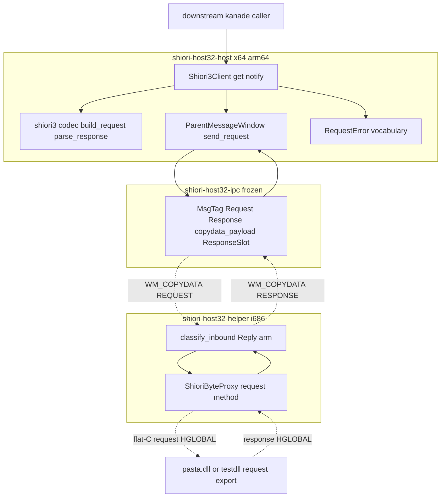
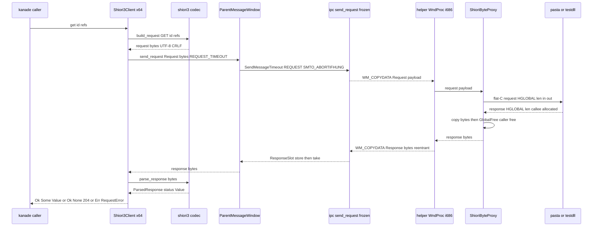
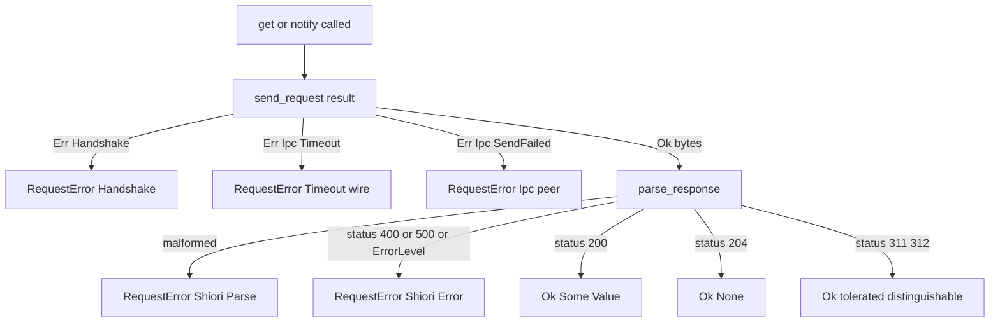

# Technical Design Document

## Overview

**目的**: 本仕様は x64 areka が **SHIORI イベント（ID＋References）を SHIORI/3.0 request として組み立て、凍結 WM_COPYDATA wire 越しに 32bit `pasta.dll` の `request()` を実駆動し、返却 response から `Value`（さくらスクリプト本体）を受領する**能力を提供する。上流 `host32-shiori-load` で load までは貫通済みだが request が呼べない（ゴーストが一言も喋れない）欠落を、2 層（helper 側 i686 の `request` 実呼出、host 側 x64 の SHIORI/3.0 codec）を増分して埋める。

**利用者**: 直接の消費者は下流 `areka-P0-kanade`（SHIORI イベント循環）で、本仕様の host 出口 API（`get`/`notify`）を「イベント→`Value`」として消費する。`areka-P0-host32-lifecycle` は本仕様のエラー語彙（wire timeout／SHIORI エラー／helper 死活）を crash 監視・縮退判断の受け皿として共有する。

**影響**: 新規 transport はゼロ。凍結境界 `shiori-host32-ipc`（wire/framing/`MsgTag`/`ResponseSlot`/timeout）を一切改変せず、その不透明バイト列ペイロードの上に (a) helper の request 実呼出、(b) x64 純 codec、(c) 出口 API、(d) testdll fixture 拡張の 4 点を載せる。helper の `respond()` echo スタブが pasta 駆動へ置換され、host に SHIORI/3.0 の組立/解析が新設される。

### Goals

- x64 で ID＋Reference 群から `GET`/`NOTIFY SHIORI/3.0` request バイト列を組み立てる**汎用 codec**（イベント個別知識なし）。
- response バイト列から status（200/204/311/312/400/500）・`Value`・エラー情報を**寛容に**解析する codec。
- helper（i686）が `ShioriByteProxy` 保持済みの `request` エクスポートを**実呼出**（HGLOBAL 非対称契約遵守）。
- 下流が codec/wire/HGLOBAL 内部を知らずに使える**単一 request 出口 API**（GET＝応答待ち・NOTIFY＝投げきり）と、区別可能なエラー語彙。
- testdll fixture の `request` を「受領検証＋固定 SHIORI/3.0 応答」へ拡張した**決定的 E2E**＋env-gated 実 pasta 追験。

### Non-Goals

- イベントカタログ・送出タイミング・SHIORI イベント循環の駆動（→ `kanade`）。本仕様は OnBoot 一件と固定テスト ID を観測に用いるのみ。
- 常駐メッセージループ・`OnSecondChange` ポーリング・crash 監視・`unload` 恒常呼出（→ `host32-lifecycle`）。
- `IShiori::Get` の遅延応答（`SHIORI_S_PENDING`＋token＋`Complete`）の**実装**（型シームのみ・pasta は同期応答ゆえ同期で足る）。
- Load 前 Request の防御・「未準備」エラー語彙（Load-before-Request が構造的不変・後述）。
- Shift_JIS request/response の実符号化（拡張シームのみ・emo2＝UTF-8 固定）。
- WM_COPYDATA transport（`shiori-host32-ipc`）の改変（凍結）。SAORI（emo2 未使用）。native x64 脳の実装本体。

## Boundary Commitments

### This Spec Owns

- **[host codec]** SHIORI/3.0 request 組立（`GET`/`NOTIFY`・CRLF・空行終端・`Charset`/`Sender`/`ID`/`Reference0..N`・UTF-8）と response 解析（status・`Value`・`ErrorLevel`/`ErrorDescription`・未知ヘッダ寛容）。純関数群。
- **[host 出口 API]** 「イベント（ID＋References）→`Value`（あれば）」の GET 経路と「片道イベント」の NOTIFY 経路。`Send` な引数/戻り値・内部型非露出・同期ブロッキング可。
- **[host エラー語彙]** wire timeout／SHIORI エラー／helper 死活を区別保持する統合エラー型。
- **[helper]** `ShioriByteProxy::request` メソッド（`request` エクスポート実呼出・HGLOBAL 非対称契約）と `Reply` アームからの駆動（echo 置換）。
- **[testdll fixture]** `request` の固定 SHIORI/3.0 応答化（GET→200+`Value`／NOTIFY→204）＋受領検証面＋caller-free 被検証側の実体化。
- **[E2E]** testdll 決定的往復（`Value` 抽出・所有権規約）＋env-gated 実 pasta OnBoot。

### Out of Boundary

- イベント名の網羅・送出タイミング・SHIORI イベント循環（→ `kanade`）。
- 常駐運転・crash 監視・`unload` 恒常呼出（→ `host32-lifecycle`）。
- `IShiori::Get`/`Notify` の COM factory 実装・遅延応答実装・Shift_JIS 実符号化（型シームのみ）。
- `shiori-host32-ipc` の wire/framing/`MsgTag`/`ResponseSlot`/timeout 機構の改変（凍結・不透明バイト列として利用のみ）。
- 応答 `Value`（さくらスクリプト）の解釈・再生（→ `sakura`/`kanade`）。

### Allowed Dependencies

- **上流（改変禁止）** `shiori-host32-ipc`（`MsgTag`/`copydata_payload`/`send_request`/`ResponseSlot`/`IpcError`）。
- **上流（拡張元）** `shiori-host32-host`（`ParentMessageWindow::send_request`・`process_host`・`error`）／`shiori-host32-helper`（`ShioriByteProxy`・WndProc）／`shiori-host32-testdll`（`request` stub）。
- **参照専用（inbound 依存禁止・コピペ禁止）** `crates/pilot/examples/shiori-host-32/`（`build_onboot`/`parse_value`/`shiori_request` の donor 知見）。production クレートは `crates/pilot` へ依存しない（R7.4・葉ノード隔離）。
- **正典** ukadoc `spec_dll`（DLL 共通仕様・request 書式・HGLOBAL 契約）／`OnBoot`（Reference0・204 意味）。emo2 fixture は最小サンプルにすぎず正典は ukadoc。
- `windows` 0.62.2・Rust 2024・`thiserror`・`encoding_rs`（Shift_JIS シーム用・導入済・本仕様では実符号化しない）。tokio 禁止。

### Revalidation Triggers

- 出口 API（`get`/`notify` の署名・`RequestError` 語彙）の shape 変更 → `kanade`・`host32-lifecycle` 再確認。
- codec の request/response 契約（送出最小集合・受信寛容集合）の変更 → `kanade` 再確認。
- HGLOBAL 所有権契約・`RequestFn` 署名の変更 → helper/testdll/pilot donor と再照合（pasta submodule バイト照合が前提）。
- `shiori-host32-ipc` 凍結の破れ（あってはならない）→ 全 host-32 トラック再確認。

## Architecture

### Existing Architecture Analysis

- **凍結 transport（`shiori-host32-ipc`）**: `MsgTag{Hello=1,Load=2,Request=3,Response=4,Unload=5}`・`copydata_payload()` framing 検証・`send_request()`（`slot.clear→SendMessageTimeout(SMTO_ABORTIFHUNG)→slot.take`・single-in-flight）・`ResponseSlot`・`IpcError{Timeout,SendFailed,CorruptFrame}`。**REQUEST/RESPONSE は実装済み**＝本仕様は wire を触らず不透明バイト列を載せるだけ。
- **host 側**: `ParentMessageWindow::send_request(tag, payload, timeout) -> Result<Vec<u8>, SendError>` がハンドシェイクゲート下の 1 往復を提供。RESPONSE は WndProc の `StoreResponse` アームが再入 store。`process_host` に `LOAD_ACK_TIMEOUT=30s` 先例。`error.rs` は共存追記ファイル。
- **helper 側**: `respond()` echo スタブ・`classify_inbound` の `Reply(respond(payload))`・`ShioriByteProxy` が `load`/`unload`/`request` の 3 fn ポインタ解決保持済み（`request` は未呼出）。LOAD アームは RefCell 再入規律を確立済み。
- **testdll**: `request` が入力 callee-free 後 null 返却の stub（応答 HGLOBAL 経路が空白＝caller-free 未検証）。

これらに対し本仕様は **codec モジュールの新設**・**helper の respond→proxy.request 置換**・**testdll の応答実体化**を増分し、transport・framing・proxy 確立・E2E 骨格は既存を再利用する（新規 transport ゼロ）。

### Architecture Pattern & Boundary Map

選定パターン: **純 codec ＋ 薄い結線層 ＋ プロセス境界 proxy**（既存 host-32 二層構造の踏襲）。x64 は「純関数 codec（テスト容易）＋ transport 結線（`send_request`）」を分離し、i686 helper は unsafe FFI を `ShioriByteProxy` 一点に集約する。x64↔x86 を跨ぐのは生バイト列のみ（HGLOBAL は 32bit ローカル・HSTRING は x64 ローカル・どちらも跨がない）。



**Architecture Integration**:
- 選定パターン: 純 codec ＋ 薄結線＋境界 proxy（既存二層踏襲）。理由: SHIORI3/4 ロジックを x64 親側に閉じ helper をバイト proxy に徹させる方針（`host32-shiori-load` 既定）に整合。
- ドメイン境界: **codec（純関数・build/parse）／出口 API（結線・エラー統合）／helper 実呼出（unsafe 一点集約）／testdll（fixture）** の 4 責務を単一責務で分離。co-owned 領域なし。
- 保持する既存パターン: `classify_inbound`＋WndProc アーム・RefCell 再入規律・`ParentMessageWindow::send_request`・E2E の env→target 解決＋silent skip 禁止。
- 新規コンポーネント根拠: codec は x64 に不在（新設必須）・`ShioriByteProxy::request` は保持済み fn の駆動口（新設）・出口 API は kanade 契約面（新設）。
- steering 遵守: unsafe FFI の proxy 一点集約・32bit 可搬性（i686 で `usize`=32bit が自然に閉じる）・凍結境界不接触・pilot 非依存。

### 依存方向（強制）

```
shiori-host32-ipc (frozen proto)
        ▲                      ▲
        │                      │
shiori-host32-host        shiori-host32-helper
  (x64/arm64)                (i686)
        │                      │
   shiori3 codec          ShioriByteProxy.request
   Shiori3Client               │
        │                 pasta.dll / testdll (i686)
   downstream kanade
```

- host も helper も `shiori-host32-ipc` を一方向依存（上流へのみ）。**host↔helper のコード依存は無い**（プロセス境界で WM_COPYDATA のみ）。
- host 内: `shiori3`（codec・純関数）← `Shiori3Client`（結線）← downstream。codec は transport を知らない（純関数）・結線層のみ `send_request` を呼ぶ。
- **`crates/pilot` へは inbound 依存しない**（R7.4・知見参照のみ）。

### Technology Stack

| Layer | Choice / Version | Role in Feature | Notes |
|-------|------------------|-----------------|-------|
| Messaging / Events | `shiori-host32-ipc`（凍結・cargo 内部依存） | WM_COPYDATA REQUEST/RESPONSE 1 往復・`ResponseSlot`・timeout | 改変禁止・不透明バイト列ペイロード |
| Backend / Services（x64/arm64） | `shiori-host32-host`（Rust 2024・`windows` 0.62.2・`thiserror`） | 純 codec `shiori3`・出口 API `Shiori3Client`・統合エラー | codec は純関数（`windows` 非依存で単体テスト可） |
| Backend / Services（i686） | `shiori-host32-helper`（i686-pc-windows-msvc） | `ShioriByteProxy::request` 実呼出・WndProc 結線 | PowerShell ビルド必須・unsafe 一点集約 |
| Data / Storage（fixture） | `shiori-host32-testdll`（i686・出力名 `shiori.dll`） | 固定 SHIORI/3.0 応答・所有権契約実地検証 | `crates/pilot` 非依存（葉ノード隔離） |
| 参照専用 | `crates/pilot/examples/shiori-host-32/` | donor 知見（コピペ禁止） | production は inbound 依存しない |
| 文字コード | `encoding_rs`（導入済） | Shift_JIS 拡張シーム | 本仕様では実符号化しない（UTF-8 固定） |

## File Structure Plan

### Directory Structure

```
crates/
├── shiori-host32-host/                     # x64/arm64 ホスト（codec + 出口 API 追加先）
│   ├── src/
│   │   ├── shiori3.rs                       # 【新規】純 codec: build_request / parse_response / ParsedResponse
│   │   ├── client.rs                        # 【新規】Shiori3Client: get / notify 出口 API（codec × send_request 結線）
│   │   ├── error.rs                         # 【変更】ShioriError / RequestError を追記（共存ファイル）
│   │   ├── process_host.rs                  # 【変更】REQUEST_TIMEOUT 定数を追加（LOAD_ACK_TIMEOUT と別建て）
│   │   ├── parent_window.rs                 # 【不変】send_request をそのまま利用
│   │   └── lib.rs                           # 【変更】shiori3 / client モジュール宣言＋公開 re-export
│   └── tests/
│       └── shiori_request_e2e.rs            # 【新規】決定的 request E2E ＋ env-gated 実 pasta
├── shiori-host32-helper/                    # i686 helper（request 実呼出の差替先）
│   └── src/
│       ├── shiori_proxy.rs                  # 【変更】ShioriByteProxy に request メソッド新設（保持 fn の駆動口）
│       └── main.rs                          # 【変更】Reply アームを respond echo → proxy.request 駆動へ置換
└── shiori-host32-testdll/                   # i686 fixture（request 応答実体化）
    └── src/
        └── lib.rs                           # 【変更】request stub を固定 SHIORI/3.0 応答（GET 200+Value / NOTIFY 204）へ拡張
```

### Modified Files

- `crates/shiori-host32-host/src/shiori3.rs` — **新規**。SHIORI/3.0 の build（`Request`→バイト列）と parse（バイト列→`ParsedResponse`）を担う純関数モジュール。transport・FFI を知らない。
- `crates/shiori-host32-host/src/client.rs` — **新規**。`Shiori3Client`（`ParentMessageWindow` を保持 or 借用）に `get(id, refs)`／`notify(id, refs)` を生やし、codec build → `send_request(Request, bytes, REQUEST_TIMEOUT)` → codec parse → `RequestError` 統合を結線。IShiori 写像点の型シーム（`onto_ishiori_get` 相当）を doc＋署名で示す（実装しない）。
- `crates/shiori-host32-host/src/error.rs` — **変更**。`ShioriError`（codec 由来: 解析失敗・SHIORI エラー応答 400/500・ErrorLevel）と `RequestError`（`Send`/`Handshake`/`Ipc`/`Shiori` を包む統合 enum）を追記。
- `crates/shiori-host32-host/src/process_host.rs` — **変更**。`REQUEST_TIMEOUT`（提案 60s）を `LOAD_ACK_TIMEOUT` と別建てで追加（per-call 引数・凍結機構不変）。
- `crates/shiori-host32-host/src/lib.rs` — **変更**。`shiori3`/`client` モジュール宣言＋`Shiori3Client`/`RequestError`/`ShioriError`/`ParsedResponse`/`REQUEST_TIMEOUT` の公開 re-export。
- `crates/shiori-host32-helper/src/shiori_proxy.rs` — **変更**。`request(&self, req: &[u8]) -> Result<Vec<u8>, ProxyError>` を新設（`global_alloc_copy` で入力を GMEM_FIXED・callee-free で `request` へ渡し、返却 HGLOBAL を copy 後 `GlobalFree`・caller-free）。既存 `RequestFn` 型は §7.2 照合済みゆえ変更しない。
- `crates/shiori-host32-helper/src/main.rs` — **変更**。`classify_inbound` の `Reply` を「proxy 確立済みなら `proxy.request(payload)` の結果、未確立なら明示エラーバイト列」へ変更。RefCell 再入規律（`proxy.borrow()` を `send_copydata` 越しに保持しない）を LOAD アームと同型で守る。`respond` echo は撤去 or 縮退。
- `crates/shiori-host32-testdll/src/lib.rs` — **変更**。`request` を「受領 request line/`ID` を検証し、GET テスト ID → `SHIORI/3.0 200 OK`＋`Value:`／NOTIFY テスト ID → `SHIORI/3.0 204 No Content` を `GlobalAlloc(GMEM_FIXED)` で確保し `*len` 書戻し返却」へ拡張。

## System Flows

### GET 往復（応答待ち・R4.1/4.3/4.7）



**Key Decisions**:
- **GET/NOTIFY は host32 wire で単一 request 経路へ合流**（R4.7）。相違は request line（`GET`/`NOTIFY SHIORI/3.0`）と、応答 `Value` を呼び手へ返すか否かのみ。
- **NOTIFY も同期 `request()` 往復**（片道 IPC ではない・R4.8）。DLL は NOTIFY でも常に response（例 204）を返すため、応答 HGLOBAL の caller-free は GET と同一（解放漏れを起こさない）。返却 response は呼び手へ surface せず破棄。
- **RESPONSE 再入**: 親が `SendMessageTimeout` でブロック中に helper の RESPONSE が親 WndProc へ再入配送され `ResponseSlot` に store される（既存 single-in-flight 不変条件）。

### エラー分類（R5.1〜5.4）



helper 死活は本 API の戻りではなく別系統（`poll_exit_kind`→`ExitKind`・`SendError` の `SendFailed`）で観測し、`host32-lifecycle` が処分判断を持つ（R5.3・プロセス処分は下流領分）。4 語彙（timeout／SHIORI エラー／helper 死活／handshake）は単一の不透明失敗へ潰さず区別保持（R5.4）。

## Requirements Traceability

| Requirement | Summary | Components | Interfaces | Flows |
|-------------|---------|------------|------------|-------|
| 1.1–1.7 | request 組立（GET/NOTIFY・CRLF・空行終端・Charset/Sender/ID/Reference・UTF-8・SJIS シーム） | `shiori3` codec | `build_request` | GET 往復 |
| 2.1–2.8 | response 解析（200/204/311/312/400/500・Value・ErrorLevel・charset 継承・未知ヘッダ寛容） | `shiori3` codec | `parse_response`→`ParsedResponse` | GET 往復・エラー分類 |
| 3.1–3.7 | helper request 実呼出（echo 置換・GMEM_FIXED・callee-free 入力・caller-free 応答・RESPONSE 返送・署名一致） | `ShioriByteProxy::request`・`Reply` アーム | `request(&self, &[u8])` | GET 往復 |
| 4.1–4.8 | 出口 API（GET/NOTIFY・send_request 結線・同期・Send・合流・NOTIFY 同期往復） | `Shiori3Client` | `get`/`notify` | GET 往復 |
| 5.1–5.4 | エラー語彙（wire timeout／SHIORI エラー／helper 死活を区別） | `RequestError`・`ShioriError` | `RequestError` | エラー分類 |
| 6.1–6.9 | testdll fixture 拡張＋決定的 E2E（GET 200+Value／NOTIFY 204・所有権・env-gated 実 pasta） | testdll `request`・`shiori_request_e2e` | fixture 応答・E2E | GET 往復 |
| 7.1–7.6 | 凍結・隔離・32bit 規律（ipc 不変・i686 PowerShell・silent skip 禁止・pilot 非依存・pasta 署名照合・HGLOBAL 契約） | 全コンポーネント（横断） | — | 全 flow |

## Components and Interfaces

| Component | Domain/Layer | Intent | Req Coverage | Key Dependencies (P0/P1) | Contracts |
|-----------|--------------|--------|--------------|--------------------------|-----------|
| `shiori3` codec | host x64 純関数 | SHIORI/3.0 build/parse | 1, 2 | なし（純関数・P0 なし） | Service |
| `Shiori3Client` | host x64 結線 | 出口 API get/notify | 4, 5 | `shiori3`(P0), `ParentMessageWindow`(P0) | Service |
| `RequestError`/`ShioriError` | host x64 エラー | 失敗語彙統合 | 5 | `SendError`(P0), `IpcError`(P0) | State |
| `ShioriByteProxy::request` | helper i686 FFI | request 実呼出 | 3 | `RequestFn`(P0・照合済), `global_alloc_copy`(P0) | Service |
| helper `Reply` アーム | helper i686 結線 | proxy 駆動＋RESPONSE 返送 | 3, 4 | `ShioriByteProxy`(P0), `send_copydata`(P0) | Event |
| testdll `request` fixture | i686 fixture | 固定応答＋所有権検証 | 6 | `GlobalAlloc`/`GlobalFree`(P0) | Service |
| `shiori_request_e2e` | host test | 決定的 E2E＋実 pasta | 6, 7 | 全 i686 成果物(P0) | Batch |

### host x64 — codec

#### shiori3 codec

| Field | Detail |
|-------|--------|
| Intent | SHIORI/3.0 request 組立と response 解析の純関数群（transport・FFI 非依存） |
| Requirements | 1.1, 1.2, 1.3, 1.4, 1.5, 1.6, 1.7, 2.1, 2.2, 2.3, 2.4, 2.5, 2.6, 2.7, 2.8 |

**Responsibilities & Constraints**
- request 組立: request line（`GET`/`NOTIFY SHIORI/3.0`）＋`Charset`/`Sender`/`ID`/`Reference0..N`＋`SecurityLevel: local`（de-facto）＋CRLF 区切り＋空行終端＋UTF-8。ID は汎用（OnBoot 等の固有分岐・既定 Reference を埋め込まない・R1.5）。
- response 解析: status 行 parse・`ヘッダ名: 値`（CRLF 区切り）・`Value`/`ErrorLevel`/`ErrorDescription` 抽出・**未知ヘッダで解析失敗しない**（R2.8）・311/312 を落とさず区別保持（R2.7）・response `Charset` 省略時は request charset（UTF-8）継承（R2.6）。
- **純粋・決定的**: I/O・グローバル状態を持たない。`windows` 非依存で単体テスト可能。
- charset は UTF-8 固定で主実装。Shift_JIS は `Charset` enum の variant シームのみ（実符号化は本仕様で実装しない・R1.7）。

**Dependencies**
- Inbound: `Shiori3Client` — build/parse を呼ぶ（P0）。
- Outbound: なし（純関数）。
- External: なし。

**Contracts**: Service [x]

##### Service Interface

```rust
/// SHIORI/3.0 request の request line 種別（IShiori Get / Notify の wire 表現）。
pub enum Method { Get, Notify }

/// charset シーム（本仕様は Utf8 のみ実符号化。Shift_JIS は variant のみ・未実装）。
pub enum Charset { Utf8 /*, ShiftJis (seam only) */ }

/// codec への入力（イベント個別知識を持たない汎用ビルダ入力・R1.5）。
pub struct ShioriRequest<'a> {
    pub method: Method,
    pub id: &'a str,               // ID ヘッダ値（イベント名）
    pub references: &'a [String],  // Reference0..N（0 起点連番で連番付与）
    pub sender: &'a str,           // Sender ヘッダ値（例 "areka"）
    pub charset: Charset,          // 本仕様は Utf8 固定
}

/// 解析済み response（status を潰さず保持・R2.x）。
pub struct ParsedResponse {
    pub status: u16,                     // 200/204/311/312/400/500/その他
    pub value: Option<String>,           // Value ヘッダ（200 時にあり得る・R2.1）
    pub error_level: Option<String>,     // ErrorLevel（SSP 拡張・R2.5）
    pub error_description: Option<String>,
    // 未知ヘッダは保持を強制しない（落とさず読み飛ばすで足る・R2.8）
}

/// request バイト列を組み立てる（CRLF・空行終端・UTF-8・R1.1〜1.6）。
pub fn build_request(req: &ShioriRequest) -> Vec<u8>;

/// response バイト列を解析する（CRLF 受理・寛容・R2.x）。malformed は Err。
pub fn parse_response(bytes: &[u8], request_charset: Charset) -> Result<ParsedResponse, ShioriError>;
```

- Preconditions: `build_request` の `id` は非空。`references` は 0 起点で `Reference{n}` に写す。
- Postconditions: `build_request` の出力は必ず空行（CRLF×2）で終端。`parse_response` は status を必ず数値で返し、200 でも `Value` 不在があり得る（`None`）。
- Invariants: codec は状態を持たない。UTF-8 固定（`request_charset=Utf8`）。NUL 終端に依存せず len 厳守で解析（`spec_dll`）。

**Implementation Notes**
- Integration: donor `pilot::shiori3::{build_onboot, parse_value}` を**知見参照**（コピペ禁止・R7.4）。`build_onboot` の OnBoot 決め打ちを ID/Reference 汎用へ一般化し、`parse_value` の Value 抽出に status 分岐・ErrorLevel・204 区別・未知ヘッダ寛容を追加する。
- Validation: 純関数ゆえ x64 単体テストで build（GET/NOTIFY・Reference 連番・空行終端・UTF-8 バイト）と parse（200+Value／204／400/500／ErrorLevel／未知ヘッダ／311/312）を網羅。
- Risks: 寛容パースの過剰許容（不正 status を握り潰す）を避け、malformed（status 行欠落等）は `ShioriError::Parse` で明示失敗。

### host x64 — 出口 API

#### Shiori3Client

| Field | Detail |
|-------|--------|
| Intent | 「イベント→Value」の単一 request 出口 API（内部型非露出・GET/NOTIFY 合流） |
| Requirements | 4.1, 4.2, 4.3, 4.4, 4.5, 4.6, 4.7, 4.8, 5.1, 5.2, 5.3, 5.4 |

**Responsibilities & Constraints**
- GET: `get(id, refs) -> Result<Option<Value>, RequestError>`。build → `send_request(Request, bytes, REQUEST_TIMEOUT)` → parse → 200 なら `Some(Value)`／204 なら `None`／400,500,ErrorLevel なら `Err(RequestError::Shiori)`。
- NOTIFY: `notify(id, refs) -> Result<(), RequestError>`。**同期 request() 往復**で送出し（R4.8）返却 response（例 204）を破棄。応答 HGLOBAL 解放は helper 側 caller-free で処理済（本 API は bytes を受けるのみ）。
- 同期ブロッキング可（専用スレッド前提・親窓 pump スレッドの再入規律と干渉しない・R4.4）。引数/戻り値は `Send` な所有データ（`String`/`Vec<String>`・R4.5）。codec/wire/HGLOBAL 内部型を露出しない。
- GET/NOTIFY は host32 wire で単一 request 経路へ合流（同一 codec build＋同一 `send_request`）。相違は request line と `Value` を返すか否かのみ（R4.7）。
- **IShiori 写像は型シームのみ**（R4.6・①-C）。`IShiori::Get(HSTRING)→HSTRING` への写像点を doc＋署名で示すが実装しない。`SHIORI_S_PENDING`（遅延）は塞がず型シームに留める。HSTRING⇄バイト変換はプロセスを跨がない（HGLOBAL=32bit ローカル・HSTRING=x64 ローカル）。

**Dependencies**
- Inbound: downstream `kanade`（本 API を SHIORI イベント循環へ・P1・後続）。
- Outbound: `shiori3::{build_request, parse_response}`（P0）・`ParentMessageWindow::send_request`（P0）。
- External: なし。

**Contracts**: Service [x] / State [x]

##### Service Interface

```rust
/// host-32 SHIORI 出口 API（downstream kanade が消費）。
/// codec / wire / HGLOBAL 内部を露出しない。GET=応答待ち・NOTIFY=投げきり。
pub struct Shiori3Client<'a> { /* &'a ParentMessageWindow ＋ sender/charset 既定 */ }

impl<'a> Shiori3Client<'a> {
    /// 応答を要するイベント。200→Some(Value)/204→None/エラー→Err（R4.1/4.3/4.7）。
    pub fn get(&self, id: &str, references: &[String]) -> Result<Option<String>, RequestError>;

    /// 片道イベント。同期 request() 往復で送り応答を破棄（R4.2/4.8）。
    pub fn notify(&self, id: &str, references: &[String]) -> Result<(), RequestError>;

    // --- 型シーム（実装しない・R4.6）: IShiori::Get への写像点を型で示す ---
    // fn onto_ishiori_get(input: &HSTRING) -> Result<GetOutcome, HRESULT>;  // seam only
}
```

- Preconditions: `ParentMessageWindow` がハンドシェイク完了済み（HELLO 受領）。**Load が Request に構造的に先立つ**（`IShioriFactory::CreateInstance` が生成＋load を融合し `IShiori` は load 済みでしか存在しない）ため「未準備」ガードは設けない（R4 Out-of-scope）。
- Postconditions: GET は 200/204 を区別して返す。NOTIFY は成功時 `Ok(())`（応答は破棄済）。
- Invariants: 単一 request 経路合流。呼び手スレッドをブロックしてよい（`SMTO_ABORTIFHUNG`＋`REQUEST_TIMEOUT` で有限復帰）。

**Implementation Notes**
- Integration: `send_request(MsgTag::Request, bytes, REQUEST_TIMEOUT)` を呼び、`SendError`（既存 transport/handshake）を `RequestError` へ写す。`REQUEST_TIMEOUT` は `LOAD_ACK_TIMEOUT=30s` と別建て（提案 60s・GET は脳の思考時間を含む・R5 timeout 決定）。
- Validation: E2E（helper 越し fixture）で GET→Value 抽出・NOTIFY→204 破棄を観測。単体では `SendError`→`RequestError` 写像を検証。
- Risks: NOTIFY を片道 IPC 化すると応答 HGLOBAL 解放漏れ（R4.8 が禁ずる）→ 同期往復で GET と同一契約に統一。

#### エラー語彙 RequestError / ShioriError

| Field | Detail |
|-------|--------|
| Intent | wire timeout／SHIORI エラー／helper 死活／handshake を区別保持する統合語彙 |
| Requirements | 5.1, 5.2, 5.3, 5.4 |

**Contracts**: State [x]

##### State Management

```rust
/// codec / SHIORI 応答由来の失敗（transport とは別クラス）。
#[derive(thiserror::Error, Debug)]
pub enum ShioriError {
    #[error("malformed SHIORI/3.0 response")]
    Parse,                                  // status 行欠落等（R2.x malformed）
    #[error("SHIORI error status {status}")]
    Status { status: u16, error_level: Option<String>, error_description: Option<String> }, // 400/500・ErrorLevel（R2.4/2.5/5.2）
}

/// 出口 API（get/notify）の統合失敗（区別保持・単一不透明へ潰さない・R5.4）。
#[derive(thiserror::Error, Debug)]
pub enum RequestError {
    #[error("handshake incomplete or timed out")]
    Handshake(#[from] HandshakeError),      // 未ハンドシェイク（構造上通常起きない）
    #[error("wire timeout")]
    Timeout,                                 // IpcError::Timeout（R5.1・wire タイムアウト）
    #[error("ipc transport failure")]
    Ipc(IpcError),                           // SendFailed 等（helper 死活の一態様・R5.3）
    #[error("shiori error: {0}")]
    Shiori(#[from] ShioriError),             // SHIORI エラー応答（R5.2）
}
```

- State model: `SendError::Ipc(IpcError::Timeout)`→`RequestError::Timeout`／`SendError::Ipc(其他)`→`RequestError::Ipc`／`SendError::Handshake`→`RequestError::Handshake`／parse の 400/500・ErrorLevel→`RequestError::Shiori`。
- helper 死活の**処分判断**は本語彙に含めず `host32-lifecycle`（`ExitKind`）へ委ねる（R5.3）。本 API は `Ipc`（送出失敗）で「helper 応答不能」を区別可能に surface する。
- Concurrency: 出口 API は専用スレッドで同期。エラー型は `Send`。

**Implementation Notes**
- Integration: `error.rs` は共存追記ファイル（`SpawnError`/`HandshakeError` と併存）。codec エラーは codec 意味論ゆえ `ShioriError`、統合口は `RequestError`。
- Validation: 各 variant の Display/Debug と写像（`SendError`→`RequestError`）を単体検証。
- Risks: 4 語彙を単一不透明へ潰さない（R5.4）＝各 variant を保持する。

### helper i686 — request 実呼出

#### ShioriByteProxy::request ＋ Reply アーム

| Field | Detail |
|-------|--------|
| Intent | 保持済み `request` エクスポートを HGLOBAL 非対称契約で実呼出し RESPONSE 返送 |
| Requirements | 3.1, 3.2, 3.3, 3.4, 3.5, 3.6, 3.7, 4.8 |

**Responsibilities & Constraints**
- `ShioriByteProxy::request(&self, req: &[u8]) -> Result<Vec<u8>, ProxyError>`: `global_alloc_copy(req)` で入力を `GlobalAlloc(GMEM_FIXED)` HGLOBAL 化 → `len` を in/out で `request(hreq, &mut len)` へ渡す → **入力 HGLOBAL は自ら解放しない**（callee-free・R3.3）→ 返却 HGLOBAL から `*len` バイトを copy → **`GlobalFree(hres)`**（caller-free・R3.4）→ bytes を返す。
- `Reply` アーム置換（`main.rs`・WndProc `handle_message` 側）: **`classify_inbound` は純関数を維持**（bytes のみから `InboundAction` を算出し proxy へ到達しない＝単体テスト可能性を保つ）。proxy 駆動は proxy に到達できる `handle_message` の `Reply` アームで行い、「proxy 確立済みなら `proxy.request(payload)` の結果を RESPONSE 返送、未確立なら明示エラーバイト列を返送」へ変更（R3.1・unsafe 一点集約と純粋性を両立）。既存 RESPONSE 経路（`MsgTag::Response`・`send_copydata`）をそのまま使い、新 `MsgTag`・framing 変更なし（R3.5）。
- **RefCell 再入規律**（LOAD アームと同型）: `s.proxy.borrow()` を FFI `request` 呼出中に保持することは可（FFI は跨プロセス SendMessage を発しない同期呼出）だが、その後の RESPONSE 返送（`send_copydata`・ブロッキング再入可）へ borrow を持ち越さない。bytes を borrow 終了後に確定してから送出する。
- `request` の flat-C 契約は `vendors/pasta` を正確源とする署名に一致（§7.2 でバイト照合済・R3.6/R7.5）。`unload` の恒常呼出は行わない（Drop courtesy のみ・R3.7）。

**Dependencies**
- Inbound: WndProc `Reply` アーム（P0）。
- Outbound: DLL `request` エクスポート（`RequestFn`・照合済・P0）・`global_alloc_copy`（P0）・`GlobalFree`（P0）。
- External: pasta.dll / testdll（プロセス内 i686・P0）。

**Contracts**: Service [x] / Event [x]

##### Service Interface

```rust
impl ShioriByteProxy {
    /// 保持済み request エクスポートを実呼出。入力=callee-free / 応答=caller-free（R3.2/3.3/3.4）。
    /// len は in/out（入力長を渡し応答長で上書き）。§7.2 でバイト照合した RequestFn を用いる。
    pub fn request(&self, req: &[u8]) -> Result<Vec<u8>, ProxyError>;
}
```

- Preconditions: proxy 確立済み（`load`→true）。呼出は helper UI スレッド（WndProc）上。
- Postconditions: 応答 HGLOBAL は `GlobalFree` 済み（リーク・二重解放なし）。入力 HGLOBAL は callee が解放（helper は触れない）。
- Invariants: unsafe FFI は `ShioriByteProxy` 一点集約。32bit `usize`=`len` が自然に閉じる。

##### Event Contract
- 返送 event: `MsgTag::Response`（既存経路・新タグなし・R3.5）。
- 配送保証: single-in-flight・親が `SendMessageTimeout` ブロック中に再入受領。

**Implementation Notes**
- Integration: donor `pilot::shiori_proxy::shiori_request`（in/out len・応答 HGLOBAL caller-free）を**知見参照**（コピペ禁止・R7.4）。`global_alloc_copy`（load で実績）を再利用。
- Validation: helper 単体（loopback）で proxy.request が testdll 越しに固定応答を返すこと、i686 E2E で往復を観測。二重解放は testdll の callee-free 検出器で検証。
- Risks: 応答 HGLOBAL の解放漏れ／二重解放（R3.4 の caller-free 手順を厳守）。RefCell 借用の RESPONSE 送出への持ち越し（LOAD アーム validation issue #1 と同型に回避）。

### i686 fixture — testdll request

#### testdll request fixture

| Field | Detail |
|-------|--------|
| Intent | 固定 SHIORI/3.0 応答（GET 200+Value／NOTIFY 204）＋受領検証＋caller-free 実体化 |
| Requirements | 6.1, 6.2, 6.4, 6.9 |

**Responsibilities & Constraints**
- `request(req, len) -> HGLOBAL`: 受領 HGLOBAL から `*len` バイト読取 → request line/`ID` を検証（assert 面・R6.4）→ **入力 HGLOBAL を callee 側 `GlobalFree`**（R6.2）→ 応答を新規 `GlobalAlloc(GMEM_FIXED)` で確保し `*len` 書戻し返却（caller-free 被検証側・R6.2）。
- 固定応答（R6.9）: テスト GET ID（例 `OnTestValue`）→ `SHIORI/3.0 200 OK\r\nCharset: UTF-8\r\nValue: \0\s[0]host32 request roundtrip ok\e\r\n\r\n`／テスト NOTIFY ID（例 `OnTestNotify`）→ `SHIORI/3.0 204 No Content\r\n\r\n`。GET・NOTIFY 両 request line コードパスと host32 合流経路（R4.7/4.8）を踏ませる。
- `crates/pilot` へ依存しない（葉ノード隔離・R6.8）。

**Contracts**: Service [x]

**Implementation Notes**
- Integration: 既存 `load`/`unload` の callee-free・marker 方式に倣う。応答は「len より 1 バイト多く確保しゼロ終端」推奨（`spec_dll`）に従ってよい（parse は len 厳守ゆえ必須ではない）。
- Validation: 決定的 E2E が GET→200+Value・NOTIFY→204 を helper 越しに観測。request line/ID assert で「正しく組み立てられ届いた」を裏付け。
- Risks: 固定応答の Value に非 UTF-8 を混ぜない（emo2=UTF-8 固定）。

### host test — E2E

#### shiori_request_e2e

| Field | Detail |
|-------|--------|
| Intent | 決定的 request 往復（Value 抽出・所有権規約）＋env-gated 実 pasta OnBoot |
| Requirements | 6.3, 6.5, 6.6, 6.7, 7.2, 7.3 |

**Contracts**: Batch [x]

**Implementation Notes**
- Integration: `shiori_load_e2e.rs` の骨格を踏襲（`resolve_helper_exe`/`resolve_testdll`・`HelperGuard`・親窓 1 組制約・env→target 解決＋silent skip 禁止 panic）。`Shiori3Client::get` で fixture へテスト GET → `Value` 抽出を assert・`notify` で 204 破棄を assert。
- 実 pasta 追験（R6.5/6.6/6.7）: env `HOST32_PASTA_DLL` 設定時のみ OnBoot（`Reference0`=シェル名）request を送り `Value` 受領を検証。**指定 DLL 不在は明示 fail**・env 未設定は silent skip（CI 必須ゲートにしない）。
- Validation: i686 helper/testdll を PowerShell で事前ビルド（`cargo build --target i686-pc-windows-msvc`）→ x64 で `cargo test`。silent skip 禁止（helper/testdll 不在は panic・R7.3）。
- Risks: 実行前提（2 段ビルド→x64 test）の PowerShell 必須（Git Bash 不可）。

## Data Models

### 送出ヘッダ最小集合（M1 送出・R1.4/1.6）

正典 `spec_dll`（request 書式）＋pasta 実テスト（`GET SHIORI/3.0`＋下記ヘッダ）＋brief SSP 拡張知見に基づく。

| ヘッダ | 送出 | 値（M1） | 根拠 |
|--------|------|----------|------|
| request line | 必須 | `GET SHIORI/3.0` / `NOTIFY SHIORI/3.0` | R1.1/1.2・`spec_dll` |
| `Charset` | 必須 | `UTF-8` | R1.6・emo2=UTF-8 固定 |
| `Sender` | 必須 | `areka`（ベースウェア名） | R1.4・pasta test は `SSP` |
| `ID` | 必須 | イベント名（汎用・OnBoot 等） | R1.4/1.5 |
| `Reference0..N` | 任意個 | 0 起点連番で References を写す | R1.4 |
| `SecurityLevel` | 送出（de-facto） | `local` | pasta 実テスト準拠・SSP 系拡張 |
| `SenderType`/`SecurityOrigin`/`X-SSTP-PassThru` | **送出しない**（M1 最小） | — | M1 は送出最小・将来拡張 |

- 行区切り CR+LF（0x0D 0x0A）・ヘッダ部終端は空行（CR+LF 2 連続）・UTF-8（`spec_dll`）。
- ID は汎用（固有分岐・既定 Reference を埋めない・R1.5）。version/name 等のリソース照会系 ID も同じ汎用ビルダで送れる（kanade 前の確認）。

### 受信寛容集合（M1 受信・R2.x）

| 項目 | 扱い | 根拠 |
|------|------|------|
| status 200 | `Value` を抽出（`Some`）。`Value` 不在もあり得る（`None`） | R2.1 |
| status 204 | 応答なし成功（`Value` 不在）を区別可能に返す | R2.2・OnBoot doc「204」 |
| status 311/312（OnTeach 系） | 解析上落とさず区別保持（循環は駆動しない） | R2.7 |
| status 400/500 | SHIORI エラー応答として区別可能に返す | R2.4 |
| `Value` | さくらスクリプト本体として抽出 | R2.1 |
| `ErrorLevel`/`ErrorDescription`（SSP 拡張） | 保持しエラー情報として参照可能に | R2.5 |
| 応答側 `Reference*`/`Marker` | tolerate（存在しても解析失敗させない） | R2.8 |
| `Charset` 省略 | request 側 charset（UTF-8）継承 | R2.6・descript「SHIORI 側 Charset が優先」の逆＝省略時継承 |
| 未知ヘッダ | 落とさず読み飛ばす（解析を失敗させない） | R2.8 |

- CR+LF 行区切り受理。`ヘッダ名: 値` 形式。NUL 終端非依存・len 厳守（`spec_dll`）。

### HGLOBAL 所有権契約（request 経路・R3/R6/R7.6）

`spec_dll` の正典に一致（ベースウェア＝helper が入力を alloc、モジュール＝DLL が入力を free；DLL が応答を alloc、ベースウェア＝helper が応答を free）。

| 段階 | alloc 主体 | free 主体 | 本仕様の担い手 |
|------|-----------|-----------|----------------|
| 入力 request HGLOBAL | helper（`GlobalAlloc(GMEM_FIXED)`） | DLL（callee-free） | `ShioriByteProxy::request` が alloc・DLL が free |
| 応答 response HGLOBAL | DLL（`GlobalAlloc(GMEM_FIXED)`） | helper（caller-free `GlobalFree`） | DLL が alloc・`ShioriByteProxy::request` が copy 後 free |

- `len` は in/out（入力長を渡し応答長で上書き・`long *len`≡`*mut usize`・i686 で ABI 一致）。二重解放を発生させない（R7.6）。

## Error Handling

### Error Strategy

- **fail fast（codec）**: status 行欠落等の malformed は `ShioriError::Parse` で明示失敗。ただし未知ヘッダ・未対応 status（311/312）は失敗させず区別保持（寛容・R2.7/2.8）。
- **区別保持（出口）**: `RequestError` の 4 variant（Handshake/Timeout/Ipc/Shiori）を単一不透明へ潰さない（R5.4）。呼び手（kanade）のリトライ／縮退判断と lifecycle の crash 監視が同一語彙に乗る。
- **HGLOBAL 安全**: 入力=callee-free／応答=caller-free を全境界で厳守（R7.6）。helper の `request` は Err 時も入力 HGLOBAL の所有を DLL へ move 済みとして扱い二重解放しない。

### Error Categories and Responses

- **wire timeout（R5.1）**: `send_request` の `IpcError::Timeout`→`RequestError::Timeout`。凍結 transport の `SMTO_ABORTIFHUNG`＋`REQUEST_TIMEOUT` で有限復帰（機構は変更しない）。
- **SHIORI エラー（R5.2）**: parse で status 400/500 または `ErrorLevel` 検出→`RequestError::Shiori(ShioriError::Status{..})`。timeout と区別可能。
- **helper 死活（R5.3）**: `send_request` の `SendFailed`→`RequestError::Ipc`。プロセス処分判断は `host32-lifecycle`（`ExitKind`）へ委譲（本仕様は区別可能に surface するのみ）。
- **handshake**: 構造上通常起きない（Load-before-Request 不変）が、未確定送信は `RequestError::Handshake`。

### Monitoring

- helper 生存は `poll_exit_kind`→`ExitKind`（既存）で観測。本仕様は新規監視を持たず、エラー語彙を lifecycle と共有する受け皿を提供するのみ。

## Testing Strategy

### Unit Tests（host x64・純関数・`windows` 非依存）
- `build_request`: GET/NOTIFY の request line・`Reference0..N` 連番・空行終端（CRLF×2）・UTF-8 バイト・`SecurityLevel: local` 送出（R1.1〜1.6）。
- `parse_response`: 200+`Value` 抽出／204→`None`／400,500→`ShioriError::Status`／`ErrorLevel` 保持／未知ヘッダで失敗しない／311,312 区別保持／`Charset` 省略時 UTF-8 継承（R2.1〜2.8）。
- `SendError`→`RequestError` 写像（Timeout／Ipc／Handshake／Shiori の区別保持・R5.1〜5.4）。

### Unit Tests（helper i686・PowerShell）
- `ShioriByteProxy::request`（loopback・testdll 越し）: 固定 200+Value 応答の往復・入力 callee-free／応答 caller-free の無 panic（R3.2/3.3/3.4）。
- `classify_inbound` の `Reply`: proxy 確立済み→`proxy.request` 結果返送・未確立→明示エラー（R3.1）。RefCell 再入規律（borrow を RESPONSE 送出へ持ち越さない）。

### Integration / E2E Tests（`shiori_request_e2e.rs`・i686 事前ビルド→x64 test）
- 決定的 GET: helper 越し fixture へテスト GET → host が `Value` 抽出（R6.3）。
- 決定的 NOTIFY: テスト NOTIFY → 204 を破棄し `Ok(())`（R6.9・合流経路 R4.7/4.8）。
- 所有権規約: fixture の callee-free 二重解放検出器が無違反・応答 caller-free 完了（R6.2）。
- request 検証面: fixture が request line/`ID` を assert（R6.4）。
- env-gated 実 pasta: `HOST32_PASTA_DLL` 設定時 OnBoot `Value` 受領・DLL 不在は明示 fail・未設定 silent skip（R6.5/6.6/6.7）。

### 32bit ビルド規律（横断・R7.2/7.3）
- i686 helper/testdll は PowerShell で `cargo build --target i686-pc-windows-msvc`。E2E は helper/testdll 不在時 silent skip せず panic。

## Supporting References

- ukadoc `spec_dll`（DLL 共通仕様・request 書式・HGLOBAL 契約）／`OnBoot`（Reference0・204 意味）。research.md §7.1。
- `vendors/pasta/crates/pasta_shiori/src/windows.rs:76`（`request` 実署名・§7.2 バイト照合）／`tests/shiori_sample_ghost_test.rs`（request/response 実形）。
- donor（コピペ禁止・知見のみ）: `crates/pilot/examples/shiori-host-32/shiori3.rs`（`build_onboot`/`parse_value`）・`shiori_proxy.rs`（`shiori_request`）。
- 既存資産: `parent_window.rs::send_request`／`process_host.rs::LOAD_ACK_TIMEOUT`／`error.rs`／`shiori_proxy.rs::ShioriByteProxy`／`testdll/lib.rs`／`shiori_load_e2e.rs`。research.md §7.3。
- 決定事項 7 項の確定と synthesis: research.md §7.4／§7.5。
