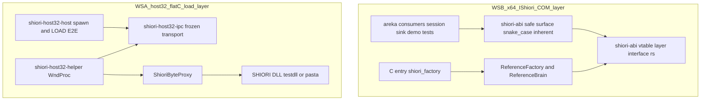
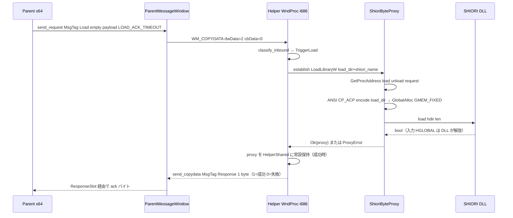
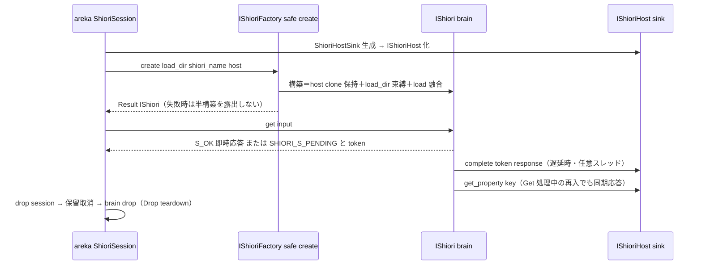

# 技術設計書: areka-P0-host32-shiori-load

## Overview

**Purpose**: 本機能は「**下から上まで `load_dir` が per-instance で貫通し、teardown が Drop(RAII) で一貫する**」状態を、二層にまたがる 2 ワークストリームで一体実現する。**WS-A（host-32 flat-C load 層）**は凍結済み WM_COPYDATA transport の上で helper の echo stub を置換し、`MsgTag::Load` をトリガとして実 i686 SHIORI DLL を `LoadLibraryW`→3 エクスポート解決→`load(load_dir)` まで駆動する常設プロキシ（`ShioriByteProxy`）を確立、結果を凍結 wire 上の 1 byte ack で親へ返す。**WS-B（IShiori ABI 是正）**は `crates/shiori-abi` の根幹欠陥（`load_dir` 欠落・raw ポインタ露出・冗長 `Unload`）を是正し、factory 融合 create（`IShioriFactory::create(load_dir, shiori_name, host)`）・`Get`/`Notify` 分離・`GetProperty`/`SetProperty` 新設・型付き COM 引数・module entry `shiori_factory` 化を行う。

**Users**: areka ベースウェア開発者が SHIORI 駆動基盤（下流 `host32-request`/`host32-lifecycle`/native 脳）の土台として利用する。SHIORI 脳実装者は是正後の `IShiori`/`IShioriHost` 契約面（正解見本 = reference brain）を参照する。

**Impact**: `shiori-host32-helper` の echo stub は LOAD 結線＋DLL プロキシ常設へ拡張され、`shiori-host32-host::spawn` の起動パラメーター契約が拡張される（凍結 wire は不改変）。`crates/shiori-abi` の 3 interface は**全面書換え**（IID 再採番・旧 `Load`/`Unload`/`Request`/`shiori_create` は残置しない）となり、consumer（reference brain・セッション層・host sink・demo・テスト群）が同一ブランチ内で追随する。

### Goals

- `load_dir` を helper 起動パラメーター・flat-C `load` 入力・`IShioriFactory::create` 引数の全契約面で per-instance 必須入力として貫通させる（D1）
- teardown を明示メソッドなしの Drop(RAII) へ全層一貫させる（D7）: `ShioriByteProxy::Drop`（courtesy unload＋FreeLibrary）／`ShioriSession::Drop`（保留取消→brain 解放）
- 実 i686 helper 越しの LOAD E2E（成功 ack[1]・失敗 ack[0]・無クラッシュ）をトラック所有の最小 SHIORI DLL fixture で決定的に観測する
- 新 ABI（factory 融合 create・Get/Notify・プロパティアクセス・型付き引数・snake_case 安全面）を reference/mock backend で証明し、ワークスペース全体がビルド・テスト通過する状態で 1 PR 完結する

### Non-Goals

- `request` の**呼出**・SHIORI/3.0 build/marshal・`Value` parse・request の UTF-8 charset（→ 下流 `areka-P0-host32-request`。`request` fn ポインタの**解決**のみ本仕様）
- 常駐メッセージループ生存・`OnSecondChange` poll・crash 監視・`unload` の恒常呼出（→ 下流 `areka-P0-host32-lifecycle`。Drop 時 courtesy unload は本仕様）
- WM_COPYDATA transport（wire/framing/`MsgTag`/`ResponseSlot`/HELLO/timeout 定義）の改変（上流 `areka-P0-host32-ipc` 完了・凍結）
- host-32 互換 backend の `IShioriFactory` 実装（`create`=spawn＋LOAD＋ack・`Get`=request wire の結線 → 下流 `areka-P0-host32-request`）
- native x64 脳の実装本体・里々/YAYA・SAORI・M2 互換面拡大・同一 helper 内 reload-in-place（R2.4・再生成で足りる）

## Boundary Commitments

### This Spec Owns

- **[WS-A]** helper の `MsgTag::Load` トリガ結線（echo stub の `Load=IgnoreKnown` 置換）／`ShioriByteProxy`（`LoadLibraryW`・3 エクスポート解決・`load` 呼出・ANSI(CP_ACP) 符号化・HGLOBAL 所有権規約・Drop courtesy unload）／`spawn` 起動パラメーター契約（load_dir・SHIORI 名の明示 arg＋env fallback・cwd=load_dir 維持）／load-ack（`MsgTag::Response` 1 byte）／fixture crate `shiori-host32-testdll`／LOAD E2E
- **[WS-B]** `crates/shiori-abi` の 3 interface 定義（`IShioriFactory` 新設・`IShiori` 痩身・`IShioriHost` 拡充）・IID 再採番・安全面レイヤ（snake_case インヘレント）・エラー語彙（`error.rs`）・`GetOutcome`（旧 `RequestOutcome`）・module entry `shiori_factory`
- **[WS-B 波及]** `crates/areka` consumer（reference brain＋`ReferenceFactory`・`ShioriSession`・`ShioriHostSink`＋プロパティストア・demo・e2e テスト群）と shiori-abi 内 mock/テストの新 ABI 追随

### Out of Boundary

- `shiori-host32-ipc` の一切の変更（定数追加も含め触らない・ack のバイト値契約は host/helper 各ローカル定数＋E2E で固定する）
- `request` 呼出・SHIORI/3.0 セマンティクス・常駐 lifecycle・host-32 互換 factory 実装（前掲 Non-Goals）
- descript.txt の解釈（SHIORI 名の解決は親／`package-mount` の領分。helper・factory は解決済みの名前を受け取るのみ・R3.6）
- プロパティシステムの M1 最小 key 集合の確定と値の生成源（本仕様は契約面＝操作の存在・同期性・dotted パス名前空間のみ。key 網羅は実装フェーズ／利用側の領分・R10.5）
- `crates/pilot` 配下（参照専用・コピペ禁止・変更しない）

### Allowed Dependencies

- `shiori-host32-helper` → `shiori-host32-ipc`（凍結 API の利用のみ）＋ `windows`（features 追加は helper ローカル）＋ `wintf-winmsg-executor`
- `shiori-host32-host` → `shiori-host32-ipc`＋`windows`（既存のまま）
- `shiori-host32-testdll` → `windows`（Foundation/Memory）のみ。**`crates/pilot` へ依存しない**（R7.7・葉ノード隔離）
- `shiori-abi` → `windows-core`＋`thiserror` のみ（最小依存 ABI クレートの位置づけ不変・wintf 非依存）
- `crates/areka` → `shiori-abi`（既存方向のまま）
- **禁止**: production クレートから `crates/pilot` への inbound 依存（R13.4）／`shiori-host32-*` ⟷ `shiori-abi` 間の新規依存（WS-A と WS-B はコード上完全独立を維持）

### Revalidation Triggers

- `IShiori`/`IShioriHost`/`IShioriFactory` の vtable 面署名・IID・`shiori_factory` C 入口署名の変更 → 下流 `areka-P0-host32-request`（互換 factory）・native 脳・`areka-P0-shiori-protocol` 系 consumer の再検証
- `spawn` 起動パラメーター契約（arg 順序・env キー名・cwd 規約）の変更 → 下流 `host32-request`/`host32-lifecycle` の spawn 利用の再検証
- load-ack のバイト値契約（1 byte・`[1]`/`[0]`）の変更 → 親側 LOAD 観測の再検証
- flat-C 署名（cdecl・bool 1 byte・HGLOBAL 所有権・ANSI dir）の変更 → `vendors/pasta` との整合再確認（正確源は pasta）
- `MsgTag`/framing に手を入れる変更が必要になった場合 → 本仕様では禁止（凍結）。必要なら上流 spec の revisit として別途起案

## Architecture

### Existing Architecture Analysis

- **WS-A 現状**: `shiori-host32-ipc`（凍結）が `MsgTag{Hello=1,Load=2,Request=3,Response=4,Unload=5}`・`copydata_payload`・`ResponseSlot`（再入 RESPONSE）・`send_copydata`・タグ汎用 `send_request` を提供済み。helper は `classify_inbound()` 純関数（`Load`→`IgnoreKnown`）＋`HelperShared`（`Cell<u64>` 観測カウンタ）＋`respond()` echo という「純関数分類→WndProc 副作用」構造。host は `spawn(helper_exe, ghostdir, parent_hwnd)`（ghostdir は cwd のみ）＋`PARENT_HWND_ENV` 二重供給＋`spawn_command` テスト seam＋`ParentMessageWindow`（HELLO pump・send_request）。
- **WS-B 現状**: `shiori-abi` は `#[interface]` raw 面（unsafe fn・raw ポインタ）＋`ShioriExt` 拡張トレイト（vtable 直呼びで Result 化）の二層。consumer は `#[implement]`＋`AsImpl` ダウンキャスト慣行、raw メソッド private ゆえ `(Interface::vtable(x).Complete)(x.as_raw(), ..)` の直呼びハックが多数（reference_brain/shiori_host/shiori_session/e2e 群）。
- **踏襲する既存パターン**: 「arg-n 優先・env fallback・env キーは `pub const`」の設定供給／純関数切り出し→単体・loopback→窓結線・実プロセス E2E（`resolve_helper_exe`: env 優先→target 探索→明確 panic・silent skip 禁止）の三層テスト／`#[implement(X)]`＋`X_Impl for T_Impl`／IID 固定回帰テスト／thiserror 構造化エラー。
- **是正する技術的負債**: `load_dir` 欠落（根幹欠陥）・raw ポインタ露出の不要 unsafe・RAII 冗長の `Unload`・メソッド private に起因する vtable 直呼びハック・`SHIORI_E_NOT_LOADED` 系の語彙（create 融合で意味消滅）。

### Architecture Pattern & Boundary Map



**Architecture Integration**:

- **選択パターン**: 両 WS とも Hybrid（既存構造への拡張＋最小新設）。WS-A は「純関数分類→WndProc 副作用」構造を保ったまま `InboundAction::TriggerLoad` 分岐と proxy モジュールを追加。WS-B は `shiori-abi` 内での全面書換え（新クレート分離なし）＋「vtable=unsafe PascalCase／安全面=snake_case インヘレント」の薄い unsafe ラッパ二層（wintf 確立手法・discussion #1 確定）。
- **境界**: WS-A（i686 helper flat-C）⟷ WS-B（x64 IShiori COM）はコード上完全独立（依存グラフ実測）。結合点は原則 D1/D7 と本仕様ドキュメントのみ → **並行実装可能なタスクグループ**。
- **保持する既存パターン**: 凍結 transport の API そのまま利用（`send_request(MsgTag::Load, &[], t)` は既存 API で成立・wire 変更ゼロ）／`PARENT_HWND_ENV` 型の供給契約／三層テスト構造／`#[implement]` 慣行。
- **新規コンポーネントの理由**: `ShioriByteProxy`（unsafe FFI の一点集約・helper 内モジュールで最小）／`shiori-host32-testdll`（pasta 非依存の決定的 E2E に必須・D4）／`IShioriFactory`（load_dir を契約面で受ける唯一の生成経路・D6）／安全面インヘレント（`Result<T≠()>` は vtable に載らないという windows-core 制約の帰結・research §2）。
- **Steering 準拠**: unsafe は proxy／vtable 生成面に隔離し安全 API を上位へ（tech.md）／thiserror 構造化エラー／`crates/*` ワイルドカード workspace／葉ノード隔離（two-tunnel）。

### 確定設計判断（research §6/§8 の決着・要点）

| # | 判断 | 決定 |
|---|---|---|
| a | ABI 実装形 | 薄い unsafe ラッパ二層。vtable=`unsafe` PascalCase（型付き引数で本体空洞化）／安全面=snake_case **インヘレント**メソッド。`ShioriExt` 廃止。メソッド `pub` 化で vtable 直呼びハック全廃。独立 spike なし（最初の ABI タスクでコンパイル実証） |
| b | GetProperty 同期応答 | sink 内蔵ストア `Mutex<HashMap<String, HSTRING>>`。再入規約「**areka は `Get`/`Notify` 呼出中にプロパティストアのロックを保持しない**」。欠落 key = `SHIORI_E_PROPERTY_NOT_FOUND`（新設）。M1 最小 key 集合は実装フェーズ確定（ukadoc 準拠 dotted パス） |
| c | spawn 契約 | 位置引数拡張 `spawn(helper_exe, load_dir, shiori_name, parent_hwnd)`。arg1=parent_hwnd（互換維持）・arg2=load_dir・arg3=shiori_name＋env `HOST32_LOAD_DIR`/`HOST32_SHIORI_NAME`＋cwd=load_dir。`SpawnConfig` は YAGNI |
| d | testdll E2E 解決 | env `HOST32_TESTDLL_DLL` 優先→target-dir 探索→明確 panic。load_dir は**一時 dir へ DLL コピー**（cwd=load_dir 慣習を同時検証）。エクスポート欠落 variant は作らず、helper の i686 単体テスト（`kernel32.dll` に `load` 解決失敗）で態様を証明 |
| e | 実装順序 | WS-A/WS-B 並行。順序制約は「submodule 展開（最初のタスク・cargo 解決前提）→ WS-A proxy」のみ |
| f | error.rs 語彙 | `SHIORI_E_NOT_LOADED`/`NotLoaded` 削除・`LoadFailed`→`CreateFailed`・`RequestFailed`→`GetFailed`・`NotifyFailed`/`PropertyNotFound`/`UnknownToken` 新設・`SHIORI_E_PROPERTY_NOT_FOUND(0xA0A1_0004)` 採番 |
| g | 改名・観測 | `RequestOutcome`→`GetOutcome`。reference brain の `Notify` は受領ログ（`RefCell<Vec<HSTRING>>`・`AsImpl` 観測）で片道性を観測可能化 |
| — | Load timeout | host に `pub const LOAD_ACK_TIMEOUT = 30s`（推奨既定・凍結 API の per-call 引数として使用・ipc 不改変）。helper 側 ack 送出は既存 `REPLY_TIMEOUT`(5s) 流用 |
| — | 起動パラメーター欠落 | helper は起動時 exit(2)（parent_hwnd 前例踏襲・HELLO 不達＋プロセス終了で親から決定的観測・R3.5） |
| — | Load 再受領 | proxy 確立済みなら `load` 再呼出なしで ack[1] を冪等返送（reload-in-place なし・R2.4） |
| — | 新 IID | 3 interface とも新規 v4 GUID を実装時採番し IID 固定回帰テストで固定（旧 IID との相違 assert・R11.4） |

### Technology Stack

| Layer | Choice / Version | Role in Feature | Notes |
|-------|------------------|-----------------|-------|
| COM ABI | windows-core 0.62.2 `#[interface]`/`#[implement]` | 3 interface の vtable 生成・型付き引数（`Ref`/`OutRef`/`&HSTRING`/`&mut`） | `unsafe trait/fn` はマクロ固定・`Result<T≠()>` は vtable 不可（research §2 で実証済み制約） |
| Win32 FFI | windows 0.62.2（helper に `Win32_System_LibraryLoader`/`Win32_System_Memory`/`Win32_Globalization` を追加） | `LoadLibraryW`/`GetProcAddress`/`GlobalAlloc`/`WideCharToMultiByte` | features は member ローカル追記（additive） |
| IPC | shiori-host32-ipc（凍結） | `send_request`/`send_copydata`/`ResponseSlot`/framing | 一切改変しない（R13.1） |
| エラー | thiserror 2 | `ShioriError` 語彙刷新・`ProxyError` 新設 | 全クレート共通規約 |
| ビルド | i686-pc-windows-msvc（PowerShell 必須） | helper・testdll のビルド＋`cargo test --target i686` | Git Bash link.exe トラップ回避（R13.2） |
| flat-C 正確源 | vendors/pasta（git submodule） | `load`/`unload`/`request` 署名のバイト正確確認 | `git submodule update --init` が実装前提（R13.5・cargo 解決前提も兼ねる） |

### 依存方向（違反はエラーとして扱う）

```
shiori-host32-ipc（凍結） ← shiori-host32-host / shiori-host32-helper
shiori-host32-testdll（葉・windows のみ）
shiori-abi（windows-core/thiserror のみ） ← areka
禁止: pilot への inbound／host32-* ⟷ shiori-abi の相互依存／helper → host
```

## File Structure Plan

### 新設ファイル

```
crates/
├── shiori-host32-testdll/            # [WS-A 新設クレート] 最小 SHIORI DLL fixture（D4）
│   ├── Cargo.toml                    # crate-type=["cdylib"]・[lib] name="shiori"・windows(Foundation/Memory) のみ
│   └── src/lib.rs                    # flat-C 3 エクスポート（load/unload/request）・env 失敗強制・入力 HGLOBAL の GlobalFree
├── shiori-host32-helper/src/
│   └── shiori_proxy.rs               # [WS-A 新設モジュール] ShioriByteProxy＋ProxyError（unsafe FFI 一点集約）
└── shiori-host32-host/tests/
    └── shiori_load_e2e.rs            # [WS-A 新設] LOAD E2E（成功/失敗/無クラッシュ/pasta gate）
```

### 変更ファイル

| ファイル | 変更内容 |
|---|---|
| `crates/shiori-host32-host/src/process_host.rs` | `spawn` を `(helper_exe, load_dir, shiori_name, parent_hwnd)` へ拡張（arg1=parent_hwnd 維持・arg2/arg3 追加・env 3 種・cwd=load_dir 維持）。`pub const LOAD_DIR_ENV`/`SHIORI_NAME_ENV`/`LOAD_ACK_TIMEOUT` 新設 |
| `crates/shiori-host32-host/tests/echo_roundtrip.rs` | `spawn` 新シグネチャへ吸収（132 行の呼出） |
| `crates/shiori-host32-host/tests/error_paths.rs` | 同上（300 行の呼出） |
| `crates/shiori-host32-helper/src/main.rs` | 起動パラメーター取得の一般化（load_dir/shiori_name・arg 優先 env fallback・欠落 exit(2)）。`InboundAction::TriggerLoad` 追加。`HelperShared` へ `load_dir`/`shiori_name`/`proxy: RefCell<Option<ShioriByteProxy>>`＋LOAD 観測カウンタ追加。WndProc の LOAD→proxy 確立→`load`→ack[1]/[0] 結線。`mod shiori_proxy` 宣言 |
| `crates/shiori-host32-helper/Cargo.toml` | windows features に `Win32_System_LibraryLoader`/`Win32_System_Memory`/`Win32_Globalization` 追加 |
| `crates/shiori-abi/src/interface.rs` | 3 interface 全面書換え（`IShioriFactory` 新設・`IShiori` = Get/Notify・`IShioriHost` += GetProperty/SetProperty・型付き引数・メソッド `pub` 化・IID 3 本再採番・vtable 健全性/IID 固定テスト更新＝ABI スケルトンのコンパイル実証を兼ねる） |
| `crates/shiori-abi/src/ergonomic.rs` | `ShioriExt` 廃止 → snake_case インヘレント安全面（`IShioriFactory::create`・`IShiori::{get, notify}`・`IShioriHost::{raise, complete, get_property, set_property}`）。HRESULT 3 分岐マッピングは既存ロジック流用 |
| `crates/shiori-abi/src/error.rs` | 語彙刷新（§確定設計判断 (f)）。`hresult_to_shiori_error` 更新 |
| `crates/shiori-abi/src/outcome.rs` | `RequestOutcome`→`GetOutcome` 改名（変種・token/allocator 不変） |
| `crates/shiori-abi/src/lib.rs` | 再エクスポート面の追随 |
| `crates/shiori-abi/tests/mock_brain_roundtrip.rs` | 新 ABI（factory 生成・get/notify・HSTRING 無マーシャリング・alloc/drop 計測）へ書換え |
| `crates/areka/src/reference_brain.rs` | `Get`/`Notify` 実装へ痩身（`loaded` フラグ・Load/Unload 削除・host/load_dir/shiori_name は construction 時確定）。`ReferenceFactory`（`#[implement(IShioriFactory)]`）＋C 入口 `shiori_factory` 新設（`shiori_create` 残置しない）。`Notify` 受領ログ。vtable 直呼び→safe メソッドへ |
| `crates/areka/src/shiori_session.rs` | `activate` を factory 経由生成へ（`unload()` 削除→`impl Drop`）。`request`→`get` 追随。`call_raise`/`call_complete` ハック撤去 |
| `crates/areka/src/shiori_host.rs` | `ShioriHostSink` へ `GetProperty`/`SetProperty` 実装＋内蔵プロパティストア（同期応答・R10.3）。テストの vtable 直呼び撤去 |
| `crates/areka/src/shiori_demo.rs` | factory 生成・get/notify・Drop teardown へ追随 |
| `crates/areka/src/main.rs` | demo ドライバの追随 |
| `crates/areka/src/shiori_e2e_tests.rs`・`shiori_lifecycle_e2e_tests.rs`・`shiori_reference_e2e_tests.rs` | 新 ABI へ追随（「unload 後の拒否」系は「drop 後は参照不在」へ・vtable 直呼びヘルパ群撤去） |

> 前提タスク（ファイル変更なし）: `git submodule update --init`（`vendors/pasta` 展開・`[patch.crates-io]` 健全化）→ `vendors/pasta/crates/pasta_shiori/src/windows.rs` と flat-C 署名のバイト正確照合（R13.5）。
> workspace `Cargo.toml` は `members = ["crates/*"]` のため testdll は配置のみで自動参加（変更不要）。

## System Flows

### WS-A: LOAD トリガ〜ack（凍結 wire 上）



- ゲート条件: `load` は WndProc 内**同期**実行。所要は親側 per-call timeout（`LOAD_ACK_TIMEOUT`=30s 推奨既定・`SMTO_ABORTIFHUNG`）で吸収し、ipc の timeout 機構自体は変更しない（R5.4）。`LoadLibraryW` は WndProc 内で安全（DllMain 内ではなく loader lock 衝突なし）。
- 失敗パス: DLL 不在／エクスポート欠落／`load`→false のいずれも `ProxyError` → ack `[0]`、helper プロセスは生存継続（R6.1〜R6.4）。ack 送出失敗は観測ログのみ（親は timeout で検出）。
- 再受領: proxy 確立済みの LOAD は `load` 再呼出なしで ack `[1]` 冪等返送。

### WS-B: factory 融合 create と Get の 3 分岐



- `Get` の vtable 面は成功 2 値（`S_OK`/`SHIORI_S_PENDING`）ゆえ `-> HRESULT` 生返し必須（`.ok()` は成功コードを潰す・research §2.1）。安全面 `get` が `GetOutcome` へ復元する。
- 再入規約: areka は `Get`/`Notify` 呼出中にプロパティストアのロックを保持しない → brain の同一スレッド `get_property` 呼び戻しがデッドロックしない（R10.3）。

## Requirements Traceability

| Requirement | Summary | Components | Interfaces | Flows |
|-------------|---------|------------|------------|-------|
| 1.1, 1.2, 1.3 | load_dir per-instance 貫通・欠落時決定的失敗・per-ghost 独立 | SpawnContract／HelperLoadWiring／ShioriByteProxy／IShioriFactory／ReferenceFactory | `spawn`・`create(load_dir,..)`・flat-C `load` | WS-A LOAD／WS-B create |
| 2.1, 2.2, 2.3, 2.4 | Drop(RAII) 全層一貫・courtesy unload・best-effort・reload なし | ShioriByteProxy（Drop）／ShioriSession（Drop）／interface.rs（Unload 不在） | `Drop` impl | WS-B create（teardown） |
| 3.1, 3.2, 3.3, 3.4, 3.5, 3.6 | 起動パラメーター契約（arg＋env・cwd=load_dir・欠落失敗・descript 非解釈） | SpawnContract／HelperLoadWiring | `spawn` 署名・`LOAD_DIR_ENV`/`SHIORI_NAME_ENV` | WS-A LOAD |
| 4.1, 4.2, 4.3, 4.4, 4.5, 4.6, 4.7 | LOAD トリガ結線・3 エクスポート常設・ANSI/HGLOBAL 規約・pasta 正確源・観測契約 | HelperLoadWiring／ShioriByteProxy | `InboundAction::TriggerLoad`・flat-C 3 署名 | WS-A LOAD |
| 5.1, 5.2, 5.3, 5.4 | load-ack 1 byte・凍結 wire 上・timeout 既存機構 | HelperLoadWiring／SpawnContract（LOAD_ACK_TIMEOUT）／LoadE2E | `MsgTag::Response` 1 byte 契約 | WS-A LOAD |
| 6.1, 6.2, 6.3, 6.4 | 失敗パスの決定的観測・無クラッシュ生存 | ShioriByteProxy（ProxyError）／HelperLoadWiring／LoadE2E | `ProxyError` → ack[0] 写像 | WS-A LOAD 失敗パス |
| 7.1, 7.2, 7.3, 7.4, 7.5, 7.6, 7.7 | fixture crate・失敗強制・E2E・pasta env gate・葉ノード隔離 | TestDll／LoadE2E | flat-C 3 エクスポート・`HOST32_TESTDLL_LOAD_FAIL`・`HOST32_PASTA_DLL` | WS-A LOAD E2E |
| 8.1, 8.2, 8.3, 8.4, 8.5, 8.6 | IShioriFactory・create 融合・単一普遍署名・shiori_factory 入口・半構築非露出 | InterfaceLayer／SafeSurface／ReferenceFactory | `IShioriFactory::CreateInstance`／safe `create`／`shiori_factory` | WS-B create |
| 9.1, 9.2, 9.3, 9.4 | IShiori 痩身（Get/Notify・Load/Unload 不在・SHIORI/3.0 意味対応・遅延 token） | InterfaceLayer／SafeSurface／GetOutcome／ReferenceBrain | `Get`/`Notify` vtable＋`get`/`notify` safe | WS-B Get 3 分岐 |
| 10.1, 10.2, 10.3, 10.4, 10.5 | IShioriHost 拡充（プロパティ・同期応答・共同所有・契約面限定） | InterfaceLayer／SafeSurface／ShioriHostSink | `GetProperty`/`SetProperty`＋プロパティストア | WS-B create（再入） |
| 11.1, 11.2, 11.3, 11.4 | 型付き COM 契約面・C 入口唯一例外・unsafe 空洞化・IID 再採番 | InterfaceLayer／EntryPoint | `Ref`/`OutRef`/`&HSTRING`/`&mut` 引数群 | — |
| 12.1, 12.2, 12.3, 12.4, 12.5, 12.6 | consumer 波及・reference 実装・session 移行・sink 同期応答・安全面レイヤ・reference/mock 証明 | ReferenceBrain／ReferenceFactory／ShioriSession／ShioriHostSink／SafeSurface／各テスト | snake_case 安全面一式 | WS-B 全図 |
| 13.1, 13.2, 13.3, 13.4, 13.5 | 凍結境界・PowerShell/i686・u64 演算・pilot 隔離・pasta バイト確認 | 全 WS-A コンポーネント＋前提タスク | — | — |

## Components and Interfaces

### コンポーネント概要

| Component | Domain/Layer | Intent | Req Coverage | Key Dependencies | Contracts |
|-----------|--------------|--------|--------------|------------------|-----------|
| SpawnContract | WS-A host | spawn 起動パラメーター契約拡張＋LOAD timeout 既定 | 1.1, 1.2, 3.1, 3.2, 3.3, 5.2 | shiori-host32-ipc（P0 凍結） | Service |
| HelperLoadWiring | WS-A helper | LOAD トリガ結線・ack 返送・パラメーター取得 | 3.4, 3.5, 3.6, 4.1, 4.3, 5.1, 6.4 | ipc（P0）・ShioriByteProxy（P0） | Service/Event |
| ShioriByteProxy | WS-A helper | flat-C FFI 一点集約（ロード・3 解決・load 呼出・Drop teardown） | 1.1, 2.1, 2.2, 2.3, 4.2, 4.4, 4.5, 4.6, 4.7, 6.1, 6.2, 6.3 | windows（P0） | Service/State |
| TestDll | WS-A fixture | 最小 SHIORI DLL fixture（成功/失敗の決定的制御） | 7.1, 7.2, 7.7 | windows（P0）・pilot 非依存 | Service（flat-C） |
| LoadE2E | WS-A test | 実プロセス E2E（成功/失敗/生存/pasta gate） | 5.3, 6.1, 6.4, 7.3, 7.4, 7.5, 7.6, 13.2 | host 部品一式（P0） | — |
| InterfaceLayer | WS-B abi | 3 interface vtable 面（型付き・pub・新 IID） | 8.1, 9.1, 9.2, 10.1, 11.1, 11.3, 11.4 | windows-core（P0） | Service |
| SafeSurface | WS-B abi | snake_case インヘレント安全面（Result 直返し） | 8.2, 9.4, 10.4, 12.5 | InterfaceLayer（P0） | Service |
| ErrorVocab | WS-B abi | HRESULT 定数＋ShioriError 語彙刷新 | 8.6, 10.5, 12.1 | thiserror（P0） | Service |
| GetOutcome | WS-B abi | Get 結果の内部表現（旧 RequestOutcome） | 9.1, 9.4 | — | State |
| EntryPoint | WS-B areka | C 入口 `shiori_factory`（唯一の raw 例外） | 8.5, 11.2 | ReferenceFactory（P0） | API |
| ReferenceFactory / ReferenceBrain | WS-B areka | 正解見本（factory・Get/Notify・観測可能性） | 1.3, 8.4, 9.3, 12.2 | shiori-abi（P0） | Service |
| ShioriSession | WS-B areka | factory 経由生成＋Drop teardown＋単一 in-flight | 2.1, 12.3 | shiori-abi（P0） | Service/State |
| ShioriHostSink | WS-B areka | sink 実装＋プロパティストア（同期応答） | 10.2, 10.3, 12.4 | shiori-abi（P0） | Service/State |
| ConsumerFollowup | WS-B areka | demo・e2e テスト群の追随 | 12.1, 12.6 | 上記一式 | — |

### WS-A: host-32 flat-C load 層

#### SpawnContract（`process_host.rs` 拡張）

| Field | Detail |
|-------|--------|
| Intent | helper 起動パラメーター契約を load_dir/SHIORI 名込みへ拡張し、LOAD timeout 既定を提供する |
| Requirements | 1.1, 1.2, 3.1, 3.2, 3.3, 5.2 |

**Responsibilities & Constraints**
- `spawn` は arg1=parent_hwnd（10進 u32・現行 helper 読み取り互換）・arg2=load_dir・arg3=shiori_name を子引数へ、同値を env（`HOST32_PARENT_HWND`/`HOST32_LOAD_DIR`/`HOST32_SHIORI_NAME`）へ二重供給し、cwd を load_dir に設定する（D2/D2'）。
- std-only（windows 非依存）の性質を維持。`spawn_command` seam は不変。

**Contracts**: Service [x]

##### Service Interface

```rust
pub const PARENT_HWND_ENV: &str = "HOST32_PARENT_HWND";   // 既存
pub const LOAD_DIR_ENV: &str = "HOST32_LOAD_DIR";         // 新設
pub const SHIORI_NAME_ENV: &str = "HOST32_SHIORI_NAME";   // 新設
/// LOAD の send_request 推奨既定 timeout（per-call 引数として使用・ipc 不改変）
pub const LOAD_ACK_TIMEOUT: Duration = Duration::from_secs(30);

pub fn spawn(
    helper_exe: &Path,
    load_dir: &Path,       // 旧 ghostdir。cwd 兼 arg2 兼 env
    shiori_name: &str,     // descript 解決済みの DLL ファイル名（親の領分・R3.6）
    parent_hwnd: u32,
) -> Result<HelperHandle, SpawnError>;
```

- Preconditions: `shiori_name` は親側で解決済み（helper/factory は descript を解釈しない）。
- Postconditions: 子プロセスは arg1..3＋env 3 種＋cwd=load_dir で起動される。spawn 失敗時は `HelperHandle` を返さない（既存規約）。
- Invariants: arg と env は同値・cwd と load 引数は同一 ghost/master を指す（R3.4）。

**Implementation Notes**
- Integration: 既存呼出 2 箇所（`echo_roundtrip.rs:132`・`error_paths.rs:300`）を新シグネチャへ吸収（機械的）。
- Validation: 既存の `spawn_passes_parent_hwnd_as_decimal_arg_and_env` と同型の単体テストを load_dir/shiori_name へ拡張。
- Risks: なし（`PARENT_HWND_ENV` パターンの同型拡張・Low）。

#### HelperLoadWiring（`main.rs` 拡張）

| Field | Detail |
|-------|--------|
| Intent | `MsgTag::Load` をロード実行トリガとして結線し、結果を 1 byte ack で返す |
| Requirements | 3.4, 3.5, 3.6, 4.1, 4.3, 5.1, 6.4 |

**Responsibilities & Constraints**
- `classify_inbound` に `Ok((MsgTag::Load, _)) => InboundAction::TriggerLoad` を追加（ペイロード無視・wire でパスを運ばない・R4.1）。純関数のまま単体検証可能な既存構造を維持。
- `HelperShared` へ追加: `load_dir: PathBuf`・`shiori_name: String`・`proxy: RefCell<Option<ShioriByteProxy>>`（非 `Copy` ゆえ `Cell` 不可・single UI thread 前提で `RefCell` で足りる）・観測カウンタ（`loads_attempted`/`load_acks_ok`/`load_acks_fail`）。
- WndProc: `TriggerLoad` 受領 → proxy 未確立なら `ShioriByteProxy::load(load_dir.join(&shiori_name), load_dir)` を**同期**実行 → 成功なら proxy を常設保持し ack `[1]`、失敗（あらゆる `ProxyError`）なら ack `[0]`。確立済みなら `load` 再呼出なしで ack `[1]` 冪等返送。ack は `send_copydata(parent, self_hwnd, MsgTag::Response, &[b], REPLY_TIMEOUT)` の既存再入経路（R5.2）。
- 起動パラメーター取得: `parent_hwnd_from_env` を一般化した「arg-n 優先・env fallback」純関数で load_dir（arg2/`HOST32_LOAD_DIR`）・shiori_name（arg3/`HOST32_SHIORI_NAME`）を取得。**値は arg/env から取得し cwd から推測しない**（R3.4）。欠落時は exit(2)（R3.5・parent_hwnd 前例）。
- 本仕様の範囲で呼ぶのは `load` のみ（`request` 呼出は下流・R4.3。courtesy unload は Drop 経由の例外）。
- ロード失敗後も WndProc/メッセージループは継続（プロセス生存・R6.4）。

**Contracts**: Service [x] / Event [x]

##### Event Contract（凍結 wire 上の ack）
- Published: `MsgTag::Response`・**厳密 1 byte**・`[0x01]`=成功（DLL ロード＋3 解決＋`load`→true）／`[0x00]`=失敗。
- Subscribed: `MsgTag::Load`（ペイロード期待なし・トリガのみ）。
- Delivery: 親の `send_request(MsgTag::Load, &[], LOAD_ACK_TIMEOUT)` の SMTO 待機中に helper が再入 RESPONSE で 1 通返す（既存 `ResponseSlot` 経路・新タグ/framing 変更なし・R5.1/5.2）。

**Implementation Notes**
- Integration: echo の `Reply` 分岐・カウンタ構造・`REPLY_TIMEOUT` を流用。`respond()` echo は Request 経路用にそのまま残す（下流 request が置換）。
- Validation: `classify_tests` へ TriggerLoad 分類を追加（`known_nonrequest_tags_are_ignored` から Load を分離）。パラメーター取得純関数の単体テスト。
- Risks: WndProc 内同期 `load` の長時間化 → 親 per-call timeout（30s 既定）で吸収・E2E で固定（Medium）。

#### ShioriByteProxy（`shiori_proxy.rs` 新設）

| Field | Detail |
|-------|--------|
| Intent | SHIORI DLL の unsafe FFI（ロード・エクスポート解決・load 呼出・解放）を一点集約する常設プロキシ |
| Requirements | 1.1, 2.1, 2.2, 2.3, 4.2, 4.4, 4.5, 4.6, 4.7, 6.1, 6.2, 6.3 |

**Responsibilities & Constraints**
- 確立シーケンス: `LoadLibraryW(dll_path)`（**絶対パス** `load_dir\<shiori_name>` を組んで渡す＝DLL 検索パス曖昧性の排除）→ `GetProcAddress` で `load`/`unload`/`request` **3 エクスポートすべて**を解決し fn ポインタ保持（R4.2）→ load_dir を ANSI(CP_ACP)（`WideCharToMultiByte`）で符号化 → `GlobalAlloc(GMEM_FIXED)` バッファへ書き込み → `load(hdir, len)` 同期呼出（R4.4）。
- 所有権規約: `load` へ渡した入力 HGLOBAL は**自ら解放しない**（DLL(callee) 解放・二重解放禁止・R4.5）。
- flat-C 署名（`vendors/pasta` 正確源・実装前バイト照合で固定・R4.6/13.5）:

```rust
type LoadFn    = unsafe extern "cdecl" fn(hdir: HGLOBAL, len: usize) -> bool;   // bool は Rust 1 byte（Win32 BOOL ではない）
type UnloadFn  = unsafe extern "cdecl" fn() -> bool;
type RequestFn = unsafe extern "cdecl" fn(req: HGLOBAL, len: *mut usize) -> HGLOBAL; // len は in/out（本仕様では解決のみ・呼出しない）
```

- 観測契約: 「`load` の同期 bool 結果＋無クラッシュ」のみ。DLL 内部スレッド等に前提を置かない（R4.7）。
- Drop teardown（R2.1/2.2/2.3）: `load` 成功済みインスタンスの Drop で best-effort courtesy `unload()` → `FreeLibrary`。結果は無視（エラーとして扱わない・ハングはプロセス lifecycle=下流の領分）。確立途中の失敗は内部で `FreeLibrary` して `Err` を返す（半構築を露出しない）。
- 明示 teardown メソッドを公開しない（Drop が唯一の経路・R2.1）。

**Contracts**: Service [x] / State [x]

##### Service Interface

```rust
pub enum ProxyError {
    LoadLibraryFailed(windows::core::Error),  // DLL 不在・ロード失敗（R6.1）
    EntryNotFound(&'static str),              // 3 エクスポートいずれかの解決失敗（R6.2）
    EncodingFailed,                           // ANSI 符号化 or GlobalAlloc 失敗
    LoadReturnedFalse,                        // load が false（R6.3）
}

impl ShioriByteProxy {
    /// LoadLibraryW → 3 解決 → ANSI 符号化 → load 呼出まで。成功時のみ Self（=load 済み）を返す。
    pub fn load(dll_path: &Path, load_dir: &Path) -> Result<Self, ProxyError>;
    // request fn ポインタは保持のみ（呼出 API は下流 host32-request が追加）
}
impl Drop for ShioriByteProxy { /* courtesy unload（best-effort・結果無視）→ FreeLibrary */ }
```

- Preconditions: dll_path は絶対パス。呼出は helper UI スレッド（WndProc）上。
- Postconditions: `Ok` = 3 fn ポインタ常設保持＋`load`→true 済み。`Err` = HMODULE 解放済み・状態残さず。
- Invariants: 入力 HGLOBAL の非解放（callee 解放規約）。`unsafe` は本モジュールに集約し、各ブロックに Safety 根拠を文書化（steering 規約）。

**Implementation Notes**
- Integration: pilot `shiori_proxy.rs` は**知見参照のみ**（コピペ禁止・R13.4）。`dwData`/ULONG_PTR 由来の演算は u64 幅（R13.3・本モジュールでは該当箇所最小）。
- Validation: i686 単体テスト（PowerShell・R13.2）——パス組立・ANSI 符号化の純関数部＋`kernel32.dll` への `EntryNotFound`（エクスポート欠落態様の決定的証明・設計判断 (d)）。
- Risks: FFI 本体は pilot 実証済みだがコピペ禁止での再実装＋二重解放規約の厳守が要注意（Medium）。

#### TestDll（`shiori-host32-testdll` 新設クレート）

| Field | Detail |
|-------|--------|
| Intent | pasta 非依存の決定的 E2E を成立させる host-32 トラック所有の最小 SHIORI DLL fixture |
| Requirements | 7.1, 7.2, 7.7 |

**Responsibilities & Constraints**
- `crate-type=["cdylib"]`・`[lib] name="shiori"` → 出力 `shiori.dll`（数 KB 規模・R7.1）。flat-C 3 エクスポート（`#[unsafe(no_mangle)] pub unsafe extern "cdecl"`）を実装。
- `load`: 受領 HGLOBAL を `GlobalFree`（callee 解放規約の忠実な再現＝ホスト側二重解放バグの検出器を兼ねる）。env `HOST32_TESTDLL_LOAD_FAIL=1`（spawn 前に親が set→子が継承）で `false` を強制（R7.2）。
- `unload`: `true` 返し。`request`: 最小 stub（null 返し・本仕様では呼ばれないが解決対象・R4.2）。
- 依存は `windows`（`Win32_Foundation`/`Win32_System_Memory`）のみ・`crates/pilot` 非依存（R7.7）。x64 ビルドでも無害（未使用 dll ができるだけ）。

**Contracts**: Service [x]（flat-C・§ShioriByteProxy の署名と同一）

**Implementation Notes**
- Integration: workspace `crates/*` で自動参加。i686 ビルドは PowerShell（R13.2）。
- Validation: E2E（下記）が本 fixture を主役として駆動。
- Risks: cdecl エクスポート名の装飾（i686 の `_load` 等）→ pasta 実バイナリとの照合（R13.5）で固定（Low〜Medium）。

#### LoadE2E（`shiori_load_e2e.rs` 新設）

| Field | Detail |
|-------|--------|
| Intent | 実 i686 helper プロセス越しの LOAD 成否・無クラッシュの決定的観測 |
| Requirements | 5.3, 6.1, 6.4, 7.3, 7.4, 7.5, 7.6, 13.2 |

**Responsibilities & Constraints**
- 段取り: testdll 解決（env `HOST32_TESTDLL_DLL` 優先 → `target/i686-pc-windows-msvc/{debug,release}/shiori.dll` 探索 → 不在なら**明確 panic**・silent skip 禁止）→ **一時 dir へ `shiori.dll` をコピー**して load_dir を成立（`load_dir\<名>` と cwd=load_dir 慣習の同時検証・設計判断 (d)）→ `ParentMessageWindow`＋`spawn`＋HELLO pump（既存部品流用）→ `send_request(MsgTag::Load, &[], LOAD_ACK_TIMEOUT)`。
- 検証系列: ① 成功 ack `[1]`（R5.3/7.3） ② env `HOST32_TESTDLL_LOAD_FAIL=1` 強制失敗 ack `[0]`（R7.3） ③ DLL 不在（空 load_dir）ack `[0]`（R6.1） ④ 各失敗後の helper 生存（`poll_exit_kind`→`None`・R6.4） ⑤ `HOST32_PASTA_DLL` 設定時のみ実 pasta 追験——env 値=DLL フルパス・load_dir=その親 dir・shiori_name=ファイル名・**指定 DLL 不在なら明示 fail**（R7.4/7.5）。CI 必須ゲートにしない（R7.6）。
- helper exe は 2 段ビルド手順（i686 build → x64 test・echo_roundtrip 確立手順）で PowerShell 実行（R13.2）。

**Implementation Notes**
- Integration: `resolve_helper_exe` 慣行の同型 `resolve_testdll_dll` を tests 内に実装。
- Validation: 本コンポーネント自体が R5〜R7 の受入証拠。
- Risks: i686 2 段ビルドの運用ミス → tasks に PowerShell 手順を明記（Medium）。

### WS-B: IShiori ABI 是正

#### InterfaceLayer（`interface.rs` 全面書換え）

| Field | Detail |
|-------|--------|
| Intent | 3 interface の vtable 面を型付き引数・pub メソッド・新 IID で再定義する |
| Requirements | 8.1, 9.1, 9.2, 10.1, 11.1, 11.3, 11.4 |

**Responsibilities & Constraints**
- 旧 `Load`/`Unload`/`Request` は**残置しない**（R9.2）。IID は 3 本とも新規 v4 GUID を採番（dev-stage 流動契約・旧互換不要・R11.4）し、IID 固定回帰テスト（旧 IID との相違 assert 込み）で固定。
- メソッドは `pub` 宣言（マクロが `#vis` を生成呼出ラッパへ伝播）→ consumer の vtable 直呼びハックを全廃可能にする（R12.5）。
- vtable 面署名（research §2.3 の真・§2.1 で全要素の可否実証済み）:

```rust
#[interface("<新規v4 GUID>")]
pub unsafe trait IShioriFactory: IUnknown {
    /// 生成＋load 融合。成功 1 値ゆえ Result<()> 可（out は OutRef 経由）
    pub unsafe fn CreateInstance(
        &self,
        load_dir: &HSTRING,
        shiori_name: &HSTRING,
        host: Ref<'_, IShioriHost>,
        out: OutRef<'_, IShiori>,
    ) -> Result<()>;
}

#[interface("<新規v4 GUID>")]
pub unsafe trait IShiori: IUnknown {
    /// 成功 2 値（S_OK=即時／SHIORI_S_PENDING=遅延+token）ゆえ HRESULT 生返し必須
    pub unsafe fn Get(&self, input: &HSTRING, out_response: &mut HSTRING, out_token: &mut u64) -> HRESULT;
    /// 片道・応答なし（NOTIFY SHIORI/3.0 後継）
    pub unsafe fn Notify(&self, input: &HSTRING) -> Result<()>;
    // Load/Unload は存在しない（create 融合＋Drop teardown）
}

#[interface("<新規v4 GUID>")]
pub unsafe trait IShioriHost: IUnknown {
    pub unsafe fn Raise(&self, script: &HSTRING) -> Result<()>;
    pub unsafe fn Complete(&self, token: u64, response: &HSTRING) -> Result<()>;
    pub unsafe fn GetProperty(&self, key: &HSTRING, out_value: &mut HSTRING) -> Result<()>;
    pub unsafe fn SetProperty(&self, key: &HSTRING, value: &HSTRING) -> Result<()>;
}
```

- windows-core 制約（research §2・設計上の硬い制約として扱う）: `unsafe trait`/`unsafe fn` はマクロ固定で除去不能（R11.3 の fallback 適用・型付き引数で**本体から raw ポインタ操作を排し unsafe を空洞化**）。`Result<T≠()>` は vtable 不可。`.ok()` は成功コードを潰すため `Get` のみ `-> HRESULT`。
- HSTRING 所有権規約は現行を踏襲: `[in]`=`&HSTRING` 借用（callee 保持は clone）・`[out]`=`&mut HSTRING`/`OutRef` への callee move-out（caller 解放）。
- in-file テスト（既存 vtable 健全性テストと同型）が「`Ref`＋`OutRef`＋`&HSTRING`＋`Result<()>`/`-> HRESULT` 混在 interface が `#[implement]` と組んで vtable dispatch まで通る」ことのコンパイル実証を兼ねる（独立 spike 不要・設計判断 (a)）。

**Contracts**: Service [x]

**Implementation Notes**
- Integration: `#![allow(non_snake_case)]` は vtable 面 PascalCase のため存置。
- Validation: vtable dispatch テスト＋IID 固定テスト（3 本・相互不一致＋旧 IID 不一致）。
- Risks: マクロ生成面の想定差異 → 最初の ABI スケルトンタスクで即検出（Medium→吸収済み）。

#### SafeSurface（`ergonomic.rs` 改修・snake_case インヘレント）

| Field | Detail |
|-------|--------|
| Intent | `Result` 値直返しの安全面を snake_case インヘレントメソッドとして提供（`ShioriExt` 廃止） |
| Requirements | 8.2, 9.4, 10.4, 12.5 |

**Responsibilities & Constraints**
- vtable に載らない `Result<IShiori>`/`Result<GetOutcome>`/`Result<HSTRING>` はこの層が担う（research §2.2）。同一クレート内の第 2 インヘレント impl（PascalCase=vtable／snake_case=安全面で命名衝突なし・`use` 儀式不要）。
- `ShioriExt` トレイトは**廃止**（インヘレントへ置換・R12.5）。

**Contracts**: Service [x]

##### Service Interface

```rust
impl IShioriFactory {
    /// OutRef 受け皿を隠蔽し、load 完了済み IShiori を直返し（R8.2）
    pub fn create(&self, load_dir: &HSTRING, shiori_name: &HSTRING, host: &IShioriHost)
        -> Result<IShiori, ShioriError>;   // 失敗は CreateFailed（半構築非露出・R8.6）
}
impl IShiori {
    /// HRESULT 3 分岐 → GetOutcome 復元（S_OK→Immediate／SHIORI_S_PENDING→Deferred(token)／失敗→GetFailed）
    pub fn get(&self, input: &HSTRING) -> Result<GetOutcome, ShioriError>;
    pub fn notify(&self, input: &HSTRING) -> Result<(), ShioriError>;      // 失敗→NotifyFailed
}
impl IShioriHost {
    pub fn raise(&self, script: &HSTRING) -> Result<(), ShioriError>;
    pub fn complete(&self, token: CorrelationToken, response: &HSTRING) -> Result<(), ShioriError>; // SHIORI_E_UNKNOWN_TOKEN→UnknownToken
    pub fn get_property(&self, key: &HSTRING) -> Result<HSTRING, ShioriError>;  // SHIORI_E_PROPERTY_NOT_FOUND→PropertyNotFound
    pub fn set_property(&self, key: &HSTRING, value: &HSTRING) -> Result<(), ShioriError>;
}
```

- Preconditions: なし（安全面が out 受け皿・HRESULT 判別を内包）。
- Postconditions: consumer から raw ポインタ・HRESULT・unsafe が見えない（R11.1 の利用者視点を実現）。
- Invariants: HRESULT→enum マッピングは既存 `ergonomic.rs` のロジックを流用（`SHIORI_S_PENDING` 判別が `is_ok()` より先）。

**Implementation Notes**
- Integration: `create` は内部で `Interface::query`/`OutRef` 受け皿を組み立て、生成呼出ラッパ（pub 化済み）を使用。
- Validation: mock 経由の 4 経路マッピングテスト（既存 `ergonomic::tests` の書換え）。
- Risks: なし（既存マッピング流用・Low）。

#### ErrorVocab（`error.rs` 語彙刷新）／GetOutcome（`outcome.rs` 改名）

| Field | Detail |
|-------|--------|
| Intent | create 融合後の契約に整合するエラー語彙と Get 結果表現 |
| Requirements | 8.6, 9.1, 9.4, 10.5, 12.1 |

**Responsibilities & Constraints（error.rs・設計判断 (f)）**
- 削除: `SHIORI_E_NOT_LOADED`・`ShioriError::NotLoaded`（「未ロード状態の IShiori」が契約上存在しなくなるため）。
- 改名: `LoadFailed`→`CreateFailed(HRESULT)`・`RequestFailed`→`GetFailed(HRESULT)`。
- 新設: `NotifyFailed(HRESULT)`・`SHIORI_E_PROPERTY_NOT_FOUND = make_shiori_failure(0x0004)`（値 `0xA0A1_0004`）＋`PropertyNotFound`・`UnknownToken`（`SHIORI_E_UNKNOWN_TOKEN` の型付き写像・従来の `Com` 落ちを判別可能化）。
- 存置: `SHIORI_S_PENDING(0x20A1_0001)`・`SHIORI_E_UNKNOWN_TOKEN(0xA0A1_0003)`・`Com` catch-all・FACILITY 0xA1／customer bit 規約。`hresult_to_shiori_error` を新語彙へ更新。

**Responsibilities & Constraints（outcome.rs・設計判断 (g)）**
- `RequestOutcome`→**`GetOutcome`** 改名（`Immediate(HSTRING)`/`Deferred(CorrelationToken)` 変種は不変）。`CorrelationToken`/`CorrelationTokenAllocator` は無変更（遅延応答機構はそのまま生きる・R9.4）。

**Implementation Notes**
- Validation: HRESULT 採番固定テスト（`0xA0A1_0004` 追加・削除定数の不在）・マッピングテスト更新。
- Risks: なし（機械的・Low）。

#### EntryPoint＋ReferenceFactory＋ReferenceBrain（`reference_brain.rs` 改修）

| Field | Detail |
|-------|--------|
| Intent | module entry `shiori_factory`（唯一の raw 例外）と新 ABI の正解見本 |
| Requirements | 1.3, 8.4, 8.5, 9.3, 11.2, 12.2 |

**Responsibilities & Constraints**
- C 入口（`shiori_create` は**残置しない**・R8.5）。既存パターン（E_POINTER 防御・refcount 1 move-out・writes-on-success）を移植:

```rust
#[unsafe(no_mangle)]
pub unsafe extern "system" fn shiori_factory(out: *mut *mut c_void) -> HRESULT
```

- `ReferenceFactory`（`#[implement(IShioriFactory)]`）: `CreateInstance` で `ReferenceBrain` を構築（host clone 保持・load_dir/shiori_name を**保持して観測可能に**する＝D1 貫通の E2E 証拠材料・native は「検証または無視」できる単一 create の正解見本・R8.3/1.3）。失敗時は out 未書込（半構築非露出・R8.6）。
- `ReferenceBrain` 痩身: `loaded: AtomicBool` と Load/Unload を削除（「未ロード状態」自体が消滅）。host・load_dir・shiori_name は construction 時確定の不変フィールドへ。`Get`=既存 Request の echo/遅延ロジック（`defer_next` CONTROL・token 採番）・`Notify`=**受領ログ**（`notifications: RefCell<Vec<HSTRING>>`・`AsImpl` で test 観測・片道性の観測可能化・設計判断 (g)）。GET/NOTIFY の SHIORI/3.0 意味対応（R9.3）を doc で明示。
- `complete_pending`/`fire_raise` は保持 host への vtable 直呼びを廃し safe `complete`/`raise` を使用（R12.5）。

**Contracts**: API [x]（C 入口）／Service [x]

##### API Contract
| Method | Entry | Request | Response | Errors |
|--------|-------|---------|----------|--------|
| C export | `shiori_factory`（`extern "system"`・GetProcAddress 可能） | `out: *mut *mut c_void` | refcount 1 の `IShioriFactory` を move-out・`S_OK` | `E_POINTER`（null out） |

**Implementation Notes**
- Validation: 生成入口テスト（null 防御・refcount・writes-on-success）＋factory 経由 create→get/notify roundtrip。
- Risks: なし（既存パターン移植・Low）。

#### ShioriSession（`shiori_session.rs` 改修）

| Field | Detail |
|-------|--------|
| Intent | factory 経由生成への移行と Drop teardown 化（単一 in-flight 規律は維持） |
| Requirements | 2.1, 12.3 |

**Responsibilities & Constraints**
- `activate(factory: &IShioriFactory, load_dir: &HSTRING, shiori_name: &HSTRING) -> Result<ShioriSession, ...>`: 内部で `ShioriHostSink` を生成して `IShioriHost` 化し、`factory.create(load_dir, shiori_name, &host)` で load 完了済み `IShiori` を受領・保持（旧 `ShioriExt::load` 経路の置換）。
- `unload()` メソッドを**削除**し `impl Drop for ShioriSession` へ移行: 保留 request の取消（既存ロジック）→ brain 参照 drop。Drop は失敗を返せない——D7「teardown は best-effort・戻り値で扱わない」が正当化（R2.3 整合）。
- `request()` → `get()` へ追随（単一 in-flight・タイムアウト・`poll_completions` の規律はそのまま生存）。テスト内 `call_raise`/`call_complete` は safe メソッドへ置換。

**Contracts**: Service [x] / State [x]

**Implementation Notes**
- Validation: 「unload 後の拒否」系テストは「drop 後は参照が存在しない」へ書き換え（型システムが検証を肩代わり）。
- Risks: Drop 内の保留取消順序（取消→drop の順を固定）（Low）。

#### ShioriHostSink（`shiori_host.rs` 改修）

| Field | Detail |
|-------|--------|
| Intent | sink 実装へのプロパティアクセス新設（同期応答・再入安全） |
| Requirements | 10.2, 10.3, 12.4 |

**Responsibilities & Constraints**
- 既存: `Raise`/`Complete` は mailbox 投函モデル（`Mutex<Option<Token>>` 突合枠＋`Mutex<VecDeque>`）——**不変**。
- 新設: 内蔵プロパティストア `properties: Mutex<HashMap<String, HSTRING>>`（設計判断 (b)・案 a）。`GetProperty` はストアから**同期**即答（mailbox 投函で代替しない・R10.3）・`SetProperty` は即書き。任意スレッドから呼出可能（`Mutex` が担保）。
- **再入規約（契約として doc 固定）**: areka は `IShiori::Get`/`Notify` 呼出中にプロパティストアのロックを保持しない。→ brain が `Get` 処理中に同一スレッドで `get_property` を呼び戻してもデッドロックしない。
- 欠落 key: `SHIORI_E_PROPERTY_NOT_FOUND` を返す（safe 面で `PropertyNotFound`・空 HSTRING 返しは「空値の key」と区別不能ゆえ不採用）。
- key 名前空間: SSP プロパティシステムの dotted パス（ukadoc 準拠・R10.2）。**M1 最小 key 集合と値の充填は実装フェーズで確定**（本設計は契約面のみ・R10.5）。areka 側の充填 API として `pub fn set_property_value(&self, key: &str, value: HSTRING)`（`AsImpl` 経由）を提供。
- sink は共同所有（create の host は `Ref` 渡し・callee clone）でインスタンス生存中 callback 可能（R10.4）。

**Contracts**: Service [x] / State [x]

**Implementation Notes**
- Validation: 同期応答テスト（`Get` 実装内から `get_property` を呼び戻す mock brain で再入を実証）・欠落 key・set→get 往復・別スレッド set。
- Risks: 再入規約の運用逸脱 → doc＋レビュー観点として tasks へ明記（Medium・本仕様の設計品質の本質）。

#### ConsumerFollowup（demo・e2e テスト群）

- `shiori_demo.rs`/`main.rs`: `shiori_factory`→`IShioriFactory::create`（safe）→ `get`/`notify`/`raise`/`complete`→drop teardown のデモ系列へ追随（R12.1）。
- `shiori_e2e_tests.rs`/`shiori_lifecycle_e2e_tests.rs`/`shiori_reference_e2e_tests.rs`/`shiori-abi/tests/mock_brain_roundtrip.rs`: 新 ABI へ追随。**メソッド pub 化により vtable 直呼びヘルパ（`call_load`/`call_request`/`call_raise`/`call_complete`）を全廃**（R12.5）。ABI 証明は reference/mock backend（R12.6・互換 backend factory は要求しない）。

## Data Models

本仕様は永続データを持たない。変更されるインメモリ表現のみ記す。

- **ワイヤ（凍結・参照のみ）**: `MsgTag::Load`（ペイロード 0 byte・トリガ）／`MsgTag::Response`（1 byte・`[1]`/`[0]`）。dwData 低 32bit=タグ・cbData=生バイト長（ヘッダ無し）——定義は ipc 所有で不改変。
- **HelperShared（拡張）**: `parent_hwnd: u32`＋`load_dir: PathBuf`＋`shiori_name: String`＋`proxy: RefCell<Option<ShioriByteProxy>>`＋観測カウンタ（`Cell<u64>` 群）。単一 UI スレッド前提の内部可変。
- **ShioriByteProxy**: `HMODULE`＋3 fn ポインタ（型は §ShioriByteProxy）＋load 済みフラグ。ライフサイクル = 確立（load 成功）〜Drop（courtesy unload＋FreeLibrary）。1 helper に高々 1 個（areka=1 helper=1 ゴースト・R2.4）。
- **GetOutcome（改名）**: `Immediate(HSTRING)` | `Deferred(CorrelationToken)`。`CorrelationToken(u64)`＋単調増加 allocator は不変。
- **プロパティストア**: `Mutex<HashMap<String, HSTRING>>`。key=SSP dotted パス。整合性 = 単純 last-write-wins（トランザクション概念なし・M1 最小）。
- **charset 分割線（不変条件）**: IShiori 面=HSTRING(UTF-16)／flat-C `load` dir=ANSI(CP_ACP)。request の UTF-8 は下流の領分。

## Error Handling

### Error Strategy

- **WS-A（helper）**: あらゆるロード失敗態様（`ProxyError` 全変種）を **ack `[0]` への単一写像**とし、helper プロセスは生存を維持する（fail-observable・no-crash）。失敗の詳細分類は helper の stderr ログ（既存 `eprintln!` 慣行）で観測補助し、wire には載せない（1 byte 契約の維持）。親は ack `[0]` または timeout（`SendRequestError`）で失敗を検出する。
- **WS-B（abi）**: 失敗は HRESULT（vtable 面）⇄ `ShioriError`（安全面）の二面一対。成功 2 値（`S_OK`/`SHIORI_S_PENDING`）は失敗と混同しない（`.ok()` 非使用の `Get` 生返し）。

### Error Categories and Responses

| 態様 | 層 | 表現 | 応答 |
|---|---|---|---|
| helper 起動パラメーター欠落 | WS-A helper | exit(2)＋stderr | HELLO 不達→親の pump timeout で決定的検出（R3.5） |
| DLL 不在／LoadLibrary 失敗 | WS-A | `ProxyError::LoadLibraryFailed` | ack `[0]`・生存維持（R6.1/6.4） |
| エクスポート解決失敗 | WS-A | `ProxyError::EntryNotFound` | ack `[0]`・生存維持（R6.2） |
| `load`→false | WS-A | `ProxyError::LoadReturnedFalse` | ack `[0]`・生存維持（R6.3） |
| ack 未達（helper ハング等） | WS-A | — | 親の凍結 transport timeout（R5.4・機構不変） |
| courtesy unload 失敗/ハング | WS-A | 無視（best-effort） | エラーとして扱わない・プロセス処分は下流（R2.3） |
| create 失敗（load 失敗含む） | WS-B | `CreateFailed(HRESULT)` | 半構築を露出しない（R8.6） |
| Get 失敗 | WS-B | `GetFailed(HRESULT)` | 呼出側で切り分け |
| Notify 失敗 | WS-B | `NotifyFailed(HRESULT)` | 同上 |
| 突合不能 token | WS-B | `SHIORI_E_UNKNOWN_TOKEN` → `UnknownToken` | sink が返す（既存契約の型付き化） |
| 欠落プロパティ key | WS-B | `SHIORI_E_PROPERTY_NOT_FOUND` → `PropertyNotFound` | 暗黙の空値で続行しない |

### Monitoring

- helper: 既存の観測カウンタ慣行を LOAD 系へ拡張（`loads_attempted`/`load_acks_ok`/`load_acks_fail`）＋stderr ログ。
- areka 側: 既存 `tracing` 規約に従い demo/session の追随箇所で構造化ログ（新規基盤なし）。

## Testing Strategy

### Unit Tests

1. `classify_inbound`: `MsgTag::Load`（ペイロード有無問わず）→ `TriggerLoad`（`IgnoreKnown` からの分離・R4.1）。既存分類の非回帰。
2. helper 起動パラメーター取得純関数: arg-n 優先／env fallback／欠落 `None`（parent_hwnd/load_dir/shiori_name の 3 適用・R3.4/3.5）。
3. `spawn` 契約: arg1..3＋env 3 種＋cwd の同値供給（既存 stand-in 手法の拡張・R3.1/3.2/3.3）。
4. `error.rs`: `0xA0A1_0004` 採番固定・削除定数の不在・新語彙マッピング（R8.6/10.5 系）。
5. `ShioriHostSink` プロパティストア: set→get 往復・欠落 key=`PropertyNotFound`・`Get` 実装内からの `get_property` 再入同期応答（R10.3）・別スレッド set（スレッド安全）。

### Integration Tests

1. **ABI スケルトン vtable dispatch**（interface.rs in-file・最初の WS-B タスク）: 混在署名（`Ref`/`OutRef`/`&HSTRING`/`&mut`/`Result<()>`/`HRESULT`）interface が `#[implement]` と組んで dispatch まで通る＋IID 3 本固定・相互/旧不一致（R11.1/11.3/11.4）。
2. **safe surface 4 経路**（ergonomic tests）: 即時→`GetOutcome::Immediate`／遅延→`Deferred(token)`／create 失敗→`CreateFailed`／notify 失敗→`NotifyFailed`（R8.2/9.1/9.4）。
3. **mock_brain_roundtrip**: factory 生成→get/notify の HSTRING 無マーシャリング往復・alloc/drop 計測（R12.1/12.6）。
4. **reference roundtrip**（areka）: `shiori_factory` 入口→`create(load_dir, shiori_name, host)`→brain が受領値を保持（D1 貫通観測・R1.3）→get 即時/遅延＋`complete`→`notify` 受領ログ観測（R9.3/12.2）→session drop で保留取消（R2.1/12.3）。
5. **helper loopback**（i686・PowerShell）: 既存 loopback へ LOAD トリガ分岐の窓結線を追加可能な範囲で検証＋`kernel32.dll` への `EntryNotFound`（エクスポート欠落態様・R6.2・設計判断 (d)）。

### E2E Tests

1. `shiori_load_e2e.rs`: 成功 ack `[1]`（testdll・一時 dir コピー・cwd=load_dir）→ R5.3/7.3。
2. 同: env 強制失敗 ack `[0]`＋DLL 不在 ack `[0]`＋各失敗後 helper 生存（`poll_exit_kind`→None）→ R6.1/6.3/6.4/7.2/7.3。
3. 同: `HOST32_PASTA_DLL` gate（設定時のみ実 pasta・不在なら明示 fail・CI 必須にしない）→ R7.4/7.5/7.6。
4. 既存 `echo_roundtrip`/`error_paths` の新 spawn 署名での非回帰（R13.1 の凍結境界を含む）。
5. ワークスペース全体: `cargo build`＋`cargo test`（x64）＋`cargo test --target i686-pc-windows-msvc`（helper・PowerShell）で 1 PR 完結状態を確認（R12.1/13.2）。

## Performance & Scalability

- **Load timeout 方針**（本仕様で固定する唯一の性能判断）: `load` は WndProc 内同期実行。親の per-call timeout に `LOAD_ACK_TIMEOUT = 30s`（推奨既定・host クレート `pub const`）を用いる。testdll は数 ms・実 pasta は actor 起動込みで数百 ms〜数秒を想定し、`SMTO_ABORTIFHUNG` がハング検出を担保。echo 系の 5s とは別建て。実測に基づく調整は実装フェーズ（E2E が使用値を固定）。
- その他の性能目標なし（1 helper=1 ゴースト・単一 in-flight の既存規律を変更しない）。

## Supporting References

- research.md §2: windows-core 0.62.2 `#[interface]` 表現力のソース実証（判定表・vtable 分解の根拠）。
- research.md §8: 設計フェーズの discovery 補強・開放判断 (b)〜(g) の確定記録・synthesis 結果。
- brief.md Confirmed Decisions D1〜D7・`doc/COMPAT_ARCHITECTURE.md`（互換正本）・ukadoc プロパティシステム／`descript_ghost` `shiori,<ファイル名>`（正典）。
