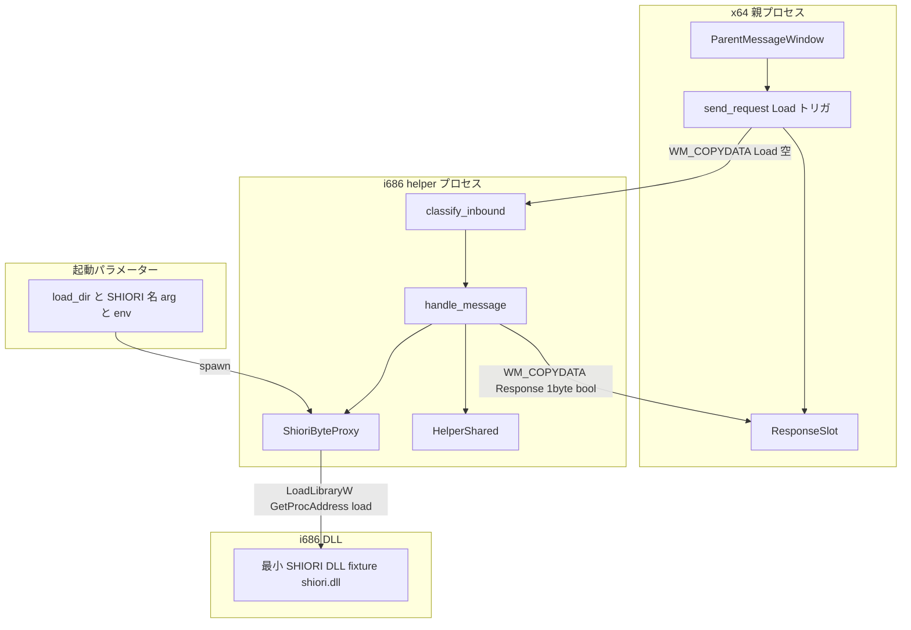
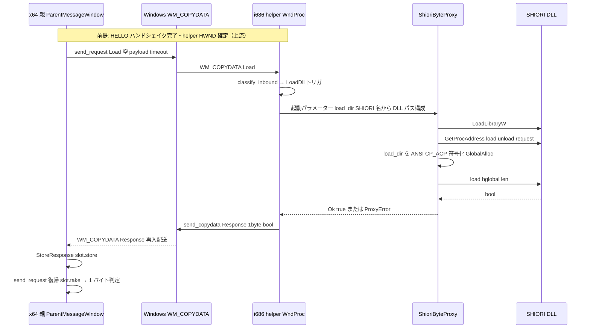
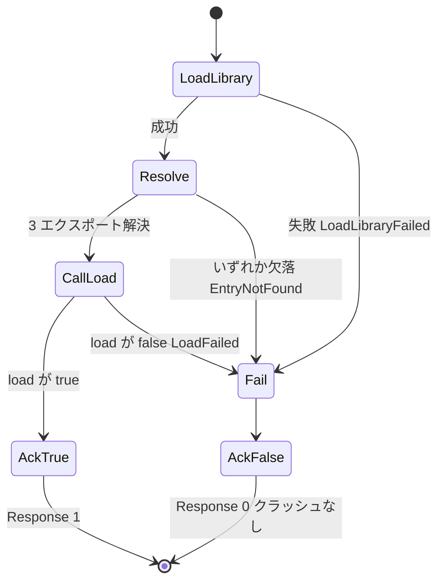

# 技術設計書: areka-P0-host32-shiori-load

## Overview

**Purpose**: 本ユニットは host-32 トラック第2ユニットとして、上流 `areka-P0-host32-ipc` が凍結した WM_COPYDATA transport の上に「**実 SHIORI DLL のロード**」というセマンティクスを結線する。x64 親プロセスが実 i686 helper プロセス越しに SHIORI DLL を `LoadLibraryW` → 3 エクスポート解決 → `load(load_dir)` 成功（`true`）まで、クラッシュ無しで観測できる足場を確立する。

**Users**: 直接の利用者は下流ユニット（`areka-P0-host32-request`・`areka-P0-host32-lifecycle`）であり、本ユニットが helper 内に立てる常設プロキシ `ShioriByteProxy`（module handle＋3 fn ポインタ）の上に `request` 呼出・常駐 lifecycle を載せる。areka 開発者は E2E テストで「脳がロードできる」seam を確証する。

**Impact**: helper の現状（`respond(req)->req.to_vec()` の echo stub・`MsgTag::Load` は `IgnoreKnown` で無視）を、`MsgTag::Load` トリガ受領→実 DLL ロード→bool ack へ置換する。上流 `shiori-host32-host::spawn` の**起動パラメーター契約を拡張**する（load_dir・SHIORI 名を追加 arg＋env）が、凍結された WM_COPYDATA wire/framing/`MsgTag` 定義には一切触れない。

### Goals
- helper の echo stub を置換し、`MsgTag::Load` を SHIORI ロード実行のトリガとして結線する（R1）。
- helper 内に `ShioriByteProxy` を新設し、`LoadLibraryW` ＋ `GetProcAddress` で `load`/`unload`/`request` の 3 エクスポートを解決・保持する（R2）。
- load_dir を ANSI(CP_ACP) 符号化し `load` を呼び、bool 結果を凍結 RESPONSE 経路で親へ ack する（R3・R4）。
- host-32 トラック所有の最小 SHIORI DLL fixture を主役に、実 i686 helper 越しで load 成功／失敗を決定的に E2E 観測する（R5）。
- i686 ビルド健全性・cdecl ABI 整合・葉ノード隔離を守る（R6）。

### Non-Goals
- `request` の**呼出**・SHIORI/3.0 marshal・`Value` parse・request の UTF-8 charset（→ 下流 `areka-P0-host32-request`）。※`request` fn ポインタの**解決**は本ユニット。
- 常駐メッセージループ生存監視・`OnSecondChange` poll・`unload` の**恒常呼出**・crash 監視（→ 下流 `areka-P0-host32-lifecycle`）。※`unload` fn ポインタ解決＋teardown courtesy unload は本ユニット。
- transport 層（spawn の IPC 部・WM_COPYDATA framing・`ResponseSlot`・HELLO・timeout・`MsgTag` 定義）の改変。
- 里々/YAYA・SAORI・native x64 化（M2 以降）。

## Boundary Commitments

### This Spec Owns
- **helper の `MsgTag::Load` 結線**: `classify_inbound` の `Load`→新トリガ写像、WndProc の proxy 構築・`load` 呼出・bool ack 送出。
- **`ShioriByteProxy`（helper 内・i686）**: module handle 所有、`load`/`unload`/`request` 3 fn ポインタ解決・保持、load 入力 HGLOBAL 所有権規約（DLL 解放）、`unsafe` 境界の集約、teardown courtesy unload/FreeLibrary（Drop）。
- **`load` 入力の charset 責務**: load_dir を ANSI(CP_ACP/Shift_JIS) へ符号化する責務**のみ**（request の UTF-8 は非所有）。
- **spawn の起動パラメーター契約拡張**: `shiori-host32-host::spawn` に load_dir・SHIORI 名を明示 arg（＋env fallback）で追加する差分。
- **最小 SHIORI DLL fixture crate**: host-32 トラック所有の i686 cdylib（既定名 `shiori.dll`・flat-C 実装）。
- **LOAD E2E テスト**: 実 i686 helper 越しの load 成功／失敗観測。

### Out of Boundary
- `MsgTag` 定義・WM_COPYDATA framing・HWND u32 符号化・`send_copydata`/`send_request`/`ResponseSlot`/HELLO/timeout の**改変**（上流凍結）。
- `request` の呼出・SHIORI/3.0 セマンティクス・`Value`・request UTF-8 charset・request 応答 HGLOBAL（ホスト解放）（下流 request）。
- 常駐 lifecycle・`unload` 恒常呼出・`OnSecondChange`・crash 監視（下流 lifecycle）。
- descript.txt の解釈（`shiori,<名>` 解決）＝親／`package-mount` の領分。helper は SHIORI 名を受け取るのみ。

### Allowed Dependencies
- **`shiori-host32-ipc`（proto）** — helper の唯一の一方向 cargo 依存（`MsgTag`・`copydata_payload`・`send_copydata`・framing）。
- **windows crate 0.62.2** — 追加 features `Win32_System_LibraryLoader`・`Win32_System_Memory`・`Win32_Globalization`（意図的依存追加）。既存の `Win32_System_DataExchange`・`Win32_UI_WindowsAndMessaging`・`Win32_Foundation` は継続。
- **wintf-winmsg-executor 0.0.5** — helper の message-only 窓（既存）。
- **禁止依存**: production クレート（helper・fixture crate）は `crates/pilot`（先進坑）へ inbound 依存しない（葉ノード隔離）。helper は `shiori-host32-host` へ依存しない（プロセス境界で WM_COPYDATA のみ）。fixture crate は `shiori-host32-ipc` にすら依存不要（純 flat-C）。

### Revalidation Triggers
以下の変更は下流ユニット（request/lifecycle）へ再検証を強制する:
- `ShioriByteProxy` の公開形状（module handle・fn ポインタ保持・エラー型 `ProxyError`）の変更。
- LOAD ack の解釈規約（`Response` の 1 byte bool・`[1]`=成功）の変更。
- spawn 起動パラメーター契約（arg 順・env 名）の変更。
- charset 分割線（load=ANSI・request=UTF-8）の移動。
- HGLOBAL 所有権分割線（load 入力=DLL 解放）の移動。
- 確定 ABI（cdecl・Rust bool 1byte・request len in/out・GMEM_FIXED）の変更（＝`vendors/pasta` 一次源との齟齬）。

## Architecture

### Existing Architecture Analysis

本ユニットは既存 host-32 transport の**拡張**であり、確立済みの規約を踏襲する:

- **純ロジック／副作用分離**: `classify_inbound(dw_data, declared_len, data) -> InboundAction`（純関数・窓なし単体テスト）を WndProc が見て副作用を実行する（`main.rs:79-176`）。Load 分岐もこの enum に**新バリアントを 1 つ足す**形で整合させる。
- **観測カウンタ**: `HelperShared` の `Cell<u64>` 群（single-in-flight・単一 UI スレッドゆえ `Cell` で足りる）。load 観測もこの型へ足す。
- **RAII**: `Window<S>` は Drop で `DestroyWindow`。proxy の teardown（unload/FreeLibrary）も Drop に載せる。
- **一様な失敗報告**: transport は `IpcError`（Timeout/SendFailed/CorruptFrame）。proxy の失敗は crash させず観測可能な失敗（`ProxyError`）として扱う。
- **凍結 seam の尊重**: 親側 `classify_inbound` は `Response`→`StoreResponse` を**送出タグ非依存**で処理する（`parent_window.rs:91`）。ゆえに親が `send_request(MsgTag::Load, ...)` を発行し helper が `Response` を返せば、既存の再入 RESPONSE 経路（`send_request`→`SendMessageTimeout`→WndProc `StoreResponse`→`slot.take`）にそのまま乗る（wire 不改変）。

### Architecture Pattern & Boundary Map

**Selected pattern**: 既存の「純ロジック分類器＋副作用 WndProc」＋「`unsafe` を単一型に集約した FFI プロキシ」。trait 抽象は設けない（YAGNI・凍結 seam は WM_COPYDATA wire）。



**Architecture Integration**:
- **Selected pattern**: 分類器 enum 拡張＋FFI プロキシ集約。既存パターンの再適用で新規パターンを発明しない。
- **Domain/feature boundaries**: transport（proto・凍結）／helper 分類器・WndProc（本ユニット拡張）／FFI プロキシ（本ユニット新設・`unsafe` 集約）／fixture DLL（本ユニット新 crate）を明確分離。
- **Existing patterns preserved**: 純ロジック分離、観測カウンタ、RAII、一様失敗報告、依存方向（helper→ipc のみ）。
- **New components rationale**: `ShioriByteProxy`（FFI・所有権・charset を 1 型に閉じ込め下流が共有する足場）、fixture crate（葉ノード隔離を守った決定的 E2E 資産）。
- **Steering compliance**: 葉ノード隔離、i686 ビルドは PowerShell 必須、u64 幅演算、cdecl ABI、`doc/COMPAT_ARCHITECTURE.md` が制約正本。

### Technology Stack

| Layer | Choice / Version | Role in Feature | Notes |
|-------|------------------|-----------------|-------|
| Runtime / Process | i686-pc-windows-msvc helper | 32bit SHIORI DLL を in-proc ロードする隔離プロセス | ビルドは PowerShell 必須（Git Bash link.exe 遮蔽） |
| FFI / OS | windows 0.62.2（+LibraryLoader/Memory/Globalization） | `LoadLibraryW`/`GetProcAddress`/`GlobalAlloc`/`WideCharToMultiByte(CP_ACP)` | features 3 種を意図的追加 |
| Messaging | shiori-host32-ipc（proto・凍結） | WM_COPYDATA framing・`MsgTag`・`send_request`・`ResponseSlot` | 改変不可 |
| Window | wintf-winmsg-executor 0.0.5 | helper の message-only 窓・WndProc | 既存 |
| Test fixture | 新 i686 cdylib crate `shiori-host32-testdll` | flat-C `load`/`unload`/`request` 最小実装（既定名 `shiori.dll`） | 数KB・`crate-type=["cdylib"]`・pilot 非依存 |

charset は windows crate の `CP_ACP`（`WideCharToMultiByte`）で足り、`encoding_rs` は不要。

## File Structure Plan

### Directory Structure
```
crates/
├── shiori-host32-helper/          # i686 helper（本ユニットの主改修対象）
│   ├── Cargo.toml                 # windows features 3 種追加（LibraryLoader/Memory/Globalization）
│   ├── src/
│   │   ├── main.rs                # 改修: Load 結線（classify_inbound の Load 分岐・WndProc の proxy 駆動・ack）
│   │   └── shiori_proxy.rs        # 新規: ShioriByteProxy / ProxyError / ansi_encode / global_alloc_copy（unsafe 集約）
│   └── tests/
│       └── load_e2e.rs            # 新規: 実 helper 越し LOAD E2E（成功／失敗／無クラッシュ）
├── shiori-host32-testdll/         # 新規 crate: 最小 SHIORI DLL fixture（i686 cdylib）
│   ├── Cargo.toml                 # crate-type=["cdylib"], [lib] name = "shiori"（成果物 shiori.dll）
│   └── src/
│       └── lib.rs                 # flat-C load/unload/request 最小実装＋load→false 強制フラグ
├── shiori-host32-host/            # 上流 host（起動パラメーター契約拡張のみ）
│   └── src/
│       └── process_host.rs        # 改修: spawn に load_dir・SHIORI 名を arg＋env で追加
└── shiori-host32-ipc/             # proto（凍結・改変なし）
```

### Modified Files
- `crates/shiori-host32-helper/src/main.rs` — `InboundAction` に `LoadDll` バリアント追加。`classify_inbound` が `MsgTag::Load` を `LoadDll` へ写像（従来 `IgnoreKnown(Load)` を差し替え・classify_tests の該当期待も更新）。`HelperShared` に `RefCell<Option<ShioriByteProxy>>` と load 観測カウンタ追加。`handle_message` に `LoadDll` アーム追加（proxy 構築→`load`→bool を `MsgTag::Response` の 1 バイトで親へ返送）。`main` で load_dir・SHIORI 名を arg/env から取得。
- `crates/shiori-host32-helper/Cargo.toml` — windows features に `Win32_System_LibraryLoader`・`Win32_System_Memory`・`Win32_Globalization` を追加。
- `crates/shiori-host32-host/src/process_host.rs` — `spawn` を拡張し load_dir・SHIORI 名を追加 arg（＋env fallback）で子へ渡す。新 env 名定数 `LOAD_DIR_ENV`・`SHIORI_NAME_ENV` を公開。

### New Files
- `crates/shiori-host32-helper/src/shiori_proxy.rs` — `ShioriByteProxy`（module handle＋3 fn ポインタ）・`ProxyError`・`ansi_encode`・`global_alloc_copy`・cdecl fn 型・`Drop`（courtesy unload+FreeLibrary）。`unsafe` 境界を集約。pilot はコピペせず知見のみ参照。
- `crates/shiori-host32-helper/tests/load_e2e.rs` — 実 i686 helper spawn＋LOAD トリガ→load 成功観測、fixture の `load→false` 強制→失敗観測、無クラッシュ（`poll_exit_kind`）。fixture DLL 解決は env＋target 探索、無ければ明示 panic。本物 pasta は `HOST32_PASTA_DLL` env-gated。
- `crates/shiori-host32-testdll/Cargo.toml` — `crate-type=["cdylib"]`、`[lib] name="shiori"`、`publish=false`。依存なし（純 flat-C）または windows 最小。
- `crates/shiori-host32-testdll/src/lib.rs` — `#[unsafe(no_mangle)] pub extern "C" fn load/unload/request`。`load` は既定 `true`、環境変数等で `false` 強制可（決定的失敗パス）。`request` は最小 echo（下流再利用の足場）。

各ファイルは単一責務。`shiori_proxy.rs` が FFI・所有権・charset・`unsafe` を独占し、`main.rs` は結線と観測に徹する。

## System Flows

### LOAD 結線シーケンス（成功パス・R1/R2/R3/R4）



**フロー上の決定**:
- LOAD は payload 空トリガ（パスは起動パラメーター経由・wire を通らない）。
- 親の `send_request(MsgTag::Load, ...)` は既存 API で任意タグ可。RESPONSE 再入は helper がブロック中の親 WndProc へ OS が配送し、`StoreResponse` が slot へ store（凍結経路）。
- helper は LOAD に対し RESPONSE を 1 通だけ返して即 return（跨プロセス SendMessage を追加発行しない＝循環待ちなし）。

### ロード／解決失敗パス（R2.3/R2.4/R4.4）



いずれの失敗も crash させず `Response` の `[0]`（未成功）として親へ返す。親は `bytes != [1]` を未成功と判別する（R4.2/R4.4）。

## Requirements Traceability

| Requirement | Summary | Components | Interfaces | Flows |
|-------------|---------|------------|------------|-------|
| 1.1 | Load を無視でなくトリガ処理 | classify_inbound / handle_message | `InboundAction::LoadDll` | LOAD 結線 |
| 1.2 | load 入力を起動パラメーターから取得 | helper main / spawn | arg/env（load_dir・SHIORI 名） | LOAD 結線 |
| 1.3 | framing 不整合は crash せず記録のみ | classify_inbound | `InboundAction::IgnoreBad` | 失敗パス |
| 1.4 | LOAD 処理で凍結 seam 不改変 | （境界制約） | `MsgTag`/framing 不変 | — |
| 1.5 | load_dir・SHIORI 名を明示起動パラメーターで供給 | spawn / helper main | arg＋env fallback | LOAD 結線 |
| 2.1 | DLL パス構成＋LoadLibraryW＋handle 所有 | ShioriByteProxy | `load_dll` | LOAD 結線 |
| 2.2 | 3 エクスポート解決・保持 | ShioriByteProxy | `load_dll`（fn ポインタ） | LOAD 結線 |
| 2.3 | ロード失敗は crash せず失敗扱い | ShioriByteProxy / ProxyError | `LoadLibraryFailed` | 失敗パス |
| 2.4 | エクスポート欠落は crash せず失敗扱い | ShioriByteProxy / ProxyError | `EntryNotFound` | 失敗パス |
| 2.5 | request fn ポインタ解決するが呼ばない | ShioriByteProxy | `request` 保持のみ | — |
| 2.6 | unload fn ポインタ解決するが恒常呼出しない | ShioriByteProxy | `unload` 保持のみ | — |
| 3.1 | load 前に load_dir を ANSI CP_ACP 符号化 | ansi_encode | `ansi_encode` | LOAD 結線 |
| 3.2 | 符号化バイトで load 呼出・bool 取得 | ShioriByteProxy | `shiori_load` | LOAD 結線 |
| 3.3 | 返り値を Rust bool 1byte と解釈 | ShioriByteProxy | `LoadFn` 型 | LOAD 結線 |
| 3.4 | load 入力 HGLOBAL は DLL 解放・二重解放しない | ShioriByteProxy / global_alloc_copy | 所有権規約 | LOAD 結線 |
| 3.5 | load 符号化のみ負う・request UTF-8 は非所有 | （境界制約） | charset 分割線 | — |
| 4.1 | load bool を親へ返送 | handle_message | `send_copydata(Response)` | LOAD 結線 |
| 4.2 | 親が成功／未成功を判別 | 親 send_request 呼出側 | `Response` 1byte 判定 | LOAD 結線 |
| 4.3 | ack は凍結 REQUEST/RESPONSE を改変しない | handle_message | `MsgTag::Response` 再利用 | LOAD 結線 |
| 4.4 | 未成功を crash せず観測 | handle_message / 親 | `Response` `[0]` | 失敗パス |
| 5.1 | fixture DLL で load 成功を E2E 観測 | load_e2e / testdll | E2E テスト | LOAD 結線 |
| 5.2 | fixture の load→false を決定的観測 | load_e2e / testdll | 失敗強制フラグ | 失敗パス |
| 5.3 | 進行中いずれのプロセスも crash させない | load_e2e | `poll_exit_kind` | — |
| 5.4 | 観測契約を同期 bool＋無クラッシュに限定 | load_e2e | （契約制約） | — |
| 5.5 | teardown courtesy unload/FreeLibrary 許容 | ShioriByteProxy Drop | `Drop` | — |
| 5.6 | 本物 pasta は env-gated 任意・欠落なら明示 fail | load_e2e | `HOST32_PASTA_DLL` | — |
| 5.7 | fixture は host-32 トラック所有・pilot 非依存 | shiori-host32-testdll | 新 crate | — |
| 6.1 | helper は i686 でビルド・実行可 | helper / testdll | i686 target | — |
| 6.2 | dwData/ULONG_PTR は u64 幅評価 | （既存 copydata_payload 踏襲） | u64 マスク | — |
| 6.3 | cdecl ABI で 3 シグネチャ整合 | shiori_proxy 型定義 | `LoadFn`/`UnloadFn`/`RequestFn` | — |
| 6.4 | production は pilot へ inbound 依存しない | helper / testdll Cargo.toml | 依存方向 | — |

## Components and Interfaces

| Component | Domain/Layer | Intent | Req Coverage | Key Dependencies (P0/P1) | Contracts |
|-----------|--------------|--------|--------------|--------------------------|-----------|
| ShioriByteProxy | helper FFI | DLL ロード＋3 エクスポート解決＋load 呼出＋teardown | 2, 3, (4) | windows LibraryLoader/Memory/Globalization (P0) | Service, State |
| Load 結線（classify_inbound / handle_message 拡張） | helper 分類器・WndProc | Load トリガ→proxy 駆動→bool ack | 1, 4 | ShioriByteProxy (P0), shiori-host32-ipc (P0) | Service, Event |
| spawn 起動パラメーター拡張 | host launch 契約 | load_dir・SHIORI 名を arg＋env で子へ | 1.2, 1.5 | std::process (P0) | Service |
| 最小 SHIORI DLL fixture | test 資産（i686 cdylib） | flat-C load/unload/request 最小実装・失敗強制 | 5 | なし（純 flat-C）(P0) | Service |
| LOAD E2E テスト | helper 統合テスト | 実 helper 越し成功／失敗／無クラッシュ観測 | 5 | spawn/ParentMessageWindow (P0), fixture (P0) | — |

### helper FFI 層

#### ShioriByteProxy

| Field | Detail |
|-------|--------|
| Intent | `pasta.dll`/fixture を LoadLibraryW でロードし 3 エクスポートを解決・保持し、load を ANSI 符号化して駆動する FFI プロキシ |
| Requirements | 2.1, 2.2, 2.3, 2.4, 2.5, 2.6, 3.1, 3.2, 3.3, 3.4, 5.5 |

**Responsibilities & Constraints**
- module handle と `load`/`unload`/`request` の 3 fn ポインタを所有・保持する（`request`/`unload` は解決のみ・本ユニットで `request` は呼ばない・`unload` は teardown 以外で呼ばない）。
- `unsafe` 境界（`LoadLibraryW`・`GetProcAddress`・`transmute`・生ポインタ・`GlobalAlloc`）を本型に集約する。
- load 入力 HGLOBAL の所有権は **callee（DLL）へ move** する（DLL が `GlobalFree`）。ホストは二重解放しない。
- Drop で courtesy `unload()`＋`FreeLibrary`（bool 失敗は致命としない）。module handle は型で一意所有し多重 Drop を防ぐ。
- 失敗は panic せず `ProxyError` で観測可能に返す。

**Dependencies**
- Outbound: なし（helper 内で完結）。
- External: windows `Win32::System::LibraryLoader`（`LoadLibraryW`/`GetProcAddress`）・`Win32::System::Memory`（`GlobalAlloc`）・`Win32::Globalization`（`WideCharToMultiByte`/`CP_ACP`）・`Win32::Foundation`（`FreeLibrary`/`GlobalFree`/`HGLOBAL`/`HMODULE`）(P0)。

**Contracts**: Service [x] / State [x]

##### Service Interface
```rust
/// cdecl flat-C シグネチャ（vendors/pasta pasta_shiori/src/windows.rs:50/63/76 で確定・要 submodule 展開再確認）。
type LoadFn    = unsafe extern "C" fn(hdir: HGLOBAL, len: usize) -> bool;
type UnloadFn  = unsafe extern "C" fn() -> bool;
type RequestFn = unsafe extern "C" fn(req: HGLOBAL, len: *mut usize) -> HGLOBAL;

pub enum ProxyError {
    LoadLibraryFailed,          // LoadLibraryW 失敗（dll 不在・ビットネス不一致）
    EntryNotFound(&'static str),// load/unload/request のいずれか GetProcAddress 失敗
    LoadFailed,                 // load(load_dir) が false を返した
    EncodeAnsiFailed,           // load_dir の ANSI(CP_ACP) 符号化失敗
    GlobalAllocFailed,          // GlobalAlloc が null
}

pub struct ShioriByteProxy { /* module: HMODULE, load: LoadFn, unload: UnloadFn, request: RequestFn */ }

impl ShioriByteProxy {
    /// DLL を LoadLibraryW でロードし 3 エクスポートを解決して保持する（R2.1/R2.2/R2.3/R2.4）。
    pub fn load_dll(dll_path: &Path) -> Result<Self, ProxyError>;
    /// load_dir を ANSI(CP_ACP) 符号化→GlobalAlloc→load(hglobal,len)→Rust bool（R3.x）。
    /// 入力 HGLOBAL は callee 解放（ホストは解放しない）。true=成功。
    pub fn shiori_load(&self, load_dir: &Path) -> Result<(), ProxyError>;
}

impl Drop for ShioriByteProxy { /* courtesy unload() + FreeLibrary（R5.5） */ }
```
- Preconditions: `dll_path` は load_dir 直下の SHIORI 名ファイル（起動パラメーター由来）。i686 プロセス内で呼ばれる。
- Postconditions: `load_dll` 成功で module handle と 3 fn ポインタを保持。`shiori_load` 成功で DLL が load_dir で初期化済み。いずれの失敗も `ProxyError`（crash なし）。
- Invariants: `request` は呼ばない・`unload` は Drop の courtesy 以外で呼ばない。load 入力 HGLOBAL を二重解放しない。

##### State Management
- State model: `Option<ShioriByteProxy>` を `HelperShared`（`RefCell<Option<ShioriByteProxy>>`）で helper プロセス生存期間保持＝下流 request/lifecycle が載る常設プロキシの足場。
- Concurrency strategy: 単一 UI スレッド・single-in-flight ゆえ `RefCell` で足りる（`Mutex` 不要）。

**Implementation Notes**
- Integration: pilot `shiori_proxy.rs` の知見（ABI・所有権・charset 非対称）を参照しコピペせず一から実装。SAFETY コメントで所有権規約を固定。
- Validation: fixture DLL で `load→true`・`load→false`・エクスポート欠落（別 DLL）を決定的テスト化。ANSI 符号化は ASCII パスで UTF-8 バイト等価を単体確認。
- Risks: ABI 一次源（`vendors/pasta`）が本 worktree 未展開＝**実装前に `git submodule update --init` で windows.rs のバイト正確を再確認**（Open Questions/Risks 参照）。

### helper 分類器・WndProc 層

#### Load 結線（classify_inbound / handle_message 拡張）

| Field | Detail |
|-------|--------|
| Intent | `MsgTag::Load` トリガを新 `LoadDll` アクションへ写像し、WndProc が proxy を構築・`load` 駆動・bool を `Response` で ack する |
| Requirements | 1.1, 1.3, 1.4, 4.1, 4.3, 4.4 |

**Responsibilities & Constraints**
- `InboundAction` に `LoadDll` バリアントを追加（従来の `IgnoreKnown(Load)` を差し替え）。framing 検証は既存 `copydata_payload` に委譲（重複実装しない）。framing 不整合・未知タグは `IgnoreBad`（crash なし・記録のみ）。
- WndProc の `LoadDll` アームは: 起動パラメーターの load_dir・SHIORI 名から DLL パス構成→`ShioriByteProxy::load_dll`→`shiori_load`→bool を得て `HelperShared` の proxy スロットへ保持→bool（`[1]`/`[0]`）を `MsgTag::Response` で親へ 1 通返送し即 return。
- 凍結 seam（`MsgTag` 定義・framing・HWND 符号化）を改変しない。ack は既存 `MsgTag::Response`＋`send_copydata` で送る（新タグ・新フレーム形式を作らない）。

**Contracts**: Service [x] / Event [x]

##### Event Contract
- Subscribed: `MsgTag::Load`（親→helper・payload 空トリガ）。
- Published: `MsgTag::Response`（helper→親・payload = 1 バイト bool `[0]`/`[1]`）。
- Ordering / delivery: single-in-flight。親は `send_request(MsgTag::Load, &[], timeout)` でブロックし、helper の `Response` が再入配送で `ResponseSlot` へ store される。1 LOAD トリガに 1 RESPONSE。

**Implementation Notes**
- Integration: 親側は追加コード最小（`send_request(MsgTag::Load, &[], t)` を呼び `bytes==[1]` を成功判定するのは E2E テスト／将来の下流呼出側）。親 WndProc の `Response`→`StoreResponse` は既存のまま利用。
- Validation: classify_tests の「Load は IgnoreKnown」期待を「Load は LoadDll」へ更新。WndProc の LoadDll アームは E2E で観測（proxy 構築が実 DLL を要すため純ロジックは分類まで）。
- Risks: LOAD を複数回受けた場合の proxy 再構築方針は本ユニットでは「毎回新規構築で上書き」を最小とする（常駐再入は下流 lifecycle）。

### host launch 契約層

#### spawn 起動パラメーター拡張

| Field | Detail |
|-------|--------|
| Intent | `shiori-host32-host::spawn` に load_dir・SHIORI 名を明示 arg（＋env fallback）で追加し helper へ渡す |
| Requirements | 1.2, 1.5 |

**Responsibilities & Constraints**
- 既存 `spawn(helper_exe, ghostdir, parent_hwnd)` を拡張し、load_dir と SHIORI 名を parent_hwnd と同じ「arg＋env fallback」規約で子へ渡す（cwd 依存をやめる）。
- 凍結 WM_COPYDATA wire/framing/`MsgTag` には及ばない（起動パラメーターの拡張のみ）。
- helper 側は arg 優先・env fallback で読む（`parent_hwnd_from_env` と同型の解決関数を追加）。

**Contracts**: Service [x]

##### Service Interface
```rust
pub const LOAD_DIR_ENV: &str = "HOST32_LOAD_DIR";
pub const SHIORI_NAME_ENV: &str = "HOST32_SHIORI_NAME";

/// 既存に load_dir・SHIORI 名を追加（後方拡張）。
pub fn spawn(
    helper_exe: &Path,
    load_dir: &Path,       // = ghost/master（arg＋env で helper へ）
    shiori_name: &str,     // descript の shiori,<名>（既定 shiori.dll）
    parent_hwnd: u32,
) -> Result<HelperHandle, SpawnError>;
```
- Preconditions: load_dir は存在するディレクトリ。shiori_name は descript 由来（解決は親／package-mount・helper は受け取るのみ）。
- Postconditions: helper は arg/env から load_dir・SHIORI 名・parent_hwnd を取得できる。
- Invariants: env 名・arg 順は cross-task 契約として固定（Revalidation Trigger）。

**Implementation Notes**
- Integration: `process_host.rs` の既存 `command.arg(parent_hwnd_decimal).env(...).current_dir(ghostdir)` に load_dir・SHIORI 名の arg/env を追加。arg 順は「arg1=parent_hwnd（既存）・arg2=load_dir・arg3=shiori_name」を提案（helper の読取と一致させる）。
- Validation: 既存の `spawn_command` 下位 seam＋stand-in（cmd.exe echo）で arg/env が届くことを単体観測（`echo_roundtrip.rs`/既存テスト方式）。
- Risks: 既存 `spawn` 呼出箇所（`echo_roundtrip.rs`）はシグネチャ変更で更新が必要（同一 PR 内・薄い破壊的変更）。

### test 資産層

#### 最小 SHIORI DLL fixture（shiori-host32-testdll）

| Field | Detail |
|-------|--------|
| Intent | host-32 トラック所有の i686 cdylib。flat-C `load`/`unload`/`request` を最小実装し、`load→false` を決定的に強制できる |
| Requirements | 5.1, 5.2, 5.7, 6.1, 6.3, 6.4 |

**Responsibilities & Constraints**
- `#[unsafe(no_mangle)] pub extern "C"` で `load(HGLOBAL,usize)->bool` / `unload()->bool` / `request(HGLOBAL,*mut usize)->HGLOBAL` を装飾なし C 名で公開（ABI を helper proxy と一致）。
- `load` は既定 `true`。決定的失敗のため env（例 `HOST32_TESTDLL_FAIL_LOAD`）等で `false` 強制可（R5.2）。
- `crate-type=["cdylib"]`・`[lib] name="shiori"` で成果物を `shiori.dll` にする（既定 SHIORI 名）。`crates/pilot` へ一切依存しない（R5.7/R6.4）。
- 入力 HGLOBAL の所有権規約（callee 解放）を実装（helper の二重解放禁止を裏で成立させる）。`request` は最小 echo（下流 request の足場・本ユニットは呼ばない）。

**Contracts**: Service [x]

**Implementation Notes**
- Integration: i686 専用ビルド（helper と同じ・PowerShell 必須）。`cargo build -p shiori-host32-testdll --target i686-pc-windows-msvc` で `shiori.dll` を得る。
- Validation: helper の E2E が対象。fixture 単体は flat-C ゆえ薄い。
- Risks: workspace `members=["crates/*"]` に自動包含されるが、x64 通常ビルドでは cdylib も x64 でビルドされうる。E2E は i686 成果物を明示解決する（env＋i686 target 探索）。

## Error Handling

### Error Strategy
- **FFI プロキシ失敗**: `ProxyError`（`LoadLibraryFailed`/`EntryNotFound`/`LoadFailed`/`EncodeAnsiFailed`/`GlobalAllocFailed`）で crash させず観測可能に返す。helper はこれを bool ack の `[0]`（未成功）へ畳み込み親へ返す（親は成功／未成功のみ判別・R4.2/R4.4）。
- **framing 不整合**: 既存 `IgnoreBad`（crash なし・`bad_frames` カウンタ記録・上位へ渡さない・R1.3）。
- **transport 失敗**: 既存 `IpcError`（Timeout/SendFailed）を親側が受ける（凍結・本ユニットで拡張しない）。

### Error Categories and Responses
- **ロード系失敗（LoadLibraryFailed/EntryNotFound/LoadFailed）**: crash せず `Response=[0]`。親は未成功として観測（R2.3/R2.4/R4.4）。
- **符号化／確保失敗（EncodeAnsiFailed/GlobalAllocFailed）**: 同上 `Response=[0]`。
- **不正フレーム**: 記録のみ・無応答（既存規約）。

### Monitoring
- `HelperShared` の観測カウンタに load 系（loads_attempted/loads_succeeded/loads_failed 等）を追加し、helper 内観測を可能にする（既存 `Cell<u64>` 群と同型）。E2E は親側の bool ack と `poll_exit_kind`（無クラッシュ）で観測。

## Testing Strategy

### Unit Tests
1. `classify_inbound(MsgTag::Load,...)` → `InboundAction::LoadDll`（従来 `IgnoreKnown(Load)` からの差し替え・R1.1）。未知タグ・長さ不整合は依然 `IgnoreBad`（R1.3）。
2. `ansi_encode(load_dir)` が ASCII パスで UTF-8 バイト等価、非空パスで `WideCharToMultiByte(CP_ACP)` 結果を返す（R3.1）。
3. `global_alloc_copy(bytes)` が GMEM_FIXED HGLOBAL を確保しバイトをコピー、null 時 `GlobalAllocFailed`（R3.4/ProxyError）。
4. `spawn` の arg/env に load_dir・SHIORI 名が 10進/文字列で載る（stand-in cmd.exe echo・R1.2/R1.5）。
5. `ProxyError` 各バリアントの Display/Debug（一様失敗報告）。

### Integration Tests（i686・実 helper）
1. **LOAD 成功 E2E**（`tests/load_e2e.rs`・R5.1）: 親窓 create→helper spawn（load_dir・SHIORI 名 `shiori`）→HELLO 受領→`send_request(MsgTag::Load, &[], t)`→`Response==[1]` を受領→`poll_exit_kind`==None（無クラッシュ・R5.3）。
2. **LOAD 失敗 E2E**（R5.2/R4.4）: fixture の `load→false` を env で強制→`Response==[0]` を決定的に受領→無クラッシュ。
3. **本物 pasta 任意 confidence**（R5.6）: `HOST32_PASTA_DLL` 設定時のみ実 emo2 pasta で load 成功観測。env 設定済みで fixture 欠落なら**無言スキップせず明示 fail**。CI 必須ゲートにしない。

### Build Health
1. `cargo build -p shiori-host32-helper --target i686-pc-windows-msvc`（PowerShell・R6.1）。
2. `cargo build -p shiori-host32-testdll --target i686-pc-windows-msvc`（cdylib i686・R6.1/R6.4）。
3. dwData/ULONG_PTR 演算の u64 幅評価（既存 `copydata_payload` 踏襲・R6.2）。

## Security Considerations
- **任意 DLL ロード**: helper は起動パラメーターの load_dir＋SHIORI 名から DLL パスを構成し `LoadLibraryW` する。パス由来は親／package-mount（信頼境界内）であり、helper は隔離 i686 プロセスゆえ x64 親のアドレス空間を汚染しない。DLL の内部前提には依存しない（観測契約＝同期 bool＋無クラッシュのみ・R5.4）。
- **`unsafe` 集約**: FFI・生ポインタ・transmute・所有権規約を `ShioriByteProxy` 一点に閉じ込め、二重解放（load 入力 HGLOBAL は callee 解放）を型と SAFETY コメントで防ぐ。

## Open Questions / Risks

1. **[実装前提・ブロッカーではない] ABI 一次源の再確認**: `vendors/pasta` submodule が本 worktree で**未展開**（`git submodule status` が leading `-`）。`[patch.crates-io] pasta_core` の path 先も欠落し workspace 全体 cargo が壊れうる。**実装着手前に `git submodule update --init` を実行し、`pasta_shiori/src/windows.rs`（:50/63/76）で `load`/`unload`/`request` のバイト正確な署名・シンボル名・戻り値型を再確認すること**。本設計の ABI は pilot `shiori_proxy.rs` の二次記録に依拠しており、pilot は go 済（2026-07-01）で同一 ABI を実証しているため設計判断は成立するが、production 実装は一次源で裏取りする。
2. **[実装細目] spawn arg 順の確定**: 本設計は arg1=parent_hwnd（既存）・arg2=load_dir・arg3=shiori_name を提案。helper 側読取関数と env 名（`HOST32_LOAD_DIR`/`HOST32_SHIORI_NAME`）は cross-task 契約として実装時に固定する（要件は「明示 arg＋env fallback」を要求するのみで順序は未規定＝設計裁量）。
3. **[実装細目] fixture ghost dir 構成**: E2E は load_dir に fixture DLL（`shiori.dll`）が存在すれば足りる。最小は testdll のビルド出力ディレクトリを load_dir として直接指す（別途 ghost ツリーを組まない）方式で、要件 5 の「load 成功／失敗観測」を満たす。

> 上記はいずれも要件と research.md の範囲内で解決済み／実装時裁量であり、要件の矛盾・欠落ではない。設計は確定（FINALIZED）。
