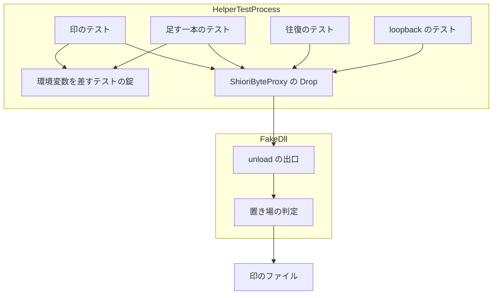
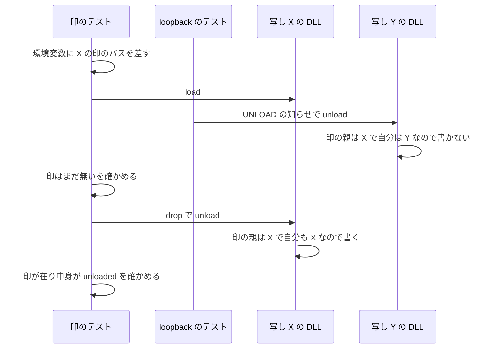

# Design Document: areka-P0-host32-testdll-marker-race

## Overview

**Purpose**: 全体テストの i686 の段がコードを変えていないのにまれに赤になる揺れを、原因の 1 か所で断つ。対象は補助 exe（`shiori-host32-helper`）のテスト `testdll_drop_invokes_courtesy_unload`（以下「印のテスト」）。

**Users**: 開発者。完了の手順の途中で理由のない赤を見なくなり、赤が出たら本物として扱える。

**Impact**: 偽の SHIORI DLL（`shiori-host32-testdll`・出力名 `shiori.dll`）の unload の出口が、印を書く条件を 1 つ増やす。今は「環境変数 `HOST32_TESTDLL_UNLOAD_MARKER` に値があれば、そのパスへ書く」。これを「値があり、かつ、そのパスの親フォルダが、いま unload されている DLL 自身の置き場のフォルダと同じときだけ書く」に変える。製品のコードは変えない。

揺れの根は「どのフォルダから読まれた写しの DLL も、プロセス全体で 1 つの印の置き場へ書く」ことにある。直列化の錠を広げてテストを並べる（案 A）のでなく、この根を直す（案 B）。選んだ理由と、採らなかった案は「Architecture」の「直し方の選択」に書く。

### Goals

- 印のテストの 2 つの確かめが、印のテスト自身の drop による unload だけで決まる。偽の DLL を load する他のテストが何本、どの順で、同時に走っても変わらない。
- 時間待ちを使わない。既存のテストの本数と確かめを減らさない。
- 直す前は赤、直した後は緑になるテストを 1 本添える（競合の経路「別の写しの unload が印を書く」を 1 本のテストの中で切り出す）。
- 直した後に i686 の段を 10 回続けて回して緑、全体テストも緑。

### Non-Goals

- 製品の補助 exe の LOAD・unload の手順、`ShioriByteProxy` の振る舞いの変更。
- 2 本目の偽の DLL（`shiori-host32-testdll-loadu`）と、それを読むテスト（群 D）とその直列化の変更。
- x64 側（`shiori-host32-host`）の通しのテストの変更。
- 全体テストの手順（`tools/test-all.ps1`）の変更。採り直しや、テストを 1 本ずつ走らせる設定で揺れを隠すこと。
- 既存の 2 本（印のテスト・往復のテスト）と loopback のテストの一時フォルダの置き場を移すこと。
- 同じ形で 2 か所に写してある `resolve_testdll` を 1 つにまとめること（揺れを直すのに要らない）。

## Boundary Commitments

### This Spec Owns

- 偽の DLL の unload の出口が印を書く条件（`crates/shiori-host32-testdll/src/lib.rs` の `unload` の定義と、その説明）。
- 偽の DLL の `Cargo.toml` の、`windows` クレートの機能の一覧（1 行足す）。
- `crates/shiori-host32-helper/src/shiori_proxy.rs` の `mod tests` のうち、印の環境変数まわり: 直列化の錠の定義と説明、印のテストの説明、往復のテストの錠の取り方と説明、足す 1 本のテストとその小さな道具。
- 「偽の DLL を load するテストを足すときの決まり」の説明（1 か所）。
- 数え上げの記録と、競合の経路の記録（`research.md`）。

### Out of Boundary

- `shiori_proxy.rs` の `mod tests` より上の部分（`ShioriByteProxy`・その Drop・`load_library_quiet` などの製品のコード）。
- `crates/shiori-host32-helper/src/main.rs` と、窓の手続き `handle_message`。
- `crates/shiori-host32-helper/src/main_loopback_tests.rs`（loopback のテスト）。**触らない**。この設計では loopback のテストに錠を取らせる必要がない。
- `crates/shiori-host32-helper/src/shiori_proxy_loadu_tests.rs`、`crates/shiori-host32-testdll-loadu/`。
- `crates/shiori-host32-host/`（x64 側）。
- `crates/log-capture-kit/tests/temp_path_guard_test.rs`（一時パスの見張りの例外表）と `file_length_guard_test.rs`。**触らない**。
- `tools/test-all.ps1`、`Cargo.lock`、ワークスペースの根の `Cargo.toml`。

### Allowed Dependencies

- 偽の DLL は、すでに使っている `windows` クレート 0.62.2 の機能 `Win32_System_LibraryLoader` を足してよい（`GetModuleHandleExW`・`GetModuleFileNameW` のため）。新しいクレートは足さない。同じ版の `windows` はワークスペースですでに使われており、補助 exe はこの機能をすでに有効にしている。`Cargo.lock` は機能の一覧を持たないので変わらない。
- 偽の DLL は標準ライブラリの `std::fs::canonicalize` と `std::path` を使ってよい。
- 足すテストは、同じ `mod tests` の中の `resolve_testdll`・直列化の錠・`ShioriByteProxy::load` だけに依存する。新しい dev-dependency は足さない。

### Revalidation Triggers

- 偽の DLL の unload が印を書く条件を、もう一度変えるとき（例: 環境変数をやめる）。印のテストと足す 1 本のテストを見直す。
- 偽の DLL を load するテストを足し、そのテストが印の環境変数を差すとき。直列化の錠を取る決まりに従う。
- 補助 exe が DLL を絶対パスで読まなくなるとき（`ShioriByteProxy::load` の手順 1 が変わるとき）。「写しごとに別のモジュールとして読まれる」前提が崩れるので、本設計を見直す。
- x64 側の通しのテストが `HOST32_TESTDLL_UNLOAD_MARKER` を差すようになるとき。差す側は、印を DLL と同じフォルダに置く必要がある。

## Architecture

### Existing Architecture Analysis

- 補助 exe には `lib.rs` が無く、テストは全部 1 つのテストのバイナリ＝1 つのプロセスで、既定では並行に走る。偽の DLL `shiori.dll` を実際に load するテストは 3 本（印のテスト・往復のテスト・loopback のテスト）。数え上げは `research.md` の 2 節にあり、起票時の見立てと一致している。
- 3 本とも、偽の DLL を自分の一時フォルダへ写してから、そのフォルダの `shiori.dll` を絶対パスで読む（`ShioriByteProxy::load` の手順 1 が、受け取った絶対パスをそのまま `LoadLibraryW` へ渡す）。
- 偽の DLL の unload の出口は、呼ばれるたびに環境変数 `HOST32_TESTDLL_UNLOAD_MARKER` を読み、値があればそのパスへ `unloaded` を書く。どの写しも同じコードで、同じプロセスの環境変数を読む。
- 環境変数を差して外すのは印のテストだけ。直列化の錠 `TESTDLL_SERIAL` は `mod tests` の中の 2 本だけが取り、loopback のテストは取らない。
- 競合の経路は 2 本（`research.md` の 3 節）。経路 1: loopback のテストの UNLOAD の知らせによる unload が、印のテストが環境変数を差してから「drop の前は印が無い」を確かめるまでの間に走り、印のテストの印を書く。経路 2: loopback のテストが LOAD の後・UNLOAD の前に落ちたとき、窓の後片付けの中の unload が同じことをする。

### 直し方の選択

**採る: 案 B（偽の DLL が、自分の置き場と同じフォルダの印だけを書く）。**

| 案 | 中身 | 採否と理由 |
|---|---|---|
| A | 3 本とも同じ錠を取る。偽の DLL は触らない | **採らない**。差分は最小だが、「偽の DLL を load するテストは錠を取る」という約束を人が守り続ける形になる。今回の揺れは、まさにその約束が 1 本のテストで守られなかったことで起きた。直す前に赤になるテストも作れない（2 本のテストの間の順番を時間待ちなしに強いる手が無い） |
| **B** | 偽の DLL の unload が、印のパスの親フォルダと自分の置き場のフォルダが同じときだけ書く | **採る**。根（全員が 1 つの置き場へ書く）を 1 か所で直す。後からテストを足しても揺れが戻らない。直す前は赤・直した後は緑のテストを、1 本のテストの中で時間待ちなしに作れる |
| C | A と B の両方 | **採らない**。B だけで止まる。loopback のテストに錠を取らせると、長いテストが他と直列になり、守るべき約束も 1 つ増える |
| B の変形 1 | 環境変数をやめ、load で受け取ったフォルダを覚えて unload でそこへ書く | **採らない**。load の入口は既定コードページのバイト列でフォルダを受け取るので、偽の DLL に文字コードの変換が要る |
| B の変形 2 | 環境変数は「書くかどうか」の旗だけにし、いつも自分のフォルダへ書く | **採らない**。環境変数の意味が変わる。直す前のテストが「印の機能がまだ無い」という理由で赤になり、競合の経路を示す赤にならない |

案 B の代わりに払うもの（はっきり書く）:

- 触るファイルが brief の一覧より 1 つ増える（偽の DLL の `Cargo.toml` に機能を 1 行）。同じウェーブ C3 のほかの 10 本は、`roadmap.md` の C3 の行の「触るファイル」に `crates/shiori-host32-testdll/` も補助 exe のテストも挙げていない（照合済み）。偽の DLL に言及する brief は `makoto-dll-host`・`property-ipc-transport`・`mcp-stdio-bridge`・`release-code-signing` の 4 本で、どれも C3 に居ない。
- 偽の DLL に Win32 の呼び出しが 2 つ増える。ただし走るのは環境変数に値があるときだけ。x64 側の通しのテストはこの環境変数を差さないので、その分かれ道に入らない。
- 環境変数をプロセス全体で差すこと自体は残る。差すテスト同士（印のテストと、足す 1 本）は今までどおり錠で直列にする。差さないテストは錠が要らなくなる。

**前提「同じ名前の DLL を別のフォルダから絶対パスで読むと、別々のモジュールとして読まれる」は成り立つ**（Microsoft の文書で確認。引用は `research.md` の「設計フェーズの調査」）:

- `LoadLibraryW` は、絶対パスを渡されたらそのパスだけを探す。「すでに読んである同じ名前のモジュールを使う」決まりは、パスを省いたときの検索の手順の一部である。
- 同じ文書が「パスを省いたとき、同じ名前のモジュールが複数読まれていれば、先に読まれた方を返す」と書いている＝同じ名前のモジュールが同時に複数読まれている状態を、OS が前提にしている。
- `GetModuleHandleExW` はアドレスからモジュールを引ける（同じ名前のモジュールが複数あるときの引き方として文書が挙げている）。`GetModuleFileNameW` は、そのモジュールの完全なパスを返す。
- 文書の上の確認に加えて、足す 1 本のテストがこの前提そのものを実走で確かめる（1 つ目の写しを読んだまま 2 つ目の写しを読む。「Testing Strategy」）。前提が崩れていれば、そのテストは揺れずに必ず赤になる。

### Architecture Pattern & Boundary Map



- 選んだ形: 書く側（偽の DLL）が「自分宛ての印か」を判定する。読む側のテストに約束を課さない。
- 錠の役目が変わる: 「偽の DLL を load するテストの直列化」から「印の環境変数を差すテストの直列化」へ。取るのは印のテストと足す 1 本だけ。往復のテストと loopback のテストは取らない。
- 守る既存の形: 汚れた錠を無視して続ける書き方（`unwrap_or_else(|e| e.into_inner())`）。i686 のときだけ走らせる無視の印の付け方。偽の DLL の「書けなくても黙って続ける」。
- 依存の向き: テスト → `ShioriByteProxy`（製品・無変更）→ 偽の DLL。偽の DLL は補助 exe を知らない。

### Technology Stack

| Layer | Choice / Version | Role in Feature | Notes |
|-------|------------------|-----------------|-------|
| 偽の DLL | `windows` 0.62.2（既存）＋機能 `Win32_System_LibraryLoader`（足す） | 自分の置き場のパスを引く（`GetModuleHandleExW`・`GetModuleFileNameW`） | 新しいクレートなし。`Cargo.lock` は変わらない |
| 偽の DLL | 標準ライブラリ `std::fs::canonicalize` | 文字の並びのままでは違うときに、2 つのフォルダを同じ書き方にそろえて比べ直す | `GetModuleFileNameW` は読んだときの書き方のまま返す（短い名前のこともある）ため |
| テスト | 既存の `cargo test`（i686） | 足す 1 本と既存の 3 本 | 新しい依存なし |

## File Structure Plan

### Modified Files

- `crates/shiori-host32-testdll/src/lib.rs` — `unload` の定義に置き場の判定を足す。自分の置き場のフォルダを引く小さな関数を 1 つ足す。`unload` の説明を新しい条件に合わせる。今 340 行、足すのは 40〜60 行の見込み。
- `crates/shiori-host32-testdll/Cargo.toml` — `windows` の機能の一覧に `Win32_System_LibraryLoader` を 1 行足す。
- `crates/shiori-host32-helper/src/shiori_proxy.rs` — `mod tests` の中だけ。今 733 行、足すのは 80〜110 行の見込み（1,000 行未満）。
  - 錠の名前 `TESTDLL_SERIAL` は変えず、説明を書き直す。ここに「偽の DLL を load するテストを足すときの決まり」を書く（1 か所）。
  - 印のテストの説明と、`set_var`・`remove_var` の安全の説明を事実に合わせる。**確かめと手順は変えない**。
  - 往復のテストは錠を取るのをやめ、説明を事実に合わせる。**確かめは変えない**。
  - `mod tests` の冒頭の説明を、今の節の数に合わせる。
  - 足す 1 本のテスト `testdll_unload_from_another_folder_leaves_marker_untouched` と、その道具（一意なフォルダを作って偽の DLL を写す関数 1 つ）。
- `.kiro/specs/areka-P0-host32-testdll-marker-race/research.md` — 数え上げの最終の記録、赤と緑の実走の記録、10 回の実走の記録。

### 新しいファイル

なし。

足すテストを兄弟のファイルに出さず、今ある `mod tests` に入れる理由: `structure.md` の決まりは「新規のテストモジュールは本番ファイルの中に本体を書かない」で、対象は新しいモジュールである。足すのは今あるモジュールへの 1 本で、同じモジュールの非公開の `resolve_testdll` と錠をそのまま使う。兄弟のファイルに出すと、この 2 つを外から見える形に変える必要が出る。

## System Flows

直した後の、別の写しの unload と印のテストの関係（経路 1 が成り立たなくなる様子）:



- 経路 2（loopback のテストが落ちたときの、窓の後片付けの中の unload）も、書き手が写し Y の DLL である点は同じなので、同じ判定で書かない。
- 判定は unload を呼んだスレッドの中で完結し、待ち合わせも時間待ちも無い。

## Requirements Traceability

| Requirement | Summary | Components | Interfaces | Flows |
|-------------|---------|------------|------------|-------|
| 1.1 | 印のテストの確かめが自分の drop だけで決まる | 偽の DLL の置き場の判定 | unload が印を書く条件 | 上の図 |
| 1.2 | 順・並行の数・組み合わせによらない | 偽の DLL の置き場の判定、環境変数を差すテストの錠 | 判定は呼んだスレッドの中で完結。差すテスト同士は錠で直列 | 上の図 |
| 1.3 | 1 本の失敗が連鎖しない | 環境変数を差すテストの錠、偽の DLL の置き場の判定 | 汚れた錠を無視する書き方。環境変数が差したまま残っても、他の写しは書かない | 「Error Handling」 |
| 2.1 | 時間待ちに頼らない | 全部 | 待ち合わせ・sleep なし | ― |
| 2.2 | 印のテストの 2 つの確かめを残す | 印のテスト | 手順と確かめは無変更（説明だけ直す） | ― |
| 2.3 | テストの本数と確かめを減らさない | 印のテスト・往復のテスト・loopback のテスト | 3 本とも確かめは無変更。1 本増える | ― |
| 2.4 | i686 のとき走る形を保つ | 全テスト | 無視の印は今の形（x64 のときだけ）のまま。足す 1 本も同じ形 | ― |
| 3.1 | 数え上げと見立ての照合 | `research.md` | 着手時に数え直して記録 | ― |
| 3.2 | 直す前は赤・直した後は緑のテスト | 足す 1 本のテスト | 「Testing Strategy」の手順 | ― |
| 3.3 | 決定論で起こせないときの経路の記録 | `research.md` の 3 節 | 3.2 が成り立つので主の証拠は 3.2。経路の記録と、直した後に成り立たない理由も残す | 上の図 |
| 3.4 | 見立てと違うものが見つかったら対象に含める | 偽の DLL の置き場の判定 | 判定は書く側にあるので、load するテストが何本あっても自動で効く。環境変数を差すコードが他に見つかったら、錠の決まりの対象に入れる | ― |
| 4.1 | i686 の段を 10 回続けて緑 | 検証の手順 | 「Testing Strategy」 | ― |
| 4.2 | 1 回でも赤なら完了としない | 検証の手順 | 「Testing Strategy」 | ― |
| 4.3 | 全体テストが緑 | 検証の手順 | `tools/test-all.ps1` | ― |
| 5.1 | 製品のコードを変えない | 境界 | `shiori_proxy.rs` は `mod tests` の中だけ。`main.rs` は触らない | ― |
| 5.2 | 偽の DLL の返り値と `HOST32_TESTDLL_LOAD_FAIL` を変えない | 偽の DLL | unload はいつも `true`。load・request は無変更 | ― |
| 5.3 | 2 本目の偽の DLL と群 D を変えない | 境界 | 触らない | ― |
| 5.4 | 1 ファイル 1,000 行未満 | `shiori_proxy.rs`・偽の DLL の `lib.rs` | 733 行＋最大 110 行、340 行＋最大 60 行 | ― |
| 6.1 | 説明を事実に合わせる | 錠の説明・印のテストの説明・往復のテストの説明・偽の DLL の unload の説明 | 「Components and Interfaces」の説明の直し方 | ― |
| 6.2 | 足すときの決まりを 1 か所に書く | 錠の説明 | 錠の定義の説明に書く | ― |

## Components and Interfaces

| Component | Domain/Layer | Intent | Req Coverage | Key Dependencies | Contracts |
|-----------|--------------|--------|--------------|------------------|-----------|
| 偽の DLL の置き場の判定 | 試験用の DLL | 印が自分宛てのときだけ書く | 1.1, 1.2, 1.3, 3.4, 5.2 | `windows` の `LibraryLoader`（P0）、`std::fs::canonicalize`（P0） | Service |
| 環境変数を差すテストの錠 | 補助 exe のテスト | 環境変数を差すテスト同士を直列にする | 1.2, 1.3, 6.1, 6.2 | 標準ライブラリの `Mutex` | State |
| 足す 1 本のテスト | 補助 exe のテスト | 別の写しの unload が印を書かないことを示す | 3.2, 2.1, 2.4 | 錠、`resolve_testdll`、`ShioriByteProxy` | ― |
| 説明の手直し | 補助 exe のテスト・試験用の DLL | 説明を事実に合わせる | 6.1, 6.2, 2.2, 2.3 | ― | ― |

### 試験用の DLL

#### 偽の DLL の置き場の判定

| Field | Detail |
|-------|--------|
| Intent | unload のとき、印のパスの親フォルダが自分の置き場のフォルダと同じときだけ印を書く |
| Requirements | 1.1, 1.2, 1.3, 3.4, 5.2 |

**Responsibilities & Constraints**

- unload の出口の返り値は、どの場合も `true`（今と同じ）。
- 環境変数 `HOST32_TESTDLL_UNLOAD_MARKER` に値が無いときは、何も引かず、何も書かない（今と同じ。x64 側の通しのテストはいつもこの枝）。
- 値があるときだけ、自分の置き場のフォルダを引いて比べる。
- 比べ方は 2 段。まず 2 つのフォルダを文字の並びのまま比べ、同じなら書く（今あるテストは、DLL のパスも印のパスも同じ文字列から組むので、ここで通る）。違うときだけ、両方を `std::fs::canonicalize` で同じ書き方にそろえて比べ直す（`GetModuleFileNameW` は読んだときの書き方のまま返し、長い名前のことも短い名前のこともあるため）。1 段目を置く理由: `canonicalize` は一部のドライブ（RAM ディスクなど）で失敗する。OS の一時フォルダがそういう所にある機械で、今緑の印のテストを赤にしない。
- そろえられなかったとき（印の親フォルダがもう無い、など）は「違う」と同じに扱い、黙って書かない。緑の実走でも起きる（錠を取らないテストの unload が環境変数を読んだ直後に、差したテストがフォルダを消したとき）ので、行を出さない。
- 書く中身は今と同じ `unloaded`。書けなくても黙って続ける（今と同じ）。
- load・request の出口と、`HOST32_TESTDLL_LOAD_FAIL` の読み方には触らない。

**Dependencies**

- Inbound: `ShioriByteProxy` の Drop — unload を呼ぶ（P0・無変更）
- External: `windows` 0.62.2 の `GetModuleHandleExW`・`GetModuleFileNameW` — 自分の置き場のパスを引く（P0）

**Contracts**: Service [x] / API [ ] / Event [ ] / Batch [ ] / State [ ]

##### Service Interface

```rust
/// 既存の出口。署名は変えない。
pub unsafe extern "C" fn unload() -> bool;

/// 足す関数（非公開）。いま走っているこの DLL が置かれているフォルダを返す。
/// 引けなければ None。
fn own_module_dir() -> Option<std::path::PathBuf>;
```

- `own_module_dir` の決まり:
  - `GetModuleHandleExW` を、「アドレスから引く」と「参照数を変えない」の 2 つの旗で呼ぶ。渡すアドレスは、この DLL の中の関数のアドレス（例: `unload` 自身）。名前で引かない（同じ名前のモジュールが複数読まれているので、名前では自分を引けない）。
  - 得たモジュールを `GetModuleFileNameW` へ渡して完全なパスを得て、その親フォルダを返す。
  - 置き場が足りずに切り詰められたとき（返り値が置き場の長さと同じ）は失敗として `None` を返す。
  - 参照数を変えない旗で得たモジュールは `FreeLibrary` へ渡さない。unload は `ShioriByteProxy` の Drop が `FreeLibrary` の前に呼ぶので、判定の間この DLL は読まれたままである。
- `unload` の事前条件: なし（今と同じ）。
- `unload` の事後条件:

| 環境変数 | 自分の置き場 | 印の親フォルダと同じか | 結果 |
|---|---|---|---|
| 値なし | 引かない | ― | 書かない |
| 値あり | 引けた | 同じ | 印のパスへ `unloaded` を書く |
| 値あり | 引けた | 違う | 書かない（黙って続ける。別の写し宛ての印なので、ふつうに起きる） |
| 値あり | 引けた | 比べられない（印に親が無い、どちらかのフォルダをそろえられない） | 書かない（黙って続ける。「違う」と同じ扱い） |
| 値あり | 引けない | ― | 書かない。理由を標準エラーへ 1 行出す |

- 不変条件: 返り値は常に `true`。panic しない。

**Implementation Notes**

- Integration: 偽の DLL を変えた後は、i686 の成果物を作り直してからテストを回す（テストは `target\i686-pc-windows-msvc\<profile>\shiori.dll` の出来合いを写して読む。作り直さないと古い DLL で回ることになる）。
- Validation: 「同じ」の枝は既存の印のテスト、「違う」の枝は足す 1 本のテストが踏む。偽の DLL 自身の単体テストは足さない（判定は実際に読まれた DLL の中でしか意味を持たず、フォルダを作る単体テストを足すと一時パスの見張りの例外表に行を足すことになる）。
- Risks: 判定が誤って「違う」に倒れると、印のテストの「drop の後は印が在る」が**毎回**赤になる（揺れではなく、実装の時点で必ず見つかる）。標準エラーの 1 行は、そのときの手がかりになる。

### 補助 exe のテスト

#### 環境変数を差すテストの錠

| Field | Detail |
|-------|--------|
| Intent | 印の環境変数を差すテスト同士を直列にする |
| Requirements | 1.2, 1.3, 6.1, 6.2 |

**Responsibilities & Constraints**

- 名前は `TESTDLL_SERIAL` のまま変えない。役目は「偽の DLL を load するテストの直列化」から変わるが、触らないと決めた `shiori_proxy_loadu_tests.rs` の群 D の説明がこの名前を名指ししている（「既存 `TESTDLL_SERIAL` とは共用せず」）。名前を変えると、その 1 行が実在しない名前を指す。役目は説明で伝える。置き場は今のまま `shiori_proxy.rs` の `mod tests` の中。
- 取るのは、環境変数 `HOST32_TESTDLL_UNLOAD_MARKER` を差すテストだけ（印のテストと、足す 1 本）。環境変数はプロセスに 1 つなので、差すテスト同士が重なると、片方の drop がもう片方の値を読んで自分の印を書かなくなる。
- 往復のテストは錠を取るのをやめる。環境変数を差さず、自分の unload が他のテストの印を書くこともなくなったので、直列にする理由が無い。
- 汚れた錠は無視して続ける（今の書き方のまま）。

**Contracts**: Service [ ] / API [ ] / Event [ ] / Batch [ ] / State [x]

##### State Management

- State model: 錠 1 つ。守るものは「環境変数 `HOST32_TESTDLL_UNLOAD_MARKER` の値」。
- Concurrency strategy: 差すテストは、差す前に錠を取り、外した後で放す。

**錠の説明に書く決まり（要件 6.2 の「1 か所」）**

1. 偽の DLL `shiori.dll` を load するテストは、自分だけのフォルダへ写してから絶対パスで読む。
2. 印の環境変数を差さないテストは、錠を取らなくてよい。そのテストの unload は、他のテストの印を書かない（偽の DLL が、自分の置き場と同じフォルダの印だけを書くため）。
3. 印の環境変数を差すテストは、この錠を取る。印のパスは、読む DLL と同じフォルダに置く。
4. 今、偽の DLL を load するテストは、印のテスト・足す 1 本・往復のテスト・`main_loopback_tests.rs` の loopback のテスト。うち環境変数を差すのは印のテストと足す 1 本。（本数は書かない。足すたびに手で直す数になるため、名前の一覧だけにする。）

#### 足す 1 本のテスト `testdll_unload_from_another_folder_leaves_marker_untouched`

| Field | Detail |
|-------|--------|
| Intent | 別のフォルダから読んだ写しの unload が、環境変数の指す印を書かないことを、1 本のテストの中で時間待ちなしに示す |
| Requirements | 3.2, 2.1, 2.4 |

**Responsibilities & Constraints**

- 競合の経路 1・経路 2 の芯「別の写しの unload が、印のテストの印を書く」を、2 本のテストの間の順番に頼らずに切り出す。
- i686 のときだけ走る（既存の 2 本と同じ無視の印の付け方）。
- 手順と確かめは「Testing Strategy」。
- 使う 2 つのフォルダは、ワークスペースの `target\` の下に作る（プロセス識別子と時刻のナノ秒とフォルダごとの札で一意にし、最後に消す）。フォルダの根は `CARGO_MANIFEST_DIR` の 2 つ上（ワークスペースの根）から、`..` を含まない形で組む。OS の一時フォルダの入口は呼ばない。既存の 2 本の置き場は変えない。
- フォルダを作って偽の DLL を写す処理は、同じ `mod tests` の中の関数 1 つにまとめ、このテストが 2 回呼ぶ。既存の 2 本はこの関数へ寄せない（既存のテストの手順を変えない）。

**Implementation Notes**

- Integration: 一時パスの見張り（`temp_path_guard_test.rs`）はファイル単位で、`shiori_proxy.rs` は表に載ったまま、既存の 2 本の入口の呼び出しも残る。足すテストは入口を呼ばないので、表は変えずに緑のまま。
- Risks: ワークツリーのパスが長いと DLL のパスも長くなる。フォルダ名は短くする。

#### 説明の手直し（要件 6.1）

| 場所（定義） | 直した後に書くこと |
|---|---|
| 錠の説明 | 上の「錠の説明に書く決まり」。錠の役目は環境変数を差すテストの直列化 |
| 印のテストの説明 | 環境変数を差すので錠を取る。他のテストの unload は、偽の DLL の置き場の判定によって、この印を書かない |
| 印のテストの `set_var` の安全の説明 | 環境変数を差すテストは錠で直列になっている。ほかのテストは、この環境変数を偽の DLL の unload の中で読むだけである |
| 印のテストの `remove_var` の安全の説明 | 同上（「以後 load するテストは無い」は消す） |
| 往復のテストの説明 | 環境変数を差さないので錠を取らない |
| `mod tests` の冒頭の説明 | 今の節の数と中身に合わせる |
| 偽の DLL の `unload` の説明 | 書く条件（値があり、印の親フォルダが自分の置き場と同じ）と、その理由（同じプロセスに複数の写しが読まれる）。加えて「テストを足すときの決まりは、補助 exe の `shiori_proxy.rs` の錠 `TESTDLL_SERIAL` の説明にある」と 1 行で指す（loopback のテストの側から足す人にも届くように） |

## Error Handling

### Error Strategy

- 偽の DLL の unload は、何が起きても `true` を返し、panic しない。書けない・引けないは「書かない」に倒す。
- 「印が別の写し宛て」「フォルダを比べられない」は緑の実走でも起きるので、何も出さない。「自分の置き場を引けない」はふつう起きないので、標準エラーへ 1 行出す。
- テストが途中で落ちたとき:
  - 印のテスト、または足す 1 本が落ちると、環境変数は差したまま残る。残った値は落ちたテストのフォルダを指す。ほかの写しの unload は置き場が違うので書かない。次に環境変数を差すテストは、自分の値で上書きしてから使う。よって別のテストの赤につながらない（要件 1.3）。落ちても外す片付け役は足さない（要らない）。
  - 錠は汚れても無視して続ける。
  - loopback のテストが落ちても、その巻き戻しの中の unload は印を書かない（経路 2 が成り立たない）。

## Testing Strategy

### 足す 1 本のテストの手順（要件 3.2）

1. 錠 `TESTDLL_SERIAL` を取る。
2. フォルダ X とフォルダ Y を作り、それぞれに偽の DLL を `shiori.dll` として写す。
3. 環境変数に X の `unload.marker` のパスを差す。
4. X の写しを load する（読んだままにする）。
5. Y の写しを load する。
6. Y の写しを drop する（unload が走る）。
7. **確かめ 1**: X の `unload.marker` が無い。← 直す前は、Y の写しの unload が無条件に書くので、ここで赤になる。
8. **確かめ 2**: Y のフォルダにも `unload.marker` が無い。
9. X の写しを drop する。
10. **確かめ 3**: X の `unload.marker` が在り、中身が `unloaded`。← 同じ名前の別の写しを読んだ後でも、X の写しが自分の置き場を正しく引けることの確かめ（前提の実走での確認）。
11. 環境変数を外し、2 つのフォルダを消す。

時間待ち・待ち合わせは無い。1 本のテストの 1 つのスレッドで順に進む。

### 実装の順（赤を先に見る）

1. 着手時の数え上げ（要件 3.1）: 補助 exe の `src/` で偽の DLL を load するテストと、`HOST32_TESTDLL_UNLOAD_MARKER` を読み書きするコードを全数で数え直し、`research.md` の 2 節と合うかを記録する。違いがあれば要件 3.4 に従い対象に含める。
2. 足す 1 本のテストを書く。i686 の成果物を作り、そのテストだけを回して、確かめ 1 で赤になることを記録する。この実走は片付けまで届かないので、記録を採った後に、`target\` の下に残った 2 つのフォルダを消す。
3. 偽の DLL を直す。i686 の成果物を**作り直し**、同じテストが緑になることを記録する。
4. 錠の説明、往復のテストの錠、各説明を直す。

### 既存のテストで確かめること

- 印のテスト `testdll_drop_invokes_courtesy_unload`: 確かめは無変更で緑（判定の「同じ」の枝）。
- 往復のテスト `testdll_request_roundtrip_get_and_notify`: 錠を取らずに緑。
- loopback のテスト `loopback_hello_request_proxy_driven_and_bounded_loop`: 無変更で緑。
- 群 D（`shiori_proxy_loadu_tests.rs`）: 無変更で緑。
- 偽の DLL 自身の単体テスト（x64 で走る 7 本）: 無変更で緑。

### 走らせて確かめる（要件 4）

- 前提: `cargo build -p shiori-host32-helper -p shiori-host32-testdll -p shiori-host32-testdll-loadu --target i686-pc-windows-msvc`。
- `cargo test -p shiori-host32-helper -p shiori-host32-ipc --target i686-pc-windows-msvc --no-fail-fast` を 10 回続けて回し、10 回とも緑（要件 4.1）。往復のテストと loopback のテストが錠の外で印のテストと並行に走るので、毎回の実走が判定の「違う」の枝を踏む機会になる。
- 1 回でも赤なら完了とせず、原因を調べる（要件 4.2）。採り直しの緑で置き換えない。
- `tools/test-all.ps1` を回して緑（要件 4.3）。x64 側の通しのテスト、1 ファイル 1,000 行の見張り、一時パスの見張りを含む。
- 10 回の緑は「起きにくい」の裏付けにとどまる。「起きない」の根拠は、足す 1 本のテストの赤と緑と、「System Flows」の判定である。

### 触らないことの確かめ（要件 5）

- 差分が `crates/shiori-host32-testdll/{src/lib.rs, Cargo.toml}` と `crates/shiori-host32-helper/src/shiori_proxy.rs` の `mod tests` の中、spec の文書だけであること。`Cargo.lock` に差分が無いこと。
- `shiori_proxy.rs` の `mod tests` より上に差分が無いこと（要件 5.1）。

## Open Questions / Risks

- **決定（2026-10-04・設計の議論 1・開発者の承認）**: 案 B で確定。下の 2 項目（`Cargo.toml` に 1 行足すこと、往復のテストから錠を外すこと）も設計どおりで確定。
- **確定した選択**: 案 B を採った（偽の DLL を直す）。brief の一覧に無い `crates/shiori-host32-testdll/Cargo.toml` に 1 行足す。案 A（錠を 3 本で共有・偽の DLL は触らない）の方が差分は小さいが、約束を人が守る形が残り、直す前に赤になるテストも作れない。
- **往復のテストから錠を外す**: 外さなくても揺れは止まる。外す理由は、錠の決まりを「環境変数を差すテストだけ」と 1 行で言える形にするため。残す方がよければ、錠の説明の 2 番を「取らなくてよいが、往復のテストは昔からの形で取っている」に変えるだけで済む。
- `temp_path_guard_test.rs` の説明の中にある、`shiori_proxy.rs` の入口の数の覚え書き（2026-08-27 の実測）は、足すテストが入口を呼ばないので、そのまま正しい。
