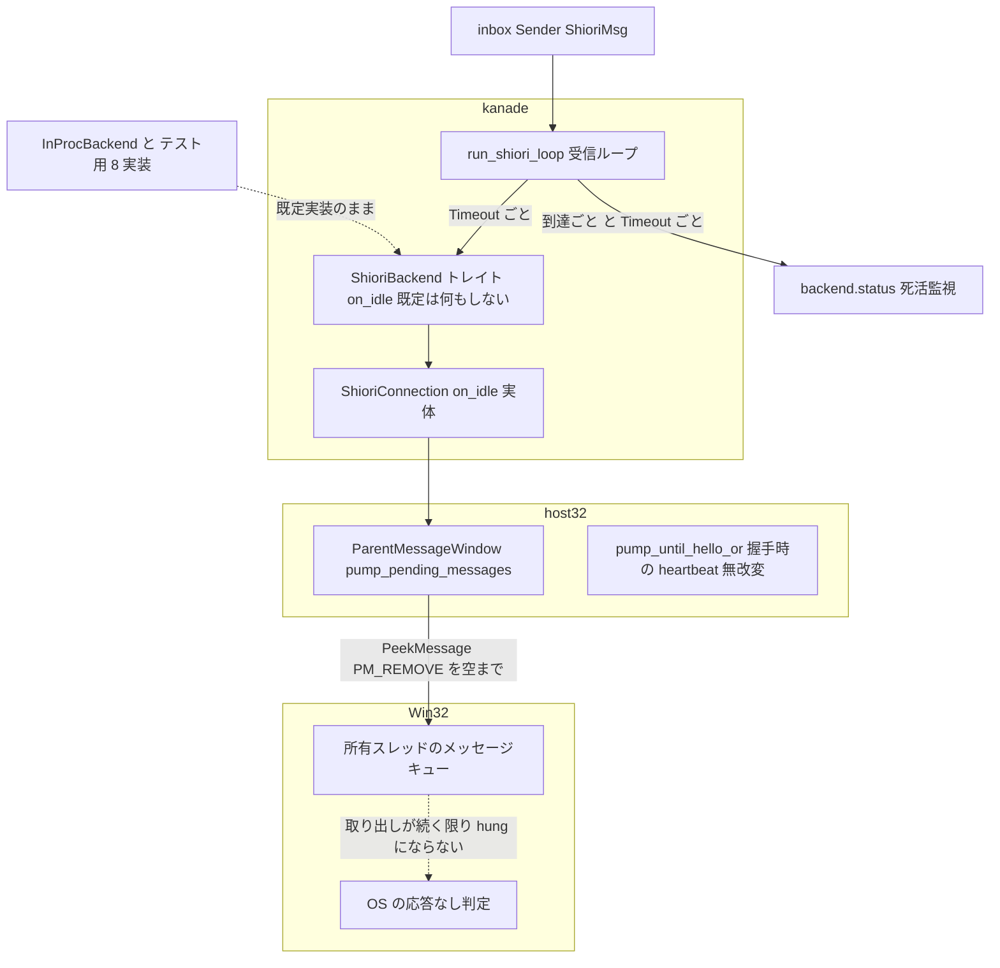
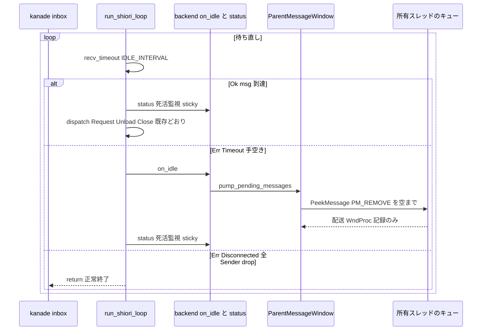
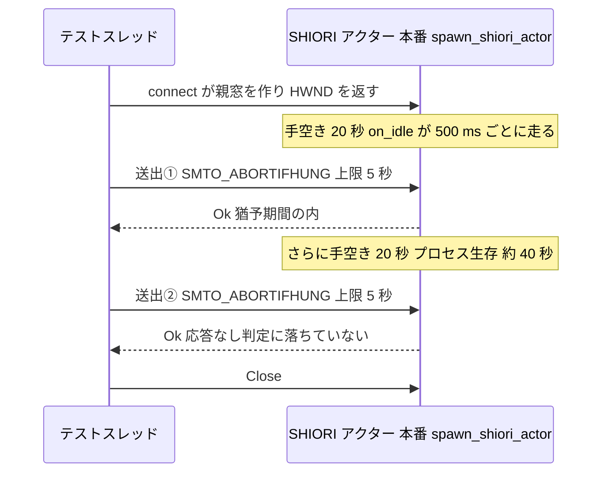

# Design Document: areka-P0-host32-window-thread-pump

> 作成 2026-09-13（`kiro-spec-design`・要件確定後）。引用の行番号は本日の HEAD `9e6095cd` 時点で、各引用は「何の定義行か」を併記する（実装で行番号がずれても追える）。

## Overview

**Purpose**: SHIORI アクターのスレッド（32bit helper と WM_COPYDATA で話すホスト窓を持つスレッド）が、要求の無い待機中も OS の応答なし判定に落ちないようにする。現状の受信ループは inbox の blocking 受信で止まり（`crates/areka-kanade/src/shiori/real.rs` の `run_shiori_loop` にある `while let Ok(msg) = rx.recv()`・現 `:179`）、要求の往復と起動時の握手以外では窓のメッセージを取り出さず、`backend.status()` による死活監視もその内側にあるため、仕事が止まると窓の処理も死活監視も同時に止まる。

**Users**: kanade（呼び手）・host32 ホスト層・将来 helper → areka 向きの自発通知を要する spec。

**Impact**: 受信ループの待ちの形を「有限時間の受信待ち＋手空き時の backend 通知」へ改め、`ShioriBackend` に既定実装つきの手空き通知 `on_idle` を足す。窓のメッセージを汲む部品は host32 ホスト層（`crates/shiori-host32-host/src/parent_window.rs`）が提供し、kanade は Win32 の語彙を知らない。IPC の方式・helper・アクター境界の受理規約は変えない。

### Goals

- 要求の無い待機中でもホスト窓宛のメッセージが最長 `IDLE_INTERVAL`（500 ms）以内に取り出され、待機の長さに関わらず OS の応答なし判定に落ちない（1.1〜1.3）。
- backend の保守周期（窓の処理・死活監視）を kanade のトラフィックから独立させる（1.7・2.9・2.10）。
- 既存の受理規約・握手・往復・停止の観測結果を不変に保つ（2.1〜2.8）。
- x64 の偽境界で走る決定論テスト（速いもの・遅いもの・較正つき）を `cargo test --workspace` に無条件で置く（4.1〜4.11）。
- 6.11 の応答方向の旗の扱いを無改変で維持する（3.1〜3.3）。

### Non-Goals

- IPC の方式（WM_COPYDATA 一本化・wire／framing・両方向の上限時間）の変更。
- helper 側の実装。応答方向の旗は 6.11 のまま。
- kanade の起動系列・終了の握手の配線（`schedule/{boot,mod,close}.rs`）。終了挨拶中に毎秒の往復を止める運行は前提。
- helper → areka 向きの自発通知そのもの（語彙・配送は将来の spec）。
- 握手時の heartbeat の再設計（無改変・説明文のみ追随）。
- `areka-P0-zorder-chain-residue` A 系の決着。

## Boundary Commitments

### This Spec Owns

- `run_shiori_loop` の**待ちの形**: `rx.recv()` を `rx.recv_timeout(IDLE_INTERVAL)` へ替え、`Timeout` のたびに `backend.on_idle()` と死活監視を行ってから待ち直す。
- `ShioriBackend::on_idle(&mut self)` の**契約**（backend 非依存・既定は何もしない）と、host32 の `ShioriConnection` におけるその実体。
- `ParentMessageWindow::pump_pending_messages(&self)`: 自窓を所有するスレッドのキューに溜まったメッセージを空になるまで取り出して配る部品。
- 定数 `IDLE_INTERVAL` の値と根拠（定数の説明文に残す）。
- 決定論テスト 2 群（窓を作らないもの＝`real.rs` の兄弟テストファイル／窓を作るもの＝kanade の既存の統合テストバイナリ `tests/kanade.rs` 配下）とその較正の証跡。
- 「待機中は取り出さない」と述べる既存の説明文の書き換え（7.1 の 6 か所）。
- 実機の非退行の走行と記録（5.1〜5.4）。

### Out of Boundary

- `crates/shiori-host32-ipc/` のコード（旗・wire・framing・型・テスト）。例外は 7.1 が挙げる rustdoc 2 か所のコメントのみ。
- `crates/shiori-host32-helper/` のコード。例外は既存テストの見出し（説明文）2 か所のみ。
- `crates/shiori-host32-host/src/{shiori3.rs,client.rs}`（併走 `areka-P0-charset-canon` が所有）・`lifecycle.rs`・`process_host.rs`。
- `crates/areka-kanade/src/schedule/`（`boot.rs`・`mod.rs` は併走 `kanade-boot-talkdone-drop` が所有・`close.rs` は本仕様の前提として不変）・`actor.rs`・`msg.rs`。
- `crates/areka-kanade/src/shiori/mod.rs`（rustdoc「メッセージ到達のたびに冒頭で `status` を確認」は変更後も真のまま——手空き時の確認が**加わる**だけで偽にならないため触れない）。
- `crates/areka-ghost/`（`InProcBackend`・`runtime.rs`・`shiori_wiring.rs`）・`crates/areka-actor/`。
- `ShioriBackend` の既存実装 10 個のうち `ShioriConnection` 以外の 9 個（既定実装が吸収する）。
- 完了 spec のアーカイブ（`.kiro/specs/completed/areka-P0-emo2-conformance-e2e/`）・`doc/COMPAT_ARCHITECTURE.md` §8（追記しない・後述）。

### Allowed Dependencies

- `areka-kanade` → `shiori-host32-host`（既存・`real.rs` だけが host32 型を import してよい）。`areka-kanade` の `[dependencies]` に `windows` crate を足さない（7.6）。
- `areka-kanade` の dev-dependencies `shiori-host32-ipc`（既存）: テストが `send_copydata`／`send_copydata_response`／`MsgTag`／`hwnd_from_u32` を使う。x64 の stand-in helper は `shiori_host32_host::process_host::spawn_command`（公開・`pub mod process_host`）で起こす——依存の追加なし。
- `shiori-host32-host` → `windows`（feature `Win32_UI_WindowsAndMessaging`＝既存・`PeekMessageW`／`PM_REMOVE`／`MSG`／`TranslateMessage`／`DispatchMessageW` はこの feature に含まれ、`Cargo.toml` の変更は不要）。
- 依存方向（不変）: `shiori-host32-ipc` → `shiori-host32-host` → `areka-kanade`（`shiori/real.rs` のみ）→ `areka-ghost`。逆向きの import は違反。

### Revalidation Triggers

- `ShioriBackend` の形（`on_idle` の署名・既定実装の有無）を変える。
- `IDLE_INTERVAL` を 5 秒の 1/4 を超える値へ動かす（速いテストの上限と OS の応答なし判定の余裕が同時に崩れる）。
- `pump_pending_messages` を `send_request` の内側（往復中）から呼ぶ形へ変える（`clear→store→take` の不変条件が崩れる）。
- 親窓を SHIORI アクター以外のスレッドで作る／別スレッドへ移す（`pump_pending_messages` の「自窓のスレッドで呼ぶ」前提が崩れる）。
- 6.11 の応答方向の旗を戻す（二重の守りが一重になる）。
- kanade の lib テストバイナリに親窓を作るテストを置く、または統合バイナリで親窓を作るテストが `common` の生成ロックを取らない（「窓を作るテストは統合バイナリに置き、生成の瞬間だけロックで直列化する」規則が崩れる——同じ瞬間に 2 つの窓を生成すると 2 つ目が失敗する）。

## Architecture

### Existing Architecture Analysis

| 何 | 現状（file:line・定義行） | 本仕様での扱い |
|---|---|---|
| 受信ループ | `real.rs` `fn run_shiori_loop`（現 `:172-245`）。`while let Ok(msg) = rx.recv()`（`:179`）→ 到達ごとに `backend.status()`（`:181-194`）→ `Request`／`Unload`／`Close` の dispatch。終了経路は `Close` の `return`（`:241`）と `recv` の `Err`（全 Sender drop） | 待ちの形だけを差し替える。dispatch 本体・ログ規約（`target: "shiori-actor"`・`event`）・終了経路は不変 |
| backend 抽象 | `real.rs` `pub trait ShioriBackend`（現 `:47-72`・`get`／`notify`／`unload`／`status`）。実装は 10 個（`ShioriConnection`・`InProcBackend`・テスト用 8 個） | `on_idle` を既定実装つきで追加。`ShioriConnection`（`:74-100`）だけが上書き |
| 窓と pump | `parent_window.rs` `pump_until_hello_or`（現 `:258-295`）が握手の間だけ heartbeat スレッド（`:270-282`・25 ms 間隔で自窓へ `PostMessageW(WM_NULL)`）＋`MessageLoop::run`（`:284-289`）で窓を回す。`send_request`（`:320-341`）は pump も heartbeat も起動しない | 握手・送信パスは無改変。定常時の部品 `pump_pending_messages` を新設 |
| 死活監視 | `HelperLifecycle::status`（`lifecycle.rs` 現 `:127-140`・sticky・非ブロッキングの `try_wait`） | 手空きの周期でも呼ぶ（1.7） |
| 終了挨拶中の沈黙 | `schedule/close.rs` `on_close_pending`（`Tick` は `last_now` 更新のみ・現 `:55`） | 前提（不変）。この 17〜19 秒が手空きの代表例 |
| 旗（二重の守り） | `shiori-host32-ipc/src/lib.rs` `send_flags`（現 `:284-289`・`Request → SMTO_ABORTIFHUNG`・`Response → SMTO_NORMAL`）。テストは `send_flavor_tests`（`:589-`）と helper の `main_response_flavor_hung_cage_tests.rs` | 無改変（説明文のみ追随） |
| 前例 | `wintf/src/com/wuc.rs` `pump_current_thread_messages`（現 `:107-117`・`PeekMessageW(PM_REMOVE)` → `TranslateMessage` → `DispatchMessageW` を空まで） | `pump_pending_messages` は同型（`WM_QUIT` の特別扱いは持たない・後述） |

### Architecture Pattern & Boundary Map

採る形は **「有限時間の受信待ち＋手空き時の backend 通知」**（gap analysis の案 0）。理由は要件 Introduction の裁定どおり——⑴ Win32 の規約上、窓のメッセージを取り出せるのは所有スレッドだけで、寝ている受信ループの外からは救えない、⑵ 窓の専用スレッド化は `ParentShared`／`ResponseSlot` の跨スレッド化と `Shiori3Client` の受け型変更を伴い `client.rs` で `charset-canon` と衝突する、⑶ 採る形は host32 の特別扱いではなく、backend の保守周期をトラフィックから独立させる一般的な疎結合化である。不採用案の比較は「待ちの形の裁定と不採用案」節に残す（7.5）。



**Architecture Integration**:

- Selected pattern: 交互待ち（`recv_timeout` による有限待ち→手空き処理→待ち直し）。inbox 到達は送信で即起きるため往復の遅延は 0、窓側の遅延は最大 `IDLE_INTERVAL`。
- Domain boundaries: kanade は「手空きの周期」と「保守の機会を与える契約」だけを持つ。何を保守するかは backend が決める。Win32 の語彙（窓・メッセージ・`PeekMessage`）は host32 に閉じる。
- Existing patterns preserved: backend 抽象越しの単一 runner（本番・テスト同一経路）・`real.rs` だけが host32 型を import する境界・ログ規約（`target`／`event`）・握手の heartbeat・`send_request` の `clear→store→take`。
- New components rationale: `on_idle`（契約の穴を埋める唯一の追加点）・`pump_pending_messages`（定常時に窓を回す唯一の部品）・`IDLE_INTERVAL`（唯一の時間定数）。
- Steering compliance: 常時テストは x64 偽境界（tech.md）・兄弟テストファイル規約（structure.md）・ログ無し失敗経路の禁止・1 ファイル 1,000 行。

### Technology Stack

| Layer | Choice / Version | Role in Feature | Notes |
|-------|------------------|-----------------|-------|
| Backend / Services（kanade） | Rust 2024・`std::sync::mpsc::Receiver::recv_timeout` | 有限時間の受信待ち | 新規依存なし。`RecvTimeoutError::{Timeout, Disconnected}` の 2 腕で手空きと切断を区別 |
| Backend / Services（host32） | `windows` 0.62.2 feature `Win32_UI_WindowsAndMessaging`（既存） | `PeekMessageW`／`PM_REMOVE`／`MSG`／`TranslateMessage`／`DispatchMessageW` | feature 追加なし（同 feature を `PostMessageW` が既に使用） |
| Messaging / Events | WM_COPYDATA（既存・不変） | テストの送出（`shiori_host32_ipc::send_copydata`／`send_copydata_response`） | dev-dep 既存 |
| Infrastructure / Runtime | `cargo test --workspace` | 速い・遅いの双方を無条件に含める | kanade 統合バイナリが最長約 41 秒（4.11 で受容） |

## File Structure Plan

### Directory Structure

```
crates/areka-kanade/
├── src/shiori/
│   ├── real.rs                       # 【修正】待ちの形・IDLE_INTERVAL・on_idle 契約と実体・rustdoc・接続宣言 1 行
│   ├── real_tests.rs                 # 【無改変】既存テスト（2.8）
│   └── real_idle_tests.rs            # 【新規】窓を作らない決定論テスト（Test-A〜C・E: 手空きの契約・死活監視・順序・正規終了後の沈黙）
└── tests/
    ├── kanade.rs                     # 【修正】接続宣言 1 行を追加（既存の統合テスト入口）
    └── kanade/
        ├── idle_pump_test.rs         # 【新規】窓を作る決定論テスト（Test-D 速い窓テスト・Test-F 遅い窓テスト）
        ├── real_helper_test.rs       # 【修正】窓の生成を共有ロックで囲む 2 行（env-gate・通常は skip）
        └── common/
            ├── mod.rs                # 【修正】接続宣言 1 行を追加
            └── common_window_actor.rs  # 【新規】窓の生成ロック・x64 stand-in helper・connect クロージャ（1 か所）
crates/shiori-host32-host/src/
└── parent_window.rs                  # 【修正】pump_pending_messages 新設・rustdoc 4 か所の追随
crates/shiori-host32-ipc/src/
└── lib.rs                            # 【コメントのみ】send_copydata_response の doc と send_flavor_tests の doc（7.1 の例外）
crates/shiori-host32-helper/src/
└── main_response_flavor_hung_cage_tests.rs   # 【コメントのみ】見出し 2 か所（7.1・3.2）
.kiro/specs/areka-P0-host32-window-thread-pump/
└── verification/
    ├── calibration.md                # 【新規】直す前の赤の証跡（コマンド・所要・診断文）
    └── real-machine.md               # 【新規】実機の非退行（日時・コミット・コマンド・数えた行数・0 行も明示）
```

### Modified Files

- `crates/areka-kanade/src/shiori/real.rs` — ⑴ `pub const IDLE_INTERVAL: Duration = Duration::from_millis(500)` を追加（根拠を説明文に書く）。⑵ `ShioriBackend` に `fn on_idle(&mut self) {}` を追加（既定は何もしない）。⑶ `impl ShioriBackend for ShioriConnection` に `on_idle` を追加し `self.window.pump_pending_messages()` へ委譲。⑷ `run_shiori_loop` の `while let Ok(msg) = rx.recv()` を `loop { match rx.recv_timeout(IDLE_INTERVAL) { .. } }` へ。死活監視の本体を 1 つの関数へ括り出し、到達時と手空き時の両方から呼ぶ。⑸ `run_shiori_loop` の rustdoc（「blocking `recv`」「タイマー poll は持たない」）を変更後の姿へ。⑹ 末尾に `#[cfg(test)] #[path = "real_idle_tests.rs"] mod idle_tests;` を追加。現 291 行 → 350 行程度。
- `crates/shiori-host32-host/src/parent_window.rs` — ⑴ `pub fn pump_pending_messages(&self)` を `ParentMessageWindow` のメソッドとして追加（10 行程度・`PeekMessageW`／`PM_REMOVE`／`MSG`／`TranslateMessage`／`DispatchMessageW` を import に足す）。⑵ module doc の 2 項（現 `:12-13`「heartbeat・pump フェーズ専用」）・`HEARTBEAT_INTERVAL` の doc（現 `:47-50`）・`pump_until_hello_or` の doc（現 `:254-256`）・`send_request` の doc（現 `:309-312`）を「握手フェーズの起こし専用・定常時の保守は `pump_pending_messages` が往復の外で担う」へ書き換える。現 659 行 → 700 行程度。
- `crates/areka-kanade/tests/kanade.rs` — 接続宣言 1 行（`#[path = "kanade/idle_pump_test.rs"] mod idle_pump_test;`）。`tests/kanade/common/mod.rs` — 接続宣言 1 行。`tests/kanade/real_helper_test.rs` — `ParentMessageWindow::create()` の呼び出しを `WINDOW_CREATE_SERIAL` で囲む 2 行（env-gate・通常は skip・設定時の生成競合を防ぐ）。
- `crates/shiori-host32-ipc/src/lib.rs` — コメントのみ。`send_copydata_response` の doc（現 `:328-329`「待機中はメッセージを取り出さないため OS からは『応答なし』に見えるが」）と `send_flavor_tests` の doc（現 `:591-593`）を「ホストは往復の間は自分の `SendMessageTimeoutW` の中で待ち、その間は取り出さない（手空き時の周期的な保守は往復の外でしか走らない）ため、往復が長引けば OS からは『応答なし』に見えうる」へ。コード差分 0（3.3）。
- `crates/shiori-host32-helper/src/main_response_flavor_hung_cage_tests.rs` — コメントのみ。現 `:5-6`「本番では shiori アクターが `recv()` で待つ」→「本番のホストは往復の間 `SendMessageTimeoutW` の中で待ち取り出さない」、現 `:32`「本番の shiori アクターと同じ『待機中に pump しない』姿」→「往復中の本番ホストと同じ『取り出さない』姿（手空き時の周期的な保守は `areka-kanade` の決定論テストが固定する）」。テスト本体・期待値は無改変（3.2）。

### New Files

- `crates/areka-kanade/src/shiori/real_idle_tests.rs` — 命名は structure.md の `<stem>_<モジュール名>.rs`（stem `real`・モジュール `idle_tests`）。`src/shiori/` に `real_idle.rs` は存在せず前向きの衝突なし。中身は後述「Components」の Test-A〜C・E（窓を作らない）。250 行程度。
- `crates/areka-kanade/tests/kanade/idle_pump_test.rs` — 窓を作る決定論テスト（Test-D・Test-F）。`tests/kanade.rs` に `#[path = "kanade/idle_pump_test.rs"] mod idle_pump_test;` を 1 行足す。250 行程度。
- `crates/areka-kanade/tests/kanade/common/common_window_actor.rs` — 窓を作るテストの共有ヘルパ（1 か所）: ⑴ 窓の生成を直列化する `static WINDOW_CREATE_SERIAL: Mutex<()>`、⑵ x64 の stand-in helper（`process_host::spawn_command(cmd.exe /c exit 0)` → `HelperLifecycle::new`）、⑶ アクタースレッド上で `ParentMessageWindow::create()`（ロックの内側）→ HWND を channel で返す → `Box::new(ShioriConnection { window, helper })` を返す connect クロージャの組み立て。`common/mod.rs` に接続宣言 1 行。
- `.kiro/specs/areka-P0-host32-window-thread-pump/verification/calibration.md`・`real-machine.md`。

**置き場の裁定（要件 7.3 との関係・2026-09-13 設計ディスカッション #1）**: 窓を作らないテスト（Test-A〜C・E）は兄弟ファイル `real_idle_tests.rs`（private の `run_shiori_loop` を `super::*` で直接駆動する）。窓を作るテスト（Test-D・Test-F）は**既存の統合テストバイナリ `tests/kanade.rs` 配下**に置く。理由: ⑴ 窓を作るテストは既に `tests/kanade/real_helper_test.rs` がそこに居り、「窓を作るなら統合バイナリ・生成だけロック」という一本の規則になる、⑵ 新しいテストバイナリを増やさない、⑶ 開発中に最も頻繁に回す `cargo test -p areka-kanade --lib` に Test-F の 41 秒を足さない、⑷ stand-in を組む数行が `common` の 1 か所で済む。窓の制約について——wintf-winmsg-executor 0.0.5 の制約は「同じ瞬間に 2 つの窓を生成すると 2 つ目が `WindowCreationError`」（`Window::new_ex` の生成呼び出しの競合）であり、生成後の共存は問題ない（本番でも親窓と実行器の窓が同じスレッドに同居する）。既存のロック（`lifecycle.rs` `WINDOW_TEST_SERIAL`）も生成の呼び出しだけを囲んでいる。よって統合バイナリ内で Test-D と Test-F が並列に走っても、ロックが覆うのは生成の一瞬だけで、Test-D の 2 秒の上限は Test-F の 41 秒に影響されない（4.9）。env-gate の `real_helper_test.rs` も同じロックを取る（2 行・env 未設定時は skip されるが、設定時の生成競合を防ぐ）。7.3 の字義（「兄弟テストファイル」）からの逸脱は `tests/kanade/` の新規 2 ファイルと既存 3 ファイルの接続宣言・ロック取得（各 1〜2 行）であり、要件 7.3 に明記した。W13 の共有ファイル 0 は保たれる（併走 spec は `tests/kanade/` を所有しない——`kanade-boot-talkdone-drop` の brief は `schedule/{boot,mod}.rs` のみ）。

## System Flows

### 手空きの周期（変更後の受信ループ）



流れの決めごと:

- `Timeout` の腕は `on_idle` → 死活監視の順（窓を回してから helper の生存を見る）。`Close` の即時停止・`Disconnected` の即時終了は既存どおりで、手空き処理は待ちの腕の中だけに閉じる（2.2・2.3）。
- 死活監視は `unloaded`（正規終了確定）でも `down_reported`（報告済み）でも走らない（既存の sticky 規約を手空き時にも適用）。`on_idle` はどちらの状態でも呼ぶ（窓は Close まで生きており、取り出し続けることに害はない）。
- 往復中（`get`／`notify`／`unload` の内側で `send_request` が `SendMessageTimeoutW` にブロックしている間）は `on_idle` が呼ばれない（呼び出しは同一スレッドの直列で、手空きの腕は待ちに戻ったときしか走らない）。よって `clear→store→take` の不変条件は既存どおり保たれる。

### 遅い決定論テストの時間軸（Test-F）



直す前（受信ループが `recv()` のまま）の結果は「① が上限 5 秒まで待って `SendFailed`・② が即座に `SendFailed`」で、② の**即時失敗**が OS の応答なし判定の署名である（診断文に各送出の所要を含める）。

## Requirements Traceability

| Requirement | Summary | Components | Interfaces | Flows |
|---|---|---|---|---|
| 1.1 | 待機中も取り出し続け応答なしにならない | C1・C3・C4 | `recv_timeout`・`on_idle`・`pump_pending_messages` | 手空きの周期 |
| 1.2 | 同期送出が上限内に復帰 | C1・C3・C4・Test-D | 同上 | 手空きの周期 |
| 1.3 | 30 秒超・20 秒無要求で打ち切り旗つき通知が届く | C1・C3・C4・Test-F | 同上 | 遅いテストの時間軸 |
| 1.4 | 要求を取り落とさず到着順 | C1・Test-C | `recv_timeout` の `Ok` 腕（FIFO は std mpsc） | 手空きの周期 |
| 1.5 | 往復の所要に差を出さない | C1（到達で即起きる）・Test-C・実機 | — | — |
| 1.6 | 往復中の上限復帰は既存どおり | C1（往復中は手空き処理が走らない） | `send_request` 不変 | — |
| 1.7 | 死活監視を手空きの周期で継続 | C1・C6・Test-B | `report_exit_once` | 手空きの周期 |
| 2.1 | 要求へちょうど 1 回応答 | C1（dispatch 不変）・既存テスト | — | — |
| 2.2 | Close 即時停止 | C1（`Close` 腕不変） | — | 手空きの周期 |
| 2.3 | 全 Sender drop で正常終了 | C1（`Disconnected` 腕）・既存 `all_senders_dropped_terminates_runner` | — | 手空きの周期 |
| 2.4 | 到達時の死活報告は一度だけ | C1・C6 | `report_exit_once` | — |
| 2.5 | 握手の期限意味論は既存どおり | C5（無改変）・既存 `window_tests` | `pump_until_hello_or` | — |
| 2.6 | single-in-flight・再入受領・Timeout 復帰 | C5（`send_request` 無改変）・既存テスト | — | — |
| 2.7 | 正規 clean shutdown の系列 | C5（`request_clean_shutdown` 無改変）・実機 | — | — |
| 2.8 | 既存テストを無改変で緑 | File Structure Plan（`real_tests.rs`・host32・helper 無改変） | — | — |
| 2.9 | `on_idle` は既定実装つき・9 実装無改変 | C2 | `fn on_idle(&mut self) {}` | — |
| 2.10 | backend 非依存の契約・kanade に Win32 語彙なし | C2・C3・Allowed Dependencies | — | — |
| 3.1 | 応答方向の旗の区別を無改変 | Out of Boundary（ipc コード非接触） | `send_flags` | — |
| 3.2 | helper の遅いテストを無改変で緑 | C8（見出しのみ） | — | — |
| 3.3 | ipc・helper のコードに触れない | C8・File Structure Plan | — | — |
| 4.1 | x64 偽境界・実 helper／DLL／ゴースト不使用 | Test-A〜F（fake backend＋実親窓） | — | — |
| 4.2 | 本番の待ちの経路を駆動 | Test-A〜C・E（`run_shiori_loop` 直呼び）・Test-D／F（`spawn_shiori_actor`・実 `ShioriConnection`） | — | 両フロー |
| 4.3 | 速いテスト（同期送出が上限内）・直す前は赤 | Test-D・C7（段階 1 で赤） | `send_copydata_response` | — |
| 4.4 | 遅いテスト（② が届く）・直す前は赤 | Test-F・C7 | `send_copydata` | 遅いテストの時間軸 |
| 4.5 | 遅いテストの上限 90 秒 | Test-F の `CAGE_BOUND` | — | — |
| 4.6 | assert＋診断文 | Test-A〜F の `diag` | — | — |
| 4.7 | 較正の証跡を記録 | C7（`verification/calibration.md`） | — | — |
| 4.8 | 壁時計期限の飢餓に依存しない | Test-D（`SEND_BOUND ≥ 4 × IDLE_INTERVAL` を const assert・判定は届く／届かないの二値） | — | — |
| 4.9 | 間欠赤を足さない・速いテストは 5 秒以内 | Test-A〜E の上限・置き場の裁定（生成だけロック・Test-F と並列でも Test-D の時間に影響しない） | — | — |
| 4.10 | 手空き中の異常終了で `ShioriDown` 一度だけ・直す前は赤 | Test-B・C6・C7 | `report_exit_once` | 手空きの周期 |
| 4.11 | 双方を `cargo test --workspace` に無条件で含める | Test-A〜F（env ゲート・`#[ignore]`・feature ゲートなし） | — | — |
| 5.1 | 実機で `unload_clean` 1 行・`unload_failed` 0 行 | C9 | e2e 手順書 §5.7 の語の表 | — |
| 5.2 | 絶対パス・有界の自動終了 | C9 | — | — |
| 5.3 | `helper_exited`・`connect_failed` 0 行 | C9 | — | — |
| 5.4 | 走行結果を記録（0 行も明示） | C9（`verification/real-machine.md`） | — | — |
| 6.1 | 保守の失敗は error 記録・無限待機も busy loop も作らない | C2（`on_idle` は失敗を返さず異常は `status` へ）・C6・C1（周期は `recv_timeout` が刻む） | `helper_exited` の `error!` | 手空きの周期 |
| 6.2 | 生成を要する資材を用いない（該当なしで閉じる） | C3・C4（`PeekMessageW` は資材を生成しない） | — | — |
| 6.3 | ログ規約を保ち手空き 1 回ごとにログを出さない | C1・C4（手空きの腕はログ 0 行） | — | — |
| 7.1 | 説明文 6 か所の書き換え（file:line で裏取り） | C8 | — | — |
| 7.2 | 完了 spec のアーカイブを書き換えない | Out of Boundary | — | — |
| 7.3 | 編集集合の限定 | File Structure Plan・置き場の裁定 | — | — |
| 7.4 | 1 ファイル 1,000 行以下 | File Structure Plan（行数の見積り） | — | — |
| 7.5 | 裁定と不採用案を設計文書に・§8 は自節のみ | 「待ちの形の裁定と不採用案」節・「§8 の扱い」 | — | — |
| 7.6 | kanade に `windows` を足さない・部品は host32 | Allowed Dependencies・C3・C4 | — | — |

## Components and Interfaces

| Component | Domain/Layer | Intent | Req Coverage | Key Dependencies (P0/P1) | Contracts |
|---|---|---|---|---|---|
| C1 `run_shiori_loop`（待ちの形） | kanade / shiori actor | 有限時間の受信待ちと手空き処理 | 1.1〜1.7・2.1〜2.4・6.1・6.3 | std mpsc（P0）・C2（P0） | Service, State |
| C2 `ShioriBackend::on_idle` | kanade / backend 契約 | 手空き時に backend へ処理の機会を与える契約 | 2.9・2.10・6.1 | — | Service |
| C3 `ShioriConnection::on_idle` | kanade / host32 実体 | `pump_pending_messages` へ委譲 | 1.1・2.10・7.6 | C4（P0） | Service |
| C4 `ParentMessageWindow::pump_pending_messages` | host32 / 窓 | 自窓スレッドのキューを空まで取り出して配る | 1.1〜1.3・6.2・7.6 | `windows` WindowsAndMessaging（P0） | Service |
| C5 握手・送信パス（無改変） | host32 / 窓 | `pump_until_hello_or`・`send_request`・heartbeat | 2.5〜2.7 | — | — |
| C6 `report_exit_once`（死活監視の括り出し） | kanade / shiori actor | 到達時・手空き時の共通の死活監視 | 1.7・2.4・4.10・6.1 | C2 `status`（P0） | Service |
| C7 較正の手順と証跡 | 検証 | 段階 1（契約と部品のみ）で赤・段階 2（待ちの形）で緑 | 4.3・4.4・4.7・4.10 | Test-B/D/F | Batch |
| C8 説明文の追随 | 文書 | 7.1 の 6 か所 | 3.2・3.3・7.1 | — | — |
| C9 実機の非退行 | 検証 | 有界 auto-exit＋ログ grep | 5.1〜5.4 | e2e 手順書 §5.7 | Batch |
| Test-A〜F 決定論テスト | 検証 | 契約・死活・順序・速い窓・遅い窓 | 4.1〜4.11 | ipc dev-dep（P0） | — |

### kanade / shiori actor

#### C1 `run_shiori_loop`（待ちの形）

| Field | Detail |
|---|---|
| Intent | inbox を `IDLE_INTERVAL` の有限時間で待ち、手空きなら backend に保守の機会を与えて死活監視を行い、待ち直す |
| Requirements | 1.1, 1.2, 1.3, 1.4, 1.5, 1.6, 1.7, 2.1, 2.2, 2.3, 2.4, 6.1, 6.3 |

**Responsibilities & Constraints**

- 唯一の受信ループ（本番・テスト共通）。dispatch 本体（`Request`／`Unload`／`Close` の腕・ログ規約・`reply` へちょうど 1 回）は不変。
- 待ちの 3 腕: `Ok(msg)` → 死活監視 → dispatch／`Err(Timeout)` → `on_idle` → 死活監視 → `continue`／`Err(Disconnected)` → `return`。
- 手空きの腕はログを出さない（6.3）。周期は `recv_timeout` が刻むため busy loop にならず、`on_idle` と `status` は非ブロッキング契約ゆえ無限待機にならない（6.1）。
- Win32 の語彙を持たない（2.10）。

**Dependencies**

- Inbound: kanade actor（`Sender<ShioriMsg>`）— 要求・停止（P0）
- Outbound: C2 `on_idle`／`status`（P0）・`on_down: Sender<KanadeMsg>`（P0）
- External: `std::sync::mpsc::Receiver::recv_timeout`（P0）

**Contracts**: Service [x] / API [ ] / Event [ ] / Batch [ ] / State [x]

##### Service Interface

```rust
/// backend の保守周期（手空きを検出する受信待ちの上限）。
///
/// 値の根拠: backend が外から見て応答可能でいるために要する保守の間隔の、現状で最も厳しい
/// 要求は host32 backend の「窓を所有するスレッドが 5 秒以上メッセージを取り出さないと OS が
/// 応答なしと判定しうる」である（詳細は `ParentMessageWindow::pump_pending_messages` の説明）。
/// その 1/10 を取り、負荷やスケジューラの遅れに対する余裕と、速い決定論テストの上限
/// （4 倍＝2 秒・全体 5 秒以内）を同時に満たす。往復の所要には影響しない（inbox 到達は送信で
/// 即起きる）。正常時の手空きはログを出さないので、この周期を短くしてもログは増えない。
pub const IDLE_INTERVAL: Duration = Duration::from_millis(500);

fn run_shiori_loop(
    rx: Receiver<ShioriMsg>,
    mut backend: Box<dyn ShioriBackend>,
    on_down: Sender<KanadeMsg>,
);  // 署名不変
```

- Preconditions: `backend` は呼び出しスレッド上で生きる（`!Send` 可）。
- Postconditions: 手空きが `IDLE_INTERVAL` 続くたびに `backend.on_idle()` が 1 回呼ばれ、続けて死活監視が 1 回走る。`Close` と全 Sender drop で関数から戻る（既存どおり）。
- Invariants: `on_idle` は `get`／`notify`／`unload` の呼び出しと同一スレッドで直列に呼ばれ、決して往復の内側から呼ばれない。`reply` へはちょうど 1 回。

##### State Management

- State model: `unloaded: bool`・`down_reported: bool`（既存）。手空きの腕も同じ 2 フラグを見る。
- Concurrency strategy: 単一スレッド・直列。

**Implementation Notes**

- Integration: `while let Ok(msg) = rx.recv()` を `loop { let msg = match rx.recv_timeout(IDLE_INTERVAL) { Ok(m) => m, Err(RecvTimeoutError::Timeout) => { backend.on_idle(); report_exit_once(..); continue; } Err(RecvTimeoutError::Disconnected) => return }; report_exit_once(..); match msg { ..既存.. } }` の形へ。
- Validation: Test-A（`on_idle` が手空きで呼ばれる）・Test-B（手空き中の死活報告）・Test-C（手空きを挟んでも順序不変）・既存 `all_senders_dropped_terminates_runner`（`Disconnected` 腕）。
- Risks: `recv_timeout` の `Timeout` を `Disconnected` と取り違えると全 Sender drop で終了しなくなる——既存テストが赤にする。

#### C2 `ShioriBackend::on_idle`（契約）

| Field | Detail |
|---|---|
| Intent | 「アクターが手空きのとき backend に処理の機会を与える」backend 非依存の契約 |
| Requirements | 2.9, 2.10, 6.1 |

##### Service Interface

```rust
pub trait ShioriBackend {
    // 既存 4 メソッドは不変
    /// アクターが手空き（inbox が `IDLE_INTERVAL` の間空）のたびに呼ばれる保守の機会。
    /// backend が自分のスレッド上で周期的に行うべき軽い仕事（例: 自分が所有する資材の
    /// 応答性の維持）に使う。ブロックしない・失敗を返さない・異常は `status()` で報告する
    /// （直後に必ず確認される）。既定は何もしない。
    fn on_idle(&mut self) {}
}
```

- Preconditions: アクタースレッド上・往復の外。
- Postconditions: 有限時間で戻る。ログを出さない（正常時）。
- Invariants: 既存 10 実装のうち `ShioriConnection` 以外は既定実装のまま（2.9）。契約の説明文に Win32 の語彙を書かない（2.10）。

**Implementation Notes**

- Integration: 既定実装つきのため `InProcBackend`・テスト用 8 実装のソースに差分が出ない。
- Validation: Test-A（fake の `on_idle` が呼ばれる回数を数える）。`cargo test --workspace` のコンパイルが 9 実装無改変の証拠。
- Risks: 失敗を返す設計にすると 6.1 の「既存の終了経路へ合流」を新設せねばならない——本設計は返さない契約とし、異常は既存の死活監視（`status`→`helper_exited`→`ShioriDown`）に一本化する。

#### C6 `report_exit_once`（死活監視の括り出し）

| Field | Detail |
|---|---|
| Intent | `backend.status()` が `Exited(kind)` を初めて返したとき `error!(event="helper_exited")`＋`ShioriDown` を一度だけ送る（既存の到達時ロジックを関数化し、手空き時からも呼ぶ） |
| Requirements | 1.7, 2.4, 4.10, 6.1 |

##### Service Interface

```rust
fn report_exit_once(
    backend: &mut dyn ShioriBackend,
    unloaded: bool,
    down_reported: &mut bool,
    on_down: &Sender<KanadeMsg>,
);
```

- Preconditions: なし（毎回呼んでよい）。
- Postconditions: `unloaded || *down_reported` なら何もしない。`Exited(kind)` なら `*down_reported = true`・`error!`・`ShioriDown { reason }` を 1 回送る。ログの `target`・`event`・文言は現行（`real.rs` 現 `:184-192`）のまま。
- Invariants: プロセス生存中は同じ観測に対して 2 度目の報告を出さない（sticky）。

**Implementation Notes**

- Integration: 現行の到達時ブロックをそのまま関数へ移す（挙動差 0）。
- Validation: Test-B（手空き中に `Exited` → 上限内に `ShioriDown` 1 回・2 回目なし）・Test-E（`unload` 成功後は手空きでも報告しない）・既存 `real_tests.rs` の死活テスト。
- Risks: なし（純移送）。

### kanade / host32 実体

#### C3 `ShioriConnection::on_idle`

| Field | Detail |
|---|---|
| Intent | `self.window.pump_pending_messages()` へ委譲する 1 行 |
| Requirements | 1.1, 2.10, 7.6 |

- 配線のみ（判断分岐なし）。`real.rs` は host32 型を import してよい唯一の場所であり、ここで Win32 の語彙が kanade の他所へ漏れない。
- Validation: Test-D・Test-F は backend に実 `ShioriConnection`（x64 の stand-in helper つき）を使うため、この 1 行の委譲も本番経路として踏まれる。fake backend が同じ部品へ委譲する形は「委譲先の同じ関数」を踏むだけで、この 1 行が欠けても緑になる（恒真）ため採らない。

### host32 / 窓

#### C4 `ParentMessageWindow::pump_pending_messages`

| Field | Detail |
|---|---|
| Intent | 自窓を所有するスレッドのキューに溜まったメッセージを空になるまで取り出して配る（定常時の保守部品） |
| Requirements | 1.1, 1.2, 1.3, 6.2, 7.6 |

**Responsibilities & Constraints**

- `&self` メソッドとする: `ParentMessageWindow` は `!Send`（`Window<S>` が `PhantomData`＋HWND で `!Send`）ゆえ `&self` を持てるのは窓を作ったスレッドだけであり、「`PeekMessageW` は呼び出しスレッドのキューを見る」という Win32 の前提が型で保証される。
- 手順: `PeekMessageW(&mut msg, None, 0, 0, PM_REMOVE)` が真の間 `TranslateMessage` → `DispatchMessageW`。`wintf/src/com/wuc.rs` `pump_current_thread_messages` と同型だが `WM_QUIT` の特別扱いは持たない（このスレッドで `PostQuitMessage` を呼ぶ者はおらず、`DispatchMessageW` は `WM_QUIT` を無視する——判断分岐を増やさない）。
- 資材を生成しない（イベント・スレッド・窓を作らない）。`PeekMessageW` は失敗を返さないため失敗経路を持たない（6.2）。ログを出さない（6.3）。
- 呼んでよいのは往復の外だけ（`send_request` の内側から呼ぶと `clear→store→take` の不変条件が崩れる）。この前提は rustdoc に明記する。

**Dependencies**

- Inbound: C3（P0）・テスト（Test-D／Test-F の fake backend）
- External: `windows::Win32::UI::WindowsAndMessaging::{PeekMessageW, PM_REMOVE, MSG, TranslateMessage, DispatchMessageW}`（P0・feature 既存）

**Contracts**: Service [x]

##### Service Interface

```rust
impl ParentMessageWindow {
    /// 自窓を所有するスレッドのキューを空になるまで取り出して配る（定常時の保守）。
    ///
    /// 背景: Windows は「プロセス開始から 20〜30 秒を過ぎ、かつ窓を所有するスレッドが
    /// 一定時間（`IsHungAppWindow` は 5 秒・`SMTO_ABORTIFHUNG` の実測は 14 秒）メッセージを
    /// 取り出していない」窓を応答なしと判定する。往復の外で周期的に本メソッドを呼ぶ限り
    /// この判定に落ちない。呼び出し側の周期は `areka-kanade` の `IDLE_INTERVAL`。
    ///
    /// 往復（`send_request`）の内側からは呼ばないこと。
    pub fn pump_pending_messages(&self);
}
```

- Preconditions: 窓を作ったスレッド（`&self` が型で保証）・往復の外。
- Postconditions: 呼び出し時点でキューにあったメッセージがすべて WndProc へ配られている。戻りは有限（WndProc が自窓へ post し続けない限り——親 WndProc は post しない）。
- Invariants: 親窓の状態（`helper_hwnd`・`response_slot`・観測カウンタ）の書き換えは WndProc の既存の腕だけが行う。

**Implementation Notes**

- Integration: `parent_window.rs` の import に 5 項目を足す（feature 追加なし）。
- Validation: Test-D（速い窓テスト・同期送出が上限内に `Ok`）・Test-F（遅い窓テスト・応答なし判定に落ちない）。host32 側の単体テストは置かない（判断分岐がなく、本番経路の駆動は kanade 側でしかできない）。
- Risks: 手空き中に `Response` タグの迷子フレームが届くと `response_slot` に積まれるが、次の `send_request` は `slot.clear()` から始まる（`shiori_host32_ipc::send_request` の手順 1）ため往復の取り違えは起きない。

#### C5 握手・送信パス（無改変）

- `pump_until_hello_or`（heartbeat スレッド＋`MessageLoop::run`）・`send_request`・`request_clean_shutdown` はコードを変えない。握手の期限意味論（無入力でも期限で抜ける）は heartbeat に依存しており、定常時の保守に統合しても得るものがない（`MessageLoop::run` の `quit()` は次のメッセージが来た後にしか効かず、期限の再評価には起こしが要る）。
- 説明文（「heartbeat・pump フェーズ専用」の 4 か所）だけを「握手フェーズの起こし専用・定常時の保守は `pump_pending_messages` が往復の外で担い heartbeat スレッドを要しない」へ書き換える（C8）。

### 検証

#### Test-A〜C・E `crates/areka-kanade/src/shiori/real_idle_tests.rs`（速い・兄弟テストファイル・窓を作らない）

共通: `IdleProbeBackend { exited: Arc<AtomicBool>, idles: Arc<AtomicU32> }` を本ファイル内に定義する（`get` は id を echo・`notify` は `Ok(())`・`unload` は `Ok(ExitKind::Clean)`・`status` は `exited` なら `Exited(ExitKind::Terminated)` さもなくば `Running`・`on_idle` は `idles` を加算）。`real_tests.rs` の `FakeBackend`（閉包で台本化・`on_idle` なし）とは責務が異なる（他スレッドから死活を切り替える・手空きを数える）ため複製ではない。`real_tests.rs` は 2.8 により無改変とし、共有ヘルパの集約（`real_test_support.rs`）は 3 つ目のテーマが現れたときに行う。runner は `real_tests.rs` と同じく素のスレッドで `run_shiori_loop(rx, Box::new(probe), on_down_tx)` を走らせる（4.2・本番の待ちの経路）。全テストの上限は `BOUND = 5 s`。本ファイルは窓を作らない（kanade の lib テストバイナリに親窓を作るテストは置かない）。

| Test | 主張 | 直す前 | 上限 |
|---|---|---|---|
| Test-A `on_idle_is_called_while_idle` | 何も送らず 2 秒以内に `idles ≥ 1` | 0 のまま → 赤（較正） | 5 s |
| Test-B `helper_exit_during_idle_reports_shiori_down_once` | `exited=true` にして何も送らず、`on_down_rx.recv_timeout(2 s)` が `ShioriDown` を返す。その後 `idles` が **2 以上増える**まで待ち（上限内）、その上で 2 通目が来ないことを主張する——「来ない」は手空きの腕が回った証拠（`idles` の増分）を伴う | 1 通目が来ず → 赤（較正・4.10） | 5 s |
| Test-C `requests_after_idle_are_served_in_order` | `idles ≥ 1` になるまで待って「手空きを挟んだ」証拠を得た後に GET を 3 件連投し、reply が到着順で id を echo する | 緑（非退行の見張り・較正対象外） | 5 s |
| Test-E `no_liveness_report_after_clean_unload_even_when_idle` | `Unload` を往復させ `Unloaded` を得た後 `exited=true` にし、`idles` が **2 以上増える**まで待った上で（上限内）`ShioriDown` が来ない——手空きの腕が `unloaded` を見て黙る判断分岐を、腕が回った証拠つきで固定する | 緑（既存規約の手空き版・較正対象外） | 5 s |

診断文（4.6）: どのテストも assert の失敗文に「待った長さ・観測した回数（`idles`／`ShioriDown` の通数）・届いた／届かなかった・（送出があるものは）送出失敗の回数と所要・プロセス生存時間」を含め、数値を印字するだけの形にしない。「来ない」を主張するテスト（Test-B 後半・Test-E）は `idles_before`／`idles_after` を診断文に含め、手空きの腕が回った上で沈黙したことを示す（4.8——腕が一度も回らなくても緑になる形を退ける）。

#### Test-D・Test-F `crates/areka-kanade/tests/kanade/idle_pump_test.rs`（統合バイナリ・窓を作る）

共通: `common_window_actor.rs` の connect クロージャで本番の `spawn_shiori_actor(connect, on_down)` を起こす。`connect` はアクタースレッド上で（`WINDOW_CREATE_SERIAL` の内側で）`ParentMessageWindow::create()` → `hwnd_u32()` を channel で返す → `Box::new(ShioriConnection { window, helper })`（`helper` は x64 の stand-in `cmd.exe /c exit 0` を `process_host::spawn_command` で起こした `HelperLifecycle::new(handle)`——`lifecycle.rs` のテストと同意匠）。本番と同じ「窓は connect がアクタースレッド上で作る」順序（4.2）で、backend も本番の型そのもの——fake backend を置かない。`ShioriConnection::on_idle` の委譲の 1 行まで本番経路を踏む。stand-in は即終了するので手空きの初回に `ShioriDown` が 1 通届く（既存の死活経路・ちょうど 1 通であることも assert し、2 通目が無いことは Test-B の形で見張る）。ロックが覆うのは生成の一瞬だけなので、同じバイナリ内で並列に走る Test-D と Test-F は互いの時間に影響しない。

**Test-D `sync_send_to_idle_window_returns_within_bound`（速い・全体 5 秒以内）**: 起動後、テストスレッドが `send_copydata_response(host, host, MsgTag::Response, b"idle-pump", SEND_BOUND)` を送り、`Ok` かつ所要 `< SEND_BOUND` を assert。直す前は `SendFailed`（上限まで待つ）→ 赤（較正・4.3）。定数: `SEND_BOUND = Duration::from_secs(2)` と `const _: () = assert!(SEND_BOUND.as_millis() >= 4 * IDLE_INTERVAL.as_millis());`（周期を動かしたら上限の余裕が黙って薄くならない・4.8）。送出タグは `MsgTag::Response`（本番の `StoreResponse` の腕を踏む・6.11 の遅いテストと同じタグ・`response_slot` は次の `send_request` が必ず `clear` する）。送出元 HWND には自窓の HWND を渡す（`window_tests` と同じ）。診断文: `delivered`・`elapsed`・`uptime`・`result`。

**Test-F `abortifhung_send_reaches_window_idle_for_twenty_seconds`（遅い・上限 90 秒）**:

- 時間軸: `IDLE = 20 s`・`SEND_BOUND = 5 s`・`CAGE_BOUND = 90 s`・`READY_BOUND = 10 s`。`sleep(IDLE)` → 送出①（`send_copydata(host, host, MsgTag::Response, b"hung-cage-1", SEND_BOUND)`＝`SMTO_ABORTIFHUNG` つき）→ `sleep(IDLE)` → 送出②（同・`b"hung-cage-2"`）→ `Close`・有界 join。
- 主張: ① `Ok`・② `Ok`・送出失敗 0・全体 `< CAGE_BOUND`。診断文: `first`／`second` の結果と所要・`idle`・`uptime_at_first`／`uptime_at_second`・`send_failures`。
- 直す前: ① が 5 秒待って `SendFailed`・② が即座に `SendFailed`（応答なし判定の署名）→ 赤（較正・4.4）。
- 時間の仮定は OS の判定条件（実時間）と上限のみ（4.8）。env ゲート・`#[ignore]`・feature ゲートを付けない（4.11）。kanade の統合バイナリ内で他のテストと並列に走るため、`cargo test --workspace` の壁時計はそのバイナリが最長約 41 秒になる分だけ延びる（4.11 で受容済み）。

#### C7 較正の手順と証跡（`verification/calibration.md`）

実装を **2 段階**に分けることで「直す前の構造」でテストがコンパイルできる状態を作る:

1. **段階 1（契約と部品）**: `on_idle`（既定実装）・`IDLE_INTERVAL`・`ShioriConnection::on_idle`・`pump_pending_messages`・Test-A〜F を入れる。受信ループは `rx.recv()` のまま。→ Test-A・B・D・F が赤（Test-C・E は緑）。この状態で `cargo test -p areka-kanade --lib idle_tests` と `cargo test -p areka-kanade --test idle_pump_hung` を走らせ、コマンド・所要・赤の診断文を `calibration.md` に写す。
2. **段階 2（待ちの形）**: `run_shiori_loop` を `recv_timeout` の形へ。→ 全緑。同じコマンドの緑の結果を併記する。

`git stash` は使わない（ハーネス規律）。段階 1 をコミットしてから段階 2 を別コミットにする。段階 1 のコミットは**意図して赤のテストを含む**——`calibration.md` の冒頭にその旨とコミット ID を書き、完了検証がこれを退行と読まないようにする（squash マージで履歴からは消える）。

#### C8 説明文の追随（7.1・file:line で裏取り済み）

| ファイル | 定義行（現 HEAD） | 現文言 → 変更後の要旨 |
|---|---|---|
| `parent_window.rs` | module doc 2 項（`:12-13`） | 「heartbeat・pump フェーズ専用」→「握手フェーズの起こし専用。定常時の保守は `pump_pending_messages`（責務 5 として追記）」 |
| 同 | `HEARTBEAT_INTERVAL` の doc（`:47-50`） | 「pump フェーズ専用の起こし用」→「握手フェーズの起こし用（定常時は不要）」 |
| 同 | `pump_until_hello_or` の doc（`:254-256`） | 同上 |
| 同 | `send_request` の doc（`:309-312`） | 「heartbeat は pump フェーズ専用」→「定常時の保守 `pump_pending_messages` は往復の外でしか走らないため in-flight 中の不変条件は保たれる」 |
| `real.rs` | `run_shiori_loop` の doc（`:159-171`） | 「blocking `recv`」「タイマー poll は持たない」→「`IDLE_INTERVAL` の有限待ち。手空きごとに `on_idle`＋死活監視」 |
| `shiori-host32-ipc/src/lib.rs` | `send_copydata_response` の doc（`:328-329`）・`send_flavor_tests` の doc（`:591-593`） | 「待機中はメッセージを取り出さない」→「往復の間は取り出さない（手空き時の周期的な保守は往復の外）ため、往復が長引けば応答なしに見えうる」（コメントのみ・3.3 の例外） |
| `main_response_flavor_hung_cage_tests.rs` | 見出し（`:5-6`・`:32`） | 「本番では shiori アクターが `recv()` で待つ」「待機中に pump しない姿」→「往復中の本番ホストと同じ『取り出さない』姿（手空き時の保守は kanade 側のテストが固定）」（コメントのみ・3.2） |

`shiori/mod.rs`（`:44-46`「メッセージ到達のたびに冒頭で `status` を確認」）は変更後も真であり書き換えない（Out of Boundary）。`crates/areka-ghost/tests/ghost/spine_e2e_test_s6_full_disconnect.rs`（現 `:188`・コメント「inbox 受信（blocking recv）」）は語として古くなるが、趣旨（全 Sender drop で `Err` → 正常終了）は `recv_timeout` の `Disconnected` でも真のままで、編集集合の外（`areka-ghost`）ゆえ触らない。本番コードにこれ以外の陳腐化は無い（「待機中は…取り出さない」「pump フェーズ専用」「`recv()` で待つ」「タイマー poll」「blocking `recv`」を `crates/`・`doc/`・`.kiro/steering/` で grep・2026-09-13）。

#### C9 実機の非退行（`verification/real-machine.md`）

- 手順: e2e 手順書 §5.7 の読み方。実 32bit helper・実ゴースト・実バルーンを絶対パスで指定し、有界の自動終了で終了挨拶を経て解放する。
- 数える語: `event="unload_clean"`（期待 1 行）・`event="unload_failed"`（0 行）・`event="helper_exited"`（0 行）・`event="connect_failed"`（0 行）。0 行の結果も明示的に書く（5.4）。
- 記録: 日時・コミット・コマンド・数えた行数。

## Data Models

本仕様はデータモデルを持たない（ワイヤ・型・永続は不変）。状態は C1 の 2 フラグ（既存）のみ。

## Error Handling

### Error Strategy

- 手空きの保守に失敗の戻り値は無い（`on_idle` は `()`・`pump_pending_messages` は `()`・`PeekMessageW` は失敗しない）。backend の異常は `status()` が sticky に表し、手空きの腕はその直後に必ず `status()` を見る——よって「保守中に helper が死んだ」場合も既存の `error!(event="helper_exited")`＋`ShioriDown` へ**一度だけ**合流し、無限待機（`recv_timeout` が上限）も busy loop（周期は `IDLE_INTERVAL`・pump はキューが空で終わる）も生じない（6.1）。
- 資材の生成が無いため「準備失敗」の経路は構造上存在しない（6.2・該当なしで閉じる）。
- 正常時の手空きはログを出さない（6.3）。

### Error Categories and Responses

| 事象 | 検出 | 応答 |
|---|---|---|
| 手空き中に helper が異常終了 | `report_exit_once`（手空きの腕） | `error!(target="shiori-actor", event="helper_exited")`＋`ShioriDown` 1 回（既存文言） |
| 手空き中に迷子の WM_COPYDATA | 親 WndProc の既存の腕 | 記録のみ（`StoreResponse`／`IgnoreKnown`／`IgnoreBad`）・crash なし・次の `send_request` が `clear` |
| inbox 切断 | `RecvTimeoutError::Disconnected` | `return`（既存の正常終了） |

### Monitoring

既存のログ規約（`target: "shiori-actor"`・`event` 欄）を保つ。手空き 1 回ごとのログは出さない。実機は §5.7 の 4 語で数える。

## Testing Strategy

### Unit / Integration（決定論・x64 偽境界・無条件常設）

- Test-A: 手空きで `on_idle` が呼ばれる（契約の固定・較正）。
- Test-B: 手空き中の異常終了で `ShioriDown` が一度だけ（1.7／4.10・較正）。
- Test-C: 手空きを挟んでも要求は到着順（1.4・非退行）。
- Test-D: 手空き中の同期送出が上限内に復帰（1.2／4.3・較正・実親窓＋実 `ShioriConnection`）。
- Test-E: 正規終了後は手空きでも死活報告しない（既存規約の手空き版）。
- Test-F: 20 秒→送出①→20 秒→送出②（1.3／4.4・較正・統合バイナリ・上限 90 秒）。
- 既存: `real_tests.rs`（17 本）・host32 `src/` と `tests/`・helper の 4 本（6.11 の遅いテストを含む）を無改変で緑（2.8・3.2）。

### 較正（4.7）

C7 の 2 段階。段階 1 で Test-A・B・D・F の赤（診断文つき）を `calibration.md` に残し、段階 2 で同コマンドの緑を併記する。

### 実機（5.x）

C9。有界 auto-exit＋ログ grep・4 語の行数（0 行も明示）。

### 一度だけの計測（常設にしない）

Test-D の上限 2 秒が負荷下で薄くならないことを 1 度だけ確かめる（e2e `isolation-decision.md` §4.5.1 の負荷条件で 1 回・長時間試行はしない）。結果は `calibration.md` に 1 行残す。

## Performance & Scalability

- 手空き 1 回のコスト: `recv_timeout` の起床・空の `PeekMessageW` 1 回・`try_wait` 1 回。毎秒 2 回。利用者に見える差はない。
- 往復の所要: 変化なし（inbox 到達は送信で即起きる・ホップ増 0・スレッド増 0）。
- 全体テストの壁時計: kanade の統合バイナリが最長約 41 秒になる分だけ延びる（Test-F・同バイナリ内の他テストとは並列）。

## 待ちの形の裁定と不採用案（7.5）

| 案 | 判定と理由 |
|---|---|
| **採用: 交互待ち**（`recv_timeout(IDLE_INTERVAL)`＋手空き時の `on_idle`） | 公開型・Cargo・スレッド数が不変。失敗経路なし。編集集合が 7.3 の内。host32 の特別扱いにならない（backend の保守周期をトラフィックから独立させる一般的な疎結合化） |
| 起こしを手組みする同時待ち（brief の案 1・Event や `PostMessageW` を送信端に足す） | 不採用。送信端の包み型で `Sender<ShioriMsg>` の公開型が変わり `actor.rs` 8 か所・`areka-ghost/runtime.rs` 2 か所・テスト 3 本に及ぶ（7.3 超過）。Event 案はさらに host32 の feature 追加。切断検出のため包みの `Drop` で起こしが要る |
| 中継スレッド | 不採用。公開型は不変だがスレッド 1 本＋inbox に 1 ホップ・停止順序（join）が増える。交互待ちで足りる |
| 窓の専用スレッド（brief の案 2） | 不採用。`ParentShared`／`ResponseSlot` の跨スレッド化（ipc の型＝3.3 抵触）・`Shiori3Client::new(&ParentMessageWindow)` と `request_clean_shutdown` の受け型変更で `client.rs` に波及＝併走 `charset-canon` と同一ファイル・往復に 1 ホップ増・既存の窓テストの前提が崩れる |
| 窓へ ping を撃つ（別スレッドから起こす） | 不採用。OS の応答なし判定は「所有スレッドが取り出しているか」を見る。メッセージが**届く**だけでは判定が変わらず、寝ている受信ループは取り出せない |

### `IDLE_INTERVAL` の値（500 ms）

| 観点 | 500 ms | 2 秒（開発者の当初案） |
|---|---|---|
| OS の判定（5 秒）に対する余裕 | 10 倍 | 2.5 倍 |
| スケジューラの遅れ（Defender の再スキャン等でループが飢餓する実績あり）への耐性 | 高い | 1 回の遅れで 5 秒に届きうる |
| 速い決定論テスト（全体 5 秒以内・4.9） | 送出上限 2 秒＝周期の 4 倍 | 上限を 3 秒以上にせざるを得ず全体 5 秒に対して薄い |
| 手空き中の死活検出の遅れ | ≤ 0.5 秒 | ≤ 2 秒 |
| 将来の helper → areka 自発通知の遅れ | ≤ 0.5 秒 | ≤ 2 秒 |
| 「通常運転で静か」 | 満たす（手空きはログを出さない・コストは毎秒 2 回の空の `PeekMessage`） | 同じ |

「静か」の要請はログ 0 行（6.3）で満たされ、周期の長短に依存しない。よって余裕の大きい 500 ms を採る。定数は `real.rs` に 1 か所だけ置き、Test-D の const assert が上限との比を見張る。

### `doc/COMPAT_ARCHITECTURE.md` §8 の扱い

§8 は「正典（ukadoc）が沈黙する箇所の areka 裁量」の表である。本仕様の裁定は OS の挙動（応答なし判定）に対するもので ukadoc の沈黙に関わらないため、**§8 へは追記しない**（7.5 の「追記する場合は自節のみ」は該当なし）。裁定の正本は本設計文書の本節である。

## Supporting References

- gap analysis と設計判断の記録: `.kiro/specs/areka-P0-host32-window-thread-pump/research.md`（§4 に 6 案の比較・§9 に設計フェーズの決定）。
- 較正値の出所: `.kiro/specs/completed/areka-P0-emo2-conformance-e2e/verification/acceptance-record.md` §13.2 行 8（プロセス生存 20〜30 秒超・14 秒以上取り出さない）・行 10（本仕様の起票行）。
- 遅いテストの原型: `crates/shiori-host32-helper/src/main_response_flavor_hung_cage_tests.rs`（`IDLE 20 s`／`ROUND_TRIP_TIMEOUT 5 s`／`CAGE_BOUND 90 s`・診断文の形）。
- pump の前例: `crates/wintf/src/com/wuc.rs` `pump_current_thread_messages`。
