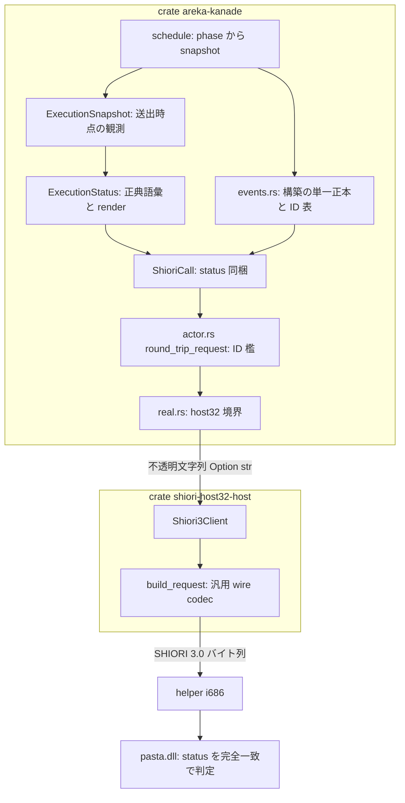
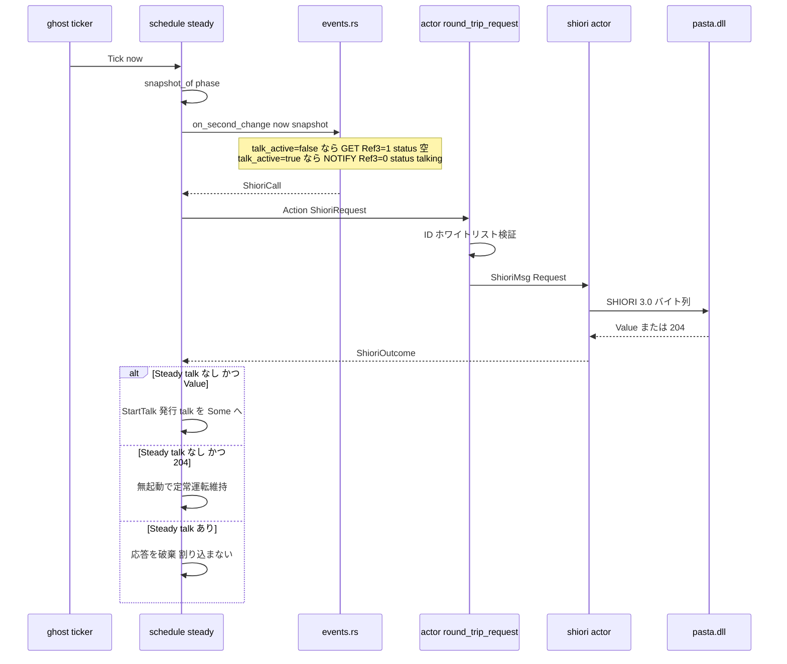
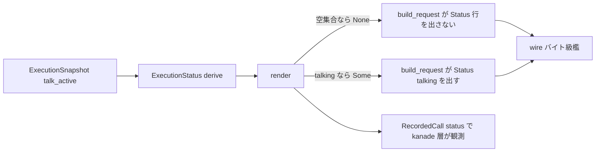
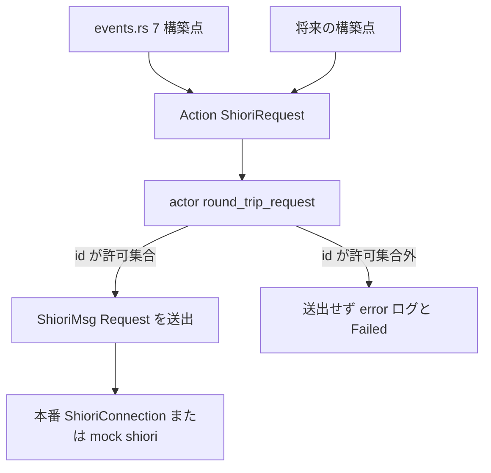

# 技術設計書: areka-P0-idle-talk

## Overview

**Purpose**: 「放っておくと喋り出す」という伺かの基本体裁を、emo2 の脳 pasta.dll に対して実物として成立させる。自発会話の背骨（毎秒 pump・GET→トーク起動・talk 中 NOTIFY 破棄）は `completed/areka-P0-kanade` で既に配線済みであり、本設計は**新規経路を作らない**。既存の OnSecondChange リクエストを ukadoc 正典どおりの Reference（Ref0〜3）＋ **`Status` 共通ヘッダ**へ充足させ、送出イベント ID 集合を檻で固定し、実機サインオフで人間が発火を確認する。

**Users**: pasta.dll（`Status` を読んで自発会話の発火を制御する消費者）、`areka-P0-status-execution-states`／`areka-P0-choice-select-events`（本設計が確立する `Status` 語彙・送出契約の下流消費者）、および mock 観測ハーネスによる開発者検証。

**Impact**: 本 spec の実作業の中心は **`Status` ヘッダの層貫通**である。ギャップ分析（research §3）の反証どおり、`Status` を通す経路は今日どの層にも存在せず、**4クレート（`areka-kanade`／`shiori-host32-host`／`areka-ghost`／`areka`）にまたがる破壊的 API 変更**を要する（要件ディスカッション #1 で受容済みコスト）。Reference 充足（Req1.1〜1.5）は既に実装・単体テスト済みであり、本設計では**契約の集中と差替シームの明示**に縮退する。

### Goals

- OnSecondChange の `Status` ヘッダを ukadoc `Status [SSP拡張]` の**実行状態語彙全体**（10 状態）で第一級表現し、M1 は `talking` のみを運行状態から実導出する（Req2）
- 送出時点の**単一スナップショット**から Reference3 と `Status` の双方を導出し、両者の不整合クラスを構造的に消す（Req1.4/1.5・Req2.4/2.7）
- 送出イベント ID を確定ホワイトリストへ限定し、`OnTalk`/`OnHour` の恒久不送出を**全 `ShioriCall` 構築点を被覆する**チョークポイントで固定する（Req3）
- 既存 pump 調停（GET→talk・204 無起動・NOTIFY 破棄・完了復帰）を回帰檻として明示する（Req4）
- 実 sleep・実時計・実 32bit helper 無しに全リクエスト生成経路を決定論検証する（Req5）
- 実 emo2・実 pasta.dll の放置で自発トークが発火することを人間がサインオフする（Req6）

### Non-Goals

- 見切れ／重なりの**実測値算出**（Ref1/Ref2 は M1 固定 `"0"`＋差替シームのみ）
- `Status` 残9状態の**実導出**（`choosing`＝`areka-P0-choice-select-events`／他＝`areka-P0-status-execution-states`）
- 入力イベント（OnMouseMove 等）の送出（`areka-P0-input-events`）
- トーク再生タイミングの正しさ（`completed/areka-P0-cue-playback-duration` が所有・2026-07-17 サインオフ済み）
- `secondchangeinterval` 等の発火間隔設定（プラグイン領分・M1 外）／Reference4（SSP のみ・OS レベル放置秒）
- `OnTalk`/`OnHour` の送出（**恒久禁止**）

## Boundary Commitments

### This Spec Owns

- **`Status` 実行状態語彙の正本**: `ExecutionState`（ukadoc 全10状態）／`ExecutionStatus`（カンマ連結の状態集合）／`ExecutionSnapshot`（送出時点の観測スナップショット＝Status と Reference の共通の源）。下流 spec は本語彙を**消費・拡張**するが再定義しない
- **`Status` 送出契約**: カンマ連結書式・正典順・**空集合→ヘッダ行そのものを省略**・wire 上の位置（`Sender:` の後・`ID:` の前）
- **OnSecondChange の Reference 表**: Ref0＝OS 連続起動時間 hour・Ref1/Ref2＝M1 固定 `"0"`＋差替シーム・Ref3＝トーク再生可否
- **送出イベント ID のホワイトリスト**と、その egress チョークポイント檻（`OnTalk`/`OnHour` 恒久不送出）
- **`ShioriCall`／`ShioriBackend`／`ShioriRequest`／`build_request` の `Status` 貫通形**（共有型の shaper＝roadmap W1「契約正本の先鋒」）
- **決定論観測面の拡張**: `RecordedCall.status`（kanade 層の有無と値）＋ `build_request` のバイト級檻（wire 層の行省略）

### Out of Boundary

- **残9実行状態の実導出**（源サブシステム着地時に台帳 spec が差し替える）。本 spec は語彙保持＋非アクティブ縮退＋シームのみを所有する
- **見切れ／重なりの実測**と、それを運ぶ Tick 付帯（UI スレッド geometry の配線）
- **トーク配送・再生**（sakura／emo-text／dispatcher）／talk 再生品質
- **毎秒 Tick の供給機構**（`completed/areka-P0-ghost-setup` の ticker が絶対グリッド整列で供給。本 spec は受領した Tick の**中身の充足**のみを扱う）
- **`build_request` の `SecurityLevel` 位置**: 実 SSP と ukadoc は `SecurityLevel` を `ID` より前に置くが、現実装は末尾に置く（既存逸脱）。本 spec は `Status` の位置のみを扱い、この既存逸脱は**修正しない**（研究ログ §10.4 に記録・`areka-P0-emo2-conformance-e2e` の適合検証が引受先候補）
- **既知の隣接欠陥 `unknown_talk_done talk_id=1`**（起動挨拶の talk_id を kanade が追跡せず TalkDone が無照合 slot へ到着＝非致命 ERROR・research §9.6）。kanade 領分だが本 spec の要件に無く、Req6 にも影響しない＝**「ついでに」吸収しない**

### Allowed Dependencies

- `areka-talk`（talk 契約型の物理正本）・`areka-actor`（spawn/reply 規約）・`tracing`・`std` のみ。**新規外部依存なし・tokio 禁止**
- `shiori-host32-host`（`Shiori3Client`／`RequestError` 等）——**`areka-kanade` 内では `shiori/real.rs` モジュールのみ**が import してよい（`completed/areka-P0-kanade` のモジュール内制約を継承）
- **依存方向（左から右へのみ）**: `status.rs`（std のみ・host32/areka-actor 非依存） → `msg.rs` → `schedule/events.rs` → `schedule/{boot,steady,close,mod}.rs` → `actor.rs` → `shiori/real.rs` → `shiori-host32-host`
- **語彙の非漏洩**: `shiori-host32-host` は `Status` の**値を解釈しない**。`Option<&str>` を verbatim 転記する汎用 wire codec に留める（`shiori3.rs:16` の汎用ビルダ原則を保存）

### Revalidation Triggers

| 変更 | 再検証が要る消費者 |
|---|---|
| `ExecutionState`／`ExecutionStatus` の語彙・render 書式・正典順の変更 | `areka-P0-status-execution-states`（台帳）・`areka-P0-choice-select-events`（`choosing`） |
| `ExecutionSnapshot` のフィールド追加（＝状態の実導出解禁・Ref1/Ref2 実測） | **消費側互換の実測検証が必須**（下記 DD-IT-9 の fail-open・Req2.6 ただし書き） |
| `ShioriCall::{Get,Notify}` の形状変更 | `areka-P0-input-events`（`on_mouse_*` 構築）・`areka-P0-position-persist`（`on_first_boot` Ref0） |
| `ShioriBackend::get/notify` の署名変更 | `areka-ghost`（`runtime.rs`・`spine_e2e_test.rs`）・`areka`（`emo2_boot/spine.rs`）＝実装5箇所 |
| `ShioriRequest`／`build_request` のヘッダ集合・順序の変更 | `shiori-host32-host` の全 wire 檻・実 pasta 適合 |
| `ALLOWED_EVENT_IDS` への ID 追加 | `areka-P0-input-events`（マウス2種を許可集合へ追加する側）・`areka-P0-choice-select-events`（選択肢カスケード） |

## Architecture

### Existing Architecture Analysis

kanade は**純粋状態機械＋アクターシェル＋メッセージ境界差し替え**の三層構造をとる（`completed/areka-P0-kanade`）。本設計はこの構造を保存したまま、`Status` を層貫通させる。

**実測した現状**（2026-07-17・`origin/main` `dd888f2f` 時点。ギャップ分析 §3 の反証は今日の main でも有効）:

| 層 | ファイル:行 | 現状 | 本設計の扱い |
|---|---|---|---|
| 契約語彙 | （不在） | `Status` を表す型が無い | **新設** `status.rs` |
| 境界メッセージ型 | `areka-kanade/src/msg.rs:80-89` | `ShioriCall::{Get,Notify}{id, references}`・derive 無し | `status: ExecutionStatus` 追加 |
| 構築正本 | `areka-kanade/src/schedule/events.rs:35-111` | 6 ID の純粋構築関数群（Ref0〜3 は既に正典充足） | 全関数へスナップショット引数・`on_close_notify` 増設・ID 表 |
| 状態機械 | `schedule/steady.rs:55-125`・`mod.rs:160-175` | pump 調停は DD-6 完全実装済み。**`force_quit` のみ events 表外で inline 構築** | phase→スナップショット供給・inline 構築を events へ委譲 |
| egress | `actor.rs:111-113, 146-149` | `round_trip_request` が `Action::ShioriRequest` の唯一の出口 | **ID 檻のチョークポイント**＋wire 観測ログ |
| backend 抽象 | `shiori/real.rs:47-56` | `ShioriBackend::{get,notify,unload,status}`・実装5箇所 | `get/notify` へ status 引数 |
| SHIORI client | `shiori-host32-host/src/client.rs:115-158` | `ShioriRequest` を全フィールド明示で構築 | status を通す |
| wire codec | `shiori-host32-host/src/shiori3.rs:58-118` | **固定ヘッダ集合**・任意ヘッダ注入機構なし | `status` フィールド＋`Status:` 行発行 |
| 観測ハーネス | `areka-kanade/tests/kanade/common/mod.rs:74-100` | `RecordedCall{method,id,references}` | `status` 観測フィールド |

**既存の決定論資産は不変に保つ（additive 拡張のみ）**: events.rs の Reference 単体テスト・steady.rs の DD-6 実装・steady_test.rs の統合テスト。

### Architecture Pattern & Boundary Map

**Selected pattern**: 層貫通の第一級フィールド（研究 §4 Option A）＋ **host32 は不透明文字列**。語彙の権威は kanade に集中し、wire codec は汎用のまま保つ。



**Architecture Integration**:
- **Domain/feature boundaries**: 語彙と導出＝kanade／転記と整形＝host32／解釈＝pasta。`shiori-host32-host` は `Status` の値を**知らない**
- **Existing patterns preserved**: 純粋状態機械（副作用は Action へ）／events.rs の「構築の単一正本」／`shiori/real.rs` を唯一の host32 import 点とするモジュール内制約／汎用 wire ビルダ原則
- **New components rationale**: `status.rs` 1 モジュールのみ新設。理由＝`Status` は SHIORI リクエストの共通属性であり、`talk.rs`（talk 契約）と同じく **std のみに依存する契約型**として独立させると下流 spec が安全に消費・拡張できる
- **Steering compliance**: Rust 2024・新規依存なし・tokio 不使用・`tracing` 構造化ログ（`logging.md`）・正典は ukadoc（`ukadoc-mcp-preferred-source`）

### 設計判断

| ID | 判断 | 決定 | 根拠 |
|---|---|---|---|
| **DD-IT-1** | `Status` シームの形（研究 §4 Option A/B/C） | **Option A**＝各層の型へ第一級フィールドを追加。host32 へは `Option<&str>` の不透明文字列で渡す | Option C（共通ヘッダ束）は M1 で**単一メンバ**ゆえ過剰（synthesis の簡素化レンズ）。Option B（OnSecondChange 専用）は「共通ヘッダ」という要件語彙と乖離し、かつ**どのみち host32 改変は必須**（研究 §3 反証）ゆえ最小侵襲の利得が無い |
| **DD-IT-2** | 命名 | 語彙＝`ExecutionState`／集合＝`ExecutionStatus`／源＝`ExecutionSnapshot`。host32 側は wire 名 `status` を保つ | `ShioriBackend::status() -> HelperStatus`（`real.rs:55`＝helper 死活）と**無関係な既存名**が衝突する。`areka/src/emo2_boot/spine.rs` の `RecordedCall::Status`（同じく helper 死活）とも別語彙。host32 クレート内には衝突が無く、wire 名一致が読み手に親切 |
| **DD-IT-3** | Ref3 と `Status` の源 | **単一の `ExecutionSnapshot`** から両方を導出（`talk_playable = !snapshot.talk_active`・`Status.talking = snapshot.talk_active`） | 今日は同じ `Steady{talk}` を2度読む形。単一入力化で「Ref3=`"1"` かつ `Status: talking`」という**不整合の組み合わせを型で表現不能**にする |
| **DD-IT-4** | ForceQuit 時 OnClose の `Status`（Req3.1 が design 送り） | **例外規則を作らない**＝スナップショットは常に**送出時点の phase** から作る。`force_quit` は `Phase::Unloading{Forced}` へ遷移**後**に構築するため talk 非アクティブ＝**行省略** | 「Status ＝送出時点の運行状態スナップショット」という単一規則を全構築点へ例外なく適用できる。結果として強制終了が `talking` を主張しない（＝トークを放棄する経路で再生継続を主張しない）安全側にも一致 |
| **DD-IT-5** | 空集合の表現 | `ExecutionStatus::render() -> Option<String>`（`None` ⇔ 空集合）＝**ヘッダ行そのものを省略**。空値 `Status:` は送らない | **実 SSP 捕獲ログで裏取り済み**（下記 §実 wire 証拠）。研究 §8 が参照した `ayame.log` はリポジトリに存在せず、`vendors/pasta/crates/pasta_shiori/doc/shiori-sample.log`（SSP 2.3.86・903 メッセージ）が実 wire の正本 |
| **DD-IT-6** | `Status` の wire 位置 | `Sender:` の後・`ID:` の前 | 実 SSP の観測順は `Charset→Sender→SecurityLevel→Status→ID→Reference*` で**一貫**（`shiori-sample.log:1307-1318`）。`Status` が `ID` より前という関係を保存する。`SecurityLevel` の既存逸脱には触れない（Out of Boundary） |
| **DD-IT-7** | ID 檻のチョークポイント | **`actor.rs::round_trip_request`**（要件 3.1 の推奨 `handle_call`／`run_shiori_loop` から**変更**） | 要件の推奨は前提が実測と食い違う。統合ハーネスの mock（`tests/kanade/common/mod.rs:255`）は **`ShioriMsg` チャネル層で shiori アクター丸ごとを差し替え**、`ShioriBackend`／`handle_call` を**通らない**。`round_trip_request`（`actor.rs:146`）は `Action::ShioriRequest` の唯一の出口で**本番・mock 双方が必ず通る**＝Req3.1 の規範節「全 `ShioriCall` 構築点を被覆」を真に満たす唯一点 |
| **DD-IT-8** | `force_quit` の stale 注記（Req3.1 が design 送り） | `events::on_close_notify(reason, &snapshot)` を**新設**し委譲。events.rs を構築の**単一列挙点**へ回復 | `mod.rs:161-164` の「events.rs 実装後は委ねる」注記は events.rs 実在の今も未実行。委譲不能だった理由は実測で判明＝`events::on_close` は **GET** を返すが force_quit は **NOTIFY** を要する。NOTIFY 版の増設で解消する |
| **DD-IT-9** | パラメータ付き状態の下位書式 | **ukadoc 正典（内部 `/` 区切り）を採用**。実 SSP の `,` 差異は台帳 spec へ申し送り | 正典 `balloon(0=2/1=0)` に対し実 SSP 2.3.86 は `balloon(0=2,1=0)` を送る（`shiori-sample.log:3727`）。後者は**トップレベルのカンマと衝突**し `split(',')` を壊す＝曖昧。正典の `/` は自己無矛盾。steering「正典は ukadoc」に従う。**M1 は両状態とも非アクティブ＝送出せず＝実害ゼロ** |
| **DD-IT-10** | Ref1/Ref2 の差替シーム（Req1.6） | events.rs の名前付き定数＋シーム注記。実測供給時は `ExecutionSnapshot` へフィールドを足す＝**Status 残状態と同一シーム** | 要件が「Reference1/Reference2 と同型」（Req2.5）と言う関係を**文字どおり同一の口**で実現する。構築が events.rs 一点に集中しているため、値の差替は Reference 連番・ヘッダ構成を変えない |
| **DD-IT-11** | 檻違反の失敗語彙（設計ディスカッション #1・2026-07-17 開発者裁定「あるべき正しい姿・シンプルに誠実に」） | `ShioriFailure` へ `Internal(String)` を **1 variant のみ**追加（`#[error("kanade internal violation: {0}")]`）。檻違反は `Failed(Internal)` で返す。`map_error` は不変＝`Internal` は境界写像が**決して生成しない** variant（kanade 内部でのみ構成） | `Shiori` は「SHIORI エラー応答」の境界写像（`msg.rs:117-119`）であり、**未送出**の内部バグに使うのは範疇錯誤——kanade Req6.1 の区別語彙を汚染し、input-events の whitelist 追加漏れが「pasta のエラー」と誤診される。先例は実在＝`SessionError::RequestInFlight`（利用規律違反・`areka/src/shiori_session.rs:48-61`）／`UiSpawnError`（「検出可能な前提違反を error! 記録のうえ返す予約型」・`areka-actor/src/ui.rs:165-177`）＝発明でなく既存規律への合流。爆風実測＝破壊は cfg(test) `describe`（`real.rs:257`）1箇所＋テスト記述子 `FailKind` の追随のみ・本番消費2箇所（`mod.rs:235,254`）は `%failure`（Display）経由で**無改変** |

### 実 wire 証拠（本設計の裏取り・一次確認済み）

`vendors/pasta/crates/pasta_shiori/doc/shiori-sample.log`（実 SSP 2.3.86 捕獲・39 OnSecondChange ブロック）:

- **アイドル時＝`Status` 行が無い**（`:2291-2300`）: `GET`／`Charset`／`Sender`／`SecurityLevel`／`ID: OnSecondChange`／`Reference0..4`。空値 `Status:` **ではなく行そのものが不在** → Req2.3 を実物が裏付ける
- **talk 中＝`Status: talking,balloon(0=0)`＋`Reference3: 0`＋NOTIFY**（`:1307-1318`）→ ukadoc の NOTIFY 規則と一致
- **観測された全 `Status` 値は6種のみ**: `balloon(0=0)`／`talking,balloon(0=0)`／`talking`／`choosing,balloon(0=2,1=0)`／`talking,choosing,balloon(0=2)`／`talking,choosing,balloon(0=2,1=0)` → **全て正典の語彙定義順**（talking → choosing → balloon）＝本設計の「正典順で連結」を実物が裏付ける

pasta 側の消費（`vendors/pasta/crates/pasta_lua/scripts/pasta/shiori/event/virtual_dispatcher.lua`）:

- 抑制ゲートは `if act.req.status == "talking" then return nil`（**`:98` の `check_hour`／`:123` の `check_talk`**）＝**完全一致比較**。値は `pasta_shiori/src/lua_request.rs:110` で生文字列のまま転記され、集合として解釈されない
- **OnSecondChange の Reference を pasta は一切読まない**（`second_change.lua:14-18` はディスパッチのみ／dispatcher が読むのは `req.date.unix` と `req.status` の2つだけ）→ **Ref1/Ref2 の M1 固定 `"0"` は emo2 適合を毀損しない**ことをギャップ分析の fixture grep に加えて**消費側コードで再確認**した

### Technology Stack

| Layer | Choice / Version | Role in Feature | Notes |
|-------|------------------|-----------------|-------|
| Language / Runtime | Rust 2024・`std` のみ | 純粋関数＋状態機械＋アクター | 新規依存なし・tokio 不使用 |
| Messaging / Events | `areka-actor`（既存規約）・`std::sync::mpsc` | `ShioriMsg` 境界・reply 往復 | 差し替えは型レベル（trait 不要） |
| Wire / Protocol | SHIORI/3.0（`shiori-host32-host`・自前 codec） | `Status` ヘッダの発行 | 任意ヘッダ機構は導入せず `status` 単一フィールド |
| Observability | `tracing`（`logging.md` 規約） | egress の `trace!`・違反の `error!` | `target: "kanade"`（既存慣行） |
| 正典 / 検証資産 | ukadoc MCP・実 SSP 捕獲ログ・emo2 fixture＋実 pasta.dll | 契約の裏取り・実機サインオフ | emo2 は最小適合 fixture であって聖典ではない |

## File Structure Plan

### 新規ファイル

```
crates/areka-kanade/src/
└── status.rs   # Status 実行状態語彙の正本（std のみ・host32/areka-actor 非依存）
                #   ExecutionState / OpeningKind(s) / BalloonBinding(s)
                #   ExecutionStatus（集合・正典順・render）
                #   ExecutionSnapshot（送出時点の観測＝Status と Reference の共通の源）
                #   in-source #[cfg(test)]: 語彙 render 檻・空集合檻・derive 全入力空間檻
```

### 変更ファイル

| ファイル | 変更内容 |
|---|---|
| `crates/areka-kanade/src/lib.rs` | `pub mod status;`＋`ExecutionSnapshot`/`ExecutionState`/`ExecutionStatus` 再エクスポート。`events` ファサードへ `on_close_notify`・`ALLOWED_EVENT_IDS`・`is_allowed_event_id` を追加 |
| `crates/areka-kanade/src/msg.rs` | `ShioriCall::{Get,Notify}` へ `status: ExecutionStatus` を追加（共通ヘッダ＝全構築点が Status を明示する）。`ShioriFailure` へ `Internal(String)` variant 追加（DD-IT-11）＋enum doc を「外部4語彙＝`RequestError` 境界写像・`Internal` のみ kanade 内部構成」へ更新＋Display 語彙テスト（`:173-185`）へ 1 行追加 |
| `crates/areka-kanade/src/schedule/events.rs` | 全構築関数が `&ExecutionSnapshot` を取る。`on_second_change(now, snapshot)` が Ref3 と Status を**単一入力から**導出。`on_close_notify(reason, snapshot)` 新設（DD-IT-8）。Ref1/Ref2 を名前付き定数＋シーム注記へ。`ALLOWED_EVENT_IDS` 表＋`is_allowed_event_id` |
| `crates/areka-kanade/src/schedule/mod.rs` | `fn snapshot_of(phase: &Phase) -> ExecutionSnapshot`（`Steady{talk: Some}` のみ `talk_active=true`）。`force_quit` の inline 構築（`:170-173`）を `events::on_close_notify` へ委譲し stale 注記（`:161-164`）を解消 |
| `crates/areka-kanade/src/schedule/steady.rs` | `on_second_change`／`begin_close` の呼出へスナップショットを供給（`talk_playable` 引数は廃止） |
| `crates/areka-kanade/src/schedule/boot.rs` | `events::` 呼出（`:44,58,69,121`）へスナップショット供給（boot 系列は構造上 talk 非アクティブ） |
| `crates/areka-kanade/src/actor.rs` | `round_trip_request`（`:146`）に **ID ホワイトリスト檻**（違反＝送出せず `error!`＋`Failed`）と wire 観測 `trace!(event="shiori_request")`（Req6.2 の証跡）を追加 |
| `crates/areka-kanade/src/shiori/real.rs` | `ShioriBackend::{get,notify}` へ `status: Option<&str>` 追加。`ShioriConnection` impl が `Shiori3Client` へ転送。`handle_call`（`:99-111`）が `ExecutionStatus::render()` の結果を forward。in-source `describe`（`:257`・cfg(test)・ワークスペース唯一の `ShioriFailure` 網羅 match）へ `Failed(Internal)` アーム追加 |
| `crates/shiori-host32-host/src/shiori3.rs` | `ShioriRequest` へ `status: Option<&'a str>`。`build_request` が `Sender:` の後・`ID:` の前に `Status: <v>\r\n` を発行（`None` は行ごと省略） |
| `crates/shiori-host32-host/src/client.rs` | `Shiori3Client::{get,notify}`（`:115,143`）へ `status: Option<&str>` を追加し `ShioriRequest` 構築へ渡す |
| `crates/shiori-host32-host/tests/shiori_request_e2e.rs` | `Shiori3Client::{get,notify}` 呼出（`:228,240,339`）へ `None` 追加＝署名追随 |
| `crates/shiori-host32-host/tests/lifecycle_kill_e2e.rs` | 同（`:240,286`） |
| `crates/shiori-host32-host/tests/lifecycle_cyclic_e2e.rs` | 同（`:241,251,379`） |
| `crates/areka-ghost/src/runtime.rs` | `FakeShioriBackend`（`:464`）の署名追随 |
| `crates/areka-ghost/tests/ghost/spine_e2e_test.rs` | `ScriptedShioriBackend`（`:138`）の署名追随 |
| `crates/areka/src/emo2_boot/spine.rs` | `ScriptedShioriBackend`（`:157`）の署名追随 |
| `crates/areka-kanade/tests/kanade/common/mod.rs` | `RecordedCall` へ `status: Option<String>`（render 済み wire 値）。`from_call`（`:84-100`）が写す。テスト記述子 `FailKind`（`:301,314`）へ `Internal` を追加（記述子は `ShioriFailure` でなく `FailKind` を match するため**追随しないと網羅檻が黙って嘘になる**・DD-IT-11） |
| `crates/areka-kanade/tests/kanade/failure_test.rs` | `FailKind` 檻を 5 語彙へ（`:66` の「4 語彙を静的に網羅」注記の更新・`:75-80` witness へ `Internal` アーム・`Failed(Internal)`→fault 経路の檻を追加） |
| `crates/areka-kanade/tests/kanade/steady_test.rs` | 期待値構築を `expected_call(events::on_second_change(..))` へ寄せ、Status/ID 檻を additive 追加 |
| `crates/areka-kanade/tests/kanade/close_test.rs` | `force_quit_onclose_notify`（`:560-565`）の期待値を `events::on_close_notify` 由来へ |

> **機械的追随の適用範囲は 4 型**（`ShioriCall`／`ShioriRequest`／`Shiori3Client`／`ShioriFailure`）。内訳＝`ShioriCall` の残りの構築・分解点（`msg.rs`／`actor.rs`／`real.rs` の in-source テスト等）／`ShioriRequest` の構造体リテラル 7 箇所（`shiori3.rs:363,386,403,425,442,458,474`＝in-source テスト・`status: None` 追加）／`Shiori3Client::{get,notify}` の e2e 呼出 8 箇所（上表の host32 tests 3 ファイル）／`ShioriFailure::Internal` の破壊点＝cfg(test) `describe`（`real.rs:257`）**1箇所のみ**（`cargo build` は緑のまま・`cargo test` が捕捉）＋コンパイラが捕捉**しない** `FailKind` 記述子の意図的追随（上表）。いずれも機械的である。`ShioriCall` に derive が無い（`msg.rs:80`）ため比較は既存の手動 destructure 方式を踏襲する。

## System Flows

### Flow A: 定常運転の pump と Status 導出（Req1・2・4）



**Flow レベルの決定**: GET/NOTIFY の別・Ref3・`Status.talking` は**すべて同一のスナップショット**から出る（DD-IT-3）。talk 中に Value が届く経路は NOTIFY 化で**発生源から断たれる**（DD-6）ため、`Steady{Some}`＋Value は防御的 warn＋破棄に留まる。

### Flow B: 空集合 → ヘッダ行省略（Req2.3・観測の二層）



**Flow レベルの決定**: kanade の mock は `ShioriMsg` 層に居るため `None` までしか見えず、「**wire に行が出ない**」ことは観測できない。ゆえに檻は二層（`RecordedCall.status` ＋ `build_request` のバイト級 assert）。

### Flow C: 送出 ID の egress 檻（Req3）



**Flow レベルの決定**: 檻は**二重**である。① `events.rs` を構築の単一列挙点へ回復し（DD-IT-8）表を純データ檻で固定する。② egress チョークポイントが**現在・将来の全構築点**を構造的に被覆する（Req3.1 の規範節）。`OnTalk`/`OnHour` は表に無く、かつ檻に阻まれる。

## Requirements Traceability

| Requirement | Summary | Components | Interfaces | Flows |
|-------------|---------|------------|------------|-------|
| 1.1 | 定常運転の Tick で OnSecondChange を GET 送出 | `schedule/steady.rs`（既存）・`events.rs` | `on_second_change` | A |
| 1.2 | Ref0＝注入時刻源から OS 連続起動時間 hour | `events.rs`（`MS_PER_HOUR`・既存） | `MonotonicMs` | A |
| 1.3 | Ref1/Ref2＝`"0"` 固定 | `events.rs` 名前付き定数 | — | A |
| 1.4 | 再生可能時 Ref3=`"1"` | `events.rs` | `ExecutionSnapshot::talk_active` | A |
| 1.5 | 再生中 Ref3=`"0"` | `events.rs` | 同上 | A |
| 1.6 | Ref1/Ref2 の実測差替シーム（契約不変） | `events.rs` 定数＋シーム・`ExecutionSnapshot` | `ExecutionSnapshot` | — |
| 2.1 | 正典語彙全10状態＋下位書式の表現 | `status.rs`：`ExecutionState`・`OpeningKinds`・`BalloonBindings` | `render` | B |
| 2.2 | アクティブ全状態を正典順でカンマ連結 | `status.rs`：`ExecutionStatus` | `render` | A・B |
| 2.3 | 空集合→ヘッダ行を省略 | `status.rs`・`shiori3.rs` `build_request` | `render -> Option<String>`・`ShioriRequest::status` | B |
| 2.4 | `talking` を `Steady{talk}` から実導出 | `schedule/mod.rs` `snapshot_of`・`status.rs` `derive` | `ExecutionSnapshot` | A |
| 2.5 | 残9状態は語彙保持のまま非アクティブ縮退＋シーム | `status.rs` 導出表 | `ExecutionSnapshot` の将来フィールド | — |
| 2.6 | 契約不変の実値差替（＋fail-open ただし書き） | `status.rs` 導出表・Revalidation Triggers | `ExecutionSnapshot` | — |
| 2.7 | アイドル時に `talking` を送出しない | `snapshot_of`・`derive` | — | A・B |
| 3.1 | 送出 ID をホワイトリストへ限定（全構築点被覆） | `events.rs` `ALLOWED_EVENT_IDS`＋`on_close_notify`・`actor.rs` チョークポイント | `is_allowed_event_id` | C |
| 3.2 | `OnTalk`/`OnHour` を恒久不送出 | 同上 | 同上 | C |
| 3.3 | 自発会話の発火時も新規 ID を送出しない | `schedule/steady.rs` `on_reply`（既存） | `StartTalk` | A・C |
| 4.1 | GET Value → トーク起動 | `schedule/steady.rs`（既存） | `StartTalk` | A |
| 4.2 | 204 → 無起動で定常維持 | `schedule/steady.rs`（既存） | — | A |
| 4.3 | 再生中は NOTIFY・応答スクリプト破棄 | `schedule/steady.rs`（既存）・`events.rs` | `on_second_change` | A |
| 4.4 | 完了後の次 Tick から pump 再開 | `schedule/steady.rs` `on_talk_done`（既存） | — | A |
| 5.1 | 注入 Tick＋mock のみで全経路検証 | 既存ハーネス（`tests/kanade/common`） | `spawn_harness*` | — |
| 5.2 | 時刻源の注入と Ref0 の決定論検証 | `MonotonicMs`（既存） | `Tick{now}` | — |
| 5.3 | Method・Ref0〜3・Status の有無と値・ID 集合の観測 | `RecordedCall.status`＋`build_request` バイト級檻 | `RecordedCall` | B |
| 6.1 | 実機で自発トーク（OnTalk 由来）が発火 | 実機サインオフ手順・既存 `steady_talk` ログ | — | — |
| 6.2 | 再生中 Tick の NOTIFY・Ref3=`"0"`・`Status: talking` をログ/wire で観測 | `actor.rs` `trace!(event="shiori_request")` | — | C |
| 6.3 | 合否は「自発トークの発火」に限定 | 実機サインオフ手順 | — | — |

## Components and Interfaces

| Component | Domain/Layer | Intent | Req Coverage | Key Dependencies (P0/P1) | Contracts |
|-----------|--------------|--------|--------------|--------------------------|-----------|
| `status.rs` | kanade / 契約語彙 | `Status` 実行状態語彙と送出契約の正本 | 2.1–2.7, 1.4–1.6 | `std` のみ (P0) | State |
| `events.rs` | kanade / 構築正本 | ukadoc Reference 表＋Status＋許可 ID 表の単一実装点 | 1.1–1.6, 2.2–2.4, 2.7, 3.1, 3.2 | `status.rs` (P0), `msg.rs` (P0) | Service |
| `schedule/{mod,steady,boot}.rs` | kanade / 状態機械 | phase → スナップショット供給・pump 調停 | 2.4, 2.7, 3.1, 4.1–4.4 | `events.rs` (P0) | State |
| `actor.rs` egress | kanade / アクターシェル | 送出 ID 檻と wire 観測ログ | 3.1, 3.2, 6.2 | `events.rs` (P0) | Service |
| `shiori/real.rs` | kanade / 境界 | `ExecutionStatus` を不透明文字列へ落として host32 へ渡す | 2.2, 2.3 | `shiori-host32-host` (P0) | Service |
| `shiori3.rs` / `client.rs` | host32 / wire codec | `Status` 行の発行（値は解釈しない） | 2.3, 5.3 | — | API |
| `RecordedCall` | kanade / 観測 | kanade 層の Status 有無と値の観測 | 5.3 | ハーネス (P0) | State |

### kanade / 契約語彙

#### `status.rs`

| Field | Detail |
|-------|--------|
| Intent | ukadoc `Status [SSP拡張]` の実行状態語彙と、その送出契約（正典順・カンマ連結・空集合→省略）の正本 |
| Requirements | 2.1, 2.2, 2.3, 2.4, 2.5, 2.6, 2.7, 1.4, 1.5, 1.6 |

**Responsibilities & Constraints**
- 正典の**全10状態**を第一級の variant として保持する（M1 で送らない状態も語彙から除外しない）
- 状態集合 → wire 文字列の写像を**唯一**所有する。`None` は「ヘッダ行を出さない」を意味する
- `std` のみに依存する（host32 型・areka-actor 型に非依存）。将来の契約クレート切り出しは機械的移動で済む（`talk.rs` と同じ規律・DD-1）
- **不変条件**: `ExecutionStatus` の状態列は常に正典順・重複なし（`derive` が構成で保証する）

**Dependencies**
- Inbound: `schedule/mod.rs` — phase からスナップショットを供給（P0）／`events.rs` — 導出と render（P0）
- Outbound: なし（葉）
- External: なし

**Contracts**: Service [ ] / API [ ] / Event [ ] / Batch [ ] / State [x]

##### State Management

```rust
/// ukadoc `Status [SSP拡張]` の実行状態語彙（正典全10状態を第一級保持）。
/// M1 で実導出するのは `Talking` のみ。残9状態は語彙に留め、非アクティブへ縮退する（Req2.5）。
pub enum ExecutionState {
    Talking,
    Choosing,
    Minimizing,
    Induction,
    Passive,
    TimeCritical,
    NoUserBreak,
    Online,
    /// `opening(種類)` — 種類は `/` 区切りで列挙（正典例 `opening(communicate/input/teach/dialog)`）
    Opening(OpeningKinds),
    /// `balloon(ID群)` — `charID=balloonID` を `/` 区切りで列挙（正典例 `balloon(0=2/1=0)`）
    Balloon(BalloonBindings),
}

/// `opening(種類)` の種類集合（`/` 区切り列挙）。空集合は `Opening` 自体を非アクティブとする。
pub struct OpeningKinds(Vec<OpeningKind>);

/// 正典が列挙する入力ボックス等の種類。ukadoc の例示が閉集合である保証が無いため拡張シームを持つ。
#[non_exhaustive]
pub enum OpeningKind { Communicate, Input, Teach, Dialog }

/// `balloon(ID群)` の束縛集合（`/` 区切り列挙）。空集合は `Balloon` 自体を非アクティブとする。
pub struct BalloonBindings(Vec<BalloonBinding>);

/// `charID=balloonID` の 1 対。
pub struct BalloonBinding { pub character_id: u32, pub balloon_id: u32 }

/// `Status` ヘッダの値＝アクティブな実行状態の集合（正典順・重複なし）。
pub struct ExecutionStatus { /* private: Vec<ExecutionState> */ }

/// リクエスト送出時点のゴースト実行状態スナップショット。
/// `Status` 実行状態集合と OnSecondChange の Reference 値の**共通の源**であり、
/// 両者の不整合（例: Ref3="1" かつ `Status: talking`）を構造的に排除する（DD-IT-3）。
pub struct ExecutionSnapshot {
    /// トーク再生中か。源＝運行状態 `Phase::Steady{talk: Some(_)}`（Req2.4）。
    /// `Status: talking`（Req2.4/2.7）と Reference3（Req1.4/1.5）の双方を駆動する。
    pub talk_active: bool,
    // SEAM(Req1.6): 見切れ／重なりの実測供給時に `offscreen`／`overlapping` を追加する。
    //   源＝窓 geometry（UI スレッド）・運搬＝Tick 付帯。所有＝将来増分（本 spec 外）。
    // SEAM(Req2.5/2.6): 各実行状態の源が着地したらフィールドを 1 本追加し、導出表の該当行を差し替える。
    //   choosing        → areka-P0-choice-select-events
    //   balloon/minimizing/induction/passive/timecritical/nouserbreak/online/opening
    //                   → areka-P0-status-execution-states（台帳）
    //
    // NOTE(シームの実体＝「フィールド 1 本」では閉じない): 源が Phase の外にある状態
    //   （窓 geometry・Tick 付帯で運ばれる minimizing/balloon/opening・Ref1/Ref2）は
    //   `snapshot_of(&Phase)` の入力に届かないため、シーム発動時は**供給側の署名を広げる**
    //   （将来形 `snapshot_of(&Phase, &TickExtras)`）ことがシームに含まれる。
    //   Req1.6/2.6 が不変を保証するのは **wire 送出契約**（カンマ連結書式・ヘッダ位置・
    //   空集合→行省略・Reference 連番）であって内部シグネチャではない。
}

impl ExecutionSnapshot {
    /// 全実行状態が非アクティブなスナップショット（boot 系列・close 系列・ForceQuit 後）。
    pub const INACTIVE: ExecutionSnapshot = ExecutionSnapshot { talk_active: false };
}

impl ExecutionStatus {
    /// 単一の導出表（正典順の10行）。M1 は 1 行のみ実導出、残9行は非アクティブ確定＋シーム注記。
    pub fn derive(snapshot: &ExecutionSnapshot) -> ExecutionStatus;

    /// wire 値への写像。**`None` ⇔ 空集合 ⇔ `Status` ヘッダ行を出さない**（Req2.3・DD-IT-5）。
    /// `Some` のときは正典順でカンマ連結した値。
    pub fn render(&self) -> Option<String>;
}
```

- **Preconditions**: `derive` はスナップショットのみに依存する純関数（時刻・IO・グローバル状態を読まない）
- **Postconditions**: `derive(&ExecutionSnapshot::INACTIVE).render() == None`／`derive(&{talk_active: true}).render() == Some("talking")`
- **Invariants**: `render()` が `Some(v)` を返すとき `v` は空文字列でない。状態列は正典順・重複なし

**Implementation Notes**
- Integration: 導出表の 10 行は「行の存在」自体が語彙保持の表明である。非アクティブ行は Reference1/Reference2 の固定 `"0"`＋注記と**同型**の縮退であり、源着地時は `ExecutionSnapshot` へフィールドを 1 本足して当該行を差し替える（送出契約は不変）
- Validation: M1 の入力空間は `talk_active: bool` の**2状態のみ**＝`derive` は全入力空間を網羅テストできる（`deterministic-test-coverage-mandate`）
- Risks: **DD-IT-9 の fail-open**（下記 Risks 参照）。M1 が安全なのは縮退により wire が厳密に `talking` 単独になるためである

### kanade / 構築正本

#### `schedule/events.rs`

| Field | Detail |
|-------|--------|
| Intent | ukadoc Reference 表・`Status`・許可 ID 表の**単一実装点**（fixture・検証・実装が同一の正本を共有） |
| Requirements | 1.1, 1.2, 1.3, 1.4, 1.5, 1.6, 2.2, 2.3, 2.4, 2.7, 3.1, 3.2 |

**Responsibilities & Constraints**
- 全構築関数が `&ExecutionSnapshot` を受け取り、`ShioriCall` の `status` を**自ら導出する**（構築点が Status を忘れられない＝共通ヘッダの構造的強制）
- `on_second_change` は Ref3 と Status を**同一スナップショット**から導出する（DD-IT-3）
- 送出し得るイベント ID の**確定集合**を純データとして所有する

**Dependencies**
- Inbound: `schedule/{boot,steady,mod}.rs`（P0）・`actor.rs`（ID 表の参照・P0）・`tests/`（期待値の導出・P0）
- Outbound: `status.rs`（P0）・`msg.rs`（P0）
- External: なし

**Contracts**: Service [x] / API [ ] / Event [ ] / Batch [ ] / State [ ]

##### Service Interface

```rust
/// 送出し得るイベント ID の確定ホワイトリスト（Req3.1）。
/// `OnTalk`／`OnHour` は emo2 が OnSecondChange 内部で自発生成するため**恒久的に含めない**（Req3.2）。
pub const ALLOWED_EVENT_IDS: &[&str] = &[
    "OnInitialize", "OnFirstBoot", "OnBoot", "basewareversion", "OnSecondChange", "OnClose",
];

pub fn is_allowed_event_id(id: &str) -> bool;

/// Ref1（見切れ）の M1 固定値。SEAM(Req1.6): 実測供給時は `ExecutionSnapshot` の geometry から導出する。
const REF1_OFFSCREEN_M1: &str = "0";
/// Ref2（重なり）の M1 固定値。SEAM(Req1.6): 同上。
const REF2_OVERLAP_M1: &str = "0";

pub fn on_initialize(snapshot: &ExecutionSnapshot) -> ShioriCall;
pub fn on_first_boot(snapshot: &ExecutionSnapshot) -> ShioriCall;
pub fn on_boot(config: &KanadeConfig, snapshot: &ExecutionSnapshot) -> ShioriCall;
pub fn baseware_version(config: &KanadeConfig, snapshot: &ExecutionSnapshot) -> ShioriCall;

/// `OnSecondChange`。`snapshot.talk_active` が **GET/NOTIFY の別・Ref3・Status.talking を同時に**決める。
/// - 再生可能（`talk_active == false`）: GET・Ref3="1"・status 空（ヘッダ行なし）
/// - 再生中（`talk_active == true`）  : NOTIFY・Ref3="0"・status `talking`
pub fn on_second_change(now: MonotonicMs, snapshot: &ExecutionSnapshot) -> ShioriCall;

/// `OnClose`（GET・通常の close 握手）。
pub fn on_close(reason: CloseReason, snapshot: &ExecutionSnapshot) -> ShioriCall;

/// `OnClose`（**NOTIFY**・ForceQuit の best-effort 通知）。DD-IT-8: `mod.rs` の inline 構築を置き換える。
pub fn on_close_notify(reason: CloseReason, snapshot: &ExecutionSnapshot) -> ShioriCall;
```

- **Preconditions**: すべて純粋関数（副作用なし・引数のみに依存）
- **Postconditions**: 返る `ShioriCall` の `id` は必ず `ALLOWED_EVENT_IDS` の要素である
- **Invariants**: `on_second_change` の Reference 連番は `[Ref0, Ref1, Ref2, Ref3]` の 4 要素順で不変（Req1.6 の「送出契約を変えない」を構築点集中で担保）

**Implementation Notes**
- Integration: `M1 では「トーク再生可能」⇔「talk 非アクティブ」`。将来 talk 再生可否が talk 有無以外の条件を得た場合は、Reference3 の意味は `Status.talking` とは**別概念**であるため `ExecutionSnapshot` に別フィールドを設けて分岐させる（Revalidation Trigger）
- Validation: 既存 8 テストは additive 拡張（Status 検査を足す）で保存する
- Risks: なし（純データ・純関数）

### kanade / アクターシェル

#### `actor.rs` egress チョークポイント

| Field | Detail |
|-------|--------|
| Intent | kanade から SHIORI へ出る**唯一の出口**で送出 ID を検証し、wire 観測ログを残す |
| Requirements | 3.1, 3.2, 6.2 |

**Responsibilities & Constraints**
- `round_trip_request`（`actor.rs:146`）は `Action::ShioriRequest` の唯一の実行点であり、**本番・mock 双方が必ず通る**（DD-IT-7）
- 許可集合外の ID は **SHIORI へ送出しない**。`error!` を残し `ShioriOutcome::Failed` を返す（panic しない・宙吊りにしない）

**Dependencies**
- Inbound: `drive`（Action バッチ実行・P0）
- Outbound: `events::is_allowed_event_id`（P0）・`Sender<ShioriMsg>`（P0）
- External: `tracing`（P1）

**Contracts**: Service [x] / API [ ] / Event [ ] / Batch [ ] / State [ ]

##### Service Interface

```rust
/// GET／NOTIFY の同期往復。送出前に ID ホワイトリストを検証する（Req3.1・DD-IT-7）。
///
/// 許可集合外: 送出せず `error!(target:"kanade", event="event_id_not_allowed", id=%id)` を残し
///             `ShioriOutcome::Failed(ShioriFailure::Internal(..))` を返す（DD-IT-11・
///             状態機械は既存の fault 経路で処理＝檻専用の応答を発明しない）。
/// 許可集合内: `trace!(target:"kanade", event="shiori_request", method, id, references, status)` を残して送出。
fn round_trip_request(shiori: &Sender<ShioriMsg>, call: ShioriCall) -> ShioriOutcome;
```

- **Preconditions**: `call.id` は `&'static str`
- **Postconditions**: 許可集合外の ID は `ShioriMsg::Request` として**送出されない**
- **Invariants**: いかなる運行状態でも `OnTalk`／`OnHour` はチャネルへ出ない（Req3.2）

**Implementation Notes**
- Integration: `trace!` の `status` フィールドは `ExecutionStatus::render()` 済みの wire 値（`None` は欠落として観測可能）＝Req6.2 の実機証跡そのもの
- Validation: 判断分岐（許可／不許可）は入力依存ゆえ決定論檻の対象（`test-only-decision-branches-not-proven-wiring`）
- Risks: レベル選定＝OnSecondChange は毎秒＝高頻度ゆえ `trace!`（`logging.md`）。実機サインオフは `RUST_LOG=info,kanade=trace` で拾う

### host32 / wire codec

#### `shiori3.rs` `build_request` ＋ `client.rs`

| Field | Detail |
|-------|--------|
| Intent | `Status` ヘッダ行の発行。**値は解釈しない**（汎用 wire codec に留まる） |
| Requirements | 2.3, 5.3 |

**Contracts**: Service [ ] / API [x] / Event [ ] / Batch [ ] / State [ ]

##### API Contract

| 要素 | 変更 | 契約 |
|---|---|---|
| `ShioriRequest<'a>` | `status: Option<&'a str>` を追加 | `None`＝ヘッダ行を出さない／`Some(v)`＝`Status: v` を 1 行出す。`v` の中身は codec の関心事でない |
| `build_request` | `Sender:` の後・`ID:` の前に `Status:` 行 | ヘッダ順: request-line → `Charset` → `Sender` → **`Status`（Some のみ）** → `ID` → `Reference0..N` → `SecurityLevel` → 空行 |
| `Shiori3Client::get` | `(&self, id, references, status: Option<&str>) -> Result<Option<String>, RequestError>` | status を `ShioriRequest` へ透過 |
| `Shiori3Client::notify` | `(&self, id, references, status: Option<&str>) -> Result<(), RequestError>` | 同上 |

**Implementation Notes**
- Integration: 既存 `build_request` 檻は `contains` ベースゆえ追加は非破壊。`build_empty_references_still_terminated`（`shiori3.rs:424`）の `!contains("Reference")` は本設計の Status 値（正典語彙）と衝突しない
- Validation: **バイト級檻が必須**（kanade 層の mock では行省略を観測できない・Flow B）
- Risks: なし（追記のみ・既存ヘッダの順序を変えない）

### kanade / 境界

#### `shiori/real.rs`

**Contracts**: Service [x] / API [ ] / Event [ ] / Batch [ ] / State [ ]

##### Service Interface

```rust
pub trait ShioriBackend {
    /// `status` は render 済みの wire 値（`None` はヘッダ行なし）。語彙は kanade が所有し、backend は転記のみ。
    fn get(&mut self, id: &str, references: &[String], status: Option<&str>)
        -> Result<Option<String>, RequestError>;
    fn notify(&mut self, id: &str, references: &[String], status: Option<&str>)
        -> Result<(), RequestError>;
    fn unload(&mut self) -> Result<ExitKind, ShutdownError>;
    /// **helper の死活**（本 spec の `Status` 実行状態とは無関係・DD-IT-2 の命名衝突の相手）。
    fn status(&mut self) -> HelperStatus;
}
```

- **Preconditions**: `handle_call` が `ExecutionStatus::render()` の結果を借用して渡す
- **Postconditions**: `ShioriCall::{Get,Notify}` の `status` が wire へ 1:1 で写る
- **Invariants**: kanade は `ExecutionStatus` を、host32 は `Option<&str>` のみを知る（語彙の非漏洩）

**Implementation Notes**
- Integration: 実装は 5 箇所（本番 1＝`ShioriConnection`／テスト 4＝`real.rs` `FakeBackend`・`areka-ghost` `runtime.rs`・`areka-ghost` `spine_e2e_test.rs`・`areka` `emo2_boot/spine.rs`）。**4 クレート横断の破壊的変更**だが機械的・コンパイラ捕捉
- Validation: `handle_call` の Some/None 両経路を檻に入れる
- Risks: 既定実装メソッドで爆風を封じ込める案は**採らない**——未追随の実装が Status を黙って落とし fail-open するため（契約正本の spec としては不可）

## Data Models

### Domain Model

- **集約**: `ExecutionStatus`（アクティブ状態の集合）。整合性境界＝1 リクエスト
- **値オブジェクト**: `ExecutionState`・`OpeningKinds`／`OpeningKind`・`BalloonBindings`／`BalloonBinding`
- **源**: `ExecutionSnapshot`（`Status` と Reference の共通の源）
- **業務ルール**:
  1. 状態集合は**正典の語彙定義順**で連結する（talking → choosing → minimizing → induction → passive → timecritical → nouserbreak → online → opening → balloon）。実 SSP 捕獲の全 6 値がこの順と一致する
  2. トップレベル区切りは `,`／パラメータ内部の列挙区切りは `/`（正典）。内部を `/` にすることでトップレベル `,` と**非衝突**＝自己無矛盾
  3. 空集合はヘッダ行そのものを省略する（空値 `Status:` を送らない）
  4. `talking` は再生中に限る。アイドル時の `talking` は pasta の自発会話を**恒久抑制**する（Req2.7・Req6 の前提）

### Data Contracts & Integration

**wire スキーマ（`Status` ヘッダ）**

```
Status: <state>[,<state>]*
<state>       ::= "talking" | "choosing" | "minimizing" | "induction" | "passive"
                | "timecritical" | "nouserbreak" | "online"
                | "opening(" <kind> ["/" <kind>]* ")"
                | "balloon(" <binding> ["/" <binding>]* ")"
<kind>        ::= "communicate" | "input" | "teach" | "dialog"
<binding>     ::= <charID> "=" <balloonID>
```

- **M1 が実際に送る値の全体**: ヘッダ行なし（アイドル）／`Status: talking`（再生中）——この2値のみ
- **後方互換**: 状態の追加は wire 書式を変えない（カンマ連結の要素が増えるだけ）。ただし**消費側互換は別問題**（下記 Risks）

## Error Handling

### Error Strategy

`areka-log-first-no-silent-failure` に従う。**安易な panic を置かず、失敗は `error!`＋観測可能な戻り値**で表現する。

### Error Categories and Responses

| 事象 | 分類 | 応答 |
|---|---|---|
| 送出 ID がホワイトリスト外（実装バグ） | 内部規律違反 | **送出せず** `error!(event="event_id_not_allowed", id=%id)`＋`ShioriOutcome::Failed(ShioriFailure::Internal(..))`（DD-IT-11） → 状態機械の既存 fault 経路（`to_unloading_fault`）＝檻専用の応答を発明しない。SHIORI 適合を壊したまま**送出は続けない**（kanade は Fault 終端で停止する）。ただし実測では fault 終端は**プロセス終了まで届かず窓が残る**（全 `Failed` 共通の既存挙動＝Open Item 4。旧版の「明示的に落ちる」はプロセスレベルでは不成立だったため本行を事実へ訂正） |
| `Steady{Some}` に Value が届く（想定外経路） | 防御 | 既存どおり `warn!(event="steady_value_during_talk")`＋破棄（DD-6・変更なし） |
| SHIORI 往復失敗（timeout/ipc/handshake） | 外部障害 | 既存どおり `map_error` → `ShioriFailure`（変更なし） |
| `Status` の render 失敗 | — | **起こり得ない**（純データの写像・失敗経路を持たない） |

### Monitoring

- `trace!(target:"kanade", event="shiori_request", method, id, references, status)` — 全送出の wire 証跡（Req6.2）
- `info!(target:"kanade", event="steady_talk")` — **既存**（`steady.rs:92-103`）。実機サインオフの自発トーク発火マーカー（Req6.1）
- `error!(target:"kanade", event="event_id_not_allowed")` — 檻の違反

## Testing Strategy

要件の受け入れ基準から導出する。既存の決定論資産は additive 拡張のみ。

### Unit Tests（in-source `#[cfg(test)]`）

1. **`status.rs` 語彙 render 檻**（2.1）: 全10 variant が正典トークンへ写り、パラメータ付きの下位書式が `opening(communicate/input/teach/dialog)`／`balloon(0=2/1=0)` を表現できる
2. **`status.rs` 連結・順序・空集合檻**（2.2/2.3）: 複数状態が**正典順**でカンマ連結される（`talking,choosing,balloon(0=2/1=0)`）／空集合 → `render() == None`
3. **`status.rs` `derive` 全入力空間檻**（2.4/2.5/2.7）: `talk_active=false` → 空（＝非 M1 状態は決して現れない）／`true` → `[Talking]` のみ。入力空間は bool 1 本＝**全網羅**
4. **`events.rs` OnSecondChange 檻**（1.1–1.5/2.2/2.3/2.4/2.7/5.2）: 既存 4 テストを拡張し、`talk_active=false` → GET・Ref3=`"1"`・status `None`／`true` → NOTIFY・Ref3=`"0"`・status `Some("talking")`。Ref0 の切り捨て（`3_599_999ms → "0"`）を保存
5. **`events.rs` 許可 ID 檻**（3.1/3.2）: `ALLOWED_EVENT_IDS` が期待集合と**完全一致**／`OnTalk`・`OnHour` を含まない／全構築関数の返す `id` が表の要素である
6. **`events.rs` `on_close_notify` 檻**（3.1・DD-IT-8）: NOTIFY・Ref0=reason・status が snapshot 由来
7. **`actor.rs` チョークポイント判断分岐檻**（3.1/3.2・DD-IT-7/DD-IT-11）: 許可 ID → チャネルへ送出される／禁止 ID（`OnTalk`）→ **送出されず** `Failed(ShioriFailure::Internal)` が返り `error!` が出る（`log_capture` 資産で捕捉）。`Failed(Internal)` → fault 終端の経路檻は `failure_test.rs` の 5 語彙檻が担う
8. **`shiori3.rs` バイト級檻**（2.3/5.3）: `Some("talking")` → `Status: talking\r\n` が在り、その位置が `Sender:` の後・`ID:` の前／`None` → `Status` 行が**一切無い**／値は verbatim（`talking,balloon(0=2/1=0)` を解釈せず素通し）
9. **`real.rs` `handle_call` 転送檻**（2.2/2.3）: `ExecutionStatus` が render されて backend の `status` 引数へ Some/None 双方で届く

### Integration Tests（`crates/areka-kanade/tests/kanade/`）

10. **アイドル pump**（4.1/4.2/2.3/2.7/1.4）: `Steady{None}` の Tick → GET・Ref3=`"1"`・**status `None`**（＝アイドルで `talking` を送らない）／204 → 無起動で定常維持
11. **再生中 pump**（4.3/2.4/1.5）: talk 中 Tick → NOTIFY・Ref3=`"0"`・**status `Some("talking")`**・StartTalk が増えない（既存 gated ハーネスを拡張）
12. **完了後の復帰**（4.4）: TalkDone → 次 Tick で GET 再開
13. **送出 ID スイープ**（3.2/3.3）: 全 run の `recorded()` を走査し `OnTalk`／`OnHour` が現れない。自発トーク（Value → StartTalk）発火時も新規 ID が増えない
14. **ForceQuit の OnClose**（3.1/DD-IT-4）: NOTIFY・**status なし**（Unloading へ遷移後のスナップショット）
15. **既存回帰の保存**（4.1/4.2/5.1/5.2）: catch-up・204 無起動・talk_id 一意性は不変（期待値構築を `expected_call(events::..)` へ寄せ、`..` による Status の黙殺を防ぐ）

### E2E / 実機サインオフ（Req6・人間判定）

16. **自発トークの発火**（6.1）: 実 emo2＋実 pasta.dll を数分放置 → バルーンへ自発トークが流れることを目視。機械可読な裏付けは既存 `steady_talk` info ログ
17. **再生中の相関証跡**（6.2）: talk 中 Tick の `shiori_request` trace が NOTIFY・Ref3=`"0"`・status=`talking` を示す
18. **判定の限定**（6.3）: 合否は「自発トークが発火すること」のみ。再生タイミングの正しさは `completed/areka-P0-cue-playback-duration`（サインオフ済み）に帰属し、判定に混ぜない

#### 実機サインオフ運用手順（研究 §9.7 の食い違いを本設計で一本化）

1. i686 helper を先にビルドし、**`areka.exe` の隣へ上書きコピー**する（`cargo build/test --workspace` は **x64 版** `shiori-host32-helper.exe` を `target/debug/` へ置くため、放置すると 32bit `pasta.dll` を LoadLibrary できない）
   ```
   cargo build -p shiori-host32-helper --target i686-pc-windows-msvc
   copy target\i686-pc-windows-msvc\debug\shiori-host32-helper.exe target\debug\
   ```
2. **絶対パス**で直接起動する（`completed/areka-P0-cue-playback-duration` Task 10 サインオフの先例＝R8.5 と一致。brief の相対パス表記は説明であって実引数ではない）
   ```
   $env:RUST_LOG="info,kanade=trace"
   target\debug\areka.exe <abs ghost_root> <abs balloon_root>
   ```
   `<abs ghost_root>` = `crates\pilot\examples\shiori-host-32\fixtures\emo2` の絶対パス／`<abs balloon_root>` = 同下 `emo2-kakukaku` の絶対パス
3. **`AREKA_APP_SMOKE_EXIT_MS` を付けない**。自動ハーネス `AREKA_EMO2_REAL_RUN` は 1500ms で自動 close するため idle-talk の観測には**使えない**（`crates/areka/tests/emo2_real_run.rs:49`）
4. 数分放置して 16／17 を観測する。**観測所要の目安**は emo2 既定 `pasta.toml` の `talk_interval_min/max`＝15〜30 秒だが、これは**実行時にメニューで可変**（30-45／60-90／180-300 秒）な fixture 既定値であって要件値ではない
5. **時報（OnHour）は待たない**: pasta の `check_hour` は初回呼出で `next_hour_unix` を次の正時に設定して nil を返す（`virtual_dispatcher.lua:87-90`）＝数分放置で観測できる自発会話は **OnTalk のみ**

**着手前ベースラインの取得（推奨）**: 現状は `Status` を送っていない（pasta の抑制ゲートが開いている）ため自発トークは既に発火する（研究 §9.3＝#60 Task 10 で 6 talk 観測済み）。実装前後で同一手順を踏めば、`Status` 追加による**回帰の有無**を差分で判定できる。特に「アイドル時に誤って `talking` を送る」実装は自発会話が**完全に止まる**ため、この手順が検出する。

## Risks & Open Items

| リスク | 影響 | 緩和 |
|---|---|---|
| **消費側 fail-open（Req2.6 ただし書き・DD-IT-9）**: pasta の抑制ゲートは `req.status == "talking"` の**完全一致**（`virtual_dispatcher.lua:98,123`）。正典どおりの複合値（例 `talking,balloon(0=0)`）では**発火せず**、talk 中に OnTalk が漏れる。実 SSP は実際に複合値を送っており、pasta 側が SSP に対して既に fail-open している | 将来 `balloon`／`choosing` 等が実導出された瞬間に talk 中の OnTalk 漏れが再発（症状＝トークが黙って捨てられ pasta の `next_talk_time` だけ進む） | **M1 は縮退により wire が厳密に `talking` 単独**＝ゲートが発火する（安全）。実値差替の解禁時は**複合値 wire での消費側互換検証を受け入れ条件に含める**（台帳 `areka-P0-status-execution-states` の Approach 2b が正本／`choosing` は `areka-P0-choice-select-events` が最初に踏む）。Revalidation Triggers に登記済み |
| **正典 `/` と実 SSP `,` の乖離（DD-IT-9）**: ukadoc は `balloon(0=2/1=0)`、実 SSP 2.3.86 は `balloon(0=2,1=0)` | M1 は両状態とも非アクティブ＝**送出せず実害ゼロ**。将来の実導出時に消費側の期待と食い違う可能性 | 正典（`/`・自己無矛盾）を採用し、乖離を本書と research へ記録。実導出の所有者（台帳 spec）が実 SSP 互換の再検証時に決着させる |
| **4 クレート横断の破壊的変更** | `areka-ghost`／`areka` のビルドが同時に落ちる | 機械的・コンパイラ捕捉。爆風は**3 軸**＝① `ShioriBackend` 実装 5 箇所（本番 1＋テスト 4）／② `Shiori3Client` 署名の呼出 8 箇所＋`ShioriRequest` リテラル 7 箇所／③ `ShioriFailure::Internal` の破壊 1 箇所（cfg(test) `describe`）＋`FailKind` 意図的追随。いずれも本書 File Structure Plan に列挙済み（旧版は②を計上しておらず、`cargo test --workspace`＝DoD Gate を落とす見落としだった）。roadmap W1 の「契約正本の先鋒」＝共有型の shaper が先行する順序で衝突最小（追記㉘/㉙） |
| **`Status` 追加が pasta の talk スケジュールを変える** | 抑制ゲートが初めて閉じるため、talk 中は `check_talk` が `next_talk_time` を初期化・進行しない（`virtual_dispatcher.lua:120-128`）＝発火間隔の体感が変わり得る | 仕様どおりの挙動（SSP と同じ）。Req6.1 の判定は「発火するか」のみでタイミングを含めない（Req6.3）。ベースライン比較で回帰でないことを確認する |
| **既存 `..` 分解による Status の黙殺** | `steady_test.rs:287-290` 等は `Get{references, ..}` で分解しており、フィールド追加後も**コンパイルは通るが Status を検査しない** | 期待値構築を `expected_call(events::on_second_change(..))` へ寄せる（Testing Strategy 15） |

**Open Items（本 spec では決めない・所有者へ申し送り）**

1. `build_request` の `SecurityLevel` 位置が ukadoc（「ID ヘッダより前に現れる」）および実 SSP 観測順と食い違う（既存逸脱）— 引受先候補＝`areka-P0-emo2-conformance-e2e`
2. `doc/emo2-conformance-scope.md:18` の「Status ... 9種」は正典の 10 種に対し**過少**、かつ同行の「`Reference0..n` を emo2 が読む」は OnSecondChange については偽（pasta は Reference を読まない）— 文書の訂正は本 spec の実装スコープ外
3. `unknown_talk_done talk_id=1`（起動挨拶の talk_id 追跡欠落）— kanade 領分だが本 spec の要件外（Out of Boundary）
4. **fault 終端の「沈黙のゾンビ」**（檻固有でなく**全 `Failed` 共通**の既存挙動・2026-07-17 設計ディスカッション #1 で実測登記）: kanade は `Unloading{Fault}` → `Stopped` → スレッド終了まで到達するが、プロセス終了は `main` の `app.run()`（窓メッセージループ・`main.rs:318`）が所有し、走行中に `kanade_handle` を監視する者がいない（join は `run()` 復帰後の `shutdown` のみ・`runtime.rs:195`）。結果、fault 後も**窓は画面に残り操作可能・SHIORI 活動のみ永久停止**。運用者が見るログは 3 行（ERROR `shiori_failed`＋INFO `unload_clean`＋INFO `close`）で、ticker が dead inbox 検出の INFO 1 行（`ticker.rs:228-236`）を最後に沈黙＝ほぼ正常終了に見える。kanade Req6「観測可能な状態遷移」のプロセスレベル欠落。引受先候補＝`areka-P0-emo2-conformance-e2e`（実機一周での異常終了挙動の検分）または ghost ライフサイクル増分 spec。本 spec は檻の応答を既存 fault 経路へ**合流させるのみ**で、この欠陥を吸収しない
