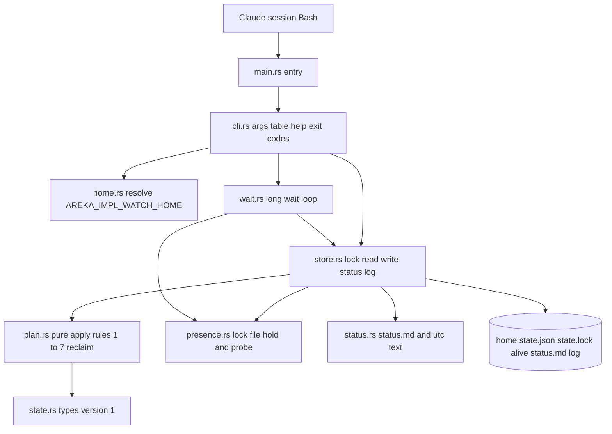
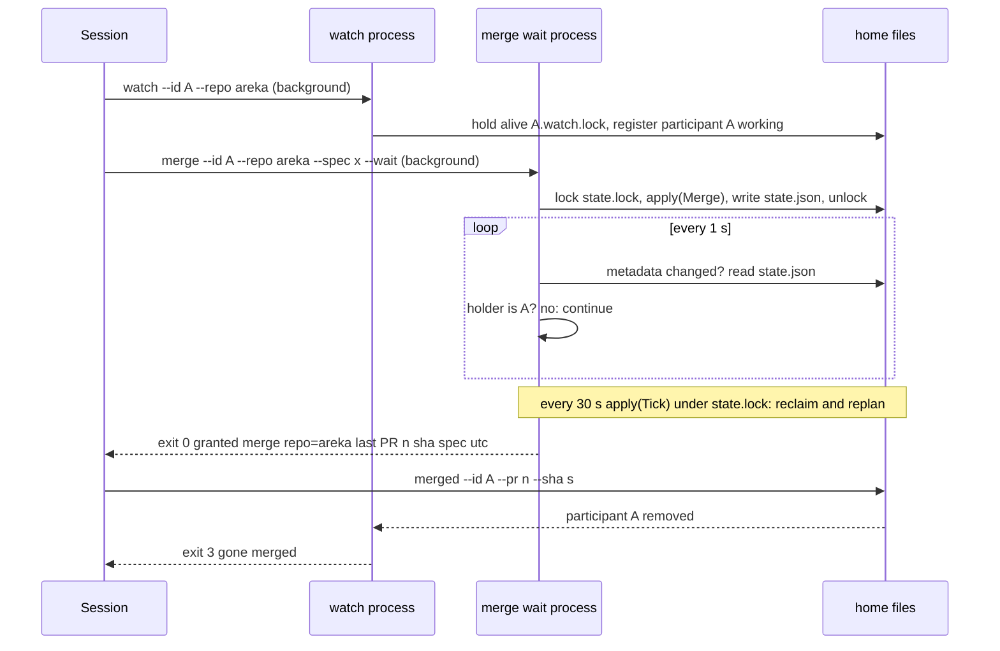
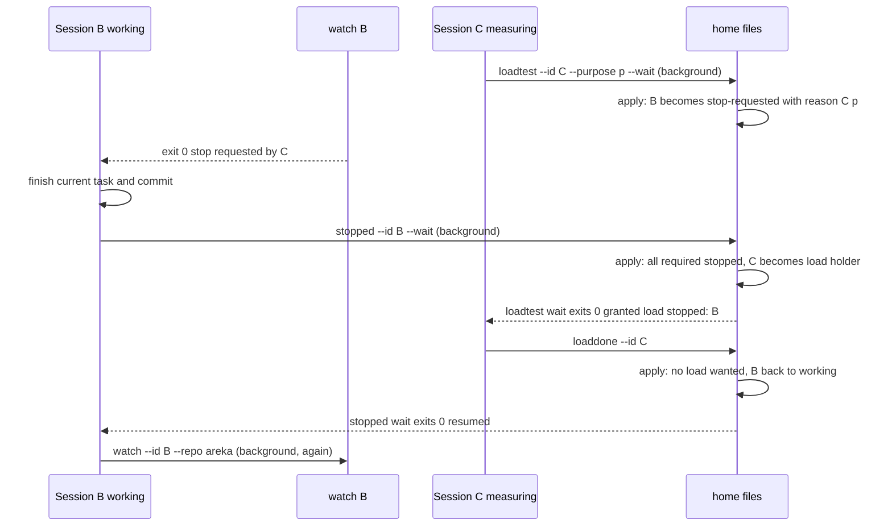
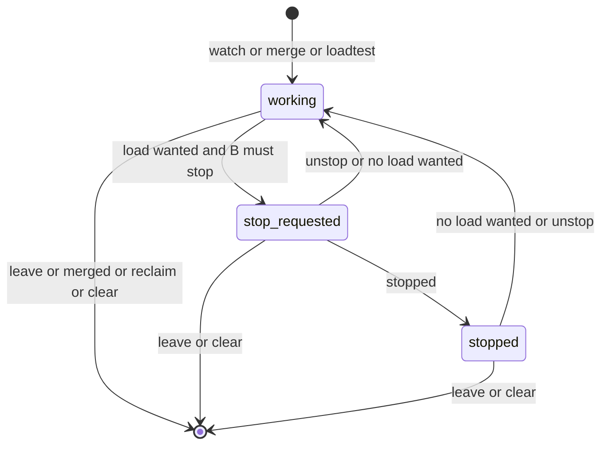

# 設計: areka-P0-impl-watch

作成: 2026-10-10（要件 1〜14 を確定した後）。要件は `requirements.md`、調べたことと選ばなかった案は `research.md`。この文書だけで実装の判断が付くように、決めたことは全部ここに書く。

## Overview

**目的**: 同じマシンで並んで走る実装セッションに、「マージの机」（リポジトリごとに 1 つ）と「負荷テストの机」（マシンに 1 つ）を 1 度に 1 人へ貸し出すコンソールアプリ `areka-impl-watch` を作る。各セッションは Bash から実行ファイルを直接呼ぶ。待ちは「番が来るまで終わらないコマンド」、止まる合図は「停止要請が出たら終わる見張りのコマンド」で表し、LLM のメッセージは 1 通も使わない。

**利用者**: 実装セッション（`kiro-impl`・`kiro-complete` を回す Claude セッション。スキルの書き替えは続きの spec）と開発者（状態の確認・手での取り下げ・`clear`）。

**変えるもの**: 今の調停役のセッション（スキル `kiro-watch`・PowerShell の状態機械）が持っている判断（規則 1〜7）を Rust の純粋な関数へ 1 対 1 で写し、状態をワークツリーの `target/` からマシン共通の置き場（環境変数 `AREKA_IMPL_WATCH_HOME`）へ移す。今のスキルとスクリプトは触らない。

### Goals
- 机の 1 往復（申し込み → 番 → 返却）と停止の 1 往復（停止要請 → 止まった → 再開）で、セッションが呼ぶコマンドを 2 つに抑え、セッションが起きるのはコマンドが終わる 1 回だけにする（要件 13）。
- 規則 1〜7 の判断を、時刻とプロセスの生死を外から渡す純粋な関数に集め、決定論テストで固定する（要件 12.1）。
- 落ちたセッションの机と待ち行列を、次の呼び出しが回収する（要件 7）。
- 状態ファイルは 1 つ・版つき・書きかけを読ませない・壊れたら退避して黙らない（要件 8）。
- 外部クレートの追加 0（`Cargo.lock` に増えるのは新しいクレート自身の 1 塊だけ）。

### Non-Goals
- スキル `kiro-impl`・`kiro-complete`・`kiro-watch` の書き替え（続きの spec）。
- Claude セッションへのメッセージ送信・セッション一覧の読み取り・常駐サーバー・GUI・crates.io への公開。
- 机の種類を増やすこと・貸し出しの履歴の集計・添え書き（`note`）・開発者への「空になった」の知らせ。
- 止まる時機（コミットの切れ目がどこか）の判断。アプリは合図を出すだけ。

## Boundary Commitments

### This Spec Owns
- 新しいクレート `crates/areka-impl-watch`（実行ファイル）の全部: 引数の解釈、置き場所の解決、状態の型と版、規則 1〜7 の判断、回収、状態ファイルの読み書きと排他、見張り・待ちのコマンド、状態の確認の読み物、ログ。
- 置き場所 `AREKA_IMPL_WATCH_HOME` の下のファイルの名前と形（状態ファイル・ロック・ログ・読み物・退避したファイル）。
- 終了コードとコマンドの表（呼び出し側の契約）。
- 手順書 `doc/impl-watch.md` と、新しいスキル `.claude/skills/kiro-watch-clear/SKILL.md`。

### Out of Boundary
- 識別（`--id`）に何を渡すか（ワークツリーの道筋か spec 名か）。この spec は形の決まり（ASCII・長さ）だけを置く。決めるのは続きの spec。
- 見張りを「いつ始め、終わったらどう振る舞うか」の手順（スキルの仕事）。この設計は呼び方の約束（見張りを先に走らせる）を手順書に書くところまで。
- `tools/test-all.ps1`・`tools/package.ps1` の書き替え（どちらも触らずに済む）。
- `kiro-watch` のスキル・スクリプト・`messages.json`。

### Allowed Dependencies
- 標準ライブラリ（`std::fs::File::lock`／`try_lock`／`unlock`、`std::process::id`、`std::thread::sleep`）。
- ワークスペースに既に在るクレート: `serde`（派生）・`serde_json`・`thiserror`・`tracing`・`tracing-subscriber`（根の `Cargo.lock` に新しいクレートは増えない）。
- テストだけ: `temp-path-kit`（`TempPath::under_target`）。
- **使わないもの**: `windows` クレート（プロセス番号を開く API は使わない）、`chrono`、`fs2`／`fs4`、外部の引数解析ライブラリ、ワークスペースの他の本番クレート（leaf）。

### Revalidation Triggers
- 状態ファイルの形（`version` の値・項目の名前）を変えたとき → 版を上げ、手順書の「古い実行ファイルと混ざったとき」の説明と、`kiro-watch-clear` スキルを見直す。
- コマンドの名前・引数・終了コードを変えたとき → 手順書・`--help`・続きの spec（スキルの書き替え）を見直す。
- 置き場所の下のファイル名を変えたとき → 手順書の更新の手順を見直す。
- 「居る」の印の仕組み（見張りのロックファイル）を変えたとき → 回収の規則（要件 7）とスキルの呼び方の約束を見直す。

## Architecture

### Existing Architecture Analysis
- 判断の設計図は `.claude/skills/kiro-watch/kiro-watch.ps1` の `Invoke-Plan`（停止要請の発行 → 負荷テストの番 → 再開 → マージの番の順。何度呼んでも同じ結果）と `switch ($Command)` の各節。この設計は同じ順・同じ分岐を `plan.rs` の純粋な関数へ写す。写さないもの: `note`・`idleNotified`・送るメッセージの組み立て。
- 流用する前例: 引数の表と終了コード（`crates/ukadoc-survey`）、環境変数を引数で受ける純粋な関数（`crates/areka/src/boot_config.rs` の `resolve_root_from`）、一時ファイル → `sync_all` → `rename` の置き換え書き（`crates/areka-sylphya/src/persist/io.rs` の `FsPersistIo::commit`）、OS への口をトレイトにして偽物でテスト（`crates/areka-update/src/procedure.rs`）、`TempPath::under_target`、`#[ignore = "…"]` の理由に実行コマンドを書く形（`crates/areka-update/src/winhttp_real_tests.rs`）。
- 無かったもの（新しく書く）: 複数プロセスの排他・他プロセスの生死の確認・長い待ち・状態ファイルの版と退避・UTC の文字化。

### Architecture Pattern & Boundary Map

**選んだ形**: 「純粋な判断の中核 ＋ 薄い口（ファイル・時計・プロセスの生死）」。判断（`plan`）は `状態 + コマンド + いまの時刻 + 生死の答え → 新しい状態 + 出来事の列` の関数で、ファイルも時計もプロセスも触らない。口は 3 つ（置き場所のファイル、時計、ロックファイルによる生死）で、テストでは偽物に差し替える。



**依存の向き**（左から右へだけ読み込む。逆向きは誤り）: `error` → `state` → `plan` → `home`／`presence`／`status` → `store` → `wait` → `cli` → `main`。`plan` は `std::fs`・`std::time`・`std::process`・`tracing` を読み込まない（構造テストで見張る）。生死の口のトレイト `Presence` は `plan.rs` に置き、`presence.rs` はその実装だけを持つ（`plan` が `presence` を読む逆向きを作らない）。

**責任の分け方**:
- `plan` だけが「誰が持ち主になるか・誰に停止要請を出すか・誰を回収するか」を決める。他のファイルはこの関数を呼んで結果を書くだけ。
- `store` だけが置き場所のファイルを読み書きする（ロック・状態ファイル・退避・`status.md`・ログ）。
- `presence` だけがロックファイルを握る／探る（「居る」の印の唯一の実装）。
- `wait` は 3 種の長い待ち（番・停止要請・再開）を 1 つのループで回し、自分の条件の判定だけを持つ。待っている間、状態の判断はしない（判断は `store` 越しに `plan` を呼ぶ「周期の一回り」に委ねる）。

**原則との整合**: 失敗の経路は `error!` を出して `Err`（`logging.md`）。端末へ出す文は ASCII だけ、端末の文字コードは書き替えない（`tech.md`）。テストの一時フォルダは `target\` の下だけ。1 ファイル 1,000 行以下・テストは兄弟ファイル（`structure.md`）。

### Technology Stack

| 層 | 選択 | 役目 | 備考 |
|---|---|---|---|
| 実行ファイル | Rust 2024・`crates/areka-impl-watch`（bin）・`publish = false # 開発の道具（areka の外へ出さない）` | 全部 | `[package]` の中ほどに置く |
| 引数の解釈 | 自前（`ukadoc-survey` と同じ表 1 本） | コマンド 13 個＋`--help` | 外部ライブラリは入れない |
| 状態の形 | `serde`（派生）＋`serde_json` 1 | `state.json` の読み書き | どちらも `Cargo.lock` に在る |
| 排他 | `std::fs::File::lock`／`try_lock`／`unlock`（Rust 1.89 で安定・道具は 1.99） | `state.lock`（状態の短い排他）と `alive/*.lock`（居る印） | Windows では `LockFileEx` |
| 生死の確認 | ロックファイルの `try_lock`（標準ライブラリだけ） | 見張りが居るか | `windows` クレートは使わない |
| 長い待ち | 1 秒ごとの読み直し（変わっていなければ中身を読まない） | 番・停止要請・再開 | 名前つきイベントは使わない |
| ログ | `tracing`＋`tracing-subscriber`（`fmt::layer` を追記のファイルへ・ANSI 無し） | `impl-watch.log` | 時刻は subscriber が付ける |
| 失敗の型 | `thiserror` 2 | `WatchError` | 全クレート共通の規約 |
| テスト | `temp-path-kit`（dev）・`#[ignore]` の実機テスト | 置き場所は `target\test-roots\` の下 | 全体テストが常時テストを自動で拾う |

## 設計の論点 14 件の決定

`research.md` の「設計へ持ち越す論点」1〜14 に対する答え。理由は 1 行ずつ。

| # | 論点 | 決定 | 理由 |
|---|---|---|---|
| 1 | セッションを代表するプロセス | **見張り `watch` のプロセスが「居る」印**。`hold` は置かない（要件の討議で裁定済み） | 印は 1 種類だけ・作業中も待ちも持ち主の間も見張りは走り続ける |
| 2 | 生死の確認の方式 | **B-std＝参加者ごとのロックファイル** `alive/<id>.watch.lock` を見張りが排他で握る。確認は `try_lock` が成功するか（成功＝居ない）。成功したら直ちに `unlock` | 標準ライブラリだけ・ロックはプロセスの死と一緒に OS が解くのでプロセス番号の使い回し（7.4）が問題にならない・権限の違いに左右されない |
| 3 | 待ちの方式 | **1 秒ごとの読み直し**。読む前に状態ファイルの更新時刻と大きさを見て、変わっていなければ中身を読まない（10 回に 1 回は必ず読む）。30 回に 1 回「周期の一回り」（排他の中で回収と再計画）を行う | 標準ライブラリだけ・1 秒に 1 回の `metadata` は静かな机の計測を乱さない・セッションは起こさない（13.1・13.5）。「周期の一回り」が無いと、待っている者しか居ないときに落ちた持ち主を誰も回収しない |
| 4 | 排他の形 | 状態ファイルとは別の `state.lock` 1 つ。状態を変えるコマンドは排他ロックの中で「読む → `plan::apply` → 置き換え書き → `status.md` 書き」。読むだけ（`status`・待ちの読み直し）はロックを取らない。ロックの待ちは `try_lock` を 10 ms 間隔で最長 10 秒、超えたら失敗（終了コード 1）。一時ファイルの名前はプロセス番号入り（`state.json.<pid>.tmp`・`status.md.<pid>.tmp`）で、ロック無しの `status` と状態を変える呼び出しが同時に `status.md` を書いてもぶつからない。`rename` は 20 ms × 5 回まで試す（読む側がロック無しで開いている一瞬のため） | 置き換え（`rename`）の相手はロックできない・読むだけの側は置き換え書きのおかげで常に一貫した中身を見る（8.1・8.2・6.6） |
| 5 | 状態ファイルの版 | 最上位に `"version": 1`。知らない版は読まず上書きもせず ASCII の文で終了コード 1。壊れたファイルは `state.json.broken-<UTC>` へ改名して空から始める | 8.5〜8.7 のとおり |
| 6 | 終了コードの表 | **0＝できた（番が来た・停止要請が出た・再開した・変えた）／1＝失敗（環境変数・状態ファイル・ロック・読み書き）／2＝使い方の誤り／3＝当てはまらなかった（番は来なかった＝取り下げ・離脱・回収・`clear` で消えた、または条件に合わず状態を変えなかった）**。環境変数の失敗を 1 から分けない | Bash の `$?` で 3 通りに読み分けられれば足りる（6.5）。「持ち主でない」「停止要請中でない」の断り（3.10・4.9・4.11・5.7）も 3 に載せると、呼び出し側が「状態は変わっていない」と一律に読める |
| 7 | 日本語の値の読ませ方 | 置き場所の下に `status.md`（UTF-8）を、状態を変えるたびと `status` のたびに書く。端末には ASCII の要約だけ。名前（`--name`）と内容（`--purpose`）は端末へ出さない。識別・リポジトリ名・spec 名は ASCII に限る（下の「引数の形」） | `kiro-watch` と同じ前例・Claude は `Read` で読める（9.2・9.3・13.2） |
| 8 | ログの形 | `tracing`＋`fmt::layer().with_writer(Mutex<File>)`（追記で開く・`with_ansi(false)`）。出来事は `plan::apply` が返す列を `store` が `info!` で 1 行ずつ書く。失敗は `error!` | `logging.md` の規約どおり・時刻の付与は subscriber が持つ・依存は増えない |
| 9 | 時刻の持ち方 | 状態は UNIX 秒（`u64`）。人が読む形は自前の UTC `YYYY-MM-DDTHH:MM:SSZ`（20 行ほど・`status.rs`）。ファイル名に使うときは `YYYYMMDDTHHMMSSZ` | `chrono` を直接依存に足さない・ローカル時刻は `windows` クレートが要る |
| 10 | 手順書の置き場 | `doc/impl-watch.md`（`doc/crates-io-publish.md` の前例）。更新の手順は 2 通り書く: (a) `status` で走っている待ち・見張りが無いことを確かめてから置き換える（要件 11.3 の字のとおり）、(b) 誰かが走らせている間は、動いている `areka-impl-watch.exe` を `areka-impl-watch.old.exe` に改名してから新しいものを置く（Windows は動いている exe の改名ができる） | 要件 11.3 の文言は変えずに済む（論点 14） |
| 11 | 識別の形 | `--id`・`--repo`・`--spec` は `[A-Za-z0-9._-]` の 1〜100 字。外れたら終了コード 2。何を渡すかは続きの spec | ロックファイル名と端末の ASCII に直結する |
| 12 | コマンドの対応 | 下の「コマンドの表」。`join`（`watch` が兼ねる）・`note`・`next`（周期の一回りを `tick` として残す）を置かない。申し込みと待ちは `--wait` で 1 コマンド、「止まった」と再開の待ちも `stopped --wait` で 1 コマンド | 往復のコマンド数を最小にする（13.4） |
| 13 | 実行ファイルを置き換えてよいかの確かめ方 | 状態ファイルの「走っている待ち・見張り」の記録を `status` で示す。実行ファイルを書き込みで開く確かめは置かない | 記録の抜け（殺された待ち）は論点 10 の (b) の手順で逃げられる |
| 14 | 要件 11.3 の文言 | 変えない（論点 10 で両方の手順を書く） | — |

## コマンドの表

実行ファイルは `%AREKA_IMPL_WATCH_HOME%\areka-impl-watch.exe`。引数は `--名前 値` の形（`--bug`・`--wait` は値なし）。`--name` を省くと識別がそのまま名前になる。

| コマンド | 引数 | すること | 終わり方（終了コード） | 端末の出力（ASCII・1〜数行） |
|---|---|---|---|---|
| `watch` | `--id --repo [--name]` | 参加（無ければ登録・あれば名前とリポジトリを更新）し、`alive/<id>.watch.lock` を握って**居る印**になり、自分宛ての停止要請が出るか自分の記録が消えるまで終わらない | 0＝停止要請が出た（またはすでに止まっている）／3＝記録が消えた（離脱・マージ済み・回収・`clear`）／1＝同じ識別の見張りがすでに走っている・失敗（`merge --wait` 等も同じ識別・同じ種類の待ちが走っていれば 1） | `stop requested by <id>` と `details: <home>\status.md`／`gone: <理由>` |
| `merge` | `--id --repo --spec [--bug] [--name] [--wait]` | 参加を兼ね、そのリポジトリのマージの待ち行列に加える（二重には加えない）。`--wait` なら番が来るまで終わらない | 0＝番が来た（`--wait` 無しなら「並んだ」も 0）／3＝申し込みが消えた | `granted merge repo=<r>; last: PR#<n> <sha> <spec> <utc>`（無ければ `last: none`）／`queued merge repo=<r> pos=<n>` |
| `merged` | `--id --pr --sha` | マージの机を空け、「直前のマージ」を記録し、参加者の記録を消す | 0／3＝持ち主でない | `merged repo=<r>` |
| `loadtest` | `--id --repo --purpose [--name] [--wait]` | 参加を兼ね、負荷テストの待ち行列に加える。`--wait` なら番が来るまで終わらない | 0＝番が来た／3＝申し込みが消えた | `granted load; stopped: <id>, <id>`（居なければ `stopped: none`）／`queued load pos=<n>` |
| `loadrunning` | `--id --repo --purpose [--name]` | すでに走っている負荷テストを、停止要請を出さずに持ち主として記録（走っている印） | 0／3＝持ち主が居る | `recorded running load` |
| `loaddone` | `--id` | 負荷テストの机を空ける | 0／3＝持ち主でない | `load done` |
| `stopped` | `--id [--wait]` | 「止まった」を記録。`--wait` なら自分が「作業中」に戻るまで終わらない（すでに作業中に戻っていれば直ちに 0 `resumed`） | 0＝記録した（`--wait` なら再開した）／3＝停止要請中でない（`--wait` 無し）・記録が消えた | `stopped`／`resumed` |
| `resume` | `--id` | 再開の待ちだけ（`stopped --wait` が途中で殺されたときの始め直し）。すでに作業中なら直ちに終わる | 0＝再開した／3＝記録が消えた | `resumed` |
| `unstop` | `[--id]` | 停止要請の取り消し（全員または識別の指定）。走っている印の無い負荷テストが待たれていれば出し直す | 0／3＝対象が居ない | `unstopped n=<n>` |
| `cancel` | `--id` | その識別のすべての申し込みと机を外す（参加者の記録は残す） | 0 | `cancelled` |
| `leave` | `--id` | その識別の申し込み・机・参加者の記録を消す | 0 | `left` |
| `tick` | なし | 回収と再計画だけ（`clear` の退避を手で戻した後など） | 0 | `tick` |
| `status` | なし | 状態を変えずに読み、`status.md` を書き、ASCII の要約を出す。見張りの無い参加者に `absent` の印 | 0／1＝状態ファイルが壊れている・版が合わない | 下の「状態の確認」 |
| `clear` | なし | 状態ファイルを `state.json.cleared-<UTC>` へ退避し、版と「消した記録」だけの空の状態を書く。問い合わせはしない | 0 | `cleared; backup: <path>` |
| `--help` | なし | コマンド・引数・終了コードの対応を ASCII で出す | 0 | 使い方 |

共通: 引数が足りない・知らないコマンド・形に合わない識別 → 何も変えず、ASCII の 1 行を標準エラーへ出して 2。環境変数が無い・空・フォルダを作れない → ASCII の 2 行（「`AREKA_IMPL_WATCH_HOME` を設定してください」の趣旨・手順書の場所）を標準エラーへ出して 1（何も読み書きしない）。標準出力には結果だけ、断りと失敗は標準エラー（`ukadoc-survey` と同じ）。

**呼び方の約束**（手順書に書く・続きの spec がスキルへ写す）: セッションは最初に `watch` をバックグラウンドで走らせ、その後に `merge`／`loadtest` を呼ぶ。見張りの無い「作業中」の参加者は次の呼び出しで回収されるため、順を逆にすると申し込みが消えることがある（消えたら待ちが 3 で終わるので、`watch` を立ててから申し込み直す）。再開した後も、次の `merge`／`loadtest` の前に `watch` を立て直す。

### 引数の形
- `--id`・`--repo`・`--spec`: `[A-Za-z0-9._-]` の 1〜100 字。
- `--name`・`--purpose`: 任意の文字列（UTF-8 のまま状態ファイルと `status.md` へ。端末へは出さない）。
- `--pr`: 数字だけ。`--sha`: `[0-9a-fA-F]` の 7〜40 字。

## 往復のコマンド数（要件 13.4）

セッションが起きるのは「コマンドが終わる」ときだけ。`watch` はセッションの最初に 1 回立て、停止要請で終わるまで走り続ける。

| 往復 | 呼ぶコマンド | 数 | セッションが起きる回数 |
|---|---|---|---|
| マージの机 | ① `merge --id --repo --spec [--bug] --wait`（バックグラウンド・番が来て終わる）② `merged --id --pr --sha` | 2 | 1（①の終わり） |
| 負荷テストの机 | ① `loadtest --id --repo --purpose --wait`（バックグラウンド）② `loaddone --id` | 2 | 1（①の終わり） |
| 停止 | （走らせてある `watch` が終わる）① `stopped --id --wait`（バックグラウンド・再開で終わる）② `watch --id --repo`（立て直し・バックグラウンド） | 2 | 2（`watch` の終わり・①の終わり） |
| 走っている負荷テストの記録 | ① `loadrunning` ② `loaddone` | 2 | 0 |
| 参加の始まり／終わり | `watch`（バックグラウンド）／`leave`（`merged` は離脱を兼ねる） | 1／1 | 0 |

同じ情報を 2 度呼ばせない: 「直前のマージ」は①の終わりの出力に載る（3.9）。「止まった参加者」も①の終わりの出力に載る（4.7）。停止要請の理由は `watch` の終わりに載る（5.5）。待ちを始め直しても申し込みは二重にならない（6.2）。

参加の終わり（`merged`／`leave`）では、走っていた `watch` が 3 で終わるのでセッションがもう 1 回起きる（行動は要らない）。この 1 回は「居る印を見張りのプロセスで表す」以上避けられないので、表には数えず、ここに書いておく。

## File Structure Plan

### Directory Structure
```
crates/areka-impl-watch/
├── Cargo.toml                  # bin・publish = false # 開発の道具（中ほどの行）・依存は serde = { version = "1", features = ["derive"] } と serde_json = "1"（根の [workspace.dependencies] に無いのでクレート側で書く・dola と同じ）・thiserror / tracing / tracing-subscriber は workspace = true・dev は temp-path-kit
└── src/
    ├── main.rs                 # 引数 → cli::run → 終了コード（判断を持たない）・main_layering_tests.rs の接続
    ├── main_layering_tests.rs  # 構造テスト: plan.rs が std::fs / std::time / std::process / tracing を綴らない（走査は plan.rs だけ。兄弟の plan_*_tests.rs と plan_test_support.rs はテストなので時刻や偽の口を使ってよく、対象に入れない）・cli.rs と status.rs の文字列リテラルが ASCII
    ├── error.rs                # 失敗の型 WatchError（thiserror・文は ASCII）
    ├── cli.rs                  # 引数の解釈・コマンドの表・--help・終了コードへの写像・各コマンドの手順（store と wait を呼ぶ）
    ├── cli_tests.rs            # 引数の誤り（2）・環境変数の無い警告終了（1）・出力が ASCII だけ
    ├── home.rs                 # AREKA_IMPL_WATCH_HOME の解決（値を引数で受ける純粋な関数＋env を読む薄い口）・置き場所の下のパスの組み立て
    ├── home_tests.rs           # 無い・空・作れない・作る
    ├── state.rs                # 状態の型（version 1）・serde・空の状態・参加者の状態の列挙
    ├── state_tests.rs          # JSON の往復・版の読み取り
    ├── plan.rs                 # 純粋な判断 apply(state, cmd, caller, now, alive) -> Applied。規則 1〜7・回収・再計画・出来事
    ├── plan_desk_tests.rs      # 規則 1・3・4・6（机と待ち行列）
    ├── plan_stop_tests.rs      # 規則 2・5・7（停止要請・止まった・再開・取り消し・走っている印）
    ├── plan_reclaim_tests.rs   # 回収（居ない見張り・待ちの記録・停止要請中は回収しない・同じ呼び出しで番を決め直す）
    ├── plan_test_support.rs    # 偽の生死（HashSet）・状態の組み立て・時刻の定数
    ├── presence.rs             # ロックファイルの「握る」（Held）と「探る」（probe）・Presence トレイトと本物の実装
    ├── presence_tests.rs       # 握っている間は probe が「居る」・解いたら「居ない」（target\ の下の本物のファイル・同じプロセス内）
    ├── store.rs                # state.lock の排他（try_lock 10 ms × 最長 10 秒）・読み（版の検査・壊れたファイルの退避）・置き換え書き・ログの初期化と出来事の記録・status.md 書き・「状態を変える 1 回」(with_state)
    ├── store_tests.rs          # 無い→作る・壊れた→退避・版違い→読まない・置き換え書き・ロックの待ちの上限
    ├── status.rs               # status.md の組み立て（UTF-8）・端末向け ASCII の要約・UTC の文字化
    ├── status_tests.rs         # 日本語が端末向けに混ざらない・absent の印・UTC の文字化の境界
    ├── wait.rs                 # 3 種の長い待ちを 1 つのループで: 登録 → 判定 → 読み直し → 周期の一回り → 抹消。口（WaitPort）で差し替え
    └── wait_tests.rs           # 偽の口で: 直ちに終わる・番が来て終わる・消えて 3・周期の一回りが呼ばれる・変わっていなければ読まない
crates/areka-impl-watch/tests/
└── real.rs                     # #[ignore]: 本物の実行ファイル（CARGO_BIN_EXE_areka-impl-watch＝統合テストだけに渡る）を子プロセスで立てて 取得待ち・返却・見張りの起床・回収・clear を通す（cargo test -p areka-impl-watch --test real -- --ignored --nocapture）
doc/impl-watch.md               # 入れ方・更新・呼び方の約束・コマンドと終了コードの表
.claude/skills/kiro-watch-clear/SKILL.md   # clear を呼んで status を呼び、日本語で短く報告する
```

接続は `structure.md` の形（本番ファイルの末尾に `#[cfg(test)] #[path = "<stem>_<module>.rs"] mod <module>;`。`main.rs` の兄弟は `main_<module>.rs`）。実機テストは `CARGO_BIN_EXE_<name>` が統合テストにしか渡らないので `tests/real.rs` に置く。どのファイルも 1,000 行以下（`plan.rs` が最も大きく 400 行前後の見込み）。

### Modified Files
- `Cargo.lock` — 新しいクレートの 1 塊が増えるだけ（依存は全部既に在る）。
- 根の `Cargo.toml`・`tools/test-all.ps1`・`tools/package.ps1` — 触らない（`crates/*` を丸ごと拾う・常時テストは自動で入る・zip は名指しなので入らない）。

## System Flows

### マージの 1 往復


### 停止の 1 往復


### 参加者の状態


流れの決めごと:
- 判断は全部 `plan::apply` の中で起きる。待ちのプロセスは「自分の条件を状態から読む」だけで、他人の状態を変えない（「周期の一回り」のときだけ `apply(Tick)` を呼ぶ）。
- `apply` は毎回 ①回収 → ②コマンドの処理 → ③再計画（停止要請の発行 → 負荷テストの番 → 再開 → マージの番）の順。`Invoke-Plan` と同じで、何度呼んでも同じ結果。
- 回収は「作業中」かつ見張りの印が無い参加者だけ（停止要請中・止まったは回収しない＝7.7）。いま呼んでいる識別（`caller`）は同じ呼び出しでは回収しない（`merge` が自分の参加を作った直後に自分を回収しないため）。**再開した直後の参加者（`awaiting_watch_since` の印つき）も回収しない**: 再開は `stopped --wait` の終わりでセッションを起こし、セッションが `watch` を立て直すまでに LLM の往復（秒〜分）があるので、その間に他の呼び出しが来ても落ちたとは見なさない。印は再計画の再開の段と `unstop` で付け、`Command::Watch` で消す。印が付いたまま見張りが居ると分かったとき（回収の確認で `is_present` が真）も消す。印の付いた参加者は「作業中」なので停止要請の対象になり、その場合は立て直した `watch` が直ちに 0 で終わる（5.4）。`status` は `awaiting-watch` の印で示す。
- 回収や離脱で参加者が消えたら、その識別の待ちの記録（`waits`）も消す。待ちの記録のうち、ロックファイルが解かれているもの（殺された待ち）も回収で消す（6.7）。

## Requirements Traceability

| 要件 | 要旨 | 部品 | 契約・流れ |
|---|---|---|---|
| 1.1, 1.2 | 置き場所は環境変数だけ・設定ファイル無し | `home.rs` | `resolve(value)`・置き場所の下は state.json / state.lock / alive / status.md / impl-watch.log / 退避ファイルだけ |
| 1.3 | 無い・空・作れない → ASCII 1〜2 行・何も読み書きせず非 0 | `home.rs`・`cli.rs` | `WatchError::HomeUnset`／`HomeNotCreatable` → 標準エラー → 終了コード 1 |
| 1.4 | 無ければ作る | `home.rs` | `create_dir_all` |
| 1.5 | 実行ファイル 1 つ・cargo 無しで使う | `Cargo.toml`・手順書 | コピーして直接呼ぶ |
| 2.1, 2.2 | 参加・名前の更新 | `plan.rs`（`join`） | `watch`／`merge`／`loadtest`／`loadrunning` が兼ねる |
| 2.3 | 参加していない識別の申し込みも参加扱い | `plan.rs` | 各申し込みの先頭で `join` |
| 2.4 | 離脱で全部外す | `plan.rs`（`leave`） | `remove_from` ＋ 参加者の記録を消す |
| 2.5 | 参加していない識別は対象にしない | `plan.rs` | 停止要請・再開・回収は `participants` の鍵だけを見る |
| 3.1, 3.2 | マージの申し込み・二重にしない | `plan.rs`（`merge`） | 待ち行列に `{id, spec, bug, requested}` |
| 3.3, 3.4 | 持ち主の選び方・バグ優先 → 申し込み時刻（規則 6） | `plan.rs`（`replan` のマージの段） | 負荷テストが持たれ・待たれていないときだけ番を出す |
| 3.5 | 負荷テストが持たれ・待たれている間は新しいマージの持ち主を作らない（規則 4） | `plan.rs`（`replan`） | 負荷の段で `return` し、マージの段へ来ない |
| 3.6, 3.7 | 同じリポジトリは 1 人（規則 1）・別のリポジトリは独立 | `plan.rs`（`replan` のマージの段） | 持ち主が居るリポジトリは飛ばす・リポジトリごとに独立して選ぶ |
| 3.8 | `merged` で空け・直前のマージ・参加を終える | `plan.rs`（`merged`） | `last = {pr, sha, spec, at}` |
| 3.9 | 番が来た出力に直前のマージ | `wait.rs`・`cli.rs` | `granted merge … last: …` |
| 3.10 | 持ち主でない `merged` | `plan.rs` | `Verdict::NotApplied` → 3 |
| 4.1, 4.2 | 負荷テストの申し込み・二重にしない | `plan.rs`（`loadtest`） | `load.queue` に `{id, purpose, requested}`・待ち行列と持ち主を見て重ねない |
| 4.3 | 申し込みの時刻が早い順（規則 6） | `plan.rs`（`replan` の負荷の段） | 先頭＝最も早い申し込み |
| 4.4 | 止まる必要のある参加者 | `plan.rs`（`need_stop`） | 候補・マージの持ち主・マージ待ちを除く全員 |
| 4.5, 4.6 | 番の条件・規則 1 | `plan.rs`（`replan` の負荷の段） | 持ち主なし・マージの持ち主なし・全員止まった |
| 4.7 | 番が来た出力に止まった一覧 | `wait.rs`・`cli.rs` | `granted load; stopped: …`（識別の列・ASCII） |
| 4.8, 4.9 | `loaddone`・持ち主でない | `plan.rs` | `NotApplied` → 3 |
| 4.10〜4.12 | 走っている印 | `plan.rs`（`loadrunning`・`replan`） | `holder.running = true` → 停止要請を出さない・マージの番も出さない |
| 5.1, 5.2 | 停止要請の発行と理由 | `plan.rs`（`replan` の停止の段） | `status = StopRequested`・`stop_reason = {by, purpose}` |
| 5.3, 5.4, 5.5 | 見張りの終わり方・直ちに終える・理由を伝える | `wait.rs`（`WaitKind::Watch`）・`presence.rs` | 条件: 記録なし → 3、`status != Working` → 0 |
| 5.6, 5.7 | `stopped`・停止要請中でない | `plan.rs` | `NotApplied` → 3 |
| 5.8, 5.9 | 再開の条件 | `plan.rs`（`replan` の再開の段） | 負荷テストが無いときだけ全員 `Working` へ |
| 5.10, 5.11 | 再開の待ち・直ちに終える | `wait.rs`（`WaitKind::Resume`） | `stopped --wait`・`resume` |
| 5.12, 5.13 | 取り消し・出し直し | `plan.rs`（`unstop` → `replan`） | 取り消しの後に再計画が停止要請を出し直す |
| 5.14 | マージの持ち主に停止要請を出さない | `plan.rs`（`need_stop`） | 規則 5 |
| 5.15 | 合図だけ・作業を止めない | 設計の境界 | アプリはプロセスに触らない |
| 6.1 | 時間の上限なし | `wait.rs` | ループに上限なし |
| 6.2 | 待ちの始め直しで引き継ぐ | `wait.rs`・`plan.rs` | 申し込みは二重にしない・登録で古い待ちの記録を置き換える |
| 6.3 | 取り下げ | `plan.rs`（`cancel`） | 参加者の記録は残す |
| 6.4 | 消えたら「番は来なかった」 | `wait.rs` | 判定: 待ち行列にも持ち主にも居ない → 3 |
| 6.5 | 終了コード 3 通り以上 | `cli.rs`・`--help`・手順書 | 0／1／2／3 |
| 6.6 | 待ちは独り占めしない | `wait.rs`・`store.rs` | 読み直しはロックなし・`apply(Tick)` だけ短い排他 |
| 6.7 | 正常に終わったら記録を消す | `wait.rs` | 抹消は排他の中で |
| 7.1 | 見張りを生死の確かめられる形で記録 | `presence.rs`・`state.rs`（`waits`・`participants.watch`） | ロックファイル＋`{pid, since}` |
| 7.2 | 状態を変える呼び出しで回収 | `plan.rs`（`reclaim`） | 作業中かつ `alive.is_present(id)` が偽 |
| 7.3 | 回収の記録 | `plan.rs`（`Event::Reclaimed`）・`store.rs`・`status.rs` | ログ＋`recent` |
| 7.4 | プロセス番号の使い回し | `presence.rs` | ロックは番号を見ない |
| 7.5 | 同じ呼び出しで番を決め直す | `plan.rs` | `reclaim` の後に必ず `replan` |
| 7.6 | 手で外す | `cli.rs`（`cancel`・`leave`・`clear`） | 識別を指定 |
| 7.7 | 停止要請中・止まった・再開して見張り待ちは回収しない・`absent` の印 | `plan.rs`・`status.rs` | `reclaim` は `Working` かつ `awaiting_watch_since` 無しだけ・`status` は `absent`／`awaiting-watch` の印だけ |
| 8.1, 8.2 | 同時の変更を失わない・排他は短い | `store.rs`（`with_state`） | `state.lock` の排他の中で読む→`apply`→書く |
| 8.3 | 書きかけを読ませない | `store.rs` | `state.json.<pid>.tmp` → `sync_all` → `rename`（20 ms × 5 回） |
| 8.4 | 無い → 作った記録 | `store.rs`・`plan.rs`（`Event::Recovered`） | `recent` とログ |
| 8.5 | 壊れた → 退避して記録 | `store.rs` | `state.json.broken-<UTC>` |
| 8.6, 8.7 | 版・知らない版は読まない | `state.rs`・`store.rs` | `version` だけ先に読む |
| 8.8 | 状態ファイルは 1 つ | `state.rs` | `State` 1 型 |
| 9.1 | 状態の確認の中身 | `status.rs` | `status.md` |
| 9.2, 9.3 | 端末は ASCII・日本語は別に | `status.rs`・`cli.rs`・`main_layering_tests.rs` | 名前・内容は `status.md` だけ・端末へ出す道筋は ASCII の外を `\u{XXXX}` に逃がす |
| 9.4 | 読むだけ・`absent`・無い/壊れたはその旨だけ | `cli.rs`（`status`）・`store.rs`（`read_only`） | ロック無し・退避も作成もしない |
| 9.5 | `--help` | `cli.rs` | ASCII の表 |
| 9.6 | 引数の誤り | `cli.rs` | 2 |
| 10.1 | 状態の変化をログへ | `plan.rs`（`Event`）・`store.rs` | 1 出来事 1 行 |
| 10.2 | 失敗はログへ＋非 0 | `store.rs`・`cli.rs` | `error!` → `Err` → 1 |
| 10.3 | ログは別ファイル | `store.rs` | `impl-watch.log` |
| 11.1 | クレートの置き方・`publish` の行 | `Cargo.toml` | 中ほどの行 |
| 11.2 | zip に入らない | `tools/package.ps1` の名指し | 触らない |
| 11.3 | 手順書 | `doc/impl-watch.md` | 下の「手順書の中身」 |
| 12.1 | 規則 1〜7 を決定論テストで | `plan_*_tests.rs` | 時刻・生死は引数 |
| 12.2 | 無い・壊れた・版違い | `store_tests.rs` | 一時フォルダの本物のファイル |
| 12.3 | 環境変数の無い警告終了 | `home_tests.rs`・`cli_tests.rs` | 値を引数で渡す |
| 12.4 | 置き場所は `target\` の下 | 全テスト | `TempPath::under_target("impl-watch")` |
| 12.5 | 実機テストは `#[ignore]` | `tests/real.rs` | 理由に実行コマンド |
| 12.6 | 全体テストが自動で拾う | ワークスペースの `crates/*` | `tools/test-all.ps1` は触らない |
| 13.1 | 待ちの間はセッションを起こさない | `wait.rs` | 終わるまで何も出さない |
| 13.2, 13.3 | 端末出力は ASCII の数行 | `cli.rs` | 各コマンドの出力は表のとおり |
| 13.4 | 往復のコマンド数の表 | この文書 | 上の表 |
| 13.5 | CPU を占有しない・軽い読み直し | `wait.rs` | 1 秒・`metadata` で変化を見る |
| 13.6 | 余計に起こさない | `wait.rs` | 途中経過を出さない・短い間隔で終わらない |
| 14.1 | `clear` で空に | `store.rs`（`clear`）・`state.rs`（`State::cleared`） | 版と「消した記録」だけ |
| 14.2 | 退避と記録 | `store.rs` | `state.json.cleared-<UTC>`・`recent`・ログ |
| 14.3 | 走っていた待ち・見張りは 3 で終わる | `wait.rs` | 記録が無い → 3 |
| 14.4 | 問い合わせなし・ASCII の数行 | `cli.rs` | `cleared; backup: …` |
| 14.5 | スキル `kiro-watch-clear` | `.claude/skills/kiro-watch-clear/SKILL.md` | `clear` → `status` → 日本語で短く |
| 14.6 | 環境変数・実行ファイルが無ければ案内して止まる | 同スキル | Bash で有無を確かめてから呼ぶ |

## Components and Interfaces

| 部品 | 層 | 役目 | 要件 | 依存（P0＝無いと動かない） | 契約 |
|---|---|---|---|---|---|
| `main.rs` | 入口 | 引数 → `cli::run` → 終了コード | 1.5, 9.6 | `cli`（P0） | — |
| `cli.rs` | 入口 | 引数の解釈・コマンドの表・各コマンドの手順・出力・終了コード | 6.5, 9.2, 9.5, 9.6, 13.2, 13.3, 14.4 | `home`・`store`・`wait`（P0） | Service |
| `home.rs` | 口 | 置き場所の解決とパスの組み立て | 1.1〜1.4, 12.3 | std | Service |
| `state.rs` | 型 | 状態の型・版・空の状態 | 8.6, 8.8, 14.1 | `serde` | State |
| `plan.rs` | 中核 | 純粋な判断（規則 1〜7・回収・再計画・出来事） | 2〜5, 7.2, 7.5, 7.7, 10.1 | `state`（P0） | Service |
| `presence.rs` | 口 | ロックファイルを握る／探る | 5.3, 7.1, 7.2, 7.4 | std | Service |
| `store.rs` | 口 | 排他・読み・退避・置き換え書き・ログ・`status.md` | 8.1〜8.5, 8.7, 10.2, 10.3, 14.2 | `home`・`state`・`plan`・`presence`・`status`（P0） | Service |
| `status.rs` | 表示 | `status.md`・ASCII の要約・UTC の文字化 | 7.3, 7.7, 9.1〜9.4 | `state` | Service |
| `wait.rs` | 流れ | 3 種の長い待ち | 5.3〜5.5, 5.10, 5.11, 6.1〜6.7, 13.1, 13.5, 13.6, 14.3 | `store`・`presence`（P0） | Service |
| `doc/impl-watch.md` | 文書 | 入れ方・更新・呼び方の約束 | 11.3 | — | — |
| `kiro-watch-clear` | スキル | `clear` → `status` → 報告 | 14.5, 14.6 | 実行ファイル | — |

### 入口

#### `cli.rs`

| 項目 | 内容 |
|---|---|
| 役目 | 引数を `Command` と `Options` に読み、コマンドごとの手順を 1 つの関数で回し、`Outcome` を終了コードへ写す |
| 要件 | 6.5, 9.2, 9.5, 9.6, 13.2, 13.3, 14.4 |

**責任と制約**
- 引数の表 1 本（`COMMANDS: [Spec; 13]`＝名前・要る引数・任意の引数・`--wait` を取るか）から解釈する。手書きの分岐を別に持たない。
- 端末へ出す文はこのファイルの定数と、`status.rs` の ASCII の要約だけ。識別・リポジトリ・spec・PR・sha・UTC 以外の値を文に混ぜない。置き場所の道筋（`status: …`・`details: …`・`backup: …`・失敗の文）だけは例外で、ASCII の外の字を `\u{XXXX}` に逃がして出す（`escape_path`・9.3）。
- 失敗の本文は標準エラーへ。標準出力には結果だけ。

**契約（Service）**
```rust
pub enum Outcome { Done, NotApplied, Usage }          // 0 / 3 / 2。失敗は Err → 1
pub fn run(args: &[String], home_value: Option<OsString>) -> Result<Outcome, WatchError>;
pub fn usage() -> &'static str;                        // --help の本文（ASCII）
pub(crate) fn parse(args: &[String]) -> Result<Invocation, UsageError>;  // Invocation = { command: Command, wait: bool }
```
- 前提: `args` は実行ファイル名を落としたもの。`home_value` は `std::env::var_os("AREKA_IMPL_WATCH_HOME")`（テストは渡す）。
- 事後: `Usage` のとき状態は一切触らない。`Err` のときログに `error!` が 1 行ある（置き場所が解決できた場合）。
- 手順の例（`merge --wait`）: `home::resolve` → `store::open`（ログの初期化）→ `store.with_state(|s, now, alive| plan::apply(s, &Command::Merge{..}, Some(id), now, alive))` → 番が来ていなければ `wait::run(WaitSpec::Merge{id, repo})` → 出力と終了コード。

### 口

#### `home.rs`
```rust
pub struct Home { pub dir: PathBuf }
pub fn resolve(value: Option<OsString>) -> Result<Home, WatchError>;   // 無い・空 → HomeUnset、作れない → HomeNotCreatable{dir, kind, code}
impl Home {
    pub fn state_path(&self) -> PathBuf;    // state.json
    pub fn lock_path(&self) -> PathBuf;     // state.lock
    pub fn status_path(&self) -> PathBuf;   // status.md
    pub fn log_path(&self) -> PathBuf;      // impl-watch.log
    pub fn alive_dir(&self) -> PathBuf;     // alive/
    pub fn alive_path(&self, id: &str, kind: WaitKind) -> PathBuf;  // alive/<id>.<kind>.lock
}
```
- `resolve` は `create_dir_all` までを行う（1.4）。既定の場所へ倒れない（`boot_config.rs` の `ExeDir` の段は写さない）。

#### `presence.rs`
```rust
// トレイト Presence は plan.rs に置く（層の向き plan → presence を守る）。ここは握る・探るの実装だけ
pub struct Held { /* File を握ったまま。Drop で unlock */ }
pub fn hold(path: &Path) -> Result<Option<Held>, io::Error>;   // create して try_lock を 20 ms 間隔で 5 回。None = 他のプロセスが握っている
pub struct LockFilePresence { alive_dir: PathBuf }
impl plan::Presence for LockFilePresence { /* create 無しで open（無ければ false）→ try_lock → 成功なら unlock して false、WouldBlock なら true */ }
```
- 不変: ロックファイルは消さない（Windows では握られているファイルの消去と作り直しが衝突するため）。ファイルの存在ではなくロックの有無だけを見る。探り（`is_present`）はファイルを作らない（`status` が読むだけで済むように）。
- 探りが一瞬ロックを取るので、同時に始まった `watch` の `try_lock` が外れることがある → `hold` の 5 回の試しで吸収する。
- 見張りの印は `WaitKind::Watch` のファイルだけ。待ち（`Merge`・`Load`・`Resume`）のファイルは「殺された待ちの記録の回収」（6.7）にだけ使い、参加者の生死には使わない（7.1）。

#### `store.rs`
```rust
pub struct Store { home: Home, clock: Box<dyn Fn() -> u64>, presence: Box<dyn Presence> }
pub fn open(home: Home) -> Result<Store, WatchError>;   // ログの subscriber を初期化（追記・ANSI 無し）
impl Store {
    /// 排他の中で 読む → f → 変わっていれば置き換え書き → status.md 書き → 出来事をログへ。
    pub fn with_state<T>(&self, f: impl FnOnce(&mut State, u64, &dyn Presence) -> (Applied, T)) -> Result<T, WatchError>;
    /// 読むだけ。ロック無し・作らない・退避しない。無い → Ok(None)。壊れた・版違い → Err。
    pub fn read_only(&self) -> Result<Option<State>, WatchError>;
    /// 待ちの読み直し用: (更新時刻, 大きさ) を返す。
    pub fn fingerprint(&self) -> Result<Option<(SystemTime, u64)>, io::Error>;
    pub fn clear(&self) -> Result<Option<PathBuf>, WatchError>;   // state.lock の排他の中で退避して空を書く。退避の道筋を返す（状態ファイルが無ければ None・空は書く）
}
```
- 読みの手順: `version` だけを先に `serde_json::Value` で読む → 無ければ `State::empty()`＋`Event::Recovered(Created)`、知らない版なら `Err(VersionMismatch{found})`（上書きしない）、JSON として読めない・形が合わないなら `state.json.broken-<UTC>` へ改名して `State::empty()`＋`Event::Recovered(Backed{path})`。
- 書き: `state.json.<pid>.tmp` に全部 → `sync_all` → `rename`（`FsPersistIo::commit` の形。前例は単一プロセス前提で固定の `.tmp` だが、ここは複数プロセスが書くのでプロセス番号を入れる）。`rename` は 20 ms × 5 回まで試す。`status.md` も同じ形（`status.md.<pid>.tmp`）で書く。`with_state` は `Applied.changed` が偽なら `state.json` も `status.md` も書かない（`Tick` で変化が無いときに、待っている者の数だけ書き直さないため）。
- 排他: `state.lock` を `try_lock` で 10 ms 間隔・最長 10 秒。超えたら `Err(LockBusy)`（`error!`）。
- ログ: `with_state` の中で `Applied.events` を 1 行ずつ `info!(command, id, "...")`。失敗は呼び手が `error!` で残す。subscriber は `open` で `try_init`（プロセスに 1 度だけ。同じプロセスで 2 度目の `open` は初期化を飛ばす＝テストが同じプロセスで複数の置き場所を開いても落ちない。ログの行き先は最初に開いた置き場所になるが、テストはログの中身でなく `Applied.events` を見る）。`tracing::subscriber::with_default` は呼ばない（ワークスペースの常設検査が禁じる）。

### 中核

#### `state.rs`
```rust
pub const VERSION: u32 = 1;
pub struct State {
    pub version: u32,
    pub participants: BTreeMap<String, Participant>,
    pub merge: BTreeMap<String, MergeDesk>,   // repo -> desk
    pub load: LoadDesk,
    pub waits: Vec<WaitRecord>,
    pub recent: Vec<Recent>,                  // 新しい順・最大 50
}
pub struct Participant { pub id: String, pub name: String, pub repo: String, pub status: ParticipantStatus, pub since: u64,
                         pub stop_reason: Option<StopReason>, pub watch: Option<WatchInfo>,
                         pub awaiting_watch_since: Option<u64> }   // 再開してから watch を立て直すまでの印（回収しない）
pub enum ParticipantStatus { Working, StopRequested, Stopped }
pub struct StopReason { pub by: String, pub purpose: String }
pub struct WatchInfo { pub pid: u32, pub since: u64 }           // 人が読むため。生死の判定には使わない
pub struct MergeDesk { pub holder: Option<MergeHolder>, pub queue: Vec<MergeRequest>, pub last: Option<LastMerge> }
pub struct MergeRequest { pub id: String, pub spec: String, pub bug: bool, pub requested: u64 }
pub struct MergeHolder { pub id: String, pub spec: String, pub bug: bool, pub requested: u64, pub granted: u64 }
pub struct LastMerge { pub pr: String, pub sha: String, pub spec: String, pub at: u64 }
pub struct LoadDesk { pub holder: Option<LoadHolder>, pub queue: Vec<LoadRequest> }
pub struct LoadRequest { pub id: String, pub purpose: String, pub requested: u64 }
pub struct LoadHolder { pub id: String, pub purpose: String, pub requested: u64, pub granted: u64, pub running: bool,
                        pub stopped: Vec<String> }               // 番が来たときに止まっていた識別（4.7 の出力用）
pub struct WaitRecord { pub id: String, pub kind: WaitKind, pub repo: Option<String>, pub pid: u32, pub since: u64 }
pub enum WaitKind { Watch, Merge, Load, Resume }
pub struct Recent { pub at: u64, pub kind: RecentKind, pub id: Option<String>, pub detail: String }
pub enum RecentKind { Reclaimed, Recovered, Cleared }
impl State { pub fn empty() -> Self; pub fn cleared(at: u64, backup: &Path) -> Self; }
```
- 不変: 1 つの識別は、1 つのリポジトリのマージの待ち行列に高々 1 回、負荷テストの待ち行列に高々 1 回。持ち主と待ち行列に同時には居ない。`waits` は `(id, kind)` で高々 1 件。
- `serde` は `#[serde(default)]` を各項目に付け、同じ版の中で項目が増えても読める。版が違えば読まない（8.7）。

#### `plan.rs`
```rust
pub trait Presence { fn is_present(&self, id: &str, kind: WaitKind) -> bool; }   // 生死の口。実装は presence.rs（plan は実装を読まない）
pub enum Command {
    Watch { id, name, repo, pid },                        // 見張りの開始＝参加（無ければ登録・あれば更新）＋ participant.watch ＋ waits の Watch の記録を 1 回で。status は変えない（停止要請中・止まったはそのまま＝立て直した見張りが直ちに終わる）。awaiting_watch_since を消す
    Merge { id, name, repo, spec, bug }, Merged { id, pr, sha },
    LoadTest { id, name, repo, purpose }, LoadRunning { id, name, repo, purpose }, LoadDone { id },
    Stopped { id }, Unstop { id: Option<String> }, Cancel { id }, Leave { id },
    RegisterWait { record: WaitRecord },                  // Merge・Load・Resume の待ちの記録（同じ (id, kind) は置き換え）
    UnregisterWait { id, kind },
    Tick,
}
pub enum Verdict { Applied, NotApplied(&'static str) }   // NotApplied の文は ASCII（端末へ出す）
pub enum Event { Joined{id}, Left{id, why}, MergeRequested{..}, MergeGranted{repo, id}, Merged{..}, LoadRequested{id},
                 LoadGranted{id, stopped: Vec<String>}, LoadRunning{id}, LoadDone{id}, StopRequested{id, by},
                 Stopped{id}, Resumed{id, why}, Unstopped{id}, Cancelled{id}, Reclaimed{id, why}, WaitRegistered{..},
                 WaitRemoved{..}, Recovered{..} }
pub struct Applied { pub changed: bool, pub verdict: Verdict, pub events: Vec<Event> }
pub fn apply(state: &mut State, cmd: &Command, caller: Option<&str>, now: u64, alive: &dyn Presence) -> Applied;
```
- 手順: `reclaim(state, caller, now, alive)` → コマンドの処理 → `replan(state, now)`。`Tick` はコマンドの処理が空。
- `reclaim`: `Working` かつ `awaiting_watch_since` が無く、`caller` でなく `alive.is_present(id, Watch)` が偽 → `remove_from`＋記録を消す＋`Recent::Reclaimed`。`awaiting_watch_since` が有って `is_present` が真なら印だけ消す。`waits` のうち `alive.is_present(id, kind)` が偽のもの → 消す。
- `replan`（`Invoke-Plan` の写し）: 負荷テストが持たれ・待たれているなら ①候補（持ち主か先頭）・`need_stop`（候補・マージの持ち主・マージ待ちを除く参加者）を求め、走っている印が無ければ `Working` の者を `StopRequested` にして理由を付ける ②持ち主なし・マージの持ち主なし・`need_stop` 全員が `Stopped` なら先頭を持ち主にし `stopped` に識別を写し、持ち主を `Working` に戻す。負荷テストが無いなら `StopRequested`／`Stopped` の全員を `Working` へ戻す（理由を消す）。その後リポジトリごとに、持ち主が無く待ち行列があれば（バグ優先 → 申し込み時刻）先頭を持ち主にする（負荷テストが在るときはこの段へ来ない）。
- 申し込み（`Merge`・`LoadTest`・`LoadRunning`）の先頭で `join`。`LoadTest` は自分の状態を `Working` に戻す（`kiro-watch.ps1` と同じ）。
- `Merged`・`Leave` は記録を消す前に `waits` から識別の全部を消す（見張りと待ちが 3 で終わる根拠）。
- 純粋: `std::fs`・`std::time`・`std::process`・`tracing` を読み込まない（`main_layering_tests.rs` が綴りを見張る）。

### 流れ

#### `wait.rs`
```rust
pub enum WaitSpec { Watch { id, repo, name }, Merge { id, repo }, Load { id }, Resume { id } }
pub enum WaitEnd { Done(Line), Gone(&'static str) }           // Line = 端末へ出す ASCII 1 行
pub trait WaitPort {
    fn now(&self) -> u64;
    fn fingerprint(&self) -> Result<Option<(SystemTime, u64)>, WatchError>;
    fn read(&self) -> Result<Option<State>, WatchError>;
    fn change(&self, cmd: &Command, caller: &str) -> Result<Applied, WatchError>;  // store.with_state(apply)
    fn sleep(&self);                                                              // 本物は 1 秒
}
pub fn judge(spec: &WaitSpec, state: &State) -> Option<WaitEnd>;   // 純粋。None = まだ待つ
pub fn run(spec: &WaitSpec, port: &dyn WaitPort, held: Held) -> Result<WaitEnd, WatchError>;
```
- `run` の手順: ① 呼び手が先に `presence::hold(alive/<id>.<kind>.lock)` を行い、`None` なら `Err(AlreadyRunning{id, kind})`。`Watch` なら `Command::Watch` を、他の 3 種なら `RegisterWait` を `change` で 1 回登録 ② `read` → `judge` → 終わるなら ③へ。終わらないなら `sleep`。以後 1 秒ごとに `fingerprint` を見て、変わっていたか 10 回目なら `read` → `judge`。30 回目ごとに `change(Tick)` を行い、続けて `read` → `judge` ③ `UnregisterWait` を `change`（記録が無ければ何もしない）→ `held` を落として戻る。`change(Tick)` が `LockBusy` 等で失敗しても待ちは終えず、ログに残して次の周期へ（長い待ちを一時の混雑で 1 にしない。`read` の失敗＝壊れた・版違いは 1 で終える）。
- `judge`:
  - `Watch`: 参加者が無い → `Gone("removed")`。`status != Working` → `Done("stop requested by <by>")`（`Stopped` なら `"already stopped; run stopped --wait or resume"`）。
  - `Merge`: 参加者が無い、または待ち行列にも持ち主にも居ない → `Gone("request gone")`。持ち主 → `Done("granted merge repo=<r>; last: …")`。
  - `Load`: 同様。持ち主 → `Done("granted load; stopped: <ids or none>")`。
  - `Resume`: 参加者が無い → `Gone`。`Working` → `Done("resumed")`。
- 途中で殺されたときの記録は `reclaim` が拾う（6.7）。`Ctrl+C` の捕まえは行わない。
- 定数: `POLL = 1 s`・`FULL_READ_EVERY = 10`・`TICK_EVERY = 30`。テストは `WaitPort` の偽物で `sleep` を数えるだけにし、実時間を使わない（12.1）。

### 表示

#### `status.rs`
```rust
pub fn render_markdown(state: &State, presence: &dyn Presence, now: u64) -> String;   // UTF-8。参加者の表（absent の印）・負荷テストの机・リポジトリごとのマージの机・走っている待ち・最近の回収と復旧
pub fn render_terminal(state: &State, presence: &dyn Presence) -> String;             // ASCII だけ。参加者 1 行ずつ（id repo status [absent|awaiting-watch]）・机の持ち主と待ちの数・待ちの数
pub fn utc(secs: u64) -> String;          // 2026-10-10T12:34:56Z
pub fn utc_compact(secs: u64) -> String;  // 20261010T123456Z（ファイル名）
```
- `render_terminal` は `name`・`purpose`・`stop_reason.purpose` を使わない。`status_tests.rs` が「日本語の名前を入れても出力が ASCII だけ」を判定する。

### 状態の確認（`status` の端末出力の形）
```
participants=3 load-holder=none load-queued=1 merging=1 merge-queued=0 not-working=1 waits=3
A areka working
B areka stop-requested
C pasta working absent
merge areka: holder=A queue=0 last=PR#281 414d43eb impl-watch 2026-10-10T01:00:00Z
load: holder=none queue=C
status: C:\Users\me\.areka-impl-watch\status.md
```

## Data Models

### 状態ファイル `state.json`（版 1）
```json
{
  "version": 1,
  "participants": {
    "A": { "id": "A", "name": "A", "repo": "areka", "status": "working", "since": 1791000000,
           "stop_reason": null, "watch": { "pid": 1234, "since": 1791000000 }, "awaiting_watch_since": null }
  },
  "merge": {
    "areka": { "holder": { "id": "A", "spec": "x", "bug": false, "requested": 1791000010, "granted": 1791000011 },
               "queue": [], "last": { "pr": "281", "sha": "414d43eb", "spec": "y", "at": 1790999000 } }
  },
  "load": { "holder": null, "queue": [ { "id": "C", "purpose": "load-flake 5 回", "requested": 1791000020 } ] },
  "waits": [ { "id": "A", "kind": "watch", "repo": "areka", "pid": 1234, "since": 1791000000 } ],
  "recent": [ { "at": 1791000005, "kind": "reclaimed", "id": "Z", "detail": "watch absent" } ]
}
```
- 時刻は全部 UNIX 秒。`status` の列挙は小文字の綴り（`working` / `stop-requested` / `stopped`）。
- 置き場所の下: `state.json`・`state.json.<pid>.tmp`／`status.md.<pid>.tmp`（書きかけ・置き換えで消える）・`state.lock`（空）・`alive/<id>.<kind>.lock`（空・消さない）・`status.md`・`impl-watch.log`・`state.json.broken-<UTC>`・`state.json.cleared-<UTC>`。
- `clear` の後の状態: `version: 1`・`participants` `merge` `load` `waits` は空・`recent` に `{kind: "cleared", detail: "<退避の道筋>"}` 1 件（要件 14.1 の「版だけ」は「参加者・机・待ち行列・停止要請・待ちの記録が全部無い」の意味に読み、14.2 の「消した記録」だけを残す）。

### 版の上げ方
- 項目を足すだけなら `#[serde(default)]` で同じ版のまま。項目の意味を変える・消すときは `VERSION` を上げ、古い実行ファイルは `version mismatch: file has 2, this exe knows 1` で止まる（上書きしない）。移行の仕組みは置かない（`clear` でやり直す）。

## Error Handling

### 終了コード
| 終了コード | 意味 | 例 |
|---|---|---|
| 0 | できた | 番が来た・停止要請が出た・再開した・状態を変えた・並んだ・`status`・`clear` |
| 1 | 失敗 | 環境変数が無い・空・作れない／状態ファイルが壊れている（退避して続けた後の読み書きの失敗）／版の不一致／`state.lock` が 10 秒取れない／読み書きの失敗／同じ識別の見張りがすでに走っている |
| 2 | 使い方の誤り | 引数が足りない・知らないコマンド・識別の形が違う |
| 3 | 当てはまらなかった | 待ち・見張り: 申し込みや記録が消えた（取り下げ・離脱・マージ済み・回収・`clear`）／状態を変えるコマンド: 持ち主でない・停止要請中でない・負荷テストの机に持ち主が居る・取り消す相手が居ない |

### 失敗の型
```rust
#[derive(thiserror::Error, Debug)]
pub enum WatchError {
    #[error("AREKA_IMPL_WATCH_HOME is not set or empty. Set it to a folder (for example %USERPROFILE%\\.areka-impl-watch) and copy areka-impl-watch.exe there. See doc/impl-watch.md")] HomeUnset,
    #[error("AREKA_IMPL_WATCH_HOME cannot be created: {dir}: {kind} (os error {code})")] HomeNotCreatable { dir: String, kind: String, code: i32 },
    #[error("state.lock is busy for 10 s; another areka-impl-watch may be stuck")] LockBusy,
    #[error("state file version mismatch: file has {found}, this exe knows {known}. Do not mix old and new exes; see doc/impl-watch.md")] VersionMismatch { found: u64, known: u32 },
    #[error("state file is broken; see impl-watch.log")] Broken,          // status で読むだけのとき
    #[error("a {kind} wait for {id} is already running")] AlreadyRunning { id: String, kind: WaitKind },
    #[error("io {op}: {kind} (os error {code})")] Io { op: &'static str, kind: String, code: i32 },
    #[error("json: {0}")] Json(String),
}
```
- 文は全部 ASCII。`Display` をそのまま標準エラーへ出す。`io::Error` と `serde_json::Error` の `Display` には OS や入力のローカル言語の文が混ざりうるので、`From` でそのまま包まず、`kind()` と OS の番号（`os error 5` の形）、JSON は行と列だけを綴る。`dir` に日本語の道筋が来たときは `\u{...}` に逃がす（置き場所の道筋だけの例外）。
- どの失敗も、置き場所が解決できていればログに `error!` を 1 行残してから `Err` を返す（`logging.md`）。環境変数の失敗だけはログの置き場が無いので標準エラーだけ（要件 1.3 の「何も読み書きしない」）。

### 壊れ方ごとの扱い
| 事象 | 扱い |
|---|---|
| 状態ファイルが無い | 空から始め `Recent::Recovered(created)`＋ログ。`status` は作らず「no state file」を出す |
| JSON が読めない・形が合わない | `state.json.broken-<UTC>` へ改名、空から始め `Recent::Recovered(backed up)`＋ログ。`status` は退避せず 1 で「broken」 |
| 版が違う | 読まず上書きせず 1。`status` も 1 |
| `state.lock` が取れない | 10 秒で 1 |
| 置き換え書きの途中で失敗 | `state.json.<pid>.tmp` を消して 1。元の `state.json` は無傷 |
| 待ちのプロセスが殺された | 記録が残る → 次の回収で消える。見張りなら参加者が回収される（作業中のときだけ） |
| 同じ識別で `watch`（または同じ種類の待ち）を 2 つ | 後の方が `AlreadyRunning` で 1 |
| 探りと `watch` の開始が同時 | `hold` の 5 回の試しで吸収。それでも外れたら 1（立て直せばよい） |

### 監視
- ログ `impl-watch.log`（追記・UTF-8・subscriber の時刻つき）: 出来事 1 行ずつ（コマンド名・識別・変化）と失敗。回しも切り詰めもしない（要件に無い）。
- `status.md`: 最近の回収と復旧（`recent` の 50 件）。

## Testing Strategy

- **決定論（規則 1〜7・`plan_*_tests.rs`）**: 分岐ごとに 1 本。例: 負荷テストが待たれている間はどのリポジトリでもマージの番が出ない（3.5）／バグ優先・同じなら時刻順（3.4）／候補・マージの持ち主・マージ待ちは停止要請の対象外（4.4・5.14）／全員が止まるまで番が来ない・止まったら同じ呼び出しで番が来る（4.5・7.5）／走っている印なら停止要請を出さない（4.12）／`unstop` の後に申し込みが残れば出し直す（5.13）／負荷テストが無くなったら全員 `Working`、在る間は `Stopped` のまま（5.8・5.9）／`merged` で参加者が消え `waits` も消える（3.8）／持ち主でない `merged`・停止要請中でない `stopped` は `NotApplied` で状態が変わらない（3.10・5.7）／回収は `Working` だけ・`caller` は回収しない・回収で空いた机に次の番が出る（7.2・7.5・7.7）／2 つのリポジトリは同時に持てる（3.7）。時刻と生死は引数（`plan_test_support.rs` の偽 `Presence`）。
- **状態ファイル（`store_tests.rs`・`TempPath::under_target`）**: 無い → 作って記録／壊れた → `broken-` へ退避して記録／版違い → 読まず書かず `Err`／置き換え書きの後に `tmp` が残らない／`state.lock` を別スレッドで握ったまま `with_state` が 10 秒で `LockBusy`（時計は注入し、実時間では短くする）。
- **環境変数（`home_tests.rs`・`cli_tests.rs`）**: `None`・空 → `HomeUnset` と終了コード 1、出力が ASCII 2 行以内、状態ファイルが作られない。
- **待ち（`wait_tests.rs`）**: 偽の `WaitPort` が状態の列を返す。直ちに終わる（5.4・5.11・6.2）／番が来て終わる／記録が消えて `Gone`／`fingerprint` が同じなら `read` を呼ばない・10 回目は呼ぶ／30 回目に `Tick` が届く／`sleep` の回数で経過を数え実時間を使わない。
- **ロックファイル（`presence_tests.rs`）**: 握っている間 `is_present` が真、落とすと偽、`hold` の二重が `None`。同じプロセス内の 2 つの `File` で確かめる（Windows の `LockFileEx` はハンドル単位）。
- **表示（`status_tests.rs`）**: 日本語の名前・内容を入れても `render_terminal` が ASCII だけ／`absent` の印／`utc` の境界（0・うるう年・2038 超え）。
- **構造（`main_layering_tests.rs`）**: `plan.rs` の本文に `std::fs`・`std::time`・`std::process`・`tracing` が無い／`cli.rs`・`status.rs` の文字列リテラルが ASCII だけ。
- **実機（`tests/real.rs`・`#[ignore]`）**: 本物の実行ファイル（`env!("CARGO_BIN_EXE_areka-impl-watch")`・統合テストだけに渡る）を子プロセスで立て、`AREKA_IMPL_WATCH_HOME` を `TempPath::under_target` の下へ向けて、①`watch` を立て `merge --wait` が番で終わる ②`merged` で `watch` が 3 で終わる ③`loadtest --wait` → `watch` が 0 で終わる → `stopped --wait` → `loaddone` で再開 ④`watch` を kill して次の呼び出しが回収する ⑤`clear` で待ちが 3 で終わる ⑥別プロセスが `state.json` を開いたまま置き換え書きが通る、を通す。理由の文に実行コマンド（`cargo test -p areka-impl-watch --test real -- --ignored --nocapture`）。
- 全体テスト（`tools/test-all.ps1`）は `cargo test --workspace` で常時テストだけを拾う。実機テストは拾わない。

## Performance & Scalability
- 待ちの機械の負荷: 1 秒に 1 回の `metadata`（中身は変化のあるときと 10 回に 1 回）、30 秒に 1 回の短い排他と読み書き。参加者 8 本 × 待ち 2 本でも、置き場所への読み書きは数秒に 1 回・数 KB。
- 番の到来に気付く遅れ: 最長 1 秒（読み直しの間隔）。セッション側の LLM の往復（秒〜分）に比べて無視できる。
- 落ちた持ち主の回収の遅れ: 次の状態を変える呼び出しか、待っている者の「周期の一回り」（最長 30 秒）。

## 手順書の中身（`doc/impl-watch.md`）
1. 何をするものか（机 2 種・規則 7 つ・調停役との違い）。
2. 入れ方: Rust 1.89 以上（`File::try_lock`。道具の版はファイルで固定していない）で `cargo build --release -p areka-impl-watch` → `target\release\areka-impl-watch.exe` を `%AREKA_IMPL_WATCH_HOME%` へコピー。環境変数はユーザー環境変数に 1 度だけ（例 `%USERPROFILE%\.areka-impl-watch`）。`cargo run` は開発中の試しだけ（待っている間 `target\` の exe が開かれたままになる・cargo の起動が計測を乱す・掃除で消える）。
3. 更新: (a) `status` で `waits=0` を確かめて置き換える (b) 誰かが走らせている間は `areka-impl-watch.exe` を `areka-impl-watch.old.exe` に改名してから新しいものを置き、古い待ちが終わってから `.old.exe` を消す。版が上がった exe は古い状態ファイルを読まない（`version mismatch`）→ `clear` でやり直す。
4. 呼び方の約束: `watch` を先に（バックグラウンド）→ 申し込み。待ちは `--wait` でバックグラウンド。停止要請で `watch` が終わったら、今のタスクのコミットの切れ目で `stopped --wait`、再開したら `watch` を立て直す。終わるときは `leave`（`merged` は離脱を兼ねる）。
5. コマンドと引数と終了コードの表（この文書の表と同じ）。終了コードごとにセッションが取る行動（`stopped`・`resume`・`stopped --wait` が 3＝参加者の記録が無い → `watch` を立て直して続ける。`merge --wait`／`loadtest --wait` が 3 → `status` で消えた理由を見て、要るなら `watch` を立ててから申し込み直す）。
6. 困ったとき: 落ちたセッションを手で外す（`cancel --id`／`leave --id`）・全部消す（`clear`・退避ファイルから戻すには `state.json` へコピーして `tick`）・Claude のアプリを閉じたときに見張りが残ることがある（`status` の `waits` と `absent` で見分ける）・同じ識別の `watch` が残っていると新しい `watch` が 1 で止まる（`status` の `waits` のプロセス番号で見分けて止める）。
7. 置き場所の下のファイル一覧。

## スキル `kiro-watch-clear` の中身
- `allowed-tools: Bash, Read`。`disable-model-invocation` は付けない（開発者が `/kiro-watch-clear` で呼ぶ）。
- 手順: ① Bash で `$AREKA_IMPL_WATCH_HOME` が空なら手順書（`doc/impl-watch.md` の「入れ方」）を案内して止まる ② `"$AREKA_IMPL_WATCH_HOME/areka-impl-watch.exe"` が無ければ同じく案内して止まる ③ `clear` を呼ぶ ④ `status` を呼ぶ ⑤ 退避ファイルの道筋と、`status` の要約（参加者 0 など）を日本語で 2〜3 行で報告する。失敗（終了コード 1・2）は標準エラーの文を添えて報告する。

## 参考（research.md との対応）
- 選ばなかった案（PowerShell を広げる・SQLite・常駐サーバー・`hold` コマンド・Windows の API によるプロセス番号＋作成時刻・名前つきイベント・`chrono`・素の追記ログ・実行ファイルを書き込みで開く確かめ）と、確かめる必要があること（Claude のアプリを閉じたときの子プロセス・`rename` と開いたままのファイル）は `research.md` の「設計の調査」に書く。
