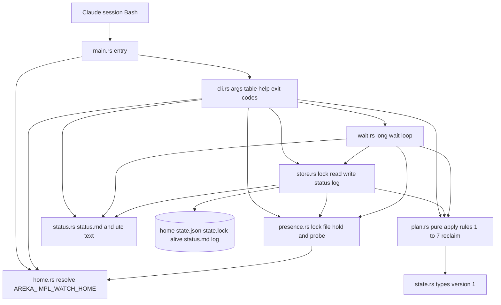
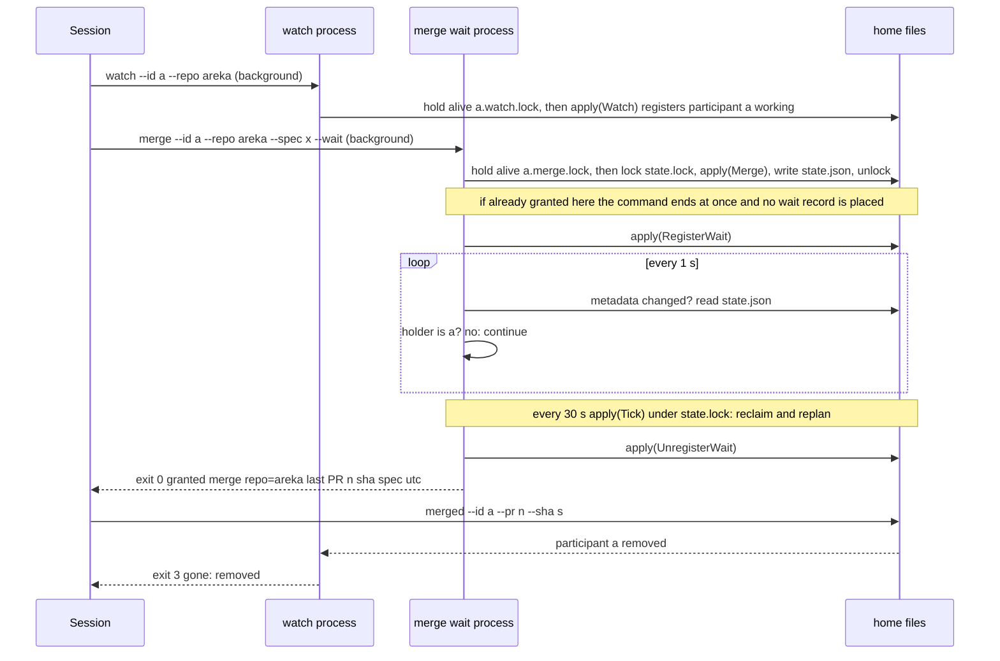
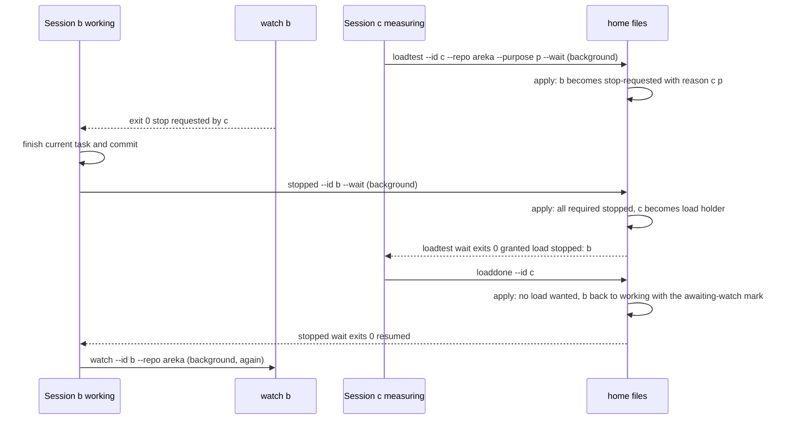
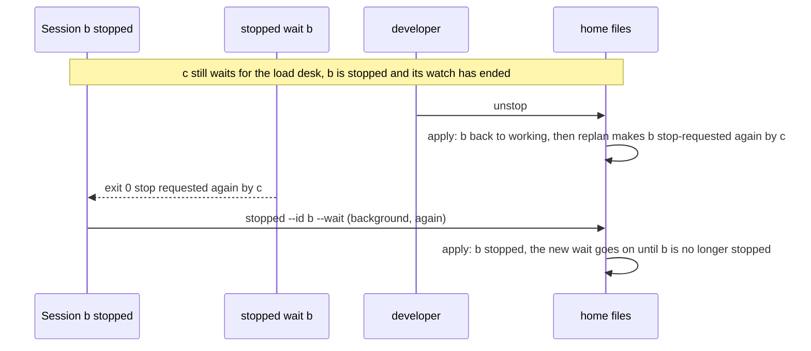
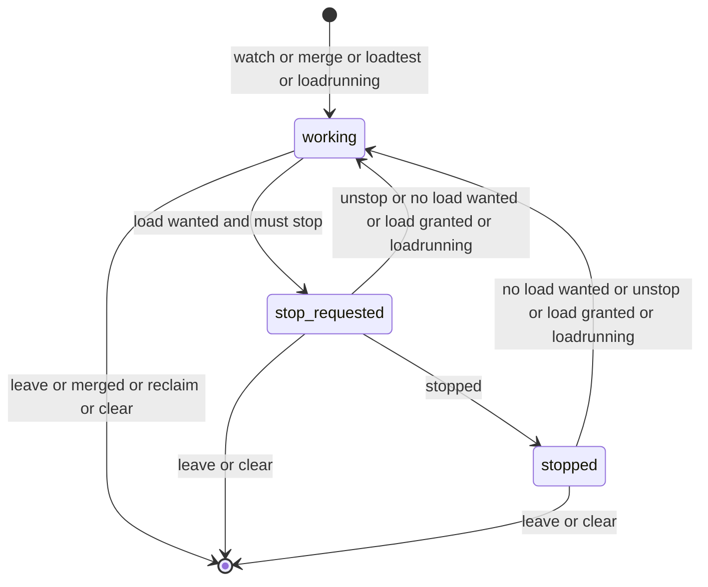

# 設計: areka-P0-impl-watch

作成: 2026-10-10（要件 1〜14 を確定した後）。要件は `requirements.md`、調べたことと選ばなかった案は `research.md`。この文書だけで実装の判断が付くように、決めたことは全部ここに書く。

改め: 2026-10-10（実装の後）。実装が設計から意図して違えた点（どれもレビューで受け入れ済み）を実物のとおりに書き直し、開発者の裁定 9 件を書き入れた。裁定の一覧は末尾の「実装の後の裁定（2026-10-10）」。

改め: 2026-10-10（裁定をコードへ入れた後）。できあがった実物と違っていた所を直した（実機テストは 11 本で支えを `tests/real/mod.rs` に分けた・`--help` の末尾・読み物が書けないときの警告の行の綴り・ファイルの大きさ・スキルの報告の分け方）。

## Overview

**目的**: 同じマシンで並んで走る実装セッションに、「マージの机」（リポジトリごとに 1 つ）と「負荷テストの机」（マシンに 1 つ）を 1 度に 1 人へ貸し出すコンソールアプリ `areka-impl-watch` を作る。各セッションは Bash から実行ファイルを直接呼ぶ。待ちは「番が来るまで終わらないコマンド」、止まる合図は「停止要請が出たら終わる見張りのコマンド」で表し、LLM のメッセージは 1 通も使わない。

**利用者**: 実装セッション（`kiro-impl`・`kiro-complete` を回す Claude セッション。スキルの書き替えは続きの spec）と開発者（状態の確認・手での取り下げ・`clear`）。

**変えるもの**: 今の調停役のセッション（スキル `kiro-watch`・PowerShell の状態機械）が持っている判断（規則 1〜7）を Rust の純粋な関数へ 1 対 1 で写し、状態をワークツリーの `target/` からマシン共通の置き場（環境変数 `AREKA_IMPL_WATCH_HOME`）へ移す。今のスキルとスクリプトは触らない。

### Goals
- 机の 1 往復（申し込み → 番 → 返却）と停止の 1 往復（停止要請 → 止まった → 再開）で、セッションが呼ぶコマンドを 2 つに抑え、セッションが起きるのはコマンドが終わる 1 回だけにする（要件 13）。
- 規則 1〜7 の判断を、時刻とプロセスの生死を外から渡す純粋な関数に集め、決定論テストで固定する（要件 12.1）。
- 落ちたセッションの机と待ち行列を、次の呼び出しが回収する（要件 7）。
- 状態ファイルは 1 つ・版つき・書きかけを読ませない・壊れたら退避して黙らない（要件 8）。
- 外部クレートの追加 0（`Cargo.lock` に増えるのは新しいクレート自身の 1 塊だけ）。

### Non-Goals
- スキル `kiro-impl`・`kiro-complete`・`kiro-watch` の書き替え（続きの spec）。
- Claude セッションへのメッセージ送信・セッション一覧の読み取り・常駐サーバー・GUI・crates.io への公開。
- 机の種類を増やすこと・貸し出しの履歴の集計・添え書き（`note`）・開発者への「空になった」の知らせ。
- 止まる時機（コミットの切れ目がどこか）の判断。アプリは合図を出すだけ。

## Boundary Commitments

### This Spec Owns
- 新しいクレート `crates/areka-impl-watch`（実行ファイル）の全部: 引数の解釈、置き場所の解決、状態の型と版、規則 1〜7 の判断、回収、状態ファイルの読み書きと排他、見張り・待ちのコマンド、状態の確認の読み物、ログ。
- 置き場所 `AREKA_IMPL_WATCH_HOME` の下のファイルの名前と形（状態ファイル・ロック・ログ・読み物・退避したファイル）。
- 終了コードとコマンドの表（呼び出し側の契約）。
- 手順書 `doc/impl-watch.md` と、新しいスキル `.claude/skills/kiro-watch-clear/SKILL.md`。

### Out of Boundary
- 識別（`--id`）に何を渡すか（ワークツリーの道筋か spec 名か）。この spec は形の決まり（ASCII・長さ・小文字への寄せ）だけを置く。決めるのは続きの spec。
- 見張りを「いつ始め、終わったらどう振る舞うか」の手順（スキルの仕事）。この設計は呼び方の約束（見張りを先に走らせる）を手順書に書くところまで。
- `tools/test-all.ps1`・`tools/package.ps1` の書き替え（どちらも触らずに済む）。
- `kiro-watch` のスキル・スクリプト・`messages.json`。

### Allowed Dependencies
- 標準ライブラリ（`std::fs::File::try_lock`／`try_lock_shared`／`unlock`、`std::path::Path::is_absolute`、`std::process::id`、`std::thread::sleep`）。
- ワークスペースに既に在るクレート: `serde`（派生）・`serde_json`・`thiserror`・`tracing`・`tracing-subscriber`（根の `Cargo.lock` に新しいクレートは増えない）。
- テストだけ: `temp-path-kit`（`TempPath::under_target`）。
- **使わないもの**: `windows` クレート（プロセス番号を開く API は使わない）、`chrono`、`fs2`／`fs4`、外部の引数解析ライブラリ、ワークスペースの他の本番クレート（leaf）。

### Revalidation Triggers
- 状態ファイルの形（`version` の値・項目の名前）を変えたとき → 版を上げ、手順書の「古い実行ファイルと混ざったとき」の説明と、`kiro-watch-clear` スキルを見直す。
- コマンドの名前・引数・終了コードを変えたとき → 手順書・`--help`・続きの spec（スキルの書き替え）を見直す。
- 置き場所の下のファイル名を変えたとき → 手順書の更新の手順を見直す。
- 「居る」の印の仕組み（見張りのロックファイル）を変えたとき → 回収の規則（要件 7）とスキルの呼び方の約束を見直す。

## Architecture

### Existing Architecture Analysis
- 判断の設計図は `.claude/skills/kiro-watch/kiro-watch.ps1` の `Invoke-Plan`（停止要請の発行 → 負荷テストの番 → 再開 → マージの番の順。何度呼んでも同じ結果）と `switch ($Command)` の各節。この設計は同じ順・同じ分岐を `plan.rs` の純粋な関数へ写す。写さないもの: `note`・`idleNotified`・送るメッセージの組み立て。
- 流用する前例: 引数の表と終了コード（`crates/ukadoc-survey`）、環境変数を引数で受ける純粋な関数（`crates/areka/src/boot_config.rs` の `resolve_root_from`）、一時ファイル → `sync_all` → `rename` の置き換え書き（`crates/areka-sylphya/src/persist/io.rs` の `FsPersistIo::commit`）、OS への口をトレイトにして偽物でテスト（`crates/areka-update/src/procedure.rs`）、`TempPath::under_target`、`#[ignore = "…"]` の理由に実行コマンドを書く形（`crates/areka-update/src/winhttp_real_tests.rs`）。
- 無かったもの（新しく書く）: 複数プロセスの排他・他プロセスの生死の確認・長い待ち・状態ファイルの版と退避・UTC の文字化。

### Architecture Pattern & Boundary Map

**選んだ形**: 「純粋な判断の中核 ＋ 薄い口（ファイル・時計・プロセスの生死）」。判断（`plan`）は `状態 + コマンド + いまの時刻 + 生死の答え → 新しい状態 + 出来事の列` の関数で、ファイルも時計もプロセスも触らない。口は 3 つ（置き場所のファイル、時計、ロックファイルによる生死）で、テストでは偽物に差し替える。



**依存の向き**（左から右へだけ読み込む。逆向きは誤り）: `error` → `state` → `plan` → `home`／`presence`／`status` → `store` → `wait` → `cli` → `main`。同じ段の中では `presence` が `home` を読む（居る印のファイル名 `<id>.<kind>.lock` の綴りを `Home::alive_path` の 1 か所に保つため。`home` は `presence` を読まない）。`plan` は `std::fs`・`std::time`・`std::process`・`tracing` を読み込まない（構造テストで見張る）。生死の口のトレイト `Presence` は `plan.rs` に置き、`presence.rs` はその実装だけを持つ（`plan` が `presence` を読む逆向きを作らない）。

**責任の分け方**:
- `plan` だけが「誰が持ち主になるか・誰に停止要請を出すか・誰を回収するか」を決める。他のファイルはこの関数を呼んで結果を書くだけ。
- `store` だけが置き場所のファイルを読み書きする（ロック・状態ファイル・退避・`status.md`・ログ）。
- `presence` だけがロックファイルを握る／探る（「居る」の印の唯一の実装）。
- `wait` は 4 種の長い待ち（見張り＝停止要請・マージの番・負荷テストの番・再開）を 1 つのループで回し、自分の条件の判定だけを持つ。待っている間、状態の判断はしない（判断は `store` 越しに `plan` を呼ぶ「周期の一回り」に委ねる）。

**原則との整合**: 失敗の経路は `error!` を出して `Err`（`logging.md`）。結果を変えずに `warn!` で残すものは Error Handling の「失敗にしないもの」に列挙する（読み物 `status.md` の書きの失敗など）。端末へ出す文は ASCII だけ、端末の文字コードは書き替えない（`tech.md`）。テストの一時フォルダは `target\` の下だけ。1 ファイル 1,000 行以下・テストは兄弟ファイル（`structure.md`）。

### Technology Stack

| 層 | 選択 | 役目 | 備考 |
|---|---|---|---|
| 実行ファイル | Rust 2024・`crates/areka-impl-watch`（bin）・`publish = false # 開発の道具（areka の外へ出さない）` | 全部 | `[package]` の中ほどに置く |
| 引数の解釈 | 自前（`ukadoc-survey` と同じ表 1 本） | コマンド 14 個＋`--help` | 外部ライブラリは入れない |
| 状態の形 | `serde`（派生）＋`serde_json` 1 | `state.json` の読み書き | どちらも `Cargo.lock` に在る |
| 排他 | `std::fs::File::try_lock`／`try_lock_shared`／`unlock`（Rust 1.89 で安定・道具は 1.99） | `state.lock`（状態の短い排他）と `alive/*.lock`（居る印） | Windows では `LockFileEx` |
| 生死の確認 | ロックファイルの共有の `try_lock_shared`（標準ライブラリだけ。握る側は排他の `try_lock`） | 見張りが居るか | `windows` クレートは使わない |
| 長い待ち | 1 秒ごとの読み直し（変わっていなければ中身を読まない） | 番・停止要請・再開 | 名前つきイベントは使わない |
| ログ | `tracing`＋`tracing-subscriber`（`fmt()` の subscriber を追記のファイルへ・ANSI 無し） | `impl-watch.log` | 時刻は subscriber が付ける |
| 失敗の型 | `thiserror` 2 | `WatchError` | 全クレート共通の規約 |
| テスト | `temp-path-kit`（dev）・`#[ignore]` の実機テスト | 置き場所は `target\test-roots\` の下 | 全体テストが常時テストを自動で拾う |

## 設計の論点 14 件の決定

`research.md` の「設計へ持ち越す論点」1〜14 に対する答え。理由は 1 行ずつ。「2026-10-10 の裁定」と書いた所は、実装の後に開発者の裁定で改めた決定。

| # | 論点 | 決定 | 理由 |
|---|---|---|---|
| 1 | セッションを代表するプロセス | **見張り `watch` のプロセスが「居る」印**。`hold` は置かない（要件の討議で裁定済み） | 印は 1 種類だけ・作業中も待ちも持ち主の間も見張りは走り続ける |
| 2 | 生死の確認の方式 | **B-std＝参加者ごとのロックファイル** `alive/<id>.watch.lock` を見張りが排他（`try_lock`）で握る。確認（探り）は共有の `try_lock_shared` が成功するか（成功＝居ない）。成功したら直ちに `unlock`。探りを共有にするのは、同時に走った 2 つの探りが互いを「居る」と見誤らないため（2026-10-10 の裁定。元の決定は排他の `try_lock`） | 標準ライブラリだけ・ロックはプロセスの死と一緒に OS が解くのでプロセス番号の使い回し（7.4）が問題にならない・権限の違いに左右されない |
| 3 | 待ちの方式 | **1 秒ごとの読み直し**。読む前に状態ファイルの更新時刻と大きさを見て、変わっていなければ中身を読まない（10 回に 1 回は必ず読む）。30 回に 1 回「周期の一回り」（排他の中で回収と再計画）を行う | 標準ライブラリだけ・1 秒に 1 回の `metadata` は静かな机の計測を乱さない・セッションは起こさない（13.1・13.5）。「周期の一回り」が無いと、待っている者しか居ないときに落ちた持ち主を誰も回収しない |
| 4 | 排他の形 | 状態ファイルとは別の `state.lock` 1 つ。状態を変えるコマンドは排他ロックの中で「読む → `plan::apply` → 状態ファイルの置き換え書き → 出来事をログへ → `status.md` 書き」。読むだけ（`status`・待ちの読み直し）はロックを取らない。ロックの待ちは `try_lock` を 10 ms 間隔で最長 10 秒、超えたら失敗（終了コード 1）。一時ファイルの名前はプロセス番号入り（`state.json.<pid>.tmp`・`status.md.<pid>.tmp`）で、ロック無しの `status` と状態を変える呼び出しが同時に `status.md` を書いてもぶつからない。`rename` は 20 ms × 5 回まで試す（読む側がロック無しで開いている一瞬のため）。状態ファイルの置き換えが 5 回とも通らなければ失敗（1・元は無傷）。`status.md` の書きの失敗は失敗にしない（`warn!` 1 行。正本は状態ファイル 1 つで、`status.md` はそこから作り直せる読み物。2026-10-10 の裁定） | 置き換え（`rename`）の相手はロックできない・読むだけの側は置き換え書きのおかげで常に一貫した中身を見る（8.1・8.2・6.6） |
| 5 | 状態ファイルの版 | 最上位に `"version": 1`。知らない版（数字の版が 1 以外。0 も含む）は読まず上書きもせず ASCII の文で終了コード 1。壊れたファイル（JSON として読めない・形が合わない・版の数字が無い）は `state.json.broken-<UTC>` へ改名して空から始める（同じ秒の 2 度目は末尾に `-1` のように番号を足す） | 8.5〜8.7 のとおり |
| 6 | 終了コードの表 | **0＝できた（番が来た・停止要請が出た・再開した・停止要請が出し直された・変えた）／1＝失敗（環境変数・状態ファイル・ロック・読み書き・同じ待ちがすでに走っている）／2＝使い方の誤り（`-h` と引数なしも）／3＝当てはまらなかった（番は来なかった＝取り下げ・離脱・回収・`clear` で消えた、または条件に合わず状態を変えなかった）**。環境変数の失敗を 1 から分けない。標準出力に文が出るのは 0 のときだけで、3 の文（`gone: …`・`not applied: …`）は標準エラーへ出す | Bash の `$?` で 3 通りに読み分けられれば足りる（6.5）。「持ち主でない」「停止要請中でない」の断り（3.10・4.9・4.11・5.7）も 3 に載せると、呼び出し側が「状態は変わっていない」と一律に読める（ただし同じ呼び出しの先頭の回収の分は書かれる。`plan.rs` の節） |
| 7 | 日本語の値の読ませ方 | 置き場所の下に `status.md`（UTF-8）を、状態を変えるたびと `status` のたびに書く（書けなくてもコマンドは失敗にしない＝論点 4）。端末には ASCII の要約だけ。名前（`--name`）と内容（`--purpose`）は端末へ出さない。識別・リポジトリ名・spec 名は ASCII に限る（下の「引数の形」） | `kiro-watch` と同じ前例・Claude は `Read` で読める（9.2・9.3・13.2） |
| 8 | ログの形 | `tracing`＋`tracing_subscriber::fmt().with_writer(Mutex<File>)`（追記で開く・`with_ansi(false)`・`try_init`）。出来事は `plan::apply` が返す列を `store` が 1 行ずつ書く（`info!`。壊れたファイルを退避した行だけ `warn!`。どの行にもこのプロセスが受けたコマンド名 `command="…"` が載る）。失敗は `error!` | `logging.md` の規約どおり・時刻の付与は subscriber が持つ・依存は増えない |
| 9 | 時刻の持ち方 | 状態は UNIX 秒（`u64`）。人が読む形は自前の UTC `YYYY-MM-DDTHH:MM:SSZ`（20 行ほど・`status.rs`）。ファイル名に使うときは `YYYYMMDDTHHMMSSZ` | `chrono` を直接依存に足さない・ローカル時刻は `windows` クレートが要る |
| 10 | 手順書の置き場 | `doc/impl-watch.md`（`doc/crates-io-publish.md` の前例）。更新の手順は 2 通り書く: (a) `status` で走っている待ち・見張りが無いことを確かめてから置き換える（要件 11.3 の字のとおり）、(b) 誰かが走らせている間は、動いている `areka-impl-watch.exe` を `areka-impl-watch.old.exe` に改名してから新しいものを置く（Windows は動いている exe の改名ができる） | 要件 11.3 の文言は変えずに済む（論点 14） |
| 11 | 識別の形 | `--id`・`--repo`・`--spec` は `[A-Za-z0-9._-]` の 1〜100 字。外れたら終了コード 2。**識別（`--id`）は引数を読んだ時点で ASCII の小文字に寄せ、以後（状態ファイルの鍵・ロックファイルの名前・出力の行）は小文字の形だけを使う**（2026-10-10 の裁定）。何を渡すかは続きの spec | ロックファイル名と端末の ASCII に直結する。Windows では `alive/A.watch.lock` と `alive/a.watch.lock` が同じファイルなので、寄せないと `A` と `a` が別の参加者なのに居る印を取り合う |
| 12 | コマンドの対応 | 下の「コマンドの表」。`join`（`watch` が兼ねる）・`note`・`next`（周期の一回りを `tick` として残す）を置かない。申し込みと待ちは `--wait` で 1 コマンド、「止まった」と再開の待ちも `stopped --wait` で 1 コマンド。再開の待ちは「止まった」でなくなったら終わる（作業中に戻った → `resumed`／停止要請が出し直された → `stop requested again by <id>`。2026-10-10 の裁定。元の決定は「作業中に戻るまで」）。値を取る引数は `--` で始まる値を断る（2026-10-10 の裁定） | 往復のコマンド数を最小にする（13.4）。出し直しを見ない待ちは、取り消しの直後に停止要請が出し直された参加者を誰も起こさず、負荷テストの番が来なくなる（5.12） |
| 13 | 実行ファイルを置き換えてよいかの確かめ方 | 状態ファイルの「走っている待ち・見張り」の記録を `status` で示す。実行ファイルを書き込みで開く確かめは置かない | 記録の抜け（殺された待ち）は論点 10 の (b) の手順で逃げられる |
| 14 | 要件 11.3 の文言 | 変えない（論点 10 で両方の手順を書く） | — |

## コマンドの表

実行ファイルは `%AREKA_IMPL_WATCH_HOME%\areka-impl-watch.exe`。引数は `--名前 値` の形（`--bug`・`--wait` は値なし）。識別（`--id`）は読んだ時点で小文字に寄せるので、下の表と出力の `<id>` はどれも小文字の形である。

| コマンド | 引数 | すること | 終わり方（終了コード） | 端末の出力（ASCII・1〜数行。0 のときは標準出力・3 のときは標準エラー） |
|---|---|---|---|---|
| `watch` | `--id --repo [--name]` | 参加（無ければ登録・あれば名前とリポジトリを更新）し、`alive/<id>.watch.lock` を握って**居る印**になり、自分宛ての停止要請が出るか自分の記録が消えるまで終わらない | 0＝停止要請が出た（またはすでに止まっている）／3＝記録が消えた（離脱・マージ済み・回収・`clear`）／1＝同じ識別の見張りがすでに走っている・失敗（`merge --wait` 等も同じ識別・同じ種類の待ちが走っていれば 1） | 0: `stop requested by <id>`（すでに止まっているときは `already stopped; run stopped --wait or resume`）と、2 行目に必ず `details: <home>\status.md`／3: `gone: removed` |
| `merge` | `--id --repo --spec [--bug] [--name] [--wait]` | 参加を兼ね、そのリポジトリのマージの待ち行列に加える（二重には加えない）。`--wait` なら番が来るまで終わらない | 0＝番が来た（`--wait` 無しなら「並んだ」も 0）／3＝申し込みが消えた（`--wait` つきだけ） | 0: `granted merge repo=<r>; last: PR#<n> <sha> <spec> <utc>`（無ければ `last: none`。`--wait` 無しでも、直ちに番を受けたらこの行）／並んだだけなら `queued merge repo=<r> pos=<n>`（1 始まり・番の来る順で数える）／3: `gone: request gone` |
| `merged` | `--id --pr --sha` | マージの机を空け、「直前のマージ」を記録し、参加者の記録を消す | 0／3＝持ち主でない | 0: `merged repo=<r>`（空けた机 1 つにつき 1 行）／3: `not applied: not the merge holder` |
| `loadtest` | `--id --repo --purpose [--name] [--wait]` | 参加を兼ね、負荷テストの待ち行列に加える（二重には加えない）。申し込んだ者の状態（作業中・停止要請中・止まった）は変えない。`--wait` なら番が来るまで終わらない | 0＝番が来た（`--wait` 無しなら「並んだ」も 0）／3＝申し込みが消えた（`--wait` つきだけ） | 0: `granted load; stopped: <id>, <id>`（居なければ `stopped: none`。`--wait` 無しでも、直ちに番を受けたらこの行）／並んだだけなら `queued load pos=<n>`（1 始まり・番の来る順で数える）／3: `gone: request gone` |
| `loadrunning` | `--id --repo --purpose [--name]` | すでに走っている負荷テストを、停止要請を出さずに持ち主として記録（走っている印）。机に持ち主が居れば、参加もさせずに断る（持ち主本人のやり直しも断る） | 0／3＝持ち主が居る | 0: `recorded running load`／3: `not applied: the load-test desk already has a holder` |
| `loaddone` | `--id` | 負荷テストの机を空ける | 0／3＝持ち主でない | 0: `load done`／3: `not applied: not the load-test holder` |
| `stopped` | `--id [--wait]` | 「止まった」を記録（当てはまるのは「停止要請中」の参加者だけ）。`--wait` なら記録に続けて再開の待ちに入り、自分が「止まった」でなくなるまで終わらない（停止要請中でなければ記録せずに再開の待ちだけ。すでに作業中に戻っていれば直ちに 0 `resumed`） | 0＝記録した（`--wait` なら再開した、または停止要請が出し直された）／3＝停止要請中でない（`--wait` 無し）・記録が消えた（`--wait` つき） | 0: `stopped`。`--wait` つきは `resumed` か `stop requested again by <id>`／3: `not applied: not asked to stop`。`--wait` つきは `gone: removed` |
| `resume` | `--id` | 再開の待ちだけ（`stopped --wait` が途中で殺されたときの始め直し）。すでに作業中なら直ちに終わる。停止要請中のときも直ちに終わる（「止まった」をまだ報告していないので、`stopped --wait` を呼ぶ） | 0＝再開した・停止要請が出し直された／3＝記録が消えた | 0: `resumed` か `stop requested again by <id>`／3: `gone: removed` |
| `unstop` | `[--id]` | 停止要請の取り消し（全員または識別の指定）。走っている印の無い負荷テストが持たれ・待たれていれば、同じ呼び出しの中で出し直す | 0／3＝対象が居ない | 0: `unstopped n=<n>`（作業中へ戻した人数。出し直した停止要請は数えない）／3: `not applied: nobody to unstop` |
| `cancel` | `--id` | その識別のすべての申し込みと机を外す（参加者の記録は残す） | 0 | `cancelled` |
| `leave` | `--id` | その識別の申し込み・机・参加者の記録を消す | 0 | `left` |
| `tick` | なし | 回収と再計画だけ（`clear` の退避を手で戻した後など） | 0 | `tick` |
| `status` | なし | 状態を変えずに読み（ロック無し・回収もしない）、`status.md` を書き、ASCII の要約を出す。見張りの無い参加者に `absent` の印。状態ファイルが無ければ、何も作らず `status.md` も書かない | 0／1＝状態ファイルが壊れている・版が合わない | 下の「状態の確認」。状態ファイルが無ければ `no state file` |
| `clear` | なし | 状態ファイルを `state.json.cleared-<UTC>` へ退避し、版と「消した記録」だけの空の状態を書く。今のファイルは読まない（壊れていても、版が合わなくても通る）。問い合わせはしない | 0 | `cleared; backup: <path>`（退避するものが無ければ `cleared; backup: none`） |
| `--help` | なし | コマンド・引数・終了コードの対応を ASCII で出す（置き場所を解決しないので、環境変数が無くても出る） | 0 | 使い方（末尾に、終了コードの 4 行と、識別が小文字に寄ることの 1 行。綴りは `cli.rs` の節） |

共通:
- 使い方の誤り（引数が足りない・知らないコマンド・形に合わない値・同じ引数を 2 度・そのコマンドが受けない引数）→ 何も変えず（置き場所も解決しない）、ASCII の 1 行 `usage error: <何が違うか>; see areka-impl-watch --help` を標準エラーへ出して 2。`-h` と引数なしの呼び出しも使い方の誤りである（使い方を出すのは `--help` だけ）。
- 環境変数が無い・空（ASCII の空白だけも含む）・絶対パスでない・フォルダを作れない → ASCII の 2 行以内（「`AREKA_IMPL_WATCH_HOME` を設定してください」「絶対パスにしてください」の趣旨・手順書の場所。実物はどれも 1 行）を標準エラーへ出して 1（何も読み書きしない）。
- 標準出力には結果（終了コード 0 の文）だけ。断り（`not applied: <訳>`）・「消えた」（`gone: <訳>`）・失敗（`WatchError` の文）は標準エラー（`ukadoc-survey` と同じ）。
- 順は「引数を読む → `--help` ならここで終わる → 置き場所の解決 → コマンドの手順」。
- 待つコマンド（`watch`・`merge --wait`・`loadtest --wait`・`stopped --wait`・`resume`）の手順は「**居る印を握る → 申し込み（または「止まった」の記録）→ 待ち**」。同じ識別・同じ種類の待ちがすでに走っていて印を握れなければ、申し込みも回収も通らずに `a <種類> wait for <id> is already running` で 1（状態ファイルは変わらない。種類は `watch`・`merge`・`load`・`resume` で、`stopped --wait` と `resume` は同じ種類）。申し込みの時点でもう条件が満ちていれば（番が来ている・作業中に戻っている・停止要請が出し直されている・記録が無い）、待ちの記録を置かずに直ちに終わる。待っている間は何も出さない。

**呼び方の約束**（手順書に書く・続きの spec がスキルへ写す）:
- セッションは最初に `watch` をバックグラウンドで走らせ、その後に `merge`／`loadtest`／`loadrunning` を呼ぶ。見張りの無い「作業中」の参加者は次の呼び出しで回収されるため、順を逆にすると申し込みが消えることがある（消えたら待ちが 3 で終わるので、`watch` を立ててから申し込み直す）。再開した後も、次の `merge`／`loadtest` の前に `watch` を立て直す。
- 止まっている間に負荷テストの番を受けたら（見張りは停止要請で終わっている）、負荷テストを始める前に `watch` を立て直す。
- 停止要請を受けたら、次にしたいことが負荷テストの申し込みでも、コミットの切れ目で「止まった」を報告する（`loadtest` は申し込んだ者の状態を変えないので、申し込んだだけでは停止要請中のままで、候補の番を止め続ける）。
- 再開の待ちが `stop requested again by <id>` で終わったら、もう一度 `stopped --wait` を呼ぶ。
- `watch` が 1 で終わったら直ちに立て直す（立て直すまでに他の呼び出しが来ると回収される）。

### 引数の形
- `--id`・`--repo`・`--spec`: `[A-Za-z0-9._-]` の 1〜100 字。
- `--id` だけは、形を確かめた後に ASCII の大文字を小文字へ寄せる（`cli::parse` の 1 か所）。その先（`plan::Command` の識別・状態ファイルの鍵・ロックファイルの名前・出力の行・ログ）へ渡るのは小文字の形だけ。`--repo`・`--spec` は寄せない。
- `--name`・`--purpose`: `--` で始まらない任意の文字列（UTF-8 のまま状態ファイルと `status.md` へ。端末へは出さない）。
- `--pr`: 数字だけ。`--sha`: `[0-9a-fA-F]` の 7〜40 字。
- 値を取る引数は、どれも `--` で始まる値を断る（使い方の誤り・2。`--name`・`--purpose` も同じ。例: `--purpose "--release build x5"`）。断らないと、空の変数を引用符なしで渡したとき（`--spec $SPEC --bug`）に次の引数が値の場所へ来て黙って通り、`--name $NAME --wait` は `--wait` を名前に食って待たずに 0 で返る。
- `--name` を省いたら `None` のまま渡す（識別を詰めて渡さない）。初めての参加では識別が名前になり、2 度目からは元の名前のまま変わらない。

## 往復のコマンド数（要件 13.4）

セッションが起きるのは「コマンドが終わる」ときだけ。`watch` はセッションの最初に 1 回立て、停止要請で終わるまで走り続ける。

| 往復 | 呼ぶコマンド | 数 | セッションが起きる回数 |
|---|---|---|---|
| マージの机 | ① `merge --id --repo --spec [--bug] --wait`（バックグラウンド・番が来て終わる）② `merged --id --pr --sha` | 2 | 1（①の終わり） |
| 負荷テストの机 | ① `loadtest --id --repo --purpose --wait`（バックグラウンド）② `loaddone --id` | 2 | 1（①の終わり） |
| 停止 | （走らせてある `watch` が終わる）① `stopped --id --wait`（バックグラウンド・再開で終わる）② `watch --id --repo`（立て直し・バックグラウンド） | 2 | 2（`watch` の終わり・①の終わり） |
| 走っている負荷テストの記録 | ① `loadrunning` ② `loaddone` | 2 | 0 |
| 参加の始まり／終わり | `watch`（バックグラウンド）／`leave`（`merged` は離脱を兼ねる） | 1／1 | 0 |

同じ情報を 2 度呼ばせない: 「直前のマージ」は①の終わりの出力に載る（3.9）。「止まった参加者」も①の終わりの出力に載る（4.7）。停止要請の理由は `watch` の終わりに載る（5.5）。待ちを始め直しても申し込みは二重にならない（6.2）。

参加の終わり（`merged`／`leave`）では、走っていた `watch` が 3 で終わるのでセッションがもう 1 回起きる（行動は要らない）。この 1 回は「居る印を見張りのプロセスで表す」以上避けられないので、表には数えず、ここに書いておく。

止まっている間に停止要請が出し直されたとき（`unstop` の後も負荷テストの申し込みが残っていた）は、停止の往復の①が `stop requested again by <id>` で終わり、セッションはもう 1 度①を呼ぶ（このときだけコマンドが 1 つ・起きる回数が 1 回増える）。出し直しを知らせる者がほかに居ないので、この 1 回は要る（5.12・5.13）。止まっている間に負荷テストの番を受けたときは、②の `watch` の立て直しを負荷テストの前に行う。

## File Structure Plan

### Directory Structure
```
crates/areka-impl-watch/
├── Cargo.toml                  # bin・publish = false # 開発の道具（中ほどの行）・依存は serde = { version = "1", features = ["derive"] } と serde_json = "1"（根の [workspace.dependencies] に無いのでクレート側で書く・dola と同じ）・thiserror / tracing / tracing-subscriber は workspace = true・dev は temp-path-kit
└── src/
    ├── main.rs                 # 引数（Unicode に直せないものは置き換えの字にして）と home::env_value() の値 → cli::run → cli::exit_code → 終了コード（判断を持たず、何も出さない）・main_layering_tests.rs の接続
    ├── main_layering_tests.rs  # 構造テスト（手書きの走査・コメントは捨てる）: (1) plan.rs の本文が std::fs / std::time / std::process / std::{ / std::* と、1 語の tracing / SystemTime / Instant / File を綴らない（走査は plan.rs だけ。兄弟の plan_*_tests.rs と plan_test_support.rs はテストなので時刻や偽の口を使ってよく、対象に入れない） (2) cli.rs・status.rs・wait.rs・error.rs の文字列・文字のリテラルが ASCII
    ├── error.rs                # 失敗の型 WatchError（thiserror・文は ASCII の 1 行）・道筋を端末へ出せる形にする escape_path（home.rs が cli を読めないのでここに置く。cli・status・wait も使う）
    ├── error_tests.rs          # 文が ASCII の 1 行・OS と JSON の失敗の写しに元の文が混ざらない
    ├── cli.rs                  # 引数の解釈・コマンドの表・--help・終了コードへの写像・各コマンドの手順（change／status／clear／waiting）
    ├── cli_tests.rs            # 引数の表・使い方・誤り（2）・環境変数の無い警告終了（1）・出力が ASCII だけ
    ├── cli_commands_tests.rs   # 直ちに終わるコマンドの手順（状態を変える 1 回・status・clear）を本物の口で
    ├── cli_wait_tests.rs       # 待つコマンドの手順（直ちに終わる場合・最初の眠りまで走らせて状態を見る場合）
    ├── cli_test_support.rs     # cli のテストの支え（差し替えた書き手での実行・一時の置き場所・居る印。呼ぶたびに出力が ASCII かを確かめる）
    ├── home.rs                 # AREKA_IMPL_WATCH_HOME の解決（値を引数で受ける純粋な関数 resolve ＋ env を読む 1 行 env_value）・置き場所の下のパスの組み立て
    ├── home_tests.rs           # 無い・空・空白だけ・絶対パスでない・作れない・作る
    ├── state.rs                # 状態の型（version 1）・serde・空の状態・参加者の状態の列挙・WaitKind の ASCII 名
    ├── state_tests.rs          # JSON の往復・版の読み取り・空の状態・clear の後の状態・recent の上限
    ├── plan.rs                 # 純粋な判断 apply(state, cmd, caller, now, alive) -> Applied。規則 1〜7・回収・再計画・出来事
    ├── plan_desk_tests.rs      # 規則 1・3・4・6（参加・机と待ち行列）
    ├── plan_stop_tests.rs      # 規則 2・5・7（停止要請・止まった・再開・取り消し・走っている印）
    ├── plan_reclaim_tests.rs   # 回収（居ない見張り・待ちの記録・停止要請中と見張り待ちは回収しない・同じ呼び出しで番を決め直す）
    ├── plan_test_support.rs    # 偽の生死（HashSet）・状態の組み立て・時刻の定数
    ├── presence.rs             # ロックファイルの「握る」（hold → Held）と「探る」（LockFilePresence＝Presence トレイトの本物の実装）
    ├── presence_tests.rs       # 握っている間は探りが「居る」・解いたら「居ない」・2 つの探りが互いを見誤らない（target\ の下の本物のファイル・同じプロセス内）
    ├── store.rs                # state.lock の排他（try_lock 10 ms × 最長 10 秒）・読み（版の検査・壊れたファイルの退避）・置き換え書き・ログの初期化と出来事の記録・status.md 書き・「状態を変える 1 回」(with_state)・読むだけ（read_only）・状態の確認（summary）・全部消す（clear）
    ├── store_tests.rs          # 排他・読み（無い→作る・壊れた→退避・版違い→読まない）・置き換え書き・ロックの待ちの上限
    ├── store_ports_tests.rs    # ログの口へ渡る出来事の列と順・読むだけの口・状態の確認・全部消す・status.md が書けないときの扱い
    ├── store_test_support.rs   # store のテストの支え（時刻の定数・偽の生死・口の組み立て・置き場所の中身の読み取り）
    ├── status.rs               # status.md の組み立て（UTF-8）・端末向け ASCII の要約・番の来る順の並べ方（merge_order／load_order）・直前のマージの 1 行（last_merge）・UTC の文字化
    ├── status_tests.rs         # 日本語が端末向けに混ざらない・absent／awaiting-watch の印・1 行目の数・UTC の文字化の境界
    ├── wait.rs                 # 4 種の長い待ち（見張り・マージの番・負荷テストの番・再開）: 終わりの判定 judge と、共通のループ run（登録 → 判定 → 読み直し → 周期の一回り → 抹消）。口（WaitPort）で差し替え・本物の口は impl WaitPort for Store
    ├── wait_tests.rs           # 終わりの判定（judge）: 状態を組み立てて渡すだけ
    ├── wait_loop_tests.rs      # ループ（run）: 偽の口で、直ちに終わる・番が来て終わる・消えて 3・周期の一回りが呼ばれる・変わっていなければ読まない・失敗の扱い
    └── wait_test_support.rs    # wait のテストの支え（時刻の起点・待つものの組み立て）
crates/areka-impl-watch/tests/
├── real.rs                     # #![cfg(windows)]・11 本とも #[ignore]: 本物の実行ファイル（CARGO_BIN_EXE_areka-impl-watch＝統合テストだけに渡る）を子プロセスで立てて 取得待ち・返却・見張りの起床・回収・clear・同時の変更・開いたままの置き換え・ログの行・読み物が書けないとき・置き場所の無い呼び出し を通す（cargo test -p areka-impl-watch --test real -- --ignored --nocapture＝11 本で約 30 秒。短い形は末尾に --skip a_waiter_reclaims＝10 本で約 7 秒）
└── real/
    └── mod.rs                  # 実機テストの支え（一時の置き場所 Desk・立てた子プロセス Running・終わった子の姿 Done・状態ファイルの読み取り）。real.rs が #[path = "real/mod.rs"] mod support; でつなぐ。フォルダの下に置くので別のテストの入口にならない（テストの入口は real の 1 つのまま・実行コマンドも同じ）
doc/impl-watch.md               # 入れ方・更新・呼び方の約束・コマンドと終了コードの表
.claude/skills/kiro-watch-clear/SKILL.md   # clear を呼んで status を呼び、日本語で短く報告する
```

接続は `structure.md` の形（本番ファイルの末尾に `#[cfg(test)] #[path = "<stem>_<module>.rs"] mod <module>;`。`main.rs` の兄弟は `main_<module>.rs`）。実機テストは `CARGO_BIN_EXE_<name>` が統合テストにしか渡らないので `tests/real.rs` に置き、その支えは `tests/real/mod.rs` に置いて `#[path = "real/mod.rs"] mod support;` でつなぐ（`tests/` の直下に置くと、それだけで別のテストの入口になるため）。どのファイルも 1,000 行以下（最も大きいのは本番の `cli.rs` の約 830 行で、次がテストの `cli_tests.rs` の約 810 行。本番ファイルで `cli.rs` に続くのは `plan.rs` の約 700 行。テストは 1,000 行の決まりのために `cli_*`・`store_*`・`wait_*` を分けてあり、実機テストも同じ訳で、本体の `tests/real.rs`＝約 690 行と支えの `tests/real/mod.rs`＝約 320 行に分けてある）。`plan.rs` で `std` から読み込むときは 1 行に 1 つで書く（`use std::{…}` のまとめ書きは構造テストが赤にする）。

### Modified Files
- `Cargo.lock` — 新しいクレートの 1 塊が増えるだけ（依存は全部既に在る）。
- 根の `Cargo.toml`・`tools/test-all.ps1`・`tools/package.ps1` — 触らない（`crates/*` を丸ごと拾う・常時テストは自動で入る・zip は名指しなので入らない）。

## System Flows

### マージの 1 往復


### 停止の 1 往復


### 止まっている間に停止要請が出し直されたとき

再開の待ちは「作業中」を 1 度も見ない（同じ呼び出しの中で「止まった → 作業中 → 停止要請中」と進む）。見張りはすでに終わっているので、出し直しを知らせられるのは再開の待ちだけである。そこで再開の待ちは「止まった」でなくなった時点で終わり、行き先が「停止要請中」なら `stop requested again by <id>` を出す（`<id>` は記録された停止要請の理由の `by`）。前の待ちが終わってから次を呼ぶので、同じ種類の待ちが 2 本重なることは無い。

### 参加者の状態


流れの決めごと:
- 判断は全部 `plan::apply` の中で起きる。待ちのプロセスは「自分の条件を状態から読む」だけで、他人の状態を変えない（自分の記録の登録と抹消のほかは、「周期の一回り」のときに `apply(Tick)` を呼ぶだけ）。
- `apply` は毎回 ①回収 → ②コマンドの処理 → ③再計画（停止要請の発行 → 負荷テストの番 → 再開 → マージの番）の順。`Invoke-Plan` と同じで、何度呼んでも同じ結果。
- 回収は「作業中」かつ見張りの印が無い参加者だけ（停止要請中・止まったは回収しない＝7.7）。いま呼んでいる識別（`caller`）は同じ呼び出しでは回収しない（`merge` が自分の参加を作った直後に自分を回収しないため）。
- **見張り待ちの印（`awaiting_watch_since`）の付いた参加者も回収しない**。「停止要請中」「止まった」から「作業中」へ戻った参加者は、見張りが停止要請で終わっていて、セッションが起きて `watch` を立て直すまでに LLM の往復（秒〜分）がある。その間に他の呼び出しが来ても落ちたとは見なさない。`status` は `awaiting-watch` の印で示す。
- 印を付けるのは次の 2 つ。
  1. 「停止要請中」「止まった」から「作業中」へ戻す全部の箇所: 再計画の再開の段（負荷テストが無くなった）・負荷テストの番を受けた持ち主・`unstop`・`loadrunning` で持ち主になった呼び手。戻すのは中核の 1 関数（`plan.rs` の `back_to_work`）だけで、`status = Working` の代入はそこにしか無い。1 か所でも付け忘れると、止まっていて番を受けた持ち主（見張りの無い「作業中」）を、負荷テストの最中に回収が外してしまう。
  2. 見張りが自分の記録を抹消したとき: `UnregisterWait { kind: Watch }` が実際に記録を消し、その時点で参加者が「作業中」なら付ける（2026-10-10 の裁定）。停止要請を読んで終わりかけの見張りが抹消を呼ぶまでの数ミリ秒の間に再開（`unstop`・`loaddone`）が入った場合がこれに当たる。付けないと、見張りが終わってからセッションが `watch` を立て直すまでの間に、他の呼び出しがその参加者を回収する。
- 印を消すのは、`Command::Watch`（見張りの開始）と、回収の確認で印つきの参加者の見張りが居ると分かったとき（`is_present` が真。印だけを消し、参加者はそのまま）。上の 2 の抹消の呼び出しでは、先頭の回収の段が「自分のロックで居る」と見て印を消した後に、コマンドの処理の段が付け直す（順が「回収 → コマンド」なので、付けた印はその呼び出しの終わりまで残る）。
- 印の付いた参加者は「作業中」なので停止要請の対象になり、その場合は立て直した `watch` が直ちに 0 で終わる（5.4）。停止要請が出ても印の時刻は残るが、`status` が `awaiting-watch` と示すのは「作業中」の間だけ。
- 知っている弱点（受け入れ済み）: 印つきの負荷テストの持ち主（止まっていて番を受けた・`loadrunning` で戻った）が、見張りを立て直す前に落ちると、自動では回収されない（`leave`／`clear` で手で外す）。また上の 2 で、抹消の書きが済んでから見張りのプロセスが居る印を解くまでのごく短い間に他の呼び出しの探りが入ると、印が消えて次の呼び出しで回収されうる（待ちが 3 で終わるので、`watch` を立てて申し込み直す）。
- `loadtest` は申し込んだ者の状態を変えない（2026-10-10 の裁定。元の設計は「自分の状態を `Working` に戻す」）。止まっている・停止要請中の参加者が申し込んでもそのままで、番を受けたときに「作業中」へ戻る。戻すと、見張りの終わっている参加者が誰にも知らされずに「停止要請中」へ落ち、候補の番を止め続ける（5.9 にも反する）。
- 回収や離脱で参加者が消えたら、その識別の待ちの記録（`waits`）も消す。待ちの記録のうち、ロックファイルが解かれているもの（殺された待ち）も回収で消す（6.7）。呼んだ識別の記録も同じ扱い（走っている待ちは自分のロックを握っているので「居る」と答えが返る）。
- `clear` と壊れたファイルの退避は「改名してから書く」ので、ロック無しの読み手が一瞬「状態ファイルが無い」を見うる。待ちの判定は、状態ファイルが無いことを「参加者の記録が無い」と同じ「消えた」（3）に倒す。

## Requirements Traceability

| 要件 | 要旨 | 部品 | 契約・流れ |
|---|---|---|---|
| 1.1, 1.2 | 置き場所は環境変数だけ・設定ファイル無し | `home.rs` | `resolve(value)`・置き場所の下は state.json / state.lock / alive / status.md / impl-watch.log / 退避ファイルだけ |
| 1.3 | 無い・空・作れない → ASCII 1〜2 行・何も読み書きせず非 0 | `home.rs`・`cli.rs` | `WatchError::HomeUnset`（空は ASCII の空白だけも含む）／`HomeNotCreatable` → 標準エラー → 終了コード 1 |
| 1.4 | 無ければ作る | `home.rs` | `create_dir_all` |
| 1.5 | 実行ファイル 1 つ・cargo 無しで使う | `Cargo.toml`・手順書 | コピーして直接呼ぶ |
| 1.6 | 絶対パスでない値を断る | `home.rs`・`cli.rs` | `Path::is_absolute` が偽 → `WatchError::HomeNotAbsolute` → 標準エラー → 終了コード 1（フォルダを作らない） |
| 2.1, 2.2 | 参加・名前の更新 | `plan.rs`（`join`） | `watch`／`merge`／`loadtest`／`loadrunning` が兼ねる |
| 2.3 | 参加していない識別の申し込みも参加扱い | `plan.rs` | 各申し込みの処理の先頭で `join`（`LoadRunning` は、断るときは `join` しない） |
| 2.4 | 離脱で全部外す | `plan.rs`（`Command::Leave` → `depart` → `erase`） | `remove_from` ＋ 待ちの記録 ＋ 参加者の記録を消す |
| 2.5 | 参加していない識別は対象にしない | `plan.rs` | 停止要請・再開・回収は `participants` の鍵だけを見る |
| 2.6 | 識別は小文字に寄せて使う | `cli.rs`（`parse`） | `--id` の値を形の検査の後に ASCII の小文字へ。下流は小文字の形だけを受ける |
| 3.1, 3.2 | マージの申し込み・二重にしない | `plan.rs`（`Command::Merge` の処理） | 待ち行列に `{id, spec, bug, requested}`・二重の判定はリポジトリごと |
| 3.3, 3.4 | 持ち主の選び方・バグ優先 → 申し込み時刻（規則 6） | `plan.rs`（`replan` のマージの段） | 負荷テストが持たれ・待たれていないときだけ番を出す・待ち行列は到着順で持ち、番のたびに（バグ優先, 申し込み時刻）の最小を 1 件抜く |
| 3.5 | 負荷テストが持たれ・待たれている間は新しいマージの持ち主を作らない（規則 4） | `plan.rs`（`replan`） | 負荷の段（`plan_load`）が真を返したら戻り、マージの段へ来ない |
| 3.6, 3.7 | 同じリポジトリは 1 人（規則 1）・別のリポジトリは独立 | `plan.rs`（`replan` のマージの段） | 持ち主が居るリポジトリは飛ばす・リポジトリごとに独立して選ぶ |
| 3.8 | `merged` で空け・直前のマージ・参加を終える | `plan.rs`（`Command::Merged` の処理 → `depart`） | `last = {pr, sha, spec, at}` |
| 3.9 | 番が来た出力に直前のマージ | `wait.rs`（`judge`）・`cli.rs` | `granted merge … last: …` |
| 3.10 | 持ち主でない `merged` | `plan.rs` | `Verdict::NotApplied` → 標準エラーに `not applied: …` → 3 |
| 4.1, 4.2 | 負荷テストの申し込み・二重にしない | `plan.rs`（`Command::LoadTest` の処理） | `load.queue` に `{id, purpose, requested}`・待ち行列と持ち主を見て重ねない・申し込んだ者の状態は変えない |
| 4.3 | 申し込みの時刻が早い順（規則 6） | `plan.rs`（`plan_load`） | 先頭＝最も早い申し込み（同点は行列の前） |
| 4.4 | 止まる必要のある参加者 | `plan.rs`（`plan_load`） | 候補・マージの持ち主・マージ待ちを除く全員 |
| 4.5, 4.6 | 番の条件・規則 1 | `plan.rs`（`plan_load`） | 持ち主なし・マージの持ち主なし・全員止まった |
| 4.7 | 番が来た出力に止まった一覧 | `wait.rs`（`judge`）・`cli.rs` | `granted load; stopped: …`（識別の列・ASCII） |
| 4.8, 4.9 | `loaddone`・持ち主でない | `plan.rs` | `NotApplied` → 3 |
| 4.10〜4.12 | 走っている印 | `plan.rs`（`Command::LoadRunning` の処理・`plan_load`） | 持ち主が居れば `join` の前に断る・`holder.running = true` → 停止要請を出さない・マージの番も出さない |
| 5.1, 5.2 | 停止要請の発行と理由 | `plan.rs`（`plan_load`） | `status = StopRequested`・`stop_reason = {by, purpose}` |
| 5.3, 5.4, 5.5 | 見張りの終わり方・直ちに終える・理由を伝える | `wait.rs`（`WaitSpec::Watch`）・`presence.rs`・`cli.rs` | 条件: 記録なし → 3、`status != Working` → 0。2 行目に `details: <status.md の道筋>` |
| 5.6, 5.7 | `stopped`・停止要請中でない | `plan.rs` | `NotApplied` → 3 |
| 5.8, 5.9 | 再開の条件 | `plan.rs`（`replan` の再開の段） | 負荷テストが無いときだけ全員 `Working` へ。負荷テストが在る間に `Working` へ戻るのは、番を受けた持ち主・`loadrunning` の呼び手・`unstop` の対象だけ（`loadtest` の申し込みでは戻らない） |
| 5.10, 5.11 | 再開の待ち・直ちに終える | `wait.rs`（`WaitSpec::Resume`） | `stopped --wait`・`resume`。終わる条件は「`Stopped` でない」 |
| 5.12, 5.13 | 取り消し・出し直し | `plan.rs`（`Command::Unstop` の処理 → `replan`）・`wait.rs` | 取り消しの後に再計画が停止要請を出し直す。再開の待ちは `resumed`（出し直しなし）か `stop requested again by <id>`（出し直しあり）で終わる |
| 5.14 | マージの持ち主に停止要請を出さない | `plan.rs`（`plan_load`） | 規則 5 |
| 5.15 | 合図だけ・作業を止めない | 設計の境界 | アプリはプロセスに触らない |
| 5.16 | 止まっている間の停止要請の出し直しを再開の待ちが知らせる | `wait.rs`（`judge` の `WaitSpec::Resume`） | `StopRequested` → 0 `stop requested again by <id>`。`resume` を停止要請中に呼んだときも同じ行で直ちに終わる |
| 6.1 | 時間の上限なし | `wait.rs` | ループに上限なし |
| 6.2 | 待ちの始め直しで引き継ぐ | `wait.rs`・`plan.rs`・`cli.rs`（`waiting`） | 申し込みは二重にしない・登録で古い待ちの記録を置き換える・もう番が来ていれば待ちの記録を置かずに終わる |
| 6.3 | 取り下げ | `plan.rs`（`Command::Cancel` の処理） | 参加者の記録は残す |
| 6.4 | 消えたら「番は来なかった」 | `wait.rs`（`judge`） | 判定: 待ち行列にも持ち主にも居ない・参加者の記録が無い・状態ファイルが無い → 3 |
| 6.5 | 終了コード 3 通り以上 | `cli.rs`（`exit_code`）・`--help`・手順書 | 0／1／2／3 |
| 6.6 | 待ちは独り占めしない | `wait.rs`・`store.rs` | 読み直しはロックなし・登録・`apply(Tick)`・抹消だけ短い排他 |
| 6.7 | 正常に終わったら記録を消す | `wait.rs`（`run`） | 抹消は排他の中で |
| 7.1 | 見張りを生死の確かめられる形で記録 | `presence.rs`・`state.rs`（`waits`・`participants.watch`） | ロックファイル＋`{pid, since}` |
| 7.2 | 状態を変える呼び出しで回収 | `plan.rs`（`reclaim`） | 作業中・見張り待ちの印なし・呼んだ識別でない・`alive.is_present(id, Watch)` が偽 |
| 7.3 | 回収の記録 | `plan.rs`（`Event::Reclaimed`）・`store.rs`・`status.rs` | ログ＋`recent`（理由の綴りは `watch absent`） |
| 7.4 | プロセス番号の使い回し | `presence.rs` | ロックは番号を見ない |
| 7.5 | 同じ呼び出しで番を決め直す | `plan.rs` | `reclaim` の後に必ず `replan` |
| 7.6 | 手で外す | `cli.rs`（`cancel`・`leave`・`clear`） | 識別を指定 |
| 7.7 | 停止要請中・止まった・再開して見張り待ちは回収しない・`absent` の印 | `plan.rs`（`reclaim`・`back_to_work`・`Command::UnregisterWait` の処理）・`presence.rs`・`status.rs` | `reclaim` は `Working` かつ `awaiting_watch_since` 無しだけ・印は「作業中へ戻す全部の箇所」と見張りの抹消で付く・探りは共有ロックで互いを見誤らない・`status` は `absent`／`awaiting-watch` の印だけ |
| 8.1, 8.2 | 同時の変更を失わない・排他は短い | `store.rs`（`with_state`） | `state.lock` の排他の中で読む→`apply`→書く |
| 8.3 | 書きかけを読ませない | `store.rs` | `state.json.<pid>.tmp` → `sync_all` → `rename`（20 ms × 5 回） |
| 8.4 | 無い → 作った記録 | `store.rs`・`plan.rs`（`Event::Recovered { backup: None }`） | `recent`（`created`）とログ |
| 8.5 | 壊れた → 退避して記録 | `store.rs`・`plan.rs`（`Event::Recovered { backup: Some(..) }`） | `state.json.broken-<UTC>`・`recent`（`backed up: <道筋>`）とログ（`warn!`） |
| 8.6, 8.7 | 版・知らない版は読まない | `state.rs`・`store.rs` | `version` だけ先に読む |
| 8.8 | 状態ファイルは 1 つ | `state.rs` | `State` 1 型 |
| 9.1 | 状態の確認の中身 | `status.rs` | `status.md` |
| 9.2, 9.3 | 端末は ASCII・日本語は別に | `status.rs`・`cli.rs`・`wait.rs`・`error.rs`・`main_layering_tests.rs` | 名前・内容は `status.md` だけ・端末へ出す行は ASCII の外を `\u{XXXX}` に逃がす（`error::escape_path`） |
| 9.4 | 読むだけ・`absent`・無い/壊れたはその旨だけ | `cli.rs`（`status`）・`store.rs`（`read_only`・`summary`） | ロック無し・退避も作成もしない・無ければ `no state file` |
| 9.5 | `--help` | `cli.rs`（`usage`） | ASCII の表（コマンドの表から組み、末尾に終了コードの 4 行を足す） |
| 9.6 | 引数の誤り | `cli.rs`（`parse`） | 2。`--` で始まる値・同じ引数を 2 度・受けない引数・`-h`・引数なしも |
| 10.1 | 状態の変化をログへ | `plan.rs`（`Event`）・`store.rs` | 1 出来事 1 行（`command=`・`event=`） |
| 10.2 | 失敗はログへ＋非 0 | `store.rs`・`cli.rs`・`wait.rs` | `error!` → `Err` → 1。読み物 `status.md` の書きの失敗だけは `warn!` を残して結果を変えない（Error Handling の「失敗にしないもの」） |
| 10.3 | ログは別ファイル | `store.rs` | `impl-watch.log` |
| 11.1 | クレートの置き方・`publish` の行 | `Cargo.toml` | 中ほどの行 |
| 11.2 | zip に入らない | `tools/package.ps1` の名指し | 触らない |
| 11.3 | 手順書 | `doc/impl-watch.md` | 下の「手順書の中身」 |
| 12.1 | 規則 1〜7 を決定論テストで | `plan_*_tests.rs`・`wait_tests.rs`・`wait_loop_tests.rs` | 時刻・生死は引数・眠りは偽の口 |
| 12.2 | 無い・壊れた・版違い | `store_tests.rs`・`store_ports_tests.rs` | 一時フォルダの本物のファイル |
| 12.3 | 環境変数の無い警告終了 | `home_tests.rs`・`cli_tests.rs` | 値を引数で渡す |
| 12.4 | 置き場所は `target\` の下 | 全テスト | `TempPath::under_target`（札は `impl-watch-cli`・`impl-watch-store`・`impl-watch-real-merge` のように、どれも `impl-watch-` で始まる） |
| 12.5 | 実機テストは `#[ignore]` | `tests/real.rs`（支えは `tests/real/mod.rs`） | 理由に実行コマンド |
| 12.6 | 全体テストが自動で拾う | ワークスペースの `crates/*` | `tools/test-all.ps1` は触らない |
| 13.1 | 待ちの間はセッションを起こさない | `wait.rs` | 終わるまで何も出さない |
| 13.2, 13.3 | 端末出力は ASCII の数行 | `cli.rs` | 各コマンドの出力は表のとおり |
| 13.4 | 往復のコマンド数の表 | この文書 | 上の表 |
| 13.5 | CPU を占有しない・軽い読み直し | `wait.rs` | 1 秒・`metadata` で変化を見る |
| 13.6 | 余計に起こさない | `wait.rs` | 途中経過を出さない・短い間隔で終わらない |
| 14.1 | `clear` で空に | `store.rs`（`clear`）・`state.rs`（`State::cleared`） | 版と「消した記録」だけ |
| 14.2 | 退避と記録 | `store.rs`・`plan.rs`（`Event::Cleared`） | `state.json.cleared-<UTC>`・`recent`・ログ |
| 14.3 | 走っていた待ち・見張りは 3 で終わる | `wait.rs`（`judge`） | 記録が無い → 3 |
| 14.4 | 問い合わせなし・ASCII の数行 | `cli.rs`（`clear`） | `cleared; backup: …` |
| 14.5 | スキル `kiro-watch-clear` | `.claude/skills/kiro-watch-clear/SKILL.md` | `clear` → `status` → 日本語で短く |
| 14.6 | 環境変数・実行ファイルが無ければ案内して止まる | 同スキル | 1 回の Bash の中で有無を確かめてから呼ぶ |

## Components and Interfaces

| 部品 | 層 | 役目 | 要件 | 依存（P0＝無いと動かない） | 契約 |
|---|---|---|---|---|---|
| `main.rs` | 入口 | 引数と環境変数の値 → `cli::run` → 終了コード | 1.5, 9.6 | `cli`・`home`（P0） | — |
| `cli.rs` | 入口 | 引数の解釈・コマンドの表・各コマンドの手順・出力・終了コード | 2.6, 6.5, 9.2, 9.5, 9.6, 13.2, 13.3, 14.4 | `home`・`store`・`wait`・`plan`・`presence`・`status`（P0）・`state`・`error` | Service |
| `error.rs` | 型 | 失敗の型・道筋を端末へ出せる形にする関数 | 1.3, 1.6, 9.2, 10.2 | `thiserror`・std | — |
| `home.rs` | 口 | 置き場所の解決とパスの組み立て | 1.1〜1.4, 1.6, 12.3 | std・`state`（`WaitKind` の綴り）・`error` | Service |
| `state.rs` | 型 | 状態の型・版・空の状態 | 8.6, 8.8, 14.1 | `serde` | State |
| `plan.rs` | 中核 | 純粋な判断（規則 1〜7・回収・再計画・出来事） | 2〜5, 7.2, 7.5, 7.7, 10.1 | `state`（P0） | Service |
| `presence.rs` | 口 | ロックファイルを握る／探る | 5.3, 7.1, 7.2, 7.4, 7.7 | std・`home`（P0）・`plan`（トレイト `Presence`）・`state` | Service |
| `store.rs` | 口 | 排他・読み・退避・置き換え書き・ログ・`status.md` | 8.1〜8.5, 8.7, 10.1〜10.3, 14.2 | `home`・`state`・`plan`・`presence`・`status`（P0）・`error` | Service |
| `status.rs` | 表示 | `status.md`・ASCII の要約・番の来る順の並べ方・UTC の文字化 | 7.3, 7.7, 9.1〜9.4 | `state`・`plan`（トレイト `Presence`）・`error` | Service |
| `wait.rs` | 流れ | 4 種の長い待ち（見張り・マージの番・負荷テストの番・再開） | 5.3〜5.5, 5.10, 5.11, 5.16, 6.1〜6.7, 13.1, 13.5, 13.6, 14.3 | `store`・`presence`・`plan`・`status`（P0）・`state`・`error` | Service |
| `doc/impl-watch.md` | 文書 | 入れ方・更新・呼び方の約束 | 11.3 | — | — |
| `kiro-watch-clear` | スキル | `clear` → `status` → 報告 | 14.5, 14.6 | 実行ファイル | — |

### 入口

#### `main.rs`
- 実行ファイル名を落とした引数（`std::env::args_os`。Unicode に直せない引数は置き換えの字にして文字列にする）と、`home::env_value()` の値を `cli::run` へ渡し、結果を `cli::exit_code` で終了コードへ写す。判断を持たず、端末へは何も出さない。

#### `cli.rs`

| 項目 | 内容 |
|---|---|
| 役目 | 引数を `Invocation` に読み、コマンドの手順（4 本: `change`・`status`・`clear`・`waiting`）のどれかを回し、`Outcome` を終了コードへ写す |
| 要件 | 2.6, 6.5, 9.2, 9.5, 9.6, 13.2, 13.3, 14.4 |

**責任と制約**
- 引数の表 1 本（`COMMANDS: [Spec; 14]` と、その外の `--help` の行 `HELP`）から解釈する。行が持つのは、名前・要る引数・任意の引数・`--wait` を取るか・使い方に出す 1 行・読んだ引数から `Command` を組む関数。`--help` の本文も同じ表から組む。手書きの分岐を別に持たない。
- `--help` の本文（`usage`）の並びは「使い方の 1 行 → コマンドごとに 2 行（名前と引数・その行の 1 行）→ 引数の形 → 末尾」。表から組まないのは末尾の定数（`FOOT`）だけで、次の 6 行を持つ。`stopped` と `resume` の行は、0 を `0=resumed, or stop requested again` と書く。
  - `0  done: granted, stop requested (or requested again), resumed, or the state was changed`
  - `1  failure: AREKA_IMPL_WATCH_HOME unset, not absolute or not creatable, state file, lock, io, same wait already running`
  - `2  usage error: nothing is read or written`
  - `3  not applied: the request or the record is gone, or the condition did not hold`
  - `--id is folded to lower case: A and a are the same participant.`
  - `The state lives in the folder AREKA_IMPL_WATCH_HOME points to. See doc/impl-watch.md`
- 引数を読むときの決まり: 知らない引数・そのコマンドが受けない引数・同じ引数の重ね書き・足りない引数・形に合わない値は使い方の誤り。値を取る引数は `--` で始まる語を値に取らない（`<引数> needs a value (a value cannot start with --)` の趣旨の誤り）。`--id` の値は形の検査の後に ASCII の小文字へ寄せ、`Command` へは小文字の形だけを入れる（寄せるのはここ 1 か所）。`-h` と引数なしは使い方の誤り。
- 順は「引数を読む → `--help` ならここで終わる → 置き場所の解決 → コマンドの手順」。使い方の誤りと `--help` は置き場所を決める前に終わるので、何も読み書きしない。
- 端末へ出す文は、このファイルの定数・`wait::judge` の終わりの 1 行・`status.rs` の ASCII の要約だけ。識別・リポジトリ・spec・PR・sha・UTC と数以外の値を文に混ぜない。打たれた引数（誤りの文に映すとき）と置き場所の道筋（`status: …`・`details: …`・`backup: …`）は、ASCII の外の字を `\u{XXXX}` に逃がして出す（`error::escape_path`・9.3）。
- 標準出力には結果（終了コード 0 の文）だけ。断り（`not applied: …`）・「消えた」（`gone: …`）・失敗の本文は標準エラーへ。失敗の本文（`WatchError` の `Display`）を標準エラーへ書くのは `run_with` の 1 か所で、`main` は何も出さない。
- 呼んだ識別（`plan::apply` の `caller`）は、コマンドが名指す識別（`unstop --id x` も x。`tick` と全員宛ての `unstop` は `None`）。
- `store` 由来の失敗に 2 本目の `error!` を出さない（`error!` は `store` の各入口の出口に 1 か所ずつ在る）。`cli` 自身が `error!` を出すのは、居る印を握れなかったとき（`[cli] presence mark not held`）と、端末へ書けなかったとき（`[cli] output failed`。書けなかったことも黙って捨てず、失敗にする）。

**契約（Service）**
```rust
pub enum Outcome { Done, NotApplied, Usage }          // 0 / 3 / 2。失敗は Err → 1
pub fn exit_code(result: &Result<Outcome, WatchError>) -> u8;                      // 終了コードへの写像はここ 1 か所
pub fn run(args: &[String], home_value: Option<OsString>) -> Result<Outcome, WatchError>;
pub(crate) fn run_with(args: &[String], home_value: Option<OsString>, out: &mut dyn Write, err: &mut dyn Write)
    -> Result<Outcome, WatchError>;                    // run の中身。出力の行き先を受ける（テストが読む）
pub fn usage() -> &'static str;                        // --help の本文（ASCII）
pub(crate) fn parse(args: &[String]) -> Result<Invocation, UsageError>;
pub(crate) struct Invocation { name: &'static str, command: Command, wait: bool }   // name = 表の名前（ログの command= と結果の文に使う）
pub(crate) enum Command { Help, Status, Clear, Watch { id, repo, name: Option<String> }, Resume { id }, Change(plan::Command) }
```
- 前提: `args` は実行ファイル名を落としたもの。`home_value` は `home::env_value()` の値（テストは渡す）。
- 事後: `Usage` のとき状態は一切触らない。`Err` のときログに `error!` が 1 行ある（置き場所が解決でき、ログが開けた場合）。
- `change`（直ちに終わる、状態を変える 1 回）: `home::resolve` → `store::open(home, <表の名前>)` → `store.with_state(|s, now, alive| plan::apply(s, &command, <名指す識別>, now, alive))` → 当てはまったら結果の文を標準出力へ出して 0、当てはまらなかったら `not applied: <Verdict の文>` を標準エラーへ出して 3（そのときも、先頭の回収の分は書かれている）。
  - `--wait` 無しの `merge`／`loadtest`: 直ちに番を受けていれば `wait::judge` の `granted …` の行、並んだだけなら `queued … pos=<n>`（1 始まり。`status::merge_order`／`load_order` の並びで数える）。
  - `merged`: 出来事 `Merged` 1 件（空けた机 1 つ）につき `merged repo=<r>` を 1 行。`unstop`: 出来事 `Unstopped` の数で `unstopped n=<n>`。`stopped`・`tick`: 表の名前がそのまま結果の文。
- `waiting`（待つ 5 形: `watch`・`merge --wait`・`loadtest --wait`・`stopped --wait`・`resume`）: `home::resolve` → `store::open` → **居る印を握る**（`presence::hold(home.alive_path(id, kind))`。握れなければ `AlreadyRunning{id, kind}` で 1。申し込みも回収も通っていないので状態ファイルは変わらない）→ **申し込み**（`--wait` の前半＝`Merge`／`LoadTest`／`Stopped` を `with_state` で 1 回。当てはまらなくても断らずに進む＝始め直した待ちは元の申し込みを引き継ぎ、停止要請中でない `stopped --wait` は再開の待ちだけになる）→ 同じ排他の中で `wait::judge`。もう終わっていれば待ちの記録を置かずに直ちに終わる → 終わっていなければ **待ち**（`wait::run`。見張りと `resume` は申し込みが無いので、登録からループに任せる）→ 終わりの文。
  - 番・停止要請・再開・停止要請の出し直し（`WaitEnd::Done`）は標準出力へ出して 0。見張りのときは必ず 2 行目に `details: <home>\status.md` を添える（`already stopped; …` のときも。停止要請の内容は日本語になりうるので、読める読み物の道筋を渡す）。
  - 「消えた」（`WaitEnd::Gone`）は標準エラーへ `gone: <訳>` を出して 3。
  - `stopped --wait` の振る舞い: 停止要請中 →「止まった」を記録して待つ／すでに止まっている → 記録は変えずに待つ／すでに作業中 → 直ちに 0 `resumed`／記録が無い → 3 `gone: removed`。
- `status`: `store::open` → `Store::summary()` → 要約の後ろに `status: <status.md の道筋>` を足して出す。状態ファイルが無ければ `no state file`（どちらも 0）。`status.md` が書けなかったときも要約と `status:` の行は同じに出す（書けなかったことはログの `warn!` に残る）。
- `clear`: `store::open` → `Store::clear()` → `cleared; backup: <退避の道筋>`（退避するものが無ければ `cleared; backup: none`）。

### 口

#### `home.rs`
```rust
pub struct Home { pub dir: PathBuf }
pub fn env_value() -> Option<OsString>;                                  // 環境変数を読むのはこの 1 行だけ。main が呼んで cli::run へ渡す
pub fn resolve(value: Option<OsString>) -> Result<Home, WatchError>;   // 無い・空 → HomeUnset、絶対パスでない → HomeNotAbsolute{dir}、作れない → HomeNotCreatable{dir, kind, code}
impl Home {
    pub fn state_path(&self) -> PathBuf;    // state.json
    pub fn lock_path(&self) -> PathBuf;     // state.lock
    pub fn status_path(&self) -> PathBuf;   // status.md
    pub fn log_path(&self) -> PathBuf;      // impl-watch.log
    pub fn alive_dir(&self) -> PathBuf;     // alive/（ここでは作らない）
    pub fn alive_path(&self, id: &str, kind: WaitKind) -> PathBuf;  // alive/<id>.<kind>.lock（<kind> は WaitKind::as_str）
}
```
- `resolve` の順は「空か → 絶対パスか → `create_dir_all`」。先の 2 つで断るときは何も作らない。
- 「空」は、値が無い・長さ 0・ASCII の空白だけ、のどれも（空の値を通すと `create_dir_all("")` が成功して置き場所がカレントに化ける）。前後に空白の付いた値は削らない。
- **絶対パスでない値は断る**（2026-10-10 の裁定）。判定は標準ライブラリの `Path::is_absolute`。Windows で絶対なのはドライブ文字つきの `C:\…` と UNC の形だけで、相対の値（`foo`・`.`）・ドライブの無い `\foo`・`C:foo`・Git Bash の `/c/…` の形はどれも断られる。断らないと、相対の値は呼んだときのカレントを基準に、`/c/…` は今のドライブの根を基準に（`C:\c\…`）フォルダが作られ、カレントの違うセッションが別々の状態ファイルを持って机が黙って割れる。
- 作るのは置き場所のフォルダだけ（途中のフォルダも）。`alive/` は作らない（作るのは `presence::hold`）。既定の場所へ倒れない（`boot_config.rs` の `ExeDir` の段は写さない）。

#### `presence.rs`
```rust
// トレイト Presence は plan.rs に置く（層の向き plan → presence を守る）。ここは握る・探るの実装だけ
pub struct Held { /* File を握ったまま。Drop で unlock */ }
pub fn hold(path: &Path) -> io::Result<Option<Held>>;   // 親のフォルダ（alive/）を作り、create して排他の try_lock を 20 ms 間隔で 5 回。None = 他のプロセス（ハンドル）が握っている。開けない・ロックの失敗は Err（None に化かさない）
fn hold_retrying(path: &Path, pause: impl FnMut()) -> io::Result<Option<Held>>;   // hold の芯。試しの間の待ちを引数で受ける（テストは眠らずに回数だけを数える）
pub struct LockFilePresence { home: Home }               // LockFilePresence::new(&Home)。<id>.<kind>.lock の綴りを Home::alive_path の 1 か所に保つため、置き場所ごと持つ
impl plan::Presence for LockFilePresence { /* create 無しで open（無ければ false）→ 共有の try_lock_shared → 成功なら unlock して false、WouldBlock なら true、それ以外の失敗は true */ }
```
- 不変: ロックファイルは消さない（Windows では握られているファイルの消去と作り直しが衝突するため）。ファイルの存在ではなくロックの有無だけを見る。探り（`is_present`）はファイルもフォルダも作らない（`status` が読むだけで済むように）。`alive/` が無ければ「居ない」。
- **握るのは排他、探るのは共有**（2026-10-10 の裁定。元の設計は探りも排他の `try_lock`）。共有同士は両方とも成功するので、握られていないファイルを 2 つの探りが同時に探っても、どちらも「居ない」と答える。握られているファイルは、どの探りにも `WouldBlock`＝「居る」と答える。排他の探りだと、後から来た探りが先の探りのロックを見て偽の「居る」を返し、再開した直後（見張り待ちの印つき・見張りはまだ無い）の参加者の印が消えて、次の呼び出しで回収されうる（`with_state` の中の探りは `state.lock` で直列だが、ロック無しの `status` の探りとは重なる）。
- 探りが共有ロックを一瞬取るので、同時に始まった `hold` の排他の `try_lock` が「握られている」と見えることがある → `hold` の 5 回の試しで吸収する。
- 探りが「無い」でも「握られている」でもない失敗（アクセス拒否など）に遭ったら「居る」と答え、`warn!`（ASCII・`[presence] probe failed; treated as present`）を 1 行出す。偽の「居ない」は生きている参加者を回収して机を失わせ、偽の「居る」の害は回収が遅れるだけ（開発者が 7.6 で手で外せる）だからである。
- 見張りの印は `WaitKind::Watch` のファイルだけ。待ち（`Merge`・`Load`・`Resume`）のファイルは「同じ識別・同じ種類の待ちの二重の起動を断る」ことと「殺された待ちの記録の回収」（6.7）にだけ使い、参加者の生死には使わない（7.1）。

#### `store.rs`
```rust
pub struct Store {                              // 欄は 5 つ。本物は open が入れ、テストは子モジュールから欄へ直に差し込む
    home: Home,
    clock: Box<dyn Fn() -> u64>,                // いまの時刻（UNIX 秒）
    presence: Box<dyn Presence>,
    pause: Box<dyn Fn(Duration)>,               // 試しの間の待ち（本物は眠る）。ロックの待ちと置き換えの試しの両方が通る
    log: Box<dyn Fn(&Event)>,                   // ログの口。状態の変化を出来事 1 件ずつ受ける（本物は 1 行ずつ書く）
}
pub fn open(home: Home, command: &'static str) -> Result<Store, WatchError>;   // command = このプロセスが受けたコマンドの名前（ログの行に載る）
pub(crate) const NO_BACKUP: &str = "none";      // 退避するものが無かった clear の「消した記録」と、端末の backup: none の綴り
impl Store {
    /// 排他の中で 読む → f → 変わっていれば状態ファイルの置き換え → 出来事をログの口へ → status.md 書き。
    pub fn with_state<T>(&self, f: impl FnOnce(&mut State, u64, &dyn Presence) -> (Applied, T)) -> Result<T, WatchError>;
    /// 読むだけ。ロック無し・作らない・退避しない・読み物も書かない。無い → Ok(None)。読めない・形が合わない → Err(Broken)。版違い → Err(VersionMismatch)。
    pub fn read_only(&self) -> Result<Option<State>, WatchError>;
    /// 状態の確認。read_only → status.md の置き換え → 端末向けの要約（ASCII）。状態ファイルが無ければ None（読み物も書かない）。ロックを取らない。
    pub fn summary(&self) -> Result<Option<String>, WatchError>;
    /// 待ちの読み直し用: (更新時刻, 大きさ) を返す。無ければ None。中身は読まず、ログも出さない。
    pub fn fingerprint(&self) -> io::Result<Option<(SystemTime, u64)>>;
    /// 全部消す。state.lock の排他の中で退避して空を書く。退避の道筋を返す（状態ファイルが無ければ None・空は書く）。
    pub fn clear(&self) -> Result<Option<PathBuf>, WatchError>;
}
```
- `open`: その置き場所の `impl-watch.log` を追記で開き（毎回。空のログファイルができる）、ログの subscriber を `try_init` で据える（追記・ANSI 無し・プロセスに 1 度だけ）。状態ファイルにはまだ触らない。ログが開けなければ `Err`（どのコマンドも 1）。
- 読みの手順（`with_state`）: 版の数字だけを先に `serde_json::Value` で見て、3 通りに分ける。
  - 状態ファイルが無い → `State::empty()` から始め、`recent` に `created` を足す（出来事 `Recovered { backup: None }`）。
  - 数字の版が 1 以外（0 を含む）→ `Err(VersionMismatch{found, known})`。読まず・動かさず・上書きしない。
  - JSON として読めない・形が合わない・版のキーが無い・版が数字でない・最上位がオブジェクトでない → `state.json.broken-<UTC>` へ改名して `State::empty()` から始め、`recent` に `backed up: <道筋>` を足す（出来事 `Recovered { backup: Some(道筋) }`）。同じ秒の退避がすでに在れば `…Z-1` のように番号を足す（前の退避を上書きしない）。
  - 開けない・読めないという OS の失敗（「無い」以外）は「壊れている」と見なさず、退避せずに `Err(Io)`。
- `with_state` の順: `state.lock` の排他 → 読む → （退避したなら、その出来事をここでログの口へ。改名はもう起きている）→ `f`（判断）→ 書くなら状態ファイルの置き換え → 出来事をログの口へ（「無かったので作った」→ 判断の返した出来事の順）→ 書いたなら `status.md`。
  - **書く条件は `applied.changed || 作り直した`**。`verdict` は見ない（当てはまらなかった呼び出しでも、先頭の回収の分は変わっている）。作り直した状態は、判断が何も変えなくても 1 度だけ書く（書かなければ次の呼び出しがまた「無かった」と記録する）。変わっていなければ `state.json` も `status.md` も書かない（`Tick` で変化が無いときに、待っている者の数だけ書き直さないため）。
  - 状態ファイルが書けなかった変化は起きていないので、出来事をログの口へ渡さない（退避の出来事だけは先に渡っている）。ログの口へ渡すのを `status.md` より先にするのは、読み物が書けなくても起きた変化の記録を残すため。
  - **`status.md` の書きの失敗は失敗にしない**（2026-10-10 の裁定）: `warn!` を 1 行（ASCII・`[store] status.md not written; the result stands`。出すのは読み物を書く 1 関数 `write_status` で、この関数は失敗を返さない）出し、`with_state`・`clear`・`summary` の返す値は状態の変化（`summary` は要約）のままにする。正本は状態ファイル 1 つ（8.8）で、`status.md` は次の変化か `status` で書き直される。失敗にすると、`status.md` を排他で開き続けるアプリが 1 つ居るだけで、状態ファイルはもう置き換わっているのに全部のコマンドが 1 を返し、判断の返した値（番が来たか等）が捨てられる。
- 書き: `state.json.<pid>.tmp` に全部 → `sync_all` → `rename`（`FsPersistIo::commit` の形。前例は単一プロセス前提で固定の `.tmp` だが、ここは複数プロセスが書くのでプロセス番号を入れる）。`rename` は 20 ms × 5 回まで試し、通らなければ一時ファイルを消して `Err(Io)`（元のファイルは無傷）。`status.md` も同じ形（`status.md.<pid>.tmp`）で書く。
  - ふつうの読み手（消しを他へ許して開く）が `state.json` を開いたままでも置き換えは通る。**消しを他へ許さない形で開き続ける読み手**が居る間は、状態を変えるコマンドと `clear` が 5 回の試しの後に 1（`io write state.json: PermissionDenied (os error 5)`）で終わる。走っている待ち・見張りは読むだけなので続く。
  - 置き換えと重なった `read_only` の読みに試し直しは無い（実測で、失敗も書きかけも見えなかった）。
  - `summary`（`status`）は排他を取らずに `status.md` を置き換えるので、同時に走った変更の読み物を、少し古い内容で上書きすることがある（次の変更か、もう一度の `status` で直る。正本は状態ファイル）。
- 排他: `state.lock` を `try_lock` で 10 ms 間隔・待とうとした時間の合計が 10 秒を超えたら `Err(LockBusy)`（時計は見ない）。
- `clear`: `state.lock` の排他 → 今のファイルを `state.json.cleared-<UTC>` へ改名（**今のファイルは読まない**ので、壊れていても版が合わなくても通る。同じ秒の 2 度目は番号を足す）→ 出来事 `Cleared { backup }` をログの口へ（改名の直後）→ `State::cleared(now, 退避の道筋)` を書く → `status.md`。状態ファイルが無ければ退避は無く `Ok(None)` を返し、空の状態は書き、「消した記録」の `detail` は `none`。
- ログ: 出来事はログの口が 1 件 1 行で書く。行の形は `[store] state changed command="merge" event=Joined { id: "a" }`（`info!`。識別と変化の中身は `event=` の綴りの中・時刻は subscriber が付ける）。壊れたファイルを退避した行だけ `warn!`（`[store] state file was broken; set aside`）。失敗は各入口の出口の 1 か所で `error!`（`[store] state change failed`／`read failed`／`clear failed`）を出してから返す。subscriber は `open` で `try_init`（プロセスに 1 度だけ。同じプロセスで 2 度目の `open` は据え直さない＝テストが同じプロセスで複数の置き場所を開いても落ちない。行の行き先は最初に開いた置き場所になるので、テストはログのファイルでなく、ログの口へ渡った出来事の列を見る）。`tracing::subscriber::with_default` は呼ばない（ワークスペースの常設検査が禁じる）。
- 二重の故障: 壊れたファイルを退避した後に `state.json` の書きが失敗すると、「退避した」の記録は `recent` に残らず、`warn!` のログだけに残る。

### 中核

#### `state.rs`
```rust
pub const VERSION: u32 = 1;
pub const RECENT_MAX: usize = 50;
pub struct State {                             // Default は版 0（＝版の無いファイルを読んだ姿）。空の状態は State::empty() で作る
    pub version: u32,
    pub participants: BTreeMap<String, Participant>,
    pub merge: BTreeMap<String, MergeDesk>,   // repo -> desk
    pub load: LoadDesk,
    pub waits: Vec<WaitRecord>,
    pub recent: Vec<Recent>,                  // 新しい順・最大 RECENT_MAX 件。足すのは State::push_recent だけ
}
pub struct Participant { pub id: String, pub name: String, pub repo: String, pub status: ParticipantStatus, pub since: u64,
                         pub stop_reason: Option<StopReason>, pub watch: Option<WatchInfo>,
                         pub awaiting_watch_since: Option<u64> }   // 見張りを立て直すまでの印（在る間は回収しない）
pub enum ParticipantStatus { Working, StopRequested, Stopped }
pub struct StopReason { pub by: String, pub purpose: String }
pub struct WatchInfo { pub pid: u32, pub since: u64 }           // 人が読むため。生死の判定には使わない
pub struct MergeDesk { pub holder: Option<MergeHolder>, pub queue: Vec<MergeRequest>, pub last: Option<LastMerge> }
pub struct MergeRequest { pub id: String, pub spec: String, pub bug: bool, pub requested: u64 }
pub struct MergeHolder { pub id: String, pub spec: String, pub bug: bool, pub requested: u64, pub granted: u64 }
pub struct LastMerge { pub pr: String, pub sha: String, pub spec: String, pub at: u64 }
pub struct LoadDesk { pub holder: Option<LoadHolder>, pub queue: Vec<LoadRequest> }
pub struct LoadRequest { pub id: String, pub purpose: String, pub requested: u64 }
pub struct LoadHolder { pub id: String, pub purpose: String, pub requested: u64, pub granted: u64, pub running: bool,
                        pub stopped: Vec<String> }               // 番が来たときに止まっていた識別（4.7 の出力用）
pub struct WaitRecord { pub id: String, pub kind: WaitKind, pub repo: Option<String>, pub pid: u32, pub since: u64 }
pub enum WaitKind { Watch, Merge, Load, Resume }
impl WaitKind { pub const fn as_str(self) -> &'static str; }    // watch / merge / load / resume。状態ファイルの綴りと同じで、居る印のファイル名と失敗の文に使う（ASCII 名の表はここ 1 か所）
pub struct Recent { pub at: u64, pub kind: RecentKind, pub id: Option<String>, pub detail: String }
pub enum RecentKind { Reclaimed, Recovered, Cleared }
impl State { pub fn empty() -> Self; pub fn cleared(at: u64, backup: &Path) -> Self; pub fn push_recent(&mut self, recent: Recent); }
```
- 不変（守るのは `plan`）: 1 つの識別は、1 つのリポジトリのマージの待ち行列に高々 1 回、負荷テストの待ち行列に高々 1 回。持ち主と待ち行列に同時には居ない。`waits` は `(id, kind)` で高々 1 件。待ち行列（`queue`）は到着順のまま持つ（番の来る順は選ぶときに決める）。
- `serde` は `#[serde(default)]` を各項目に付け、同じ版の中で項目が増えても読める。版が違えば読まない（8.7）。例外は記録の種類（`WaitRecord.kind`・`Recent.kind`）で、欠けたときに入れる中立の値が無いので必須にする（欠けていれば形の合わないファイルとして退避に乗る）。
- 空の状態は必ず `State::empty()`（版 1）で作る。`State::default()` は版 0 で、版の無いファイルを黙って版 1 として読まないためにある。
- `recent` へ足すのは `State::push_recent` だけ（先頭へ足し、`RECENT_MAX` 件で切る）。
- 列挙の綴りは小文字のハイフンつなぎ（`stop-requested` など）。綴りを足すのは `VERSION` を上げる変更として扱う。
- 識別は `cli` が小文字に寄せたものだけが入る。寄せる前の実行ファイルが書いた大文字入りの識別は、寄せた後の引数からは名指せない（運用前なので移行は置かない。残っていたら `clear` でやり直す）。

#### `plan.rs`
```rust
pub trait Presence { fn is_present(&self, id: &str, kind: WaitKind) -> bool; }   // 生死の口。実装は presence.rs（plan は実装を読まない）
pub enum Command {
    Watch { id, name: Option<String>, repo, pid },        // 見張りの開始＝参加（無ければ登録・あれば更新）＋ participant.watch ＋ waits の Watch の記録を 1 回で。status は変えない（停止要請中・止まったはそのまま＝立て直した見張りが直ちに終わる）。awaiting_watch_since を消す
    Merge { id, name: Option<String>, repo, spec, bug }, Merged { id, pr, sha },
    LoadTest { id, name: Option<String>, repo, purpose }, LoadRunning { id, name: Option<String>, repo, purpose }, LoadDone { id },
    Stopped { id }, Unstop { id: Option<String> }, Cancel { id }, Leave { id },
    RegisterWait { record: WaitRecord },                  // Merge・Load・Resume の待ちの記録（同じ (id, kind) は置き換え・種類が違えば並べる）
    UnregisterWait { id, kind },                          // 記録が無ければ何も変えない
    Tick,
}
pub enum Verdict { Applied, NotApplied(&'static str) }   // NotApplied の文は ASCII（端末へ出す）
pub enum Event { Joined{id}, Left{id, why}, Cancelled{id}, MergeRequested{repo, id, spec, bug}, MergeGranted{repo, id}, Merged{repo, id, pr, sha},
                 LoadRequested{id}, LoadGranted{id, stopped: Vec<String>}, LoadRunning{id}, LoadDone{id}, StopRequested{id, by},
                 Stopped{id}, Resumed{id, why}, Unstopped{id}, Reclaimed{id, why}, WaitRegistered{id, kind}, WaitRemoved{id, kind, why},
                 Recovered{backup: Option<String>}, Cleared{backup: Option<String>} }
pub struct Applied { pub changed: bool, pub verdict: Verdict, pub events: Vec<Event> }
pub fn apply(state: &mut State, cmd: &Command, caller: Option<&str>, now: u64, alive: &dyn Presence) -> Applied;
```
- 手順: `reclaim(state, caller, now, alive)` → コマンドの処理 → `replan(state, now)`。`Tick` はコマンドの処理が空。`changed` は「呼ぶ前の状態と違うか」で決める。
- **`verdict` と `changed` は独立**: 回収が先頭に入るので、`NotApplied` が `changed: true`＋出来事つきで返ることがある（例: 見張りの無い a が居るとき、b の当てはまらない `stopped` → `NotApplied`＋`[Reclaimed a]`）。書くかどうかは `changed` だけで決める（終了コード 3 でも回収の分は書かれ、ログに残る）。逆に `changed: false` のまま出来事が返ることもある（例: 申し込みが残る間の同じ秒の 2 度目の `unstop` → `[Unstopped, StopRequested]`。差し引き 0 の往復で、書かずにログへだけ渡る）。印だけが消えた呼び出しは `changed: true`・出来事 0 件。
- `reclaim`: `Working` かつ `awaiting_watch_since` が無く、`caller` でなく `alive.is_present(id, Watch)` が偽 → 机・待ち行列・待ちの記録を外して記録を消し、`recent` に足し、出来事 `Reclaimed{id, why}` を 1 件（その識別の待ちの記録の分の `WaitRemoved` は別に出さない）。理由の綴りは出来事と `recent.detail` の両方で `watch absent`。`awaiting_watch_since` が有って `is_present` が真なら印だけ消す。続けて、`waits` のうち `alive.is_present(id, kind)` が偽のもの（殺された待ち。呼んだ識別のものも）を消し、`WaitRemoved{why: "absent"}` を出す。回収はコマンドの処理より先なので、同じ呼び出しで登録する記録はここでは消えない。
- `replan`（`Invoke-Plan` の写し）: まず負荷の段（`plan_load`）。負荷テストが持たれ・待たれているなら ①候補（持ち主か、居なければ待ち行列で申し込みの時刻がいちばん早い者。同点は行列の前）と、止まる必要のある参加者（候補・マージの持ち主・マージ待ちを除く参加者）を求め、走っている印が無ければそのうち `Working` の者を `StopRequested` にして理由を付ける ②持ち主なし・マージの持ち主なし・止まる必要のある全員が `Stopped` なら候補を持ち主にし、`stopped` に識別を写し、持ち主が止まっていたなら `Working` に戻す（`why` は `load-granted`）。この段が働いたら、そこで戻る（再開とマージの段へ進まない）。負荷テストが無いなら `StopRequested`／`Stopped` の全員を `Working` へ戻す（`why` は `no-load`）。その後リポジトリごとに、持ち主が無く待ち行列があれば、（バグ優先, 申し込み時刻）の最小を 1 件だけ抜いて持ち主にする（同点は行列の前）。
- 停止要請の理由（`by`・内容）は出したときのまま残し、候補が替わっても書き替えない（`status.md` と `watch` の終わりの `stop requested by <id>` に前の候補の識別が出ることがある）。
- 参加（`join`）: 無ければ「作業中」で登録し、あれば名前（渡されたときだけ）とリポジトリを更新する。参加者の記録を作るのはここだけ。申し込み（`Merge`・`LoadTest`・`LoadRunning`）と `Watch` の処理の先頭で通す。名前を省いた初めての参加では識別が名前になる。
- `Merge`: 二重の申し込みの判定はリポジトリごと（そのリポジトリを待っている・持っているなら加えない。別のリポジトリの机は独立に申し込める。元のスクリプトは全リポジトリの待ち行列を見ていた）。
- `LoadTest`: `join` の後、待っても持ってもいなければ待ち行列へ加える。**申し込んだ者の状態は変えない**（2026-10-10 の裁定）。止まっている・停止要請中の参加者はそのままで、番を受けたときに ② で `Working` に戻る。
- `LoadRunning`: 机に持ち主が居れば、`join` より前に断る（`NotApplied`。参加もさせず、名前・リポジトリも更新せず、`Working` にも戻さない＝4.11 の「状態を変えず」。持ち主本人のやり直しも断る）。居なければ `join` → 出来事 `LoadRunning` → 呼び手が止まっていたなら `Working` に戻す（`why` は `load-running`）→ 待ち行列に居れば外して、走っている印つきの持ち主にする。すでに出ている停止要請は取り消さない。待ち行列に居た者がこれで持ち主になると、その者の走っていた `loadtest --wait` は `granted load; stopped: none` で終わる（害は無い）。
- `Merged`: その識別が持っている机を全部空け、それぞれに「直前のマージ」を書き、参加を終える。出来事の順は `Merged` → `Left{why: "merged"}` → 次の `MergeGranted`。1 つの識別が 2 つの机を持ったまま呼ぶと、両方の「直前のマージ」に同じ PR・sha が書かれる（`merged` に `--repo` が無い。1 セッション 1 spec の運用では起きない）。
- `Merged`・`Leave` は記録を消す前に `waits` から識別の全部を消す（見張りと待ちが 3 で終わる根拠）。後始末は 1 本（`depart`）で、`Left` の `why` は `merged`／`leave`。
- `Unstop`: 対象の `StopRequested`／`Stopped` を `Working` に戻し、1 人につき `Unstopped{id}`。走っている印の無い負荷テストがまだ持たれ・待たれていれば、この後の `replan` が停止要請を出し直す。
- **「作業中」へ戻す芯は 1 つ**（`back_to_work`）: `status = Working` の代入はここだけで、理由を消し、`awaiting_watch_since` を付ける。再開の段・番を受けた持ち主・`LoadRunning` の呼び手はこれに `Resumed{why}` を添え、`Unstop` は `Unstopped{id}` を添える。`Resumed` の `why` は `no-load`／`load-granted`／`load-running` の 3 つ。
- `Command::Watch` と `RegisterWait`: 記録が実際に変わったときだけ `WaitRegistered` を出す（同じ記録の置き直しは何も変えない）。既存の参加者の見張りの立て直しは状態を変える。参加していない識別の `RegisterWait` も断らずに記録する（待ちの抹消か回収で消える）。
- `UnregisterWait`: 記録を実際に消したら `WaitRemoved{why: "ended"}`。**種類が `Watch` で、実際に記録を消し、その参加者が `Working` なら `awaiting_watch_since` を付ける**（2026-10-10 の裁定。訳は System Flows の「流れの決めごと」）。
- `WaitRemoved` の `why` は `ended`（自分で抹消した）か `absent`（殺されていた）。
- `Recovered`・`Cleared` はデータだけの出来事で、判断は出さない。作るのは `store`（状態ファイルを作り直した・全部消した）で、`backup` は退避先の道筋（退避が無ければ `None`）。
- `NotApplied` の文は 5 つ: `not the merge holder`／`the load-test desk already has a holder`／`not the load-test holder`／`not asked to stop`／`nobody to unstop`。
- 純粋: `std::fs`・`std::time`・`std::process`・`tracing` を読み込まない（`main_layering_tests.rs` が綴りを見張る）。

### 流れ

#### `wait.rs`
```rust
pub enum WaitSpec { Watch { id, repo, name: Option<String> }, Merge { id, repo }, Load { id }, Resume { id } }
impl WaitSpec { pub fn id(&self) -> &str; pub fn kind(&self) -> WaitKind; }   // kind = 待ちの記録の種類（居る印のロックファイルの種類でもある）
pub enum WaitEnd { Done(String), Gone(&'static str) }         // Done = 端末へ出す ASCII の 1 行／Gone = 理由の ASCII の短い綴り
pub trait WaitPort {
    fn now(&self) -> u64;
    fn pid(&self) -> u32;                                                          // 待っているプロセスの番号（記録に載せる。run は std::process::id() を直に読まない）
    fn fingerprint(&self) -> Result<Option<(SystemTime, u64)>, WatchError>;
    fn read(&self) -> Result<Option<State>, WatchError>;                           // 排他を取らない。状態ファイルが無ければ None
    fn change(&self, cmd: &Command, caller: &str) -> Result<Applied, WatchError>;  // store.with_state(apply)
    fn sleep(&self);                                                              // 本物は 1 秒
}
impl WaitPort for Store { /* 本物の口: 本物の時計・このプロセスの番号・Store::read_only・with_state・1 秒の眠り */ }
pub fn judge(spec: &WaitSpec, state: Option<&State>) -> Option<WaitEnd>;   // 純粋。None = まだ待つ。state が None（状態ファイル無し）は「消えた」
pub fn run(spec: &WaitSpec, port: &dyn WaitPort, held: Held) -> Result<WaitEnd, WatchError>;
```
- `run` の手順: 呼び手（`cli::waiting`）が先に居る印を握り、`held` を渡す（返るまで握ったまま）。① 登録を 1 回: `Watch` なら `Command::Watch` を、他の 3 種なら `RegisterWait` を `change` で（呼び手は自分の識別）② 更新時刻と大きさを取ってから `read` → `judge`。終わるなら ③ へ。終わらないなら `sleep`。以後、眠るたびに `fingerprint` を見て、変わっていたか 10 回目なら `read` → `judge`。30 回目ごとに、その前に `change(Tick)` を行う（その後の読みは「10 回目ごとの読み」が兼ねる。回数は始めからの眠りの数で、読みで数え直さない）③ `UnregisterWait` を `change`（記録が無ければ何もしない）→ `held` を落として戻る。待っている間、端末へは何も出さない。
- 失敗の扱い:
  - 登録の失敗・`read` の失敗（壊れた・版違い）・`fingerprint` の失敗 → 待ちの失敗（1）。自分の記録は消しに行かない（握りが解けるので、殺された待ちと同じく次の呼び出しの回収が消す）。
  - 周期の一回り（`change(Tick)`）の失敗（`LockBusy` など）→ 待ちは終えず、`warn!` を 1 行出して次の周期へ（長い待ちを一時の混雑で 1 にしない）。
  - 答えが出た後の抹消（`UnregisterWait`）の失敗 → 答え（`Ok(end)`）は変えず、`warn!` を 1 行（番が来た事実を 1 に化かさない。残った記録は回収が消す）。
- `judge`（参加者の記録が無い・状態ファイルが無い、はどの種類でも「消えた」）:
  - `Watch`: 参加者が無い → `Gone("removed")`。`Working` → まだ待つ。`StopRequested` → `Done("stop requested by <by>")`（理由が無い・`by` が空の手で直した状態は `stop requested by ?`）。`Stopped` → `Done("already stopped; run stopped --wait or resume")`。
  - `Merge`: 参加者が無い、または待ち行列にも持ち主にも居ない → `Gone("request gone")`。持ち主 → `Done("granted merge repo=<r>; last: …")`。
  - `Load`: 同様。持ち主 → `Done("granted load; stopped: <ids or none>")`。
  - `Resume`: 参加者が無い → `Gone("removed")`。**「止まった」でなくなったら終わる**（2026-10-10 の裁定。元の設計は「`Working` に戻ったら」）: `Working` → `Done("resumed")`、`StopRequested` → `Done("stop requested again by <by>")`（`<by>` は記録された停止要請の理由の `by`。無い・空なら `?`。`<by>` を取り出すのは、見張りの枝と共有する 1 関数 `asked_by`）。`Stopped` → まだ待つ。条件は `judge` の中の、参加者の状態による 1 つの `match` に在る。
  - `Done` の 1 行は、最後に `error::escape_path` を通す（識別・リポジトリ・spec は引数の形の決まりで ASCII だが、手で直した状態ファイルからは何でも来うる）。
- 途中で殺されたときの記録は `reclaim` が拾う（6.7）。`Ctrl+C` の捕まえは行わない。殺された前の待ちの記録が、始め直した待ちの「直ちの終わり」の後も残ることがある（始め直した待ちが印を握っている間は「居る」と見えるため。次の状態を変える呼び出しの回収で消える。害は `status` の `waits` の 1 件）。
- 定数: `POLL = 1 s`・`FULL_READ_EVERY = 10`・`TICK_EVERY = 30`（`TICK_EVERY` は `FULL_READ_EVERY` の倍数）。テストは `WaitPort` の偽物で `sleep` を数えるだけにし、実時間を使わない（12.1）。
- 本物の口（`impl WaitPort for Store`）: `fingerprint` は `Store::fingerprint` の失敗を `WatchError::io` に直し、そこで `error!` を 1 行出す（出さないと「ログ無しの 1」になる）。`sleep` は、テストの組み立てでは眠らずに `panic!` する（`#[cfg(test)] panic!(…)`／`#[cfg(not(test))] std::thread::sleep(POLL)`）。常時テストが本物の口に通すのは直ちに終わる場合だけなので、眠りに来たなら終わりの条件が壊れている。終わらないテストにせず、その場で赤にするためである。本物の 1 秒の眠りを通すのは実機テストだけ。

### 表示

#### `status.rs`
```rust
pub fn render_markdown(state: &State, presence: &dyn Presence, now: u64) -> String;   // UTF-8。Participants（印つき）・Load desk・Merge desks・Waits and watches・Recent reclaims, recoveries and clears
pub fn render_terminal(state: &State, presence: &dyn Presence) -> String;             // ASCII だけ。1 行目は数・参加者 1 人 1 行（id repo status [absent|awaiting-watch]）・マージの机 1 つ 1 行・負荷テストの机 1 行
pub(crate) fn merge_order(queue: &[MergeRequest]) -> Vec<&MergeRequest>;              // 番の来る順（バグ優先 → 申し込みの早い順・同点は行列の前）
pub(crate) fn load_order(queue: &[LoadRequest]) -> Vec<&LoadRequest>;                 // 番の来る順（申し込みの早い順・同点は行列の前）
pub(crate) fn last_merge(last: Option<&LastMerge>) -> String;                         // 直前のマージの 1 行分（無ければ none）
pub fn utc(secs: u64) -> String;          // 2026-10-10T12:34:56Z
pub fn utc_compact(secs: u64) -> String;  // 20261010T123456Z（ファイル名）
```
- `render_terminal` は `name`・`purpose`・`stop_reason.purpose` を使わない。`status_tests.rs` が「日本語の名前を入れても出力が ASCII だけ」を判定する。行ごとに `error::escape_path` を通し、出力が ASCII だけであることを値に頼らない。
- 1 行目の数の意味: `participants`＝参加者／`load-holder`＝負荷テストの机の持ち主（居なければ `none`）／`load-queued`＝負荷テストの待ち行列の申し込み／`merging`＝持ち主の居るマージの机（リポジトリ）の数／`merge-queued`＝全リポジトリのマージの待ち行列の申し込みの合計／`not-working`＝「停止要請中」と「止まった」の参加者／`waits`＝走っている待ち・見張りの記録（見張りを含む）。
- マージの机の行は `queue=<数>`、負荷テストの机の行は `queue=<識別の列>`（番の来る順・`,` 区切り・無ければ `none`）。末尾の `status: <道筋>` の行は `cli` が足す。
- 参加者の印: `awaiting-watch` は「作業中」で `awaiting_watch_since` が在るときだけ。`absent` は、残りの参加者のうち生死の口（`is_present(id, Watch)`）が「居ない」と答えた者全部で、「停止要請中」「止まった」の参加者にも付く（7.7 の 2 文目のとおり。この 2 つは見張りが終わっているのが普通なので、負荷テストの間は止まった全員に `absent` が並ぶ。自動では回収されないので、落ちたセッションを開発者が見分けて手で外せるように同じ印にする）。人が読む見張りの記録（`Participant::watch`）は、見張りが殺されても残るので印の判定に使わない。
- 番の来る順の鍵は `plan.rs`（番を選ぶ）とここ（`merge_order`・`load_order`＝読み物の並びと `queued … pos=<n>`）の 2 か所に在り、同じ鍵にそろえる。
- 読み物の見出し・欄名は ASCII（構造テストの走査の対象）。日本語が載るのは値（名前・内容）だけ。

### 状態の確認（`status` の端末出力の形）
```
participants=3 load-holder=none load-queued=1 merging=1 merge-queued=0 not-working=1 waits=3
a areka working
b areka stop-requested
c pasta working absent
merge areka: holder=a queue=0 last=PR#281 414d43eb impl-watch 2026-10-10T01:00:00Z
load: holder=none queue=c
status: C:\Users\me\.areka-impl-watch\status.md
```
状態ファイルが無いときは `no state file` の 1 行だけ（`status.md` も書かない）。

## Data Models

### 状態ファイル `state.json`（版 1）
```json
{
  "version": 1,
  "participants": {
    "a": { "id": "a", "name": "a", "repo": "areka", "status": "working", "since": 1791000000,
           "stop_reason": null, "watch": { "pid": 1234, "since": 1791000000 }, "awaiting_watch_since": null }
  },
  "merge": {
    "areka": { "holder": { "id": "a", "spec": "x", "bug": false, "requested": 1791000010, "granted": 1791000011 },
               "queue": [], "last": { "pr": "281", "sha": "414d43eb", "spec": "y", "at": 1790999000 } }
  },
  "load": { "holder": null, "queue": [ { "id": "c", "purpose": "load-flake 5 回", "requested": 1791000020 } ] },
  "waits": [ { "id": "a", "kind": "watch", "repo": "areka", "pid": 1234, "since": 1791000000 } ],
  "recent": [ { "at": 1791000005, "kind": "reclaimed", "id": "z", "detail": "watch absent" } ]
}
```
- 時刻は全部 UNIX 秒。`status` の列挙は小文字の綴り（`working` / `stop-requested` / `stopped`）。待ちの種類（`watch` / `merge` / `load` / `resume`）と最近の出来事の種類（`reclaimed` / `recovered` / `cleared`）も同じ流儀。識別は小文字の形だけが入る。
- `waits[].kind` と `recent[].kind` は必須（欠けていれば形の合わないファイルとして退避する）。ほかの項目は欠けていても既定の値で読む。
- `recent` は新しい順・最大 50 件。`detail` の綴り: 回収は `watch absent`／無かったので作ったは `created`／壊れていて退避したは `backed up: <退避の道筋>`／`clear` は `<退避の道筋>`（退避するものが無ければ `none`）。
- 置き場所の下: `state.json`・`state.json.<pid>.tmp`／`status.md.<pid>.tmp`（書きかけ・置き換えで消える）・`state.lock`（空）・`alive/<id>.<kind>.lock`（空・消さない）・`status.md`・`impl-watch.log`・`state.json.broken-<UTC>`・`state.json.cleared-<UTC>`（`<UTC>` は `20261010T105033Z` の形。同じ秒に 2 度退避したときは末尾に `-1` のように番号が付く）。
- `clear` の後の状態: `version: 1`・`participants` `merge` `load` `waits` は空・`recent` に `{kind: "cleared", detail: "<退避の道筋>"}` 1 件（要件 14.1 の「版だけ」は「参加者・机・待ち行列・停止要請・待ちの記録が全部無い」の意味に読み、14.2 の「消した記録」だけを残す）。

### 版の上げ方
- 項目を足すだけなら `#[serde(default)]` で同じ版のまま。項目の意味を変える・消す・列挙に綴りを足すときは `VERSION` を上げ、古い実行ファイルは `version mismatch: file has 2, this exe knows 1` で止まる（上書きしない）。移行の仕組みは置かない（`clear` でやり直す。`clear` は古いファイルを読まないので、版が合わなくても通る）。

## Error Handling

### 終了コード
| 終了コード | 意味 | 例 | 出力の行き先 |
|---|---|---|---|
| 0 | できた | 番が来た・停止要請が出た・再開した・停止要請が出し直された・状態を変えた・並んだ・`status`・`clear` | 標準出力 |
| 1 | 失敗 | 環境変数が無い・空・絶対パスでない・作れない／読むだけの側（`status`・走っている待ち）が壊れた状態ファイルを読んだ／版の不一致／`state.lock` が 10 秒取れない／読み書きの失敗／ログが開けない／同じ識別・同じ種類の待ちがすでに走っている | 標準エラー（`WatchError` の文の 1 行） |
| 2 | 使い方の誤り | 引数が足りない・知らないコマンド・形に合わない値（`--` で始まる値を含む）・同じ引数を 2 度・そのコマンドが受けない引数・`-h`・引数なし | 標準エラー（`usage error: …; see areka-impl-watch --help`） |
| 3 | 当てはまらなかった | 待ち・見張り: 申し込みや記録が消えた（取り下げ・離脱・マージ済み・回収・`clear`）／状態を変えるコマンド: 持ち主でない・停止要請中でない・負荷テストの机に持ち主が居る・取り消す相手が居ない | 標準エラー（`gone: …`／`not applied: …`） |

### 失敗の型
```rust
#[derive(thiserror::Error, Debug)]
pub enum WatchError {
    #[error("AREKA_IMPL_WATCH_HOME is not set or empty. Set it to a folder (for example %USERPROFILE%\\.areka-impl-watch) and copy areka-impl-watch.exe there. See doc/impl-watch.md")] HomeUnset,
    #[error("AREKA_IMPL_WATCH_HOME must be an absolute path such as C:\\Users\\me\\.areka-impl-watch, but it is '{}'. See doc/impl-watch.md", escape_path(.dir))] HomeNotAbsolute { dir: String },
    #[error("AREKA_IMPL_WATCH_HOME cannot be created: {}: {kind} (os error {code})", escape_path(.dir))] HomeNotCreatable { dir: String, kind: String, code: i32 },
    #[error("state.lock is busy for 10 s; another areka-impl-watch may be stuck")] LockBusy,
    #[error("state file version mismatch: file has {found}, this exe knows {known}. Do not mix old and new exes; see doc/impl-watch.md")] VersionMismatch { found: u64, known: u32 },
    #[error("state file is broken; see impl-watch.log")] Broken,          // 読むだけ（status・待ちの読み直し）のとき
    #[error("a {kind} wait for {id} is already running")] AlreadyRunning { id: String, kind: &'static str },   // kind は WaitKind::as_str の ASCII の名前（error は state を読まない）
    #[error("io {op}: {kind} (os error {code})")] Io { op: &'static str, kind: String, code: i32 },
    #[error("json: {0}")] Json(String),
}
impl WatchError {
    pub fn io(op: &'static str, err: &io::Error) -> Self;                 // OS の失敗を、種類と OS の番号だけにして写す
    pub fn home_not_creatable(dir: &Path, err: &io::Error) -> Self;
}
impl From<serde_json::Error> for WatchError { /* 行と列だけ */ }
pub(crate) fn escape_path(text: &str) -> String;                          // 印字できる ASCII はそのまま、他は \u{...}
```
- 文は全部 ASCII の 1 行。`Display` をそのまま標準エラーへ出す。`io::Error` と `serde_json::Error` の `Display` には OS や入力のローカル言語の文が混ざりうるので、`From` でそのまま包まず、`kind()` と OS の番号（`os error 5` の形）、JSON は行と列だけを綴る。`HomeNotAbsolute`・`HomeNotCreatable` の `dir`（環境変数の値）は、出すときに ASCII の外の字を `\u{...}` に逃がす（`escape_path`）。`AlreadyRunning` の `id` は逃がさない（引数の形の決まり＝英数字と `._-` を、待ちより前に通っている）。
- どの失敗も、置き場所が解決できていればログに `error!` を 1 行残してから `Err` を返す（`logging.md`）。環境変数の失敗（無い・空・絶対パスでない・作れない）だけはログの置き場が無いので標準エラーだけ（要件 1.3・1.6 の「何も読み書きしない」）。使い方の誤りと `--help` も、置き場所を決める前に終わるのでログに残らない。
- `error` は層の一番下に在り、同じクレートの他のモジュールを読み込まない（待ちの種類も ASCII の名前で受ける）。

### 失敗にしないもの
結果がもう決まっている・害が小さいものは、`warn!`（ASCII）を 1 行残して、コマンドの結果と終了コードを変えない。

| 事象 | 扱い | 訳 |
|---|---|---|
| 読み物 `status.md` の書きの失敗（状態を変えるコマンド・`clear`・`status` のどれでも） | `warn!` を 1 行。コマンドの結果と終了コードは状態の変化のまま（`status` は要約を出して 0） | 正本は状態ファイル 1 つで、`status.md` は次の変化か `status` で書き直される。状態ファイルはもう置き換わっているので、失敗にすると起きた変化の答えを捨てることになる（2026-10-10 の裁定） |
| 待ちの周期の一回り（`Tick`）の失敗 | `warn!` を 1 行。待ち続ける | 長い待ちを一時の混雑で 1 にしない |
| 答えの出た後の、待ちの記録の抹消の失敗 | `warn!` を 1 行。答えは変えない | 番が来た事実を 1 に化かさない。残った記録は次の回収が消す |
| 探りの思わぬ失敗（「無い」でも「握られている」でもない） | `warn!` を 1 行。「居る」と答える | 偽の「居ない」は生きている参加者を回収する |

状態ファイルの書きの失敗は、これまでどおり失敗（1・元は無傷）。

### 壊れ方ごとの扱い
| 事象 | 扱い |
|---|---|
| 状態ファイルが無い | 空から始め `recent` に `recovered`（`created`）＋ログ。`status` は作らず `no state file` を出す（0）。待ちの判定は「消えた」（3） |
| JSON が読めない・形が合わない・版の数字が無い | `state.json.broken-<UTC>` へ改名、空から始め `recent` に `recovered`（`backed up: <道筋>`）＋ログ（`warn!`）。`status` は退避せず 1 で `state file is broken; see impl-watch.log`。走っていた待ち・見張りは、退避の後に読めば 3（参加者が消えている）、退避より先に読めば同じ文で 1 |
| 版が違う（数字の版が 1 以外） | 読まず上書きせず 1。`status` も、走っていた待ち・見張りの次の読み直しも 1。`clear` だけは読まずに退避するので通る |
| 状態ファイルが開けない・読めない（OS の失敗） | 壊れているとは見なさず、退避せずに 1 |
| `state.lock` が取れない | 10 秒で 1 |
| 置き換え書きの途中で失敗 | `state.json.<pid>.tmp` を消して 1。元の `state.json` は無傷 |
| `state.json` を、消しを他へ許さない形で開き続けるアプリが居る | 状態を変えるコマンドと `clear` が 20 ms × 5 回の試しの後に 1（`io write state.json: PermissionDenied (os error 5)`）。元は無傷・一時ファイルは残らない。走っている待ち・見張りは読むだけなので続く |
| `status.md` が書けない | 失敗にしない（上の「失敗にしないもの」） |
| ログ `impl-watch.log` が開けない | 置き場所を使うコマンドはどれも 1（`--help` と使い方の誤りは、ログを開く前に終わる） |
| 環境変数の値が絶対パスでない | 何も作らず 1 |
| 待ちのプロセスが殺された | 記録が残る → 次の回収で消える。見張りなら参加者が回収される（作業中で、見張り待ちの印が無いときだけ） |
| 同じ識別で `watch`（または同じ種類の待ち）を 2 つ | 後の方が `AlreadyRunning` で 1（申し込みも回収も通らず、状態は変わらない） |
| 探りと `watch` の開始が同時 | `hold` の 5 回の試しで吸収。それでも外れたら 1（立て直せばよい） |
| 端末（標準出力・標準エラー）へ書けない | `error!` を 1 行出して 1 |

### 監視
- ログ `impl-watch.log`（追記・UTF-8・subscriber の時刻つき）: 出来事 1 行ずつ（コマンド名 `command=`・識別と変化は `event=` の綴りの中）と、失敗（`error!`）・失敗にしなかったもの（`warn!`）。回しも切り詰めもしない（要件に無い）。
- `status.md`: 最近の回収・復旧・`clear`（`recent` の 50 件）。

## Testing Strategy

- **決定論（規則 1〜7・`plan_*_tests.rs`）**: 分岐ごとに 1 本。例: 負荷テストが待たれている間はどのリポジトリでもマージの番が出ない（3.5）／バグ優先・同じなら時刻順（3.4）／マージの二重の判定はリポジトリごと（3.2・3.7）／候補・マージの持ち主・マージ待ちは停止要請の対象外（4.4・5.14）／全員が止まるまで番が来ない・止まったら同じ呼び出しで番が来る（4.5・7.5）／走っている印なら停止要請を出さない（4.12）／持ち主が居るときの `loadrunning` は参加もさせない（4.11）／**止まっている・停止要請中の参加者の `loadtest` は状態を変えず、番を受けたときに「作業中」へ戻る**（5.9）／`unstop` の後に申し込みが残れば出し直す（5.13）／負荷テストが無くなったら全員 `Working`、在る間は `Stopped` のまま（5.8・5.9）／**「作業中」へ戻す全部の箇所で見張り待ちの印が付く・印つきで見張りの無い負荷テストの持ち主は回収されない・印つきで見張りが居れば印だけ消える**（7.7）／**見張りの記録の抹消が実際に記録を消し、参加者が「作業中」なら印が付く。「停止要請中」なら付かない**（7.7）／`merged` で参加者が消え `waits` も消える（3.8）／持ち主でない `merged`・停止要請中でない `stopped` は `NotApplied`（3.10・5.7）で、先頭の回収の分だけが変わる／回収は `Working` だけ・`caller` は回収しない・回収で空いた机に次の番が出る（7.2・7.5・7.7）／2 つのリポジトリは同時に持てる（3.7）。時刻と生死は引数（`plan_test_support.rs` の偽 `Presence`）。「固定した」と書く前に、その分岐を元へ戻す変異を当てて赤を見る。
- **状態ファイル（`store_tests.rs`・`store_ports_tests.rs`・支えは `store_test_support.rs`・`TempPath::under_target`）**: 無い → 作って 1 度だけ記録／壊れた・形が合わない → `broken-` へ退避して記録／同じ秒の 2 度目の退避が前を上書きしない／版違い → 読まず書かず `Err`／開けない → 退避せず `Err`／置き換え書きの後に `tmp` が残らない／書くかどうかは `changed` で決まり `verdict` では決まらない／`state.lock` を別スレッドで握ったまま `with_state` が上限で `LockBusy`（試しの間の待ちを差し替え、頼まれた待ちの合計で数える。実時間では待たない）／ログの口へ渡る出来事の列と順（退避 → 状態ファイル → 出来事 → 読み物）／状態ファイルが書けなければ出来事は渡らない／**`status.md` が書けなくても `with_state`・`clear`・`summary` は結果を返し、出来事はログの口へ渡る**／`read_only` は作らず退避せず／`clear` は古いファイルを読まない・排他の中で走る。時計・試しの間の待ち・ログの口は `Store` の欄へ直に差し込む。
- **環境変数（`home_tests.rs`・`cli_tests.rs`）**: `None`・空・ASCII の空白だけ → `HomeUnset`／**絶対パスでない値（相対・ドライブの無い `\foo`・`/c/…` の形）→ `HomeNotAbsolute`**。どれも終了コード 1、標準エラーの文が ASCII 2 行以内、置き場所もカレントの下も何も作られない。
- **引数（`cli_tests.rs`）**: 本番の表が設計の「コマンドの表」（テストの中の写し）と同じ／全コマンドがそろった形で読める／誤りごとの文と終了コード 2／**値を取る引数は `--` で始まる値を断る（`--name`・`--purpose` も）**／**`--id` は小文字に寄って `Command` に入る（`--repo`・`--spec` は寄らない）**／`-h` と引数なしは 2／使い方の本文が ASCII で終了コードの 4 行を持つ／`stopped` と `resume` の行が 0 を「再開した・停止要請が出し直された」の 2 通りで書く／使い方の末尾が、0 の行に停止要請の出し直しを、1 の行に置き場所の失敗 3 つ（無い・絶対パスでない・作れない）を挙げ、識別が小文字に寄ることを言う。
- **コマンドの手順（`cli_commands_tests.rs`・`cli_wait_tests.rs`・支えは `cli_test_support.rs`）**: 本物の口を `target\` の下の一時の置き場所に向けて通す。置き場所の道筋に ASCII の外の字を入れ、名前と内容に日本語を渡しても、端末へ出る文が ASCII だけ（支えの `call` が毎回確かめる）／0 の文は標準出力・3 の文は標準エラー／居る印を握れなければ 1 で状態ファイルが変わらない／申し込みの時点で条件が満ちていれば待ちの記録を置かずに終わる／待ちに入った時点の状態は、最初の眠りまで走らせて見る（本物の口の眠りはテストの組み立てでは `panic!` するので、それを捕まえる）。2 つ以上の識別を使うテストは、呼ぶ前に全員の居る印をテストのプロセス内で握る（握らないと、呼んだ識別以外は回収される）。
- **待ち（`wait_tests.rs`＝判定・`wait_loop_tests.rs`＝ループ・支えは `wait_test_support.rs`）**: 判定は状態を組み立てて渡すだけ: 直ちに終わる（5.4・5.11・6.2）／番が来て終わる／記録が消えて `Gone`／状態ファイルが無いも `Gone`／**再開の待ちは `Working` で `resumed`、`StopRequested` で `stop requested again by <id>`、`Stopped` ではまだ待つ**／終わりの 1 行が ASCII の 1 行。ループは偽の `WaitPort` で: `fingerprint` が同じなら `read` を呼ばない・10 回目は呼ぶ／30 回目に `Tick` が届く／登録・読み・`fingerprint` の失敗は待ちの失敗／周期の一回りの失敗は待ちを終えない／最後の抹消の失敗は答えを変えない／居る印は最後の変更が済むまで握っている／`sleep` の回数で経過を数え実時間を使わない。
- **ロックファイル（`presence_tests.rs`）**: 握っている間 `is_present` が真、落とすと偽、`hold` の二重が `None`、`hold` が `alive/` を作る、探りは何も作らない、**握られていないファイルを 2 つの探りが同時に探っても両方「居ない」**、**探りの共有ロックが掛かっている間に始めた `hold` は、試し直しの間に解ければ握れる**、探りの思わぬ失敗は「居る」。同じプロセス内の別々の `File` で確かめる（Windows の `LockFileEx` はハンドル単位）。試しの間の待ちは `hold_retrying` へ渡す関数で差し替える。
- **表示（`status_tests.rs`）**: 上の「状態の確認」の見本がそのまま出る／日本語の名前・内容を入れても `render_terminal` が ASCII だけ／`absent` と `awaiting-watch` の印（生死の口と「作業中」かどうかで決まる）／1 行目の数／待ち行列が番の来る順に並ぶ／`utc` の境界（0・うるう年・2038 超え）。
- **失敗の型（`error_tests.rs`）**: 文が ASCII の 1 行／OS と JSON の失敗の写しに元の文が混ざらない。
- **構造（`main_layering_tests.rs`）**: `plan.rs` の本文（コメントとリテラルを除く）に `std::fs`・`std::time`・`std::process`・`std::{`・`std::*` と、1 語の `tracing`・`SystemTime`・`Instant`・`File` が無い（`use std::{…}` のまとめ書きも赤になるので、`plan.rs` では 1 行に 1 つで書く）／`cli.rs`・`status.rs`・`wait.rs`・`error.rs` の文字列・文字のリテラルが ASCII だけ（どれも、リテラルがそのまま端末へ出るファイル）。走査は手書きで、`"\u{3042}"` のように逃がして書いた字と `use std as s;` の別名は見えない（端末へ出た文そのものは `cli_test_support.rs` の `call` が毎回確かめる）。
- **実機（`tests/real.rs`・支えは `tests/real/mod.rs`・`#![cfg(windows)]`・11 本とも `#[ignore]`）**: 本物の実行ファイル（`env!("CARGO_BIN_EXE_areka-impl-watch")`・統合テストだけに渡る）を子プロセスで立てる。子プロセスを組むのは支えの `Desk::command` の 1 か所で、どの子プロセスにも `AREKA_IMPL_WATCH_HOME` を `TempPath::under_target` の下の絶対パスで明示して渡す（開発者の機械には本物のユーザー環境変数が在る。⑨ だけは、その上からわざと変数を外す・空にする・相対の値にする。子のカレントは一時フォルダの中に置く）。識別は小文字で書く。通すのは、①`watch` を立て `merge --wait` が番で終わり、`merged` で `watch` が 3 で終わる（大文字で渡した識別が、記録・居る印のファイル名・出力のどこでも小文字の同じ参加者になることを含む）②`loadtest --wait` → `watch` が 0 で終わる → `stopped --wait` → `loaddone` で再開（停止要請中の `resume` が状態を変えずに直ちに `stop requested again by <id>` で終わる・止まっている間の `unstop` による出し直しで再開の待ちが `stop requested again by <id>` で終わり、もう一度 `stopped --wait` を呼ぶ・止まったままの `loadtest` が申し込んだ者の状態も候補の番も変えない、の流れを含む）③`watch` を kill して次の呼び出しが回収する ④記録されたプロセス番号が別の生きているプロセスのものでも「居る」と見なさない（7.4）⑤`clear` で待ち・見張りが全部 3 で終わる ⑥同時の変更がどれも失われない ⑦別プロセスが `state.json` を開いたままでも置き換え書きが通る（消しを許さない読み手のときは 1 で元が無傷）⑧ログのファイルに出来事の行（`command=`・`event=`）と失敗の行が残る ⑨環境変数が無い・空・絶対パスでないとき、使い方の誤りのときに何も作られない ⑩待っている者しか居ないとき、30 秒ごとの周期の一回りが落ちた持ち主を回収する ⑪読み物 `status.md` が書けないとき（名前をフォルダで塞ぐ）でも、状態を変える 1 回（`merge`）・`status`・`clear` がどれも 0 でふだんの行を出し、ログに `WARN` の水準の `[store] status.md not written…` の行が 1 回につき 1 行ずつ増え、`ERROR` の行は 1 本も出ない（10.2 の例外）。握った居る印を待ちの間じゅう持ち続けること（待っている間の 2 つ目の同じ種類の待ちが 1）もここで判定する。**本物の 1 秒の眠りと、ログの実ファイルの行の檻はここだけ**。理由の文に実行コマンド（`cargo test -p areka-impl-watch --test real -- --ignored --nocapture`＝11 本で約 30 秒。ほぼ全部が⑩。短い形は末尾に `--skip a_waiter_reclaims`＝10 本で約 7 秒）。
- 全体テスト（`tools/test-all.ps1`）は `cargo test --workspace` で常時テストだけを拾う。実機テストは拾わない。

## Performance & Scalability
- 待ちの機械の負荷: 1 秒に 1 回の `metadata`（中身は変化のあるときと 10 回に 1 回）、30 秒に 1 回の短い排他（変化が無ければ読むだけで、書かない）。参加者 8 本 × 待ち 2 本でも、置き場所への読み書きは数秒に 1 回・数 KB。
- 番の到来に気付く遅れ: 最長 1 秒（読み直しの間隔）。セッション側の LLM の往復（秒〜分）に比べて無視できる。
- 落ちた持ち主の回収の遅れ: 次の状態を変える呼び出しか、待っている者の「周期の一回り」（最長 30 秒）。

## 手順書の中身（`doc/impl-watch.md`）
1. 何をするものか（机 2 種・規則 7 つ・調停役との違い）。
2. 入れ方: Rust 1.89 以上（`File::try_lock`。道具の版はファイルで固定していない）で `cargo build --release -p areka-impl-watch` → `target\release\areka-impl-watch.exe` を `%AREKA_IMPL_WATCH_HOME%` へコピー。環境変数はユーザー環境変数に 1 度だけ（例 `%USERPROFILE%\.areka-impl-watch`）。**値は絶対パス**（絶対パスでない値は断られて 1。Git Bash の中で `/c/…` の形に上書きして呼ばない）。`cargo run` は開発中の試しだけ（待っている間 `target\` の exe が開かれたままになる・cargo の起動が計測を乱す・掃除で消える）。
3. 更新: (a) `status` で `waits=0`（または `no state file`）を確かめて置き換える (b) 誰かが走らせている間は `areka-impl-watch.exe` を `areka-impl-watch.old.exe` に改名してから新しいものを置き、古い待ちが終わってから `.old.exe` を消す。版が上がった exe は古い状態ファイルを読まない（`version mismatch`）→ `clear` でやり直す。
4. 呼び方の約束（「コマンドの表」の下の約束と同じ）: `watch` を先に（バックグラウンド）→ `merge`／`loadtest`／`loadrunning`。待ちは `--wait` でバックグラウンド。停止要請で `watch` が終わったら、今のタスクのコミットの切れ目で `stopped --wait`（次にしたいことが負荷テストの申し込みでも、「止まった」は報告する）。`resumed` で終わったら `watch` を立て直す。`stop requested again by <id>` で終わったら、もう一度 `stopped --wait`。止まっている間に負荷テストの番を受けたら、負荷テストの前に `watch` を立て直す（立て直しは 1 回でよい。このとき `stopped --wait` も `resumed` で終わるが、2 度目の `watch` は `a watch wait for <id> is already running` の 1 で終わるだけ）。`watch` が 1 で終わったら直ちに立て直す。終わるときは `leave`（`merged` は離脱を兼ねる）。
5. コマンドと引数と終了コードの表（この文書の表と同じ・`--help` と行が一致）。引数の形（識別は小文字に寄る・値は `--` で始められない）。出力の行き先（0 は標準出力・3 の文は標準エラー）。終了コードごとにセッションが取る行動（`stopped`・`resume`・`stopped --wait` が 3＝参加者の記録が無い → `watch` を立て直して続ける。`merge --wait`／`loadtest --wait` が 3 → `status` で消えた理由を見て、要るなら `watch` を立ててから申し込み直す）。終了コード 1 の文ごとにすること。
6. 困ったとき: `status` の読み方（1 行目の数・`absent`／`awaiting-watch` の印。停止要請中・止まったの `absent` は正常）・落ちたセッションを手で外す（`leave --id`。`cancel` は参加者の記録を残すので、落ちたセッションには使わない）・全部消す（`clear`・退避ファイルから戻すには `state.json` へコピーして `tick`）・Claude のアプリを閉じたときに見張りが残ることがある（`status.md` の待ちと見張りの一覧で見分ける）・同じ識別の `watch` が残っていると新しい `watch` が 1 で止まる（一覧のプロセス番号で見分けて止めるか、`leave`）・`loadrunning` はすでに出た停止要請を取り消さない・`unstop` の後は `status` を見る（出し直しは `unstopped n=` に載らない）・`state.json` を開いたままのアプリが居ると状態を変えるコマンドが 1（`status.md` のほうは失敗にならず、ログに残るだけ）・状態ファイルが壊れた／無くなったとき・印つきの負荷テストの持ち主が見張りを立て直す前に落ちたら `leave` で外す。
7. 置き場所の下のファイル一覧。

## スキル `kiro-watch-clear` の中身
- `allowed-tools: Bash, Read`。`disable-model-invocation` は付けない（開発者が `/kiro-watch-clear` で呼ぶ）。確認の問い合わせはしない（`/kiro-watch-clear` と打つことが確認）。
- 手順は 1 回の Bash の呼び出しにまとめる: ① `$AREKA_IMPL_WATCH_HOME` が空なら `stop: no-home` を出して何も呼ばない ② `"$AREKA_IMPL_WATCH_HOME/areka-impl-watch.exe"` が無ければ `stop: no-exe` を出して何も呼ばない ③ `clear` を呼ぶ ④ `clear` が 0 のときだけ `status` を呼ぶ ⑤ 最後に走ったコマンドの終了コードを `exit=<n>` で出す。環境変数は受け継いだものをそのまま使い、スキルの中で設定・書き替え・`/c/…` の形への変換をしない（絶対パスでない値は exe が断って 1 になる）。
- 報告（日本語で 2〜3 行）: ①② のときは、どちらだったか・何も消していないこと・手順書（`doc/impl-watch.md` の「入れ方」）を案内して止まる。0 のときは、退避ファイルの道筋（`backup: none` なら退避するものが無かった旨）と `status` の要約（参加者 0 など）。失敗（0 以外の終了コード。ふつうは 1・2）は標準エラーの文を添えて報告し、やり直しも手直しもしない。`cleared; backup:` の行が無い失敗のうち、標準エラーの行が `AREKA_IMPL_WATCH_HOME must be an absolute path`（または `AREKA_IMPL_WATCH_HOME cannot be created`）で始まるものは、exe が状態を開く前に止まっているので、「何も消していない・環境変数の値を直す（手順書の「入れ方」）」と伝える。それ以外の、`cleared; backup:` の行が無い失敗では、消えたかどうかを決め付けず、不明と伝える（今のファイルを退避した後に、空の状態の書きで失敗することがある。`status.md` の書きの失敗は `clear` の失敗にならないので、ここには来ない）。行が在れば `clear` は済んでいて、失敗したのは `status`。

## 実装の後の裁定（2026-10-10）
実装とレビューで見つかった設計の穴に対して、開発者が決めたこと。本文の該当の節には「2026-10-10 の裁定」と書いてある。
- **`loadtest` は申し込んだ者の状態を変えない**。止まっている・停止要請中の参加者はそのままで、番を受けた持ち主だけが「作業中」へ戻る（`plan.rs` の節・System Flows）。
- **見張り待ちの印は「作業中」へ戻す全部の箇所で付ける**（再開の段・番を受けた持ち主・`unstop`・`loadrunning` の呼び手。芯は 1 関数）。持ち主が居るときの `loadrunning` は参加もさせずに断る。印つきの負荷テストの持ち主が見張りを立て直す前に落ちたら、手で外す（System Flows）。
- **再開の待ちは「止まった」でなくなったら終わる**。作業中 → `resumed`、停止要請中 → `stop requested again by <id>`（0）。セッションはもう一度 `stopped --wait` を呼ぶ（`wait.rs` の節・System Flows）。
- **見張りが自分の記録を抹消したとき、参加者が「作業中」なら見張り待ちの印を付ける**（`plan.rs` の節・System Flows）。
- **環境変数の値は絶対パスだけ**。絶対パスでない値は何も作らずに 1（`home.rs` の節・Error Handling）。
- **生死の探りは共有ロック**（`try_lock_shared`）。握るのは排他のまま（`presence.rs` の節・論点 2）。
- **読み物 `status.md` の書きの失敗は失敗にしない**。`warn!` を 1 行残し、コマンドの結果と終了コードは状態の変化のまま（`store.rs` の節・Error Handling）。
- **値を取る引数は `--` で始まる値を断る**（`--name`・`--purpose` も。引数の形）。
- **識別（`--id`）は ASCII の小文字に寄せて使う**（引数の形・論点 11）。

## 参考（research.md との対応）
- 選ばなかった案（PowerShell を広げる・SQLite・常駐サーバー・`hold` コマンド・Windows の API によるプロセス番号＋作成時刻・名前つきイベント・`chrono`・素の追記ログ・実行ファイルを書き込みで開く確かめ）と、確かめる必要があること（Claude のアプリを閉じたときの子プロセス・`rename` と開いたままのファイル）は `research.md` の「設計の調査」に書く。
