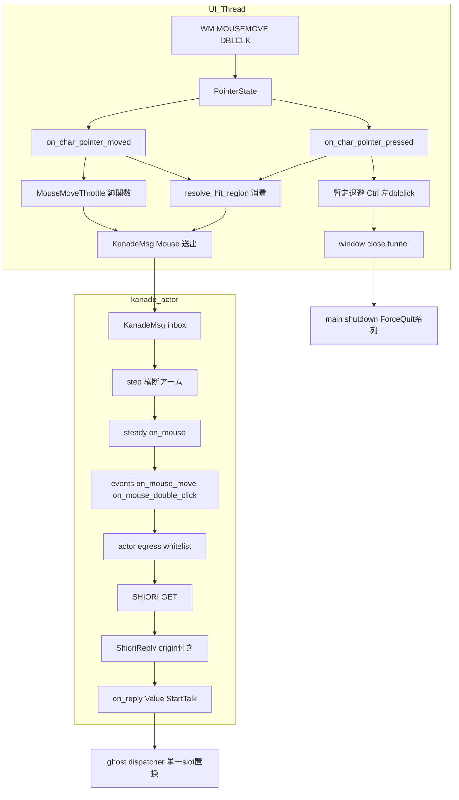
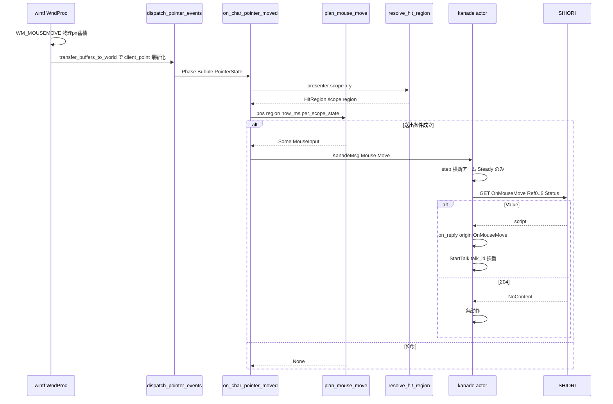
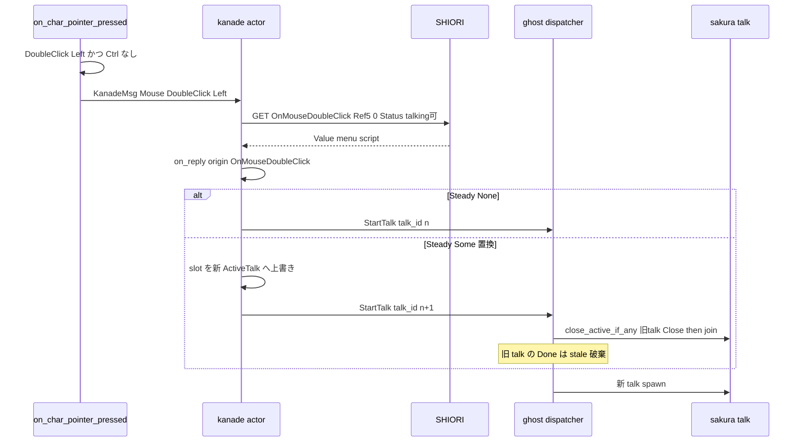
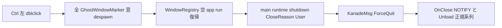

# Technical Design: areka-P0-input-events

## Overview

**Purpose**: 本設計は、キャラ窓上のマウス移動とダブルクリックを SHIORI 運行系（③ kanade）へ届ける配信ユニットを実現する。UI 配線層がポインタイベントを捉え、collision-geometry の実リゾルバ（`resolve_hit_region`）で当たり判定名を解決し、`KanadeMsg::Mouse` として kanade へ配信する。kanade は正典 Reference layout（ukadoc）で `OnMouseMove` / `OnMouseDoubleClick` を GET 発行し、応答 Value を既存の talk 起動棚（Steady 単一 slot＋dispatcher の Close-then-spawn 置換）へ載せる。

**Users**: ゴースト運用者は撫で（touch.pasta）とダブルクリックメニュー（menu.pasta）の反応を得る。開発者は mock shiori・注入入力による単一 pass/fail の決定論檻と、実 emo2 での撫でクラスタ合流サインオフを得る。

**Impact**: 現状「マウス入力→SHIORI 経路ゼロ」を解消する。kanade へは additive 増分（`Input::Mouse`／`events.rs` 構築子2本／steady アーム）、UI 側は新規結線モジュール `input_events` の追加と、stand-in ダブルクリック即終了（`on_ghost_pressed` の全窓 despawn）の正規経路への退役を行う。

### Goals

- マウス移動・ダブルクリックを `OnMouseMove` / `OnMouseDoubleClick` の正典 Reference layout（Ref0〜6）で GET として SHIORI へ配信する（1.1–1.2, 2.1–2.5, 3.1–3.4）
- 応答 Value を既存 StartTalk 棚（talk_id 採番・単一 slot・dispatcher 置換）へ載せ、新しい調停を発明しない（4.1–4.4）
- OnMouseMove の送出を純粋・決定的な間引き規則で絞る（5.1–5.3）
- stand-in ダブルクリック即終了を退役し、暫定退避終了（Ctrl+左ダブルクリック）を明示的に残す（6.1–6.3）
- M1 送出マウスイベントを 2 種に限定し、既存ホワイトリスト檻と整合させる（7.1–7.4）
- mock shiori・注入入力・sleep 不使用の決定論檻＋実機サインオフ（8.1–8.3）

### Non-Goals

- `\q` 選択肢の表示・選択 UI・OnChoiceSelectEx（M-dialogue `choice-render`＋増分へ分離。ただし背骨＝「入力→KanadeMsg→GET→StartTalk」と Ref 組立の型は再利用可能な形に切る）
- 撫での意味論（連打・滞留の解釈）＝SHIORI 側の領分（touch_detect.lua が所有）
- 当たり判定の幾何解決そのもの（`completed/areka-P0-collision-geometry` が正本・本設計は消費のみ）
- OnMouseWheel・OnMouseClick 単発・OnMouseDoubleClickEx（中/拡張ボタン）・The Hand・collisionex・owner-draw 右クリックメニュー（M2）
- balloon 窓のマウスイベント送出（リゾルバは shell 窓専用＝collision-geometry C-1・balloon は choice-render の領分）
- 再生タイミングの品質（`completed/areka-P0-cue-playback-duration` 帰属）

## Boundary Commitments

### This Spec Owns

- **UI→kanade のマウス配信配線**: `crates/areka/src/input_events/`（新規）＝ポインタハンドラ→リゾルバ消費→間引き→`KanadeMsg::Mouse` 送出
- **マウス入力契約型**: `MouseInput` / `MouseEventKind` / `MouseButton`（`areka-kanade/src/msg.rs`）と `KanadeMsg::Mouse` / `Input::Mouse` variant
- **正典 Reference 組立**: `events::on_mouse_move` / `events::on_mouse_double_click`（GET・純関数・Status 併送）と `ALLOWED_EVENT_IDS` への 2 ID 追加
- **マウス GET 応答の reply 政策**: origin 別の Value→StartTalk 配送（talk 中の置換を含む）と `Input::ShioriReply` への origin 転記
- **OnMouseMove 間引き規則**（純関数・決定論檻）
- **stand-in 即終了の退役と暫定退避終了**（Ctrl+左ダブルクリック→既存 window-close funnel）
- **決定論観測ハーネスのマウス増分**（Req8 (a)〜(e)）と撫でクラスタ合流サインオフ手順

### Out of Boundary

- `HitRegion { scope, region }` 契約と `resolve_hit_region` の幾何・現サーフェス解決（collision-geometry 正本・再定義しない）
- `StartTalk` / `TalkDone` 契約と dispatcher の単一 slot Close-then-spawn（`completed/areka-P0-kanade` 正本・既存棚に載せるのみ）
- `ExecutionState` / `ExecutionStatus` / `ExecutionSnapshot` の語彙と送出契約（`completed/areka-P0-idle-talk` 正本・消費のみ）
- channel／relay の流儀（`areka-actor`／`completed/areka-P0-ghost-setup` 正本）
- wintf ポインタ基盤（`PointerState`／`OnPointerMoved`／`OnPointerPressed`）の挙動変更
- `Status` への `choosing` 追加（M-dialogue 側の申し送り）

### Allowed Dependencies

- `areka-kanade` 公開面（`KanadeMsg`・`events` ファサード・`ExecutionSnapshot`・harness が使う再エクスポート）
- `areka-ghost` の `GhostRuntime::kanade() -> &Sender<KanadeMsg>`（runtime.rs:189-192・doc 明記の結線点）
- `crates/areka/src/emo2_boot/hit_region.rs` の `HitRegion` / `resolve_hit_region`（消費のみ）と `Emo2Wiring` の presenter 読み口（accessor 追加）
- wintf の `PointerState` / `DoubleClick` / `OnPointerMoved` / `OnPointerPressed` / `Phase<T>`（読み専用消費）
- `placement` の `CharWindowMarker` / `GhostWindowMarker` / `GhostWindows`
- 新規外部依存なし・tokio 不使用（Rust 2024・std mpsc 系列のまま）

### Revalidation Triggers

- `MouseInput` / `KanadeMsg::Mouse` の形の変更 → M-dialogue（OnChoiceSelectEx が背骨を再利用）の再確認
- `ALLOWED_EVENT_IDS` の運用（チョークポイント位置・形式）変更 → idle-talk 後続 spec と整合再確認
- 上流 `HitRegion` 契約の形変更（collision-geometry 側）→ 本配線層の消費面が破れる
- 間引き規則（送出条件・定数）の変更 → 実機撫で発火（touch_detect.lua の 2 秒規律）への影響再確認
- 暫定退避終了の退役 → M-dialogue の `\-` メニュー終了が着地した時点で本設計の暫定手段を撤去する（追跡は M-dialogue 側 spec）

## Architecture

### Existing Architecture Analysis

kanade は**純粋状態機械（schedule/）＋アクターシェル（actor.rs）＋メッセージ境界差し替え（msg.rs / shiori/real.rs）**の三層構造（`completed/areka-P0-kanade`）であり、idle-talk 完了後の settled main では以下が確立済み:

- `Input`（mod.rs:37-46）／`KanadeMsg`（msg.rs:48-63）／`Action`（mod.rs:107-115）— マウス variant は不在（greenfield）
- `events.rs` = Reference 構築の単一列挙点。全構築子は `&ExecutionSnapshot` を取り `status: ExecutionStatus::derive(snapshot)` を併送（DD-IT-3 継承）
- `ALLOWED_EVENT_IDS`（events.rs:48-60）＋ egress チョークポイント（actor.rs:155-191 の `round_trip_request`）— 未登録 ID は送出前拒否
- steady の talk 調停: `Steady{None}+Value→StartTalk`（talk_id 単調採番・steady.rs:94-130）／`Steady{Some}+Value`＝DD-6 防御破棄／dispatcher の Close-then-spawn 置換（areka-ghost dispatcher.rs:99-127）と stale Done 破棄（:131-149）
- アクター駆動: in-flight ≤1 の同期往復・execute-batch／reinject-last（actor.rs:87-143）＝GET と reply の間に他入力が割り込まない
- UI 側: `PointerState`（client 物理 px・`transfer_buffers_to_world` が毎 tick 最新サンプルへ更新＝buffers.rs:127-164）・`OnPointerMoved`／`OnPointerPressed` 二相ディスパッチ・stand-in 即終了は spawn.rs:321-344 `on_ghost_pressed`
- collision-geometry 完了済み: `resolve_hit_region(presenter, scope, x, y) -> HitRegion`（hit_region.rs:68-73・純関数・`#[allow(dead_code)]`＝本 spec が最初の消費者）

### Architecture Pattern & Boundary Map

パターン: **kanade additive 増分（純粋・全網羅）× UI 新規結線モジュール（薄い）の Hybrid**（research §3 の推奨を採択）。



**Architecture Integration**:

- Selected pattern: 確立済み additive パターン（KanadeMsg→actor 写像→Input→step→steady→events→チョークポイント）にマウスを 1 系列追加。新しい駆動モデル・調停・スレッド流儀を発明しない
- Domain boundaries: 幾何解決＝collision-geometry（消費）／語彙・調停＝kanade（増分）／配線＝`input_events` 新規モジュール（薄い）／窓退役＝placement（差し替え）
- Existing patterns preserved: NonSend 挿入＋self-gating（Emo2Wiring 前例・emo2_boot/mod.rs:338-348）、純関数構築子＋`expected_call` 檻、Status スナップショット単一源（DD-IT-3）、ログ規律（正常入力は trace・異常のみ warn/error）
- New components rationale: `input_events` モジュールのみ新設。理由＝UI 配線は placement（窓配置）とも emo2_boot（表示結線）とも責務が異なる「入力配信」であり、mock resolver・注入時刻の seam を 1 箇所に集約する
- Steering compliance: [[areka-concurrency-model]]（channel 一本・UI スレッド固定資源は NonSend）、[[test-only-decision-branches-not-proven-wiring]]（檻は判断分岐＝間引き・Ref 組立・reply 政策のみ）、[[areka-log-first-no-silent-failure]]、[[canonical-not-minimal-lifecycle]]（退役と暫定の明示記録）

### 設計判断（design 送り事項の確定）

| # | 判断 | 決定 | 根拠（正典・実測） |
|---|---|---|---|
| **DD-IE-1** | talk 再生中のマウス GET | **常に GET で送出**（抑止しない・NOTIFY 化しない）。`Status` ヘッダは既存機構（`snapshot_of`→`derive`）で `talking` を併送 | 実 SSP wire 捕獲（`vendors/pasta/crates/pasta_shiori/doc/shiori-sample.log`・SSP 2.3.86）で OnMouse 系 121 件が**全件 GET**・`Status: talking`／`choosing` 中も GET のまま（NOTIFY 化例ゼロ）。実 pasta は `status == "talking"` の完全一致ゲートで自衛（idle-talk design §実 wire 証拠） |
| **DD-IE-2** | 再生中に届いた Value | **置換**: 新 talk_id で `StartTalk` を発行し、既存 dispatcher の Close-then-spawn（dispatcher.rs:99-127）が active talk を差し替える。旧 talk の TalkDone は dispatcher の stale 破棄（:131-149）で自然棄却 | SSP 既定＝新規イベントスクリプトは再生中 talk を中断する（`\t` タイムクリティカルが「防ぐ側」の opt-in であること自体が既定＝中断の証左）。要件 8.1(c)「active talk 中の置換規律」の文言と一致。置換機構は既存棚の再利用＝新調停を発明しない（4.3） |
| **DD-IE-3** | reply の出所識別 | `Input::ShioriReply` へ **`origin: &'static str`**（往復した `ShioriCall` の event id）を追加。actor が転記する | in-flight ≤1・同期往復ゆえ順序は安全だが、(1) `ActiveTalk.origin` の正確なラベル（現状 "OnSecondChange" 固定）、(2) origin 別 reply 政策（マウス＝置換／OnSecondChange＝DD-6 防御破棄を**保存**）に必要。`pub(crate)` 内部型で構築点は actor.rs のみ＝additive 精神を保つ（4.4） |
| **DD-IE-4** | 右ダブルクリック | **左と同様に SHIORI へ送出**（Ref5="1"） | ukadoc `OnMouseDoubleClick` が左 0／右 1 を正典定義。M1 は owner-draw メニュー不在（M2）ゆえ本体メニュー横取りは存在せず、素直に送る（3.3） |
| **DD-IE-5** | OnMouseMove 間引き規則 | **「位置が前回観測から変化」かつ「(a) 解決 region が前回送出時から変化 or (b) 前回送出から `MOUSE_MOVE_MIN_INTERVAL_MS`（=100ms）経過」で送出**。per-scope 独立状態・純関数 | 位置変化必須＝hover を移動と区別（SSP は静止に OnMouseHover を使う＝M1 対象外）。region 変化即時＝撫で対象の出入りを遅延なく伝える。100ms 上限＝10Hz で helper 負荷有界、touch_detect.lua の発火規律（同一 target 2 秒持続・2 秒 debounce）に対し 20 サンプル/2s の十分な余裕（5.1–5.3） |
| **DD-IE-6** | Ref4 の `None` 値・Ref6 | region 無し＝**空文字転写**（ヘッダ行は出す）。Ref6＝**固定値 `"mouse"`**（touch/pen/eraser は M2 increment シーム） | 実 SSP wire（satori れしば実録: `Reference4: `（空値）＋`Reference6: mouse`）。touch.pasta:19 が「空 region は SSP が collision 領域外で送る正常値」と明記＝実ゴーストの期待と一致（2.3） |
| **DD-IE-7** | 暫定退避終了 | **Ctrl+左ダブルクリック → 全ゴースト窓 close**（既存 window-close funnel: despawn→`app.run()` 復帰→main の `runtime.shutdown(CloseReason::User)`→`KanadeMsg::ForceQuit`→OnClose NOTIFY＋Unload の**force-quit 系列**）。暫定であることを記録し、M-dialogue `\-` 完成で退役 | 人間が任意タイミングで引ける操作（要件制約・position-persist の実機検証前提）。現行アプリの終了は「窓が全部閉じる→run() 復帰→main が必ず shutdown」で kanade 正規系列に載っている（main.rs:328-335）＝新しい stand-in 直接経路を**新設しない**（6.2–6.3）。wiring 非依存（ghost boot 失敗時も脱出可能） |
| **DD-IE-8** | フェーズルーティング | `step()` の**横断アーム**で `Input::Mouse` を受け、`Steady` のみ `steady::on_mouse` へ委譲。他フェーズ（boot／close／terminate 後）は **trace レベルで無視**（warn にしない＝boot 中のマウス移動は正常な環境入力であり異常ではない）。`pending_close` 保持中は GET を発行しない（close 優先） | boot.rs／close.rs を不改変に保つ最小 additive。ForceQuit 等の横断アーム前例（mod.rs:123-161）に整合 |
| **DD-IE-9** | 配線資源の置き場 | **`MouseWiring`（NonSend）**: `Sender<KanadeMsg>` クローン＋per-scope 間引き状態＋`RegionSource`（Presenter/Mock）＋注入可能 clock。`wire_emo2_boot` 成功後に main.rs から挿入。ハンドラは NonSend 不在時 self-gating no-op | `Sender` は `Send` だが、リゾルバ（presenter 読み）と間引き状態が UI スレッド所有ゆえ NonSend 1 個に束ねる（Emo2Wiring 前例・順序依存なし self-gating と同型） |
| **DD-IE-10** | 座標契約 | **窓 client 物理 px の三者一致**: `PointerState.client_point`＝Ref0/Ref1 の「ローカル座標」＝`resolve_hit_region` の `(x, y)` 入力。DPI 変換なし（k=1.0 契約＝collision-geometry 4.3 を継承） | hit_region.rs:54-56 が「k=1.0 契約によりサーフェス px と同一空間で照合」と明記。`transfer_buffers_to_world`（buffers.rs:127-164）が毎 tick `client_point` を最新 WM_MOUSEMOVE サンプルへ更新済み＝ハンドラは新鮮な物理 px を読む |
| **DD-IE-11** | M1 送出イベント集合 | **`OnMouseMove`・`OnMouseDoubleClick` の 2 種のみ**を `ALLOWED_EVENT_IDS` へ追加（計 8 ID）。UI 層は Move／DoubleClick(Left/Right) 以外を生成しない（Middle/XButton の dblclick＝OnMouseDoubleClickEx は M2・Enter/Leave/Hover/Down/Up/Click/Wheel 不送出） | idle-talk のホワイトリスト檻（events.rs:48-60＋actor.rs:166 チョークポイント）へ additive。マウス名前空間は禁止リスト（OnTalk/OnHour）と交わらず和は無矛盾（7.1–7.4） |
| **DD-IE-12** | balloon 窓 | M1 は**マウス送出なし**。balloon の stand-in ハンドラ登録（spawn.rs:167）は撤去し inert とする | リゾルバは shell 窓専用（collision-geometry C-1・balloon は choice-render の領分）。balloon 側の入力は M-dialogue が所有 |

### Technology Stack

| Layer | Choice / Version | Role in Feature | Notes |
|-------|------------------|-----------------|-------|
| エンジン | Rust 2024 / `areka-kanade`（純粋状態機械） | `Input::Mouse`・Reference 組立・reply 政策 | 新規依存なし |
| 配線 | `areka` bin crate / bevy_ecs NonSend | `MouseWiring`・ハンドラ・間引き | bin-only ゆえ檻は in-crate `#[cfg(test)]` |
| 入力基盤 | `wintf` pointer（既存・不改変） | `PointerState`／`OnPointerMoved`／`OnPointerPressed` | `client_point` は毎 tick 最新化済み |
| 当たり判定 | `emo2_boot/hit_region.rs`（既存・消費） | `resolve_hit_region` | `#[allow(dead_code)]` が本 spec で解消 |
| Wire | SHIORI/3.0（`shiori-host32-host`・既存・不改変） | GET＋Status 転送 | `ShioriBackend::get(id, refs, status)` 既存署名のまま |

## File Structure Plan

### Directory Structure（新規）

```
crates/areka/src/input_events/
├── mod.rs        # MouseWiring（NonSend）・wire_mouse_input()・RegionSource（Presenter/Mock seam）
│                 # on_char_pointer_moved / on_char_pointer_pressed（ハンドラ）・暫定退避
│                 # in-crate #[cfg(test)]: 配線存在檻（mock resolver・KanadeMsg 観測）
└── throttle.rs   # MouseMoveThrottle（per-scope 状態）＋ plan_mouse_move()（純関数）
                  # MOUSE_MOVE_MIN_INTERVAL_MS 定数・in-crate #[cfg(test)] 全分岐檻
```

### Modified Files

| ファイル | 変更内容 |
|---|---|
| `crates/areka-kanade/src/msg.rs` | `KanadeMsg::Mouse(MouseInput)` variant＋`MouseInput`／`MouseEventKind`／`MouseButton` 型（公開契約） |
| `crates/areka-kanade/src/schedule/mod.rs` | `Input::Mouse(MouseInput)` variant＋`step()` 横断アーム（Steady のみ委譲・他 trace 無視）。`Input::ShioriReply` へ `origin: &'static str` 追加（既存アーム destructure の機械的追随含む） |
| `crates/areka-kanade/src/schedule/events.rs` | `on_mouse_move()`／`on_mouse_double_click()` 構築子＋`REF2_WHEEL_M1`／`REF6_DEVICE_MOUSE` 定数＋`ALLOWED_EVENT_IDS` へ 2 ID 追加 |
| `crates/areka-kanade/src/schedule/steady.rs` | `on_mouse()`（GET 発行・pending_close ガード）＋`on_reply` の origin 別アーム（マウス Value＝置換 StartTalk・DD-6 は OnSecondChange origin で保存・`ActiveTalk.origin` 動的化） |
| `crates/areka-kanade/src/actor.rs` | `KanadeMsg::Mouse`→`Input::Mouse` 写像 1 行＋reinject 時の origin 転記 |
| `crates/areka-kanade/src/lib.rs` | `MouseInput`／`MouseEventKind`／`MouseButton` 再エクスポート＋events ファサードへ `on_mouse_move`／`on_mouse_double_click` 追加 |
| `crates/areka/src/placement/spawn.rs` | `on_ghost_pressed`（:321-344）退役（削除）。キャラ窓へ `OnPointerMoved(on_char_pointer_moved)`＋`OnPointerPressed(on_char_pointer_pressed)` 付与（:205 差し替え）。balloon 窓のハンドラ登録（:167）撤去 |
| `crates/areka/src/emo2_boot/mod.rs` | `Emo2Wiring` へ presenter 読み口 accessor（`pub(crate) fn presenter(&self) -> &EmoPresenter`）追加 |
| `crates/areka/src/main.rs` | `mod input_events;` 宣言＋`wire_emo2_boot` 成功後に `input_events::wire_mouse_input(...)`（kanade Sender クローン＋NonSend 挿入） |
| `crates/areka-kanade/tests/kanade/common/mod.rs` | `Fixture` へマウス応答（script／204）の additive 拡張・`RecordedCall` は既存のまま（Status 観測込み） |
| `crates/areka-kanade/tests/kanade/mouse_test.rs` | 【新規】Req8 (a)〜(d) の決定論檻（layout・Ref5・置換・204・フェーズ無視・pending_close ガード） |

> 依存方向: `areka-kanade`（契約＋エンジン）← `areka-ghost`（結線）← `areka` bin（`emo2_boot` → `input_events` → `placement`/`main`）。`input_events` は `areka-kanade` 公開面と `emo2_boot::hit_region` を輸入し、逆方向の輸入は禁止。kanade は `HitRegion` 型を知らない（region は不透明 `Option<String>` として受ける）。

## System Flows

### Flow A: OnMouseMove 配信（間引き→GET→204/Value）



- 間引きは UI 側で完結（kanade は届いた Mouse 入力を無条件で GET 化）。判断分岐は `plan_mouse_move` に集約され純関数檻で全網羅する
- ドラッグ中はカーソルの client 相対位置が不変（窓がカーソルに追従）→「位置変化」条件が偽→自然に送出されない（emergent・檻で固定）

### Flow B: ダブルクリック→メニュー talk（active talk 中の置換を含む）



- 置換は dispatcher の既存 Close-then-spawn（`on_start` が常に旧 active を閉じてから差し替える）をそのまま踏む。kanade 側は slot 上書きと talk_id 採番のみ＝新調停なし（4.3）
- Ctrl+左ダブルクリックは SHIORI へ送らず暫定退避（Flow C）へ分岐する

### Flow C: 暫定退避終了（Ctrl+左ダブルクリック）



- 既存の window-close funnel（smoke exit と同じ機構）に乗る。main.rs は窓駆動終了後に必ず `shutdown` を呼ぶため、kanade force-quit 系列（OnClose NOTIFY best-effort＋Unload）を経る＝stand-in 直接経路の新設ではない（6.3）
- `MouseWiring` 非依存で動作する（ghost boot 失敗時にもアプリを閉じられる）
- **暫定記録**: 本手段は M-dialogue の `\-` メニュー終了完成時に退役する（Revalidation Triggers 参照）

## Requirements Traceability

| Req | Summary | Components | Interfaces | Flows |
|-----|---------|------------|------------|-------|
| 1.1 | 移動→解決→kanade 配信 | MouseWiring・throttle | `on_char_pointer_moved`→`KanadeMsg::Mouse` | A |
| 1.2 | dblclick→scope/座標/左右/region 配信 | MouseWiring | `on_char_pointer_pressed`→`KanadeMsg::Mouse` | B |
| 1.3 | resolver 契約の消費のみ | RegionSource::Presenter | `resolve_hit_region(presenter, scope, x, y)` | A |
| 1.4 | actor 基盤の channel で配信 | MouseWiring | `GhostRuntime::kanade()` クローン（std mpsc） | A |
| 1.5 | mock resolver で決定論観測 | RegionSource::Mock | `RegionSource` enum seam | — |
| 2.1 | OnMouseMove を GET 発行 | steady::on_mouse・events | `on_mouse_move()`→`ShioriCall::Get` | A |
| 2.2 | 正典 Ref0〜6 layout | events | `on_mouse_move()` 構築子 | A |
| 2.3 | Ref4 不透明転写・None＝空文字 | events | `region: Option<&str>`→`unwrap_or("")` | A |
| 2.4 | Ref2 固定 "0"＋increment シーム | events | `REF2_WHEEL_M1` 定数 | A |
| 2.5 | Ref5 固定 "0"（SSP/NINIX 準拠） | events | `on_mouse_move()` | A |
| 3.1 | OnMouseDoubleClick を GET 発行 | steady::on_mouse・events | `on_mouse_double_click()` | B |
| 3.2 | 正典 layout（Ref2="0"） | events | 同上 | B |
| 3.3 | Ref5 左"0"／右"1" | events | `MouseButton`→Ref5 写像 | B |
| 3.4 | Ref4 は Req2 と同一転写規則 | events | 共通の region 引数規則 | B |
| 4.1 | Value＋非再生中→talk_id 付与 StartTalk | steady::on_reply | `ActiveTalk{talk_id, origin}` | A・B |
| 4.2 | 204→無動作 | steady::on_reply | `NoContent` アーム | A |
| 4.3 | 再生中は既存置換規律・新調停なし | steady::on_reply（DD-IE-1/2）・dispatcher（既存） | origin 別アーム＋Close-then-spawn | B |
| 4.4 | additive 増分・既存資産を壊さない | 全 kanade 増分 | variant／構築子／アームの追加のみ（DD-IE-3 は内部転記） | — |
| 5.1 | 機械的間引き規則で送出を絞る | throttle | `plan_mouse_move()`（DD-IE-5） | A |
| 5.2 | 純粋・決定的・注入で全経路檻化 | throttle | `now_ms` 引数化＋per-scope 状態 | — |
| 5.3 | 撫で意味論を発明しない | throttle | 位置・region・時刻のみの判定（意味論なし） | — |
| 6.1 | stand-in 即終了の退役 | spawn.rs 差し替え | `on_ghost_pressed` 削除→`on_char_pointer_pressed` | B |
| 6.2 | 暫定退避手段を 1 つ明示 | 暫定退避（DD-IE-7） | Ctrl+左 dblclick→窓 close funnel | C |
| 6.3 | 正規終了経路に載せ stand-in 新設なし | 暫定退避 | funnel→main shutdown→ForceQuit 系列 | C |
| 7.1 | M1 送出は 2 種のみ | MouseWiring・ALLOWED_EVENT_IDS | 集合表＋チョークポイント檻 | — |
| 7.2 | OnMouseWheel 不送出（Ref2 の口のみ） | MouseWiring・events | wheel 系ハンドラ不設置＋`REF2_WHEEL_M1` | — |
| 7.3 | OnMouseClick 単発 不送出 | MouseWiring | Pressed ハンドラは dblclick のみ反応 | — |
| 7.4 | Hand／collisionex／owner-draw 不実装 | 全体 | Non-Goals（M2） | — |
| 8.1 | (a)〜(e) 単一 pass/fail | mouse_test.rs・throttle 檻 | harness＋`expected_call` | — |
| 8.2 | sleep 非依存・反復同一 | harness（既存流儀） | 注入時刻・quit 経路同期 | — |
| 8.3 | 実機サインオフ（撫でクラスタ合流） | サインオフ手順 | 実 resolver（merged）・実 DPI≠96 | — |

## Components and Interfaces

| Component | Domain/Layer | Intent | Req Coverage | Key Dependencies | Contracts |
|-----------|--------------|--------|--------------|------------------|-----------|
| MouseInput 契約型 | kanade / msg | マウス入力の境界メッセージ | 1.1–1.2, 4.4 | なし（std のみ） | Event |
| events マウス構築子 | kanade / 構築正本 | 正典 Reference 組立＋whitelist | 2.1–2.5, 3.1–3.4, 7.1 | status.rs (P0)・msg.rs (P0) | Service |
| steady マウスアーム | kanade / 状態機械 | GET 発行と reply 政策（置換） | 2.1, 3.1, 4.1–4.3 | events (P0)・talk 契約 (P0) | State |
| actor 写像＋origin | kanade / シェル | Mouse 写像・origin 転記・チョークポイント | 1.4, 4.4, 7.1 | msg.rs (P0) | Service |
| MouseWiring | areka / 配線 | ハンドラ→resolver→間引き→送出 | 1.1–1.5, 7.1–7.3 | hit_region (P0)・Emo2Wiring (P0)・kanade Sender (P0) | Service, State |
| MouseMoveThrottle | areka / 純関数 | 送出間引き判定 | 5.1–5.3 | なし | Service |
| stand-in 退役＋暫定退避 | areka / placement | dblclick 正規化＋退避終了 | 6.1–6.3 | GhostWindowMarker (P0) | — |
| 観測ハーネス増分 | kanade tests | Req8 (a)〜(e) の檻 | 8.1–8.2 | 既存 harness (P0) | — |

### kanade / 契約・構築

#### MouseInput 契約型（msg.rs）

| Field | Detail |
|-------|--------|
| Intent | UI→kanade のマウス入力を運ぶ公開境界型（OnChoiceSelectEx が同型の背骨を再利用できる形） |
| Requirements | 1.1, 1.2, 4.4 |

**Contracts**: Event [x]

```rust
/// マウス入力（UI 配線層 → kanade）。座標は窓 client 物理 px（DD-IE-10）。
#[derive(Debug, Clone, PartialEq, Eq)]
pub struct MouseInput {
    pub scope: u32,              // 本体 0／相方 1（Ref3 へ転写）
    pub x: i64,                  // Ref0（窓 client 物理 px）
    pub y: i64,                  // Ref1（同上）
    pub region: Option<String>,  // 当たり判定名（不透明転写・None＝判定外）
    pub kind: MouseEventKind,
}

#[derive(Debug, Clone, Copy, PartialEq, Eq)]
pub enum MouseEventKind {
    Move,                                  // OnMouseMove
    DoubleClick { button: MouseButton },   // OnMouseDoubleClick
}

#[derive(Debug, Clone, Copy, PartialEq, Eq)]
pub enum MouseButton { Left, Right }      // Ref5: 左 "0"／右 "1"

// KanadeMsg へ additive 追加
pub enum KanadeMsg {
    // ...既存 7 variant 不変...
    Mouse(MouseInput),
}
```

- Preconditions: `region` は collision resolver 由来の不透明 String（kanade は意味解釈しない）
- Invariants: kanade は `HitRegion` 型を知らない（配線層が destructure して詰める）＝リゾルバ契約の再定義なし（1.3）

#### events マウス構築子（events.rs）

| Field | Detail |
|-------|--------|
| Intent | ukadoc 正典 Reference 表の単一実装点にマウス 2 イベントを追加 |
| Requirements | 2.1–2.5, 3.1–3.4, 7.1, 7.2 |

**Contracts**: Service [x]

```rust
/// OnMouseMove（GET・DD-IE-1）。Ref0..6 正典 layout。
pub fn on_mouse_move(
    x: i64, y: i64, scope: u32, region: Option<&str>,
    snapshot: &ExecutionSnapshot,
) -> ShioriCall;
// references: [x, y, REF2_WHEEL_M1, scope, region.unwrap_or(""), "0", REF6_DEVICE_MOUSE]

/// OnMouseDoubleClick（GET）。Ref5: Left="0"／Right="1"。Ref2 は正典で常に "0"。
pub fn on_mouse_double_click(
    x: i64, y: i64, scope: u32, region: Option<&str>, button: MouseButton,
    snapshot: &ExecutionSnapshot,
) -> ShioriCall;

/// M1 未実装ホイールの increment シーム（実ホイール量の載せ替え口・2.4）
pub(crate) const REF2_WHEEL_M1: &str = "0";
/// M1 入力デバイス種の固定値（touch/pen/eraser は M2 シーム・DD-IE-6）
pub(crate) const REF6_DEVICE_MOUSE: &str = "mouse";

pub const ALLOWED_EVENT_IDS: &[&str] = &[
    // ...既存 6 ID 不変...,
    "OnMouseMove", "OnMouseDoubleClick",
];
```

- Postconditions: 両構築子とも `ShioriCall::Get`＋`status: ExecutionStatus::derive(snapshot)`（talk 中は `talking` 併送・DD-IT-3 継承）。region `None`→空文字 `""` 転写（DD-IE-6）
- Invariants: 構築子は純関数・Reference 個数は常に 7・Ref5 は Move で常に `"0"`（2.5）

### kanade / 状態機械・シェル

#### steady マウスアーム＋origin 別 reply 政策（steady.rs・mod.rs・actor.rs）

| Field | Detail |
|-------|--------|
| Intent | Steady 限定のマウス GET 発行と、応答 Value の既存棚配送（talk 中の置換を含む） |
| Requirements | 2.1, 3.1, 4.1–4.4 |

**Contracts**: State [x] / Service [x]

```rust
// mod.rs — 内部入力（pub(crate)）
pub(crate) enum Input {
    // ...既存不変...
    Mouse(MouseInput),
    ShioriReply { outcome: ShioriOutcome, origin: &'static str },  // origin 追加（DD-IE-3）
}

// step() 横断アーム（DD-IE-8）
// Input::Mouse: Steady → steady::on_mouse ／ 他フェーズ → trace!(event="mouse_input_ignored") + 無動作

// steady.rs
pub(super) fn on_mouse(state: State, input: MouseInput) -> (State, Vec<Action>);
```

**挙動仕様**:

- `on_mouse`: `pending_close` 保持中は GET を発行せず trace（close 優先・DD-IE-8）。それ以外は `snapshot_of(&phase)` から構築子を呼び `Action::ShioriRequest(GET)` を 1 件発行。フェーズ遷移なし
- `on_reply`（origin 別・DD-IE-2/3）:
  - `Steady{None}` + `Value` → talk_id 採番→`Steady{Some(ActiveTalk{talk_id, origin})}`＋`StartTalk`（origin ラベルが実イベント名になる・4.1）
  - `Steady{Some}` + `Value` + **origin ∈ {OnMouseMove, OnMouseDoubleClick}** → **置換**: 新 talk_id 採番→slot 上書き→`StartTalk`（dispatcher が旧 talk を Close-then-spawn・旧 Done は dispatcher で stale 破棄・4.3）
  - `Steady{Some}` + `Value` + その他 origin → 既存 DD-6 防御破棄（warn）**不変**（idle-talk 檻を保存）
  - `NoContent`／`Notified` → 既存アーム不変（204＝無動作・4.2）
- actor.rs: `KanadeMsg::Mouse(m)` → `Input::Mouse(m)` 写像 1 行。`round_trip_request` 実行時に call の id を控え、reinject する `ShioriReply` へ `origin` として転記。チョークポイント（whitelist 検証・Status render・wire trace）は既存のまま通過

**Implementation Notes**
- Integration: in-flight ≤1・同期往復ゆえ「GET 発行時のフェーズ＝reply 到着時のフェーズ」が保証される（割り込み入力なし）。置換時の旧 talk 後始末は dispatcher 既存実装（close_active_if_any＋stale Done 破棄）に完全委譲
- Validation: `ShioriReply` の origin 追加は `pub(crate)` 内部・構築点 actor.rs 一点。既存テストは harness（KanadeMsg 注入）経由のため署名変更の影響は destructure の機械的追随のみ
- Risks: DD-6 アームの意味が「防御専用」から「OnSecondChange origin 限定の防御」へ狭まる。既存檻 `steady_value_during_talk` は origin 前提を明示する形で更新する（[[obsolete-vs-broken-test-policy]]＝意味は生きているので更新）。マウス origin の置換は実機では実 pasta の talking 自衛（204 相当）により構造的に発火せず **mock 檻が唯一の検証手段**であるため、置換檻（マウス origin→置換）と DD-6 保存檻（OnSecondChange origin→warn＋破棄）は**同一テスト群で対に配置**し、origin の match を **wildcard にしない**（第 3 の origin 追加時にレビューで必ず気づける形に保つ）

### areka / UI 配線

#### MouseWiring（input_events/mod.rs）

| Field | Detail |
|-------|--------|
| Intent | ポインタイベント→リゾルバ消費→間引き→`KanadeMsg::Mouse` 送出の唯一の配線点 |
| Requirements | 1.1–1.5, 6.1, 7.1–7.3 |

**Contracts**: Service [x] / State [x]

```rust
/// UI スレッド所有の配線資源（NonSend・DD-IE-9）。
pub(crate) struct MouseWiring {
    sender: Sender<KanadeMsg>,                       // GhostRuntime::kanade() クローン（1.4）
    throttle: HashMap<u32, MouseMoveThrottle>,       // per-scope 間引き状態
    region_source: RegionSource,                     // 実／mock の差し替えシーム（1.5）
    now_ms: Box<dyn FnMut() -> u64>,                 // 注入可能 clock（既定: 起動からの経過 ms）
}

/// 当たり判定名の供給源シーム。
pub(crate) enum RegionSource {
    /// 実運用: Emo2Wiring の presenter で resolve_hit_region を呼ぶ（1.3）
    Presenter,
    /// 決定論檻: 固定写像で HitRegion を返す（1.5）
    Mock(fn(u32, i64, i64) -> HitRegion),
}

/// boot 成功後に main から呼ぶ（Emo2Wiring 挿入と同型・self-gating）。
pub(crate) fn wire_mouse_input(world: &mut World, sender: Sender<KanadeMsg>);

/// キャラ窓ハンドラ（wintf PointerEventHandler 署名）。
pub(crate) fn on_char_pointer_moved(
    world: &mut World, sender: Entity, entity: Entity, ev: &Phase<PointerState>) -> bool;
pub(crate) fn on_char_pointer_pressed(
    world: &mut World, sender: Entity, entity: Entity, ev: &Phase<PointerState>) -> bool;
```

**挙動仕様**:

- `on_char_pointer_moved`（Bubble のみ処理）: `CharWindowMarker.scope`（usize→u32）と `PointerState.client_point`（物理 px）を取り、region 解決→`plan_mouse_move`→送出条件成立時のみ `KanadeMsg::Mouse(Move)` を送出。`MouseWiring` 不在時は no-op（self-gating・戻り値 false）
- `on_char_pointer_pressed`（Bubble のみ処理）:
  - `ctrl_down && double_click == Left` → **暫定退避**（`MouseWiring` 非依存・全 `GhostWindowMarker` 窓 despawn→Flow C）・true
  - `double_click == Left|Right`（Ctrl なし）→ region 解決→`KanadeMsg::Mouse(DoubleClick{button})` 送出・true
  - `double_click == Middle|XButton*` → 送出しない（7.1・OnMouseDoubleClickEx は M2）・false
  - 単発クリック（double_click == None）→ 送出しない（7.3）・false
- region 解決: `RegionSource::Presenter` は `Emo2Wiring::presenter()` を World から借用し `resolve_hit_region(presenter, scope, x, y)`。`Emo2Wiring` 不在（boot 前・失敗時）は `HitRegion { scope, region: None }` へ正常縮退（collision-geometry design の消費想定どおり・trace）
- 送出失敗（kanade 停止後の Sender エラー）: warn 1 回系（`event="mouse_send_failed"`）＋以降 no-op（[[areka-log-first-no-silent-failure]]）

**Implementation Notes**
- Integration: ハンドラ付与は spawn.rs（キャラ窓のみ・balloon 撤去＝DD-IE-12）。`wire_mouse_input` は main.rs で `wire_emo2_boot` 成功後に呼ぶ。窓 spawn が先・wiring が後でも self-gating で順序依存なし（click-through 登録と同型）
- Validation: in-crate 檻＝World に `MouseWiring{Mock, 注入 clock}`＋`CharWindowMarker` エンティティを組み、合成 `PointerState` でハンドラを直接呼び、std mpsc Receiver で `KanadeMsg` を観測（単一 pass/fail・GPU/窓不要）
- Risks: `areka` は bin-only ゆえ檻は in-crate `#[cfg(test)]`（[[areka-bin-crate-internal-tests-in-crate]]）。scope の usize→u32 変換は M1 実値 {0,1} で安全（debug_assert）

#### MouseMoveThrottle（input_events/throttle.rs）

| Field | Detail |
|-------|--------|
| Intent | OnMouseMove 送出間引きの純粋・決定的判定（DD-IE-5） |
| Requirements | 5.1–5.3 |

**Contracts**: Service [x]

```rust
/// per-scope の間引き状態（値のみ・純粋更新）。
#[derive(Debug, Clone, Default, PartialEq, Eq)]
pub(crate) struct MouseMoveThrottle {
    last_pos: Option<(i64, i64)>,            // 前回観測位置（移動検出）
    last_sent_region: Option<Option<String>>, // 前回送出時の region（None=未送出）
    last_sent_ms: Option<u64>,
}

/// 送出上限間隔（10Hz）。touch_detect.lua の 2 秒規律に対し 20 サンプル/2s の余裕。
pub(crate) const MOUSE_MOVE_MIN_INTERVAL_MS: u64 = 100;

/// 純関数: (現状態, 観測) → (次状態, 送出可否)。
/// 送出 ⇔ 位置が変化 かつ（region が前回送出時から変化 or 間隔経過 or 初回）。
pub(crate) fn plan_mouse_move(
    state: &MouseMoveThrottle,
    pos: (i64, i64),
    region: &Option<String>,
    now_ms: u64,
) -> (MouseMoveThrottle, bool);
```

- Preconditions: `now_ms` は単調（呼び手が保証・注入可能）
- Postconditions: 位置不変なら常に送出しない（hover は移動でない・5.1）。region 変化（None↔Some・Some↔別 Some）は間隔を待たず送出（撫で対象の出入りを即伝達）。送出時のみ `last_sent_*` を更新
- Invariants: 判定は位置・region・時刻のみ＝撫で意味論（連打・滞留の解釈）を持たない（5.3・意味論は touch_detect.lua＝SHIORI 側）

### areka / placement

#### stand-in 退役＋暫定退避（spawn.rs 差し替え）

| Field | Detail |
|-------|--------|
| Intent | dblclick 即終了（despawn）の退役と、正規経路に載る暫定退避終了の維持 |
| Requirements | 6.1–6.3 |

**Responsibilities & Constraints**
- `on_ghost_pressed`（spawn.rs:321-344）を削除し、キャラ窓は `OnPointerMoved(on_char_pointer_moved)`＋`OnPointerPressed(on_char_pointer_pressed)` を付与（:205 相当行の差し替え）。balloon 窓のハンドラ登録（:167）は撤去（DD-IE-12）
- 暫定退避（Ctrl+左 dblclick）は Flow C の window-close funnel＝既存正規系列（main の shutdown→ForceQuit）に載る。smoke exit（`AREKA_APP_SMOKE_EXIT_MS`）は自動検証用として別途存続するが、**退避手段は人間操作の Ctrl+dblclick が正**（position-persist の実機検証前提を満たす）
- **暫定の記録**: 本手段（および despawn ヘルパ）に「M-dialogue `\-` 終了完成で退役」の doc コメントを付す（6.2）

**Dependencies**
- Inbound: wintf pointer dispatch（P0）
- Outbound: `input_events` ハンドラ（P0）・`GhostWindowMarker` despawn（P0）

### 観測ハーネス増分（tests/kanade/mouse_test.rs＋common）

| Field | Detail |
|-------|--------|
| Intent | Req8 (a)〜(e) を mock shiori・注入入力・sleep 不使用の単一 pass/fail で檻化 |
| Requirements | 8.1, 8.2 |

**Responsibilities & Constraints**
- 既存 harness（`spawn_harness`／`spawn_harness_gated`・mock shiori・`RecordedCall`（Status 観測込み）・`expected_call`）の additive 拡張のみ。`Fixture` へマウス応答（script／204 の別）を追加
- 期待値は `expected_call(events::on_mouse_move(...))` 形で構築子と共有（Reference 手書き重複を作らない・既存流儀）
- 間引き檻（(e)）は kanade でなく areka in-crate（`plan_mouse_move` 全分岐）に置く＝判定の所在（UI 配線）と檻の所在を一致させる

## Data Models

本設計の新規データは境界メッセージ `MouseInput`（値オブジェクト・同一性なし）と間引き状態 `MouseMoveThrottle`（UI スレッドローカルな純粋値）のみ。永続化・スキーマ・分散整合は関与しない。

- `MouseInput` は `HitRegion` の destructure 結果（scope・region）＋座標＋種別の転記であり、kanade 内で加工されない（不透明転写・[[areka-surface-args-opaque-string-downstream-resolve]] と同精神）
- talk 状態は既存 `Phase::Steady{talk: Option<ActiveTalk>}` の単一 slot を共有（新規状態モデルなし）。`ActiveTalk.origin` が実イベント名（`"OnMouseMove"` 等）になる点のみ意味が精密化する

## Error Handling

### Error Strategy

失敗経路は全て log-first（[[areka-log-first-no-silent-failure]]）。panic 新設なし。

| 失敗 | 検出点 | 応答 |
|---|---|---|
| kanade Sender 送出失敗（actor 停止後） | MouseWiring 送出 | `warn!(event="mouse_send_failed")`＋no-op（UI は継続・終了系列と競合し得る正常級の縮退） |
| `Emo2Wiring`／presenter 不在（boot 前・失敗） | region 解決 | `HitRegion{scope, region: None}` へ正常縮退＋trace（collision-geometry 消費想定どおり） |
| `MouseWiring` 不在（wiring 前） | ハンドラ冒頭 | self-gating no-op（trace）。暫定退避のみ wiring 非依存で常時有効 |
| 非 Steady フェーズへのマウス入力 | `step()` 横断アーム | `trace!(event="mouse_input_ignored", phase)`＝正常入力ゆえ warn にしない（DD-IE-8） |
| `pending_close` 中のマウス入力 | `steady::on_mouse` | GET 不発行＋trace（close 優先） |
| whitelist 違反（防御・発生しない設計） | actor チョークポイント | 既存どおり `error!(event_id_not_allowed)`＋`Failed(Internal)`・送出せず |
| SHIORI `Failed` 応答 | `on_reply` 既存横断処理 | 既存の failure 写像に従う（本設計で変更なし） |

### Monitoring

- 送出 wire 観測は既存 `trace!(event="shiori_request")`（actor.rs）を共用＝実機サインオフの grep 証跡（[[areka-real-machine-signoff-bounded-auto-exit]] の流儀）に OnMouseMove／OnMouseDoubleClick がそのまま載る
- 置換発生時は StartTalk ログ＋dispatcher の Close ログで観測可能（既存ログ点・追加なし）

## Testing Strategy

### Unit Tests（kanade・mouse_test.rs — Req8 (a)(b)(d)＋フェーズ規律）

1. **(a) OnMouseMove layout 檻**: `KanadeMsg::Mouse(Move, region=Some("Head"))` 注入 → `RecordedCall` が `expected_call(events::on_mouse_move(x, y, 0, Some("Head"), &INACTIVE))` と一致（GET・Ref0..6・Ref2="0"・Ref5="0"・Ref6="mouse"・Status 行なし）
2. **(a') Ref4 None 転写**: `region=None` → Ref4 が空文字 `""`（ヘッダ枠は存在＝references[4]=""）
3. **(b) Ref5 左右**: DoubleClick Left → Ref5="0"／Right → Ref5="1"（`expected_call(on_mouse_double_click(...))` 共有）
4. **(d) 204→無動作**: mock fixture がマウス GET へ NoContent → StartTalk 不発・`Steady{None}` 維持
5. **フェーズ無視**: Boot 完了前・close 系列中に Mouse 注入 → GET 不発（RecordedCall に現れない）・状態不変
6. **pending_close ガード**: talk 中に CloseRequest→Mouse 注入 → マウス GET 不発・close 系列は既存どおり完走

### Integration Tests（kanade・mouse_test.rs — Req8 (c)＝既存棚と置換）

1. **(c) Value→StartTalk**: マウス GET へ Value 応答 → mock sakura が `StartTalk{talk_id=n, script}` を受領・`ActiveTalk.origin` が実イベント名
2. **(c') active talk 中の置換**: `spawn_harness_gated` で talk を保持 → マウス GET が **GET のまま**発行され `Status: talking` を帯びる（DD-IE-1 檻）→ Value 応答 → 新 talk_id で StartTalk（置換）・旧 talk の Done は棄却され状態整合
3. **DD-6 保存**: OnSecondChange origin の Value-during-talk は従来どおり warn＋破棄（idle-talk 檻の更新形）。置換檻（(c')）と本檻は**対**であり同一テスト群に配置する——実機では実 pasta の talking 自衛により置換が発火しないため mock 檻が唯一の検証手段。origin の match は wildcard にしない
4. **talk_id 単調性**: マウス起動 talk と OnSecondChange 起動 talk が混在しても talk_id が再利用されない

### Unit Tests（areka in-crate — Req8 (e)＋配線）

1. **間引き全分岐**（`plan_mouse_move`）: 初回送出／位置不変抑制（hover）／region 変化即時送出（None→Some・Some→Some'・Some→None）／同 region 間隔内抑制／間隔経過送出／per-scope 独立
2. **配線存在檻**: `MouseWiring{Mock resolver＋注入 clock}`＋合成 `PointerState` → ハンドラ呼出 → mpsc で `KanadeMsg::Mouse` の内容（scope・座標・region・kind）を観測（1.1–1.2・1.5 の単一 pass/fail）
3. **送出集合檻**: Middle dblclick・単発クリックがいずれも送出されない（7.1・7.3）
4. **暫定退避檻**: `ctrl_down`＋Left dblclick → 全 `GhostWindowMarker` despawn（World 内で観測・wiring 非依存）／Ctrl なし Left dblclick → despawn しない（6.1）

### E2E／実機（Req8.3 — 撫でクラスタ合流サインオフ・人間確認）

前提: collision-geometry 実 resolver は **main へマージ済み（充足済み・2026-07-19 現在）**＝実 resolver で実施（mock 代替は完了と見なさない）。

1. 実 emo2・実 pasta.dll・**実 DPI（≠96）** で起動（絶対パス・`AREKA_APP_SMOKE_EXIT_MS` を大きな値で有界化・`RUST_LOG=info,areka_kanade=trace`）
2. **撫で**: Head 領域上でカーソルを 2 秒以上動かし続ける → touch.pasta の撫で talk 再生を目視＋ログで `shiori_request` GET `OnMouseMove`／`Reference4: Head` を grep（マウス由来座標とサーフェス px の空間一致検証は本サインオフが所有）
3. **メニュー**: 左ダブルクリック → menu.pasta の応答 talk（メニュー本文）再生を目視（`\q` 見た目の完成度は choice-render 領分）
4. **退避**: Ctrl+左ダブルクリック → アプリ終了（OnClose NOTIFY→Unload→exit 0 をログで確認）
5. talk 再生中の撫で: `Status: talking` 付き GET が送出され、実 pasta が自衛（nil）することをログで確認（置換は発生しない＝実機の期待挙動）
6. **応答遅延の滞留兆候**: 持続撫で中の talk 起動遅延を体感確認し、ログ上の `shiori_request` GET 送出時刻→応答時刻の差を観測する（実 32bit helper の往復遅延が 100ms を超える場合、in-flight ≤1 ゆえ kanade inbox に古い座標の GET が滞留し得る——design は有界性のみ論証済み・鮮度は本項が実測）。滞留兆候があれば `MOUSE_MOVE_MIN_INTERVAL_MS` の値調整のみで対処する（定数シーム・構造変更不要）

## Performance & Scalability

- OnMouseMove 送出は 10Hz 上限（DD-IE-5）×最大 2 scope＝helper 往復は最悪 20 req/s・in-flight ≤1 の同期往復で自然に直列化。SHIORI 応答遅延時は kanade inbox にマウス入力が滞留するが、間引きが UI 側で先に効くため無限成長しない（送出条件は「位置変化」必須）
- `resolve_hit_region` の `String` 割当は送出時のみ（間引き通過後）ではなく解決時に発生するが、collision-geometry design が「最大 256 矩形中の 1 名前・人間の手の速度」で許容済み。本設計は毎 tick 解決（region 変化検出に必要）＝同オーダーで許容

## Supporting References

- ukadoc 正典: `list_shiori_event:OnMouseMove:1`／`list_shiori_event:OnMouseDoubleClick:1`／`memo_shiorievent`（GET/NOTIFY 総論）
- 実 SSP wire 捕獲: `vendors/pasta/crates/pasta_shiori/doc/shiori-sample.log`（SSP 2.3.86・OnMouse 系全件 GET の実測は research.md §7.2）
- 契約正本: `completed/areka-P0-collision-geometry`（`HitRegion`・C-1）／`completed/areka-P0-idle-talk`（`Status`・whitelist）／`completed/areka-P0-kanade`（Steady・StartTalk 棚）
- 詳細調査ログ・行アンカー一覧: `research.md` §7（設計フェーズ discovery）
