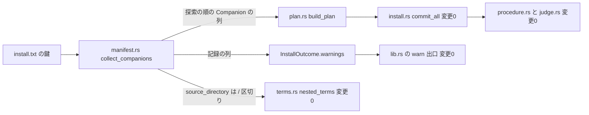
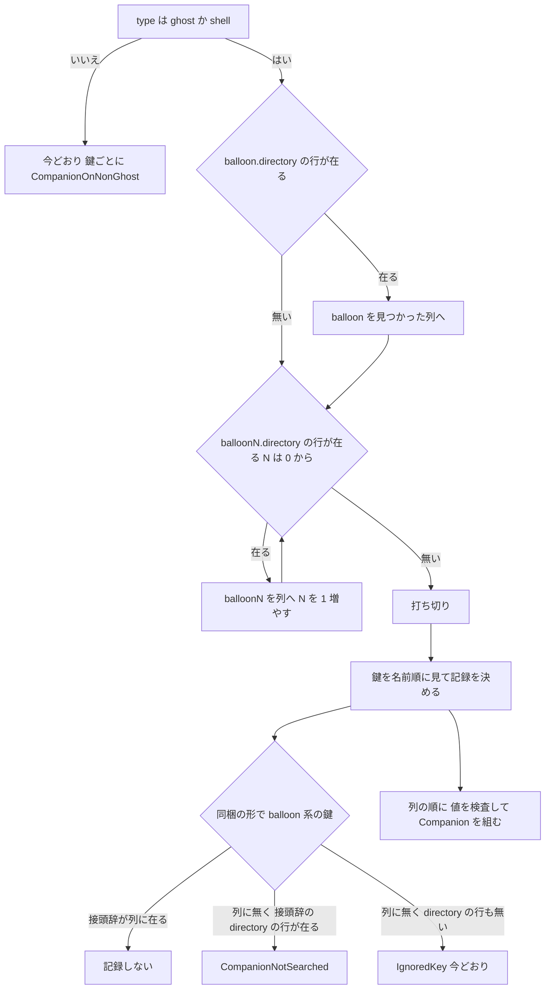

# Design Document: areka-P0-install-companion-reading

## Overview

**Purpose**: ゴースト・シェルの書庫の `install.txt` に書かれた同時インストールのバルーンを、ukadoc「Install設定」どおりに読む。変えるのは 3 点である。

1. 番号は無印 → 0 → 1 → 2… の順に探し、見つからない番号で打ち切る。先頭に 0 を付けた綴りは読まない。
2. `*.source.directory` を、`\` と `/` のどちらでも区切る書庫の中の相対パスとして読む。
3. `*.source.directory` の `..` と空の段を取り除く。

**Users**: ukadoc どおりに `install.txt` を書くゴースト・シェルの作者と、その書庫を落とす利用者。

**Impact**: 読み替えは `install.txt` の読み手（`crates/areka-nar/src/manifest.rs`）だけで行う。配置の計画（`crates/areka-nar/src/plan.rs`）は「取り出し元が複数段でも配下を判定できる」ように広げる。安全の検査・確定の手順・インストールの手続き・起動の側は変えない。

### Goals

- 要件 1〜3 の読み方を、既存の関数 3 つ（`collect_companions`・`in_folder`・`companion_placement`）を広げるだけで実現する。
- 読み替えた後の値に、今の検査（`is_valid_one_level_name` と長さの上限 200）をそのまま掛ける。新しい検査は書かない。
- 読み替えたこと・探索で読まなかったことを、記録の種類 2 つで 1 件ずつ残す。
- 13 の場面を決定論のテストで固定する。

### Non-Goals

- 同梱の `*.directory` の区切りを `_` に置き換えること（今どおり断る。変更 0）。
- 起動時にどのバルーンを使うか（`areka-P0-ghost-standard-balloon`）。
- 同梱の種類を増やすこと・`type` が `balloon`／`supplement` の書庫の同梱を読むこと。
- 2 つの同梱が同じ宛先を指す場合の扱い。
- 新しいクレート・新しい依存・新しい公開の関数（どれも 0 個）。

## Boundary Commitments

### This Spec Owns

- `install.txt` の同梱のバルーンの**探索の順と打ち切り**（`manifest.rs` の `collect_companions`）。
- `*.source.directory` の**読み方**（区切り・`..` と空の段の取り除き・取り除いた後の検査）。
- `Companion.source_directory` の**値の形の約束**: 「`/` で区切った 1 段以上の相対パス。各段は 1 階層の名前の検査を通っている。`..`・空の段・`\` を含まない」。
- `InstallManifest.companions` の**並びの約束**: 「探索の順」。
- 記録の種類 2 つ（`ManifestWarning::SourceDirectoryCleaned`・`ManifestWarning::CompanionNotSearched`）。
- 取り出し元が複数段のときの配置（`plan.rs` の `in_folder`・`body_placement`・`companion_placement`）。
- `doc/COMPAT_ARCHITECTURE.md` §8 の行と、網羅台帳の 2 行の `note`。

### Out of Boundary

どれも変更 0 である。

- `crates/areka/src/install/procedure.rs`・`judge.rs` と、そのテストのファイル（`procedure_tests.rs`・`procedure_branch_tests.rs`・`procedure_test_support.rs`・`judge_tests.rs`）。
- `crates/areka/src/install/terms.rs` の本体（テストのファイル `terms_tests.rs` だけ触る）。
- `crates/areka-nar/src/install.rs`（確定の手順）・`lib.rs`（記録を出す出口。接続の宣言も足さない）・`names.rs` の検査の中身。
- `crates/areka-parsers/`・`crates/areka-ghost/`・`crates/areka/src/boot_resolve.rs`。
- 開発用の道具 `crates/sample-ghost-kit/examples/fold-samples.rs`。階層付きの取り出し元を持つ検体は 0 体なので広げない（設計の討議の決め）。この道具の `strip_folder` は取り出し元の先頭の 1 段だけを見るので、階層付きの検体を畳むと、道具自身の突き合わせ（置かれた物と写像の不一致を数える）が報せる。広げるのはそのときである。
- `RefuseReason` の種類（14 種のまま）・`InstallManifest` の欄（8 欄のまま）・`Companion` の欄と型（4 欄・`source_directory` は `String` のまま）。
- 本体の `directory` の検査・同梱の `*.directory` の検査（今どおり 1 階層の名前でなければ断る）。
- 網羅台帳の 2 行の `note` 以外の欄（`status`・`owner`・`priority`・`values`・`links`）と、ほかの全ての行。

### Allowed Dependencies

- `areka-nar` の中の既存の関数: `is_valid_one_level_name`・`bounded_value`・`utf16_len`・`MAX_ENTRY_PATH_UTF16`・`collect_tree`・`existing_policy`・`classify`。
- テスト: `sample_ghost_kit` の `NarBuilder`・`install_txt`・`WorkDir`。既存のテストの助手（`parsed_ghost`・`refused_ghost`・`planned`・`plan_of`・`refusal_of`・`relative_files`・`escapes`・`root_with_ghost`）。
- 依存の向きは今のまま: `areka` → `areka-nar` → `areka-parsers`。新しい辺は 0 本。
- 使ってはならないもの: `temp_path_kit::TempPath`（置き場が OS の一時フォルダ。本 spec のテストでは使わない）。

### Revalidation Triggers

次のどれかを変えるときは、使い手（`terms.rs` の `nested_terms`・`fold-samples.rs`・`areka-P0-ghost-standard-balloon`）を見直す。

- `Companion.source_directory` の値の形（`/` 区切りの正規化した相対パス）を変える。
- `InstallManifest.companions` の並び（探索の順）を変える。
- 「見つかった」の判定の鍵（`<接頭辞>.directory` の行）を変える。
- 記録の種類を増減する、または 1 つの鍵から出す件数を変える。

## Architecture

### Existing Architecture Analysis

- `manifest.rs` の `parse_manifest` が `install.txt` を読み、`collect_companions` が同梱の一覧と読み飛ばしの記録を組む。鍵は `parse_kv` が `BTreeMap` で返すので行の順は残らない。したがって探索の順は、鍵を順に**引いて**作る（並べ替えではない）。
- `plan.rs` の `build_plan` は `manifest.companions` の順に配置を組む。確定（`install.rs` の `commit_all`）もインストールの手続き（`procedure.rs` の `installed_items`）も知らせ（`judge.rs` の `complete_ex_refs`・`complete_legacy_refs`）も、その順を並べ替えずに運ぶ。`companions` の順を変えれば、後ろは無改変で知らせの並びまで変わる。
- `plan.rs` の `collect_tree` は「剥がす段数」を引数で受ける。複数段を渡せばそのまま動く。
- `lib.rs` の `NarArchive::entry_bytes` は `/` 区切りのパスの全体を ASCII の大小を無視して比べる。取り出し元を `/` 区切りで持てば、`terms.rs` の `nested_terms`（`format!("{}/{file}", companion.source_directory)`）は本体を変えずに階層付きで動く。
- `judge.rs` の `failure_word` は `RefuseReason` の 14 種を漏れなく並べた `match` である。種類を足すと `judge.rs` が変わるので、足さない。

### Architecture Pattern & Boundary Map



- **選んだ形**: 入口（読み手）で読み替え、後ろへは「正規化した値」だけを渡す。後ろの層は読み替えを知らない。
- **残す形**: 拒否は `RefuseReason`、読み飛ばしは `ManifestWarning`。「本体を置けない／値が使えない」は拒否、「読まなかった／読み替えた」は記録。
- **新しい部品**: 0 個。私有の関数を `manifest.rs` に 2 つ、`plan.rs` に 1 つ足すだけである。

### Technology Stack

| Layer | Choice / Version | Role in Feature | Notes |
|-------|------------------|-----------------|-------|
| 読み手 | `areka-nar`（既存） | 探索・読み替え・記録 | 依存の追加 0 |
| テスト | `sample-ghost-kit`（既存の dev 依存） | 書庫を組む・`target\` の下の作業フォルダ | `WorkDir` の置き場は `<target>/nar-samples/work/<プロセス識別子>-<連番>/` |

## File Structure Plan

### Modified Files

本番のコード:

- `crates/areka-nar/src/manifest.rs` — `collect_companions` を探索の順へ替える。私有の関数 `search_balloons`・`read_source_directory` を足す。`Companion.source_directory`・`InstallManifest.companions`・冒頭の「警告の並び」の説明文を直す。`COMPANION_SUFFIXES` の上の `// ukadoc:` の 4 行は動かさない。431 行 → 500 行台。
- `crates/areka-nar/src/plan.rs` — `in_folder` を段ごとの前方一致へ広げる。`body_placement` が取り出し元の途中のフォルダのエントリを除く。`companion_placement` が取り出し元の段数を剥がす。`build_plan` の説明文の「接頭辞の名前順」を「探索の順」へ直す。273 行 → 300 行台。
- `crates/areka-nar/src/error.rs` — `ManifestWarning` に 2 種を足す（5 種 → 7 種）。`RefuseReason` は触らない。
- `crates/areka-nar/src/names.rs` — `is_valid_one_level_name` の説明文の 1 か所（`*.source.directory` は「各段」が満たす、と直す）。検査の中身は変更 0。

テスト:

- `crates/areka-nar/src/manifest_companion_tests.rs` — 結果が変わる 3 本をその場で書き換える（下の Testing Strategy）。
- `crates/areka-nar/src/manifest_tests.rs` — 末尾に接続の宣言を足す（618 行 → 622 行前後）。
- `crates/areka-nar/src/plan_tests.rs` — 末尾に接続の宣言を足す（916 行 → 920 行前後。テストの本体は足さない）。
- `crates/areka-nar/src/lib_tests.rs` — 公開の入口を通す 2 本を末尾に足す（599 行 → 700 行前後）。`lib.rs` は変更 0。
- `crates/areka-nar/src/error_tests.rs` — `warning_name` と `manifest_warnings_are_five_and_carry_their_key` を 7 種へ直す。
- `crates/areka/src/install/terms_tests.rs` — 助手 `open` の置き場を `WorkDir` へ替え、階層付きの場面を 1 本足す。

文書:

- `doc/COMPAT_ARCHITECTURE.md` — §8 の表に 4 行足す。
- `doc/ukadoc-coverage/ledger/assets.toml` — `descript_install` の `*.directory`・`*.source.directory` の 2 行の `note` を書き換える。

### New Files

```
crates/areka-nar/src/
├── manifest_companion_reading_tests.rs  # 探索の順・打ち切り・取り出し元の読み替え・記録（manifest_tests.rs から mod companion_reading で繋ぐ）
└── plan_source_path_tests.rs            # 階層付きの取り出し元の配置（plan_tests.rs から mod source_path で繋ぐ）
```

- 繋ぎ方は既存の形に揃える。`manifest_tests.rs` は既に `manifest_companion_tests.rs` を子として繋いでおり、子は `use super::*` で助手を借りる。`plan_tests.rs` の助手は私有だが、子のモジュールからは見えるので、可視性の変更は 0 か所で済む。
- 新しい本番のファイルは 0 本。

## System Flows

### 探索と記録の分かれ目



- 「行が在る」は鍵の有無だけで決める。値が空でも在る（要件 1.2）。空の値は後ろの検査で今どおり断る。
- `N` の綴りは `format!("balloon{n}")` で作る。先頭に 0 を付けた綴り（`balloon01`）は、この引き方では決して当たらない（要件 1.6）。
- 打ち切りの後ろの鍵の値は検査しない。壊れた値が書かれていても断らず、記録して続ける（要件 6.3）。

## Requirements Traceability

| Requirement | Summary | Components | Interfaces | Flows |
|-------------|---------|------------|------------|-------|
| 1.1 | 無印 → 0 → 1… の順に探す | manifest | `search_balloons` | 探索 |
| 1.2 | 「見つかった」は `*.directory` の行。空の値は今どおり断る | manifest | `search_balloons`・`check_one_level` | 探索 |
| 1.3 | 欠番で打ち切る | manifest | `search_balloons` | 探索 |
| 1.4 | 無印が無くても 0 から続ける | manifest | `search_balloons` | 探索 |
| 1.5 | 無印と 0 は別 | manifest | `search_balloons` | 探索 |
| 1.6 | 先頭に 0 を付けた綴りは読まない | manifest | `search_balloons` | 探索 |
| 1.7 | 本体の後ろに探索の順で並ぶ | manifest・plan | `InstallManifest.companions`・`build_plan` | — |
| 1.8 | 知らせの並び | 既存の経路（変更 0） | `commit_all` → `installed_items` → `complete_ex_refs`・`complete_legacy_refs` | — |
| 1.9 | `*.directory` の行が無い接頭辞は見つからない | manifest | `search_balloons` | 探索 |
| 1.10 | 扱わない種別・`ghost`／`shell` 以外は変えない | manifest（変更 0 の枝） | `collect_companions` の既存の枝 | 探索 |
| 2.1 | 区切りを含む値で断らない | manifest | `read_source_directory` | — |
| 2.2 | 全段を剥がして宛先へ置く | plan | `companion_placement`・`collect_tree` | — |
| 2.3 | 各段を ASCII の大小を無視して突き合わせる | plan | `in_folder` | — |
| 2.4 | 配下でないものは本体。途中のフォルダは要るときだけ | plan | `body_placement`・`leads_to_folder` | — |
| 2.5 | 配下が空なら断る | plan（変更 0 の枝） | `companion_placement` の `CompanionSourceMissing` | — |
| 2.6 | 行が無い・空なら宛先の名前 | manifest（変更 0 の枝） | `collect_companions` | — |
| 2.7 | 階層付きの取り出し元の直下の利用条件 | terms（本体は変更 0） | `nested_terms` | — |
| 2.8 | 重なる取り出し元はそれぞれが受け取る | plan | `in_folder`（同梱ごとに独立に判定） | — |
| 3.1 | `..` の段を取り除く | manifest | `read_source_directory` | — |
| 3.2 | `..` は手前を打ち消さない | manifest | `read_source_directory` | — |
| 3.3 | 空の段を取り除く | manifest | `read_source_directory` | — |
| 3.4 | 段が残らなければ断る | manifest | `read_source_directory` → `InvalidDirectoryName` | — |
| 4.1 | `*.directory` の区切りは断る | manifest（変更 0 の枝） | `check_one_level` | — |
| 4.2 | `*.directory` は読み替えない | manifest（変更 0） | — | — |
| 4.3 | 起動の側は変えない | 境界（変更 0） | — | — |
| 5.1 | `*.directory` に 1 階層の名前の検査 | manifest（変更 0 の枝） | `check_one_level` | — |
| 5.2 | 通らなければ断る | manifest（変更 0 の枝） | `InvalidDirectoryName` | — |
| 5.3 | 取り除いた後の各段と全体の長さを検査 | manifest | `read_source_directory` | — |
| 5.4 | 通らなければ断る | manifest | `read_source_directory` → `InvalidDirectoryName` | — |
| 5.5 | 書く前に止める・記録する | 既存の経路（変更 0） | `NarArchive::open`／`install` の拒否の道 | — |
| 5.6 | 宛先のフォルダの外へ置かない | plan | `companion_placement`（宛先は `root/balloon/<1 階層の名前>`・相対パスは検証済みのエントリ名の尾） | — |
| 5.7 | 本体の `directory` の検査は変えない | manifest（変更 0） | `parse_manifest` | — |
| 5.8 | 3 点を使わない書庫は今と同じ | manifest・plan | 1 段の取り出し元は複数段の判定の 1 段の場合 | — |
| 6.1 | 取り除きを鍵ごとに 1 件記録 | manifest・error | `SourceDirectoryCleaned` | — |
| 6.2 | 区切りの違いだけなら記録しない | manifest | `read_source_directory` | — |
| 6.3 | 探索で読まなかった鍵を区別して記録 | manifest・error | `CompanionNotSearched` | 探索 |
| 6.4 | `*.directory` の行が無い断片は今どおり | manifest（変更 0 の枝） | `IgnoredKey` | 探索 |
| 6.5 | 1 つの鍵から最大 1 件 | manifest | 記録の 3 段の並び | 探索 |
| 6.6 | 同じ入力から同じ列 | manifest | 鍵の名前順と探索の順だけで決まる（乱数・時刻・ハッシュの順を使わない作りで満たす。専用のテストは足さない） | — |
| 6.7 | ログへ 1 件ずつ警告 | 既存の出口（変更 0） | `NarArchive::install` の `warn!` | — |
| 6.8 | 読み替えも読み飛ばしも無ければ 0 件 | manifest | — | — |
| 7.1 | 完了 spec の要件 3.9・3.12 の上書きを記す | 文書 | `doc/COMPAT_ARCHITECTURE.md` §8 | — |
| 7.2 | ukadoc が書いていない点の決めを記す | 文書 | 同上 | — |
| 7.3 | 台帳の 2 行 | 文書 | `assets.toml` の `note` | — |
| 7.4 | ほかの行は変えない | 文書（変更 0） | — | — |
| 8.1 | 13 の場面 | テスト | Testing Strategy の表 | — |
| 8.2 | 置き場所・並び・記録を確かめる | テスト | `escapes`・根の走査・列の完全一致 | — |
| 8.3 | 10 以上の同梱で並びを確かめる | テスト | `lib_tests.rs` に足す 2 本 | — |
| 8.4 | 階層付きの利用条件 | テスト | `terms_tests.rs` | — |
| 8.5 | 置き場は `target\` の下だけ | テスト | `WorkDir` | — |

## Components and Interfaces

| Component | Domain/Layer | Intent | Req Coverage | Key Dependencies | Contracts |
|-----------|--------------|--------|--------------|------------------|-----------|
| manifest（`manifest.rs`） | 読み手 | 探索・取り出し元の読み替え・記録 | 1.1〜1.10, 2.1, 2.6, 3.1〜3.4, 4.1, 4.2, 5.1〜5.4, 5.7, 6.1〜6.6, 6.8 | `names`（P0）・`error`（P0） | Service |
| error（`error.rs`） | 語彙 | 記録の種類 2 つ | 6.1, 6.3 | — | State |
| plan（`plan.rs`） | 配置の計画 | 複数段の取り出し元の配下の判定と剥がし | 1.7, 2.2〜2.5, 2.8, 5.6, 5.8 | manifest（P0） | Service |
| terms（`terms.rs`） | 手続き | 取り出し元の直下の利用条件 | 2.7 | manifest（P0） | 変更 0 |
| 文書 | — | 上書きと決めの記録 | 7.1〜7.4 | — | — |

### 読み手

#### manifest

| Field | Detail |
|-------|--------|
| Intent | 同梱のバルーンを探索の順に組み、取り出し元を正規化し、読み替えと読み飛ばしを記録する |
| Requirements | 1.1〜1.10, 2.1, 2.6, 3.1〜3.4, 4.1, 4.2, 5.1〜5.4, 5.7, 6.1〜6.6, 6.8 |

**Responsibilities & Constraints**

- 宛先を受け取らず、ファイルシステムを変えない（今の約束のまま。兄弟テストが字面で見張っている）。
- `classify`・`numbered`・`check_one_level`・`existing_policy`・`parse_mask` は変えない。`numbered` は今どおり `balloon007` も同梱の形と答える。読むかどうかは探索が決める。
- `type` が `ghost`／`shell` でないときの枝は変えない。

##### Service Interface

```rust
/// 探索で見つかった同梱のバルーンの接頭辞を、探索の順に返す。
///
/// 無印（`balloon`）→ `balloon0` → `balloon1` … の順に `<接頭辞>.directory` の鍵を引く。
/// 無印は無くても続け、番号は最初に無かった所で止める。
fn search_balloons(keys: &BTreeMap<String, String>) -> Vec<String>;

/// `*.source.directory` に書かれていた値を、書庫の中の `/` 区切りの相対パスへ読む。
///
/// `written` は空でない値（空と行なしは呼び手が宛先の名前に倒す）。
fn read_source_directory(
    key: &str,
    written: &str,
    warnings: &mut Vec<ManifestWarning>,
) -> Result<String, RefuseReason>;
```

`search_balloons`

- Postconditions: 返る列は重複が無く、`balloon` が在れば先頭、その後ろは `balloon0` から欠番なしに続く番号。
- Invariants: 有限の鍵しか無いので必ず止まる。

`read_source_directory`

- 手順は次の 4 つで、この順に行う。
  1. `written` を `\` と `/` のどちらでも分ける。
  2. 空の段と `..` の段を落とす。`..` は手前の段を打ち消さない（`extra/../bal1` は `extra/bal1`）。
  3. 残った段が 0 個、または `is_valid_one_level_name` を通らない段が在る、または段を `/` で繋いだ全体が UTF-16 で 200 単位を超えるなら、`RefuseReason::InvalidDirectoryName { key, value: bounded_value(written) }` を返す。
  4. 2 で 1 つでも段を落としたなら `ManifestWarning::SourceDirectoryCleaned { key, written: bounded_value(written), read }` を 1 件積む。落としていなければ積まない（区切りが `\` か `/` かだけの違いは記録 0 件）。
- Postconditions: `Ok` の値は「1 段以上・各段が 1 階層の名前・`/` 区切り・全体が 200 単位以内」。
- 理由に載せる値は、どの失敗でも**書かれていた値**である（要件 3.4・5.4）。

`collect_companions` の変え方（署名は変えない）

- 宛先を集める段: `BTreeMap` に全部集める今の形をやめ、`search_balloons` の列を使う。
- 記録の段（鍵の名前順）: 同梱の形で扱う種別（`balloon` 系）の鍵について、接頭辞が列に在れば記録しない。列に無く `<接頭辞>.directory` の行が在れば `CompanionNotSearched`。列に無く行も無ければ今どおり `IgnoredKey`。ほかの枝（知らない鍵・扱わない種別・`ghost`／`shell` 以外）は変更 0。
- 組む段（探索の順）: `<接頭辞>.directory` を `check_one_level` で検査する（変更 0）。`<接頭辞>.source.directory` は、空でない値が在れば `read_source_directory` に通し、無い・空なら宛先の名前をそのまま使う（変更 0）。

**記録の並び**（冒頭の説明文も同じに直す）

1. 本体の再インストール（変更 0）。
2. 鍵の名前順の読み飛ばし。`CompanionNotSearched` はここに入る。
3. 同梱ごとに探索の順で、取り除きの記録 → マスクの記録。

1 つの鍵が 2 の段と 3 の段の両方で記録を出すことは無い（2 は列に無い接頭辞の鍵、3 は列に在る接頭辞の鍵）。

**Implementation Notes**

- Integration: `Companion.source_directory` の説明文を「書庫の中の取り出し元。`/` で区切った 1 段以上の相対パス」に、`InstallManifest.companions` の説明文を「探索の順（無印 → 0 → 1…）に並ぶ」に直す。
- Validation: 断るのは `Companion` を組む段だけ。打ち切りの後ろの鍵は値を見ない。
- Risks: `manifest.rs` は 500 行台になる。1,000 行の上限には遠いので分けない。

### 語彙

#### error

| Field | Detail |
|-------|--------|
| Intent | 「取り除いた」「探索で読まなかった」を、知らない鍵の読み飛ばしと区別できる種類で持つ |
| Requirements | 6.1, 6.3 |

```rust
pub enum ManifestWarning {
    // …既存の 5 種はそのまま…
    /// `*.source.directory` から `..` か空の段を取り除いた。
    SourceDirectoryCleaned { key: String, written: String, read: String },
    /// 探索で読まなかった同梱のバルーンの鍵（打ち切りの後ろの番号・先頭に 0 を付けた綴り）。
    CompanionNotSearched { key: String },
}
```

- 表示（`Display`）は、鍵・書かれていた値・取り除いた後の値を落とさずに載せる。
- `crates/areka/` の中に `ManifestWarning` の種類の名前を書いている場所は 0 か所なので、足しても `crates/areka/` は変わらない。種類を漏れなく並べているのは `error_tests.rs` の `warning_name` だけである。

### 配置の計画

#### plan

| Field | Detail |
|-------|--------|
| Intent | 取り出し元が何段でも、配下の判定と剥がしを同じ一言で行う |
| Requirements | 1.7, 2.2〜2.5, 2.8, 5.6, 5.8 |

##### Service Interface

```rust
/// エントリが `folder`（`/` 区切りの取り出し元）そのもの、またはその配下か。
/// `folder` の全ての段を、エントリの先頭の段と ASCII の大小を無視して比べる。
fn in_folder(entry: &EntryName, folder: &str) -> bool;

/// エントリが、`folder` へ降りる途中のフォルダのエントリか
/// （フォルダのエントリで、段数が `folder` より少なく、全ての段が `folder` の先頭と合う）。
fn leads_to_folder(entry: &EntryName, folder: &str) -> bool;
```

- `in_folder`: 文字列の前方一致ではなく段ごとに比べる。`extra/bal10/x` は `extra/bal1` の配下ではない。エントリの段数が `folder` の段数より少なければ偽。1 段の `folder` では今の判定と同じ結果になる（要件 5.8）。
- `companion_placement`: `collect_tree` へ渡す「剥がす段数」を、`companion.source_directory` の段数（`/` で分けた数）にする。`in_folder` が真のエントリは必ずその段数以上を持つので、剥がしは範囲を外れない。配下が空のときの `CompanionSourceMissing` は変更 0 で、`source_directory` には正規化した値が載る。
- `body_placement`: 本体から除くものを 2 つにする。
  - どれかの同梱の取り出し元の配下（今どおり `in_folder`）。
  - どれかの同梱の取り出し元へ降りる途中のフォルダのエントリ（`leads_to_folder`）。
- 途中のフォルダを「エントリとしては」必ず除くのが要件 2.4 の実現である。その配下に本体へ置くファイルやフォルダが在れば、`collect_tree` が親として同じフォルダを作る。無ければ作られない。書庫がフォルダのエントリを持つかどうかで結果が変わらない。
- 重なる取り出し元（要件 2.8）: 同梱ごとに自分の `source_directory` だけで `in_folder` を引くので、`extra` と `extra/bal1` はそれぞれ自分の配下の全てを受け取る。新しい枝は要らない。
- `in_folder` と `leads_to_folder` は「段ごとの突き合わせ」を共有する。突き合わせは 1 か所に書く。

**Implementation Notes**

- Integration: `build_plan` の説明文の「接頭辞の名前順」を「探索の順」へ直す。処理は変更 0（`manifest.companions` を順に回すだけ）。
- Risks: 宛先は今どおり `root.join("balloon").join(<1 階層の名前>)` で、置く相対パスは検証済みのエントリ名の尾である。取り出し元の値は宛先のパスに 1 度も継ぎ足さない。

### 手続き

#### terms

- `terms.rs` の本体は変更 0。`nested_terms` は `source_directory` と `terms.txt`／`terms.md` を `/` で繋いで `entry_bytes` で引くので、`extra/bal1` なら `extra/bal1/terms.txt` を引く。`extra/terms.txt` は引かない（直下だけ）。
- 足すのはテスト 1 本だけである。

### 文書

- `doc/COMPAT_ARCHITECTURE.md` §8 に、既存の 4 列（項目・裁量・根拠・出典 spec）で 4 行足す。
  1. 【上書き】同梱の番号の読み方（完了 `areka-P0-nar-install` 要件 3.12 を上書き）。「見つかった」の判定は `*.directory` の行・先頭に 0 を付けた番号は数えない、を含む。
  2. 【上書き】`*.source.directory` の読み方（同 要件 3.9 のうち `*.source.directory` の部分を上書き。`*.directory` を 1 階層の名前に限る部分は上書きしない）。SSP 2.8.00 以降の形を採る・`..` は打ち消さずに取り除く・段が残らなければ断る、を含む。
  3. 同梱の `*.directory` の区切り: ukadoc の「使えない」を採って断り、`_` への置き換えは採らない。
  4. `type` が `ghost`／`shell` 以外の書庫の同梱は読まないまま。
- `assets.toml` の 2 行は `note` だけを書き換える。`status = "implemented"` の根拠は、`manifest.rs` の `COMPANION_SUFFIXES` の上の `// ukadoc:` の行のままである（台帳の検査は「実装済みの項目の URL がソースに 1 件以上在ること」だけを見る）。`note` の「根拠の場所」の文は今のまま正しい。

## Error Handling

### Error Strategy

| 場面 | 結果 | 載せる値 |
|---|---|---|
| `*.source.directory` を取り除いて段が残らない | `InvalidDirectoryName` | 鍵・書かれていた値 |
| 取り除いた後の段が 1 階層の名前でない（`.`・`C:`・末尾が空白・予約名） | `InvalidDirectoryName` | 鍵・書かれていた値 |
| 繋いだ全体が 200 単位を超える | `InvalidDirectoryName` | 鍵・書かれていた値（`bounded_value` で有界） |
| `*.directory` に区切り・`..`・空（変更 0） | `InvalidDirectoryName` | 鍵・値 |
| 取り出し元の配下が空（変更 0） | `CompanionSourceMissing` | 鍵・正規化した取り出し元 |
| 打ち切りの後ろ・先頭に 0 を付けた綴り | 断らない。`CompanionNotSearched` を記録 | 鍵 |
| `..`・空の段を取り除いた | 断らない。`SourceDirectoryCleaned` を記録 | 鍵・書かれていた値・取り除いた後の値 |

- 断る理由の種類は足さない（14 種のまま）。`judge.rs` の `failure_word` は変更 0。
- `install.txt` の解釈の拒否は `NarArchive::open` の中で起きる。インストールが始まる前なので、宛先には 1 バイトも書かれない（要件 5.5）。計画の拒否（`CompanionSourceMissing`）は今どおり書き込みの前である。

### Monitoring

- 記録の出口は変えない。`NarArchive::install` が成功したとき、`outcome.warnings` を 1 件ずつ `warn!`（`[areka_nar] manifest entry skipped`）で出す。新しい 2 種も同じ出口を通る（要件 6.7）。
- ログを出す場所は増えない（0 か所）。
- 断られた書庫では、読み替えの記録（`SourceDirectoryCleaned`・`CompanionNotSearched`）はログに出ない（今の読み飛ばしの記録と同じ）。出るのは断った理由で、そこに鍵と値が載る。取り除いた後の取り出し元が書庫に無いときの理由（`CompanionSourceMissing`）には、取り除いた後の値が載る。

## Testing Strategy

方針: 判断の分かれ目を、到達する経路（`parse_manifest`・`build_plan`・`NarArchive::install`）を通して固定する。警告は順序つきの列の完全一致で比べる。既に確かめてある配線（記録を `warn!` へ出す出口・知らせへの写し）は足さない。

### 置き場

- 作業フォルダは `sample_ghost_kit::WorkDir` だけを使う。置き場は `<ビルド成果物の置き場>/nar-samples/work/<プロセス識別子>-<連番>/` で、ビルド成果物の置き場は `CARGO_TARGET_DIR`、無ければ実行ファイルの祖先で名前が `target` の最初のフォルダである（`crates/sample-ghost-kit/src/devroot.rs` の `find_target_dir`・`namespace_dir`）。本リポジトリに `.cargo/config.toml` は無いので、ワークツリーの `target\` の下になる。
- `temp_path_kit::TempPath` は `std::env::temp_dir()` の下に置くので使わない。`terms_tests.rs` の助手 `open` は今これを使っているので、`WorkDir` へ替える。
- `manifest` のテストはファイルシステムに触らない（バイト列を `parse_manifest` へ渡すだけ）。

### `manifest_companion_reading_tests.rs`（新規・`parse_manifest` を通す）

| 場面（要件 8.1） | 確かめること | 要件 |
|---|---|---|
| 欠番での打ち切り（`balloon0` と `balloon2`） | 同梱は `balloon0` だけ。`balloon2` の鍵ごとに `CompanionNotSearched` が 1 件 | 1.3, 6.3, 6.5 |
| 無印が無い番号付きだけ | `balloon0`・`balloon1` の順。記録 0 件 | 1.4, 6.8 |
| 無印と `balloon0` の両方 | `balloon`・`balloon0` の順で 2 件 | 1.5 |
| `balloon2` と `balloon10` の並び | 無印と `balloon0`〜`balloon10` で、鍵の列が数の順 | 1.1, 1.7 |
| 先頭に 0 を付けた番号 | `balloon0` と `balloon01` → `balloon0` だけ。`balloon01` は `CompanionNotSearched`。`balloon00` だけ → 0 件 | 1.6, 6.3 |
| `*.directory` の行が無い接頭辞の断片 | `balloon1.source.directory` だけ → `balloon0` で打ち切り、断片は `IgnoredKey`、後ろの `balloon2.directory` は `CompanionNotSearched`。無印の断片では打ち切らない | 1.9, 6.4 |
| 打ち切りの後ろの壊れた値 | `balloon0` と `balloon2.directory,../x` → 断らず記録 | 6.3 |
| `\` と `/` の取り出し元 | `extra\bal1` と `extra/bal1` がどちらも `extra/bal1`。記録 0 件 | 2.1, 6.2 |
| `..` と空の段の取り除き | `../extra/bal1`・`extra/../bal1`・`/extra//bal1/` が `extra/bal1`。それぞれ `SourceDirectoryCleaned` が 1 件で、書かれていた値と取り除いた後の値が合う | 3.1〜3.3, 6.1 |
| 取り除いた後に段が残らない | `..`・`/`・`../..` → `InvalidDirectoryName`（鍵・書かれていた値） | 3.4 |
| 取り除いた後の検査 | `.` の段・`C:` を含む段・末尾が空白の段・予約名の段 → 断る。全体がちょうど 200 単位は通り、201 単位は断る | 5.3, 5.4 |
| 同梱の `*.directory` に区切り | `extra\bal1`・`../escape` → `InvalidDirectoryName` | 4.1, 4.2, 5.1, 5.2 |

- 本体の `directory` に区切りがある場合（要件 5.7・8.1 の最後の場面）は、既存の `manifest_tests.rs` の `refuses_a_directory_that_is_not_a_one_level_name` がそのまま固定している。足さない（追加 0 本）。
- 要件 5.8・6.8 の「今と同じ」は、既存の `every_real_sample_install_txt_is_accepted_verbatim_without_a_single_warning` と、書き換えない既存のテストが通り続けることで見る。
- 要件 1.10 は、既存の `warns_and_skips_the_companion_kinds_areka_does_not_handle`・`warns_and_skips_companions_written_on_a_balloon_or_a_supplement` が通り続けることで見る（変更 0）。

### `manifest_companion_tests.rs`（その場で書き換える 3 本）

| 今のテスト | 書き換えた後の期待 |
|---|---|
| `reads_numbered_balloon_companions_in_key_order` | 名前を探索の順に合わせて改める。同じ入力で同梱は `balloon`・`balloon0`、記録は `balloon10.directory`・`balloon2.directory` の `CompanionNotSearched` |
| `balloon_followed_by_digits_is_a_companion` | 単独で書いて読まれるのは `balloon` と `balloon0` だけ。`balloon9`・`balloon10`・`balloon007` は同梱 0 件で `CompanionNotSearched`（知らない鍵 `IgnoredKey` ではない＝同梱の形としては認めている） |
| `refuses_a_companion_source_directory_that_is_not_a_one_level_name` | `sub/kakukaku` は受理されて `sub/kakukaku`。断る例を「段が 1 階層の名前でない値」に替える |

`refuses_a_companion_directory_that_is_not_a_one_level_name` は変えない（`../escape` と空の値を今どおり断る）。

### `plan_source_path_tests.rs`（新規・`planned` で `parse_manifest` → `build_plan` を通す）

| 場面 | 確かめること | 要件 |
|---|---|---|
| 階層付きの取り出し元 | `extra/bal1/descript.txt`・`extra/bal1/sub/s0.png` が、同梱の配置に `descript.txt`・`sub/s0.png` として入る | 2.2 |
| 兄弟のファイル | `extra/readme.txt` が本体に `extra/readme.txt` として残り、`extra/bal1/` の中身は本体に 1 件も無い | 2.4 |
| 途中のフォルダ | `extra/` の中身が `bal1/` だけの書庫で、フォルダのエントリ `extra/`・`extra/bal1/` を持つ形と持たない形の本体のファイルとフォルダの列が等しく、どちらにも `extra` が無い | 2.4 |
| 綴りの大小 | `install.txt` の `Extra\BAL1` が書庫の `extra/bal1/` に当たる | 2.3 |
| 段ごとの突き合わせ | `extra/bal10/x.png` は `extra/bal1` の同梱に入らず、本体に残る | 2.3, 2.4 |
| 配下が空 | 階層付きの取り出し元が書庫に無い → `CompanionSourceMissing`（鍵・`extra/bal1`） | 2.5 |
| 重なる取り出し元 | `extra` と `extra/bal1` の 2 つの同梱で、前者に `bal1/descript.txt`、後者に `descript.txt` が入り、本体には入らない | 2.8 |
| 根の外へ出ない | 上の受理される計画の全ての宛先・ファイル・フォルダを `escapes` で歩き、外が 0 件で、歩いた数が固定の数に等しい | 5.6, 8.2 |

### `lib_tests.rs` に足す 2 本（公開の入口 `NarArchive::open` → `install` を通す）

| 場面 | 確かめること | 要件 |
|---|---|---|
| 10 以上の同梱 | 無印と `balloon0`〜`balloon10` を持つ書庫を空の根へ入れ、`outcome.installed` の名前の列が「本体 → 無印 → 0 → 1 … → 10」。根を走査した全てのファイルが `ghost/<本体>/` か `balloon/<各宛先>/` の配下に在る。記録 0 件 | 1.7, 5.6, 8.2, 8.3 |
| 読み替えを通した置き場所 | `balloon0.source.directory,../extra\bal1` と、打ち切りの後ろの `balloon2.directory` を持つ書庫を入れる。根を走査した全てのファイルが `ghost/<本体>/` か `balloon/<宛先>/` の配下に在り、同梱のファイルが剥がした位置に在り、`balloon2` の宛先は作られず、`outcome.warnings` が `CompanionNotSearched`・`SourceDirectoryCleaned` の順の完全一致 | 2.2, 3.1, 5.6, 6.1, 6.3, 8.2 |

- 要件 8.2 の分担: 探索の場面（どの同梱を、どの値で読むか）は `manifest` のテストが同梱の列と記録の列で固定する。読んだ値からどこへ置くかは `plan` が決めるので、置き場所が宛先の配下に収まることは `plan_source_path_tests.rs` の歩き方と、上の 2 本の根の走査で固定する。1 段の取り出し元の置き場所は、既存の `plan_tests.rs` の `every_path_of_every_plan_stays_under_the_root` が固定している（変更 0）。
- 知らせ（`OnInstallComplete` の Reference2・`OnInstallCompleteEx` の各 Reference）への写しは足さない。インストールの手続きの既存のテストが順を保つことを確かめており、手続きの側は変更 0 である（要件 8.3・1.8）。
- 記録を `warn!` へ出す出口のテストは足さない（出口は変更 0）。

### そのほか

- `error_tests.rs`: `manifest_warnings_are_five_and_carry_their_key` を 7 種へ直す（名前も改める）。新しい 2 種の表示が鍵・書かれていた値・取り除いた後の値を含むことを確かめる。
- `terms_tests.rs`: `balloon.source.directory,extra\bal1` の書庫で、`extra/bal1/terms.txt` が `nested_terms` に載り、`extra/terms.txt` は載らないことを確かめる（要件 2.7・8.4）。

### 実行の範囲

- 実装の間に回すのは `cargo test -p areka-nar`・`cargo test -p areka --bin areka install::terms`・`cargo test -p ukadoc-survey`（台帳の整合）である。全体テストは完了の段で 1 回だけ回す。

## Security Considerations

- 第三者の書庫を受ける口である。読み替えは「断る」を「入れる」に変えるので、読み替えた後の値に今の検査を必ず掛ける（`read_source_directory` の手順 3）。
- 取り出し元の値は、書庫の中のエントリを**選ぶ**ためにだけ使う。宛先のパスには継ぎ足さない。宛先に継ぎ足すのは、検査を通った 1 階層の `*.directory` と、`validate_entry_names` を通ったエントリ名の尾だけである。したがって `..` を取り除く処理に誤りが在っても、根の外へ書き出す道にはならない（選ばれるエントリが変わるだけ）。
- `..` を手前の段の打ち消しとして読まないので、取り出し元が書庫の上位へ辿ることは無い。
