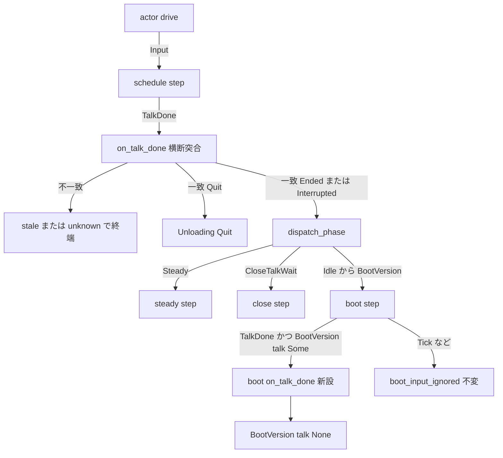
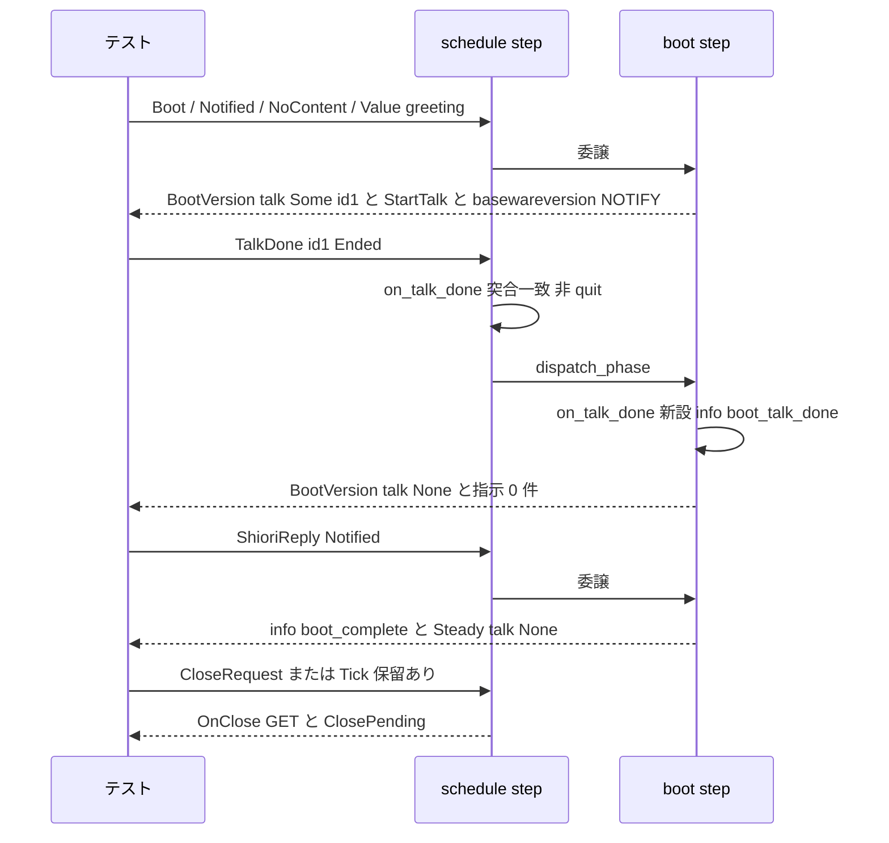

# 技術設計書 — areka-P0-kanade-boot-talkdone-drop

- 作成: 2026-09-17（設計生成・要件確定後）
- 入力: `requirements.md`（確定）・`research.md`（ギャップ分析＋設計判断項目 §7）・`brief.md`・steering（`product.md`／`tech.md`／`structure.md`／`logging.md`／`roadmap.md` W13）
- 規模: S（本番ファイル 1 本に腕 1 本＋関数 1 本・テスト 4 本・注記 1 か所）

## Overview

**Purpose**: kanade（ゴーストの運行を司る純粋状態機械）が起動系列の最終段 `BootVersion{talk: Some}` に滞在している間に届いた起動挨拶の再生完了通知（`TalkDone`・理由 `Ended`／`Interrupted`）を、捨てずに受理してトーク枠を空にする。これにより起動完了後の終了指示で終了の握手（`OnClose` の問い合わせ）が成立する。

**Users**: areka でゴーストを動かす利用者（終了指示で窓が閉じる）と、実機一周の運用者（`event=boot_input_ignored` を「本当に無関係な入力を捨てた印」としてだけ数えられる）。

**Impact**: 変更は `crates/areka-kanade/src/schedule/boot.rs` の `step` に `Input::TalkDone` の腕を 1 本足し、受理関数 `on_talk_done` を 1 本加えることに閉じる。横断遷移（`mod.rs`）・定常運転（`steady.rs`）・終了系列（`close.rs`）・アクターシェル（`actor.rs`）・areka 側の配線は変えない。

### 到達可能性（設計が前提とする構造的事実）

本欠陥は純粋状態機械 `step` の契約の穴であり、**現行のアクターシェル経由では到達不能**である。根拠（いずれも 2026-09-17 にコードで確認）:

- `crates/areka-kanade/src/actor.rs` の `drive`（DD-2「execute-batch/reinject-last」の同期往復ループ）は、`step` が返した指示列を `execute_actions` で先頭から全実行し、列中の SHIORI 往復の応答を **同じ呼出の中で** `Input::ShioriReply` として `step` へ再投入し、往復を含まない指示列が返るまで反復する。
- `BootVersion` へ入る唯一の経路（`boot.rs` の `to_baseware_version`）は必ず `basewareversion` の往復を同じ指示列に積む。よって `drive(Input::Boot)` 1 回の中で `Idle` から `Steady{talk}` まで進み切る。
- 受信箱は 1 メッセージにつき `drive` を 1 回呼ぶ（`crates/areka-actor/src/spawn.rs` の `run_inbox` が `recv` → ハンドラの順で回し、`actor.rs` の `spawn_kanade_with_stop_sink` のハンドラが `KanadeMsg::TalkDone(td) => Input::TalkDone(td)` を `drive` へ渡す）。したがって受信箱が次の `TalkDone` を取り出す時点で相は既に `Steady`。

帰結: `cargo test -p areka-kanade`（`step` を直接駆動する決定論テスト）が**欠陥の検出器**、`cargo test -p areka --bin areka`（`spine_conformance_*`＝アクターシェル経由の一周）は**非回帰の検出器**であり直す前も緑（要件 5.5）。直す理由は、守る側（`mod.rs` の `current_talk_id` が `BootVersion{Some}` を突合対象に含める防御）と捨てる側（委譲先 `boot::step` のワイルドカード腕）が同じ機械の中で矛盾していることにある。シェルの待ち方が変われば発現する（`kanade/schedule/*` はロードマップ W14〜W17 の輻輳点）。

### Goals
- `BootVersion{talk: Some}` で一致する非 quit の `TalkDone` を受理し `BootVersion{talk: None}` にする（副作用指示 0・待ち点維持）。
- 受理を info の `event=boot_talk_done`（`talk_id` 付き）でちょうど 1 行記録し、`boot_input_ignored` は書かない。
- 直す前に赤・直した後に緑の決定論テストを兄弟テストファイルへ固定する。
- 既存の起動系列テストと `boot_input_ignored` の綴り・発行点（1 か所）を保つ。

### Non-Goals
- 起動系列の順序・各段の発行内容・`basewareversion` の Status 導出の変更。
- `actor.rs` の `drive` の同期往復規律の変更・実機での再現・実機サインオフ。
- `steady.rs`／`close.rs` の `TalkDone` 処理の変更・`mod.rs` の横断遷移の変更。
- 完了仕様 `areka-P0-emo2-conformance-e2e` の文書（手順書 §5.7・記録 §7／§13.2）の書き換え。

## Boundary Commitments

### This Spec Owns
- `boot::step`（`crates/areka-kanade/src/schedule/boot.rs`）における `Input::TalkDone` の受理判断と、`BootVersion{talk: Some}` → `BootVersion{talk: None}` の遷移。
- 受理ログの語 `boot_talk_done`（target `kanade`・info・`talk_id`）の定義。
- 上記を固定する決定論テスト 4 本（`boot_sequence_tests.rs` 3 本・`schedule_log_firing_tests.rs` 1 本）と共有ヘルパ 1 本（`boot_test_support.rs`）。
- 直る欠陥を「残る危険」と記している `crates/areka/src/emo2_boot/spine_conformance_support_tests.rs` の doc コメント 1 段落の追随（コメントのみ・コードと表明は不変）。

### Out of Boundary
- `mod.rs` の `on_talk_done`／`current_talk_id`／`dispatch_phase`（突合・委譲の順序はそのまま使う）。
- `steady::on_talk_done`・`close::on_close_talk_wait`・`begin_close`・Tick での保留消化。
- `actor.rs`・`areka-ghost` の dispatcher・`crates/areka/src/emo2_boot/spine.rs`。
- 完了仕様 e2e の文書に残る `boot.rs:34`／`:33-36` の行番号（本変更でワイルドカード腕の行が下へずれるが、要件ディスカッションの裁定により書き換えない。指す実体は「`boot::step` のワイルドカード腕」で変わらない）。

### Allowed Dependencies
- `boot.rs` が既に import している `super::{Action, Input, Phase, State}`・`crate::talk::TalkDone`・`tracing`。新規の外部依存なし（`areka-kanade` の必須依存は `tracing` のみ＝不変）。
- テストは `schedule/log_capture.rs` の `capture`／`assert_logged`／`assert_not_logged`／`assert_no_error_logs`／`logged_once` と `boot_test_support.rs` の `config`／`initial`／`assert_get`／`assert_notify` を使う。
- 依存方向: `talk`（契約型） → `schedule/mod.rs`（横断遷移・委譲） → `schedule/boot.rs`（相固有遷移）。`boot.rs` は `mod.rs` の `step` から呼ばれる側であり、`mod.rs` の私的関数を新たに呼ばない。

### Revalidation Triggers
- `mod.rs` の `on_talk_done` が非 quit の一致通知を `dispatch_phase` 以外へ流すようになった場合（受理腕が到達不能になる）。
- `current_talk_id` の突合対象から `BootVersion{Some}` が外れた場合（受理腕が到達不能になる・T1 が赤になる）。
- `actor.rs` の `drive` が SHIORI 往復を同じ呼出の中で再投入しなくなった場合（欠陥がアクター経由でも到達可能になる＝`spine_conformance_*` が欠陥の検出器へ昇格する）。
- `boot_input_ignored` の綴り・発行点の数が変わった場合（完了仕様 e2e の点灯語の契約）。

## Architecture

### Existing Architecture Analysis

`crates/areka-kanade/src/schedule/mod.rs` の `step` は唯一の遷移入口で、「横断遷移を先に判定 → 該当しなければ相ごとの委譲」の順序規律を持つ。`Input::TalkDone` は無条件に `on_talk_done` へ行き、`current_talk_id(&state.phase)` と `done.talk_id` が一致したときだけ理由で 3 分岐する（`Quit` → 横断で `Unloading{Quit}`／`Interrupted` → info `talk_done_interrupted_as_non_quit` の後 `dispatch_phase`／`Ended` → `dispatch_phase`）。不一致は `talk_done_stale_choice`（info）か `unknown_talk_done`（error）で終端し委譲へ来ない。

`dispatch_phase` は起動系列の相（`Idle`〜`BootVersion`）を `boot::step` へ渡す。`boot::step` の腕は `Boot`・`ShioriReply`・`CloseRequest` の 3 本と、`warn!(target: "kanade", event = "boot_input_ignored", ..)` で捨てるワイルドカード腕である。**`TalkDone` の腕が無い**ことが欠陥の実体である。

`steady::step` と `close::step` は自分の `TalkDone` 腕を持ち、受理側の型は `steady::on_talk_done` の保留なしの枝（info `steady_talk_done` → `Steady{talk: None}`・副作用指示なし）に見られる。本設計はこの型を起動系列へ写す。

### Architecture Pattern & Boundary Map



**Architecture Integration**:
- 選択パターン: 案 A（`research.md` §4）＝相固有の遷移を相のモジュールが持つ。`steady.rs`／`close.rs` が自分の `TalkDone` 腕を持つのと対称になり、`mod.rs` の責務分割（横断＝Quit／ForceQuit／ShioriDown／Failed・相固有＝各サブモジュール）を崩さない。
- 境界: `mod.rs` は突合と委譲のみ（不変）。`boot.rs` は「一致済みの非 quit 通知が `BootVersion{Some}` に届いた」ときの枠の書き換えを担う。
- 保存する既存パターン: 横断 → 委譲の順序・`boot_input_ignored` の単一発行点・DD-IT-12（起動挨拶の正規追跡と `Steady{talk}` への引き継ぎ）・「boot 中の終了指示は保留のみ」。
- 新設の理由: 受理腕 1 本と受理関数 1 本のみ。案 B（`mod.rs` で横断受理）は責務境界を崩し、案 C（`TalkDone` 専用分配）は 3 ファイルに差分が広がり Out of scope に触れるため採らない。
- steering 準拠: log-first（受理を info で記録・沈黙の経路なし）・決定論テスト必達・兄弟テストファイル配置・1 ファイル 1,000 行以下。

### Technology Stack

| Layer | Choice / Version | Role in Feature | Notes |
|-------|------------------|-----------------|-------|
| 状態機械 | Rust（workspace 既定）・`areka-kanade` crate | `boot::step` の腕追加 | 新規依存なし |
| ログ | `tracing` 0.1（workspace） | `info!(target: "kanade", event = "boot_talk_done", talk_id = ..)` | `logging.md` の構造化フィールド規約に従う |
| テスト | `cargo test`・`log_capture_kit`（既存の cfg(test) 捕捉） | 発火／不在／回数の表明 | 名前指定の実行には `--lib` が必須（無いと母数 0 の緑になる） |

## File Structure Plan

### Modified Files
- `crates/areka-kanade/src/schedule/boot.rs` — `step` に `Input::TalkDone(done) if matches!(state.phase, Phase::BootVersion { talk: Some(_) })` の腕を `CloseRequest` 腕の直後・ワイルドカード腕の直前に追加。新設 `fn on_talk_done(state, done)`（info ログ＋`BootVersion{talk: None}`・空の指示列）。ワイルドカード腕の注記「Tick・TalkDone など」を「Tick など」へ（綴り `boot_input_ignored`・メッセージ・発行点は不変）。307 行 → 330 行前後。
- `crates/areka-kanade/src/schedule/boot_test_support.rs` — 共有ヘルパ `boot_until_version_with_greeting(cfg, pending: Option<CloseReason>) -> State` を追加（`Boot` →〔`pending` があれば `CloseRequest`〕→ `Notified` → `NoContent` → `Value("greeting")` で `BootVersion{talk: Some(id=1)}` へ駆動し、そこまでを表明する）。46 行 → 80 行前後。
- `crates/areka-kanade/src/schedule/boot_sequence_tests.rs` — T1（要件 5.1）・T2（要件 5.3）・T3（要件 1.2）を末尾に追加。既存テストは不変。584 行 → 720 行前後。
- `crates/areka-kanade/src/schedule/schedule_log_firing_tests.rs` — T4（要件 5.4 の較正）を既存 `warn_boot_input_ignored_logs` の直後に追加。626 行 → 645 行前後。
- `crates/areka/src/emo2_boot/spine_conformance_support_tests.rs` — `kanade_probe_raises_no_shiori_call_and_observes_the_close` の doc コメントのうち「残る危険（本檻では直せない）」の段落のみを、本仕様で受理経路が入ったことを述べる文へ改める（コメントのみ・テスト本体と表明は不変・行番号は「何の定義か」で指す）。

### Unchanged Files（明示）
- `crates/areka-kanade/src/schedule/mod.rs`・`steady.rs`・`close.rs`・`crates/areka-kanade/src/actor.rs`・`crates/areka/src/emo2_boot/spine.rs`・完了仕様 e2e の文書。

## System Flows

受理から握手までの系列（要件 1.1・1.3・2.1・2.2）:



流れの決定事項:
- 受理は `pending_close` に触れない（要件 2.3）。保留の消化は従来どおり `Steady{talk: None}` の Tick（`steady.rs` の Tick 処理）が担う。
- `Interrupted` は横断腕が info `talk_done_interrupted_as_non_quit` を先に書いてから同じ委譲へ流す（既存・不変）。受理ログ `boot_talk_done` の「ちょうど 1 行」はこの既存行を数えない（要件 3.3）。
- `Quit` は横断腕で `Unloading{Quit}` へ直行し `boot::step` へ来ない（要件 1.4・不変）。

## Requirements Traceability

| Requirement | Summary | Components | Interfaces | Flows |
|-------------|---------|------------|------------|-------|
| 1.1 | `BootVersion{Some}` で一致 `Ended` を受理・`talk: None`・待ち点維持 | boot::step 受理腕・boot::on_talk_done | `on_talk_done(State, TalkDone) -> (State, Vec<Action>)` | 系列図 |
| 1.2 | `Interrupted` を `Ended` と同一に扱う | boot::step 受理腕（理由で分岐しない） | 同上 | T3 |
| 1.3 | 受理後の `Notified` で `Steady{None}` へ | 既存 `on_reply` の `BootVersion` 腕（`talk` をそのまま引き継ぐ） | 既存 | 系列図 |
| 1.4 | `Quit` は従来どおり終了系列へ | 既存 `mod.rs` の `on_talk_done` の `Quit` 腕 | 既存 | — |
| 1.5 | 受理時に副作用指示 0 | boot::on_talk_done が空の `Vec<Action>` を返す | 同上 | T1／T2 |
| 1.6 | `basewareversion` の再送・修正なし | boot::on_talk_done が指示を積まない（送出時のスナップショットは変えない） | 同上 | T1 |
| 2.1 | `Steady{None}` 後の終了指示で即 `OnClose` GET | 既存 `steady::on_close_request` の `Steady{None}` 枝 | 既存 | T1 ⑷ |
| 2.2 | 保留＋受理→`Steady{None}`→次 Tick で `OnClose` | 既存 Tick 処理の `pending_close.take()` | 既存 | T2 |
| 2.3 | 受理時に握手を始めない | boot::on_talk_done が `pending_close` を読まない | 同上 | T2（受理時点で指示 0 件・保留は残る） |
| 2.4 | `Steady{Some}` での完了は従来どおり | 既存 `steady::on_talk_done` | 既存 | 既存 `steady_talk_done_*` |
| 3.1 | 受理時に `boot_input_ignored` を書かない | 受理腕がワイルドカード腕より先に一致 | — | T1／T3 の `assert_not_logged` |
| 3.2 | Tick などは従来どおり warn `boot_input_ignored` | ワイルドカード腕（不変） | — | 既存 `warn_boot_input_ignored_logs`＋T4 |
| 3.3 | 受理を info・`event`・`talk_id`・ちょうど 1 行 | boot::on_talk_done の `info!` | ログ契約 | T1 の `logged_once` |
| 3.4 | 不一致の扱い不変 | 既存 `mod.rs` の `on_talk_done` の不一致腕 | 既存 | 既存テスト |
| 4.1 | 起動系列の順序・発行内容不変 | 既存腕に触れない | — | 既存 `boot_sequence_tests.rs` |
| 4.2 | 挨拶なし起動は従来どおり | 受理腕は `BootVersion{Some}` にしか一致しない | — | 既存 `pending_close_survives_boot_completion` 他 |
| 4.3 | 保留の記録と消化不変 | `record_pending_close`・Tick 処理に触れない | — | T2 |
| 4.4 | 起動記録トークの追跡不変・その完了も受理対象 | 受理腕は `ActiveTalk` の由来を見ない | — | 既存 epilogue-only テスト＋T1（同じ相・同じ枠） |
| 4.5 | 既存の起動系列テストが期待値不変で通る | — | — | `cargo test -p areka-kanade` |
| 5.1 | RED→GREEN の系列テスト ⑴〜⑷ | T1 | — | 系列図 |
| 5.2 | 直す前に赤の記録 | 実装手順（テスト先行のコミット） | — | 検証手順 |
| 5.3 | 保留経路のテスト | T2 | — | 系列図 |
| 5.4 | Tick の warn 固定 | 既存 `warn_boot_input_ignored_logs`＋T4 | — | — |
| 5.5 | 2 コマンド全緑・検出器の区別 | 検証手順 | — | — |
| 5.6 | 兄弟配置・1,000 行以下 | File Structure Plan | — | 番人 `file_length_guard_test.rs` |

## Components and Interfaces

| Component | Domain/Layer | Intent | Req Coverage | Key Dependencies (P0/P1) | Contracts |
|-----------|--------------|--------|--------------|--------------------------|-----------|
| boot::step 受理腕 | schedule/boot | `BootVersion{Some}` に届いた `TalkDone` を `on_talk_done` へ回す | 1.1, 1.2, 3.1, 3.2, 4.2 | mod.rs の `on_talk_done`／`dispatch_phase`（P0・inbound） | State |
| boot::on_talk_done | schedule/boot | 受理を記録し枠を空にする | 1.1, 1.5, 1.6, 2.3, 3.3 | tracing（P2） | Service, State |
| 決定論テスト T1〜T4 | schedule（兄弟テスト） | 直す前に赤・直した後に緑を固定 | 5.1〜5.4, 1.2, 2.2 | log_capture・boot_test_support（P0） | — |
| 共有ヘルパ | schedule/boot_test_support | `BootVersion{Some(id=1)}` までの駆動 | 5.1, 5.3 | — | — |
| doc コメント追随 | areka/emo2_boot（テスト doc） | 直った欠陥を「残る危険」と書き続けない | （境界の保守） | — | — |

### schedule/boot

#### boot::step 受理腕

| Field | Detail |
|-------|--------|
| Intent | `Input::TalkDone` が `BootVersion{talk: Some}` に届いたときだけ `on_talk_done` へ回す |
| Requirements | 1.1, 1.2, 3.1, 3.2, 4.2 |

**Responsibilities & Constraints**
- 腕は `Input::TalkDone(done) if matches!(state.phase, Phase::BootVersion { talk: Some(_) }) => on_talk_done(state, done)`。`CloseRequest` 腕の直後・ワイルドカード腕の直前に置く。
- ガードを外れる `TalkDone`（`BootInit` 等・`mod.rs` の突合により構造上到達しない）はそのままワイルドカード腕へ落ちて `boot_input_ignored` になる。受理側に第 2 の防御腕や第 2 の発行点を作らない（`boot_input_ignored` の発行点は 1 か所のまま・完了仕様 e2e の点灯語の契約）。
- 理由（`Ended`／`Interrupted`）で分岐しない（要件 1.2）。`Quit` は横断腕で終端済みで到達しない。
- ワイルドカード腕の注記は「上記以外（Tick など）」へ改める。語・レベル・メッセージは不変。

**Dependencies**
- Inbound: `mod.rs` の `dispatch_phase`（`on_talk_done` が一致・非 quit の通知を委譲する）— P0。
- Outbound: `boot::on_talk_done` — P0。

**Contracts**: State [x]

##### State Management
- 遷移: `BootVersion{talk: Some(active)}` ＋ `TalkDone{talk_id == active.talk_id, reason ∈ {Ended, Interrupted}}` → `BootVersion{talk: None}`。他の相・他の入力は不変。
- 突合（`talk_id` の一致）は `mod.rs` の `on_talk_done` で済んでいる。`boot.rs` では再突合しない（`steady::on_talk_done` と同じ規律）。

#### boot::on_talk_done

| Field | Detail |
|-------|--------|
| Intent | 受理を info で記録し、枠を空にして待ち点を維持する |
| Requirements | 1.1, 1.5, 1.6, 2.3, 3.3 |

**Contracts**: Service [x] / State [x]

##### Service Interface
```rust
/// BootVersion{talk: Some} に届いた追跡中トークの完了（非 quit・突合済み）を受理する。
/// 呼出契約: `step` のガード腕からのみ呼ぶ（相は `BootVersion{talk: Some(_)}` で確定）。
fn on_talk_done(mut state: State, done: TalkDone) -> (State, Vec<Action>)
```
- Preconditions: `state.phase` は `BootVersion{talk: Some(_)}`（`step` のガードが保証）。`done.talk_id` は追跡中の `talk_id` と一致済み（`mod.rs`）。
- Postconditions: `state.phase == BootVersion{talk: None}`。返す指示列は空。`state.pending_close`・`state.choice`・`state.choice_prev_talk`・`state.next_talk_id`・`state.last_now` は不変。`info!(target: "kanade", event = "boot_talk_done", talk_id = done.talk_id.0, "起動挨拶 talk 完了——basewareversion 応答待ちを維持しつつ枠を空にする")` をちょうど 1 回発行する。
- Invariants: `basewareversion` の通知は再送も修正もしない（送出時のスナップショットは `to_baseware_version` で撮り済み・DD-IT-4）。握手は始めない（`begin_close` を呼ばない）。

**Implementation Notes**
- Integration: `steady::on_talk_done` の保留なしの枝を写すが、`pending_close.take()` の枝と `clear_choice_ledger` の呼出は写さない。前者は要件 2.3（起動中は握手を始めない）。後者は起動中に `state.choice` が構造上 `None`（`ChoiceWaiting` は非 Steady で `choice_waiting_stale` として棄却される）ためで、呼んでも trace の空振りにしかならず、テストで区別できない呼出は置かない。
- Validation: T1（要件 5.1）が受理・不在ログ・回数・後続の握手を、T2 が保留の温存を、T3 が `Interrupted` の同一扱いを、T4 が受理腕の広すぎ（Tick まで受理する退行）を検出する。
- Risks: 写すときに `pending_close` の消化まで写す誤り → T2 が赤になる。ガードを外して `Input::TalkDone(_)` を無条件に受理する誤り → `mod.rs` の突合により `BootVersion{Some}` 以外へは構造上届かないため既存テストは黙って緑のまま（T4 も Tick だけを見るので検出しない）。この誤りは到達不能ゆえ害は無いが、「ガード付きの腕 1 本・発行点 1 か所」の形をレビューで確認する。

### ログ契約（要件 3）

| 語 | レベル | target | フィールド | 発行点 | 変更 |
|---|---|---|---|---|---|
| `boot_talk_done` | info | `kanade` | `talk_id`（u64） | `boot::on_talk_done`（新設・1 か所） | 新規 |
| `boot_input_ignored` | warn | `kanade` | なし | `boot::step` のワイルドカード腕（1 か所） | 不変（綴り・メッセージ・レベル） |
| `talk_done_interrupted_as_non_quit` | info | `kanade` | `talk_id` | `mod.rs` の `on_talk_done` | 不変（受理の行数に数えない） |
| `boot_complete` | info | `kanade` | なし | `boot::on_reply` の `BootVersion` 腕 | 不変 |

語の選定: `steady_talk_done`／`close_refused` と並ぶ `<相>_talk_done` の命名。「起動完了前」であることは相名 `boot` が既に表すため `_early` は付けない。`origin` フィールドは `BootVersion` の追跡が常に `origin="boot"` なので付けない。

## Testing Strategy

配置は `structure.md` の規約どおり本番ファイルの兄弟テストファイル。`Phase` は `Debug` を持たないため表明は `matches!` で書き、失敗メッセージに相を `{:?}` で埋め込まない。テストの名前指定実行は `cargo test -p areka-kanade --lib <name>`（`--lib` が無いと母数 0 の緑になる）。

### 決定論テスト（`boot_sequence_tests.rs`）

| # | 名前（案） | 系列 | 表明 | 直す前 |
|---|---|---|---|---|
| T1（5.1） | `boot_version_talkdone_before_notified_empties_slot_and_close_handshakes` | ヘルパで `BootVersion{Some(id=1)}` → `capture` 内で `TalkDone{1, Ended}` → `Notified` → `CloseRequest{User}` | ⑴ 相 `BootVersion{talk: None}`・指示 0 件 ⑵ `assert_not_logged("boot_input_ignored")`・`logged_once(INFO, "boot_talk_done")` の `fields["talk_id"] == "1"`・`assert_no_error_logs` ⑶ `Notified` で `Steady{talk: None}` ⑷ `CloseRequest` で `assert_get(&actions[0], &events::on_close(User, &INACTIVE))`・相 `ClosePending` | 赤（⑴ 相が `Some` のまま・⑵ WARN あり・⑷ `steady_close_pending` で指示 0 件） |
| T2（5.3・2.2・2.3） | `boot_version_talkdone_keeps_pending_close_until_steady_tick` | ヘルパで `pending = Some(System)` を挟んで `BootVersion{Some(1)}` → `TalkDone{1, Ended}` → `Notified` → `Tick` | 受理時点: 指示 0 件・`pending_close == Some(System)`・相 `BootVersion{None}`。`Notified` で `Steady{None}`・保留は残る。`Tick` で `assert_get(&actions[0], &events::on_close(System, &INACTIVE))`・相 `ClosePending` | 赤 |
| T3（1.2） | `boot_version_talkdone_interrupted_is_treated_as_ended` | T1 と同じで理由 `Interrupted` | T1 ⑴⑵ と同じ（`talk_done_interrupted_as_non_quit` の info が別に 1 行あることは数えない） | 赤 |

### 較正テスト（`schedule_log_firing_tests.rs`）

| # | 名前（案） | 系列 | 表明 | 直す前 |
|---|---|---|---|---|
| T4（5.4） | `warn_boot_input_ignored_still_fires_for_tick_in_boot_version_with_talk` | `run_step(Phase::BootVersion{talk: Some(ActiveTalk{talk_id: TalkId(1), origin: "boot", script: String::new()})}, Input::Tick{..})` | `assert_logged(WARN, "boot_input_ignored")`・`assert_not_logged("boot_talk_done")` | 緑（受理腕が Tick まで受理する退行で赤） |

### 共有ヘルパ（`boot_test_support.rs`）

`boot_until_version_with_greeting(cfg: &KanadeConfig, pending: Option<CloseReason>) -> State`: `Boot` →〔`CloseRequest{reason}`〕→ `Notified`（BootInit→BootPrefetch）→ `NoContent`（BootPrefetch→BootType・`config()` は `first_boot: true`）→ `Value("greeting")`（BootType の Value 経路・`OnBoot` を飛ばして `BootVersion{Some(id=1)}`）。戻る前に `matches!(phase, BootVersion{talk: Some(ActiveTalk{talk_id: TalkId(1), ..})})` と `pending_close == pending` を表明する。既存 `boot_greeting_talkdone_correlates_without_unknown_error` は書き換えない（要件 4.5）。

### 既存テスト（不変・非回帰）
- `boot_sequence_tests.rs`／`boot_reply_branch_tests.rs`／`schedule_log_firing_tests.rs` の boot 関連（要件 4.5）。
- `crates/areka` の `spine_conformance_*`（要件 5.5 の非回帰の検出器・直す前も緑）。

### 検証手順（要件 5.2・5.5）
1. テスト T1〜T4 とヘルパを先に書き、`cargo test -p areka-kanade --lib boot_version_talkdone` を走らせて T1〜T3 が赤・T4 が緑であることを記録する（テストのみのコミットを 1 つ作り、コミットメッセージに赤の要約〔失敗した表明の文言〕を残す＝実装の記録）。
2. `boot.rs` を直し、同じコマンドで T1〜T4 が緑になることを確認する。
3. `cargo test -p areka-kanade`（終了コードで判定）と `cargo test -p areka --bin areka`（終了コードで判定）を全走させる。出力の一部だけ（`Select-Object -First N` など）を見て判定しない。
4. `cargo test -p log-capture-kit --test file_length_guard_test` で 1,000 行の番人を通す。

## Error Handling

- 本変更は純粋関数の分岐追加であり、失敗経路を新設しない。受理は info、無関係な入力の破棄は従来どおり warn（`boot_input_ignored`）で記録する。沈黙の経路は無い（steering: log-first）。
- 到達しない入力（`BootInit` 等での `TalkDone`）は `mod.rs` の突合で先に終端する。万一到達してもワイルドカード腕が warn で捨てる（既存の防御）。

## Migration / Rollout

- 配線・設定・データの移行なし。1 コミットで置換可能。ロールバックは `boot.rs` の腕と関数を戻すだけ（テストが赤に戻る）。

## Supporting References

- `research.md` §1（コードの事実）・§2（到達可能性の根拠）・§4（案 A／B／C の比較）・§5（テスト材料）・§9（設計フェーズの判断）。
- 完了仕様 `areka-P0-idle-talk` DD-IT-12（起動挨拶の正規追跡）・`areka-P0-emo2-conformance-e2e` 手順書 §5.7／記録 §7・§13.2 行 4（点灯語 `boot_input_ignored`）。
