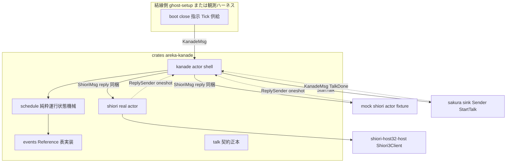
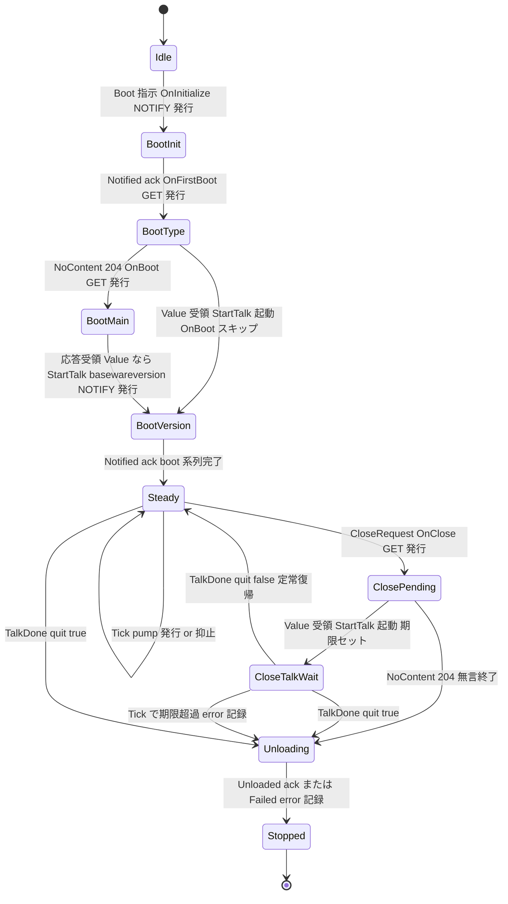
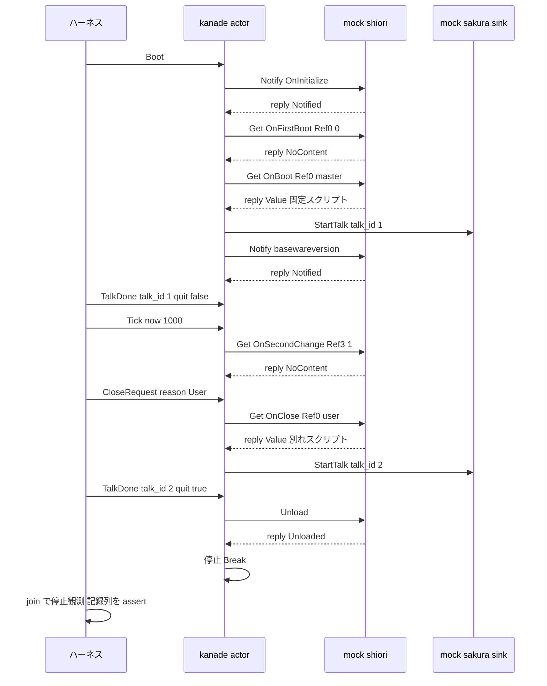

# 技術設計書: areka-P0-kanade

## Overview

**Purpose**: 本設計は、areka 互換ベースウェアの conductor エンジン **kanade**（③・実行時経路＝運行表の所有者）を、`crates/areka-kanade` 新設クレートのアクター（areka-actor 規約・独立スレッド）として実現する。boot 系列の正典順序発火・OnSecondChange pump（Tick 注入）・SHIORI 応答 Value の talk 起動配送・close 握手（`\-`＝quit が唯一のスクリプト起因終了トリガ）・強制終了直行の 5 経路を、**純粋運行状態機械**（`step(State, 入力) → (State, Vec<Action>)`）で決定的に駆動する。

**Users**: ghost-setup（結線・boot/close 指示の呼び手）、sakura-engine（talk 起動契約の消費者）、および mock 観測ハーネスによる開発者検証。

**Impact**: 完全新規クレート。既存クレートの改変はない。`areka-actor`（規約消費）と `shiori-host32-host`（real shiori アクターのみ）に通常依存する。

### Goals

- boot 運行（OnInitialize→OnFirstBoot→204→OnBoot→basewareversion）を ukadoc Reference 表どおりに発火する（Req 1）
- talk 起動契約 `StartTalk`/`TalkDone` の正本を確立し、script を不透明のまま配送する（Req 2）
- Tick 注入式 OnSecondChange pump と close 握手・終了系列を決定的状態機械として実装する（Req 3・4）
- SHIORI 呼出をメッセージ境界化し、mock shiori＋mock sakura sink の単一 pass/fail 観測で完了判定する（Req 5・7）
- 全失敗経路を区別語彙ログ＋観測可能な状態遷移にする（Req 6）

### Non-Goals

- script の解釈・再生（sakura-engine）／SERIKO（seriko）／入力イベント OnMouse* 系（M-life）
- vanish count・窓位置の永続化（position-persist）——M1 は OnFirstBoot Ref0=固定 0
- helper 常駐健全性の証明・死活報告型の正本・正規 unload 経路の helper 側増設（host32-lifecycle）
- SHIORI 自動再起動（M2）／Tick の本番供給スレッド（ghost-setup 領分・方向付けのみ本設計に記す）

## Boundary Commitments

### This Spec Owns

- **kanade アクター**: `KanadeMsg` inbox 駆動の運行状態機械とそのシェル（`crates/areka-kanade`）
- **boot・close 運行表の実装正本**: 発火順序・NOTIFY/GET の別・Reference 構成（`schedule/events.rs` が単一実装点・本書「ukadoc Reference 表」から導出）
- **talk 起動契約の正本**: `StartTalk{script, talk_id}`／`TalkDone{talk_id, quit}`／`TalkId`（sakura-engine は消費のみ・再定義しない）
- **SHIORI 呼出のメッセージ境界**: `ShioriMsg`／`ShioriOutcome`／`ShioriFailure` 型と、real（`Shiori3Client` 包装）／mock（fixture 応答）の同一メッセージ型差し替え
- **決定的観測ハーネス**: mock shiori アクター・mock sakura sink・単一 pass/fail 統合テスト・env-gate 実 helper 追験

### Out of Boundary

- script 文字列の中身の解釈（`sakura::parse` 以降は sakura-engine）・`\-` の検出（sakura が quit フラグに変換して通知）
- 死活報告型の正本（host32-lifecycle。本 spec は `KanadeMsg::ShioriDown` 暫定 seam で受けるのみ）
- helper 側の正規 unload→exit(0) 経路の増設（host32-lifecycle。本 spec は `ShioriMsg::Unload` の境界契約のみ所有）
- OS シャットダウンの検出・強制判定（app-shell / ghost-setup。kanade は `ForceQuit` 指示の受け手）
- 本番 Tick 供給スレッドの所有（ghost-setup。本 spec の観測は注入で閉じる）
- SHIORI LOAD の発行責務（host32-shiori-load 資産。env-gate テスト・real 結線の接続手順として消費するのみ）

### Allowed Dependencies

- `areka-actor`（spawn/reply/停止規約——kanade は消費者であり独自 channel 流儀を発明しない）
- `shiori-host32-host`（`Shiori3Client`・`RequestError` 等——**`shiori/real.rs` モジュールのみ**が import してよい）
- `tracing`（logging.md 規約）・`std` のみ。**tokio 禁止・新規外部依存なし**
- **モジュール内制約**: `talk.rs`・`msg.rs`・`schedule/` は host32 型に依存しない。`talk.rs` は std のみ（areka-actor にも非依存）。`msg.rs` は envelope 返信端として areka-actor の `ReplySender` のみ追加依存可。将来の契約クレート切り出し（DD-1）の対象は `talk.rs` であり機械的移動で済む規律

### Revalidation Triggers

- `StartTalk`/`TalkDone`/`TalkId` の形状変更 → sakura-engine の再検証
- `KanadeMsg`・`spawn_kanade` 公開面の変更 → ghost-setup（結線・boot 指示・close 完了待ち）の再検証
- host32-lifecycle の死活報告型正本 確定 → `KanadeMsg::ShioriDown` seam の実型差し替え（variant 1 個＋状態機械 1 アーム）
- host32-lifecycle の正規 unload 経路（helper 側）実装 → `shiori/real.rs` の Unload 暫定実装を正規経路へ差し替え
- close 全終了フロー（正典: OnCloseAll→204→OnClose）の導入再訪 → M-e2e（emo2-conformance-e2e）で SSP 実挙動と突合（本書「設計判断 DD-11」参照）

## Architecture

### Existing Architecture Analysis

- **areka-actor（✅ 完了）**: `spawn_actor(name, body) -> (Sender<M>, ActorHandle)`・`run_inbox`（handler `Err` → error! 記録して継続）・停止規約（Close 即時停止／全 Sender drop 正常終了）・`reply_channel`。Req 4.8/4.9/6.2 は本規約の消費で構造的に成立する。
- **shiori-host32-host（✅ 完了）**: `Shiori3Client::get(id, refs) -> Result<Option<String>, RequestError>`（200→`Some`／204→`None`）・`notify -> Result<(), RequestError>`（応答破棄）・`RequestError{Handshake, Timeout, Ipc, Shiori}`。Req 5.2/5.3/6.1 の契約はこの戻り値型が体現済み。`ParentMessageWindow` は `!Send` ゆえ**専有スレッド駆動が前提**（引数・戻り値は `Send` 所有データ）。
- **テスト慣行**: env-gate 2 型（必須資材=明示 panic／任意追験 `HOST32_PASTA_DLL`=silent skip）・親 message-only 窓は同一プロセス高々 1 枚（実 helper 追験は単一 `#[test]` に集約）・`run_bounded` 型のハング検出ヘルパ。

### Architecture Pattern & Boundary Map

パターン: **純粋状態機械＋アクターシェル＋メッセージ境界差し替え**（三層・brief「Boundary Candidates」どおり）。



**Architecture Integration**:

- 選択パターン: 純粋状態機械＋シェル内同期往復（envelope 規約の `reply_channel`＝oneshot・DD-2）。shiori 往復は kanade の handler 内で `ReplyReceiver::recv` により閉じ、応答は `Input::ShioriReply` として即座に状態機械へ再投入される（状態機械の形は「全入力メッセージ」のまま）
- 責務分離: 運行判断（schedule・純粋）／副作用実行（actor シェル・channel 送出とログ）／SHIORI 実体（shiori アクター・real/mock 差し替え）
- 既存パターン踏襲: areka-actor 5 規約（inbox 単一・envelope・Close 即時停止・unbounded・拡張凍結）・`XxxMsg` 命名・thiserror・tracing
- 新規コンポーネントの根拠: 運行状態機械（kanade の本体・既存資産なし）・talk 契約（クロスユニット正本の物理化）・shiori メッセージ境界（mock 差し替え＝Req 5.1）
- Steering 適合: Rust 2024・tokio 不使用・自前 channel 流儀の不発明・ログ無し失敗経路の禁止

**依存方向（レイヤ・左からのみ import 可）**:

```
talk.rs（型・std のみ）
  → msg.rs（型・std＋talk＋areka-actor の ReplySender のみ）
    → schedule/（純粋状態機械・talk/msg の非 channel 型のみ消費）
      → actor.rs（areka-actor 消費）／shiori/real.rs（host32 消費）
        → tests/（mock・ハーネス）
```

### Technology Stack

| Layer | Choice / Version | Role in Feature | Notes |
|-------|------------------|-----------------|-------|
| アクター基盤 | `areka-actor`（workspace） | spawn／inbox／reply／停止規約 | 規約正本・kanade は消費のみ |
| SHIORI 出口 | `shiori-host32-host`（workspace） | `Shiori3Client` GET/NOTIFY・`RequestError` | `shiori/real.rs` のみ import 可 |
| ロギング | `tracing`（workspace） | 構造化ログ（logging.md 規約） | subscriber 初期化はアプリ層 |
| エラー型 | `thiserror` 2 | `ShioriFailure` 等の構造化 enum | 全クレート共通規約 |
| ランタイム | std スレッド＋`std::sync::mpsc` | 独立スレッドアクター | tokio 禁止・新規依存なし |

## ukadoc Reference 表（運行表の単一正本）

> brief「ukadoc 必読」の具体指示に基づき ukadoc MCP で全確認済み（出典 id は research.md 参照）。**mock shiori の fixture・状態機械の期待列・ハーネスの assert はすべて本表（＝実装上は `schedule/events.rs`）から導出する。**

| イベント | Method | 正典 Reference（ukadoc） | M1 送出値 |
|---|---|---|---|
| `OnInitialize` | NOTIFY | Ref0: リロード時 `reload`・それ以外は無し | References なし（M1 にリロード概念なし） |
| `OnFirstBoot` | GET | Ref0: vanish された回数。204 なら続けて OnBoot | Ref0=`"0"`（固定・Req 1.6） |
| `OnGhostChanged`／`OnGhostCalled`／`OnVanished` | GET | 起動種別フォールスルー元（204 なら OnBoot） | **送出しない**（M1 は常に OnFirstBoot・Req 1.6） |
| `OnBoot` | GET | Ref0: 起動時シェル名／Ref6: 前回 crash 時 `halt`（MATERIA/SSP）／Ref7: 落ちたゴースト名（同） | Ref0=`config.shell_name`・Ref6/7 省略（crash 情報なし） |
| `basewareversion` | NOTIFY | Ref0: バージョン番号／Ref1: 本体の識別／Ref2: 詳細数値（SSP のみ） | Ref0=`config.baseware_version`・Ref1=`config.baseware_name`（既定 `"areka"`）・Ref2 省略 |
| `OnSecondChange` | GET（talk 再生可能時）／**NOTIFY（talk 再生不能時・Ref3=0・返却スクリプトは無視）** | Ref0: OS 連続起動時間(hour)／Ref1: 見切れ 1/0／Ref2: 重なり 1/0／Ref3: talk 再生可否 1/0／Ref4: 放置秒（SSP のみ） | Ref0=`now_ms / 3_600_000` の 10 進文字列／Ref1=`"0"`・Ref2=`"0"`（見切れ・重なり判定は emo 領分＝M1 固定）／Ref3=`"1"`（GET 時）`"0"`（NOTIFY 時）／Ref4 以降省略（idle 検出は M-life input-events） |
| `OnClose` | GET | Ref0: 終了理由 `user`／`system`（SSP）／Ref1・Ref2: スコープ番号（SSP） | Ref0=`CloseReason` の写像（`user`/`system`）・Ref1/2 省略（M1 単一スコープ） |
| `OnCloseAll` | GET | Ref0/1/2: OnClose と同構成（全終了フロー先頭のイベント・唯一起動中ゴーストの終了でも正典は OnCloseAll→204→OnClose） | **M1 送出しない**（設計ディスカッション #1・Req 4.6） |

**正典との既知差分（意図的・要件確定済み）**:

1. **close 運行の M1 縮退**: 正典（SSP）の終了フローは OnCloseAll→(204)→OnClose の順だが、本 spec は Req 4.1/4.6 の確定どおり **OnClose 単独**で運行し、204（応答なし≠拒否・設計ディスカッション #1）は追加イベントなしで終了系列へ直行する（OnCloseAll は M1 非発行）。全終了フロー導入は Revalidation Trigger として M-e2e で再訪する（DD-11）。終了拒否権は Value 経路（`\-` 無しスクリプト＝quit=false）で完全に保たれる。
2. **`now_ms` の意味論**: 本番結線では OS 起動からの経過ミリ秒（`GetTickCount64` 相当）を注入する想定とし、これにより OnSecondChange Ref0 が正典（OS 連続起動時間 hour）と一致する。テストでは任意の単調値を注入する（意味論は「単調ミリ秒」のみ・Req 3.2）。

## 設計判断（DD-1〜DD-11・確定）

| # | 論点 | 決定 | 根拠（要約・詳細は research.md） |
|---|---|---|---|
| DD-1 | talk 契約型の配置 | **単一クレート内 `talk.rs` モジュール**（host32 非依存規律つき・Option C） | 2 例目（sakura-engine 実着手）まで契約クレートを作らない。host32 非依存規律で将来の切り出しは機械的移動 |
| DD-2 | shiori 往復の待ち方 | **handler 内同期往復（a-1）**: `ShioriMsg::Request` に `ReplySender<ShioriOutcome>`（oneshot）を同梱し、kanade シェルが `ReplyReceiver::recv` で受け切って `Input::ShioriReply` として状態機械へ再投入する | 決定打は **Req 4.9 の構造保証**——応答回送（a-2）は shiori アクターが `Sender<KanadeMsg>` を常時保持するため kanade⇄shiori の Sender 循環が生じ、「全指示送信元 drop→正常終了」が永久に成立しない。oneshot は envelope 規約の正本流儀でもある。トレード: `ForceQuit` の処理が in-flight 呼出の完了（実経路は `AREKA_SHIORI_REQUEST_TIMEOUT_MS`＝既定 60s で有界・mock は即応）まで遅延し得る——OS シャットダウンの強制力は最終的に OS 側にあり、best-effort として許容 |
| DD-3 | 時刻注入の表現 | **`Tick{now: MonotonicMs}` 同梱（b-1）**。Clock 抽象は導入しない | 時刻は Tick でのみ進む＝決定的。close 期限（Req 4.7）も Tick 受領時に判定。トレイト過剰抽象回避の方針整合 |
| DD-4 | 死活報告の暫定 seam | **`KanadeMsg::ShioriDown{reason: String}` variant 1 個** | lifecycle 正本確定時の差し替え面が最小（variant＋状態機械 1 アーム）。in-band 失敗は `ShioriOutcome::Failed` が別途カバー |
| DD-5 | M1 boot 系列の固定値 | ✅ 要件確定済み: 毎回 `OnFirstBoot(Ref0="0")`→204→`OnBoot`（Req 1.6） | 要件ディスカッション #1 |
| DD-6 | talk 重複時の調停 | **発生源から断つ**: active talk 中の Tick は `OnSecondChange` を **NOTIFY（Ref3=0）** で発行（正典どおり・応答は構造的に破棄）。防御として active talk 中に Value が届く想定外経路は warn!＋破棄。キュー・中断は導入しない | ukadoc OnSecondChange の正典意味論（talk 不能時 Ref3=0＋NOTIFY・返却スクリプト無視）がそのまま調停規則になる |
| DD-7 | quit=true の扱い | ✅ 要件確定済み: 由来・状態を問わず終了系列へ直行（Req 4.3）／OnClose は要求のみ（Req 4.5） | 要件ディスカッション #2 |
| DD-8 | 実 helper 追験の結線範囲 | env-gate テストが **spawn→HELLO→LOAD→kanade 運行→teardown を自前結線**（単一 `#[test]`・`HOST32_PASTA_DLL` silent skip）。LOAD は kanade の責務外＝テスト側 connect 手順として発行 | 親窓 1 枚制約・既存 E2E 慣行（`send_request(MsgTag::Load, ..)`）の踏襲 |
| DD-9 | 公開面の最小化 | 公開＝`spawn_kanade`・`KanadeMsg`・talk 契約型・`ShioriMsg` 系メッセージ型・`KanadeConfig`・`spawn_shiori_actor`。`schedule/` は `pub(crate)`・`shiori/real.rs` の内部型は非公開 | 将来の呼び手 ghost-setup が消費する面だけを公開 |
| DD-10 | 強制終了時の OnClose 発行 | **best-effort NOTIFY `OnClose`（Ref0=理由）を 1 発**→即 終了系列（応答待ちなし・送出失敗はログのみ）。GET 握手は行わない（Req 4.4 の「直行」を毀損するため） | ukadoc: シャットダウン時の終了理由は `system`。NOTIFY は SHIORI プロトコル上応答を破棄する呼び方＝「一報だけ入れて待たない」の正準形 |
| DD-11 | close 運行と正典の差分 | ✅ 設計ディスカッション #1（2026-07-05）で確定: **OnClose 単独運行・204＝応答なし（≠拒否）→無言で終了系列直行・OnCloseAll は M1 非発行**。全終了フロー（正典: OnCloseAll→204→OnClose）の導入は M-e2e で再訪（`events.rs`＋`schedule/close.rs` への局所化は維持＝導入時の波及最小） | 正典の OnCloseAll は全終了フロー先頭のイベント。単一ゴースト M1 では縮退し、終了拒否権は Value 経路（`\-` 無しスクリプト）で保たれる |
| — | close 再生完了待ち上限 | **`KanadeConfig.close_talk_deadline_ms`＝既定 30_000ms**（注入時刻で判定・Req 4.7） | ukadoc に正典値なし（de-facto 領域）。無限待ちの禁止と終了拒否 talk の尊重の折衷として 30s。結線側で構成可能・テストは小さい値を注入 |

## File Structure Plan

```
crates/areka-kanade/
├── Cargo.toml               # deps: areka-actor, shiori-host32-host, tracing, thiserror
├── src/
│   ├── lib.rs               # crate rustdoc（運行表正本・talk 契約正本の宣言）＋公開面 re-export
│   ├── talk.rs              # 【契約正本】TalkId / StartTalk / TalkDone（std のみ・host32 非依存）
│   ├── msg.rs               # KanadeMsg / ShioriMsg / ShioriCall / ShioriOutcome / ShioriFailure /
│   │                        #   CloseReason / MonotonicMs / KanadeConfig（host32 非依存）
│   ├── schedule/            # 【純粋運行状態機械】I/O・スレッド・channel 非依存
│   │   ├── mod.rs           # Phase / Action / step() 入口・共通遷移（TalkDone/ForceQuit/ShioriDown）
│   │   ├── events.rs        # ukadoc Reference 表の実装正本（イベント名・Method・References 構成関数）
│   │   ├── boot.rs          # boot 系列遷移（Req 1）
│   │   ├── steady.rs        # pump ゲート・talk 調停・保留 close（Req 2・3）
│   │   └── close.rs         # close 握手・期限判定・終了系列（Req 4）
│   ├── actor.rs             # spawn_kanade: inbox シェル（run_inbox・step 呼出・Action 実行・ログ規律）
│   └── shiori/
│       ├── mod.rs           # shiori アクター境界の説明（ShioriMsg の受理規約 rustdoc）
│       └── real.rs          # spawn_shiori_actor: Shiori3Client の専有スレッド包装（host32 依存はこのファイルのみ）
└── tests/
    ├── kanade.rs            # エントリポイント（#[path] mod 束ねのみ）
    └── kanade/
        ├── common/mod.rs    # mock shiori アクター（fixture 表）・mock sakura sink・run_bounded・結線ヘルパ
        ├── boot_test.rs     # boot 系列の順序・Method・Reference 検証（Req 1）
        ├── steady_test.rs   # pump ゲート・Ref3 調停・Value→StartTalk（Req 2・3）
        ├── close_test.rs    # close 握手・quit 分岐・期限・強制終了（Req 4）
        ├── failure_test.rs  # 区別語彙・未知 talk_id・ShioriDown（Req 5.4・6）
        ├── full_run_test.rs # 【主観測】boot→pump→close 完走の単一 pass/fail（Req 7.1–7.3）
        └── real_helper_test.rs # env-gate 実 helper 追験・単一 #[test]（Req 7.4）
```

**Modified Files**: なし（新設クレートのみ。workspace は `crates/*` glob で自動収載）。

## System Flows

### 運行状態機械（Phase 遷移）



補足（図に載らない横断遷移）:

- **ForceQuit**: 全 Phase から `Unloading` へ直行（best-effort OnClose NOTIFY を先行送出・DD-10）。
- **ShioriDown / ShioriOutcome::Failed**: 全 Phase から error! 記録の上 `Unloading`（cause=Fault）へ（unload は best-effort・失敗も error! で続行）。
- **boot 中の CloseRequest**: `pending_close` として記録し、Steady 遷移時に握手を開始する（boot 系列は中断しない）。
- **Steady で active talk 中の CloseRequest**: `pending_close` として記録し、当該 talk の TalkDone（quit=false）受領後に OnClose を発行する（同時 active talk ≤ 1 の不変条件）。

### 主観測フロー（mock 結線・full_run_test）



フロー上の決定: shiori 呼出は `ShioriMsg` に同梱した oneshot（`reply_channel`）の 1 往復であり、in-flight は常に高々 1（運行表の逐次性・シェルが受け切ってから次の入力へ進む）。図中の `reply` 矢印は inbox ではなく oneshot 経由である。

## Requirements Traceability

| Req | 概要 | コンポーネント | インターフェース | フロー |
|---|---|---|---|---|
| 1.1 | Boot→OnInitialize NOTIFY | schedule/boot・events | `step`・`events::on_initialize` | 状態機械 Idle→BootInit |
| 1.2 | ack→起動種別 GET | schedule/boot | `ShioriOutcome::Notified` | BootInit→BootType |
| 1.3 | 204→OnBoot | schedule/boot | `ShioriOutcome::NoContent` | BootType→BootMain |
| 1.4 | OnBoot 応答→basewareversion→完了 | schedule/boot | `events::basewareversion` | BootMain→BootVersion→Steady |
| 1.5 | NOTIFY/GET・Reference 正典 | schedule/events | Reference 表（本書） | boot_test の assert |
| 1.6 | 毎回 OnFirstBoot(Ref0=0) | schedule/events | `events::on_first_boot` | BootType 固定経路 |
| 2.1 | Value→StartTalk{script, talk_id} | schedule・actor | `talk::StartTalk`・TalkId 採番 | 各 GET 応答アーム |
| 2.2 | 契約正本・script 不透明 | talk | `StartTalk`/`TalkDone` 型 | — |
| 2.3 | 204→talk なし | schedule | `NoContent` アーム | steady_test |
| 2.4 | TalkDone 突合・quit 消費 | schedule | `KanadeMsg::TalkDone` | ActiveTalk 突合 |
| 2.5 | 未知 talk_id→ログ＋継続 | schedule・actor | error! アーム | failure_test |
| 3.1 | Steady+Tick→OnSecondChange GET | schedule/steady | `events::on_second_change` | pump 経路 |
| 3.2 | Tick/時刻注入・決定的 | msg | `MonotonicMs`・`Tick{now}` | 全テスト |
| 3.3 | pump Value→同一 talk 経路 | schedule/steady | 2.1 と同一アーム | steady_test |
| 3.4 | boot 未完/close 中は非発行・復帰で再開 | schedule | Phase ゲート | 状態機械図 |
| 4.1 | close 指示→OnClose GET(Ref0=理由) | schedule/close・events | `CloseReason` 写像 | Steady→ClosePending |
| 4.2 | Value→talk 配送・TalkDone まで保留 | schedule/close | CloseTalkWait | close_test |
| 4.3 | quit=true→終了系列（unload→停止） | schedule | `ShioriMsg::Unload` | →Unloading |
| 4.4 | 強制終了→終了系列直行 | schedule・actor | `KanadeMsg::ForceQuit`（DD-10） | 横断遷移 |
| 4.5 | quit=false→定常復帰 | schedule/close | CloseTalkWait→Steady | close_test |
| 4.6 | OnClose 204→無言終了（OnCloseAll 非発行） | schedule/close | ClosePending→Unloading{CloseSilent} | close_test |
| 4.7 | 期限超過→ログ＋終了系列継続 | schedule/close | `close_talk_deadline_ms`＋Tick 判定 | close_test |
| 4.8 | 停止の観測可能性 | actor | `ActorHandle::join`/`is_finished` | 全統合テスト |
| 4.9 | 全 Sender drop→正常終了 | actor（基盤規約） | `run_inbox` 切断経路 | failure_test |
| 5.1 | request/reply 境界・mock 差し替え | msg・shiori | `ShioriMsg`（同一型・別 body） | 結線図 |
| 5.2 | NOTIFY 応答から talk 非生成 | msg | `Notified`（Value を運ばない構造） | 型定義 |
| 5.3 | 実経路の契約解釈 | shiori/real | `get`→`Value`/`NoContent` 写像 | real_helper_test |
| 5.4 | 死活報告→ログ＋停止遷移 | schedule・msg | `ShioriDown` seam（DD-4） | 横断遷移 |
| 6.1 | 区別語彙ログ＋状態遷移 | shiori/real・schedule | `ShioriFailure`（4 語彙） | Error Handling 表 |
| 6.2 | 回復可能→記録し継続 | actor（基盤規約）・schedule | `run_inbox` Err 継続＋個別アーム | failure_test |
| 6.3 | ログ無し失敗経路なし | 全コンポーネント | Error Handling 表の網羅 | レビュー観点 |
| 6.4 | panic は致命限定 | 全コンポーネント | panic 箇所ゼロ方針 | Error Handling |
| 7.1 | mock 結線・fixture・運行全体駆動 | tests/common | fixture 表（Reference 表から導出） | full_run_test |
| 7.2 | 単一 pass/fail 検証 (a)(b)(c) | tests/full_run_test | 記録列 assert | 主観測フロー |
| 7.3 | 実時間非依存・反復同一 | tests 全体 | 注入 Tick・mock 即応・run_bounded | — |
| 7.4 | env-gate 実 helper 追験 | tests/real_helper_test | `HOST32_PASTA_DLL` silent skip | DD-8 |

## Components and Interfaces

| Component | Domain/Layer | Intent | Req Coverage | Key Dependencies | Contracts |
|-----------|--------------|--------|--------------|------------------|-----------|
| talk 契約型 | 契約（正本） | talk 起動メッセージ型の唯一定義 | 2.1–2.4 | なし（std のみ・P0） | Event |
| msg 型群 | 契約・構成 | kanade/shiori 境界の全メッセージ型と構成 | 3.2, 4.1, 5.1, 5.2, 6.1 | talk（P0） | Event |
| schedule 状態機械 | ドメイン（純粋） | 運行表の遷移判断（副作用なし） | 1.*, 2.*, 3.*, 4.1–4.7, 5.4, 6.1–6.2 | talk・msg（P0） | State |
| kanade actor シェル | ランタイム | inbox 駆動・Action 実行・ログ規律・停止 | 2.1, 4.8, 4.9, 6.2, 6.3 | areka-actor（P0）・schedule（P0） | Service |
| shiori real アクター | 統合 | `Shiori3Client` の専有スレッド包装 | 5.1–5.3, 6.1 | shiori-host32-host（P0）・msg（P0） | Service |
| 観測ハーネス（tests） | 検証 | mock shiori・mock sakura sink・単一 pass/fail | 7.1–7.4 | 上記全部（P0） | Batch |

### 契約層

#### talk 契約型（`src/talk.rs`）——本 spec が正本

| Field | Detail |
|-------|--------|
| Intent | talk 起動契約のメッセージ型の唯一定義（sakura-engine が消費・再定義禁止） |
| Requirements | 2.1, 2.2, 2.4 |

```rust
/// talk の一意識別子（kanade が単調増番で採番・再利用しない）。
#[derive(Debug, Clone, Copy, PartialEq, Eq, Hash)]
pub struct TalkId(pub u64);

/// talk 起動要求（kanade → sakura）。script は不透明文字列（kanade は解釈しない）。
#[derive(Debug, Clone)]
pub struct StartTalk {
    pub talk_id: TalkId,
    pub script: String,
}

/// 再生完了通知（sakura → kanade・`KanadeMsg::TalkDone` に包んで送る）。
/// `\-` の検出は sakura 側の責務であり、kanade は quit フラグを消費するのみ。
#[derive(Debug, Clone, Copy)]
pub struct TalkDone {
    pub talk_id: TalkId,
    pub quit: bool,
}
```

- 制約: **host32 型・areka-actor 型に依存しない**（std のみ）。将来の契約クレート切り出し（DD-1）はこのファイルの機械的移動で完結する
- 配送路: `StartTalk` は `std::sync::mpsc::Sender<StartTalk>`（sakura sink）へ、`TalkDone` は `Sender<KanadeMsg>` 経由で kanade inbox へ

#### メッセージ・構成型（`src/msg.rs`）

| Field | Detail |
|-------|--------|
| Intent | kanade inbox・shiori 境界の全メッセージ型と運行構成の定義（host32 非依存） |
| Requirements | 3.2, 4.1, 4.4, 5.1, 5.2, 6.1 |

```rust
/// 単調ミリ秒（注入時刻）。本番結線は OS 起動からの経過 ms（GetTickCount64 相当）を
/// 注入する想定（OnSecondChange Ref0 が正典と一致する）。テストは任意の単調値。
#[derive(Debug, Clone, Copy, PartialEq, Eq, PartialOrd, Ord)]
pub struct MonotonicMs(pub u64);

/// close 指示の理由（ukadoc OnClose Ref0 への写像: User→"user"・System→"system"）。
#[derive(Debug, Clone, Copy)]
pub enum CloseReason { User, System }

/// kanade アクター inbox（inbox 規約: 1 アクター 1 enum）。
/// shiori 応答は inbox を経由しない（oneshot 往復・DD-2）ため variant を持たない＝
/// 外部から偽の SHIORI 応答を注入できない構造。
pub enum KanadeMsg {
    /// boot 運行の開始指示（Idle 以外では warn!＋無視）。
    Boot,
    /// 1 秒相当の Tick（時刻同梱・DD-3）。pump 駆動と close 期限判定を兼ねる。
    Tick { now: MonotonicMs },
    /// sakura（mock sink 含む）からの再生完了通知。
    TalkDone(crate::talk::TalkDone),
    /// 通常 close 指示（OnClose 握手を開始・終了権限は SHIORI 側）。
    CloseRequest { reason: CloseReason },
    /// 強制終了指示（OS シャットダウン・デバッグ）。quit ゲートを迂回し終了系列へ直行。
    ForceQuit { reason: CloseReason },
    /// SHIORI 死活の暫定 seam（DD-4・lifecycle 正本確定時に実型へ差し替え）。
    ShioriDown { reason: String },
    /// 停止規約の Close（即時停止・非常口。正規終了は運行表経由）。
    Close,
}

/// shiori アクター inbox（real／mock が同一型を受ける＝Req 5.1 の差し替え面）。
/// envelope 規約どおり返信端（oneshot）を同梱する。受信側は 1 度だけ応答を送る。
pub enum ShioriMsg {
    /// GET／NOTIFY の 1 呼出。
    Request { call: ShioriCall, reply: areka_actor::ReplySender<ShioriOutcome> },
    /// 正規終了経路（unload）の起動。完了で `Unloaded`（失敗は `Failed`）を返す。
    Unload { reply: areka_actor::ReplySender<ShioriOutcome> },
    /// 停止規約の Close（即時停止）。
    Close,
}

/// GET と NOTIFY の別を境界越しに保持する（Req 5.2）。
pub enum ShioriCall {
    Get    { id: &'static str, references: Vec<String> },
    Notify { id: &'static str, references: Vec<String> },
}

/// shiori 呼出の結果（NOTIFY は Value を運べない＝talk 非生成の構造的保証）。
pub enum ShioriOutcome {
    /// GET 200: Value（スクリプト文字列・不透明）。
    Value(String),
    /// GET 204: Value なし。
    NoContent,
    /// NOTIFY 完了（応答は破棄済み）。
    Notified,
    /// Unload 完了。
    Unloaded,
    /// 呼出失敗（区別語彙保持・Req 6.1）。
    Failed(ShioriFailure),
}

/// RequestError の区別語彙の境界写像（host32 非依存の再表現・thiserror）。
#[derive(Debug, thiserror::Error)]
pub enum ShioriFailure {
    #[error("shiori handshake failure: {0}")] Handshake(String), // 接続確立失敗
    #[error("shiori request timeout: {0}")]   Timeout(String),   // タイムアウト
    #[error("shiori ipc failure: {0}")]       Ipc(String),       // helper 死活の一態様
    #[error("shiori error response: {0}")]    Shiori(String),    // SHIORI エラー
}

/// 運行構成（結線側が供給。既定値は new() で提供）。
pub struct KanadeConfig {
    pub shell_name: String,            // OnBoot Ref0（package-mount 由来・ハーネスは "master"）
    pub baseware_version: String,      // basewareversion Ref0
    pub baseware_name: String,         // basewareversion Ref1（既定 "areka"）
    pub close_talk_deadline_ms: u64,   // close talk 再生完了待ち上限（既定 30_000・DD 表参照）
}
```

- 事前条件: `KanadeMsg`／`ShioriMsg` は `Send + 'static` な所有データのみ（envelope 規約）
- 不変条件: **in-flight の shiori 呼出は常に高々 1**——シェルが同期往復で受け切ってから次へ進むため構造的に成立（相関 id 不要）。積み残し drop 時は `ReplySender` も drop され、待ち側は `ReplyError::Dropped` として観測する（永久ブロックしない・基盤規約）

### ドメイン層

#### schedule 純粋運行状態機械（`src/schedule/`）

| Field | Detail |
|-------|--------|
| Intent | 全運行判断を純粋関数として実装（I/O・スレッド・channel 非依存＝決定的単体テストの本体） |
| Requirements | 1.1–1.6, 2.1–2.5, 3.1–3.4, 4.1–4.7, 5.4, 6.1–6.2 |

**Contracts**: State [x]

```rust
/// 状態機械への入力。KanadeMsg（外部入力）＋シェルが同期往復で得た SHIORI 応答。
/// ShioriReply が KanadeMsg に存在しないため、応答注入経路はシェル内部に閉じる。
pub(crate) enum Input {
    Boot,
    Tick { now: MonotonicMs },
    TalkDone(TalkDone),
    CloseRequest { reason: CloseReason },
    ForceQuit { reason: CloseReason },
    ShioriDown { reason: String },
    /// 直前の Action::ShioriRequest／ShioriUnload の結果（シェルが即時再投入）。
    ShioriReply { outcome: ShioriOutcome },
}

/// 運行フェーズ（可視化は System Flows の状態機械図）。各待ち点は
/// 「直前に発行した呼出の応答待ち」を表す（in-flight ≤ 1 ゆえ相関 id 不要）。
pub(crate) enum Phase {
    Idle,
    BootInit,     // OnInitialize NOTIFY の完了待ち
    BootType,     // OnFirstBoot GET の応答待ち
    BootMain,     // OnBoot GET の応答待ち
    BootVersion,  // basewareversion NOTIFY の完了待ち
    Steady {
        talk: Option<ActiveTalk>,          // 同時 active talk ≤ 1
    },
    ClosePending    { reason: CloseReason },              // OnClose GET の応答待ち
    CloseTalkWait   { talk_id: TalkId, deadline: Option<MonotonicMs> },
    Unloading       { cause: TermCause },                 // Unload の完了待ち
    Stopped,
}

pub(crate) struct ActiveTalk { pub talk_id: TalkId, pub origin: &'static str }

/// 運行状態の全体（step の唯一の被写体）。Phase 外の帳簿はここに置く。
pub(crate) struct State {
    pub phase: Phase,
    /// 直近 Tick の注入時刻（Tick 受領ごとに更新・close 期限計算の基準）。
    pub last_now: Option<MonotonicMs>,
    /// talk_id 採番カウンタ（単調増番・再利用しない・StartTalk 生成時にインクリメント）。
    pub next_talk_id: u64,
    /// boot 中・active talk 中に受領した close 指示の保留（System Flows 補足遷移）。
    pub pending_close: Option<CloseReason>,
}

/// 終了系列の起因（ログ語彙・遷移は共通）。
pub(crate) enum TermCause { Quit, Forced, CloseSilent, DeadlineExceeded, Fault }

/// 状態機械が返す副作用指示（シェルが実行する）。
pub(crate) enum Action {
    /// GET／NOTIFY 発行（シェルが oneshot 往復し ShioriReply を再投入する）。
    ShioriRequest(ShioriCall),
    /// unload 発行（同上）。
    ShioriUnload,
    StartTalk(StartTalk),
    /// 終了系列完了（シェルは shiori へ Close を送り自身も Break する）。
    StopSelf,
}

/// 唯一の遷移入口。副作用を持たない（tracing によるログ発行は許容＝可観測性の
/// 側効果であり状態・出力の決定性に影響しない）。
pub(crate) fn step(state: State, input: Input, config: &KanadeConfig) -> (State, Vec<Action>);
```

**Responsibilities & Constraints**

- boot 系列（`boot.rs`）: 状態機械図どおり。OnFirstBoot が Value を返した場合（M1 fixture は 204 だが正典上あり得る）は StartTalk を起動し **OnBoot をスキップ**して basewareversion へ進む（正典: スクリプトが返されたらフォールスルーしない）
- pump ゲート（`steady.rs`・Req 3.1/3.4・DD-6）:
  - `Steady{talk: None, pending_close: None}` ＋ Tick → `OnSecondChange` **GET**（Ref3=1）
  - `Steady{talk: Some(_)}` ＋ Tick → `OnSecondChange` **NOTIFY**（Ref3=0・正典どおり応答無視）
  - boot 未完・ClosePending 以降 → 発行しない
  - 多重発行は同期往復（in-flight ≤ 1）により構造的に生じない。実経路で呼出ブロック中に溜まった Tick は解除後に順次処理される（catch-up・mock 経路は即応ゆえ非発生）
- talk 調停（DD-6）: active talk 中に Value が届く経路は構造上 NOTIFY 化で塞がれている。想定外に届いた場合は warn!＋破棄（キュー・中断なし）
- close 握手（`close.rs`）: 状態機械図＋Req 4 のとおり。期限は CloseTalkWait 進入時に `State.last_now + config.close_talk_deadline_ms` で設定し、以後の Tick 受領時に判定する（Req 4.7・注入時刻のみ使用）。Tick 未受領（`last_now = None`）のまま進入した場合は `deadline = None` とし、**最初の Tick 受領時に `now + close_talk_deadline_ms` を設定**する（期限判定は常に注入時刻のみで駆動＝決定的）
- 横断遷移: TalkDone{quit:true}（全 Phase）／ForceQuit（全 Phase・DD-10 の best-effort NOTIFY を Action 先頭に積む）／ShioriDown・Failed（全 Phase→Unloading{Fault}）
- 突合規律: 未知 talk_id の TalkDone → error!＋継続（Req 2.5）。Idle 以外の Boot → warn!＋無視。応答待ちでない Phase への ShioriReply は構造上発生しない（シェルが Action 直後にのみ再投入するため）——防御アームは warn!＋無視

**Implementation Notes**

- Integration: `events.rs` がイベント名（`&'static str`）・Method・References を組み立てる唯一の場所（Reference 表の実装正本）。boot/steady/close は events 経由でのみ ShioriCall を構成する
- Validation: in-source `#[cfg(test)]` で全遷移アームを網羅（フェーズ×入力の表駆動）。ハーネス（tests/）は同じ events 関数を期待値生成に使い、fixture と assert の正本を一点化する
- Risks: 状態爆発——Phase を運行表の待ち点のみに限定（9 状態）し、フラグの組合せは Steady 内フィールドに閉じ込めることで抑制

### ランタイム層

#### kanade アクターシェル（`src/actor.rs`）

| Field | Detail |
|-------|--------|
| Intent | inbox 駆動シェル: step 呼出→Action 実行（channel 送出）→ログ規律→停止 |
| Requirements | 2.1, 4.8, 4.9, 6.2, 6.3 |

**Contracts**: Service [x]

```rust
/// kanade アクターを起動する（areka-actor 規約: スレッド名 "kanade"）。
pub fn spawn_kanade(
    config: KanadeConfig,
    shiori: std::sync::mpsc::Sender<ShioriMsg>,
    sakura: std::sync::mpsc::Sender<StartTalk>,
) -> (std::sync::mpsc::Sender<KanadeMsg>, areka_actor::ActorHandle);
```

- 処理形（同期往復ループ・DD-2）: handler は受領メッセージを `Input` に写像して `step` を呼び、返った `Action::ShioriRequest`／`ShioriUnload` は `reply_channel()` で oneshot を作って `ShioriMsg` を送出し `ReplyReceiver::recv` で受け切り、その結果を `Input::ShioriReply` として**即座に再度 `step` へ投入**する（Actions が尽きるまで反復）。`StartTalk` は sakura sink へ送出、`StopSelf` は `ShioriMsg::Close` 送出＋Break
- 事後条件: 停止は `ActorHandle::join`／`is_finished` で観測可能（Req 4.8）。**kanade・shiori のどちらも相手の inbox Sender を常時保持しない**（往復ごとの oneshot のみ）ため、全指示送信元（結線側・sakura）の Sender drop で inbox が切断され正常終了する（基盤規約・Req 4.9 の構造保証）
- 不変条件: `KanadeMsg::Close` は step を経ずに即時 Break（停止規約）。それ以外の全メッセージは step へ渡す

**Implementation Notes**

- Integration: Action 実行時の送出失敗（切断）はログ無しにしない——`StartTalk` 送出失敗＝error!＋当該 talk を不成立として active talk を即クリア（TalkDone は来ないため）／`ShioriMsg` 送出失敗＝error!＋`ShioriDown` 相当として終了系列（Fault）へ
- Validation: 停止観測・切断経路は failure_test で検証
- Risks: join デッドロック（Sender を握ったまま join）——結線側規律として rustdoc に明記（ハーネスは drop→join 順を厳守）

### 統合層

#### shiori real アクター（`src/shiori/real.rs`）

| Field | Detail |
|-------|--------|
| Intent | `Shiori3Client` を専有スレッドで包み、`ShioriMsg` 境界に載せる（host32 依存の唯一の場所） |
| Requirements | 5.1, 5.2, 5.3, 6.1 |

**Contracts**: Service [x]

```rust
/// 接続済み SHIORI 一式（!Send 資材はスレッド内で connect が生成する）。
pub struct ShioriConnection {
    pub window: shiori_host32_host::ParentMessageWindow,
    pub helper: shiori_host32_host::HelperHandle,
}

/// real shiori アクターを起動する。connect はアクタースレッド上で一度だけ実行される
/// （ParentMessageWindow が !Send のため）。接続失敗は on_down へ ShioriDown で報告し
/// 受信ループに入らず終了する。on_down は接続確立の成否確定後に**直ちに drop** し
/// 保持しない（kanade inbox の切断検出＝Req 4.9 を妨げないため）。
pub fn spawn_shiori_actor(
    connect: impl FnOnce() -> Result<ShioriConnection, String> + Send + 'static,
    on_down: std::sync::mpsc::Sender<KanadeMsg>,
) -> (std::sync::mpsc::Sender<ShioriMsg>, areka_actor::ActorHandle);
```

- `Request{call, reply}`: `Shiori3Client::get`→`Ok(Some)`→`Value`／`Ok(None)`→`NoContent`、`notify`→`Ok(())`→`Notified`。`Err(RequestError)` は `ShioriFailure` へ**機械的写像**（Handshake→Handshake・Timeout→Timeout・Ipc→Ipc・Shiori→Shiori・詳細は Display 文字列）し `Failed` で返す。status 判定の再実装はしない（Req 5.3＝戻り値型の消費のみ）。応答は `reply.send(..)` の 1 回のみ（envelope 規約）
- `Unload{reply}`: **暫定実装**——helper 側の正規 unload→exit(0) 経路は host32-lifecycle が増設中（現行 helper は Unload タグに応答しない）。M1 は接続資材の Drop（既存 RAII teardown）で閉じ、`Unloaded` を返す。lifecycle 完了時に正規経路呼出へ差し替える（Revalidation Trigger・境界契約 `ShioriMsg::Unload`／`Unloaded` は不変）
- 実行中の異常終了（アクター panic・積み残し drop）は同梱 `ReplySender` の drop として kanade 側に `ReplyError::Dropped` で観測され、`ShioriFailure::Ipc` へ写像される（宙吊りなし）
- 接続手順（spawn→HELLO pump→LOAD）は connect クロージャの中身であり**呼び手が所有**する（DD-8: env-gate テストが自前結線。本番は ghost-setup）。real.rs は「接続済み資材を包むだけ」
- タイムアウトは `Shiori3Client` 内部の `AREKA_SHIORI_REQUEST_TIMEOUT_MS`（既定 60s）に委ねる（kanade 側 per-call timeout なし）

**Implementation Notes**

- Integration: 要求間は inbox の blocking `recv` で待機してよい（unsolicited push は M1 に存在しない・HELLO pump は接続時のみ——host32-request の実測済み前提）
- Validation: real_helper_test（env-gate）でのみ実走。mock 経路が運行の主観測
- Risks: 親 message-only 窓は同一プロセス高々 1 枚——実 helper 追験を単一 `#[test]` に集約して回避

### 検証層

#### 観測ハーネス（`tests/kanade/`）

| Field | Detail |
|-------|--------|
| Intent | mock shiori＋mock sakura sink による決定的観測（単一 pass/fail）と env-gate 実 helper 追験 |
| Requirements | 7.1, 7.2, 7.3, 7.4 |

**Contracts**: Batch [x]

- **mock shiori アクター**（`common/mod.rs`）: `spawn_actor("mock-shiori", ..)` で `Receiver<ShioriMsg>` を受け、fixture 表（イベント id → 応答列）に従い同梱 `reply` へ**即時**に応答を返す別 body。**real と同一の `ShioriMsg` 型**（trait 不要＝Req 5.1 の型レベル差し替え）。受理した `(method, id, references)` を記録列（`Vec<RecordedCall>`）へ蓄積し、テスト終了後に assert する
- **fixture（Req 7.1）**: `OnInitialize`→Notified／`OnFirstBoot`→204／`OnBoot`→固定 Value／`basewareversion`→Notified／`OnSecondChange`→204 基調＋指定 Tick 目に Value／`OnClose`→Value（`quit:true` シナリオ）または 204（無言終了シナリオ）／`Unload`→Unloaded。期待 References は `schedule::events` の同一関数から導出（fixture・assert・実装の三点一正本）
- **mock sakura sink**: `Receiver<StartTalk>` を受け、受領を記録し、シナリオ指示（quit true/false・応答遅延なし）どおり `KanadeMsg::TalkDone` を返す
- **主観測 full_run_test（Req 7.2）**: boot 指示→（記録列 a: boot 系列の順序・Method・References 一致）→Tick 数回→（記録列 b: Value→StartTalk 到達・talk_id 一意）→CloseRequest→close talk→TalkDone{quit:true}→（記録列 c: Unload→停止 join 成功）を**単一 `#[test]` の単一 assert 群**で検証
- **決定性（Req 7.3）**: sleep なし・時刻は `Tick{now}` 注入のみ・mock 即応・全 join は `run_bounded` 相当（既存慣行）の期限付き
- **env-gate 追験（Req 7.4・DD-8）**: `HOST32_PASTA_DLL` 未設定なら silent skip。設定時は単一 `#[test]` が spawn→HELLO→LOAD（`send_request(MsgTag::Load, ..)` 既存 E2E 慣行）を connect クロージャで自前結線し、real shiori アクター越しに boot→pump 数 Tick→close→終了完走を検証（Value 内容は実 pasta 依存のため「Value か 204 のいずれかで運行が完走する」ことを検証）

## Error Handling

### Error Strategy

すべての失敗は (1) 区別語彙の `error!`／`warn!` ログ、(2) 観測可能な状態遷移（Phase 変化またはメッセージ継続）、の両方に写像する。panic は新規導入しない（本クレートに致命状態は設計上存在しない——回復不能はすべて Unloading{Fault}→Stopped の正規遷移で表現する・Req 6.4）。

### Error Categories and Responses

| 失敗 | 語彙・ログ | 状態遷移 | Req |
|---|---|---|---|
| SHIORI 接続確立失敗 | `ShioriFailure::Handshake`→error! | connect 失敗＝ShioriDown 報告→Unloading{Fault}→Stopped | 6.1 |
| SHIORI 呼出タイムアウト | `ShioriFailure::Timeout`→error! | Unloading{Fault}（M1: pump/boot/close を問わず運行断念・自動再起動なし） | 6.1, 5.4 |
| helper IPC 失敗 | `ShioriFailure::Ipc`→error! | 同上 | 6.1 |
| SHIORI エラー応答（400/500 等） | `ShioriFailure::Shiori`→error! | 同上 | 6.1 |
| 死活報告（暫定 seam） | `ShioriDown{reason}`→error! | Unloading{Fault}→Stopped（観測可能な停止・M1=ログ＋停止） | 5.4 |
| 未知 talk_id の TalkDone | error!（talk_id 添付） | 現 Phase 維持・継続 | 2.5, 6.2 |
| 応答 oneshot の切断（`ReplyError::Dropped`＝shiori アクター異常終了等） | `ShioriFailure::Ipc` へ写像→error! | Unloading{Fault}（宙吊りなし） | 6.1, 6.2 |
| Idle 以外での Boot／Phase 不整合メッセージ | warn! | 現 Phase 維持・継続 | 6.2 |
| close talk 期限超過 | error!（talk_id・超過 ms） | CloseTalkWait→Unloading{DeadlineExceeded}（終了系列継続） | 4.7 |
| StartTalk 送出失敗（sink 切断） | error! | active talk 即クリア・継続（close 握手中なら終了系列へ） | 6.2, 6.3 |
| ShioriMsg 送出失敗（shiori 切断） | error! | Unloading 相当→StopSelf（unload 不能のため直接停止） | 6.3 |
| Unload 失敗（`Failed` 応答） | error! | Unloading→Stopped（終了系列は継続・Req 4.7 と同旨） | 4.3 |

### Monitoring

logging.md 規約に従う: スコーププレフィックス（`[kanade]`／`[shiori-actor]`／関数名ベース）＋構造化フィールド（`talk_id`・`event`・`phase`）。Phase 遷移は info!（ライフサイクルイベント）、Tick・pump は trace!（高頻度）。

## Testing Strategy

### Unit Tests（`schedule/` in-source・純粋状態機械）

1. boot 系列全遷移: Idle→…→Steady の各待ち点で正しい `Action::ShioriRequest`（id・Method・References＝events 関数との一致）を返す（Req 1.1–1.6）
2. OnFirstBoot Value 分岐: StartTalk 起動＋OnBoot スキップ＋basewareversion 進行（正典フォールスルー打ち切り）
3. pump ゲート表駆動: {boot 中, Steady talk なし, Steady talk あり, in-flight 中, ClosePending 以降}×Tick → {なし, GET Ref3=1, NOTIFY Ref3=0, なし, なし}（Req 3.1, 3.4, DD-6）
4. close 分岐網羅: Value→CloseTalkWait→{quit:true→Unloading, quit:false→Steady 復帰, 期限超過→Unloading}／204→Unloading{CloseSilent} 直行（OnCloseAll 非発行の確認込み）（Req 4.2, 4.5, 4.6, 4.7）
5. 横断遷移: 全 Phase×{TalkDone quit:true, ForceQuit, ShioriDown, Failed} → Unloading（＋ForceQuit の best-effort NOTIFY Action 先頭・Req 4.3, 4.4, 5.4）
6. 突合規律: 未知 talk_id 継続・Idle 外 Boot 無視・応答待ちでない Phase への ShioriReply 防御アーム（Req 2.5, 6.2）

### Integration Tests（`tests/kanade/`・mock 結線）

1. **full_run_test（主観測・Req 7.2）**: boot→pump→close→終了の一周を記録列 (a)(b)(c) の単一 assert 群で検証・反復実行同一（Req 7.3）
2. boot_test: 記録列の順序・NOTIFY/GET の別・References 完全一致（Req 1.5）
3. steady_test: 204→talk なし／散発 Value→StartTalk（talk_id 一意）／talk 中 Tick の NOTIFY Ref3=0（Req 2.1, 2.3, 3.3）
4. close_test: quit=false 終了拒否→pump 再開／204 無言終了経路（OnCloseAll 非発行）／期限超過（注入 Tick のみで再現）／ForceQuit 直行（Req 3.4, 4.4–4.7）
5. failure_test: Failed 語彙ごとの停止遷移・ShioriDown・未知 talk_id・全 Sender drop 正常終了・join 観測（Req 4.8, 4.9, 5.4, 6.1, 6.2）

### E2E（env-gate・従観測）

1. real_helper_test: `HOST32_PASTA_DLL` 設定時のみ、実 32bit helper＋実 pasta.dll 越しに boot→pump→close の運行完走を単一 `#[test]` で追験（Req 7.4・DD-8）。未設定は silent skip（既存②型踏襲）

## Supporting References

- ForceQuit 遅延の申し送り（app-shell / ghost-setup への・本 spec 非実装）: 実経路では in-flight SHIORI 呼出中の ForceQuit 処理が `AREKA_SHIORI_REQUEST_TIMEOUT_MS`（既定 60s）まで遅延し得る。OS シャットダウンの実猶予（数秒〜20s 程度）を超え得るため、shutdown 経路では同 env の短縮構成またはプロセス kill 容認を結線側で選択すること（kanade は best-effort 一報＋終了系列直行の契約のみ所有・DD-2 トレード参照）
- 本番 Tick 供給の方向付け（ghost-setup への申し送り・本 spec 非実装）: ghost-setup 所有のティッカースレッドが 1 秒周期で `Tick{now: GetTickCount64 相当}` を送出し、kanade の Sender drop（または送出 Err 観測）で自然停止する形を推奨。kanade 側は供給方式に依存しない（Tick は純粋な入力）
- 死活報告の実型差し替え手順（lifecycle 完了時）: `KanadeMsg::ShioriDown{reason: String}` → lifecycle 正本型を包む variant へ置換・schedule の 1 アームと real.rs の報告箇所のみが変更面
- 調査ログ・出典（ukadoc doc id）・代替案比較は `research.md` を参照
