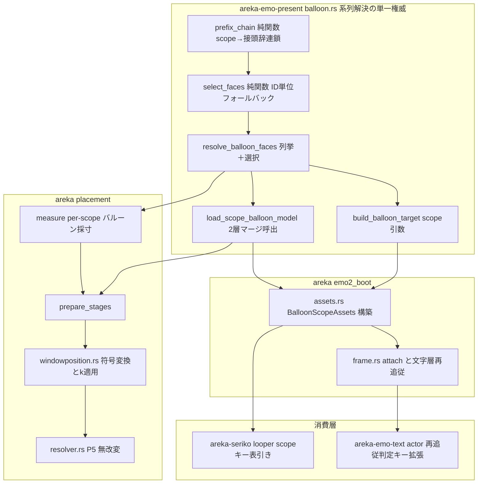
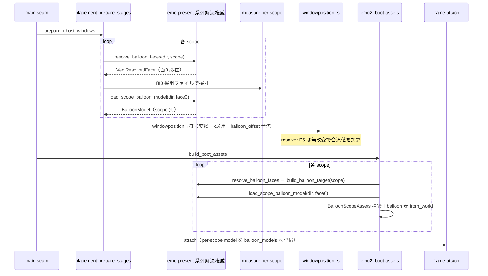
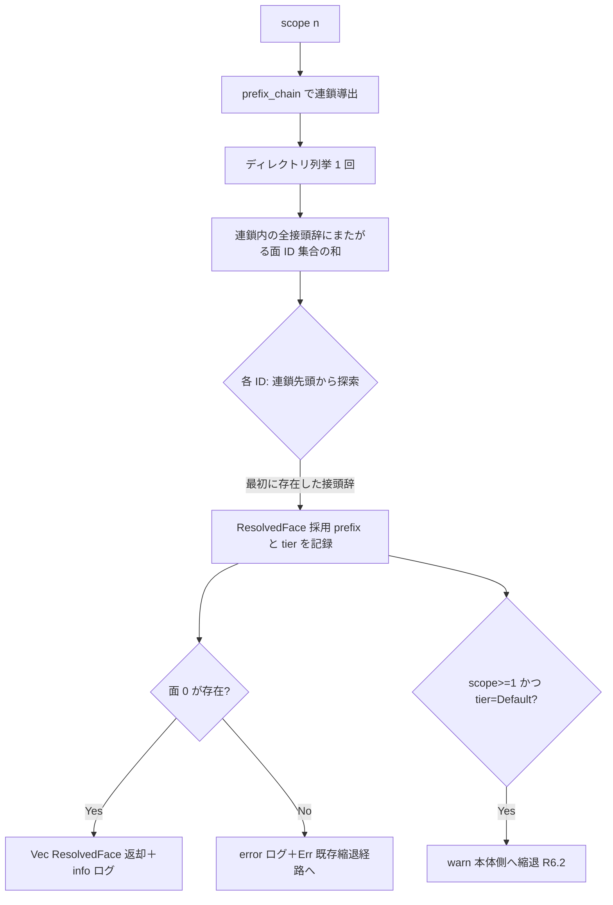

# Technical Design: areka-P0-kero-balloon

> 生成: 2026-07-31 / worktree `claude/kiro-start-areka-p0-kero-1f9ab7`（HEAD `969a9b3`）
> 入力: `requirements.md`（確定・ディスカッション裁定 D1/D9/D11 反映済み）・`research.md`（本設計で D2/D3/D4/D8/D10 と D11 の返却形を確定）
> 本文の `path:line` は 2026-07-31 に本 worktree で実読した実測アンカー。

## Overview

**Purpose**: scope（キャラ番号）ごとに正典（ukadoc）どおりのバルーン系列（`balloonp{n}def*` → 旧名 `balloonk*` / `balloons*`）を解決し、その系列の面画像・面別上書き定義（`windowposition` / `validrect`）を**表示・窓配置採寸・バルーン文字層の三面すべて**へ反映する。これにより、相方（kero）専用のバルーン資産 `balloonk0.png` / `balloonk0s.txt` が実行時に使われない現行欠陥（sylphya 実機サインオフ 2026-07-24 発見）を解消する。

**Users**: 既存の伺か資産を持ち込むユーザ／ゴースト・バルーン作者は、相方側バルーンが正典どおりの枠形状・表示位置で表示されることを得る。`balloonk*` を持たないバルーンでは ID 単位フォールバックにより現行と同一の見た目が保たれる（後方互換）。

**Impact**: 現行の「全 scope 共有 1 本」構造（画像列挙の `balloons` 定数固定・`BalloonModel` 共有・採寸 1 回）を、scope 番号でパラメタ化された**接頭辞優先連鎖**による per-scope 解決へ置き換える。構造の新設ではなく、既存の per-scope ループ（assets/measure/frame は W4 が席を保全済み）へ「scope→系列」の引数を通す増分が主形。

### Goals

- scope 番号→接頭辞優先連鎖の導出と、面 ID 単位の連鎖探索（正典準拠フォールバック）を**単一権威の純関数**として確立する（採寸と装着の解決規則ずれを構造的に排除）。
- scope 別バルーン定義（`descript.txt` ＋採用面の面別上書きの 2 層マージ）を保持し、表示・採寸・文字層の三面へ供給する。
- バルーン窓の初期既定位置を当該 scope の `windowposition`（数値指定）で正典化する（永続値優先・基本位置は現行と同一）。
- W4 申し送りの再追従判定の穴（k 同値でも寸/領域変化なら再構築）を塞ぐ。
- バルーン側 `AnimationTable` を scope で引ける形へ改める（R5.6・境界拡張 `areka-seriko/src/looper.rs`）。
- 判定分岐の決定論檻＋実機（emo2＋emo2-kakukaku）目視サインオフ。

### Non-Goals

- `\b[ID]` バルーン面切替経路の変更（`completed/areka-P0-balloon-face-cue` の完成領域・無改変で緑維持が受け入れ条件）。
- `\p[2]` 以降のキャラ窓の生成・表示（解決規則は scope 番号一般で定義するが、窓は二人立ちまで）。
- 吹き出し以外の族（`arrow*` / `marker*` / `sstp_new*` / `clickwait*`）の scope 別対応（連鎖機構は族名パラメタ化可能な形に留める）。
- 面 ID 偶奇＝左右向き意味論・位置に応じた左右面自動切替。
- `balloon.defaultsurface` / `kero.balloon.defaultsurface` への追従（正典既定 0 のみ実装・語彙記録）。
- バルーン表示／非表示ライフサイクル（W6 `areka-P0-balloon-visibility` の領分）。
- 多面バルーンの面別上書き網羅・実行時再読込（`\![reload,balloon]`）・入力ウィンドウ系列（`balloonc*`）。
- `windowposition.x` キーワード指定（`center`/`top`/`bottom`）・`windowposition.limit`（語彙記録＋縮退シーム）。
- 表示スケール k の導出規約・丸め権威の変更（W4 着地形の消費のみ）。
- キャラ窓基準原点（下端中央）・バルーン位置永続化規約の変更。

## Boundary Commitments

### This Spec Owns

- **scope→バルーン系列の解決規則**（接頭辞優先連鎖・ID 単位フォールバック・非バルーン面の除外）とその単一権威 API（`areka-emo-present/src/balloon.rs`）。
- **scope 別バルーン定義**（2 層マージ済み `BalloonModel`）の構築規則（採用接頭辞→面別上書きファイル名の導出）と保持器（`BalloonScopeAssets`）。
- **窓配置採寸の scope 別化**（`measure.rs` のバルーン採寸をループ内へ・同一権威消費）。
- **`windowposition`（数値指定）→初期既定位置の調整量**の供給（符号変換・k 適用・`ScopeConfig.balloon_offset` シームへの合流）。
- **バルーン文字層の scope 別追従**（per-scope model 供給・k 同値時の寸/領域変化検知＝再追従判定キーの拡張）。
- **バルーン側 `AnimationTable` の scope キー化**（`LoopTables.balloon` / `SerikoLoopConfig`・境界拡張として `areka-seriko/src/looper.rs` を明示編入）。
- 解決結果・フォールバック・失敗経路の観測ログ、および互換対応表（`doc/COMPAT_ARCHITECTURE.md`）への記録。

### Out of Boundary

- `\b` cue 経路（decode→compile→cue→seriko→adapter→PresentCommand・spine S3/S4 檻域の assert 本体）。
- バルーン可視ライフサイクル（`frame.rs` の無条件 ShowSurface `:531-540` は W6 `balloon-visibility` の領分・本仕様は触れない）。
- `placement/resolver.rs` の配置式 P1〜P5（**本設計は P5 を無改変**——`balloon_offset` 供給欄への合流で足りることを確認済み。エスケープ条項は発動しない）。
- `placement/persist.rs` の保存・復元マージ規約（永続値優先はそのまま）。
- `areka-parsers::balloon` のパーサ本体（2 層マージは実装・檻化済み・呼ぶファイルを変えるのみ）。
- `areka-seriko` の bind/state/actor（W6 `bindoption-exclusivity` の編集面・looper.rs の表引き以外は触れない）。
- 表示スケール k の導出・丸め権威（`ScaleRatio` は消費のみ）。

### Allowed Dependencies

- `areka-parsers`（`balloon::parse_str`・`charset::decode`——既存契約のまま消費・改造禁止）。
- `areka-emo-atlas` / `areka-emo-compose`（bake / `EmoWorld::build`——既存公開 API のまま）。
- W4 `emo-dpi-scaling` の着地形（`ScaleRatio` 丸め権威・`MeasureScaling`・`refresh_actor_scale` / `run_text_scale_phase` の再追従経路）。
- 依存方向: `areka-parsers` → `areka-emo-present` → `crates/areka`（emo2_boot / placement）。`areka-seriko` / `areka-emo-text` は `crates/areka` から消費される横並び。**下流（emo-present）に emo2_boot / placement 固有の前提を漏らさない**（系列解決 API は scope 番号と dir のみを入力とする）。

### Revalidation Triggers

- **`BalloonScopeAssets` の形**（W6 `balloon-visibility` が per-scope model 実形へ後着再突合する対象）。
- **`assets.rs` のハンク**（本仕様 `:278-300` 域を書き換える。W6 `bindoption-exclusivity`（`:196-210`）は本仕様の先行着地後に rebase）。
- **`SerikoLoopConfig` の形**（`balloon_table` 単数→scope キー化。`areka-seriko` を触る後続はこの形を前提にする）。
- **`refresh_actor_binding` の no-op 判定キー**（「k 同値なら false」から「k・寸・領域すべて同値なら false」へ意味が変わる。W6.5 `test-cage-determinism` は新しい意味を前提にする）。
- **placement の `prepare_stages`**（windowposition 供給の追加。W5 同居 `dpi-window-vanish` の編集集合が確定した時点で `placement/mod.rs` / `windowposition.rs` との互いに素を再確認する——`resolver.rs` 無改変ゆえ着手順裁定は不要だが、mod.rs の小ハンク追加は台帳注記対象）。

## Architecture

### Existing Architecture Analysis

3 層が既に per-scope の席を持つ（research.md 1 章・実読確認済み）:

- **パーサ層**: `areka-parsers::balloon::parse_str(descript, face_override)` は 2 層後勝ちマージを実装・檻化済み（`validation_tests.rs:95/:137`——kero 側 `balloonk0s.txt` のマージも既に檻にある）。改造不要。
- **起動時資産**: `assets.rs:281-284` は既に scope ループで `build_balloon_target` を呼ぶ（ただし毎回同一引数）。`frame.rs:205` に `balloon_models: HashMap<u32, BalloonModel>` の per-scope 記憶マップが導入済み（現状は同一 model を挿すだけ）。
- **採寸**: `measure.rs:127-128 / :227-231` に「balloon_size が scope 別値になり得る席を潰さない（kero-balloon（W5）申し送り）」の明示コメント実在。`apply_scaling` は per-scope 写像済み。

欠けているのは 3 点＝①画像列挙の `balloons` 定数固定（`balloon.rs:39`・公開口 `build_balloon_target` に scope 引数なし）、②`BALLOON_FACE0_TXT = "balloons0s.txt"` 固定＋`BootAssets.balloon_model` 全 scope 共有 1 本（`assets.rs:79/:122`）、③バルーン採寸が scope ループ外で 1 回（`measure.rs:179-180`・`"balloons0.png"` 固定名 `:402/:409`）。加えて、`windowposition` は現行 placement が一切消費していない（`resolver.rs:109-113` の DD7 暫定規則が「正式規則は balloon 表示系の後続へ委ねる」と空席を宣言）。

**最重要の構造リスク**: バルーンディレクトリの列挙が `balloon.rs:50 enumerate_frames` と `measure.rs:390-409` の**独立 2 実装**であり、per-scope 化で規則がずれると「採寸した窓寸 ≠ 実際に合成された枠」という実機限定欠陥になる。本設計は解決規則を単一権威へ集約して両者に消費させる（D2）。

### Architecture Pattern & Boundary Map

パターン: **最下流の純関数権威＋上位は引数の通し**（research.md アプローチ A の精緻化・D10 採用）。



**Architecture Integration**:
- Selected pattern: 系列解決を `areka-emo-present` の公開純関数へ集約し、assets / measure / placement の 3 消費者が同一権威を呼ぶ（列挙・選択の規則が 1 箇所）。
- 保持は `BalloonScopeAssets`（`ScopeAssets` と対称・D4=S1）で per-scope に一本化し、共有 1 本の誤用を構造的に不可能にする。
- 既存パターン保存: per-scope ループ（assets/measure/frame）・`ScaleRatio` 丸め権威・`ActorKey::from(scope.to_string())` 写像・log-first 失敗経路。
- 新規要素の根拠: `windowposition.rs`（placement 供給側の純関数群）は resolver P5 を無改変に保つための供給層。`SerikoLoopConfig` の scope キー化は R5.6 が禁じる「別 scope 系列由来の定義で駆動」を型で塞ぐ。
- Steering 準拠: parser は転記層（改造しない）・ログ規約（logging.md）・決定論檻必達・内部表現は scope 番号のみ（R1.9）。

### 確定した設計判断（research.md の未決 D 項の裁定）

| 判断 | 裁定 | 根拠（要約） |
|---|---|---|
| **D10 アプローチ** | **A**（下流純関数へ集約） | B は `\b` の面 ID 意味論を歪め正典乖離（R5.1/5.2 と衝突）。C は二重実装の固定化。 |
| **D2 単一権威の所在** | **(a) `areka-emo-present::balloon`** | 既に `areka-parsers` 依存があり、assets/measure 双方が到達できる最下流。列挙＋選択＋上書き名導出＋model 読込まで同居させ、規則の分裂点を消す。 |
| **D11 連鎖の返却形** | **表データ `Vec<SeriesPrefix>`（族 `SeriesFamily` でパラメタ化・tier タグ付き）** | 候補追加が構造改変を伴わない（R1.9）。tier（Own/KeroNamed/Default）がフォールバック分類（R6.2 の warn 判定）を運ぶ。装飾族の一段深い旧名も可変長候補列で表現可能。 |
| **D4 保持器** | **S1: `BalloonScopeAssets` struct 新設・`BootAssets.balloon_model` 撤去** | `ScopeAssets` と対称・「共有 1 本」の誤用が型で不可能になる。ripple 8 箇所は実測済み（research.md 6 章）。 |
| **D3 再追従判定キー** | **(ii): `TextSlotBinding` 全体等値 ＋ 再解決 `ResolvedBalloonText` 等値** | 両型とも `PartialEq` 導出済み（actor.rs:46/:133）＝追加 derive 不要。「k・寸・領域すべて同値なら no-op」を字義どおり実装し、model 由来の領域変化も捕捉。churn ガード（R4.5）は等値時 false で維持。 |
| **D8 面別上書き不在の log** | **NotFound → `debug!`（正常縮退）・その他 I/O エラー → `warn!`。基層 `descript.txt` は現行どおり `warn!`** | R2.4「欠落を失敗として扱わない」。相方側で毎起動 warn が鳴る事故を防ぎつつ、権限エラー等の異常は観測可能に残す。 |
| **D9' 表の所在** | **`LoopTables.balloon` を `BTreeMap<u32, AnimationTable>` へ（並行構造維持・資産への同梱はしない）** | 表は spawn_seriko が attach より前に消費し、`BalloonScopeAssets` は attach で move 消費される——同梱すると消費タイミングが交差する。導出は per-scope 構築ループ内の 1 箇所（単一導出点）。shell 表は全 scope 同一 `Shell` 由来ゆえ単数のまま（前提コメントを shell 限定へ書き直す）。 |
| **D5 フォールバック時上書き層の分類** | **正典整合（解釈）として対応表へ記録** | 正典は上書きを「対応する ID のサーフェス（画像）に対して」適用と定義——採用画像にその画像の上書き層が対応するのは正典の帰結（R2.3 の文言どおり）。 |
| **D7 R1.7 の意味** | **既存 2 縮退経路（unwired 縮退／dummy 窓縮退)への log-first 伝播で充足** | 要件文言が「既存の失敗経路へ伝播・プロセス終了ポリシーは対象外」と確定済み。 |
| **D1' 供給点** | **`ScopeConfig.balloon_offset` へ合流（`resolver.rs` P5 無改変）** | P5 は `balloon_offset.unwrap_or((0,0))` を既に加算（resolver.rs:186）。供給元の追加のみで正典化が成立。エスケープ条項（W5 着手順裁定）は**発動しない**。 |

### Technology Stack

| Layer | Choice | Role in Feature | Notes |
|-------|--------|-----------------|-------|
| 系列解決 / 資産 | Rust（`areka-emo-present`） | 接頭辞連鎖・面選択・model 読込の単一権威 | 新規外部依存なし |
| 定義パース | `areka-parsers`（既存） | `balloon::parse_str` 2 層マージ・`charset::decode` | 改造なし・呼ぶファイルを scope 別に |
| 配置 / 採寸 | `crates/areka` placement | per-scope 採寸・windowposition 供給 | `ScaleRatio` 丸め権威は W4 のまま |
| アニメ表 | `areka-seriko` | バルーン表の scope キー化 | bind/state/actor は無改変 |
| 文字層 | `areka-emo-text` | 再追従判定キー拡張 | `PartialEq` 既存導出を利用 |

## File Structure Plan

### New Files

```
crates/areka/src/placement/windowposition.rs
    # windowposition（数値指定）→ 画面座標調整量の純関数群:
    #   符号変換（シェル側正→画面符号・BalloonSide 依存）・k 適用（ScaleRatio 権威へ委譲）・
    #   ScopeConfig.balloon_offset への合流。resolver.rs を無改変に保つ供給層。
```

### Modified Files

| File | 変更内容 |
|---|---|
| `crates/areka-emo-present/src/balloon.rs` | 系列解決の単一権威へ拡張: `SeriesFamily`/`SeriesPrefix`/`ChainTier`/`prefix_chain`/`ResolvedFace`/`resolve_balloon_faces`/`load_scope_balloon_model` を公開。`build_balloon_target` に scope 引数（内部は resolve 済み面列から構築）。`FRAME_PREFIX` 定数と現行 `frame_id`/`enumerate_frames` は連鎖版へ置換。テスト `:264`（`balloonk0.png == None`）は系列明示の判定へ意味を変えて更新。 |
| `crates/areka/src/emo2_boot/assets.rs` | `BalloonScopeAssets` 新設（scope/emo_world/atlas/model）・`BootAssets.balloons` を `Vec<BalloonScopeAssets>` へ・`balloon_model` 単数フィールドと `BALLOON_FACE0_TXT` 撤去・balloon ループで per-scope に resolve→build→model・`LoopTables.balloon` を `BTreeMap<u32, AnimationTable>` へ（ループ内で `from_world`）・「先頭 World から 1 度だけ」注記を shell 限定へ書き直し（`:287-300`）。**`build_balloon_model`（`:311-327`）と `read_decoded_lenient`（`:330-342`）は権威クレートへ移設**し、移設先で層別 log レベル（D8）を実装する——本ファイルには残さない（移設により死んだコードを残さない）。テスト `:439-449` を per-scope 実値（scope1=kero 値）へ更新。 |
| `crates/areka/src/emo2_boot/frame.rs` | attach（`:497-556`）: `BalloonScopeAssets` の take 消費・`wiring.balloon_models.insert(scope, assets.model)`・`connect_balloon_text` へ per-scope model。`run_text_scale_phase`（`:928-970`）は構造無改変（マップから per-scope model を引く既存形がそのまま効く）。doc の「全 scope 共有」記述を更新。テストハーネス `:1383` の構築 ripple。 |
| `crates/areka/src/emo2_boot/mod.rs` | `LoopTables` 分解（`:335-338`）→ `SerikoLoopConfig.balloon_tables`（u32→`ActorKey` 変換）・`BootAssets` 形状 ripple（`:322/:368-375`）。 |
| `crates/areka/src/emo2_boot/spine.rs` | 同 ripple（`:525-574`）・S4 doc `:1249-1253`「emo2 fixture は balloons0.png のみ」の陳腐化記述更新（assert 本体は無改変・S3 `:941` / S4 `:1254` 緑維持）。 |
| `crates/areka/src/input_events/balloon.rs` | テスト構築 ripple（`:1320` プレースホルダ追随のみ）。 |
| `crates/areka/src/placement/measure.rs` | `measure_balloon_surface0` を scope 引数化し `resolve_balloon_faces` の消費者へ書き換え（面 0 の採用ファイル名を権威から得る）・scope ループ内へ移設（`:179-180` → ループ内）・失敗報告の scope 帰属を実 scope 番号へ。共有寸前提テスト（`:534-536/:564-567/:1165-1168`）を per-scope 期待値（scope0=400×224／scope1=288×203）へ更新。「バルーンは全スコープ共通だから 1 回だけ」（`:227-231`）「帰属先が定まらないので `scope: 0` で報告する」（`:127-134`）等の陳腐化コメントを実挙動へ書き直し（R7.2）。 |
| `crates/areka/src/placement/mod.rs` | `mod windowposition;` 宣言追加。`prepare_stages`（`:254-290`）: 採寸後に per-scope model（単一権威経由）から windowposition を取り、`windowposition.rs` の純関数で `cfg` の `balloon_offset` へ合流。観測 info ログ追加。**同ファイル内の fixture 実走テストも更新対象**——全 placement が同一バルーン寸であることを主張する箇所（`:924-933`・定数 `:471-472`）は per-scope 期待値へ、バルーン位置・相対オフセットの実値を主張する箇所（`:513-542`）は windowposition 反映後の期待値へ（R7.2）。 |
| `crates/areka-emo-text/src/actor.rs` | `refresh_actor_binding`（`:348-375`）の no-op 判定を「binding 全体等値 ∧ 再解決 `ResolvedBalloonText` 等値」へ拡張（resolve は 1 回・単一構築経路維持）。テスト `:2665` の名称と意図を更新＋「k 同値・寸違い→true」の新檻。 |
| `crates/areka-seriko/src/looper.rs` | `SerikoLoopConfig.balloon_table` → `balloon_tables: BTreeMap<ActorKey, AnimationTable>`・表引き（`:180/:236`）を scope キー lookup へ（不在 scope＝空表意味論）・`disabled()` は空マップ。既存テスト ripple（`:478/:735`・`actor.rs:2071`・`tests/loop_integration.rs:195`）。 |
| `doc/COMPAT_ARCHITECTURE.md` | R7.4/R7.7 の記録追加（後述 Error Handling 後の記録一覧）。 |

> `crates/areka/src/placement/resolver.rs`・`persist.rs`・`areka-parsers` 配下・`areka-seriko` の bind/state/actor は**無改変**（Out of Boundary）。

## System Flows

### Flow 1: 起動時の scope 別解決（placement → boot の 2 消費点が同一権威を通る）



補足: placement と boot は現行どおり独立にバルーンディレクトリを読む（起動 2 段の既存構造は不変）。**列挙・選択・上書き名導出・model 読込の全規則が単一権威 1 箇所**にあるため、2 消費点の解決結果は構造的に一致する（research.md 4 章の (A)/(B) ずれの解消）。

### Flow 2: 面 ID 単位の連鎖探索（純関数・檻の主対象）



## Requirements Traceability

| Req | Summary | 実現要素（Components / Files） |
|---|---|---|
| 1.1 | 3 段連結の接頭辞優先連鎖 | `prefix_chain`（`SeriesFamily` 表データ・balloon.rs） |
| 1.2 | 連鎖先頭から最初に存在した接頭辞の面を採用 | `select_faces` / `resolve_balloon_faces` |
| 1.3 | 面 ID 単位の探索（系列一括切替なし） | `select_faces`（ID 集合の和→ID ごと連鎖走査） |
| 1.4 | 先頭側接頭辞皆無→全 scope `balloons` へ（後方互換） | 連鎖末尾が `balloons`＝現行と同一面集合（檻で固定） |
| 1.5 | 接頭辞厳密一致・非バルーン面除外 | `face_id_of(prefix, name)`（strip_prefix→`.png`→全数字 parse） |
| 1.6 | 実行時 scope は 0/1・規則は n≧2 含む一般形 | `prefix_chain(family, scope: u32)`＋合成 fixture 檻 |
| 1.7 | 面 0 解決不能→error ログ＋Err→既存縮退経路 | `resolve_balloon_faces` の面 0 必在契約（D7 裁定） |
| 1.8 | scope 番号パラメタ化（2 値固定分岐禁止） | 連鎖導出は scope: u32 の純関数・enum 分岐なし |
| 1.9 | 内部表現は番号のみ・連鎖は表データ | `SeriesFamily` 候補列＋scope u32（Sakura/Kero enum 不採用） |
| 1.10 | p0def/p1def 先行探索＝areka 裁量拡張 | 対応表記録（COMPAT (a)）・連鎖表に正規名先頭で実装 |
| 2.1 | scope 専用のマージ済み定義保持 | `load_scope_balloon_model`＋`BalloonScopeAssets.model` |
| 2.2 | 採用接頭辞対応の上書きファイルを適用 | `ResolvedFace::override_file_name()`（{採用prefix}{ID}s.txt） |
| 2.3 | フォールバック時は後段接頭辞の同 ID 上書き層 | 同上（採用 face 由来で導出＝正典整合・COMPAT 記録） |
| 2.4 | 上書きファイル不在は失敗でない | `load_scope_balloon_model` の NotFound→debug 縮退（D8） |
| 2.5 | 未指定項目は既定継承 | `areka-parsers::balloon::parse_str` 既存契約（無改変） |
| 2.6 | 初期表示面＝当該 scope 系列の面 0 | frame.rs 初回 ShowSurface(surface_id=0) 不変＋語彙記録 |
| 3.1 | scope 別採寸（1 回へ畳まない） | `measure_balloon_surface0(scope)` をループ内へ移設 |
| 3.2 | windowposition＝基本位置からの調整量・基本位置は現行 | `windowposition.rs`→`balloon_offset` 合流（P5 無改変） |
| 3.3 | x はシェル側正→画面符号変換・y は無変換 | `to_screen_adjust`（BalloonSide 依存の符号表） |
| 3.4 | 数値指定なし→既定 0＝現行と同一 | wp 無指定は合流なし（None 温存・檻で同一性固定） |
| 3.5 | 永続値優先・初期既定の供給にとどまる | persist.rs 無改変（保存値優先マージは既存規約のまま） |
| 3.6 | k 適用は既存権威・新丸め規約なし | `scale_offset`＝符号保存＋大きさは `ScaleRatio` 権威へ委譲 |
| 3.7 | `balloonk*` 不在時は全 scope 同一寸＝適用前と一致 | 連鎖収束（1.4 と同根）＋measure 檻で固定 |
| 3.8 | 原点（下端中央）・保存/復元基準の不変 | resolver/persist 無改変（Out of Boundary） |
| 4.1 | 文字層は当該 scope の定義で領域解決 | attach が `BalloonScopeAssets.model` を `connect_balloon_text` へ |
| 4.2 | 装着と再追従で同一の scope→アクタ写像 | `ActorKey::from(scope.to_string())` 単一式（frame.rs :554/:948 既存維持） |
| 4.3 | k 変化時の再構築 | `refresh_actor_binding` 既存経路（無改変で per-scope model が効く） |
| 4.4 | k 同値でも寸/領域変化なら再構築 | 判定キー拡張（D3=(ii)・binding＋ResolvedBalloonText 等値） |
| 4.5 | 全同値なら no-op（churn 禁止） | 同上の等値 no-op＋既存檻の意図更新 |
| 4.6 | 未装着 actor は静穏 skip＋ログ | actor.rs :354-363 既存（無改変） |
| 4.7 | リビール純粋状態の保存 | `register_actor` が routing/layout_input のみ上書き（既存担保） |
| 5.1 | `\b[ID]`＝系列内 ID・既存挙動不変 | cue 経路無改変・World が scope 系列由来になるのみ（COMPAT 記録） |
| 5.2 | spine S3/S4 檻の緑維持 | assert 本体無改変（S4 doc のみ事実更新） |
| 5.3 | 可視ライフサイクル不変 | 無条件 ShowSurface 域に触れない（W6 領分） |
| 5.4 | `balloonk*` 不在時の表示・採寸・面集合同一 | 1.4/3.7 の檻＋後方互換テスト |
| 5.5 | 本体側 scope の同一性（初期既定位置のみ 3.2 対象） | scope0 連鎖は末尾 `balloons`＝現行等価（檻で固定） |
| 5.6 | バルーン面テーブルの scope 整合 | `LoopTables.balloon` マップ化＋`SerikoLoopConfig.balloon_tables`＋前提注記解消 |
| 6.1 | 採用系列・面 ID の解決結果ログ | `resolve_balloon_faces` の info!（scope・faces 一覧） |
| 6.2 | 本体側縮退の warn（scope・面 ID・採用ファイル） | tier=Default 採用時の warn!（scope≧1） |
| 6.3 | windowposition/validrect 実値ログ | `load_scope_balloon_model` の info!（scope 付き） |
| 6.4 | 失敗は error ログ＋Err | 既存 log-first 流儀の踏襲（新規経路も同型） |
| 7.1 | 判定分岐の決定論檻の網羅 | Testing Strategy の檻一覧（全純関数・合成 fixture） |
| 7.2 | 矛盾テスト・陳腐注記の更新 | measure/balloon.rs/assets/actor/spine doc の更新一覧 |
| 7.3 | 実機サインオフ（絶対パス・目視＋ログ突合） | Testing Strategy「実機サインオフ」 |
| 7.4 | 対応表への記録 | COMPAT_ARCHITECTURE.md 追記一覧 |
| 7.5 | ワークスペース全体テスト緑 | DoD（i686 helper 事前ビルド注記込み） |
| 7.6 | x 方向基本位置の実機確定 | サインオフ手順に組込み・確定後 COMPAT 記録 |
| 7.7 | 記録 3 点（(a)裁量拡張 (b)語彙二系統 (c)装飾族旧名） | COMPAT_ARCHITECTURE.md 追記一覧 |

## Components and Interfaces

| Component | Domain/Layer | Intent | Req Coverage | Key Dependencies | Contracts |
|-----------|--------------|--------|--------------|------------------|-----------|
| 系列解決権威（balloon.rs） | areka-emo-present | scope→連鎖→面選択→上書き名→model 読込の単一権威 | 1.1-1.10, 2.1-2.4, 6.1, 6.2, 6.3 | areka-parsers（P0） | Service |
| BalloonScopeAssets（assets.rs） | areka/emo2_boot | per-scope バルーン資産の保持と構築 | 2.1, 5.6 | 系列解決権威（P0） | State |
| attach/文字層供給（frame.rs） | areka/emo2_boot | per-scope model の装着・再追従写像維持 | 4.1, 4.2, 2.6 | BalloonScopeAssets（P0）・emo-text（P0） | State |
| per-scope 採寸（measure.rs） | areka/placement | scope 別バルーン寸の供給 | 3.1, 3.6, 3.7 | 系列解決権威（P0）・ScaleRatio（P0） | Service |
| windowposition 供給（windowposition.rs） | areka/placement | 符号変換・k 適用・balloon_offset 合流 | 3.2, 3.3, 3.4, 3.6 | ScaleRatio（P0）・config.rs（P1） | Service |
| 再追従判定キー拡張（actor.rs） | areka-emo-text | k 同値時の寸/領域変化検知 | 4.3, 4.4, 4.5, 4.6, 4.7 | なし（in-crate） | Service |
| scope キー表引き（looper.rs） | areka-seriko | バルーン表の scope 整合 | 5.6 | AnimationTable（P0） | State |

### areka-emo-present / 系列解決の単一権威（balloon.rs）

| Field | Detail |
|-------|--------|
| Intent | scope 番号から接頭辞優先連鎖を導出し、面 ID 単位でバルーン面を解決する唯一の権威 |
| Requirements | 1.1-1.10, 2.2, 2.3, 2.4, 6.1, 6.2, 6.3 |

**Responsibilities & Constraints**
- 連鎖導出・面選択・上書きファイル名導出・model 読込を所有する。**この規則を他所で再実装することを禁じる**（measure/assets は消費者）。
- 入力は `balloon_dir` と `scope: u32` のみ（上位層の概念を持ち込まない・層純度維持）。
- 選択の純核（`select_faces`）はファイル名リストに対する純関数として分離し、fs 非依存で檻に入れる。

**Dependencies**
- Outbound: `areka-parsers`（`shell::parse`／`balloon::parse_str`／`charset::decode`）— 転記・マージ（P0）
- Outbound: `areka-emo-atlas` / `areka-emo-compose` — bake / World 構築（P0）
- Inbound: `crates/areka` assets / measure / placement — 消費者（P0）

**Contracts**: Service [x]

##### Service Interface

```rust
/// 系列族の定義（表データ・候補追加が構造改変を伴わない形・R1.9）。
pub struct SeriesFamily {
    /// 族の基底名（吹き出し族＝"balloon"・正規名は {base}p{n}def）。
    pub base: &'static str,
    /// scope 0 の旧名候補（吹き出し族＝["balloons"]。装飾族なら ["arrows","arrow"] と一段深く持てる）。
    pub scope0_legacy: &'static [&'static str],
    /// scope 1 の旧名候補（吹き出し族＝["balloonk"]）。
    pub scope1_legacy: &'static [&'static str],
}
/// 吹き出し族（本仕様で唯一実装する族）。
pub const BALLOON_FAMILY: SeriesFamily;

/// 連鎖内の 1 接頭辞（採用時の分類タグ付き）。
#[derive(Debug, Clone, PartialEq, Eq)]
pub struct SeriesPrefix {
    pub prefix: String,
    pub tier: ChainTier,
}
/// 連鎖内での役割（R6.2 の warn 判定と対応表記録の分類を運ぶ）。
#[derive(Debug, Clone, Copy, PartialEq, Eq)]
pub enum ChainTier {
    /// 当該 scope 自身の候補（正規名＋自 scope の旧名）。
    Own,
    /// n≧2 連鎖の名指し相方系列（balloonk・scope1 への再帰ではない）。
    KeroNamed,
    /// デフォルト定義（balloonp0def→balloons・scope 0 のみが持つ地位）。
    Default,
}

/// scope→接頭辞優先連鎖（純関数・表データ駆動）。
/// chain(s) = Own(s) ++ KeroNamed(s≧2 のみ) ++ Default(s≧1 のみ)
///   Own    : s=0 → [p0def, balloons] / s=1 → [p1def, balloonk] / s≧2 → [p{s}def]
///   KeroNamed: [balloonk]
///   Default: [p0def, balloons]
pub fn prefix_chain(family: &SeriesFamily, scope: u32) -> Vec<SeriesPrefix>;

/// 解決済みの 1 面（採用結果）。
#[derive(Debug, Clone, PartialEq, Eq)]
pub struct ResolvedFace {
    pub surface_id: u32,
    /// 採用接頭辞（連鎖内で最初に画像が存在したもの）。
    pub prefix: String,
    pub tier: ChainTier,
    /// 実ファイル名（原形保持・実 WIC が実パスを読む）。
    pub file_name: String,
}
impl ResolvedFace {
    /// 採用接頭辞に対応する面別上書きファイル名（{prefix}{surface_id}s.txt・R2.2/R2.3）。
    pub fn override_file_name(&self) -> String;
}

/// ディレクトリ 1 回列挙＋面 ID 単位の連鎖探索（R1.2/R1.3）。面 ID は連鎖内全接頭辞の
/// ID 集合の和。**面 0 が解決できなければ error ログ＋Err**（R1.7・全消費者共通の単一施行点）。
/// 完了時 info!（scope・採用面一覧＝R6.1）・scope≧1 の tier=Default 採用は面ごとに warn!（R6.2）。
pub fn resolve_balloon_faces(
    balloon_dir: &Path, scope: u32,
) -> Result<Vec<ResolvedFace>, PresentError>;

/// 解決済み面列から synthetic surfaces.txt →parse→bake→World（既存経路・R5.1 流儀不変）。
/// scope 引数版は resolve_balloon_faces を内包する薄いラッパ。
pub fn build_balloon_target(
    balloon_dir: &Path, decoder: &impl ElementDecoder, scope: u32,
) -> Result<(EmoWorld, AtlasTable), PresentError>;
pub fn build_balloon_target_from_faces(
    balloon_dir: &Path, decoder: &impl ElementDecoder, faces: &[ResolvedFace],
) -> Result<(EmoWorld, AtlasTable), PresentError>;

/// scope 別バルーン定義: descript.txt（基層・読取失敗は warn!＋空層）＋ face0 の
/// override_file_name()（上書き層・**NotFound は debug!**・他 I/O エラーは warn!＝D8）を
/// parse_str へ渡す 2 層マージ。確定した windowposition/validrect を info! で記録（R6.3）。
/// 実装時訂正（task 1.4）: `scope: u32` を第 2 引数として追加した。R6.3／観測点 3 が
/// 本関数の info! に scope を要求する一方、`ResolvedFace` から scope は逆算できない
/// （本体側へ縮退した相方の面は採用接頭辞が `balloons` となり scope 0 の面と区別が付かない）。
/// 引数順は `resolve_balloon_faces(dir, scope)` に揃える。
pub fn load_scope_balloon_model(
    balloon_dir: &Path, scope: u32, face0: &ResolvedFace,
) -> BalloonModel;
```

- Preconditions: `balloon_dir` は実在ディレクトリ（走査失敗は log-first で Err）。
- Postconditions: `resolve_balloon_faces` の戻りは surface_id 昇順・面 0 を必ず含む。同一入力に対し決定論（明示ソート）。
- Invariants: 面判定は「接頭辞 strip（大小無視）→ `.png` strip → 全数字 parse」の厳密 3 段（R1.5——`balloonc*` を `balloonk` と誤認する事故は接頭辞完全一致で構造的に不可能）。

**Implementation Notes**
- Integration: 現行 `FRAME_PREFIX`/`frame_id`/`enumerate_frames` は連鎖版に置換。既存テスト `:258-271` は「系列を明示した判定」へ意味を変えて更新（scope0 連鎖では `balloonk0.png` 不採用／scope1 連鎖では面 0 採用）。
- Validation: 純核 `select_faces(names, chain)` を fs 非依存で檻化（Testing Strategy 檻 1-4）。
- Risks: 列挙は消費者ごと（placement / boot）に走るが規則は 1 箇所——列挙 I/O の重複は現行と同水準で許容。

### areka / emo2_boot（assets.rs・frame.rs）

| Field | Detail |
|-------|--------|
| Intent | per-scope バルーン資産（World・atlas・model・アニメ表）の構築・保持・装着 |
| Requirements | 2.1, 2.6, 4.1, 4.2, 5.6 |

**Responsibilities & Constraints**
- `BalloonScopeAssets` が scope 1 件ぶんの単一真実源（「共有 1 本」フィールドを残さない）。
- 装着（`connect_balloon_text`）と再追従（`run_text_scale_phase`）は同一の `ActorKey::from(scope.to_string())` 写像・同一の `balloon_models` マップを使う（4.2 の維持義務・frame.rs :552-554/:946-948 の警告コメント維持）。
- 初回 ShowSurface は surface_id=0 のまま（2.6・World の中身が scope 系列由来になるのみ）。

**Contracts**: State [x]

##### State Management

```rust
/// 1 scope 分のバルーン表示資産（ScopeAssets と対称・D4=S1）。
pub struct BalloonScopeAssets {
    pub scope: u32,
    /// scope の系列から build 済みの表示 World（装着で move 消費）。
    pub emo_world: EmoWorld,
    /// 当該 scope の bake 済みアトラス。
    pub atlas: AtlasTable,
    /// scope 別 2 層マージ済み定義（文字層・windowposition/validrect の源）。
    pub model: BalloonModel,
}

pub struct LoopTables {
    /// シェル表（全 scope 同一 Shell 由来ゆえ単数のまま——この前提は shell に限る旨を注記）。
    pub shell: AnimationTable,
    /// バルーン表（scope キー・各 scope の balloon World から from_world・D9'）。
    pub balloon: BTreeMap<u32, AnimationTable>,
}

pub struct BootAssets {
    pub shells: Vec<ScopeAssets>,
    pub balloons: Vec<BalloonScopeAssets>,   // 旧 Vec<(u32, EmoWorld, AtlasTable)>
    // pub balloon_model: BalloonModel        // 撤去（共有 1 本の誤用を型で禁止）
    /* resolver / static_binds / bind_resolver / loop_tables / author_dpi 群は不変 */
}
```

- State model: `build_boot_assets` の balloon ループ内で scope ごとに resolve→build→model→表 を**同一箇所で導出**（単一導出点）。`assets.rs:287-300` の「先頭 World から 1 度だけ組めば足りる」注記は balloon について**成立しなくなるため削除**し、shell 側の記述に限定して書き直す（R5.6/R7.2）。
- Persistence & consistency: attach は `Vec<Option<BalloonScopeAssets>>` からの take 消費（既存 move 消費パターン踏襲・frame.rs :507-516）。
- Concurrency strategy: 変更なし（構築は boot シームの単一スレッド・表は spawn_seriko へ値渡し）。

**Implementation Notes**
- Integration: ripple 8 箇所は実測済み（assets.rs:122/:285/:305・mod.rs:322/:368・frame.rs:422/:1383・spine.rs:525/:568・input_events/balloon.rs:1320——テスト構築 2 箇所はプレースホルダ追随）。
- Validation: assets テスト（:439-449）を per-scope 分解——scope0＝sakura 値（validrect 46,-56,36,-44／wp 266,-129）・scope1＝kero 値（40,-70,24,-48／-190,-75）・`wordwrappoint` は descript 継承 -34。
- Risks: attach の take 消費と spawn_seriko の表消費が交差しないよう、表は `LoopTables` 側へ持つ（D9' 裁定の理由）。

### areka / placement（measure.rs・windowposition.rs・mod.rs）

| Field | Detail |
|-------|--------|
| Intent | scope 別バルーン寸の採寸と、windowposition による初期既定位置調整量の供給 |
| Requirements | 3.1-3.8, 6.3 |

**Responsibilities & Constraints**
- 採寸のファイル選択は権威（`resolve_balloon_faces`）の消費のみ——`measure.rs:390-409` の固定名最小再実装は撤去。
- `resolver.rs` P1〜P5 は**無改変**。windowposition は `ScopeConfig.balloon_offset`（config.rs:50・emo2 は現行 None＝未使用）への合流で供給する。
- 恒等式 `balloon_offset ≡ balloon_pos − char_pos`（resolver.rs:77-81 の恒久事後条件）は P5 の加算入力を変えるだけなので自動的に保たれる。
- 永続値優先（3.5）: `persist.rs` のマージ（保存値があれば保存値）は無改変——本供給は「保存値が無いときの resolver 出力」だけを正典化する。

**Contracts**: Service [x]

##### Service Interface

```rust
// measure.rs（変更）
/// scope の系列の面 0 を採寸する（採用ファイル名は resolve_balloon_faces から得る・D2）。
/// scope ループ内で呼ばれ、失敗の scope 帰属は実 scope 番号（per-scope 化の帰結）。
fn measure_balloon_surface0(
    balloon_root: &Path, decoder: &WicDecoderArm, composer: &mut Composer, scope: u32,
) -> Result<SizePx, PlacementError>;

// windowposition.rs（新設・全て純関数）
/// windowposition 生値（作者空間・model 由来）→ 画面座標の調整量（物理 px）。
/// x: シェル側正 → Left（バルーンがキャラ左）＝ +x／Right ＝ −x（R3.3・実機確定は R7.6）。
/// y: 下が正＝画面同符号（無変換）。
/// k: 大きさは ScaleRatio 権威（scale_len）へ委譲し符号を保存（新丸め規約なし・R3.6）。
pub fn to_screen_adjust(
    wp_x: Option<i32>, wp_y: Option<i32>, side: BalloonSide, k: ScaleRatio,
) -> Option<(i32, i32)>;   // 両軸とも未指定なら None（現行と厳密同一・R3.4）

/// cfg.scopes[scope].balloon_offset へ加算合流（既存 descript offset があれば加算・無ければ設定）。
/// 注意（単位空間の混在・意図的）: 本欄は物理 px の加算欄。windowposition 由来の調整量は
/// k 適用済み物理 px で合流するが、既存供給元 balloon.offsetx/offsety（descript）は非スケール
/// 生値のまま加算される——後者の規約温存は Out of scope（W5 対象外）。emo2 は descript offset
/// が None ゆえ顕在化しないが、将来の取り違えを封じるためこの doc を実装コメントにも転記する。
pub fn apply_windowposition(
    cfg: &mut PlacementConfig, scope: usize, adjust: Option<(i32, i32)>,
);
```

- Preconditions: `prepare_stages` が cfg 構築・採寸の後に scope ごとに model を取得して呼ぶ（Flow 1）。
- Postconditions: wp 数値指定なし＋descript offset なし → `balloon_offset` は `None` のまま＝resolver 出力が現行と bit 同一（R3.4/5.5 の檻対象）。
- Invariants: 片軸のみ指定時は他軸 0 として合流（正典既定 0・R3.4 と同義）。

**Implementation Notes**
- Integration: `prepare_stages`（mod.rs:254-290）に「per-scope model 取得→`to_screen_adjust`→`apply_windowposition`」を挿入し、`info!`（scope・wp 生値・side・変換後 dx/dy）を出す——R7.6 の実機突合を grep で行うため。
- Validation: 符号変換の全分岐（Left/Right × 正負 × 片軸欠落）と k 適用を純関数檻で網羅（檻 9）。
- Risks: W5 同居 `dpi-window-vanish` の編集集合が未確定——`resolver.rs` 無改変ゆえ着手順裁定は不要（エスケープ条項不発動）だが、`placement/mod.rs` の小ハンクは Revalidation Triggers に記載済み。

### areka-emo-text / 再追従判定キーの拡張（actor.rs）

| Field | Detail |
|-------|--------|
| Intent | k 同値でも面実寸／文字描画領域が変わったら文字層を再構築する（W4 申し送りの穴の閉塞） |
| Requirements | 4.3, 4.4, 4.5, 4.6, 4.7 |

**Responsibilities & Constraints**
- 変更は `refresh_actor_binding`（actor.rs:348-375）の no-op 判定のみ。装着経路・純粋状態（`TextLayerState`）・描画資源破棄の既存構造は不変。
- 単一構築経路の維持: `resolve` は判定前に 1 回だけ行い、再構築時はその値をそのまま `register_actor` へ渡す（二重 resolve・第 2 構築流儀を作らない）。

**Contracts**: Service [x]

##### Service Interface（変更差分）

```rust
fn refresh_actor_binding(
    &mut self, actor: &ActorKey, binding: TextSlotBinding, model: &BalloonModel,
) -> bool {
    let Some(current) = self.routing.get(actor) else { /* 既存: 未装着 debug + false */ };
    // D3=(ii): 判定キー＝binding 全体（scale・surface_size・image_size・slot・window）＋
    // model×image_size から再解決した ResolvedBalloonText（validrect 等の領域変化を捕捉）。
    // 両型とも PartialEq 導出済み（:46 / :133）＝追加 derive なし。resolve は純関数で毎回安価。
    let resolved = ResolvedBalloonText::resolve(model, binding.image_size);
    if *current == binding && self.layout_input.get(actor) == Some(&resolved) {
        return false;   // k・寸・領域すべて同値 → no-op（churn ガード・R4.5）
    }
    // 以降は既存: register_actor（routing＋layout_input のみ上書き）＋ surfaces.remove
}
```

- Postconditions: 全同値入力→`false`・再構築なし（R4.5）。k 同値でも `image_size`／`surface_size`／解決領域のいずれかが異なれば `true`＋描画資源破棄（R4.4）。リビール状態は保存（R4.7・既存構造が担保）。
- Invariants: 未装着 actor は `false`（装着経路の二重化禁止・R4.6）。

**Implementation Notes**
- Validation: 既存檻 `:2665`（refresh_actor_scale_with_same_k_is_noop_returning_false）は「k・寸・領域すべて同値なら no-op」へ名称・意図を更新（R7.2）。新檻「k 同値・image_size 変化→true」を追加（檻 8）。
- Risks: なし（判定強化のみで再構築経路は既存）。実利: `\b` で同 k のまま別寸面へ切替えた場合の文字層残留も同時に解消される。

### areka-seriko / scope キー表引き（looper.rs）

| Field | Detail |
|-------|--------|
| Intent | バルーンのアニメ表を scope で引き、別 scope 系列由来の定義での駆動を型で禁止する |
| Requirements | 5.6 |

**Contracts**: State [x]

##### State Management

```rust
pub struct SerikoLoopConfig {
    pub shell_table: AnimationTable,
    /// バルーン表（scope キー＝ActorKey。boot 側 u32 scope は転送時に
    /// ActorKey::from(scope.to_string()) で変換——attach/再追従と同一の既存写像語彙）。
    pub balloon_tables: BTreeMap<ActorKey, AnimationTable>,
    pub rng: LoopRng,
}
```

- State model: 表引き（looper.rs:180/:236 の `Slot::Balloon` 腕）は `balloon_tables.get(scope)` へ。**不在 scope は空表意味論**（抽選対象ゼロ・乱数非消費・panic なし——`disabled()` と同じ不活性）。実装は私有の空表インスタンスを fallback に使ってよい。
- `disabled()` は空マップ。emo2 は synthetic surfaces.txt にアニメ定義が無いため全 scope 空表（観測等価）だが、正典的には系列ごとに別表であり、シェルと同種のエンジンという既存明文（looper.rs:40-42）に整合する土台修復。
- Concurrency strategy: 変更なし（spawn 時値渡し・以後不変の表）。

**Implementation Notes**
- Integration: 構築側 ripple は mod.rs:335-349／spine.rs:539-547（u32→ActorKey 変換 1 箇所ずつ）・テスト 4 箇所（looper.rs:478/:735・actor.rs:2071・tests/loop_integration.rs:195）。bind/state/actor のロジックは無改変（W6 `bindoption-exclusivity` との異ハンク維持）。
- Validation: 「scope1 の表が scope0 と独立に引かれる」「不在 scope＝不活性」の 2 檻（檻 10）。

## Data Models

本仕様のデータ変更は上記 State Management 節（`BalloonScopeAssets`／`LoopTables`／`SerikoLoopConfig`）と Service Interface 節（`SeriesFamily`／`SeriesPrefix`／`ResolvedFace`）で完結する。関係の要点のみ:

- **集約**: `BalloonScopeAssets` が scope 1 件の集約ルート（World・atlas・model）。`ResolvedFace` は解決の一時値（構築後は保持しない——面→上書き名の導出規則が権威にあるため再導出可能）。
- **不変条件**: (a) `balloons` の scope 集合＝`shells` の scope 集合＝placement の scope 集合（既存 DD-12 の対応関係を維持）。(b) 面 0 は全 scope で必在（R1.7 を権威が施行）。(c) `LoopTables.balloon` のキー集合⊆`balloons` の scope 集合。
- **正典対応**: 面 ID は採用ファイル名の `{N}` をそのまま surface id とする（既存規約・`\b[ID]` の系列内 ID 解釈と一体）。

## Error Handling

### Error Strategy

既存の log-first 規約（`.kiro/steering/logging.md`・「ログ無し失敗経路の禁止」）を踏襲し、新規経路も同型で組む。プロセス終了ポリシーは変更しない（D7 裁定）。

### Error Categories and Responses

| 事象 | レベル | 経路 | Req |
|---|---|---|---|
| バルーンディレクトリ走査失敗 | `error!`＋`Err(PresentError)` | 既存（balloon.rs:51-58 流儀） | 6.4 |
| **面 0 が連鎖のどの接頭辞でも解決不能** | `error!`＋`Err`（権威の単一施行点） | boot 側→`BootWiringError::Balloon`→unwired 縮退／placement 側→`PlacementError::Measure`→dummy 窓縮退（既存 2 縮退経路のまま・無言の空バルーンなし） | 1.7, 6.4 |
| ID 単位フォールバックで tier=Default 採用（scope≧1） | `warn!`（scope・面 ID・採用ファイル） | 縮退ではなく正典準拠動作の観測 | 6.2 |
| 面別上書きファイル NotFound | `debug!`（正常縮退＝既定継承・D8） | `load_scope_balloon_model` | 2.4 |
| 面別上書きファイルのその他 I/O エラー | `warn!`＋空層継続 | 同上 | 2.4, 6.4 |
| 基層 `descript.txt` 読取失敗 | `warn!`＋空層継続（現行維持） | 同上 | 6.4 |
| k 適用の i32 超過（採寸・調整量） | `error!`＋`PlacementError::Measure`（実 scope 帰属） | 既存 `scale_size_px` 流儀（measure.rs:279-297） | 3.6 |

### Monitoring

R6 の観測点（すべて `RUST_LOG=info` で grep 可能・実機サインオフの決定論判定に使う）:

1. `resolve_balloon_faces` 完了時 `info!`: scope・連鎖・採用面一覧 `(id, prefix, file)`（R6.1）。**実装時訂正（task 4.3）**: 呼出点は placement 内 2 箇所（`measure.rs` の採寸・`mod.rs` の windowposition 取得）＋ boot 1 箇所＝**scope あたり 3 行**出る（4.2 の `MeasuredSizes` が「戻りは素の数値のみ」という契約を型で担保しており、採寸側の解決結果を placement 内で使い回せないため）。同一 `(dir, scope)` に対する純関数ゆえ 3 行は構造的に同値。サインオフの grep は行数でなく**値の一致**で突合する。
2. tier=Default 採用の `warn!`: scope・面 ID・採用ファイル（R6.2。同上・2 呼出点×各 1 回）。
3. `load_scope_balloon_model` の `info!`: scope・windowposition・validrect 実値（R6.3。placement／boot の 2 呼出点から各 1 行＝scope あたり 2 行出るが、値の一致自体が権威一元化の生き証人になる）。
4. `prepare_stages` の `info!`: scope・wp 生値・balloon side・変換後 (dx, dy) 物理 px（R7.6 の実機突合用）。
5. 既存: 採寸寸ログ（k₀ 倍後物理寸・mod.rs:278-283）に scope 別バルーン寸が現れる（400×224 vs 288×203 の差を grep で確認）。

## Testing Strategy

### Unit Tests（決定論檻・全純関数・GPU/COM 不要——R7.1 の網羅対象）

1. **連鎖導出**: `prefix_chain(BALLOON_FAMILY, s)` が s=0→`[p0def, balloons]`／s=1→`[p1def, balloonk, p0def, balloons]`／s=5→`[p5def, balloonk, p0def, balloons]`（tier タグ込み・n≧2 に `p1def` が入らないこと）。
2. **正規名優先**: 合成名リストに `balloonp0def0.png` と `balloons0.png` が併存→scope0 面 0 は `balloonp0def0.png`（scope1 の `p1def` 優先も同様）。
3. **ID 単位フォールバック**: `balloonk0` あり・`balloonk1` なし・`balloons0/1` あり→scope1 は面 0=`balloonk0`（tier=Own）・面 1=`balloons1`（tier=Default・warn 対象）。
4. **後方互換収束**: `balloons*` のみ→全 scope が同一面集合（scope0 と scope1 の `select_faces` 結果一致・R1.4/3.7/5.4/5.5）。
5. **非バルーン面除外**: `balloonc0.png`／`arrow0.png`／`balloonsX.png`／`balloons0.txt` がどの連鎖でも不採用（R1.5・`balloonc` を `balloonk` と誤認しない）。
6. **上書きファイル名導出**: 採用面→`{prefix}{id}s.txt`（`balloonk0`→`balloonk0s.txt`・フォールバック面→`balloons{ID}s.txt`・R2.2/2.3）。
7. **per-scope マージ実値**: emo2-kakukaku 実 fixture で scope0=sakura 値・scope1=kero 値（wp -190,-75／validrect 40,-70,24,-48／wordwrappoint descript 継承 -34・R2.1/2.5）。
8. **再追従判定キー**: k 同値・`image_size` 変化→`true`（再構築）／binding・resolved 全同値→`false`（churn 維持）／未装着→`false`（R4.4/4.5/4.6）。既存檻 `:2665` の名称・意図更新（`actor.rs:2812-2817` のキル排他性コメントが同テスト名を名指ししているため、リネーム時に参照も追随させる——R7.2 の「陳腐化した注記を放置しない」の対象）。
9. **windowposition 変換**: Left/Right × x 正負 × 片軸欠落 × k≠1 の全分岐（emo2 実値 sakura x=+266→Left で +・kero x=−190→Right で +190 相当の画面符号・R3.3/3.4/3.6）。両軸未指定→`None`＝resolver 出力が現行と同一。
10. **scope キー表引き**: scope1 の balloon 表が scope0 と独立に引かれる／不在 scope＝不活性（乱数非消費・R5.6）。

合成 fixture は `TempDir`＋`MemoryDecoder`（donor: balloon.rs:184-215）——実 fixture に `balloonp*` / `balloonk1` が無いため（R7.1 の明示要求）。

### Integration Tests

- **per-scope 採寸**: 実 fixture で scope0=400×224／scope1=288×203（PNG IHDR 実測値）・k 適用後も 2 軸独立（measure テスト :534-536/:564-567/:1165-1168 の期待値更新＝R7.2）。
- **BootAssets 構築**: `balloons` が scope 別 model を持ち `balloon_model` 単数が存在しないこと（assets テスト :439-449 の per-scope 分解）。
- **spine S3/S4**: assert 無改変で緑（R5.1/5.2 の受け入れ条件）。S4 doc（:1249-1253）の陳腐化記述のみ更新。
- **attach→文字層**: per-scope model が `balloon_models` マップと `connect_balloon_text` の双方へ同一値で届くこと（frame ハーネス）。

### 実機サインオフ（R7.3/R7.6）

- ゴースト emo2＋バルーン emo2-kakukaku を**絶対パス**で起動（`AREKA_APP_SMOKE_EXIT_MS` 有界 auto-exit＋`RUST_LOG=info`——記憶: 有界 auto-exit＋ログ grep）。
- 目視: 本体（400×224 系）と相方（288×203 系）の枠形状・表示位置が互いに異なること。
- ログ突合: R6 の観測点 1〜5 を grep し、scope 別の採用系列・採用ファイル・wp/validrect 実値・窓寸が相異なることを数値確認。
- **R7.6**: `windowposition.x` の符号の向き（本設計の符号表: Left=+x／Right=−x）を実機表示で確定し、結果を対応表へ記録。想定と逆なら `to_screen_adjust` の符号表 1 箇所の修正で閉じる（構造影響なし）。

### DoD

- ワークスペース全体テスト緑（R7.5・事前に i686 host-32 成果物のビルドが必要——記憶: workspace test は i686 成果物が要る）。

## 互換対応表への記録（doc/COMPAT_ARCHITECTURE.md・R7.4/R7.7）

| # | 記録事項 | 区分 |
|---|---|---|
| (a) | 正典は p 系列を `\p[2]` 以降として記述。areka は `balloonp0def`/`balloonp1def` を scope 0/1 の正規名として先行探索する（R1.10） | areka 裁量（正規化拡張） |
| (b) | 同一 scope の語彙二系統（さくらスクリプト `\0`/`\h`・`\1`/`\u` ⇔ ファイル名 `s`/`k`）と、内部表現を scope 番号へ一本化した決定（R1.9） | areka 裁量 |
| (c) | 装飾族（`arrow*`/`marker*` 等）の接尾辞なし旧名がもう一段存在する事実（未実装・`SeriesFamily.scope0_legacy` の可変長候補列が縮退シーム） | 語彙記録 |
| (d) | ID 単位フォールバック時の面別上書き層＝採用画像に対応する同接頭辞の `s.txt`（R2.3） | 正典整合（解釈） |
| (e) | `\b[ID]` の ID＝当該 scope が解決した系列内の面 ID（R5.1) | 正典整合（解釈） |
| (f) | `balloon.defaultsurface`/`kero.balloon.defaultsurface`/`char*.balloon.defaultsurface` 非追従（既定 0 のみ・R2.6） | 語彙記録＋縮退シーム |
| (g) | `windowposition.x` キーワード（`center`/`top`/`bottom`）・`windowposition.limit`（既定 1・現行非クランプ維持） | 語彙記録＋縮退シーム |
| (h) | `windowposition.x` の基本位置と符号の向き（実機確定後に確定値を記入・R7.6） | 実機確定 → 正典整合／裁量を確定時に分類 |
