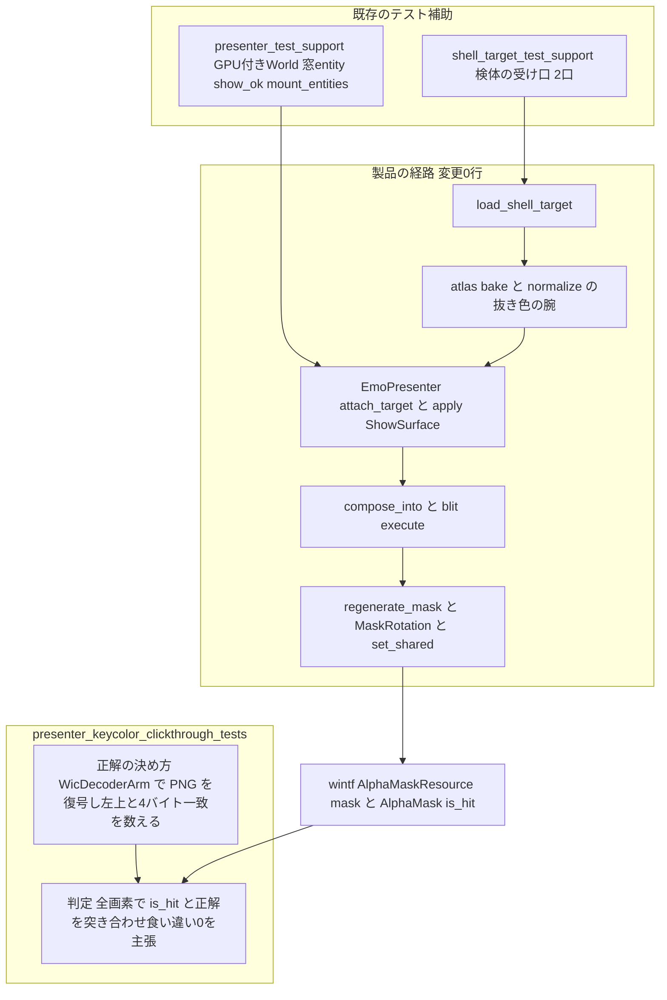
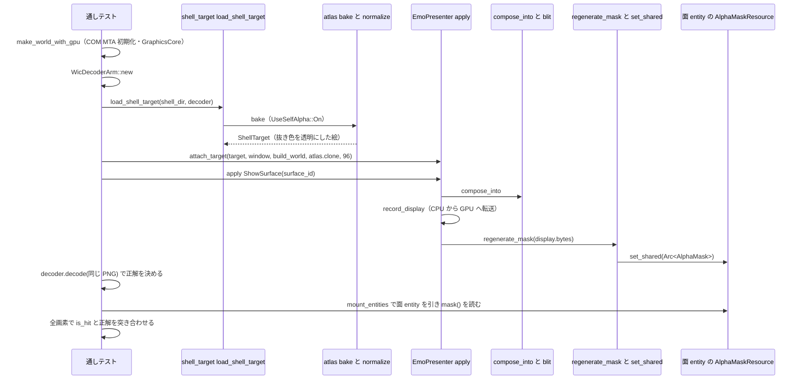

# Design Document: areka-P0-keycolor-clickthrough-coverage

> 2026-09-23。本文の引用は「そのファイルの何を定義している箇所か」で指し、行番号は書かない（本仕様自身が接続宣言を足すと行番号がずれるため）。引用した関数名・可視性・シグネチャはすべて本ブランチ HEAD `0c63a0f6`（製品コードは main `92f5f448` と同一）の実物を Grep／Read で確かめたものである。

## Overview

**Purpose**: 里々／YAYA の標準テンプレートの絵（α チャンネルを持たず、左上 1 画素と同じ色を抜いて透過させる絵）について、「抜き色で透明になった場所のクリックが背後の窓へ抜ける」（完了 spec `areka-P0-shell-implicit-surface` 要件 4.10）を、目視ではなく常時の決定論テスト 1 本で固定する。抜かれるのは**左上の画素と同じ色の画素**であり、絵の内側に在る同色の画素も抜かれる（`R_POST_and_KOMAINU` の抜き色は白、`konnoyayame` は緑）。テストはこの規則そのものを主張し、「絵の内側は全部『内』」という近似は主張しない。

**Users**: 開発者。途中の段（焼く・合成する・マスクを作る）のどこかで抜いた α が落ちる退行を、利用者に届く前に赤で止める。

**Impact**: 製品コードの振る舞いは **0 行**変えない。足すのはテストファイル 1 本と、それを繋ぐ接続宣言 3 行、テスト専用の受け口の可視性の書き換え 3 行、相乗り 3 件（較正テスト 1 本・本文走査の対象 3 本・example の私有関数 2 本の改名と説明文 4 か所）である。

### Goals
- 検体の実物を `load_shell_target` → `EmoPresenter::attach_target` → `apply(ShowSurface)` の製品と同じ順・同じ入口で通し、窓の面 entity に載った `AlphaMaskResource` のマスクを読んで、抜かれた画素で「外」・残った画素で「内」を全画素について主張する（要件 1）。
- 焼く・合成する・マスクの 3 段それぞれに「経路から外す」差し替えを 1 つずつ当て、テストが自身の主張で赤になることを実際に示す（要件 2）。
- 同じ完了 spec が残したテストの穴 3 件を、テストと example の中だけで閉じる（要件 3）。
- 製品コードの変更行数 0・GPU からの読み戻し 0 回・拡大率 k ≠ 1 の水準 0 本を、数として報告する（要件 5）。

### Non-Goals
- 抜き色の判定（`crates/areka-emo-atlas/src/normalize.rs`）・`MaskRotation`・wintf の当たり判定とクリック透過のトグルを変えること（要件 4）。
- `use_self_alpha` の宣言を読む経路・`.pna`・`full`・全画素が透明になる面・拡大率 k ≠ 1 の水準（マスクは原寸で作られ、÷k は wintf の `alpha_mask_hit` が 1 回だけ掛ける）。
- 実機の目視項目を `areka-P0-alpha-release-signoff` から外すこと。本テストが止めるのは退行であり、実機の確認の代わりではない。

## Boundary Commitments

### This Spec Owns
- 新規テストファイル `crates/areka-emo-present/src/presenter_keycolor_clickthrough_tests.rs`（通しテスト 1 本と、その中で使う正解の決め方・判定・較正・失敗の文言）。
- そのテストを繋ぐ接続宣言（`crates/areka-emo-present/src/presenter.rs` の末尾・3 行）。
- テスト専用の受け口の可視性の書き換え（`crates/areka-emo-present/src/shell_target.rs` の `#[cfg(test)] mod test_support;` を `pub(crate) mod` へ・1 行／`crates/areka-emo-present/src/shell_target_test_support.rs` の `r_post_and_komainu_shell_dir`・`konnoyayame_shell_dir` を `pub(super)` から `pub(crate)` へ・2 行）。
- 要件 2 の差し替え 3 段の定義・走らせ方・記録の形式（差し替えは一時的で、製品コードに残さない）。
- 相乗り 3 件: `crates/areka-emo-compose/src/sample_test_support.rs` の較正テスト 1 本／`crates/areka/src/placement/measure_template_tests.rs` の走査対象 3 本の追加／`crates/areka/examples/emo-present/setup.rs`・`crates/areka/examples/collision-probe/setup.rs` の私有 `fn build_shell_target` の改名と、`crates/areka/examples/collision-probe.rs`・`crates/areka/examples/window-placement.rs` の旧名を指す説明文の改名。
- 要件 5 の報告の文言と数。

### Out of Boundary
- `crates/areka-emo-atlas`・`crates/areka-emo-compose`・`crates/areka-emo-present`・`crates/wintf` の非テスト項目の振る舞い（1 行も変えない）。
- 既存の両端のテスト（`normalize_key_color_tests.rs`・`presenter/budget_tests.rs`）と `shell_target_template_tests.rs`（弱めず消さない）。
- 完了 spec `areka-P0-shell-implicit-surface`・`areka-P0-nar-install`・`wintf-clickthrough-alpha-toggle` の文書。
- wintf の `alpha_mask_hit` から先（`AlphaMask::is_hit` → クリック透過のトグル）。本仕様の観測点は「面 entity へ供給されたマスク」まで。
- 新しい公開 API・新しい依存・新しいテスト補助の新設（既存の補助で足りる。受け口の複製は要件 1.7 が禁じる）。

### Allowed Dependencies
- 公開 API: `areka_emo_present::shell_target::load_shell_target`・`ShellTarget::build_world`／`atlas`・`EmoPresenter::new`／`attach_target`／`apply`・`PresentCommand::ShowSurface`・`TargetId`・`areka_emo_atlas::WicDecoderArm`（`ElementDecoder::decode` → `DecodedImage` の公開欄）・`wintf::ecs::AlphaMaskResource::mask`・`wintf::ecs::widget::bitmap_source::AlphaMask::is_hit`／`width`／`height`。
- 既存のテスト補助（本クレート内・`#[cfg(test)]`）: `presenter_test_support.rs` の `make_world_with_gpu`・`spawn_window_with_dpi`・`show_ok`・`mount_entities`／`shell_target_test_support.rs` の検体の受け口 2 口。
- dev 依存（既存・追加 0）: `sample-ghost-kit`（検体の窓口）・`windows`。
- 依存方向の規律（`crates/areka-emo-present/src/lib.rs` の冒頭）を守る: テストは `areka-parsers → atlas → compose → present`（＋ `wintf`）の向きにしか import しない。

### Revalidation Triggers
- `load_shell_target`・`ShellTarget`・`attach_target`・`PresentCommand::ShowSurface` のシグネチャが変わる。
- `AlphaMaskResource`／`AlphaMask` の読み口（`mask()`・`is_hit`・閾値 α ≥ 128）が変わる。
- 検体の登記名（`R_POST_and_KOMAINU`・`konnoyayame`）・面の画像のファイル名・外形（236×462／140×160／260×390）が変わる。
- `presenter_test_support.rs`／`shell_target_test_support.rs` の補助の名前や可視性が変わる。
- 抜き色の規則（左上と 32bit 完全一致）が改訂される（そのときは本テストの正解の決め方も一緒に改訂する）。

## Architecture

### Existing Architecture Analysis

製品が実際に通る順（要件 Introduction の表・実物で再確認済み）:

| 段 | 入口 | 中で通る定義 |
|---|---|---|
| 読む・焼く | `pub fn load_shell_target(shell_dir: &Path, decoder: &impl ElementDecoder) -> Result<ShellTarget, ShellLoadError>`（`crates/areka-emo-present/src/shell_target.rs`） | 同ファイルの `pub fn build_shell_target` が `AlphaParams { use_self_alpha: UseSelfAlpha::On }` を `SurfaceSet` に載せて `areka_emo_atlas::bake` を呼ぶ → `crates/areka-emo-atlas/src/lib.rs` の `pub fn bake` が `Normalizer::key_color` を正規化の前に呼び `Normalizer.normalize` へ → `crates/areka-emo-atlas/src/normalize.rs` の `Normalizer::normalize` の `(UseSelfAlpha::On, AlphaSource::KeyColor)` の腕が `if *px == key { *px = [0, 0, 0, 0]; }` で左上と 4 バイト一致の画素を透明にする |
| 合成する | `EmoPresenter::attach_target(&mut self, _world, target: TargetId, window: Entity, emo_world: EmoWorld, atlas: AtlasTable, author_dpi: u16)`（`presenter/hub.rs`）→ `EmoPresenter::apply` に `PresentCommand::ShowSurface` | `presenter/show.rs` の `apply_show` が `target.budget.native_scratch(|scratch| target.composer.compose_into(scratch, …))` で合成 → `crates/areka-emo-compose/src/lib.rs` の `Composer::compose_into` → `crates/areka-emo-compose/src/blit.rs` の `pub(crate) fn execute` が出力先を全透明にクリアしてからトリム後の矩形の内側を乗算済み SourceOver で転写（`dst[di + 3] = source_over_channel(src_a, dst_a, inv_src_a)`） |
| マスクを作る | （同じ `apply_show` の中） | `record_display`（CPU → GPU の転送）→ 席の交代 → `target.budget.regenerate_mask(retired_mask, display.bytes(), display.width(), display.height(), display.stride())`（`presenter/budget.rs` の `FrameBudget::regenerate_mask` → `MaskRotation::regenerate` → `AlphaMask::from_pbgra32`／`regenerate_from_pbgra32`）→ `cache.insert` → `world.get_mut::<AlphaMaskResource>(mount.surface_entity())` に `set_shared(entry.mask.clone())` |
| 窓側（本仕様の外） | — | `crates/wintf/src/ecs/layout/hit_test/mod.rs` の `fn alpha_mask_hit` が `world.get::<AlphaMaskResource>(entity).and_then(|r| r.mask())` を最優先で読み `AlphaMask::is_hit`（`ALPHA_THRESHOLD = 128`・α ≥ 128 で「内」）で判定する |

テストが読むマスクと wintf が読むマスクは同じ `Arc<AlphaMask>` の中身である（`set_shared` は参照カウント増のみ・写しは無い）。GPU からの読み戻しは経路のどこにも無い（`record_display` の CPU → GPU の転送は起きる）。

**可視性の壁（唯一の細工）**: 検体の受け口は `shell_target.rs` が `#[cfg(test)] #[path = "shell_target_test_support.rs"] mod test_support;` で繋ぐ**私有モジュール**の中に `pub(super)` で在る。presenter 側の補助（`make_world_with_gpu`・`spawn_window_with_dpi`・`show_ok`・`mount_entities`）は `presenter.rs` が繋ぐ `mod test_support;` の中に `pub(super)` で在る。新しいテストはどちらか一方の配下にしか置けないので、もう一方を `pub(crate)` へ広げる。**モジュール自体が私有だと、中の関数を `pub(crate)` にしても外からは届かない**（Rust の可視性はモジュールの経路ごとに検査される）ので、関数 2 本に加えて `mod` 宣言も `pub(crate) mod` にする。

### Architecture Pattern & Boundary Map



**Architecture Integration**:
- Selected pattern: 既存の presenter 系テストと同じ「実 `apply` を駆動して面 entity の `AlphaMaskResource` を読む」形（`presenter_budget_equivalence_tests.rs` が同じ読み口を踏んでいる）。新しい抽象は作らない。
- Domain/feature boundaries: 正解はテスト自身が同じ PNG を復号した生の画素から決め、製品の 4 段（正規化・焼き・合成・マスク）の出力からは導かない。
- Existing patterns preserved: 兄弟ファイル＋`#[cfg(test)] #[path]` の接続宣言（`.kiro/steering/structure.md`）・検体は `sample_ghost_kit::SampleRoot` 経由のみ・GPU 資源の前提は `make_world_with_gpu`（MTA 初期化・実窓 0）。
- New components rationale: テストファイル 1 本だけ。共有補助は既存のものを可視性の書き換えで届かせる。
- Steering compliance: 常時テスト（`#[ignore]` 無し・環境変数ゲート無し・壁時計を合否に使わない）・ログ無し失敗経路の禁止は製品側の話であり本仕様は製品を触らない。

### Technology Stack

| Layer | Choice / Version | Role in Feature | Notes |
|-------|------------------|-----------------|-------|
| テスト（present） | Rust `cargo test -p areka-emo-present`・`bevy_ecs` World・wintf `GraphicsCore`＋`WucGraphicsResource` | 通しテストの実行環境 | 既存の presenter 系テスト 15 本と同一前提。新しい依存 0 |
| 復号（正解） | `areka_emo_atlas::WicDecoderArm`（WIC・COM MTA） | 同じ PNG を復号した生の画素 | `image` crate を dev 依存に足す案は不採用（承認事項・並べ替えとパレット展開をテストが担うことになる） |
| 検体 | `sample-ghost-kit`（既存 dev 依存） | `R_POST_and_KOMAINU`・`konnoyayame` の受け口 | 直パスは 1 か所も綴らない |

## File Structure Plan

### Directory Structure
```
crates/areka-emo-present/src/
├── presenter.rs                                   # 接続宣言 3 行を末尾の並びへ足す（#[cfg(test)] の中）
├── presenter_keycolor_clickthrough_tests.rs       # 新規: 通しテスト（本仕様の本体）
├── presenter_test_support.rs                      # 変更なし（make_world_with_gpu 等をそのまま使う）
├── shell_target.rs                                # `#[cfg(test)] mod test_support;` → `pub(crate) mod test_support;`（1 行）
└── shell_target_test_support.rs                   # 受け口 2 口を pub(super) → pub(crate)（2 行）＋冒頭の説明文に使い手 1 本を追記
crates/areka-emo-compose/src/
└── sample_test_support.rs                         # 較正テスト 1 本を追加（相乗り①）
crates/areka/src/placement/
└── measure_template_tests.rs                      # 走査対象に examples 3 本を追加（相乗り②）
crates/areka/examples/
├── emo-present/setup.rs                           # 私有 fn build_shell_target → load_shell_assets（定義・呼び出し・説明文）
├── collision-probe/setup.rs                       # 同上
├── collision-probe.rs                             # 冒頭説明文の doc リンク [`build_shell_target`] → [`load_shell_assets`]
└── window-placement.rs                            # 説明文「donor `build_shell_target`」→「donor `load_shell_assets`」
```

新規テストファイルの名前は `<stem>_<モジュール名>.rs` の規約どおり `presenter` ＋ `keycolor_clickthrough_tests`。同一ディレクトリに `presenter_keycolor…` から導出しうる別の本番ファイルは無い（実測・前向きの衝突なし）。

### Modified Files（変更の全数）

| ファイル | 何を変えるか | 要件 1.10 の分類 |
|---|---|---|
| `crates/areka-emo-present/src/presenter.rs` | 末尾の接続宣言の並びに `#[cfg(test)]` `#[path = "presenter_keycolor_clickthrough_tests.rs"]` `mod keycolor_clickthrough_tests;` を足す | 接続宣言 **3 行**（製品コードの変更行数には含めない） |
| `crates/areka-emo-present/src/shell_target.rs` | `#[cfg(test)] #[path = "shell_target_test_support.rs"] mod test_support;` の `mod` を `pub(crate) mod` へ | 可視性の書き換え **1 行**（`#[cfg(test)]` の付いた項目） |
| `crates/areka-emo-present/src/shell_target_test_support.rs` | `pub(super) fn r_post_and_komainu_shell_dir`・`pub(super) fn konnoyayame_shell_dir` を `pub(crate) fn` へ。冒頭の説明文（このファイルを使うテストの一覧・今日は 4 本）に `presenter_keycolor_clickthrough_tests.rs` を足す | 可視性の書き換え **2 行**（説明文の追記はテスト専用ファイルの中） |
| `crates/areka-emo-present/src/presenter_keycolor_clickthrough_tests.rs` | 新規 | テスト |
| `crates/areka-emo-compose/src/sample_test_support.rs` | `#[test] fn every_sample_receptor_points_at_a_real_folder` を追加 | テスト（`#[cfg(test)] mod` の中） |
| `crates/areka/src/placement/measure_template_tests.rs` | `#[test] fn the_examples_do_not_parse_the_shell_themselves` を追加 | テスト |
| `crates/areka/examples/emo-present/setup.rs` | 私有 `fn build_shell_target(decoder: &WicDecoderArm) -> Option<(EmoWorld, AtlasTable, u32, u32)>` の定義・`let shell = build_shell_target(&decoder);` の呼び出し・「log は build_shell_target 側で出済み」の説明文を `load_shell_assets` へ | example（製品コードではない・ロジック 0 行） |
| `crates/areka/examples/collision-probe/setup.rs` | 私有 `fn build_shell_target(shell_dir: &Path, decoder: &WicDecoderArm) -> Option<(EmoWorld, AtlasTable)>` の定義・`build_shell_target(&shell_dir, &decoder)` の呼び出し・「emo-present donor `build_shell_target` と同経路」の説明文を `load_shell_assets` へ | example（同上） |
| `crates/areka/examples/collision-probe.rs` | 冒頭説明文の ``[`build_shell_target`]`` を ``[`load_shell_assets`]`` へ | 説明文のみ |
| `crates/areka/examples/window-placement.rs` | `fn build_shell_material` の説明文「donor `build_shell_target` と同経路」を「donor `load_shell_assets` と同経路」へ | 説明文のみ |

製品コード（`#[cfg(test)]` の付いた項目の外）の変更行数: **0**。接続宣言: **3 行**。可視性の書き換え: **3 行**（`mod` 宣言 1・関数 2）。

## System Flows



流れの要点:
- COM の初期化は `make_world_with_gpu` が行う（`CoInitializeEx(None, COINIT_MULTITHREADED)`・解放しない）。`WicDecoderArm::new` はその**後**に同じスレッドで呼ぶ。`shell_target_test_support.rs` の `with_com_initialized`（末尾で `CoUninitialize` を呼ぶ）は使わない——GPU 資源が生きている間に COM を解放する形を作らないため。各テストは専用スレッドで走るので、他のテストの COM 参照回数と交差しない（既存の presenter 系テスト 15 本と同じ前提）。
- 面ごとに World を作り直さない。GPU 付き World 1 個・`EmoPresenter` 1 個に target 3 本（`TargetId(0)`＝`R_POST_and_KOMAINU` 面 0・`TargetId(1)`＝同 面 10・`TargetId(2)`＝`konnoyayame` 面 0）を装着する。`R_POST_and_KOMAINU` は `load_shell_target` を 1 回だけ呼び、`build_world()` を target ごとに呼ぶ（起動側 `build_boot_assets` がスコープごとに面の表を組むのと同じ形）。`atlas()` は `&AtlasTable` なので `clone()` して渡す（`AtlasTable` は `#[derive(Clone)]`・`Arc` 共有ゆえ安価）。窓 entity は target ごとに `spawn_window_with_dpi(&mut world, 96)`。
- GPU からの読み戻しは 0 回（`read_back` も呼ばない）。

## Requirements Traceability

| Requirement | Summary | Components | Interfaces | Flows |
|-------------|---------|------------|------------|-------|
| 1.1 | 同じ入口で読み・面の表を組み・装着し・`ShowSurface` を適用 | 通しテスト | `load_shell_target`・`build_world`・`attach_target`・`apply(ShowSurface)`（`show_ok`） | System Flows |
| 1.2 | wintf が読むのと同じ場所からマスクを読む | 通しテスト | `mount_entities(&presenter, target).0` → `world.get::<AlphaMaskResource>(entity).mask()` | 同上 |
| 1.3 | 正解は同じ PNG を復号した生の画素から | 正解の決め方 `keyed_pixels` | `WicDecoderArm::decode` → `DecodedImage { bgra, stride, width, height, has_alpha }` | 同上 |
| 1.4 | 全画素で「外」「内」を判定し食い違い 0 | 判定 `keyed_out_mismatch` | `AlphaMask::is_hit`／`width`／`height` | 同上 |
| 1.5 | 較正: 0 < 抜かれた画素 < 全画素 | 同上 | — | — |
| 1.6 | 面 10 と `konnoyayame` 面 0 | 通しテストの `FACES` 3 本 | 同上 | 同上 |
| 1.7 | 検体は受け口経由のみ・複製なし | `shell_target_test_support.rs` の受け口 2 口（`pub(crate)`） | `r_post_and_komainu_shell_dir`・`konnoyayame_shell_dir` | — |
| 1.8 | 常時テスト・実窓 0・読み戻し 0 | `make_world_with_gpu`・`spawn_window_with_dpi` | — | — |
| 1.9 | 名前と説明文 | テスト関数名と `//!` の説明文 | — | — |
| 1.10 | 製品コード 0 行・接続宣言と可視性は別に数える | File Structure Plan の表 | — | — |
| 2.1 | 3 段それぞれに「経路から外す」差し替え 1 つ | 差し替えの定義（下表） | — | — |
| 2.2 | 差し替えごとの記録・道連れの赤 | 記録の形式（下表） | — | — |
| 2.3 | 戻した後の赤 0 | 走らせ方（3 クレートの `cargo test`） | — | — |
| 2.4 | 再現できる粒度で tasks.md／検証報告へ | 記録の形式 | — | — |
| 3.1 | compose の受け口の較正 1 本 | `every_sample_receptor_points_at_a_real_folder` | `emo2_root`・`konnoyayame_shell_root` | — |
| 3.2 | 本文走査の対象に examples 3 本 | `the_examples_do_not_parse_the_shell_themselves` | 既存の `assert_no_blind_spot_literals`・`code_only`・`SHELL_PARSE` | — |
| 3.3 | 私有 `build_shell_target` 2 本の改名と説明文 4 か所 | 改名 `load_shell_assets` | — | — |
| 3.4 | 触るファイルの限定 | File Structure Plan の表 | — | — |
| 4.1 | `normalize.rs` の判定を変えない | Out of Boundary | — | — |
| 4.2 | `MaskRotation` を変えない | Out of Boundary | — | — |
| 4.3 | 既存の両端のテストと template テストを弱めない | Out of Boundary（差し替えの記録で道連れの赤を隠さない） | — | — |
| 4.4 | 完了 spec の文書を改訂しない | Out of Boundary | — | — |
| 4.5 | wintf 側に触れない | Out of Boundary（観測点は面 entity のマスクまで） | — | — |
| 4.6 | 実機の目視項目を外さない | Non-Goals・報告の文言 | — | — |
| 5.1 | 平易な文言 | 報告の文言 | — | — |
| 5.2 | 数の明示（0 行・0 回・0 本・転送は起きる） | 報告の文言 | — | — |
| 5.3 | 言わないこと 2 つ | 報告の文言 | — | — |
| 5.4 | 差し替えの記録を含める | 記録の形式 | — | — |

## Components and Interfaces

| Component | Domain/Layer | Intent | Req Coverage | Key Dependencies (P0/P1) | Contracts |
|-----------|--------------|--------|--------------|--------------------------|-----------|
| 通しテスト `presenter_keycolor_clickthrough_tests` | present のクレート内テスト | 3 面で「抜かれた画素＝外・残った画素＝内」を主張 | 1.1〜1.9 | 製品の経路（P0）・受け口 2 口（P0）・presenter 補助 4 本（P0） | State（読むだけ） |
| 正解の決め方 `keyed_pixels` | 同ファイル内の私有 fn | 同じ PNG を復号し、左上と 4 バイト一致の画素を「抜かれた」と定める | 1.3, 1.5 | `WicDecoderArm`（P0） | — |
| 判定 `keyed_out_mismatch` | 同ファイル内の私有 fn | 全画素で `is_hit` と正解を突き合わせ、食い違いを文言で返す（主張はテスト本体が 3 面まとめて行う） | 1.4, 1.6 | `AlphaMask`（P0） | — |
| 可視性の書き換え | テスト専用の受け口 | 受け口 2 口を presenter 配下のテストへ届かせる | 1.7, 1.10 | — | — |
| 差し替え 3 段 | 実装作業の手順（コードに残さない） | テストが赤になることの実証 | 2.1〜2.4, 5.4 | — | — |
| 相乗り ①②③ | compose のテスト・placement のテスト・examples | 完了 spec の残りの穴 3 件 | 3.1〜3.4 | — | — |

### present のクレート内テスト

#### 通しテスト `presenter_keycolor_clickthrough_tests`

| Field | Detail |
|-------|--------|
| Intent | 抜き色で透明になった場所のクリックが背後へ抜けることを固定するテスト |
| Requirements | 1.1, 1.2, 1.3, 1.4, 1.5, 1.6, 1.7, 1.8, 1.9 |

**Responsibilities & Constraints**
- ファイル冒頭の `//!` に、⑴ 何を固定するか（完了 spec `areka-P0-shell-implicit-surface` 要件 4.10）、⑵ 抜かれるのは「左上の画素と同じ色の画素」で絵の内側にも在ること（白／緑）、⑶ 製品と同じ順（焼く → 合成する → マスク）を同じ入口で通すこと、⑷ 読むマスクは wintf の当たり判定が読むのと同じ `Arc` の中身であること、⑸ 正解は製品の 4 段の出力から導かないこと、⑹ GPU からの読み戻しは 0 回・CPU から GPU への転送は `record_display` で起きること、を平易に書く（プロジェクト内の符牒は書かない）。
- import: `use super::*;`（`EmoPresenter`・`TargetId`・`AlphaMaskResource`・`World` などを presenter の束縛から拾う）／`use super::test_support::{make_world_with_gpu, mount_entities, show_ok, spawn_window_with_dpi};`／`use crate::shell_target::{ShellTarget, load_shell_target};`／`use crate::shell_target::test_support::{konnoyayame_shell_dir, r_post_and_komainu_shell_dir};`／`use areka_emo_atlas::{ElementDecoder, WicDecoderArm};`／`use wintf::ecs::widget::bitmap_source::AlphaMask;`。
- 検体の面の一覧（定数の表）:

  | 検体 | 面 | PNG のファイル名 | 外形 |
  |---|---|---|---|
  | `R_POST_and_KOMAINU` | 0 | `surface0000.png` | 236×462 |
  | `R_POST_and_KOMAINU` | 10（`surfaces.txt` に宣言の無い面） | `surface0010.png` | 140×160 |
  | `konnoyayame` | 0（パレット形式の PNG） | `surface0000.png` | 260×390 |

  ファイル名は受け口が返すシェルのフォルダに `join` する（`vendors/sample_ghost/` の直パスは綴らない）。
- 順序: `make_world_with_gpu()` → `WicDecoderArm::new()` → 検体ごとに `load_shell_target(&shell_dir, &decoder)`（`bake_errors()` が空であることを前提として主張）→ 面ごとに `spawn_window_with_dpi(&mut world, 96)`・`attach_target(&mut world, TargetId(n), window, target.build_world(), target.atlas().clone(), 96)`・`show_ok(&mut presenter, &mut world, TargetId(n), surface_id)` → 面ごとに `keyed_pixels` と `keyed_out_mismatch`、最後に 3 面の結果をまとめて主張。
- 主張しないこと: 「絵の内側は全部『内』」。主張するのは規則そのもの（左上と 4 バイト一致 ⇔ 外）。

**Dependencies**
- Inbound: なし（テスト）。
- Outbound: 製品の経路（`load_shell_target` → `attach_target` → `apply`）— P0／`WicDecoderArm`（正解）— P0／`presenter_test_support`・`shell_target_test_support` — P0。
- External: `sample-ghost-kit`（受け口の先）— P0（既存 dev 依存）。

**Contracts**: Service [ ] / API [ ] / Event [ ] / Batch [ ] / State [x]

##### State Management
- 読む状態: 装着した窓の面 entity（`mount_entities(&presenter, target).0`）に載る `AlphaMaskResource` の `mask()`（`Option<&AlphaMask>`）。`None` は「表示が成立していない」なので失敗（`expect`）。
- キャッシュのスロット（`CacheEntry::mask`）は読まない（要件 1.2）。
- `mask.width()`／`height()` が面の外形と一致することを判定に先立って主張する（外形が違えば座標の突き合わせが別の場所を見ている）。

##### 正解の決め方 `keyed_pixels`

```rust
/// 同じ PNG を復号した生の画素から「抜かれた画素」を定める（製品の正規化・焼き・合成・マスクの
/// どの出力からも導かない）。返り値は行優先・`width * height` 個の bool（true＝抜かれた）。
fn keyed_pixels(decoder: &WicDecoderArm, png: &Path) -> (Vec<bool>, u32, u32)
```
- `decoder.decode(png)` の `DecodedImage { width, height, stride, bgra, has_alpha }` を使う。`has_alpha == false` を前提として主張する（α 付きの絵に差し替わると抜き色の腕を通らず、本テストの前提が崩れる）。
- 左上の画素 `bgra[0..4]` と各画素 `bgra[y*stride + x*4 .. +4]` が **4 バイト完全一致**なら「抜かれた」。行の詰め物（`stride > width*4`）は読まない。
- 較正（要件 1.5）: 抜かれた画素の数 `n` が `0 < n < width*height` であることを主張する（実測の目安: `R_POST_and_KOMAINU` 面 0 で 59,831／109,032・面 10 で 11,816／22,400・`konnoyayame` 面 0 で 70,574／101,400。テストは目安の数を固定しない——固定すると検体の絵の差し替えで赤になり、本テストの目的である退行検出と混ざる）。
- 復号器は製品と共通だが、要件 1.3 が「導かない」と定めた 4 段の外である。復号器が壊れて全画素が同色になれば上の較正が止める。

##### 判定 `keyed_out_mismatch`

```rust
/// 面の外形の全画素について、抜かれた画素では `is_hit` が false・抜かれなかった画素では true で
/// あるかを調べる。食い違いがあれば件数と先頭 5 件の座標を載せた失敗の文言を返す。
fn keyed_out_mismatch(at: &str, mask: &AlphaMask, keyed: &[bool], w: u32, h: u32) -> Option<String>
```
- `assert_eq!((mask.width(), mask.height()), (w, h), "{at}: マスクの外形が PNG の外形と違う")`（前提なのでここで止める）。
- `for y in 0..h { for x in 0..w { let want_hit = !keyed[(y*w + x) as usize]; if mask.is_hit(x, y) != want_hit { mismatches.push((x, y, want_hit)); } } }`。
- 食い違いがあれば `"{at}: 抜き色の判定とマスクが {} 画素で食い違う（先頭 5 件 (x, y, 期待は内か): {:?}）"` を返す。先頭 5 件の形は `shell_target_template_tests.rs` の前例に揃える。
- テスト本体は 3 面の文言を集め、最後に `assert!(failures.is_empty(), "{}", failures.join("\n"))` で 1 回だけ主張する（実装 3.1 で改訂: 面ごとに止めると 1 面目の赤しか観測できず、要件 2 の差し替えで「3 面すべて赤」を 1 回の走行で示せないため）。
- `at` は「`R_POST_and_KOMAINU` 面 0」のように検体名と面の番号を持つ。

**Implementation Notes**
- Integration: 接続宣言は `presenter.rs` の末尾の並び（`budget_equivalence_tests`・`cache_capacity_tests` の後）へ同じ形で足す。
- Validation: 走らせ方は `cargo test -p areka-emo-present --lib keycolor_clickthrough`。
- Risks: ⑴ `make_world_with_gpu` は `GraphicsCore::new`（HARDWARE デバイス）を要る——既存の 15 本と同じ前提であり、本仕様で新しく増える前提ではない。⑵ `konnoyayame` 面 0 は `animation0`（まばたき・`sometimes`）を持つが、`PatternState::default()` で適用すればコマは重ならない（`shell_target_template_tests.rs` の前提と同じ）。

### テスト専用の受け口（可視性の書き換え）

| Field | Detail |
|-------|--------|
| Intent | 検体の受け口 2 口を presenter 配下のテストへ届かせる |
| Requirements | 1.7, 1.10 |

- `crates/areka-emo-present/src/shell_target.rs`: `#[cfg(test)] #[path = "shell_target_test_support.rs"] mod test_support;` → `pub(crate) mod test_support;`（属性 2 行はそのまま・1 行）。
- `crates/areka-emo-present/src/shell_target_test_support.rs`: `pub(super) fn r_post_and_komainu_shell_dir() -> PathBuf` → `pub(crate) fn`／`pub(super) fn konnoyayame_shell_dir() -> PathBuf` → `pub(crate) fn`（2 行）。`emo2_shell_dir`・`with_com_initialized`・`capture_events` は広げない（本テストは使わない）。
- 受け口の実体（`LazyLock<SampleRoot>` 3 つ）は 1 文字も変えない。複製は作らない。
- 案 B（テストを `shell_target` の兄弟に置き、presenter 側の補助 4 本と `mod test_support` を広げる）は、広げる数が 5 で案 A の 3 より多く、`presenter_test_support.rs` が `use super::*;` で presenter の束縛に依存している点でも不利なので採らない。

### 差し替え 3 段（要件 2）

| 段 | 差し替える箇所（定義） | 差し替えの内容（経路から外す形） | 本テストが赤になる理由 | 道連れで赤になる既存テスト（見込み・隠さず記録する） |
|---|---|---|---|---|
| 焼く | `crates/areka-emo-atlas/src/normalize.rs` の `Normalizer::normalize` の `(UseSelfAlpha::On, AlphaSource::KeyColor)` の腕にある `let key = Self::key_color(&img, params, has_pna);` | `let key: Option<[u8; 4]> = None;` に置き換える（腕の入力＝抜き色を無しに置き換え、腕は画素を変えずに返す。`bake` 側の `Normalizer::key_color` の呼び出しと `debug!` の記録はそのまま出る＝記録だけでは退行に気付けないことも同時に示す） | 抜かれるはずの全画素が α=255 のまま合成されマスクで「内」になる → 食い違い＝抜かれた画素の数（`R_POST_and_KOMAINU` 面 0 で 59,831 の目安）・3 面すべてで赤 | `normalize.rs` 内の抜き色の腕のテスト・`normalize_key_color_tests.rs`・`shell_target_template_tests.rs` の `r_post_and_komainu_shows_both_scopes_from_file_names_alone`（左上の α=0 の主張）。compose 側で `konnoyayame` を読む `base_image_tests.rs` の `konnoyayame_has_no_dangling_pattern_targets_with_images` は `surfaces.txt` の解析と画像名の一覧だけで焼かないので、道連れにならない |
| 合成する | `crates/areka-emo-compose/src/blit.rs` の `pub(crate) fn execute` の転写ループにある `dst[di + 3] = source_over_channel(src_a, dst_a, inv_src_a);` | `dst[di + 3] = 255;` に置き換える（**転写した画素の α を捨てて不透明で書く**。転写はトリム後の矩形の内側しか書かないので不透明になるのは矩形の内側だけだが、矩形の内側にも抜かれた画素が 3 面すべてで在る＝`R_POST_and_KOMAINU` 面 0 で 24,959・面 10 で 8,712・`konnoyayame` 面 0 で 51,984 の目安） | 矩形の内側の抜かれた画素がマスクで「内」になる → 3 面すべてで赤 | `blit.rs` 内の SourceOver のテスト・`areka-emo-compose` の合成 golden 群・`presenter_budget_equivalence_tests.rs`（便宜経路も同じ `execute` を通るので両者は一致するが、`assert_expected_is_not_empty` の「マスクに hit と非 hit の両方が在る」で止まる） |
| マスク | `crates/areka-emo-present/src/presenter/show.rs` の `apply_show` にある `target.budget.regenerate_mask(retired_mask, display.bytes(), …)` の第 2 引数 `display.bytes()` | `&vec![255u8; display.bytes().len()]` に置き換える（マスク生成へ表示バッファの代わりに全画素不透明のバッファを渡す） | 全画素が「内」になる → 食い違い＝抜かれた画素の数・3 面すべてで赤 | `presenter_budget_equivalence_tests.rs`（スロットのマスク・供給されたマスクの両方が独立再現と食い違う）。`budget_tests.rs` は `MaskRotation` を自前の画素で直に叩くので影響しない |

- いずれも「透明を運ぶ段の入力や出力を別の物に置き換える」形で、座標や値を少しずらす形（平行移動）ではない。
- 走らせ方（各差し替えごと）: `cargo test -p areka-emo-atlas`／`cargo test -p areka-emo-compose`／`cargo test -p areka-emo-present` の 3 本。道連れの赤はこの 3 本の出力にすべて現れる（`crates/areka` 側の `measure_template_tests.rs` は外形しか見ないので焼く段の差し替えでも緑のまま）。
- 記録の形式（tasks.md の完了記録または検証報告・要件 2.2／2.4／5.4）: 差し替えごとに ⑴ ファイルと「その箇所が何を定義しているか」 ⑵ 置き換えた前後の 1 行 ⑶ 走らせたコマンド ⑷ 赤になった本テストの名前と失敗の文言（食い違いの件数と先頭 5 件） ⑸ 道連れで赤になった既存テストの一覧 ⑹ 戻した後に同じ 3 本を走らせて赤 0 であること（`git diff --stat` が空であることを添える）。
- 差し替えは製品コードに残さない。作業は「差し替え → 走らせる → 記録 → `git checkout -- <ファイル>` で戻す → 走らせる → 赤 0 を記録」の順で 1 段ずつ行う。
- `git checkout -- <ファイル>` で戻せるのは、差し替える 3 ファイル（`normalize.rs`・`blit.rs`・`show.rs`）に本仕様の意図した変更が 1 行も無いからである。実装中にこれらのファイルへ別の変更を置かない（置くと戻す手順ごと消える）。

### 相乗り 3 件（要件 3）

#### ① compose の受け口の較正

- 置き場: `crates/areka-emo-compose/src/sample_test_support.rs` の中（`lib.rs` が `#[cfg(test)] mod sample_test_support;` で繋ぐテスト専用ファイル・触るファイル 1 本で済む。`shell_target_test_support.rs` の `every_sample_receptor_points_at_a_real_shell_folder` と同じ形）。
- 内容: `#[test] fn every_sample_receptor_points_at_a_real_folder()` — `konnoyayame_shell_root().join("surfaces.txt").is_file()` と `emo2_root().join("shell").join("master").is_dir()` を、失敗の文言に受け口の名前と指す先のパスを添えて主張する。
- 走らせ方: `cargo test -p areka-emo-compose --lib every_sample_receptor`。

#### ② 本文走査の対象に examples 3 本

- 置き場: `crates/areka/src/placement/measure_template_tests.rs`（336 行・追記の余地あり）。
- 内容: `#[test] fn the_examples_do_not_parse_the_shell_themselves()` — 次の 3 本を `(ファイル名, include_str!)` の配列で回し、既存の `assert_no_blind_spot_literals(raw, file)` → `code_only(raw)` → `!code.contains(SHELL_PARSE)` をそのまま使う。走査器は変えない（3 本とも今日の本文の `shell::parse` は 0 件・生文字列と二重引用符の文字リテラルも 0 件＝実測）。
  - `include_str!("../../examples/emo-present/setup.rs")`
  - `include_str!("../../examples/collision-probe/setup.rs")`
  - `include_str!("../../examples/window-placement.rs")`
- `use` で名前を持ち込むだけの `emo-present.rs`・`collision-probe.rs` は対象に含めない（要件 3.2 が定める 3 本に限る）。
- 同ファイルの `assert_no_blind_spot_literals` の説明文「走査対象の 4 ファイルは今日どちらも 0 件」は対象が増えるので「走査対象のファイルは今日すべて 0 件」へ改める。

#### ③ 私有 `fn build_shell_target` 2 本の改名

- 新しい名前: **`load_shell_assets`**（「読み込みの権威 `load_shell_target` を呼んで装着素材を返す」の意。公開の `areka_emo_present::build_shell_target`・`crates/areka/src/placement/measure.rs` の `build_shell_assets`・`window-placement.rs` の `build_shell_material` のどれとも異なる。リポジトリ内に同名は 0 件＝実測）。
- 触る箇所（ロジックの変更 0 行）:
  - `crates/areka/examples/emo-present/setup.rs`: 定義 `fn build_shell_target(decoder: &WicDecoderArm) -> Option<(EmoWorld, AtlasTable, u32, u32)>`・呼び出し `let shell = build_shell_target(&decoder);`・説明文「log は build_shell_target 側で出済み」。
  - `crates/areka/examples/collision-probe/setup.rs`: 定義 `fn build_shell_target(shell_dir: &Path, decoder: &WicDecoderArm) -> Option<(EmoWorld, AtlasTable)>`・呼び出し `build_shell_target(&shell_dir, &decoder)`・説明文「emo-present donor `build_shell_target` と同経路」。
  - `crates/areka/examples/collision-probe.rs`: 冒頭説明文の ``[`build_shell_target`]``（doc リンク）。リンクの形は変えない——指す先は改名の前後とも `collision-probe/setup.rs` の私有関数で、`cargo doc` は関門ではない（`structure.md`）。要件 3.3 が求めるのは旧名を指したまま残さないことである。
  - `crates/areka/examples/window-placement.rs`: `fn build_shell_material` の説明文「donor `build_shell_target` と同経路」。
- 確認: `cargo build -p areka --examples` が通る。`grep -rn build_shell_target crates/areka/examples/` が 0 件になる。

## Data Models

本仕様が扱うデータは既存の型だけで、新しい型は作らない。

- `DecodedImage { width: u32, height: u32, stride: u32, bgra: Vec<u8>, has_alpha: bool }`（`areka_emo_atlas::decode`・公開欄）: 正解の出どころ。
- `AlphaMask`（`wintf::ecs::widget::bitmap_source`）: `is_hit(x, y) -> bool`（α ≥ 128 で true・範囲外は false）・`width()`・`height()`。`#[derive(PartialEq)]`。
- `AlphaMaskResource`（`wintf::ecs`）: `mask() -> Option<&AlphaMask>`。`set_shared(Arc<AlphaMask>)` で供給される。
- テスト内の値: `keyed: Vec<bool>`（行優先・`width*height`）・`mismatches: Vec<(u32, u32, bool)>`。

## Error Handling

テストの失敗はすべて `assert!`／`expect` の文言で原因を名指しする（黙って緑にならない）:

| 場面 | 文言の要点 |
|---|---|
| 検体が読めない | `load_shell_target` の `Err` を `unwrap_or_else` で検体名とフォルダ付きで panic |
| 焼く段で落ちた絵がある | `bake_errors()` が空でない（要件の前提は 0 件） |
| PNG が α を持つ | `has_alpha` が true（抜き色の腕を通らない＝前提が崩れた） |
| 全画素が同色／どの画素も抜かれない | 較正（0 < n < 全画素）で止まる |
| マスクが供給されていない | `mask()` が `None`（表示が成立していない） |
| 外形が違う | マスクの外形 ≠ PNG の外形（座標の突き合わせが別の場所を見ている） |
| 食い違い | 件数と先頭 5 件の `(x, y, 期待は内か)` |

製品側のログ（`bake` の抜き色の `debug!`・`apply_show` の `info!`）は本テストの合否に使わない。

## Testing Strategy

- **通しテスト（1 本・3 面）**: `keyed_out_pixels_leave_the_hit_mask_and_the_rest_stay_inside`（`crates/areka-emo-present/src/presenter_keycolor_clickthrough_tests.rs`）。`R_POST_and_KOMAINU` 面 0・面 10・`konnoyayame` 面 0 について、⑴ 復号した PNG が α 無し ⑵ 0 < 抜かれた画素 < 全画素 ⑶ マスクの外形 = PNG の外形 ⑷ 全画素で「抜かれた ⇔ 外」の食い違い 0、を主張する。
- **差し替えの実証（3 段・コードに残さない）**: 上の表のとおり。各段で本テストが自身の主張 ⑷ で赤になることと、道連れの既存テストを記録する。
- **相乗り**: ① `every_sample_receptor_points_at_a_real_folder`（compose）／② `the_examples_do_not_parse_the_shell_themselves`（placement）／③ `cargo build -p areka --examples` と `grep` 0 件。
- **弱めない・消さない**: `normalize_key_color_tests.rs`・`presenter/budget_tests.rs`・`shell_target_template_tests.rs` は 1 行も触らない。
- **常時テストの条件**: 実窓 0・他プロセスの可視窓 0・壁時計を合否に使わない・`#[ignore]` 無し・環境変数ゲート無し。GPU 資源の前提は `make_world_with_gpu`（既存の 15 本と同一）。
- **最終確認**: `cargo test -p areka-emo-atlas`・`cargo test -p areka-emo-compose`・`cargo test -p areka-emo-present`・`cargo test -p areka --bin areka placement`・`cargo build -p areka --examples` がすべて緑。`git diff --stat` で触ったファイルが File Structure Plan の表と一致する。

## Performance & Scalability

- 実行時間の見積もり（research.md §8-2 の解決）: 本テストが足すのは、実物の PNG の焼き 2 検体ぶん（`shell_target_template_tests.rs` の 1 テストと同量）・GPU 付き World 1 個（`presenter_budget_equivalence_tests.rs` は 1 テストで 3 個）・`ShowSurface` 3 回・正解のための復号 3 枚・画素の走査 約 233,000 画素（`u32` の比較だけ）である。既存の同種テストの枠内に収まる。較正の実測（2026-09-23・本ブランチ）: `cargo test -p areka-emo-present --lib -- template_tests budget_equivalence_tests` の 6 本（実物の焼き 2 検体 × 3 テスト＋GPU 付き World 3 個 × 2 テスト）が **0.86 秒**で終わる。本テストはその 1 テストぶん未満の仕事量なので、面ごとに World を作り直す案は採らず、追加の計測も要らない。
- GPU: 読み戻し 0 回。`record_display` の CPU → GPU の転送（原寸の D2D bitmap を 3 面ぶん作る）は起きる。

## Supporting References

- 完了 spec `areka-P0-shell-implicit-surface` 要件 4.10（`.kiro/specs/completed/areka-P0-shell-implicit-surface/requirements.md`）— 固定する対象。改訂しない。
- 完了 spec `wintf-clickthrough-alpha-toggle` — マスクから先の所有者。
- `.kiro/steering/structure.md`「Unit Tests (in-source `#[cfg(test)]`)」— 兄弟ファイルと接続宣言の規約。
- `research.md` §2（実測）・§5（案 A/B/C）・§6（設計で決めた 10 項目）・§8（持ち越しの解決）・§9（設計フェーズの記録）。
