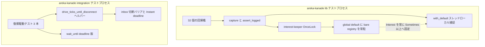
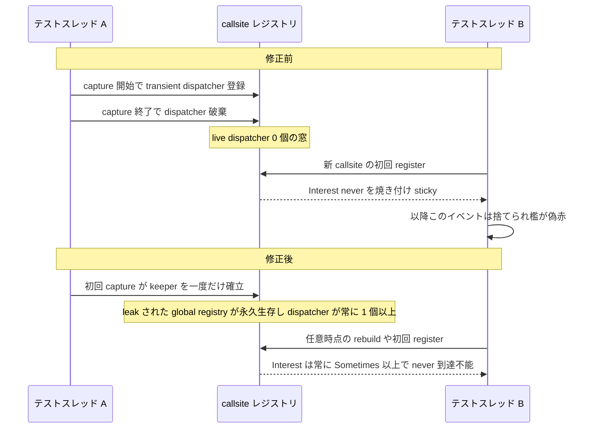
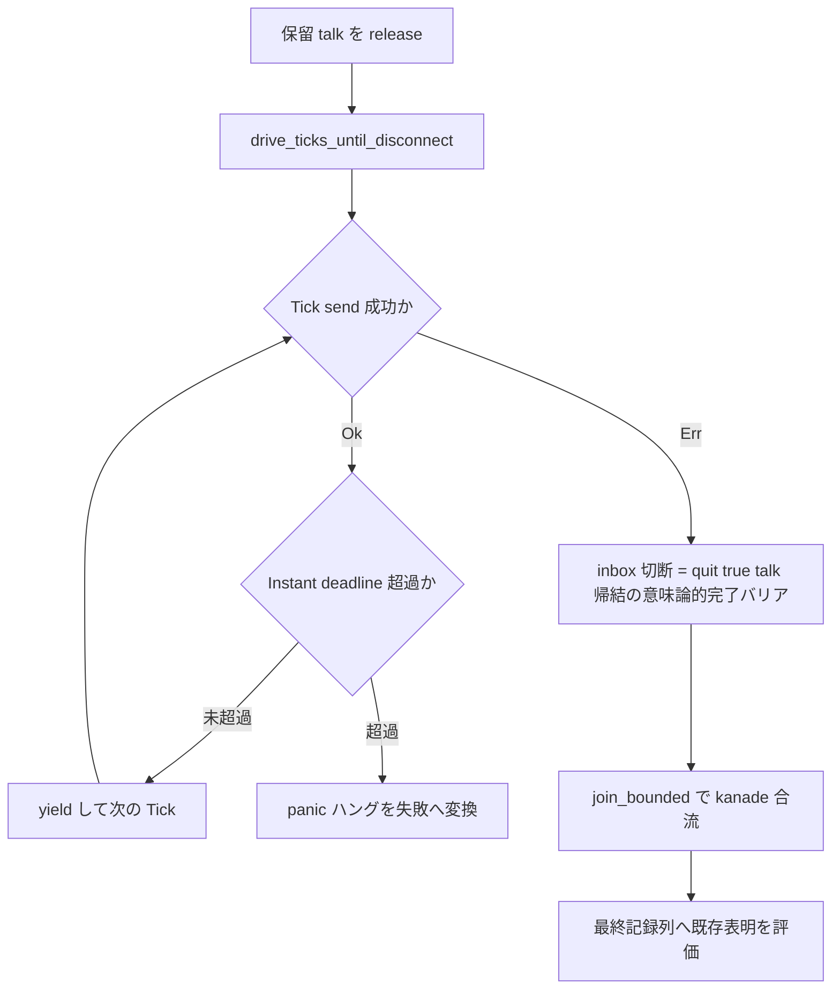
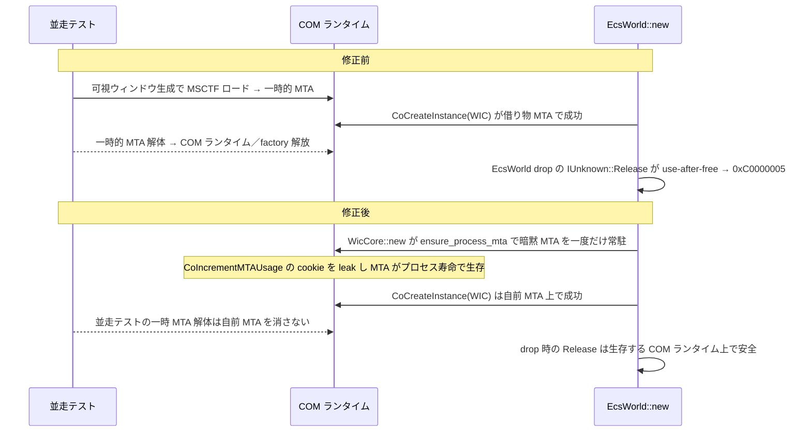

# 技術設計: areka-P0-log-capture-determinism

## Overview

**Purpose**: 本機能は、`areka-kanade` のテスト専用ログ捕捉基盤 `log_capture.rs` が `cargo test --workspace` 並列負荷下で ~1/10〜1/20 の確率で捕捉対象イベントを取りこぼす欠陥（tracing-core callsite Interest の `Never` 焼き付き）を根治し、全 spec の kiro-complete DoD Test Gate を決定論的に緑へ固定する。

**Users**: テストスイートを実行する開発者・32 個の回帰檻を保守する開発者が、確率的な偽赤を疑うことなく `cargo test --workspace` の結果を信頼できるようになる。

**Impact**: 変更は主に areka-kanade のテスト基盤に完結する。(1) `log_capture.rs` へプロセスグローバル interest-keeper を ~15 行前置し、(2) 同一境界の二次修正として、復帰駆動テスト 3 箇所の「反復回数上限＝時間の代用」ループを意味論的完了バリア＋壁時計 deadline へ置換する。areka-kanade の本番（非テスト）コード・`capture`/`assert_logged` の API・32 檻はすべて無改変。加えて (3) **4.4 検証で判明した第二の workspace ゲート flake**（wintf `--test layout` の COM 借り物寿命 use-after-free・0xC0000005・~13%）を、本セッションの開発者判断で本 spec に取り込み、`WicCore` へプロセス寿命 MTA キーパーを導入して根治する（Req 9・interest-keeper と同型の「keeper による構造的根絶」）。この (3) のみ wintf の本番コード（`wic_core.rs` の COM 寿命・`world/mod.rs` の無言スキップへのログ付与）に限定して触れる。

### Goals

- `cargo test --workspace` 並列負荷下での log 捕捉檻の取りこぼしゼロ（連続 5 回以上・失敗 0 件）
- `capture`/`assert_logged` の API・意味論・呼出 10 箇所・32 檻の完全不変
- TRACE を含む全レベルの捕捉維持（`actor.rs:647` の TRACE 檻の安全）
- 復帰駆動ループ 3 箇所＋`wait_until` の上限非依存決定論化（CPU 飢餓下でも偽赤せず、ハングは壁時計 deadline で失敗へ変換）
- keeper は RED→GREEN ストレス証拠、R7' は構造証明＋回帰緑で有効性を確認

### Non-Goals

- `capture`/`assert_logged` のシグネチャ変更・檻の書き換え
- areka-kanade 本番コード・kanade 本体の挙動・ログ語彙・イベント語彙の変更
- tracing / tracing-subscriber のバージョン更新・差し替え
- 他クレート（wintf 等）のテスト基盤への横展開・wintf の Req 9 修正（`WicCore` の COM 寿命＋`world/mod.rs` のログ付与）を超える wintf 本体挙動の変更
- cargo-deny advisories への新規 allow 追加
- R7' 対象ループへの integration-exe ストレスや飢餓の人工再現（討議#2 で棄却済み）

## Boundary Commitments

### This Spec Owns

- `crates/areka-kanade/src/schedule/log_capture.rs` の interest-keeper 機構とモジュール doc（PITFALL 節）
- areka-kanade テストハーネスの復帰駆動イディオム: `drive_ticks_until_disconnect` ヘルパー（common/mod.rs 新設）と、それを消費する 3 テストのループ置換・`wait_until` の deadline 化
- （Req 9・本セッション取込）wintf `WicCore` の COM アパートメント寿命の決定論化: `crates/wintf/src/ecs/widget/bitmap_source/wic_core.rs` へのプロセス寿命 MTA キーパー導入 ＋ `crates/wintf/src/ecs/world/mod.rs:62` の無言スキップへの `error!` 付与
- 本仕様の検証手順（RED→GREEN ストレス・wintf ストレス・workspace 反復）の定義と実施

### Out of Boundary

- `capture`/`assert_logged` の公開シグネチャ・32 檻の本文・呼出 10 箇所（actor.rs ×4・schedule/mod.rs ×6・boot.rs ×1）
- areka-kanade 本番（非テスト）コード全域。kanade 状態機械・ログ発行側は 1 文字も変えない
- 他クレートのテスト基盤・tracing 系依存のバージョン
- wintf の Req 9 修正**以外**の挙動全域（`WicCore` の COM 寿命と `world/mod.rs:62` のログ付与のみが対象・WIC のデコード意味論・factory 利用側・他システムは無改変）
- areka-P0-input-events のマージ作業（本仕様マージの帰結として別 worktree で実施される Downstream・brief.md Part B）

### Allowed Dependencies

- std `OnceLock`（keeper の一度だけ確立）・std `Instant`（壁時計 deadline）
- `tracing`（workspace 既存 dep）: `tracing::subscriber::set_global_default`・`tracing::callsite::rebuild_interest_cache`
- `tracing-subscriber`（workspace 既存 dev-dep）: `tracing_subscriber::registry()`
- （Req 9）`windows`（wintf 既存 dep）: `windows::Win32::System::Com::CoIncrementMTAUsage`（`CoCreateInstance` 等と同一 `Win32_System_Com` feature・既に有効）。`tracing::error!`（wintf 既存の log ファサード）
- **新規依存の追加は禁止**（`ctor`・`tracing-test` 等は棄却済み・research.md §10）

### Revalidation Triggers

- tracing / tracing-core / tracing-subscriber のバージョンが Cargo.lock で動いた場合（Interest キャッシュ内部仕様への依存があるため、行番号根拠 R-1〜R-4 の再確認が必要）
- log_capture.rs に per-layer filter や別のグローバル subscriber 初期化を導入する変更（keeper の expect が panic する設計＝先に本設計の不変条件を見直すこと）
- areka-kanade テストへ「反復回数上限を時間の代用にする」ループを再導入する変更（本設計のヘルパーを使うこと）
- （Req 9）`windows` crate のバージョンが Cargo.lock で動いた場合（`CoIncrementMTAUsage` / `CO_MTA_USAGE_COOKIE` の feature・シグネチャ・Drop 挙動の再確認）、または `WicCore::new` へ別の COM 初期化を導入する変更（keeper の不変条件を先に見直すこと）

## Architecture

### Existing Architecture Analysis

`log_capture.rs`（98 行・`#[cfg(test)]` 配下）は「`capture()` が呼び出しごとに `tracing_subscriber::registry().with(CaptureLayer)` を組み、`with_default` でスレッドローカルに差し込み、クロージャ内のイベントを `Arc<Mutex<Vec<CapturedEvent>>>` へ積んで `mem::take` で回収する」transient dispatcher 方式である。欠陥機構（tracing-core 0.1.36・一次ソース検証済み・research.md §8）:

1. callsite Interest キャッシュの rebuild は live dispatcher が 0 個だと `Interest::never` を焼き付ける（`callsite.rs:505` `unwrap_or_else(Interest::never)`・sticky・次の dispatcher 登録まで復活しない）
2. 併発して max-level hint が `OFF` に落ちる窓もある（`callsite.rs:408→421`・`event!` マクロの静的チェックで捨てられる）
3. 並列テストで transient dispatcher が全滅した瞬間に、別スレッドの callsite 初回 `register()` が走ると発症。既定の `NoSubscriber::register_callsite` は `Interest::never()`（`subscriber.rs:676-678`）で何も支えない

二次対象の復帰駆動テスト 3 箇所（`steady_test.rs:821`・`close_test.rs:170`・`close_test.rs:806`）は同形の `'drive: for i in N..=500` ループで、Tick 供給と観測 polling を反復回数上限（500×64 yield）で打ち切る——CPU 飢餓（Defender 再スキャン等・steering 既知の病）下で空回りし尽くして偽赤する。`close_test.rs:57` の `wait_until`（100,000 yield 有界）も同病の亜種。

### Architecture Pattern & Boundary Map

選択パターン: **プロセスグローバル interest-keeper の前置**（Option A・brief Part A 確定案）＋**意味論的完了バリアへのループ置換**（討議#1 確定）。



**Architecture Integration**:

- 既存パターン保持: transient `with_default` 捕捉・`mem::take` 回収・`CaptureLayer`/`EventFieldVisitor` は無改変。keeper は `capture()` 先頭への 1 呼出前置のみ
- 新規要素の根拠: `set_global_default(registry())` は subscriber Arc を leak し（`dispatcher.rs:314-319`）registrar が永久生存 → 以降のあらゆる rebuild で dispatcher ≥1 が保証され、`Interest::never` 焼き付き（`callsite.rs:505`）が**構造的に到達不能**になる
- 境界分離: keeper は lib テストプロセスのみに存在（`#[cfg(test)]` の src 内モジュール）。integration exe には log_capture 自体が無く、二次修正（tests/ 側）とはプロセスも差分も独立
- Steering 適合: deterministic-test-coverage-mandate（確率的失敗の根絶）・areka-log-first-no-silent-failure（keeper 失敗は expect で大声）・logging.md「ライブラリは Subscriber 初期化しない」は本番境界の規律であり、テストプロセス内 keeper は不抵触（research.md §8）

### Key Design Decisions（DD 最終確定・詳細根拠は research.md §9）

| # | 決定 | 要点 |
|---|---|---|
| DD-1 | keeper は初回 `capture()` 呼出時に lazy 確立 | 1.3 の文言どおり。初回 capture 以前に焼き付いた callsite も、keeper 確立（`Dispatch::new` → `callsite::register_dispatch` → 全 callsite rebuild・`callsite.rs:484-488`）の瞬間に治癒される |
| DD-2 | `rebuild_interest_cache()` を keeper 内で明示呼出 | 理論上は登録時 rebuild で十分だが、保険＋意図の自己文書化（コスト 0）。`tracing::callsite::rebuild_interest_cache` は `#[doc(hidden)]` 再エクスポート経由の公開パス（tracing lib.rs:963-966・semver 慣行は弱いが Cargo.lock 固定＋Revalidation Triggers で捕捉。万一将来消えても keeper 本体の登録時 rebuild だけで根治が成立する耐性あり） |
| DD-3 | fail-loud は `.expect()` 一発 | 失敗原因は「先行する外部 global subscriber」の単一系。メッセージへ原因＋対処を焼き込む（5.1/5.2） |
| DD-4 | bare registry のグローバル常駐は無害 | capture 外イベントは Registry の `event` no-op（sharded.rs:288）へ落ち、従来の NoSubscriber と観測可能な差なし。shadow 意味論（`dispatcher.rs:379-398`）により capture 内イベントは thread-local のみに配送＝混在なし（2.3/2.4） |
| DD-5 | module doc は「決定性の要（PITFALL）」節へ統合追記 | 根本原因（行番号引用）＋keeper 機構＋不変条件「本モジュールより先に global subscriber を設定しない」。旧 `Arc::try_unwrap` 注記（79-83 行）は履歴として保持 |
| DD-6 | RED→GREEN はコマンド手順（本書記載）・スクリプト非コミット | 一回性の証拠取り・外部 CI 無し。討議#2 の証拠形式分離に従う（8.1〜8.5） |
| DD-7 | 復帰駆動は共有ヘルパー `drive_ticks_until_disconnect` へ一般化 | 同形 3 ループの三重複を単一契約に集約し、上限依存ループの再発明を構造的に防ぐ（7.1〜7.3） |
| DD-8 | workspace gate は i686 前提ビルド＋PowerShell＋submodule 初期化を明記 | steering: workspace-test-needs-i686-host32-artifacts / harness-shell-quirks |
| DD-9 | wintf WIC は `WicCore` が自ら**プロセス寿命 MTA キーパー**を持つ（`CoIncrementMTAUsage`・cookie を leak＝decrement しない） | interest-keeper と同型。`WicCore::new()` 先頭で一度だけ `CoIncrementMTAUsage` を確立（`OnceLock` ガード）→ 以降 `CoCreateInstance` は実装で apartment を借りず自前 MTA 上で成功し、COM ランタイムが factory より長生きして use-after-free（`IUnknown::Release`）が構造的に到達不能。cookie は `CO_MTA_USAGE_COOKIE`（`!Send`）ゆえ static 保持せず**意図的 leak**（プロセス寿命 MTA が目的・CoDecrementMTAUsage は呼ばない）。失敗（極稀）は `?` で `Err` 伝播（panic しない・`WicCore::new` の既存 `Result` 契約）。**棄却案**: テスト側だけで `CoInitializeEx` する小細工＝本番の潜在 use-after-free を残すため不採用（steering: canonical-not-minimal-lifecycle）。`world/mod.rs:62` の生成失敗無言スキップには `error!` を付す（Req 9.4・log-first） |

### Technology Stack

| Layer | Choice / Version | Role in Feature | Notes |
|-------|------------------|-----------------|-------|
| テスト基盤 | tracing 0.1.44 / tracing-core 0.1.36（transitive） | `set_global_default`・`rebuild_interest_cache`・Interest 機構 | Cargo.lock 固定・変更禁止（6.3） |
| テスト基盤 | tracing-subscriber 0.3.23（dev-dep 既存） | `registry()`（keeper の中身・per-layer filter 無し） | `register_callsite=always`・`event` no-op を一次確認済み |
| 言語ランタイム | Rust std（`OnceLock`・`Instant`） | keeper の一度だけ確立・壁時計 deadline | 新規依存ゼロ |
| 実行環境 | PowerShell（ビルド/テスト実行） | RED→GREEN ストレス・workspace 反復 | Git Bash の link.exe 遮蔽罠を回避（steering） |

## File Structure Plan

新規ファイルなし（テストハーネスへのヘルパー追加のみ）。すべて areka-kanade クレート内・テスト専用コード。

### Modified Files

- `crates/areka-kanade/src/schedule/log_capture.rs` — interest-keeper（`INTEREST_KEEPER: OnceLock<()>` static ＋ `install_interest_keeper()` fn・~15 行）を追加し `capture()` 先頭で呼ぶ。モジュール doc「決定性の要（PITFALL）」節へ根本原因と keeper 機構・不変条件を統合追記。**他の既存要素（CapturedEvent/EventFieldVisitor/CaptureLayer/capture 本体/assert_logged）は無改変**
- `crates/areka-kanade/tests/kanade/common/mod.rs` — `drive_ticks_until_disconnect(sender, first_tick_second, what)` ヘルパーを新設（`join_bounded`・`DEFAULT_TIMEOUT` と同居・同系の Instant deadline 定石）
- `crates/areka-kanade/tests/kanade/steady_test.rs` — `talk_completion_resumes_get_pump_ref3_one_status_none` の `'drive` ループ（821 行付近）をヘルパー呼出へ置換。`resumed` フラグ・64-yield 内側ループ・中間 assert を削除（join 後の既存最終表明 (2) が復帰意味論を担う）。doc コメントの駆動説明を更新
- `crates/areka-kanade/tests/kanade/close_test.rs` — (a) `wait_until`（57 行）を Instant deadline 版へ置換（シグネチャ不変・呼出 3 箇所 671/789/959 は無改変）。(b) `close_refused_resumes_pump_then_terminates_via_resumed_talk` の `'drive` ループ（170 行付近）と `boot_greeting_talkdone_resumes_get_pump` の `'drive` ループ（806 行付近）をヘルパー呼出へ置換し、ループ内観測・フラグ・中間 assert を削除（join 後の既存最終表明 (c)/(d)・(b) が担う）。doc コメント更新
- （Req 9・wintf 本番）`crates/wintf/src/ecs/widget/bitmap_source/wic_core.rs` — `WicCore::new()` の `CoCreateInstance` 前へプロセス寿命 MTA キーパー確立（`OnceLock` ガードの `ensure_process_mta()`＋`CoIncrementMTAUsage`・cookie 意図的 leak）を前置。SAFETY doc（現 21-30 行の「本プロセスは MTA で初期化される**前提**」）を「`WicCore` が自ら MTA を**強制**する」へ更新。**factory 型・`factory()`・利用側は無改変**
- （Req 9・wintf 本番）`crates/wintf/src/ecs/world/mod.rs` — `WicCore::new()` の生成失敗を握る `if let Ok`（62 行付近）へ `Err` 側の `error!`（log-first）を付す。縮退挙動（factory 無しで継続）自体は不変

> 境界整合: 変更 4 ファイルはすべて Boundary Commitments「This Spec Owns」の範囲内。src 側は log_capture.rs のみ・tests 側は復帰駆動イディオムのみ。
> 「検証手順」コンポーネント（Components and Interfaces 参照）は**意図的にファイルを持たない**——RED→GREEN ストレスは一回性の証拠取りでありスクリプトをコミットしない（DD-6）。手順の正本は本書 Testing Strategy。

## System Flows

### 欠陥機構と keeper による遮断



### R7' 復帰駆動の新構造（3 テスト共通）



因果連鎖（駆動が完了する必然性）: 復帰 → 復帰後 Tick の GET pump → fixture Value → steady talk（quit:true）→ 終了系列 → kanade スレッド終了 → Receiver drop → `send` Err。復帰しない欠陥時はこの連鎖が起きず send が成功し続け、deadline がハングでなく失敗として検出する（7.3・8.5 の非空虚性経路）。

### WIC 借り物寿命の遮断（Req 9・keeper による根絶）



## Requirements Traceability

| Requirement | Summary | Components | Interfaces | Flows |
|-------------|---------|------------|------------|-------|
| 1.1 | 並列負荷下でクロージャ内イベントを取りこぼさない | interest-keeper | `install_interest_keeper` | 欠陥機構と遮断 |
| 1.2 | Interest の Never 焼き付きを発生させない | interest-keeper | 同上（leak 常駐で `callsite.rs:505` 到達不能） | 同上 |
| 1.3 | 初回 capture で keeper を一度だけ確立 | interest-keeper | `OnceLock::get_or_init`（DD-1） | 同上 |
| 1.4 | workspace 連続 5 回以上失敗 0 | 検証手順 | Gate 手順（DD-8） | — |
| 2.1 | `capture`/`assert_logged` シグネチャ不変 | interest-keeper | capture 先頭 1 行前置のみ | — |
| 2.2 | 呼出 10 箇所を無改変でコンパイル・成功 | interest-keeper | 同上 | — |
| 2.3 | スレッドローカル捕捉の意味論不変 | interest-keeper | shadow 意味論（`dispatcher.rs:379-398` 一次確認） | — |
| 2.4 | 捕捉列の相互混在なし | interest-keeper | capture 内イベントは thread-local のみに配送（DD-4） | — |
| 3.1 | TRACE イベントを捕捉・照合可能 | interest-keeper | bare registry `Interest::always`（sharded.rs:222-228） | — |
| 3.2 | 全レベルをフィルタで除外しない | interest-keeper | max-level hint は TRACE 仮定（callsite.rs:412）で OFF に落ちない | — |
| 4.1 | 32 檻を無改変で緑に保つ | interest-keeper・検証手順 | 回帰実行（`cargo test -p areka-kanade`） | — |
| 4.2 | boot.rs 不在表明檻の偽 PASS 根絶 | interest-keeper | イベント取りこぼし根絶の帰結（keeper が真の受益経路） | 欠陥機構と遮断 |
| 5.1 | 先行 global subscriber で明示 panic | interest-keeper | `.expect()` メッセージ（DD-3） | — |
| 5.2 | keeper 確立を silent failure にしない | interest-keeper | 同上（成功は不変条件・失敗は即 panic の二値） | — |
| 6.1 | 本番コード不変 | 全コンポーネント | 変更 4 ファイルすべてテスト専用（File Structure Plan） | — |
| 6.2 | kanade 挙動・ログ語彙不変 | 全コンポーネント | src 側変更は log_capture.rs のみ | — |
| 6.3 | tracing 系バージョン不変 | 全コンポーネント | Cargo.toml/Cargo.lock 無改変 | — |
| 6.4 | 他クレートへ横展開しない | 全コンポーネント | 変更は areka-kanade 内に閉じる | — |
| 6.5 | cargo-deny 新規 allow なし | 全コンポーネント | deny.toml 無改変 | — |
| 7.1 | 3 ループを inbox 切断バリアで駆動 | drive ヘルパー・3 テスト置換 | `drive_ticks_until_disconnect` | R7' 新構造 |
| 7.2 | 復帰表明は join 後の最終記録列で評価 | 3 テスト置換 | 既存最終表明へ一本化（ループ内観測の削除） | R7' 新構造 |
| 7.3 | ハングは壁時計 deadline で失敗へ変換 | drive ヘルパー | Instant deadline＋panic | R7' 新構造 |
| 7.4 | `wait_until` を壁時計 deadline へ置換 | wait_until 置換 | シグネチャ不変・deadline 版 | — |
| 7.5 | 既存の検証意味論（非空虚性含む）不変で緑維持 | 3 テスト置換・検証手順 | 最終表明無改変＋回帰実行 | R7' 新構造 |
| 8.1 | 修正前 lib exe 4 プロセス×25 ラウンドで RED 再現 | 検証手順 | RED ストレス手順（未再現時は記録して 8.3 へ委譲） | — |
| 8.2 | 修正後同一ストレスで失敗 0 | 検証手順 | GREEN ストレス手順 | — |
| 8.3 | `-p areka-kanade`＋workspace 連続 5 回以上で失敗 0 | 検証手順 | Gate 手順（DD-8） | — |
| 8.4 | R7' は構造証明＋回帰緑で判定 | 3 テスト置換・検証手順 | コードレビュー観点（反復上限の不在） | — |
| 8.5 | R7' 非空虚性はレビュー観点で担保 | drive ヘルパー | deadline panic 経路の存在（System Flows 因果連鎖） | — |
| 9.1 | WIC factory 生成前に MTA を自己確立・借り物解体で解放されない | WIC MTA-keeper | `ensure_process_mta`＋`CoIncrementMTAUsage`（DD-9） | WIC 借り物寿命の遮断 |
| 9.2 | プロセス内一度だけ MTA キーパー確立・COM ポインタ常時生存 | WIC MTA-keeper | `OnceLock` ガード・cookie leak（プロセス寿命） | 同上 |
| 9.3 | workspace 並列負荷下で layout バイナリが 0xC0000005 でクラッシュしない | WIC MTA-keeper・検証手順 | wintf ストレス＋workspace 反復 | 同上 |
| 9.4 | 生成失敗を無言スキップにせず `error!` で記録 | WIC MTA-keeper | `world/mod.rs:62` の `if let Ok` へ `else { error!(..) }` | — |
| 9.5 | 本番挙動不変・新規依存なし・横展開なし | WIC MTA-keeper | 本番は MTA 済ゆえ増分のみ・`Win32_System_Com` 既存 | — |
| 9.6 | 修正前 RED（0xC0000005 再現）→修正後 GREEN（0 クラッシュ） | 検証手順 | wintf 並列プロセスストレス（DD-6 と同系・8.6） | — |

## Components and Interfaces

| Component | Domain/Layer | Intent | Req Coverage | Key Dependencies | Contracts |
|-----------|--------------|--------|--------------|------------------|-----------|
| interest-keeper | src テスト基盤（lib テストプロセス） | callsite Interest の Never 焼き付きを構造的に根絶 | 1.1–1.3, 2.1–2.4, 3.1–3.2, 4.1–4.2, 5.1–5.2, 6.1–6.5 | tracing（P0）・tracing-subscriber（P0）・std OnceLock（P0） | Service, State |
| drive_ticks_until_disconnect | tests 共有ハーネス | 復帰駆動を上限非依存の完了バリア＋deadline で提供 | 7.1, 7.3, 8.5 | std mpsc Sender・std Instant（P0） | Service |
| 復帰駆動テスト置換 ×3 | tests（integration exe） | ループ内観測を廃し join 後表明へ一本化 | 7.1, 7.2, 7.5, 8.4 | drive ヘルパー（P0）・join_bounded（P0） | — |
| wait_until 置換 | tests（close_test.rs ローカル） | 100,000 yield 有界を壁時計 deadline 化 | 7.4 | std Instant（P0） | Service |
| WIC MTA-keeper | src 本番（wintf・bitmap_source） | WIC factory の COM 借り物寿命 use-after-free を構造的に根絶 | 9.1–9.6 | windows `CoIncrementMTAUsage`（P0）・std OnceLock（P0）・tracing error!（P1） | Service, State |
| 検証手順 | 運用（非コード） | 病の性質別の証拠取り | 1.4, 4.1, 8.1–8.4, 9.6 | PowerShell・i686 toolchain（P0） | Batch |

### src テスト基盤

#### interest-keeper（log_capture.rs）

| Field | Detail |
|-------|--------|
| Intent | プロセスに一度だけ bare `registry()` を global default として常駐させ、callsite Interest を常に ≥ Sometimes へ固定する |
| Requirements | 1.1, 1.2, 1.3, 2.1, 2.2, 2.3, 2.4, 3.1, 3.2, 4.1, 4.2, 5.1, 5.2, 6.1, 6.2, 6.3, 6.4, 6.5 |

**Responsibilities & Constraints**

- `capture()` 先頭から呼ばれ、初回のみ `set_global_default(tracing_subscriber::registry())`＋`rebuild_interest_cache()` を実行する（以降は `OnceLock` の no-op 参照）
- keeper 確立の瞬間に全 callsite が rebuild され、確立以前に焼き付いた callsite も治癒される（`callsite.rs:484-488` 一次確認・DD-1 の健全性根拠）
- 不変条件: **本モジュールより先に別のグローバル subscriber を設定してはならない**（破られたら expect で即 panic・5.1）。module doc に明記する
- `#[cfg(test)]` 配下＝lib テストプロセスにのみ存在。本番バイナリ・integration exe には現れない（6.1）

**Dependencies**

- Outbound: `tracing::subscriber::set_global_default` — global 常駐の確立（P0）
- Outbound: `tracing::callsite::rebuild_interest_cache` — 確立前焼き付きの再評価保険（P1・DD-2）
- External: `tracing_subscriber::registry()` — per-layer filter 無しの素の registry（P0・`register_callsite=always`/`enabled=true`/`event` no-op を一次確認済み）

**Contracts**: Service [x] / State [x]

##### Service Interface

```rust
/// プロセスグローバル interest-keeper（一度だけ確立・leak されて永久生存）。
static INTEREST_KEEPER: OnceLock<()> = OnceLock::new();

/// tracing callsite Interest の Never 焼き付きを根絶する（詳細はモジュール doc）。
/// capture() の先頭から呼ぶ。2 回目以降は no-op。
fn install_interest_keeper();
```

- Preconditions: 本プロセスで他のグローバル subscriber が未設定であること（違反時は expect panic・5.1）
- Postconditions: global default に bare registry が常駐し、以後 live dispatcher 数が 0 になる瞬間が存在しない。全 callsite の Interest が再評価済み
- Invariants: `OnceLock::get_or_init` により並行初回呼出でも `set_global_default` はプロセスで高々 1 回（競合安全）。keeper 確立後の callsite Interest は常に ≥ Sometimes（`Interest::and` 意味論・research.md §8）

##### State Management

- State model: `INTEREST_KEEPER: OnceLock<()>`（確立済みか否かの二値・中身なし）
- Persistence & consistency: プロセス生存期間＝leak された registry の生存期間（`dispatcher.rs:314-319`）
- Concurrency strategy: `OnceLock` が初期化競合を直列化。init 内 panic 時は未初期化のまま伝播し、後続 capture も同じ expect で大声に落ち続ける（silent 縮退なし・5.2）

**Implementation Notes**

- Integration: `capture()` 本体は先頭 1 行（`install_interest_keeper();`）以外無改変。module doc「決定性の要（PITFALL）」節へ、根本原因（`callsite.rs:505` / `dispatcher.rs:314-319` / `sharded.rs:222-235` の引用）・keeper 機構・不変条件を統合追記し、79-83 行の旧 `Arc::try_unwrap` 注記は履歴として保持（DD-5）
- Validation: RED→GREEN ストレス＋workspace 反復（検証手順コンポーネント）。TRACE 檻（actor.rs:647）と boot.rs 不在表明檻が回帰対象の要
- Risks: tracing 内部仕様への依存は行番号一次確認済み（research.md §8・展開済み registry パス確定）。バージョン変動時は Revalidation Triggers に従う

### tests 共有ハーネス

#### drive_ticks_until_disconnect（common/mod.rs）

| Field | Detail |
|-------|--------|
| Intent | kanade の終了（inbox 切断）を完了バリアとして Tick を供給し続け、ハングは壁時計 deadline で失敗へ変換する |
| Requirements | 7.1, 7.3, 8.5 |

**Responsibilities & Constraints**

- 「Tick 送出 → yield → 再送出」を、`send` が `Err`（Receiver drop＝kanade スレッド終了）を返すまで反復する。反復回数上限は持たない
- `DEFAULT_TIMEOUT`（5 秒・`join_bounded` と同値）の `Instant` deadline を持ち、超過時は `what` を含む説明的メッセージで panic する（ハング→失敗変換・7.3）
- Tick の `now` は `first_tick_second` から 1 秒刻みで単調増加（既存ループの `i * 1_000` 意味論を保存）。呼出側テストが deadline 意味論を持つ場合（close 系）は既存の `close_talk_deadline_ms = u64::MAX` 設定がそのまま有効

**Dependencies**

- Inbound: 復帰駆動テスト 3 本 — 復帰後 pump の駆動（P0）
- Outbound: `std::sync::mpsc::Sender<KanadeMsg>` — Tick 注入と切断検出（P0）

**Contracts**: Service [x]

##### Service Interface

```rust
/// Tick を 1 秒刻みで送り続け、kanade の終了（inbox 切断＝send Err）で戻る。
/// quit:true talk の帰結として終了が必然の台本でのみ使うこと。
/// kanade が終了しない（欠陥）場合は DEFAULT_TIMEOUT の壁時計 deadline で
/// ハングでなく panic（失敗）として検出する。
pub fn drive_ticks_until_disconnect(
    sender: &Sender<KanadeMsg>,
    first_tick_second: u64,
    what: &str,
);
```

- Preconditions: シナリオが「復帰 → pump GET → Value → quit:true talk → 終了」の因果連鎖を fixture（`steady_value_indices`・`QuitPolicy`）で保証していること
- Postconditions: 戻ったとき kanade の inbox は切断済み＝終了系列が完走済み。呼出側は続けて `join_bounded` → 最終記録列の表明を評価する
- Invariants: 反復回数に依存する打ち切りを持たない（上限非依存・7.1）。deadline 超過は必ず panic（silent hang なし）

**Implementation Notes**

- Integration: `common/mod.rs` の `join_bounded`/`DEFAULT_TIMEOUT` 近傍に配置（同系の Instant deadline 定石・`wait_until_blocked` と同族）
- Validation: 8.4 のコードレビュー観点（反復上限の不在）＋回帰緑。非空虚性（8.5）は deadline panic 経路の存在で担保
- Risks: 送出ペースが速すぎる場合の inbox 滞留は、送出ごとの `yield_now` 1 回で kanade へ処理を譲ることで抑制（旧ループの 64-yield polling は観測のためのもので、供給ペーシングには 1 yield で足る）。滞留 Tick は切断時に破棄され意味論に影響しない

### tests（integration exe）

#### 復帰駆動テスト置換 ×3（steady_test.rs / close_test.rs）

| Field | Detail |
|-------|--------|
| Intent | ループ内観測・フラグ・中間 assert を廃し、「バリア駆動 → join → 最終記録列で表明」へ一本化する |
| Requirements | 7.1, 7.2, 7.5, 8.4 |

**Responsibilities & Constraints**（Summary-only・新規境界なし）

- 3 テストの `'drive` ループを `drive_ticks_until_disconnect(&harness.sender, N, "<test> resume drive")` の 1 呼出へ置換（N: steady=3・close#1=2・close#7=2＝既存の開始秒を保存）
- `resumed`/`pump_resumed` フラグ・64-yield 内側ループ・ループ直後の中間 `assert!` を削除。復帰の表明は join 後の**既存**最終表明が担う（steady (2) `resumed_get_after_active_window`・close#1 (c)/(d) post-close pump＋steady talk・close#7 (b) `resumed_get_after_notify`——いずれも実在確認済み・無改変・7.2/7.5）
- 各テストの doc コメント（「決定的な駆動」節）を新構造（バリア駆動・deadline・join 後表明）の説明へ更新。非空虚性の記述は「復帰しなければ send が成功し続け deadline panic で検出」へ書き換える

**Implementation Notes**

- Integration: `join_bounded` 呼出は不変（切断後の join は即座に成功するが、正常終了の検証として保持）。`wait_until` を使う release 前の確認檻（close#7 の NOTIFY 確認等）は無改変
- close#7 の時刻構造: 直前 Tick が now=3,600,000（1h）・drive Tick が now=2,000 からと**時刻が後退する既存構造**をそのまま保存する（挙動不変が意図）。ヘルパー呼出箇所へ「既存の開始秒を保存（時刻後退は既存構造の踏襲）」のコメントを付し将来の混乱を防ぐ（設計バリデーション注意点 2 の転写）
- Validation: `cargo test -p areka-kanade`＋workspace 反復（8.3/8.4）で緑維持
- Risks: 中間 assert の削除は検出力を落とさない——旧構造でも最終表明と join が同じ欠陥を捕捉しており（各テストの doc が「join 成功それ自体が保証」と明記）、中間観測は打ち切り高速化のための冗長経路だった

#### wait_until 置換（close_test.rs ローカル）

| Field | Detail |
|-------|--------|
| Intent | 100,000 yield 有界の協調待ちを壁時計 deadline ベースへ置換する |
| Requirements | 7.4 |

**Responsibilities & Constraints**（Summary-only・新規境界なし）

- シグネチャ `fn wait_until<F, P>(fetch: F, pred: P) -> bool` は不変（呼出 3 箇所 671/789/959 は無改変）。内部を「`pred` 成立で `true` / `DEFAULT_TIMEOUT` の `Instant` deadline 超過で `false` / それ以外は `yield_now` して再評価」へ書き換える
- 呼出側は既存どおり `assert!(wait_until(...))` で失敗を表明（ハングは deadline で `false` → assert 失敗へ変換される）。doc コメントの「有界回数」記述を「壁時計 deadline」へ更新

### src 本番（wintf・Req 9）

#### WIC MTA-keeper（wic_core.rs）

| Field | Detail |
|-------|--------|
| Intent | `WicCore` がプロセス寿命の暗黙 MTA を自ら確立し、WIC factory の COM 借り物寿命 use-after-free（0xC0000005）を構造的に根絶する |
| Requirements | 9.1, 9.2, 9.3, 9.4, 9.5, 9.6 |

**Responsibilities & Constraints**

- `WicCore::new()` は `CoCreateInstance` に先立ち `ensure_process_mta()` を呼ぶ。`ensure_process_mta` は `OnceLock` ガード下で一度だけ `CoIncrementMTAUsage()` を実行し、暗黙 MTA をプロセス寿命で常駐させる（DD-9・interest-keeper と同型）
- 返る `CO_MTA_USAGE_COOKIE` は `!Send` ゆえ static に保持できず、また目的はプロセス寿命 MTA ゆえ**意図的に leak**（`CoDecrementMTAUsage` は呼ばない）。cookie を drop しても windows-rs の `CO_MTA_USAGE_COOKIE` に Drop は無く MTA は維持される
- 確立後は、`CoInitializeEx` を呼んでいないスレッド（layout テストの EcsWorld 生成スレッド等）でも暗黙 MTA に属するため `CoCreateInstance(CLSCTX_INPROC_SERVER)` が決定論的に成功し、以後 COM ランタイム／factory が呼び元アパートメントの解体で解放される事象が起きない（9.1/9.2）
- `CoIncrementMTAUsage` の失敗（極稀）は `?` で `Err` 伝播し `WicCore::new()` の既存 `Result` 契約に載せる（panic しない・log-first の縮退は呼び元 `world/mod.rs` が担う）
- 本番影響ゼロ: 本番は `WinApp::new` が既に `CoInitializeEx(MTA)` をプロセス寿命で確立済（`runtime/mod.rs`）。keeper は暗黙 MTA 参照を 1 つ増やすのみで観測可能な差は無い（9.5）

**Dependencies**

- Outbound: `windows::Win32::System::Com::CoIncrementMTAUsage` — 暗黙 MTA のプロセス寿命確立（P0・既存 `Win32_System_Com` feature）
- Inbound: `EcsWorld::new()`（`world/mod.rs:62`）— WicCore 生成の唯一の呼び元。生成失敗の無言スキップへ `error!` を付す（9.4）

**Contracts**: Service [x] / State [x]

##### Service Interface

```rust
/// プロセス寿命の暗黙 MTA を一度だけ確立する（cookie は意図的に leak）。
/// WIC free-threaded factory を、呼び元スレッドの apartment 状態に依らず
/// 決定論的に生成・生存させるための keeper（詳細はモジュール doc / DD-9）。
fn ensure_process_mta() -> windows::core::Result<()>;

// WicCore::new() 先頭で ensure_process_mta()? を呼んでから CoCreateInstance する。
```

- Preconditions: なし（どのスレッド・COM 初期化状態からでも呼べる）
- Postconditions: 暗黙 MTA がプロセス生存期間 常駐し、以後の `CoCreateInstance`（WIC）が成功・その COM ランタイムが factory より長生きする
- Invariants: `OnceLock` により `CoIncrementMTAUsage` はプロセスで実質一度（並行初回でも増分数個は無害・decrement しないため過剰増分に害なし）

##### State Management

- State model: `static MTA_KEEPER: OnceLock<()>`（確立済みか否かの二値・cookie は保持しない＝leak）
- Persistence & consistency: プロセス生存期間＝暗黙 MTA の生存期間（`CoDecrementMTAUsage` を呼ばない）
- Concurrency strategy: `OnceLock` で初回を直列化。init 失敗（`CoIncrementMTAUsage` の `Err`）時は未確立のまま `Err` を返し、後続 `WicCore::new()` が同じ経路で再試行しうる（silent 縮退なし・log-first）

**Implementation Notes**

- Integration: `wic_core.rs` の SAFETY doc（現「本プロセスは MTA で初期化される**前提**」）を「`WicCore` が `ensure_process_mta` で MTA を**自己強制**する」へ更新。`factory` フィールド・`factory()`・`Send/Sync` impl・利用側は無改変
- Validation: RED→GREEN ストレス（wintf 並列プロセス・9.6）＋ workspace 反復（9.3）。TRACE 檻ならぬ「クラッシュ不在」が受益経路
- Risks: `CoIncrementMTAUsage` は `Win32_System_Com` feature（`CoCreateInstance` と同一・既に有効）。将来 windows 版が動く場合は Revalidation（本 spec は Cargo.lock 固定前提）

## Error Handling

### Error Strategy

本仕様のエラーは 2 系のみ。いずれも**静かな縮退を持たない**（log-first・5.2）:

1. **keeper 確立失敗**（先行する外部 global subscriber）: `set_global_default` の `Err` を `.expect()` で即 panic。メッセージに原因（「log_capture の interest-keeper より先に global subscriber を設定しないこと」）と帰結（「フィルタ付き global は Interest を焼き付け直し capture を壊す」）を焼き込む（5.1）。`OnceLock` は init panic 時に未初期化のまま残るため、後続のすべての capture も同じ panic で落ち続ける＝欠陥が隠れない
2. **kanade 非復帰（テスト対象の欠陥）**: `drive_ticks_until_disconnect` の deadline panic・`wait_until` の `false` → 呼出側 assert 失敗・`join_bounded` の期限 panic の三重で、ハングではなく決定論的な失敗として顕在化する（7.3）

### Monitoring

檻の失敗メッセージは既存様式を保持（`assert_logged` の「期待ログ未検出」・捕捉列ダンプ）。keeper・ヘルパーの panic メッセージは原因と対処を自己記述する（追加のログ機構は導入しない）。

## Testing Strategy

本仕様は「テスト基盤の修正」であり、テスト戦略＝受け入れ検証そのもの（8.1〜8.5・討議#2 の証拠形式分離に従う）。

### Regression Tests（回帰・無改変で緑）

1. 32 個の回帰檻すべて（`cargo test -p areka-kanade --lib`）——特に `actor.rs:647` の TRACE 檻（3.1）と `schedule/boot.rs:630` の不在表明檻（4.2・イベント欠落で偽 PASS しうる最脆弱檻＝keeper の最大受益者）
2. 復帰駆動 3 テスト＋`wait_until` 消費 3 檻（`cargo test -p areka-kanade`・integration exe）——置換後も既存の最終表明・非空虚性で緑（7.5）
3. `cargo test --workspace`（i686 前提成果物ビルド後）——他クレートへの副作用ゼロの確認（6.4）

### keeper: RED→GREEN ストレス（lib exe・8.1/8.2）

PowerShell 手順（スクリプトはコミットしない・DD-6。scratchpad で実行し結果を検証記録へ）:

1. **RED（修正前）**: `cargo test -p areka-kanade --lib --no-run` → `target\debug\deps\areka_kanade-*.exe` のうち **mtime 最新**を選択（stale 複数残存対策）→ 4 プロセス並列 × 25 ラウンド起動し exit code を集計。≥1 失敗で RED 確定。~100 実行で未再現なら「RED 未再現」と記録し GREEN 判定を workspace 反復（8.3）へ委ねる（8.1 の許容）
2. **GREEN（修正後）**: 同一ストレスで失敗 0 件（8.2）

### R7': 構造証明＋回帰緑（8.4/8.5）

- コードレビュー観点: (a) 3 ループと `wait_until` に反復回数上限が存在しない（意味論的完了バリア＋Instant deadline のみで駆動される構造的性質）(b) kanade 非復帰時に deadline panic へ到達する経路の実在（非空虚性）。integration exe への RED→GREEN ストレス・飢餓の人工再現は**行わない**（偽の安心／新たな非決定性源のため・討議#2）
- 回帰緑: `cargo test -p areka-kanade` と workspace 反復（8.3）で対象テストが緑

### Req 9: wintf WIC MTA の RED→GREEN ストレス（9.6・確率再現可能な病）

本 flake は単独プロセスでは再現せず（135 実行 0 クラッシュ）、`cargo test --workspace` 相当の**並列プロセス負荷**が発症窓の重なり確率を上げて初めて出る（8 プロセス同時起動で 8/40 再現）。ゆえに証拠形式は**並列プロセスストレス**（keeper の lib exe ストレスの wintf 版）:

1. **RED（修正前）**: `cargo test -p wintf --test layout --no-run` → `target\debug\deps\layout-*.exe`（mtime 最新）を選択 → **8 プロセス並列 × 複数波**でフルスイート起動し exit code を集計。exit `-1073741819`（0xC0000005）を ≥1 件観測で RED 確定（実測 8/40）。犯人は `EcsWorld::new()` を呼ぶ 2 テスト（`taffy_flex_layout_pure_test` / `taffy_layout_integration_test::unit_integration`）
2. **GREEN（修正後）**: 同一のストレス（8 プロセス並列・同波数以上）で 0xC0000005 が **0 件**（9.6）。加えて `cargo test -p wintf` の全緑（副作用ゼロ）

> スクリプトはコミットしない（DD-6・一回性の証拠取り）。scratchpad で実行し結果を検証記録へ。

### Gate: workspace 反復（1.4/8.3/9.3・DD-8）

interest-keeper（Req 1）と WIC MTA-keeper（Req 9）の両修正が入った状態で、workspace が並列負荷下で真に決定論的に緑（log 捕捉檻の失敗 0・wintf クラッシュ 0）であることを確認する:

```powershell
# worktree では submodule 初期化を先行（steering: harness-shell-quirks）
git submodule update --init
# i686 前提成果物（steering: workspace-test-needs-i686-host32-artifacts）
cargo build --target i686-pc-windows-msvc -p shiori-host32-helper -p shiori-host32-testdll
# 連続 5 回以上・全回 failed 0 かつ 0xC0000005 クラッシュ 0（error: test failed 行が出ないこと）
1..5 | ForEach-Object { cargo test --workspace }
```

すべて PowerShell で実行（Git Bash の link.exe 遮蔽罠・steering）。
