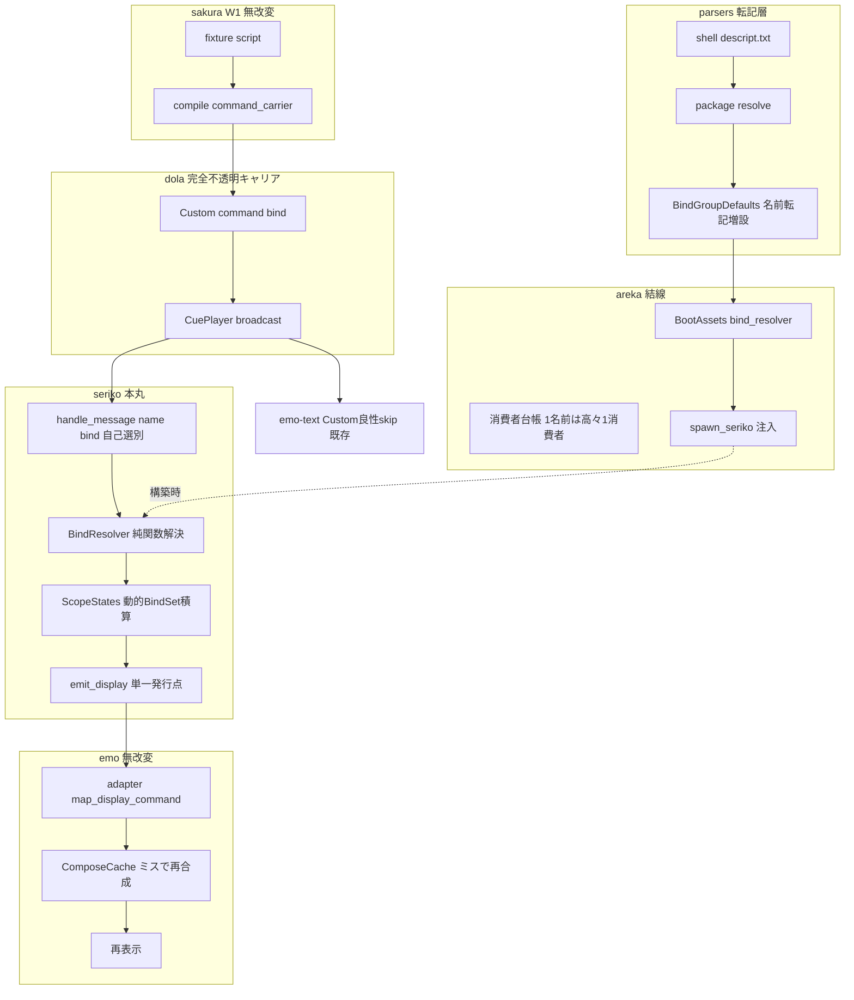
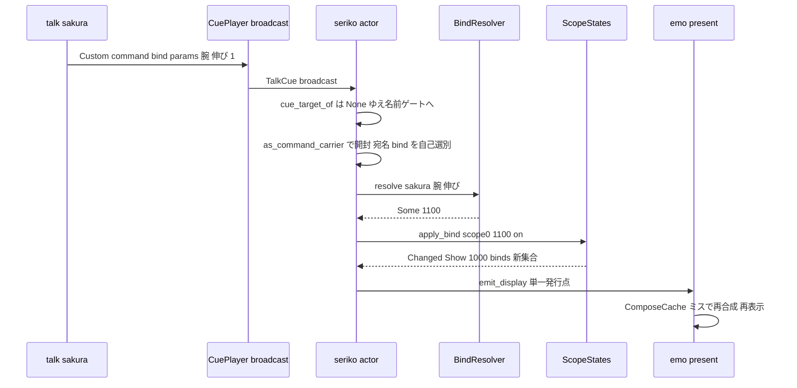

# Design Document — areka-P0-mayuna-compose

## Overview

**Purpose**: 本設計は、さくらスクリプトの `\![bind,カテゴリ名,パーツ名,1|0]`（MAYUNA 着せ替えの名前キー着脱）を、名前解決 → cue 配送（W1 汎用コマンドキャリア）→ seriko の per-scope 動的 bind 状態積算 → 新 `BindSet` を載せた `Show` 再発行 → emo-present 再合成、まで決定論的に貫通させ、実機欠陥 #2「着せ替えで表情変化せず」を解消する。

**Users**: ゴースト作者（descript の bindgroup 名前宣言がスクリプトから効く）、エンドユーザ（むらさきの表情が変わる）、保守者（決定論回帰檻）。

**Impact**: 上流 4 層（parsers／dola／sakura compile／emo-text）のうち実改変は **parsers の名前転記増設**と **dola 名前写像 API（`command_target_of`）の退役**（Custom 完全不透明化・以後コマンド追加で dola を触らない構造の確立・設計ディスカッション #1）。sakura compile・emo-text・emo-compose・emo-present 本体は無改変。中核の新規実装は **seriko の動的 bind 状態**であり、「1 名前=高々 1 消費者」台帳は areka 結線層へ移設する。

### Goals

- descript `sakura/kero.bindgroup*.name` の忠実転記と (カテゴリ, パーツ) → 着せ替え ID の決定論名前解決（R1）
- `bind` コマンドの seriko への消費結線（名前自己選別・無音破棄と誤配線の根絶）と配送層のコマンド名語彙フリー化＋結線層台帳（R2）
- per-scope 動的 bind 状態・on/off 積算・冪等ガード・解決失敗 skip・`Show{binds}` 再発行（R3）
- 正典引数形の M1 縮退境界の明文化（名前キー＋明示 on/off のみ実導出）（R4）
- 注入 Tick のみの決定論 e2e ＋純関数全網羅（R5）、emo-present 再合成の test-only 回帰（R6）、実機サインオフ（R7）、additive 非退行（R8）

### Non-Goals

- 着せ替えの静的合成（emo-compose 完了済み・非改変）／新しい合成メソッド
- `OnDressupChanged`／`OnNotifyDressupInfo` イベント往復・`\![bind-noevent]` のイベント挙動（表示専用スライス）
- 着せ替えメニュー UI（M-dialogue/M2）／SERIKO ループ（seriko-loop・M-life）
- kero 側 bind の実挙動サインオフ（M-dual・本仕様は名前取込＋機構の scope 非依存性まで）
- `addid`／`mustselect` の実挙動（語彙・構造の第一級保持と差替シームのみ）

## Boundary Commitments

### This Spec Owns

- `MountModel.bindgroups`（`BindGroupDefaults`）への **bindgroup 名前転記の増設**と名前解決アクセサ（parsers・R1）
- dola 名前写像 API **`command_target_of` の退役**（Custom 完全不透明化・「委譲」rustdoc の「消費者名前自己選別」への改訂・既存檻の退役/意味更新）＋既存消費者 `MoveCueSink` の名前自己選別への簡素化と severity 整列（R2）
- 「1 名前=高々 1 消費者」**台帳の areka 結線層への移設**（宣言表＋一意性檻・`move`/`bind` を登記）（R2）
- seriko の **bind 消費経路一式**: `BindResolver`（名前解決スナップショット）・bind 引数解釈・per-scope 動的 `BindSet`・積算・冪等・`Show` 再発行（R3/R4）
- `spawn_seriko` への名前解決表の additive 注入と areka 起動配線（`BootAssets`→`wire_emo2_boot`／`spine`）
- 決定論 e2e（`bind_e2e.rs`）・純関数檻・emo-present 再合成の test-only 回帰・実機サインオフ手順（R5/R6/R7）

### Out of Boundary

- dola `CueCommand` のワイヤ形・variant（新設しない・R8.4）／sakura `compile.rs`（W1 で貫通済み・無改変）
- emo-text（`Custom` は既に良性 skip・無改変）／emo-compose（純合成非改変）／emo-present 本体（test-only）
- SHIORI イベント通知・メニュー UI・SERIKO ループ・kero 実挙動検証

### Allowed Dependencies

- seriko → dola（`as_command_carrier` の消費・既存依存。`command_target_of` は本仕様で退役＝参照しない）
- seriko → areka-emo-compose（`BindSet`・既存依存）。**seriko → areka-parsers の依存は追加しない**（`BindResolver` は素データ＝`Vec`/`BTreeMap` で構築・`SurfaceResolver` と同型）
- areka（app 層）→ parsers `MountModel` → seriko 注入（変換は app 層で行う・依存方向: parsers → seriko ← areka）

### Revalidation Triggers

- areka 消費者台帳（コマンド名→担当消費者）の登記追加/変更（1 名前=高々 1 消費者。新コマンド追加は「消費者＋台帳 1 行」のみで dola 無改変が不変条件）
- `DisplayCommand::Show{binds}` の意味変更（emo2-boot adapter／emo-present が透過消費）
- `spawn_seriko` 署名変更（areka `mod.rs`/`spine.rs`・seriko 全テストの構築点）
- `BindGroupDefaults` のフィールド/アクセサ形（`#[non_exhaustive]` ゆえ追加は互換だが、seriko-loop が動的 bind の read-only 読み口として本状態を参照する契約あり）

## ukadoc 正典 3 分類表（bindgroup 系キーと `\![bind]` の M1 取り扱い・確定版）

brief の必読指示に基づく確定表（正典=ukadoc・emo2 は最小適合 fixture）。

| 正典キー / タグ | 意味（ukadoc） | 分類 | M1 取り扱い（要件根拠） |
|---|---|---|---|
| `sakura/kero.bindgroup*.name,カテゴリ名,パーツ名,サムネイル名` | 着せ替え ID *番の名前定義。`\![bind]` 名前操作に必須。第 3 フィールド（サムネ名）は任意 | **名前解決に効く（実導出）** | parsers が (カテゴリ, パーツ, [サムネ]) を忠実転記し名前解決表を提供（R1.1/1.2）。サムネ名は転記保持のみ・M1 不使用（D2） |
| `sakura/kero.bindgroup*.default,数値` | ID *番を起動時表示するか（1=表示） | **実装済（on/off 初期値）** | 既存 `BindGroupDefaults`／`default_bind_ids` が初期 on 集合の源（R3.1・無改変） |
| `\![bind,カテゴリ名,パーツ名,数値]` | 着せ替え着脱。1=着衣・0=脱衣。パーツ名空欄=カテゴリ単位。数値空欄/省略=トグル | **on/off 意味論（部分実導出）** | 名前キー＋明示 on/off のみ実導出（R4.1）。カテゴリ単位・トグルは warn+skip 縮退（R4.2・D8）。スクリプト形は正典上名前キー一本（番号直指定形は存在しない・DD-6 解決済み） |
| `\![bind-noevent,…]` | bind と同じだがイベント非発生 | **範囲外** | イベント自体を扱わない（R4.4）。コマンド名 `bind-noevent` は権威表未登記＝全消費者良性 skip（R2.5 の一般則で吸収） |
| `sakura/kero.bindgroup*.addid,ID` | 同時実行（有効化時に addid 側も有効化） | **語彙保持・実挙動なし** | parsers 非取込・3 分類表と `#[non_exhaustive]` 型が差替シーム（R4.3・D8） |
| `char*.bindoption*.group,カテゴリ名,mustselect/multiple` | カテゴリの排他/複数選択オプション | **語彙保持・実挙動なし** | 同上（R4.3）。emo2 は腕/口/眉/目に mustselect 宣言があるが、スクリプト側が明示 on/off 連打で自前排他するため実挙動なしでも表示は正しく成立（実測・リスク注記） |

**付随確定**: bindgroup 番号 = surfaces.txt `animation*.interval,bind` の番号 = `BindSet` 値（恒等・emo2 実データで 1100–1801 が成立・RN-3 裏取り済み）。まばたき 1400–1402 は `interval,bind+random`＝seriko-loop 領分（本仕様は default OFF のまま触れない）。

## Architecture

### Existing Architecture Analysis

- **W1 汎用キャリア（完成）**: `\![bind,腕,伸び,1]` は parser `GenericCommand{name:"bind", raw_args}` → compile `CueCommand::command_carrier("bind", tokens)`（`compile.rs:171-178`）→ dola `Custom{command,params:Array[String…]}` として台本へ焼き込み済み。**本仕様は転写側を一切触らない**。
- **relevance 分類（本仕様で純化）**: 型レベル `cue_target_of(Custom)=None` は「消費者側の名前自己選別への委譲」。現行 dola には名前写像 `command_target_of`（`"move"→Window` のみ・`sink.rs:99-104`）が残るが、これは「Custom=完全不透明の有象無象キャリア」の哲学に反する中間状態（コマンド追加のたび dola 編集を強いる）であり、**本仕様で退役する**（設計ディスカッション #1・D10）。dola 側 semantics が要る命令のみ variant 昇格（`Wait`/`ClearAll` 前例）という 2 択規律を確立。
- **名前ゲート消費の前例**: `MoveCueSink`（`move_cue.rs:467-490`）が「`as_command_carrier()` で開く → 名前ゲート → 非該当は良性 skip」を確立。本仕様で同 sink のゲートを `name == "move"` 単独へ簡素化し（`command_target_of` 参照を除去）、severity を「自分宛の破損のみ warn」（D8④）へ整列する。bind 消費は seriko 内で同型（`name == "bind"` 自己選別）を再演する。
- **seriko 消費テンプレート（完成）**: `handle_message` の分類 → 早期分岐（balloon）→ 解決（純関数）→ `ScopeStates` 適用（冪等）→ `emit_display` 単一発行点。`state.rs:44-47` が本仕様（mayuna-compose）による `static_binds` 置き場差替を予約済み。
- **表示反映（完成）**: `DisplayCommand::Show{scope,surface_id,binds}` → adapter `map_display_command`（binds 非改変転写）→ `PresentCommand::ShowSurface{binds}` → `ComposeCache` が `(surface_id, BindSet)` 完全一致キーで bind 差分にミス→再合成（`different_binds_on_same_surface_must_miss` 檻既存）。
- **emo-text（確認済・RN-1 解決）**: `apply_cue` は `Custom{..}` を明示列挙の良性 debug skip 済み（`areka-emo-text/src/state.rs:260-266`）＝R2.3 は既存資産で充足・無改変。

### Architecture Pattern & Boundary Map



**Architecture Integration**:

- Selected pattern: 「broadcast＋消費者の名前自己選別」に対する**消費者側 additive**＋dola の完全不透明化（名前写像の退役）。「1 名前=高々 1 消費者」の台帳は結線層（areka）が保持・検証する。
- 依存方向（強制）: dola → sakura → seriko／parsers → areka（app 層が変換・注入）。seriko は parsers に依存しない（素データ注入・`SurfaceResolver` 前例）。
- Steering compliance: 面引数は不透明 String・解決は下流（seriko）／転写層は忠実転記のみ／決定論（注入 Tick・sleep 不使用）／log-first・silent failure 禁止。

### Technology Stack

既存スタックのみ（Rust 2024・std mpsc・tracing）。**新規 crates.io 依存なし・tokio なし・新 crate なし**（R8.2/8.3）。

## Design Decisions（DD-1〜DD-9・RN-1〜RN-4 の確定）

| # | 決定 | 根拠 |
|---|---|---|
| **D1**（DD-1・#1 改定） | bind 消費の分岐位置は `handle_message` の **`cue_target_of == None` 枝の内側**（Wait 判定の前）。`as_command_carrier()` で開き **`name == "bind"` の名前自己選別（単独条件）**で bind 分岐へ入る（arm 内完結・値を返さない・balloon 早期分岐と同じ流儀）。非該当（他人宛・未知名）は既存の良性 debug skip へフォールスルー | `cue_target_of(Custom)=None`＝消費者の名前自己選別への委譲。`command_target_of` は退役（D10）ゆえ参照しない——担当判定は消費者自身の名前リテラルが正・多重結線の見張りは areka 台帳檻が担う。冒頭先取り案は既存分類順序を組み替えるため非 additive で棄却 |
| **D2**（DD-2） | `.name` 値の再分割（カテゴリ, パーツ, [サムネ]）は **parsers 転写層**で行う（`splitn(3, ',')`・第 3 フィールドは残余全部＝サムネ名として不透明保持）。**(カテゴリ, パーツ)→ID の問い合わせアクセサも `BindGroupDefaults` が提供**（R1.3/1.4 の主語がマウントモデルのため）。カテゴリ集合解決（パーツ空欄→当該カテゴリの ID 集合）はアクセサ `category_ids` として提供するが、M1 の seriko はカテゴリ単位形を縮退させるため消費しない | 値の再分割は正典キー文法の忠実転記であり展開ではない（転写層原則と両立）。範囲展開・surface 解決は行わない。重複 (カテゴリ, パーツ) は転記順（キー昇順）で後勝ち＝`parse_kv` の後勝ち規約と整合・決定論 |
| **D3**（DD-3/RN-1） | emo-text は**無改変**。`apply_cue` の `Custom{..}` 明示列挙 debug skip（`state.rs:260-266`）が R2.3 を既に充足。e2e（bind 混在 script）で文字出力の非汚染を追観測する | W1 実装済みを実測確認。新規無視列挙は不要 |
| **D4**（DD-4/RN-2） | `spawn_seriko(resolver, static_binds, bind_resolver, out)` へ **`BindResolver` を additive 引数追加**。呼出点は areka `emo2_boot/mod.rs:287`・`spine.rs:444`（`BootAssets` 新フィールド `bind_resolver` から供給）と seriko 側テスト群（`BindResolver::empty()` で追随）。`BindResolver` は `MountModel.bindgroups` の名前転記から areka（app 層）が構築する | workspace 内部 API（R8.4 の「既存 API」は cue 語彙のワイヤ形を指す）。`SurfaceResolver` の所有スナップショット注入と同型・parsers 依存を seriko へ持ち込まない |
| **D5**（DD-5） | bind 変化時、当該 scope が `Shown(id)` なら `Show{scope, surface_id: id, binds: new}` を再発行。**`Hidden`／未知 scope なら状態のみ更新し発行しない**（次の `Show` が積算済み集合を載せる）。既存 `apply`（`\s` 経路）の `Show` は `static_binds` 固定から **per-scope 現在集合**へ差替（bind cue 不在なら同値＝非退行） | 非表示 scope への `Show` 発行は `\s[-1]` 意味論を破る強制表示になる。`state.rs:44-47` の予約（置き場のみ差替）どおり。R3.5 は「表示中 scope への再発行」として充足し、保留分は次 Show で観測可能 |
| **D6**（解決済） | スクリプト形は名前キー一本。番号直指定形のシームは設けない。数値に見えるカテゴリ/パーツ名は不透明文字列として通常の名前解決へ回り、宣言なしなら解決不能経路（R3.7）が吸収 | 要件ディスカッション #1（2026-07-19）確定・ukadoc/emo2/開発者三者一致 |
| **D7**（DD-7） | scope→名前空間写像は **`"0"→sakura`・`"1"→kero`・その他→写像なし（解決不能扱い）**の純関数。kero は名前表・default 取込まで行い（R1.2）、機構は scope 非依存（emo2 に kero bindgroup が無いため実行時は自然に解決不能→R3.7 skip）＝R4.3 のシームを「空表の同一機構」で実現し人工的な無効化コードを書かない | `char2+` の bindgroup（`char*.bindgroup`）は M1 未取込のため写像なしが正直。M-dual が写像表を拡張する |
| **D8**（DD-8） | 縮退の severity split（balloon の NameForm=warn／Invalid=error 前例を踏襲）: ①**解決不能**（未宣言 (カテゴリ, パーツ)）＝`error!`＋skip・状態不変・発行なし（R3.7）。②**M1 縮退の正典形**（数値欄空/省略=トグル・パーツ名空=カテゴリ単位）＝`warn!`＋skip（正当構文だが未実導出・R4.2）。③**破損入力**（カテゴリ欠落＝トークン 0 個・on/off 値が `0`/`1` 以外の非空文字列）＝`error!`＋skip。④**非正準 params の宛名規律（#1 確定）**: `Custom{command}` フィールドは開封失敗でも読めるため宛名で峻別する——**宛名が自分（`bind`）で params 非正準＝`warn!`＋skip**（自分宛の壊れ物は担当者が報告）・**宛名が他人/未知の Custom＝正準・非正準を問わず `debug!` 素通し**（報告責任は宛名の担当者・未知名は将来コマンドの正常系）。`MoveCueSink` も同規律へ整列（move 宛破損のみ warn・D10）。全縮退枝はログ捕捉テストで正のカウントを assert（優しい縮退の非空虚化） | severity 規律を**宛名基準**へ統一（自分宛の破損=warn/error・担当外=debug）。Custom=有象無象キャリアゆえ未知名への warn は将来コマンド常時流通の前提と矛盾（設計検証 Issue 1 はこの規律確定で解消） |
| **D9**（DD-9） | 冪等ガードの単位は **per-scope の「結果 BindSet の同値」**。`BindSet` は昇順 dedup 済みゆえ順序・重複に不感。on→on／off→off／順序違いで同一集合に至る列は再発行しない。純関数 `accumulate`（現集合×(id, on/off)→新集合）を檻化 | 既存 `ApplyOutcome` 冪等ガード（同一 surface 不再発行）と同じ思想を bind 集合へ拡張 |
| **D10**（#1 確定・2026-07-23 改定） | **dola 名前写像 API `command_target_of` を退役**する。(1) `sink.rs` の同関数と `mod.rs` の re-export・doc 表記載を削除し、`cue_target_of(Custom)=None`／`Custom` variant の rustdoc「委譲」文言を「消費者の名前自己選別」へ改訂。(2) 既存檻の退役/意味更新: dola `sink_test.rs:250-282`（写像/partition 檻）は退役・`:285-300`（委譲檻）は文言更新・areka-sakura `drive.rs:2212-2313` の参照檻/文言を自己選別モデルへ更新。(3) `MoveCueSink` のゲートを `name == "move"` 単独へ簡素化・severity を D8④ 宛名規律へ整列（既存 move 檻の期待値を意味更新）。(4) **「1 名前=高々 1 消費者」台帳を areka 結線層へ移設**: 宣言表（`move`→MoveCueSink・`bind`→seriko）＋一意性檻を新設。以後のコマンド追加は「消費者＋台帳 1 行」のみで **dola は永久に無改変** | Custom は「その他有象無象の任意事象を引き受ける」完全不透明キャリア（開発者裁定・#1）。dola にコマンド語彙を置く中間状態はコマンド追加のたび dola 編集を強いる歪み。dola 側 semantics が要る命令のみ variant 昇格（`Wait`/`ClearAll` 前例）という 2 択規律。退役檻は設計判断による陳腐化（obsolete-vs-broken 規律） |

## File Structure Plan

### Modified Files

| ファイル | 変更内容 | 要件 |
|---|---|---|
| `crates/areka-parsers/src/package/model.rs` | `BindGroupName { id: u32, category: String, part: String, thumbnail: Option<String> }` 新設。`BindGroupDefaults` へ `sakura_names: Vec<BindGroupName>`／`kero_names: Vec<BindGroupName>` を additive 追加（`#[non_exhaustive]` 互換）。読み取りアクセサ `resolve_name(scope, category, part) -> Option<u32>`・`category_ids(scope, category) -> Vec<u32>`（後勝ち・ID 昇順・純関数）と scope 列挙 `BindScope { Sakura, Kero }` | 1.1–1.6 |
| `crates/areka-parsers/src/package/resolve.rs` | `read_bindgroup_defaults` を同一走査で `.name` サフィックスも転記するよう拡張（`SUFFIX ".name"` 追加・値を `splitn(3, ',')` で再分割・パーツ欠落行は `warn!` の上転記対象外）。既存 `.default` 経路は無改変 | 1.1/1.2/1.5/1.6 |
| `crates/dola/src/cue/{sink.rs, mod.rs, command.rs}` | **`command_target_of` の削除**（`mod.rs` re-export・doc 表からも除去）。`cue_target_of(Custom)=None`／`Custom` variant の rustdoc「委譲」文言を「消費者の名前自己選別」へ改訂（dola はコマンド名語彙を持たない・D10） | 2.1/2.6 |
| `crates/dola/tests/cue/sink_test.rs` | `command_target_of` 写像/partition 檻（:250-282）の退役（設計判断による陳腐化・D10）・委譲檻（:285-300）の文言を自己選別モデルへ更新 | 2.5/2.6 |
| `crates/areka-sakura/src/drive.rs` | `command_target_of` 参照檻（:2212-2313）を自己選別モデルの帰結檻（未知名＝どの消費者も action しない）へ意味更新・import 除去 | 2.5/2.6 |
| `crates/areka/src/emo2_boot/move_cue.rs` | ゲートを `name == "move"` 単独へ簡素化（`command_target_of` 参照除去）・severity を D8④ 宛名規律へ整列（move 宛破損のみ `warn!`・他人宛/未知は `debug!`）・rustdoc 更新＋既存檻の期待値を意味更新 | 2.4/2.6 |
| `crates/areka/src/emo2_boot/`（結線層） | **消費者台帳の新設**: コマンド名→担当消費者の宣言表（`move`→MoveCueSink・`bind`→seriko）＋一意性檻（1 名前=高々 1 消費者・D10）。コマンド追加時は消費者＋本表 1 行のみ | 2.2/2.6 |
| `crates/areka-seriko/src/bind.rs` | bind 純関数群を増設: `BindResolver`（sakura/kero 別 `BTreeMap<(String,String),u32>` 所有スナップショット・`new`/`empty`/`resolve(namespace, category, part)`）、`scope_namespace(&ActorKey) -> Option<BindNamespace>`（D7）、引数解釈 `parse_bind_directive(tokens) -> BindDirective`（`Apply{category,part,on}` / `Toggle` / `CategoryWide` / `Malformed`・D8 の類別）、積算 `accumulate(&BindSet, id, on) -> BindSet` | 3.2/3.3/4.1/4.2/5.4 |
| `crates/areka-seriko/src/state.rs` | `ScopeStates` に `dynamic_binds: HashMap<ActorKey, BindSet>` を追加（初期値=既存 `static_binds`・予約シーム消費）。`current_binds(scope)` 導入・既存 `apply` の `Show{binds}` を per-scope 現在集合へ差替（D5・非退行）。新 API `apply_bind(scope, id, on) -> BindApplyOutcome { Changed(DisplayCommand), StateOnly, Unchanged }` | 3.1/3.4/3.5/3.6/3.8 |
| `crates/areka-seriko/src/actor.rs` | `spawn_seriko` へ `bind_resolver: BindResolver` を additive 追加。`handle_message` の `None` 枝内に bind 名前ゲート分岐（D1・`name == "bind"` 自己選別・dola 名前 API 非参照）: キャリア開封→名前ゲート→引数解釈→名前解決→`apply_bind`→`Changed` のみ `emit_display`。成功時 `info!`（実機 grep マーカー）・縮退枝は D8 severity | 2.2/3.2–3.7/7.1 |
| `crates/areka-seriko/src/lib.rs` | `BindResolver` 等の再エクスポート | — |
| `crates/areka-seriko/tests/{regression.rs, cue_sequence.rs, balloon_face_e2e.rs}` | `spawn_seriko` 呼出へ `BindResolver::empty()` 追随（挙動不変） | 8.1 |
| `crates/areka/src/emo2_boot/assets.rs` | `BootAssets` へ `bind_resolver: BindResolver` フィールド追加。`build_boot_assets` 内の既存 `resolve()` 結果（`MountModel.bindgroups` の名前転記）から構築（既存 `default_bind_ids` 経路は無改変） | 1.1/1.2・R3.1 結線 |
| `crates/areka/src/emo2_boot/mod.rs`・`spine.rs` | `spawn_seriko(resolver, static_binds.clone(), bind_resolver, bridge)` へ追随 | 7.1 |
| `crates/areka-emo-present/src/cache.rs` | **test-only**: 既存 in-source tests 節へ「動的 Show 再発行→bind 差分ミス→再合成」「同一 binds→ヒット復帰」の回帰を追記（本体ロジック無改変） | 6.1/6.2/6.3 |

### New Files

| ファイル | 責務 | 要件 |
|---|---|---|
| `crates/areka-seriko/tests/bind_e2e.rs` | fixture script 直入力の決定論 e2e（`balloon_face_e2e.rs` 同型ハーネス＋test-local `BindResolver` 表）。on/off 積算列・冪等・解決不能 skip・emo-text 非汚染を注入 Tick のみで観測 | 5.1–5.4 |
| （parsers in-source tests） | `.name` 転記・再分割・sakura/kero 区別・解決不能・additive 非退行の檻は `package` 既存 in-source tests へ追記。R5.5 の test-local fixture（tempdir に宣言済み bindgroup 名を持つ最小 descript）も parsers テスト内で自前用意 | 1.1–1.6/5.5 |

### 依存方向（強制）

`dola` → `areka-sakura` → `areka-seriko`（← `areka-emo-compose`）→ `areka`（app）。`areka-parsers` → `areka`（app）。左のみ import 可。seriko から parsers への import は**違反**（`BindResolver` は素データ構築で回避）。

## System Flows



フロー上の要点: (1) 解決不能なら `error!`＋skip で `apply_bind` に到達しない（R3.7）。(2) `apply_bind` が `Unchanged`（同一集合）／`StateOnly`（Hidden）なら発行なし（R3.6・D5）。(3) 発行後は既存経路（adapter→present）を透過し本仕様の新規コードは介在しない。

## Requirements Traceability

| Requirement | Summary | Components | Interfaces / Flows |
|---|---|---|---|
| 1.1 | sakura 側 `.name` 取込 | parsers `read_bindgroup_defaults` 拡張 | `BindGroupDefaults.sakura_names` |
| 1.2 | kero 側の区別取込 | 同上 | `BindGroupDefaults.kero_names`・`BindScope::Kero` |
| 1.3 | (カテゴリ, パーツ) 問い合わせ／カテゴリ集合 | parsers アクセサ | `resolve_name`／`category_ids`（純関数） |
| 1.4 | 未宣言は解決不能を判別可能に | 同上 | `Option<u32>`＝`None`（捏造しない） |
| 1.5 | 名前は不透明文字列・ID 非生成 | `BindGroupName` | `splitn(3)` 忠実転記・D2 |
| 1.6 | 既存マウント結果の非改変 | resolve.rs 同一走査 additive | 既存 in-source tests 緑維持＋非退行檻 |
| 2.1 | `\![bind]` の非破棄配送 | W1 キャリア（既存・broadcast は名前不関知） | broadcast→seriko 名前自己選別 |
| 2.2 | 単一消費者・多重結線なし | areka 消費者台帳＋一意性檻（D10） | 台帳: 1 名前=高々 1 消費者 |
| 2.3 | emo-text の良性 skip | emo-text 既存 Custom arm（無改変・D3） | e2e で非汚染追観測 |
| 2.4 | 他コマンド（move 等）非退行 | MoveCueSink 簡素化（解釈・配送対象不変・severity のみ D8④ 整列） | move 既存檻（期待値の意味更新）＋workspace 緑 |
| 2.5 | 未登記名の良性 skip | 各消費者の名前自己選別（非該当= debug 素通し） | seriko/move 未知名 debug skip テスト |
| 2.6 | 配送層のコマンド名語彙フリー | `command_target_of` 退役（D10） | dola に名前写像 API 不在（コンパイル担保）＋台帳一意性檻 |
| 3.1 | default 初期値の per-scope 動的状態 | `ScopeStates.dynamic_binds`（初期=static_binds） | `current_binds` |
| 3.2 | 着衣（1）の解決＋有効化 | actor bind 分岐＋`BindResolver`＋`accumulate` | D1/D7 |
| 3.3 | 脱衣（0）の無効化 | 同上（on=false） | `accumulate` |
| 3.4 | 複数 cue の積算 | `apply_bind` 逐次適用（FIFO 単一スレッド） | e2e 積算列 |
| 3.5 | 変化時の `Show{binds}` 再発行 | `apply_bind`→`Changed(Show{現 surface_id, 新 binds})` | D5・`emit_display` 単一発行点 |
| 3.6 | 冪等ガード | 結果 BindSet 同値→`Unchanged` | D9 純関数檻 |
| 3.7 | 解決失敗 log+skip・発行なし | `BindResolver`→`None`＝`error!`＋skip | D8① |
| 3.8 | `\s` 状態管理の非改変 | `apply` は binds 供給源のみ差替（bind 無なら同値） | 既存 regression/cue_sequence 緑 |
| 4.1 | 名前キー＋明示 on/off の実導出 | `parse_bind_directive`→`Apply` | 全経路 e2e |
| 4.2 | トグル/カテゴリ単位の安全縮退 | `Toggle`/`CategoryWide`→`warn!`＋skip | D8②・正カウント assert |
| 4.3 | addid/mustselect/kero 実挙動のシーム | 3 分類表＋`#[non_exhaustive]`＋空表同一機構（D7） | 語彙保持・実挙動なし |
| 4.4 | SHIORI イベント範囲外 | （設計上の不在＝Non-Goals） | `bind-noevent` は未登記名として良性 skip |
| 5.1 | on/off 列の mock 観測 | `bind_e2e.rs`（balloon_face_e2e 同型） | 注入 Tick→records 照合 |
| 5.2 | 解決不能のログ観測・発行なし | 同期 `handle_message`＋`capture_logs` 流儀 | D8① |
| 5.3 | sleep 不使用・注入 Tick のみ | 既存同期チェーン（TalkDone→join） | RN-4 |
| 5.4 | 判断分岐の実行網羅・純関数全網羅 | `parse_bind_directive`/`resolve`/`accumulate`/`apply_bind` の GPU 不要檻 | 檻対象は判断分岐のみ |
| 5.5 | test-local fixture 自前用意 | parsers tempdir fixture＋seriko test-local 表 | — |
| 6.1 | 異 binds→ミス→再合成 | cache.rs test-only 追記 | 既存 `different_binds…` 拡張 |
| 6.2 | 同一 binds→キャッシュ復帰 | 同上 | — |
| 6.3 | emo-present 本体無改変 | test-only 制約 | File Structure Plan |
| 7.1 | 実機で表情着脱 | wire 結線（mod.rs/spine.rs）＋`info!` マーカー | 実機手順（下記） |
| 7.2 | 本番ゴースト先行 | サインオフ手順規律 | areka-placement-real-ghost-first |
| 7.3 | 絶対パス起動 | サインオフ手順規律 | MOD_NOT_FOUND 回避 |
| 8.1 | workspace 全緑 | 全既存テスト＋追随更新（D10・spawn 署名） | `cargo test --workspace` |
| 8.2 | 新規外部依存なし | 既存クレートのみ | — |
| 8.3 | Rust 2024・tokio なし | 既存スタック | — |
| 8.4 | cue ワイヤ形・variant 不変 | dola variant 非追加・serde 形不変（`command_target_of` 退役はワイヤ形非該当＝R2.6 の明示スコープ） | 既存ワイヤ檻 |

## Components and Interfaces

| Component | Layer | Intent | Req | 依存 | Contracts |
|---|---|---|---|---|---|
| BindGroupNames 転記（parsers） | ②転記層 | `.name` の忠実転記と名前問い合わせ | 1.1–1.6 | kv/charset（P0） | Service/State |
| 名前写像退役＋消費者台帳 | 配送層/結線層 | dola 語彙フリー化・台帳は areka 移設 | 2.1/2.2/2.4–2.6 | — | Service |
| BindResolver＋引数解釈（seriko） | 解決層 | トークン→指令→ID の純関数 | 3.2/3.3/4.1/4.2 | emo-compose BindSet（P0） | Service |
| 動的 bind 状態（seriko state） | 状態層 | per-scope 積算・冪等・Show 決定 | 3.1/3.4–3.6/3.8 | — | State |
| bind 消費分岐（seriko actor） | アクター層 | 名前自己選別→一本経路結線 | 2.2/3.2–3.7 | dola as_command_carrier（P0） | Event |
| 起動配線（areka） | app 層 | MountModel→BindResolver→spawn 注入 | 7.1 | parsers/seriko（P0） | Service |
| 再合成回帰（emo-present） | 表示層 | test-only 檻 | 6.1–6.3 | — | — |

### parsers — BindGroupNames 転記

**Responsibilities & Constraints**: `read_bindgroup_defaults` の同一走査で `.default` と `.name` を一度に転記。範囲展開・surface 解決・カテゴリ畳み込みはしない（転写層原則）。shell descript 不在/読取不能は従来どおり空（致命でない・既存挙動）。

##### Service Interface（Rust）

```rust
/// bindgroup 名前宣言 1 件の忠実転記（不透明文字列・ID 非生成・R1.5）。
#[non_exhaustive]
#[derive(Clone, Debug, PartialEq, Eq)]
pub struct BindGroupName {
    pub id: u32,               // bindgroup 番号（= 着せ替え/animation ID・恒等）
    pub category: String,      // 第 1 フィールド（trim 済み・不透明）
    pub part: String,          // 第 2 フィールド（trim 済み・不透明）
    pub thumbnail: Option<String>, // 第 3 フィールド以降の残余（M1 不使用・保持のみ）
}

/// 名前空間選択（sakura=本体／kero=相方・R1.2）。
#[derive(Clone, Copy, Debug, PartialEq, Eq)]
pub enum BindScope { Sakura, Kero }

impl BindGroupDefaults {
    /// (カテゴリ, パーツ) → 着せ替え ID。未宣言は None（捏造しない・R1.3/1.4）。
    /// 重複宣言はキー昇順走査の後勝ち（決定論）。
    pub fn resolve_name(&self, scope: BindScope, category: &str, part: &str) -> Option<u32>;
    /// カテゴリに属する着せ替え ID 集合（昇順・R1.3 後段。M1 の seriko は未消費＝シーム）。
    pub fn category_ids(&self, scope: BindScope, category: &str) -> Vec<u32>;
}
```

- Preconditions: なし（空表可）。Postconditions: 純関数・同一入力同一出力。Invariants: 既存フィールド（`sakura_default_on`/`kero_default_on`）と既存 `resolve()` 出力は不変（R1.6）。
- 転記規則: `<prefix>NNNN.name` の値を `splitn(3, ',')`（各フィールド trim）。第 2 フィールドが欠落/空の行は `warn!` の上転記対象外（パーツ名なしの宣言は正典上不完全）。

### dola — 名前写像 API の退役（＋areka 消費者台帳）

`command_target_of` を削除し（`sink.rs`・`mod.rs` re-export・doc 表）、`Custom`／`cue_target_of` の rustdoc を「消費者の名前自己選別」へ改訂する。ワイヤ形・variant・`cue_target_of` の型レベル分類は不変。既存檻は D10 のとおり退役/意味更新。「1 名前=高々 1 消費者」は areka 結線層の宣言台帳＋一意性檻へ移設（`move`→MoveCueSink・`bind`→seriko）。以後のコマンド追加は消費者＋台帳 1 行のみで **dola 無改変**（R2.6 の構造的保証）。

### seriko — BindResolver・引数解釈・積算（bind.rs／純関数群）

##### Service Interface（Rust）

```rust
/// 名前解決スナップショット（所有・純関数・SurfaceResolver 同型）。parsers 非依存。
pub struct BindResolver {
    sakura: BTreeMap<(String, String), u32>,
    kero: BTreeMap<(String, String), u32>,
}
impl BindResolver {
    pub fn new(sakura: ..., kero: ...) -> Self;   // areka app 層が MountModel から素データで組む
    pub fn empty() -> Self;                        // 既存テスト追随用
    pub fn resolve(&self, ns: BindNamespace, category: &str, part: &str) -> Option<u32>;
}

/// scope → 名前空間写像（D7・純関数）。"0"→Sakura・"1"→Kero・他→None。
pub fn scope_namespace(scope: &ActorKey) -> Option<BindNamespace>;

/// `\![bind]` トークン列の M1 類別（D8・純関数・不透明保持）。
pub enum BindDirective {
    Apply { category: String, part: String, on: bool }, // 実導出（R4.1）
    Toggle { category: String, part: String },          // 数値欄空/省略 → warn+skip（R4.2）
    CategoryWide { category: String, on: Option<bool> },// パーツ名空欄 → warn+skip（R4.2）
    Malformed,                                          // カテゴリ欠落・on/off 値破損 → error+skip
}
pub fn parse_bind_directive(tokens: &[&str]) -> BindDirective;

/// on/off 積算（純関数・BindSet は昇順 dedup ゆえ集合同値が冪等判定・D9）。
pub fn accumulate(current: &BindSet, id: u32, on: bool) -> BindSet;
```

- `parse_bind_directive` 分岐: tokens[0]（カテゴリ）が欠落/空 → `Malformed`。tokens[1]（パーツ）欠落/空 → `CategoryWide`。tokens[2] が `"1"`/`"0"` → `Apply{on}`。tokens[2] 欠落/空 → `Toggle`。それ以外 → `Malformed`。第 4 トークン以降は無視（不透明・正典に第 4 引数なし）。

### seriko — 動的 bind 状態（state.rs）

**State Management**: `dynamic_binds: HashMap<ActorKey, BindSet>` を `ScopeStates` に追加。`current_binds(scope)` = `dynamic_binds.get(scope)` 無ければ `static_binds`（初期値・R3.1。現行の供給源は shell descript `default,1`＝`build_static_bindset`）。既存 `apply` の `Show{binds}` は `current_binds(scope).clone()` へ差替（bind cue 不在時は従来と同値＝R3.8/8.1 非退行。予約シーム `state.rs:44-47` の消費）。

```rust
/// bind 適用結果（発行要否と状態のみ更新を峻別・D5/D9）。
pub enum BindApplyOutcome {
    Changed(DisplayCommand), // Shown(id) かつ集合変化 → Show{scope, surface_id: id, binds: 新集合}
    StateOnly,               // 集合は変化したが Hidden/未知 scope → 発行なし（次 Show へ保留）
    Unchanged,               // 結果集合が同値（冪等・R3.6）
}
impl ScopeStates {
    pub fn apply_bind(&mut self, scope: &ActorKey, id: u32, on: bool) -> BindApplyOutcome;
}
```

- Invariants: `apply_bind` はシェル面 `scopes`／バルーン面 `balloon` の遷移を変更しない（R3.8）。`apply`／`apply_balloon` は `dynamic_binds` を書き換えない（読むのは `apply` の binds 供給のみ）。

### seriko — bind 消費分岐（actor.rs）

`handle_message` の `cue_target_of == None` 枝、Wait 判定より前に挿入（D1）:

1. `cue.command.as_command_carrier()` — `None`（非正準 params）のとき宛名（`Custom{command}` フィールド・開封失敗でも読める）で峻別: 宛名 `bind` なら `warn!`＋skip（自分宛の壊れ物・D8④）・他人宛/未知名なら `debug!` 良性 skip。
2. `name == "bind"` の名前自己選別 — 不成立（未知名・他担当名）→ 既存の `debug!` skip へフォールスルー（R2.5。`command_target_of` は退役済みゆえ参照しない・D1/D10）。
3. `parse_bind_directive(&tokens)` — `Toggle`/`CategoryWide` → `warn!`＋skip（R4.2）、`Malformed` → `error!`＋skip。
4. `scope_namespace(&cue.actor)` — `None`（scope "2"+）→ `warn!`＋skip（写像なし・D7）。
5. `bind_resolver.resolve(ns, category, part)` — `None` → `error!`＋skip・状態不変・発行なし（R3.7・D8①）。
6. `states.apply_bind(scope, id, on)` — `Changed(cmd)` のみ `emit_display(out, cmd)`（単一発行点・R3.5）。適用成功時に `info!(scope, category, part, id, on, "seriko: bind 適用")` を発火（実機 grep マーカー・R7.1）。

### areka — 起動配線

`build_boot_assets`: 既存の `resolve(ghost_root, DefaultEncoding::Ansi)` 結果から `model.bindgroups` の名前転記を取り出し `BindResolver::new(...)` を構築、`BootAssets.bind_resolver` に格納。`wire_emo2_boot`（`mod.rs:287`）と `spine.rs:444` の `spawn_seriko` 呼出へ渡す。既存 `default_bind_ids`（shell KV 直読・sakura 限定）の static_binds 経路は**無改変**（初期 on 集合の正は従来どおり。名前表と defaults の供給源二重化は既知の技術的負債として research.md に記録・本仕様では統合しない）。

## Data Models

- **BindGroupName / BindGroupDefaults（parsers）**: 転記順保持の `Vec`（正本）＋純関数アクセサ。集約境界は `MountModel`（resolve 成功時のみ構築・不変）。
- **BindResolver（seriko）**: `BTreeMap<(String,String), u32>` ×2（sakura/kero）。構築時スナップショット・以後不変・`Send`。
- **dynamic_binds（seriko）**: `HashMap<ActorKey, BindSet>`。トランザクション境界は 1 cue = 1 scope（既存 `apply` と同一）。`BindSet`（emo-compose・昇順 dedup）が集合同値＝冪等判定の正準形。
- **ワイヤ形**: 変更なし。`Custom{command:"bind", params:Array[String…]}`（W1 正準形）のみ消費（R8.4）。

## Error Handling

### Error Strategy（severity 一覧・D8）

| 事象 | 水準 | 挙動 | 檻 |
|---|---|---|---|
| 未宣言 (カテゴリ, パーツ)（解決不能） | `error!` | skip・状態不変・発行なし（R3.7） | 同期 handler＋log 捕捉（ERROR=1・発行 0） |
| トグル形／カテゴリ単位形（M1 縮退） | `warn!` | skip（正当構文・将来実導出シーム・R4.2） | WARN=1・ERROR=0・発行 0 |
| カテゴリ欠落・on/off 値破損 | `error!` | skip（破損入力） | ERROR=1・発行 0 |
| 非正準 params・宛名 `bind`（自分宛の壊れ物） | `warn!` | skip（ワイヤ破損は宛名の担当者が報告・D8④） | WARN=1・発行 0 |
| 非正準 params・宛名が他人/未知（担当外） | `debug!` | 良性 skip（報告責任は宛名の担当者・R2.5） | WARN/ERROR=0 |
| scope 写像なし（"2"+） | `warn!` | skip（M-dual 拡張シーム） | WARN=1 |
| 未登記コマンド名 | `debug!` | 既存フォールスルー（R2.5） | 既存檻＋追試 |
| `.name` 宣言のパーツ欠落（parsers） | `warn!` | 転記対象外（捏造しない・R1.5） | parsers in-source test |

いずれも panic しない（入力起因では panic 禁止・log-first）。ループは常に継続（`ControlFlow::Continue`）。

### Monitoring

bind 適用成功の `info!` マーカー（scope/category/part/id/on）を実機サインオフの grep 判定に用いる（R7・有界 auto-exit＋ログ grep の既存流儀）。

## Testing Strategy

### Unit Tests（純関数・GPU 不要・全網羅＝R5.4）

1. **parsers 転記**: `.name` 2/3 フィールド・trim・sakura/kero 区別・重複後勝ち・パーツ欠落 skip・`resolve_name`/`category_ids` の解決/不能・既存 `resolve()` 出力の非改変（emo2 実 fixture 追験: bindgroup1100「腕,伸び」〜1801 の全宣言が引ける非空虚 assert）。
2. **`parse_bind_directive`**: Apply(1/0)・Toggle（空/省略）・CategoryWide・Malformed（カテゴリ欠落・値 `"2"`/`"abc"`）・第 4 トークン無視。
3. **`accumulate`／D9 冪等**: on→on・off→off・順序違い同一集合・on→off 往復。
4. **`scope_namespace`**: "0"/"1"/"2"/非数値。
5. **`apply_bind`**: Shown 時 Changed(Show{現 id, 新集合})・Hidden/未知 scope 時 StateOnly・同値 Unchanged・シェル/バルーン遷移非干渉（R3.8）。
6. **台帳と語彙フリー**: areka 消費者台帳の一意性檻（1 名前=高々 1 消費者・move/bind 登記）・`command_target_of` 不在はコンパイルが担保（D10）・MoveCueSink 簡素化後の move 檻（解釈不変＋severity 宛名整列）の意味更新。

### Integration Tests（同期 handler・log 捕捉流儀）

1. bind cue（正準キャリア）→ Show 発行（records 照合・binds 全値比較）。
2. 解決不能→ERROR=1・発行 0・後続有効 cue は継続処理（ループ生存）。
3. Toggle/CategoryWide→WARN=1・発行 0（縮退の正カウント＝非空虚化）。
4. 非正準 params（宛名 bind）→WARN=1・発行 0／非正準 params（他人宛・未知名）および正準未知名→WARN/ERROR=0（良性 debug）。
5. `\s` 経路の Show が bind 積算後の集合を載せる（D5 の「次 Show へ保留」観測）。

### E2E（`bind_e2e.rs`・注入 Tick のみ＝R5.3）

1. `\s[1000]\![bind,腕,伸び,0]\e` → Show{1000, defaults} → Show{1000, defaults−1100}（積算と再発行・R5.1）。
2. on/off 列（off→on 復帰）と冪等（同 on 連打で再発行なし）。
3. 解決不能 bind を含む script → 表示指令列に増分なし（R5.2）。
4. bind 混在 script でテキスト経路の非汚染（emo-text 良性 skip の e2e 面・R2.3）。
   ハーネスは `balloon_face_e2e.rs` の同期チェーン（Tick 注入→TalkDone→sink drop→join→records）を流用し、`BindResolver` は test-local 表（腕/伸び→1100 等）を直接注入する（R5.5）。

### 回帰（emo-present・test-only＝R6）

`ComposeCache`: 同一 surface で binds 差分→ミス→再 compose（既存檻の bind 動的差替文脈での追記）・同一 binds 再発行→ヒット復帰。crate 本体無改変。

### 実機サインオフ（R7・コード外手順）

実 emo2＋実 pasta.dll＋実 DPI（≠96）・**絶対パス起動**・本番ゴースト表示先行。`AREKA_APP_SMOKE_EXIT_MS` の有界 auto-exit＋`RUST_LOG` で「seriko: bind 適用」マーカーを grep（決定論判定の補助）し、むらさきの表情パーツ着脱を人間が目視確認する。

## Security Considerations

該当なし（ローカル資産のパースと表示のみ・新規外部入力面なし）。descript の不正値は全て log+skip の寛容経路で吸収し panic しない。

## Performance & Scalability

名前表は数十件規模（emo2 で 30 件弱）・`BTreeMap` 照会は O(log n)。bind 適用は集合コピー（数要素の `Vec<u32>`）で talk 頻度（数 Hz）に対し無視可能。再合成は既存 `ComposeCache` の設計どおり bind 変化時のみ発生（まばたき前例で実証済みの負荷水準）。
