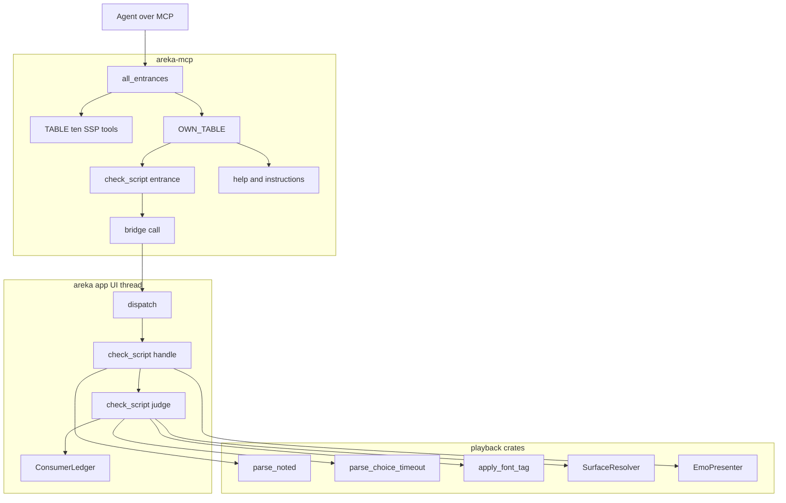
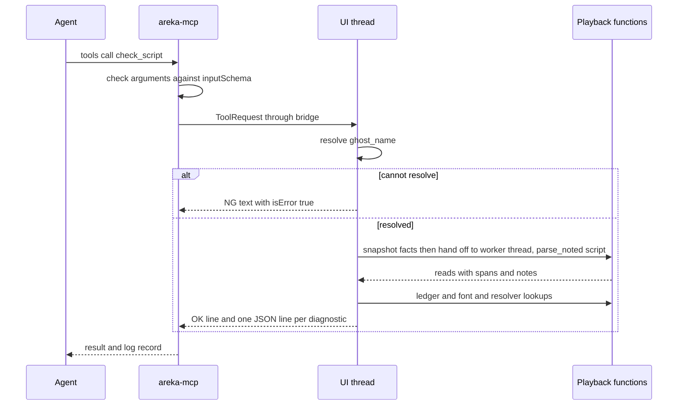

# Design Document

> 本文の実測は **2026-10-05・本ブランチ**（main `ec072853` の上）のもの。コードは「何の定義か」（関数名・型名・定数名＋ファイルパス）で指し、行番号では指さない。
> 調べた記録と、採らなかった案の比較は同じフォルダの [research.md](research.md) の「設計の段の記録」にある。

## Overview

**Purpose**: AI エージェントと一緒にゴーストを作る作者が、台本を再生せずに「areka で効かない箇所」を知れるようにする。あわせて、SSP と同じ 10 本を 1 文字も変えずに、areka 独自のツールを足せる場所を作る。

**Users**: 作者と一緒に台本を書くエージェント（Claude Code など）が、`sakurascript` で再生する前に `check_script` を呼ぶ。後続の spec（`mcp-user-response`・`mcp-shiori-query`）の実装者は、同じ場所へ自分のツールを 1 本足す。

**Impact**: `tools/list` が 10 本から 11 本になる（先頭の 10 本は今のまま）。本番の起動が呼ぶ登録の関数が 1 つ替わる。台本を読む段（字句・意味）に「位置と、読む段が自分で下した扱いの印」を返す入口が 1 つ増える。再生の振る舞いは変わらない。

### Goals

- SSP と同じ 10 本の表（`TABLE`）と、その逐語一致のテストに触らずに、独自のツールを登録できる。
- `check_script` が、知らないタグ・知らない `\!`・無い surface・無いバルーン・読めない引数・受け取るが何もしないものを、位置つきで返す。ゴーストには何もさせない。
- 検査の答えと再生の扱いが食い違わない。検査は再生と**同じ関数**を通る（判定の写しを持たない）。
- 後続の spec が独自のツールを 1 本足すときに触るファイルが決まっている。

### Non-Goals

- 対応しているタグの一覧を返すツール、設定ファイルを検査するツール（要件の裁定 2・3）。
- 各機能の受け口が自分で読む引数の誤りの診断（`\![move]`・`\![set,zorder]`・`\f` の値・`\_l` など。要件 3.4）。
- 影響の段（`script-impact-tiers`）、再生中の strict の記録（`mcp-strict-errors`）。
- `\i`・`\&` などの未対応のタグの実装。
- 独自のツールを足すための汎用の仕組み（プラグイン・設定での出し分け）。足す手順は「表に 1 行・振り分けに 1 本」のままにする。

## Boundary Commitments

### This Spec Owns

- areka 独自のツールの表（`OWN_TABLE`）と、SSP の 10 本に続けて登録する関数（`all_entrances`）。
- `check_script` の定義・引数・結果の形・診断の種類の名前と文言。正本の文書は `doc/ssp-mcp/areka-tools.md`。
- 台本を読む段の「位置と印つきの入口」（`areka_parsers::sakura::parse_noted`）。既存の `parse` はこの入口の上に載せ替える（結果は今と同じ）。
- 「`\!` を再生の経路の誰が拾うか」の表を、検査が引ける形に仕上げること（`ConsumerLedger::canonical` に足りない 2 行を足し、受け口の選別と表の一致をテストで固定する）。
- サーバーの指示文と登録案内（help）への、独自のツールの案内。
- 検査が再生と同じ関数を呼ぶための、公開の範囲の 3 つの広げ（`areka-sakura` の `parse_choice_timeout`、`areka-emo-present` の `EmoPresenter::alias_snapshot` と `surface_ids`、`areka-emo-text` の「`apply_font_tag` の `Err` が、知らないキーかキーなしか」を答える小さな口。理由の定数 `REASON_UNKNOWN_KEY` などは今 `pub(crate)`）。どれも中身は変えない。実装では 4 つ目として、`areka-seriko` の `resolve.rs` で既に `pub` だった `resolve_balloon_key`・`BalloonResolve` をクレートの根から再公開した（tasks.md の Implementation Notes の 4.1）。

### Out of Boundary

- SSP と同じ 10 本の定義・並び・振る舞い・`ghost_name` の照合の規則。`TABLE`・`entrances`・`tools_tests.rs`・`tools_socket_tests.rs` は 1 行も変えない。
- 橋（`bridge::call`）の作り。時間切れ・終了の途中・記録はそのまま使う。
- 再生の経路の振る舞い（`decode` が返す `Instruction`・`compile` が作る cue・各受け口の選別）。本 spec は読むだけで、受け口のファイルは変えない。
- 網羅台帳（`doc/ukadoc-coverage/`）。読まず、書き換えず、バイナリにも入れない。
- `\f` の値の誤り・`%` の変数の未対応名の診断（文書に「診ていないもの」として載せる）。

### Allowed Dependencies

- `areka-mcp` は今の依存のまま（`areka-parsers` などには依存させない）。結果を JSON の行にする処理は、既に `serde_json` を持つ `areka-mcp` の側に置く（`areka` に依存を足さない）。
- `areka`（アプリ本体）は、既に依存している `areka-parsers`・`areka-sakura`・`areka-seriko`・`areka-emo-text`・`areka-emo-present`・`areka-ghost`・`areka-mcp` の公開の関数を呼ぶ。
- 新しい外部クレートは足さない。`Cargo.toml`・`Cargo.lock` は変わらない。rmcp の使い方も変えない。
- 依存の向き: `areka-parsers` ← `areka-sakura` ← `areka-seriko`・`areka-emo-text`・`areka-emo-present` ← `areka`。`areka-mcp` ← `areka`。逆向きの参照は作らない。

### Revalidation Triggers

- 診断の種類の名前・文言の形・結果の 1 行目の形を変えるとき（`mcp-strict-errors`・`script-impact-tiers` と、結果を読むエージェントの手順に響く）。
- `parse_noted` の返す型（`Read`・`ReadNote`）を変えるとき（`mcp-strict-errors` が再生中の記録に同じ印を使う見込み）。
- `\!` を拾う受け口を足す・外すとき（`ConsumerLedger::canonical` の行と、一致のテストの見本を同じ変更で直す）。
- `OWN_TABLE` の行の形・`ToolCall` の変種の足し方を変えるとき（後続の `mcp-user-response`・`mcp-shiori-query` の手順に響く）。

## Architecture

### Existing Architecture Analysis

- **登録と一覧**: `ToolRegistry::register`（`crates/areka-mcp/src/registry.rs`）は定義と実装の対を登録順に積むだけで、表の種類を見ない。`ArekaHandler::new`（`handler.rs`）は登録順のまま一覧を返す。SSP の 10 本を先に登録すれば、並びの要件はそのまま満たせる。
- **10 本の固定**: `TABLE` と `entrances`（`crates/areka-mcp/src/tools/mod.rs`）を、`tools_tests.rs` と `tools_socket_tests.rs` が読んで固定している。`entrances` が返す本数を変えると赤になる。`ToolCall` に変種を足しても、これらのテストは `TABLE` の行しか回らないので影響しない。
- **橋**: `bridge::call`（`tools/bridge.rs`）は `ToolCall` の中身に依らず、送る・待つ・10 秒の上限・終了の途中・記録（`MCP: ツールに答えた`）を持つ。アプリ本体の `dispatch`（`crates/areka/src/mcp/mod.rs`）は `ToolCall` の網羅の `match` で、`resolved!` が `ghost_name` を解決してから各ツールの `handle` を呼ぶ。
- **台本を読む段**: `lexer::scan`（`crates/areka-parsers/src/sakura/lexer.rs`）は各トークンのバイト範囲を出しているが、`lex` が捨てている。`decode`（同 `decode.rs`）は、腕の無い綴りを `Instruction::Raw` にし、読めない引数を黙って既定の値へ落とす。`compile`（`crates/areka-sakura/src/compile.rs`）は `Raw` だけを捨て（既存のテスト `catch_all_ignored_set_is_raw_only` が固定）、`set,choicetimeout` の時間だけを `parse_choice_timeout` で読む。
- **`\!` の行き先**: `compile` は `\!` を中身を見ずに汎用の cue へ載せ、受け口がそれぞれ自分の名前で拾う。拾うのは `crates/areka/src/emo2_boot/` の 8 つの受け口（`*_cue.rs`）・seriko の `bind`・文字の層の `\f`・`areka-ghost` のプロパティの書き込み（`PROP_SET_CUE_NAME`）。誰が何を拾うかの宣言の表が `ConsumerLedger::canonical`（`emo2_boot/consumer_ledger.rs`・15 行）で、本番からは引かれていない（ファイル先頭に `#![allow(dead_code)]`）。表に無いが再生で意味を持つものが 2 つある: `compile` が読む `set,choicetimeout` と、`PROP_SET_CUE_NAME`。
- **`\f` のキー**: `areka_emo_text::look::apply_font_tag` は公開の純粋な関数で、「適用した」「受け取ったが表示は変えない（`Note::VocabularyOnly`・`Note::Unowned`・`Note::StylesheetKeyword`）」「適用できない（`Err`）」を値で返す。再生はこの関数を通る（`state_decoration.rs` の `apply_font_args`）。
- **surface とバルーン**: 再生は `SurfaceResolver::resolve`（`crates/areka-seriko/src/resolve.rs`）で `\s` の引数を解き、`resolve_balloon_key` で `\b` を解く。生の ID がシェルに在るかは、表示の層の `EmoPresenter::has_surface`（`crates/areka-emo-present/src/presenter/snapshot.rs`）が答える。バルーンもスコープごとに同じ仕組みの対象（`balloon_target`）として組まれているので、同じ関数で面の ID の有無が分かる。別名の表は対象の `EmoWorld::alias_snapshot` に在るが、表示の層から取り出す口はまだ無い。

### Architecture Pattern & Boundary Map



**Architecture Integration**:

- **選んだ形**: 橋は今の 1 本をそのまま使い、`ToolCall` に変種を 1 つ足す（research.md 4.1 の案 A）。独自のツール用の別の型・別の振り分けは作らない。理由: 実装が 1 つしか無い段を増やさないため。足し忘れは網羅の `match` がコンパイルで知らせる。
- **検査と再生が同じ判定を通る形**: 検査は判定を自分で持たず、再生が実際に使う関数を呼ぶ。
  - 知らないタグ・読めない引数 → 台本を読む段そのもの（`parse_noted`）が印を付ける。`parse` は `parse_noted` から印と位置を落としたもの、と定義し直すので、経路は 1 本になる。
  - 知らない `\!` → `ConsumerLedger::canonical` を引く。表と受け口の選別の一致はテストで固定する。
  - `set,choicetimeout` の時間 → `compile` が使う `parse_choice_timeout`。
  - 何もしない `\f` のキー → 文字の層が使う `apply_font_tag`。
  - 無い surface・バルーン → 再生が使う `SurfaceResolver::resolve`・`resolve_balloon_key` と、表示の層の `has_surface`。
- **スレッド**: UI スレッドは、今のシェルとバルーンの事実を値へ写し取ることだけをする。台本の解釈と判断は別スレッドで行い、仕上がった結果を答える（要件 2.5 を作りで満たす。`dump_surface` の「別スレッドで仕上げて後から答える」と同じ形）。台本の長さの上限は置かない（設計ディスカッションの裁定「ゴーストを甘く見ちゃだめ」＝長い台本・巨大な台本を書くゴーストは実在する。頭打ちは受け口全体の 4 MiB だけ）。
- **既存の形を保つもの**: ツールごとに「入口のファイル（`areka-mcp`）＋処理のファイル（`areka`）＋兄弟のテスト」。判断は純粋な関数に分け、事実は小さな trait で差し替える（`dump_surface_judge.rs` の `ShellFacts` と同じ）。
- **steering との整合**: 失敗を黙って捨てる経路を作らない／1 フレーム遅らせる解を取らない（装着の相がまだのときだけ、既存の `later` で待つ）／テストは決定論・ネットに出ない・固定のポートを束ねない／1 ファイル 1,000 行以下・テストは兄弟の `_tests.rs`。

### Technology Stack

| Layer | Choice / Version | Role in Feature | Notes |
|-------|------------------|-----------------|-------|
| MCP の受け口 | rmcp（今の版のまま） | `tools/list`・`tools/call`・`-32602` | 使い方を変えない |
| 結果の組み立て | `serde_json` 1（`areka-mcp` に既存） | 診断 1 件を JSON の 1 行にする | `areka` には足さない |
| 台本の解釈 | `areka-parsers`（workspace） | 位置と印つきの入口 | 既存の `parse` と同じ経路 |
| 判定の材料 | `areka-sakura`・`areka-seriko`・`areka-emo-text`・`areka-emo-present`（workspace） | 再生と同じ関数 | 公開の範囲を広げるだけ（上の 3 つ＋実装で足した `areka-seriko` の再公開） |

新しい依存は無い。

## File Structure Plan

### Directory Structure

```
crates/areka-parsers/src/sakura/
├── model.rs                    # 追記: Read・ReadNote（位置と印）
├── lexer.rs                    # 追記: 範囲つきのトークン列を返す入口（scan を使う）
├── decode.rs                   # 変更: 範囲と印を運ぶ。既定へ落とした・Raw にした所で印を付ける
├── parse.rs                    # 変更: parse_noted を足し、parse をその上に載せる
├── mod.rs                      # 追記: parse_noted・Read・ReadNote の公開
└── parse_noted_tests.rs        # 新規: 位置・印・parse との一致

crates/areka-sakura/src/
├── compile.rs                  # 変更: parse_choice_timeout・ChoiceTimeoutDirective を公開にする
└── lib.rs                      # 追記: 上の 2 つの再公開

crates/areka-emo-present/src/presenter/
├── snapshot.rs                 # 追記: EmoPresenter::alias_snapshot・surface_ids（対象の別名の表と面の ID の写し）
└── snapshot_tests.rs           # 追記: 上のテスト

crates/areka-mcp/src/
├── handler.rs                  # 変更: INSTRUCTIONS に独自のツールの 1 文を足す
├── help.rs                     # 変更: help_html が OWN_TABLE を回して 1 節を足す（引数は今のまま）
├── help_tests.rs               # 追記: 新しい節のテスト（既存の呼び出しは変えない）
└── tools/
    ├── mod.rs                  # 追記: ToolCall::CheckScript・OWN_TABLE・all_entrances
    ├── check_script.rs         # 新規: 定義・Args・parse・help の 1 行・Diagnostic・Kind・render
    ├── check_script_tests.rs   # 新規: render と parse のテスト
    ├── tools_own_tests.rs      # 新規: 独自の表と 11 本の登録（実ソケットなし）
    └── tools_own_socket_tests.rs # 新規: 11 本の一覧・先頭 10 本の一致・引数の検査（実ソケット）

crates/areka/src/
├── main.rs                     # 変更: entrances の呼び出しを all_entrances に替える
├── mcp/
│   ├── mod.rs                  # 追記: mod check_script・dispatch の腕 1 本
│   ├── check_script.rs         # 新規: handle（事実を集めて判断を呼び、答える）
│   ├── check_script_judge.rs   # 新規: 純粋な判断（Read の列と事実 → 診断の列）・文言の定数
│   ├── check_script_judge_tests.rs  # 新規: 種類の表の各行の「出る台本」「出ない台本」
│   └── check_script_tests.rs   # 新規: 解決の失敗・窓なし・「何もさせない」
└── emo2_boot/
    ├── consumer_ledger.rs      # 変更: 2 行を足す・dead_code の許可を外す
    └── consumer_ledger_agreement_tests.rs  # 新規: 表と 8 つの受け口の選別の一致

doc/ssp-mcp/
└── areka-tools.md              # 新規: 独自のツールの約束の正本

.kiro/steering/roadmap.md       # 変更（実装のタスクで書く）: 干渉の記述と「MCP の 3 段目の約束」
.kiro/specs/areka-P0-mcp-author-tools/verification/signoff.md  # 新規: 実機確認の記録
```

### Modified Files

- `crates/areka-mcp/src/tools/mod.rs` — `TABLE`・`entrances`・`register_rows` の外から見える振る舞いは変えない。行を 1 つ登録する内側の関数を切り出し、`entrances` と `all_entrances` の両方がそれを使う。
- `crates/areka-parsers/src/sakura/decode.rs` — 引数を既定へ落とす 4 つの関数（`wait_absolute_ms`・`newline_ratio_from_arg`・`speaker_scope_n`・`decode_choice`）と、`Raw` を作る 4 か所、`fold_choice_marker` が、印を一緒に返すようになる。返す `Instruction` は今と同じ。
- `crates/areka/src/emo2_boot/consumer_ledger.rs` — 行数が増えるのは 2 行の登記とその説明だけ（今 859 行。1,000 行を超えない）。件数を固定している既存のテスト（`canonical_builds_without_duplicate` の 15）は 17 に直す。これは SSP の逐語一致のテストではない。

### 後続の spec が独自のツールを 1 本足すときに触るファイル（要件 1.6）

| 区分 | ファイル | すること |
|---|---|---|
| 新規 | `crates/areka-mcp/src/tools/<ツール>.rs`（＋兄弟のテスト） | 定義・`Args`・`parse`・help の 1 行 |
| 新規 | `crates/areka/src/mcp/<ツール>.rs`（＋兄弟のテスト） | `handle` |
| 追記 | `crates/areka-mcp/src/tools/mod.rs` | `pub mod`・`ToolCall` の変種と `name` の腕・`OWN_TABLE` の 1 行 |
| 追記 | `crates/areka/src/mcp/mod.rs` | `mod`・`dispatch` の腕 1 本 |
| 追記 | `crates/areka-mcp/src/handler.rs` | `INSTRUCTIONS` にツールの名前を足す |
| 追記 | `crates/areka-mcp/src/tools/tools_own_tests.rs`・`tools_own_socket_tests.rs` | 本数（11 → 12）と名前の並び |
| 追記 | `doc/ssp-mcp/areka-tools.md` | ツールの節 |
| 触らない | `TABLE`・`entrances`・`tools_tests.rs`・`tools_socket_tests.rs`・`registry.rs`・`bridge.rs`・`help.rs`・`dispatch.rs`・`server.rs` | — |

`.kiro/steering/roadmap.md` の「MCP の 3 段目の約束」は、実装のタスクで次の中身に書き直す: SSP と同じ 10 本の中身を作る spec は、今までどおりツールのファイルと自分のエンジンの側だけを触る（`mcp/mod.rs`・`handler.rs` は触らない）。areka 独自のツールを足す spec は上の表のファイルを触るので、互いに、また MCP の共有ファイルを触る他の spec と同じウェーブに置かない。`INSTRUCTIONS` の「not implemented yet」の 1 文を消すのは `mcp-strict-errors` のまま。

## System Flows



- 引数が `inputSchema` に合わなければ、橋へ送る前に `-32602` で終わる（既存の `check_arguments`）。
- 窓の無いゴースト（表示の結線が無い）では、surface とバルーンの有無だけを診ずに答え、そのことを結果の 1 行目に書く。
- 表示の装着がまだ済んでいない起動直後だけ、`dump_surface` と同じく `later` に預けて、装着の後のフレームで答える。
- 台本の再生・SHIORI への要求・表示の変更・ファイルの書き込みへ進む枝は無い。

## Requirements Traceability

| Requirement | Summary | Components | Interfaces | Flows |
|-------------|---------|------------|------------|-------|
| 1.1 | 10 本に続けて `check_script`・合計 11 本 | 独自のツールの表と登録 | `all_entrances`・`OWN_TABLE` | — |
| 1.2 | 接頭辞を付けない名前 | `check_script` の入口 | `DEFINITION` の `name` | — |
| 1.3 | 10 本が先・独自が後 | 独自のツールの表と登録 | `all_entrances` の登録の順 | — |
| 1.4 | 10 本を変えない・既存のテストを書き換えない | 独自のツールの表と登録 | `TABLE`・`entrances` に触らない | — |
| 1.5 | 定義の 4 欄・英文の説明 | `check_script` の入口 | `DEFINITION` | — |
| 1.6 | 後続が触るファイルの固定と roadmap | File Structure Plan の表・文書 | — | — |
| 1.7 | 11 本に無い名前は `-32602` | 既存（rmcp の `ToolRouter::call`） | — | — |
| 2.1 | 引数の検査は 10 本と同じ | 既存（`check_arguments`）・`check_script` の入口 | `inputSchema` | 流れ図の 2 行目 |
| 2.2 | 失敗は `NG:`・`isError: true` | `check_script` の処理 | `outcome::ng` | — |
| 2.3 | `ghost_name` の解決と文言 | `dispatch` の腕 | `resolved!`・`Omitted::UseActive` | 流れ図 |
| 2.4 | ゴーストに何もさせない | `check_script` の処理・判断 | `&World` だけを読む | 流れ図の末尾の注 |
| 2.5 | 描画・再生・メニューを止めない | `check_script` の処理 | UI スレッドは事実の写し取りだけ・解釈と判断は別スレッド | — |
| 2.6 | 10 秒の時間切れ | 既存（`bridge::call`） | — | — |
| 2.7 | 答えた記録 1 件 | 既存（`bridge::call`）・`dispatch` の腕 | `ReplyTo::for_ghost` | — |
| 3.1 | 再生せずに解釈・今のシェルとバルーンに照らす | 位置と印つきの入口・事実の読み取り | `parse_noted`・`ScriptFacts` | 流れ図 |
| 3.2 | 知らないタグ・`\!`・`\&` | 判断・`\!` の表 | `ReadNote::UnknownTag`・`ConsumerLedger::consumer_of` | — |
| 3.3 | 無い surface・アニメーション・バルーン。`\i`・`\&` は知らないタグ | 判断・事実の読み取り | `SurfaceResolver::resolve`・`resolve_balloon_key`・`has_surface` | — |
| 3.4 | 台本を読む段で読めない引数。受け口の引数は診ない | 位置と印つきの入口・判断 | `ReadNote::Unclosed`・`ReadNote::ArgumentDefaulted`・`parse_choice_timeout` | — |
| 3.5 | 種類・位置・綴り・文言と正本の文書 | `check_script` の入口・文書 | `Diagnostic`・`Kind`・`areka-tools.md` | — |
| 3.6 | 0 件が機械的に見分けられる | `check_script` の入口 | `render` の 1 行目 | — |
| 3.7 | 1 件以上でも `isError: false` | `check_script` の入口 | `render` | — |
| 3.8 | 字面で決まることだけ | 判断 | 「診ないもの」の規則 | — |
| 3.9 | 影響の段を載せない | `check_script` の入口 | `Diagnostic` に欄を作らない | — |
| 3.10 | 受け取るが何もしないもの | 位置と印つきの入口・判断 | `ReadNote::MarkerIgnored`・`apply_font_tag` の `Note` | — |
| 3.11 | 出どころは再生の経路・食い違い 0 | 全体の形（同じ関数を通る）・`\!` の表の一致のテスト | `parse` を `parse_noted` に載せる・一致のテスト | — |
| 3.12 | 種類の全数の表と各行のテスト | 判断のテスト | 「診断の種類の表」 | — |
| 3.13 | タグ 1 つの台本・説明に用途を書く | `check_script` の入口 | `DEFINITION` の `description` | — |
| 4.1 | 指示文に独自のツール | 指示文 | `INSTRUCTIONS` | — |
| 4.2 | help に名前と日本語の 1 行 | help | `help_html` | — |
| 4.3 | help の名前は登録した定義から | 独自のツールの表・help | `OWN_TABLE` を help が直接読む | — |
| 5.1 | 11 本の並びと先頭 10 本の一致（実ソケット） | テスト | `tools_own_socket_tests.rs` | — |
| 5.2 | 引数の検査と「何もさせない」のテスト | テスト | `tools_own_socket_tests.rs`・`check_script_tests.rs` | — |
| 5.3 | ネットに出ない・固定のポートなし | テスト | `testkit::serve`（空きポート） | — |
| 5.4 | 約束の文書 | 文書 | `doc/ssp-mcp/areka-tools.md` | — |
| 5.5 | 実機確認と記録 | 実機確認 | `verification/signoff.md` | — |

## Components and Interfaces

| Component | Domain/Layer | Intent | Req Coverage | Key Dependencies (P0/P1) | Contracts |
|-----------|--------------|--------|--------------|--------------------------|-----------|
| 位置と印つきの入口 | `areka-parsers` | 台本を読む段が、位置と自分の下した扱いを返す | 3.1, 3.2, 3.4, 3.10, 3.11 | `lexer::scan`（P0） | Service |
| `\!` の表の仕上げ | `areka`（`emo2_boot`） | 「誰が拾うか」を検査が引ける 1 つの表にする | 3.2, 3.11 | 8 つの受け口（P0） | Service |
| 別名の表の写し | `areka-emo-present` | 表示の層から対象の別名の表を取り出す | 3.3 | `EmoWorld::alias_snapshot`（P0） | Service |
| 独自のツールの表と登録 | `areka-mcp`（`tools`） | 10 本に続けて独自のツールを登録する | 1.1, 1.3, 1.4, 4.3 | `ToolRegistry`（P0）・`bridge::call`（P0） | Service |
| `check_script` の入口 | `areka-mcp`（`tools`） | 定義・引数・結果の形 | 1.2, 1.5, 2.1, 3.5, 3.6, 3.7, 3.9, 3.13 | `serde_json`（P0） | API |
| 指示文と help | `areka-mcp` | 独自のツールを案内する | 4.1, 4.2, 4.3 | `OWN_TABLE`（P0） | API |
| `check_script` の処理 | `areka`（`mcp`） | 事実を集め、判断を呼び、答える | 2.2, 2.3, 2.4, 2.5, 2.7, 3.1 | `Emo2Wiring`（P1）・`later`（P1） | Service |
| `check_script` の判断 | `areka`（`mcp`） | 読み取りの列と事実から診断を決める | 3.2, 3.3, 3.4, 3.8, 3.10, 3.12 | 再生の 4 つの関数（P0） | Service |
| 文書 | `doc/`・steering | 約束の正本・後続の手順 | 1.6, 3.4, 3.5, 5.4 | — | — |

### areka-parsers

#### 位置と印つきの入口

| Field | Detail |
|-------|--------|
| Intent | 台本を読む段が、命令ごとに「台本のどこか」と「読む段が自分で下した扱い」を返す |
| Requirements | 3.1, 3.2, 3.4, 3.10, 3.11 |

**Responsibilities & Constraints**

- 命令 1 つにつき、台本の中のバイト範囲と、印の列を返す。印は「読む段が自分でしたこと」だけを言う（意味づけ・シェルの事実・`\!` の行き先は知らない）。
- `parse` は `parse_noted` の結果から命令だけを取り出したもの、と定義する。字句と意味の経路は 1 本で、検査用の写しは作らない。
- 失敗しない（今の `parse` と同じ）。返す `Instruction` の列は、どの入力でも今の `parse` と同じ。

**Dependencies**

- Inbound: `check_script` の処理 — 台本の解釈（P0）。再生の経路（`parse` の呼び手すべて）— 今までどおり（P0）
- Outbound: なし

**Contracts**: Service [x]

##### Service Interface

```rust
// crates/areka-parsers/src/sakura/model.rs

/// 台本を読む段が、命令 1 つについて自分で下した扱いの印。
#[non_exhaustive]
#[derive(Clone, Copy, Debug, PartialEq, Eq)]
pub enum ReadNote {
    /// 腕の無い綴りなので `Raw` にした（知らないタグ）。
    UnknownTag,
    /// 閉じていない `[`／`"` なので、そこから入力の末尾までを `Raw` にした。
    Unclosed,
    /// 引数が無い・読めないので、既定の値へ落とした。
    ArgumentDefaulted,
    /// 選択肢マーカー `\![*]` を受け取ったが、何も作らない。
    MarkerIgnored,
}

/// 命令 1 つと、その台本の中の位置・印。
#[derive(Clone, Debug, PartialEq)]
pub struct Read {
    pub instruction: Instruction,
    /// 台本の中のバイト範囲（先頭を含み末尾を含まない）。`&input[span]` が該当する綴り。
    pub span: std::ops::Range<usize>,
    /// 無ければ空。
    pub notes: Vec<ReadNote>,
}

// crates/areka-parsers/src/sakura/parse.rs
pub fn parse_noted(input: &str) -> Vec<Read>;
pub fn parse(input: &str) -> Vec<Instruction>; // parse_noted から命令だけを取り出す
```

- Preconditions: `input` は UTF-8。
- Postconditions:
  - `parse(s)` は `parse_noted(s)` の `instruction` の列と等しい。
  - `span` は入力の順に並び、重ならず、文字の境界に在る。隣り合うトークンを畳んだ命令（`\![*]` ＋ `\q[...]`、旧い 2 連の `\q[ID][タイトル]`）の `span` は、畳んだ全部を覆う。
  - `instruction` が `Raw` であることと、`notes` に `UnknownTag` か `Unclosed` が在ることは同値。
- Invariants: 純粋・決定論。記録を出さない。

**印を付ける所（全数）**

| 印 | 付ける所（`decode.rs`・`lexer.rs` の定義名） | 例 |
|---|---|---|
| `UnknownTag` | `decode_passthrough_tag`・`decode_passthrough_bare`・`fold_legacy_q`・`decode_token` の想定外の短縮形の腕 | `\x`・`\i[5]`・`\&[amp]`・`\w[2]`・`\q[ID][題]` |
| `Unclosed` | 字句の `Token::Raw`（`scan_tag` の未閉じの枝）を受ける `decode_passthrough_raw` | `\s[0` |
| `ArgumentDefaulted` | `wait_absolute_ms`（引数なし・非数）・`newline_ratio_from_arg`（引数が在って `half` でも数でもない）・`speaker_scope_n`（引数なし・非数）・`decode_choice`（引数が 2 つ未満） | `\_w[abc]`・`\n[abc]`・`\p[x]`・`\q[題]` |
| `MarkerIgnored` | `fold_choice_marker` の 2 つの枝（`\q` に畳む・単独） | `\![*]`・`\![*]\q[題,ID]` |

**Implementation Notes**

- Integration: `lex` と並べて、範囲つきのトークン列を返す入口を足す（`scan` が既に範囲を渡している）。意味の段の本体は範囲つきの列を受けて `Read` の列を返す形にする。既存の `lex(input)` と `decode(tokens)` は、引数と戻り値をそのままにして新しい本体の上に載せる（`decode_tests.rs`・`decode_font_tests.rs` が `decode(lex(input))` の形で呼んでいるため）。経路は 1 本のままで、写しは作らない。載せ替えの後、残した `lex`・`decode` を呼ぶのがテストだけになるなら `#[cfg(test)]` を付ける（本番のビルドに未使用の警告を残さない）。
- Validation: 既存の `parse`・`decode`・`lexer` のテスト（約 3,000 行）は書き換えずに通る。新しいテストは `parse_noted_tests.rs`。
- Risks: `\n[]`（引数が 0 個）は素の `\n` と同じ値になるので印を付けない。`\_l` の欠けた座標・`\s[]` は読む段では落とさず下流へ運ぶので印を付けない（`\s[]` は判断の側で「無い surface」になる）。

### areka（emo2_boot）

#### `\!` の表の仕上げ

| Field | Detail |
|-------|--------|
| Intent | 「`\!` の 1 つの出現を、再生の経路の誰かが拾うか」を 1 つの表で答える |
| Requirements | 3.2, 3.11 |

**Responsibilities & Constraints**

- `ConsumerLedger::canonical` に、今は載っていない 2 行を足す: `("set", Some("choicetimeout"))`（拾うのは `compile`）と `(PROP_SET_CUE_NAME, None)`（拾うのは `areka-ghost` のプロパティの書き込み）。`CommandConsumer` に変種を 2 つ足す。
- 検査は `consumer_of(名前, 第 1 引数)` が `Some` かどうかだけを見る。`None` なら「知らない `\!`」。
- 受け口のファイル（`*_cue.rs`）は変えない。受け口は今までどおり自分で選別する。表と選別の一致はテストで固定する。
- 後から来る `mcp-strict-errors` は、再生中に同じ `consumer_of` を引けば同じ答えになる。

**Dependencies**

- Inbound: `check_script` の判断（P0）
- Outbound: `areka_ghost` の `PROP_SET_CUE_NAME`・`areka_sakura` の `FONT_TAG_CARRIER`（名前の定数を共有）（P1）

**Contracts**: Service [x]

##### Service Interface

```rust
// 既存（変えない）
impl ConsumerLedger {
    pub fn canonical() -> Self;
    pub fn consumer_of(&self, name: &str, selector: Option<&str>) -> Option<CommandConsumer>;
}
```

- Postconditions: `canonical()` の登記は 17 行（今の 15 行＋上の 2 行）。先に main へ入った `open-external-tags` の 6 行（`open` の 5 組と `\j`）を足し直し、実装では 23 行（tasks.md の Implementation Notes の 2.3 の後の取り込み）。
- Invariants: 1 つの出現を拾う担当は高々 1 つ（既存の規則のまま）。

**一致のテスト（`consumer_ledger_agreement_tests.rs`）**

`emo2_boot` の 8 つの受け口（`MoveCueSink`・`ZOrderCueSink`・`ReadmeCueSink`・`NoUserBreakCueSink`・`ChangeCueSink`・`SwitchCueSink`・`InstallCueSink`・`UpdateCueSink`）を、それぞれ本物の送信端つきで組み、`\!` の cue を渡して、送信端に指令が届くかを見る。

- 表が「担当は S」と言う出現（各行に、受け口の既存のテストから取った引数つきの見本を 1 つ）→ S に届き、他の 7 つには届かない。
- 表が「担当なし」と言う出現 → 8 つのどれにも届かない。見本は手で選ばず、表に出てくる名前の全部 × 表に出てくる第 1 引数の全部（＋第 1 引数なし＋どこにも無い語）の掛け合わせから、表に無い組を全部作る（受け口が表に無い組を拾っていれば赤になる）。

`emo2_boot` の外の 4 行は、名前の定数を共有していること（`\f`・`PROP_SET_CUE_NAME`）と、それぞれのクレートの既存のテスト（seriko の `bind`・`compile` の `set,choicetimeout`）で結ばれている。

**Implementation Notes**

- Integration: ファイル先頭の `#![allow(dead_code)]` は、本番から引かれるようになるので外す（テストだけが使う項目が残れば、その項目にだけ付ける）。
- Risks: 受け口が選別した後で引数を理由に何もしない場合（例: `\![open,readme,種類,名前]`）は、表の上では「拾う」。これは要件 3.4 の「受け口が読む引数」に当たり、診断しない。文書の「診ていないもの」に載せる。

### areka-emo-present

#### 別名の表の写し

| Field | Detail |
|-------|--------|
| Intent | 表示の層から、対象のシェルの別名の表を取り出す |
| Requirements | 3.3 |

```rust
// crates/areka-emo-present/src/presenter/snapshot.rs
impl EmoPresenter {
    /// 対象の別名の表の写し。未登録の対象は `None`。記録を出さない。
    pub fn alias_snapshot(&self, target: TargetId) -> Option<BTreeMap<String, Vec<u32>>>;
}
```

- `has_surface` の隣に置き、対象の `EmoWorld::alias_snapshot` をそのまま返す。再生の解決器（`build_shell_assets` が作る `SurfaceResolver`）と同じ材料になる。

### areka-mcp

#### 独自のツールの表と登録

| Field | Detail |
|-------|--------|
| Intent | SSP と同じ 10 本に続けて、独自のツールを同じ橋へ登録する |
| Requirements | 1.1, 1.3, 1.4, 4.3 |

**Responsibilities & Constraints**

- `TABLE`・`entrances` は変えない（10 本のまま返す）。本番の起動だけが `all_entrances` を呼ぶ。
- 登録の順は `TABLE` の 10 行 → `OWN_TABLE` の行。登録の順がそのまま `tools/list` の並びになる。
- 独自の行は、help に載せる日本語の 1 行を定義の隣に持つ。help は同じクレートの `OWN_TABLE` を直接読む（登録口 `ToolRegistry` は変えない）。

**Contracts**: Service [x]

##### Service Interface

```rust
// crates/areka-mcp/src/tools/mod.rs
pub enum ToolCall {
    // …今の 10 変種…
    CheckScript(check_script::Args),
}

/// areka 独自のツールの表（定義, 詰め替え, help に載せる日本語の 1 行）。
pub(crate) const OWN_TABLE: [(&str, Parse, &str); 1] =
    [(check_script::DEFINITION, check_script::parse, check_script::SUMMARY_JA)];

/// SSP と同じ 10 本に続けて独自のツールを登録し、アプリ本体が汲む受け口を返す（本番の入口）。
pub fn all_entrances(reply_wait: Duration) -> (ToolRegistry, Receiver<ToolRequest>);

```

- Postconditions: `all_entrances` の登録表は 11 本・名前の重複 0・先頭の 10 本は `entrances` と同じ並びと定義。受け口は 1 本（10 本と独自のツールが同じ受け口へ届く）。
- Invariants: `entrances` の戻り値は今と同じ。

**Implementation Notes**

- Integration: `register_rows` の中の「行を 1 つ登録する」部分を内側の関数に切り出し、送信端を外から渡せるようにする。`register_rows` の引数と戻り値は変えない（既存のテストが呼んでいる）。
- Validation: `tools_own_tests.rs` が 11 本・並び・重複 0 と、`OWN_TABLE` の各行が登録表に同じ名前で在ることを見る。
- Risks: 独自のツールの名前が SSP の 10 本と重なると、登録口の「後勝ち」で 10 本の側が置き換わる。重複 0 のテストが赤で知らせる。

#### `check_script` の入口

| Field | Detail |
|-------|--------|
| Intent | 定義・引数の詰め替え・結果の形を 1 つのファイルに持つ |
| Requirements | 1.2, 1.5, 2.1, 3.5, 3.6, 3.7, 3.9, 3.13 |

**Contracts**: API [x]

##### API Contract

定義（`DEFINITION`）:

| 欄 | 中身 |
|---|---|
| `name` | `check_script` |
| `title` | `Check SakuraScript Without Playing` |
| `description`（英文） | 次の 5 点を書く: ⑴ SSP に無い areka 独自のツール、⑵ 台本を再生せずに確かめ、ゴーストは喋らず・動かず・変わらない、⑶ 返すもの（知らないタグと `\!`・受け取るが何もしないもの・読めない引数・今のシェルとバルーンに無い `\s`／`\b` の ID）、⑷ タグ 1 つだけを渡せば、そのタグが areka で使えるかを確かめられる、⑸ `sakurascript` の前に使う |
| `inputSchema` | `script`（string・必須・検査する台本）、`ghost_name`（string・任意・説明は SSP の 10 本のうち `ghost_name` が任意の 8 本の中の 6 本と同じ「Optional: target ghost name or full path of its root folder」） |

結果:

| 場合 | `isError` | 本文 |
|---|---|---|
| 診断 0 件 | `false` | 1 行だけ: `OK:0 diagnostics` |
| 診断 n 件（n ≥ 1） | `false` | 1 行目 `OK:<n> diagnostics`、続けて診断 1 件につき 1 行の JSON |
| surface とバルーンを診られなかった（窓の無いゴースト） | `false` | 1 行目の末尾に ` (surface and balloon IDs were not checked: this ghost has no window)` を足す |
| `ghost_name` を解決できない | `true` | `NG:Specified ghost is not active`／`NG:Cannot find active ghost from specified name` |
| 時間切れ・終了の途中 | `true` | 橋の既存の文言 |

- 0 件と 1 件以上は、1 行目の数（`^OK:(\d+) diagnostics`）で機械的に見分ける。
- 診断の 1 行は JSON のオブジェクトで、欄は `kind`・`start`・`end`・`text`・`message` の 5 つ。欄の並びは約束しない。影響の段の欄は作らない。
- **位置の単位**: `start`・`end` は、台本の先頭から数えた**文字の数**（Unicode の符号位置・0 始まり・`end` は含まない）。`text` はその範囲の綴りそのまま。理由: 台本は JSON の文字列で届き、エージェントが扱う単位は文字。バイトは areka の内側の都合で、UTF-16 の単位は言語ごとに違う。`text` が主な手がかりで、位置は同じ綴りが 2 度出るときの区別に使う。

```rust
// crates/areka-mcp/src/tools/check_script.rs
#[derive(Debug, Clone, PartialEq, Eq)]
pub struct Args { pub script: String, pub ghost_name: Option<String> }

#[derive(Debug, Clone, Copy, PartialEq, Eq)]
pub enum Kind {
    UnknownTag, UnknownCommand, MissingSurface, MissingBalloon, UnreadableArgument, Ignored,
}
impl Kind { pub fn as_str(self) -> &'static str; } // "unknown_tag" など

#[derive(Debug, Clone, PartialEq, Eq)]
pub struct Diagnostic {
    pub kind: Kind,
    pub start: usize, // 文字の数
    pub end: usize,
    pub text: String,
    pub message: &'static str,
}

/// 診断の列を結果にする。`unchecked` は 1 行目の末尾に括弧で足す注記（無ければ None）。
pub fn render(diagnostics: &[Diagnostic], unchecked: Option<&str>) -> ToolOutcome;
```

**診断の種類の表（要件 3.12 の全数。テストはこの表の各行に「出る台本」「出ない台本」を置く）**

| # | `kind` | 何を言うか | 決める関数（再生と共有） | 出る台本の例 | 出ない台本の例 |
|---|---|---|---|---|---|
| 1 | `unknown_tag` | 角括弧なしの知らないタグ | `parse_noted` の `UnknownTag` | `\x` | `\e` |
| 2 | `unknown_tag` | 角括弧つきの知らないタグ（`\i`・`\&` を含む） | 同上 | `\i[5]` | `\s[0]` |
| 3 | `unknown_tag` | 旧い 2 連の `\q` | 同上 | `\q[ID][題]` | `\q[題,ID]` |
| 4 | `unknown_command` | 誰も拾わない `\!` の名前 | `ConsumerLedger::consumer_of` | `\![nosuch]` | `\![open,readme]` |
| 5 | `unknown_command` | 名前は在るが、その第 1 引数を誰も拾わない | 同上 | `\![set,nosuch]` | `\![set,zorder,0,1]` |
| 6 | `missing_surface` | 今のシェルに無い生の ID・範囲外の数 | `SurfaceResolver::resolve`＋`has_surface` | `\s[99999]`・`\s[-2]` | `\s[0]`・`\s[-1]` |
| 7 | `missing_surface` | 今のシェルの別名の表に無い名前 | `SurfaceResolver::resolve` | `\s[無い名前]` | 表に在る名前 |
| 8 | `missing_balloon` | 今のバルーンに無い面の ID・範囲外の数 | `resolve_balloon_key`＋`has_surface` | `\b[99]`・`\b[-2]` | `\b[0]`・`\b[-1]`・`\b[名前]` |
| 9 | `unreadable_argument` | 閉じていない `[`／`"` | `parse_noted` の `Unclosed` | `\s[0` | `\s[0]` |
| 10 | `unreadable_argument` | 読む段が既定へ落とした引数 | `parse_noted` の `ArgumentDefaulted` | `\_w[abc]`・`\n[abc]`・`\p[x]`・`\q[題]` | `\_w[500]`・`\n[half]`・`\p[1]`・`\q[題,ID]` |
| 11 | `unreadable_argument` | `set,choicetimeout` の読めない時間 | `parse_choice_timeout` の `Unreadable` | `\![set,choicetimeout,abc]` | `\![set,choicetimeout,5000]` |
| 12 | `ignored` | 選択肢マーカー | `parse_noted` の `MarkerIgnored` | `\![*]` | `\q[題,ID]` |
| 13 | `ignored` | 受け取るが表示を変えない `\f` のキー | `apply_font_tag` が返す `Note`（`VocabularyOnly`・`Unowned`・`StylesheetKeyword`） | `\f[sub,1]`・`\f[align,center]`・`\f[height,large]` | `\f[bold,1]` |
| 14 | `unknown_tag` | 知らない `\f` のキー・キーの無い `\f`（設計ディスカッションの裁定。値の誤りは診ない） | `apply_font_tag` が返す `Err` の理由（知らないキー・キーなし） | `\f[colour,red]`・`\f[]` | `\f[color,red]`・`\f[bold,abc]` |

名前だけ予約する種類（今は出さない。文書にだけ書く）: `missing_animation`（`\i` に対応した後）・`unknown_entity`（`\&` に対応した後）。今はどちらも 2 行目の `unknown_tag` で返る。

文言の形は「何が起きているか; 再生でどうなるか」の英文 1 文（小文字で始め、句点なし）。最初の文面:

| `kind` | 場合 | `message` |
|---|---|---|
| `unknown_tag` | — | `areka does not know this tag; playback drops it` |
| `unknown_command` | — | `no part of areka handles this \! command; playback ignores it` |
| `missing_surface` | — | `no such surface in the current shell; playback does not change the surface` |
| `missing_balloon` | — | `no such balloon ID in the current balloon; playback does not change the balloon` |
| `unreadable_argument` | 閉じていない | `the bracket or quote is not closed; playback drops everything from here to the end` |
| `unreadable_argument` | 既定へ落とす | `the argument is missing or unreadable; playback uses the default value` |
| `ignored` | — | `areka accepts this but it has no effect yet` |

文面の正本は `doc/ssp-mcp/areka-tools.md`。定数は判断のファイル（`check_script_judge.rs`）に置き、文書と定数の一致はテストで見ない（文書を読む人が正とする文面を、実装が定数として写す）。

#### 指示文と help

| Field | Detail |
|-------|--------|
| Intent | 接続の時点で、独自のツールが在ることと用途を伝える |
| Requirements | 4.1, 4.2, 4.3 |

- `INSTRUCTIONS`（`handler.rs`）: 今の 3 文を残し、「SSP と同じツールを出す」の文の後に 1 文を足す。足す文は「SSP に無い areka 独自のツールとして `check_script` が在り、台本を再生せずに（ゴーストに何もさせずに）確かめるので、`sakurascript` の前に使う」の意味の英文。`not implemented yet` の文はそのまま残す。
- `help_html`（`help.rs`）: 引数は今のまま（ポート番号だけ）。中で `OWN_TABLE` を回して「areka 独自のツール」の節を 1 つ足し、各行を `<code>名前</code> — 1 行` の形で並べる。名前は各行の定義（`spec_from_definition` が読む `name`）から、1 行は同じ行の `SUMMARY_JA` から取る。
- 名前は登録するのと同じ定義から来る（`all_entrances` も help も `OWN_TABLE` の同じ行を読む）。名前を手で 2 か所に書く所は無い。`registry.rs`・`server.rs`・`dispatch.rs` は触らない（設計の検証の指摘 3 で、値を 4 つのファイルに運ぶ形から縮めた）。
- 埋め込む値はどちらも areka のソースの定数なので、HTML のエスケープは要らないままになる。`SUMMARY_JA` に `<`・`>`・`&` を書かないことを入口のファイルの注記に書く。

### areka（mcp）

#### `check_script` の処理

| Field | Detail |
|-------|--------|
| Intent | UI スレッドで事実を値へ写し取り、別スレッドで解釈と判断をして答える |
| Requirements | 2.2, 2.3, 2.4, 2.5, 2.7, 3.1 |

**Responsibilities & Constraints**

- `dispatch` の腕は `resolved!(check_script, args, Omitted::UseActive)`。解決の失敗の文言と、記録に添えるゴーストの名前は 10 本と同じ経路で付く。
- World は読むだけ（`&World`）。SHIORI・再生・表示・ファイル・ネットへ進む呼び出しを持たない。
- 表示の結線（`Emo2Wiring`）が無い → 事実なしで判断する（surface とバルーンは診ない）。結線は在るが装着がまだ → `later` に預ける。それ以外 → 表示の層を事実として判断する。
- UI スレッドでするのは事実の写し取りまで: 窓を持つスコープごとに、シェルとバルーンの面の ID の集合（`EmoPresenter::surface_ids`）と、scope 0 のシェルの別名の表（`EmoPresenter::alias_snapshot`）を値（`ScriptFactsSnapshot`）へ写す。仕事の量はシェルの大きさで決まり、台本の長さに依らない。
- 写した値・台本・返事の口（`ReplyTo`）を別スレッドへ渡し（`dump_surface.rs` の `std::thread::Builder` と同じ作り方）、そこで `parse_noted`・`ConsumerLedger::canonical`・`diagnose`・`render` を通して答える。どれも純粋な計算で、World に触らない。スレッドを起こせなかったときは `error!` を残して `NG:` で答える（黙って捨てない）。
- 答えるたびに `debug!` を 1 件残す（診断の件数・台本のバイト数・UI スレッドでかかった時間・別スレッドでかかった時間）。橋の記録（ツール名・解決の結果・`isError`）とは別に、時間を見張るためのもの。

**Contracts**: Service [x]

```rust
// crates/areka/src/mcp/check_script.rs
pub(super) fn handle(world: &mut World, ghost: &ActiveGhost, args: Args, reply: ReplyTo);

/// UI スレッドで表示の層から写し取った事実（別スレッドへ渡せる値）。`ScriptFacts` を実装する。
struct ScriptFactsSnapshot { /* スコープごとのシェル・バルーンの面の ID の集合と、scope 0 のシェルの別名から作った解決器 */ }
```

- Preconditions: `dispatch` が `ghost_name` を解決済み。
- Postconditions: 返事はちょうど 1 回。台本の再生 0 回・SHIORI への要求 0 回・表示の変化 0・ファイルへの書き込み 0・ネットへの送信 0。

**Implementation Notes**

- Integration: `ScriptFactsSnapshot` は、`alias_snapshot(shell_target(0))` から `SurfaceResolver::new` で解決器を 1 度作る（再生の解決器と同じ作り方）。面の ID の集合は `EmoPresenter::surface_ids`（`has_surface` の隣に足す。対象の `EmoWorld::surface_ids` をそのまま返す）から取る。
- Risks: 装着が永久に済まない場合と、4 MiB 近い台本で別スレッドの仕事が 10 秒を超える場合は、橋の 10 秒の時間切れで終わる（`dump_surface` と同じ。別スレッドは仕上げてから、受け手の居ない返事を捨てる）。写し取ってから答えるまでの間にシェルが切り替わると、答えは写し取った時点のシェルに対するものになる（文書に書く）。

#### `check_script` の判断

| Field | Detail |
|-------|--------|
| Intent | 読み取りの列と事実から、診断の列を決める純粋な関数 |
| Requirements | 3.2, 3.3, 3.4, 3.8, 3.10, 3.12 |

**Contracts**: Service [x]

```rust
// crates/areka/src/mcp/check_script_judge.rs

/// 判断に要る事実。本番は UI スレッドで写し取った値（`ScriptFactsSnapshot`）が答え、テストは手書きの表で答える。
pub(in crate::mcp) trait ScriptFacts {
    /// `\s` の引数を、再生と同じ解決器で解いた結果。
    fn resolve_surface(&self, key: &str) -> SurfaceTarget;
    /// そのスコープのシェルに生の surface ID が在るか。スコープに絵が無ければ None。
    fn shell_has(&self, scope: u32, surface_id: u32) -> Option<bool>;
    /// そのスコープのバルーンに面の ID が在るか。バルーンが無ければ None。
    fn balloon_has(&self, scope: u32, balloon_id: u32) -> Option<bool>;
}

/// `facts` が None＝窓の無いゴースト（surface とバルーンを診ない）。
pub(in crate::mcp) fn diagnose(
    script: &str,
    reads: &[Read],
    ledger: &ConsumerLedger,
    facts: Option<&dyn ScriptFacts>,
) -> Vec<Diagnostic>;
```

**判断の規則**（命令を台本の順に 1 つずつ見る。スコープは `SpeakerScope` で追う＝`compile` と同じ）

| 命令 | 規則 |
|---|---|
| 印 `UnknownTag` | `unknown_tag` |
| 印 `Unclosed` | `unreadable_argument`（閉じていない） |
| 印 `ArgumentDefaulted` | `unreadable_argument`（既定へ落とす） |
| 印 `MarkerIgnored` | `ignored`。単独のマーカー（`GenericCommand` の名前 `*`）は、下の `\!` の規則を通さない |
| `GenericCommand`・`Move` | `ledger.consumer_of(名前, 第 1 引数)` が `None` → `unknown_command`。`Move` の名前は `move` |
| `GenericCommand` の `set,choicetimeout` | `parse_choice_timeout` が `Unreadable` → `unreadable_argument` |
| `Font` | `apply_font_tag` を使い捨ての見た目に適用し、`Ok(Some(VocabularyOnly｜Unowned｜StylesheetKeyword))` → `ignored`。`Err` のうち「知らないキー」「キーが無い」→ `unknown_tag`。値の誤りの `Err` と他の `Ok` は診断しない |
| `Surface` | `resolve_surface` が `Unresolved` → `missing_surface`。`Show(id)` で `shell_has(scope, id)` が `Some(false)` → `missing_surface`。`Hide`・`None` は診断しない |
| `BalloonSurface` | `resolve_balloon_key` が `Invalid` → `missing_balloon`。`Show(id)` で `balloon_has(scope, id)` が `Some(false)` → `missing_balloon`。`Hide`・`NameForm`・`None` は診断しない |
| それ以外（文字・待ち・改行・`%` の変数など） | 診断しない |

**字面で決まらないものを診ない規則（要件 3.8）**

- 台本の中で `\![change,shell,…]` か `\![change,ghost,…]`（`\+`・`\_+` を含む）を見た後は、`\s` を診ない。`\![change,balloon,…]` か `\![change,ghost,…]` を見た後は、`\b` を診ない。
- 名前の形の `\b[名前]` は、そのとき表示しているサーフェスの箱に依るので診ない。
- スコープに絵やバルーンが無い（`shell_has`・`balloon_has` が `None`）ときは診ない。
- `%` の変数・文字・`\![raise]` の先の台本の中身は診ない（`\![raise]` 自体は、今は誰も拾わないので `unknown_command` になる）。
- どの規則も「診ない」側へ倒れるだけで、誤って「無い」と答える枝は作らない。
- `\e`・`\-` の後ろも診る（`compile` はそこで走査を打ち切るので再生はされないが、書いてある誤りを知らせて害は無い）。打ち切らないことを `areka-tools.md` に書く。

**Implementation Notes**

- Integration: 位置は、`Read::span`（バイト）を台本の先頭からの文字の数へ直して `Diagnostic` に入れる。診断は台本の順に出るので、換算は前から 1 回だけ数える（診断ごとに先頭から数え直さない）。`text` は `&script[span]`。
- Validation: `check_script_judge_tests.rs` が、種類の表の 14 行すべてに「出る台本」「出ない台本」を置く。事実は手書きの表で答える。
- Risks: 1 つの命令に印が 2 つ付く場合（`\![*]\q[題]`）は診断が 2 件出て、位置は同じ範囲になる。

### 文書

- `doc/ssp-mcp/areka-tools.md`（新規・正本）: ⑴ 独自のツールとは（SSP に無い・接頭辞なし・一覧では 10 本の後）、⑵ `check_script` の引数と結果の形、⑶ 診断の種類の表と文面・予約した種類、⑷ 診ていないもの（受け口が読む引数: `\![move]`・`\![set,zorder]`・`\![bind]`・`\![change,…]`・`\![open,readme]`・`\![execute,install]`・更新の 3 つ・`\_l`、`\f` の値の誤り、`%` の変数の未対応名、字面で決まらないもの）、⑸ SSP との違い、⑹ 後続がツールを足す手順（File Structure Plan の表）。
- `.kiro/steering/roadmap.md`: 干渉の記述と「MCP の 3 段目の約束」を File Structure Plan の中身で書き直す。「`check_script` が診ない引数の誤り」の覚え書きに、上の文書の ⑷ への参照を足す。書くのは実装のタスク（他のブランチと同じ行を直しやすいので、着地の直前に書く）。
- 本 spec の完了のときに、`.kiro/specs/areka-P0-mcp-strict-errors/brief.md` へ申し送りを書く: 種類の名前と文面は `areka-tools.md` に揃える／再生中の判定は `parse_noted` の印と `ConsumerLedger::consumer_of` を引けば検査と同じ答えになる。

## Error Handling

### Error Strategy

| 起きること | 答え | 記録 |
|---|---|---|
| 必須の `script` が無い・型が違う | JSON-RPC `-32602`（橋へ送らない） | 既存の `debug!` |
| `ghost_name` を解決できない | `NG:` の 2 つの文言・`isError: true` | 橋の記録 |
| 窓の無いゴースト | 成功。surface とバルーンを診ず、1 行目に注記 | 処理の `debug!` |
| 装着がまだ | `later` で待って答える | — |
| 10 秒で答えが出ない・終了の途中 | 橋の既存の `NG:`・`isError: true` | 橋の既存の `warn!` |
| 診断が 1 件以上 | 成功（`isError: false`） | 処理の `debug!`（件数） |

台本の解釈は失敗しない（どんな文字列でも `Read` の列になる）ので、`check_script` 独自の失敗の文言は作らない。記録なしで何かを捨てる枝も無い。

### Monitoring

- 橋の `MCP: ツールに答えた`（ツール名・ゴースト・`isError`）が 1 回の呼び出しにつき 1 件。
- 処理の `debug!`（診断の件数・UI スレッドでかかったマイクロ秒）。実機確認で時間を読むのに使う。

## Testing Strategy

どのテストも決定論で、ネットへ出ず、固定のポート番号を束ねない（実ソケットは `testkit::serve` の空きポート）。

### Unit Tests

1. **`parse_noted`**（`parse_noted_tests.rs`）: 印の表の 4 行それぞれの「付く台本」「付かない台本」／`span` が該当の綴りを指す（日本語を含む台本で文字の境界に在る）／畳んだ命令の `span`／`parse` と命令の列が等しい／`Raw` と印の同値。— 3.2, 3.4, 3.10, 3.11
2. **判断**（`check_script_judge_tests.rs`）: 種類の表の 14 行すべての「出る台本」「出ない台本」／位置が文字の数で返る／切替の後の `\s`・`\b` を診ない／事実なし（窓なし）で surface とバルーンを診ない／スコープを追う（`\1\s[…]` が相方の側の絵で判定される）。— 3.2〜3.4, 3.8, 3.10, 3.12, 3.13
3. **`render`**（`areka-mcp` の `check_script_tests.rs`）: 0 件は 1 行だけ／n 件は 1 行目の数と n 行の JSON／綴りに改行・引用符・日本語が在っても 1 件が 1 行に収まる／注記つきの 1 行目／どれも `isError: false`。— 3.5, 3.6, 3.7, 3.9
4. **登録**（`tools_own_tests.rs`）: `all_entrances` が 11 本・先頭 10 本が `entrances` と同じ・名前の重複 0・`OWN_TABLE` の各行が登録表に在る／`entrances` は 10 本のまま。— 1.1, 1.3, 1.4, 4.3
5. **`\!` の表の一致**（`consumer_ledger_agreement_tests.rs`）: 上の「一致のテスト」。— 3.11
6. **help**（`help_tests.rs`）: 節と、`OWN_TABLE` の各行の名前と 1 行が出る。既存のテストは変えない。— 4.2, 4.3

### Integration Tests

1. **実ソケットの一覧**（`tools_own_socket_tests.rs`）: `all_entrances` で立てたサーバーの `tools/list` が 11 本／先頭 10 本が保存した SSP の定義（`doc/ssp-mcp/tools-list-ssp-2.9.05.json`）と配列ごと一致／11 本目が `check_script` で 4 欄を持つ。旧式と無状態版の両方。— 1.1〜1.5, 5.1, 5.3
2. **実ソケットの引数の検査**（同上）: 全部ある → 受け口へ `ToolCall::CheckScript` が型つきで届く／`script` が無い → `-32602`・届かない／`script` が数 → `-32602`・届かない／11 本に無い名前 → `-32602`。— 1.7, 2.1, 5.2
3. **既存のテストがそのまま通る**: `tools_tests.rs`・`tools_socket_tests.rs` を書き換えずに通す。— 1.4
4. **実ソケットの指示文と help**（`tools_own_socket_tests.rs`）: `initialize` の `instructions` が `check_script` と、既存の 2 つの案内（`get_active_ghost_list`・`not implemented yet`）を含む／help のページに `check_script` と日本語の 1 行が出る。— 4.1, 4.2, 4.3
5. **解決と振り分け**（`check_script_tests.rs`）: ゴーストなし → `NG:Specified ghost is not active`／違う名前 → `NG:Cannot find active ghost from specified name`／省略 → 起動中の 1 体で答える。— 2.2, 2.3
6. **何もさせない**（同上・偽の SHIORI で起こした本物の単位で）: `\![change,ghost]`・`\-`・文字を含む台本を 2 件続けて渡し、答えの前後で、偽の SHIORI の呼出の記録が増えていないこと・単位が起きたまま（`\-` も切替も効いていない）であることを見る（`get_expression_table_tests.rs` の `real_unit_answers_from_the_current_shell_each_call_without_side_effects` と同じ土台）。表示・ファイル・ネットについては、処理が World を読むだけの引数（`&World`）で判断へ渡し、書き込みや送信の呼び出しを持たないことが作りで保証する。— 2.4, 5.2

### 実機確認（`verification/signoff.md`）

配布形の `areka.exe` を emo2 で起動し、Claude Code からつないで次を記録する。— 5.5

1. `tools/list` に 11 本が出る（先頭 10 本は今までどおり）。
2. 誤りを含む台本（`\x`・`\s[99999]`・`\f[sub,1]`）を `check_script` に渡すと 3 件の診断が返り、ゴーストは喋らず、表情も変わらない。
3. 誤りの無い台本で `OK:0 diagnostics` が返る。
4. 呼んでいる間もゴーストの描画と会話が止まらない。普通の台本と、長い台本（1 MiB 前後・誤りを多く含む）の両方で確かめ、処理の `debug!` の時間（UI スレッド・別スレッド）を記録する。
5. help のページに「areka 独自のツール」の節が出る。

## Optional Sections

### Security Considerations

- 受け口は今までどおり `127.0.0.1` だけ。`check_script` はファイルを読まず、書かず、外へ送らない。受け取った台本を実行する枝が無いので、`\![execute,…]` などを含む台本を渡されても何も起きない。
- 結果に載る `text` は、呼び手が渡した台本の一部だけ。ゴーストの中身（ファイルの中身・パス）は載らない。

### Performance & Scalability

- UI スレッドの仕事は事実の写し取りだけで、量はシェルの大きさ（面の ID の数・別名の数）で決まる。台本の長さに依らない。
- 台本の長さに比例する仕事（解釈 1 回・命令ごとに表を 1〜2 回引く・位置の換算 1 回）は別スレッドで行う。台本ごとの上限は置かず、頭打ちは MCP の本文の上限（`dispatch.rs` の `MAX_BODY_BYTES`＝4 MiB）だけ。
- 実機確認で、普通の台本と長い台本（1 MiB 前後）の両方について、UI スレッドと別スレッドの時間を記録する。
