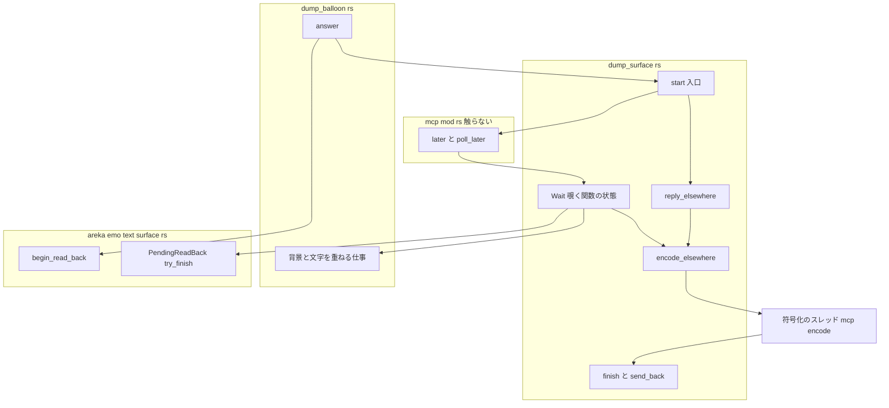
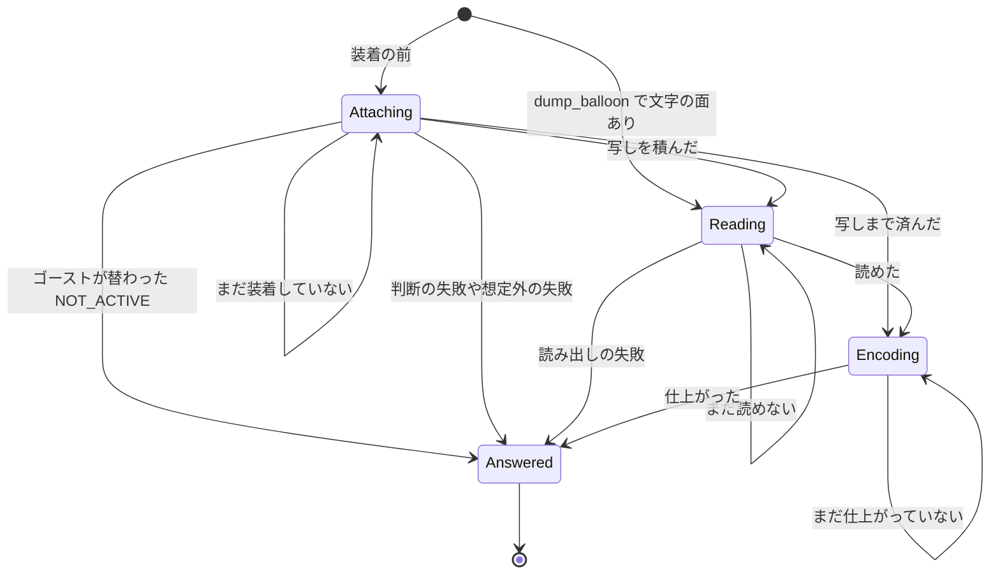
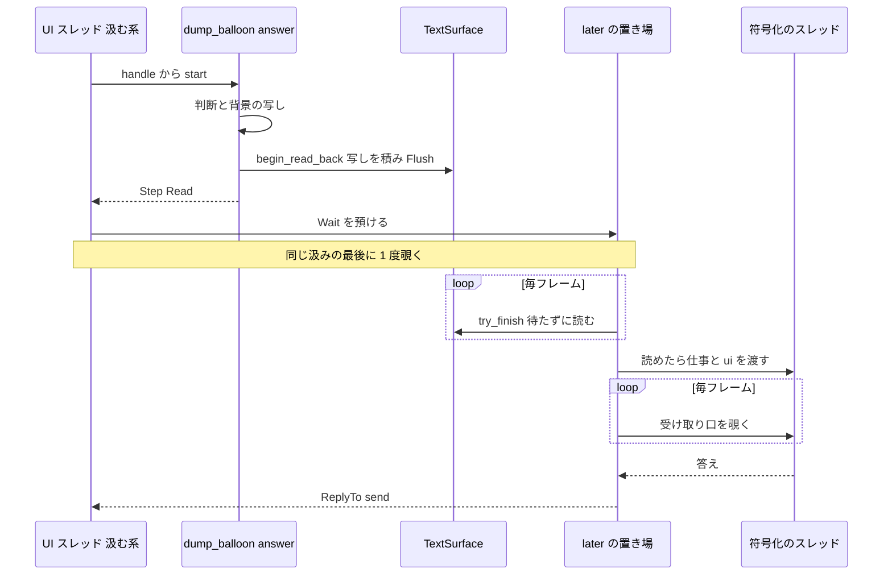

# Design Document

> 2026-10-05・本ブランチのコードを読んで書いた。コードは「何の定義か」（関数名・型名＋ファイルパス）で指す。調べた根拠と捨てた案は [research.md](research.md) の 10〜14 節（ギャップ分析は 1〜9 節）。

## Overview

**Purpose**: 前の spec（`areka-P0-mcp-dump-images`）の `dump_surface`／`dump_balloon` に残った後始末 5 件を片付ける。いちばん重いのは、`dump_balloon` が文字の面を GPU から読み戻す間、UI スレッドを最大 14.2 ms 塞いでいたこと。読み戻しを「写しを積む」と「待たずに読む」の 2 段に分け、読めるまでは後から答える置き場（`mcp::later`）で毎フレーム覗く。

**Users**: AI エージェントでゴーストを作る人（続けて撮る）と、areka を常駐させている利用者（撮られている間も描画が飛ばないことを求める）。

**Impact**: `dump_balloon` の成功の答えは、呼び出しを受けたフレームより 1 フレーム以上後に届くようになる。描画・アニメーション・台詞の進みは遅らせない。装着の前に預けた呼び出しも、符号化を UI スレッドの外で行う。答えの本文・画像の形・判断の文言とその順は変えない（例外は届かないはずの失敗の新しい文言 1 つ）。

### Goals

- `dump_balloon` が 1 回の呼び出しで UI スレッドを塞ぐ時間を、どのフレームでも 2 ms 以内にする（1.1）。
- 1 フレームで済まない仕事（装着待ち・読み出し待ち・符号化待ち）を 1 つの「覗く関数の状態」にまとめ、2 本のツールで共用する。
- 届かないはずの失敗に専用の文言を置き、判断の文言 4 つを想定外の失敗に使えないことを型で守る。
- 符号化のスレッドで出る記録を、共有のテストの道具を変えずにテストで数える。

### Non-Goals

- 前の spec の要件 7.7 ⑵ の撮り直し（`areka-P0-mcp-kanade-tools` の実機確認へ引き継ぎ済み）。
- 文言の SSP 寄せ（`areka-P0-mcp-strict-errors`）・新しいツール。
- `surface` を指定した `dump_surface` の UI スレッドの時間（前の spec の実機で 2.2 ms・範囲外の観測として要件に記録済み）。
- 全部の答えを後から答える置き場に通すこと（要件 4.5 の裁定）。

## Boundary Commitments

### This Spec Owns

- `crates/areka/src/mcp/dump_surface.rs` の答え方の部品: 答えの種 `Step`（`Read` の腕を足す）・入口 `start`・覗く関数の状態 `Wait`・符号化のスレッドの起こし方 `encode_elsewhere`・その体 `finish`／`send_back`・指定の surface の合成の結果から答えの種を作る `alone`。
- `crates/areka/src/mcp/dump_balloon.rs` の `answer` の形（文字の面が在るときは `Step::Read` を返す）と、背景と文字を重ねて符号化する仕事を作る関数。
- `crates/areka/src/mcp/dump_surface_judge.rs` の判断の文言の型 `Refusal`。
- `crates/areka-emo-text/src/surface.rs` の待たない読み戻しの 2 つの口（`TextSurface::begin_read_back`・`PendingReadBack::try_finish`）。
- 新しい文言 `NG:the shell of this scope is not ready`。
- 本 spec の `verification/signoff.md`（実機確認の記録）。

### Out of Boundary

- `crates/areka/src/mcp/mod.rs`（`later`・`poll_later`・`close`・`drain` は呼ぶだけ・読むだけ）。
- `crates/areka-mcp/`（`ReplyTo`・待ちの上限 10 秒・終了の途中の答え）。
- `crates/log-capture-kit/`（`capture`・`count_levels` を使うだけ。見張り `tests/with_default_guard_test.rs` の例外表も触らない）。
- `crates/areka-emo-text/src/` の `surface.rs` 以外のファイルと、新しいファイル。今の `TextSurface::read_back` の結果と記録の出し方。
- `crates/areka/src/emo2_boot/ghost_switch_test_support.rs`・`crates/areka/src/ghost_session.rs`・`crates/areka/src/emo2_boot/` の本番コード（使う・読むだけ）。
- 各 `Cargo.toml`（`windows` の機能の追加は 0）。

### Allowed Dependencies

- `super::later`（後から答える置き場に覗く関数を預ける）と `super::resolve::{active, ActiveGhost, NOT_ACTIVE}`。
- `areka_mcp::tools::{ReplyTo, outcome}`。
- `Emo2Wiring::{attached, presenter, runtime}`・`EmoPresenter::{last_shown, compose_alone, text_slot_view, target_visible, has_surface}`・`TextLayerRuntime::surface`（既存の読み口）。
- `areka_emo_text::surface::{TextSurface, PendingReadBack}`（`pub mod surface` から。`lib.rs` の再公開は足さない）。
- `windows` の `D3D11_MAP_FLAG_DO_NOT_WAIT`・`DXGI_ERROR_WAS_STILL_DRAWING`・`ID3D11DeviceChild::GetDevice`・`ID3D11DeviceContext::Flush`（どれも既に有効な機能の中）。
- 標準ライブラリの `std::sync::mpsc`・`std::thread::Builder`・`std::panic::catch_unwind`。
- テストだけ: `log_capture_kit::{capture, count_levels}`・`SwitchRig`・`standard_script`・`GpuRig`。

依存の向き: `areka-emo-text`（待たない読み戻しの口）← `dump_balloon.rs`（読む）→ `dump_surface.rs`（答え方の部品）→ `mod.rs`（`later`）。`dump_surface.rs` は `areka-emo-text` を知らない（読み出しは `Reader` という閉じた関数の形で受け取る）。

### Revalidation Triggers

- `mcp::later` の決まり（預けた直後の同じ汲みの中で 1 度覗く・待つ側が去ったら覗かずに落とす・`close` で置き場ごと落とす）が変わる。
- `TextSurface` の front 面の持ち方（ダブルバッファ・`flip`）や画素の形（B8G8R8A8・乗算済み）が変わる。
- `ActiveGhost` の見分けの欄（名前・ルートフォルダ）や `resolve::active` の読み方が変わる。
- 成功の記録 `[mcp] 絵を返す` の欄の名前（`ui_us`・`encode_us`）が変わる（実機確認の手順が読む）。

## Architecture

### Existing Architecture Analysis

- 入口 `handle`（2 本）は `answer`（UI スレッドの側）を呼び、`Some(step)` なら `reply_elsewhere` で符号化のスレッド（名前 `mcp-encode`）に仕上げさせてそこから答え、`None`（装着の前）なら `later` に覗く関数を預ける。預けた覗く関数は `Step::here` で UI スレッドで符号化まで行う（件 3）。
- `dump_balloon` の `answer` は、文字の面を `TextSurface::read_back`（写し → `Map(READ)` で GPU の終わりを待つ → 行ごとの写し）で読む（件 1）。
- `mod.rs` の `later` の覗く関数は `FnMut(&mut World) -> Option<ToolOutcome> + 'static` で、状態を持てて `Send` を求めない。待つ側が去れば覗かずに落とし、`close` で置き場ごと落とす。この形のまま、待つ仕組みを全部ツールのファイルの中に置ける。

### Architecture Pattern & Boundary Map



**Architecture Integration**:
- 選んだ形: 「1 フレームで済まない仕事は、覗く関数の状態として持ち、仕上がったら答える」。状態は装着待ち・読み出し待ち・符号化待ちの 3 つ。
- 境界: 待ち方は `dump_surface.rs`、何を読むかは `dump_balloon.rs`、GPU の読み出しは `surface.rs`。`dump_surface.rs` は文字の層を知らない。
- 保つ形: 判断と絵の写しは UI スレッド・乗算を戻す／重ね合わせ／PNG／base64 は符号化のスレッド。装着の後の `dump_surface` の成功は今どおり符号化のスレッドから直接答える。
- steering: 描画を遅らせない（遅れるのは答えだけ）・時刻は丸めない（`ui_us` は実測の最大）・想定外の失敗は `error!` 1 件と `NG:`・判断の失敗は `debug!` まで。

### Technology Stack

| Layer | Choice / Version | Role in Feature | Notes |
|-------|------------------|-----------------|-------|
| GPU | Direct3D11（`windows` 0.62.2） | 写し先への `CopyResource`・`Flush`・`Map` に `D3D11_MAP_FLAG_DO_NOT_WAIT` | 機能の追加なし。`DXGI_ERROR_WAS_STILL_DRAWING` を「まだ」と読む |
| 並行 | `std::thread`・`std::sync::mpsc` | 符号化のスレッドと、その答えの受け取り口 | 新しい依存なし |
| テスト | `log-capture-kit`（ワークスペース内） | 呼んだスレッドの記録を数える | 変えない |

## File Structure Plan

### Modified Files

- `crates/areka-emo-text/src/surface.rs` — 待たない読み戻しの 2 つの口と札 `PendingReadBack` を足す。写し先の作り方と行ごとの写しを「記録を出さない部分」としてくくり出し、今の `read_back`・`create` はくくり出した部分の失敗に今どおり `error!` をつけて使う。`mod tests` に 2 本足す（下の Testing Strategy）。今 817 行・足して 1,000 行を超えない（見込み 940 行前後）。
- `crates/areka/src/mcp/dump_surface.rs` — `Step` に `Read` を足し `Step::here` を消す。`Reader`・`start`・`Wait`（と状態の列挙 `Stage`）・`encode_elsewhere`・`finish`・`send_back`・`alone` を足す。`reply_elsewhere` は形を変えず中身を `encode_elsewhere` に寄せる。`handle` は `start` を呼ぶだけになる。`refuse` は `judge::Refusal` を受ける。`compose_alone` の「無い」の腕は `alone` の中で新しい文言の `fail` になる。
- `crates/areka/src/mcp/dump_surface_judge.rs` — 判断の文言 4 つを型 `Refusal` の定数にし、`judge_surface`・`judge_balloon`・`facts_and_scope` の `Err` の型を `Refusal` にする。文言そのものは変えない。
- `crates/areka/src/mcp/dump_balloon.rs` — `answer` が文字の面の写しを積み、`Step::Read` を返す（文字の面が無ければ今どおり `Step::Encode`）。背景と文字を重ねて符号化する仕事を作る関数を 1 つ置き、両方の腕で使う。`handle` は `start` を呼ぶだけになる。
- `crates/areka/src/mcp/dump_surface_tests.rs` — 決定論テストを足す（2.1・3.x・4.x・5.x）。
- `crates/areka/src/mcp/dump_balloon_tests.rs` — 成功の記録の欄のテストを足す（5.3）。
- `crates/areka/src/mcp/dump_surface_judge_tests.rs` — 手書きの補助関数 `surface` の戻り値の型を `Refusal` に合わせる（期待する値は変えない）。
- `crates/areka/src/mcp/dump_surface_gpu_test_support.rs` — `GpuRig` に「台詞の時計を止めたままフレームを回して答えを待つ」口を足す。
- `crates/areka/src/mcp/dump_balloon_gpu_tests.rs` — 成功の待ち方を上の口に替える（期待する値は変えない・6.2）。1.3・5.1 のテストを足す。
- `crates/areka/src/mcp/dump_surface_gpu_tests.rs` — 5.1 のテスト（本物の仕事を捕まえる）を足す。
- `.kiro/specs/areka-P0-mcp-dump-images-residue/verification/signoff.md` — 新規。実機確認の記録（7.2・7.3）。

新しいソースファイルは足さない。

### 触る約束の外のファイル（ウェーブ C4 の約束との照合）

なし。触るファイルは brief「触るファイル」の一覧（`crates/areka/src/mcp/{dump_surface.rs, dump_surface_judge.rs, dump_balloon.rs}`・各テスト・`dump_surface_gpu_test_support.rs`・`crates/areka-emo-text/src/surface.rs`）の内だけ。`crates/areka/src/mcp/mod.rs`・`crates/log-capture-kit/`・`crates/areka-emo-text/src/lib.rs` には触らず、`areka-emo-text` に新しいファイルを足さない。

## System Flows

### 覗く関数の状態



- 「替わったか」は装着待ちの覗きの入口でだけ確かめる（4.2・4.5）。写した後（読み出し待ち・符号化待ち）は、写した時点の絵を返す。
- 1 回の覗きは、進める限り続けて進める（例: 装着した覗きで写しまで済めば、その覗きの中で符号化のスレッドを起こし、受け取り口を 1 度覗く）。どの段でも待たない。

### 装着の後の `dump_balloon`



- 写しを積んだ時点で GPU の仕事の並びが決まるので、後のフレームで台詞が進んで front 面が描き替わっても、写し先には呼び出しを受けた時点の中身が入る（1.3）。背景は同じ呼び出しの中で `to_vec` で写す。
- 待つ側が去れば `poll_later` が覗く関数を落とし、札（写し先）と受け取り口も落ちる。符号化のスレッドの送りは失敗して黙って終わる（3.5）。終了が始まれば `close` が置き場ごと落とす（1.6）。

## Requirements Traceability

| Requirement | Summary | Components | Interfaces | Flows |
|-------------|---------|------------|------------|-------|
| 1.1 | どのフレームも 2 ms 以内 | `Wait`・`begin_read_back`・`try_finish` | `Wait::poll`・`ui_us` | 装着の後の `dump_balloon` |
| 1.2 | GPU の終わりを UI スレッドで待たない | `begin_read_back`・`try_finish` | `Map` に `DO_NOT_WAIT` | 同上 |
| 1.3 | 背景と文字は呼び出しを受けた時点 | `dump_balloon::answer`・`begin_read_back` | 呼び出しごとの写し先 | 同上 |
| 1.4 | 答えを待たせても描画を遅らせない | `Wait` | 覗きは待たない | 状態図 |
| 1.5 | 読み出しの失敗は `NG:` と `error!` 1 件 | `try_finish`（記録しない）・`dump_balloon` の `Reader`（`fail`） | `TextLayerError` | 状態図 Reading → Answered |
| 1.6 | 終了の途中は入口の決まりのまま | `mod.rs` の `close`（既存）・`Wait` | 置き場ごと落ちる | 装着の後の `dump_balloon` |
| 2.1 | 届かない枝の新しい文言 | `alone` | `fail(…, "the shell of this scope is not ready")` | — |
| 2.2 | 判断の文言を想定外の失敗に使わない | `judge::Refusal`・`refuse`・`fail` | 型で分ける | — |
| 3.1 | 装着の前も符号化は UI スレッドの外 | `Wait`（Attaching → Encoding）・`encode_elsewhere` | `send_back` | 状態図 |
| 3.2 | 仕上がるまで待たせる | `Wait`（Encoding） | `Receiver::try_recv` | 状態図 |
| 3.3 | panic は `NG:the encoding thread panicked` | `finish` | `catch_unwind` | — |
| 3.4 | スレッドを起こせない → `NG:` と `error!` | `encode_elsewhere` | `fail` | — |
| 3.5 | 待つ側が去った後は黙って捨てる | `send_back`・`mod.rs` の `poll_later`（既存） | 送りの失敗を無視 | — |
| 4.1 | 解決したゴースト以外の絵を含めない | `Wait`（Attaching の確かめ）・`answer` | `resolve::active` | 状態図 |
| 4.2 | 写す前に替わったら `NG:Specified ghost is not active` | `Wait` | `ActiveGhost` の比較・`debug!` | 状態図 |
| 4.3 | 起きうるかの確かめを残す | research.md 4 節・本書「件 5 の確かめ」 | — | — |
| 4.4 | 起きなくても振る舞いを保つ | `Wait` | — | — |
| 4.5 | 写した後は写した時点の絵 | `Wait`（Reading・Encoding では確かめない） | — | 状態図 |
| 5.1 | 両スレッドの ERROR を判定 | テスト: `finish` を捕まえる・答えで判定 | `count_levels`・`capture` | — |
| 5.2 | 捕まえる道具の較正 | テスト: わざと失敗させる仕事（Unit Test 2・Integration Test 2） | `finish`・`is_picture` | — |
| 5.3 | 成功の記録の `ui_us`・`encode_us` | `picture` の仕事・`dump_balloon` の仕事・`Wait`（`ui` の算出） | `debug!` の欄 | — |
| 6.1 | 前の振る舞いを保つ | 全部品（文言・順・画像の形は変えない） | — | — |
| 6.2 | 前のテストを緑のまま | `GpuRig` の待ち方の口 | — | — |
| 7.1 | 決定論テスト ⑴〜⑺ | Testing Strategy | — | — |
| 7.2 | 実機確認 | `verification/signoff.md` | — | — |
| 7.3 | 実機の置き場は `target\` の下 | `verification/signoff.md` | — | — |

## Components and Interfaces

| Component | 置き場 | Intent | Req | 主な依存 |
|-----------|--------|--------|-----|----------|
| 待たない読み戻しの口 | `surface.rs` | 写しを積む・待たずに読む | 1.2, 1.3, 1.5 | D3D11 |
| `Step`・`Reader` | `dump_surface.rs` | UI スレッドの側の答えの種 | 1.x, 3.x | — |
| `start` | `dump_surface.rs` | 2 本のツールの入口の共通部分 | 1.x, 3.x, 4.x | `later`・`reply_elsewhere` |
| `Wait`・`Stage` | `dump_surface.rs` | 覗く関数の状態 | 1.1, 1.4, 3.1, 3.2, 4.x, 5.3 | `resolve::active` |
| `encode_elsewhere`・`finish`・`send_back` | `dump_surface.rs` | 符号化のスレッドを起こす・その体 | 3.3, 3.4, 3.5, 5.1, 5.2 | `std::thread` |
| `alone` | `dump_surface.rs` | 指定の surface の合成の結果 → 答えの種 | 2.1 | `fail` |
| `judge::Refusal` | `dump_surface_judge.rs` | 判断の文言の型 | 2.2 | — |
| `dump_balloon::answer`・`balloon_job` | `dump_balloon.rs` | 写しを積んで `Step::Read` | 1.3, 1.5, 5.3 | 待たない読み戻しの口 |

### 文字の層

#### 待たない読み戻しの口（`crates/areka-emo-text/src/surface.rs`）

| Field | Detail |
|-------|--------|
| Intent | front 面の写しを呼び出しごとの写し先へ積み、後のフレームで待たずに読む |
| Requirements | 1.2, 1.3, 1.5 |

**Responsibilities & Constraints**
- `begin_read_back` は、写し先（CPU で読める・面と同じ大きさ）を新しく作り、`CopyResource(写し先, front)` を積み、`Flush` で GPU へ送って札を返す。GPU の終わりを待たない。
- `try_finish` は写し先を `Map(READ, DO_NOT_WAIT)` で開こうとし、`DXGI_ERROR_WAS_STILL_DRAWING` なら `Ok(None)`、開けたら行ごとに密な BGRA の配列へ写して `Unmap` し `Ok(Some)` を返す。`Map` を開いたまま戻らない。
- 2 つの口は記録を出さない（失敗は `TextLayerError::Device { hresult, context }` を返すだけ）。記録は呼び手が 1 件だけ出す（1.5）。これは `TextLayerError` の「記録して `Err`」の決まりの例外で、口の文書注釈にそう書く。
- 札は写し先と文脈の参照だけを持ち、`TextSurface` を借りない。札を落としても `Map` は開いていないので後始末は要らない。面が作り直されても（拡大率の変更）札は自分の写し先を持ち続ける。
- 今の `read_back` は、結果も記録の出し方も変えない（写し先は今どおり `TextSurface` の 1 枚を使う）。

##### Service Interface

```rust
/// 待たない読み戻しの札（写し先と文脈の参照だけを持つ・UI スレッド専有）。
pub struct PendingReadBack {
    staging: ID3D11Texture2D,
    context: ID3D11DeviceContext,
    size: (u32, u32),
}

impl TextSurface {
    /// 今の front 面を呼び出しごとの写し先へ写す仕事を積み、GPU へ送る（待たない・記録しない）。
    pub fn begin_read_back(&self) -> Result<PendingReadBack, TextLayerError>;
}

impl PendingReadBack {
    /// 待たずに読む。まだなら Ok(None)。読めたら stride = 幅×4 の密な BGRA（記録しない）。
    pub fn try_finish(&self) -> Result<Option<Vec<u8>>, TextLayerError>;
    /// 写し先の大きさ（物理 px・積んだ時点の面の大きさ）。
    pub fn size(&self) -> (u32, u32);
}

/// `Map` の失敗が「GPU がまだ使っている」か（`DXGI_ERROR_WAS_STILL_DRAWING`）。
fn still_drawing(code: HRESULT) -> bool;
```
- Preconditions: UI スレッド（即時の文脈を作ったスレッド）で呼ぶ。
- Postconditions: `try_finish` が `Ok(Some(bytes))` を返したら `bytes.len() == 幅 × 高さ × 4`。`begin_read_back` の後に front 面が描き替わっても、読める中身は積んだ時点の front 面。
- Invariants: どちらの口も GPU の終わりを待たない。どちらの口も `error!` を出さない。

**Implementation Notes**
- 写し先の作り方（`D3D11_USAGE_STAGING`・`CPU_ACCESS_READ`）は今の `create_staging` と同じ記述を共用し、装置は文脈から `GetDevice` で引く。
- 行ごとの写し（`RowPitch` < 幅×4 の検査を含む）は `read_back` と共用する。共用部分は記録を出さず、`read_back` の側で今どおり `error!` をつける。
- 危険: 写し先の作成と行ごとの写しの時間は実機確認で測る（research.md 14 節に収まらないときの手）。

### 答え方の部品（`crates/areka/src/mcp/dump_surface.rs`）

#### `Step`・`Reader`・`start`

| Field | Detail |
|-------|--------|
| Intent | UI スレッドの側の答えの種と、2 本のツールの入口の共通部分 |
| Requirements | 1.1, 1.4, 3.1, 4.1 |

```rust
/// 符号化のスレッドで行う残りの仕事（引数は UI スレッドの側の時間＝1 フレームの最大）。
pub(in crate::mcp) type Job = Box<dyn FnOnce(Duration) -> ToolOutcome + Send>;

/// 文字の面の読み出しを待つ口。覗くたびに 1 度呼ぶ。Ok(None)＝まだ・Ok(Some(job))＝読めた・
/// Err＝想定外の失敗の答え（`fail` で記録済み）。UI スレッドだけで呼ぶ（Send でない）。
pub(in crate::mcp) type Reader = Box<dyn FnMut() -> Result<Option<Job>, ToolOutcome>>;

pub(in crate::mcp) enum Step {
    /// その場で答える（判断の失敗・写しまでの想定外の失敗）。
    Now(ToolOutcome),
    /// 写しまで済んだ（スコープ, 残りの仕事）。
    Encode(u32, Job),
    /// 文字の面の写しを積んだ（スコープ, 読み出しを待つ口）。dump_balloon だけが返す。
    Read(u32, Reader),
}

/// 2 本のツールの入口。`answer` を 1 度呼び、Now／Encode は reply_elsewhere で、
/// Read と None（装着の前）は Wait にして later へ預ける。
pub(in crate::mcp) fn start(
    world: &mut World,
    tool: &'static str,
    ghost: &ActiveGhost,
    reply: ReplyTo,
    answer: impl FnMut(&World) -> Option<Step> + 'static,
);
```
- 各ツールの `handle` は `start(world, TOOL, ghost, reply, move |w| answer(w, &args))` の 1 行になる。
- `reply_elsewhere(tool, step, started, reply)` は形を変えない（前の spec のテストが呼ぶ）。中身は `encode_elsewhere(…, reply, ReplyTo::send)` に寄せる。`start` は `Read` を渡さないが、渡されたときは `fail(tool, scope, "the text read was handed to the wrong path")` で答える（届かない腕を黙らせない）。
- `Step::here` は消す（3.1）。

#### `Wait`・`Stage`（覗く関数の状態）

| Field | Detail |
|-------|--------|
| Intent | 1 フレームで済まない仕事を、待たずに毎フレーム 1 段ずつ進める |
| Requirements | 1.1, 1.4, 1.6, 3.1, 3.2, 3.5, 4.1, 4.2, 4.4, 4.5, 5.3 |

**Contracts**: State [x]

##### State Management

```rust
struct Wait<A> {
    tool: &'static str,
    /// 呼び出しを解決したゴースト（名前とルートフォルダ・4.2）。
    ghost: ActiveGhost,
    stage: Stage,
    answer: A,
    /// 預けた直後の覗きに足す、入口（handle）で使った時間。
    carry: Duration,
    /// これまでの 1 フレームの UI スレッドの時間の最大。
    ui_max: Duration,
}

enum Stage {
    /// 装着待ち。覗くたびにゴーストを確かめてから answer をやり直す。
    Attaching,
    /// 読み出し待ち（スコープ, 読み出しを待つ口）。
    Reading(u32, Reader),
    /// 符号化待ち（スコープ, 答えの受け取り口）。
    Encoding(u32, Receiver<ToolOutcome>),
}

impl<A: FnMut(&World) -> Option<Step>> Wait<A> {
    /// 1 フレームぶん進める。待たない。Some を返したら答えて組を外す。
    fn poll(&mut self, world: &World) -> Option<ToolOutcome>;
}
```

- 状態の移り方（上の状態図の正本）:
  - `Attaching`: `resolve::active(world)` が覚えた `ghost` と等しくなければ（無い・別のゴースト）、`debug!` 1 件と `outcome::ng(resolve::NOT_ACTIVE)` で答える（4.2・ERROR なし）。等しければ `answer`: `None` → まだ。`Now` → 答える。`Encode` → 符号化を起こして `Encoding`。`Read` → `Reading`。
  - `Reading`: `Reader` を 1 度呼ぶ。`Ok(None)` → まだ。`Err(o)` → 答える（1.5）。`Ok(Some(job))` → 符号化を起こして `Encoding`。
  - `Encoding`: `try_recv`。届いた → 答える。空 → まだ。切れた（届けずにスレッドが終わった・`finish` が必ず届けるので届かない）→ `fail(tool, scope, "the encoding thread is gone")`。
- 同じ ゴースト の見分けは `ActiveGhost` の等しさ（名前とルートフォルダ）。同じゴーストを起こし直したときは同じと見なす（4.2 の決まり）。
- 時間の数え方（5.3・1.1）: 1 回の `poll` の始めから戻るまでを 1 フレームの時間とし、最初の `poll` には `carry` を足す（本番では `handle` と最初の覗きは同じ汲みの中で起きるので、足したものが 1 フレームの時間になる。テストのように汲みの外で `handle` を呼ぶと多めに数えるが、判定の側に倒れる）。戻るたびに `ui_max` を更新する。符号化を起こすときは、`encode_elsewhere` が**スレッドを起こし終えた後**（手渡しの直前）に `max(ui_max, 今の覗きのここまで)` を測り、仕事・届け先と一緒に手渡す（スレッドを起こす時間も `ui_us` に入る・設計の検証の指摘 1）。値に入らないのは、手渡しの 1 回の送り（チャンネルへ 1 件積むだけ）と、手渡した後のフレームの受け取り口の覗き（`try_recv` 1 回）だけ。どちらも値を手渡した後に起きるので入れようがなく、その旨を成功の記録の欄の説明（Monitoring）にも書く。
- 待たない: どの段も GPU・スレッド・チャンネルの終わりを待たない（1.4）。描画の段とは別の、汲む系の最後で呼ばれる。
- 待つ側が去った・終了が始まった: `mod.rs` の `poll_later`・`close` が `Wait` ごと落とす。札（写し先）・受け取り口・`answer` が落ちるだけで、記録は出さない（1.6・3.5）。

#### `encode_elsewhere`・`finish`・`send_back`

| Field | Detail |
|-------|--------|
| Intent | 符号化のスレッドを起こし、仕事を走らせて答えを届け先へ送る |
| Requirements | 3.1, 3.3, 3.4, 3.5, 5.1, 5.2 |

```rust
/// 符号化のスレッド（名前 `mcp-encode`）を起こし、起こし終えた後に `ui()` で UI スレッドの側の
/// 時間を測って、(仕事, 届け先, 時間) を手渡す。起こせなければ
/// `deliver(to, fail(tool, scope, 理由))`。手渡しの前にスレッドが消えていたら
/// `deliver(to, fail(tool, scope, "the encoding thread is gone"))`。必ず 1 度だけ届ける。
fn encode_elsewhere<T: Send + 'static>(
    tool: &'static str,
    scope: u32,
    job: Job,
    ui: impl FnOnce() -> Duration,
    to: T,
    deliver: fn(T, ToolOutcome),
);

/// 符号化のスレッドの体。仕事を panic を受けて走らせ、panic なら
/// `fail(tool, scope, "the encoding thread panicked")`。
pub(in crate::mcp) fn finish(tool: &'static str, scope: u32, job: Job, ui: Duration) -> ToolOutcome;

/// 覗く関数の受け取り口へ送る。待つ側が去って受け取り口が無ければ黙って捨てる（3.5）。
pub(in crate::mcp) fn send_back(tx: Sender<ToolOutcome>, outcome: ToolOutcome);
```
- 届け先は 2 つ: 装着の後の `dump_surface`（`reply_elsewhere`）は `ReplyTo` と `ReplyTo::send`、`Wait` は `Sender<ToolOutcome>` と `send_back`。
- 時間の測り方 `ui` は、`reply_elsewhere` が `|| started.elapsed()`、`Wait` が「`max(ui_max, carry ＋ 今の覗きの始めから)`」を渡す。今の `reply_elsewhere` はスレッドを起こす前に測っているので、装着の後の `dump_surface` の `ui_us` もこの直しで起こす時間を含むようになる。
- 符号化のスレッドで走るのは、手渡しを受け取る 1 行と `deliver(to, finish(...))` だけ。符号化のスレッドで記録を出しうるのは `finish` の中（仕事の中の成功の `debug!`・`fail` の `error!`・panic を受けた `fail` の `error!`）だけで、`send_back`・`ReplyTo::send` は記録しない。これが要件 5.1 の判定の前提（Testing Strategy）。
- 待つ側が去った後に仕事が panic したときの `error!` は残る（3.5 の但し書き）。

#### `alone`

| Field | Detail |
|-------|--------|
| Intent | 指定の surface を単体で描いた結果から答えの種を作る |
| Requirements | 2.1 |

```rust
/// `compose_alone` の結果 → 答えの種。None（判断がスコープを確かめた後なので届かない）は
/// `fail(TOOL, scope, "the shell of this scope is not ready")`。
fn alone(
    scope: u32,
    surface_id: u32,
    composed: Option<Result<ComposedSurface, ComposeError>>,
) -> Step;
```
- `answer` の `SurfacePlan::Alone` の腕は `alone(scope, surface_id, presenter.compose_alone(...))` だけになる。`Some(Ok)`・`Some(Err)` の振る舞いは今のまま。

#### `judge::Refusal`（`crates/areka/src/mcp/dump_surface_judge.rs`）

| Field | Detail |
|-------|--------|
| Intent | 判断の文言を想定外の失敗の文言と型で分ける |
| Requirements | 2.2 |

```rust
/// 判断の失敗の理由（`NG:` の後ろ）。`refuse` だけが受け取る。
#[derive(Debug, Clone, Copy, PartialEq, Eq)]
pub(in crate::mcp) struct Refusal(&'static str);

pub(in crate::mcp) const NO_WINDOW: Refusal = Refusal("This ghost has no window");
// NO_SUCH_SCOPE・NO_SUCH_SURFACE・NOT_SHOWN_YET も同じ形（文言は変えない）。

impl Refusal {
    /// 文言（`refuse` が `outcome::ng` と `debug!` へ渡すときだけ使う）。
    pub(in crate::mcp) fn as_str(self) -> &'static str;
}

pub(in crate::mcp) fn refuse(tool: &str, scope: Option<i64>, reason: Refusal) -> ToolOutcome; // dump_surface.rs
pub(in crate::mcp) fn fail(tool: &str, scope: u32, reason: &str) -> ToolOutcome;               // 変えない
```
- `Refusal` の欄は判断のモジュールの外から作れない（欄は非公開・作れるのは定数 4 つだけ）。`fail(…, judge::NO_SUCH_SCOPE)` は組み立てで落ちる。`as_str` を通して `fail` へ渡すのは、わざと型を外す書き方なのでレビューで見つかる。

### `dump_balloon`（`crates/areka/src/mcp/dump_balloon.rs`）

| Field | Detail |
|-------|--------|
| Intent | 判断と背景の写しと文字の面の写しの積み込みを UI スレッドで行い、読めたら重ねて符号化する |
| Requirements | 1.1, 1.2, 1.3, 1.5, 5.3 |

- `answer` の判断・背景の写し・`check_size`・文字の領域の `Arrangement` の取り出し・面の大きさの検査は今のまま。文字の面が在るとき、`read_back` の代わりに `begin_read_back` で写しを積み、失敗は `fail(TOOL, scope, 理由)` で `Step::Now`。成功は `Step::Read(scope, reader)`。
- `reader` は札・背景の写し・大きさ・文字の領域の原点を持ち、覗かれるたびに `try_finish`: `Ok(None)` → `Ok(None)`。`Err(e)` → `Err(fail(TOOL, scope, &e.to_string()))`（1.5 の 1 件）。`Ok(Some(bytes))` → 長さが文字の面の大きさ×4 でなければ `Err(fail(TOOL, scope, "picture size mismatch"))`、合えば重ねる仕事を作って `Ok(Some(job))`。
- 重ねる仕事は 1 つの関数で作る（文字の面が無いとき `Step::Encode` の仕事も同じ関数・重ねる層が `None`）。仕事の中身（重ね合わせ・PNG・base64・成功の `debug!` の欄）は今のまま。

```rust
/// 文字の面の読み出し（物理の大きさ, 密な BGRA, 面の大きさ, 文字の領域の原点）。
type TextLayer = ((u32, u32), Vec<u8>, (u32, u32), (f32, f32));

/// 背景（乗算済み BGRA の写し）に文字を重ね、PNG・base64 にして成功で答える仕事。
fn balloon_job(scope: u32, canvas: Vec<u8>, size: (u32, u32), layer: Option<TextLayer>) -> Job;
```

### 件 5 の確かめ（4.3）

- 結果: 今の areka で起きうる。道筋は research.md 4 節（切替先 B が装着の前に失敗して既定のゴーストへ戻ると、預けた覗く関数が既定のゴーストの結線状態を読み、その絵を B の名前を添えて返す）。定義の名前: `ghost_switch::switch_to`・`switch_to_default`・`on_ghost_stopped`・`commit_ghost_windows`・`Emo2Wiring::attached`・前の spec の `dump_surface::handle` の覗く関数。
- 本設計の後: 装着待ちの覗きは毎回 `resolve::active` と覚えたゴーストを比べるので、上の道筋では B が去った時点で `NG:Specified ghost is not active` になる（4.2）。読み出し待ち・符号化待ちは写した時点の絵を返す（4.5）。起きるかどうかに依らず、確かめは常に入る（4.4）。

## Error Handling

### Error Strategy

| 起きたこと | 答え | 記録 | 要件 |
|---|---|---|---|
| 判断の失敗 4 つ | `NG:`＋文言（今のまま） | `debug!` | 6.1 |
| 装着待ちの間にゴーストが替わった | `NG:Specified ghost is not active` | `debug!` | 4.2 |
| `compose_alone` が「無い」 | `NG:the shell of this scope is not ready` | `error!` 1 件 | 2.1 |
| 写し先を作れない・写しを積めない | `NG:device call failed: …` | `error!` 1 件（`fail`） | 1.5 |
| 待たずに読んで「まだ」 | 答えない（次のフレームで覗く） | なし | 1.5 |
| 読み出しの失敗 | `NG:device call failed: …` | `error!` 1 件（`fail`・層は記録しない） | 1.5 |
| 読めた大きさが合わない | `NG:picture size mismatch` | `error!` 1 件 | 6.1 |
| 符号化の panic | `NG:the encoding thread panicked` | `error!` 1 件（符号化のスレッド） | 3.3 |
| スレッドを起こせない | `NG:`＋起こせない理由 | `error!` 1 件 | 3.4 |
| 手渡しの前にスレッドが消えた・届けずに終わった | `NG:the encoding thread is gone` | `error!` 1 件 | 3.4 |
| 待つ側が去った・終了が始まった | 入口の決まりのまま（答えは捨てる） | なし（仕事の panic の `error!` は残る） | 1.6, 3.5 |

### Monitoring

- 成功の記録 `[mcp] 絵を返す`（`debug!`）の欄 `ui_us`（1 フレームで UI スレッドを塞いだ時間の最大・µs。符号化のスレッドを起こす時間を含み、手渡しの 1 回の送りと手渡した後の受け取り口の覗きは含まない）と `encode_us`（符号化のスレッドの時間・µs）を、実機確認で `RUST_LOG=info,areka::mcp=debug,areka_mcp=debug` で読む。

## Testing Strategy

GPU を要するテストは、このリポジトリの定石（常時テストに入れる条件・画面外の描画先での画素の検証・`#[cfg(all(test, target_pointer_width = "64"))]` の `GpuRig`）に従う。判定は集めてから 1 回の `assert_eq!` で行う。

### 符号化のスレッドの記録の判定（5.1・5.2 の前提）

- 符号化のスレッドで走るのは手渡しの 1 行と `deliver(to, finish(...))` だけ（Components の `encode_elsewhere` 節）。よって、
  - **仕事を直接捕まえる**: 本物の仕事（GPU を通るテストでは `answer` の `Step::Encode`、`dump_balloon` は `Step::Read` の `Reader` をフレームを回して `Ok(Some(job))` まで進めたもの）を、テストのスレッドで `count_levels(|| finish(...))` の中で走らせ、ERROR 0 件を判定する。
  - **答えで判定する**: 本番の入口を通るテストは、答えが `NG:` でない（画像つきの成功）ことを判定する。符号化のスレッドで出る `error!` は必ず `fail` を通って `NG:` の答えになるので、答えが成功なら符号化のスレッドの `error!` は 0 件。この判定は 1 つの関数 `is_picture(&ToolOutcome) -> bool`（`dump_surface_tests.rs` に置き、GPU のテストからも使う）にまとめ、Integration Test 2 で本物の符号化のスレッドの失敗に対して偽を返すことを較正する（5.2・設計の検証の指摘 3）。
  - UI スレッドの記録は今どおり、呼び出しとフレームを回す部分を `count_levels` で囲んで数える。

### Unit Tests（窓も GPU も要らない）

1. `alone(0, 0, None)` を `capture` の中で呼ぶと、`Step::Now` の本文が `NG:the shell of this scope is not ready`・`isError: true`・画像なしで、ERROR が 1 件（7.1 ⑵・2.1）。
2. `finish` の較正（5.2）: panic する仕事 → 本文 `NG:the encoding thread panicked` と ERROR 1 件。`fail` を呼ぶ仕事 → ERROR 1 件。成功する仕事 → ERROR 0 件。同じ判定の関数（ERROR の件数を返す）が前の 2 つで 1、最後で 0 を返すことを確かめる。
3. `send_back` へ受け取り口を落とした `Sender` を渡し、`capture` の中で `send_back(tx, finish(...))` を呼ぶと、panic せず ERROR 0 件（7.1 ⑸・3.5）。
4. 成功の記録の欄（7.1 ⑺・5.3）: `dump_surface` の `picture`（1×1 の絵）と `dump_balloon` の `balloon_job`（文字の層なし・1×1）の `Job` を `ui = 1,234 µs` で `capture` の中で `finish` に通すと、`[mcp] 絵を返す` が 1 件で、`ui_us` が `1234`、`encode_us` が数として読める（`dump_balloon_tests.rs` と `dump_surface_tests.rs`）。
5. 文字の層の `still_drawing`: `DXGI_ERROR_WAS_STILL_DRAWING` は真・`E_FAIL` は偽（1.5 の「まだ」と失敗の分かれ目・`surface.rs` の `mod tests`）。
6. 文字の層の待たない読み戻し（`surface.rs` の `mod tests`・WARP 可）: front 面へ既知の模様 P を直に書き、`begin_read_back` の後に front 面を別の模様 Q で書き替え、`try_finish` を読めるまで（有界に）呼ぶと P が全バイト一致で返る（1.3 の層の側の固定。往復できることも同時に固定する）。

### Integration Tests（窓の無い `SwitchRig`・GPU 不要・`dump_surface_tests.rs`）

`SwitchRig` で A を起こし（窓を作らないので装着は起きない）、`mcp::install` で置き場を据え、本番の `start`（または `handle`）に呼び出しを渡し、`rig` の巡（`Input` の段の汲む系が `poll_later` を回す）で進める。

1. 装着の前に預けた呼び出しの符号化（7.1 ⑶・3.1・3.2）: `start` に、2 回目の覗きで `Step::Encode`（自分の走ったスレッドの名前を本文に書く仕事）を返す `answer` を渡す。答えの本文が `OK:mcp-encode` で、預けた巡の中では答えていない。
2. 装着の前に預けた呼び出しの panic（7.1 ⑷・3.3・5.2）: 上と同じで仕事が panic → 本文 `NG:the encoding thread panicked`。同じ答えを `is_picture` に通すと偽になる（本物の `mcp-encode` での失敗に、答えで判定する側が赤を返すことの較正）。比べに、1×1 の絵を返す仕事を同じ形で預けた答えでは `is_picture` が真になることも確かめる（判定が常に偽を返す誤りを除く）。
3. 待つ側が去った後（7.1 ⑸・3.5）: 仕事を止め札（チャンネル）で止めたまま `Encoding` まで進め、`Pending` を落として巡を 1 回回すと、置き場（`McpLater` の列・`mcp` の子のモジュールから読める）の組が 0 件になる（覗く関数ごと落ちた）。その後に仕事を放して巡を回しても、UI スレッドの ERROR は 0 件で panic しない（符号化のスレッドの側の「送れなくても黙る」は Unit Test 3 が判定する）。
4. 預けている間にゴーストが替わる（7.1 ⑹・4.2）: A の `OnBoot` の台本を `\0A\![change,ghost,B]\e` にし、起こした直後（巡の前）に本物の `dump_surface::handle` を A で呼ぶ。B が定常に達するまで巡を回すと、答えが `NG:Specified ghost is not active`・`isError: true` で、`[mcp]` の記録に ERROR が無い（切り替えの手順そのものの記録は判定に入れない）。
5. 同じゴーストの起こし直し（4.2 の「同じと見なす」）: A の台本を `\0A\![change,ghost,A]\e` にすると、A が起こし直されて定常に達しても答えは届かない（まだ装着待ち）。
- 4・5 の切り替えは本番の切り替えの手順を通す（前例 `ghost_session_switch_tests.rs` の `script_change_tag_switches_a_to_b_and_reaches_steady`・`switch_to_self_takes_down_and_reboots_a`）。

### GPU を通るテスト

1. 1.3 の固定（7.1 ⑴）: 台詞 1 行を出し、そのときの背景の合成と文字の面（`read_back`）から期待の絵を作る。`dump_balloon::answer` を直接呼んで `Step::Read` を受け取り、台詞を進めるフレームを、文字の面の `read_back` が期待と違うようになるまで回してから（非空虚性）、`Reader` を読めるまで呼び、仕事を走らせた絵が期待の絵と一致する。
2. 5.1（`dump_balloon`）: 上と同じ形で得た本物の仕事を `count_levels(|| finish(...))` で走らせ、ERROR 0 件と画像つきの成功。
3. 5.1（`dump_surface`）: `answer` の `Step::Encode` の本物の仕事を同じ形で走らせ、ERROR 0 件と画像つきの成功。
4. 既存の `dump_balloon` の成功の呼び出し（`balloon_text_lies_on_the_background_at_the_text_area_origin` ほか）は、待ち方を `GpuRig` の「台詞の時計を止めたままフレームを回して答えを待つ」口に替える。期待する値は変えない（6.2）。`dump_surface` の装着の後の成功は今どおり符号化のスレッドから直接答えるので、待ち方も変えない。
5. 既存の `before_attachment_answers_after_the_frames_run` は、装着の前に預けた呼び出しが本物の `answer` で絵を返すことを引き続き固定する（3.1 の配線）。

### 決定論テストに入れないもの（理由つき）

- 1.5 の読み出しの失敗・3.4 のスレッドを起こせない失敗: WARP でも実機でも決定的に起こせない（7.1 の一覧にも無い）。記録が 1 件であることは、待たない読み戻しの 2 つの口が記録の呼び出しを持たないことと、`Reader`・`encode_elsewhere` がそれぞれ `fail` を 1 度だけ呼ぶ形で保つ（レビューで確かめる）。
- 1.6 の終了の途中: `mod.rs` の `close` が置き場ごと落とす既存の振る舞いで、前の spec の入口のテスト（`mcp_tests.rs`）が固定している。本 spec は `Wait` に待つ所を持たないことで従う。
- 1.1 の 2 ms と 5.3 の「1 フレームの最大」の数え方: 時間は決定論にならないので実機確認で判定する（`ui_max` の更新は 1 行の最大の取り方で、判断の分かれ目ではない）。

### 実機確認（7.2・7.3・`verification/signoff.md`）

- 配布用のビルド（`tools/package.ps1`）を、このワークツリーの `target\` の下（絶対パス）に展開し、既定ゴースト（emo2）・画面の拡大率 200%・`RUST_LOG=info,areka::mcp=debug,areka_mcp=debug` で起こす。
- 台詞を出した後に `dump_balloon` を 5 回以上（最初の 1 回を含む）呼び、成功の記録の `ui_us` がすべて 2,000 以下（7.2 ⑴）。返った PNG に背景と文字が入り原寸（7.2 ⑵）。呼んでいる間も描画と会話が止まらず、ERROR の記録が 0 件（7.2 ⑶）。記録・応答・PNG は `target\` の下に置く（7.3）。
- `ui_us` が 2 ms を超えたら合否は否とし、research.md 14 節の手当てを設計の変更として扱う。

## Performance & Scalability

- 目標: `dump_balloon` の 1 回の呼び出しが UI スレッドを塞ぐ時間は、どのフレームでも 2 ms 以内（1.1）。
- UI スレッドに残る仕事: 判断・背景の写し・写し先の作成・`CopyResource`・`Flush`（以上は呼び出しのフレーム）と、`Map(DO_NOT_WAIT)`・読めたフレームの行ごとの写しと `Unmap`。どれも GPU の終わりを待たない。行ごとの写しは文字の面の大きさに比例するメモリの写しで、背景の写し（キャラクター 1 枚の経路にもある）と同じ種類の仕事（要件の裁定 3）。
- 答えの遅れ: 読めるまで 1〜2 フレームの見込み（実機確認で記録する）。待ちの上限は入口の 10 秒のまま。
