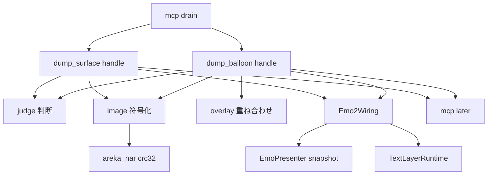
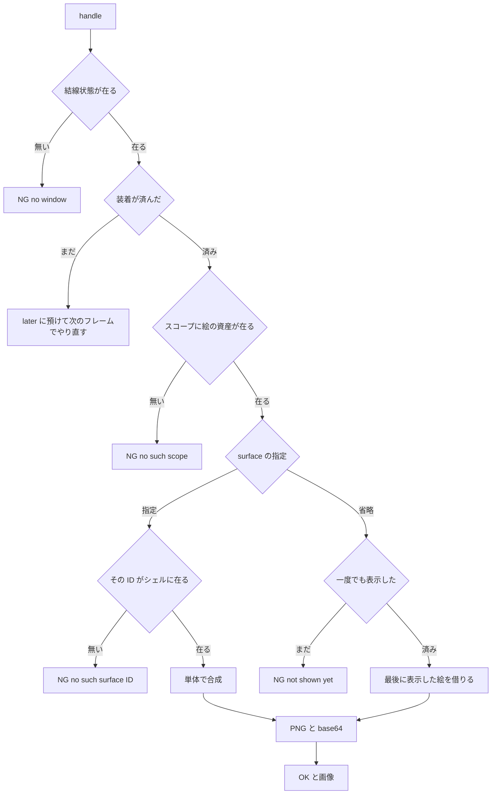

# Design Document

> 2026-10-04・本ブランチのコードを読んで書いた。コードは「何の定義か」（関数名・型名＋ファイルパス）で指す。調べた根拠と捨てた案は [research.md](research.md) §10・§11。

## Overview

**Purpose**: AI エージェントでゴーストを作る人が、送った台本の結果を透過 PNG で受け取れるようにする。`dump_surface` は今の見た目（または指定した surface 単体）を、`dump_balloon` は最後に描いたバルーンを返す。

**Users**: Claude Code などの MCP クライアントから areka を操作する人と、シェルを作る人。

**Impact**: `mcp-tool-entrances` が置いた 2 本のダミー（`NG:not implemented yet`）を本物に差し替える。表示の層 `areka-emo-present` に読むだけの口を 1 ファイル足し、結線状態 `Emo2Wiring` に読み口を 1 本足す。画面・台詞・アニメーションの振る舞いは変えない。

### Goals

- `dump_surface`（省略／指定）と `dump_balloon` が、要件の本文と透過 PNG 1 枚を返す。
- 撮れないときは決まった文言で答え、MCP の呼び出しが原因の ERROR の記録を出さない。
- 判断・符号化・重ね合わせを窓も GPU も要らない関数に分け、決定論テストで固定する。

### Non-Goals

- 台本の `\![execute,dumpsurface,…]`／`\![execute,dumpballoon,…]`（ファイルへの書き出し）。
- 拡大縮小・半透明を掛けた後の画像、シェルの絵の中の箱の文字を `dump_surface` に写すこと。
- PNG の圧縮（下の「PNG の作り方」の決定。差し替えは 1 関数で済む形にする）。
- ツールの定義・引数の検査・`ghost_name` の解決・待ちの上限の変更。
- バルーンの文字を拡大率 1 で描き直すこと（`areka-emo-text` は触らない）。

## Boundary Commitments

### This Spec Owns

- `crates/areka/src/mcp/dump_surface.rs`・`dump_balloon.rs` の `handle` の中身と、その子モジュール（判断・画像の符号化・文字の重ね合わせ）。
- 成功の本文 3 種と、areka が置いた失敗の文言 2 種（`No surface has been shown in this scope yet`・`This ghost has no window`）。
- `EmoPresenter` の読むだけの口 3 本（`crates/areka-emo-present/src/presenter/snapshot.rs`・新規）。
- `Emo2Wiring::attached()`（装着の相が済んだかの読み口）。
- SSP との差の一覧 `doc/ssp-mcp/dump-images-diff-areka.md` と実機確認の記録。

### Out of Boundary

- `crates/areka/src/mcp/mod.rs`・`crates/areka-mcp/`（`handler.rs` を含む）・`areka-emo-compose`・`areka-emo-text`・すべての `Cargo.toml`。
- `areka-emo-present` の既存ファイルの既存の行（`cache.rs`・`shell_target.rs`・`presenter/read.rs` ほか）。足すのは新しいファイル 1 つと、`presenter.rs` の `mod` の並びへの 1 行だけ。
- seriko が持つ「今の着せ替えの集合」を尋ねる口（作らない。着せ替えは表示の層が覚えている「最後に表示したときの集合」を使う）。
- 3 人目以降のキャラクターの窓。絵の資産が組まれれば同じ規則で撮れるが、本 spec では資産を足さない。

### Allowed Dependencies

- `areka_mcp::tools::{ReplyTo, outcome}`・`areka_mcp::tools::{dump_surface, dump_balloon}::Args`（読むだけ）。
- `super::later`（`crates/areka/src/mcp/mod.rs` の「後から答える」口。呼ぶだけ）。
- `Emo2Wiring::presenter()`・`runtime()`（既存の読み口）と、足す `attached()`。
- `EmoPresenter` の既存の読み口 `target_visible`・`text_slot_view`、`TextLayerRuntime::surface`、`TextSurface::read_back`・`size`、wintf の `Arrangement`。
- `areka_nar::crc32`（PNG のチャンクの CRC。`areka` は既に `areka-nar` に依存している）。
- `crate::emo2_boot::target_map::{shell_target, balloon_target}`。
- 新しいクレートの依存・`windows` の機能の追加は 0。本番コードに `unsafe` を足さない。

### Revalidation Triggers

- `PresentTarget.last_show`・合成メモ（`ComposeCache`）の持ち方が変わる（`surface-element-nesting` が `cache.rs` を触る。`ComposeCache::get` と `CacheEntry.composed` の形が変わったら `snapshot.rs` を合わせる）。
- 文字の面の置き方（差し込み口の `Arrangement` の offset が「領域の原点×拡大率」である約束）や `TextSurface::read_back` の画素の形が変わる。
- `outcome::with_image`・`mcp::later`・`handle` の引数の形が変わる。
- 絵の資産を持つスコープの集合の決め方（`derive_scopes`）が変わる。本 spec は表示の層に登録された target を見るだけなので、追従の作業は要らない見込み。

## Architecture

### Existing Architecture Analysis

- MCP の要求は `Input` の段の排他の系 `drain`（`crates/areka/src/mcp/mod.rs`）が UI スレッドで汲み、`dump_surface::handle(world, ghost, args, reply)` を呼ぶ。UI スレッドは `WinApp` が MTA で COM を初期化済み（`crates/wintf/src/runtime/mod.rs`）。
- キャラクターとバルーンの背景は、表示の層が target ごとに合成メモ（原寸・乗算済み BGRA）を持つ。拡大は描画の変換行列が掛けるので、メモは拡大率に依らない。各スコープのシェルの target は、**シェル全体**から組んだ `EmoWorld` を 1 つずつ持つ（`ScopeAssets`＝`crates/areka/src/emo2_boot/assets.rs`）。だから「生の surface ID をシェル全体から探す」は、そのスコープの target の `EmoWorld::surface(id)` を引けば足りる。別名は別の表（`AliasMap`）にあり、`surface(id)` は見ない。
- 隠す処理 `apply_hide`（`presenter/hub.rs`）は `current_surface_id` を消すが、`last_show`（最後に表示が成立した surface ID・着せ替え・コマ）と合成メモは残す。隠した後の絵と ID は `last_show` からしか取れず、これは非公開の欄。
- バルーンの文字は別の GPU の面（`TextSurface`）で、差し込み口の entity に「物理寸・窓の原点からの物理 px の offset」で付いている（`TextSurface::attach`＝`crates/areka-emo-text/src/surface.rs`）。
- 起動の直後は、結線状態はあるが装着の相（`run_attach_phase`）がまだ走っていない時間がある（窓と GPU の準備を待つ）。この間は表示の層に target が 1 つも無い。

### Architecture Pattern & Boundary Map



- **選んだ形**: 「薄い配線（`handle`）＋純粋な関数 3 つ（判断・符号化・重ね合わせ）＋表示の層の読むだけの口」。`handle` は事実を集めて純粋な関数へ渡し、結果を `reply.send` するだけ。
- **依存の向き**: `judge`・`image`・`overlay`（std と `areka_nar::crc32` だけ）← `dump_surface`／`dump_balloon`（World・表示の層・文字の層を読む）← `mcp::dispatch`。逆向きの参照は作らない。`dump_balloon` は `super::dump_surface` の子モジュール（`judge`・`image`）を使う。
- **残す既存の型**: ツールごとのファイル・`handle` の署名・`outcome` の 4 つの形・`later`。
- **新しい部品の理由**: `snapshot.rs` は非公開の `last_show`・`EmoWorld`・アトラスに届く唯一の場所。`judge` は要件 7.2 が求める「窓や GPU を要しない判断」。`image`・`overlay` は本番に無い処理。

### 設計の決定

| 決定 | 中身 | 理由 |
|---|---|---|
| 今の見た目の取り方 | `EmoPresenter::last_shown(target)` で「最後に表示が成立した surface ID」と合成メモの絵を借りる。既存の `read_back` と `current_surface_id` は使わない | 隠した後も ID と絵を返す（要件 1.6）には `last_show` が要る。`read_back` は未表示で `error!` を出す（要件 4.6 に反する）。大きさも絵（`ComposedSurface`）から取れるので別の照会が要らない。`wiring.rs` の `read_back_target` の `#[cfg(test)]` は外さない |
| 指定した surface | `EmoPresenter::compose_alone(target, id)` が、その target の資産で、着せ替え＝`last_show` の集合（無ければ空）、アニメーション＝空で、新しい `Composer` を使って合成して返す | `&self` で書け、合成メモも画面も変えない（要件 2.3）。一度も表示していないスコープは着せ替えなし（要件 2.2） |
| スコープの存在 | そのスコープのシェルの target が表示の層に登録されていること（`target_visible(shell_target(scope)).is_some()`） | 「絵の資産が組まれているスコープ」と同じ（装着の相は資産のあるスコープだけ登録する）。窓だけあるスコープ 2 以降は登録されない |
| 装着の前の呼び出し | `Emo2Wiring::attached()` が偽の間は答えず、`mcp::later` に預けて毎フレーム同じ判断をやり直す。装着が済んだフレームで答える。済まないままなら入口の 10 秒の上限が答える | 装着の前に判断すると、在るはずのスコープ 0 に `NG:No such scope in this ghost` を返してしまう。新しい文言を足さずに済む。`later` はこのための既存の口 |
| PNG の作り方 | 標準ライブラリだけで書く。8 ビット RGBA・`IHDR`／`IDAT`／`IEND` の 3 チャンク・行のフィルタなし・zlib の無圧縮ブロック。CRC は `areka_nar::crc32` | 下の「PNG の作り方を WIC にしなかった理由」 |
| 符号化を走らせる場所 | UI スレッドでその場で行う | 処理は写しと表引きだけ（434×687 で 1.2 MB の入力）。別スレッドへ渡す仕組みを持たない。実機確認で所要時間を測って記録する（未測定） |
| バルーンの文字 | 文字の面が在れば読み戻して背景へ重ねる。無ければ背景だけ。文字が残っているかの判定は持たない | 消された文字の面は透明なので、重ねても背景だけになる（要件 3.9） |
| 文字の位置合わせ | 画面に出ている値をそのまま使う: 文字の面の offset は差し込み口の `Arrangement`、縮める比は `TextSlotView` の「物理寸÷原寸」（軸ごとの整数比） | バルーンの定義から解き直さないので、画面とずれようがない。`ScaleRatio::as_f32` を寸法の計算に使わない約束も破らない |
| 箱の文字 | `dump_surface` に写さない | 箱の文字は窓の子の別の面で、合成メモに入っていない。差の一覧に書く（裁定 10） |
| 差の一覧の置き場 | `doc/ssp-mcp/dump-images-diff-areka.md`（新規） | 既存の `transport-diff-areka.md` は輸送の差の表。並走の MCP の spec と同じファイルを触らない |

#### PNG の作り方を WIC にしなかった理由

- WIC の符号化に要る `IWICBitmapEncoder::CreateNewFrame` と `IWICBitmapFrameEncode::Initialize` は、`windows` 0.62.2 では機能 `Win32_System_Com_StructuredStorage` の下にある。この機能はワークスペースのどこでも有効になっていない（`cargo metadata` の解決結果で確認）。有効にするには `Cargo.toml` を変える必要があり、要件の境界（`Cargo.toml` を変えない）の外になる。
- 無圧縮の PNG は要件 5.1〜5.5 をすべて満たす。チャンクの並びは SSP と同じ 3 つ。違いは大きさだけ: 434×687 のキャラクターで PNG 約 1.2 MB・base64 約 1.6 MB（SSP は 80〜150 KB）、400×224 のバルーンで base64 約 0.5 MB。
- areka の応答の経路に大きさの上限は無い（`MAX_BODY_BYTES` は要求だけ。rmcp 3.5.0 の Streamable HTTP のサーバにも応答の上限は無い）。受け取る側（Claude Code）が 1〜数 MB の画像を扱えるかは**未確認**で、実機確認（要件 7.7 ⑴）で確かめる。
- 符号化は `image::png_base64(乗算済み BGRA, 幅, 高さ) -> String` の 1 関数に閉じる。後で圧縮へ替えるとき（`crates/areka/Cargo.toml` の `windows` の機能に 1 語足して WIC を使う、など）は、この関数の中身だけを替える。**替えるかどうかは設計ディスカッションで開発者が決める**（`Cargo.toml` を触る判断なので、設計では決めない）。

### Technology Stack

| Layer | Choice / Version | Role in Feature | Notes |
|-------|------------------|-----------------|-------|
| アプリ本体 | `crates/areka`（Rust・bevy_ecs） | 2 本の `handle` と子モジュール | 新しい依存 0 |
| 表示の層 | `areka-emo-present` | 読むだけの口 3 本 | 新しいファイル 1 つ＋`mod` 1 行 |
| 合成 | `areka-emo-compose` の `Composer::compose` | 指定した surface の合成 | 呼ぶだけ |
| 文字の層 | `areka-emo-text` の `TextSurface::read_back` | バルーンの文字の読み戻し | 呼ぶだけ |
| CRC | `areka_nar::crc32` | PNG のチャンクの CRC-32 | 既存の本番の実装 |

## File Structure Plan

### Directory Structure

```
crates/areka/src/mcp/
├── dump_surface.rs                 # 変更: handle・事実の集め方・子モジュールの宣言
├── dump_surface_judge.rs           # 新規: 判断（どの文言か・何を撮るか）と成功の本文
├── dump_surface_image.rs           # 新規: 乗算を戻す・PNG・base64
├── dump_balloon.rs                 # 変更: handle・背景と文字の集め方
├── dump_balloon_overlay.rs         # 新規: 文字の面を原寸へ縮めて背景へ重ねる
├── dump_surface_tests.rs           # 書き換え: 窓の無い World での答え（ダミーのテストを置き換え）
├── dump_surface_judge_tests.rs     # 新規: 判断と本文の決定論テスト
├── dump_surface_image_tests.rs     # 新規: PNG・base64 の決定論テスト
├── dump_balloon_tests.rs           # 書き換え: 窓の無い World での答え
├── dump_balloon_overlay_tests.rs   # 新規: 重ね合わせの決定論テスト
├── dump_surface_gpu_tests.rs       # 新規: 実際の描画を通るテスト（キャラクター・x64 だけ接続）
├── dump_surface_gpu_test_support.rs# 新規: GPU を通るテストの土台（2 本で共用）
└── dump_balloon_gpu_tests.rs       # 新規: 実際の描画を通るテスト（バルーン・x64 だけ接続）

crates/areka-emo-present/src/presenter/
└── snapshot.rs                     # 新規: EmoPresenter の読むだけの口 3 本

doc/ssp-mcp/
└── dump-images-diff-areka.md       # 新規: SSP との差の一覧

.kiro/specs/areka-P0-mcp-dump-images/verification/
└── signoff.md                      # 新規: 実機確認の記録
```

- 子モジュールは `dump_surface.rs`／`dump_balloon.rs` の中で `#[path = "…"] mod …;` と宣言する（`mcp/mod.rs` を触らない）。`judge` と `image` は `pub(super)` で宣言し、`dump_balloon.rs` から `super::dump_surface::{judge, image}` で使う。
- テストは兄弟ファイルへ置き、親のファイルの末尾で `#[cfg(test)] #[path = "…"] mod …;` と接続する。GPU を通る 2 本は `#[cfg(all(test, target_pointer_width = "64"))]` で接続する（`crates/areka/src/emo2_boot/frame.rs` の接続と同じ条件）。
- どのファイルも 1,000 行に届かない見込み（最大は GPU のテストで 300 行前後）。

### Modified Files

- `crates/areka/src/mcp/dump_surface.rs`・`dump_balloon.rs` — ダミーの 1 文を本物の処理へ。
- `crates/areka/src/mcp/dump_surface_tests.rs`・`dump_balloon_tests.rs` — `NG:not implemented yet` を固定するテストを、窓の無い World で `NG:This ghost has no window` を返すテストへ書き換える。
- `crates/areka/src/emo2_boot/frame/wiring.rs` — `impl Emo2Wiring` に `pub(crate) fn attached(&self) -> bool` を 1 本足す（`presenter()` の隣）。既存の行は変えない。
- `crates/areka-emo-present/src/presenter.rs` — `mod` の並びに `mod snapshot;` を 1 行足す。

## System Flows



- `dump_balloon` は D までが同じで、その先は「背景の絵を借りる → 文字の面が在れば読み戻して重ねる → PNG」。
- 図の `NG` 4 つは `debug!` だけ。絵を取る段と重ねる段の想定外の失敗は `NG:`＋理由＋`error!` 1 件（下の Error Handling）。
- `later` に預けた組は、待つ側が居なくなれば `poll_later` が捨てる（既存の振る舞い）。

## Requirements Traceability

| Requirement | Summary | Components | Interfaces | Flows |
|-------------|---------|------------|------------|-------|
| 1.1 | 今の合成済みの絵を PNG で | dump_surface・snapshot・image | `last_shown`・`png_base64` | 省略の枝 |
| 1.2 | スコープ省略＝0 | judge | `judge_surface` | — |
| 1.3 | 原寸・拡大と半透明の前 | snapshot | 合成メモは原寸（拡大は描画の変換） | — |
| 1.4 | 成功の本文（今の見た目） | judge | `shown_text` | O |
| 1.5 | 画面を変えない | snapshot | `&self` の読み口だけ | — |
| 1.6 | 隠していても最後の絵と ID | snapshot・judge | `last_shown`（`last_show` を読む） | H→I |
| 2.1 | 生の ID・シェル全体・初期状態 | snapshot・judge | `has_surface`・`compose_alone` | 指定の枝 |
| 2.2 | 最後に表示したときの着せ替え・未表示は無し | snapshot | `compose_alone` | G |
| 2.3 | 画面を変えない | snapshot | 新しい `Composer`・メモに入れない | G |
| 2.4 | 成功の本文（単体） | judge | `alone_text` | O |
| 2.5 | 原寸 | snapshot | `ComposedSurface` の幅と高さ | — |
| 3.1 | 背景＋文字 | dump_balloon・overlay | `last_shown`・`TextSurface::read_back`・`overlay_text` | バルーンの流れ |
| 3.2 | スコープ省略＝0 | judge | `judge_balloon` | — |
| 3.3 | 原寸・位置がずれない | overlay | 物理寸÷原寸の比で縮める | — |
| 3.4 | 隠れていても返す | snapshot | 隠しても `last_show`・メモ・文字の面は残る | — |
| 3.5 | 話している途中も返す | dump_balloon | その時点の文字の面を読む（拒む判断を持たない） | — |
| 3.6 | 箱の文字を含めない | dump_balloon | `TextLayerRuntime::surface(actor)`（普通のバルーンだけ） | — |
| 3.7 | 成功の本文（バルーン） | judge | `balloon_text` | — |
| 3.8 | 表示・台詞を変えない | dump_balloon | 読むだけ（`borrow()`・`read_back(&self)`） | — |
| 3.9 | 文字が無ければ背景だけ | dump_balloon | 文字の面が無ければ重ねない | — |
| 4.1 | 無いスコープ | judge | `NO_SUCH_SCOPE` | D |
| 4.2 | 無い surface ID | judge・snapshot | `NO_SUCH_SURFACE`・`has_surface` | F |
| 4.3 | 一度も表示していない | judge・snapshot | `NOT_SHOWN_YET`・`last_shown` | H |
| 4.4 | （欠番・要件 3.9 へ） | — | — | — |
| 4.5 | 窓の無いゴースト | dump_surface・dump_balloon・judge | `NO_WINDOW`・`Emo2Wiring` の有無 | B |
| 4.6 | 事前に確かめる・ERROR を出さない | judge・snapshot | 記録を出さない読み口だけで判断 | B〜H |
| 4.7 | 想定外の失敗は `NG:`＋`error!` 1 件 | dump_surface・dump_balloon | `fail`（下の Error Handling） | — |
| 4.8 | 失敗に画像を付けない | dump_surface・dump_balloon | `outcome::ng` だけ | — |
| 4.9 | 判定の順 | judge | `judge_surface` の中の順 | B→D→F→H |
| 5.1 | image の content・base64 | image | `png_base64`・`outcome::with_image` | P |
| 5.2 | 8 ビット RGBA・乗算を戻す | image | `unpremultiply` | P |
| 5.3 | 幅と高さが一致 | image | `IHDR` に絵の幅と高さ | P |
| 5.4 | 1 回 1 枚 | dump_surface・dump_balloon | `with_image` を 1 回 | O |
| 5.5 | 上限なし | image | 大きさで断る分岐を持たない | — |
| 6.1 | UI を止めない | dump_surface・dump_balloon | その場で終わる／装着の前は `later` | C |
| 6.2 | イベント 0・台本 0・ファイル 0 | 全部 | 読み口だけを呼ぶ | — |
| 6.3 | 待ちの上限は相手のまま | — | `mcp/mod.rs`・`areka-mcp` を触らない | — |
| 6.4 | `ghost_name` は解決済みを使う | dump_surface・dump_balloon | `handle` の引数のまま | — |
| 7.1 | 符号化のテスト | image のテスト | Testing Strategy | — |
| 7.2 | 判断のテスト | judge のテスト | Testing Strategy | — |
| 7.3 | 本文のテスト | judge のテスト | Testing Strategy | — |
| 7.4 | 描画を通るテスト | GPU のテスト | Testing Strategy | — |
| 7.5 | ダミーのテストの書き換え | `dump_*_tests.rs` | Testing Strategy | — |
| 7.6 | 差の一覧 | `dump-images-diff-areka.md` | 下の「差の一覧に書くこと」 | — |
| 7.7 | 実機確認 | `verification/signoff.md` | Testing Strategy | — |

## Components and Interfaces

| Component | Layer | Intent | Req Coverage | Key Dependencies | Contracts |
|-----------|-------|--------|--------------|------------------|-----------|
| snapshot | 表示の層 | 最後に表示した絵・surface の有無・単体の合成を読むだけで返す | 1.1, 1.3, 1.5, 1.6, 2.1, 2.2, 2.3, 2.5, 3.4, 4.2, 4.3, 4.6 | `PresentTarget`（P0）・`Composer`（P0） | Service |
| judge | アプリ本体・純粋 | どの文言か・何を撮るかの判断と成功の本文 | 1.2, 1.4, 2.4, 3.2, 3.7, 4.1〜4.3, 4.5, 4.6, 4.9 | なし | Service |
| image | アプリ本体・純粋 | 乗算を戻す・PNG・base64 | 5.1〜5.3, 5.5 | `areka_nar::crc32`（P0） | Service |
| overlay | アプリ本体・純粋 | 文字の面を原寸へ縮めて背景へ重ねる | 3.1, 3.3 | なし | Service |
| dump_surface | アプリ本体・配線 | 事実を集めて判断し、絵を取って答える | 1.1, 2.1, 4.5, 4.7, 4.8, 5.4, 6.1, 6.2, 6.4 | `Emo2Wiring`（P0）・snapshot（P0）・`later`（P1） | Service |
| dump_balloon | アプリ本体・配線 | 背景と文字を集めて重ね、答える | 3.1, 3.4〜3.6, 3.8, 3.9, 4.5, 4.7, 4.8, 5.4, 6.1, 6.2, 6.4 | 同上＋`TextLayerRuntime`（P0） | Service |
| `Emo2Wiring::attached` | 結線状態 | 装着の相が済んだか | 6.1 | — | State |

### 表示の層

#### snapshot（`crates/areka-emo-present/src/presenter/snapshot.rs`）

| Field | Detail |
|-------|--------|
| Intent | 非公開の `last_show`・`EmoWorld`・アトラスを、画面を変えずに読む口 |
| Requirements | 1.1, 1.3, 1.5, 1.6, 2.1, 2.2, 2.3, 2.5, 3.4, 4.2, 4.3, 4.6 |

**Responsibilities & Constraints**

- 3 本とも `&self`。合成メモ・表示の状態・World を変えない。`tracing` の記録を自分では出さない。
- 戻り値は既存の公開の型（`ComposedSurface`・`ComposeError`）だけ。新しい公開の型を作らないので、親のファイルに足すのは `mod snapshot;` の 1 行で済む。

##### Service Interface

```rust
impl EmoPresenter {
    /// target のシェルに、生の surface ID が在るか（別名は見ない）。未登録の target は None。
    pub fn has_surface(&self, target: TargetId, surface_id: u32) -> Option<bool>;

    /// 最後に表示が成立した surface ID と、その合成済みの絵（原寸・乗算済み BGRA）。
    /// 未登録・一度も表示していない → None。隠していても Some。
    /// 絵が合成メモに無い（メモの全破棄の後で再表示がまだ）→ Some((id, None))。
    pub fn last_shown(&self, target: TargetId) -> Option<(u32, Option<&ComposedSurface>)>;

    /// surface を単体で画面の外に合成して返す。未登録の target は None。
    /// 着せ替え＝最後に表示したときの集合（一度も表示していなければ空）、アニメーション＝空。
    pub fn compose_alone(
        &self,
        target: TargetId,
        surface_id: u32,
    ) -> Option<Result<ComposedSurface, ComposeError>>;
}
```

- Preconditions: `compose_alone` は `has_surface` が `Some(true)` の ID で呼ぶ（無い ID で呼ぶと合成の層が `error!` を出す）。
- Postconditions: 呼ぶ前後で `current_surface_id`・`target_visible`・`last_shown` の答えが変わらない。
- Invariants: `last_shown` の絵は `ComposeCache::get`（使用順を動かさない）で引く。`compose_alone` は target の `composer` を使わず `Composer::new()` を使う（`&self` のまま・スクラッチを共有しない）。

**Implementation Notes**

- Integration: `presenter/read.rs` の `read_back` と同じ引き方（`last_show` → `cache.get`）。違いは記録を出さないことと、絵を借りて返すこと。
- Validation: 本番の唯一の呼び手であるツールの側のテスト（判断は偽の事実、絵は GPU のテスト）で固定する。`areka-emo-present` にテストのファイルは足さない（合意は「新しいファイル 1 つ」）。
- Risks: 定義層が 1 つも無い退化した surface を `compose_alone` へ渡すと、合成の層が自分で `error!` を 1 件出す（`EmptyComposition`）。ツールの `error!` と合わせて 2 件になる。壊れたシェルでだけ起き、事前に見分ける口は無い。

### アプリ本体・純粋な関数

#### judge（`dump_surface_judge.rs`）

| Field | Detail |
|-------|--------|
| Intent | 要件 4.1〜4.3・4.5・4.9 の判断と、成功の本文 3 種 |
| Requirements | 1.2, 1.4, 2.4, 3.2, 3.7, 4.1, 4.2, 4.3, 4.5, 4.6, 4.9 |

##### Service Interface

```rust
pub(super) const NO_WINDOW: &str = "This ghost has no window";
pub(super) const NO_SUCH_SCOPE: &str = "No such scope in this ghost";
pub(super) const NO_SUCH_SURFACE: &str = "No such surface ID. Check get_expression_table tool";
pub(super) const NOT_SHOWN_YET: &str = "No surface has been shown in this scope yet";

/// 判断に要る事実。本番は表示の層を読み、テストは手書きの表で答える。
pub(super) trait ShellFacts {
    /// そのスコープに絵の資産が組まれているか。
    fn scope_exists(&self, scope: u32) -> bool;
    /// 生の surface ID がシェルに在るか。
    fn surface_exists(&self, scope: u32, surface_id: u32) -> bool;
    /// 最後に表示した surface ID（隠していても残る・一度も表示していなければ None）。
    fn last_shown(&self, scope: u32) -> Option<u32>;
}

#[derive(Debug, Clone, Copy, PartialEq, Eq)]
pub(super) enum SurfacePlan {
    /// 今の見た目（本文に載せる surface ID つき）。
    Shown { scope: u32, surface_id: u32 },
    /// 指定した surface 単体。
    Alone { scope: u32, surface_id: u32 },
}

/// `facts` が None＝窓の無いゴースト。Err は `NG:` の後ろに付ける理由。
pub(super) fn judge_surface(
    facts: Option<&dyn ShellFacts>,
    scope: Option<i64>,
    surface: Option<i64>,
) -> Result<SurfacePlan, &'static str>;

/// Ok はスコープ番号。
pub(super) fn judge_balloon(
    facts: Option<&dyn ShellFacts>,
    scope: Option<i64>,
) -> Result<u32, &'static str>;

pub(super) fn shown_text(scope: u32, surface_id: u32) -> String;
pub(super) fn alone_text(scope: u32, surface_id: u32) -> String;
pub(super) fn balloon_text(scope: u32) -> String;
```

- 判断の順（要件 4.9）: `facts` が None → `NO_WINDOW`。スコープ（省略は 0）が 0 以上 `i32::MAX` 以下でない、または `scope_exists` が偽 → `NO_SUCH_SCOPE`。`surface` が在って `u32` に収まらない、または `surface_exists` が偽 → `NO_SUCH_SURFACE`。`surface` が無くて `last_shown` が None → `NOT_SHOWN_YET`。
- スコープの上限を `i32::MAX` にするのは、target の番号（`2*scope+1`＝`target_map.rs`）が `u32` からあふれないようにするため。
- 本文は要件 1.4・2.4・3.7 の逐語。`outcome::ok` が `OK:` を付けるので、関数は `OK:` の後ろを返す。

#### image（`dump_surface_image.rs`）

| Field | Detail |
|-------|--------|
| Intent | 乗算済み BGRA の絵を、base64 にした透過 PNG へ |
| Requirements | 5.1, 5.2, 5.3, 5.5 |

##### Service Interface

```rust
/// 乗算済み BGRA（1 行＝幅×4・長さ＝幅×高さ×4）を、乗算を戻した RGBA の PNG にして base64 で返す。
pub(super) fn png_base64(premultiplied_bgra: &[u8], width: u32, height: u32) -> String;

// 以下は同じファイルの中の部品（テストから直に呼ぶ）。
fn unpremultiply(premultiplied_bgra: &[u8]) -> Vec<u8>;       // → RGBA
fn png(rgba: &[u8], width: u32, height: u32) -> Vec<u8>;
fn base64(bytes: &[u8]) -> String;
```

- Preconditions: `premultiplied_bgra.len() == width * height * 4`・幅と高さは 1 以上（呼ぶ側が確かめ、合わなければ想定外の失敗として答える）。
- 乗算を戻す: アルファ 0 は `(0,0,0,0)`。それ以外は各色 `min(255, round(色×255÷アルファ))`。
- PNG: 署名 8 バイト → `IHDR`（幅・高さ・深さ 8・カラータイプ 6・圧縮 0・フィルタ 0・インターレース 0）→ `IDAT` 1 つ → `IEND`。`IDAT` の中身は zlib のヘッダ（`0x78 0x01`）＋無圧縮ブロック（1 つ 65,535 バイトまで・最後のブロックに終わりの印）＋Adler-32。各行の先頭にフィルタ 0 の 1 バイト。チャンクの CRC は `areka_nar::crc32`（種類の 4 バイト＋中身）。
- base64: 標準の文字集合・`=` の詰めあり・改行なし。

**Implementation Notes**

- Risks: 無圧縮なので応答が大きい（「PNG の作り方を WIC にしなかった理由」）。関数の注記に、大きさの見積もりと圧縮へ替える道を書いて残す。

#### overlay（`dump_balloon_overlay.rs`）

| Field | Detail |
|-------|--------|
| Intent | 文字の面（物理寸）を原寸へ縮めて、背景（原寸）の上へ重ねる |
| Requirements | 3.1, 3.3 |

##### Service Interface

```rust
/// `canvas`（背景・乗算済み BGRA・原寸）へ、文字の面を重ねて書き換える。
pub(super) fn overlay_text(
    canvas: &mut [u8],
    native: (u32, u32),        // 背景の原寸
    physical: (u32, u32),      // 同じ背景の、画面での物理寸
    text: &[u8],               // 文字の面（乗算済み BGRA）
    text_size: (u32, u32),     // 文字の面の物理寸
    text_offset: (f32, f32),   // 窓の原点から文字の面までの物理 px
);
```

- 原寸の画素 `(x, y)` が画面で占める範囲は、横 `[x×pw÷nw, (x+1)×pw÷nw)`・縦も同じ（`pw`・`nw` は物理寸と原寸の幅）。その範囲に掛かる文字の面の画素を、掛かった面積で重み付けして平均する（文字の面の外は透明）。平均した値を背景へ「上に重ねる」: `出力 = 文字 + 背景×(255−文字のアルファ)÷255`。
- 物理寸と原寸が同じ（拡大率 1）で offset が整数なら、範囲は文字の面の 1 画素とちょうど重なる＝縮めずに写したのと同じ値になる（専用の分岐を持たない）。
- 拡大率が 1 より小さいときも同じ式で通る（範囲が 1 画素より狭くなるだけ）。

### アプリ本体・配線

#### dump_surface（`dump_surface.rs`）／dump_balloon（`dump_balloon.rs`）

| Field | Detail |
|-------|--------|
| Intent | 事実を集め、判断し、絵を取り、答える |
| Requirements | 1.1, 2.1, 3.1, 3.4, 3.5, 3.6, 3.8, 3.9, 4.5, 4.7, 4.8, 5.4, 6.1, 6.2, 6.4 |

##### Service Interface

```rust
// 2 本とも同じ形（署名は今のまま）。
pub(super) fn handle(world: &mut World, ghost: &ActiveGhost, args: Args, reply: ReplyTo);

/// 今答えられるなら Some。装着の相がまだなら None（`later` が次のフレームでもう 1 度呼ぶ）。
fn answer(world: &World, args: &Args) -> Option<ToolOutcome>;

/// 表示の層を読んで `ShellFacts` に答える（dump_surface.rs に置き、dump_balloon も使う）。
pub(super) struct PresenterFacts<'a>(pub(super) &'a EmoPresenter);
```

- `handle`: `answer` が `Some` ならその場で `reply.send`。`None` なら `super::later(world, reply, move |w| answer(w, &args))`。
- `answer`（キャラクター）: `Emo2Wiring` が World に無い → `judge_surface(None, …)` の答え。`attached()` が偽 → `None`。それ以外は `PresenterFacts` で判断し、`Shown` は `last_shown(shell_target(scope))` の絵、`Alone` は `compose_alone(shell_target(scope), id)` の絵を `png_base64` へ渡して `outcome::with_image(outcome::ok(本文), base64)`。
- `answer`（バルーン）: 同じ入口。判断の後、背景＝`last_shown(balloon_target(scope))` の絵の写し。`text_slot_view(balloon_target(scope))` と `wiring.runtime().borrow().surface(&ActorKey::from(scope.to_string()))` の両方が取れたら、`read_back()`・`size()`・差し込み口の `Arrangement` の offset・`TextSlotView` の `surface_size()`／`physical_size()` を `overlay_text` へ渡す。文字の面が無ければ背景だけ。
- `PresenterFacts`: `scope_exists` ＝ `target_visible(shell_target(scope)).is_some()`、`surface_exists` ＝ `has_surface(shell_target(scope), id) == Some(true)`、`last_shown` ＝ `last_shown(shell_target(scope))` の ID。
- `ghost` は使わない（解決済みのゴーストは今の 1 体で、結線状態は World に 1 つ）。

**Implementation Notes**

- Integration: `Emo2Wiring` は `world.get_non_send::<Emo2Wiring>()` で借りる。毎フレームの系が結線状態を一時的に外すのは `Update` の段の中だけで、`Input` の段の `drain` からは常に見える。
- Validation: 窓の無い World のテスト（その場で `NG:This ghost has no window`）と、GPU のテスト。
- Risks: 画面の拡大率が変わったフレームは文字の面が作り直しの途中で無いことがあり、その 1 フレームだけ背景だけの絵が返りうる（次のフレームで戻る）。

#### `Emo2Wiring::attached`（`crates/areka/src/emo2_boot/frame/wiring.rs`）

```rust
impl Emo2Wiring {
    /// 装着の相（`run_attach_phase`）が済んだか。済む前は表示の層に target が 1 つも無い。
    pub(crate) fn attached(&self) -> bool;
}
```

- 既存の欄 `attached` を返すだけ。

## Data Models

持続するデータは無い。受け渡す値は次の 2 つだけ。

- 絵: 乗算済み BGRA・1 行＝幅×4・原寸（`ComposedSurface` の `bytes()`・`width()`・`height()`）。文字の面も同じ画素の形で、大きさは物理寸。
- 結果: `ToolOutcome`（本文 1 つ、成功ならその後に画像 1 つ）。

## Error Handling

### Error Strategy

| 場合 | 答え | 記録 |
|---|---|---|
| 窓の無いゴースト・無いスコープ・無い surface ID・一度も表示していない | `NG:`＋決まった文言・画像なし | `debug!` 1 件（ツール名・スコープ・理由） |
| 装着の相がまだ | 答えずに `later` へ。10 秒で入口が `NG:areka did not respond within 10 seconds` | なし |
| 最後に表示した絵が合成メモに無い（`last_shown` が `Some((_, None))`） | `NG:the last shown picture is no longer kept` | `error!` 1 件 |
| バルーンの背景がまだ確立していない（スコープは在るのに `last_shown(balloon_target)` が None） | `NG:the balloon of this scope is not ready` | `error!` 1 件 |
| 指定した surface の合成が失敗（`ComposeError`） | `NG:`＋`ComposeError` の表示 | `error!` 1 件 |
| 文字の面の読み戻しが失敗（`TextLayerError`） | `NG:`＋エラーの表示 | `error!` 1 件 |
| 絵のバイト数が幅×高さ×4 と合わない・幅か高さが 0 | `NG:picture size mismatch` | `error!` 1 件 |

- 下の 5 行が要件 4.7 の「想定外の失敗」。`error!` にはツール名（`tool`）・スコープ（`scope`）・理由（`reason`）を欄で載せる。2 本の `handle` から呼ぶ小さな関数 `fail(tool, scope, reason) -> ToolOutcome`（`dump_surface.rs` に置く）が、`error!` と `outcome::ng` をまとめる。
- 合成メモの全破棄（`InvalidateCache`）を本番で送る所は今 0 か所なので、3 行目は今の本番では起きない。
- 失敗の結果は `outcome::ng` だけで作るので、画像は付かない（要件 4.8）。

### Monitoring

- 成功は `debug!` 1 件（ツール名・スコープ・surface ID・幅・高さ・base64 の長さ）。実機確認で応答の大きさを見るのに使う。

## Testing Strategy

### Unit Tests（窓も GPU も要らない）

1. **判断**（`dump_surface_judge_tests.rs`・要件 7.2）: 手書きの `ShellFacts` で次を 1 件ずつ固定する——スコープ省略＝0／負のスコープ／絵の無いスコープ／窓だけあって絵の無いスコープ（＝`scope_exists` が偽の 2）／無い surface ID／負の surface ID／別名にしか無い番号（＝`surface_exists` が偽）／別のスコープ用の ID は成功／隠しているだけ（`last_shown` が Some）は成功／一度も表示していない／窓の無いゴースト／複数に当たるときの順（窓 → スコープ → surface ID → 未表示）。`judge_balloon` も同じ表で、窓・スコープ・成功の 3 通り。
2. **本文**（同じファイル・要件 7.3）: `shown_text`・`alone_text`・`balloon_text` を、スコープ番号と surface ID を変えた例で逐語に固定する。
3. **乗算を戻す**（`dump_surface_image_tests.rs`・要件 7.1）: 完全に透明・半透明・不透明の画素で、戻した RGBA が期待値と 1 段階以内。
4. **PNG**（同・要件 7.1）: ⑴ 既知の 2×2 の絵のバイト列が、手で組んだ期待値と一致（署名・`IHDR`・CRC・Adler-32）。⑵ 65,535 バイトを超える絵で無圧縮ブロックが正しく分かれる。⑶ **別の実装で読み戻す**: 書いた PNG をワークツリーの `target\` の下の一時ファイルへ置き、WIC の復号（`wintf::com::wic` の `create_decoder_from_filename` → 先頭のフレームの `copy_pixels`）で幅・高さ・各画素が一致。
5. **base64**（同・要件 7.1）: 空・長さ 1・2・3 の既知の入力（`""`・`"f"→"Zg=="`・`"fo"→"Zm8="`・`"foo"→"Zm9v"`）と、`+`・`/` が出る入力。
6. **重ね合わせ**（`dump_balloon_overlay_tests.rs`）: ⑴ 拡大率 1・整数の offset で、文字の画素がそのまま背景の上に載る（縮めない写しと一致）。⑵ 物理寸が原寸の 2 倍で、2×2 の同じ色の塊が原寸の 1 画素へ正確に戻る。⑶ 半透明の文字が背景と正しく混ざる。⑷ 文字の面の外は背景のまま。⑸ 拡大率が 1 より小さいときも落ちずに背景の大きさで返る。
7. **窓の無い World**（`dump_surface_tests.rs`・`dump_balloon_tests.rs`・要件 7.5）: 空の World で `handle` を呼ぶと、その場で `NG:This ghost has no window`・`isError: true`・content は本文 1 つ。`NG:not implemented yet` を固定するテストは残さない。

### Integration Tests（実際の描画を通る・x64 だけ接続・要件 7.4）

土台（`dump_surface_gpu_test_support.rs`）: 偽の SHIORI の土台 `SwitchRig`（`crates/areka/src/emo2_boot/ghost_switch_test_support.rs`）に、GPU 資源（`GraphicsCore::new()`＋`WucGraphicsResource`）と窓の一式（`spawn_ghost_windows`＋偽の HWND＋`DPI` の component）を据え、本番の `Input`・`Update` の段を回す。組み方は `crates/areka/src/shell_balloon_switch_session_lap_tests.rs` の `lap_rig_of`・`spawn_windows` と同じ。ツールは `ToolRequest::new` で作った要求を `handle` へ渡して呼ぶ。拡大率が 1 でない状態は、窓の `DPI` を 96 以外（例 144）にして作る。

1. 今の見た目: 検体に在る surface（ID は検体の `surfaces.txt` から選ぶ。下では `N` と書く）を台本 `\0\s[N]` で出した後、`dump_surface`（省略）の PNG を復号した画素が、`Composer::compose` で同じ surface を合成した絵（乗算を戻したもの）と一致し、本文が `OK:scope 0, surface N as currently shown (…)`。
2. 指定した surface: 表示中と別の ID を指定すると、その surface の画素で返り、呼ぶ前後で `current_surface_id`・`target_visible` が変わらない。スコープ 0 でスコープ 1 用の ID を指定しても成功する。検体の別名の表にだけ在る番号（生の ID としては無い番号）は `NG:No such surface ID. Check get_expression_table tool`（本物のシェルで「別名を解かない」を固定する）。
3. 隠したキャラクター: `\s[-1]` の後も、隠す直前の絵と ID で成功する。
4. 一度も表示していないスコープ: 省略は `NG:No surface has been shown in this scope yet`、指定は成功する。スコープ 2 は 2 本とも `NG:No such scope in this ghost`。
5. バルーン: 台詞の後の `dump_balloon` が、背景の大きさで、文字の領域に背景と違う画素を含む。`DPI` 144 でも大きさは原寸のまま。
6. 隠れたバルーン・文字の無いバルーン: バルーンを隠した後も同じ画素が返る。一度も話していないスコープは背景だけ（背景の合成と一致）で成功する。
7. 邪魔をしない: 一連の呼び出しの前後で、偽の SHIORI の呼び出しの列が増えず、ERROR の記録が 0 件（`log-capture-kit`）。
8. 装着の前: 最初のフレームを回す前に呼ぶとその場では答えが無く、フレームを回した後に答えが届く。

### 実機確認（要件 7.7）

`verification/signoff.md` に、要件 7.7 の ⑴〜⑺ を 1 項目ずつ記録する。あわせて、返った base64 の長さと、Claude Code が画像を受け取れたか（無圧縮の PNG の大きさの確認）、1 回の呼び出しの所要時間を記録する。

### 差の一覧に書くこと（要件 7.6・`doc/ssp-mcp/dump-images-diff-areka.md`）

| 項目 | areka | SSP |
|---|---|---|
| 一度も表示していないスコープで省略 | `NG:No surface has been shown in this scope yet` | 未実測 |
| 窓の無いゴースト | `NG:This ghost has no window` | 未実測（対応する状態が無い見込み） |
| 一度も表示していないスコープで `surface` 指定 | 着せ替えなしで返す | 未実測 |
| 隠している間に着せ替えを変えた後の `surface` 指定 | 隠す前の着せ替えで返す（次に表示するまで新しい集合が表示の層に届かない） | 未実測 |
| 拡大率が 1 でないときのバルーンの字 | 少しにじむ（拡大した面を縮めて重ねる） | 未実測 |
| 負のスコープ | `NG:No such scope in this ghost` | JSON-RPC の `Invalid params`（実測） |
| シェルの絵の中の箱の文字 | `dump_surface` に写らない・`dump_balloon` にも含めない | 対応物なし |
| PNG の圧縮 | 無圧縮（大きさは幅×高さ×4 より少し大きい） | 圧縮あり（実測） |
| バルーンの窓の印（上へ送る矢印・送り主の印） | areka が描いているものだけ写る | 写る（実測） |

## Performance & Scalability

- 1 回の呼び出しの仕事: 絵の写し 1 回・乗算を戻す 1 回・CRC と Adler-32 の表引き・base64。バルーンはこれに文字の面の読み戻し（GPU から CPU への写し 1 回）と重ね合わせ。どれも絵の大きさに比例し、待つ処理は無い。所要時間は**未測定**（実機確認で記録する）。
- 画像の大きさで断る分岐は持たない（要件 5.5）。
