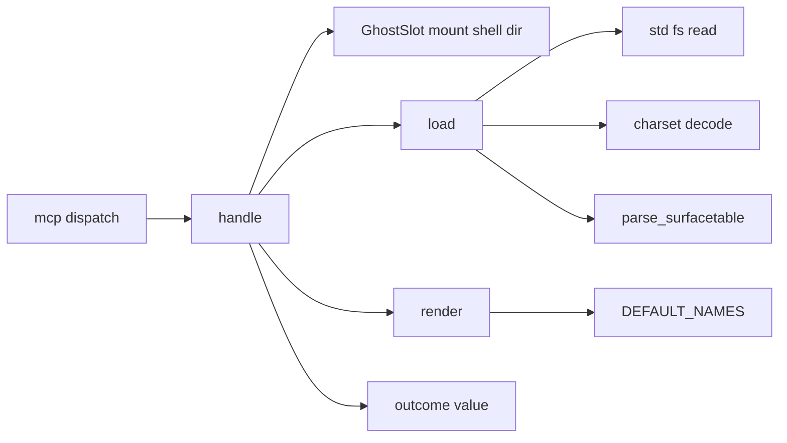
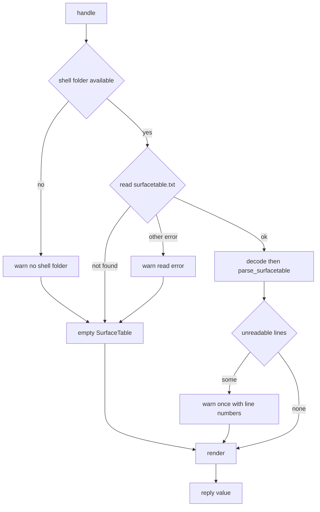

# Design Document: areka-P0-mcp-expression-table

## Overview

**Purpose**: MCP でつなぐ AI エージェントが、台本に `\s[n]` を書く前に「どの番号がどの表情か」の表を受け取れるようにする。
**Users**: areka に MCP でつなぐ AI エージェント。SSP 向けの手順（先に `get_expression_table`、次に `sakurascript`）をそのまま使う。
**Impact**: 今は `NG:not implemented yet` を返すだけの `get_expression_table` に中身を入れる。今のシェルの `surfacetable.txt` を読む読み手を 1 本足し、既定の名前 15 件を重ねて、SSP と同じ形・同じ並びの表を返す。入口（引数の型・`ghost_name` の解決・振り分け）は変えない。

### Goals

- SSP の実測（`requirements.md`「SSP の実測」1〜15）と同じ行・同じ並び・同じ行の終わりの表を返す。
- 字は元のとおりに返す（SSP の文字化けは移植しない）。
- 書き方の崩れた `surfacetable.txt` でも `NG:` にせず、読めた分と既定の名前で返し、読めなかったことをログに残す。
- 机の SSP 無しで、表の形と並びを常時テストが見張る。

### Non-Goals

- 着せ替え・アニメーションの一覧。
- シェルの切替・再読み込みそのもの（`areka-P0-shell-balloon-switch`・`areka-P0-mcp-reload` の持ち分）。
- `ghost_name` の解決と、省略・空・稼働していない名指しへの答え（`areka-P0-mcp-tool-entrances` が済ませている）。
- `surface.alias`ブレス・surface*ブレスの `name`・`surfaces.txt`・シェルのフォルダの一覧を読むこと（`option,DisableNoDefineSurfaces` は表を変えないので、定義の有無は調べない）。
- 既定の名前を日本語以外で持つこと・利用者が差し替えること。
- 読んだ結果を溜めておくこと（呼ばれるたびに読む）。

## Boundary Commitments

### This Spec Owns

- `surfacetable.txt` の文面を転記する読み手 `parse_surfacetable` と、その返す型 `SurfaceTable`（`crates/areka-parsers/src/shell/surfacetable.rs`）。
- 既定の名前 15 件（埋め込みの定数）。
- 表の組み立ての規則（載せる行・既定の重ね合わせ・並び・文字列の形）。
- `get_expression_table` の `handle` の中身（今のシェルのフォルダを引く・ファイルを読む・ログ・答える）。
- 上の 2 つのテスト（兄弟ファイル）。

### Out of Boundary

- 次のファイルは触らない: `crates/areka/src/mcp/mod.rs`・`crates/areka/src/mcp/resolve.rs`・`crates/areka-mcp/src/**`・すべての `Cargo.toml`・`crates/areka-parsers/src/shell/model.rs`・`crates/areka-parsers/src/shell/decode.rs`。
- `Shell` 型へ欄を足さない。`shell::parse`・`shell::lexer` を呼ばない。
- `areka_parsers::charset::decode` の振る舞い（知らない `charset` の名前は `debug!` を出して既定へ戻る）は変えない。
- 後から答える口（`mcp/mod.rs` の `later`）は使わない。

### Allowed Dependencies

- `areka_parsers::charset::decode` と `DefaultEncoding::Ansi`（文字コードの判定と読み取り）。
- `encoding_rs::Encoding::for_label`（読み手の中で、`charset` の名前が読めるものかを確かめるためだけ。`crates/areka-parsers` に既にある依存）。
- `areka_mcp::tools::outcome::value`（`OK:` を付けない素の値）と `areka_mcp::tools::get_expression_table::Args`・`ReplyTo`。
- `crate::ghost_session::GhostSlot` → `GhostSession::runtime()` → `areka_ghost::GhostRuntime::mount()` → `MountModel.shell.dir`（今のシェルのフォルダ。読むだけ）。
- `tracing`（記録）・`std::fs::read`。
- テストだけ: `log-capture-kit` の `capture`・`temp-path-kit`・`emo2_boot::ghost_switch_test_support` の `SwitchRig`（どれも `crates/areka` のテスト用の依存に既にある）。
- 依存の向き: `areka-parsers`（読み手）← `areka`（ツールの中身）。逆向きは無い。読み手はファイルを開かない。

### Revalidation Triggers

- `SurfaceTable`・`SurfaceTableRow` の欄の変更（読み手の使い手は本ツールだけだが、公開の型である）。
- `MountModel.shell.dir` の意味の変更、またはシェルの切替が `GhostRuntime::set_shell_dir` を通らなくなる変更（切替の後の表が古いシェルを指す）。
- `ActiveGhost`・`handle` の引数の並びの変更（`areka-P0-mcp-tool-entrances` の持ち分）。
- `charset::decode` の既定への戻り方の変更。
- 表の文字列の形を変える SSP の再実測。

## Architecture

### Existing Architecture Analysis

- `crates/areka/src/mcp/mod.rs` の `dispatch` が `get_expression_table` を `Omitted::Reject` で解決してから `get_expression_table::handle(world, ghost, args, reply)` を呼ぶ。省略・空・名前違いはここで `NG:` になり、`handle` へは来ない（6.3 はこのままで満たす）。
- `mod.rs` の `drain` は溜まった要求を 1 件ずつ順に `dispatch` する。`handle` がその場で答えれば、同時に届いた要求のそれぞれに答えが返る（6.4）。
- `ActiveGhost`（`resolve.rs`）は `name` と `root` だけを持ち、今のシェルのフォルダは持たない。`handle` は `&mut World` を受け取るので、`GhostSlot` から自分で引く。
- `crates/areka-parsers/src/shell/boxes.rs` の `parse_boxes`／`ShellBoxes` が、`Shell` 型とは別の型を返す 2 つ目の読み手の前例（転記だけ・失敗しない・`shell/mod.rs` に `mod`・テストの `mod`・`pub use` を足す）。本 spec の読み手は同じ置き方にする。
- `areka-parsers` は `package` 以外 I/O を持たない（`lib.rs` 冒頭の規律）。読み手は読み終えた文字列を受け取る。

### Architecture Pattern & Boundary Map



**Architecture Integration**:

- 選んだ形: 読み手は転記だけ（`areka-parsers`）、載せる・載せないの判断と既定の重ね合わせと文字列の組み立てはツールの側（`areka`）。既定の 15 件は `surfacetable.txt` の転記ではなく SSP 本体の振る舞いの写しなので、転記層には置かない。
- 記録はすべて `crates/areka` の側で出す。読み手は読めなかった行を値で返す（`areka-parsers` のテスト用の依存に `log-capture-kit` が無く、`Cargo.toml` は触らないため）。
- ファイルは `handle` の中でその場で読む（UI スレッド）。`surfacetable.txt` は小さい 1 本で、スレッドや後から答える口を足す理由が無い。
- 新しく足す関数は `parse_surfacetable`（読み手）・`load`（読む＋記録）・`render`（規則）の 3 つと `handle` の配線。実装が 1 つしかない抽象は足さない。
- `shell/lexer.rs` の `lex` は使わない。`surfaces.txt` 向けの切り分けで、`group,名前` の見出し・`group` の外の行・行末の `}` を名前に残す扱いが合う保証が無く、`surfacetable.txt` の行の種類は下の表の数個で足りる。

### Technology Stack

| Layer | Choice / Version | Role in Feature | Notes |
|-------|------------------|-----------------|-------|
| パーサ | `areka-parsers`（既存）＋ `encoding_rs`（既存の依存） | `surfacetable.txt` の転記・`charset` の名前の確かめ | 新しい依存なし |
| アプリ本体 | `areka` の `mcp`（既存）・`bevy_ecs` の `World` | フォルダを引く・読む・組む・答える | 新しい依存なし |
| 記録 | `tracing` | 後退の記録（`warn!`） | `.kiro/steering/logging.md` |

## File Structure Plan

### Directory Structure

```
crates/areka-parsers/src/shell/
├── surfacetable.rs           # 新規: parse_surfacetable と SurfaceTable・SurfaceTableRow
├── surfacetable_tests.rs     # 新規: 行の読み分けのテスト
└── mod.rs                    # 変更: mod surfacetable; / #[cfg(test)] mod surfacetable_tests; / pub use の 3 か所

crates/areka/src/mcp/
├── get_expression_table.rs        # 書き換え: DEFAULT_NAMES・render・load・handle
└── get_expression_table_tests.rs  # 書き換え: 表の文字列・文字コード・記録・配線のテスト
```

### Modified Files

- `crates/areka-parsers/src/shell/mod.rs` — `boxes` と同じ形で `mod surfacetable;`・`#[cfg(test)] mod surfacetable_tests;`・`pub use surfacetable::{SurfaceTable, SurfaceTableRow, parse_surfacetable};` を足す。ほかの行は動かさない。
- `crates/areka/src/mcp/get_expression_table.rs` — ダミーを本物に置き換える。`handle` の引数の並びは変えない。テストの接続（`#[path = "get_expression_table_tests.rs"]`）はそのまま。
- `crates/areka/src/mcp/get_expression_table_tests.rs` — `NG:not implemented yet` を期待する 1 本を捨て、下の Testing Strategy の内容にする。1,000 行に近づいたら、2 本目のテストのファイルを `get_expression_table.rs` の中から `#[path]` で繋ぐ（`mcp/mod.rs` には足さない）。

## System Flows



- どの枝も `outcome::value` で終わる。`NG:` を返す枝は無い（3.5・5.9）。
- ファイルが無いのは正常（`surfacetable.txt` は省略可能）なので記録しない。

## Requirements Traceability

| Requirement | Summary | Components | 実現の仕方 |
|---|---|---|---|
| 1.1 | 見出し行・区切り行 | `render` | 定数の 2 行を先頭に置く |
| 1.2 | 1 件 1 行 `\|スコープ\|キャラクタ名\|説明\|\s[ID]\|` | `render` | 行ごとに組む |
| 1.3 | 行の終わりは `\r\n` | `render` | 見出し・区切り・全行（最後の行も）を `\r\n` で終える |
| 1.4 | `\0`・`\1`・`\p[n]` | `render` | スコープの書き分け |
| 1.5 | 空の列は何も挟まない | `render` | 空文字列をそのまま挟む |
| 1.6 | 字を元のとおりに | `load` | `charset::decode` で読み、Rust の文字列のまま返す |
| 1.7 | 表のほかに何も返さない | `handle` | `outcome::value(render(..))` だけを送る |
| 2.1 | `ID,名前` → 1 行 | `parse_surfacetable`・`render` | 行の転記と組み立て |
| 2.2 | グループ名とスコープ | `parse_surfacetable` | 行に `group`・`scope` を写す |
| 2.3 | `scope` の無い `group` は 0 | `parse_surfacetable` | `scope` の初期値 0 |
| 2.4 | グループ名が空 | `parse_surfacetable` | `group` は空文字列 |
| 2.5 | `group` の外の行 | `parse_surfacetable` | `group` は空・`scope` は 0 |
| 2.6 | 名前の省略 | `parse_surfacetable` | `name` は空文字列で転記 |
| 2.7 | 同じスコープの `group` が 2 つ | `parse_surfacetable`・`render` | 行ごとに自分の `group` を持つ |
| 2.8 | `__disabled` は載せない | `render` | `group == "__disabled"` を除く |
| 2.9 | `__parts` は載せない | `render` | `name == "__parts"` を除く |
| 2.10 | 定義・画像の有無を見ない | `load` | `surfaces.txt` もフォルダの一覧も読まない |
| 2.11 | 行も既定も無い面は載せない | `render` | 行の出どころは `SurfaceTable` と `DEFAULT_NAMES` だけ |
| 2.12 | alias・`name` を使わない | `load` | `shell::parse` を呼ばない |
| 3.1 | 既定の 15 件 | `DEFAULT_NAMES` | 埋め込みの定数 |
| 3.2 | 書かれていない ID に既定を載せる | `render` | スコープ 0・キャラクタ名は空 |
| 3.3 | 書かれている ID の既定は載せない | `render` | 書かれた ID の集合で除く |
| 3.4 | 「書かれている」は ID だけで判定 | `render` | 集合は `SurfaceTable.rows` の全行（載せない行も含む）から作る |
| 3.5 | ファイルが無ければ既定だけ | `load` | 空の `SurfaceTable` |
| 3.6 | 言語の設定に関わらず日本語 | `DEFAULT_NAMES` | 定数は 1 つだけ・設定を読まない |
| 3.7 | 既定は定義の有無を見ない | `render` | 定義を調べる経路が無い |
| 3.8 | `option` は表を変えない | `parse_surfacetable` | `option` の行は読み飛ばす |
| 4.1 | スコープの昇順 | `render` | （スコープ, ID）で安定に並べる |
| 4.2 | 同じスコープは ID の昇順 | `render` | 同上 |
| 4.3 | 既定とシェルを混ぜる | `render` | 1 本の列にしてから並べる |
| 4.4 | `group` ごとにまとめない | `render` | 並びの鍵に `group` を入れない |
| 5.1 | `charset` で読む・無ければ Shift_JIS | `load` | `charset::decode(bytes, DefaultEncoding::Ansi)` |
| 5.2 | `Charset`・BOM | `load`・`parse_surfacetable` | `charset::decode` が受ける。読み手は見出し語の大小を区別しない |
| 5.3 | `version`・`option`・注釈・空行 | `parse_surfacetable` | 読み飛ばす |
| 5.4 | 字下げ | `parse_surfacetable` | 行の前後の空白を落としてから読む |
| 5.5 | 閉じていない `{` | `parse_surfacetable` | 終わりまで読んだ分を返す |
| 5.6 | 行末の `}` は名前の一部 | `parse_surfacetable` | 閉じるのは `}` だけの行 |
| 5.7 | 読めない行 → 読めた分＋記録 | `parse_surfacetable`・`load` | `unreadable` に入れて返し、`load` が `warn!` |
| 5.8 | 開けない・文字コード不明 → 記録 | `load`・`parse_surfacetable` | 読み取りの失敗は `warn!`。知らない `charset` の名前の行は `unreadable` |
| 5.9 | `NG:` にしない・空にしない | `handle`・`render` | 失敗を返す枝が無い |
| 5.10 | 同じ ID が 2 度 | `render` | 両方載せる（書かれた順） |
| 6.1 | 副作用なし | `handle` | World は読むだけ・送り口に触れない・ファイルを書かない |
| 6.2 | 切替の後のシェル | `handle` | 呼ばれるたびに `mount().shell.dir` から読む |
| 6.3 | 入口の答えを変えない | （`dispatch`） | `mod.rs`・`resolve.rs` を触らない |
| 6.4 | 同時の呼び出し | `handle` | その場で答える（`drain` が 1 件ずつ回す） |
| 7.1 | 実測 14 の全文の一致 | テスト | Testing Strategy |
| 7.2 | 実測ごとの行 | テスト | 同上 |
| 7.3 | 既定が消える 3 つと消えない 1 つ | テスト | 同上 |
| 7.4 | Shift_JIS・UTF-8 | テスト | 同上 |
| 7.5 | `option` の有無で同じ | テスト | 同上 |
| 7.6 | 読めない行 | テスト | 同上 |
| 7.7 | SSP・ネットワークに頼らない | テスト | 文字列と一時フォルダだけを使う |

## Components and Interfaces

| Component | Layer | Intent | Req Coverage | Key Dependencies | Contracts |
|---|---|---|---|---|---|
| `parse_surfacetable` | `areka-parsers` の `shell` | `surfacetable.txt` の文面を行の列へ転記する | 2.1〜2.7, 3.8, 5.2〜5.8 | `encoding_rs`（P1） | Service |
| `DEFAULT_NAMES` | `areka` の `mcp` | 既定の名前 15 件 | 3.1, 3.6 | なし | State |
| `render` | `areka` の `mcp` | 転記と既定から表の文字列を組む | 1.1〜1.5, 2.7〜2.9, 2.11, 3.2〜3.4, 3.7, 4.1〜4.4, 5.9, 5.10 | `SurfaceTable`（P0） | Service |
| `load` | `areka` の `mcp` | シェルのフォルダから読んで転記を得る・後退を記録する | 1.6, 2.10, 2.12, 3.5, 5.1, 5.7, 5.8 | `charset::decode`（P0）・`parse_surfacetable`（P0） | Service |
| `handle` | `areka` の `mcp` | 今のシェルのフォルダを引き、表を答える | 1.7, 5.9, 6.1〜6.4 | `GhostSlot`（P0）・`outcome::value`（P0） | Service |

### areka-parsers の shell

#### parse_surfacetable

| Field | Detail |
|-------|--------|
| Intent | `surfacetable.txt` の文面を、載せる・載せないを決めずに行の列へ転記する |
| Requirements | 2.1, 2.2, 2.3, 2.4, 2.5, 2.6, 2.7, 3.8, 5.2, 5.3, 5.4, 5.5, 5.6, 5.7, 5.8 |

**Responsibilities & Constraints**

- 純粋・失敗しない・記録しない・ファイルを開かない。
- `__disabled` の `group` の行も、名前が `__parts` の行も、名前を省略した行も、そのまま転記する（既定の名前を消す判定に要る）。
- 既定の名前・並べ替え・文字列の組み立ては持たない。

**Contracts**: Service [x]

##### Service Interface

```rust
/// surfacetable.txt の転記。
#[derive(Clone, Debug, Default, PartialEq)]
pub struct SurfaceTable {
    /// `サーフェスID,名前` の行（書かれた順）。
    pub rows: Vec<SurfaceTableRow>,
    /// 読めなかった行の行番号（1 から数える・書かれた順）。
    pub unreadable: Vec<usize>,
}

#[derive(Clone, Debug, PartialEq)]
pub struct SurfaceTableRow {
    pub id: u32,
    /// 名前（省略なら空。`__parts` や行末の `}` もそのまま）。
    pub name: String,
    /// 属する group のグループ名（group の外・グループ名が空なら空。`__disabled` もそのまま）。
    pub group: String,
    /// 属する group の scope（group の外・scope の行が無ければ 0）。
    pub scope: u32,
}

pub fn parse_surfacetable(text: &str) -> SurfaceTable;
```

行の読み分け（上から順に当てる）。前置きの決め:

- 落とす空白は **ASCII の空白とタブだけ**（全角の空白は字として残す。1.6）。行はまず前後のこの空白を落とす。
- 行は最初の `,` で前と後ろに分ける。**前**（見出し語・サーフェス ID）は前後の空白を落とす。**後ろ**（グループ名・名前）は落とさず、書かれたとおりに写す。`scope` の数値だけは前後の空白を落としてから読む。
- 見出し語 `charset`・`version`・`option`・`group`・`scope` は ASCII の大文字と小文字を区別しない。
- 数値（サーフェス ID・`scope`）は **ASCII の数字だけ**の並びで、`u32` に収まるもの（先頭の 0 は許す。`+5`・`-1`・空は数値でない）。

| 行 | 扱い |
|---|---|
| 空行・`//` で始まる行 | 読み飛ばす |
| `{` だけの行 | 読み飛ばす（`group` は `group,` の行で始まる。`{` が無くても始まる） |
| `}` だけの行 | 今の `group` を閉じる。開いた `group` が無ければ読み飛ばす |
| `version,…`・`option,…` | 読み飛ばす |
| `charset,名前` | `encoding_rs::Encoding::for_label` が知っている名前なら読み飛ばす。知らない名前なら `unreadable`。ファイルのどの行にあっても同じ扱い（`charset::decode` が見るのは冒頭の最初の 1 つだけだが、読み手は場所を問わない。害は無い） |
| `group,名前` | 新しい `group` を始める（グループ名＝最初の `,` より後ろ・`scope` は 0）。前の `group` が開いたままなら、そこで閉じたとみなす |
| `scope,数値` | 今の `group` の `scope` にする。その `group` で既に転記した行にも当てる（`scope` が行の後に書かれていても同じ結果）。2 つ以上あれば後が勝つ。数値でない・`group` の外にあるなら `unreadable`（`scope` は変えない） |
| `数値,名前`（名前は空でもよい） | `rows` へ転記。名前は最初の `,` より後ろの全部（`,` や行末の `}` を含む） |
| 上のどれでもない行（ID が数値でない・`,` が無い・`{` や `}` と同じ行に別の字がある など） | `unreadable` |

- Preconditions: `text` は文字コードを読み終えた文字列。
- Postconditions: `rows` と `unreadable` は書かれた順。ファイルの終わりで `group` が開いたままでも、そこまでの行を返す（5.5）。
- Invariants: 同じ入力には同じ出力。panic しない。

**Implementation Notes**

- Integration: `shell/mod.rs` の `pub use` から公開する。`boxes.rs` と違い `lexer`・`decode`・`model` を使わない（`model.rs`・`decode.rs` と重ならない）。
- Validation: 行の読み分けの各枝を `surfacetable_tests.rs` で 1 つずつ固定する。
- Risks: `scope` の位置・`{` の無い `group`・`group` の入れ子は SSP で実測していない。上の表の扱いは「読めた分で返す」ための決めで、SSP と違うと分かったら表の該当行だけを直す。

### areka の mcp（`get_expression_table.rs`）

#### DEFAULT_NAMES

```rust
/// 既定の名前（SSP の日本語の表と同じ 15 件・ID の昇順）。
const DEFAULT_NAMES: [(u32, &str); 15] = [
    (0, "素"), (1, "照れ"), (2, "驚き"), (3, "不安"), (4, "落ち込み"),
    (5, "微笑み"), (6, "目閉じ"), (7, "怒り"), (8, "冷笑"), (9, "照れ怒り"),
    (10, r"\1-素"), (11, r"\1-刮目"), (19, r"\1-歌"), (20, "立て看板"), (25, "歌"),
];
```

ファイルにせず埋め込む。差し替えも言語の切替も範囲の外で、読み取りの失敗の枝を増やさないため。

#### render

| Field | Detail |
|-------|--------|
| Intent | 転記と既定の名前から、返す文字列を組む（純粋） |
| Requirements | 1.1, 1.2, 1.3, 1.4, 1.5, 2.7, 2.8, 2.9, 2.11, 3.2, 3.3, 3.4, 3.7, 4.1, 4.2, 4.3, 4.4, 5.9, 5.10 |

**Contracts**: Service [x]

```rust
fn render(table: &SurfaceTable) -> String;
```

規則（この順）:

1. 書かれた ID の集合を、`table.rows` の**全行**から作る（`__disabled` の中・`__parts`・名前の省略・スコープを問わない）。
2. シェルの行: `table.rows` から `group == "__disabled"` の行と `name == "__parts"` の行を除く。残りは（`scope`, `group`, `name`, `id`）のまま載せる。
3. 既定の行: `DEFAULT_NAMES` のうち、ID が 1 の集合に無いものを（スコープ 0, キャラクタ名は空, 名前, ID）で足す。
4. 2 と 3 を 1 本の列にし、（スコープ, ID）の昇順で**安定に**並べる。同じ（スコープ, ID）の行は書かれた順のまま両方載る（5.10。別のスコープに書かれた同じ ID は、それぞれのスコープに載る）。
5. 文字列にする: `|scope \0,\1,\p[2]...|character name|description|surface number : \s[]|` ＋ `\r\n`、`|-----|-----|-----|-----|` ＋ `\r\n`、以降は行ごとに `|スコープ|キャラクタ名|説明|\s[ID]|` ＋ `\r\n`。スコープは 0 → `\0`、1 → `\1`、n ≥ 2 → `\p[n]`。最後の行も `\r\n` で終える。

- Postconditions: 返す文字列は必ず見出し行と区切り行を持つ。`table` が空なら既定の 15 行が続く。
- キャラクタ名・説明の中の `|` は書き換えない（SSP の実測が無く、要件は元の字のとおりに返すことを求める）。

#### load

| Field | Detail |
|-------|--------|
| Intent | シェルのフォルダの `surfacetable.txt` を読んで転記を返す。後退はここで記録する |
| Requirements | 1.6, 2.10, 2.12, 3.5, 5.1, 5.7, 5.8 |

**Contracts**: Service [x]

```rust
fn load(shell_dir: &Path) -> SurfaceTable;
```

- `shell_dir.join("surfacetable.txt")` を `std::fs::read` で読む。
  - 見つからない（`ErrorKind::NotFound`）→ 記録せず空の `SurfaceTable`（3.5）。
  - ほかの失敗 → `warn!`（パスと失敗の中身）して空の `SurfaceTable`（5.8）。
  - 読めた → `parse_surfacetable(&charset::decode(&bytes, DefaultEncoding::Ansi))`（5.1・5.2・1.6）。
- `unreadable` が空でなければ `warn!` を **1 回**（パス・件数・行番号の列）。行ごとには出さない（AI は下調べで何度も呼ぶ）。知らない `charset` の名前はこの中に入るので、同じ 1 回で記録される（5.7・5.8）。
- ほかのファイル（`surfaces.txt`・画像・`descript.txt`）は読まない（2.10・2.12）。
- 文字コードは合っているがバイトの並びが壊れている字は、`charset::decode` が代わりの字に置き換える（同関数が `debug!` を出す）。本 spec は記録を足さない。

#### handle

| Field | Detail |
|-------|--------|
| Intent | 今のシェルのフォルダを引いて、表を素の値で答える |
| Requirements | 1.7, 5.9, 6.1, 6.2, 6.3, 6.4 |

**Contracts**: Service [x]

```rust
pub(super) fn handle(world: &mut World, ghost: &ActiveGhost, args: Args, reply: ReplyTo);
```

- 今のシェルのフォルダ: `world.get_non_send::<GhostSlot>()` → 中の `GhostSession` → `runtime()` → `mount().shell.dir`。呼ばれるたびに引く（6.2）。
- 引けた → `render(&load(dir))`。引けない（置き場が空・実行系が無い）→ `warn!` して `render(&SurfaceTable::default())`＝既定の 15 件だけ（3.5・5.9 に寄せる。入口の解決を通った後なので本番ではほぼ起きない）。
- 答えは `reply.send(outcome::value(text))` の 1 回だけ（1.7）。`ghost`・`args` は使わない（解決は済んでいる）。
- World は読むだけ。kanade への送り口・SHIORI・サーフェスに触れず、ファイルを書かない（6.1）。

**Implementation Notes**

- Integration: 記録の文面の先頭は `[get_expression_table]`（`.kiro/steering/logging.md` のスコープの前置き）。水準は 3 か所とも `warn!`（回復できる後退）。
- Risks: UI スレッドで 1 本を読む。ネットワーク上のシェルなどで遅い場合は 1 フレームが延びる。問題になったら `mod.rs` の `later` へ移す（今は足さない）。

## Error Handling

| 起きること | 答え | 記録 |
|---|---|---|
| シェルのフォルダが引けない | 既定の 15 件 | `warn!` |
| `surfacetable.txt` が無い | 既定の 15 件 | なし（正常） |
| `surfacetable.txt` が開けない | 既定の 15 件 | `warn!`（パス・失敗の中身） |
| 読めない行・知らない `charset` の名前 | 読めた分＋既定 | `warn!` 1 回（パス・件数・行番号） |
| 閉じていない `{`・行末の `}`・同じ ID の重複 | 規則どおりの表 | なし（読めている） |

`NG:` を返す経路は本 spec には無い。入口の `NG:`（`ghost_name` の解決）は `dispatch` のまま。

## Testing Strategy

判断の分かれ目だけを固定する。期待値は表の全文（見出し行から最後の `\r\n` まで）の文字列の一致で書く。SSP にもネットワークにも頼らない（7.7）。

### 読み手（`crates/areka-parsers/src/shell/surfacetable_tests.rs`）

「行の読み分け」の表の各行を 1 つずつ:

- `group`＋`scope`＋行 → `group`・`scope` が行に写る（2.1・2.2）。`scope` の無い `group` は 0（2.3）。グループ名が空（2.4）。`group` の外の行（2.5）。名前の省略（2.6）。同じスコープの `group` が 2 つ（2.7）。
- `scope` が行の後に書かれていても同じ結果・`scope` が 2 つなら後が勝つ。
- `version`・`option`・`//`・空行は行にならず `unreadable` にもならない（5.3・3.8）。タブと空白の字下げ（5.4）。`Charset`・`GROUP` の綴り（5.2）。
- 閉じていない `{`（5.5）。`100,黒塗り}` は名前が `黒塗り}` で、次の行も同じ `group` に属する（5.6）。`}` だけの行の後の行は `group` の外。
- `unreadable` になる行: ID が数値でない・`,` が無い・`scope` が数値でない・`group` の外の `scope`・知らない `charset` の名前（5.7・5.8）。同じファイルの読める行は `rows` に残る。知っている `charset` の名前は `unreadable` にならない。

### 規則（`crates/areka/src/mcp/get_expression_table_tests.rs`・`render(&parse_surfacetable(..))`）

- 実測 14 の検体の全文の一致（7.1）。入力と期待値は `ssp-measurements.md` の検体 1 の文面をそのまま使う。検体 3・5・8・9 も同ファイルの文面のまま使い、検体 4・6・7 は同じ形の小さい入力で確かめる。`group,0`（`scope,0`・0〜9・20・21）と `group,1`（`scope,1`・2100〜2110・2200〜2210）。既定の 10・11・19 が 9 と 20 の間、25 が 21 の後に入る（4.1〜4.3）。
- 実測ごと（7.2）: `\p[2]`（1.4）・同じスコープの `group` が 2 つで ID の順に混ざる（2.7・4.4）・`__disabled` と `__parts` が載らない（2.8・2.9）・`scope` の無い `group`・グループ名が空・`group` の外の行・名前の省略 `|\0|本体基本||\s[0]|`（1.5）・閉じていない `{`・行末の `}`・空の転記で既定の 15 件だけ（3.1・3.5）。
- 既定が消える 3 つ（スコープ 1 に書かれた ID・`__disabled` の中の ID・名前を省略した ID）と、消えない 1 つ（7.3・3.2〜3.4）。
- `option,DisableNoDefineSurfaces` の有無で同じ文字列（7.5・3.8）。
- 同じ ID が 2 度: 両方が書かれた順に載る（5.10）。
- 既定に無く行も無い ID は載らない（2.11）。

### 読み取りと記録（同じファイル・一時フォルダは `temp-path-kit`）

- Shift_JIS（`charset` なし・バイト列で書く）・`charset,Shift_JIS`・`Charset,UTF-8`・BOM 付き UTF-8・BOM なし `charset,UTF-8` のそれぞれで、`render(&load(dir))` のキャラクタ名と説明が元の字のとおり（7.4・1.6・5.1・5.2）。
- ファイルが無い → 既定の 15 件・`warn!` は 0 件（3.5）。
- `surfacetable.txt` という名前のフォルダを置く（開けない）→ 既定の 15 件・`warn!` が 1 件（5.8）。
- 読めない行を含む → 読めた分の表が返り、`warn!` が 1 件で行番号を持つ（7.6・5.7）。記録の確かめは `log-capture-kit` の `capture`。

### 配線（同じファイル）

- 空の World で `handle` → 既定の 15 件・`is_error` は偽・`warn!` が 1 件（今のテストの書き換え先。5.9）。
- `SwitchRig` で実行系つきの単位を起こし、`mount().shell.dir` に `surfacetable.txt` を置いて、受け口へ 2 件続けて送り `Input` の段を 1 回回す → 2 件とも同じ表で答える（6.4・1.7）。偽の SHIORI の呼出の記録が前後で増えない（6.1。起動の一連の呼出は別スレッドから遅れて届くので、`SwitchRig::wait_steady` で落ち着かせてから「前」を採る）。その後 `GhostSession::set_shell_dir` で別のフォルダ（別の `surfacetable.txt`）へ替えて呼ぶ → 替えた後の表（6.2）。
- 6.3 は `mcp_tests.rs` の今のテスト（解決の失敗の文言）がそのまま見張る。触らない。

### 期待値の出どころ

SSP の実測 8 体の答えと検体の文面は `ssp-measurements.md` に写してある。期待値はそこから起こす。行の終わりは `\r\n` にする。
