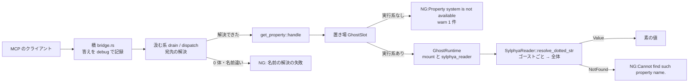

# Design Document: areka-P0-mcp-get-property

> 実測は 2026-10-04・本ブランチ（main `e2a373b5` の上に spec 文書のコミットだけ）。コードは「何の定義か」（関数名・型名・定数名＋ファイルパス）で指し、行番号では指さない。調べた事実と選ばなかった案は [research.md](research.md)（3 節＝実物で確かめた事実・4 節＝テストの組み方の 3 案・9 節＝設計の段の決定）。SSP の振る舞いの正本は [doc/ssp-mcp/survey.md](../../../doc/ssp-mcp/survey.md) §7。

## Overview

**Purpose**: MCP のツール `get_property` のダミーの中身（どの名前にも `NG:not implemented yet`）を、宛先のゴーストの記憶（統一プロパティシステム sylphya）を読んで答える処理に替える。AI エージェントでゴーストを作る人が、`baseware.name` などの値を SSP と同じ手順で確かめられるようになる。

**Users**: Claude Code などの MCP のクライアントからゴーストを作る人と、後続のプロパティの spec の実装者（値を足したことを MCP から確かめる）。

**Impact**: アプリ本体側の `crates/areka/src/mcp/get_property.rs` の `handle` の本体を書き換え、ゴーストの実行系 `GhostRuntime`（`crates/areka-ghost/src/runtime.rs`）に記憶の読み手を借りる読み口を 1 本足す。プロトコル側（`crates/areka-mcp`）・振り分け（`mcp/mod.rs`）・宛先の解決（`mcp/resolve.rs`）・sylphya は変えない（変える行 0）。

### Goals

- 値のある名前に素の値で答える（空の値は空の本文・`isError: false`）。
- 値の無い名前・読めない書式の名前に `NG:Cannot find such property name.`（`isError: true`）で答える。
- 宛先の実行系が見つからないときも panic せず `NG:Property system is not available` で答え、`warn!` を 1 件残す。
- 判断の分岐（値がある・空・無い・実行系が無い・問い手の選び方）を決定論テストで固定し、実機で 2 つの名前を確かめる。
- 触るソースファイルを 3 つに限る。

### Non-Goals

- プロパティの値の追加（`currentghost.*` など）。追加 0。
- 名前の手直し（前後の空白の除去・英字の大小の変換）。大小は `property-name-case-fold` の持ち物。
- `ghost_name` の照合の変更。`mcp-ghost-name-match` の持ち物。
- 書き込み（SSP の MCP に `set_property` は無い）・名前を隠す仕組み・答えの独自の記録。

## Boundary Commitments

### This Spec Owns

- `crates/areka/src/mcp/get_property.rs` の `handle` の中身（置き場から実行系を引く → 問い手を組む → 読み手に聞く → 2 つの結果を答えへ写す）。
- 2 つの文言: `Cannot find such property name.`（SSP と同じ）と `Property system is not available`（areka 独自）。どちらも `get_property.rs` に直に書く（共有の定数にしない＝`mcp-tool-entrances` のツールのファイルの約束どおり）。
- `GhostRuntime::sylphya_reader()`（記憶の読み手を借りる読み口 1 本）。
- `crates/areka/src/mcp/get_property_tests.rs` の決定論テストと、本 spec の `verification/` の実機の記録。
- `property-name-case-fold` と `mcp-ghost-name-match` の brief への申し送り（要件 5.6・5.7。spec 文書の変更で、ソースファイルには数えない）。

### Out of Boundary

- 宛先の解決（`resolve::active`・`resolve::resolve`）と振り分け（`dispatch`）。`handle` に来る前に済んでいる前提に頼るだけ。
- 読み手の解決の中身（`SylphyaReader::resolve_dotted_str`・`parse_dotted`・「ゴーストごと → 全体」の順）。名前の書式の誤りの `warn!` も読み手の持ち物で、本 spec は重ねて出さない。
- 答えの記録（橋 `crates/areka-mcp/src/tools/bridge.rs` の `debug!` 1 行）。普通の答え（値・空の値・無い名前）に独自の記録を足さない（足す行 0）。
- SHIORI の `GetProperty`（`crates/areka/src/shiori_host.rs` の `ShioriHostSink::GetProperty`）。写し方を真似るだけで、コードは共有しない・変えない。
- ツールの定義（`DEFINITION`）と引数の検査。

### Allowed Dependencies

- `areka_ghost::GhostRuntime`（`mount()` と、本 spec が足す `sylphya_reader()`）・`areka_ghost::sylphya_wiring::ghost_asker_id`。
- `areka_sylphya::{AskerContext, DottedResolution, SylphyaReader}`（`areka` は `areka-sylphya` に直接依存済み）。
- `crate::ghost_session::GhostSlot` と `GhostSession::runtime()`（どちらも `pub(crate)`）。
- `super::resolve::{ActiveGhost, listed_value}`・`areka_mcp::tools::{ReplyTo, outcome}`・`areka_mcp::tools::get_property::Args`。
- テストだけ: `log_capture_kit::capture`（dev 依存済み）・`crate::emo2_boot::ghost_switch_test_support::{SwitchRig, FakeShiori, standard_script}`。
- 新しい依存は 0。すべての `Cargo.toml` の変える行は 0。

### Revalidation Triggers

- `SylphyaReader::resolve_dotted_str` の引数・戻り値（`DottedResolution` の 2 択）が変わる。
- ゴースト自身の問い手の組み方（`ghost_asker_id(&mount.shiori.dir)`）が変わる。起動の手順と `get_property` の組み方がずれると、ゴーストごとの値が読めなくなる。
- 置き場（`GhostSlot`）が 2 体以上を持つ形になる。そのときは `handle` が受け取った `ActiveGhost` を実行系を引く鍵に使う必要が出る（今は使っていない）。
- `handle` の署名（`mcp-tool-entrances` の約束）や `outcome` の形が変わる。
- `property-name-case-fold`・`mcp-ghost-name-match` が本 spec より先に着地する（要件 5.6・5.7 の後半の扱いに切り替える）。

## Architecture

### Existing Architecture Analysis

- 汲む系（`mcp/mod.rs` の `drain`）が UI スレッドで要求を 1 件ずつ取り出し、そのつど `resolve::active` で起動中のゴーストを読み直してから `dispatch` を呼ぶ。`dispatch` は `GetProperty` を「省略なら起動中の 1 体」（`Omitted::UseActive`）で解決し、成功したときだけ `get_property::handle(world, ghost, args, reply)` を呼ぶ。
- `handle` に来る `ActiveGhost` は名前とルートフォルダだけを持つ値で、実行系を持たない。実行系は置き場 `GhostSlot(Option<GhostSession>)` の `GhostSession::runtime()` から引く。同じ引き方が `crates/areka/src/install/names.rs` の `current_runtime` にあるが、`pub(super)` で `mcp` からは借りられない（`install/` は触らない）ので、`handle` の中に同じ 1 行を書く。
- 読み手 `SylphyaReader::resolve_dotted_str` は同期・待ち無しで、結果は `DottedResolution::{Value(String), NotFound}`。書式の読めない名前は読み手が `warn!` を残して `NotFound` に倒す。
- SHIORI の `GetProperty` は `Value(v)` を成功（空の文字列も成功）、`NotFound` を失敗にする。`get_property` は同じ 2 択を `outcome::value(v)`／`outcome::ng(…)` に写す。

### Architecture Pattern & Boundary Map



図の中で本 spec の持ち物は `get_property::handle` と、`GhostRuntime` の読み口 `sylphya_reader()` の 2 つだけ。ほかの箱は既存で、変えない。

**Architecture Integration**:
- 選んだ形: 関数 1 本（`handle`）に直に書く。判断を別の純粋な関数へ切り出さない（呼び手が 1 つしか無く、切り出すと本番のコードが増えるだけ）。
- 既存の型の踏襲: 読み口は `sylphya_publisher()`・`mount()` と同じ「借りて返す」形。テストは実装と同じフォルダの兄弟ファイル。
- steering との整合: 失敗の道に `warn!`（ログ無しの失敗経路を作らない）・UI スレッドで待たない・1 ファイル 1,000 行以下。

### 設計の決定（`research.md` 6 節・8 節への答え）

| # | 分かれ目 | 決定 | 理由 |
|---|---|---|---|
| 1 | テストの組み方（research 4 節の A／B／C） | **A の変形**: 処理は `handle` 1 本。値がある・空・無い・問い手の選び方は、本物の実行系（`SwitchRig`）を**1 回だけ**起こすテスト 1 本にまとめる。実行系が無い道は空の World のテスト 1 本 | 問い手を組む元（`mount().shiori.dir`）を取り違える間違いは、本物の実行系を通さないと捕まらない。純粋な関数へ切り出す案（B・C）は本番のコードを増やし、読み手の「ゴーストごと → 全体」の順（`areka-sylphya` が確かめ済み）を重ねて試すことになる。起こすのを 1 回にすれば重さは `mcp_tests.rs` の既存の 1 本分 |
| 2 | 読み口の形 | `pub fn sylphya_reader(&self) -> &SylphyaReader`（借りる） | `sylphya_publisher()` と同じ形。複製が要る呼び手は `clone()` できる。名前の衝突は 0（同名の関数は無い） |
| 3 | `ActiveGhost` と置き場の実行系を突き合わせるか | **突き合わせない**。`handle` は `ghost` を `warn!` の欄にだけ使い、実行系は置き場（1 つ）から引く | 置き場は 1 つで、`drain` は `active` を読んでから `handle` を呼ぶまで World を変えない＝本番では常に一致する。突き合わせを足すと本番で来ない分岐が 1 つ増える |
| 4 | 実行系が無いときの `warn!` の形 | 欄は `event = "mcp_get_property_unavailable"`・`ghost`（`resolve::listed_value(ghost)`＝橋の `debug!` の `ghost` と同じ値）・`property_name`。文字列の欄は `as_str()` で渡す | テストが `CapturedEvent::field_str("event")` で絞って数える既存の型（`ghost_switch_notice_tests.rs`）に合わせる。`field_str` は文字列として渡した欄だけを読める |
| 5 | 起動直後の短い窓 | **既知の振る舞いとして書き残す**（直さない）。起動の手順が `baseware.*` を投函してから反映されるまでのごく短い間は `baseware.name` が「無い名前」になりうる | 反映を待つ仕組みを足すと要件 1.5（待たない）に反する。実機確認は会話が始まった後に呼ぶ |
| 6 | 実機確認で SSP を止めるか | **止めない**。areka の記録の行「MCP: 待受を始めた url=…」から実際の口を読み、その URL を使う | SSP が 9801・9821 を握っていれば areka は隣の口へ逃げる。自分が起こしていないプロセスは止めない。SSP が居なければ前例どおり 9801 になる |

### 既知の振る舞い

- **起動直後の短い窓**（決定 5）。置き場に実行系が入った直後、sylphya のアクターが静的な値を反映する前に聞くと `NG:Cannot find such property name.` になりうる。数フレームで解ける。
- **`areka.*`（保存された内部の名前）も読める**。隠す仕組みは足さない（要件の Adjacent expectations）。
- **英字の大小は区別する**（今の読み手のまま）。`BASEWARE.NAME` は今は「無い名前」。`property-name-case-fold` の着地の後は、本 spec を変えずに値が返る。

### Technology Stack

| Layer | Choice / Version | Role in Feature | Notes |
|-------|------------------|-----------------|-------|
| アプリ本体 | `crates/areka`（既存） | `get_property::handle` | 新しい依存 0 |
| 実行系 | `crates/areka-ghost`（既存） | 読み口 `sylphya_reader()` | 追加は関数 1 本 |
| プロパティシステム | `crates/areka-sylphya`（既存・無変更） | `resolve_dotted_str` | 変える行 0 |
| テスト | `log-capture-kit`（dev 依存済み）・`SwitchRig` | `warn!` の数え・本物の実行系 | 新しい dev 依存 0 |

## File Structure Plan

### Modified Files

- `crates/areka/src/mcp/get_property.rs` — `handle` の本体を書き換える（ダミーの 1 文 → 下の「get_property::handle」）。先頭の説明文も「ダミー」から本 spec の説明へ直す。16 行 → 50 行前後。
- `crates/areka/src/mcp/get_property_tests.rs` — ダミーを期待する `answers_not_implemented_yet_with_an_empty_world` を消し、新しいテスト 2 本に置き換える。33 行 → 150 行前後。
- `crates/areka-ghost/src/runtime.rs` — `impl GhostRuntime` に `sylphya_reader()` を 1 本足す（`sylphya_publisher()` の直後）。欄 `sylphya_reader` の説明文は実態に合わせて 1 行直してよい。783 行 → 790 行前後（1,000 行以下）。既存の欄・既存の読み口・`into_parts`・`GhostParts`・起動と終了の手順は変えない。

新しいファイルは 0（子モジュールは要らない）。

### 変えないファイル（変える行 0）

`crates/areka/src/mcp/mod.rs`・`crates/areka/src/mcp/resolve.rs`・`crates/areka/src/mcp/mcp_tests.rs`・`crates/areka/src/mcp/resolve_tests.rs`・`crates/areka-mcp/src/` の下の全ファイル・`crates/areka/src/main.rs`・`crates/areka/src/ghost_session.rs`・`crates/areka/src/shiori_host.rs`・`crates/areka/src/install/` の下の全ファイル・`crates/areka-sylphya/` の下の全ファイル・`crates/areka/src/emo2_boot/ghost_switch_test_support.rs`・すべての `Cargo.toml`。

実装の途中でこの一覧のどれかを触る要が出たら、止めて報告する（要件 5.1）。

### spec 文書（ソースファイルに数えない）

- `.kiro/specs/areka-P0-mcp-get-property/verification/signoff.md` — 実機の記録（新規・要件 4.6）。
- `.kiro/specs/areka-P0-property-name-case-fold/brief.md` — 末尾の申し送り。**設計の段の分は 2026-10-04 に書いた**（下の「申し送り」）。完了のときに実装の事実で書き直す。
- `.kiro/specs/areka-P0-mcp-ghost-name-match/brief.md` — 末尾の申し送り（実装の最終段階で書く。まだ書いていない）。

## System Flows

「Architecture Pattern & Boundary Map」の図が流れのすべて。`handle` の中の分かれ目は 2 つだけ:

1. 置き場に実行系があるか（無ければ `warn!`＋`NG:Property system is not available` で終わる）。
2. 読み手の答えが `Value` か `NotFound` か。

どの道も、`handle` が返る前に `reply.send` を 1 回だけ呼ぶ（後から答える置き場 `super::later` は使わない）。

## Requirements Traceability

| Requirement | Summary | Components | Interfaces | 確かめ方 |
|---|---|---|---|---|
| 1.1 | 値を素のまま返す | `handle` | `outcome::value(v)` | テスト 2 の ⑴ |
| 1.2 | 空の値は空の本文 | `handle` | `outcome::value("")` | テスト 2 の ⑵ |
| 1.3 | 宛先のゴーストの記憶から、そのゴーストの問い手で読む | `handle`・`sylphya_reader()` | `ghost_asker_id(&runtime.mount().shiori.dir)` | テスト 2 の ⑸ |
| 1.4 | 名前を手直ししない | `handle` | `args.property_name` をそのまま `resolve_dotted_str` へ | 設計の約束（コードに手直しの処理 0）。大小のテストは置かない（4.7） |
| 1.5 | その場で答える | `handle` | `reply.send` を返る前に 1 回 | テスト 1・2 の `try_answer` |
| 1.6 | 切替の後は今のゴースト | `handle`（呼ばれた時点の置き場を読む）・既存の `drain` | — | 専用のテストなし（4.5） |
| 2.1 | 無い名前は `NG:Cannot find such property name.` | `handle` | `DottedResolution::NotFound` → `outcome::ng` | テスト 2 の ⑶ |
| 2.2 | 空・読めない書式も同じ本文 | 読み手（既存）＋`handle` | 読み手が `NotFound` に倒す | テスト 2 の ⑶（空の名前を 1 つ含める） |
| 2.3 | まだ値の無い名前も同じ本文 | `handle` | 同上 | テスト 2 の ⑶（`currentghost.name`） |
| 3.1 | 実行系が無いときの答えと `warn!` | `handle` | `outcome::ng("Property system is not available")` | テスト 1 |
| 3.2 | 3.1 の本文は他の 3 つの文言と違う | `handle` の文言 | — | 文言の比べ（下の「文言」）＋共有テストが緑 |
| 3.3 | panic しない | `handle` | `Option` で拾う・読み手は panic しない | テスト 1・2 |
| 4.1 | 5 つの分岐を固定 | テスト 1・2 | — | Testing Strategy |
| 4.2 | 直後に答えが得られる | テスト 1・2 | `Pending::try_answer` | Testing Strategy |
| 4.3 | ダミーの期待を残さない | `get_property_tests.rs` | — | 旧テストを消す。`not implemented yet` の文字列が 2 ファイルに 0 件 |
| 4.4 | 共有のテストを変えずに緑 | — | — | `mcp_tests.rs`・`resolve_tests.rs`・`crates/areka-mcp` の差分 0 行で全体が緑 |
| 4.5 | 1.6 と記録の行にテストを足さない | — | — | 足すテスト 0 本 |
| 4.6 | 実機確認 | `verification/signoff.md` | — | 実機確認の節 |
| 4.7 | 大小を固定するテストを置かない | `get_property_tests.rs` | — | 大文字を混ぜた名前を使うテスト 0 本 |
| 4.8 | `ghost_name` の照合を固定しない | `get_property_tests.rs` | — | テストの `ghost_name` はすべて `None` |
| 5.1 | 触るソースは 3 つ | File Structure Plan | — | `git diff --stat` |
| 5.2 | `runtime.rs` は読み口 1 本だけ | `sylphya_reader()` | — | 差分の目視 |
| 5.3 | 変えないファイル | File Structure Plan | — | `git diff --stat` に現れない |
| 5.4 | 値を足さない | — | — | 本番のコードに値を載せる呼び出し 0（テストの中だけ） |
| 5.5 | 1,000 行以下 | File Structure Plan | — | `wc -l` |
| 5.6 | `property-name-case-fold` への申し送り | 申し送りの節 | — | 設計の分は記入済み。完了のときの書き直しはタスクに残す |
| 5.7 | `mcp-ghost-name-match` への申し送り | 申し送りの節 | — | 実装の最終段階のタスクに残す |

## Components and Interfaces

| Component | Layer | Intent | Req Coverage | Key Dependencies | Contracts |
|---|---|---|---|---|---|
| `get_property::handle` | アプリ本体（`crates/areka/src/mcp/get_property.rs`） | 宛先のゴーストの記憶から値を読んで答える | 1.1〜1.6, 2.1〜2.3, 3.1〜3.3, 5.4 | `GhostSlot`・`GhostRuntime`・`SylphyaReader`（P0） | Service |
| `GhostRuntime::sylphya_reader` | 実行系（`crates/areka-ghost/src/runtime.rs`） | 記憶の読み手を借りる | 1.3, 5.2 | — | Service |

### アプリ本体

#### get_property::handle

| Field | Detail |
|-------|--------|
| Intent | 置き場の実行系の読み手に、そのゴースト自身の問い手として名前を聞き、2 択を答えへ写す |
| Requirements | 1.1, 1.2, 1.3, 1.4, 1.5, 1.6, 2.1, 2.2, 2.3, 3.1, 3.2, 3.3, 5.4 |

**Responsibilities & Constraints**
- 署名は今のまま（`mcp-tool-entrances` の約束）。引数の前の `_` を外すだけ。
- UI スレッドで待たない。送受信・ファイル・他スレッドへの問い合わせを足さない。
- `args.property_name` に手を加えない（`trim`・大小の変換・置き換えの呼び出し 0）。`args.ghost_name` は読まない（解決は済んでいる）。
- `ghost` は `warn!` の欄にだけ使う（実行系を引く鍵にしない＝決定 3）。
- 普通の答え（値・空の値・無い名前）で記録を出さない。

**Dependencies**
- Inbound: `mcp/mod.rs` の `dispatch`（解決の済んだ `ActiveGhost` と `Args` を渡す・P0）
- Outbound: `GhostSlot`／`GhostSession::runtime()`（実行系を引く・P0）、`GhostRuntime::{mount, sylphya_reader}`（P0）、`ghost_asker_id`（P0）、`SylphyaReader::resolve_dotted_str`（P0）、`resolve::listed_value`（`warn!` の欄・P1）

**Contracts**: Service [x] / API [ ] / Event [ ] / Batch [ ] / State [ ]

##### Service Interface

```rust
// crates/areka/src/mcp/get_property.rs
const NOT_FOUND: &str = "Cannot find such property name.";
const UNAVAILABLE: &str = "Property system is not available";

pub(super) fn handle(world: &mut World, ghost: &ActiveGhost, args: Args, reply: ReplyTo) {
    let runtime = world
        .get_non_send::<GhostSlot>()
        .and_then(|slot| slot.0.as_ref())
        .and_then(|session| session.runtime());
    let Some(runtime) = runtime else {
        tracing::warn!(
            event = "mcp_get_property_unavailable",
            ghost = listed_value(ghost).as_str(),
            property_name = args.property_name.as_str(),
            "[mcp] get_property: 宛先のゴーストの実行系が見つからない"
        );
        reply.send(outcome::ng(UNAVAILABLE));
        return;
    };
    let asker = AskerContext { asker: ghost_asker_id(&runtime.mount().shiori.dir) };
    let outcome = match runtime.sylphya_reader().resolve_dotted_str(&asker, &args.property_name) {
        DottedResolution::Value(value) => outcome::value(value),
        DottedResolution::NotFound => outcome::ng(NOT_FOUND),
    };
    reply.send(outcome);
}
```

（形を示すもので、借用の都合の細かな書き換えは実装に任せる。分かれ目の数と順は変えない。）

- Preconditions: `dispatch` が宛先を解決済み。`args.property_name` は文字列（欠落・型違いは手前の検査が `-32602` で拒む）。
- Postconditions: 返る前に `reply.send` をちょうど 1 回呼んでいる。World を書き換えていない。
- Invariants: panic しない。答えは次の 3 つの形のどれか。

##### 文言（要件 3.2）

| 場面 | 本文 | `isError` | 出どころ |
|---|---|---|---|
| 値がある（空を含む） | 値そのまま | false | `handle` |
| 値が無い・書式が読めない | `NG:Cannot find such property name.` | true | `handle`（SSP と同じ・survey §7.1） |
| 実行系が無い | `NG:Property system is not available` | true | `handle`（areka 独自） |
| 起動中のゴーストが 0 体 | `NG:Specified ghost is not active` | true | `resolve.rs` の `NOT_ACTIVE`（`handle` の手前） |
| 名前違い | `NG:Cannot find active ghost from specified name` | true | `resolve.rs` の `CANNOT_FIND`（`handle` の手前） |

5 つの本文は互いに違う。共有のテスト `get_log_and_seven_omitted_do_not_answer_with_a_resolve_failure`（空の World で `get_property` を振り分ける）は、答えが下の 2 つのどちらでもないことを求める。実行系が無い道の答えは 3 行目なので、緑のまま。

**Implementation Notes**
- Integration: `use` に足すのは `areka_ghost::sylphya_wiring::ghost_asker_id`・`areka_sylphya::{AskerContext, DottedResolution}`・`crate::ghost_session::GhostSlot`・`super::resolve::listed_value`。
- Validation: 名前の検査はしない（読み手が書式の誤りを `warn!`＋`NotFound` に倒す）。
- Risks: 置き場が空・実行系なしの単位（`GhostSession::for_test`）・置き場の資源そのものが無い、の 3 つは同じ `None` の道に入る（分岐は 1 つ）。

### 実行系

#### GhostRuntime::sylphya_reader

| Field | Detail |
|-------|--------|
| Intent | 実行系の記憶の読み手を借りる読み口 |
| Requirements | 1.3, 5.2 |

```rust
// crates/areka-ghost/src/runtime.rs（impl GhostRuntime・sylphya_publisher() の直後）
/// sylphya（統一プロパティシステム）の読み手への参照。`sylphya_publisher()` と同じ形の読み口。
pub fn sylphya_reader(&self) -> &SylphyaReader {
    &self.sylphya_reader
}
```

- 既存の欄をそのまま貸すだけ。判断の分岐が無いので専用のテストは足さない（テスト 2 が通ることで使われていることが分かる）。
- `into_parts`・`GhostParts.sylphya_reader`・`shutdown` の中の欄の扱いは変えない。

## Error Handling

### Error Strategy

| 場面 | 答え | 記録 |
|---|---|---|
| 値が無い・書式が読めない | `NG:Cannot find such property name.`（`isError: true`） | `handle` は出さない。書式の誤りは読み手の `warn!`、答えは橋の `debug!` |
| 実行系が無い | `NG:Property system is not available`（`isError: true`） | `handle` が `warn!` を 1 件（`event`・`ghost`・`property_name`） |
| 返事の受け手がもう居ない（上限の後） | — | `ReplyTo::send` が黙って捨てる（既存） |

失敗はどれも回復可能で、ゴーストもアプリも止めない。`error!` と panic は 0。

### Monitoring

答えは橋が `tools/call` ごとに `debug!` 1 行（`tool`・`ghost`・`is_error`・`text`）で残す。実機確認では `RUST_LOG=info,areka_mcp=debug` で開ける。

## Testing Strategy

テストは `crates/areka/src/mcp/get_property_tests.rs`（実装の兄弟ファイル）に 2 本。どちらも `handle` を直に呼び、`ghost_name` は `None`（要件 4.8）。答えは `handle` が返った直後に `pending.try_answer()` で取り出し、「その場で答える」ことを確かめる（要件 4.2）。名前に大文字を混ぜたものは使わない（要件 4.7）。

### テスト 1: 実行系が無い（空の World）— 要件 3.1・3.3・4.1⑷

- 組み方: `World::new()` と作った `ActiveGhost`（名前あり）。`log_capture_kit::capture` の中で `handle` を呼ぶ。
- 期待（1 つの `assert_eq!` に並べる）: 本文 `NG:Property system is not available`・`is_error == true`・`event` が `mcp_get_property_unavailable` の記録がちょうど 1 件・その段が `WARN`・欄 `ghost` が `ActiveGhost` の名前・欄 `property_name` が渡した名前。
- 旧テスト `answers_not_implemented_yet_with_an_empty_world` はこれに置き換える（要件 4.3）。

### テスト 2: 本物の実行系で値を読む — 要件 1.1・1.2・1.3・2.1〜2.3・4.1⑴⑵⑶⑸

- 組み方: `SwitchRig::new(vec![("A", FakeShiori::Scripted(…standard_script(r"\0A\e")…))])` → `rig.boot("A")`（`mcp_tests.rs` の `real_unit_answers_get_active_ghost_list_in_one_frame` と同じ起こし方）。置き場の実行系から書き手（`sylphya_publisher()`）と SHIORI のフォルダ（`mount().shiori.dir`）を取り、次の値を載せてから `barrier()` で反映を待つ。

  | 載せ方 | 名前 | 値 | 役目 |
  |---|---|---|---|
  | `set(ゴースト自身の問い手, …)` | `test.key` | `ghost` | ゴーストごとの値 |
  | `publish_static(_, vec![], vec![…])`（全体へ着地） | `test.key` | `global` | 同じ名前の全体の値 |
  | `set(別の問い手 AskerId::new("someone-else"), …)` | `test.key` | `other` | 別の問い手の値 |
  | `set(別の問い手, …)` | `test.other_only` | `other` | 別の問い手にしか無い名前 |
  | `set(ゴースト自身の問い手, …)` | `test.empty` | （空） | 空の値 |

  名前は自由な名前（根が `test`）を使う。正準の根（`baseware`・`currentghost` など）は `set` では書けない（`classify_set` が `NotSettable` にする）。
- 聞く名前と期待（`resolve::active(&rig.world)` の `ActiveGhost` で `handle` を名前ごとに呼び、答えを集めてから `rig.shutdown()` し、1 つの `assert_eq!` に並べる）:

  | 分岐 | 聞く名前 | 期待 |
  |---|---|---|
  | ⑴ 値がある | `baseware.name` | `areka`・false（起動の手順が載せた全体の値） |
  | ⑸ 問い手の選び方 | `test.key` | `ghost`・false（`global` でも `other` でもない） |
  | ⑸ 別の問い手の値を返さない | `test.other_only` | `NG:Cannot find such property name.`・true |
  | ⑵ 値が空 | `test.empty` | 空の本文 1 つ・false |
  | ⑶ 値が無い | `currentghost.name` | `NG:Cannot find such property name.`・true |
  | ⑶ 空の名前（2.2 の代表） | （空文字） | `NG:Cannot find such property name.`・true |

- この組で捕まる間違い: 問い手を `ActiveGhost.root` など別の元から組むと `test.key` が `global` になり、`test.empty` が「無い名前」になる。値と「無い」の写し違い・空の値を `NG:` にする間違いも赤になる。
- 読めない書式（`baseware..name` など）は読み手の持ち物（`areka-sylphya` が確かめ済み）なので、代表として空の名前 1 つだけを通す。

### 足さないテスト（0 本と明記）

- 切替の後に今のゴーストを読むこと（要件 1.6）・橋の `debug!` の行: 0 本（要件 4.5）。
- 英字の大小だけが違う名前: 0 本（要件 4.7）。
- `ghost_name` の照合（大小・本体側名・空白・空文字）: 0 本（要件 4.8）。
- `GhostRuntime::sylphya_reader()` 単体: 0 本（分岐なし）。
- 共有のテストファイル（`mcp_tests.rs`・`resolve_tests.rs`・`crates/areka-mcp` のテスト）への変更: 0 行（要件 4.4）。

### 実機確認（要件 4.6）

手順は `completed/areka-P0-mcp-tool-entrances/verification/signoff.md` の前例に合わせる。

1. `tools/package.ps1` で配布形を作り、ワークツリーの `target\` の下（例 `target\signoff-prop\x\`）へ展開する。記録も `target\` の下に置く。
2. `AREKA_APP_SMOKE_EXIT_MS`（有界の自動終了）・`AREKA_NO_ALERT=1`・`NO_COLOR=1`・`RUST_LOG=info,areka_mcp=debug` で、展開先の `areka.exe` を emo2 で起こす。自分が起こしたプロセス以外は止めない（SSP が動いていても止めない＝決定 6）。
3. 記録の行「MCP: 待受を始めた url=…」から URL を読む。会話が始まった後（起動直後の短い窓を避ける）に、その URL へ MCP のクライアント（前例と同じ形の `curl` の `tools/call`。Claude Code がつながるなら `claude mcp add --transport http --scope project` でも可）から次を呼ぶ。

   | # | 呼び方 | 期待 | 判定 |
   |---|---|---|---|
   | ⑴ | `property_name: "baseware.name"`（`ghost_name` なし） | `areka`・`isError: false` | 要件 4.6⑴ |
   | ⑵ | `property_name: "no.such.thing"`（`ghost_name` なし） | `NG:Cannot find such property name.`・`isError: true` | 要件 4.6⑵ |
   | ⑶ | `property_name: "baseware.name"`・`ghost_name` に `get_active_ghost_list` の答えをそのまま | `areka`・`isError: false` | 記録だけ（要件 5.7 の申し送りの材料） |

4. 記録に各呼び出しの `debug!`（「MCP: ツールに答えた」）が 1 件ずつあること、`ERROR` の段が 0 件であることを確かめ、結果を `.kiro/specs/areka-P0-mcp-get-property/verification/signoff.md` に残す。

大小を混ぜた名前（`BASEWARE.NAME`）は本 spec の実機確認では呼ばない。`property-name-case-fold` が足すなら、手順 3 の表の ⑴ の直後に 1 行足せばよい（申し送り済み）。

## 申し送り（要件 5.6・5.7）

| 宛先 | いつ | 状態 |
|---|---|---|
| `.kiro/specs/areka-P0-property-name-case-fold/brief.md` の末尾「`mcp-get-property` からの申し送り（2026-10-04）」 | 設計の段 | **記入済み**（2026-10-04・本設計の決定で 3 点を書いた） |
| 同上 | 完了のとき（`/kiro-complete`） | **タスクに残す**: 実装の事実で書き直す（日付も改める）。`property-name-case-fold` が先に着地していたら、追記の代わりに要件 1.4 と実機確認へ反映する |
| `.kiro/specs/areka-P0-mcp-ghost-name-match/brief.md` の末尾「`mcp-get-property` からの申し送り（日付）」 | 実装の最終段階（実機確認の後・`/kiro-complete` の前） | **タスクに残す**（まだ書いていない）。書く 3 点: ⑴ `handle` は `ActiveGhost` を `warn!` の欄にだけ使い、実行系を引く鍵にしていない＝照合を直しても `get_property` 側は変えずに済む、⑵ テストの `ghost_name` はすべて `None`、⑶ 実機確認の ⑶ の呼び方と答え。`mcp-ghost-name-match` が先に着地していたら、追記の代わりに、その照合で本 spec のテストと実機確認が通ることを確かめる |

## Performance & Scalability

`handle` がするのは、置き場の参照 → 問い手の文字列を 1 つ作る → 鏡像の読みロックの中で `Arc` を複製 → 表を 2 回まで引く、だけ。UI スレッドを待たせる道（送受信・ファイル・ロックの取り合い待ち）は 0。
