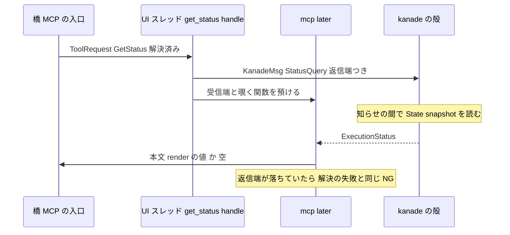
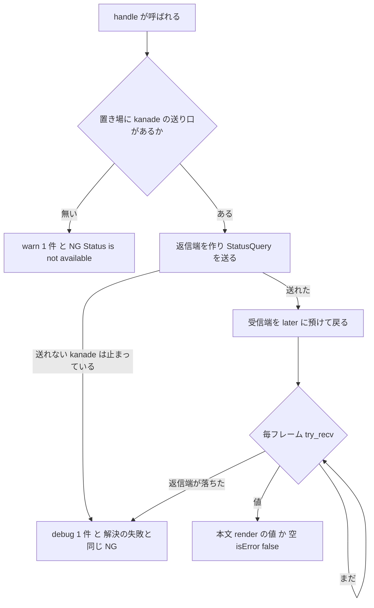

# Design Document: areka-P0-mcp-get-status

> 実測は 2026-10-05・本ブランチ（main `44fc0a61` から分かれたもの）。コードは「何の定義か」（関数名・型名・定数名＋ファイルパス）で指し、行番号では指さない。調べた事実と選ばなかった案は [research.md](research.md)（3 節＝実物で確かめた事実・4 節＝3 つの候補・8 節＝設計の段の決定）。語の正本は ukadoc `Status [SSP拡張]`（SHIORI/3.0 の要求のヘッダ）、SSP の答えの実測は [doc/ssp-mcp/survey.md](../../../doc/ssp-mcp/survey.md)。

## Overview

**Purpose**: MCP のツール `get_status` のダミーの中身（`NG:not implemented yet`）を、宛先のゴーストの今の実行の状態を答える処理に替える。AI エージェントは台本を送る前に、ゴーストが喋っている途中か・選択肢表示中かを SSP と同じ書式で確かめられる。

**Users**: Claude Code などの MCP のクライアントからゴーストを操る人と、状態を読んで振る舞いを決める後続の spec（`mcp-user-response`・`mcp-author-tools`）の実装者。

**Impact**: kanade の知らせの型 `KanadeMsg`（`crates/areka-kanade/src/msg.rs`）に問い合わせの変種を 1 つ足し、殻（`crates/areka-kanade/src/actor.rs`）がその場で答える。アプリ本体側の `crates/areka/src/mcp/get_status.rs` の `handle` は、その問い合わせを送り、返事を後から答える口 `mcp::later` で待つ。実行の状態の決め方（`status.rs`・`schedule/`）・振り分け（`mcp/mod.rs`）・宛先の解決（`mcp/resolve.rs`）・プロトコル側（`crates/areka-mcp`）は変えない（変える行 0）。

### Goals

- 宛先のゴーストの今の実行の状態を、ukadoc `Status [SSP拡張]` の語のカンマ連結・`isError: false` で返す（何も無ければ空の本文）。
- 本文を、kanade が SHIORI へ送る要求に載せる `Status` の値と同じ素（`State::snapshot`）・同じ書式（`ExecutionStatus::render`）から作る。
- 答える前に宛先が降りたら、宛先の解決に失敗したときと同じ文言の `NG:` で答える。
- UI スレッドを待たせない。ゴーストの運行と実行の状態を変えない。
- 判断の分岐を決定論テストで固定し、SSP との差を一覧に残し、実機で 1 回確かめる。

### Non-Goals

- 実行の状態の決め方（どの語がいつ立つか）。出どころの無い 5 語（`minimizing`・`induction`・`passive`・`timecritical`・`opening(…)`）と SSP の旗 `changing` を出すこと。
- 終了の挨拶・切り替えのお別れの台詞の再生中に `talking` を載せること（`farewell-talk-status` の持ち物）。
- `sakurascript`・`raise_event`（`mcp-kanade-tools`）・`reload`（`mcp-reload`）・`strict`（`mcp-strict-errors`）。
- ツールの定義・引数の検査・`ghost_name` の解決の規則・待ちの上限（`mcp-tool-entrances` のまま）。
- プロパティ `currentghost.status`（`currentghost-property-others`）。kanade の状態を UI の側へ写して置いておく仕組みは作らない（作る行 0）。

## Boundary Commitments

### This Spec Owns

- `KanadeMsg::StatusQuery`（今の実行の状態の問い合わせ）と、殻がそれに答える関数 `answer_status`（`actor.rs`）。「知らせと知らせの間の、その時点の `State::snapshot()` から作った `ExecutionStatus` を 1 回だけ返す」という約束。
- `crates/areka/src/mcp/get_status.rs` の `handle` の中身と、答えの写し方（値 → 本文・値なし → 空の本文・降りた → 解決の失敗と同じ `NG:`）。
- areka 独自の文言 1 つ: `Status is not available`（置き場に問い合わせ先が無い＝起きないはずの食い違いのときだけ）。`get_status.rs` に直に書く。
- 決定論テスト（kanade の統合テスト 1 ファイル・`get_status_tests.rs`）、SSP との差の一覧 `doc/ssp-mcp/get-status-diff-areka.md`、実機の記録 `verification/signoff.md`。

### Out of Boundary

- 実行の状態の素と書式: `State::snapshot`・`talk_active_of`（`crates/areka-kanade/src/schedule/mod.rs`）・`ExecutionSnapshot`・`ExecutionStatus::derive`・`render`（`crates/areka-kanade/src/status.rs`）。読むだけで変えない。
- 宛先の解決（`resolve::active`・`resolve::resolve`）・振り分け（`mcp::dispatch`）・後から答える口（`mcp::later`）・橋（`crates/areka-mcp/src/tools/bridge.rs` の `call`＝10 秒の上限と終了の途中の答え）。使うだけで変えない。
- 見えているバルーンの組を kanade へ届ける相（`crates/areka/src/emo2_boot/frame/status_report.rs` の `run_status_report_phase`）と、通信中の数の写し（`actor.rs` の `sync_online`）。既存の振る舞いのまま。
- kanade が SHIORI との往復の間ほかの知らせを処理しないこと（`actor.rs` の `round_trip`）。変えない。

### Allowed Dependencies

- kanade の中: `crate::schedule::State`（`snapshot` は `pub(crate)`）・`crate::status::ExecutionStatus`・`areka_actor::ReplySender`。
- アプリ本体: `areka_kanade::{KanadeMsg, ExecutionStatus}`（どちらも `lib.rs` で公開済み）・`areka_actor::{reply_channel, ReplyError}`・`crate::ghost_session::GhostSlot` と `GhostSession::kanade()`・`super::later`・`super::resolve::{ActiveGhost, Omitted, NOT_ACTIVE, resolve, listed_value}`・`areka_mcp::tools::{ReplyTo, outcome}`・`areka_mcp::tools::get_status::Args`。
- テストだけ: kanade の統合テストの共通の土台（`crates/areka-kanade/tests/kanade/common/`）・`GhostSession::for_test`・`log_capture_kit`（dev 依存済み）・`crate::emo2_boot::ghost_switch_test_support::{SwitchRig, FakeShiori, standard_script}`（読むだけ・変えない）。
- 新しい依存は 0。すべての `Cargo.toml` の変える行は 0。

### Revalidation Triggers

- `KanadeMsg::StatusQuery` の形（返信端の型 `ReplySender<ExecutionStatus>`）が変わる。読む側（本 spec の `get_status`・後続の spec）が直る。
- `State::snapshot` の意味が変わる（例: `farewell-talk-status` が `talk_active_of` に 3 相を足す）。`get_status` は手を入れずに追従するが、差の一覧の該当行（お別れの台詞の間は `talking` が出ない）を消す。
- `ExecutionSnapshot` に欄が足され、5 語のどれかの出どころができる。`get_status` にも自動で出る。差の一覧の「出どころの無い 5 語」の行を直す。
- `resolve::resolve` の署名や省略・空文字の扱いが変わる（`mcp-ghost-name-match`）。文言は同じ関数から引くので追従するが、`get_status_tests.rs` の期待（空文字のとき）を確かめる。
- 置き場（`GhostSlot`）が 2 体以上を持つ形になる。問い合わせ先を `ActiveGhost` から引く必要が出る。
- `mcp::later` の署名・覗く頻度が変わる。

## Architecture

### Existing Architecture Analysis

- **状態の持ち主は kanade のスレッド。** 運行の状態 `State` は殻の閉包（`actor.rs` の `spawn_kanade_translating`）の中にあり、外から直接は読めない。外から読む既存の形は「知らせに返信端を同梱して送り、殻がその場で答える」（`KanadeMsg::ResourceQuery` と `actor_resources::answer`）。
- **知らせと知らせの間の `State::snapshot()` は、SHIORI へ送る値の素と同じ。** 普段のイベント（周期の `OnSecondChange`・マウス・汎用の通知）は `State::snapshot()` から `Status` を作る。起動・切替・終了の握手のイベントは `State::snapshot_without_talk()` を使うが、握手を始める処理（`steady.rs` の `begin_close`・`change.rs` の `begin_change`・`mod.rs` の `force_quit`）は同じ 1 件の処理の中で選択待ちの帳簿を消し（`clear_choice_ledger`）、相を握手の相へ移す。握手の相では `talk_active_of` が偽なので、知らせの間に撮った `snapshot()` は `snapshot_without_talk()` と同じ値になる。問い合わせは必ず知らせの間に処理されるので、どの相でも `snapshot()` 1 本で足りる。
- **UI を待たせない既存の口。** `mcp::later`（`crates/areka/src/mcp/mod.rs`）は返事と「覗く関数」を預かり、毎フレームの汲む系 `drain` の終わりに覗く。待つ側が上限で居なくなった組は覗かずに捨てる。終了の途中は置き場ごと落ちて、橋が `NG:areka is shutting down` と答える。
- **返信端の消滅で「降りた」が分かる。** kanade が止まると受信箱の積み残しごと返信端が落ち、`ReplyReceiver::try_recv` が `Err(ReplyError::Dropped)` を返す（`crates/areka-actor/src/reply.rs`）。送る時点で kanade が止まっていれば `Sender::send` が `Err` を返す。
- **実行系があれば kanade の送り口もある。** `GhostSession` の `kanade` の欄は、起動の処理が実行系から写して入れる（`ghost_session.rs`・実行系が無ければ `None`）。`resolve::active` は実行系のある置き場だけを起動中と読むので、解決を通った呼び出しで送り口が無いことは本番では起きない。

### Architecture Pattern & Boundary Map



- **選んだ形**: 状態の持ち主（kanade）に問い、その時点の値を返してもらう（research.md 4 節の候補 A）。値の写しを別に置かない。
- **境界**: kanade は「状態の集合 `ExecutionStatus` を返す」まで。本文にする（`render`・空文字への写し・`NG:` の文言）のはツールのファイル。kanade は MCP を知らない。
- **守る既存の形**: 殻で答える問い合わせ（`ResourceQuery` と同じ並び・`step` を通さない）・ツールごとのファイル・`mcp::later`。
- **足すもの**: 変種 1 つ・殻の関数 1 つ・`handle` の中身。新しい型・新しい本番のファイル・新しいスレッドは 0。

### 設計の決定（research.md 6 節・7 節への答え）

| # | 決めること | 決定 | 理由 |
|---|---|---|---|
| 1 | 殻の腕をどこに置くか | **`actor.rs` に直に置く**（振り分けの腕と、`&State` を受ける関数 `answer_status`）。brief の「新規 `actor_status.rs`」は作らない | 中身は「撮る・導く・送る」の数行で、往復も判断も無い。別ファイルにする中身が無い。`actor.rs` は 876 行から 900 行弱になり上限の内。`actor.rs` の中から `#[path]` で本番の子モジュールを読み込む形は、`lib.rs` に触れないためだけの形なので採らない。**本質の形で `lib.rs`・`schedule/` に触る必要は無い** |
| 4 | 返信端の型 | **`ExecutionStatus`**（`Option<String>` にしない） | SHIORI への要求（`ShioriCall`）が運ぶ型と同じで、テストは型どうしでも文字列でも比べられる。文字列にする所は `render` の 1 か所のまま。後続が語の有無を読みたくなったら `status.rs` に読み口を足せば済み、知らせの形は変わらない。MCP の側の手間は `render().unwrap_or_default()` の 1 回 |
| 5 | 要件 3.2 の文言の取り方 | **`resolve::resolve(None, ghost_name, Omitted::UseActive)` の `Err` から取る** | 入口の解決と同じ 1 か所から引くので、省略・空文字・名前ありの分け方が入口と食い違わない。`mcp-ghost-name-match` が空文字の扱いを直した後も追従する |
| 7 | MCP の側の待ち方 | **`mcp::later` に預ける**（別のスレッドで待たない） | 既存の口をそのまま使え、スレッドを増やさない。終了の途中は置き場ごと落ちて `NG:areka is shutting down`（要件 3.3 のまま）。上限を過ぎた組は `later` が覗かずに捨てる。答えは、kanade の手が空いていれば同じフレームか次のフレームで返る |
| — | `currentghost.status` との相乗り | **本 spec は問い合わせの口だけを作る。状態の写しの置き場は作らない** | プロパティの読みはその場で値が要る（記憶の読み手の `resolve_dotted_str` は待たずに値を返す）ので、後続は「kanade が変わるたびに値を出す」形が要る見込みで、それは `currentghost-property-tree` の動く値の口と kanade の進行に乗る別の仕事。今それを先回りして作ると、使い手の無い写しが増え、往復中の値が「往復の前の値」になって要件 1.2 が揺れる。後続が写しを作ったあとも、問い合わせの口は「その時点の値」を返す口として残せる |

要件の段で決着済み（research.md 6 節の 2・3・6）: お別れの台詞の間の `talking` は直さない／SHIORI との往復中に届いた問い合わせは往復の後に答える／要件 5.1⑹ で比べるのは運行の相・選択待ちの帳簿・再生中のトーク。

### 既知の振る舞い（直さない・差の一覧と実機確認に書く）

- kanade が SHIORI の答え（と、台詞の翻訳の口の実行）を待っている間に届いた問い合わせは、その 1 件の処理が終わってから答える。10 秒を超えれば橋の上限の答えになり、橋が `warn!` を 1 件出す（既存）。
- 見えているバルーンの組は、フレームの終わりの届けの相が kanade へ送る。同じフレームで変わったバルーンは次のフレームの問い合わせから載る（SHIORI へ送る `Status` も同じ写しなので要件 1.2 は崩れない）。
- 終了の挨拶・切り替えのお別れの台詞の再生中は `talking` が出ない（`talk_active_of` の今の定義）。

### Technology Stack

| Layer | Choice / Version | Role in Feature | Notes |
|-------|------------------|-----------------|-------|
| MCP のツール | `crates/areka/src/mcp/get_status.rs`（既存） | 問い合わせを送り、答えを本文へ写す | `mcp::later`・`outcome::value`／`ng` を使う |
| 運行 | `crates/areka-kanade`（既存） | 問い合わせにその場で答える | `State::snapshot` → `ExecutionStatus::derive` |
| スレッド間の返事 | `areka-actor` の `reply_channel`（既存） | 1 回だけの返事と、消滅の検出 | `try_recv` で待たずに覗く |

新しい依存・新しい版は無い。

## File Structure Plan

### Modified Files

- `crates/areka-kanade/src/msg.rs` — `KanadeMsg` に変種 `StatusQuery { reply }` を足す（説明込みで 10 行弱）。同じファイルの中のテスト `existing_eight_kanade_msg_variants_are_unchanged_by_additive_growth` の `label` に腕を 1 つ足す（`KanadeMsg` を網羅して `match` しているのは、ここと `actor.rs` の振り分けの 2 か所だけ）。909 行 → 920 行前後。
- `crates/areka-kanade/src/actor.rs` — 振り分けの `match` に `StatusQuery` の腕（`ResourceQuery` の腕の隣・`sync_online` の後・`step` の前）と、関数 `answer_status(&State, ReplySender<ExecutionStatus>)` を足す。876 行 → 900 行弱。
- `crates/areka/src/mcp/get_status.rs` — `handle` の中身を書き換える（ファイルの説明・文言の定数 1 つ・`handle`）。16 行 → 80 行前後。
- `crates/areka/src/mcp/get_status_tests.rs` — ダミーを固定していたテストを消し、本 spec の振る舞いのテストへ書き換える（要件 5.4）。
- `crates/areka-kanade/tests/kanade.rs` — 統合テストの束ねに `#[path = "kanade/status_query_test.rs"] mod status_query_test;` を足す（テストの宣言 1 つ）。

### New Files

- `crates/areka-kanade/tests/kanade/status_query_test.rs` — 殻が問い合わせに答えることの統合テスト（要件 5.1・5.3）。`resource_query_test.rs`・`external_status_test.rs` と同じ並びで、共通の土台（`common/` の偽の shiori・保留できる偽の sakura）を使う。
- `doc/ssp-mcp/get-status-diff-areka.md` — SSP との差の一覧（要件 5.5）。形は `dump-images-diff-areka.md` と同じ（項目・areka・SSP・SSP の印）。
- `.kiro/specs/areka-P0-mcp-get-status/verification/signoff.md` — 実機の記録（要件 5.6）。

### 変えないファイル（変える行 0）

- `crates/areka-kanade/src/lib.rs`・`crates/areka-kanade/src/schedule/` の下すべて・`crates/areka-kanade/src/status.rs`。
- `crates/areka/src/mcp/mod.rs`・`resolve.rs`・`mcp_tests.rs`、`crates/areka-mcp/` の下すべて（`handler.rs` の `INSTRUCTIONS` の「not implemented yet」の 1 文は、ダミーが 3 本残るのでそのまま）。
- `crates/areka/src/ghost_session.rs`・`crates/areka/src/emo2_boot/` の下すべて。

### 約束との突き合わせ（同じウェーブの並走）

- **約束の内**: kanade の `schedule/`・`lib.rs`、MCP の `mod.rs`・`handler.rs` には触らない。本質の形でも触る必要が無い（決定 1）。
- **brief の「触るファイル」との違い**（どれも並走の約束には当たらない）: ⑴ `actor_status.rs` と兄弟テストは作らない（決定 1）。⑵ 代わりに kanade の統合テスト `tests/kanade/status_query_test.rs` と、束ねの `tests/kanade.rs` の宣言 1 行が入る。⑶ 文書 `doc/ssp-mcp/get-status-diff-areka.md`（要件の裁定 6 で決定済み）。
- **`mcp_tests.rs` に触らずに済む理由**: `mcp_tests.rs` の `get_log_and_seven_omitted_do_not_answer_with_a_resolve_failure` は、空の World へ `get_status` を振り分け、答えが解決の失敗の文言（`NOT_ACTIVE`・`CANNOT_FIND`）で**ない**ことを見る。本設計は「置き場に問い合わせ先が無い」を「降りた」と別に扱い、別の文言で答える（Error Handling）ので、このテストは緑のまま。

## System Flows

`handle` の分岐（UI スレッド・待つ所は無い）:



- 「解決の失敗と同じ NG」の文言は、`handle` の入口で `resolve::resolve(None, args.ghost_name.as_deref(), Omitted::UseActive)` の `Err` から 1 度だけ取り、覗く関数に持たせる（`ghost_name` を渡していれば `Cannot find active ghost from specified name`・省略なら `Specified ghost is not active`）。
- `later` に預けた後で待つ側が上限で居なくなれば、`later` が組を捨てる。終了が始まれば置き場ごと落ちる。どちらも既存の振る舞いで、本 spec は足さない。

## Requirements Traceability

| Requirement | Summary | Components | Interfaces | Flows |
|---|---|---|---|---|
| 1.1 | 語のカンマ連結・`isError: false`・前置きなし | `get_status::handle` | `outcome::value(render の値)` | 値の枝 |
| 1.2 | SHIORI へ送る `Status` と一字違わず同じ | `answer_status` | `State::snapshot` → `ExecutionStatus::derive`（送る側と同じ素・同じ型）・`render` は 1 か所 | — |
| 1.3 | 何も無ければ空の本文・`isError: false` | `get_status::handle` | `render()` の `None` → `outcome::value("")` | 値の枝 |
| 1.4 | 正典順・重複なし | （既存）`ExecutionStatus::from_states` | 触らない | — |
| 1.5 | `balloon(0=0/1=0)` の形 | （既存）`BalloonBindings::new`・`render` | 触らない | — |
| 1.6 | 本文 1 つだけ | `get_status::handle` | `outcome::value` は本文 1 つ・`with_image` を呼ばない | — |
| 2.1 | 普段の会話と起動の挨拶の再生中は `talking` | `answer_status` | `State::snapshot`（`talk_active_of`） | — |
| 2.2 | 選択待ちは `talking,choosing` | `answer_status` | `State::snapshot`（選択待ちの帳簿） | — |
| 2.3 | `nouserbreak` は再生中だけ | `answer_status` | `State::snapshot_with_choice` の「再生中 かつ 旗」 | — |
| 2.4 | 通信中は `online` | `answer_status`・（既存）`sync_online` | 腕を `sync_online` の後に置く | — |
| 2.5 | 見えているバルーンの組 | `answer_status` | `State` の写しの `balloons` | — |
| 2.6 | 5 語を出さない | （既存）`ExecutionStatus::derive` | 触らない＝作り出さない | — |
| 2.7 | ukadoc に無い語（`changing`）を出さない | （既存）`ExecutionState` | 触らない・本文は `render` の値だけ | — |
| 3.1 | 解決は `mcp-tool-entrances` のまま | （既存）`mcp::dispatch`・`resolve` | `mod.rs`・`resolve.rs` の変える行 0 | — |
| 3.2 | 答える前に降りたら解決の失敗と同じ文言 | `get_status::handle` | `resolve::resolve(None, …)` の `Err`・`outcome::ng` | 「送れない」「返信端が落ちた」の枝 |
| 3.3 | 上限と終了の途中の答えはそのまま | （既存）橋・`mcp::later`・`mcp::close` | 触らない。`ReplyTo` を送らずに落とす所を作らない（`later` に預けた組だけが、終了のとき置き場ごと落ちる） | — |
| 3.4 | `not implemented yet` を残さない | `get_status::handle` | 文字列ごと消す | — |
| 3.5 | 3.2 の答えで warn 以上を出さない | `get_status::handle` | 記録は `debug!` 1 件だけ | 同上 |
| 3.6 | 解決を通ったのに問い合わせ先が無いときは独自の文言と `warn!` 1 件 | `get_status::handle` | `outcome::ng("Status is not available")` | 「無い」の枝 |
| 4.1 | SHIORI へ送らない・再生しない・運行と状態を変えない | `answer_status` | 引数が `&State`（書き換えられない）・`step` を通さない・SHIORI と sakura の送り口を受け取らない | — |
| 4.2 | 再生・選択の終わりを待たない | `answer_status` | 殻が知らせの間でその場で答える（往復中は往復の後） | — |
| 4.3 | UI を塞がない | `get_status::handle` | `try_recv` と `mcp::later`・`recv` を呼ばない | 図のとおり |
| 4.4 | 成功で warn 以上を出さない | `get_status::handle`・`answer_status` | 成功の枝に記録なし | — |
| 5.1 | kanade の決定論テスト | `status_query_test.rs` | Testing Strategy K1〜K3 | — |
| 5.2 | MCP の側の決定論テスト | `get_status_tests.rs` | Testing Strategy M1〜M5 | — |
| 5.3 | 本文と SHIORI の `Status` の一致 | `status_query_test.rs`・`get_status_tests.rs` | K1・K2（kanade の答えと線の値）＋ M2（答えと本文） | — |
| 5.4 | ダミーのテストの書き換え | `get_status_tests.rs` | `answers_not_implemented_yet_with_an_empty_world` を消す | — |
| 5.5 | SSP との差の一覧 | `doc/ssp-mcp/get-status-diff-areka.md` | 6 行（Testing Strategy の後ろの表） | — |
| 5.6 | 実機確認 | `verification/signoff.md` | 4 項目（同上） | — |

## Components and Interfaces

| Component | Domain/Layer | Intent | Req Coverage | Key Dependencies | Contracts |
|---|---|---|---|---|---|
| `KanadeMsg::StatusQuery` | kanade の知らせの境界 | 今の実行の状態を問う | 1.2・4.1・4.2 | `areka_actor::ReplySender`（P0） | Service |
| `answer_status` | kanade の殻 | 知らせの間の状態を読んで 1 回答える | 1.2・2.1〜2.5・4.1・4.2・4.4 | `State::snapshot`（P0）・`ExecutionStatus::derive`（P0） | Service |
| `get_status::handle` | アプリ本体・MCP のツール | 問い合わせを送り、答えを本文へ写す | 1.1・1.3・1.6・3.2〜3.6・4.3・4.4 | `GhostSlot`（P0）・`mcp::later`（P0）・`resolve::resolve`（P0） | Service |

### kanade

#### KanadeMsg::StatusQuery と answer_status

| Field | Detail |
|---|---|
| Intent | 外から kanade に今の実行の状態を問い、その時点の値を返してもらう |
| Requirements | 1.2, 2.1, 2.2, 2.3, 2.4, 2.5, 4.1, 4.2, 4.4 |

**Responsibilities & Constraints**

- 殻は、この知らせを運行の表（`schedule::step`）へ渡さない。`ResourceQuery` の腕と同じく、その場で答えて次の知らせへ進む。
- 腕は `sync_online` の後に置く（通信中の写しが最新になってから読む＝既存の振る舞い）。
- `answer_status` は `&State` を受ける。SHIORI・sakura の送り口は受け取らない。運行の相・選択待ちの帳簿・再生中のトーク・外から届いた写しのどれも書き換えられない（型で保証）。
- 素は `State::snapshot()` の 1 本だけ（Existing Architecture Analysis の 2 つ目のとおり、どの相でも足りる）。相ごとの分岐を足さない。
- 返信の受け手がもう居ない（上限で待つのをやめた）ときは `debug!` を 1 件残して捨てる。異常ではない。

##### Service Interface

```rust
// crates/areka-kanade/src/msg.rs
pub enum KanadeMsg {
    // …既存の変種…
    /// 今の実行の状態の問い合わせ（UI → kanade）。状態機械を経ず殻がその場で答える。
    /// 返るのは、この知らせを処理した時点で SHIORI への要求に載せる `Status` と同じ集合。
    StatusQuery {
        /// 返信端（1 回だけ・`ResourceQuery` と同じ規約）。
        reply: areka_actor::ReplySender<crate::status::ExecutionStatus>,
    },
}

// crates/areka-kanade/src/actor.rs
/// 今の実行の状態に答える（読むだけ）。
fn answer_status(state: &State, reply: ReplySender<ExecutionStatus>);
```

- Preconditions: 無し（どの相でも受ける。起動の前でも答える）。
- Postconditions: 返信端へ `ExecutionStatus::derive(&state.snapshot())` を 1 回送る。`State` は変わらない。SHIORI への要求 0・sakura への指示 0・運行の通知 0。
- Invariants: 返す値の `render()` は、同じ `State` で普段のイベントが SHIORI へ載せる `Status` の値と同じ（同じ `snapshot()`・同じ `derive`）。

**Implementation Notes**

- 記録: 成功は記録なし。受け手が居ないときだけ `debug!`（`target: "kanade"`・`event = "status_query_reply_dropped"`）。
- 止まった後・止める途中に受信箱に残った問い合わせは、受信箱ごと落ちて返信端が消える。読む側はそれを「降りた」と読む（下の `handle`）。

### アプリ本体

#### get_status::handle

| Field | Detail |
|---|---|
| Intent | 宛先のゴーストの kanade へ問い合わせを送り、返事を待たずに戻り、届いた値を本文にして答える |
| Requirements | 1.1, 1.3, 1.6, 3.2, 3.3, 3.4, 3.5, 3.6, 4.3, 4.4 |

**Responsibilities & Constraints**

- 署名は `mcp-tool-entrances` の約束のまま: `pub(super) fn handle(world: &mut World, ghost: &ActiveGhost, args: Args, reply: ReplyTo)`。
- UI スレッドで待たない（`recv`・`recv_timeout` を呼ばない）。
- `ReplyTo` を送らずに落とす経路を作らない（落とすと橋が「終了の途中」と答えて `warn!` を出す）。`later` に預けた組が終了のときに置き場ごと落ちるのだけが例外で、それは要件 3.3 の答えそのもの。
- kanade へ送るのは `StatusQuery` 1 通だけ。ほかの知らせを送らない。

##### Service Interface

処理の順（上から）:

1. 降りたときの文言を取る: `resolve::resolve(None, args.ghost_name.as_deref(), Omitted::UseActive)` の `Err` の理由。起動中のゴースト無しを渡すので `Ok` にはならない（型の上の `Ok` の腕は `NOT_ACTIVE` に倒す）。
2. 置き場から kanade の送り口を引く: `world.get_non_send::<GhostSlot>()` → 中の `GhostSession::kanade()`。無ければ **起きないはずの食い違い**として `warn!` 1 件（ゴーストの名前を添える。強さは同じ場面の `get_property` の「実行系が無い」と同じ。`.kiro/steering/logging.md` の `error!` は致命的・回復不能に限る）＋`outcome::ng("Status is not available")` で答えて戻る。
3. `reply_channel::<ExecutionStatus>()` を作り、`KanadeMsg::StatusQuery { reply }` を送る。送れなければ（kanade は止まっている）`debug!` 1 件＋`outcome::ng(降りたときの文言)` で答えて戻る。
4. `super::later(world, reply, 覗く関数)` に預けて戻る。覗く関数は受信端を持ち、`try_recv` の結果を次の表で写す。

| `try_recv` の結果 | 覗く関数の戻り | 答え |
|---|---|---|
| `Ok(None)`（まだ） | `None` | 預けたまま |
| `Ok(Some(status))` | `Some(outcome::value(status.render().unwrap_or_default()))` | 本文＝`Status` の値（無ければ空）・`isError: false` |
| `Err(ReplyError::Dropped)`（ゴーストが降りた） | `debug!` 1 件＋`Some(outcome::ng(降りたときの文言))` | `NG:…`・`isError: true` |
| `Err(ReplyError::Timeout)` | （`try_recv` は返さない。型の上の腕は `Dropped` と同じに倒す） | 同上 |

- Preconditions: 宛先の解決を通っている（`dispatch` が済ませる）。
- Postconditions: 返事は 1 回だけ。成功の枝で記録を出さない。
- Invariants: 本文は `ExecutionStatus::render` の値をそのまま（前置き・後置き・改行を足さない）。

##### 文言

| 場面 | 本文 | 出どころ |
|---|---|---|
| `ghost_name` を渡していて、答える前に降りた | `NG:Cannot find active ghost from specified name` | `resolve.rs` の `CANNOT_FIND`（`resolve` の `Err`） |
| `ghost_name` を省略していて、答える前に降りた | `NG:Specified ghost is not active` | `resolve.rs` の `NOT_ACTIVE`（`resolve` の `Err`） |
| 置き場に問い合わせ先が無い（本番では起きない） | `NG:Status is not available` | `get_status.rs` の定数（areka 独自） |

**Implementation Notes**

- `ghost` 引数は `warn!` の欄（`listed_value(ghost)`）にだけ使う。問い合わせ先は置き場の 1 体から引く（`get_property` と同じ）。
- 橋が成功・失敗とも `debug!` 1 行を残す（既存）ので、ツールの側で成功の記録を重ねない。

## Error Handling

### Error Strategy

| 起きること | 扱い | 記録 | 答え |
|---|---|---|---|
| 答える前にゴーストが降りた（切替・終了・倒れた）。送れない・返信端が落ちたの 2 通り | 普通の出来事 | `debug!` 1 件 | 解決の失敗と同じ `NG:`（要件 3.2・3.5） |
| 置き場に kanade の送り口が無いのに解決を通った | 起きないはずの食い違い。黙って「降りた」に混ぜない | `warn!` 1 件（ゴーストの名前つき） | `NG:Status is not available`（要件 3.6） |
| kanade が SHIORI の答えを 10 秒を超えて待っている | 既存の上限 | 橋の `warn!` 1 件（既存） | `NG:areka did not respond within 10 seconds`（要件 3.3） |
| 終了の途中 | 既存 | 橋の `warn!` 1 件（既存） | `NG:areka is shutting down`（要件 3.3） |
| 返信の受け手が上限でもう居ない（kanade の側） | 普通の出来事 | `debug!` 1 件 | （送らない） |

panic する所は無い。記録なしで失敗する経路も無い。

### Monitoring

成功は橋の `debug!` 1 行（ツール名・ゴースト・`is_error`）だけ。本 spec が足す記録は上の表の `debug!` 3 か所と `warn!` 1 か所。

## Testing Strategy

待ちはすべて受信端の受け取り（上限つき）でそろえ、実時間の経過に結果を依らせない。kanade への知らせは同じ送出端から送るので受信箱で順に並び、問い合わせは「直前の知らせの処理が済んだ後」に必ず処理される。

### kanade の統合テスト（`crates/areka-kanade/tests/kanade/status_query_test.rs`）— 要件 5.1・5.3・4.1・4.2

共通の土台の `spawn_harness_gated`（再生の完了を保留できる偽の sakura）と、呼出を `Status` の値つきで記録する偽の shiori を使う。問い合わせは `KanadeMsg::StatusQuery` を送り、返事の `render()` を見る。

- **K1: 起動の前・何も無い・バルーン・中断の無効化・再生中**（5.1⑴⑵⑷⑸・5.3・4.2）。順に: 起動の前に問う → 値なし ／ 起動（挨拶なし）→ 問う → 値なし ／ 中断の無効化の知らせ（真）→ 問う → 値なし（再生していないので `nouserbreak` を含まない）／ バルーンの知らせ `[0=0, 1=0]` → 問う → `balloon(0=0/1=0)` ／ Tick 1（台本が返り再生が始まる・完了は保留）→ 問う → `talking,nouserbreak,balloon(0=0/1=0)`（再生の終わりを待たずに返る）／ 中断の無効化の知らせ（偽）→ 問う → `talking,balloon(0=0/1=0)` ／ Tick 2 → 偽の shiori が受けた周期の要求の `Status` が、直前の問い合わせの答えと一字違わず同じ（5.3）。バルーンの知らせを送らない筋書きの再生中は `talking` だけ（K2 の前半で見る）。
- **K2: 選択待ち**（5.1⑵⑶・5.3）。再生中にして問う → `talking` ／ `KanadeMsg::ChoiceWaiting` を送る → 問う → `talking,choosing` ／ 次の Tick の周期の要求の `Status` と同じ ／ その後に選択の入力を送ると選択のイベントが SHIORI へ届く（問い合わせが選択待ちの帳簿を壊していない）。
- **K3: 問い合わせは運行を変えない**（5.1⑹・4.1）。K1・K2 の筋書きで、⑴ 同じ所で続けて 2 回問うと同じ値が返る、⑵ 終わりまで走らせた後、偽の shiori が受けた呼出の列（名前・メソッド・Reference・`Status`）が、問い合わせを挟まない筋書きの期待（`events` の表から導く）と一致する＝問い合わせの分の呼出が 0、⑶ 偽の sakura が受けた指示の列が増えていない。運行の相・選択待ちの帳簿・再生中のトークが変わっていれば、後に続く周期の要求の種類（GET か NOTIFY か）・`Status`・選択のイベントのどれかがずれて赤になる。通信中の写しは比べない（要件 5.1⑹ のただし書き）。

- **K4: 止まった kanade に残った問い合わせ**（3.2 の kanade の側）。起動した後、同じ送出端から終了の知らせ（`KanadeMsg::Close`）と問い合わせを続けて送る。終了の処理が済むと受信箱ごと落ちるので、問い合わせの受信端は `Err(ReplyError::Dropped)` を返す（上限つきの受け取りで待つ）。MCP の側の M3 が偽の送り口で見る「返信端が落ちた」を、本物の殻で裏付ける。

### MCP の側のテスト（`crates/areka/src/mcp/get_status_tests.rs`）— 要件 5.2・5.4・3.2・3.5・4.3・4.4

World に `mcp::install` で受け口と後から答える置き場を置き、`GhostSlot` に `GhostSession::for_test(Some(偽の送り口), 根)` を差す。テストは偽の受信端で問い合わせを受け取り、返信端へ値を送る・落とす。答えは `mcp::drain` を 1 回回して `Pending::try_answer` で見る。

- **M1: 値なし → 空の本文**（5.2⑴・1.3）。返信端へ `ExecutionStatus::derive(&ExecutionSnapshot::INACTIVE)` を送る → `outcome::value("")`・`isError: false`。
- **M2: 値あり → そのままの本文**（5.2⑵・1.1・1.6・5.3）。再生中＋バルーン 2 つの `ExecutionSnapshot` から作った値を送る → 本文が `render()` の値（`talking,balloon(0=0/1=0)`）と一字違わず同じ・content は本文 1 つ。
- **M3: 答える前に降りた**（5.2⑶・3.2・3.5）。`ghost_name` あり・省略の 2 通り × 「返信端を落とす」「受信端を先に落として送れなくする」の 2 通り。文言は `resolve.rs` の定数と突き合わせ、`isError: true`。`log_capture_kit` で warn 以上が 0 件。
- **M4: 待たない・1 通だけ**（4.3・4.1）。`handle` から戻った時点で答えはまだ無く、後から答える置き場に 1 組ある。偽の受信端に届いたのは `StatusQuery` 1 通だけ。返信端へ送る前に `drain` を回しても答えは出ない（預けたまま）。成功の枝で warn 以上が 0 件（4.4）。
- **M5: 置き場に問い合わせ先が無い**（3.6）。空の World で呼ぶ → `NG:Status is not available`・`isError: true`・`warn!` がちょうど 1 件で、`error!` は 0 件。
- **M6: 本物の単位で端から端まで**（1.1・2.1・3.4・4.2）。`SwitchRig` で起動の挨拶つきのゴーストを起こし、`rig.world` へ `mcp::install` で受け口と後から答える置き場を据える（`SwitchRig` 自身は据えない）。受け口へ `get_status` を送って `Input` の段を回す。⑴ 台詞の時計を進めない回し方（`pump_input_until`）の間は本文が `talking` で始まる（再生の終わりを待たずに返る。`SwitchRig` は台詞の時計を止めて起こすので、進めない限り再生の完了は kanade へ届かない）、⑵ 台詞の時計を進めながら（`pump_talking_until`）`get_status` を問い直し、`talking` を含まない答えが回す回数の上限の内に返る（再生の完了は別のスレッド越しに kanade へ届くので、進めた直後の 1 回の答えには頼らない。終わりの条件を答えの中身にする）、⑶ どちらも `isError: false` で、`not implemented yet` を含まない。振り分け → `handle` → 本物の kanade → `later` → 橋への答え、の到達する経路をそのまま踏む。

### 足さないテスト（0 本と明記）

- 語の並び・重複・`balloon(…)` の書式（要件 1.4・1.5）と、各語の導出の表（2.6・2.7）のテスト。`status.rs` の既存のテスト（`status_derive_tests.rs` ほか）が固定済みで、本 spec はそこを通すだけ。
- 橋の上限・終了の途中の答えのテスト（`bridge_tests.rs`・`mcp_tests.rs` が固定済み）。
- `msg.rs` の変種のためだけのテスト（`label` に腕を足すのは網羅の `match` を通すため）。

### SSP との差の一覧（要件 5.5）— `doc/ssp-mcp/get-status-diff-areka.md` の行

| 項目 | areka | SSP の印 |
|---|---|---|
| ⑴ 旗 `changing` | 出さない（ukadoc `Status [SSP拡張]` に無い） | 未実測（説明文に名前だけある） |
| ⑵ `minimizing`・`induction`・`passive`・`timecritical`・`opening(…)` | 出どころがまだ無く、出さない | 未実測 |
| ⑶ 切替の途中 | 状態の語でなく `NG:`（宛先が居ない）で答える | 未実測 |
| ⑷ 各旗の出る条件 | areka は kanade の導出の表のとおり | 未実測（実測は `balloon(…)` と `talking,balloon(…)` の 2 例） |
| ⑸ ゴーストの SHIORI が考えている間に届いた呼び出し | その答えが返ってから答える（10 秒を超えれば上限の `NG:`） | 未実測 |
| ⑹ 終了の挨拶・切り替えのお別れの台詞の再生中 | `talking` が出ない（直す先は `farewell-talk-status`） | 未実測 |

補足に 1 行: 置き場に問い合わせ先が無いときの `NG:Status is not available`（要件 3.6）は areka の内部の食い違いの知らせで、SSP に対応物なし。

### 実機確認（要件 5.6）— `verification/signoff.md`

Claude Code から既定のゴースト（emo2）へ: ⑴ 何も話していない間 → `talking` を含まない、⑵ 話している間（話し始めて 1 フレーム以上たってから）→ `talking` と `balloon(…)` を含む、⑶ 起動していない名前 → `NG:Cannot find active ghost from specified name`、⑷ 呼んでいる間も会話と描画が止まらず、warn 以上の記録が増えない。あわせて research.md 7 節の 2 点（切替の途中に届いたときの答え・話し始めの直後のバルーンの遅れ）を見て、見たままを記録する。

## Performance & Scalability

- UI スレッドの仕事は、送り口を引く・知らせを 1 通送る・毎フレーム `try_recv` を 1 回、だけ。台本の大きさや再生の長さに依らない。
- kanade の仕事は、写しの複製（バルーンの組の `Vec`）と語の列の組み立てだけ。SHIORI へ往復しない。
- エージェントが続けて呼んでも、預かる組は呼び出しの数だけで、答えるか待つ側が居なくなれば外れる（溜まり続けない）。
