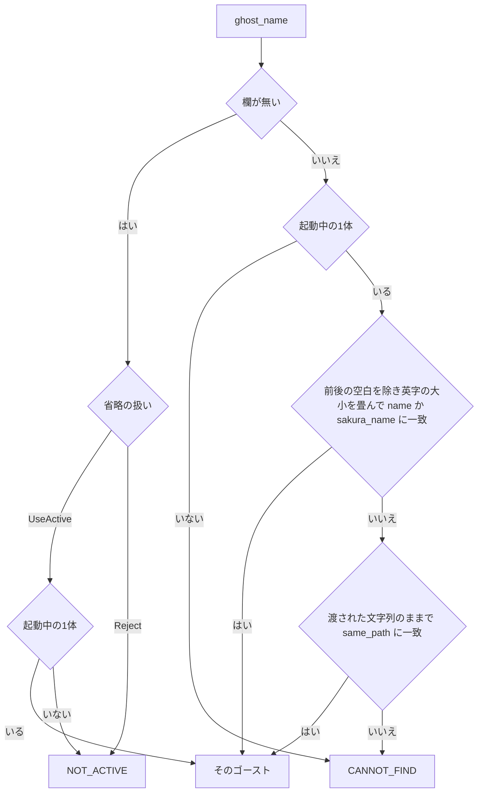

# Design Document: areka-P0-mcp-ghost-name-match

> 2026-10-05・本ブランチ（main `44fc0a61` の上）の実物で書いた。事実の正本は [doc/ssp-mcp/survey.md](../../../doc/ssp-mcp/survey.md) §7.4（SSP 2.9.07 の実測）。コードは「何の定義か」（関数名・型名・テスト名＋ファイルパス）で指し、行番号では指さない。調べた経緯と選ばなかった案は [research.md](research.md) にある。本書だけで決定が読めるように、結論はここに書き直してある。

## Overview

**目的**: MCP のツールに渡す `ghost_name` の照合を、SSP 2.9.07 と同じ答えにする。ずれは 4 点（名前の英字の大小・本体側名〔descript の `sakura.name`〕・名前の前後の空白・空文字）で、どれも `crates/areka/src/mcp/resolve.rs` の関数 `resolve`（純粋な判断）と、起動中のゴーストを World から読む関数 `active` の 2 か所で決まっている。

**使う人**: AI エージェントでゴーストを作る・動かす人。SSP で通っていた呼び方（`えも2debug`・`むらさき`・前後に空白の付いた名前）が areka でもそのまま通り、空文字は SSP と同じく「外れ」になる。

**変わること**: 型 `ActiveGhost` に本体側名の欄が 1 つ増え、`resolve` の比べ方が変わる。振り分け（`crates/areka/src/mcp/mod.rs` の `dispatch`）と各ツールの処理は変えない。解決は `ghost_name` を受ける 9 本すべてが通る 1 か所なので、ここを直せば全ツールの答えがそろう。

### Goals

- survey §7.4 の表の全行で、areka が SSP と同じ答え（見つかる／`NG:Cannot find active ghost from specified name`）を返す。
- 引数の省略（`ghost_name` の欄が無い・`null`）と空文字を分ける。省略の振る舞いは今のまま。
- 今の形を固定していたテストを SSP の実測の期待へ書き換え、新しい規則を決定論テストで固定する。

### Non-Goals

- 起動中の一覧（`get_active_ghost_list`）の値の形（`listed_value` は変えない）。
- フルパスの照合の規則（関数 `same_path`）。今のまま SSP と同じ。
- 2 体以上が起動するときの照合の順。
- プロトコル側（`crates/areka-mcp/`）の引数の扱い。`null` を省略に読む今の形も変えない（実機確認で SSP の答えを記録するだけ）。
- プロパティの名前の英字の大小（`property-name-case-fold` の持ち物）。

## Boundary Commitments

### This Spec Owns

- `ghost_name` の照合の規則（`resolve.rs` の `resolve`）: 名前と本体側名は「前後の空白を除き、半角の英字の大小を同じとみなして」比べる。フルパスは今の `same_path` のまま、渡された文字列をそのまま比べる。空文字・空白だけは何にも当たらない。
- 起動中のゴーストの値（`resolve.rs` の型 `ActiveGhost` と関数 `active`）に本体側名を持たせること。
- 照合の決定論テスト（`resolve_tests.rs`）と、振り分けを通したテストのうち照合に関わるもの（`mcp_tests.rs`）。
- 型 `ActiveGhost` に欄を足したことで落ちる、`crates/areka/src/mcp/` のテストファイルの字面への 1 行の追随。
- `get_log_tests.rs` のうち、英字の大小違いを「外れ」と固定していた期待の書き換えと、空文字の古い注釈の直し。`get_log.rs` の空文字の腕の注釈の直し（答えは変えない）。
- 実機確認の手順と記録（`verification/signoff.md`）。
- 完了のとき、survey §7.4 の末尾の「areka との違い」の段落へ、違いが無くなったことの注記 1 行。

### Out of Boundary

- 振り分け `crates/areka/src/mcp/mod.rs`（`dispatch` のマクロ `resolved!` と、ツールごとの `Omitted` の割り当て）。空文字の文言は `resolve` の中で決まるので触らない。
- 各ツールの処理（`get_status.rs`・`get_property.rs`・`dump_surface.rs` など）。どれも `args.ghost_name` を読まず、受け取った `ActiveGhost` も綴りに関係なく同じ値。
- `get_log.rs` の答え（関数 `answer`）の振る舞い。空文字の腕（`Some("")` で解決を呼ばずに `CANNOT_FIND`）は、直した後は無くても同じ答えになるが、残す（注釈だけ直す）。
- `crates/areka-mcp/`・`crates/areka/src/ghost_session.rs`・`crates/areka-parsers/`。本体側名は既に `GhostSession::names()` が返す構造体 `GhostNames` の `sakura_name` にある。
- 完了した spec `mcp-tool-entrances` の文書（要件 3.2〜3.5・3.9・暫定の裁定 6・7 は本 spec の要件が上書きする。文書は書き換えない）。

### Allowed Dependencies

- 標準ライブラリの `str::trim`（descript の値を読む関数 `parse_kv`〔`crates/areka-parsers/src/kv/parse.rs`〕が使うのと同じ関数）と `str::eq_ignore_ascii_case`。新しい依存は足さない。
- `GhostSession::names()` → `GhostNames.name`・`GhostNames.sakura_name`（読むだけ）。`kero_name`・`sakura_name2` は読まない。
- テストでは、本物の単位を起こすリグ `SwitchRig`（`crates/areka/src/emo2_boot/ghost_switch_test_support.rs`・descript の `name` をフォルダ名に、`sakura.name` を「フォルダ名のさくら」に書き替える）を使う。リグ自体は変えない。

### Revalidation Triggers

- **型 `ActiveGhost` の形が変わった**: 同じウェーブ C4 で同じ字面に触る ⑥ `mcp-get-status`・⑧ `mcp-dump-images-residue`・⑨ `mcp-author-tools` は、先に着地した側に合わせる。本 spec が先に着地したら、後の側は rebase のときに自分の `ActiveGhost` の字面へ `sakura_name: None,` を 1 行足す（足し忘れはコンパイルが落ちるので見落とされない）。本 spec が後なら、本 spec が rebase で向こうの新しい字面へ 1 行足す。
- **起動中のゴーストが 2 体以上になる spec**: 本体側名と別のゴーストの名前が重なったときの順を、その spec が決め直す（本 spec は「どれか 1 つに一致すればそのゴースト」）。
- **SSP の追試で、未実測の細部（全角の英字の大小・全角の空白とタブ・`sakura.name2`）の答えが要件の表と違った**: 要件の「要件の段で決めた細部」1・2・4 と本設計の比べ方を改める。
- **SSP が `ghost_name: null` を空文字と同じ「外れ」に扱うと分かった**: プロトコル側の扱いの食い違いとして `/kiro-discovery` で起票する（本 spec では直さない）。

## Architecture

### Existing Architecture Analysis

- 要求ごとに `mod.rs` の `drain` が `resolve::active(world)` を読み直し、`dispatch` が `resolve::resolve(active, args.ghost_name.as_deref(), 扱い)` の結果をそのまま `NG:` か処理の呼び出しへ渡す。`get_expression_table` だけが `Omitted::Reject`、残る 7 本が `Omitted::UseActive`。`get_log` は振り分けでなく自分の `answer` の中で `Omitted::Reject` で解決し、失敗をすべて `CANNOT_FIND` に読み替え、成功なら `listed_value` で記録を絞る。
- プロトコル側の関数 `optional_string`（`crates/areka-mcp/src/tools/mod.rs`）は、空文字を `Some("")` のまま、`null` と欄なしを `None` にする。省略と空文字の区別は既にここでできている。
- descript の値は読むときに `str::trim` で前後の空白が除かれているので、起動中のゴーストの `name`・`sakura.name` は前後に空白を持たない。

### Decision Flow



- 空文字・空白だけは「欄が無い」の側へ行かない。前後の空白を除くと空になり、名前（空は `None` に落としてある）にもフルパスにも当たらないので、0 体でも 1 体でも `CANNOT_FIND` になる（要件 2.4）。特別な腕は置かない。
- 名前の比べ方と、フルパスの比べ方は別々の値を使う。前後の空白を除いた値は名前とだけ比べ、フルパスは渡された文字列のままで比べる（要件 2.3）。

### Technology Stack

| 層 | 選んだもの | 役目 |
|---|---|---|
| 照合 | Rust 2024・標準ライブラリ `str::trim`・`str::eq_ignore_ascii_case` | 前後の空白の除去（descript の読み取りと同じ文字の範囲）・半角の英字だけの大小の畳み |
| テスト | 既存の `#[test]`・`SwitchRig` | 純粋な判断の固定と、World から本体側名を読めることの固定 |

新しい依存は無い。

## File Structure Plan

### Modified Files（本番）

- `crates/areka/src/mcp/resolve.rs` — 型 `ActiveGhost` に欄 `sakura_name` を足す。関数 `active` が `names()` の `sakura_name` を空を落として取る。関数 `resolve` の比べ方を新しい規則にする。型 `Omitted` と `resolve` の説明の注釈を「無いときの扱い」「本体側名も見る」へ直し、モジュールの見出しの注釈に本 spec を書き足す。
- `crates/areka/src/mcp/get_log.rs` — 関数 `answer` の空文字の腕の注釈だけを直す（「解決は空を省略として扱う」→ 解決へ渡しても同じ `Cannot find` になる旨）。コードは変えない。

### Modified Files（テスト・約束の内）

- `crates/areka/src/mcp/resolve_tests.rs` — 古い期待の 5 本を書き換え、要件 5.1 の全場合を足す（下の「Testing Strategy」）。見本の作り手 `named`・`unnamed` に欄を足し、本体側名だけを持つ見本を足す。
- `crates/areka/src/mcp/mcp_tests.rs` — 見本 `ghost` に欄を 1 行足す。`get_expression_table_omitted_is_not_active_even_with_one_ghost` を省略だけにし、空文字・空白だけの振り分けのテストを足す。本物の単位で本体側名と英字の大小違いが解決することのテストを足す。

### Modified Files（テスト・約束の外＝字面へ 1 行の追随だけ）

`ActiveGhost { … }` の字面へ `sakura_name: None,` を 1 行足す。期待は変えない。

| ファイル | 字面の数 | 同じウェーブで触る spec |
|---|---|---|
| `crates/areka/src/mcp/get_status_tests.rs` | 1 | ⑥ `mcp-get-status` |
| `crates/areka/src/mcp/dump_surface_tests.rs` | 1 | ⑧ `mcp-dump-images-residue` |
| `crates/areka/src/mcp/dump_balloon_tests.rs` | 1 | ⑧ `mcp-dump-images-residue` |
| `crates/areka/src/mcp/get_expression_table_tests.rs` | 1 | なし |
| `crates/areka/src/mcp/get_property_tests.rs` | 1 | なし |
| `crates/areka/src/mcp/get_active_ghost_list_tests.rs` | 2 | なし |
| `crates/areka/src/mcp/get_log_tests.rs` | 2（見本 `emily`・`nameless_ghost_matches_records_named_by_its_full_path`） | なし |
| `crates/areka/src/mcp/sakurascript_tests.rs` | 1 | なし |
| `crates/areka/src/mcp/raise_event_tests.rs` | 1 | なし |
| `crates/areka/src/mcp/reload_tests.rs` | 1 | なし |

10 ファイル・12 か所。約束の内の字面は `resolve.rs` 1・`resolve_tests.rs` 3・`mcp_tests.rs` 1 で、合わせて 17 か所（ギャップ分析の「16」は数え違い）。

加えて `get_log_tests.rs` では次の 2 点を直す（期待の書き換え）。

- `unmatched_empty_and_no_ghost_are_cannot_find` から英字の大小違いの場合 `(Some(&g), "emily/phase4.5")` を外し（場合の数 6 → 5）、「大文字小文字の違い」の注釈と、空文字の注釈「解決へ渡すと 0 体で Specified ghost is not active になる」を新しい事実に合わせて直す。
- 外した場合の新しい期待（名前そのもので指したときと同じ記録 `[10]` が返る）を `ghost_name_keeps_only_records_of_that_name` に 1 行足す。古い期待と新しい期待を両方残さない（要件 5.2）。

### 新しく作るファイル

- `.kiro/specs/areka-P0-mcp-ghost-name-match/verification/signoff.md` — 実機確認の記録（要件 6）。

### 完了のとき

- `doc/ssp-mcp/survey.md` §7.4 の末尾の「areka との違い」の段落へ、本 spec の着地で 4 点の違いが無くなったことの注記 1 行。

## Requirements Traceability

| 要件 | 内容 | 実現するもの |
|---|---|---|
| 1.1 | 名前の英字の大小違いで解決 | `resolve` の名前の比べ方（`eq_ignore_ascii_case`） |
| 1.2 | 本体側名で解決・`name` が無くても本体側名で解決 | `ActiveGhost.sakura_name`・`active` が `GhostNames.sakura_name` を読む・`resolve` が `sakura_name` とも比べる |
| 1.3 | かな・全角と半角・全角の英字の大小の違いは外れ | `eq_ignore_ascii_case` が半角の英字しか畳まないこと |
| 1.4 | `kero.name`・`sakura.name2` は外れ | `active` がこの 2 つを読まないこと |
| 1.5 | `get_log` は綴りによらず同じ記録 | `resolve` が同じ `ActiveGhost` を返し、`get_log` の `answer` がそれを `listed_value` で絞る（`get_log.rs` は変えない） |
| 2.1 | 名前との照合では前後の空白を除く | `resolve` が `str::trim` した値を名前と比べる |
| 2.2 | 途中の空白は除かない | `str::trim` が前後だけを除くこと |
| 2.3 | フルパスとの照合では前後の空白を除かない | `same_path` へは渡された文字列のまま渡す |
| 2.4 | 空文字・空白だけは 9 本とも `Cannot find`（0 体も） | `resolve` の「欄が無い」の腕から `Some("")` を外す。空・空白だけは何にも当たらない |
| 3.1 | 7 本の省略は起動中の 1 体へ・0 体は `NOT_ACTIVE` | `resolve` の `None` の腕（今のまま） |
| 3.2 | `get_expression_table` の省略は `NOT_ACTIVE` | `resolve` の `None` の腕と `Omitted::Reject`（今のまま） |
| 3.3 | `get_log` の省略は絞らない | `get_log.rs` の `answer` の `None` の腕（今のまま・変えない） |
| 4.1 | フルパスの照合は今のまま | `same_path`（変えない） |
| 4.2 | フォルダ名だけ・相対パス・上位のパスは外れ | `same_path`（変えない）・`resolve` が渡された文字列を絶対化しないこと |
| 4.3 | 一覧の値を渡すと同じゴースト | `listed_value`（変えない）。名前は前後に空白を持たないので、前後を除いても同じ値で一致する |
| 4.4 | 綴りで答えの中身を変えない | `resolve` が返すのは起動中のゴーストの値そのもの（綴りを残さない） |
| 5.1 | 判断の全場合の決定論テスト | `resolve_tests.rs` |
| 5.2 | 古い期待の書き換え | `resolve_tests.rs` 5 本・`mcp_tests.rs` 1 本・`get_log_tests.rs` 1 本 |
| 5.3 | 振り分けを通した `get_expression_table` の空・空白・省略 | `mcp_tests.rs` |
| 5.4 | 一覧の値の往復 | `resolve_tests.rs` の `listed_value_resolves_back_to_the_same_ghost`（本体側名だけの見本を足す） |
| 6.1 | 配布形で survey §7.4 の各行を当てる | 実機確認（下の「実機確認の手順」）・`verification/signoff.md` |
| 6.2 | 英字の大小違いの行は半角の英字を含む名前で | 展開先の emo2 の descript の `name` を `えも2DEBUG` に書き替えて起こす |
| 6.3 | SSP が動けば並べ、未実測の細部を記録 | 実機確認の SSP の列 |

## Components and Interfaces

| 部品 | 置き場 | 役目 | 要件 |
|---|---|---|---|
| `ActiveGhost` | `resolve.rs` | 起動中のゴースト 1 体の照合に要る値（名前・本体側名・ルート） | 1.2・1.4・4.3 |
| `active` | `resolve.rs` | World から `ActiveGhost` を組む（本体側名を足す） | 1.2・1.4 |
| `resolve` | `resolve.rs` | `ghost_name` を解く純粋な判断 | 1.1〜1.5・2.1〜2.4・3.1〜3.2・4.1〜4.4 |

### 照合（`crates/areka/src/mcp/resolve.rs`）

#### `ActiveGhost`

```rust
#[derive(Debug, Clone, PartialEq, Eq)]
pub(crate) struct ActiveGhost {
    /// descript の `name`（無い・空なら None）。
    pub name: Option<String>,
    /// descript の `sakura.name`＝本体側名（無い・空なら None）。
    pub sakura_name: Option<String>,
    /// ルートフォルダ（`ghost/<フォルダ名>`）の絶対パス。
    pub root: PathBuf,
}
```

- 不変の約束: `name`・`sakura_name` は `Some` なら空でない。descript の読み取りが前後の空白を除いているので、前後に空白を持たない。
- 欄の並びは `name`・`sakura_name`・`root`。テスト用の作り手は置かない（今の字面はどれも数行で、作り手を挟む理由が無い。欄がまた増える spec が来たときに考える）。

#### `active`

```rust
pub(crate) fn active(world: &World) -> Option<ActiveGhost>;
```

- 事前: なし（`GhostSlot` が無い・置き場が空・実行系が無いなら `None`＝今のまま）。
- 事後: `name` と `sakura_name` を `GhostSession::names()` の `GhostNames` から取り、どちらも空文字は `None` に落とす（研究の 8 節の項目 4 の結論＝`name` と同じ扱い）。`kero_name`・`sakura_name2` は読まない。`root` は今のまま `std::path::absolute` で絶対化。

#### `resolve`

```rust
pub(crate) fn resolve<'a>(
    active: Option<&'a ActiveGhost>,
    ghost_name: Option<&str>,
    omitted: Omitted,
) -> Result<&'a ActiveGhost, &'static str>;
```

- `ghost_name` が `None`: 今のまま。`Omitted::Reject` なら `Err(NOT_ACTIVE)`、`Omitted::UseActive` なら起動中の 1 体（0 体なら `Err(NOT_ACTIVE)`）。
- `ghost_name` が `Some(given)`（空文字・空白だけを含む）: 起動中の 1 体が次のどれかを満たせば `Ok`、それ以外（0 体を含む）は `Err(CANNOT_FIND)`。
  - `given.trim()` が `name` と `eq_ignore_ascii_case` で等しい。
  - `given.trim()` が `sakura_name` と `eq_ignore_ascii_case` で等しい。
  - `same_path(given, &root)`（`given` は除かずにそのまま）。
- 返すのは起動中のゴーストの値への参照そのもの。綴りは返り値に残らない（要件 1.5・4.4）。
- 型 `Omitted` の説明は「`ghost_name` が無いときの扱い」に直す（空は含まない）。定数 `NOT_ACTIVE`・`CANNOT_FIND`・関数 `listed_value`・`same_path` は変えない。

**実装の注意**
- 比べ方は 1 つの小さな閉包で書けば足りる（新しい関数・型・設定は足さない）。判断のコードは 10 行前後。
- 空文字・空白だけのための腕は置かない。置くと「何にも当たらないから外れる」という 1 つの規則が 2 か所に分かれる。

## Error Handling

- 新しい失敗の種類は無い。答えは今ある 2 つの定数（`NOT_ACTIVE`＝`Specified ghost is not active`・`CANNOT_FIND`＝`Cannot find active ghost from specified name`）のどちらかで、`dispatch` が `NG:` を付け `isError: true` で返す（今のまま）。
- 変わるのは振り分けの先だけ: 空文字・空白だけは、9 本すべてで（`get_expression_table` を含み、0 体でも）`CANNOT_FIND`。
- 記録は増やさない。照合の外れは利用者の入力の外れで、今も記録の段を持たない（振り分けの記録の欄 `ghost` は `listed_value` で、綴りに関係なく同じ値）。

## Testing Strategy

### 照合の判断（`resolve_tests.rs`・純粋・要件 5.1・5.2）

見本: `named()`＝名前 `Emily/Phase4.5`・本体側名 `エミリ`・ルート `C:\ssp\ghost\emily4`。`unnamed()`＝名前も本体側名も無し。`sakura_only()`（新しい）＝名前は無く本体側名 `エミリ` だけ。全角の英字・途中の空白を試す場合は、その場合のテストの中で字面を組む。

書き換える 5 本（テスト名ごと分けて、古い期待を残さない）:

| 今のテスト | 新しいテスト | 期待 |
|---|---|---|
| `name_differing_only_in_case_does_not_resolve` | `name_differing_only_in_ascii_case_resolves` | `emily/phase4.5`・`EMILY/PHASE4.5` → 解決 |
| `sakura_name_does_not_resolve` | `sakura_name_resolves` | `エミリ` → 解決。`sakura_only()` にも `エミリ` → 解決（1.2） |
| `empty_or_omitted_with_use_active_resolves_to_the_active_one` | `omitted_with_use_active_resolves_to_the_active_one` | `None` → 解決（空文字の側は下の空のテストへ） |
| `empty_or_omitted_with_reject_is_not_active` | `omitted_with_reject_is_not_active` | `None`＋`Reject` → `NOT_ACTIVE` |
| `no_active_ghost_omitted_is_not_active` | （名前は保つ・中身だけ） | 0 体で `None` → 両方の扱いで `NOT_ACTIVE`（空文字の側を外す） |

足すテスト:

| テスト | 入力 | 期待 | 要件 |
|---|---|---|---|
| `other_names_do_not_resolve` | 相方の名前に当たる `エモ`・`sakura.name2` に当たる別の綴り | `CANNOT_FIND` | 1.4 |
| `kana_width_and_fullwidth_case_differences_do_not_resolve` | 名前 `えもＡＢＣ` の見本へ `エモＡＢＣ`（かな）・`えもａｂｃ`（全角の英字の大小）・`えもABC`（全角と半角） | `CANNOT_FIND` | 1.3 |
| `name_with_surrounding_whitespace_resolves` | `named()` へ前後に半角の空白・タブ・全角の空白を付けた名前と本体側名 | 解決 | 2.1 |
| `inner_whitespace_difference_does_not_resolve` | 名前 `Emily Phase` の見本へ `Emily  Phase`・`Emily　Phase`・`EmilyPhase` | `CANNOT_FIND` | 2.2 |
| `blank_or_empty_cannot_find` | `""`・`"   "`・`"\t"`・`"\u{3000}"` を、1 体と 0 体・`UseActive` と `Reject` の全組で | `CANNOT_FIND` | 2.4 |
| `full_path_with_surrounding_whitespace_does_not_resolve` | ルートの前後に空白（末尾の区切りあり・`/` 区切りも） | `CANNOT_FIND` | 2.3 |
| `every_spelling_resolves_to_the_same_ghost` | 名前・大小違い・前後の空白・本体側名・フルパスの各綴り | どれも同じ `&ActiveGhost` が返り、`listed_value` が `Emily/Phase4.5` | 1.5・4.4 |

残すテスト（字面へ 1 行足すだけ）: フルパスの 4 本（`/` 区切りで末尾の区切りの無い形は `full_path_with_case_separator_and_trailing_differences_resolves` が既に持つ）・`folder_name_only_does_not_resolve`・`relative_path_does_not_resolve`・`no_active_ghost_with_name_cannot_find`・`reject_with_name_still_resolves`・一覧の値の 3 本（往復のテストの見本に `sakura_only()` を足す＝5.4・4.3）・World からの読み取りの 3 本。

### 振り分けを通す（`mcp_tests.rs`・要件 2.4・3.2・5.3）

- `get_expression_table_omitted_is_not_active_even_with_one_ghost`: 省略（`None`）だけを残す → `NG:Specified ghost is not active`。
- 新しい `eight_with_empty_or_blank_cannot_find`: 解決を通る 8 本（関数 `eight`）に `""` と `"   "` を渡し、1 体のときも 0 体のときも `NG:Cannot find active ghost from specified name`。`get_expression_table` を含むので 5.3 を兼ねる。`get_log` の空文字は `get_log_tests.rs` の既存の場合が固定している。
- 既存の `eight_with_no_active_ghost_are_not_active`・`eight_with_a_wrong_name_cannot_find`・`get_log_and_seven_omitted_do_not_answer_with_a_resolve_failure` は変えない（省略と外れの名前の振る舞いが変わらないことの檻）。

### 本物の単位で通す（`mcp_tests.rs`・要件 1.2・1.4）

- 新しい `real_unit_resolves_by_sakura_name_and_ascii_case`: `SwitchRig` で `A` を起こし、`resolve::active(&rig.world)` の `sakura_name` が `Some("Aのさくら")` であること、`Aのさくら` と `a`（名前 `A` の大小違い）で解決すること、`GhostSession::names()` の `kero_name` の値（検体に在ることを先に確かめ、無ければ赤）で `CANNOT_FIND` になることを 1 本で判定する。`active` が本体側名を読む配線は純粋なテストでは見えないので、ここが唯一の檻になる。

### `get_log`（`get_log_tests.rs`・要件 1.5・5.2）

- 上の「Modified Files」のとおり、英字の大小違いの場合を「外れ」から「名前と同じ記録 `[10]`」へ移す。本体側名で指したときの記録の同一性は、`every_spelling_resolves_to_the_same_ghost`（同じ値が返り `listed_value` が同じ）と、`get_log` が `listed_value` で絞る既存の配線で足りる（配線の再テストはしない）。

### 実機確認の手順（要件 6）

- **置き場**: 配布形の zip（`tools/package.ps1`）を `target\signoff-ghost-name\x\` へ展開し、記録は `target\signoff-ghost-name\logs\` に置く（ワークツリーの `target\` の下・絶対パス）。結果は `verification/signoff.md` に `mcp-get-property` の `verification/signoff.md` と同じ形（版・起動のしかた・環境変数・判定の表・答えの写し・記録の行・終わり方）で書く。
- **ゴースト**: 配布形の emo2 は名前 `えも？？` に半角の英字を含まないので、展開先の `ghost\emo2\ghost\master\descript.txt` の `name` の行だけを survey と同じ `えも2DEBUG` に書き替えてから起こす（要件 6.2）。書き替えは Edit で行う（日本語を壊す置換の道具を使わない）。`sakura.name`・`kero.name` は展開先の descript から読んで記録に写す。
- **当てる指定**: survey §7.4 の表の各行と同じ形（名前・英字の大小違い・本体側名・相方の名前・かなの違い・前後に空白の付いた名前・空白だけ・空文字・フォルダ名だけ・`/` 区切りで末尾の区切りの無いフルパス・前後に空白のあるフルパス）を、`get_status`・`get_expression_table`・`get_log` の 3 本へ curl の `tools/call`（無状態版の形・本文は UTF-8 のファイルから `--data-binary`）で当てる。ついでに一覧の値 `get_active_ghost_list` の往復と、記録だけのために `ghost_name: null` の 1 行を当てる。
- **判定**: 「見つかる」＝答えが `NG:Cannot find active ghost from specified name` でも `NG:Specified ghost is not active` でもないこと（`get_status` がまだ `NG:not implemented yet` を返す版でも、解決を通った後の答えなので「見つかる」に数える）。外れの行は本文が `NG:Cannot find active ghost from specified name`・`isError: true`。
- **SSP の列（要件 6.3）**: 同じ机で SSP が動けば、同じ指定と未実測の細部（全角の英字の大小・全角の空白とタブで挟んだ名前・`sakura.name2`・`null`）を SSP にも当てて並べる。着地の条件にはしない（研究の 8.1 の振り分け）。答えが要件の表と違えば要件を改め、`null` が食い違えば `/kiro-discovery` で起票する。SSP が動かなければ、動かなかったことを記録に書く。
