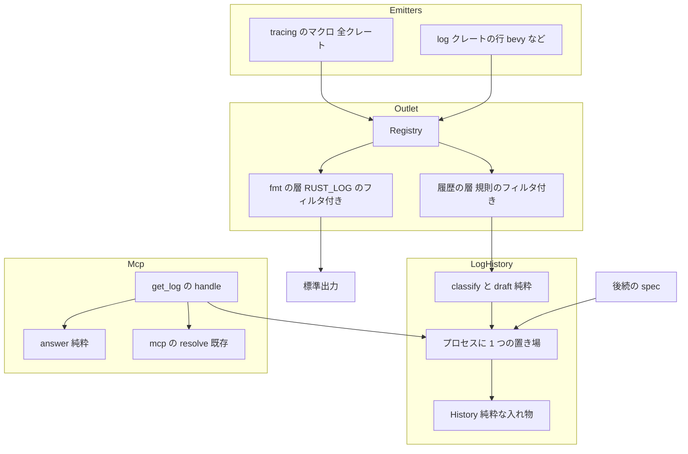
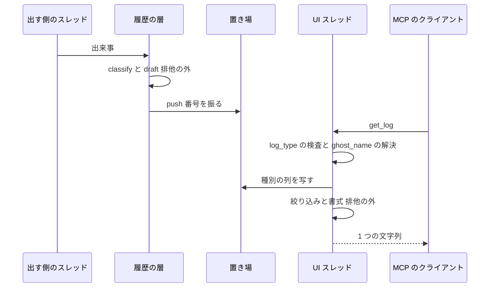

# Design Document: areka-P0-mcp-log-history

> 実測は **2026-10-04・本ブランチ**（`claude/areka-p0-mcp-log-history-f3750e`）のもの。コードは「何の定義か」（関数名・型名・定数名＋ファイルパス）で指し、行番号では指さない。
> 設計の段で確かめた実物の証跡（`tracing-subscriber 0.3.23` のソースと、使い捨ての実験の結果）は [research.md](research.md) §9 にある。本書は結論だけを書く。

## Overview

**Purpose**: areka のログの出来事のうち 5 種別（error・script・network・update・status）に当たるものを、通し番号付きでアプリの中に残し、MCP の `get_log` で SSP と同じ書式・同じ絞り込みで読めるようにする。

**Users**: AI エージェントでゴーストを作る人が、台本やイベントを送った後に「エラーが出たか」「何が起きたか」を、動いている areka に問い合わせて確かめる。後続の spec（`mcp-kanade-tools`・`mcp-strict-errors`）の実装者は、取り決めの target でログを出すだけで履歴に残せる。

**Impact**: ログの出口を「標準出力 1 本」から「標準出力＋履歴の 2 本」へ組み替える（標準出力の出力は 1 字も変えない）。`get_log` のダミー（`NG:not implemented yet`）を本物の答えへ置き換える。

### Goals

- 履歴（通し番号・時刻・種別ごとに 1,000 件・本文 4,096 文字）と、種別への振り分けの規則を 1 つの表で持つ。
- `get_log` が SSP 2.9.07 と同じ書式・同じ端の値（要件ディスカッションで確定した 5 件）で答える。
- 出す側の行は 0 行、`crates/areka/src/mcp/mod.rs`・`crates/areka-mcp/src/**`・`Cargo.toml` は 0 行変える。
- 規則の表・取り決めの文書・名指ししたモジュールの実在が、テストで互いに縛られる。

### Non-Goals

- script 種別の行を出すこと（`mcp-kanade-tools`）、strict の誤りを見つけて記録すること・`sakurascript` の返事の `since_id`（`mcp-strict-errors`）。
- 既存の出す側の行の変更（target・欄・文言・レベルのどれも 0 行）。
- 標準出力の書式と `RUST_LOG` の意味の変更、ログのファイル保存、再起動をまたぐ履歴、ログ窓。
- SSP の「誤りが出たら status に案内を 1 件足す」振る舞い（ログ窓への案内であり、写さない）。

## Boundary Commitments

### This Spec Owns

- 履歴の部品 `crates/areka/src/log_history.rs`（新規）: 種別 `Kind`・規則の表 `RULES`・振り分け `classify`・記録の下書き `draft`・入れ物 `History`・プロセスに 1 つの置き場・tracing の層・ログの出口の据え付け `init`・現地時刻 `local_now`・「最後に振った通し番号」の口 `last_id`。
- `get_log` の中身 `crates/areka/src/mcp/get_log.rs`（`log_type` の検査・`ghost_name` の解決・絞り込み・書式）と、そのテスト `get_log_tests.rs`。
- 取り決めの文書 `doc/ssp-mcp/log-convention.md`（新規）と、文書と規則の表の一致のテスト。
- 取り決めの target の名前（`areka::log::script`・`areka::log::error`）と取り決めの欄（`ghost`・`label`）の意味。
- `crates/areka/src/main.rs` の、tracing の初期化の 1 か所と `mod log_history;` の宣言。
- `.kiro/steering/logging.md` の「Subscriber 初期化」の例（組み替えた後の実物に合わせる）。
- 実プロセスの試験 `crates/areka/tests/mcp_get_log_real_run.rs`（新規）。

### Out of Boundary

- 出す側のファイル: `crates/areka-update/`・`crates/areka/src/update/`・`crates/areka/src/install/`・`boot_config.rs`・`boot_resolve.rs`・`ghost_session.rs`・`emo2_boot/`・`crates/areka-ghost/`（0 行）。
- `crates/areka/src/mcp/mod.rs`・`crates/areka/src/mcp/resolve.rs`・`crates/areka-mcp/src/**`（0 行）。`handler.rs` の `INSTRUCTIONS` に残る「not implemented yet」の 1 文は `mcp-strict-errors` が消す（roadmap の約束）。
- `Cargo.toml`（根・各クレートとも 0 行。依存の追加 0 件）。
- `crates/log-capture-kit/tests/with_default_guard_test.rs` の例外表（0 行。件数も 4 のまま）。
- 既存の決定論テスト（`get_log_tests.rs` を除いて 0 行）。`crates/areka/tests/smoke_boot_loop_exit.rs` も触らない。

### Allowed Dependencies

- `tracing`・`tracing-subscriber`（ワークスペースの既定機能＋`env-filter`。`registry`・層ごとのフィルタ・`layer::Filter` は既定機能に含まれる）。
- `windows` の `Win32::System::SystemInformation::GetLocalTime`（根の `Cargo.toml` の `[workspace.dependencies.windows]` に `Win32_System_SystemInformation` が宣言済み）。
- `crate::mcp::resolve` の `active`・`resolve`・`listed_value`・`CANNOT_FIND`・`Omitted`（`get_log.rs` は `mcp` の子モジュールなので `super::resolve` で届く。どれも `pub(crate)`）。
- `areka_mcp::tools::{get_log::Args, ReplyTo, outcome}`。
- テストだけ: `log-capture-kit`（`capture`・`CapturedEvent`）・`temp-path-kit`・`sample-ghost-kit`（どれも既に `crates/areka` の `[dev-dependencies]` にある）。
- **依存の向き**: `main.rs` → `log_history`、`mcp::get_log` → `log_history`。`log_history` は `mcp`・World・ゴーストを知らない（逆向きの参照は 0 件）。

### Revalidation Triggers

- 取り決めの target の名前・取り決めの欄の名前や意味を変える → `mcp-kanade-tools`・`mcp-strict-errors` と取り決めの文書を見直す。
- `RULES` の行を足す・消す → 取り決めの文書（テストが赤にする）。
- `last_id` の意味（全種別で 1 本の「最後に振った番号」）を変える → `mcp-strict-errors`。
- ログの出口の組み方（層の順・フィルタの掛け方）を変える → 標準出力の同一性（[research.md](research.md) §9.1 の実験をやり直す）と `.kiro/steering/logging.md`。
- 履歴の層のフィルタは、出来事でない問い合わせ（`tracing::enabled!`・スパン）を断ってはならない（断ると、診断の target を点けたときに履歴が記録を取りこぼす）。`tracing-subscriber` の版を上げる・フィルタの答えを変えるときは [design-validation.md](design-validation.md) 指摘 1 の実験をやり直す。
- 名指ししたモジュール（`RULES` の target）の改名・移動 → 実在のテストが赤になるので、持ち主の spec が `RULES` と文書を直す。
- `tracing::event_enabled!`・`log::log_enabled!` を使い始める → これらは出来事の問い合わせとして届き、後に出来事が続かないので、フィルタが断った印が残って同じスレッドの次の出来事（関心が always の呼び出し口）を 1 件取りこぼしうる（完了時点でワークスペースと依存の利用は 0 件）。使う spec が [design-validation.md](design-validation.md) 指摘 1 の実験にこの 2 つを足してやり直す。

## Architecture

### Existing Architecture Analysis

- **ログの出口**は `crates/areka/src/main.rs` の `fn main()` の先頭の `tracing_subscriber::fmt().with_env_filter(…).init()` の 1 か所。フィルタは出口全体に掛かる。`tracing_subscriber::fmt()` の実体は「`EnvFilter` の下に `fmt::Layer`、その下に `Registry`」の重ねで、`init()` は `log` クレートの受け口（`tracing-log` の `LogTracer`）も据える（`tracing-subscriber 0.3.23` の `SubscriberInitExt::try_init`）。
- **`get_log` の入口**は完成している。`crates/areka/src/mcp/mod.rs` の `dispatch` は `ToolCall::GetLog(args) => get_log::handle(world, args, reply)` で、`ghost_name` を解決せずに渡す。
- **見張り**: `crates/log-capture-kit/tests/with_default_guard_test.rs` は、捕捉先を直接差す 3 語の新設をワークスペース全体で赤にする。`init()` の字面は当たらない。自前の層を載せた受け口をテストで差すことはできない。
- **`main.rs` は 957 行**（上限 1,000）。

### Architecture Pattern & Boundary Map



**Architecture Integration**:

- **選んだ形**: 「純粋な判断（振り分け・下書き・入れ物・絞り込み・書式）」＋「薄い継ぎ目（tracing の層・プロセスに 1 つの置き場・World から起動中のゴーストを読む 1 行）」。判断はすべて tracing の受け口にも World にも触れない関数で、決定論テストはそこへ値を直に渡す。
- **境界の分け方**: 履歴（`log_history`）は MCP を知らない独立した部品。`get_log.rs` は履歴を読んで SSP の書式へ直すだけ。後続の spec は `log_history::last_id()` と取り決めの target だけを使う。
- **保つ既存の型**: ツールごとのファイル（`mcp/<ツール>.rs`）・兄弟のテストファイル・`outcome` の 3 つの形・`resolve` の解決。
- **新しい部品の理由**: 履歴は今のコードに無い。層は「すべての出来事を履歴へ届ける場所」が出口の 1 か所しか無いので要る（要件 8.1）。
- **steering との整合**: `structure.md` の「1 ファイル 1,000 行」「テストは兄弟ファイル」、`logging.md` の「テストでログを捕まえるときは `log-capture-kit`」、`tech.md` の依存の登記（追加 0 件）。

### 設計判断（設計へ持ち越された 8 点）

| # | 点 | 決定 | 根拠（証跡は research.md） |
|---|---|---|---|
| a | 取り決めの target を debug・trace でも拾うか | **拾わない。取り決めの行は info 以上で出す約束**（設計ディスカッション議題 1 で確定・要件 2.1・2.2 を改めた）。履歴の層のフィルタは最大レベルの見立てを `INFO` と答える（今の既定の出口と同じ） | 拾う形だと、debug で出した行が本物の出口を通って届くことを本 spec のテストで固定できず、後続の spec へ宿題が残る。info 以上なら実プロセスの試験が踏む道と同じ道を通る。参考（拾う形の費用の実測）: 関心のない `debug!`／`trace!` 1 回は 0.7 ns → 1.5〜2.4 ns、`log` クレートの `debug!` は 0.7 ns → 約 120〜140 ns。`Cargo.lock` で `log` に依存するのは `bevy_app`・`bevy_ecs`・`iana-time-zone`・`wgpu-types`・`tracing-log` の 5 つで、areka の依存の木（`cargo tree -p areka -i log`）で `log` の行を出すのは `bevy_ecs`・`bevy_app`。毎フレーム通る `debug!`／`trace!` は 0 件（§9.2） |
| b | 層の継ぎ目のテストの置き場 | **純粋な関数へ `log-capture-kit` の `CapturedEvent` を食わせるテスト＋実プロセス・実ソケットの試験 1 本**。見張りの例外表は触らない | 例外表へ足すのは要件 8.5 に反する。実プロセスの試験は要件 4.7 の「実ソケットで 1 本」と兼ねる |
| c | 履歴の置き場 | **純粋な入れ物の型 `History`＋プロセスに 1 つの静的な置き場**（`static` の `Mutex<History>`） | `handle` の引数も `mcp/mod.rs` も変えずに読める。World の無いスレッドからも `last_id` を読める |
| d | ファイルの置き方 | **`crates/areka/src/log_history.rs` の 1 ファイル**（見込み 450 行前後）＋兄弟のテスト 2 本。900 行を超えたらファサード形式で `log_history/` へ分ける | 部品が小さく、分けると `mod` の配線の方が多くなる。`structure.md` の分割の目安は 1,000 行 |
| e | 現地時刻の口 | **`GetLocalTime`**（宣言済みの `windows` の機能）。入れ物の `push` が時刻を引数で受けるので、テストは値を渡すだけ（差し替え用の型は作らない） | 標準ライブラリに現地時刻は無い。`chrono` は `areka` の直接の依存ではない |
| f | `log` クレートから橋渡しされた行 | **名前が `log.` で始まる欄を本文から除く**。warn 以上は error 種別に残る。info 以下は残らない。`tracing-log` は依存に足さない | 実測で、橋渡しされた行は target が `log`、欄に `log.target`・`log.module_path`・`log.file`・`log.line` が並ぶ。標準出力の側（`fmt`）もこの 4 欄を出さない（§9.3） |
| g | 要件 2.12・7.3 の判定 | **2.12**: `RULES` の target からソースの場所を導き、ファイルの実在（明示の target は、その文字列がファイルにあること）をテストで判定。**7.3**: 文書の規則の表（目印の間）を読み、`RULES`・取り決めの target と集合として一致することをテストで判定 | 出す側を触らずに判定できる。文書か表の片方だけを変えると赤になる |
| h | 組み替え後の標準出力の同一性 | **`registry().with(fmt::layer().with_filter(EnvFilter)).with(履歴の層).init()`** は、今の `fmt().with_env_filter(…).init()` と同じ行を同じ書式で出す | 実験で、`RUST_LOG` が未設定・`warn`・モジュール指定の 3 通りとも、時刻を除いて 1 字も違わなかった（§9.1）。両者は同じ `fmt::Layer` の既定値を使う |

### Technology Stack

| Layer | Choice / Version | Role in Feature | Notes |
|-------|------------------|-----------------|-------|
| ログの出口 | `tracing-subscriber 0.3.23`（`registry`・`fmt`・`env-filter`・`layer::Filter`） | 標準出力の層と履歴の層を重ねる | 追加の機能・依存は 0 件 |
| 履歴 | 標準ライブラリ（`VecDeque`・`Mutex`） | 種別ごとの列・全体で 1 本の番号 | 置き場は `static`（`Mutex::new`・`VecDeque::new` はどちらも `const`） |
| 時刻 | `windows 0.62`（`GetLocalTime`） | 記録した時点の現地時刻 | 機能は宣言済み。`unsafe` は `local_now` の 1 か所 |
| MCP | `areka-mcp`（既存） | `Args`・`ReplyTo`・`outcome` | 0 行変える |

## File Structure Plan

### Directory Structure

```
crates/areka/src/
├── log_history.rs                    # 新規。履歴の部品の全部（下の「Components」の 5 つ）
├── log_history_tests.rs              # 新規。振り分け・下書き・入れ物の決定論テスト
├── log_history_convention_tests.rs   # 新規。本物のマクロの形・実在・文書との一致・置き場・並行
├── main.rs                           # 変更。mod の宣言 1 行と初期化の 1 か所
└── mcp/
    ├── get_log.rs                    # 変更。ダミーを本物へ（handle・answer・render）
    └── get_log_tests.rs              # 変更。NG:not implemented yet の期待を本物の答えへ
crates/areka/tests/
└── mcp_get_log_real_run.rs           # 新規。実プロセス・実ソケットの試験 1 本
doc/ssp-mcp/
└── log-convention.md                 # 新規。取り決めの文書
.kiro/steering/
└── logging.md                        # 変更。「Subscriber 初期化」の例
```

- テストの接続は `structure.md` の規約どおり、本番ファイルの末尾に `#[cfg(test)] #[path = "log_history_tests.rs"] mod tests;` と `#[cfg(test)] #[path = "log_history_convention_tests.rs"] mod convention_tests;` を置く。
- 新規ファイルはどれも 1,000 行を超えない（`log_history.rs` は 450 行前後、テストは各 400 行前後の見込み）。

### Modified Files

- `crates/areka/src/main.rs` — `mod log_history;` を 1 行足す。`fn main()` の先頭の `tracing_subscriber::fmt()…init()`（5 行）を `log_history::init();` の 1 行へ置き換え、不要になった `use tracing_subscriber::EnvFilter;` を消す。上のコメント（`RUST_LOG` の扱いの説明）は残す。**行数は 957 から減る**（増えない）。
- `crates/areka/src/mcp/get_log.rs` — `handle` の中身、純粋な `answer`・`render` を書く。
- `crates/areka/src/mcp/get_log_tests.rs` — 全面的に書き換える（`answers_not_implemented_yet_with_an_empty_world` を消し、本物の答えのテストへ）。
- `.kiro/steering/logging.md` — 「Subscriber 初期化」の例を、`registry()` に `fmt::layer().with_filter(EnvFilter…)` を重ねる形へ直し、areka は `log_history::init()` がこれに履歴の層を足すと 1 行書く。

## System Flows



- 層は出来事を出したスレッドの上で同期に動く。マクロが戻った時点で記録は置き場にある（要件 6.3）。
- 排他を握るのは `push` と「列を写す」の間だけ。排他の中で tracing のマクロを呼ばない（自分へ戻って固まるため）。本文の組み立て・時刻の読み取り・書式は排他の外で行う。
- `get_log` は World を「起動中のゴーストを読む」ためだけに使う（`ghost_name` があるときだけ）。ゴーストには何もさせない。

## Requirements Traceability

| Requirement | Summary | Components | Interfaces | Flows |
|---|---|---|---|---|
| 1.1 | 当たる出来事を 1 件の記録として残す | 層・`draft`・`History` | `on_event` → `draft` → `push` | 上の図 |
| 1.2 | 起動ごとに 1 から・全種別で 1 本 | `History` | `push` が `last_id + 1` を振る | — |
| 1.3 | 捨てた番号を使い回さない | `History` | `last_id` は減らない | — |
| 1.4 | 種別ごとに 1,000 件・古いものから | `History` | `PER_KIND_CAP`・種別ごとの `VecDeque` | — |
| 1.5 | 本文 4,096 文字で切る | `draft` | `BODY_CAP_CHARS`・`TRUNCATED_SUFFIX` | — |
| 1.6 | 当たらない出来事は残さず番号も進めない | `classify`・層 | `draft` が `None` なら `push` しない | — |
| 1.7 | `RUST_LOG` と独立 | 出口の据え付け | `EnvFilter` は `fmt` の層だけに掛ける | — |
| 1.8 | 標準出力は同じ | 出口の据え付け | 設計判断 h | — |
| 1.9 | 並行でも取りこぼし 0・重複 0 | 置き場 | `Mutex<History>` | — |
| 1.10 | 記録の失敗でパニックしない | 置き場 | 毒された排他は中身を取り出して続ける | — |
| 1.11 | 1.2〜1.6・1.9 のテスト | `log_history_tests.rs`・`log_history_convention_tests.rs` | Testing Strategy | — |
| 2.1 | warn 以上、または info 以上の `areka::log::error` は error | `classify` | 判定の順 3・4 | — |
| 2.2 | info 以上の `areka::log::script` は script（2.1 より先） | `classify` | 判定の順 2 | — |
| 2.3 | network の target | `RULES` | 先頭の 3 行 | — |
| 2.4 | update の target | `RULES` | 次の 3 行 | — |
| 2.5 | status の target | `RULES` | 残りの 7 行 | — |
| 2.6 | `<名>`（取り決めの行の `ghost`・無ければ既定） | `draft` | `Kind::default_name` | — |
| 2.7 | `[<種別>]` の語（取り決めの行の `label`・無ければ既定） | `draft` | `Kind::default_label` | — |
| 2.8 | どれにも当たらない出来事は残さない | `classify` | 判定の順 1・5 | — |
| 2.9 | 照合は自身か `::` の下・`areka` だけ完全一致 | `RULES` | `Rule::exact` と `Rule::matches` | — |
| 2.10 | 外のライブラリの warn 以上も error | 層・`draft` | 設計判断 f。届かないものは文書に書く | — |
| 2.11 | 2.1〜2.9 のテスト | `log_history_tests.rs` | Testing Strategy | — |
| 2.12 | 名指しのモジュールの実在を判定 | `log_history_convention_tests.rs` | 設計判断 g | — |
| 3.1 | `log_type` の省略は error | `answer` | `None` → `Kind::Error` | — |
| 3.2 | 5 語と大文字小文字を除いて一致 | `Kind::from_log_type` | `eq_ignore_ascii_case`・空白は削らない | — |
| 3.3 | それ以外は `NG:Unknown log_type …` | `answer` | `UNKNOWN_LOG_TYPE` | — |
| 3.4 | `ghost_name` が無ければ 0 体でも答える | `handle` | `ghost_name` が `None` なら World を読まない | — |
| 3.5 | ゴーストに何もさせない | `handle` | World は `resolve::active` の読み取りだけ | — |
| 3.6 | 3.1〜3.3 のテスト | `get_log_tests.rs` | Testing Strategy | — |
| 4.1 | 古い順・`\r\n` 区切り・`OK:` なし | `render`・`answer` | `outcome::value` | — |
| 4.2 | 1 行の形 | `render` | `#<id> <yyyy/mm/dd hh:mm> [<語>] <名> : <本文>` | — |
| 4.3 | 本文＝メッセージ＋残りの欄 | `draft` | 欄は書かれた順・` 名前=値` | — |
| 4.4 | 改行は `\r\n`＋タブへ | `render` | 書式の時に置き換える | — |
| 4.5 | 0 件は `(no log entries)` | `answer` | `NO_ENTRIES` | — |
| 4.6 | 本文の字を変えない | `render`・rmcp | 文字列をそのまま `outcome::value` へ | — |
| 4.7 | 4.1〜4.6 のテスト＋実ソケット 1 本 | `get_log_tests.rs`・`mcp_get_log_real_run.rs` | Testing Strategy | — |
| 5.1 | `ghost_name` が無ければ絞らない | `answer` | `NameFilter::Any` | — |
| 5.2 | 当たればそのゴーストの名前と一致する記録だけ | `handle`・`answer` | `resolve::resolve` → `listed_value` | — |
| 5.3 | 当たらない・空は `NG:Cannot find …` | `handle` | 空は解決を呼ばずに `CANNOT_FIND` | — |
| 5.4 | 当たるが記録なしは 0 件 | `answer` | 4.5 と同じ道 | — |
| 5.5 | `since_id` より大きい番号だけ | `answer` | 無い・負は絞らない | — |
| 5.6 | `max_count` は新しい方から N 件を古い順で | `answer` | 末尾の N 件 | — |
| 5.7 | `max_count` の無い・負は絞らない、0 は 0 件 | `answer` | — | — |
| 5.8 | `since_id` が最後の番号以上なら 0 件 | `answer` | 5.5 から自然に出る | — |
| 5.9 | 種別 → `ghost_name` → `since_id` → `max_count` | `answer` | この順で書く | — |
| 5.10 | 5.1〜5.9 のテスト | `get_log_tests.rs` | Testing Strategy | — |
| 6.1 | 取り決めの target で出せば残る | 層・`classify` | 出す側は本 spec の型を使わない | — |
| 6.2 | 「最後に振った番号」の口 | 置き場 | `log_history::last_id()` | — |
| 6.3 | 出した直後の問い合わせで取りこぼさない | 層 | 出したスレッドの上で同期に `push` | 上の図 |
| 6.4 | 6.1〜6.3 のテスト | `log_history_convention_tests.rs` | Testing Strategy | — |
| 7.1 | 取り決めの文書 | `doc/ssp-mcp/log-convention.md` | 「取り決めの文書」節 | — |
| 7.2 | 書き方の例 2 つ | 同上 | script と error を 1 つずつ | — |
| 7.3 | 文書と実装の一致をテストで判定 | `log_history_convention_tests.rs` | 設計判断 g | — |
| 7.4 | `logging.md` の例を実物に合わせる | `.kiro/steering/logging.md` | Modified Files | — |
| 8.1 | `main.rs` は出口と `mod` だけ | `main.rs` | Modified Files（行数は減る） | — |
| 8.2 | 出す側は 0 行 | — | Out of Boundary | — |
| 8.3 | `mcp/mod.rs`・`areka-mcp` は 0 行 | — | Out of Boundary | — |
| 8.4 | 既存のテストは `get_log_tests.rs` 以外そのまま緑 | — | `mcp_tests.rs` の `get_log_and_seven_omitted_do_not_answer_with_a_resolve_failure` は `ghost_name: None` で呼ぶので緑のまま | — |
| 8.5 | 捕捉先を直接差す呼び出しを新設しない | テスト全部 | 設計判断 b | — |

## Components and Interfaces

| Component | Domain/Layer | Intent | Req Coverage | Key Dependencies | Contracts |
|---|---|---|---|---|---|
| 振り分け（`Kind`・`RULES`・`classify`） | `log_history`・純粋 | レベルと target から種別を決める | 2.1〜2.5・2.8・2.9・3.2 | `tracing::Level`（P2） | Service |
| 下書き（`draft`） | `log_history`・純粋 | 欄の並びから `<名>`・語・本文を作る | 1.5・2.6・2.7・2.10・4.3 | 振り分け（P0） | Service |
| 入れ物（`History`） | `log_history`・純粋 | 番号を振って種別ごとの列に積む | 1.2〜1.4 | — | State |
| 置き場と層（`init`・`last_id`・`snapshot`・`local_now`・`HistoryFilter`） | `log_history`・継ぎ目 | 出口を据え、出来事を置き場へ届け、読む口を出す | 1.1・1.6〜1.10・6.1〜6.3・8.1 | `tracing-subscriber`（P0）・`GetLocalTime`（P1） | Service・State |
| `get_log`（`handle`・`answer`・`render`） | `mcp`・ツールのファイル | 検査・解決・絞り込み・書式 | 3.1〜3.5・4.1〜4.6・5.1〜5.9 | `log_history`（P0）・`mcp::resolve`（P0） | Service |
| 取り決めの文書 | `doc/` | 出す側の約束を 1 つの文書に | 7.1〜7.3 | `RULES`（テストで縛る） | — |

### log_history（純粋な部分）

#### 振り分け

| Field | Detail |
|---|---|
| Intent | 出来事のレベルと target から、5 種別のどれか、または「残さない」を決める |
| Requirements | 2.1, 2.2, 2.3, 2.4, 2.5, 2.8, 2.9, 3.2 |

**Responsibilities & Constraints**

- 規則は `RULES` の 1 表だけに書く。`classify`・実在のテスト・文書との一致のテストが同じ表を読む。
- 1 件の出来事は 1 つの種別にだけ入る。

##### Service Interface

```rust
/// 種別（SSP の 5 語）。
#[derive(Debug, Clone, Copy, PartialEq, Eq)]
pub(crate) enum Kind { Error, Script, Network, Update, Status }

impl Kind {
    /// `log_type` の語（小文字）。
    pub(crate) fn word(self) -> &'static str;
    /// 5 語と大文字小文字の違いを除いて一致すれば Some（前後の空白は削らない・空は None）。
    pub(crate) fn from_log_type(word: &str) -> Option<Kind>;
    /// `[<種別>]` の既定の語（Error / SSTP / Info / Info / STAT）。
    pub(crate) fn default_label(self) -> &'static str;
    /// `<名>` の既定（status は STAT、ほかは [SYSTEM]）。
    pub(crate) fn default_name(self) -> &'static str;
}

pub(crate) const TARGET_SCRIPT: &str = "areka::log::script";
pub(crate) const TARGET_ERROR: &str = "areka::log::error";

/// info の行を種別へ振る規則 1 行。
pub(crate) struct Rule {
    pub target: &'static str,
    pub kind: Kind,
    /// true は完全一致だけ。false は自身か `::` で区切った下のモジュール。
    pub exact: bool,
}

/// 上から順に当て、最初に当たった行の種別になる。
pub(crate) const RULES: &[Rule];

pub(crate) fn classify(level: tracing::Level, target: &str) -> Option<Kind>;
```

`RULES` の中身（この順・13 行）:

| # | target | 種別 | 照合 |
|---|---|---|---|
| 1 | `areka::install::fetch_url` | network | 自身か下 |
| 2 | `areka_update::winhttp` | network | 自身か下 |
| 3 | `areka_update::fetch` | network | 自身か下 |
| 4 | `areka_update` | update | 自身か下 |
| 5 | `areka::update` | update | 自身か下 |
| 6 | `areka::install` | update | 自身か下 |
| 7 | `areka` | status | 完全一致 |
| 8 | `areka::boot_config` | status | 自身か下 |
| 9 | `areka::boot_resolve` | status | 自身か下 |
| 10 | `areka::ghost_session` | status | 自身か下 |
| 11 | `areka::emo2_boot::ghost_switch` | status | 自身か下 |
| 12 | `ghost-boot` | status | 自身か下 |
| 13 | `ghost-shutdown` | status | 自身か下 |

`classify` の判定の順:

1. レベルが debug・trace → `None`（取り決めの target でも残さない＝info 以上で出す約束）。
2. target が `TARGET_SCRIPT` と完全に一致 → `Script`（info・warn・error のどれでも）。
3. target が `TARGET_ERROR` と完全に一致 → `Error`（同上）。
4. レベルが warn か error → `Error`（target を問わない）。
5. レベルが info → `RULES` を上から当て、最初に当たった行の種別。当たらなければ `None`。

- 「自身か下」は `target == rule` または「`rule` で始まり、その直後が `::`」。`areka::updater` は `areka::update` に当たらない。
- network の 3 行が update の 3 行より先にあるので、`areka::install::fetch_url` は network に入る。

#### 下書き

| Field | Detail |
|---|---|
| Intent | 出来事 1 件（レベル・target・欄の並び）から、置き場へ積む前の記録を作る |
| Requirements | 1.5, 2.6, 2.7, 2.10, 4.3 |

##### Service Interface

```rust
/// 欄 1 つ（tracing の訪問で得る 2 つの形）。
pub(crate) struct FieldText<'a> {
    pub name: &'a str,
    /// `{:?}` の形（文字列で渡された欄は引用符つき）。
    pub debug: &'a str,
    /// 文字列で渡された欄の生の値（そうでなければ None）。
    pub raw: Option<&'a str>,
}

/// 置き場へ積む前の記録。
#[derive(Debug, Clone, PartialEq, Eq)]
pub(crate) struct Draft {
    pub kind: Kind,
    pub label: String,
    pub name: String,
    pub body: String,
}

pub(crate) const BODY_CAP_CHARS: usize = 4096;
pub(crate) const TRUNCATED_SUFFIX: &str = " ...(truncated)";

/// 種別に当たらなければ None。欄は出来事に書かれた順で渡す。
pub(crate) fn draft<'a>(
    level: tracing::Level,
    target: &str,
    fields: impl IntoIterator<Item = FieldText<'a>>,
) -> Option<Draft>;
```

- **本文**: `message` の欄の `debug`（整形済みの文。引用符は付かない）を先頭に置き、残りの欄を書かれた順に ` 名前=値` で続ける。値は `debug` の形（標準出力の行と同じ見え方。ただし `dyn Error` で渡された欄は、標準出力の層が原因の連なり `<欄>.sources=[…]` を足すのに対し、履歴は `{:?}` の形だけなので見え方が違いうる）。メッセージが無ければ欄だけ（先頭の空白は付けない）、欄が無ければメッセージだけ。
- **取り決めの欄**: target が `TARGET_SCRIPT` か `TARGET_ERROR` の行だけ、`ghost` を `<名>`、`label` を表示の語として読み、本文から除く。値は `raw` があればそれ、無ければ `debug`。同じ名前の欄が複数あれば最後のものを使い、どれも本文から除く。それ以外の行の `ghost`・`label` は普通の欄として本文に残す。
- **既定**: 欄が無ければ `Kind::default_name`・`Kind::default_label`。
- **除く欄**: 名前が `log.` で始まる欄（`log` クレートから橋渡しされた行の `log.target` など）は本文に入れない。
- **切り詰め**: 本文が 4,096 文字（`char` の数）を超えたら、先頭の 4,096 文字に `TRUNCATED_SUFFIX` を付ける。改行の置き換え（要件 4.4）はここでは行わない（書式の時に行う）。

#### 入れ物

| Field | Detail |
|---|---|
| Intent | 通し番号を振り、種別ごとの列へ積み、上限で古いものを捨てる |
| Requirements | 1.2, 1.3, 1.4 |

##### State Management

```rust
/// 記録した時刻（現地時刻・分まで）。
#[derive(Debug, Clone, Copy, PartialEq, Eq)]
pub(crate) struct Stamp { pub year: u16, pub month: u8, pub day: u8, pub hour: u8, pub minute: u8 }

#[derive(Debug, Clone, PartialEq, Eq)]
pub(crate) struct Record {
    pub id: u64,
    pub at: Stamp,
    pub kind: Kind,
    pub label: String,
    pub name: String,
    pub body: String,
}

pub(crate) const PER_KIND_CAP: usize = 1000;

pub(crate) struct History { /* last_id: u64, rows: [VecDeque<Record>; 5] */ }

impl History {
    pub(crate) const fn new() -> Self;
    /// 番号を振って積む。その種別が上限なら最古の 1 件を捨ててから積む。振った番号を返す。
    pub(crate) fn push(&mut self, at: Stamp, draft: Draft) -> u64;
    /// いま最後に振った番号（1 件も無ければ 0）。
    pub(crate) fn last_id(&self) -> u64;
    /// その種別の記録（古い順）。
    pub(crate) fn rows(&self, kind: Kind) -> impl Iterator<Item = &Record>;
}
```

- **不変条件**: `last_id` は減らない。どの列も番号の昇順。どの列も `PER_KIND_CAP` 件以下。ある種別の `push` は他の種別の列を変えない。
- **メモリ**: 最大 5,000 件。普通の行（数百バイト）なら合わせて 1 MB ほど。全部が上限の長さの日本語という最悪の場合は数十 MB になりうるが、そうなる出す側は今は無い。

### log_history（継ぎ目）

#### 置き場と層

| Field | Detail |
|---|---|
| Intent | ログの出口を据え、当たる出来事を置き場へ届け、読む口を出す |
| Requirements | 1.1, 1.6, 1.7, 1.8, 1.9, 1.10, 6.1, 6.2, 6.3, 8.1 |

**Dependencies**

- External: `tracing-subscriber`（`registry`・`fmt::layer`・`EnvFilter`・`layer::Filter`・`Layer`）— 出口（P0）
- External: `windows::Win32::System::SystemInformation::GetLocalTime` — 時刻（P1）

##### Service Interface

```rust
/// ログの出口を据える（`fn main()` の先頭で 1 度だけ）。
/// 標準出力の層（RUST_LOG のフィルタ・未設定や不正なら info）と履歴の層を重ねる。
pub(crate) fn init();

/// いま最後に振った通し番号（1 件も無ければ 0）。後続の spec が読む口。
pub(crate) fn last_id() -> u64;

/// その種別の記録を写して返す（古い順・最大 1,000 件。`get_log` が使う）。
/// 排他を握るのは写す間だけで、呼び手は排他の外で絞って整形する。
pub(crate) fn snapshot(kind: Kind) -> Vec<Record>;

/// 現地時刻（`GetLocalTime`）。
fn local_now() -> Stamp;
```

- **`init` の組み方**（設計判断 h）:
  `tracing_subscriber::registry().with(tracing_subscriber::fmt::layer().with_filter(EnvFilter::try_from_default_env().unwrap_or_else(|_| EnvFilter::new("info")))).with(履歴の層.with_filter(規則のフィルタ)).init()`。
  `init()` は今と同じく `log` クレートの受け口も据える。
- **規則のフィルタ**: `tracing_subscriber::layer::Filter` を自分で実装した型 `HistoryFilter`（`filter_fn` は使わない）。答えは純粋な関数 2 つに切り出す。
  - `wants(is_event, level, target) -> bool`＝出来事で、かつ `classify` が当たる。`callsite_enabled` はこれが真なら「必ず欲しい」、偽なら「関心なし」と答える（関心のない呼び出し口は履歴の層へ届かない＝設計判断 a）。
  - `passes(is_event, level, target) -> bool`＝**出来事でない問い合わせ（`tracing::enabled!`・スパン）には必ず真**、出来事には `classify` が当たるかどうか。`enabled` はこれを返す。
  - `max_level_hint` は `INFO`（履歴が残すのは info 以上だけ。`RUST_LOG` が未設定なら出口全体の見立ては今と同じ `INFO` のまま）。
  - **`filter_fn` を使わない理由**（[design-validation.md](design-validation.md) 指摘 1・実験で再現）: `tracing-subscriber 0.3.23` の層ごとのフィルタは、`enabled` で断るたびに「断った」印をスレッドごとの置き場に書き、直後の `on_event` で消す。`tracing::enabled!` は尋ねるだけで出来事を出さないので印が残り、次に同じスレッドで出た「どの層も必ず欲しい」出来事を履歴の層だけが 1 件飛ばす。今のコードの前置ガードは 3 か所（`crates/wintf/src/ecs/world/tick_diag.rs`・`crates/wintf/src/ecs/window/transition_diag.rs`・`crates/areka/src/perf_thread_report.rs` の `is_enabled`）で、`RUST_LOG` でその診断の target を点けると、ガードの直後の warn・error・status が標準出力には出るのに履歴に残らない。出来事でない問い合わせを断らなければ印は残らない（同じ実験で、取りこぼし 0 件・ガードの答えと標準出力は変わらず）。
- **履歴の層**: `on_event` で欄を訪問して集め（文字列の欄は生の値と `{:?}` の形の両方、それ以外は `{:?}` の形）、`draft` を呼ぶ。`None` なら何もしない。`Some` なら `local_now()` を読み、置き場の排他を取って `push` する。
  - `log` から橋渡しされた行は、フィルタには本来の target で、`on_event` には target `log` で届く（[research.md](research.md) §9.3）。warn 以上はどちらでも `Error` になる。info 以下で `on_event` の `draft` が `None` になった行は捨てる。
- **置き場**: `static` の `Mutex<History>`。排他が毒されていたら中身を取り出して続ける（`unwrap_or_else(PoisonError::into_inner)`）。`push` は割り当てと番号の加算だけで、失敗の道を持たない。
- **排他の規律**: 排他の中で tracing のマクロを呼ばない。本ファイルの中で排他を握る箇所は `push` の呼び出しと `snapshot`・`last_id` の 3 か所だけで、どれも呼び手の書いた処理を排他の中で走らせない（呼び手がログを出しても固まる道が構造として無い）。
- **テスト用の口**: 置き場へ直に積む関数 `record(at: Stamp, draft: Draft) -> u64` を `pub(crate)` で持つ（層が使う同じ関数。テストはこれで置き場に積む）。

**Implementation Notes**

- Integration: `main.rs` は `log_history::init();` の 1 行。`human_panic::setup_panic!()` の直後・`thread_roles::install()` の前という今の位置を変えない。
- Integration: `last_id` を呼ぶのは後続の spec なので、本 spec の時点では本番の呼び手が 0 件である。未使用の警告は、`crates/areka/src/mcp/mod.rs` の `later` と同じく、理由のコメントを添えた `#[allow(dead_code)]` で抑える（呼び手が生えたら外す）。
- Validation: 層と受け口の継ぎ目は実プロセスの試験が固定する（Testing Strategy）。`init` の組み方と標準出力の同一性は [research.md](research.md) §9.1 の実験が証跡。
- Risks: `RUST_LOG=warn` のように標準出力を絞っても、履歴の層の見立てが `INFO` なので出口全体の見立ては `INFO` になる（info の出来事が履歴の層のフィルタまで届く）。info は節目の行で毎フレームは出ないので、費用は増えない。debug・trace の費用は今と変わらない。

### mcp（ツールのファイル）

#### get_log

| Field | Detail |
|---|---|
| Intent | `get_log` の引数を検査し、履歴を絞って SSP の書式で返す |
| Requirements | 3.1, 3.2, 3.3, 3.4, 3.5, 4.1, 4.2, 4.4, 4.5, 4.6, 5.1, 5.2, 5.3, 5.4, 5.5, 5.6, 5.7, 5.8, 5.9 |

**Dependencies**

- Inbound: `mcp::dispatch`（既存・変えない）— `handle(world, args, reply)` を呼ぶ（P0）
- Outbound: `log_history::{Kind, Record, snapshot}`（P0）、`super::resolve::{active, resolve, listed_value, CANNOT_FIND, Omitted, ActiveGhost}`（P0）、`areka_mcp::tools::outcome`（P0）

##### Service Interface

```rust
pub(crate) const UNKNOWN_LOG_TYPE: &str =
    "Unknown log_type (error / script / network / update / status)";
pub(crate) const NO_ENTRIES: &str = "(no log entries)";

/// 入口（署名は今のまま）。World は ghost_name があるときに起動中のゴーストを読むだけ。
pub(super) fn handle(world: &mut World, args: Args, reply: ReplyTo);

/// 純粋な答え。`rows_of` は種別の記録（古い順）を返す口で、種別が決まった後に 1 度だけ呼ぶ。
/// `active` は起動中のゴースト（ghost_name が無いときは見ない）。
fn answer(
    rows_of: impl FnOnce(Kind) -> Vec<Record>,
    active: Option<&ActiveGhost>,
    args: &Args,
) -> ToolOutcome;

/// 記録 1 件を 1 行（継続行を含む）にする。
fn render(record: &Record) -> String;
```

`answer` の手順（この順＝要件 5.9）:

1. **種別**: `log_type` が `None` → `Kind::Error`。`Some(w)` → `Kind::from_log_type(w)`。`None` が返れば `outcome::ng(UNKNOWN_LOG_TYPE)` で終わる（`ghost_name` より先に検査する）。
2. **ゴースト**: `ghost_name` が `None` → 絞らない。`Some("")` → `outcome::ng(CANNOT_FIND)`。`Some(g)` → `resolve::resolve(active, Some(g), Omitted::Reject)`。失敗（起動中が 0 体・当たらない）は `outcome::ng(CANNOT_FIND)`。成功は `listed_value(ghost)` と `<名>` が完全に一致する記録だけ残す。
   - 空の文字列を `resolve` へ渡さないのは、`resolve` が空を「省略」として扱い `NOT_ACTIVE` を返すためである（SSP は空にも `Cannot find …` を返す）。空でない値では `resolve` の失敗は必ず `CANNOT_FIND` になる。
3. **`since_id`**: `Some(n)` で `n >= 0` → 番号が `n` より大きい記録だけ。`None`・負 → 絞らない。
4. **`max_count`**: `Some(0)` → 0 件。`Some(n)` で `n >= 1` → 末尾の `n` 件。`None`・負 → 絞らない。
5. **書式**: 0 件なら `outcome::value(NO_ENTRIES)`。1 件以上なら各記録を `render` して `\r\n` でつなぎ、`outcome::value` で返す（先頭に `OK:` を付けない・末尾に `\r\n` を付けない）。

`render` の形: `#{id} {year:04}/{month:02}/{day:02} {hour:02}:{minute:02} [{label}] {name} : {body}`。本文の中の `\r\n`・`\n`・`\r` はどれも `\r\n` とタブ 1 つへ置き換える（`\r\n` を 2 つに数えない）。

`handle`: `ghost_name` が `Some` のときだけ `resolve::active(world)` を読む。`answer(log_history::snapshot, active.as_ref(), &args)` の結果を `reply.send` する。排他を握るのは `snapshot` が種別の列を写す間だけで、絞り込みと書式は排他の外で行う（System Flows の図のとおり）。未知の `log_type` では `rows_of` を呼ばない。

**Implementation Notes**

- Integration: `mcp/mod.rs` の `dispatch` は変えない。`mcp_tests.rs` の `get_log_and_seven_omitted_do_not_answer_with_a_resolve_failure` は `ghost_name: None`・0 体で呼ぶので、答えは `(no log entries)` か記録の行になり、`NG:` にならない（緑のまま）。
- Validation: `answer` は記録を返す口を引数で受けるので、テストは手元で作った履歴の `rows(kind)` を写して渡す（置き場を共有しない）。
- Risks: `snapshot` の間（最大 1,000 件の写し）は出す側のスレッドが `push` で待つ。写しは文字列の複製だけで、World・SHIORI・ファイルに触れない。

### 取り決めの文書

`doc/ssp-mcp/log-convention.md`（日本語）。次の節を持つ。

1. 5 つの種別と振り分けの規則（`classify` の判定の順・照合の仕方）。
2. **規則の表**（目印 `<!-- log-rules:begin -->` と `<!-- log-rules:end -->` の間）。列は「種別・target・照合」。`RULES` の 13 行と、取り決めの target の 2 行（`areka::log::script`＝script・完全一致、`areka::log::error`＝error・完全一致）の計 15 行。テストがこの表を読む。
3. 取り決めの欄 `ghost`・`label` の意味（取り決めの target の行だけで読む。`ghost` は `get_active_ghost_list` が返す値を入れる）と、種別ごとの既定の語と名。
4. 本文の作り方（メッセージ＋残りの欄・`log.` で始まる欄は除く）、上限（種別ごとに 1,000 件・本文 4,096 文字）、`RUST_LOG` と独立であること、通し番号（起動ごとに 1 から・全種別で 1 本）。
5. 書き方の例を 2 つ: `tracing::info!(target: "areka::log::script", ghost = %name, label = "SSTP(Local,Auth)", "{script}")` と `tracing::warn!(target: "areka::log::error", ghost = %name, "[GHOST/Script] …")`。info 以上で出す約束であること（debug・trace で出した行は残らない）。
6. 届かないもの: tracing も `log` も通らない出力（`println!`・パニックの報告）と、`log` クレートの info 以下の行。
7. 「最後に振った番号」の口 `log_history::last_id()` の使い方。

## Data Models

### Domain Model

- **記録（`Record`）**: 通し番号・時刻・種別・表示の語・名・本文。作られた後は変わらない。
- **履歴（`History`）**: 記録の集まり。通し番号の唯一の持ち主。プロセスに 1 つで、再起動で空に戻る。
- **不変条件**: 番号は 1 から始まり 1 ずつ増え、使い回さない。1 件は 1 つの種別にだけ属する。

### Data Contracts & Integration

- **`get_log` の結果**（MCP の `content[0].text`）: `#<id> <yyyy/mm/dd hh:mm> [<語>] <名> : <本文>` を `\r\n` でつないだ 1 つの文字列。0 件は `(no log entries)`。失敗は `NG:<理由>`・`isError: true`。JSON への直し（逆斜線・引用符のエスケープ）は rmcp が行い、本 spec は文字列をそのまま渡す。
- **取り決めの target と欄**（出す側との約束）: 上の「取り決めの文書」。

## Error Handling

### Error Strategy

| 場面 | 扱い |
|---|---|
| 未知・空の `log_type` | `NG:Unknown log_type (error / script / network / update / status)`・`isError: true` |
| 当たらない・空の `ghost_name`、0 体で `ghost_name` あり | `NG:Cannot find active ghost from specified name`・`isError: true` |
| 0 件 | `(no log entries)`・`isError: false`（失敗ではない） |
| 置き場の排他が毒されている | 中身を取り出して続ける（パニックしない・記録は続く） |
| `RUST_LOG` が未設定・不正 | 標準出力の層は `info`（今と同じ）。履歴は影響を受けない |
| `init` が 2 度呼ばれる | `init()` はパニックする（今の `tracing_subscriber::fmt()…init()` と同じ振る舞い。呼ぶのは `fn main()` の 1 か所だけ） |

- 履歴の層の中では失敗をログに出さない（出すと自分へ戻る）。失敗しうる操作（入出力・解析）を層の中に置かない。
- `get_log` の `NG:` は利用者の入力の誤りなので、`warn!` を出さない（出すと error 種別に自分の誤りが積もる）。

### Monitoring

- 履歴そのものが観測の口である。追加の計測は置かない。

## Testing Strategy

テストは、捕捉先を直接差す呼び出しを 1 件も使わない（要件 8.5）。本物のマクロの形が要るテストは `log_capture_kit::capture` が返す `CapturedEvent`（`level`・`target`・`fields` の `debug` と `str_raw`）を `FieldText` へ写して `draft` に渡す。

### Unit Tests — `crates/areka/src/log_history_tests.rs`

1. **振り分け（2.1〜2.5・2.8・2.9・2.11）**: 種別ごとに「当たる」「当たらない」を 1 つ以上。warn の `areka::update::desk` が error だけに入る、`areka::updater` の info が `None`、`areka::install::fetch_url` の info が network、`areka::emo2_boot` の info が `None`（`areka` は完全一致）、`areka::alert` の info が `None`、info の `areka::log::script` が script、error レベルの `areka::log::script` が script（error に入らない）、info の `areka::log::error` が error、debug の `areka::log::script`・trace の `areka::log::error`・debug の普通の target が `None`。
2. **下書き（2.6・2.7・4.3・2.10）**: 取り決めの target の行での `ghost`・`label` の有無の 4 通り（既定の語と名の表を 5 種別ぶん）。取り決めの target でない status の行の `ghost = "emo2"` が `<名>` にならず本文に ` ghost="emo2"` で残る。メッセージだけ・欄だけ・両方。`log.target` などの欄が本文に出ない。
3. **切り詰め（1.5）**: 4,096 文字はそのまま、4,097 文字は先頭 4,096 文字＋` ...(truncated)`（日本語の文字で数える）。
4. **入れ物（1.2〜1.4・1.6・1.11）**: 種別を混ぜて積むと番号が 1 から 1 ずつ増える。ある種別へ 1,001 件積むと最古の 1 件だけが消え、他の種別の件数は減らない。捨てた後も番号は続きから振られる。`draft` が `None` の出来事では `last_id` が動かない。
5. **`log_type` の語（3.2）**: 5 語・`STATUS`・`Status`・空・` error `・`bogus`。

### Unit Tests — `crates/areka/src/log_history_convention_tests.rs`

1. **本物のマクロの形（6.1・6.4）**: `capture` の中で `tracing::info!(target: "areka::log::script", ghost = %…, label = "…", "…")`・`tracing::info!(target: "areka::log::error", …)`・普通の `warn!` を出し、得た `CapturedEvent` を `draft` へ渡して、種別・名・語・本文を確かめる（出す側は本 spec の型を使っていない）。
2. **名指しのモジュールの実在（2.12）**: `RULES` の各行について、target からソースの場所を導いて実在を判定する。`areka` → `crates/areka/src/main.rs`、`areka::a::b` → `crates/areka/src/a/b.rs` か `a/b/mod.rs`、`areka_update` → `crates/areka-update/src/lib.rs`、`areka_update::x` → `crates/areka-update/src/x.rs`。`::` を含まない target（`ghost-boot`・`ghost-shutdown`）は、`crates/areka-ghost/src/runtime.rs` に `target: "<名前>"` の字面があることを判定する。導けない target が `RULES` に入ったら赤にする（黙って通さない）。
3. **文書との一致（7.3）**: `doc/ssp-mcp/log-convention.md` の目印の間の表を読み、（種別の語・target・照合）の集合が `RULES`＋取り決めの target 2 行と一致することを判定する。表が 0 行なら赤（読めていないのに緑にならない）。
4. **置き場と番号の口（6.2・6.4）**: `last_id()` を読み、`record` で 1 件積み、`snapshot` でその種別を写して「読んだ番号より大きい」で絞ると、積んだ 1 件が入っている（並走する他のテストが積んでも成り立つ形で確かめる）。
5. **並行（1.9）**: 手元の `Mutex<History>` へ 8 スレッドから 500 件ずつ積み、番号が 1〜4,000 でちょうど 1 回ずつ現れ、件数が合う（上限に掛からないよう種別を 5 つに散らす）。
6. **毒された排他（1.10）**: 手元の `Mutex<History>` を別スレッドのパニックで毒し、同じ取り出し方で積めること。
7. **フィルタの答え（1.7・1.9・6.3）**: `wants` と `passes` を値で確かめる。出来事でない問い合わせは、どのレベル・どの target（診断の target `areka::perf` の debug を含む）でも `passes` が真・`wants` が偽。出来事は `classify` の当たり外れと同じ（warn の普通の target・info の `areka::boot_config`・info の `areka::log::script` は真、debug の `areka::log::script`・debug の普通の target・info の `areka::alert` は偽）。`passes` を「出来事でない問い合わせを断る」形へ書き換えると赤になる。

### Unit Tests — `crates/areka/src/mcp/get_log_tests.rs`（書き換え）

履歴は手元で作る（種別の混ざった 10 件ほど・時刻は与えた値）。

1. **`log_type`（3.1〜3.3・3.6）**: 省略＝error、5 語それぞれ、`ERROR`、空・` error `・未知は `NG:Unknown log_type …`・`isError: true`。
2. **書式（4.1〜4.5・4.7）**: 1 件・複数件（`\r\n` 区切り・末尾に区切りなし・`OK:` なし）・0 件（`(no log entries)`）。時刻の 0 埋め（`2026/01/05 03:07`）。`\0\s[0]こんにちは\n\![raise,OnTest]`（逆斜線と字面の `\n`）がそのまま出る。本物の改行を含む 3 行の本文が `\r\n` とタブの継続行になり、`\r\n` の改行が 1 つに数えられる。
3. **絞り込み（5.1〜5.10）**: `since_id` の境（ちょうど同じ・1 つ小さい・負・最大より大きい）、`max_count` の 0・負・1・件数より大きい値、`since_id` と `max_count` の併用（新しい方から N 件が古い順で返る）。
4. **`ghost_name`（5.1〜5.4・3.4）**: 名前の一致、フルパス（大文字小文字・区切り・末尾の区切りの違い）での読み替え、当たらない名前と空の `NG:Cannot find …`、0 体で名前ありの `NG:`、当たるが記録の無いゴーストの 0 件、`ghost_name` なしではゴーストに属さない記録も返る。未知の `log_type` と当たらない `ghost_name` が重なったら `log_type` の `NG:` が先。
5. **入口（3.4・3.5）**: 空の World・`ghost_name: None` で `handle` を呼ぶと、その場で `isError: false` の答えが届く。

### Integration Test — `crates/areka/tests/mcp_get_log_real_run.rs`（実プロセス・実ソケット・1 本）

層が本当に受け口に載っていること・`RUST_LOG` と独立であること・JSON を通しても本文の字が変わらないことを固定する（1.1・1.7・1.8・4.6・4.7・6.3）。

- **手順**: `127.0.0.1:0` を束ねて空きの番号を得て放し、`AREKA_MCP_PORT=<番号>`・`RUST_LOG=warn,areka::boot_config=info`・`NO_COLOR=1`・`AREKA_NO_ALERT=1`・`AREKA_APP_SMOKE_EXIT_MS=20000`・一時の `AREKA_PROFILE_DIR` で、emo2 の検体を argv に渡して `CARGO_BIN_EXE_areka` を起こす。標準出力はパイプでなく一時フォルダのファイルへ向ける（パイプが詰まって子が止まるのを避ける）。
- **問い合わせ**: 手書きの HTTP/1.1 で `POST /api/mcp/v1` に `tools/call`（`get_log`・`log_type=status`）を送る。つながるまで・目当ての行が出るまで短い間隔で繰り返す（締切 60 秒）。繰り返しのたびに子の終了（`try_wait`）も見て、子が先に終わっていたら締切を待たずに決める（モニタ 0 台の告知と非 0 終了なら受理、それ以外は標準出力のファイルの中身を添えて失敗）。本文の `text` の JSON 文字列は、テストの中の小さな復号（`\\`・`\"`・`\r`・`\n`・`\t`・`\uXXXX`）で読む（`serde_json` を `areka` の依存に足さない）。
- **判定**:
  1. status の答えに `本物のゴースト窓を開きました` を含む行があり、標準出力のファイルにはその文が無い（`RUST_LOG` で標準出力から消えた info が履歴には残る）。
  2. status の答えの `event="ghost_resolved"` の行の本文が、標準出力の同じ出来事の行の `areka::boot_config: ` より後ろと 1 字も違わない（逆斜線入りのパスと二重引用符が JSON を通って元に戻る・履歴の本文の作り方が標準出力と同じ）。
  3. 各行が `#<数字> <yyyy/mm/dd hh:mm> [STAT] STAT : ` で始まり、番号が昇順。
- **後始末**: 答えを得た後は、`AREKA_APP_SMOKE_EXIT_MS` の自動終了を待つ（外から止めない。外から止めると、隣で起きている i686 の helper と検体の複製の後始末が areka の終了処理を通らず、掃除漏れになる。`smoke_boot_loop_exit.rs` と同じ扱い）。子を止めるのは締切を超えたときだけで、止めるのは自分が起こした子だけ、そのときは失敗にする。標準出力のファイルは子が終わってから読む（判定 1・2）。
- **前提**: i686 の `shiori-host32-helper.exe` が `areka.exe` の隣にあること（`smoke_boot_loop_exit.rs` の ①② と同じ前提）。揃える手順は本ファイルに自前で持つ（`smoke_boot_loop_exit.rs` は触らない＝要件 8.4。写しになる分は 60 行ほど）。モニタ 0 台の環境では、`smoke_boot_loop_exit.rs` と同じく「起動窓を開けません」の告知と非 0 終了を受理して終える。

### 既存のテストと見張り

- `crates/log-capture-kit/tests/with_default_guard_test.rs`: 緑のまま（新しいファイルに走査語は 0 件・例外表は 4 件のまま）。
- `crates/log-capture-kit/tests/file_length_guard_test.rs`: 新規・変更のファイルはどれも 1,000 行以下。
- `crates/areka/src/mcp/mcp_tests.rs`・`crates/areka-mcp/src/**` のテスト・`crates/areka/tests/smoke_boot_loop_exit.rs`: 0 行変えて緑のまま（smoke は標準出力の行を照合しているので、出口の組み替えで出力が変われば赤になる）。

### テストで固定されないこと（明示）

- 取り決めの target の行は info 以上で出す約束にしたので（設計判断 a）、「debug・trace の行が届くか」という固定されない経路は無い（0 件）。info 以上の行が本物の受け口を通って履歴へ届くことは、実プロセスの試験の判定 1 が踏む（`RUST_LOG` で標準出力から消えた info が履歴に残る）。取り決めの target の行も同じ道（同じフィルタ・同じ層）を通り、種別への振り分けは決定論テストが固定する。
- 「`log` クレートから橋渡しされた warn 以上の行が、本物の受け口を通って履歴へ届く」こと（要件 2.10）も、常時テストでは固定されない（外のライブラリに warn を出させる手段がテストに無い）。固定されるのは `log.` で始まる欄を除く純粋な部分だけで、橋を通ること自体の証跡は [research.md](research.md) §9.3 の実験である。
- 「診断の target を点けた状態でも履歴が取りこぼさない」ことは、フィルタの答え（`wants`・`passes`）の決定論テストで固定する。`tracing-subscriber` の中の印の仕組みそのものは常時テストで踏まない（証跡は [design-validation.md](design-validation.md) 指摘 1 の実験。Revalidation Triggers に載せた）。

## Performance & Scalability

- **出す側の費用**: 履歴の層の見立ては `INFO` なので、`RUST_LOG` が未設定のとき `debug!`／`trace!` の費用は今と変わらない。info の行は、標準出力の層と履歴の層で関心が分かれる呼び出し口だけ、出来事ごとにフィルタが 2 つ評価される（info は節目の行で、毎フレームは出ない）。
- **残す 1 件の費用**: 欄の訪問・本文の組み立て（割り当て数回）・`GetLocalTime`・排他 1 回。warn 以上と節目の info だけなので、毎フレームの経路には乗らない。
- **`get_log`**: 排他の中で種別の列（最大 1,000 件）を写し、排他の外で絞って整形する。UI スレッドで待たない（その場で答える）。

## Supporting References

- [research.md](research.md) §2（SSP 2.9.07 の `get_log` の実測）・§9（設計の段の実験と `tracing-subscriber` のソースの確認）・§10（設計判断の記録）。
- [doc/ssp-mcp/survey.md](../../../doc/ssp-mcp/survey.md)・[doc/ssp-mcp/tools-list-ssp-2.9.05.json](../../../doc/ssp-mcp/tools-list-ssp-2.9.05.json)。
