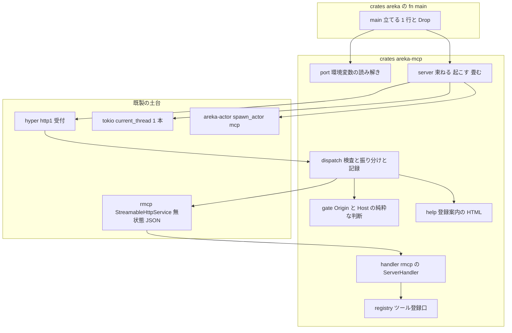
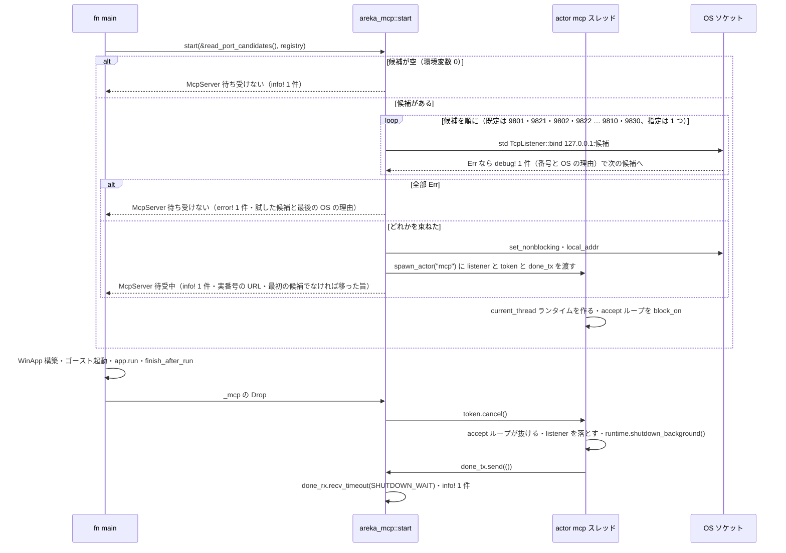
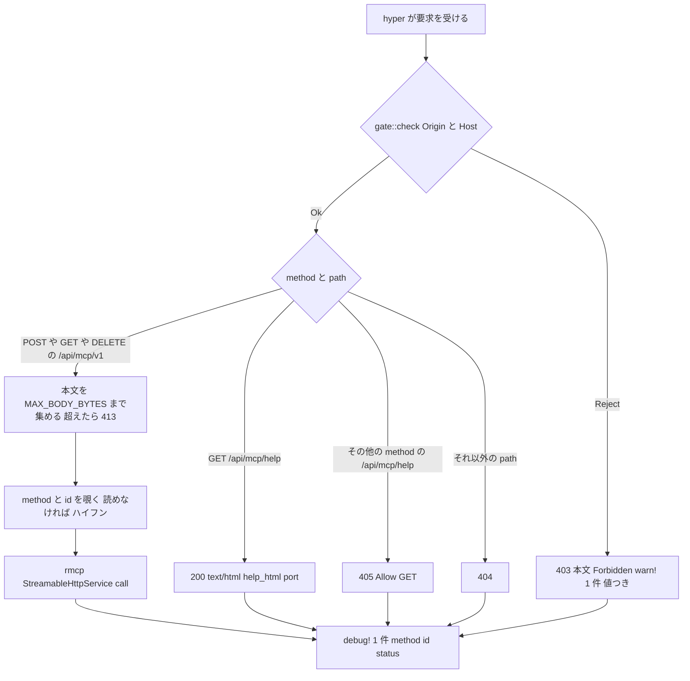

# Design Document: areka-P0-mcp-server-core

> 2026-10-03・本ブランチ（main `76e17654` と同じコード）。コードは「何の定義か」（関数名・型名・定数名＋ファイルパス）で指し、行番号では指さない。
> rmcp は **crates.io の 3.5.0 の現物**（手元の cargo レジストリ `rmcp-3.5.0` のソース）を読んで確かめた。ギャップ分析（research.md §3）が docs.rs の表示から「見込み」と書いた 3 点は現物と違ったので、本文書で改め、research.md §11 に記録した（未知メソッドは `-32601`・壊れた JSON は 415・JSON-RPC エラーの HTTP 状態は旧式の経路では常に 200）。
> 設計へ送られた判断 B-1〜B-7（research.md §10）は本文書の「設計判断」節で決めた。要件ディスカッションで開発者が確定した 2 件のうち `serverInfo` は `areka-mcp-server` のまま。既定ポートは **2026-10-03 の開発者裁定で改めた**（既定 9821・失敗は記録だけ → 9801 → 9821 の早い者勝ち・どちらも使用中なら隣の 20 候補・`AREKA_MCP_PORT` の指定は 1 つだけ＝設計判断 B-13）。

## Overview

**Purpose**: areka が起動すると `127.0.0.1:<port>`（既定は 9801 → 9821 の早い者勝ち・どちらも使用中なら隣の番号へ・`AREKA_MCP_PORT` で変更・`0` で待ち受けない）で HTTP を受け、`POST /api/mcp/v1` が MCP サーバ（公式 Rust SDK rmcp・無状態・JSON の単発応答・ツール 0 本）として `initialize`→`tools/list`→`ping` に応える。後続 `mcp-tool-entrances` がツールを足すための登録口と、`GET /api/mcp/help` の登録案内、`Origin`／`Host` の検査、SSP との輸送の差の一覧を持つ。

**Users**: AI エージェント（Claude Code・Cursor）でゴーストを作る人が `claude mcp add --transport http areka http://127.0.0.1:<実際の番号>/api/mcp/v1`（番号は `info!` と help が示す）で登録する。areka の開発者が動いている areka へ問い合わせる土台になる。

**Impact**: 本番に初めてサーバ・tokio・HTTP の土台が入る。すべて新しい葉クレート `areka-mcp` に閉じ、アプリ本体（`crates/areka`）は `fn main()` で「立てる 1 行」だけを足す（畳むのは取っ手の `Drop`）。tokio は `areka-mcp` が起こす 1 本のスレッドの中に閉じ、rmcp と tokio の型は `areka-mcp` の外へ出ない。

### Goals
- `127.0.0.1` の 1 ポート（候補の列の中で最初に束ねられたもの）で待ち受け、全部だめならログ 1 件で知らせてアプリは動き続ける（要件 1・2）。
- rmcp 3.5.0 の無状態・JSON 単発の経路で MCP の 5 版に応える（要件 3）。
- `Origin`／`Host` の検査を 1 か所の純粋な判断で持ち、help にも同じ検査を掛ける（要件 4・6）。
- ツールの登録口を rmcp の型を外に出さない形で切る（要件 7）。
- 依存の追加をライセンスの門（`cargo deny`・`cargo about`）に通し、steering に登記する（要件 8）。
- 実ソケットの決定論テストで振る舞いを固定し、SSP との差を 1 文書にする（要件 5・9）。

### Non-Goals
- ツールの定義と中身（`mcp-tool-entrances` と 3 段目の spec 群）。
- Claude Desktop 用の stdio ⇔ HTTP 中継（`mcp-stdio-bridge`）。help に Desktop の設定例は載せない（0 件）。
- 認証・TLS・`127.0.0.1` 以外での待受・SSTP（9801 で待ち受けても受けるのは MCP の 2 つのパスだけ）・`GET /api/mcp/v1` の手打ちフォーム・`resources`／`prompts` の能力。
- rmcp の中身への改変（フォーク・パッチ 0 件）。
- `dist/README.txt` への記述（後続 `mcp-stdio-bridge`）。

## Boundary Commitments

### This Spec Owns
- 新クレート `crates/areka-mcp/`（待受・ポートの読み解き・`Origin`／`Host` の検査・HTTP の振り分け・rmcp の組み込み・ツール登録口・help ページ・決定論テスト）。
- 環境変数 `AREKA_MCP_PORT` の意味（未設定＝既定の候補 20 個〔9801・9821・9802・9822・…・9810・9830〕・1〜65535＝その 1 つだけ・`0`＝待ち受けない・読めない値＝`warn!`＋既定の候補）。
- 公開の契約: `areka_mcp::start`・`McpServer`（取っ手）・`ToolRegistry`／`ToolSpec`／`ToolOutcome`／`ToolContent`（登録口）・`DEFAULT_PORTS`／`FALLBACK_STEPS`／`candidates_from_env_value`／`read_port_candidates`（B-13 で `DEFAULT_PORT`／`port_from_env_value`／`read_port_env` から置き換えた）。
- `crates/areka/src/main.rs` の `fn main()` への結線 1 行と `crates/areka/Cargo.toml` の依存 1 行。
- `doc/ssp-mcp/transport-diff-areka.md`（SSP との輸送の差の一覧・新規）。
- `.kiro/steering/tech.md`（Key Libraries の登記）・`structure.md`（`areka-mcp` の節）。
- `Cargo.lock`・`THIRD-PARTY-NOTICES.md`（道具が作り直す生成物）。

### Out of Boundary
- `crates/areka-mcp/src/tools/`（後続 `mcp-tool-entrances` が作る置き場。本 spec は作らない）と `crates/areka/src/mcp/`（同じく後続）。
- `ToolRegistry` へ本番のツールを登録すること（本 spec の本番の登録は 0 本）。
- `ghost_session.rs`・`session_end.rs`・`emo2_boot/`・World への橋。
- 根の `Cargo.toml` の `[workspace.dependencies]`（rmcp・tokio のために変える行 0）・`deny.toml`・`about.toml`（許可の表に足すものは 0＝実測で緑）。
- `doc/ssp-mcp/survey.md` の本文・完了 spec の文書。

### Allowed Dependencies
- `areka-mcp` → `areka-actor`（`spawn_actor` でスレッドを名簿に載せる。前例 `areka-sylphya`）。それ以外のワークスペース内クレートへの依存は 0（wintf・kanade・ghost を知らない葉）。
- `areka-mcp` → crates.io: `rmcp =3.5.0`（`default-features = false`・`server`＋`transport-streamable-http-server`）・`tokio`（`rt`・`net`・`time`）・`tokio-util`（`CancellationToken`）・`hyper`（`server`・`http1`）・`hyper-util`（`tokio`＝`TokioIo`・`TokioTimer`）・`http-body-util`・`tower-service`・`serde_json`・`tracing`。これらは研究で測った「新しいクレート 30」の中に全部入っている（直接の依存にしても `Cargo.lock` の数は増えない）。
- `areka` → `areka-mcp`（path 依存 1 行）。向きはこれだけ。`areka-mcp` が `areka` の型を使うことは無い。
- テスト専用: `log-capture-kit`（`[dev-dependencies]`。`[dependencies]` へは置かない＝見張りが赤にする）。

### Revalidation Triggers
- `ToolRegistry`／`ToolSpec`／`ToolOutcome` の形が変わる → `mcp-tool-entrances` と 3 段目の spec を見直す。
- `start` の引数（候補の列・登録表）や `McpServer` の畳み方が変わる → `main.rs` の結線と `mcp-stdio-bridge`（同じ `AREKA_MCP_PORT` を読む）を見直す。
- 既定の候補（`DEFAULT_PORTS`・`FALLBACK_STEPS`）や並びが変わる → `mcp-stdio-bridge` を見直す（同じ候補を同じ順で辿って areka を探す見込み。向こうの `brief.md` の「既定 9821」は B-13 より前の記述）。
- rmcp の版を上げる → `server_tests.rs`・`server_protocol_tests.rs`・`server_gate_help_tests.rs` の全部を回し、差の一覧の「測った版と日」を書き直す。
- help の URL やパス（`/api/mcp/v1`・`/api/mcp/help`）が変わる → `mcp-stdio-bridge` の焼き込みと ukadoc 流の案内を見直す。

## Architecture

### Existing Architecture Analysis
- 本番にサーバ・非同期ランタイム・HTTP の土台は無い。前例は ⑴ 空きポートを OS に割り当てさせる偽サーバ（`crates/areka-update/src/winhttp_real_tests.rs` の `serve`）、⑵ 起動時に裏方を立てて終了直前に畳む取っ手（`crates/areka/src/perf_thread_report.rs` の `start`／`ReportHandle::stop_and_report_final`・待ちの上限 `FINAL_WAIT`）、⑶ 環境変数を読まない純粋な読み解き（同ファイルの `period_from_env_value`＝読めない値は `warn!`＋既定・非 UTF-8 は `read_period_env` が `warn!`＋未設定扱い）。本 spec は ⑴ をテストの型に、⑵⑶ を本番の型にそのまま写す。
- `fn main()`（`crates/areka/src/main.rs`）は 946 行で 1,000 行の番人の射程。足せるのは数行。終了の閉包 `finish_after_run` の中には `down?` の早い戻りがあり、そこに畳む処理を置くと飛ぶ（本文のコメントが明記）。
- スレッドの名簿: `areka_actor::spawn_actor(name, body)`（`crates/areka-actor/src/spawn.rs`）で起こしたスレッドは `thread_roles` のフックで `actor:<name>` として wintf の名簿に載る。載らないスレッドは性能の報告に `unregistered_rest` として出る。
- ログの捕捉: `log_capture_kit::capture` は**呼び出しスレッドで同期に出た**イベントだけを集める。別スレッドのイベントは常時テストでは数えない（実機の `RUST_LOG` で確かめる）。全スレッドを捕捉する `install_global_capture_all` も在るが、番人の例外表（`crates/log-capture-kit/tests/with_default_guard_test.rs`）への登記が要り、どの spec も例外表に触れない約束なので使わない。

### Architecture Pattern & Boundary Map



**Architecture Integration**:
- 選んだ型: **葉クレート＋取っ手**。`areka-mcp` は「呼び出し側で同期に束ねる → 名前付きスレッドの中に tokio を 1 本立てる → hyper の受付ループ → 3 分岐の振り分け」で、アプリ本体は取っ手を 1 つ持つだけ。
- 依存の向き: `port` → `gate` → `help` → `registry` → `handler` → `dispatch` → `server` → `lib`（公開面）。左の層は右を知らない。`server` だけが tokio・hyper・areka-actor を綴り、`handler` だけが rmcp の `ServerHandler`／`ToolRouter` を綴り、`dispatch` だけが rmcp の `StreamableHttpService` を呼ぶ。rmcp・tokio・hyper の型は `lib.rs` の公開面に現れない。
- 既存の型の踏襲: `period_from_env_value` の `warn!`＋既定・`ReportHandle` の上限つきの待ち・`spawn_actor` の名簿・`winhttp_real_tests::serve` の空きポート。
- 新しい部品の理由: `gate` は help ページが rmcp の外にあるため自前が 1 つ要る（要件 6.3）。`registry` は rmcp の型を後続 10 spec へ漏らさないため。`dispatch` は 3 分岐しか無いのでルータの道具を入れない。
- steering との整合: 本番 env は `AREKA_` の冠・ログ無しの失敗経路を作らない（`error!`／`warn!`／`info!` の件数を要件どおり固定）・1 ファイル 1,000 行・テストは実装の隣の `*_tests.rs`。

### Technology Stack

| Layer | Choice / Version | Role in Feature | Notes |
|-------|------------------|-----------------|-------|
| MCP プロトコル | rmcp `=3.5.0`（`default-features = false`・features `server`・`transport-streamable-http-server`） | `StreamableHttpService`（無状態・JSON 単発）・`ServerHandler`・`ToolRouter` | Apache-2.0。`macros`・`base64` は切る（B-5）。版上げは `server_tests.rs` を通してから |
| HTTP の受付 | hyper 1（`server`・`http1`）＋ hyper-util 0.1（`tokio`＝`TokioIo`）＋ http-body-util（`Full`・`BodyExt`・`Limited`）＋ tower-service 0.3（rmcp の `Service::call` を呼ぶ） | 接続ごとの `http1::Builder::serve_connection` と `service_fn` | HTTP/2 は使わない（クライアントは HTTP/1.1）。axum は入れない（B-2） |
| 非同期ランタイム | tokio 1（`rt`・`net`・`time`）＋ tokio-util 0.7（`CancellationToken`） | `Builder::new_current_thread().enable_all()` を MCP スレッドの中だけで | `multi_thread`・`spawn_blocking` は本 spec では使わない（名簿に載らないスレッドを増やさない） |
| スレッド | `areka_actor::spawn_actor("mcp", …)` | 名簿に `actor:mcp` で載る 1 本 | inbox（`Receiver<()>`）は使わない。合図は `CancellationToken` |
| JSON | serde_json 1 | 登録口の `input_schema`／引数／`method`・`id` の覗き読み | 既存の依存（本番にも在る） |
| 記録 | tracing | `info!`／`warn!`／`error!`／`debug!` | target は既定（モジュールパス `areka_mcp::…`）。`RUST_LOG=areka_mcp=debug` で要求ごとの行が出る |
| テスト | std `TcpListener`／`TcpStream`＋ log-capture-kit | 実ソケット・空きポート・手書きの HTTP/1.1 | 新しいクレートを足さない（reqwest・ureq は入れない） |

## 設計判断（research.md §10 の B-1〜B-7 と、その後に増えた B-8〜B-13）

| # | 判断 | 決定 | 根拠 |
|---|---|---|---|
| B-1 | `Origin`／`Host` の検査 | **自前の純粋関数 `gate::check` を振り分けの手前に 1 つ**。rmcp の `allowed_hosts` 既定（`localhost`・`127.0.0.1`・`::1`）はそのまま残し、`allowed_origins` は空のまま（rmcp 側は `Origin` を検査しない） | help は rmcp の外（要件 6.3）。`warn!` に値を 1 件載せる（4.3）のも、純粋関数を決定論テストで固定する（4.5）のも自前でしか満たせない。rmcp の `Host` 検査は自前が先に拒むので二重に鳴らない |
| B-2 | HTTP の土台 | **hyper 1 を直に**。受付ループ 1 つ＋ `(method, path)` の `match` 1 つ | 分岐は 3 つ。新しいクレートは 30 で axum より 8 少ない（要件 8 の告知の量） |
| B-3 | 畳み方 | **取っ手 `McpServer` の `Drop`**。`fn main()` では `resolve_boot` の直後・`WinApp` 構築の前に `let _mcp = areka_mcp::start(…)` を置く | `down?` の早い戻りの罠を構造で避ける。`main` のどの `return`／`?` でも畳まれる。`app` より先に宣言するので `app` の後に落ちる＝待受は UI の後始末の後に閉じる |
| B-4 | 登録口の handler の形 | **非同期**。`Arc<dyn Fn(serde_json::Value) -> Pin<Box<dyn Future<Output = ToolOutcome> + Send>> + Send + Sync>` | 要件 1.5（他の接続を止めない）を後続でも守れる。本 spec のテストの 1 本は `Box::pin(async { … })` で即値を返す。同期にしておくと `spawn_blocking` 以外の逃げ道が無くなる |
| B-5 | rmcp の既定機能 | **切る**（`default-features = false`） | `rmcp-macros`・`pastey`（マクロ側）・`base64` が落ちる。登録は `ToolRoute::new_dyn` で足りる。研究の 30 クレートはこの形で測った |
| B-6 | `tools/call` の `-32602` | **`ToolRouter` を通す**（`ServerHandler::call_tool` を `ToolRouter::call` へ委ねる） | rmcp の `call_tool` の既定は `-32601`。`ToolRouter::call` は未登録の名前に `invalid_params("tool not found")`＝`-32602`（現物で確認） |
| B-7 | 本文の上限 4 MiB | **差の一覧に 1 行載せる**（「違うが困らない」）。上限の定数は `MAX_BODY_BYTES`（4 MiB）1 つを `dispatch` の読み取りと rmcp の `with_max_request_body_bytes` の両方へ渡す | 二重の限界値を持たない。超えたときの 413 は areka の読み取りが先に返す |
| B-8（新） | `Accept` ヘッダ | rmcp は `Accept` に `application/json` と `text/event-stream` の**両方**が無い `POST` を **406** で拒む（`handle_post` の先頭）。**直さない**＝差の一覧に 1 行（「違うが困らない」）。signoff の `curl` 例と差の一覧の計測例は `-H "Accept: application/json, text/event-stream"` を付ける | Claude Code・Cursor（TS SDK）は両方を付けて送る。素の `curl`（`Accept: */*`）が 406 になるのは要件 5.2 の物差し（登録・`initialize`・`tools/list`・`ping` にクライアントが失敗する）に当たらない |
| B-9（新） | JSON-RPC エラーのときの HTTP 状態 | rmcp の `jsonrpc_http_status`（`-32602`→400・`-32601`→404）が効くのは **2026-07-28 の per-request 経路**（本文の `_meta` に版が入る要求と `server/discover`）だけ。旧式の 4 版の経路では `-32602`・`-32601` とも **HTTP 200**＝SSP と同じ。Claude Code 2.1.283 は前者の経路でつなぐ（2026-10-03・実機確認 6.2。Cursor は未確認）が、接続の手順（`server/discover`→`tools/list`）はエラーを返さないので物差しに当たらない | `handle_post` の無状態の腕は `json_response` のとき `StatusCode::OK` 固定で返す（現物で確認）。研究の R1 の大半はここで解ける（残るのは 2026-07-28 の経路だけ＝差の一覧に書く） |
| B-10（新） | 要件 3.7・3.8 の文面と現物 | 未知メソッドは `CustomRequest` として読まれ `on_custom_request` の既定が **`-32601`**（旧式の経路で 200）＝要件 3.7 を満たす。壊れた JSON は `expect_json` が **415**・本文は平文（JSON-RPC のエラーではない）。**設計は現物に合わせる**（テストは 415 を固定）。要件 3.8 の括弧書きは設計ディスカッション（2026-10-03）で 415・平文へ直した | 要件の主旨は「コードは rmcp のまま」。areka が JSON-RPC の形へ包み直すのは rmcp の外で本文を解釈することになり、要件 3.7 が禁じた「areka がメソッドの表を持つ」と同じ筋になる |
| B-11（新・設計レビュー指摘 1） | `initialize` の版の交渉 | `2026-07-28` は `initialize` を持たない版（`ProtocolVersion::NO_INITIALIZE`）なので、`negotiate_protocol_version` は `initialize` を持つ最新の **`2025-11-25`** へ倒す。旧式の 4 版は要求どおり。**直さない**（rmcp に手を入れない・規格どおり）。要件 3.1 を設計ディスカッションで「旧式 4 版は要求どおり・`2026-07-28` は `2025-11-25`」へ直し、テストを 2 本に分けた。差の一覧の「版の交渉」の行に SSP（`2026-07-28` をそのまま返す）との差を書く | `rmcp-3.5.0/src/service/server.rs` の `negotiate_protocol_version`・`model.rs` の `has_initialize`。Claude Code 2.1.283 は `initialize` を送らず `server/discover` で版を知る（実機確認 6.2）。Cursor は未確認だが、旧式の 4 版で `initialize` するなら要求どおりの版が返るので困らない |
| B-12（新・実機確認 6.2） | 無状態版の `tools/list` の結果 | 要求の版（`RequestContext::protocol_version`）が `2026-07-28` 以降なら、`list_tools` が `ListToolsResult` に **`ttlMs: 0`・`cacheScope: "private"`** を付ける（`with_ttl_ms`／`with_cache_scope`）。旧式の版には付けない（線の上の形を変えない）。0／private は、無状態では `notifications/tools/list_changed` を送れず後続 spec で道具が増えるため・`server/discover` の rmcp の既定と同じ値。**困るので直した**＝差の一覧に 1 行 | schema 2026-07-28 の `ListToolsResult` は `CacheableResult`（`ttlMs`・`cacheScope` が必須）を継ぐ。rmcp 3.5.0 の `paginated_result!` は 2 欄を「2026-07-28 では必須だがここでは任意」として `with_all_items` で `None` のまま出す。Claude Code 2.1.283 が実機で `Invalid result for tools/list`（`ttlMs`・`cacheScope`）で拒んだ |
| B-13（新・2026-10-03 開発者裁定） | 既定ポートと束ねの失敗 | **候補の列を順に試し、最初に束ねられた 1 つで待ち受ける**。既定の候補は `DEFAULT_PORTS = [9801, 9821]` から始めて、両方とも使用中なら `+1`〜`+FALLBACK_STEPS`（9）の隣を `9801+k`→`9821+k` の順で足した 20 個（9801・9821・9802・9822・…・9810・9830）。`AREKA_MCP_PORT` が 1〜65535 なら候補はその 1 つだけ（逃げない）・`0` なら空（待ち受けない）・読めない値は `warn!`＋既定の候補。候補を飛ばすたびに `debug!` 1 件（番号・OS の理由）、全部だめなら `error!` 1 件（試した候補・最後の OS の理由）、束ねたら `info!` 1 件（実番号の URL・最初の候補でなければ移った旨を同じ行に）。署名は `start(candidates: &[u16], registry)` で、ポートの読み解き（port）と束ね（server）を分けたまま「どの番号を試すか」だけを候補の列で渡す。**要件ディスカッション議題 1（既定 9821・9801 は避ける・失敗は記録だけで別のポートを試さない）と、それに拠った記述〔`DEFAULT_PORT = 9821`・`start(Option<u16>)`・「別ポート 0」〕はこれで置き換えた** | areka は SSP と同じ種類のベースウェアで同じ既定の番号を取り合う＝早い者勝ち（開発者裁定）。実機確認 6.2 で SSP が 9801 と 9821 の両方で待ち受ける机があり、9821 決め打ちでは待ち受けられなかった。両方で待ち受ける形（SSP の形）は取らない（待受は 1 つ）。候補を列で渡すと、テストは `&[0]`（OS に任せる）や `&[占めた番号, 0]` で「飛ばして次へ」を固定の番号なしに踏める。束ねは同期で呼び出し側のスレッドなので `debug!`／`info!`／`error!` は `capture` で数えられる |

## File Structure Plan

### Directory Structure
```
crates/areka-mcp/
├── Cargo.toml                 # 依存（rmcp =3.5.0 ほか）・publish = false・version.workspace = true
└── src/
    ├── lib.rs                 # 公開面（start・McpServer・ToolRegistry 系・port 系の re-export）とモジュール宣言。crate doc に「tokio は mcp スレッドに閉じる」
    ├── port.rs                # DEFAULT_PORTS・FALLBACK_STEPS・PORT_ENV・candidates_from_env_value（純粋）・read_port_candidates（非 UTF-8 の warn!）
    ├── port_tests.rs          # 要件 2.6 の 9 値＋20 候補の並び（2.8）＋非 UTF-8
    ├── gate.rs                # Reject・check(origin, host)（純粋・生の値を使わない判断）
    ├── gate_tests.rs          # 要件 4.5 の 8 値＋Host の表
    ├── help.rs                # help_html(port) -> String（日本語・5 項目）
    ├── help_tests.rs          # 要件 6.1・6.2 の 5 項目と番号
    ├── registry.rs            # ToolSpec・ToolContent・ToolOutcome・ToolHandler・ToolRegistry（rmcp の型を含まない）
    ├── registry_tests.rs      # 同じ名前の 2 度目の登録は後勝ち・warn! 1 件／定義が逐語で取り出せる
    ├── handler.rs             # ArekaHandler: rmcp::ServerHandler（get_info・list_tools・call_tool・get_tool）。registry → ToolRouter の写し。INSTRUCTIONS・SERVER_NAME
    ├── dispatch.rs            # MAX_BODY_BYTES・State・handle(state, req) = gate → (method, path) の match → v1 は rmcp・help は help_html・他は 404/405 → debug! 1 件
    ├── server.rs              # start(candidates, registry) -> McpServer（候補を順に束ねる）・McpServer（Drop で畳む）・accept ループ・SHUTDOWN_WAIT・ACCEPT_RETRY_WAIT
    ├── testkit.rs             # #[cfg(test)] 手書きの HTTP/1.1 クライアント（request/Response）・JSON-RPC の組み立て・サーバの起こし口
    ├── server_tests.rs        # 実ソケット: 待受・候補の飛ばし・束ねの失敗・終了（要件 1・2.4・2.9・9.3・9.4）
    ├── server_protocol_tests.rs   # 実ソケット: initialize〜server/discover・Accept・本文の上限（要件 3・5）
    └── server_gate_help_tests.rs  # 実ソケット: Origin／Host・help・404／405・登録 1 本の往復（要件 4・6・7）
```

- 統合テストは 1 ファイルに集めると 1,000 行の番人（`crates/log-capture-kit/tests/file_length_guard_test.rs`・例外表はどの spec も触れない）の射程に入るので、最初から `structure.md` の `<stem>_<テーマ>.rs` の形で 3 つに分ける。接続宣言は `#[cfg(test)] #[path = "…"] mod …;`。共有の部品は `testkit.rs` 1 つ。

### Modified Files
- `crates/areka/Cargo.toml` — `[dependencies]` に `areka-mcp = { path = "../areka-mcp" }` を 1 行（コメント付き・外部依存の追加はこの行ではなく `areka-mcp` 側）。
- `crates/areka/src/main.rs` — `fn main()` の `resolve_boot` の `match` の直後に `let _mcp = areka_mcp::start(&areka_mcp::read_port_candidates(), areka_mcp::ToolRegistry::default());`（B-13 の前は `read_port_env()`）と、意図を書くコメント（`Drop` で畳む・`down?` の罠を避ける・`app` より先に宣言する）。畳む行は無い（2 か所目は使わない）。
- `Cargo.lock`・`THIRD-PARTY-NOTICES.md` — `cargo` と `tools/test-all.ps1 -License` が作り直す（手の差分 0 行）。
- `doc/ssp-mcp/transport-diff-areka.md` — 新規（要件 5）。
- `.kiro/steering/tech.md` — Key Libraries に rmcp・tokio（＋tokio-util）・hyper（＋hyper-util・http-body-util・tower-service）の登記（用途・版・「tokio は MCP のスレッドに閉じる」）。
- `.kiro/steering/structure.md` — 「MCP Server Crate（areka-mcp）」の節（Location・Purpose・Modules・Dependencies・規律）。
- `.kiro/specs/areka-P0-mcp-server-core/verification/signoff.md` — 実機確認の記録（要件 9.5・9.6）。

## System Flows

### 起動と終了



- 束ねは**呼び出し側のスレッドで同期に**行う。候補を飛ばす `debug!`・全部だめの `error!`・待ち受けない `info!`・URL の `info!` はすべて呼び出し側のスレッドで出るので、`log_capture_kit::capture` が数えられる（要件 9.3・2.9）。
- 束ねたが `set_nonblocking`／`local_addr` が失敗した候補も「束ねられなかった」と同じに扱い、`debug!` 1 件で次の候補へ進む（取った口はその場で落とす）。
- `Drop` は `cancel` → `done` を `SHUTDOWN_WAIT`（2 秒・`perf_thread_report` の `FINAL_WAIT` と同じ考え）まで待つ → `info!`。待ちきれなければ `warn!` を残して切り離す（終了の手順を止めない＝要件 1.8）。`shutdown_background` は開いた接続の仕事を待たない。
- 待ち受けていない取っ手の `Drop` は何もしない（`info!` 0 件）。

### 要求 1 件の流れ



- `gate` は path によらず最初に掛ける（要件 4.3「`initialize` でも `ping` でも help でも同じ」）。
- `/api/mcp/v1` は method を問わず rmcp へ渡す。GET／DELETE は rmcp が無状態のとき 405（`Allow: POST`）を返す＝要件 3.11（フォーム 0 ページ）。
- `debug!` は応答が決まった後に 1 件（method 名・`id`・HTTP の状態）。拒否・404・405 でも出す（method は `-`）。

## Requirements Traceability

| Requirement | Summary | Components | Interfaces | Flows |
|---|---|---|---|---|
| 1.1 | 起動で `127.0.0.1` のポートを待ち受ける（IPv4 ループバック 1 つ） | server・main.rs の結線 | `start` | 起動と終了 |
| 1.2 | 待受開始で `info!` 1 件（実番号の URL・最初の候補でなければ移った旨） | server | `start` | 起動と終了 |
| 1.3 | 候補が全部だめなら `error!` 1 件（試した候補・最後の理由）・動き続ける・候補の外 0・再試行 0・告知 0 | server | `start` → `McpServer`（待ち受けない） | 起動と終了 |
| 1.4 | 終了コードは待受と無関係 | server・main.rs | `start` は `Result` を返さない | — |
| 1.5 | 2 本以上の接続を同時に受ける | server（接続ごとに `tokio::spawn`） | — | 要求 1 件の流れ |
| 1.6 | UI のスレッドの時間を使わない | server（別スレッド・current_thread） | — | — |
| 1.7 | 終了で待受を閉じる | server（`Drop`・listener を落とす） | `McpServer::drop` | 起動と終了 |
| 1.8 | 開いた接続を待たずに終了 | server（`shutdown_background`・`SHUTDOWN_WAIT`） | `McpServer::drop` | 起動と終了 |
| 1.9 | 閉じたら `info!` 1 件 | server | `McpServer::drop` | 起動と終了 |
| 1.10 | 候補を飛ばすたびに `debug!` 1 件（番号・OS の理由） | server | `start` | 起動と終了 |
| 2.1 | 既定の候補 9801 → 9821 → 隣の 20 個・待受は 1 つ | port（`DEFAULT_PORTS`・`FALLBACK_STEPS`）・server（最初に束ねた 1 つ） | `candidates_from_env_value`・`start` | 起動と終了 |
| 2.2 | 未設定で既定の候補 | port | `candidates_from_env_value(None)` | — |
| 2.3 | 1〜65535（空白許容）はその 1 つだけ | port | `candidates_from_env_value` | — |
| 2.4 | `0` で待ち受けない・`info!` 1 件 | port・server | `candidates_from_env_value` → 空・`start(&[])` | 起動と終了 |
| 2.5 | 読めない値は `warn!` 1 件＋既定の候補（非 UTF-8 も） | port | `candidates_from_env_value`・`read_port_candidates` | — |
| 2.6 | 環境変数を読まない判断・9 値のテスト | port | `candidates_from_env_value` | — |
| 2.7 | 環境変数の名前は 1 つ・README には書かない | port（`PORT_ENV`）・help | — | — |
| 2.8 | 既定の候補 20 個の並びをテストで固定 | port_tests | `candidates_from_env_value(None)` | — |
| 2.9 | 使用中を飛ばす・全部だめは `error!`＝空きポートだけの実ソケットのテスト | server_tests | `start(&[占めた番号, 0])`・`start(&[占めた番号 2 つ])` | 起動と終了 |
| 3.1 | `initialize` の旧式 4 版は要求どおり・`2026-07-28` は `2025-11-25`・capabilities・serverInfo・instructions | handler（rmcp の `negotiate_protocol_version`・B-11） | `ServerHandler::get_info` | 要求 1 件の流れ |
| 3.2 | 未知の版は失敗にしない（`2025-11-25` へ倒れる見込み） | handler（rmcp の `negotiate_protocol_version`） | — | — |
| 3.3 | 通知は 202 | dispatch → rmcp | — | 要求 1 件の流れ |
| 3.4 | `tools/list` は 0 本 | handler・registry | `ServerHandler::list_tools` | — |
| 3.5 | `ping` は `{}` | rmcp 既定 | — | — |
| 3.6 | `tools/call` は `-32602` | handler（`ToolRouter::call`） | `ServerHandler::call_tool` | — |
| 3.7 | 未知メソッドは JSON-RPC のエラー（rmcp のまま） | rmcp（`CustomRequest`→`-32601`） | — | — |
| 3.8 | JSON でない本文は 4xx・落ちない | rmcp（415）・dispatch | — | 要求 1 件の流れ |
| 3.9 | セッション ID を要求しない | handler・dispatch（`legacy_session_mode(false)`・`NeverSessionManager`） | `StreamableHttpServerConfig` | — |
| 3.10 | `application/json` の単発・SSE 0 本 | dispatch（`json_response(true)`） | `StreamableHttpServerConfig` | — |
| 3.11 | `GET /api/mcp/v1` にフォームを出さない | dispatch → rmcp（405） | — | 要求 1 件の流れ |
| 3.12 | `server/discover` | rmcp 既定の `discover` | — | — |
| 3.13 | `MCP-Protocol-Version` の旧式／無しは素通し・未知は rmcp のまま | rmcp（`validate_protocol_version_header`） | — | — |
| 3.14 | 要求ごとに `debug!` 1 件 | dispatch | — | 要求 1 件の流れ |
| 3.15 | 無状態版の `tools/list` に `ttlMs: 0`・`cacheScope: "private"`・`resultType` | handler（B-12） | `ServerHandler::list_tools` | — |
| 4.1 | `Origin` 無しは通す | gate | `gate::check` | 要求 1 件の流れ |
| 4.2 | ループバックの `Origin` は通す | gate | `gate::check` | — |
| 4.3 | それ以外は 403・MCP に入らない・`warn!` 1 件（値） | gate・dispatch | `gate::check`・`Reject` | 要求 1 件の流れ |
| 4.4 | `Host` がループバック以外は 403 | gate（＋rmcp の既定） | `gate::check` | — |
| 4.5 | 生の値を使わない判断・8 値のテスト | gate | `gate::check` | — |
| 5.1 | 15 行の差の一覧（空欄 0） | `doc/ssp-mcp/transport-diff-areka.md`・server_tests | — | — |
| 5.2 | 「困る」の物差しと直す範囲 | 差の一覧（本 spec で直す行は 0） | — | — |
| 5.3 | 直した行にテスト名 | 差の一覧 | — | — |
| 5.4 | 測った rmcp の版と日 | 差の一覧 | — | — |
| 6.1 | help の 5 項目（⑷ は既定の候補の順の説明）・200・text/html | help・dispatch | `help_html` | 要求 1 件の流れ |
| 6.2 | 実際の番号を載せる・9801／9821 を固定で書かない | help（`start` が束ねた実番号を渡す） | `help_html(port)` | — |
| 6.3 | help にも `Origin` の検査 | dispatch（gate が先） | — | 要求 1 件の流れ |
| 6.4 | 他のパスは 404 | dispatch | — | 要求 1 件の流れ |
| 6.5 | help に GET 以外は 4xx | dispatch（405） | — | 要求 1 件の流れ |
| 7.1 | 一覧と呼び出しは登録口から | registry・handler | `ToolRegistry` | — |
| 7.2 | テストで 1 本登録して往復 | registry・handler・server_tests | `ToolRegistry::register` | — |
| 7.3 | 未登録の名前は `-32602` | handler（`ToolRouter::call`） | — | — |
| 7.4 | name・title・description・inputSchema を逐語で | registry（`ToolSpec`） | `ToolSpec` | — |
| 8.1 | `test-all.ps1 -Format -License` を通す | Cargo.toml・生成物 | — | — |
| 8.2 | rmcp を `=` で固定 | `crates/areka-mcp/Cargo.toml` | — | — |
| 8.3 | 表に無いライセンスは承認を得てから | 研究で 0 件（発動しない） | — | — |
| 8.4 | NOTICES は道具で作り直す | `tools/test-all.ps1 -License` | — | — |
| 8.5 | tech.md・structure.md の登記 | steering | — | — |
| 8.6 | 依存は 2 つの Cargo.toml だけ | Cargo.toml（根は不変） | — | — |
| 9.1 | ネットへ出ない・空きポート | testkit（`127.0.0.1:0`） | `start(&[0], …)` | — |
| 9.2 | 実ソケットのテスト一覧 | server_tests | — | — |
| 9.3 | 束ねの失敗と候補の飛ばしを踏む・log-capture-kit | server_tests（`capture`） | — | — |
| 9.4 | 畳んだ後に接続できない・有限で戻る | server_tests | — | — |
| 9.5 | 実機確認 4 項目・signoff.md | verification/signoff.md | — | — |
| 9.6 | `RUST_LOG` で `debug!`・`warn!` を確かめる | signoff.md | — | — |

## Components and Interfaces

| Component | Domain/Layer | Intent | Req Coverage | Key Dependencies (P0/P1) | Contracts |
|---|---|---|---|---|---|
| port | 設定 | `AREKA_MCP_PORT` の読み解き・既定の候補の列 | 2.1〜2.8 | tracing (P2) | Service |
| gate | 検査 | `Origin`／`Host` の通す／拒む | 4.1〜4.5, 6.3 | — | Service |
| help | 案内 | 登録手順の HTML | 6.1, 6.2 | — | Service |
| registry | 登録口 | ツール定義と実装の受け皿 | 7.1〜7.4 | serde_json (P0) | Service |
| handler | MCP | rmcp の `ServerHandler` | 3.1, 3.2, 3.4, 3.6, 7.1〜7.3 | rmcp (P0), registry (P0) | Service |
| dispatch | HTTP | 検査・振り分け・記録 | 3.3, 3.8〜3.14, 4.3, 6.3〜6.5 | rmcp (P0), gate (P0), help (P0) | API |
| server | 待受 | 候補を順に束ねる・起こす・畳む | 1.1〜1.10, 2.1, 2.4, 2.9 | tokio (P0), hyper (P0), areka-actor (P0), dispatch (P0) | Service, State |
| main.rs の結線 | アプリ | 立てる 1 行 | 1.1, 1.4, 1.7 | areka-mcp (P0) | — |
| 差の一覧 | 文書 | SSP との輸送の差 | 5.1〜5.4 | server_tests (P0) | — |

### 設定

#### port

| Field | Detail |
|-------|--------|
| Intent | `AREKA_MCP_PORT` の値を「試す候補の列（既定の 20 個／指定の 1 つ／空＝待ち受けない）」へ写す |
| Requirements | 2.1, 2.2, 2.3, 2.4, 2.5, 2.6, 2.7, 2.8 |

**Responsibilities & Constraints**
- 判断は環境変数を読まない純粋関数が持つ（前例 `period_from_env_value`）。読むのは 1 か所の `read_port_candidates`。
- 環境変数の名前は `PORT_ENV = "AREKA_MCP_PORT"` の 1 つ。既定の候補は `DEFAULT_PORTS = [9801, 9821]` と `FALLBACK_STEPS = 9` から組む（`k = 0..=FALLBACK_STEPS` を外側・`DEFAULT_PORTS` を内側にした 2 重の並びで `base + k`＝9801・9821・9802・9822・…・9810・9830 の 20 個）。並びを組む場所はこの 1 か所（server は列を順に試すだけで、番号の意味を知らない）。
- 束ねる・飛ばす・記録するのは server（B-13）。port が出すのは読めない値の `warn!` だけ。

**Contracts**: Service [x]

##### Service Interface
```rust
pub const PORT_ENV: &str = "AREKA_MCP_PORT";
/// 既定の候補の先頭 2 つ（早い者勝ち・SSP と同じ番号）。
pub const DEFAULT_PORTS: [u16; 2] = [9801, 9821];
/// 両方とも使用中のとき隣へ逃げる幅（+1〜+9）。
pub const FALLBACK_STEPS: u16 = 9;

/// 値 → 試す候補の列。空の列は「待ち受けない」（値が `0`）。
/// 未設定（None）は既定の 20 個・記録なし。1〜65535 は `vec![p]`（前後の空白は許す＝` 9000 ` → [9000]）。
/// 空・空白だけ・数でない・負・65536 以上・溢れる値は `warn!` を 1 件残して既定の 20 個。
pub fn candidates_from_env_value(value: Option<&str>) -> Vec<u16>;

/// `std::env::var(PORT_ENV)` を読む。非 UTF-8 は `warn!` を 1 件残して既定の 20 個。
pub fn read_port_candidates() -> Vec<u16>;
```
- 事後条件: 列の各要素は `1 <= p <= 65535`。既定の列は 20 個で重複なし。`warn!` は読めない値で 1 件だけ（値を `value = %raw` で載せる。非 UTF-8 なら「UTF-8 でない」の旨・文面は「既定の候補で待ち受ける」）。
- 不変: `0` は「待ち受けない」の明示の値であり `warn!` は出ない（`info!` は `start` が出す）。指定の番号に隣は足さない（要件 2.3）。

### 検査

#### gate

| Field | Detail |
|-------|--------|
| Intent | `Origin` と `Host` のヘッダ値から通す／拒むを決める純粋な判断 |
| Requirements | 4.1, 4.2, 4.3, 4.4, 4.5, 6.3 |

**Responsibilities & Constraints**
- 要求の生の型（hyper の `HeaderMap`）を受けず、`Option<&str>` 2 つを受ける。
- 通す `Origin`: 無し／`http` か `https` の scheme で host が `localhost`・`127.0.0.1`・`[::1]`（大文字小文字を問わない・ポートは有無と番号を問わない）。拒む: `null`・host の無い値・それ以外の host（`localhost.evil.example` を含む）・`http`／`https` 以外の scheme・解釈できない値。
- 通す `Host`: host（ポートを除いた部分）が `localhost`・`127.0.0.1`・`[::1]`。無し・それ以外は拒む（HTTP/1.1 は `Host` を必ず持つ。無い要求は正規のクライアントから来ない）。
- 拒んだとき `Reject` にどちらが悪かったか（`Origin`／`Host`）と値を持ち、`dispatch` が `warn!` を 1 件（値つき）残して 403 を返す。`gate` 自身は記録しない（記録の件数を `dispatch` の 1 か所で固定する）。

**Contracts**: Service [x]

##### Service Interface
```rust
#[derive(Debug, PartialEq, Eq)]
pub enum Reject {
    Origin(String),
    Host(Option<String>),
}

/// `origin`・`host` はヘッダの値そのもの（無ければ None）。
pub fn check(origin: Option<&str>, host: Option<&str>) -> Result<(), Reject>;
```
- 固定する表（要件 4.5）: `Origin` 無し→通す／`http://localhost`→通す／`http://localhost:3000`→通す／`http://127.0.0.1:9821`→通す／`https://localhost`→通す／`http://evil.example`→拒む／`null`→拒む／`http://localhost.evil.example`→拒む。`Host`: `127.0.0.1:<port>`→通す／`localhost:<port>`→通す／`[::1]:<port>`→通す／`evil.example`→拒む／無し→拒む。

### 案内

#### help

| Field | Detail |
|-------|--------|
| Intent | 登録手順の日本語 HTML を実際のポート番号で組む |
| Requirements | 6.1, 6.2 |

**Contracts**: Service [x]

##### Service Interface
```rust
/// 5 項目を載せる: ⑴ `http://127.0.0.1:<port>/api/mcp/v1`、⑵ `claude mcp add --transport http areka http://127.0.0.1:<port>/api/mcp/v1`、
/// ⑶ Cursor 向け `{"mcpServers":{"areka":{"url":"http://127.0.0.1:<port>/api/mcp/v1"}}}`、
/// ⑷ ポートの決まり方と変え方（既定は 9801 → 9821 の早い者勝ち・どちらも使用中なら隣〔9802・9822 … 9810・9830〕へ・`AREKA_MCP_PORT` で 1 つを指定・`0` で待ち受けない）、⑸ Claude Desktop は HTTP を直接書けず中継が要る（中継は後続の版で用意する・設定例なし）。
pub fn help_html(port: u16) -> String;
```
- 事後条件: 戻りは UTF-8 の HTML（`<meta charset="utf-8">`）。URL・登録コマンド・`mcpServers` の断片の番号は引数から（`127.0.0.1:9801`・`127.0.0.1:9821` を固定で埋め込まない）。⑷ の既定の順の説明は `DEFAULT_PORTS`・`FALLBACK_STEPS` から組む（数を手で書かない）。コマンド例は英字のまま。

### 登録口

#### registry

| Field | Detail |
|-------|--------|
| Intent | 後続 spec がツールの定義（逐語）と実装を登録する受け皿。rmcp の型を含まない |
| Requirements | 7.1, 7.2, 7.3, 7.4 |

**Responsibilities & Constraints**
- 定義は MCP のツール定義の `name`・`title`・`description`・`inputSchema` を逐語で持つ（`serde_json::Value` の object）。`tools-list-ssp-2.9.05.json` の内容をそのまま詰められる。
- 実装は非同期（B-4）。引数は `arguments` の JSON（無ければ `{}`）。戻りは `content`（text／image）と `is_error`。
- 登録は `start` の前に行い、`start` へ渡した後は変えない（`Arc` で `handler` が持つ）。走行中の追加・削除は本 spec の範囲外（要るなら後続が `ToolRouter` の `add_route`／`remove_route` を使う形で設計する）。
- 同じ名前の 2 度目の登録は後勝ち（`ToolRouter::add_route` と同じ）。`warn!` を 1 件残す。

**Contracts**: Service [x]

##### Service Interface
```rust
use std::future::Future;
use std::pin::Pin;
use std::sync::Arc;

#[derive(Debug, Clone, PartialEq, Eq)]
pub struct ToolSpec {
    pub name: String,
    pub title: Option<String>,
    pub description: Option<String>,
    /// JSON Schema の object（逐語）。
    pub input_schema: serde_json::Map<String, serde_json::Value>,
}

#[derive(Debug, Clone, PartialEq, Eq)]
pub enum ToolContent {
    Text(String),
    /// base64 の PNG など。
    Image { data: String, mime_type: String },
}

#[derive(Debug, Clone, PartialEq, Eq)]
pub struct ToolOutcome {
    pub content: Vec<ToolContent>,
    pub is_error: bool,
}

pub type ToolFuture = Pin<Box<dyn Future<Output = ToolOutcome> + Send>>;
pub type ToolHandler = Arc<dyn Fn(serde_json::Value) -> ToolFuture + Send + Sync>;

#[derive(Default)]
pub struct ToolRegistry { /* Vec<(ToolSpec, ToolHandler)> */ }

impl ToolRegistry {
    pub fn register(&mut self, spec: ToolSpec, handler: ToolHandler);
    pub fn len(&self) -> usize;
    pub fn is_empty(&self) -> bool;
}
```
- 事後条件: `register` した順と名前で `tools/list` に出る（並びは rmcp の `list_all` が名前順にする）。`tools/call` は `name` が一致した実装へ `arguments` を渡し、`ToolOutcome` を `content`／`isError` にそのまま写す。

### MCP

#### handler

| Field | Detail |
|-------|--------|
| Intent | rmcp の `ServerHandler` の実装。`get_info` と `ToolRouter` だけを持つ |
| Requirements | 3.1, 3.2, 3.4, 3.6, 3.15, 7.1, 7.2, 7.3 |

**Responsibilities & Constraints**
- `get_info` が返す `ServerConfig`（＝`InitializeResult`）: `capabilities = ServerCapabilities::builder().enable_tools().build()`（`resources`・`prompts` は載せない）、`server_info = Implementation::new(SERVER_NAME, env!("CARGO_PKG_VERSION"))`（`SERVER_NAME = "areka-mcp-server"`。版は `areka-mcp` の Cargo の版＝`version.workspace = true` で areka と同じ値になる。`from_build_env` は使わない＝名前が `areka_mcp` になるため）、`instructions = Some(INSTRUCTIONS)`、`protocol_version` は既定。
- `INSTRUCTIONS`（英文・2 文）: `This server controls areka, a desktop mascot (Ukagaka-compatible baseware) running on this machine. Tools are added in later releases; this build registers none, so tools/list is empty.`
- 版の交渉は rmcp に任せる（`initialize` の既定実装＝`negotiate_initialize` → `negotiate_protocol_version`）。旧式の 4 版は要求どおり。`2026-07-28` は `initialize` を持たない版なので要求しても `2025-11-25` へ倒れる（B-11・要件 3.1）。未知の版も同じく `2025-11-25` へ倒れる見込み（既定の `protocol_version` が `2026-07-28`＝`initialize` を持たない版なので、`initialize` を持つ最新が選ばれる）。テスト `initialize_with_no_initialize_version_falls_back_to_2025_11_25`・`initialize_unknown_version_falls_back` で測り、差の一覧に書く。
- `list_tools` → `ToolRouter::list_all`。要求の版が `2026-07-28` 以降なら結果に `ttlMs: 0`・`cacheScope: "private"` を付ける（B-12・要件 3.15。旧式の版には付けない）。`call_tool` → `ToolRouter::call`（未登録は `-32602`）。`get_tool` → `ToolRouter::get`（rmcp が `Mcp-Param-*` ヘッダの検査に使う）。
- `ToolRegistry` から `ToolRouter<ArekaHandler>` への写しは `ArekaHandler::new(registry)` が 1 度だけ行う: `ToolRoute::new_dyn(Tool { name, title, description, input_schema: Arc<JsonObject>, .. }, |ctx| …)` で、閉包は `ctx.arguments` を `serde_json::Value::Object` にして `ToolHandler` を呼び、`ToolOutcome` を `CallToolResult`（`success`／`error`・`ContentBlock` の text／image）へ写して `CallToolResponse::Complete` で返す。
- `Clone`（`Arc` の中身）。`StreamableHttpService::new` の `service_factory` は `move || Ok(handler.clone())`。

**Contracts**: Service [x]

##### Service Interface
```rust
pub(crate) const SERVER_NAME: &str = "areka-mcp-server";
pub(crate) const INSTRUCTIONS: &str = "...";

#[derive(Clone)]
pub(crate) struct ArekaHandler { /* Arc<ToolRouter<ArekaHandler>> */ }

impl ArekaHandler {
    pub(crate) fn new(registry: ToolRegistry) -> Self;
}

impl rmcp::ServerHandler for ArekaHandler {
    fn get_info(&self) -> rmcp::model::ServerConfig;
    // list_tools / call_tool / get_tool は ToolRouter へ委ねる
}
```

### HTTP

#### dispatch

| Field | Detail |
|-------|--------|
| Intent | 要求 1 件を「検査 → 振り分け → 記録」で処理する |
| Requirements | 3.3, 3.8, 3.9, 3.10, 3.11, 3.12, 3.13, 3.14, 4.3, 6.3, 6.4, 6.5 |

**Responsibilities & Constraints**
- rmcp の設定を 1 か所で組む: `StreamableHttpServerConfig::default().with_legacy_session_mode(false).with_json_response(true).with_max_request_body_bytes(MAX_BODY_BYTES).with_cancellation_token(token)`。`allowed_hosts` は既定のまま、`allowed_origins` は空のまま（検査は `gate`）。セッション管理は `NeverSessionManager::default()`（`Arc`）。
- 振り分け（`gate` の後）: `path == "/api/mcp/v1"` → method を問わず rmcp（`tower_service::Service::call` を複製した `StreamableHttpService` で呼ぶ・`poll_ready` は常に Ready）／`GET /api/mcp/help` → `help_html(port)` を `200`・`text/html; charset=utf-8`／`/api/mcp/help` の他 method → `405`・`Allow: GET`／他 → `404`。
- rmcp へ渡す前に本文を `http_body_util::Limited` で `MAX_BODY_BYTES` まで集める（超えたら `413`）。集めた本文から `method`・`id` を覗く（`serde_json` で `{ method: Option<String>, id: Option<Value> }` へ寛容に読む。読めなければ `-`）。rmcp には `Request<Full<Bytes>>` を渡す。
- 応答が決まったら `debug!` を 1 件（`method`・`id`・`status`・`path`）。拒否は `warn!` 1 件（`origin` か `host` の値）＋ `403`。
- 応答の型は rmcp に合わせて `Response<BoxBody<Bytes, Infallible>>`（自前の応答は `Full::new(Bytes).boxed()`）。
- 本文の上限・振り分けの表・記録の 1 行は `dispatch` 1 ファイルの中だけ（他で `StatusCode` を綴らない）。
- 状態の渡し方: `server` が接続ごとに `Arc<State>` を複製して `service_fn(move |req| dispatch::handle(state.clone(), req))` で渡す。

```rust
pub(crate) const MAX_BODY_BYTES: usize = 4 * 1024 * 1024;

/// 要求 1 件に共有する不変の状態（`start` が 1 度だけ組む）。
pub(crate) struct State {
    pub port: u16,                                   // help に載せる実番号
    pub mcp: StreamableHttpService<ArekaHandler, NeverSessionManager>,  // Clone・poll_ready は常に Ready
}

pub(crate) async fn handle(
    state: Arc<State>,
    req: Request<Incoming>,
) -> Result<Response<BoxBody<Bytes, Infallible>>, Infallible>;
```

**Contracts**: API [x]

##### API Contract
| Method | Endpoint | Request | Response | Errors |
|--------|----------|---------|----------|--------|
| POST | /api/mcp/v1 | JSON-RPC 1 件（`Content-Type: application/json`・`Accept: application/json, text/event-stream`） | 200・`application/json` の 1 件、通知は 202 本文なし | 403（`Origin`／`Host`）・406（`Accept` 不足・rmcp）・413（本文 4 MiB 超）・415（`Content-Type` 違い・壊れた JSON・rmcp）・400（未知の `MCP-Protocol-Version`・rmcp） |
| GET／DELETE | /api/mcp/v1 | — | 405・`Allow: POST`（rmcp） | 403 |
| GET | /api/mcp/help | — | 200・`text/html; charset=utf-8`・日本語 5 項目 | 403 |
| その他 | /api/mcp/help | — | 405・`Allow: GET` | 403 |
| 任意 | それ以外 | — | 404 | 403 |

### 待受

#### server

| Field | Detail |
|-------|--------|
| Intent | ポートを束ね、名簿に載る 1 本のスレッドで tokio を回し、取っ手の `Drop` で畳む |
| Requirements | 1.1, 1.2, 1.3, 1.4, 1.5, 1.6, 1.7, 1.8, 1.9, 1.10, 2.1, 2.4, 2.9 |

**Responsibilities & Constraints**
- `start(candidates, registry)`（B-13）: `candidates` が空 → `info!`（待ち受けない・理由は環境変数が `0`）で待ち受けない取っ手。空でなければ先頭から順に、呼び出し側で `std::net::TcpListener::bind(("127.0.0.1", p))`→`set_nonblocking(true)`→`local_addr()`。失敗した候補は `debug!` 1 件（`port`・`error = %err`）で次へ。全部失敗 → `error!` 1 件（`tried = ?candidates`・最後の `error = %err`）で待ち受けない取っ手。成功 → 実番号を取り（`p == 0` のときも実番号）、`ArekaHandler::new(registry)` と `dispatch` の設定を組み、`spawn_actor::<()>("mcp", body)` を起こし、`info!` 1 件（`url = http://127.0.0.1:<実番号>/api/mcp/v1`。束ねたのが先頭の候補でなければ、同じ行に `skipped = ?先に飛ばした候補` と「先の候補が使用中なので移った」の文面）で待受中の取っ手を返す。
- スレッドの body: `tokio::runtime::Builder::new_current_thread().enable_all().build()`（I/O と時計の両方。hyper の http1 はヘッダ読みの時間切れに時計を要る）→ `block_on(token.run_until_cancelled(accept_loop))`。`accept_loop` は `tokio::net::TcpListener::from_std(listener)` で受け、接続ごとに `tokio::spawn(hyper::server::conn::http1::Builder::new().timer(TokioTimer::new()).serve_connection(TokioIo::new(stream), service_fn(dispatch::handle)))`。`accept` の失敗は `warn!` を 1 件残し、`tokio::time::sleep(ACCEPT_RETRY_WAIT)`（100 ms）だけ待ってから続ける（ループを殺さない。持続する失敗で `warn!` の嵐と CPU の空回りにしない）。接続ごとの `serve_connection` が `Err` を返したとき（クライアントの切断・不正な HTTP）は `debug!` 1 件（`areka_mcp` の target・`error = %err`）で、`warn!`／`error!` にはしない（雑音にしない。ログ無しにもしない）。
- 畳み: `block_on` が戻ったら listener を落とし（受付の口を OS へ返す）、`runtime.shutdown_background()`（開いた接続のタスクは待たずに捨てる）、`done_tx.send(())`。
- ランタイムの作成に失敗したら `error!` を残してスレッドを終える（待受の口は閉じる。本体は止めない。`done_tx` はスレッドと一緒に落ちる）。
- `McpServer`: `local_addr() -> Option<SocketAddr>`（テストと help の番号）。`Drop`: 待受中なら `token.cancel()` → `done_rx.recv_timeout(SHUTDOWN_WAIT)` → `Ok` または `Err(Disconnected)`（スレッドが既に終わっている＝ランタイム作成の失敗の後など）なら `info!`（閉じた）、`Err(Timeout)` だけ `warn!`（待ちきれず切り離す）。待ち受けていない取っ手は何もしない。
- `spawn_actor` の inbox は使わない（`Sender<()>` は取っ手が持って落とすだけ）。

**Contracts**: Service [x] / State [x]

##### Service Interface
```rust
pub const SHUTDOWN_WAIT: std::time::Duration = std::time::Duration::from_secs(2);
pub(crate) const ACCEPT_RETRY_WAIT: std::time::Duration = std::time::Duration::from_millis(100);

/// `candidates`: 試す番号の列（先頭から順・最初に束ねた 1 つで待ち受ける）。空＝待ち受けない（`AREKA_MCP_PORT=0`）。
/// 要素の `0`＝OS に空きポートを割り当てさせる（テスト用＝`&[0]`・`&[占めた番号, 0]`）。
/// 失敗しない（全部だめは `error!` と「待ち受けない取っ手」で表す）。
pub fn start(candidates: &[u16], registry: ToolRegistry) -> McpServer;

#[must_use = "落とすと待受が閉じる"]
pub struct McpServer { /* Off | Listening { addr, token, done_rx, _inbox, _thread } */ }

impl McpServer {
    pub fn local_addr(&self) -> Option<std::net::SocketAddr>;
}
impl Drop for McpServer { /* 上記 */ }
```

##### State Management
- 状態は `Off`（待ち受けていない）と `Listening`（待受中）の 2 つ。`Listening` → 取っ手の `Drop` だけで `Off` 相当へ（走行中に閉じる口は持たない）。
- 接続ごとの状態は無い（無状態）。`ToolRegistry` は `start` 以後は不変。

**Implementation Notes**
- Integration: `fn main()` では `thread_roles::install()` と `perf_thread_report::start()` より後・`WinApp::with_exit_policy` より前に置く（名簿に載る・`?` の早い戻りでも畳まれる）。`let _mcp` の名前は `_` でなく `_mcp`（`_` だと即座に落ちる）。
- Validation: `start(&[0], …)` の `local_addr()` で番号を取るのが全テストの入り口。束ねの失敗は先に `std::net::TcpListener` で空きポートを占め、その番号だけを候補にして踏む。候補の飛ばしは `&[占めた番号, 0]` で踏む（固定の番号は使わない）。
- Risks: `shutdown_background` 後も接続中の `TcpStream` は OS 側で `TIME_WAIT` に残りうるが、**受付の口**（listener）は `block_on` の直後に落とすので、終了直後の `connect` は失敗する（R4 の判定はこれで安定する見込み。テストで確かめる）。

### アプリ

#### main.rs の結線（Summary-only）
- `let _mcp = areka_mcp::start(&areka_mcp::read_port_candidates(), areka_mcp::ToolRegistry::default());` を 1 行。畳む行は書かない。終了コードは `finish_after_run` の結果だけで決まる（要件 1.4）。

### 文書

#### 差の一覧 `doc/ssp-mcp/transport-diff-areka.md`（Summary-only）
- survey §2 の 14 行＋§1 の手打ちフォーム＝15 行に、B-7（4 MiB）・B-8（`Accept`）・B-12（無状態版の `tools/list`）の 3 行を足した 18 行。列は「項目／SSP／areka（rmcp 3.5.0）／判定（同じ・違うが困らない・困るので直した）／測ったテスト名」。先頭に測った版 `rmcp 3.5.0` と日付。本 spec で「困るので直した」行は **1**（無状態版の `tools/list`＝B-12。物差し＝Claude Code／Cursor が登録・`initialize`〔無状態版では `server/discover`〕・`tools/list`・`ping` に失敗する差。実機確認 6.2 で Claude Code 2.1.283 が無状態版でつなぎ、`ttlMs`・`cacheScope` の無い `tools/list` を拒んだ）。
- 現物の読みから書ける行（テストで裏を取る）: 版の交渉＝旧式 4 版は要求どおり（同じ）・`2026-07-28` は areka が `2025-11-25` へ倒す（SSP はそのまま返す・違うが困らない）／未知メソッド＝areka も `-32601`・旧式の経路では 200（同じ）／壊れた JSON＝areka は 415・平文（違うが困らない）／`Origin`＝areka は 403・平文（SSP は 403・`-32600`・違うが困らない）／`Host`＝areka は検査する（違うが困らない）／JSON-RPC エラーの HTTP 状態＝旧式の経路は 200（同じ）・2026-07-28 の per-request 経路は 400／404（違うが困らない）／`MCP-Protocol-Version` の未知の値＝areka は 400（SSP は無状態版の検査へ・違うが困らない）／`server/discover`＝areka は `ttlMs: 0`・`cacheScope: "private"`・`resultType: "complete"` と `_meta` の serverInfo（rmcp の `from_server_info`・違うが困らない）／`GET /api/mcp/v1`＝405（違うが困らない）／`serverInfo`＝`areka-mcp-server`・`0.0.1`（違うが困らない）／バッチ＝rmcp は 415（本文が 1 件の形でない・違うが困らない）。

## Data Models

### Domain Model
- `ToolSpec`（名前・title・説明・入力の形）と `ToolHandler`（実装）の対が登録の単位。`ToolRegistry` はその列。
- `McpServer` は待受の所有権そのもの（落とすと閉じる）。
- `Reject` は拒んだ理由（`Origin` か `Host` か）と値。

### Data Contracts & Integration
- 線の上は MCP の JSON-RPC（形は rmcp が決める）。areka が自分で形を決めるのは help の HTML と 403／404／405／413 の平文の本文だけ。
- `ToolOutcome` → `CallToolResult`: `Text(s)` → `ContentBlock::text(s)`、`Image { data, mime_type }` → `ContentBlock::image(data, mime_type)`、`is_error` → `CallToolResult::error`／`success`。

## Error Handling

### Error Strategy
- **候補の束ねの失敗**（使用中・権限）: 候補ごとに `debug!` 1 件（`port`・OS の理由）で次の候補へ（B-13）。全部だめなら `error!` 1 件（試した候補・最後の OS の理由）→ 待ち受けない取っ手。候補の外 0・同じ候補の再試行 0・画面の告知 0・終了コードに影響 0。`AREKA_MCP_PORT` の指定は候補が 1 つなので、だめなら `debug!` 1 件＋`error!` 1 件。
- **環境変数の読み損じ**: `warn!` 1 件（値）→ 既定の候補（20 個）。非 UTF-8 も同じ。
- **拒んだ要求**: `warn!` 1 件（`Origin`／`Host` の値）→ 403・平文。MCP の処理に入らない。
- **壊れた要求**: rmcp のまま（406／415／400／413）。接続も待受も落とさない（hyper は接続ごと・要求ごとに応答を返して次へ進む）。
- **スレッドの中の失敗**（ランタイムが作れない・`accept` の失敗・接続の `Err`）: ランタイムは `error!`、`accept` は `warn!`＋`ACCEPT_RETRY_WAIT` の間を置いて続ける（一時的な資源不足で口を閉じない）、接続の `Err` は `debug!`。
- **畳みの待ちきれ**: `Timeout` だけ `warn!` 1 件を残して切り離す（プロセスは直後に終わる）。`Disconnected` は「閉じた」の `info!`。
- panic はどこにも置かない（`spawn_actor` のスレッド生成失敗だけは既存の規約で panic）。

### Monitoring
- 起動: `info!`（実番号の URL・移ったときはその旨と飛ばした候補）／`info!`（待ち受けない）／`debug!`（候補を飛ばした・番号と理由）／`error!`（候補が全部だめ・試した候補と最後の理由）。
- 走行: `debug!`（要求ごと・method・id・status・path）／`warn!`（拒否）。
- 終了: `info!`（閉じた）／`warn!`（待ちきれず）。
- 実機は `RUST_LOG=info,areka_mcp=debug` で要求ごとの行と拒否の `warn!` を見る（要件 9.6）。性能の報告（`areka::perf=debug`）に `actor:mcp` の行が出る。

## Testing Strategy

常時テストはネットへ出ない（`127.0.0.1` のみ）。ポートは `start(&[0], …)` で OS に割り当てさせ、`local_addr()` で知る（固定の番号を束ねるテスト 0 本・9801／9821 は使わない）。実装の隣の `*_tests.rs` に置く。手書きの HTTP/1.1 クライアント `testkit::request(addr, method, path, headers, body) -> Response { status, headers, body }` と JSON-RPC の組み立て `testkit::rpc(method, id, params)` を共有する（`winhttp_real_tests::answer` の逆向き）。rmcp を呼ぶテストは `Accept: application/json, text/event-stream` を付ける（B-8）。

### Unit Tests（純粋な判断）
| テスト（ファイル） | 固定すること | 要件 |
|---|---|---|
| `candidates_from_env_value_fixed_table`（port_tests.rs） | 未設定→既定の 20 個／`0`→空／`9821`→[9821]／`65535`→[65535]／`65536`→既定＋warn／`-1`→既定＋warn／`abc`→既定＋warn／空→既定＋warn／` 9000 `→[9000]。warn の件数は `capture` で数える（純粋な判断で、ソケットは開かない） | 2.1〜2.3, 2.5, 2.6 |
| `default_candidates_are_twenty_in_alternating_order`（port_tests.rs） | `DEFAULT_PORTS == [9801, 9821]`・`FALLBACK_STEPS == 9`・既定の列が 20 個で `[9801, 9821, 9802, 9822, …, 9810, 9830]` と逐語で一致・重複なし | 2.1, 2.8 |
| `read_port_candidates_non_unicode_falls_back_with_warn`（port_tests.rs） | `OsString::from_wide(&[0xD800])` を設定して `read_port_candidates()` → 既定の 20 個・warn 1 件（edition 2024 の `set_var` は `unsafe`＝`perf_thread_report.rs` の同種のテストの書き方に合わせる） | 2.5 |
| `gate_origin_table`（gate_tests.rs） | 要件 4.5 の 8 値（`Host` は `127.0.0.1:1`） | 4.1, 4.2, 4.3, 4.5 |
| `gate_host_table`（gate_tests.rs） | `127.0.0.1:<port>`・`localhost:<port>`・`[::1]:<port>` 通す／`evil.example`・無し 拒む | 4.4 |
| `help_html_lists_five_items_with_actual_port`（help_tests.rs） | `help_html(12345)` に URL・`claude mcp add`・`mcpServers`・`AREKA_MCP_PORT`・Desktop の 5 つが在り、URL・登録コマンド・`mcpServers` の断片は `127.0.0.1:12345` で、`127.0.0.1:9801`・`127.0.0.1:9821` のどちらも無い。⑷ が既定の順（9801 → 9821 → 隣・末尾の 9810／9830）を `DEFAULT_PORTS`・`FALLBACK_STEPS` から組んだ文面で説明している（B-13 の前の「`9821` がちょうど 1 回」の assert は置き換える） | 6.1, 6.2 |

### Integration Tests（実ソケット・3 ファイル）

**server_tests.rs**（待受・束ねの失敗・終了）
| テスト | 固定すること | 要件 |
|---|---|---|
| `listen_logs_info_with_url` | `capture(|| start(&[0], …))` で info 1 件・本文に `/api/mcp/v1`・移った旨は無い・debug 0 件 | 1.1, 1.2 |
| `bind_failure_logs_error_and_returns_off` | 先に std `TcpListener` で占めた番号だけを候補に `start(&[占めた番号])` → error 1 件（番号と理由）・`local_addr()` None・以後の処理が続く | 1.3, 1.4, 9.3 |
| `default_candidates_skip_taken_port`（B-13） | std `TcpListener` で空きポートを 1 つ占め、`capture(|| start(&[占めた番号, 0], …))` → 待受中・`local_addr()` の番号が占めた番号と違う・debug 1 件（占めた番号と理由）・info 1 件で実番号の URL と移った旨・error 0 件 | 1.2, 1.10, 2.1, 2.9, 9.3 |
| `all_candidates_taken_logs_one_error`（B-13） | 空きポートを 2 つ占め、`capture(|| start(&[占めた 1, 占めた 2], …))` → error 1 件（試した候補と最後の理由）・debug 2 件・`local_addr()` None | 1.3, 1.10, 2.9, 9.3 |
| `disabled_port_logs_info_and_no_thread` | `capture(|| start(&[], …))` → info 1 件・`local_addr()` None | 2.4 |
| `two_connections_interleave` | 接続 A を開いたまま（何も送らない）、接続 B の `ping` が答えを得る | 1.5 |
| `drop_closes_port` | `start` → `local_addr` → drop → `TcpStream::connect` が失敗 | 1.7, 9.4 |
| `drop_with_open_connection_returns_within_bound` | 接続を開いたまま drop → `SHUTDOWN_WAIT` 以内に戻る・info 1 件 | 1.8, 1.9, 9.4 |

**server_protocol_tests.rs**（MCP の応答・差の一覧の計測・20 本）
| テスト | 固定すること | 要件 |
|---|---|---|
| `initialize_returns_requested_version_for_each_of_four` | 旧式の 4 版で `protocolVersion` が要求どおり・`capabilities.tools` 在り・`resources`／`prompts` 無し・`serverInfo` が `areka-mcp-server`／`CARGO_PKG_VERSION`・`instructions` が空でない | 3.1 |
| `initialize_with_no_initialize_version_falls_back_to_2025_11_25` | `2026-07-28` を要求 → 成功・`protocolVersion` が `2025-11-25`（差の一覧の「版の交渉」の行）。無状態版の形（`_meta`＋`MCP-Protocol-Version: 2026-07-28`）でも 200・`2025-11-25`（SSP は 400） | 3.1 |
| `initialize_unknown_version_falls_back` | `1999-01-01` → 成功・`protocolVersion` が 5 版のどれか（値を差の一覧へ） | 3.2 |
| `initialized_notification_is_202_without_body` | 202・本文 0 バイト | 3.3 |
| `tools_list_is_empty` | `tools: []` | 3.4 |
| `ping_returns_empty_object` | `result: {}` | 3.5 |
| `tools_call_any_name_is_invalid_params` | `error.code == -32602`・`result` 無し | 3.6 |
| `unknown_method_is_jsonrpc_error_from_rmcp` | `error.code` が `-32601`・HTTP 200（現物の読み。値を差の一覧へ）。エラーの形は `{"code":-32601,"message":"no/such"}`＝`message` はメソッド名・`data` の欄は無い（差の一覧の「エラーの形」の行） | 3.7 |
| `non_json_content_type_is_415` | `Content-Type: text/plain` → 415 | 3.8 |
| `broken_json_body_is_415_and_next_request_works` | `{` → 415・同じサーバへ続けて `ping` が通る | 3.8 |
| `batch_array_body_is_415` | `ping` 2 件の配列 → 415・平文 `fail to deserialize request body data did not match any variant of untagged enum JsonRpcMessage`（JSON-RPC のエラーではない。差の一覧の「バッチ」の行） | 3.8, 5.1 |
| `ping_without_initialize_and_without_session_id` | `initialize` 無しの `ping`／`tools/list` が 200・応答に `Mcp-Session-Id` 無し | 3.9 |
| `response_is_single_application_json` | `Content-Type` が `application/json`・本文が JSON 1 件・`text/event-stream` でない | 3.10 |
| `get_v1_has_no_form` | `GET /api/mcp/v1` → 405（本文に `<form` 無し） | 3.11 |
| `server_discover_stateless` | `server/discover` → `supportedVersions`（5 版）・`capabilities`・`instructions`・serverInfo。本文と食い違う `Mcp-Method: tools/list` → 400・`-32020`（ヘッダと本文のメソッドの食い違い・文言はテストに逐語） | 3.12 |
| `protocol_version_header_old_or_missing_is_passthrough` | ヘッダ無し・4 旧版のそれぞれで `ping` が `{}` | 3.13 |
| `unknown_protocol_version_header_is_rejected` | `MCP-Protocol-Version: 1999-01-01` → 400・平文。`2026-07-28` で `_meta` の無い `ping` → 400・`-32020`「missing required Mcp-Method header」、`Mcp-Method: ping` も付けると 400・`-32602`「Invalid params: request _meta is missing or has malformed required fields: …」 | 3.13 |
| `accept_header_missing_is_406` | `Accept` 無しの `ping` → 406（差の一覧の行）。`Accept` が `application/json` だけ・`text/event-stream` だけでも 406・平文「Not Acceptable: Client must accept both application/json and text/event-stream」 | 5.1（B-8） |
| `body_over_limit_is_413` | 4 MiB＋1 の本文 → 413（差の一覧の行） | 5.1（B-7） |
| `tools_list_stateless_has_cache_hints` | `MCP-Protocol-Version: 2026-07-28`・`Mcp-Method: tools/list`・本文の `_meta` 付きの `tools/list` → `ttlMs: 0`・`cacheScope: "private"`・`resultType: "complete"`・`tools: []`。ヘッダも `_meta` も無い旧式の `tools/list` には `ttlMs`・`cacheScope` の欄が無い（差の一覧の「困るので直した」行） | 3.15, 5.3（B-12） |

**server_gate_help_tests.rs**（検査・help・登録口）
| テスト | 固定すること | 要件 |
|---|---|---|
| `bad_origin_is_403_before_mcp` | `Origin: http://evil.example` で `initialize`・`ping`・`GET /api/mcp/help` の 3 つが 403（`warn!` は別スレッドなので実機で確認） | 4.3, 6.3 |
| `bad_host_is_403` | `Host: evil.example` → 403 | 4.4 |
| `help_is_200_html_with_actual_port` | `GET /api/mcp/help` → 200・`text/html; charset=utf-8`・本文に実番号 | 6.1, 6.2 |
| `unknown_path_is_404` | `/`・`/api/mcp/`・`/api/mcp/help/x` → 404 | 6.4 |
| `help_post_is_405` | `POST /api/mcp/help` → 405 | 6.5 |
| `registered_tool_roundtrip` | 1 本登録 → `tools/list` に逐語で出る → `tools/call` が実装の `content`／`isError` をそのまま返す | 7.1, 7.2, 7.4 |
| `unregistered_name_is_invalid_params` | 登録済みサーバで別名の `tools/call` → `-32602` | 7.3 |

- 要件 3.14 の `debug!` と 4.3 の `warn!` は mcp スレッドで出るので常時テストでは数えず、実機確認（要件 9.6・`RUST_LOG`）で確かめる。
- 差の一覧の 18 行は上の表のテスト名で裏を取り、テスト名を一覧に書く（要件 5.3 の「直した行」は無状態版の `tools/list` の 1 行で、テストは `tools_list_stateless_has_cache_hints`）。

### 実機確認（verification/signoff.md）
- ⑴ 配布形の `areka.exe` を起動 → `info!`（または help）が示す実番号で `claude mcp add --transport http areka http://127.0.0.1:<実際の番号>/api/mcp/v1` → `claude mcp list` が接続できたことを示す。⑵ `curl -H "Content-Type: application/json" -H "Accept: application/json, text/event-stream" --data '…'` で `initialize`→`tools/list`→`ping`。⑶ `AREKA_MCP_PORT=0` で起動 → 接続できず `info!`。⑷ SSP が 9801 と 9821 で待ち受けている机で areka を起動 → 9802（またはその先の空いた候補）で待ち受け、`curl` の `ping` がそこで 200・help がその番号を示し、`info!` が移った旨と飛ばした候補を載せる（`RUST_LOG=…,areka_mcp=debug` で 9801・9821 を飛ばした `debug!` 2 件も見る）。B-13 の前の走行（9821 を束ねられず `error!`）は signoff.md に記録として残す。
- `RUST_LOG=info,areka_mcp=debug` で ⑵ の各要求に `debug!` が 1 件、`Origin: http://evil.example` を付けた `curl` に `warn!` が 1 件。
- 実機の根・一時フォルダはワークツリーの `target\` の下だけ。
- 併せてリリースの `areka.exe` の増分（研究 R5）を測って signoff に書く。

### Format / License
- `pwsh -NoProfile -File tools/test-all.ps1 -Format -License` を通す（`cargo deny check`・`cargo about generate`）。`THIRD-PARTY-NOTICES.md` は手で直さない。

## Security Considerations
- 待受は `127.0.0.1` のみ（`0.0.0.0`・`::1`・LAN 0 件）。
- `Origin`（ブラウザのページからの悪用）と `Host`（DNS 再束縛）の二重の守り。`Origin` 無しは通す（正規のクライアントは付けない）。
- 認証・TLS は無い（ループバック限定・ツール 0 本。認証は後続で要るときに別 spec）。
- 本文の上限 4 MiB・接続ごとの hyper の既定の制限で、巨大な要求で資源を食い尽くさない。

## Performance & Scalability
- 既定運転の費用: スレッド 1 本（`actor:mcp`）が `accept` で待つだけ。要求が来なければ CPU 0。
- 要求の処理は mcp スレッドの中だけ（UI のスレッドの時間 0・要件 1.6）。
- 同時接続は current_thread の中で interleave する（要件 1.5）。ツール 0 本のいまは待ちが無い。後続がツールで World へ問い合わせるとき、非同期の返事口か `spawn_blocking`（名簿に載らないスレッドが増える）を `mcp-tool-entrances` が選ぶ。

## 干渉台帳（C1 の並走 spec との触るファイル）

| 本 spec が触るファイル | C1-①〜⑥ との重なり |
|---|---|
| `crates/areka-mcp/**`（新規） | なし |
| `crates/areka/Cargo.toml`（1 行） | なし（⑤ `release-package-versioned` は `tools/package-alpha.ps1`・`boot_config.rs`） |
| `crates/areka/src/main.rs`（`fn main()` に 1 行＋コメント） | なし（④⑥ は `main.rs` に触らない約束。①②③⑤は別ファイル） |
| `Cargo.lock`・`THIRD-PARTY-NOTICES.md` | なし（C1 で依存を足すのは本 spec だけ） |
| `.kiro/steering/tech.md`・`structure.md` | なし（C1 の他 spec は steering を変えない見込み。変えるなら節が違う） |
| `doc/ssp-mcp/transport-diff-areka.md`（新規） | なし |

- 後続 `mcp-tool-entrances`（C2-④）へ残す席: `crates/areka-mcp/src/tools/`（本 spec は作らない）・`crates/areka/src/mcp/`・`ToolRegistry::register` の呼び出し。後続は `Cargo.toml` を触らない約束なので、後続が要る依存（`serde_json`・tokio の `rt`）は本 spec の `areka-mcp/Cargo.toml` に既に在る。
- `crates-io-publish`（C2-③）が `areka-mcp` の `publish` を決める。本 spec は `publish = false`。

## Supporting References
- rmcp 3.5.0 の現物の読み（`StreamableHttpServerConfig` の既定・`handle_post` の無状態の腕・`expect_json`・`CustomRequest`・`ToolRouter::call`・`negotiate_protocol_version`・`DiscoverResult::from_server_info`）: research.md §11。
- SSP の振る舞いの正本: `doc/ssp-mcp/survey.md` §1・§2。
- 前例: `crates/areka/src/perf_thread_report.rs`（`start`／`ReportHandle`／`period_from_env_value`／`read_period_env`）・`crates/areka-actor/src/spawn.rs`（`spawn_actor`）・`crates/areka-update/src/winhttp_real_tests.rs`（`serve`）・`crates/areka-update/Cargo.toml`（新クレートの手本）。
