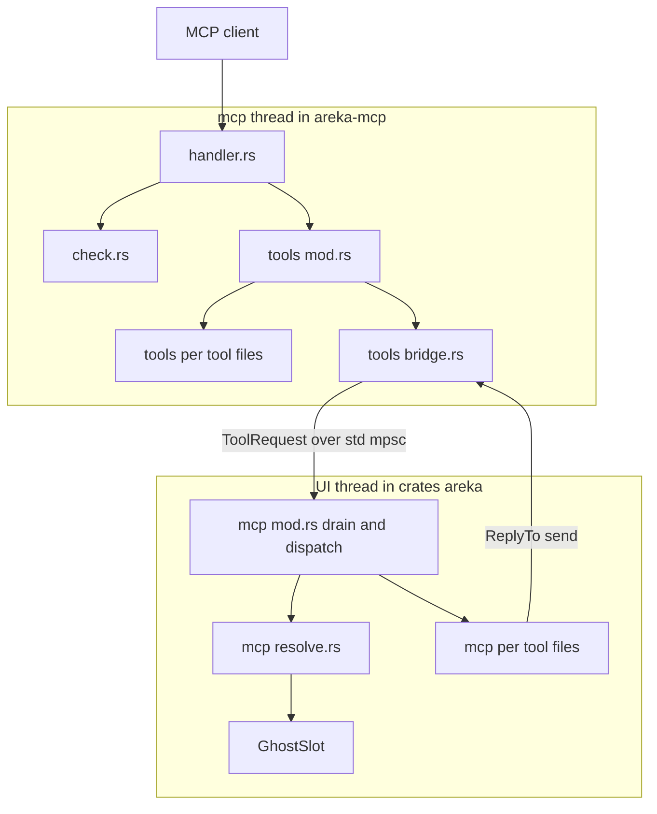
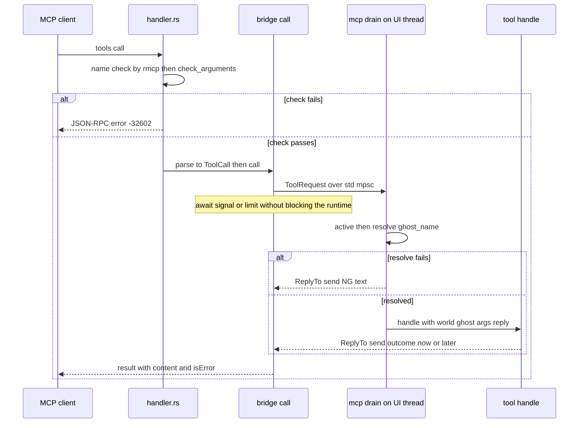

# Design Document: areka-P0-mcp-tool-entrances

> 2026-10-03・本ブランチ（main `d4f9e93d` の上）で実物を読んで書いた。コードは「何の定義か」（型名・関数名・定数名＋ファイル）で指す。調べた経過と捨てた案は `research.md` の「設計の段の記録」にある。本書だけで判断と契約が読めるように、結論はすべてここに書く。

## Overview

**Purpose**: `tools/list` が SSP 2.9.05 と同じ 10 本を同じ並びで返し、`tools/call` が「引数の検査 → アプリ本体へ届ける → `ghost_name` の解決 → ツールごとの処理 → 返事」の一本道を通るようにする。中身があるのは `get_active_ghost_list` だけで、残り 9 本は `NG:not implemented yet` を返す。

**Users**: AI エージェント（Claude Code など）でゴーストを作る人は、SSP と同じ名前と引数でツールを呼べる。3 段目の 7 spec（`mcp-get-property`・`mcp-kanade-tools`・`mcp-expression-table`・`mcp-log-history`・`mcp-reload`・`mcp-dump-images`・`mcp-strict-errors`）の実装者は、自分のツールのファイルだけを書き換えて中身を入れられる。

**Impact**: `areka-mcp` に公開モジュール `tools` が増え、`handler.rs` が引数の検査と登録順の一覧を持つ。`crates/areka` に新しいモジュール `mcp/` が増え、UI スレッドの World が毎フレーム MCP の要求を汲む。`Cargo.toml` は 1 行も変えない。

### Goals

- `tools/list` の応答が `doc/ssp-mcp/tools-list-ssp-2.9.05.json` と値として一致し、並びも同じ（1.1〜1.6）。
- 名前の誤り・必須の欄の欠落・型違いは JSON-RPC の `-32602`（2.1〜2.8）。
- `ghost_name` の解決と SSP と同じ失敗の文言（3.1〜3.9）、`get_active_ghost_list` の中身（4.1〜4.5）、9 本のダミー（5.1〜5.4）。
- MCP のスレッドも UI スレッドも塞がずに返事を待ち、上限と終了の途中を決まった文言で返す（6.1〜6.8）。
- 3 段目の各 spec が触るファイルを、ツールごとに重なり 0 で固定する（7.1〜7.6）。

### Non-Goals

- 9 本の中身と、値の範囲・列挙の検査（`log_type` の未知の値など）＝3 段目。
- kanade・sylphya・emo・tracing の履歴への新しい問い合わせ口＝3 段目。
- 複数ゴーストの同時起動、`strict` の働き、PNG から base64 への符号化（`mcp-dump-images`）。
- 待受・ポート・`Origin`／`Host`・help の振る舞い（`mcp-server-core` のまま）。
- tick の門（`AREKA_TICK_GATE=1`）を有効にしたときに MCP の要求で旗を立てること（wintf の旗の持ち主の一覧に響くので範囲の外。遅れは心拍の約 0.5 秒までで、10 秒の上限に収まる）。

## Boundary Commitments

### This Spec Owns

- 10 本のツール定義（SSP の逐語）と並び、定義から登録表を組む関数 `areka_mcp::tools::entrances`。
- 引数の検査（`crates/areka-mcp/src/check.rs`）と、`handler.rs` が検査の失敗を `-32602` にする道。
- 要求の種類の列挙 `ToolCall`（10 変種）と、各ツールの型の付いた引数 `Args`。
- 橋: `ToolRequest`・`ReplyTo`・`Pending`・待ちの上限・終了の途中の扱い・答えの `debug!`。
- 結果の 4 つの形を作る関数（`areka_mcp::tools::outcome`）。
- アプリ本体側の受け口（`McpInbox`）・汲む系・振り分け・後から答える置き場（`later`）・`ghost_name` の解決・`get_active_ghost_list` の処理・9 本のダミー。
- 3 段目の各 spec が触るファイルの表（本書「3 段目の spec が触るファイル」）と、roadmap の干渉台帳への転記。

### Out of Boundary

- 9 本のダミーの中身を本物に書き換えること（3 段目）。
- `get_log` の `ghost_name` の意味（`mcp-log-history`）。本 spec は型だけ検査して渡す。
- ゴーストの切替の経路・`GhostSession` の中身（読むだけ）。
- `Cargo.toml`（根・`crates/areka-mcp`・`crates/areka`）＝ 0 行。
- `exit_wait.rs`・`emo2_boot/`・wintf（触らない）。

### Allowed Dependencies

- 依存の向きは `areka` → `areka-mcp` → `areka-actor` だけ。`areka-mcp` は `crates/areka`・wintf・kanade・ghost を知らない。
- `areka-mcp` が使うのは、すでに `Cargo.toml` に書いてあるものだけ: rmcp `=3.5.0`・tokio（`rt`・`net`・`time`）・tokio-util（`CancellationToken`）・`serde_json`・`tracing`・`areka-actor`（`reply_channel`）。**tokio の `sync`（`oneshot`・`Notify`）は自分で宣言していないので使わない**。`spawn_blocking`・`multi_thread` も使わない（`tech.md` の取り決め）。
- `crates/areka` は `serde_json` を持たないので、アプリ本体側は JSON の値を扱わない。受け取るのは `areka_mcp::tools` の型（`String`・`i64`・`bool`・`Vec<String>` の欄）だけ。
- `areka-mcp` の公開面に rmcp・tokio・tokio-util・hyper の型を出さない（`ReplyTo`・`Pending` は中に `CancellationToken` を持つが、欄は非公開）。
- `areka-mcp` の本番のビルドはクレートの外のファイルを読まない。`doc/ssp-mcp/tools-list-ssp-2.9.05.json` を読むのはテストだけ。

### Revalidation Triggers

- `ToolCall` の変種・各 `Args` の欄・ツールの処理の関数の形（`handle` の引数）・`mcp::later` の形を変える → 3 段目の全 spec が照合し直す。
- `ReplyTo` が `Send` でなくなる → 返事を別スレッド（kanade など）から送る 3 段目の設計が崩れる。
- rmcp の版を上げる → `ToolRouter::call` が `Err` をどう扱うか（`failed to deserialize parameters:` の前置きの規則）と `list_all` の並びを確かめ直し、`tools_socket_tests.rs` と `doc/ssp-mcp/transport-diff-areka.md` を測り直す。
- tick の門を既定で有効にする（`tick-gate-adoption`）→ 汲む系の遅れが心拍まで伸びるので、送ったときに旗を立てるかを決め直す。
- `GhostSession::names`・`ghost_dir`・`runtime`、`GhostSlot` の形を変える → `mcp/resolve.rs` の `active` を直す。
- `fn main()` の起動と終了の順（`areka_mcp::start` → `WinApp` → `register_systems` → `run` → `begin_close`）を変える → `mcp::install`・`mcp::close` の位置を確かめ直す。

## Architecture

### Existing Architecture Analysis

実物を読んで確かめたこと（本設計の前提）:

- **登録口**（`crates/areka-mcp/src/registry.rs`）: `ToolHandler` は `Arc<dyn Fn(serde_json::Value) -> ToolFuture + Send + Sync>` で、返せるのは `ToolOutcome` だけ。`ToolRegistry::entries` は登録順の列。
- **写し**（`handler.rs` の `ArekaHandler::new`）: 登録表を `ToolRoute::new_dyn` で `ToolRouter` へ写す。写しの中の処理は `Result<CallToolResponse, ErrorData>` を返せる。
- **rmcp 3.5.0**（`src/handler/server/router/tool.rs`）: `ToolRouter::call` は未登録の名前を `ErrorData::invalid_params("tool not found", None)` にする。処理が `Err` を返すと `into_tool_argument_error` を通り、`-32602` かつ `message` が `failed to deserialize parameters:` で始まるときだけ `isError` の結果へ変える。それ以外の `Err` は JSON-RPC のエラーのまま。`ToolRouter::list_all` は `tools.sort_by(|a, b| a.name.cmp(&b.name))`＝名前の辞書順。
- **MCP のスレッド**（`server.rs` の `run`・`accept_loop`）: tokio の `current_thread` 1 本。接続ごとに `tokio::spawn`。処理が `.await` で待てば、他の接続は止まらない。
- **記録の捕捉**（`log-capture-kit` の `capture`）: 呼んだスレッドで出た記録だけを拾う。MCP のスレッドで出る記録は実ソケットのテストでは数えられない。
- **起動と終了の順**（`crates/areka/src/main.rs` の `fn main()`）: `areka_mcp::start` → `WinApp::with_exit_policy` → `ghost_session::register_systems` → … → `app.run()` → `exit_wait::begin_close` → `after_run` → 降ろす。`_mcp` は `app` の後に落ちる。`main.rs` は 954 行（上限 1,000 行）。
- **毎フレーム汲む定石**（`emo2_boot/ghost_switch.rs` の `ChangeRx`・`register_change_drain`・`drain_change_requests`）: 受け口を `insert_non_send` で置き、`Input` 段・`dispatch_pointer_events` の後の系が `try_iter` で全件取り出す。受け口が無ければ無操作。
- **ゴーストの置き場**（`ghost_session.rs`）: `GhostSlot(Option<GhostSession>)`。切替の途中は `ghost_switch.rs` の `take_down` が `slot.0.take()` し、次のゴーストが起きてから `insert_non_send(GhostSlot(Some(session)))` する＝その間は空。`GhostSession::runtime()` が `Some` のとき実行系が起きている（LogSink へ倒れた単位も `ghost: runtime` を持ちうる）。`GhostSession::for_test` は実行系を持たない。
- **ルートフォルダ**: 初回の起動は `main.rs` が `std::path::absolute` を通した `ghost_root`、切替は絶対化済みの根（`boot_config.rs`）から作った目録の `ghost.dir`。どちらも絶対パス。

### Architecture Pattern & Boundary Map



**Architecture Integration**:

- **選んだ形**: 「検査は定義から汎用に」「届けるのは std の mpsc を毎フレーム汲む」「待ちは合図（`CancellationToken`）＋既存の返事の器（`areka_actor::reply_channel`）」。どれも既存の定石の写しで、新しい仕組みは検査と橋の 2 つだけ。
- **境の分け方**: プロトコル側（JSON を知る・World を知らない）は `areka-mcp`、アプリ本体側（World を知る・JSON を知らない）は `crates/areka/src/mcp/`。両者をつなぐのは `ToolRequest` 1 つ。
- **ツールごとの分け方**: 両側とも「1 ツール 1 ファイル」。表・検査・解決・橋・列挙は共有ファイルに置き、本 spec で 10 本ぶん完成させる。3 段目は共有ファイルを触らない。
- **守る既存の形**: 系の登録は `ghost_session::register_systems` の 1 か所。tokio は MCP のスレッドに閉じる。テストは兄弟ファイル（`structure.md`）。
- **依存の向き**: `areka`（`mcp/`）→ `areka-mcp`（`tools` → `registry`、`handler` → `check`・`registry`）→ `areka-actor`。逆向きは無い。

### 設計の決定（`research.md` §6 の 12 項目への答え）

| # | 項目 | 決定 | 根拠（実物） |
|---|---|---|---|
| 1 | 無状態版の `-32602` の HTTP 状態 | テストで測って固定し、差の一覧に書く。見込みは **旧式の経路 200・無状態版の経路 400** | rmcp `src/transport/streamable_http_server/tower.rs` の `jsonrpc_http_status` が `INVALID_PARAMS` を `BAD_REQUEST` にする。旧式の 200 は既存の `unregistered_name_is_invalid_params` |
| 2 | `ghost_dir()` は絶対パスか・末尾の区切り | 絶対パス（上の分析）。念のため `resolve::active` が `std::path::absolute` を 1 度通す。一覧に出す形は**末尾の区切りなし**（`Path::display`）。照合は大文字小文字・区切り・末尾の区切りの差を同じとみなす | `main.rs` の `ghost_root`・`boot_config.rs` の根 |
| 3 | 待ちの形 | **合図＋返事の器**: `ReplyTo` が `areka_actor::ReplySender` と `CancellationToken` を持ち、送る（または落とす）と合図が立つ。待つ側は `tokio::time::timeout(上限, 合図.cancelled())` の後に `ReplyReceiver::try_recv` で結果を見分ける | 宣言済みの依存だけで足りる（tokio `time`・tokio-util）。`spawn_blocking` は `tech.md` が禁じる。`tokio::sync::oneshot` は `sync` を自分で宣言していない。短い間隔で覗く形は遅れと空回りが出る |
| 4・9 | 終了の途中 | `main.rs` の `app.run()` の直後・`exit_wait::begin_close` の前で `mcp::close(world)` を 1 行呼び、受け口を World から外す。溜まっていた要求は `ReplyTo` ごと落ちて即座に `NG:areka is shutting down`、以後の送りも即座に失敗する | `exit_wait.rs` は触らない |
| 5・12 | 端から端までの試験 | 区間で分ける。`areka-mcp` は実ソケットから橋の送り口まで（受け手はテストの偽物）、`crates/areka` は `ToolRequest` から汲む系・振り分け・ダミーまで（ソケット無し）。つなぎ目は `ToolRequest::new`（本番の橋も同じ関数で対を作る） | `crates/areka` は tokio を持たないので、登録した処理のフューチャ（中で `tokio::time::timeout` を使う）を回せない |
| 6・11 | 画像の形 | base64 済みの文字列を受ける（`outcome::with_image`）。符号化は `mcp-dump-images` が持つ | `ToolContent::Image` と同じ |
| 7 | tick の門 | 旗は立てない。門が有効でも心拍（`TICK_HEARTBEAT_FRAMES = 30`）で回る | wintf の旗の持ち主の一覧は範囲の外 |
| 8 | 検査の置き場 | `check.rs` の純粋な関数を、`handler.rs` の写しの中で呼ぶ（登録した `inputSchema` が検査の正本）。`ghost_name` の欠落は常に許す | `ToolHandler` の型と既存テストを変えずに済む |
| 10 | 上限 | 橋を組むときの引数 1 つ。本番は `tools::REPLY_WAIT`（10 秒）、テストは短い値 | 要件の暫定の裁定 15 |
| — | 定義を持つ場所 | 各ツールのファイルに Rust の生文字列 `DEFINITION`（保存した JSON のそのツールの 1 個ぶんを逐語で貼る）。並びは `tools/mod.rs` の表の並び | 要件 7.1（定義もツールごとのファイル）。写しの JSON ファイルを別に持たない |
| — | 一覧の並び | `ArekaHandler` が登録順の `Vec<Tool>` を別に持ち、`list_tools` はそれを返す（`ToolRouter::list_all` を使わない） | `list_all` は辞書順 |
| — | 処理が返事を持つ形 | アプリ本体側の処理は結果を戻り値で返さず、`ReplyTo` を受け取って送る | 3 段目の多くは別スレッドのアクター（kanade・SHIORI）に問うので、UI スレッドで待てない（6.6） |
| — | 後から答える置き場 | `mcp/mod.rs` に `later(world, reply, 覗く関数)` を持つ。積まれた組を汲む系が毎フレーム覗き、答えが出たら送って外す。`close` は置き場ごと落とす | kanade・sylphya の要求は `areka_actor::ReplySender<具体の型>` を受け（`crates/areka-kanade/src/msg.rs`）、`areka-mcp` を知らない＝アクターに `ReplyTo` は渡せない。処理は「`ReplyReceiver` を毎フレーム `try_recv` する」形になり、その系の登録先を共有ファイルの外に持てない。置き場を本 spec で持てば、3 段目は自分のファイルで `later` を呼ぶだけで済み、終了の途中も即座に答えられる。各ツールに空の `register` を 10 本置く案は、終了の途中の扱いが各ツールに散るので捨てた |

### Technology Stack

| Layer | Choice / Version | Role in Feature | Notes |
|-------|------------------|-----------------|-------|
| プロトコル | rmcp `=3.5.0`（既存） | `tools/list`・`tools/call`・未知の名前の `-32602` | `macros` 機能は切ったまま |
| 非同期 | tokio 1（`rt`・`net`・`time`）・tokio-util 0.7（既存） | 上限の時計（`time::timeout`）・返事の合図（`CancellationToken`） | 新しい機能の宣言 0 |
| 返事の器 | `areka-actor` の `reply_channel`（既存） | 返事 1 件・落とすと `Dropped` | |
| 届ける道 | `std::sync::mpsc`（標準） | MCP のスレッド → UI スレッド | `ChangeRx` と同じ形 |
| アプリ本体 | bevy_ecs・wintf の `Input` 段（既存） | 毎フレーム汲む系 | |

新しい依存は 0。

## File Structure Plan

### Directory Structure

```
crates/areka-mcp/src/
├── lib.rs                       # 変更: `mod check;` と `pub mod tools;` の 2 行
├── handler.rs                   # 変更: 検査の呼び出し・登録順の一覧・INSTRUCTIONS
├── check.rs                     # 新規: 引数の検査（inputSchema と arguments を受ける純粋な関数）
├── check_tests.rs               # 新規: 検査の決定論テスト（10 本の定義を使う）
└── tools/
    ├── mod.rs                   # 新規: 10 本の表（SSP の並び）・ToolCall・entrances・REPLY_WAIT
    ├── tools_tests.rs           # 新規: 定義の読み込み・引数の詰め替え（10 本）のテスト
    ├── tools_socket_tests.rs    # 新規: 実ソケットのテスト（一覧の一致・-32602・橋・待ちの間の ping）
    ├── bridge.rs                # 新規: ToolRequest・ReplyTo・Pending・Answer・call（送る・待つ・記録）
    ├── bridge_tests.rs          # 新規: 上限・終了の途中・記録の件数（テストのスレッドで回す）
    ├── outcome.rs               # 新規: 結果の 4 つの形
    ├── outcome_tests.rs         # 新規
    ├── get_active_ghost_list.rs # 新規: DEFINITION・parse
    ├── get_status.rs            # 新規: DEFINITION・Args・parse（以下 8 本も同じ形）
    ├── get_expression_table.rs
    ├── get_property.rs
    ├── get_log.rs
    ├── sakurascript.rs
    ├── raise_event.rs
    ├── reload.rs
    ├── dump_surface.rs
    └── dump_balloon.rs

crates/areka/src/
├── main.rs                      # 変更: `mod mcp;`・entrances・install・close（合わせて 12 行まで）
├── ghost_session.rs             # 変更: register_systems に `crate::mcp::register(world);` の 1 行
└── mcp/
    ├── mod.rs                   # 新規: McpInbox・install・register・close・drain・dispatch
    ├── mcp_tests.rs             # 新規: 汲む系・振り分け・準備の前・終了の途中
    ├── resolve.rs               # 新規: ActiveGhost・active（World から読む薄い配線）・resolve・listed_value
    ├── resolve_tests.rs         # 新規: 解決の判断（要件 3.9 の全場合）
    ├── get_active_ghost_list.rs # 新規: 本物の処理
    ├── get_active_ghost_list_tests.rs
    ├── get_status.rs            # 新規: ダミー（以下 8 本も同じ形）
    ├── get_status_tests.rs      # 新規: そのツールのダミーのテスト（以下 8 本も同じ形）
    ├── get_expression_table.rs / get_expression_table_tests.rs
    ├── get_property.rs / get_property_tests.rs
    ├── get_log.rs / get_log_tests.rs
    ├── sakurascript.rs / sakurascript_tests.rs
    ├── raise_event.rs / raise_event_tests.rs
    ├── reload.rs / reload_tests.rs
    ├── dump_surface.rs / dump_surface_tests.rs
    └── dump_balloon.rs / dump_balloon_tests.rs
```

テストは兄弟ファイルに置き、本番ファイルには `#[cfg(test)] #[path = "…"] mod …;` の接続だけを書く（`structure.md`）。ツールのテストの接続は**そのツールのファイル自身**に書く（`mod.rs` に書かない＝3 段目が `mod.rs` を触らずにテストを足し替えできる）。

### Modified Files

- `crates/areka-mcp/src/lib.rs` — `mod check;`・`pub mod tools;`。既存の `pub use` は変えない。
- `crates/areka-mcp/src/handler.rs` — ⑴ 写しの中で `check::check_arguments` を呼び、失敗を `ErrorData::invalid_params` にする。⑵ 登録順の `Vec<Tool>` を持ち `list_tools` で返す。⑶ `INSTRUCTIONS` の文を改める。
- `crates/areka/src/main.rs` — ⑴ `mod mcp;`、⑵ `areka_mcp::start` の前で `areka_mcp::tools::entrances(areka_mcp::tools::REPLY_WAIT)` を呼び、登録表を `start` へ渡す、⑶ `ghost_session::register_systems` の後で `mcp::install(world, 受け口)`、⑷ `app.run()` の直後・`exit_wait::begin_close` の前で `mcp::close(world)`。コメントを含めて 12 行まで（954 → 966 行以内）。
- `crates/areka/src/ghost_session.rs` — `register_systems` に `crate::mcp::register(world);` の 1 行（`crate::update::register(world);` の次）。
- `doc/ssp-mcp/transport-diff-areka.md` — 「未知のツール名・必須引数の欠落」の行を測り直して書き換える（8.3）。判定の数の行も合わせる。
- `.kiro/steering/roadmap.md` — 干渉台帳に「3 段目の spec が触るファイル」の表を転記し、C3 の照合の要点（⑥⑦⑧ の共有ファイル 0）を書く（7.3）。
- `.kiro/specs/areka-P0-mcp-tool-entrances/verification/signoff.md` — 新規。実機確認の結果（8.5）。

`registry.rs`・`server.rs`・`dispatch.rs`・`testkit.rs` と、`mcp-server-core` の既存テスト（`server_*_tests.rs`・`gate_tests.rs`・`port_tests.rs`・`registry_tests.rs`・`help_tests.rs`）は **0 行**変える（8.2）。

### 3 段目の spec が触るファイル（roadmap の干渉台帳へ転記する表）

| spec | アプリ本体側（`crates/areka/src/mcp/`） | プロトコル側（`crates/areka-mcp/src/tools/`・要るときだけ） | 自分のエンジン |
|---|---|---|---|
| `mcp-get-property` | `get_property.rs`・`get_property_tests.rs` | `get_property.rs` | sylphya・`areka-ghost` の実行系 |
| `mcp-expression-table` | `get_expression_table.rs`・`get_expression_table_tests.rs` | `get_expression_table.rs` | 表情の表（シェルの定義） |
| `mcp-log-history` | `get_log.rs`・`get_log_tests.rs` | `get_log.rs` | tracing の履歴 |
| `mcp-kanade-tools` | `get_status.rs`・`sakurascript.rs`・`raise_event.rs` と各 `_tests.rs` | 同名の 3 ファイル | kanade |
| `mcp-reload` | `reload.rs`・`reload_tests.rs` | `reload.rs` | 読み直しの経路 |
| `mcp-dump-images` | `dump_surface.rs`・`dump_balloon.rs` と各 `_tests.rs` | 同名の 2 ファイル | emo の読み戻し・base64 の符号化 |
| `mcp-strict-errors` | `sakurascript.rs`・`raise_event.rs` と各 `_tests.rs` | 同名の 2 ファイル | エラーログ（`mcp-kanade-tools`・`mcp-log-history` の後＝直列） |

- **後から答えるツール**（kanade・SHIORI・sylphya に問うもの）は、自分のファイルから `mcp::later` を呼ぶ。毎フレーム覗く系を自分で登録しない＝`mcp/mod.rs`・`ghost_session.rs` を触らない。
- **3 段目が触らない共有ファイル**: `areka-mcp` の `handler.rs`・`registry.rs`・`check.rs`・`tools/mod.rs`・`tools/bridge.rs`・`tools/outcome.rs` と各テスト、`crates/areka` の `mcp/mod.rs`・`mcp/resolve.rs` と各テスト、`main.rs`・`ghost_session.rs`。触る要が出たら、その spec の要件に理由を書く。
- **C3 の照合の要点**: `mcp-get-property`・`mcp-expression-table`・`mcp-log-history` の 3 本は、上の表でファイルの重なりが 0。重なりうるのは「自分のエンジン」の側だけ（例: `mcp-get-property` と `property-query-channels`）。
- プロトコル側のファイルは定義と引数の型を本 spec で完成させるので、3 段目は多くの場合アプリ本体側だけを触れば足りる。値の範囲や列挙の検査（`NG:Unknown …`）は、アプリ本体側の処理が結果として返す。

## System Flows



- **上限**: 合図が上限のうちに立たなければ、橋が `NG:areka did not respond within 10 seconds` を返し、`Pending` を落とす。後から `ReplyTo::send` が呼ばれても受け手が無いので捨てられる（応答は 1 度だけ）。
- **終了の途中**: 受け口が落ちていれば `Sender::send` が失敗し、要求が答えられずに落ちれば `ReplyTo` の `Drop` が合図を立てて `try_recv` が `Dropped` を返す。どちらも上限を待たずに `NG:areka is shutting down`。
- **準備の前**: 受け口（`Receiver<ToolRequest>`）は `fn main()` が `mcp::install` まで持っている。その間に届いた要求は std の mpsc に溜まり、置いた後の最初のフレームで汲まれる。
- **ゴーストの読み取り**: 要求 1 件ごとに、振り分けの直前に `resolve::active(world)` で読み直す（前の要求の処理が状態を変えても古い値を使わない）。

## Requirements Traceability

| Requirement | Summary | Components | Interfaces | Flows |
|-------------|---------|------------|------------|-------|
| 1.1 | 10 本を返す | tools/mod.rs・各ツールのファイル | `entrances`・`DEFINITION` | — |
| 1.2 | 4 つの欄が保存した JSON と一致 | 各ツールのファイル | `DEFINITION`（逐語） | — |
| 1.3 | SSP の並び | tools/mod.rs・handler.rs | 表の並び・`ArekaHandler` の登録順の一覧 | — |
| 1.4 | 4 つ以外の欄を付けない | handler.rs | `Tool::new_with_raw`＋`title`（既存の写し方のまま） | — |
| 1.5 | 無状態版でも同じ中身と並び | handler.rs | `list_tools`（`ttlMs`・`cacheScope` を足す既存の分岐） | — |
| 1.6 | 保存した JSON との一致のテスト | tools_socket_tests.rs | `tools_list_matches_saved_ssp_json`（旧式・無状態版の両方） | — |
| 2.1 | 未知の名前は `-32602` | rmcp の `ToolRouter::call` | — | 検査の失敗の枝 |
| 2.2 | 必須の欄の欠落は `-32602` | check.rs・handler.rs | `check_arguments` | 同上 |
| 2.3 | `ghost_name` の欠落は検査で拒まない | check.rs | `check_arguments`（`ghost_name` は常に欠落を許す） | — |
| 2.4 | 型違いは `-32602`・`null` は省略 | check.rs | `check_arguments`・`as_integer` | 同上 |
| 2.5 | 余計な欄は無視 | check.rs | `check_arguments`（`properties` に無い欄を見ない） | — |
| 2.6 | `arguments` が無ければ空 | handler.rs | 既存の `ctx.arguments.unwrap_or_default()` | — |
| 2.7 | 名前 → 必須 → 型の順・`message`・HTTP の状態 | handler.rs・check.rs | `check_arguments` の順・`ErrorData::invalid_params` | — |
| 2.8 | 検査のテスト | check_tests.rs・tools_socket_tests.rs | — | — |
| 3.1 | 8 本は解決してから処理へ | mcp/mod.rs | `dispatch` | 解決の枝 |
| 3.2 | `name` と完全一致 | mcp/resolve.rs | `resolve` | — |
| 3.3 | ルートフォルダのフルパスと一致 | mcp/resolve.rs | `resolve`・`same_path` | — |
| 3.4 | `get_expression_table` の省略・空は `NG:` | mcp/mod.rs・resolve.rs | `Omitted::Reject` | — |
| 3.5 | 任意の 7 本の省略・空は起動中の 1 体 | mcp/mod.rs・resolve.rs | `Omitted::UseActive` | — |
| 3.6 | 一致しなければ `NG:Cannot find …` | mcp/resolve.rs | `resolve` | — |
| 3.7 | `get_log` は解決しない | mcp/mod.rs | `dispatch`（`GetLog` の腕は解決を通らない） | — |
| 3.8 | 「起動中」＝実行系が起きている | mcp/resolve.rs | `active`（`GhostSession::runtime().is_some()`） | — |
| 3.9 | 解決の判断を純粋に持ちテストで固定 | resolve.rs・resolve_tests.rs | `resolve` | — |
| 4.1 | `name` を素の値で返す | mcp/get_active_ghost_list.rs | `handle`・`outcome::value` | — |
| 4.2 | `name` が無ければフルパス | mcp/resolve.rs | `listed_value` | — |
| 4.3 | 0 体なら空の本文 | mcp/get_active_ghost_list.rs | `handle` | — |
| 4.4 | 一覧の値で同じゴーストへ解決 | mcp/resolve.rs | `listed_value` と `resolve` が同じ `ActiveGhost` を見る | — |
| 4.5 | 一覧のテスト | get_active_ghost_list_tests.rs・resolve_tests.rs | — | — |
| 5.1 | 9 本は `NG:not implemented yet` | mcp の 9 つのツールのファイル | `handle` | 解決済みの枝 |
| 5.2 | ダミーは何もさせない | 同上 | `handle` の本体は `reply.send(…)` の 1 文 | — |
| 5.3 | 型の付いた引数と解決したゴーストを渡す | tools の各ファイル・mcp/mod.rs | `Args`・`handle(world, ghost, args, reply)` | — |
| 5.4 | 9 本のテスト（区間ごと） | tools_socket_tests.rs・mcp の各 `_tests.rs` | `ToolRequest::new` | — |
| 6.1 | アプリ本体へ届けて返事で答える | bridge.rs・mcp/mod.rs | `call`・`drain` | 全体 |
| 6.2 | 10 秒で `NG:`・`warn!` 1 件・遅れた返事は捨てる | bridge.rs | `Pending::wait`・`timeout_text`・`REPLY_WAIT` | 上限 |
| 6.3 | 待ちの間も他の要求に答える | bridge.rs | `Pending::wait`（`.await`） | — |
| 6.4 | 終了の途中は待たずに `NG:`・`warn!` 1 件 | bridge.rs・mcp/mod.rs・main.rs | `ReplyTo` の `Drop`・`mcp::close`（受け口と `later` の置き場を落とす） | 終了の途中 |
| 6.5 | 準備の前の要求は準備の後に答える | tools/mod.rs・main.rs・mcp/mod.rs | `entrances` の受け口・`mcp::install` | 準備の前 |
| 6.6 | UI スレッドで待たない | mcp/mod.rs・各 `handle` | `drain`（`try_iter`）・`later`（毎フレーム覗く） | — |
| 6.7 | 答えるとき `debug!` 1 件 | bridge.rs | `call`（`tool`・`ghost`・`is_error`・`text`） | — |
| 6.8 | 6.2〜6.5 のテスト | bridge_tests.rs・tools_socket_tests.rs・mcp_tests.rs | 上限を引数にする | — |
| 7.1 | ツールごとのファイル・共有は本 spec で揃える | File Structure Plan | — | — |
| 7.2 | 結果の 4 つの形 | tools/outcome.rs | `value`・`ok`・`ng`・`with_image` | — |
| 7.3 | 3 段目の触るファイルを固定し台帳へ | 本書の表・roadmap.md | — | — |
| 7.4 | 触るファイルを限る | File Structure Plan | — | — |
| 7.5 | `Cargo.toml` は 0 行 | Allowed Dependencies | — | — |
| 7.6 | 本番はクレートの外を読まない | 各ツールのファイル | `DEFINITION`（生文字列） | — |
| 8.1 | テストはループバックと空きポートだけ | tools_socket_tests.rs | `testkit::serve`（候補 `&[0]`） | — |
| 8.2 | `mcp-server-core` のテストを変えない | handler.rs・check.rs | `ToolHandler`・`ToolSpec`・`ToolOutcome` の型は不変 | — |
| 8.3 | 差の一覧の行を測り直す | transport-diff-areka.md | — | — |
| 8.4 | `instructions` を改める | handler.rs | `INSTRUCTIONS` | — |
| 8.5 | 実機確認 | verification/signoff.md | — | — |

## Components and Interfaces

| Component | Layer | Intent | Req Coverage | Key Dependencies | Contracts |
|-----------|-------|--------|--------------|------------------|-----------|
| `check.rs` | areka-mcp | inputSchema に照らして引数を検査する | 2.2〜2.5・2.7 | serde_json (P0) | Service |
| `handler.rs`（変更） | areka-mcp | 検査の失敗を `-32602` に・一覧を登録順に・`instructions` | 1.3〜1.5・2.1・2.6・2.7・8.4 | rmcp (P0)・check (P0) | Service |
| `tools/mod.rs` | areka-mcp | 10 本の表・`ToolCall`・登録表を組む | 1.1・1.3・5.3・6.5・7.1 | registry (P0)・bridge (P0) | Service |
| `tools/<ツール>.rs` ×10 | areka-mcp | 定義の逐語・型の付いた引数・詰め替え | 1.2・5.3・7.1・7.6 | serde_json (P0) | Service |
| `tools/bridge.rs` | areka-mcp | 届ける・待つ・上限・終了の途中・記録 | 6.1〜6.4・6.7 | tokio time・tokio-util・areka-actor (P0) | Service・State |
| `tools/outcome.rs` | areka-mcp | 結果の 4 つの形 | 7.2 | registry (P0) | Service |
| `mcp/mod.rs` | crates/areka | 受け口・汲む系・振り分け・閉じる | 3.1・3.4・3.5・3.7・6.1・6.4〜6.6 | areka-mcp (P0)・bevy_ecs・wintf (P0) | Service・State |
| `mcp/resolve.rs` | crates/areka | 起動中のゴーストの読み取りと名前の解決 | 3.2〜3.6・3.8・3.9・4.2・4.4 | `GhostSlot` (P0) | Service |
| `mcp/<ツール>.rs` ×10 | crates/areka | ツールごとの処理（1 本は本物・9 本はダミー） | 4.1・4.3・5.1・5.2 | areka-mcp (P0) | Service |

### areka-mcp（プロトコル側）

#### check.rs

| Field | Detail |
|-------|--------|
| Intent | 登録した `inputSchema` を正本に、`arguments` の必須の欄と型を検査する |
| Requirements | 2.2, 2.3, 2.4, 2.5, 2.7 |

**Contracts**: Service [x]

```rust
/// 必須の欄 → 型 の順に調べ、最初に見つけた誤りの理由（英文）を返す。
pub(crate) fn check_arguments(
    schema: &serde_json::Map<String, serde_json::Value>,
    args: &serde_json::Map<String, serde_json::Value>,
) -> Result<(), String>;

/// "integer" の欄の読み方（検査と各ツールの詰め替えが同じ関数を使う）。
pub(crate) fn as_integer(value: &serde_json::Value) -> Option<i64>;
```

- **必須の欄**: `schema["required"]` の各名前について、`args` に無い・値が `null` なら `Err`。ただし名前が `ghost_name` のときは調べない（2.3。10 本のうち `ghost_name` を `required` に持つのは `get_expression_table` だけで、名前での分岐は要らない）。
- **型**: `schema["properties"]` の各欄について、`args` に `null` でない値があるときだけ調べる。`"string"`＝文字列、`"boolean"`＝真偽、`"integer"`＝`as_integer` が `Some`、`"array"`＝配列で、`items.type` があれば各要素を同じ規則で調べる（`references` は文字列の配列）。それ以外の `type`（10 本には現れない）は調べない。
- **`as_integer`**: `Value::as_i64` が取れればその値。取れないとき、小数部が 0 で絶対値が 2^53 以下の数（`1.0` など）は整数として受ける。`1.5`・`i64` に収まらない数・数でない値は `None`。
- **見ないもの**: `properties` に無い欄（2.5）。値の範囲・列挙（3 段目）。
- **理由の文**: `missing required argument: <名前>`／`argument <名前> must be <型>`。`failed to deserialize parameters:` で始めない（始めると rmcp が `isError` の結果へ変える）。
- 登録したどのツールにも効く。既存テストの `echo_args`（`text` が必須の文字列。`n`・`fail` は `properties` に無い）はそのまま通る。

#### handler.rs（変更）

| Field | Detail |
|-------|--------|
| Intent | 検査の失敗を JSON-RPC のエラーにし、一覧を登録順で返す |
| Requirements | 1.3, 1.4, 1.5, 2.1, 2.6, 2.7, 8.4 |

- `ArekaHandler` に `tools: Arc<Vec<Tool>>`（登録順）を足す。`ArekaHandler::new` が `ToolRouter` へ写すのと同じ `Tool` を順に積む。`list_tools` は `self.router.list_all()` の代わりに `self.tools` の写しを返す（`ttlMs`・`cacheScope` の分岐はそのまま）。`get_tool`・`call_tool` は `ToolRouter` のまま。
- 写しの中の処理: `ctx.arguments.unwrap_or_default()` を `check_arguments(&spec.input_schema, &args)` に通し、`Err(reason)` なら `debug!`（`tool`・`reason`）を 1 件残して `Err(ErrorData::invalid_params(reason, None))` を返す。通れば今までどおり登録した処理を呼ぶ。
- `INSTRUCTIONS`（英文 3 文）: `This server controls areka, a desktop mascot (Ukagaka-compatible baseware) running on this machine. It exposes the same tools as the MCP server of SSP; call get_active_ghost_list first to get the ghost name for the ghost_name parameter. A tool that is not implemented yet returns a result starting with "NG:not implemented yet".`（既存テストは「空でない」と「定数と一致」だけを見るので変えずに通る。）

#### tools/mod.rs

| Field | Detail |
|-------|--------|
| Intent | 10 本を SSP の並びで束ね、登録表と受け口を組む |
| Requirements | 1.1, 1.3, 5.3, 6.5, 7.1 |

**Contracts**: Service [x]

```rust
/// 返事を待つ上限（本番の値）。
pub const REPLY_WAIT: std::time::Duration = std::time::Duration::from_secs(10);

/// 検査を通った呼び出し 1 件（型の付いた引数つき）。
#[derive(Debug, Clone, PartialEq, Eq)]
pub enum ToolCall {
    GetActiveGhostList,
    GetStatus(get_status::Args),
    GetExpressionTable(get_expression_table::Args),
    GetProperty(get_property::Args),
    GetLog(get_log::Args),
    Sakurascript(sakurascript::Args),
    RaiseEvent(raise_event::Args),
    Reload(reload::Args),
    DumpSurface(dump_surface::Args),
    DumpBalloon(dump_balloon::Args),
}

impl ToolCall {
    /// ツール名（記録に載せる）。
    pub fn name(&self) -> &'static str;
}

/// 10 本の登録表と、アプリ本体が汲む受け口を組む。
pub fn entrances(
    reply_wait: std::time::Duration,
) -> (crate::ToolRegistry, std::sync::mpsc::Receiver<ToolRequest>);
```

- 中に 10 行の表（`[(定義の文字列, 詰め替えの関数); 10]`）を SSP の並びで持つ。並びの正本はこの表。
- `entrances` は表の各行について、`DEFINITION` を `serde_json` で読んで `ToolSpec` にし、「`parse(args)` → `bridge::call(送り口, 呼び出し, reply_wait)`」を処理として登録する。`DEFINITION` が読めない行は `error!` を 1 件残して登録しない（テスト 1.6 が 10 本の一致を見るので、本番では起きない）。
- 公開するのは `tools` モジュールの下だけ（`areka_mcp::tools::…`）。既存の `lib.rs` の `pub use` は増やさない。

#### tools/<ツール>.rs（10 本）

| Field | Detail |
|-------|--------|
| Intent | そのツールの定義の逐語と、型の付いた引数 |
| Requirements | 1.2, 5.3, 7.1, 7.6 |

各ファイルは同じ形:

```rust
/// 保存した JSON（doc/ssp-mcp/tools-list-ssp-2.9.05.json）のこのツールの 1 個ぶんを逐語で貼る。
pub(super) const DEFINITION: &str = r#"{ "name": "...", "title": "...", "description": "...", "inputSchema": { ... } }"#;

#[derive(Debug, Clone, PartialEq, Eq)]
pub struct Args { /* 下の表 */ }

/// 検査を通った arguments を型の付いた引数へ詰め替える（検査の後なので失敗しない）。
pub(super) fn parse(args: &serde_json::Map<String, serde_json::Value>) -> super::ToolCall;
```

| ツール | `Args` の欄（すべて `pub`） |
|---|---|
| `get_active_ghost_list` | （`Args` なし） |
| `get_status` | `ghost_name: Option<String>` |
| `get_expression_table` | `ghost_name: Option<String>` |
| `get_property` | `property_name: String`・`ghost_name: Option<String>` |
| `get_log` | `log_type: Option<String>`・`ghost_name: Option<String>`・`since_id: Option<i64>`・`max_count: Option<i64>` |
| `sakurascript` | `script: String`・`ghost_name: Option<String>`・`strict: Option<bool>` |
| `raise_event` | `event: String`・`references: Vec<String>`・`ghost_name: Option<String>`・`strict: Option<bool>` |
| `reload` | `target: String`・`ghost_name: Option<String>` |
| `dump_surface` | `scope: Option<i64>`・`surface: Option<i64>`・`ghost_name: Option<String>` |
| `dump_balloon` | `scope: Option<i64>`・`ghost_name: Option<String>` |

- 省略と `null` は `None`（`references` は空の列）。`ghost_name` の空の文字列は**そのまま渡し**、省略と同じに扱うのは `resolve` の側（`get_log` には空のまま届く）。
- 必須の欄（`String`）は検査が在ることを保証する。検査を通らずに `parse` が呼ばれることは無い（`handler.rs` の写しが唯一の入口）。

#### tools/bridge.rs

| Field | Detail |
|-------|--------|
| Intent | 要求をアプリ本体へ送り、MCP のスレッドを塞がずに返事を待つ |
| Requirements | 6.1, 6.2, 6.3, 6.4, 6.7 |

**Contracts**: Service [x] / State [x]

```rust
/// アプリ本体へ届ける 1 件。
pub struct ToolRequest {
    pub call: ToolCall,
    pub reply: ReplyTo,
}

impl ToolRequest {
    /// 要求と、その返事を受ける側の対を作る（橋もテストもこの 1 つの関数で作る）。
    pub fn new(call: ToolCall) -> (ToolRequest, Pending);
}

/// 返事の送り手（Send。後から・別スレッドから送れる。送らずに落とすと「答えずに手放した」になる）。
pub struct ReplyTo { /* 欄は非公開 */ }

impl ReplyTo {
    /// 解決したゴーストの名前（一覧に出す値）を記録用に添える。
    pub fn for_ghost(self, label: impl Into<String>) -> Self;
    /// 返事を 1 回だけ送る。受け手がもう居なければ（上限の後）黙って捨てる。
    pub fn send(self, outcome: crate::ToolOutcome);
    /// 待つ側がもう居ない（上限を過ぎて `Pending` が落ちた）なら true。
    pub fn is_abandoned(&self) -> bool;
}

/// 返事 1 件。
#[derive(Debug, Clone, PartialEq, Eq)]
pub struct Answer {
    pub ghost: String,
    pub outcome: crate::ToolOutcome,
}

/// 返事を受ける側。
pub struct Pending { /* 欄は非公開 */ }

impl Pending {
    /// 待たずに覗く（アプリ本体側のテストが使う）。
    pub fn try_answer(&self) -> Result<Option<Answer>, areka_actor::ReplyError>;
}

/// 上限の文言（本番の 10 秒で "areka did not respond within 10 seconds"）。
pub(crate) fn timeout_text(limit: std::time::Duration) -> String;

/// 送って待つ（登録表の処理の中身）。
pub(crate) async fn call(
    tx: std::sync::mpsc::Sender<ToolRequest>,
    call: ToolCall,
    limit: std::time::Duration,
) -> crate::ToolOutcome;
```

**State（`ReplyTo` と `Pending` の対）**

- `ReplyTo` は `areka_actor::ReplySender<Answer>`（`Option`）・`CancellationToken`・`ghost: String` を持つ。`Pending` は `ReplyReceiver<Answer>` と同じ `CancellationToken` の写しを持つ。
- `ReplyTo::send` は送り手を取り出して送る。`ReplyTo` の `Drop` は「**送り手を先に落としてから**合図を立てる」（順を逆にすると、待つ側が合図で起きたとき送り手がまだ生きていて、答えずに落ちたのか未着なのか見分けられない）。合図を立てるのは `Drop` の 1 か所だけ（`send` の後も `Drop` を通る）。
- 逆向きの合図も 1 つ持つ: `Pending` の `Drop` が 2 つ目の `CancellationToken` を立て、`ReplyTo::is_abandoned` がそれを読む。後から答える置き場（`mcp::later`）が、上限を過ぎた組を捨てるのに使う。
- 待つ側（`call` の中）: `tokio::time::timeout(limit, 合図.cancelled()).await` の後、`try_recv` で 3 つに分ける。

| `try_recv` の結果 | 意味 | 返す結果 | 記録 |
|---|---|---|---|
| `Ok(Some(answer))` | 返事が来た | `answer.outcome` | — |
| `Ok(None)` | 上限を過ぎた | `outcome::ng(timeout_text(limit))` | `warn!` 1 件（`tool`・`limit_ms`） |
| `Err(Dropped)` | 答えずに手放された | `outcome::ng("areka is shutting down")` | `warn!` 1 件（`tool`） |

- 送り口の `Sender::send` が失敗した（受け口が落ちている）ときは待たずに 3 行目と同じ。
- どの枝でも最後に `debug!` を 1 件（`tool`・`ghost`〔解決したゴーストの名前。解決しなかったら空〕・`is_error`・`text`〔`is_error` のときの本文＝失敗の文言〕）。記録は MCP のスレッドで出る（6.7）。
- `call` のフューチャは `Send`（`ToolFuture` の約束）。待ちは `.await` なので、`current_thread` の他のタスク（別の接続）は進む（6.3）。

**Implementation Notes**
- Validation: 記録の件数は実ソケットでは数えられない（MCP のスレッドで出る）。`bridge_tests.rs` はテストのスレッドで `tokio::runtime::Builder::new_current_thread().enable_time()` を作り、`capture(|| runtime.block_on(call(…)))` で数える。
- Integration: 待つあいだ `Pending` 全体への参照を `.await` をまたいで持たない（中の `Receiver` は `Sync` でないので、フューチャが `Send` でなくなる）。合図の写しを先に取り出して待つ。登録する処理が握る `Sender<ToolRequest>` は `Send + Sync`（`ToolHandler` の約束を満たす）。
- Risks: 処理が `ReplyTo` を送らずに持ち続けると上限まで待つ（上限で必ず返る）。`mcp::later` を通せば、終了の途中は置き場ごと落ちて即座に返る。処理が誤って落とすと「shutting down」と答える（文言は紛らわしいが、応答は必ず返る）。

#### tools/outcome.rs

| Field | Detail |
|-------|--------|
| Intent | 結果の 4 つの形を作る |
| Requirements | 7.2 |

```rust
/// ⑴ 素の値（OK: なし・isError: false）。
pub fn value(text: impl Into<String>) -> crate::ToolOutcome;
/// ⑵ 成功。付言が空なら本文 "OK"、あれば "OK:<付言>"（isError: false）。
pub fn ok(note: &str) -> crate::ToolOutcome;
/// ⑶ 失敗。本文 "NG:<理由>"（isError: true）。
pub fn ng(reason: impl AsRef<str>) -> crate::ToolOutcome;
/// ⑷ 本文の後に画像（base64 済みの PNG・mimeType "image/png"）を 1 枚足す。
pub fn with_image(outcome: crate::ToolOutcome, png_base64: String) -> crate::ToolOutcome;
```

`ok("")` が `OK`（コロンなし）になるのは、SSP の `sakurascript` の成功の本文が `OK` だから（`doc/ssp-mcp/survey.md` §3）。

### crates/areka（アプリ本体側）

#### mcp/mod.rs

| Field | Detail |
|-------|--------|
| Intent | 受け口を World に置き、毎フレーム汲んでツールの処理へ振り分ける |
| Requirements | 3.1, 3.4, 3.5, 3.7, 6.1, 6.4, 6.5, 6.6 |

**Contracts**: Service [x] / State [x]

```rust
/// MCP の要求の受け口（World の NonSend・プロセスに 1 つ）。
pub(crate) struct McpInbox(std::sync::mpsc::Receiver<areka_mcp::tools::ToolRequest>);

/// 受け口を World に置く（`fn main()` が `register_systems` の後に 1 度呼ぶ）。
pub(crate) fn install(world: &mut World, inbox: std::sync::mpsc::Receiver<areka_mcp::tools::ToolRequest>);
/// 汲む系を Input 段（`dispatch_pointer_events` の後）へ登録する（`ghost_session::register_systems` から）。
pub(crate) fn register(world: &mut World);
/// 終了を始めた所で受け口を外す（溜まった要求と以後の要求は "shutting down" になる）。
pub(crate) fn close(world: &mut World);

/// 溜まった要求を全件取り出して振り分ける（受け口が無ければ無操作）。
pub(crate) fn drain(world: &mut World);
/// 1 件を振り分ける（テストは起動中のゴーストを作って直に呼ぶ）。
pub(crate) fn dispatch(world: &mut World, active: Option<&ActiveGhost>, request: areka_mcp::tools::ToolRequest);

/// その場で答えられない処理が、返事と「覗く関数」を預ける。
/// 覗く関数は毎フレーム呼ばれ、`Some` を返したらその結果が送られて組は外れる。
pub(crate) fn later(
    world: &mut World,
    reply: areka_mcp::tools::ReplyTo,
    poll: impl FnMut(&mut World) -> Option<areka_mcp::ToolOutcome> + 'static,
);
```

- `drain`: 受け口を借りて `try_iter().collect()` し、借用を切ってから 1 件ずつ「`resolve::active(world)` → `dispatch`」。**その後で**預かった組を全件覗く（同じフレームに預けた組も 1 度覗く＝すでに答えが出ていれば遅れ 0）。UI スレッドで待つ所は無い（6.6）。
- 後から答える置き場: World の NonSend 資源 `McpLater(Vec<(覗く関数, ReplyTo)>)`。`install` が受け口と一緒に置く。覗くときは列を `std::mem::take` で World から取り出して回し（覗く関数が World を借りられる・覗く中で `later` が呼ばれても壊れない）、残った組を戻す。`ReplyTo::is_abandoned` が真の組（上限を過ぎた）は覗かずに捨てる。置き場が無いとき（`close` の後・`install` の前）の `later` は組をその場で落とす＝「shutting down」と答える。
- 覗く関数の約束: 問い合わせ先が落ちていたら（`try_recv` が `Err(Dropped)`）`Some(outcome::ng(…))` を返す。`None` を返し続ける道を作らない。
- `dispatch` の振り分け（この `match` が、ツールごとの `ghost_name` の扱いの正本）:

| `ToolCall` | `ghost_name` の扱い | 呼ぶ処理 |
|---|---|---|
| `GetActiveGhostList` | 無し | `get_active_ghost_list::handle(active, reply)` |
| `GetExpressionTable` | `Omitted::Reject` で解決 | `handle(world, ghost, args, reply)` |
| `GetStatus`・`GetProperty`・`Sakurascript`・`RaiseEvent`・`Reload`・`DumpSurface`・`DumpBalloon` | `Omitted::UseActive` で解決 | `handle(world, ghost, args, reply)` |
| `GetLog` | 解決しない（3.7） | `get_log::handle(world, args, reply)` |

- 解決に失敗したら `reply.send(outcome::ng(理由))` で終え、処理を呼ばない。成功したら `reply.for_ghost(listed_value(ghost))` を付けて処理へ渡す。
- `close` は `world.remove_non_send::<McpInbox>()` と `world.remove_non_send::<McpLater>()`。預かっていた組の `ReplyTo` も落ちるので、後から答える途中だった要求も上限を待たずに「shutting down」になる。受け口が落ちると、溜まっていた `ToolRequest` の `ReplyTo` が落ち、MCP 側の送り口は以後 `send` に失敗する（6.4）。

#### mcp/resolve.rs

| Field | Detail |
|-------|--------|
| Intent | 起動中のゴーストを読み、`ghost_name` を解決する |
| Requirements | 3.2, 3.3, 3.4, 3.5, 3.6, 3.8, 3.9, 4.2, 4.4 |

```rust
/// 起動中のゴースト 1 体（World も実行系も持たない値）。
#[derive(Debug, Clone, PartialEq, Eq)]
pub(crate) struct ActiveGhost {
    /// descript の `name`（無い・空なら None）。
    pub name: Option<String>,
    /// ルートフォルダ（`ghost/<フォルダ名>`）の絶対パス。
    pub root: std::path::PathBuf,
}

/// `ghost_name` が無い・空のときの扱い。
#[derive(Debug, Clone, Copy, PartialEq, Eq)]
pub(crate) enum Omitted {
    /// 起動中の 1 体へ解決する。
    UseActive,
    /// `NG:Specified ghost is not active`。
    Reject,
}

pub(crate) const NOT_ACTIVE: &str = "Specified ghost is not active";
pub(crate) const CANNOT_FIND: &str = "Cannot find active ghost from specified name";

/// World から起動中のゴーストを読む（置き場が空・実行系が無ければ None）。
pub(crate) fn active(world: &World) -> Option<ActiveGhost>;
/// 解決の判断（純粋）。失敗は `NG:` の後ろに付ける理由。
pub(crate) fn resolve<'a>(
    active: Option<&'a ActiveGhost>,
    ghost_name: Option<&str>,
    omitted: Omitted,
) -> Result<&'a ActiveGhost, &'static str>;
/// 一覧に出す値（`name`、無ければルートフォルダのフルパス）。
pub(crate) fn listed_value(ghost: &ActiveGhost) -> String;
```

- `active`: `GhostSlot` の中身が `Some` で `GhostSession::runtime()` が `Some` のときだけ `Some`（3.8。LogSink へ倒れた単位も実行系があれば数える。切替の途中は置き場が空）。`name` は `names()` の `name`、`root` は `ghost_dir()` を `std::path::absolute` に 1 度通した値。
- `resolve`: `ghost_name` が無い・空 → `Reject` なら `Err(NOT_ACTIVE)`、`UseActive` なら `active.ok_or(NOT_ACTIVE)`。空でない → `name` と完全一致、または `same_path`（両方を小文字にし、`/` を `\` に揃え、末尾の区切りを落として比べる）が真なら `Ok`、どちらでもなければ（0 体を含む）`Err(CANNOT_FIND)`。渡された文字列は絶対化しない（相対パス・フォルダ名だけは一致しない）。`sakura_name`・`kero_name` は見ない。
- `listed_value` と `resolve` は同じ `ActiveGhost` を見るので、一覧に出した値は必ず同じゴーストへ解決される（4.4）。

#### mcp/<ツール>.rs（10 本）

| Field | Detail |
|-------|--------|
| Intent | ツールごとの処理。3 段目が中身を書き換える単位 |
| Requirements | 4.1, 4.3, 5.1, 5.2 |

```rust
// ghost_name を解決する 8 本（get_status ほか）
pub(super) fn handle(world: &mut World, ghost: &ActiveGhost, args: areka_mcp::tools::get_status::Args, reply: ReplyTo);
// get_log（解決しない）
pub(super) fn handle(world: &mut World, args: areka_mcp::tools::get_log::Args, reply: ReplyTo);
// get_active_ghost_list
pub(super) fn handle(active: Option<&ActiveGhost>, reply: ReplyTo);
```

- **約束**: 処理は UI スレッドで待たない。その場で答えられるなら `reply.send(…)`、別スレッドのアクターに問うなら、問い合わせを送ってから `super::later(world, reply, 覗く関数)` に預ける（覗く関数は自分の `ReplyReceiver` を `try_recv` して結果へ詰め替える）。`ReplyTo` を自分の資源に抱えない（`close` で落ちなくなる）。World に自分の要る資源が無いとき（窓の無い LogSink の起動・テストの空の World）も panic せず、`NG:` で答える。
- **`get_active_ghost_list`**: `reply.send(outcome::value(active.map(listed_value).unwrap_or_default()))`（1 行・末尾の改行なし・0 体なら空の本文）。
- **ダミー 9 本**: 本体は `reply.send(outcome::ng("not implemented yet"))` の 1 文だけ（`world`・`ghost`・`args` は使わない＝ゴーストに何もさせない）。文言は各ファイルに直に書く（共有の定数にしない＝3 段目が中身を入れるたびに共有ファイルを触らずに済む）。

## Error Handling

### Error Strategy

誤りは 3 種類に分け、返す形を混ぜない。

| 種類 | 例 | 返す形 | 記録 |
|---|---|---|---|
| 呼び方の誤り | 未知の名前・必須の欄の欠落・型違い | JSON-RPC のエラー `-32602`（`message` は rmcp と `check.rs` の英文のまま） | `debug!` 1 件（名前の誤りは rmcp が返すので記録なし） |
| ツールの失敗 | 名前の解決の失敗・未実装 | 結果 `NG:<理由>`・`isError: true` | 答えの `debug!` 1 件 |
| areka が答えられない | 上限・終了の途中 | 結果 `NG:areka did not respond within 10 seconds`／`NG:areka is shutting down`・`isError: true` | `warn!` 1 件＋答えの `debug!` 1 件 |

- SSP は `-32602` の `message` が `Invalid params`。areka は `tool not found`（rmcp）と `check.rs` の文。この差と HTTP の状態（旧式の経路・無状態版の経路）は、テストで測って `doc/ssp-mcp/transport-diff-areka.md` に書く（2.7・8.3）。
- `DEFINITION` が読めない・待受が立たない、はどちらも `error!` を残して続ける（MCP の失敗でゴーストを止めない）。

### Monitoring

- `RUST_LOG=areka_mcp=debug` で、`tools/call` ごとに 1 行（`tool`・`ghost`・`is_error`・`text`）が出る。実機確認（8.5 ⑹）はこの行で確かめる。

## Testing Strategy

すべて決定論（ループバックの空きポートだけ・固定の番号 0 本・10 秒を待たない）。

### Unit Tests（ソケット無し）

- `check_tests.rs`（2.2〜2.5・2.8）: 10 本の定義（`tools` の `DEFINITION` から読む）それぞれについて、欄が全部ある（通る）・必須の欄が無い（拒む）・`null` の必須の欄（拒む）・欄ごとの型違い（拒む。`integer` は `1.5`・文字列・`i64` に収まらない数、`array` は配列でない値・文字列でない要素）・`null` の任意の欄（通る）・余計な欄（通る）・`get_expression_table` の `ghost_name` 無し（通る）・`1.0`（通る）。理由の文が `failed to deserialize parameters:` で始まらないこと。
- `tools_tests.rs`（1.1・1.3・5.3）: 表が 10 行で先頭が `get_active_ghost_list`・10 本の `DEFINITION` が読めて `ToolSpec` になること・10 本の `parse` が欄を型の付いた引数へ詰め替えること（省略と `null` は `None`・`references` の省略は空の列）。
- `outcome_tests.rs`（7.2）: 4 つの形と `ok("")` が `OK`。
- `bridge_tests.rs`（6.2・6.4・6.7・6.8）: テストのスレッドの tokio で `call` を回す。`ReplyTo::is_abandoned` は `Pending` が生きている間 false・落とすと true。⑴ 返事をしない受け手・上限 50 ms → `timeout_text` の本文・`isError`・`warn!` 1 件・`debug!` 1 件。⑵ 受け口を落としてから呼ぶ → 上限（長い値）を待たずに `NG:areka is shutting down`・`warn!` 1 件。⑶ 受けた要求を答えずに落とす → 同じ。⑷ 返事あり → その結果・`warn!` 0 件・`debug!` に `ghost` が載る。⑸ 上限の後に `ReplyTo::send` しても何も起きない。⑹ `timeout_text(REPLY_WAIT)` が `areka did not respond within 10 seconds`。
- `resolve_tests.rs`（3.2〜3.6・3.9・4.2・4.4）: 要件 3.9 の全場合（名前の一致・大文字小文字だけ違う名前・フルパスの一致・大文字小文字と区切りと末尾の区切りの違うフルパス・フォルダ名だけ・相対パス・`sakura.name`・空の文字列・省略・0 体〔省略と名前あり〕・`Reject` の省略）と、`listed_value`（名前あり・`name` 無し）の値が `resolve` で同じゴーストへ戻ること。
- `get_active_ghost_list_tests.rs`（4.1〜4.3・4.5）: 名前あり → その名前・`name` 無し → フルパス・0 体 → 空の本文、どれも `isError: false`。
- 9 つの `<ツール>_tests.rs`（5.1・5.2・5.4）: 空の World（`World::new()`）と作った `ActiveGhost`・`Args` で `handle` を呼び、`Pending::try_answer` が `NG:not implemented yet`・`isError: true` を返すこと（空の World で答えられる＝ゴーストに何もさせていない）。

### Integration Tests

- `tools_socket_tests.rs`（`areka-mcp`・実ソケット・受け手はテストのスレッドの偽物）:
  - `tools_list_matches_saved_ssp_json`（1.1〜1.6）: `CARGO_MANIFEST_DIR` から `doc/ssp-mcp/tools-list-ssp-2.9.05.json` を読み、応答の `tools` と配列ごと `assert_eq!`（並び・欄の過不足を 1 度に見る）。旧式と無状態版（`ttlMs`・`cacheScope` 付き）の両方。
  - `unknown_name_is_invalid_params`・`missing_required_is_invalid_params`・`wrong_type_is_invalid_params`（2.1・2.2・2.4・2.7・2.8）: `-32602`・`result` 無し・受け手に要求が 0 件。旧式の経路と無状態版の経路の HTTP の状態を測って固定する。
  - `each_of_nine_reaches_the_receiver_with_typed_args`（5.3・5.4）: 9 本それぞれを呼び、偽の受け手が受けた `ToolCall` が期待の型の付いた値と等しく、受け手が返した `NG:not implemented yet` がそのまま応答になる。
  - `ping_answers_while_a_call_waits`（6.3）: 返事を止めた `tools/call` を別スレッドから送り、偽の受け手が要求を受け取った合図の後で `ping` と `tools/list` が答えることを確かめてから、返事を放す。
- `mcp_tests.rs`（`crates/areka`・ソケット無し）:
  - 振り分け（3.1・3.4・3.5・3.7）: 0 体で 8 本 → `NG:Specified ghost is not active`（処理へ届かない）、1 体・省略で `get_expression_table` → 同じ `NG:`、1 体・名前違いで 8 本 → `NG:Cannot find active ghost from specified name`。逆向きは「解決の `NG:` が出ないこと」だけを見る: 0 体の `get_log`、1 体・省略の 7 本は、答えが解決の 2 つの文言のどちらでもない（まだ答えていなくてもよい）。処理の答えの中身は見ない＝3 段目が中身を入れても、返事を後から送る形にしても緑のまま。解決したゴーストの名前が記録に載ること（`for_ghost`）は、`bridge_tests.rs` の ⑷ と実機確認 ⑹ で見る。
  - `active`（3.8）: 置き場が空 → `None`、実行系の無い単位（`GhostSession::for_test`）→ `None`。
  - 本物の単位で通す（3.8・4.1・6.1）: `emo2_boot/ghost_switch_test_support.rs` の `boot`（偽の SHIORI で実行系つきの単位を起こし、`register_systems` も通る）でゴーストを起こす → `install` → `ToolRequest::new(GetActiveGhostList)` を送る → 1 フレーム回す → 答えが descript の `name`・`isError: false`。LogSink へ倒れた単位（作り方は `ghost_session_strict_tests.rs` の前例）でも `active` が `Some` になること。
  - 後から答える（6.4・6.6）: `later` に「1 度目は `None`・2 度目は `Some`」の関数を預ける → 預けたフレームでは未着・次の `drain` で答えが届く。すでに `Some` を返す関数は預けたフレームの `drain` で届く。預けたまま `close` → `try_answer` が `Dropped`。`Pending` を落とした組は次の `drain` で覗かれずに外れる（覗く関数の呼ばれた回数で見る）。`close` の後の `later` は即座に `Dropped`。
  - 準備の前（6.5）: 受け口を置く前に送った要求が、`install` の後の `drain` で答えられる。
  - 終了の途中（6.4）: 要求を溜めて `close` → `try_answer` が `Dropped`、以後の送りが失敗。
  - 受け口が無いときの `drain` は無操作。
- 既存: `mcp-server-core` のテスト（`server_*_tests.rs`・`registry_tests.rs` ほか）を変えずに緑（8.2）。`tools/test-all.ps1` を通す（8.1）。

### 実機確認（8.5）

配布形の `areka.exe`（emo2）を `RUST_LOG=areka_mcp=debug` で起動し、Claude Code から要件 8.5 の ⑴〜⑹ を順に確かめて `verification/signoff.md` に残す。実機の根・一時フォルダはワークツリーの `target\` の下に置く。

加えて 1 項目（要件 2 の狙いの確かめ）: 必須の欄 `script` を抜いた `sakurascript` を Claude Code から 1 回呼び、エージェントに見えた文をそのまま書き残す。Claude Code は無状態版の経路でつなぎ、その経路の `-32602` は HTTP 400 で返る。理由の文（`missing required argument: script`）がエージェントに見えなければ、差の一覧（`transport-diff-areka.md`）に書き、直すかどうかは別の spec で決める（本 spec では要件 2.7 のとおり rmcp の値のまま）。

## Performance & Scalability

- 汲む系は要求が無いフレームでは `try_iter` 1 回と、預かった組の数だけの `try_recv`（ふだんは 0 組）。返事の遅れは最大 1 フレーム（tick の門が有効なら心拍の約 0.5 秒まで）。
- 待っている `tools/call` は、合図が立つか上限まで眠る（途中で起きない）。スレッドは増えない。
