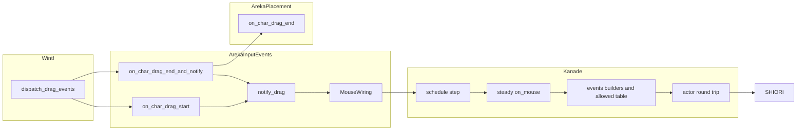
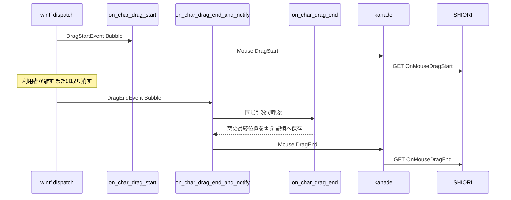

# Technical Design: areka-P0-mouse-drag-events

> 2026-10-04。要件は `requirements.md`（要件 1〜9）、調べた事実と決定の根拠は `research.md`（§1〜§9 がギャップ分析と要件討議、§10 が設計の段の調べものと決定）。ソースは「何の定義か」で指す（行番号は使わない）。指し先はこの日のワークツリー（main `e2a373b5` の上の `22042edb`）の実物で確かめた。

## Overview

**Purpose**: キャラクターをドラッグで動かしたことを、正典（ukadoc）の SHIORI イベント `OnMouseDragStart`・`OnMouseDragEnd` でゴーストへ届ける。ゴースト「悪役令嬢クローディア」が、掴まれている間だけ足の浮いた絵になり、離されるとひとこと言うようになる。

**Users**: 既存のゴーストを areka で動かす利用者と、そのゴーストの作者。SSP 向けに書かれた辞書（左ボタンか・本体か相方か・どの当たり判定か、の判定）がそのまま働く。

**Impact**: 新しい仕組みは作らない。既にある `OnMouseDoubleClick` の経路（areka の `MouseWiring` → `KanadeMsg::Mouse` → kanade の `steady::on_mouse` → `events.rs` の組み立て → 送ってよい表）へ、種類を 2 つ足す。areka 側は、キャラクター窓に開始の受け手を新しく付け、終了の受け手を「今の位置の保存を呼んでから知らせる」包みに付け替える。位置の保存の中身（`placement`）には触れない。wintf は、ダブルクリックの 2 回目の押下からもドラッグの準備を始める 1 か所だけを直す（決定 D7）。

### Goals

- 閾値を越えたドラッグ 1 回につき、`OnMouseDragStart` 1 件 → `OnMouseDragEnd` 1 件を、この順に、7 つの Reference で送る（取り消しでも終了を送る）。
- 動かさないクリック・ダブルクリック・バルーン窓のドラッグ・右ボタンでは 1 件も送らない。
- 窓の位置の保存は、本 spec の前と同じ条件・同じ値のまま。
- 送らなかったときは必ず記録が 1 件残る。
- 届くこと・届かないことを DLL を使わない決定論のテストで固定し、実機でクローディアの反応を確かめ、網羅の台帳の 2 行を実装済みにする。

### Non-Goals

- パッシブモードでの抑え（入る経路がまだ無い。置く場所の印だけ残す）。
- 右ボタンのドラッグ・バルーン窓のドラッグ・タッチとペン。
- `OnMouseClick`・`OnMouseDown`／`OnMouseUp` など、まだ無い他のマウスのイベント。
- ドラッグの間の `OnMouseMove` の送り方（変えない）。
- 押下とドラッグを突き合わせる仕組み（ダブルクリックの 2 回目の押下のまま動かしたら、`OnMouseDoubleClick` の後に `OnMouseDragStart` が出る。要件 3.2 のとおり。2 回目の押下からドラッグの準備を始めるのは wintf の 1 か所の改修で、決定 D7）。
- areka 側で「開始を送ったか」を覚えておく仕組み（決定 D2）。
- ドラッグの最中に絵の大きさが変わるゴーストでの窓の置き直し（今の仕組みの持ち物。危険の節に書く）。

## Boundary Commitments

### This Spec Owns

- kanade が受け取るマウスの知らせの種類（`MouseEventKind`）への 2 つの追加（開始・終了）と、その 2 つを SHIORI の要求へ組み立てる関数、送ってよいイベントの表の 2 行（ukadoc の URL の注記つき）、`steady::on_mouse` の 2 つの腕とパッシブモードの印。
- 定常でないときにマウスの知らせを捨てる記録（`mouse_input_ignored`）へ、捨てた知らせの中身を足すこと（決定 D3）。
- areka のキャラクター窓での開始・終了の捕まえ方: 新しいファイル `input_events/drag.rs`（開始の受け手・終了の包み・送らないときの記録）と、`attach_char_pointer_handlers` での付け方。
- 「終了の包みは、位置の保存の受け手を必ず先に、今までと同じ引数で呼ぶ」という約束。
- wintf のダブルクリックの押下（`WM_LBUTTONDBLCLK`）の受け手で、普通の押下（`WM_LBUTTONDOWN`）と同じ決まりでドラッグの準備を始めること（決定 D7）と、そのテスト W1・W2。
- 決定論のテスト、網羅の台帳の 2 行と生成物、台帳に連動する文書（`briefing.md` の状態の数・`roadmap-draft.md` の本 spec の行）、`doc/COMPAT_ARCHITECTURE.md` §8 への追記、実機での確認。

### Out of Boundary

- wintf のドラッグの仕組み（閾値・状態の進め方・知らせを運ぶ箱・配る所・取り消しの知らせが運ぶ位置）。決定 D7 の 1 か所（ダブルクリックの押下で準備を始めること）だけを除く。完了 spec `event-drag-system`・`areka-P0-drag-click-without-move` と、同じウェーブの `areka-P0-drag-cancel-borrow-miss` の持ち場。
- 位置の保存の中身（`placement/follow/drag_follow.rs` の `on_char_drag_end`・`persist_entries`）と、`placement/spawn.rs` がキャラクター窓へ付ける部品。1 文字も変えない。
- `emo2_boot/`・`frame/`（同じウェーブの約束）。
- 「いつ送ってよいか」の決まりそのもの（定常だけ・終了の握手の待ちは送らない・往復は一度に 1 つ）と、SHIORI の失敗の扱い。今のものをそのまま使う。
- パッシブモードの出入り、`sakura-time-critical` が `on_mouse` の先頭に置く予定の抑え、`balloon-lifecycle-events` が表へ足す行。
- `briefing.md` 7-7 節の手書きの数（決定 D6）と、`briefing.md` の `[[owner_completed]]`（完了の手続きの持ち物）。

### Allowed Dependencies

- areka `input_events` → `placement`（`placement::follow::on_char_drag_end`・`placement::spawn::CharWindowMarker`）。逆向き（`placement` → `input_events`・kanade）は作らない（`placement` は example が私有 include するので `crate::` を引けない）。
- areka `input_events` → `areka_kanade` の公開の型（`KanadeMsg`・`MouseInput`・`MouseEventKind`）と、wintf の公開の型（`OnDragStart`・`OnDragEnd`・`DragStartEvent`・`DragEndEvent`・`Phase`・`WindowPos`）。
- kanade は areka も wintf も知らない（今のまま）。kanade の中では `steady.rs` → `events.rs`（今のまま）。
- 新しいクレート・新しい外部の依存は足さない。

### Revalidation Triggers

- wintf が取り消しの終了の知らせに載せる位置を変えたとき（今は押した位置）。要件 4.2 の「取り消しは開始と同じ値」が崩れる。
- wintf が「開始の知らせを伴わない終了は来ない」約束を変えたとき、または `areka-P0-drag-cancel-borrow-miss` が開始・終了の対の約束を変えたとき（決定 D2 の前提）。
- `placement::spawn` がキャラクター窓へ `OnDragEnd` を付ける時機を変えたとき（`attach_char_pointer_handlers` より後に付け直すようになると、包みが消えて知らせが止まる。テスト A1 が赤になる）。
- `on_char_drag_end` が窓の最終位置を `WindowPos.position` へ書かなくなったとき、または取り消しで押した位置から窓の位置を引き直さなくなったとき（決定 D1 の前提。テスト A4 が赤になる）。
- `areka-P0-drag-cancel-borrow-miss` が、終了を積み損ねた後に運ぶ箱へ残る「ドラッグ中の対象」を片づけない形で着地したとき（遅れた終了が残る。決定 D2 を見直す）。
- `steady::on_mouse` の先頭の防御や、横断の腕の「定常だけ」の決まりを変えるとき（`sakura-time-critical`・パッシブモードの spec）。2 つのイベントも同じ決まりに従う。
- `areka-P0-drag-cancel-borrow-miss` が wintf の押下・離しの受け手（`mouse_click.rs`）を作り変えて着地したとき。決定 D7 は同じファイルの `find_ancestor_with_drag_config` を借りるので、取り込みで重なりを解き、W1・W2 を流し直す。
- `MouseEventKind` へ種類を足すとき（`on_mouse` の `match` は網羅なので、足した側がコンパイルで気付く）。
- 3 体目以降のキャラクター窓を作れるようにするとき（`char_scope` の `scope <= 1` の前提を、他のマウスのイベントと一緒に直す）。

## Architecture

### Existing Architecture Analysis

確かめた今の姿（詳細は `research.md` §2・§10）:

- **知らせの出どころ（wintf）**: 配る所 `dispatch_drag_events`（`crates/wintf/src/ecs/drag/dispatch.rs`）が、開始は `OnDragStart`、終了は `OnDragEnd` の部品を、同じ知らせについて Tunnel（根 → 対象）と Bubble（対象 → 根）の 2 回呼ぶ。開始の知らせ `DragStartEvent.position` は押した位置、終了の知らせ `DragEndEvent.position` は離した位置（取り消しでは押した位置）で、どちらも画面の物理 px。開始の無い終了は運ぶ箱が捨てるので来ない。開始が配られるまで、窓の手続きは窓を動かさない（窓を動かすのは状態が「ドラッグ中」になってからで、そこへ進めるのは配る所が開始を配った後）。
- **画面の位置と窓の中の位置**: 窓の手続きは「窓の中の位置＋`WindowPos.position`」で画面の位置を作っている（`window_proc/mouse_move.rs`・`mouse_click.rs`）。だから画面の位置から `WindowPos.position` を引けば、窓の中の物理 px に戻る。
- **位置の保存（areka `placement`）**: `placement::spawn` がすべてのキャラクター窓へ `OnDragEnd(on_char_drag_end)` を付ける。`on_char_drag_end` は Bubble の相で、窓の最終位置を決め、`enqueue_window_set_pos` で `WindowPos.position` へ**その場で**書き、記憶へ保存する。取り消しでは窓が開始の位置へ戻る。
- **マウスの配線（areka `input_events`）**: `attach_char_pointer_handlers` が、窓を作った直後（`ghost_session.rs` が組む窓を作る閉包の中で `spawn_ghost_windows` の次）に、キャラクター窓へポインタの受け手を付ける。`MouseWiring`（kanade への送り口・当たり判定の供給源・移動の間引き）、`char_scope`（スコープの番号を引く）、`resolve_hit_owned`（窓の中の物理 px から、当たり判定の名前と SHIORI へ渡す座標を引く）がある。`drag.rs` は `input_events` の子なので、これらの私有の項目をそのまま使える。
- **送る側（kanade）**: `KanadeMsg::Mouse(MouseInput)` を 1 つの受信箱で受け、定常のときだけ `steady::on_mouse` へ渡す。`on_mouse` は終了の握手の待ちなら捨て、そうでなければ `State::snapshot` から実行状態を導いて GET を 1 件出す。送る直前に送ってよい表（`ALLOWED_EVENT_IDS`）と照合し、載っていない名前は内部の失敗になる。再生中の会話は、`OnSecondChange` 以外の応答で置き換わる（`value_replaces_active_talk`）。
- **行数**: `steady.rs` 929 行・`schedule/mod.rs` 937 行・`events.rs` 672 行・`msg.rs` 902 行・`input_events/mod.rs` 558 行。本 spec の変更（下の File Structure Plan の見込み）ではどれも 1,000 行を超えない。先に分ける作業は要らない。

### Architecture Pattern & Boundary Map



**Architecture Integration**:

- **選んだ形**: 既存の経路を伸ばす（`research.md` §4 の案 A）。汎用の入口（`KanadeMsg::RaiseEvent`）で送る案は、`on_mouse` の「終了の握手の待ちは送らない」防御と実行状態の導き方を別の場所で作り直すことになるので取らない。位置の保存の受け手の中から送る案は、`placement` が `crate::` を引くことになるので取らない。
- **責任の分け方**: 「ドラッグが始まった・終わった」は wintf、「窓の位置を保存する」は `placement`、「どの窓のどこで起きたかを kanade へ知らせる」は `input_events/drag.rs`、「送るかどうか・Reference の並び」は kanade。
- **保つ決まり**: kanade は当たり判定の名前を解釈しない・座標を変換しない。マウスの知らせは 1 本の経路（`KanadeMsg::Mouse`）。Bubble の相だけで働く受け手。記録の無い捨て方をしない。
- **新しい部品の理由**: `input_events/drag.rs` だけ。`mod.rs` を太らせず、兄弟のテストを置けるようにするため。新しい型・新しい資源・新しい通り道は作らない。
- **1 フレーム遅らせない**: 開始も終了も、wintf が配ったその呼び出しの中で kanade へ送る。

### Technology Stack

| Layer | Choice / Version | Role in Feature | Notes |
|-------|------------------|-----------------|-------|
| UI の配線 | areka（bin）`input_events`・bevy_ecs・wintf（どれも今の版） | 開始・終了の受け手、座標と当たり判定の引き方、kanade への送出 | 依存の追加なし |
| 送出の決まり | areka-kanade（今の版） | 種類の追加・組み立て・送ってよい表・振り分け | 依存の追加なし |
| 網羅の台帳 | ukadoc-survey（今の版） | 台帳の 2 行・報告の作り直し・検査 | 道具は変えない |

## File Structure Plan

### Directory Structure

```
crates/areka/src/input_events/
├── drag.rs            # 新規。開始の受け手・終了の包み・共通の送出・送らないときの記録
├── drag_tests.rs      # 新規。drag.rs の兄弟のテスト（接続宣言は drag.rs の末尾）
└── mod.rs             # 変更。mod 宣言と attach_char_pointer_handlers

crates/areka-kanade/
├── src/msg.rs                                 # 変更。MouseEventKind に 2 つ
├── src/lib.rs                                 # 変更。events の pub use に 2 関数
├── src/schedule/events.rs                     # 変更。組み立て 2 関数・表の 2 行・冒頭の表の 2 行
├── src/schedule/steady.rs                     # 変更。on_mouse の 2 つの腕と印
├── src/schedule/mod.rs                        # 変更。mouse_input_ignored へ中身を足す（1 行）
├── src/schedule/events_tests.rs               # 変更。組み立てのテスト・全語の列挙
├── src/schedule/events_change_tests.rs        # 変更。個数 46 → 48
├── src/schedule/schedule_log_firing_tests.rs  # 変更。捨てたときの記録のテスト
├── tests/kanade/mouse_test.rs                 # 変更。接続宣言 1 つ
└── tests/kanade/mouse_test_drag_tests.rs      # 新規。mock SHIORI を通す決定論のテスト

crates/wintf/src/ecs/window_proc/
├── mouse_dblclick_wheel.rs        # 変更。左のダブルクリックの押下でドラッグの準備を始める（決定 D7）
├── mouse_dblclick_wheel_tests.rs  # 新規。W1・W2（接続宣言は mouse_dblclick_wheel.rs の末尾）
└── mouse_click.rs                 # 変更。find_ancestor_with_drag_config を pub(super) にする（1 行）

doc/
├── COMPAT_ARCHITECTURE.md                     # 変更。§8 の表へ追記
└── ukadoc-coverage/
    ├── ledger/shiori.toml                     # 変更。2 行
    ├── report/shiori.md, report/summary.md    # 生成物の作り直し（手で書かない）
    ├── briefing.md                            # 変更。list_shiori_event の状態の数
    └── roadmap-draft.md                       # 変更。本 spec の行・行数・「撫で」の行
```

### Modified Files

| ファイル | 変えること | 見込みの行数 |
|---|---|---|
| `crates/areka/src/input_events/drag.rs`（新規） | 下の「areka」の部品 3 つ | 150 前後 |
| `crates/areka/src/input_events/drag_tests.rs`（新規） | テスト A1〜A9 と、その土台（窓・運ぶ箱・偽の記憶の書き手） | 600〜800（1,000 を超えるなら主題で 2 本に分け、土台を `drag_test_support.rs` へ） |
| `crates/areka/src/input_events/mod.rs` | `mod drag;`・`attach_char_pointer_handlers` で `OnDragStart`・`OnDragEnd` を入れる・doc | 558 → 570 前後 |
| `crates/areka-kanade/src/msg.rs` | `MouseEventKind::DragStart`・`DragEnd` と doc | 902 → 915 前後 |
| `crates/areka-kanade/src/schedule/events.rs` | `on_mouse_drag_start`・`on_mouse_drag_end`、表の末尾 2 行（各行に `// ukadoc:` の URL）、冒頭の表の 2 行 | 672 → 740 前後 |
| `crates/areka-kanade/src/schedule/steady.rs` | `on_mouse` の `match` の 2 つの腕・パッシブモードの印・doc | 929 → 950 前後 |
| `crates/areka-kanade/src/schedule/mod.rs` | `mouse_input_ignored` の記録に `input = ?m` を足す | 937 → 938 |
| `crates/areka-kanade/src/lib.rs` | `pub mod events` の `pub use` に 2 関数 | +1 |
| kanade のテスト 4 本 | 下の Testing Strategy | — |
| 台帳と文書 | 下の「台帳と文書」の部品 | — |
| `crates/wintf/src/ecs/window_proc/mouse_dblclick_wheel.rs` | 左のダブルクリックの押下で、普通の押下と同じ決まり（祖先の `DragConfig` が有効で左ボタンを許す）で `start_preparing` を呼ぶ・doc（決定 D7） | 234 → 260 前後 |
| `crates/wintf/src/ecs/window_proc/mouse_dblclick_wheel_tests.rs`（新規） | テスト W1・W2 | 100〜200 |
| `crates/wintf/src/ecs/window_proc/mouse_click.rs` | `find_ancestor_with_drag_config` を `pub(super)` にする（押下の受け手の中身は変えない） | ±0 |

触らないことを約束するファイル: `crates/wintf/` の全部（決定 D7 の上の 3 ファイルを除く）、`crates/areka/src/placement/` の全部、`crates/areka/src/emo2_boot/`、`crates/areka/src/ghost_session.rs`（`attach_char_pointer_handlers` の呼び出しは今のまま）。

## System Flows



流れの決まり:

- Tunnel の相の呼び出しでは知らせを送らない（同じ知らせの前半であって、後半の Bubble で 1 回だけ送る）。包みは Tunnel でも `on_char_drag_end` を同じ引数で呼ぶ（今と同じく何もせずに返る）。
- 終了では**必ず先に**位置の保存を呼び、その後で座標を引いて送る（決定 D1）。送り先が無くても、送出に失敗しても、保存は済んでいる。
- kanade への送り口は先入れ先出しで、kanade の受信箱は 1 つ。開始と終了が同じ配りの中で続けて出ても（速いドラッグ）、順は入れ替わらない。
- kanade は定常でないとき・終了の握手の待ちのとき、知らせを捨てて記録を残す。開始を送った後に定常でなくなったら、終了は捨てる（対にするための例外を作らない）。

## Requirements Traceability

| Requirement | Summary | Components | Interfaces | Flows／Tests |
|---|---|---|---|---|
| 1.1 | 開始を GET で 1 回送る | `on_char_drag_start`・`notify_drag`・`on_mouse` の腕・`on_mouse_drag_start` | `MouseEventKind::DragStart` | A1・K3 |
| 1.2 | 開始は 1 回だけ | `on_char_drag_start`（Bubble の相だけ） | — | A1・A2 |
| 1.3 | 当たり判定・箱に関わらず送る | `notify_drag`（当たり判定の有無で分けない）。箱の前段はポインタの受け手にあり、ドラッグの受け手を通らない | — | A1（当たり判定なしの位置）・実機 R3 |
| 1.4 | 開始を間引かない | `notify_drag`（間引きを通らない送り方） | — | A8 |
| 2.1 | 離したら終了を 1 回送る | `on_char_drag_end_and_notify`・`notify_drag`・`on_mouse` の腕・`on_mouse_drag_end` | `MouseEventKind::DragEnd` | A1・K3 |
| 2.2 | 取り消しでも同じ並びで送る | `on_char_drag_end_and_notify`（`cancelled` を見ない） | — | A4 |
| 2.3 | 終了は 1 回だけ | `on_char_drag_end_and_notify`（Bubble の相だけ） | — | A1・A2 |
| 2.4 | 終了は開始より後 | 送り口の先入れ先出し・kanade の 1 つの受信箱 | — | A1・A2・K3 |
| 2.5 | 終了を間引かない | `notify_drag` | — | A8 |
| 3.1 | 動かさないクリックで送らない | wintf の約束（開始の無い終了は来ない）に乗る | — | A3 |
| 3.2 | ダブルクリックで送らない・2 回目の押下のまま動かせばドラッグ | 同上。`on_char_pointer_pressed` は変えない。2 回目の押下からの準備は wintf のダブルクリックの押下の受け手（決定 D7） | — | A3・W1・W2・実機 R4 |
| 3.3 | バルーン窓で送らない | `attach_char_pointer_handlers`（キャラクター窓にだけ付ける） | — | A5 |
| 3.4 | 右ボタンで送らない | wintf の `DragConfig` の既定（左だけ）に乗る。areka は変えない | — | 実機 R5 |
| 4.1 | Reference は 7 つ・`OnMouseDoubleClick` と同じ並び | `on_mouse_drag_start`・`on_mouse_drag_end` | — | K1 |
| 4.2 | 座標の空間と、開始＝押した位置・終了＝終わった位置 | `notify_drag`（画面の位置 − `WindowPos.position` → `resolve_hit_owned`）・決定 D1 | `MouseInput.x`／`y` | A1・A4・A6 |
| 4.3 | Reference2 は `0` | 組み立ての 2 関数 | — | K1 |
| 4.4 | Reference3 はスコープ | `char_scope` | `MouseInput.scope` | A1・K1 |
| 4.5 | Reference4 は当たり判定・無ければ空 | `resolve_hit_owned`・組み立ての 2 関数 | `MouseInput.region` | A1・K1 |
| 4.6 | Reference5 は `0` | 組み立ての 2 関数 | — | K1 |
| 4.7 | Reference6 は `mouse` | 組み立ての 2 関数（`REF6_DEVICE_MOUSE`） | — | K1 |
| 4.8 | 他のマウスの GET と同じ見出し | `on_mouse`（`State::snapshot` を渡す） | — | K3・K4 |
| 5.1 | 定常で送る・会話中は `talking` | `on_mouse` | — | K3・K4 |
| 5.2 | 終了の握手の待ちは送らず記録 1 件 | `on_mouse` の先頭の防御（今のまま） | — | K6・K9 |
| 5.3 | 定常でない間は送らず記録 1 件 | `schedule/mod.rs` の横断の腕（記録へ中身を足す） | — | K5・K8 |
| 5.4 | 開始の後に定常でなくなったら終了も同じ決まり | 同上（対の例外を作らない） | — | K7 |
| 5.5 | 同じ順番待ち・往復は一度に 1 つ | `KanadeMsg::Mouse` に載せる | — | K3 |
| 6.1 | 保存は前と同じ条件・同じ値 | `on_char_drag_end_and_notify`（先に同じ引数で呼ぶ） | — | A7 |
| 6.2 | 送らないときも保存は同じ | 同上（保存の後で送るかを決める） | — | A7 |
| 6.3 | 動かさないクリックで保存しない | wintf と `placement` の今の決まり（触らない） | — | A7・既存 `follow_drag_end_gate_tests.rs` |
| 7.1 | 表へ 2 行と URL | `ALLOWED_EVENT_IDS` | — | K2・K3 |
| 7.2 | 台帳・報告・連動する文書 | 「台帳と文書」 | — | `cargo test -p ukadoc-survey` |
| 7.3 | パッシブモードの抑えを持たないことを 2 か所に | 台帳の備考・`on_mouse` の印 | — | レビュー |
| 7.4 | 正典が書いていない点を §8 へ | `doc/COMPAT_ARCHITECTURE.md` §8 | — | レビュー |
| 8.1 | 送るときの記録 | kanade の `shiori_request`（今のまま） | — | 実機 R1 |
| 8.2 | 送らない経路すべてに記録 | `notify_drag` の 4 つの捨て方・送出の失敗・kanade の 2 つの捨て方 | — | A9・K8・K9 |
| 9.1 | 決定論のテスト ⑴〜⑼ | Testing Strategy の対応表 | — | — |
| 9.2 | 決まりを外すと赤 | Testing Strategy の「外すと赤」の列 | — | — |
| 9.3 | 実機でクローディア | 実機の確認 R1〜R7 | — | — |
| 9.4 | 全体テスト | `tools/test-all.ps1` | — | — |

## Components and Interfaces

| Component | Layer | Intent | Req | Key Dependencies | Contracts |
|---|---|---|---|---|---|
| `MouseEventKind` の 2 つ | kanade `msg.rs` | 開始・終了という種類を運ぶ | 1.1, 2.1 | — | Event |
| `on_mouse_drag_start`／`on_mouse_drag_end` | kanade `events.rs` | 7 つの Reference の GET を組み立てる | 4.1, 4.3〜4.7 | `ExecutionStatus`（P0） | Service |
| `ALLOWED_EVENT_IDS` の 2 行 | kanade `events.rs` | 送ってよい名前に加える | 7.1 | — | State |
| `steady::on_mouse` の腕 | kanade `steady.rs` | 種類に応じた組み立てを選ぶ・印を残す | 1.1, 2.1, 4.8, 5.1, 5.2, 7.3 | 組み立て（P0） | Service |
| 横断の腕の記録 | kanade `schedule/mod.rs` | 捨てた知らせの中身を残す | 5.3, 8.2 | — | — |
| `on_char_drag_start` | areka `input_events/drag.rs` | 開始を kanade へ知らせる | 1.1〜1.4 | `notify_drag`（P0） | Event |
| `on_char_drag_end_and_notify` | areka `input_events/drag.rs` | 位置の保存の後で終了を知らせる | 2.1〜2.5, 6.1, 6.2 | `placement::follow::on_char_drag_end`（P0）・`notify_drag`（P0） | Event |
| `notify_drag` | areka `input_events/drag.rs` | 座標・スコープ・当たり判定を引いて送る／送らないなら記録 | 4.2, 4.4, 4.5, 8.2 | `MouseWiring`・`char_scope`・`resolve_hit_owned`（P0） | Service |
| `attach_char_pointer_handlers` | areka `input_events/mod.rs` | キャラクター窓へ 2 つの受け手を付ける | 3.3 | `placement::spawn`（P0） | — |
| 台帳と文書 | `doc/` | 実装済みの登記と裁量の記録 | 7.2〜7.4 | ukadoc-survey（P0） | — |

### kanade（送る側）

#### `MouseEventKind` の 2 つ

| Field | Detail |
|---|---|
| Intent | マウスの知らせの種類に「ドラッグの開始」「ドラッグの終了」を足す |
| Requirements | 1.1, 2.1 |

```rust
pub enum MouseEventKind {
    Move,
    DoubleClick { button: MouseButton },
    /// ドラッグの開始（OnMouseDragStart）。x／y は押した位置。
    DragStart,
    /// ドラッグの終了（OnMouseDragEnd）。x／y は終わった位置（取り消しは押した位置）。
    DragEnd,
}
```

- ボタンは持たせない。今の窓のドラッグは左ボタンでだけ始まり、Reference5 は常に `0`（要件 4.6）。右ドラッグを有効にする spec が、そのときにボタンを足す。
- 取り消しかどうかも持たせない（要件 2.2: 取り消しを区別する値を足さない）。
- `MouseInput` の他の欄（`scope`・`x`・`y`・`region`）は今の意味のまま。

#### `on_mouse_drag_start`／`on_mouse_drag_end`

| Field | Detail |
|---|---|
| Intent | 2 つのイベントの GET を、`OnMouseDoubleClick` の左ボタンと同じ並びで組み立てる |
| Requirements | 4.1, 4.3, 4.4, 4.5, 4.6, 4.7, 4.8 |

```rust
pub fn on_mouse_drag_start(
    x: i64, y: i64, scope: u32, region: Option<&str>, snapshot: &ExecutionSnapshot,
) -> ShioriCall;

pub fn on_mouse_drag_end(
    x: i64, y: i64, scope: u32, region: Option<&str>, snapshot: &ExecutionSnapshot,
) -> ShioriCall;
```

- 返すのは `ShioriCall::Get`。`id` は `EventId::Static("OnMouseDragStart")`／`EventId::Static("OnMouseDragEnd")`。
- `references` は常に 7 つ: `[x, y, "0", scope, region（無ければ空文字列）, "0", REF6_DEVICE_MOUSE]`。
- `status` は `ExecutionStatus::derive(snapshot)`（他のマウスの GET と同じ）。
- 副作用なし。座標は受けた値を変えずに載せる（kanade は座標の空間を知らない）。
- 2 つの中身は名前だけが違うので、私有の手助け 1 つを 2 関数が呼ぶ形にしてよい（既存の `on_mouse_double_click` には手を入れない）。
- `crates/areka-kanade/src/lib.rs` の `pub mod events` から外へ見せる（統合テストが期待値を作るのに使う）。

#### `ALLOWED_EVENT_IDS` の 2 行

- 表の末尾（`OnTranslate` の後）に `"OnMouseDragStart"`・`"OnMouseDragEnd"` を足し、それぞれの直前に `// ukadoc: https://ssp.shillest.net/ukadoc/manual/list_shiori_event.html#OnMouseDragStart:1`／`#OnMouseDragEnd:1` の 1 行を置く（網羅の検査が「実装済み」の証拠として読む形）。46 語 → 48 語。
- ファイル冒頭の「ukadoc Reference 表」にも 2 行足す（GET・Ref0〜6 の中身）。
- 個数や全語の列挙を固定しているテスト（`events_change_tests.rs` の個数・`events_tests.rs` の全語の列挙）を 48 語へ直す。ほかに個数を固定している所が無いことは、実装の最初に `ALLOWED_EVENT_IDS` と `46` で探して確かめる。

#### `steady::on_mouse` の腕

| Field | Detail |
|---|---|
| Intent | 種類が開始・終了なら、対応する組み立てで GET を 1 件出す |
| Requirements | 1.1, 2.1, 4.8, 5.1, 5.2, 5.4, 5.5, 7.3 |

- `match input.kind` に 2 つの腕を足すだけ。先頭の終了の握手の待ちの防御・`State::snapshot` の取り方・`mouse_get` の記録・戻り値（状態は変えず `Action::ShioriRequest` 1 件）は今のまま、4 種類で共通。
- 種類で分かれるのは「どの組み立てを呼ぶか」だけ。開始・終了だけの特別な条件は足さない。
- **パッシブモードの印**: 2 つの腕のそばに次の趣旨のコメントを置く。「正典は `OnMouseDragStart`・`OnMouseDragEnd` をパッシブモードで抑えると書く。areka にはまだパッシブモードへ入る経路が無いので抑えを持たない。経路ができたら、抑えは先頭の終了の握手の待ちの防御と同じ並び（組み立ての前）に置く」。印の書式は `status.rs` の既存の印（`SEAM(...)`）に揃える。
- 応答の扱いは今のまま（会話の再生中に台本が返れば、他のマウスのイベントと同じく会話を置き換える）。

#### 横断の腕の記録（`schedule/mod.rs`）

- 定常でないときに捨てる記録 `mouse_input_ignored` に、捨てた知らせ（`input = ?m`）を足す。水準は trace のまま、4 種類で共通（決定 D3）。
- 終了の握手の待ちの記録 `mouse_close_pending` は既に知らせの中身を残しているので変えない。

### areka（受ける側）

#### `on_char_drag_start`

| Field | Detail |
|---|---|
| Intent | キャラクター窓のドラッグの開始を kanade へ 1 回知らせる |
| Requirements | 1.1, 1.2, 1.3, 1.4 |

```rust
pub(super) fn on_char_drag_start(
    world: &mut World, sender: Entity, entity: Entity, ev: &Phase<DragStartEvent>,
) -> bool;
```

- Tunnel の相: 何もせず `false`。
- Bubble の相: `notify_drag(world, entity, ev.target, ev.position, MouseEventKind::DragStart)` を呼び、`false`（伝播を止めない。他のドラッグの受け手と同じ）。
- 事前条件: wintf が開始を配る時点で窓はまだ動いていない（上の「今の姿」）。だから `ev.position − WindowPos.position` が、押した位置の窓の中の物理 px になる。

#### `on_char_drag_end_and_notify`

| Field | Detail |
|---|---|
| Intent | 位置の保存を今までどおり行い、その後でドラッグの終了を kanade へ 1 回知らせる |
| Requirements | 2.1, 2.2, 2.3, 2.4, 2.5, 6.1, 6.2 |

```rust
pub(super) fn on_char_drag_end_and_notify(
    world: &mut World, sender: Entity, entity: Entity, ev: &Phase<DragEndEvent>,
) -> bool;
```

手順（どの相でも 1 が先）:

1. `crate::placement::follow::on_char_drag_end(world, sender, entity, ev)` を、受けた引数のまま呼び、戻り値を控える。
2. Bubble の相なら `notify_drag(world, entity, ev.target, ev.position, MouseEventKind::DragEnd)`。Tunnel の相なら何もしない。
3. 1 の戻り値を返す。

- 不変条件: 1 は 2 の結果に左右されない（送り先が無い・送出に失敗した・送らないと決めた、のどれでも保存は済んでいる）。
- `ev.cancelled` は見ない（取り消しでも同じに送る）。取り消しでは `ev.position` が押した位置で、1 が窓を開始の位置へ戻すので、座標は開始と同じ値になる。
- 事後条件: 1 が成功していれば、`WindowPos.position` は窓の最終位置になっている（`enqueue_window_set_pos` がその場で書く）。2 はその値を使う（決定 D1）。

#### `notify_drag`

| Field | Detail |
|---|---|
| Intent | 画面の位置から、スコープ・SHIORI へ渡す座標・当たり判定を引いて `KanadeMsg::Mouse` を送る。送らないなら理由を記録する |
| Requirements | 1.3, 1.4, 2.5, 4.2, 4.4, 4.5, 8.2 |

```rust
fn notify_drag(
    world: &mut World,
    entity: Entity,          // 受け手が付いている窓
    target: Entity,          // 知らせの対象
    screen: PhysicalPoint,   // 画面の物理 px
    kind: MouseEventKind,    // DragStart か DragEnd
);
```

判断の順（上から。捨てるときは 1 件記録して戻る）:

| 順 | 条件 | 動き | 記録 |
|---|---|---|---|
| 1 | `target != entity`（今の作りでは起きない。ドラッグの対象はキャラクター窓そのもの） | 送らない | `warn!` `mouse_drag_dropped`・`reason = "target_mismatch"` |
| 2 | `MouseWiring` が無い（ゴーストの起動に失敗した・結線の前） | 送らない | `debug!` `mouse_drag_dropped`・`reason = "no_wiring"` |
| 3 | `char_scope` が `None`（`CharWindowMarker` が無い。今の作りでは起きない） | 送らない | `warn!` `mouse_drag_dropped`・`reason = "no_scope"` |
| 4 | `WindowPos.position` が無い（今の作りでは起きない） | 送らない | `warn!` `mouse_drag_dropped`・`reason = "no_window_pos"` |
| 5 | それ以外 | 窓の中の物理 px ＝ `screen − WindowPos.position` を `resolve_hit_owned` へ渡し、返った座標（`surface_point`）と当たり判定で `KanadeMsg::Mouse(MouseInput { scope, x, y, region, kind })` を送る | 送出に失敗したら `warn!` `mouse_send_failed`（既存の名前・`kind` は `drag_start`／`drag_end`） |

- 記録にはどれも `kind`（開始か終了か）を載せる。
- 当たり判定の有無・シェルの絵の中の箱の上かどうかでは分けない（要件 1.3）。
- 移動の間引き（`plan_and_send_move`）は通らない。間引きの状態にも触れない（要件 1.4・2.5）。
- 借り方: `resolve_hit_owned` は共有の借りで結果を持ち帰り、その後で `MouseWiring` を書き込みで借りて送る（`on_char_pointer_pressed` と同じ順）。
- 水準の理由: 2 は起動に失敗したゴーストでは普通に起きるので debug。1・3・4 は結線の異常なので warn。どれも 1 回のドラッグに高々 2 件で、量の心配は無い。
- 送ったことの記録は areka 側には足さない。wintf が配るときに info の記録（`[DragStartEvent] Dispatching`・`[DragEndEvent] Dispatching`）を出し、kanade が送る直前に `shiori_request` を出すので、間で捨てたときの記録さえあれば、どこで止まったかは追える。

#### `attach_char_pointer_handlers`

- 今の 2 つ（`OnPointerMoved`・`OnPointerPressed`）に加えて、同じ `insert` で `OnDragStart(drag::on_char_drag_start)` と `OnDragEnd(drag::on_char_drag_end_and_notify)` を入れる。
- `OnDragEnd` は `placement::spawn` が先に付けた `OnDragEnd(on_char_drag_end)` を置き換える（同じ型の部品は 1 つの窓に 1 つ）。置き換えた包みが同じ受け手を呼ぶので、位置の保存は続く。
- 付ける相手は `CharWindowMarker` を持つ窓だけ。バルーン窓の `OnDragEnd(on_balloon_drag_end)` には触れず、バルーン窓へ `OnDragStart` は付けない（要件 3.3）。
- 時機の約束は今のまま（`spawn_ghost_windows` の直後・同じ閉包の中）。この順が逆になると包みが消えるので、doc に「`placement::spawn` の `OnDragEnd` を置き換える。順を入れ替えない」と書き、テスト A1 が本物の `spawn_ghost_windows` → `attach_char_pointer_handlers` の順を通る。
- example（`window-placement.rs` など）は `attach_char_pointer_handlers` を通らないので、今までどおり位置の保存だけが働く（送り先が無いので困らない）。

### 台帳と文書

| Field | Detail |
|---|---|
| Intent | 2 つのイベントを実装済みとして登記し、検査を緑に保ち、正典が書いていない点の決定を残す |
| Requirements | 7.2, 7.3, 7.4 |

**台帳 `doc/ukadoc-coverage/ledger/shiori.toml` の 2 行**（`OnMouseDragStart:1`・`OnMouseDragEnd:1`）:

- `status = "implemented"`・`owner = "areka-P0-mouse-drag-events"`。優先度・価値・`links` は変えない。
- 備考は `OnMouseDoubleClick:1` と同じ 5 項目で書き直す: 壊れ方（該当なし）／ログ（送る直前の `shiori_request`・定常でないとき `mouse_input_ignored`・終了の握手の待ち `mouse_close_pending`・areka 側 `mouse_drag_dropped`）／根拠の場所（`events.rs` の `ALLOWED_EVENT_IDS`・`actor.rs` の `round_trip_request`）／構築関数（`on_mouse_drag_start`・`on_mouse_drag_end`）／無いと失うもの。
- 備考の末尾に「パッシブモードでの抑えは持たない（areka にパッシブモードへ入る経路がまだ無い。印は `steady.rs` の `on_mouse`）。右ボタンのドラッグ・バルーン窓・タッチとペンは対象外」を書く（要件 7.3）。

**生成物**: `cargo run -p ukadoc-survey -- report` と `-- report-summary` で `report/shiori.md`・`report/summary.md` を作り直す。手では書かない。

**`briefing.md`**: `list_shiori_event` の `[[barrier]]` の `implemented`（46 → 48）と `absent`（238 → 236）。数は台帳から数え直した値を書く（引き算で出さない）。この数を引用している地の文があれば一緒に直す。

**`roadmap-draft.md`**（担当を本 spec にしたので、検査が本 spec の行を求める）:

- `[[spec]]` の末尾に 1 行: `name = "areka-P0-mouse-drag-events"`・`stage = "A"`・`bundle = "撫で"`・`owner_count = 2`・`wave = "C3-④"`（段階は「撫で」が順位表で置かれている段階の写し、ウェーブは正本のロードマップの写し。直前の 2 行 `C1-②`・`C4 の候補` と同じ書き方）。
- `[briefs].count` を `[[spec]]` の塊を数え直した値にし、`snapshot_on` を手を入れた日にする。
- 前例（「2026-10-03 の追加」の段落）と同じ形の段落を 1 つ足す（足した理由・行の中身・数え直した 3 つの数）。
- 段階 A の表の「撫で」の行の「依存する既存 spec」の欄に `areka-P0-mouse-drag-events`（C3-④・2 件）を足す。候補 spec 名の案の欄は変えない（2 件は束の全数にも過半にも当たらない）。
- **同じウェーブの `install-companion-reading` との重なり**: 向こうも `[[spec]]` の行を足すなら、`[briefs].count`・行数の地の文・`[[spec]]` の末尾で文字がぶつかる。後から main を取り込む側が、`[[spec]]` の塊を数え直して書く（両方が同じ「42」を書いていると、その 1 行はぶつからずに通るが、実際は 43 行になる。検査の「`[briefs].count` ＝ `[[spec]]` の行数」が赤にするので黙っては通らない）。地の文の行数も同じときに数え直す。

**直さないもの**: `briefing.md` 7-7 節の数と表（決定 D6）・`[[owner_completed]]`（完了の手続き）。

**`doc/COMPAT_ARCHITECTURE.md` §8 の表への追記**（出典 spec は本 spec。既存の行の粒度に合わせて 1 論点 1 行）:

| 項目 | 裁量 | 根拠 |
|---|---|---|
| ドラッグが取り消されたときの `OnMouseDragEnd` | 離したときと同じく 1 回送る。Reference の並びも同じで、取り消しを区別する値は足さない | 正典は取り消しについて書いていない。開始を受けて絵を替えたゴーストが、終了を受けられずに替えたままになるのを避ける |
| 取り消しの `OnMouseDragEnd` の Reference0／1 | 押した位置（`OnMouseDragStart` と同じ値） | 取り消しでは窓が開始の位置へ戻る。戻った窓から見たカーソルの位置として、押した位置を使う |
| 離したときの `OnMouseDragEnd` の Reference0／1・Reference4 | 位置の保存で窓が落ち着いた後の窓から見た、離した位置。Reference4 はその位置の当たり判定。座標の空間は他のマウスのイベントと同じ（当たり判定を引くのと同じ、絵の座標） | 正典は「ローカル座標」としか書いていない。窓が指に付いて動く置き方では、開始と同じ値になる |
| `OnMouseDragStart`・`OnMouseDragEnd` の Reference2 | `0` | 正典は「ホイールの回転量」と書くが、ドラッグにホイールは伴わない。`OnMouseDoubleClick` と同じ |
| 当たり判定の外・シェルの絵の中の箱の上から始めたドラッグ | 送る（窓のドラッグが始まったかどうかだけで決める）。当たり判定が無ければ Reference4 は空 | 正典は条件を書いていない |
| ダブルクリックの 2 回目の押下のまま動かしたとき | `OnMouseDoubleClick` の後に `OnMouseDragStart` を送る（押下とドラッグを突き合わせない） | 正典は書いていない |

## Design Decisions（要件討議から送られた項目）

理由の詳しい版と退けた案は `research.md` §10。

- **D1. 終了の座標は、位置の保存の受け手を呼んだ後の `WindowPos.position` から引く。** 理由: ⑴ 要件 4.2 が「取り消しの終了は開始と同じ値」と決めている。取り消しでは保存の受け手が窓を開始の位置へ戻すので、後の位置から引けば自然にそうなる（前の位置から引くと、動かした先の窓から見た値になって要件に反する）。⑵ 最後の移動の知らせは配られないことがあり、保存の受け手がその穴を埋めて最終位置を書く。前の位置は 1 つ古いことがある。⑶ 包みは保存を先に呼ぶ決まりなので、順序の決まりは増えない。
- **D2. areka 側に「開始を送った」印は持たない。** 理由: 要件は「開始を伴わない終了は来ないものとして扱う」と決めており、wintf の運ぶ箱がそれを守っている。2 相の呼び出しは Bubble だけ扱えば 1 回になる。残る穴は 2 つの現れ方をする。⑴ World を借りられないと取り消し（または離し）の終了が積まれず、終了の無い開始が続く。⑵ そのとき wintf の運ぶ箱に「ドラッグ中の対象」が残るので、次の動かさないクリックの終了が番人を 1 回だけ通り、遅れた `OnMouseDragEnd` が送られる（座標はそのクリックの位置。位置の保存も走る）。どちらも同じウェーブの `areka-P0-drag-cancel-borrow-miss` が出どころで直す（向こうの brief が ⑴⑵ の両方を「今の姿」と「望む姿」に書いている）。受ける側に印を足すと、同じ決まりが 2 か所に分かれ、ゴーストの切替や窓の作り直しで印を戻す手当ても要る。したがって要件 8.2 の「重ねて届いた知らせを捨てる経路」は**設けない**（0 本）。Tunnel の相は同じ知らせの前半であり、捨てる経路ではない。
- **D3. 捨てたときの記録は、kanade では今の水準（trace）のまま、定常でないときの記録に知らせの中身を足す。** 理由: 捨てるのは普通に起きる入力（起動や終了の途中のドラッグ）で、異常ではない。種類ごとに水準を変えると、kanade の横断の腕に種類の分岐が入る。中身を足すだけなら 4 種類共通の 1 行で、どのイベントを捨てたかが分かる。実機の照合は送出の記録（`shiori_request`・trace）のために元々 `kanade=trace` まで開ける。areka 側の捨て方は上の表のとおり debug／warn。
- **D4. 位置の保存が前と同じであることは、`input_events/drag_tests.rs` の中で「包みを付けた窓」と「包みを付けない窓（本 spec の前の付け方）」を同じ操作で動かし、窓の位置と記憶へ書かれた値を比べて見る。** 理由: 「前と同じ」をそのまま判定にできる。窓は本物の `spawn_ghost_windows` で作るので、置き換えの順も通る。`placement` のテストの土台（`follow_drag_end_gate_tests.rs` の私有の型）は動かさない（`placement` のファイルに触れない約束と、同じウェーブの他の spec との重なりを避けるため）。保存の中身そのものの判定は、触らない `on_char_drag_end` に対する既存のテストが持ち続ける。
- **D5. `roadmap-draft.md` の行は `stage = "A"`・`bundle = "撫で"`・`owner_count = 2`・`wave = "C3-④"`。** `[briefs].count` のぶつかりは、後から取り込む側が数え直す（上の「台帳と文書」）。
- **D7. ダブルクリックの 2 回目の押下からもドラッグの準備を始める（wintf の 1 か所を直す）。** 2026-10-05 開発者の裁定（案 B）。事情: 窓のクラスはダブルクリックを受け取る設定なので、2 回目の押下は `WM_LBUTTONDOWN` でなく `WM_LBUTTONDBLCLK` として届く。今の wintf では `start_preparing` を呼ぶのが `mouse_click.rs` の押下の受け手だけで、`mouse_dblclick_wheel.rs` の受け手は呼ばない。そのため要件 3.2 の後半（2 回目の押下のまま動かしたらドラッグとして扱う）が成り立っていなかった（タスク 3.2 の審査で判明）。直し方: ダブルクリックの受け手が、左ボタンのときに普通の押下と同じ決まり（`find_ancestor_with_drag_config` で祖先の `DragConfig` を探し、有効で左ボタンを許すなら、押した位置の画面座標で `start_preparing`）を呼ぶ。決まりは借りて 1 つに保つ（同じ探し方を 2 か所に書かない）。普通の押下の受け手の中身は変えない（並走の `areka-P0-drag-cancel-borrow-miss` が同じファイルの離しの側を作り変えているので、重なりを 1 行に抑える）。閾値を越えずに離せば、普通のクリックと同じく開始も終了も積まれない（要件 3.2 前半・3.1）。wintf を使う他の窓でも、ドラッグを許している窓ならダブルクリックの 2 回目から動かせるようになる。
- **D6. `briefing.md` 7-7 節の手書きの数は直さない。** 理由: この節は 2026-09 に撮った写真で、その後に状態が変わった項目（`OnChoiceTimeout`・`OnTranslate` など）でも直されていない。見張る検査も無い。2 件だけ直すと、撮った日の違う数が混ざる。撮り直すなら節ごと、別の作業で行う。

## Error Handling

### Error Strategy

- **送らないと決める経路**（areka 4 本・kanade 2 本）と**送出の失敗**（areka 1 本）は、どれも記録を 1 件残して続ける。panic しない。利用者への知らせ（メッセージボックスなど）は出さない。
- **位置の保存は知らせより先**に済ませるので、知らせの側のどの失敗も保存を巻き込まない。
- **SHIORI の失敗**（エラー応答・輸送路の失敗）は今の決まりのまま（完了 spec `areka-P0-shiori-fault-notice`）。2 つのイベントのための例外は無い。
- **表への足し忘れ**は、送る直前の照合が `event_id_not_allowed`（error）で内部の失敗にする。テスト K3 が赤になる。

### Monitoring

| 記録 | 出す所 | 水準 | いつ |
|---|---|---|---|
| `[DragStartEvent] Dispatching`／`[DragEndEvent] Dispatching` | wintf（今のまま） | info | 配るとき |
| `mouse_drag_dropped`（`reason`・`kind`） | areka `notify_drag` | debug／warn | 送らないと決めたとき |
| `mouse_send_failed`（`kind = drag_start`／`drag_end`） | areka `notify_drag` | warn | kanade が止まった後 |
| `mouse_input_ignored`（`phase`・`input`） | kanade 横断の腕 | trace | 定常でないとき |
| `mouse_close_pending`（`input`） | kanade `on_mouse`（今のまま） | trace | 終了の握手の待ち |
| `mouse_get`・`shiori_request` | kanade（今のまま） | trace | 送るとき |
| `char DragEnd 保存`（`areka::persist::save`） | `placement`（今のまま） | info | 位置を保存したとき |

## Testing Strategy

決定論のテストはすべて x64・DLL なし・実時間の待ちなし。areka のテストは、wintf の運ぶ箱へ種を積んで `dispatch_drag_events` を呼ぶ（窓の手続きの代わり。本番と同じ配りの経路で、Tunnel と Bubble の 2 回の呼び出しも通る）。kanade のテストは、mock の SHIORI を結線したハーネスへ `KanadeMsg::Mouse` を入れる（送ってよい表との照合も通る）。期待する要求は組み立ての関数から作る（テストに並びを書き写さない）。

### areka（`crates/areka/src/input_events/drag_tests.rs`）

土台: 本物の `spawn_ghost_windows`（本体と相方）→ 偽の `WindowHandle` → `attach_char_pointer_handlers`。wintf のドラッグの資源、`MonitorSnapshot`、偽の記憶の書き手（`FakePersistIo`）を持つ `PersistWiring`、当たり判定の偽物（`RegionSource::Mock`）と止めた時計を入れた `MouseWiring` と、その受け口。偽物は「渡された窓の中の位置」から区別できる座標と当たり判定を返す（渡した位置が正しいことを受け口の値で見るため）。

**土台の補い（偽の窓では開始時の窓位置が入らない）**: 偽の `WindowHandle` では、wintf の配る所が開始の腕で行う枠の座標変換が失敗し、`DraggingState.initial_inset` が `(0,0)` のまま入る（`placement/follow_drag_end_gate_tests.rs` の `destination` の doc が書いている事情）。製品ではここに開始時の窓位置が入る。そこで、終了の座標を見るテスト（A4・A6）は、開始を配った直後に `DraggingState.initial_inset` を開始時の `WindowPos.position` の値で上書きし、製品と同じ意味の値にしてから先へ進む（`DraggingState` は wintf の公開の部品で、欄も公開）。ドラッグの間の窓の移動は、窓の手続きの代わりに `WindowPos.position` を直に書いて作る。

| 番号 | 見ること | 要件 9.1 | 外すと赤になる決まり |
|---|---|---|---|
| A1 | 開始 → 配る → 離す終了 → 配る。受け口に `DragStart` 1 件 → `DragEnd` 1 件がこの順で届く。スコープ（相方＝1）・座標（押した位置 − 窓の位置を偽物へ渡した結果）・当たり判定（ある位置／無い位置）が期待どおり | ⑴⑷⑸ | `attach` の 2 つの部品／Bubble だけ送る決まり（Tunnel でも送ると 2 件ずつになる）／`WindowPos.position` を引く一手 |
| A2 | 開始と終了を同じ配りに積む（速いドラッグ）。順は開始 → 終了・各 1 件 | ⑴⑷ | 同上 |
| A3 | 終了だけを積む（動かさないクリック）・ダブルクリックの押下を `on_char_pointer_pressed` へ入れる。ドラッグの知らせは 0 件（ダブルクリックは今どおり 1 件） | ⑵ | 送らない判断は wintf の運ぶ箱にある（本 spec の外・向こうのテストが持つ）。ここでは、押下の受け手からドラッグの知らせを送る・開始の無い終了を配るように変わると赤 |
| A4 | 開始を配る → `initial_inset` を開始時の窓位置にする → 窓を別の位置へ動かす → 「窓の位置 ≠ 開始の位置」を確かめる → 取り消しの終了（位置＝押した位置）を配る。窓が開始の位置へ戻り、`DragEnd` が 1 件届き、座標と当たり判定が `DragStart` と同じ値 | ⑶⑸ | 取り消しでも送る決まり（`cancelled` で分けると 0 件）／保存の後の窓の位置から引く決まり（保存の前に引くと、動かした先の窓から見た値になって赤）／取り消しで窓が開始の位置へ戻ること（`placement` の側が変えると赤） |
| A5 | バルーン窓を対象にした開始 → 終了。マウスの知らせは 0 件 | ⑵ | キャラクター窓にだけ付ける決まり |
| A6 | 下端へ寄せる置き方の窓で、開始を配って `initial_inset` を開始時の窓位置にした後、押した位置から横と縦へ動かして離す（窓は横へだけ動く）。`DragEnd` の座標が「離した位置 − 保存の後の窓の位置」と一致し、「離した位置 − 保存の前の窓の位置」とは違う | ⑸ | D1（保存を呼ぶ前に座標を引くと赤） |
| A7 | 包みを付けない窓（`spawn_ghost_windows` だけ＝本 spec の前）と包みを付けた窓で、同じ操作（離す・取り消す・動かさないクリック）をして、窓の位置と記憶へ書かれた組が一致する。包みの側は ⑴ 送り先あり ⑵ `MouseWiring` なし ⑶ 受け口を落として送出に失敗、の 3 通り。動かさないクリックではどちらも 0 件 | ⑺ | 保存を先に同じ引数で呼ぶ決まり（呼ばない・送り先が無いと戻る、にすると赤） |
| A8 | 直前に移動を 1 件送って間引きが閉じている状態（時計は止めたまま）で開始 → 終了。2 件とも届き、間引きの状態は変わらない | ⑻ | 間引きを通らない送り方（`plan_and_send_move` へ流すと赤） |
| A9 | 送らない経路の記録: `MouseWiring` なし／対象が別の窓／`CharWindowMarker` なし／`WindowPos.position` なし で、それぞれ `mouse_drag_dropped` がその理由で 1 件・知らせ 0 件。受け口を落とすと `mouse_send_failed` が 1 件 | — | 各経路の記録（記録を消すと赤）。対象が別の窓・部品なしは受け手を直に呼ぶ（本番の配りでは作れない防御の枝） |

### kanade

| 番号 | 置き場 | 見ること | 要件 9.1 | 外すと赤になる決まり |
|---|---|---|---|---|
| K1 | `schedule/events_tests.rs` | 2 つの組み立て: GET・名前・Reference が 7 つ・`[x, y, "0", scope, region, "0", "mouse"]`・当たり判定なしは空文字列・実行状態は渡した snapshot から | ⑸ | 並びのどの欄を変えても赤 |
| K2 | `schedule/events_change_tests.rs`・`events_tests.rs` | 表が 48 語で、2 つを含む | ⑼ | 表の行を消すと赤 |
| K3 | `tests/kanade/mouse_test_drag_tests.rs` | 定常で `DragStart` → `DragEnd` を入れる。mock の SHIORI の記録に、組み立てから作った期待と一致する GET が、この順に各 1 件 | ⑴⑸⑼ | `on_mouse` の腕／表の行（照合で内部の失敗になる）／順 |
| K4 | 同上 | 会話の再生中に入れる。GET は出て、実行状態に `talking` が付く | — | 会話中に抑える決まりを足す・実行状態を渡さないと赤 |
| K5 | 同上 | 起動の途中・終了の系列の途中に入れる。2 つの GET は記録に現れず、系列は今どおり完走 | ⑹ | 「定常だけ」を外すと赤 |
| K6 | 同上 | 終了の握手の待ちに入れる。GET は現れず、握手は今どおり完走 | ⑹ | 先頭の防御を外すと赤 |
| K7 | 同上 | 定常で `DragStart`（送られる）→ 終了の要求 → `DragEnd`。終了は送られず、握手は完走 | ⑹ | 対にするための例外を足すと赤 |
| K8 | `schedule/schedule_log_firing_tests.rs` | 定常でない状態へ `DragStart`／`DragEnd` を `step` で入れる。`mouse_input_ignored` がちょうど 1 件で、知らせの中身（種類）が載っている | ⑹ | 記録・中身の欄を消すと赤 |
| K9 | 同上 | 終了の握手の待ちへ入れる。`mouse_close_pending` がちょうど 1 件 | ⑹ | 記録を消すと赤 |

要件 9.1 の ⑴〜⑼ と番号の対応: ⑴ A1・A2・K3／⑵ A3・A5／⑶ A4／⑷ A1・A2／⑸ A1・A4・A6・K1・K3／⑹ K5〜K9／⑺ A7／⑻ A8／⑼ K2・K3。

### wintf（`crates/wintf/src/ecs/window_proc/mouse_dblclick_wheel_tests.rs`）

| 番号 | 見ること | 要件 | 外すと赤になる決まり |
|---|---|---|---|
| W1 | ドラッグを許した窓へ左のダブルクリックの押下（`WM_LBUTTONDBLCLK`）を入れる。ドラッグの状態が準備に入り、押した位置が画面座標で入る。閾値を越えて動かすと開始の種が積まれ、閾値を越えずに離すと開始も終了も積まれない | 3.2 | ダブルクリックの受け手から準備を始める決まり（外すと準備に入らず赤）／閾値を越えない離しで積まない決まり |
| W2 | ドラッグを許していない窓（`DragConfig` が無い・無効）と、右ボタンのダブルクリック（`WM_RBUTTONDBLCLK`）。ドラッグの状態は準備に入らない | 3.2・3.4 | 普通の押下と同じ条件で絞る決まり（絞りを外すと赤） |

### 台帳

- `cargo test -p ukadoc-survey`（台帳・証拠の URL・`briefing.md`・`roadmap-draft.md` の突き合わせ）が緑。
- 生成物は作り直した後で差分が台帳の 2 行ぶんだけであることを見る。

### 実機の確認（要件 9.3）

根と一時フォルダはワークツリーの `target\` の下。検体はクローディア（`sample-ghost-kit` に登記済みの `claudia`）。記録は `kanade=trace`・`areka=debug` まで開ける。1 項目ずつ開発者の GO を待つ。

| 番号 | 操作 | 見ること |
|---|---|---|
| R1 | 本体をドラッグして離す | ドラッグの間に絵が `\s[29]`、離すと台詞。記録に `shiori_request` の `OnMouseDragStart` → `OnMouseDragEnd` が各 1 件・この順 |
| R2 | 相方をドラッグして離す | 絵が `\s[19]`、離すと相方の台詞。Reference3 が `1` |
| R3 | 当たり判定の外から、また（箱を出しているなら）シェルの絵の中の箱の上からドラッグ | 送られる（Reference4 は空か、その位置の当たり判定） |
| R4 | 本体をクリックだけ・ダブルクリックだけ。続けて、ダブルクリックの 2 回目を押したまま動かして離す | クリックだけ・ダブルクリックだけでは 2 つのイベントの記録が 0 件で、ダブルクリックは今どおり。2 回目を押したまま動かすと窓が動き、`OnMouseDoubleClick` → `OnMouseDragStart` → `OnMouseDragEnd` がこの順に 1 件ずつ（決定 D7） |
| R5 | 右ボタンで押したまま動かす・バルーン窓をドラッグ | 0 件 |
| R6 | ドラッグの途中で ESC | 窓が開始の位置へ戻り、`OnMouseDragEnd` が 1 件。座標は開始と同じ |
| R7 | ドラッグして離した後に終了し、起動し直す | 動かした位置に立つ（位置の保存が今どおり）。ドラッグ中に絵が替わっても窓が跳ねない |

### 全体

- `tools/test-all.ps1` の手順が緑（要件 9.4）。1,000 行の番人を含む。

## 危険と手当て

- **wintf の 1 か所（決定 D7）と並走の `drag-cancel-borrow-miss`**: 向こうは `mouse_click.rs` の離しの側を作り変えている。こちらは同じファイルでは `find_ancestor_with_drag_config` の見える範囲の 1 行だけを変え、中身はダブルクリックの受け手（向こうが触らない `mouse_dblclick_wheel.rs`）に置く。先に着地した側を取り込むときに W1・W2 と A1〜A9 を流し直す。
- **`drag-cancel-borrow-miss` の穴**: 並走の修正が入るまで、まれに取り消しや離しの終了が来ず、ゴーストが開始だけを受ける（クローディアなら浮いた絵のまま、次の台詞まで戻らない）。その後の動かさないクリックで、遅れた `OnMouseDragEnd` が 1 回だけ出る（要件 3.1・6.3 に反する形で見える）。条件は「画面更新が World を借りている最中に同期で届くメッセージ」で、実機ではまだ見られていない。受ける側では手当てしない（D2）。並走の修正が着地すれば両方とも消える。実機でこの形を見たら、本 spec の不具合ではなく向こうの持ち場として扱う。
- **取り消しで窓が戻ることは `placement` の側の振る舞い**: 要件 4.2 の「取り消しの終了は開始と同じ値」は、wintf が取り消しの終了に押した位置を載せ、`on_char_drag_end` がその位置から窓の最終位置を引き直す（結果として開始の位置になる）ことに乗っている。`placement` の既存のテストには取り消しを配るものが無いので、A4 がこの振る舞いを固定する唯一のテストになる。`on_char_drag_end` の doc は「開始位置への復元は将来領分」と書いていて今の振る舞いと合っていないが、`placement` に触れない約束なので本 spec では直さない（完了の報告に載せる）。`DraggingState` が読めない防御の腕（今の作りでは通らない）では窓は戻らず、終了の座標は動かした先の窓から見た値になる。この腕のための手当ては足さない。
- **ドラッグ中に絵の大きさが変わるゴースト**: 開始の応答で絵が替わり、大きさが違うと、毎フレームの置き直し（`resnap_from_sizes` → `resize_window_to`）が窓の位置を書く。これは今も、ドラッグ中に他の応答（`OnSecondChange` の台詞など）で絵が替われば起きることで、本 spec が作る経路ではない。クローディアの絵はどれも 333×500 で、置き直しは同じ大きさでは働かない。実機 R7 で跳ねないことを見る。大きさの違う絵で不具合が見つかったら、範囲の外として起票する。
- **会話が切れる**: 会話の再生中にドラッグすると、開始の応答が会話を置き換える（他のマウスのイベントと同じ。正典でも新しい台本は前の台本を止める）。特別な手当てはしない。
- **付ける順**: `attach_char_pointer_handlers` が `spawn` の後に走らないと、包みが `on_char_drag_end` に置き換えられて知らせが止まる（保存は続く）。A1 が本物の順を通るので、順が壊れると赤になる。
- **行数**: `steady.rs` は 950 行前後になり、同じ列の後続（`balloon-lifecycle-events`・`sakura-time-critical`）の余白が細る。本 spec では分けない（上限を超えない）。
