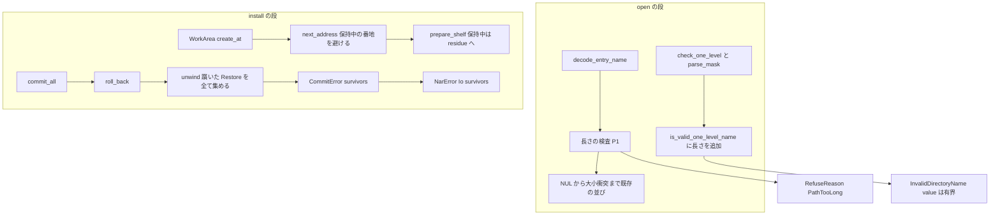
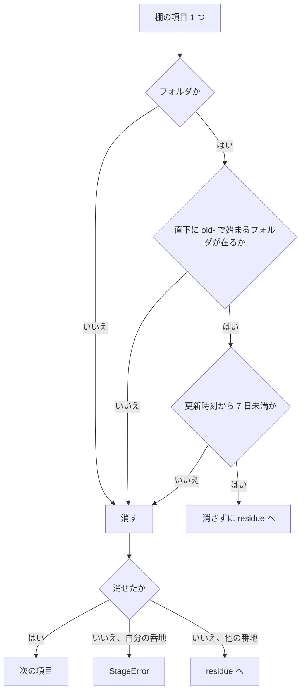

# Design Document: areka-P0-nar-install-hardening

> 2026-09-23 設計。入力は確定済みの `requirements.md`（4 要件・34 受入基準）と `research.md`（ギャップ分析＋要件ディスカッションの振り分け §9）。§9 で「設計へ持ち越す」とされた 5 件（拒否の語・検査の位置・在りかの表し方と運び方・`InvalidDirectoryName` の載せ方・片付けの例外の細部＝失敗時刻の根拠とテストでの時刻の与え方）と調査 3 件を本書で確定する。調査は本ブランチ（HEAD `50c3fef5`）で 2026-09-23 に実測した（`research.md` §10）。引用は行番号でなく「何の定義か」で指す。

## Overview

**Purpose**: `areka-nar` が見知らぬ作者の `.nar` を受け取る口を 3 点で堅くする。⑴ 途方もなく長い名前を、宛先にも作業フォルダにも触れる前に、理由の分かる形で断る。⑵ 確定に失敗して巻き戻せなかったとき、利用者の元の木が生き残っている場所を失敗の値から取り出せるようにし、その場所を 7 日のあいだ後続の展開の片付けから守る。⑶ 確定の段の失敗を公開の入口 `NarArchive::install` で本当に起こす決定論テストを置き、失敗の記録の `work` の欄を検査する。

**Users**: `.nar` を窓へ落とす第三者（間接）と、`areka-nar` の失敗を利用者へ見せる側の実装者（`areka-P0-ghost-install`・`areka-P0-update-engine`）。

**Impact**: 本番のソース 5 ファイル（`names.rs`・`error.rs`・`manifest.rs`・`install.rs`・`lib.rs`。`plan.rs` は触らない）に合計 60〜80 行、兄弟テスト 6 ファイルに 250〜350 行、文書 1 行。新しい仕組み・新しいファイル・新しい依存は 0。呼び手（`sample-ghost-kit`）の追随は 0。公開面の変化は、拒否語彙が 13 から **14** に増えること（`PathTooLong`）と、`NarError::Io` に欄 `survivors` が 1 つ増えること（型 `SurvivingTree` を新設）の 2 つ。

### Goals

- 書庫の 1 要素の相対パスと `install.txt` のフォルダ名に、UTF-16 の単位で数える上限 **200** を 1 つの定数で置き、超えた書庫を `open` の段で拒む（1.1〜1.11）。
- 巻き戻せなかった宛先ごとに、元の中身が生き残っている `old-<k>/` の絶対パスを `NarError::Io` から取り出せるようにし、その作業フォルダを失敗から 7 日のあいだ棚の片付けから守る（2.1〜2.11）。
- 公開の入口で確定の段の失敗を起こし、失敗の値と記録の `work` の欄の両方を判定する決定論テストを置く（3.1〜3.7）。
- `doc/COMPAT_ARCHITECTURE.md` §8 に上限の裁量を 1 行登記し、触らないと決めた場所が無傷であることを完了手順で確かめる（4.1〜4.5）。

### Non-Goals

- 網羅台帳 `doc/ukadoc-coverage/` の更新と `areka-nar/src` への正典 URL のコメント行（`ghost-install`）。
- 利用者への見せ方（`OnInstallFailure` の理由・告知の文面・生き残った木の救い出し方）（`ghost-install` へ申し送り済み）。
- 展開先の**絶対パス**の長さ（根の長さに左右される）。上限の内側で OS が落ちる場合は今のまま `phase: Stage` の I/O 失敗（1.11）。
- 復号できない名前の理由 `NameUndecodable` が生バイト全体の 16 進を載せる既存の形（完了 spec 要件 2.4・付録 A「2.1〜2.7 触らない」）。
- 失敗の経路で棚の残り物（`residue`）を報告する配線（要件 2.7 は既存の出口＝成功時の `leftovers` を指す）。
- 常駐の見張り・予約による片付け（2.9）。

## Boundary Commitments

### This Spec Owns

- `names.rs` の検査の並びに足す「長さ」の項と、その上限の定数 `MAX_ENTRY_PATH_UTF16`（＝200）・数え方（UTF-16 の単位）・理由に載せる先頭の有界の一部の長さ。
- 拒否語彙の変種 **`PathTooLong`**（14 番目）と、`InvalidDirectoryName`・`InvalidMaskEntry` の `value` に載せる値を有界にする規則。
- `NarError::Io` の欄 **`survivors: Vec<SurvivingTree>`** と公開型 `SurvivingTree`、およびそれを `unwind` → `roll_back` → `CommitError` → `place` と運ぶ経路。
- 棚 `<根>/.nar-work/` の片付けにおける保持の規則（`old-` で始まる子を持つ作業フォルダは、その更新時刻から `SURVIVOR_RETENTION`＝7 日のあいだ消さない）と、自分の番地が保持中のときに別の番地を取る規則。
- 失敗の記録の `work` の欄の意味（掘ったなら巻き戻せたかに関わらずその場所）の注釈と、それを固定するテスト。
- `doc/COMPAT_ARCHITECTURE.md` §8 の 1 行。

### Out of Boundary

- `commit_one`・`roll_back` の手順そのもの（順序・退避の場所・`rename` の 2 手）。本仕様は `unwind` が躓きを**集めて返す**ようにするだけで、解く順も解く内容も変えない（2.11）。
- `log_failure` が出す記録の欄の集合（`archive`・`committed`・`message`・`reason`・`rolled_back`・`work`）。在りかは `work` の配下（2.4）なので記録に新しい欄は足さない。
- `sample-ghost-kit`（`NarBuilder`・`WorkDir`・登記表）・`fold-samples`・検体 6 体・`.kiro/steering/`・`doc/ukadoc-coverage/`。
- `plan.rs`（`existing_target_ghost` が `is_valid_one_level_name` を共有しているので上限が**自動で及ぶ**が、`plan.rs` の行は 1 つも変えない）。

### Allowed Dependencies

- 既存の依存だけを使う: `std`（`str::encode_utf16`・`std::time::{SystemTime, Duration}`・`fs::Metadata::modified`）・`thiserror`・`tracing`。**新しい crate は 0**（`filetime` 等の時刻操作 crate も入れない。テストは時刻を引数で渡す）。
- モジュールの向き（既存のまま）: `container` → `names` → `manifest`／`plan` → `install` → `lib`。`error` は全員が使う語彙。`names.rs` は本体にファイルシステム・プロセスの綴り（`fs::`・`path::`・`process::`）を 1 つも持たない（`names_tests.rs` の `names_source_contains_no_filesystem_mutation` が字面で見張る。定数の注釈も「パス」と書き `std::path::` とは書かない）。
- 記録を出す本番ソースは `lib.rs` だけ（`lib_tests.rs` の `only_the_public_surface_writes_records`）。`install.rs` の片付けの例外は `residue` に載せるだけで記録を出さない。

### Revalidation Triggers

- `NarError::Io` の欄が増える（`survivors`）→ `ghost-install`・`update-engine` が失敗の値を組む／読む箇所を再確認（本日時点で crate の外に組み立て箇所は 0）。
- `RefuseReason` が 14 変種になる → `ghost-install` の `OnInstallFailure` への写し（`kind()` に `PathTooLong` が加わる）。
- `.nar-work/` の棚に 7 日まで残る作業フォルダが生じる → `ghost-install` の告知（「7 日後に自動で消える」）・`baseware-root-layout` の根の掃除方針。
- `MAX_ENTRY_PATH_UTF16` の値を変える → §8 の行と本設計の境界テストの固定入力を同じ変更で改める。

## Architecture

### Existing Architecture Analysis

- **検査は `open` に集約され、書く前に全部済む**（完了 spec 要件 4.1）。`NarArchive::read` は `read_central_directory` → `validate_entry_names` → `inflate_entry` → `locate_install_txt` → `parse_manifest` の順。名前の検査 `validate_one` は 復号 → NUL → `\` → 絶対 → `..` → 空要素 → Windows 名 → シンボリックリンク の順で、最初に当たった理由で書庫全体を拒否する。
- **失敗の値は 2 変種**（`NarError::Refused`／`NarError::Io`）。`Io` は `archive`・`phase`・`path`・`source`・`committed`・`rolled_back` の 6 欄。組み立て箇所は `lib.rs` に 3（`read`・`io`・`place`）＋`error_tests.rs` の見本 2。
- **確定は作業フォルダ経由の入れ替え**（`commit_all` → `commit_one`）。失敗時は `roll_back` が `unwind` で逆順に解き、最初に躓いた宛先だけを `CommitError.path` に載せる。失敗の経路では作業フォルダを片付けない（`WorkArea` に `Drop` 無し）。
- **棚の片付けは展開の開始時だけ**（`WorkArea::create` → `prepare_shelf`）。棚の中身を全て消し、消せなければ自分の番地なら失敗・他なら `residue` へ。`residue` は成功時に `InstallOutcome.leftovers` へ合流し `lib.rs` が warn で出す。
- **記録の出口は `lib.rs` の 1 か所**（`log_failure`・`tracing::error!` はちょうど 1 つ）。`work` の欄は `place` が `WorkArea::create` 直後に預けた場所で、巻き戻せたかに関わらず載る（注釈だけが「`rolled_back` が真なら空」と食い違っている）。

### Architecture Pattern & Boundary Map

**Selected pattern**: 既存の関数に 1 手ずつ足す（`research.md` 案 A）。新しい部品・新しいファイルは 0。



**Architecture Integration**:
- 長さの検査は復号の**直後・NUL の前**（P1）に置く。長すぎる名前は他のどの検査でも意味を成さず、後段の `UnsafePath { name: 全体 }` へ長い文字列を一度も写さない（1.4 の趣旨）。
- 在りかは `unwind` が躓いた `Restore` ごとに集め、`roll_back` → `CommitError` → `place` の既存の写しの経路で `NarError::Io` まで運ぶ。既存の「最初に躓いた 1 つを `path` に載せる」は変えない（2.1）。
- 保持の規則は `prepare_shelf` の削除の直前に 1 つの判定 `is_retained` を足す形。時刻は `WorkArea::create_at(root, now)` の引数で受け、本番は `SystemTime::now()` を渡す（2.10 のテストが実際の日数を待たないための唯一の口）。
- 既存の見張り（字面・記録の発火点・語彙の完全一致・行数）は全て効いたまま。手書きの数（13／14）は同じ変更で改める。

### Technology Stack

| Layer | Choice / Version | Role in Feature | Notes |
|-------|------------------|-----------------|-------|
| 長さの数え方 | `std` `str::encode_utf16().count()` | UTF-16 の単位（Windows がパスの長さを数える単位） | 検体 6 体では文字数・UTF-8 バイト数と同じ値。BMP 外の文字で差が出ることを較正テストが判定 |
| 時刻 | `std::time::{SystemTime, Duration}`・`fs::Metadata::modified` | 作業フォルダの更新時刻と保持の期限の比較 | 時刻操作 crate は入れない。テストは `now` を引数で渡す |
| ファイル共有 | `std::os::windows::fs::OpenOptionsExt::share_mode` | 確定の失敗と巻き戻しの失敗をテスト内で起こす | `install_commit_tests.rs` の `hold` と同じ `FILE_SHARE_READ`（1）。実測: `FILE_SHARE_DELETE` を足してもフォルダの `rename` は失敗する（os error 5）ので、確定と巻き戻しの非対称は 1 本の走行では作れない |
| 記録 | `tracing`（既存） | 変更 0（欄の集合も発火点も同じ） | |

## File Structure Plan

### Directory Structure

新設ファイルは 0。触るのは `crates/areka-nar/src/` の既存 11 ファイルと文書 1。

```
crates/areka-nar/src/
├── names.rs                    # 定数 MAX_ENTRY_PATH_UTF16・utf16_len・head_utf16・bounded_value・validate_one の P1・is_valid_one_level_name の長さ
├── names_tests.rs              # 長さが他の全ての理由より先に勝つ順序のテスト・is_valid_one_level_name の境界
├── error.rs                    # PathTooLong 変種・SurvivingTree 型・NarError::Io の survivors 欄
├── error_tests.rs              # 見本に PathTooLong・件数 14・Io の見本に survivors
├── manifest.rs                 # check_one_level と parse_mask の value を bounded_value で有界にする（各 1 行）
├── install.rs                  # SURVIVOR_RETENTION・is_retained・next_address・create_at・prepare_shelf の保持・unwind が躓きを集める・CommitError の survivors
├── install_tests.rs            # 保持の内側で残る／期限を過ぎて消える／保持中の番地を避ける
├── install_commit_tests.rs     # roll_back で old が実在のまま残り survivors が指す（欄を外すと赤）・既存の躓きのテストに survivors の判定
├── lib.rs                      # Io の組み立て 3 か所に survivors・place と log_failure の注釈
├── lib_tests.rs                # open 経由の境界 5 本・公開の入口で確定を失敗させる 1 本（hold の写し）
└── lib_vocabulary_tests.rs     # cases() に PathTooLong・件数 14
doc/COMPAT_ARCHITECTURE.md      # §8 の表の末尾に 1 行
```

### Modified Files

- `crates/areka-nar/src/names.rs` — 定数と数え方の唯一の定義点。`validate_one` の復号直後に長さの検査（`PathTooLong`）。`is_valid_one_level_name` に `utf16_len(name) <= MAX_ENTRY_PATH_UTF16` の 1 条件。`head_utf16`（先頭 `HEAD_UTF16`＝32 単位）と `bounded_value`（上限の内側なら全体、超えていれば先頭＋測った長さ＋上限）。モジュール注釈の順序の列挙を「復号 → 長さ → NUL → …」に改める。
- `crates/areka-nar/src/error.rs` — `refuse_reasons!` に `PathTooLong { index, length, limit, head }` を `NameUndecodable` の直後に 1 変種。`SurvivingTree { destination, path }` を新設し公開。`NarError::Io` に `survivors: Vec<SurvivingTree>`。注釈「13 変種」→「14 変種」。
- `crates/areka-nar/src/manifest.rs` — `check_one_level` の `value: value.to_owned()` と `parse_mask` の `value: element.to_owned()` を `bounded_value(...)` に（判定そのものは `is_valid_one_level_name` の側で効く）。
- `crates/areka-nar/src/install.rs` — `SURVIVOR_RETENTION`・`is_retained(entry, now)`・`next_address(shelf, now, serial)`・`WorkArea::create_at(root, now)`（`create` はこれに `SystemTime::now()` を渡す薄い皮）・`prepare_shelf(shelf, dir, now)` の削除前の判定・`unwind` の戻り値に `survivors`・`CommitError.survivors`。
- `crates/areka-nar/src/lib.rs` — `read`・`io`・`place` の `NarError::Io` に `survivors`（前 2 つは空、`place` は `failure.survivors`）。`place` と `log_failure` の注釈を 2.5 の意味に改める（実装は変えない）。
- `crates/areka-nar/src/lib_tests.rs` — `before.len() >= 14` → `>= 15`。境界テスト 5 本・確定の失敗 1 本・`hold` の写し（`OpenOptionsExt`）。
- `crates/areka-nar/src/lib_vocabulary_tests.rs` — `cases()` に `PathTooLong` の固定入力・`observed.len() == 13` → `14`・注釈 3 か所。
- `crates/areka-nar/src/error_tests.rs` — `samples_in_declaration_order` に `PathTooLong`・`all_kinds_has_thirteen_entries` → `all_kinds_has_fourteen_entries`（14）・`Io` の見本 2 か所に `survivors`・`PathTooLong` の表示が `head` と `length` と `limit` を落とさないこと。
- `crates/areka-nar/src/names_tests.rs` — 順序（長さが NUL・`\`・`..`・予約名より先に勝つ）1 本・`is_valid_one_level_name` の 200／201 の境界 1 本。
- `crates/areka-nar/src/install_tests.rs` — 保持の 3 本。
- `crates/areka-nar/src/install_commit_tests.rs` — `roll_back` 直接呼びで `old` が元のバイト列のまま残り `survivors` がそれを指す 1 本。既存 `a_rollback_that_cannot_finish_reports_the_first_stuck_destination` に「`old` が実在しない躓きは `survivors` に載らない」の判定を足す。
- `doc/COMPAT_ARCHITECTURE.md` — §8 の表（性能目標の小節の前）の末尾に 1 行。

## System Flows

### 棚の片付けの判定（`prepare_shelf`・要件 2.7〜2.9）



- 「自分の番地」は `next_address` が保持中の番地を避けて取るので、`Keep` の腕に自分の番地が来ることは無い。`Stop` の腕は既存のまま（保持されていない自分の番地が消せない＝前回の木が混ざる）。
- 時刻の根拠は**作業フォルダ `<pid>-<連番>/` の更新時刻**。`old-<k>` はその直下へ `rename` で入るので、作業フォルダの直下が最後に変わった時刻＝失敗した走行が最後に作業フォルダを触った時刻（失敗の直前）になる。`old-<k>` 自身の更新時刻は使わない（`rename` はフォルダ自身の更新時刻を変えないので、利用者のゴーストの最終更新時刻になってしまう）。時計が戻っていて更新時刻が `now` より未来なら経過 0 として扱う（保持側へ倒す）。

### 在りかの運び方（`unwind` → `NarError::Io`・要件 2.1〜2.4）

1. `unwind` は積んだ手を逆順に解く（既存）。躓いた手が `Undo::Restore { old, dest }` で、かつ `old` がフォルダとして実在するとき、`SurvivingTree { destination: dest, path: old }` を集める。`Undo::Remove` の躓きは集めない（宛先はもともと無かった＝2.3）。最初の躓きを `stuck` に取る既存の動きは変えない。
2. `roll_back` は `unwind` の戻り値（`stuck` と `survivors`）を `CommitError` に写す。`rolled_back: true` のとき `survivors` は必ず空（躓きが無ければ集まらない）。
3. `place` は `CommitError` を `NarError::Io` に写す（既存の 5 欄＋`survivors`）。`read`・`io` は空の `Vec` を置く。
4. 失敗の経路では作業フォルダを片付けない（既存）ので、`survivors` の各 `path` は失敗の値を受け取った時点で実在し、元の中身をバイト列そのままで含む（2.2）。全て `work`（＝`area.path()`）の配下（2.4）。

## Requirements Traceability

| Requirement | Summary | Components | Interfaces | Flows |
|---|---|---|---|---|
| 1.1 | 相対パス全体に根に依存しない 1 定数の上限 | `names.rs` `MAX_ENTRY_PATH_UTF16`・`validate_one` | `RefuseReason::PathTooLong` | open の段 |
| 1.2 | UTF-16 の単位で数える | `names.rs` `utf16_len` | — | — |
| 1.3 | 超えたら書庫全体を `open` の段で拒否・1 バイトも書かない | `validate_one`（`validate_entry_names` 経由・`read` の中） | `NarError::Refused` | open の段 |
| 1.4 | 理由に番号・長さ・上限・先頭の有界の一部。全体は載せない | `PathTooLong { index, length, limit, head }`・`head_utf16` | 表示（`thiserror`） | — |
| 1.5 | `directory` 系にも同じ定数。既存の理由で拒否・値は有界 | `is_valid_one_level_name`・`bounded_value`・`check_one_level`・`parse_mask` | `InvalidDirectoryName`・`InvalidMaskEntry` | — |
| 1.6 | 値は 200・定数 1 か所・理由と §8 が値を綴る | `MAX_ENTRY_PATH_UTF16`・`PathTooLong.limit`・§8 の行 | — | — |
| 1.7 | 要素ごとの別の上限は持たない | `names.rs`（要素の上限の定数 0） | — | — |
| 1.8 | 閉じた語彙の中で表す・全数対応は足すだけ | `refuse_reasons!` に 1 変種・`cases()` に 1 件・件数 14 | `ALL_KINDS` | — |
| 1.9 | 上限ちょうど受理・＋1 拒否を `open` で判定 | `lib_tests.rs` 境界 5 本 | `NarArchive::open` | — |
| 1.10 | 登記済み検体 5 本が変更 0 で受理 | `sample-ghost-kit` `every_registered_sample_lands_where_its_registry_row_says`（変更 0） | — | — |
| 1.11 | 上限の内側で OS が落ちる場合は変えない | `stage_placement`（変更 0） | `NarError::Io { phase: Stage }` | — |
| 2.1 | 戻せなかった宛先ごとの生き残りを全て取り出せる | `unwind`・`SurvivingTree`・`NarError::Io.survivors` | `SurvivingTree` | 在りかの運び方 |
| 2.2 | 取り出せるフォルダは実在し元の中身を持つ | `unwind`（`old.is_dir()` の判定）・失敗経路で片付けない既存の性質 | — | 在りかの運び方 4 |
| 2.3 | 戻せた・掘る前・`Remove` だけの躓きは 0 件 | `unwind`（`Remove` は集めない）・`read`／`io` は空 | `Vec` が空 | 在りかの運び方 1 |
| 2.4 | 在りかは `work` の配下 | `WorkArea::retired`（`old-<k>` は `area.path()` 直下） | — | — |
| 2.5 | `work` は掘ったならその場所・拒否と掘る前は空 | `place`・`log_failure` の注釈（実装は変更 0） | 記録の `work` 欄 | — |
| 2.6 | 欄を外すと赤・本当に戻せなかった巻き戻しで実在を判定 | `install_commit_tests.rs` `roll_back` 直接呼び＋`hold`＋`tree` | — | — |
| 2.7 | 7 日の内側の生き残りは消さず residue へ・期限は 1 定数 | `SURVIVOR_RETENTION`・`is_retained`・`prepare_shelf` | `InstallOutcome.leftovers`（既存） | 棚の片付けの判定 |
| 2.8 | 期限を過ぎたら消す・`old-` 無しは毎回消す | `prepare_shelf` | — | 棚の片付けの判定 |
| 2.9 | 判定は展開の開始時だけ | `WorkArea::create_at`（呼び手は `place` だけ） | — | — |
| 2.10 | 実際の日数を待たずに内外を判定 | `create_at(root, now)` の `now`・`install_tests.rs` | — | — |
| 2.11 | 確定・巻き戻しの手順は変えない | `commit_one`・`roll_back`・`unwind` の解く順と内容（変更 0） | — | — |
| 3.1 | 宛先のファイルを掴んだまま公開の入口で確定を失敗させる | `lib_tests.rs` `hold`（`FILE_SHARE_READ`）＋`NarArchive::install` | — | — |
| 3.2 | 失敗の値＝Commit・巻き戻し済み・対象は掴んだ宛先・宛先はバイト同一 | 同上＋`tree` | `NarError::Io` | — |
| 3.3 | 記録 1 件・`work` は非空で `.nar-work` 配下の実在フォルダ | 同上＋`log_capture_kit::capture`・`CapturedEvent::field` | 記録の `work` 欄 | — |
| 3.4 | 欄ごとに比べる | `field("work")`・`field("rolled_back")` を別々に読む | — | — |
| 3.5 | 全数対応のテストを弱めない | `lib_vocabulary_tests.rs`（判定の変更 0・件数 14・入力 1 件追加） | — | — |
| 3.6 | 純 x64・`cargo test -p areka-nar` | 全テスト | — | — |
| 3.7 | 1 ファイル 1,000 行・例外表に触れない | 行数の見積り（下の Testing Strategy） | `the_new_files_stay_under_the_line_limit` | — |
| 4.1 | §8 に 1 行 | `doc/COMPAT_ARCHITECTURE.md` | — | — |
| 4.2 | `doc/ukadoc-coverage/` 0・正典 URL のコメント 0 | 完了手順の `git diff --stat`・`git grep` | — | — |
| 4.3 | 呼び手の変更 0 | `sample-ghost-kit`（変更 0・`NarBuilder::file` は任意のバイト列） | — | — |
| 4.4 | 検体 6 体は 1 バイトも変えない | `vendors/sample_ghost/`（変更 0） | — | — |
| 4.5 | steering は触らない | `.kiro/steering/`（変更 0） | — | — |

## Components and Interfaces

| Component | Domain/Layer | Intent | Req Coverage | Key Dependencies (P0/P1) | Contracts |
|---|---|---|---|---|---|
| 長さの規則（`names.rs`） | 検査 | 上限の定数・数え方・有界の表示を 1 か所で持つ | 1.1〜1.7 | `error.rs`（P0） | Service |
| 拒否語彙の追加（`error.rs`） | 語彙 | `PathTooLong` と `SurvivingTree`・`Io.survivors` | 1.4, 1.8, 2.1, 2.3 | — | State |
| マニフェストの有界表示（`manifest.rs`） | 検査 | 上限を超えた `directory`／mask の値を有界に載せる | 1.5 | `names.rs`（P0） | — |
| 在りかの収集（`install.rs` `unwind`〜`CommitError`） | 確定 | 躓いた `Restore` の `old` を全て集めて運ぶ | 2.1〜2.4, 2.11 | `error.rs`（P0） | Service |
| 棚の保持（`install.rs` `WorkArea`） | 片付け | 生き残りを含む作業フォルダを 7 日守り、番地を避ける | 2.7〜2.10 | `std::time`（P0） | Service |
| 公開面の写し（`lib.rs`） | 出口 | `Io` の組み立てに `survivors`・注釈の是正 | 2.3, 2.5 | `install.rs`（P0） | State |
| 決定論テスト群 | 検証 | 境界・確定の失敗・保持・欄の実在 | 1.9, 2.6, 2.10, 3.1〜3.7 | `sample-ghost-kit`・`log-capture-kit`（P0・dev 依存） | — |
| 文書（§8） | 登記 | 裁量の 1 行 | 4.1 | — | — |

### 検査（`names.rs`・`manifest.rs`）

#### 長さの規則

| Field | Detail |
|---|---|
| Intent | 上限の定数・数え方・先頭の有界の一部・有界の表示を `names.rs` に集める |
| Requirements | 1.1, 1.2, 1.3, 1.4, 1.5, 1.6, 1.7 |

**Responsibilities & Constraints**
- 定数は 1 つ: `pub(crate) const MAX_ENTRY_PATH_UTF16: usize = 200;`。要素ごとの定数は持たない（1.7。全体 ≤ 200 < 255 なので NTFS の要素の上限は自動で満たす）。
- 先頭の有界の一部の長さは `const HEAD_UTF16: usize = 32;`（表示のための長さで、上限ではない。文字の途中で切らない＝BMP 外の 1 文字は 2 単位として丸ごと入れるか外す）。
- `names.rs` の本体は `fs::`・`path::`・`process::` を綴らない。`encode_utf16` はどれにも当たらない。定数の注釈は「パスの長さ」と書く。
- 検査の位置は復号の直後（P1）。測る対象は `name.strip_suffix('/')`（フォルダのエントリの末尾の `/` を除いた形）。受理される名前では `trimmed == components.join("/")` が成り立つ（空の要素を含む名前は後段で拒否される）ので、P1 で測る長さは 1.1 の「正規化を終えた全体」の長さと一致する。

##### Service Interface

```rust
/// 書庫の 1 要素の相対パスと install.txt のフォルダ名に共通の上限（UTF-16 の単位）。
pub(crate) const MAX_ENTRY_PATH_UTF16: usize = 200;

/// UTF-16 の単位で数えた長さ（BMP の文字は 1・それ以外は 2）。
pub(crate) fn utf16_len(name: &str) -> usize;

/// 先頭の有界の一部（最大 HEAD_UTF16 単位・文字の途中で切らない）。PathTooLong.head に載せる。
fn head_utf16(name: &str) -> String;

/// 理由と警告に載せる値。上限の内側なら全体、超えていれば
/// 「{先頭}…（{測った長さ} 単位・上限 {MAX_ENTRY_PATH_UTF16}）」。
pub(crate) fn bounded_value(name: &str) -> String;

/// 既存。空・`/`・`\`・Windows 名に「長さ ≤ MAX_ENTRY_PATH_UTF16」を 1 条件足す。
pub(crate) fn is_valid_one_level_name(name: &str) -> bool;
```

- Preconditions: `validate_one` は復号に成功した `name` に対してだけ長さを測る（復号できない名前は既存どおり `NameUndecodable`）。
- Postconditions: `utf16_len(trimmed) > MAX_ENTRY_PATH_UTF16` なら `RefuseReason::PathTooLong { index, length: 測った長さ, limit: MAX_ENTRY_PATH_UTF16, head: head_utf16(trimmed) }` で拒否し、後段の検査には進まない。受理された `EntryName.path` は必ず `utf16_len(path) <= MAX_ENTRY_PATH_UTF16`。
- Invariants: `bounded_value(v)` の長さは `HEAD_UTF16` に定型の後置き（十数文字）を足した値で有界。`v` が上限の内側なら `bounded_value(v) == v`。

**Implementation Notes**
- Integration: `check_one_level` と `parse_mask` は `value: bounded_value(値)` に置き換えるだけ（判定は `is_valid_one_level_name` 側で効く）。`existing_target_ghost`（`plan.rs`）にも上限が及び、200 単位を超える名前のゴーストは宛先に選べなくなる。そうした名前のゴーストは 1.5 を通らないと作れないので実害は無く、`TargetGhostMissing.target` は呼び手が渡した値（書庫由来ではない）なので有界にしない。**明記して受け入れる**（`research.md` §6-3）。
- Validation: `names_tests.rs` に「長さが NUL・`\`・`..`・予約名より先に勝つ」（`"\u{0}../CON.txt"` の後ろに `a` を 200 個足した名前が `PathTooLong` になる）と `is_valid_one_level_name` の 200／201。`lib_tests.rs` に `open` 経由の境界（下の Testing Strategy）。
- Risks: 復号できない 65,535 バイトの名前は既存どおり `NameUndecodable { raw_hex }` が生バイト全体の 16 進（最大 131,070 文字）を載せる。要件の付録 A（2.1〜2.7 は触らない・長さは復号の後）に従い本仕様は変えない。残る穴として「Open Questions / Risks」に記す。

### 語彙（`error.rs`）

#### 拒否語彙の追加と在りかの型

| Field | Detail |
|---|---|
| Intent | `PathTooLong`（14 番目の語）と `SurvivingTree`・`NarError::Io.survivors` |
| Requirements | 1.4, 1.8, 2.1, 2.3 |

##### State Management

```rust
// refuse_reasons! の中・NameUndecodable の直後に置く（宣言順＝検査順）。
/// エントリ名が長すぎる（要件 1.1〜1.4）。名前の全体は持たず、先頭の有界の一部だけを持つ。
#[error("エントリ {index} の名前が長すぎる（{length} 単位・上限 {limit}・先頭 {head}…）")]
PathTooLong { index: usize, length: usize, limit: usize, head: String },

/// 巻き戻せなかった宛先 1 つぶんの、元の中身が生き残っている場所（要件 2.1）。
#[derive(Clone, Debug, PartialEq, Eq)]
pub struct SurvivingTree {
    /// 元へ戻せなかった宛先（利用者から見えるインストール済みフォルダ）。
    pub destination: PathBuf,
    /// その宛先の確定前の中身がそのまま残っているフォルダ（作業フォルダの直下 old-<k>）。
    pub path: PathBuf,
}

// NarError::Io に 1 欄足す（既存の 6 欄は変えない）。
/// 元へ戻せなかった宛先ごとの生き残り。巻き戻せた・掘る前・新規の宛先を消す手だけが
/// 躓いた場合は空。全て失敗の記録の work の配下に在る。
survivors: Vec<SurvivingTree>,
```

- State model: `RefuseReason` は 14 変種で閉じる。`ALL_KINDS` は宣言から自動で伸びる。`SurvivingTree` は `InstalledElement` と同じく `error.rs` に置く（`NarError::Io` が持つ型は語彙と同じ場所）。
- Persistence & consistency: `survivors` が非空 ⇒ `rolled_back == false`（逆は成り立たない: `Remove` だけが躓いた場合は `rolled_back == false` かつ `survivors` は空）。
- Concurrency strategy: 値型。共有は無い。

**Implementation Notes**
- Integration: `pub use error::SurvivingTree` を `lib.rs` の公開面に足す。組み立て箇所は `lib.rs` の 3 か所と `error_tests.rs` の見本 2 か所（crate の外は 0）。
- Validation: `error_tests.rs` の `samples_in_declaration_order` に `PathTooLong` を宣言順の位置で足す（足し忘れは `all_kinds_matches_every_variant_in_declaration_order` が赤にする）。`all_kinds_has_thirteen_entries` は `all_kinds_has_fourteen_entries`（14）に。`PathTooLong` の表示が `head`・`length`・`limit` を含み、`head` が 32 単位を超えないことを 1 本。
- Risks: 手書きの数の変更は 4 ファイル 7 か所（`error.rs` 注釈・`error_tests.rs` 関数名と数と注釈・`lib_vocabulary_tests.rs` 注釈 3 か所と `observed.len()`・`lib_tests.rs` の `>= 14`）。同じ変更で改め、生成器（`ALL_KINDS`）との突合で漏れを赤にする。

### 確定と片付け（`install.rs`）

#### 在りかの収集

| Field | Detail |
|---|---|
| Intent | `unwind` が躓いた `Restore` の `old` を全て集め、`CommitError` まで運ぶ |
| Requirements | 2.1, 2.2, 2.3, 2.4, 2.11 |

##### Service Interface

```rust
/// unwind の戻り値。stuck は最初の躓き（既存の意味）・survivors は躓いた Restore の old 全て。
struct Unwound {
    stuck: Option<StageError>,
    survivors: Vec<SurvivingTree>,
}

/// 積んだ手を逆順に解く（解く順・内容は変更 0）。
fn unwind(undo: Vec<Undo>) -> Unwound;

/// 既存の 5 欄に survivors を足す。
pub(crate) struct CommitError {
    pub phase: IoPhase,
    pub path: PathBuf,
    pub source: io::Error,
    pub committed: Vec<InstalledElement>,
    pub rolled_back: bool,
    pub survivors: Vec<SurvivingTree>,
}
```

- Preconditions: `Undo::Restore { old, dest }` の `old` は `commit_one` が `rename(dest → old)` で作った直後の場所（`WorkArea::retired(k)`＝`area.path()/old-<k>`）。
- Postconditions: 躓いた `Restore` ごとに、`old.is_dir()` が真なら `SurvivingTree { destination: dest, path: old }` を集める（`remove_tree(dest)` で躓いても `rename(old → dest)` で躓いても `old` は触られていない）。`old` が実在しない躓き（外から消された・合成した固定入力）は集めない。`Undo::Remove` の躓きは集めない。`stuck` は既存どおり最初の躓き。
- Invariants: `rolled_back == true` ⇒ `survivors.is_empty()`。`survivors` の各 `path` は `area.path()` の直下。

**Implementation Notes**
- Integration: `roll_back` は `Unwound` の 2 欄を `CommitError` に写すだけ。`place` は `failure.survivors` を `NarError::Io` に写す。
- Validation: `install_commit_tests.rs` に「`old-0/` に元の木・宛先に新しい木を置き、宛先の中のファイルを `hold` して `roll_back(vec![Undo::Restore { old, dest }], …)` → `rolled_back == false`・`survivors == [SurvivingTree { destination: dest, path: old }]`・`tree(&old)` が置いた木とバイト列で一致」。`survivors` の欄を外すと組めなくなる（型の欄）ので、欄を外す変更は必ず赤。既存の合成テスト（`old` が無い）には `survivors.is_empty()` を足す。
- Risks: `commit_all` を通して「確定は通るが巻き戻しは失敗」を 1 本の走行で作ることはできない（実測: `FILE_SHARE_DELETE` を足しても子を掴まれたフォルダの `rename` は os error 5）。要件 2.6 が許す「確定の部品の単位」で固定する。

#### 棚の保持

| Field | Detail |
|---|---|
| Intent | 生き残りを含む作業フォルダを更新時刻から 7 日守り、自分の番地が保持中なら別の番地を取る |
| Requirements | 2.7, 2.8, 2.9, 2.10 |

##### Service Interface

```rust
/// 巻き戻せなかった元の木を含む作業フォルダを片付けから守る期間（要件 2.7）。
pub(crate) const SURVIVOR_RETENTION: Duration = Duration::from_secs(7 * 24 * 60 * 60);

impl WorkArea {
    /// 既存の入口。create_at(root, SystemTime::now()) を呼ぶだけ。
    pub(crate) fn create(root: &Path) -> Result<WorkArea, StageError>;
    /// 時刻を受け取る形。片付けの期限の判定にだけ now を使う（テストは now を進めて渡す）。
    pub(crate) fn create_at(root: &Path, now: SystemTime) -> Result<WorkArea, StageError>;
}

/// 棚の項目が「old- で始まるフォルダを直下に持ち、更新時刻から SURVIVOR_RETENTION 未満」か。
/// 読めない・時刻が取れない項目は偽（今までどおり消しにいき、消せなければ residue）。
/// 更新時刻が now より未来なら経過 0 として真。
fn is_retained(entry: &Path, now: SystemTime) -> bool;

/// 保持中でない番地を <pid>-<連番> の形で取る。serial は連番の供給源
/// （本番は NEXT_SERIAL.fetch_add・テストは 0 始まりの閉包）。
fn next_address(shelf: &Path, now: SystemTime, serial: impl FnMut() -> u32) -> PathBuf;

/// 既存に now を足す。項目を消す直前に is_retained を見て、真なら消さず residue へ。
fn prepare_shelf(shelf: &Path, dir: &Path, now: SystemTime) -> Result<Vec<PathBuf>, StageError>;
```

- Preconditions: `create_at` は根が実在すること（既存）。`now` は判定にだけ使い、ファイルには書かない。
- Postconditions: 保持中の項目は 1 バイトも触られず `residue` に載る（→ 成功時に `InstallOutcome.leftovers` → `lib.rs` の warn「work folder left behind」。**新しい記録の出口は足さない**）。期限を過ぎた項目・`old-` を持たない項目は既存どおり消す。`create_at` が返す番地は保持中の項目と一致しない。保持されていない自分の番地が消せないときは既存どおり `StageError`。
- Invariants: 判定の契機は `create_at` だけ（2.9）。保持の期限は 1 定数（2.7）。

**Implementation Notes**
- Integration: `next_address` は `prepare_shelf` の**前**に番地を決める（保持中の番地を避けてから掃く）。連番の供給源を閉包で受けるのは、テストが `NEXT_SERIAL`（プロセス全体で共有・並走するテストが進める）に依らずに「`<pid>-0` が保持中なら `<pid>-1` を取る」を決定論で判定するため。
- Validation: `install_tests.rs` に 3 本。⑴ `999999-0/old-0/descript.txt` を置き `create_at(root, now)` → 残っていて `residue()` に載る。⑵ 同じ仕込みで `create_at(root, now + SURVIVOR_RETENTION + 1s)` → 消えている。⑶ `<pid>-0/old-0/` を置き `next_address(shelf, now, 0 始まりの閉包)` → `<pid>-1`。既存の `stale_work_folders_are_swept_before_staging_starts`（`old-` 無し・消える）が対照になる。
- Risks: 更新時刻は「失敗した時刻」そのものではなく「失敗した走行が最後に作業フォルダの直下を変えた時刻」の近似（同じ走行の中・数秒以内）。保持が期限切れになった後の削除が途中で失敗すると（`0/` は消え `old-0/` で躓く）作業フォルダの更新時刻が進み、次の展開で再び保持側に倒れ得る。消せない物は元々 `residue` に載るので、利用者の見える結果（残っている物として報告される）は変わらない。

### 出口（`lib.rs`）

#### 公開面の写し

| Field | Detail |
|---|---|
| Intent | `NarError::Io` の 3 つの組み立てに `survivors`・`place` と `log_failure` の注釈を 2.5 の意味に |
| Requirements | 2.3, 2.5 |

**Implementation Notes**
- Integration: `read`（`Read`）と `io`（`Stage`）は `survivors: Vec::new()`、`place` は `survivors: failure.survivors`。`log_failure` の記録の欄は変えない（`work` の配下に在るので新しい欄は要らない・全数対応のテストの欄の集合の判定を変えない）。
- Validation: 注釈の側は `lib_tests.rs` の確定の失敗のテスト（`rolled_back == true` で `work` が非空）が固定する。
- Risks: 無し（実装の変更は欄の写し 3 行）。

## Data Models

### Domain Model

- **上限**（値オブジェクト）: `MAX_ENTRY_PATH_UTF16 = 200`（UTF-16 の単位）。書庫の 1 要素の相対パス・`install.txt` の `directory`／`*.directory`／`*.source.directory`・`refreshundeletemask` の各要素・呼び手が渡す宛先ゴーストの名前、の 4 か所に同じ値が効く。
- **生き残り**（値オブジェクト `SurvivingTree`）: 戻せなかった宛先 → その確定前の中身が在る `old-<k>/`。`NarError::Io.survivors` が 0 個以上持つ。
- **保持の期限**（値オブジェクト）: `SURVIVOR_RETENTION = 7 日`。作業フォルダの更新時刻からの経過で判定。
- 不変条件: `survivors ≠ ∅ ⇒ rolled_back = false`。`survivors[i].path` は記録の `work` の直下。受理された `EntryName.path` の長さは上限以下。

### Logical Data Model

変更は型の欄の追加だけ。記憶装置・記録の形式は変わらない。

| 型 | 変更 |
|---|---|
| `RefuseReason` | `PathTooLong { index: usize, length: usize, limit: usize, head: String }` を `NameUndecodable` の直後に追加（14 変種） |
| `InvalidDirectoryName { key, value }`・`InvalidMaskEntry { key, value }` | 形は変えない。`value` は上限の内側なら全体、超えていれば `bounded_value` の形 |
| `SurvivingTree` | 新設（`destination: PathBuf`・`path: PathBuf`）。`Clone`・`Debug`・`PartialEq`・`Eq` |
| `NarError::Io` | `survivors: Vec<SurvivingTree>` を追加 |
| `CommitError`（crate 内） | `survivors: Vec<SurvivingTree>` を追加 |
| 失敗の記録の欄 | 変更 0（`archive`・`committed`・`message`・`reason`・`rolled_back`・`work`） |

## Error Handling

### Error Strategy

- **長さは書く前に断る**: `open` の名前の検査で `PathTooLong`（書庫のエントリ）または `InvalidDirectoryName`（`install.txt` の値）。どちらも `NarError::Refused`＝宛先にも作業フォルダにも触れていない。
- **理由は有界**: 上限を超えた名前・値は、理由にも記録にも全体を載せない（先頭 32 単位＋測った長さ＋上限）。上限の内側の値は今までどおり全体。
- **巻き戻せなかったときは在りかを返す**: `NarError::Io { phase: Rollback, rolled_back: false, survivors }`。`path` は既存どおり最初に躓いた宛先。呼び手は `survivors` を読めば内部の命名規則（`old-<k>`）を知らなくてよい。
- **保持中の作業フォルダは残り物として見える**: 成功時の `leftovers`（既存の warn）。失敗時は既存どおり報告されない（変更 0・Non-Goals）。

### Error Categories and Responses

- 利用者由来（長すぎる名前）→ `RefuseReason::PathTooLong`／`InvalidDirectoryName`。`kind()` の短い語を `OnInstallFailure` に写せる（既存の 13 語と同じ扱い）。
- 環境由来（使用中の宛先・巻き戻しの失敗）→ `NarError::Io`（既存）＋`survivors`。

### Monitoring

- 記録の発火点・欄の集合・重大度は変更 0。`work` の欄の意味を注釈で 2.5 に揃える。保持中の作業フォルダは既存の warn「work folder left behind」に載る。

## Testing Strategy

いずれも純 x64・`cargo test -p areka-nar` の一部（3.6）。根は `sample_ghost_kit::WorkDir`。固定入力は `NarBuilder::file`（名前は任意のバイト列で受ける＝4.3）。行数の見積り: `lib_tests.rs` 390 → 約 600・`lib_vocabulary_tests.rs` 351 → 約 365・`install_tests.rs` 709 → 約 800・`install_commit_tests.rs` 689 → 約 760・`names_tests.rs` 684 → 約 730・`error_tests.rs` 383 → 約 420。いずれも 1,000 未満で例外表に触れない（3.7）。

### Unit Tests

- `names_tests.rs`: ⑴ 長さは他の全ての理由より先に勝つ（NUL・`\`・`..`・予約名を同時に持つ 200 単位超の名前が `PathTooLong` になり、`head` が名前の先頭 32 単位で `length` が測った値）。⑵ `is_valid_one_level_name` が 200 で真・201 で偽。⑶ 字面の見張り（既存）が緑のまま。
- `error_tests.rs`: ⑴ 件数 14・宣言順の一致（見本に `PathTooLong`）。⑵ `PathTooLong` の表示が `index`・`length`・`limit`・`head` を全て含む。⑶ `Io` の見本が `survivors` を持つ（欄を外すと組めない）。
- `install_tests.rs`: 保持の 3 本（保持の内側で残り `residue` に載る／期限を過ぎて消える／保持中の番地を避けて `<pid>-1` を取る）。対照は既存の `stale_work_folders_are_swept_before_staging_starts`。
- `install_commit_tests.rs`: ⑴ `roll_back` 直接呼びで、新しい木の側のファイルを `hold` して `remove_tree(dest)` を失敗させ、`survivors` が実在する `old-0/` を指し、その中身が置いた元の木とバイト列で一致する（2.2・2.6）。⑵ 既存の合成テストに「`old` が実在しない躓きは `survivors` に載らない」と「`Remove` の躓きは載らない」を足す（2.3）。

### Integration Tests（公開の入口）

- `lib_tests.rs` 境界 5 本（1.9）: ⑴ `g/`＋`a`×198（200）が `open` を通る。⑵ `g/`＋`a`×199（201）が `PathTooLong { index, length: 201, limit: 200 }` で拒否され、理由の表示が名前の全体を含まない。⑶ `g/`＋`a`×197＋`𠮷`（文字数 200・単位 201）が拒否される（UTF-16 の較正）。⑷ `directory,`＋`a`×200 が通る。⑸ `directory,`＋`a`×201 が `InvalidDirectoryName` で拒否され、`value` が全体を含まず `201` と `200` を含む。
- `lib_tests.rs` 確定の失敗 1 本（3.1〜3.4）: `<根>/ghost/tester/shiori.dll` を置いて `hold`（`FILE_SHARE_READ`）し、`capture` の中で `open` → `install`。判定は⑴ `NarError::Io { phase: Commit, path == 宛先, rolled_back: true, committed: [], survivors: [] }`、⑵ 宛先の `tree` が呼ぶ前と一致、⑶ error の記録がちょうど 1 件で `field("work")` が空でなく、`Path::new(…)` が `is_dir()` かつ `starts_with(root.join(".nar-work"))`、⑷ `field("rolled_back")` を別に読む（連結した綴りで比べない）。
- `lib_vocabulary_tests.rs`（3.5）: `cases()` に `PathTooLong`（`g/`＋`a`×199）を足し、件数を 14 に。判定の形は変えない。
- `sample-ghost-kit`（1.10）: `every_registered_sample_lands_where_its_registry_row_says` が変更 0 で緑（検体の最長 53 ≪ 200）。

### 完了時の検証手順（4.2〜4.5）

- `git diff --stat main -- doc/ukadoc-coverage/ vendors/sample_ghost/ crates/sample-ghost-kit/ .kiro/steering/` が空。
- `git grep -n '// ukadoc:' -- crates/areka-nar/src/` が 0 行。
- `doc/COMPAT_ARCHITECTURE.md` §8 の差分が 1 行の追加のみ。

## Open Questions / Risks

- **復号できない名前の `raw_hex`**: `NameUndecodable` は生バイト全体の 16 進を載せるので、復号できない 65,535 バイトの名前は記録の 1 行が 131,070 文字になる。要件の付録 A（完了 spec 2.4 は触らない・長さは復号の後）に従い本仕様は変えない。塞ぐなら `raw_hex` を先頭の有界の一部に切り詰める 1 行だが、既存の理由の中身を変える判断なので別途扱う（`ghost-install` の告知の設計時に再検討）。
- **長いパスの実測**: このツールチェーン（rustc 1.98.1・Windows 11・`LongPathsEnabled = 1`）では UTF-16 で 431 単位の絶対パスの `create_dir_all`／`write`／`rename`／`remove_dir_all` が全て通った。Rust の標準ライブラリが長い絶対パスに `\\?\` を付けるためで、OS の設定が 0 の機体でも areka 自身の書き込みは通り得る。上限の意味は「areka が落ちないため」ではなく「長いパスに対応しない読む側（`LoadLibrary` で `shiori.dll` を読む等）を守る」「異常な名前を入口で見つける」ことにある。§8 の根拠にこの旨を書く。
- **更新時刻の近似**: 保持の期限は作業フォルダの更新時刻から数える（失敗の時刻の近似）。印のファイルや名前への刻印は、失敗の経路に新しい書き込みを足すことになるので採らない。
- **並走**: `doc/COMPAT_ARCHITECTURE.md` §8 の表の末尾は `areka-P0-shiori-loadu` も行を足す。後着が取り込む（要件どおり）。
