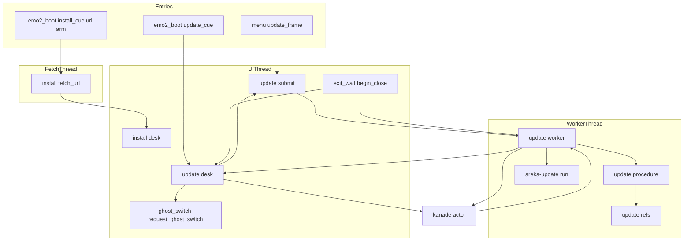
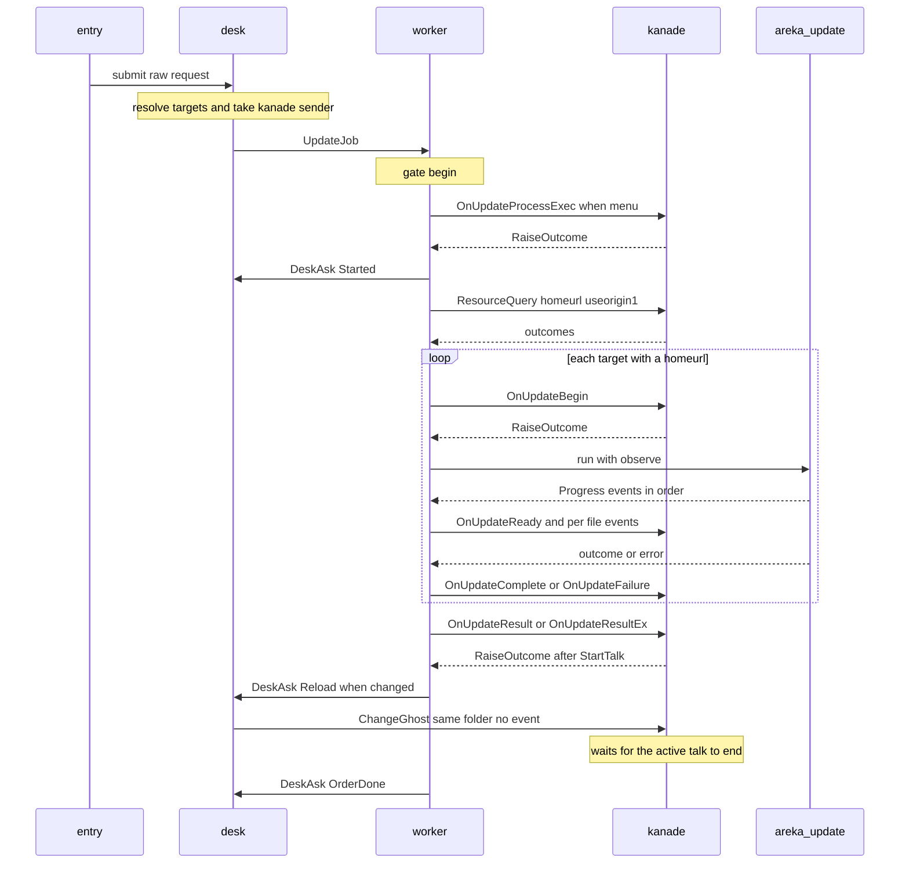
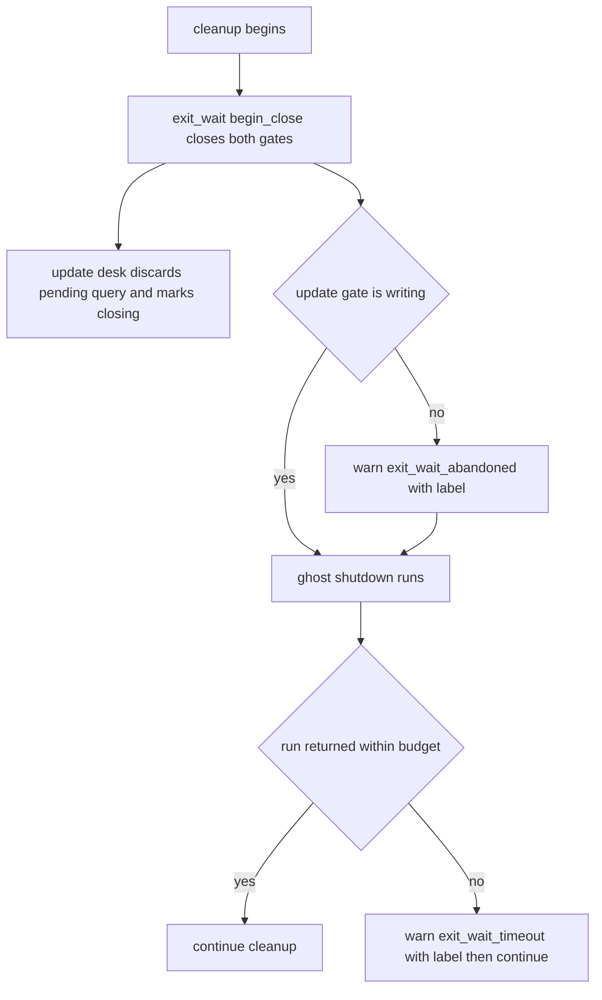

# Design Document: areka-P0-network-update

> 2026-09-29 作成（`/kiro-spec-design -y`）。対象はブランチ `claude/areka-p0-network-update-d76046`（ソースは main `2ec8df59`＝`file-drop` の完了 PR#201 から不変）。コードは「何の定義か」（関数名・型名・定数名＋ファイルパス）で指し、行番号では指さない。本書の主張はソースを読んで確かめた。調査の経緯と採らなかった案は `research.md` の §8 にある。要件の裁定（要件 10）は要件ディスカッションで確定済みで、本書はそれを動かさない。

## Overview

**Purpose**: メニュー「ネットワーク更新」と台本の入口 3 つ（`\![updatebymyself]`・`\![update,…]`・`\![updateother,…]`）から、今のゴースト・今のシェル・今のバルーンを配布サイトから更新できるようにする。手続きは正典のイベント列を起動中のゴーストへ送り、更新の間もゴーストは生きて進捗を話し、何か変わったときだけ最後の台詞が終わってから同じゴーストを読み直す。失敗はメッセージボックスではなく正典の語の理由と記録で伝える。`\![execute,install,url,URL,nar]` は URL から落として完了 `ghost-install` の手続きへ渡す。

**Users**: ゴーストを入れた第三者（作者が配布サイトを直せば手元も新しくなる）。ゴーストの作者（辞書に書いた `OnUpdateBegin`〜`OnUpdateComplete` の返事が動く・台本の `\![updatebymyself]` が効く）。後続 `shell-balloon-switch`・`alpha-release-signoff` の開発者。

**Impact**: 本体 `areka` が初めて `areka-update` に依存する。kanade の許可表が 23 語から 42 語、リソースの許可表が 10 語から 12 語になる。完了 `update-engine` の作業場所の後片付け（`work.rs`）に「成功した確定の残り」を「戻せなかった走行の残骸」と区別する印が 1 つ入る。`ghost_switch::on_notice` の定常到達の腕に呼び出しが 1 行、`ghost_session::register_systems`・`boot_wired` に各 1 行、消費者台帳に 3 行、`install_cue.rs` に `url` の腕、終了で待つ口の上限に達したときの本文の一般化が入る。切替の入口（`SwitchRequest`・`request_ghost_switch`）・終了の判定（`session_mark_verdict`・`ExitOrigin`）・kanade の運行表（`schedule/mod.rs`・`change.rs`）・`KanadeMsg` の変種は変えない。

### Goals
- 入口 4 つが同じ受付 `update::submit` を通り、同じ手続き（背景スレッド 1 本・1 度に 1 本）で扱われる（要件 1）。
- 対象 1 つにつき正典の順（`OnUpdateBegin` → `OnUpdateReady` → 各ファイルの `OnDownloadBegin`・MD5 照合 → `OnUpdateComplete`／`OnUpdateFailure`）で 19 語の中のイベントだけを送り、最後に総括を 1 回送る（要件 2・3）。
- 失敗理由はエンジンの失敗 11 種・取得の失敗 8 種のすべてを網羅の `match` で正典の語（と areka の 5 語）へ写す（要件 4）。
- 更新の間ゴーストを降ろさず、`changed` が 1 つでもあれば総括の返事の台詞が終わってから同じゴーストを読み直す（要件 5）。
- `\![execute,install,url,URL,nar]` は URL から一時フォルダへ落とし、既存の依頼の口へ渡す（要件 6）。
- 終了は走っている更新を既存の門で上限 3 秒まで待つ（要件 7）。
- 判断の分かれ目を、ネットへ出ず画面も実時間の待ちも使わない決定論テストで固定し、https は実機で 1 度通す（要件 9）。

### Non-Goals
- 定義ファイルの読み取り・差分・取得・MD5・確定・`delete.txt` の規則（完了 `update-engine`）。本仕様がエンジンで触るのは後片付けの印 1 点だけ。
- 更新オプション（`checkonly`・`testonly`・`recovery`）と `OnUpdateCheck*` 4 語・`other_homeurl_override`・`OnUpdateResultExplorer`・定期自動更新・`\![update,platform]`・作る側（`\![execute,createupdatedata]` ほか）。
- `\![execute,install,url]` の `feed`・`homeurl`・`ical`・`ssf`・URL の投げ込み・`x-ukagaka-link:`。
- `updateother` の `--plugin=`・`--headline=`・`--language=`。隠しシェル（`menu,hidden`）の名前引き。
- 読み直しの完全形 `\![reload,…]`・シェルとバルーンの実行中の切替（`shell-balloon-switch`）・更新の途中の中断（`artificial`）。
- コマンドライン引数でフォルダを指して始めたゴーストの読み直し（裁定 17）。
- emo2 の辞書に台詞を足すこと。

## Boundary Commitments

### This Spec Owns
- **受付と依頼の型**: `crates/areka/src/update/mod.rs` の `UpdateOrder`・`TargetSpec`・`TargetKind`・`UpdateReason`・`SummaryKind`・`RawUpdateRequest`・`submit`・`register`。メニューと台本の受け口が呼ぶ唯一の口。
- **手続き 1 本**: `update/procedure.rs`（要求 1 件の一周・対象 1 つの一周・口 `UpdatePorts`）と、その純粋な写し `update/refs.rs`（イベント名 19 語・Reference の組み立て・`useorigin1` の読み替え・失敗理由の表・総括の形）。
- **背景スレッドと UI 側の窓口**: `update/worker.rs`（スレッド `update`・本物の口・エンジン `run` の呼び出し・門の出入り）・`update/desk.rs`（窓口・対象の解決・走っている旗・`homeurl` の写し・読み直しの要求・終了で捨てる）。
- **入口 3 つ**: `emo2_boot/update_cue.rs`（台本の受け口と引数の解析）・`menu/update_frame.rs`（メニューの登記と選べる／選べない）・`install_cue.rs` の `url` の腕と `install/fetch_url.rs`（URL から一時フォルダへ落として既存の依頼の口へ）。
- **他クレートへ足す口**: kanade の許可表 19 語とリソース許可表 2 語／`areka_ghost::catalog::homeurl`・`catalog::descript_name`／`areka_update` の `work.rs` の印（`committed`）。
- **文書と台帳**: 網羅台帳 3 本の該当行・生成物・`dist/README.txt` の 2 行・`doc/COMPAT_ARCHITECTURE.md` §8・`signoff.md`。
- **前提を外す宣言（要件 5.10）**: 本仕様は完了 `update-engine` の設計が置いた前提「起動中のゴーストなら SHIORI を先に解放している」を**外して** `run` を呼ぶ。確定（`commit.rs` の改名 2 回）は写像中の DLL でも通ることが較正済み（`commit_tests.rs`）で、外して困るのは後片付けだけ。その後片付けの扱い（印による区別）を本仕様が持つ。完了 spec の文書は書き換えず、§8 に記す。

### Out of Boundary
- `crates/areka-update/src/` の `work.rs`・`work_tests.rs` 以外の全部（`lib.rs`・`commit.rs`・`winhttp.rs`・`manifest.rs`・`delete.rs`…）。`run` の署名・`Progress`・`UpdateOutcome`・`UpdateError`・`Fetch` は変えない。
- kanade の運行表（`schedule/mod.rs`・`change.rs`・`boot.rs`・`steady.rs`）と殻（`actor.rs`・`actor_resources.rs`）・`msg.rs` の `KanadeMsg`。触るのは許可表 2 本（`schedule/events.rs`・`schedule/resources.rs`）とその数の判定だけ。
- 切替の入口 `request_ghost_switch` の判定・`SwitchRequest`・`GhostSpec`・`SwitchInFlight`・`switch_to`・`boot_into`・`switch_to_default`（読み直しは既存の入口を呼ぶだけ）。`GhostSpec` に絶対パスの変種は足さない（裁定 17）。
- `session_mark_verdict`・`ExitOrigin`・`Teardown`（要件 5.11・7.6）。`exit_wait.rs` の門の意味論（変えるのは上限に達したときの本文 1 行だけ）。
- `install/desk.rs`・`install/worker.rs`・`install/procedure.rs`・`install/overwrite.rs`（インストールの手続きは触らない。`install/` で触るのは `judge.rs` の台本の引数の検査と新設 `fetch_url.rs`・`emo2_boot/install_cue.rs` の腕だけ）。
- `main.rs`（`mod update;` の 1 行を除く）・`session_end.rs`・`emo2_boot/frame.rs`・`emo2_boot/spine.rs`・`placement/`・`input_events/`・wintf。
- `areka_ghost::catalog::Identity`（`homeurl` の欄は足さない・目録の型は 7 欄のまま）。
- 完了 spec の文書（`.kiro/specs/completed/` 以下）。

### Allowed Dependencies
- 依存の向き: `areka-update`・`areka-ghost`・`areka-kanade`・`areka-actor`・`areka-parsers` → `areka`（bin）。本体の中は `update/refs.rs`（純粋・`areka_update` の型だけ）→ `update/procedure.rs`（純粋・口の trait）→ `update/worker.rs`（スレッド・本物の口・エンジン）→ `update/desk.rs`（World）→ `update/mod.rs`（受付・登録）→ 入口（`emo2_boot/update_cue.rs`・`menu/update_frame.rs`）。worker と desk の間の頼みの型 `DeskAsk` は `worker.rs` が定義し `desk.rs` が読む（`install/` と同じ）。
- `exit_wait.rs` は `update/` を知らない。門を使うのは `worker.rs`（`begin`・`enter_write`・`leave_write`・`end`）と `desk.rs`（`is_closing`）と、門を作って登記する `mod.rs` の `register` だけ。手続き（`procedure.rs`・`refs.rs`）は門を知らない。
- `desk.rs` が `ghost_switch.rs` から使うのは `request_ghost_switch`・`SwitchRequest`・`GhostSpec`・`SwitchInFlight`・`SwitchVerdict`（読み直しの判定を記録の水準へ分ける）だけ。`ghost_switch.rs` が `update/` から使うのは `desk::on_steady` だけ。
- `update/refs.rs` は `install::judge::SEPARATOR`（byte 値 1）を借りる（同じ値を 2 か所に持たない・`input_events/file_drop.rs` が同じ借り方の前例）。
- `install/fetch_url.rs` が使うのは `areka_update::{Fetch, WinHttpFetch, FetchError}` と `install::{RawInstallRequest, InstallOrigin}` だけ。更新の窓口・背景スレッドとは共有 0。
- 足す依存: `crates/areka/Cargo.toml` に `areka-update = { path = "../areka-update" }`。外部クレートの追加 0・本番コードが読む環境変数の追加 0（要件 8.6）。
- 本番コードに `SendMessageW(`／`SendMessageTimeoutW(` ほか同期送信の API を足さない（`session_end_sync_send_tests.rs` の `ALLOWED_SYNC_SENDS` を増やさない・要件 1.18）。`WinHttp` の API を綴るのは `crates/areka-update/src/winhttp.rs` のまま（本体が綴るのは公開型 `WinHttpFetch` の `new()` だけ。`update/worker_tests.rs` の字面の検査で見張る）。
- テストだけ: `log-capture-kit`・`temp-path-kit`・`sample-ghost-kit`（どれも既存の dev-dependencies）。

### Revalidation Triggers
- 許可表 `ALLOWED_EVENT_IDS` が 42 語・`ALLOWED_RESOURCE_IDS` が 12 語になる＝後続（`shell-balloon-switch`）は `events_change_tests.rs` の数を 42 から、`resources.rs` の名前の一覧の判定を 12 から動かす。
- `UpdateOrder`・`TargetSpec`・`RawUpdateRequest`・`submit` の形を変える＝入口 3 つを見直す。`shell-balloon-switch` は `desk::resolve_targets` の「今のシェル・今のバルーン」（起動時に解いた物）を切替後の物へ読み替える（要件 8.8）。
- `ghost_switch::on_notice` の定常到達の腕に `update::desk::on_steady` が入る＝定常到達のたびに `homeurl` の照会が 1 件 kanade へ飛ぶ（起動直後の SHIORI への GET が 1 つ増える）。
- `exit_wait` の門が 2 本（`install`・`update`）になり、`exit_wait_timeout` の本文が門の名前と `label` で読む形になる。
- `work.rs` の印 `committed`＝作業場所の棚（`.update-work/`）に印のファイルを持つ走行フォルダが現れる。`sweep` の判定に依る後続は印を知る。
- `catalog::homeurl`・`catalog::descript_name` が公開の口として増える。
- 完了 `update-engine` の前提「SHIORI を先に解放している」は本仕様以後、呼び手が守らない。エンジンを再検証するときは「写像中の DLL を退避した走行の後片付け」を前提に含める。

## Architecture

### Existing Architecture Analysis

すべてソースで確認した。

- **エンジンの入口**（`crates/areka-update/src/lib.rs` の `run(&UpdateRequest { homeurl, target }, &dyn Fetch, &mut dyn FnMut(&Progress)) -> Result<UpdateOutcome, UpdateError>`）。同期で、観測の閉包は取得と照合の途中で順に呼ばれる（`walk`）。定義ファイルは `updates2.dau` → 404 なら `updates.txt`（`fetch_manifest`）。差分 0 は `Progress::DiffDecided { files: [] }` のあと `UpdateOutcome::Unchanged`。`Progress::Md5Compared` は照合の結果を 1 回だけ知らせる。確定は `commit::commit` の改名 2 回（宛先 → `old/<rel>`・`new/<rel>` → 宛先）。失敗の記録はエンジンの `log_failure` が `error!` を 1 件出す。
- **作業場所**（`work.rs`）。`<対象>/.update-work/<pid>-<連番>/` に `new/`・`old/`。`WorkArea::create` が先に `sweep` で棚の他の走行を消し、`old/` に中身が残るフォルダは「戻せなかった走行」として消さずに `residue` へ挙げる。`cleanup` は自分のフォルダを `remove_dir_all` し、消せなければ `leftovers` に挙げる。写像中の DLL を `old/` へ退避した走行は、`cleanup` が消せず、次の `sweep` は永久に残して `lib.rs` の `warn_leftover` が毎周出る。印の仕組みは 0。
- **取得口**（`winhttp.rs` の `WinHttpFetch::new() -> Result<WinHttpFetch, FetchError>`）。生ポインタを持つので `Send`／`Sync` でない（作ったスレッドで使う・定義の注記「呼び出し側が一周ごとに作る」）。記録は 0 件。本文の上限 `MAX_BODY_BYTES`＝256 MiB・時間切れは名前解決 10 s・接続 15 s・送信 30 s・受信 60 s。
- **失敗の語彙**（`error.rs`）。`FailReason` は `fail_reasons!` で 11 変種・`kind()`・`ALL_KINDS`。`FetchError` は 8 変種で、`ManifestFetch { name, source }`・`FileFetch { file, source }` が包む。`UpdateError::file()` は対象フォルダからの相対名・`rolled_back()`。
- **汎用の通知の入口**（`crates/areka-kanade/src/msg.rs` の `KanadeMsg::RaiseEvent { id, references, method, reply }`）。返事 `RaiseOutcome` は `NotAllowed`・`NotSteady`・`Script`・`NoReply`・`Failed` の 5 値で、殻（`actor.rs`）が `drive` の後に 1 回だけ返す＝**返事は台本の再生の開始（`StartTalk` の送出）の後**で、再生の終わりではない。空白だけの台本は `NoReply`。定常以外は `on_raise_event`（`schedule/change.rs`）が `warn!(raise_event_not_steady)` で捨てて積まない。`Sender<KanadeMsg>` は `std::sync::mpsc` の送出端で `Send`（背景スレッドへ複製して渡せる・`GhostSession::kanade()`）。
- **リソースの照会**（`KanadeMsg::ResourceQuery { ids: Vec<&'static str>, reply }`）。殻の `actor_resources::answer` が運行表を経ずに答え、定常でなければ全件 `NoContent`。返事は `ids` と同じ順・同じ長さで 1 回。`ReplyReceiver` は `recv()`（待つ）と `try_recv(&self)`（覗く）を持つ（`crates/areka-actor/src/reply.rs`）。
- **切替の保留**（`schedule/change.rs` の `on_change_ghost`）。`Steady { talk: Some }` で受けた要求は `pending_change` に控え、そのトークの完了で `consume_pending` が始める。`raise_event: false` なら `begin_change` は `OnGhostChanging` も `OnClose` も送らず `Unloading { CloseSilent }`。UI 側の入口 `request_ghost_switch(world, SwitchRequest { ghost: GhostSpec::Folder(..), raise_event, origin })`（`emo2_boot/ghost_switch.rs`）は予約 `SwitchInFlight` を立て、`switch_to` が `take_down` → `close_windows_for_restart` → `install::desk::run_overwrite_between` → `boot_into` を通す。`GhostSpec::Folder` はフォルダ名の完全一致（大文字小文字を区別）で目録を引く。読み直しの後の起動の根は `boot_root`（`schedule/boot.rs`）の `BootOrigin::ChangedFrom` → `OnGhostChanged`。定常到達 `KanadeNotice::Steady` は `on_notice` が受け、末尾で `install::desk::on_steady` を呼ぶ。
- **インストールの雛形**（`crates/areka/src/install/`）。受付 `submit`・窓口 `InstallDesk`（NonSend・プロセスに 1 つ・毎 tick の取り出し `drain` を `Input` の段の `dispatch_pointer_events` の後に登録）・背景スレッド `spawn_worker`（`areka_actor::spawn_actor("install", …)`＋`run_inbox`）・頼み `DeskAsk`＋返信端・純粋な手続き `run_order(&InstallOrder, &mut dyn InstallPorts)`・偽の口 `FakePorts`（`procedure_test_support.rs`）。イベントは窓口が「送る時点の置き場のゴースト」の送出端で送り（`send_held`）、定常でなければ次の定常到達で送り直す。
- **終了で待つ口**（`exit_wait.rs`）。`WorkGate { begin, enter_write, leave_write, end, is_closing }`・`register_gate(world, name, gate, on_close: fn(&mut World))`・`begin_close(world) -> ClosingWaits`・`ClosingWaits::wait(WaitBudget)`。`EXIT_WAIT_LIMIT`＝3 秒。呼び手は `main.rs`（`run()` が戻った直後・`closing.wait(exit_budget)`）と `session_end.rs` の `end_session_from`（ゴーストを降ろす待ちと同じ `WaitBudget { started, limit }`）。登記は今 `install` の 1 本。上限に達したときの本文は「元の中身が `<根>/.nar-work/` の下に残っているかもしれない」とインストール固有の語。
- **台本の受け口**（`emo2_boot/change_cue.rs`・`install_cue.rs`）。`dola::cue::CueSink` の `emit(&mut self, cue: TalkCue)` で `cue.command.as_command_carrier()` → `(name, params)`。自己選別 → 引数の検査 → 送出端へ 1 件。担当は `consumer_ledger.rs` の `canonical()` に `try_register(name, selector, CommandConsumer::…)` で登記（今 13 行＝本仕様の前の 10 行に更新の 3 行を足した・同じ名前に `None` と `Some` の選別子は同居できない）。受け口は `wire_emo2_boot`（`emo2_boot/mod.rs`）の `sinks` の列（今 10 本＝本仕様の前の 9 本に `UpdateCueSink` を足した）に並べる。`install/judge.rs` の `script_request(&[&str]) -> Result<PathBuf, ScriptRefusal>` は `["path", p, ..]` だけを通し、`url` は `ScriptRefusal::NotPath { found }`。
- **メニュー**（`menu/mod.rs`）。`Frame::Update` は `Frame::ORDER` の 4 番目。`register(world, Frame, Supplier)`。供給関数は `Fn(&World, &MenuContext) -> MenuItem`（同期・メニューを出すたびに呼ばれる）。`captions.rs` の `FRAME_CAPTIONS` に `("updatebutton.caption", Frame::Update, "ネットワーク更新")` が在り、`ALLOWED_RESOURCE_IDS` に `updatebutton.caption` は既に在る。登記の呼び手は `ghost_session.rs` の `boot_wired`（`menu::install_frame::register(world)` の隣）。
- **今の対象**。ゴースト＝`GhostSlot`（`ghost_session.rs`）の `GhostSession::ghost_dir()`・名前は `names()`（`GhostNames`）。フォルダ名は `BootContext.current.ghost.folder`（`boot_config.rs`・argv の起動では `None`）。シェル＝`GhostSession::runtime().mount().shell.dir`。バルーン＝`BootContext.current.balloon.dir`。名前で引く目録は `areka_ghost::catalog::list_shells(ghost_dir)`（`menu,hidden` を落とす）・`list_balloons(root)`（`identity.name`）。`descript.txt` の単独の鍵の読み手は `sakura_name`・`install_accept`（`master_descript_keys` 経由・私有の `read_descript`）。`homeurl` の読み手は 0。
- **文書**。`dist/README.txt` の 2 行（「シェル・バルーンの切り替え、ネットワーク更新の項目は…」「…できません: シェル・バルーンの切り替え、ネットワーク更新。」）。`doc/COMPAT_ARCHITECTURE.md` §8 の表（項目・裁量・根拠・出典 spec）。台帳の行の形は `[entry."…"]` に `status`・`introduced`・`owner`・`priority`・`values`・`links`・`note`。

### Architecture Pattern & Boundary Map

採る形は **「`install/` と同型の `update/`＝背景スレッド 1 本で上から順に走る手続き＋UI 側の窓口」**（`research.md` §3 案 C）。違いは 3 つ: ⑴ 待ち行列を持たない（1 度に 1 本・重なれば `executing` で断る）／⑵ イベントは窓口を経ず、依頼を受けた時点の kanade の送出端を背景スレッドが持って直接送る（ゴーストが居なくなれば送出の失敗か `NotSteady` で分かる＝要件 5.7 がそのまま得られる）／⑶ 読み直しは総括の返事の後に窓口へ 1 回頼み、窓口が既存の切替の入口を呼ぶ（台詞の終わりの待ちは kanade の保留が持つ）。



**Architecture Integration**:
- 選んだ形: 手続きは純粋（World もスレッドも門も知らず、口 `UpdatePorts` の 4 つだけ）。本物の口は kanade の送出端・門・窓口への頼みを持つ。テストの口は台本どおりに答え、エンジンを呼ばずに `Progress` の列と結果を流す。
- 責務の分け方: 写し（純粋・`refs.rs`）／手続き（順序・`procedure.rs`）／スレッドとエンジン（`worker.rs`）／World に触る所（`desk.rs`・入口）。World に触るのは `desk`・入口・`mod.rs` の `register`・`exit_wait` だけ。
- 保つ既存の型: 台本の受け口は `*_cue.rs` の同型。メニューは枠への登記。切替は唯一の入口。記録は `event = "…"` の欄つき。終了で待つのは既存の門。
- 新しい部品が要る理由: 対象の解決・イベントの写し・失敗理由の表・総括・読み直しの時機は今の実物に無い（`research.md` §2）。
- Steering との整合: 外部クレート 0（WinHTTP は `winhttp.rs` に閉じたまま）・1 ファイル 1,000 行・記録の無い失敗の経路 0・メッセージボックス 0・`AREKA_` の環境変数 0。

### 設計で決めたこと

| # | 決めたこと | 理由 | 採らなかった案 |
|---|---|---|---|
| 1 | **送り先は、依頼を受けた時点の置き場のゴーストの kanade の送出端の写しを背景スレッドが持ち、直接 `RaiseEvent { reply: Some }` で送って返事を待つ**（要件 2.3・5.7） | ゴーストが切り替わると、古い kanade は `NotSteady`（降ろす途中）か送出の `Err`／返事の `Dropped`（止まった後）を返す＝「対象のゴーストが居なくなった」の検出がそのまま得られ、別のゴーストへ届くことは型の上で起きない。窓口の「手元の頼み・定常到達の回数・送り直し」（`install/desk.rs` の `send_held`）を持たずに済む | インストールと同じく毎回窓口へ頼み「送る時点の置き場」から取る（切替の後は新しいゴーストへ届いてしまうので、要件 5.7 のために対象の照合を足すことになる） |
| 2 | **`NotSteady` は「待つ」でなく「やめる」**。最初のイベント（`OnUpdateProcessExec` か `OnUpdateBegin`）が `NotSteady` なら `warn!(update_not_steady)` で要求を捨て（要件 1.17）、途中なら要件 5.7 のとおり以後を捨てて走行だけ最後まで進める | 要件 1.17「待たせない」。定常でないのは起動・切替・読み直し・終了の途中だけで、どれも「今のゴーストへ届ける」相手が変わる場面 | 次の定常到達まで待って送り直す（インストールの形・待たせない要件と食い違う） |
| 3 | **`OnUpdateProcessExec` は背景スレッドの手続きの最初の段として、出どころがメニューのときだけ送る**（要件 1.12・1.13） | メニューの動作は World を借りたまま呼ばれ、返事を待てない。手続きの先頭に置けば「応えがあれば標準の手続き 0 件」が 1 か所の分岐で済む | UI スレッドで送って返事を毎 tick 覗く（窓口に段が増える） |
| 4 | **`homeurl`・`useorigin1` は要求ごとに 1 回の `ResourceQuery`（`ids: ["homeurl", "useorigin1"]`）で背景スレッドから照会し `recv()` で待つ**（要件 1.9・2.13・2.14） | 殻が運行表を経ずに答える口が既に在り、送出端は `Send`。定常でなければ全件 `NoContent`＝`descript.txt` へ倒れる（要件 1.9） | 窓口の写し（決めたこと 6）を手続きへ渡す（写しは「灰色の判定」用で、定常到達から要求までの間に SHIORI が変えた値を映さない） |
| 5 | **待ち行列を持たない**。窓口は段 `Stage { Idle, AwaitingExec, Running }` と預かり 1 枠 `held` を持つ。`Running` の間に届いた要求は受付が `OnUpdateFailure`（`executing`）を UI スレッドから直接送って断る（要件 1.14・1.15）。`AwaitingExec`（メニューの要求が `OnUpdateProcessExec` の答えを待っている間）に届いた要求は断らず 1 件だけ預かり、ゴーストが台本で応えた（標準の手続きが始まらない）なら `OrderDone` の後にその預かりを始め、応えなかった（標準が始まった＝`DeskAsk::Started`）なら預かりを `executing` で断る。預かりが埋まっている間の 2 件目以降は `executing` で断る | 要件が「始めない」と決めている。UI スレッドからの直接の送出は `input_events/file_drop.rs` の `send_event`（`reply: None`）が前例。預かり 1 枠が要るのは正典の「`OnUpdateProcessExec` に応えて自分で更新を始める」使い方＝応えの台本の中の `\![updatebymyself]` が、`OrderDone` より先に受け口から届き得るから（設計検証の問題 1）。段で判定すれば時機に依らず決定論になる | `busy` の旗 1 つ（応えの台本からの要求が時機次第で「二重起動」と誤って断られる）／`drain` の順を入れ替えるだけ（同じ tick の競合しか解けない）／待ち行列（インストールの形） |
| 6 | **メニューの「選べない」は、定常到達のたびに窓口が `homeurl` を 1 回照会して控えた写し → ゴースト・シェル・バルーンの `descript.txt` の `homeurl` で決める**（要件 1.3・裁定 7・議題 A ⒝） | 供給関数は同期で、SHIORI への照会は非同期。定常到達の通知（`ghost_switch::on_notice`）は既に `install::desk::on_steady` を呼んでおり、隣に 1 行足すだけ。返事は窓口が毎 tick `try_recv` で覗く | `descript.txt` だけで決める（SHIORI にだけ書いたゴーストが灰色になる）／灰色にしない（要件 1.3 を変える） |
| 7 | **読み直しは、総括の返事を受けた直後に窓口へ頼み、窓口が `request_ghost_switch(SwitchRequest { ghost: GhostSpec::Folder(今のフォルダ), raise_event: false, origin: ChangeOrigin::Automatic })` を 1 回呼ぶ**。台詞の終わりの待ちは kanade の保留（`pending_change`）が持つ（要件 5.2・5.3） | 返事は台本の再生の開始の後に返る（`actor.rs`）ので、その直後の切替の要求は kanade に `Steady { talk: Some }` で届き、トークの完了で消化される。返事が無ければ（`NoReply`）`Steady { talk: None }` で直ちに始まる＝要件 5.3 の両方が同じ 1 行で満たされる。`install/overwrite.rs` と同じ前提 | UI 側で `TalkLifecycleSignal` を数えて待つ |
| 8 | **argv で始めたゴースト（`BootContext.current.ghost.folder == None`）は読み直さず `warn!(update_reload_skipped)` 1 件**（裁定 17）。頼んだ時点で置き場のゴーストのフォルダが依頼のゴーストと違えば（切り替わっていた）同じ記録で頼まない | `GhostSpec::Folder` はフォルダ名で目録を引く。絶対パスの変種を足すと `ghost_switch.rs`（870 行）と完了 spec の再検証に触る | `GhostSpec::Dir(PathBuf)` を足す |
| 9 | **口の trait `UpdatePorts` の関数は `&self`**。エンジンの観測の閉包（`&mut dyn FnMut(&Progress)`）の中から同じ口でイベントを送るため | `run_engine(&self, …, observe)` の間に `raise(&self, …)` を呼ぶ形は `&mut self` だと借用が重なる。本物の口の中身（送出端・`Arc<WorkGate>`・頼みの送出端）はどれも `&self` で使える | 観測の閉包に別の「送り手」を渡す（口が 2 つに割れる）／進捗を溜めて後で送る（正典の順序を崩す＝裁定 1 の (c)） |
| 10 | **MD5 の照合の知らせは 1 回の `Progress::Md5Compared` から `OnMD5CompareBegin` と `Complete`／`Failure` の 2 件を続けて送る**（裁定 14） | エンジンは照合の結果だけを知らせる | エンジンに「照合の始まり」を足す（境界外） |
| 11 | **取得口 `WinHttpFetch::new()` は対象ごとに背景スレッドで作る**。失敗は `error!(update_fetch_unavailable)` を 1 件残し、その対象を `OnUpdateBegin` → `OnUpdateFailure`（`connect`）で締める（要件 4.4） | 定義の注記どおり「呼び出し側が一周ごとに作る」。`Send`／`Sync` でないので作ったスレッドで使う。要求の単位で作ると「対象 1 つにつき締めの知らせ 1 件」（要件 2.12）を別の道で満たすことになる | 要求ごとに 1 回 |
| 12 | **失敗理由の表は `FailReason`（11 変種）と `FetchError`（8 変種）を包む網羅の `match`（ワイルドカード無し）**。`ManifestFetch`・`FileFetch` は中の `FetchError` の語、`ManifestMissing` は `404`（要件 4.2） | 変種が増えればビルドが止まる（要件 4.2「種類が増えたらビルドが止まる形」） | `kind()` の文字列で分ける（増えても止まらない） |
| 13 | **終了の門の「書く段」は `run` の呼び出し全体**（議題 C ⒜・要件 7.1〜7.3）。`enter_write` が偽（終了が始まっている）なら `run` を呼ばず、その対象を途中でやめる。代償として、取得の途中で終了が始まると（まだ何も本番のフォルダへ書いていなくても）上限 3 秒まで待つ。これは承知で受け入れる（設計検証の問題 2） | `run` は取得と確定を 1 回の呼び出しで行い、WinHTTP は同期で外から中断できない。上限は今日の 3 秒のまま。`Progress` の並びに頼って確定の直前で段を分けるのは brief の (d) と同じ弱さ。エンジンに「確定に入る」の通知を足して、その観測で `enter_write` する案は、観測の閉包から `run` を止められない（`FnMut(&Progress)` に戻り値が無い）ので、終了が始まった後に確定へ入っても止められず、終了は待たない＝確定がプロセスの終わりで裂けやすくなる。`run` の前で入れば「終了が始まっていれば走らせない・走っていれば上限まで待つ」が門の意味論だけで成り立つ | 最後の `Md5Compared { matched: true }` で書く段へ入る／エンジンに `Progress::CommitBegin` を足す（境界外・上の理由で安全でない） |
| 14 | **`exit_wait_timeout` の本文を門に依らない語へ改める**（「上限に達したので待つのをやめた——取得か書き込みの途中だった。書きかけの物が作業場所に残っているかもしれない（label を見よ）」）。更新の門の `label` は「更新先 → 対象のフォルダ」 | 今の本文は `<根>/.nar-work/` を名指しし、更新の門でも同じ文が出る。`label` を門ごとに組めば本文は 1 つで足り、要件 7.3 の「更新先・対象・作業場所」は `label` が運ぶ。「取得か書き込みの途中」と書くのは、決めたこと 13 で書く段が取得を含むため（確定に入っていない場面が大半で、「書きかけ」だけでは読み手を誤らせる） | 門の名前で本文を分ける（`exit_wait.rs` が門の中身を知る） |
| 15 | **エンジンの後片付けの印は走行フォルダ直下の空ファイル `committed`**（議題 G ⒜・要件 5.9）。`cleanup` が自分のフォルダを消せなかったとき置き、`sweep` は `old/` に中身が残っていても印の在るフォルダは残骸に挙げずに消す（消せなければ黙って次へ）。**2026-09-30 追記（要件 5.9 改訂）**: エンジンに公開の口 `purge_committed(target)` を足し、`run` の始めで毎回呼ぶ（読み直せなかった残りの保険）。窓口は読み直しを受け付けたゴーストのフォルダを覚え、その切替が終わった時点（古い SHIORI を降ろした後）で `purge_committed` を呼んで消す＝実機で古い `yaya.dll` の写しが差分なしの走行で残った | 改名（`old/` → 別名）は中に開かれたファイルがあるフォルダでは Windows で通らないことがある。空ファイルを置くのは確実で、`sweep` の判定に 1 条件足すだけ。戻せなかった走行（`keep`）は印を置かないので今日どおり警告に出る | `old/` を `old.done/` へ改名 |
| 16 | **`\![execute,install,url]` の取得は、受け口が起こす短命のスレッド `install-fetch` で行い、落とし終えたら既存の送出端へ `RawInstallRequest { path, origin: Script }` を送る**（議題 H・要件 6.1・6.5）。一時フォルダは `std::env::temp_dir().join("areka").join("download")`、ファイル名は `<pid>-<連番>-<URL の末尾の名前（安全な文字だけ）>`、7 日より古い物は次の取得の前に消す（要件 6.6） | 受け口 `InstallCueSink` は既に窓口の送出端を持ち、`Sender` は `Send`。窓口にも背景スレッドにも新しい頼みは要らず、更新の「1 度に 1 本」を汚さない。`install-pick` と同じ形（`std::thread::Builder`）。取り消しも待ちもしない（要件 7.5） | 更新の背景スレッドに乗せる（取得の間、更新が塞がる）／インストールの背景スレッドに乗せる（取得の間、他の依頼が止まる） |
| 17 | **`judge::script_request` を `Result<ScriptRequest, ScriptRefusal>` に広げ、`ScriptRequest::Path(PathBuf)`／`Url(String)` を返す**。`url` の 2 つ目（種別）は `nar` か省略だけ通し、それ以外は `ScriptRefusal::UnsupportedKind { found }`、`http://`／`https://` で始まらないか空は `ScriptRefusal::BadUrl` | 検査は今の場所（純粋・テスト済み）に足すのが最小。`install_cue.rs` は `Path` の腕を今日どおり、`Url` の腕で `fetch_url::spawn_download` を呼ぶ | 受け口で URL を検査する |
| 18 | **消費者台帳は `("updatebymyself", None)`・`("update", None)`・`("updateother", None)` の 3 行を `CommandConsumer::UpdateSink` へ**。`\![update,platform]` も受け口に届き、要件 1.8 の「知らない対象」として `warn!` で断る | 3 語は独立のコマンド名で、選別子なしが台帳の規則に合う（`move`・`bind` と同じ）。`platform` は範囲外で、黙って普通の更新に読み替えない | `("update", Some("ghost"))` などを対象ごとに登記（`ghost+shell` の形が選別子に収まらない） |
| 19 | **許可表は起動・終了のイベントと共用の `ALLOWED_EVENT_IDS` のまま 19 語を足す**（42 語） | `ghost-install`・`file-drop` と同じ。表を分けると `on_raise_event` に手が入る | 入口専用の表 |
| 20 | **総括の Reference の区切りは `install::judge::SEPARATOR` を借りる** | 同じ値（byte 値 1）を 2 か所に持たない。`file_drop.rs` が同じ借り方 | `update/refs.rs` に定数を持つ |

### Technology Stack

| Layer | Choice / Version | Role in Feature | Notes |
|---|---|---|---|
| 更新のエンジン | `areka-update`（ワークスペース） | 定義ファイル・差分・取得・照合・確定・`delete.txt` | 本体の依存に足す。使う公開面は `run`・`UpdateRequest`・`Fetch`・`WinHttpFetch`・`Progress`・`UpdateOutcome`・`UpdateError`・`FailReason`・`FetchError`・`ManifestName` |
| 運行 | `areka-kanade`（ワークスペース） | イベントの送出と応えの有無（`RaiseEvent`／`RaiseOutcome`）・リソースの照会（`ResourceQuery`／`ResourceOutcome`）・切替（`ChangeOrigin`） | 許可表 19 語＋2 語 |
| 目録 | `areka-ghost::catalog` | `homeurl`・`name` の読み手・シェル／バルーンの名前引き | `homeurl`・`descript_name` を足す |
| スレッド | `areka_actor::spawn_actor`／`run_inbox`／`reply_channel`・`std::thread::Builder`・`std::sync::mpsc` | 手続きのスレッド `update`・取得のスレッド `install-fetch` | 外部クレートの追加 0 |
| HTTP | WinHTTP（`areka_update::WinHttpFetch`） | 配布サイトからの取得 | 綴るのは `crates/areka-update/src/winhttp.rs` のまま |
| 記録 | `tracing` | `event = "update_*"` の欄つき | 水準は `info!` 基本・分かれ目は `debug!`・失敗は `error!` |

## File Structure Plan

### 新設

```
crates/areka/src/
├── update/
│   ├── mod.rs                # 依頼の型 UpdateOrder・TargetSpec・TargetKind・UpdateReason・SummaryKind・RawUpdateRequest・受付 submit・系の登録 register・子の宣言
│   ├── refs.rs               # 純粋: イベント名 19 語（ukadoc の行つき）・Reference の組み立て・useorigin1 の読み替え・失敗理由の表・総括の Reference・対象 1 つの終わり方 TargetEnd（総括の写しの入力）
│   ├── procedure.rs          # 手続き（要求 1 件の一周・対象 1 つの一周）と口 UpdatePorts・Raised・EngineRun・OrderEnd
│   ├── worker.rs             # スレッド update・本物の口 KanadePorts（送出端・門・エンジン）・窓口への頼み DeskAsk
│   └── desk.rs               # UI 側の窓口: 対象の解決・段（Idle/AwaitingExec/Running）と預かり 1 枠・homeurl の写し・二重起動の断り・読み直しの要求・終了で捨てる
├── install/fetch_url.rs      # \![execute,install,url] の取得: 一時フォルダ・7 日の掃除・短命のスレッド install-fetch
├── emo2_boot/update_cue.rs   # 台本 \![updatebymyself]／\![update,…]／\![updateother,…] の受け口と引数の解析
└── menu/update_frame.rs      # メニュー「ネットワーク更新」枠の供給関数と登記
```

テストは兄弟ファイルへ置く（`<stem>_<モジュール名>.rs`・どれも 1,000 行以下）:

- `update/refs_tests.rs`（Reference・番号・失敗理由の表 19 種・総括）
- `update/procedure_tests.rs`（対象 1 つの 4 経路 × ゴースト／シェルの名・`OnUpdateProcessExec`・飛ばし・二重の締め 0）・`update/procedure_reload_tests.rs`（読み直しの要求・居なくなった対象・門が閉じた後）・`update/procedure_test_support.rs`（偽の口・`Progress` の台本）
- `update/desk_tests.rs`（対象の解決・`updateother` の名前引き・灰色の判定・`executing`・定常でない・終了で捨てる）
- `update/worker_tests.rs`（本物の口の写し 5 値＋切断・門・`WinHttp` の字面の検査）
- `install/fetch_url_tests.rs`・`emo2_boot/update_cue_tests.rs`・`menu/update_frame_tests.rs`
- `crates/areka-update/src/work_tests.rs`（既存 162 行に印の 2 通りを足す）

### 変更

| ファイル | 何を変えるか |
|---|---|
| `crates/areka/Cargo.toml` | 依存に `areka-update = { path = "../areka-update" }`（要件 8.2 の台帳の行と同じコミット） |
| `crates/areka/src/main.rs` | `mod update;` の 1 行 |
| `crates/areka/src/ghost_session.rs` | `register_systems` に `crate::update::register(world)`（`install::register` の隣）。`boot_wired` に `menu::update_frame::register(world)`（`install_frame::register` の隣） |
| `crates/areka/src/emo2_boot/ghost_switch.rs` | `on_notice` の定常到達の腕の末尾、`install::desk::on_steady` の隣に `crate::update::desk::on_steady(world)` を 1 行 |
| `crates/areka/src/emo2_boot/mod.rs` | `mod update_cue;`。`wire_emo2_boot` で `UpdateCueSink::new(update::desk::raw_sender(world))` を組み、`sinks` の列の 10 本目に足す |
| `crates/areka/src/emo2_boot/consumer_ledger.rs` | `CommandConsumer::UpdateSink`（正典 URL の行つき）と `canonical` の 3 行。数の判定（`canonical_builds_without_duplicate` の 10）を 13 へ |
| `crates/areka/src/emo2_boot/install_cue.rs` | `script_request` の戻りが `ScriptRequest` になるのに追随し、`Url` の腕で `fetch_url::spawn_download(url, self.tx.clone())` |
| `crates/areka/src/install/judge.rs` | `ScriptRequest { Path, Url }`・`ScriptRefusal` に `BadUrl`・`UnsupportedKind { found }`・`script_request` の腕 |
| `crates/areka/src/install/judge_tests.rs` | `script_request_six_cases` の `["url", …]` の判定（今日は `NotPath`）を `Ok(ScriptRequest::Url(..))` へ、`["path", …]` の判定を `Ok(ScriptRequest::Path(..))` へ書き換える（要件 9.14・消さない） |
| `crates/areka/src/install/desk_pick_tests.rs` | `script_request(&["path", ABSOLUTE]).expect(..)` を `PathBuf` として使う箇所を `ScriptRequest::Path` から取り出す形へ追随 |
| `crates/areka/src/emo2_boot/install_cue_tests.rs` | `script_request` の戻りの型の変更に追随（`path` の腕の振る舞いは今日どおり＝判定の中身は変えない） |
| `crates/areka/src/exit_wait_tests.rs` | `spent_budget_returns_at_once_with_one_timeout_warning` の「本文に `.nar-work` を含む」の判定を、新しい本文（決めたこと 14）と `label` を見る判定へ書き換える（要件 9.14・消さない） |
| `crates/areka/src/install/mod.rs` | `pub(crate) mod fetch_url;` の 1 行（`emo2_boot/install_cue.rs` が呼ぶ） |
| `crates/areka/src/menu/mod.rs` | `pub(crate) mod update_frame;` |
| `crates/areka/src/exit_wait.rs` | `exit_wait_timeout` の本文を門に依らない語へ（決めたこと 14） |
| `crates/areka-kanade/src/schedule/events.rs` | `ALLOWED_EVENT_IDS` に 19 語（各 1 行の正典 URL つき・群の注記 1 行）。冒頭の表に 19 行 |
| `crates/areka-kanade/src/schedule/events_change_tests.rs` | 数の判定を 23 から 42 へ。19 語が引け、`OnUpdateCheckComplete` が引けないことを同じテストで |
| `crates/areka-kanade/src/schedule/resources.rs` | `ALLOWED_RESOURCE_IDS` に `homeurl`・`useorigin1`（正典 URL つき）。同ファイルの名前の一覧の判定（10 の固定表）を 12 へ |
| `crates/areka-ghost/src/catalog.rs` | `pub fn homeurl(descript_dir: &Path) -> Option<String>`・`pub fn descript_name(descript_dir: &Path) -> Option<String>`（正典 URL の行 3 本＝ゴースト・シェル・バルーンの `homeurl`） |
| `crates/areka-update/src/work.rs` | `COMMITTED_MARK`・`cleanup` で消せなかったとき印を置く・`sweep` の判定に印の条件 |
| `doc/ukadoc-coverage/ledger/{shiori,assets,sakura-script}.toml` | 該当行の状態と `owner`（下の「文書と台帳」） |
| `doc/ukadoc-coverage/roadmap-draft.md`・`doc/ukadoc-coverage/report/` | 生成器で作り直す（`owner_count` を手で直さない） |
| `dist/README.txt` | 2 行から「ネットワーク更新」の語を外す（`shell-balloon-switch` の分は残す） |
| `doc/COMPAT_ARCHITECTURE.md` | §8 の表に本仕様の裁量の行 |

## System Flows

### 要求 1 件の一周（要件 1・2・3・5）



- 受付の門番: `submit` は「窓口が在る・終了が始まっていない・走っていない・切替の予約が無い・置き場のゴーストに送出端が在る・対象が 1 つ以上」を順に見る。満たさなければ判定ごとの `warn!` を 1 件残し、走っている場合だけ `OnUpdateFailure`（`executing`）を UI スレッドから直接送る（`reply: None`）。
- `OnUpdateProcessExec` が `Script` なら `info!(update_process_exec, answered = true)` で要求を捨てる（以後 0 件・総括 0 件）。`NotSteady` なら `warn!(update_not_steady)` で捨てる（要件 1.17）。
- 更新先の解決は対象ごと: ゴーストは照会の `homeurl`（`Value` で空でない）→ `descript.txt` の値、シェル・バルーンは `descript.txt` の値。無ければ `warn!(update_target_skipped, reason = "no_homeurl")` で飛ばし、総括にも載せない。全部飛ばせば総括を送らずに終える。
- 対象 1 つの中で `raise` が `Closed`（ゴーストが居なくなった・終了が始まった）を返したら、走行中のエンジンは最後まで進め（観測の閉包は以後送らず `warn!(update_event_dropped)` を 1 件ずつ）、その対象の締めと総括と読み直しは送らない。
- 読み直しは `changed` が 1 つでもあるときだけ。総括の返事（`Script`／`NoReply`）を受けた直後に頼む。窓口は「置き場のゴーストのフォルダが依頼のゴーストと同じ・フォルダ名が在る（argv でない）・切替の予約が無い・終了が始まっていない」ときだけ `request_ghost_switch` を呼び、判定（`Accepted`／`Busy`／`NotFound`／`NoContext`）を `info!`／`warn!` に残す。頼み直しはしない。

### `Progress` からイベントへの写し（要件 2）

| `Progress` | 送るイベント（ゴースト＝`OnUpdate*`・シェル／バルーン＝`OnUpdateOther*`） | Reference |
|---|---|---|
| `ManifestFetched { name }` | 送らない（`debug!(update_progress)` だけ） | — |
| `DiffDecided { files }`（1 件以上） | `OnUpdateReady` | Ref0＝件数−1（`useorigin1` が `1` なら件数）・Ref1＝`files` をカンマで並べた一覧・Ref2＝空・Ref3＝種別・Ref4＝理由 |
| `DiffDecided { files: [] }` | 送らない（締めは `OnUpdateComplete` の `none`） | — |
| `DownloadBegin { file, index, total }` | `OnUpdate.OnDownloadBegin` | Ref0＝`file`・Ref1＝`index`（＋原点）・Ref2＝`total`−1（＋原点）・Ref3・Ref4 |
| `Md5Compared { file, expected, actual, matched }` | `OnUpdate.OnMD5CompareBegin` → `matched` なら `…Complete`、でなければ `…Failure` | Ref0＝`file`・Ref1＝`expected`・Ref2＝`actual`・Ref3・Ref4（2 件とも同じ） |
| `Committed { placed }` | 送らない（`OnUpdateComplete` の Ref1 の材料） | — |
| `Deleted { removed }` | 送らない（`debug!`） | — |
| `Ok(Unchanged)` | `OnUpdateComplete` | Ref0＝`none`・Ref1＝空・Ref2＝空・Ref3・Ref4 |
| `Ok(Updated { placed, .. })` | `OnUpdateComplete` | Ref0＝`changed`・Ref1＝`placed` をカンマで並べた一覧（定義ファイル自身は含まれない＝エンジンの `placed` の規則）・Ref2＝空・Ref3・Ref4 |
| `Err(UpdateError)` | `OnUpdateFailure` | Ref0＝失敗理由の語・Ref1＝`file()`（無ければ空）・Ref2＝空・Ref3・Ref4 |
| 取得口を作れない | `OnUpdateFailure` | Ref0＝`connect`・Ref1＝空・Ref2＝空・Ref3・Ref4 |

- `OnUpdateBegin` の Reference: Ref0＝対象の名前（ゴーストは `GhostNames.name`、無ければ `descript_name`、無ければフォルダ名／シェル・バルーンは `descript_name`、無ければフォルダ名）・Ref1＝対象のフォルダの絶対パス（`std::path::absolute`）・Ref2＝空・Ref3＝種別（`ghost`／`shell`／`balloon`）・Ref4＝理由（`manual`／`script`）。
- 二重起動の `OnUpdateFailure`: Ref0＝`executing`・Ref1＝空・Ref2＝空・Ref3＝要求の先頭の対象の種別・Ref4＝理由（対象が解けないときは `ghost`）。
- 総括: `OnUpdateResult` は対象 1 つにつき Reference 1 つ、`種別\x01OK\x01件数`（成功・`none` は `0`）または `種別\x01NG\x01理由(\x01ファイル名)`。`OnUpdateResultEx` は先頭に `名前\x01`。飛ばした対象は載せない。

### 失敗理由の表（要件 4.2・網羅の `match`）

| `FailReason` | 語 |
|---|---|
| `InvalidHomeurl` | `paramerror` |
| `ManifestMissing` | `404` |
| `ManifestFetch { source }`・`FileFetch { source }` | `FetchError` の語（下） |
| `Md5Mismatch` | `md5 miss` |
| `TargetMissing`・`LocalUnreadable`・`WorkArea`・`EscapesTarget`・`CommitWrite`・`RollbackFailed` | `fileio` |

| `FetchError` | 語 |
|---|---|
| `NotFound` | `404` |
| `Status { code }` | `code` の 10 進の数字 |
| `Timeout` | `timeout` |
| `NameResolution` | `dns` |
| `Connect` | `connect` |
| `Tls` | `tls` |
| `TooLarge { .. }` | `toolarge` |
| `Other { .. }` | `http` |

### 終了で待つ（要件 7）



- 本物の口は対象ごとに `gate.begin(label)` → `gate.enter_write()` → `run` → `gate.leave_write()` → `gate.end()`。`begin`・`enter_write` が偽なら `run` を呼ばず `EngineRun::Closed`。`label` は「`homeurl` → `target`」。
- 終了が始まった後、本物の口の `raise` は送る前に `gate.is_closing()` を見て `Closed` を返す（イベント 0 件・要件 7.4）。窓口の `answer` は終了の後の `Reload` を落とす（読み直し 0 件）。
- 上限は 3 秒・OS の終了ではゴーストを降ろす待ちと同じ出発点（今日の呼び手のまま・要件 7.2）。待った結果は記録だけ（要件 7.6）。
- `install-fetch` のスレッドは門を持たない（待たない・要件 7.5）。落としかけのファイルは次の取得の 7 日の掃除に任せる。

## Requirements Traceability

| Requirement | Summary | Components | Interfaces | Flows |
|---|---|---|---|---|
| 1.1 | 入口 4 つが同じ手続きへ | mod（`submit`）・desk | `submit`・`RawUpdateRequest` | 要求 1 件 |
| 1.2 | 起こすたびに登記 | update_frame・ghost_session | `update_frame::register` | — |
| 1.3 | 3 つとも無いときだけ灰色 | desk・update_frame・catalog | `can_update`・`homeurl` の写し | — |
| 1.4 | メニューは 3 つ・`manual` | update_frame・desk | `update_current` | — |
| 1.5 | `updatebymyself`・`all` | update_cue | `parse_update_command` → `Current([Ghost, Shell, Balloon])` | — |
| 1.6 | `update,対象+対象` | update_cue・desk | `Current(Vec<TargetKind>)`（並んだ順） | — |
| 1.7 | `updateother` の名前引き | update_cue・desk・catalog | `Other(Vec<(TargetKind, String)>)`・`list_shells`／`list_balloons` | — |
| 1.8 | オプション・知らない語は断る | update_cue | `Refusal`（`warn!` 1 件・要求 0） | — |
| 1.9 | 更新先の順 | procedure・worker | `UpdatePorts::resources`・`TargetSpec.descript_homeurl` | 要求 1 件 |
| 1.10 | 無ければ飛ばす・全部なら総括 0 | procedure | `TargetEnd::Skipped` | 要求 1 件 |
| 1.11 | URL はそのまま | worker | `UpdateRequest { homeurl }` | — |
| 1.12 | メニューだけ `OnUpdateProcessExec` | procedure | `run_order` の先頭の段 | 要求 1 件 |
| 1.13 | 台本からは送らない | procedure | `UpdateReason::Script` の分岐 | — |
| 1.14 | 1 度に 1 本 | desk | `Stage`（`Running` は 1 本だけ）・預かり 1 枠 | — |
| 1.15 | 二重起動は `executing` | mod・desk・refs | `submit` → `refuse_executing`・`executing_refs`・`answer(Started)` が預かりを断る | — |
| 1.16 | 走っている間は灰色 | desk | `can_update`（`stage == Idle`） | — |
| 1.17 | 定常でなければ断る | desk・worker | `SwitchInFlight` の有無・`RaiseOutcome::NotSteady` → 捨てる | 要求 1 件 |
| 1.18 | UI を止めない・同期送信 0 | worker・fetch_url | スレッド `update`・`install-fetch`・`mpsc` | — |
| 1.19 | 窓の無い起動では受けない | ghost_session（`boot_wired`）・emo2_boot（`wire_emo2_boot`） | — | — |
| 2.1 | 対象の順・直列 | procedure | `run_order`・`run_target` | 要求 1 件 |
| 2.2 | ゴーストは `OnUpdate*`・他は `OnUpdateOther*` | refs | `EventNames::for_kind` | 写し |
| 2.3 | GET・送る時点のゴースト | worker | `KanadePorts::raise`（依頼時の送出端） | — |
| 2.4 | `OnUpdateBegin` の Reference | refs | `begin_refs` | 写し |
| 2.5 | Ref3・Ref4 は全イベント同じ | refs | `Tail { kind, reason }` | 写し |
| 2.6 | `OnUpdateReady` | refs | `progress_events` | 写し |
| 2.7 | 差分 0 は `none` | refs・procedure | `complete_refs(Unchanged)` | 写し |
| 2.8 | `OnDownloadBegin` | refs | `progress_events` | 写し |
| 2.9 | MD5 の 2 件 | refs | `progress_events`（`Md5Compared` → 2 件） | 写し |
| 2.10 | `changed` と一覧 | refs | `complete_refs(Updated)` | 写し |
| 2.11 | 失敗は `OnUpdateFailure` | refs・procedure | `failure_refs` | 写し |
| 2.12 | 締めは 1 件だけ | procedure | `run_target` の戻り `TargetEnd` | 要求 1 件 |
| 2.13 | `useorigin1` | refs | `Numbering::from_useorigin1` | 写し |
| 2.14 | 要求ごとに 1 回 | procedure | `resources()` を先頭で 1 回 | 要求 1 件 |
| 2.15 | 新しい名前 0・許可表 42 | refs・kanade events | 19 語の定数・`ALLOWED_EVENT_IDS` | — |
| 3.1 | 総括を 1 回 | procedure・refs | `summary_refs`・`SummaryKind` | 要求 1 件 |
| 3.2 | `OnUpdateResult` の形 | refs | `summary_refs(Result)` | 写し |
| 3.3 | `OnUpdateResultEx` の形 | refs | `summary_refs(ResultEx)` | 写し |
| 3.4 | 最後の締めの後 | procedure | `run_order` の順 | 要求 1 件 |
| 3.5 | 総括を送らない 3 場面 | procedure・mod | 全部飛ばし・`executing`・`Script` | 要求 1 件 |
| 4.1 | メッセージボックス 0 | procedure（告知を呼ばない） | — | — |
| 4.2 | 失敗理由の表 | refs | `failure_word`・`fetch_word`（網羅の `match`） | 失敗理由の表 |
| 4.3 | 送らない 7 語 | refs | 表に無い | — |
| 4.4 | 取得口を作れない | worker・refs | `EngineRun::Unavailable` → `connect`・`error!(update_fetch_unavailable)` | 写し |
| 4.5 | 失敗の `error!` | procedure | `error!(update_failed)` | — |
| 4.6 | 本番のフォルダは元のまま | エンジン（既存の保証）・procedure | `UpdateError.work` を `error!` に載せる | — |
| 4.7 | 応えが無くても代わりを出さない | procedure | 締めの応えを見ない | — |
| 4.8 | `undeletable`・`leftovers` は成功 | procedure | `warn!(update_leftover)` | — |
| 4.9 | エンジンの `warn!` に任せる | procedure | 重ねない | — |
| 5.1 | 降ろさない | worker | `run` を起動中のまま呼ぶ | 要求 1 件 |
| 5.2 | `changed` なら読み直し・argv は除く | procedure・desk | `UpdatePorts::request_reload`・`desk::reload` | 要求 1 件 |
| 5.3 | 台詞が終わってから | desk・kanade（既存の保留） | `request_ghost_switch` を返事の直後に | 要求 1 件 |
| 5.4 | `none`・失敗なら読み直さない | procedure | `OrderEnd.changed == 0` | — |
| 5.5 | 起動の根 `OnGhostChanged` | 既存（`boot_root`） | — | — |
| 5.6 | 起こせなければ既定へ | 既存（`switch_to_default`） | — | — |
| 5.7 | 居なくなったら捨てる | worker・procedure | `Raised::Closed`・観測の閉包の `closed` 旗 | 要求 1 件 |
| 5.8 | 読み直し中の切替は無視 | 既存（`SwitchVerdict::Busy`） | — | — |
| 5.9 | 残りを残骸と区別 | areka-update work | `COMMITTED_MARK`・`sweep` | — |
| 5.10 | 前提を外す宣言 | Boundary Commitments・§8 | — | — |
| 5.11 | 印の判定を変えない | Boundary（Out） | — | — |
| 6.1 | URL から落として依頼へ | judge・install_cue・fetch_url | `ScriptRequest::Url`・`spawn_download` | — |
| 6.2 | 他の種別は断る | judge | `ScriptRefusal::UnsupportedKind` | — |
| 6.3 | 形の悪い URL は断る | judge | `ScriptRefusal::BadUrl` | — |
| 6.4 | 取得の失敗は `error!`・依頼 0 | fetch_url | `download` の `Err` → `error!(install_fetch_failed)` | — |
| 6.5 | UI の外 | fetch_url | スレッド `install-fetch` | — |
| 6.6 | 一時フォルダと 7 日 | fetch_url | `download_dir`・`sweep_old` | — |
| 6.7 | `path` は変えない | judge・install_cue | `ScriptRequest::Path` の腕は今日どおり | — |
| 7.1 | 上限 3 秒 | exit_wait（既存）・worker | `register_gate("update")`・`enter_write` | 終了で待つ |
| 7.2 | OS の終了は合わせて 3 秒 | 既存の呼び手 | 同じ `WaitBudget` | 終了で待つ |
| 7.3 | 上限で `warn!` | exit_wait | `exit_wait_timeout`（`label`） | 終了で待つ |
| 7.4 | 後始末の後はイベント 0・読み直し 0 | worker・desk | `is_closing` の判定・`answer` が落とす | 終了で待つ |
| 7.5 | 取得は待たない | fetch_url | 門を持たない | 終了で待つ |
| 7.6 | 印の理由にしない | Boundary（Out） | — | — |
| 7.7 | SHIORI の期限は今日のまま | Boundary（Out） | — | — |
| 8.1 | 段ごとの記録 | procedure・worker・desk | `update_*` の `event` | Monitoring |
| 8.2 | 台帳（依存と同じコミット） | 文書と台帳 | — | — |
| 8.3 | 台帳の行と生成物 | 文書と台帳 | — | — |
| 8.4 | README の 2 行 | 文書と台帳 | — | — |
| 8.5 | §8 | 文書と台帳 | — | — |
| 8.6 | 環境変数 0・外部クレート 0 | Allowed Dependencies | — | — |
| 8.7 | 1,000 行 | File Structure Plan | 兄弟テスト | — |
| 8.8 | 申し送り | Revalidation Triggers・Open Questions | — | — |
| 9.1〜9.15 | 決定論テスト | Testing Strategy | — | — |
| 9.16・9.17 | 実機 | Testing Strategy（実機） | `signoff.md` | — |
| 10.1 | 生かしたまま更新・後で読み直す | worker・desk・work.rs の印 | 決めたこと 7・13・15 | 要求 1 件 |
| 10.2 | 応えなくても告知しない | procedure | 告知を呼ばない | — |
| 10.3 | `url` は `nar`・省略だけ・WinHTTP を使い回す | judge・fetch_url | `ScriptRequest::Url`・`WinHttpFetch` | — |
| 10.4 | 実機は emo2 の配布サイト | Testing Strategy（実機） | `signoff.md` | — |
| 10.5 | `OnUpdateProcessExec` はメニューだけ | procedure | 決めたこと 3 | 要求 1 件 |
| 10.6 | 起動の根は `OnGhostChanged` | 既存（`boot_root`） | — | — |
| 10.7 | `homeurl` の無い対象は飛ばす・灰色は 3 つとも無いとき | procedure・desk | `TargetEnd::Skipped`・`can_update` | 要求 1 件 |
| 10.8 | 更新オプションは断る | update_cue | `Refusal::Option` | — |
| 10.9 | 二重起動は `executing` 1 回 | mod・desk | `refuse_executing` | — |
| 10.10 | 輸送の失敗は areka の 5 語 | refs | `fetch_word` | 失敗理由の表 |
| 10.11 | `other_homeurl_override` は送らない | kanade resources（足さない） | — | — |
| 10.12 | `OnUpdateOtherBegin` の Ref0 は対象の `name` | refs・desk | `begin_refs`・`TargetSpec.name` | 写し |
| 10.13 | 読み直しの時機 | procedure・desk | 決めたこと 7 | 要求 1 件 |
| 10.14 | MD5 は 1 通知から 2 件 | refs | 決めたこと 10 | 写し |
| 10.15 | `url` の失敗は `error!` だけ | fetch_url | `install_fetch_failed` | — |
| 10.16 | 更新中の切替は走行を進めて以後を捨てる | procedure・worker | `Raised::Closed`・`closed` の旗 | 要求 1 件 |
| 10.17 | argv のゴーストは読み直さない | desk | 決めたこと 8 | — |
| 10.18 | 隠しシェルは引かない | desk | `list_shells` | — |

## Components and Interfaces

| Component | Layer | Intent | Req Coverage | Key Dependencies | Contracts |
|---|---|---|---|---|---|
| 許可表 2 本 | areka-kanade | 19 語と 2 語を送れるようにする | 2.15, 9.13 | — | State |
| catalog::homeurl／descript_name | areka-ghost | `descript.txt` の `homeurl`・`name` を読む | 1.3, 1.9, 2.4 | areka-parsers (P0) | Service |
| work.rs の印 | areka-update | 成功した確定の残りを残骸と区別する | 5.9, 9.10 | — | State |
| refs | areka / update | 純粋な写し | 2.2, 2.4〜2.13, 3.2, 3.3, 4.2, 4.3 | areka-update の型 (P0) | Service |
| procedure | areka / update | 手続きの順序 | 1.9, 1.10, 1.12, 1.13, 2.1, 2.12, 2.14, 3.1, 3.4, 3.5, 4.5〜4.9, 5.2, 5.4, 5.7 | refs (P0) | Service |
| worker | areka / update | 背景スレッド・本物の口・エンジン | 1.11, 1.18, 2.3, 4.4, 5.1, 7.1, 7.4 | procedure, areka-update, kanade (P0) | Service |
| desk | areka / update | UI 側の窓口 | 1.3, 1.4, 1.6, 1.7, 1.14〜1.17, 5.2, 5.3, 7.4 | ghost_switch, catalog, kanade (P0) | Service, State |
| mod（submit・register） | areka / update | 受付・登録 | 1.1, 1.15 | desk, exit_wait (P0) | Service |
| update_cue | areka / emo2_boot | 台本の受け口 | 1.5〜1.8 | dola の cue (P0) | Event |
| update_frame | areka / menu | メニューの登記 | 1.2, 1.3, 1.4, 1.16 | menu, desk (P0) | Service |
| judge の `ScriptRequest` | areka / install | 台本の引数の検査 | 6.1〜6.3, 6.7 | — | Service |
| fetch_url | areka / install | URL から一時フォルダへ | 6.1, 6.4〜6.6, 7.5 | areka-update の `Fetch` (P0) | Service |
| exit_wait の本文 | areka | 門に依らない語 | 7.3 | — | — |

### areka-kanade

#### 許可表（`schedule/events.rs`・`schedule/resources.rs`）

`ALLOWED_EVENT_IDS` に次の 19 語を、各 1 行の正典 URL（`// ukadoc: https://ssp.shillest.net/ukadoc/manual/list_shiori_event.html#<名前>:1`）つきで足す（23 → 42）: `OnUpdateProcessExec`・`OnUpdateBegin`・`OnUpdateReady`・`OnUpdate.OnDownloadBegin`・`OnUpdate.OnMD5CompareBegin`・`OnUpdate.OnMD5CompareComplete`・`OnUpdate.OnMD5CompareFailure`・`OnUpdateComplete`・`OnUpdateFailure`・`OnUpdateOtherBegin`・`OnUpdateOtherReady`・`OnUpdateOther.OnDownloadBegin`・`OnUpdateOther.OnMD5CompareBegin`・`OnUpdateOther.OnMD5CompareComplete`・`OnUpdateOther.OnMD5CompareFailure`・`OnUpdateOtherComplete`・`OnUpdateOtherFailure`・`OnUpdateResult`・`OnUpdateResultEx`。冒頭の表に 19 行（「汎用の入口・渡された列のまま」）。`OnUpdateCheck*`・`OnUpdateResultExplorer` は足さない。`events_change_tests.rs` の数を 42 にし、19 語が引けて `OnUpdateCheckComplete` が引けないことを同じテストで判定する。

`ALLOWED_RESOURCE_IDS` に `homeurl`・`useorigin1`（`list_shiori_resource.html#homeurl:1`・`#useorigin1:1`）を足す（10 → 12）。同ファイルの名前の一覧の固定表を 12 語へ。`other_homeurl_override` は足さない。

### areka-ghost

#### catalog::homeurl・catalog::descript_name（`catalog.rs`）

```rust
/// `<descript_dir>/descript.txt` の `homeurl`（前後の空白を落とす・空は None）。無い・読めない → None
/// （読めないときは `warn!`）。呼び手はゴーストなら `<ゴースト>/ghost/master`、シェル・バルーンは各フォルダを渡す。
// ukadoc: https://ssp.shillest.net/ukadoc/manual/descript_ghost.html#homeurl_2cURL:1
// ukadoc: https://ssp.shillest.net/ukadoc/manual/descript_shell.html#homeurl_2cURL:1
// ukadoc: https://ssp.shillest.net/ukadoc/manual/descript_balloon.html#homeurl_2cURL:1
pub fn homeurl(descript_dir: &Path) -> Option<String>;
/// 同じファイルの `name`（前後の空白を落とす・空は None）。
pub fn descript_name(descript_dir: &Path) -> Option<String>;
```
どちらも私有の `read_descript` を通す（鍵は小文字化・値は無変形）。`Identity` に欄は足さない。

### areka-update

#### 後片付けの印（`work.rs`）

```rust
/// 成功した確定の後片付けで消せなかった走行フォルダに置く印（空ファイル）。
pub(crate) const COMMITTED_MARK: &str = "committed";
```
- `WorkArea::cleanup`: 自分のフォルダを `remove_dir_all` できなかった（`NotFound` 以外）とき、`<dir>/committed` を書いてから `leftovers` に挙げる（今日どおり `lib.rs` が `warn!(kind = "leftover")` を 1 回出す＝要件 4.8。印が書けなくても挙げ方は変えない）。
- `sweep`: フォルダの `old/` に中身が残っていても `<dir>/committed` が在れば「戻せなかった走行」と見なさず `remove_dir_all` を試み、消せなくても `residue` に挙げない（黙って次の機会へ）。印の無いフォルダは今日どおり。
- `keep`（戻せなかった走行）は印を置かない＝今日どおり毎周の警告に出る。
- **公開の口 `pub fn purge_committed(target: &Path) -> Purge`**（2026-09-30 追記・要件 5.9）: `<target>/.update-work/` の直下で印の在る走行フォルダだけを `remove_dir_all` し、消せた物と消せなかった物を返す（記録はしない＝呼び手が写す。印の無いフォルダ・棚が無いときは何もしない）。`run` は差分を見る前に毎回これを呼ぶ（差分なしの走行でも残りが消える）。
- 窓口（`update/desk.rs`）: `reload` が `Accepted` のとき読み直すゴーストのフォルダを覚え、その切替が終わった時点（`ghost_switch` の切替を終える腕＝古い SHIORI は降りている）で `purge_committed` を呼ぶ。消せた件数を `info!(update_purge_done)`、消せなかった物を `warn!(update_purge_held)` で残す。切替が失敗・中止なら覚えた物を捨てる（次の走行の始めに消える）。
- テスト（`work_tests.rs`）: ⑴ 消せないファイルを `old/` に残した走行（印あり）の後の `create` が `residue` 0 で通り、次に消せるようになれば消えること／⑵ 印の無い `old/` 付きフォルダは今日どおり `residue` に挙がること。

### areka / update

#### 依頼と受付（`update/mod.rs`）

```rust
/// 更新の対象の種別（Reference の綴り: ghost／shell／balloon）。
#[derive(Debug, Clone, Copy, PartialEq, Eq)]
pub(crate) enum TargetKind { Ghost, Shell, Balloon }
impl TargetKind { pub(crate) fn as_ref_str(self) -> &'static str; }

/// 更新の理由（Reference4 の綴り: manual／script）。
#[derive(Debug, Clone, Copy, PartialEq, Eq)]
pub(crate) enum UpdateReason { Manual, Script }

/// 総括の形。
#[derive(Debug, Clone, Copy, PartialEq, Eq)]
pub(crate) enum SummaryKind { Result, ResultEx }

/// 解いた対象 1 つ（更新先はまだ決まっていない）。
#[derive(Debug, Clone, PartialEq, Eq)]
pub(crate) struct TargetSpec {
    pub kind: TargetKind,
    /// 対象のフォルダ（エンジンの `target`・Reference1 の材料）。
    pub dir: PathBuf,
    /// 対象の名前（Reference0・総括 Ex の先頭）。
    pub name: String,
    /// `descript.txt` の `homeurl`（ゴーストは SHIORI の答えが無いときの倒れ先）。
    pub descript_homeurl: Option<String>,
}

/// 更新の依頼（窓口が解いた対象の列・並んだ順に扱う）。
#[derive(Debug, Clone, PartialEq, Eq)]
pub(crate) struct UpdateOrder {
    pub targets: Vec<TargetSpec>,
    pub reason: UpdateReason,
    pub summary: SummaryKind,
    /// 依頼を受けた時点のゴーストのフォルダ（読み直しの照合と記録）。
    pub ghost_dir: PathBuf,
    /// 同じくフォルダ名（argv の起動は None＝読み直さない）。
    pub ghost_folder: Option<String>,
}

/// 入口が窓口へ運ぶ、対象を解く前の要求。
#[derive(Debug, Clone, PartialEq, Eq)]
pub(crate) enum RawUpdateRequest {
    /// 今のゴースト・シェル・バルーンのうち並べた物（メニューは 3 つ・`all` も 3 つ）。
    Current(Vec<TargetKind>),
    /// 名前で引くシェル・バルーン（`\![updateother,…]`・並んだ順）。
    Other(Vec<(TargetKind, String)>),
}

/// 受付の判定。
#[derive(Debug, Clone, Copy, PartialEq, Eq)]
pub(crate) enum SubmitVerdict { Started, /// `AwaitingExec` の間に届き、預かった（答えが出てから始めるか断る）。
    Held, NoDesk, Closing, Executing, NotSteady, NoContext, NoTargets,
    /// 背景スレッドが居ない（仕事を渡せなかった・`error!(update_worker_gone)`）。次の依頼で起こし直す。
    WorkerGone }

/// 依頼を手続きへ渡す唯一の口（UI スレッド）。対象を解き、送出端の写しを取り、背景スレッドへ渡す。
pub(crate) fn submit(world: &mut World, raw: RawUpdateRequest, reason: UpdateReason) -> SubmitVerdict;
/// 窓口を据え、取り出しの系を Input の段（`dispatch_pointer_events` の後）へ登録し、門 "update" を登記する（プロセスに 1 回）。
pub(crate) fn register(world: &mut World);
```
- `submit` の判定の順: 窓口が無い → `NoDesk`／`gate.is_closing()` → `Closing`／段が `Running`、または `AwaitingExec` で預かりが埋まっている → `Executing`（`refuse_executing` で `OnUpdateFailure` を 1 件・`warn!(update_refused, verdict = "executing")`）／段が `AwaitingExec` で預かりが空 → `Held`（`(raw, reason)` を預かる・`info!(update_request_held)`・対象はまだ解かない）／`SwitchInFlight` が在る → `NotSteady`／置き場に送出端が無い・`BootContext` が無い → `NoContext`／解いた対象が 0 → `NoTargets`。どの断りも `warn!(update_refused)` を 1 件。背景スレッドへ仕事を渡せなければ `WorkerGone`（`error!(update_worker_gone)`・窓口は取っ手を捨て、次の依頼で `debug!(update_worker_spawned)` の上で起こし直す・段は動かさない）。`Started` は `info!(update_order_started, origin, targets)` の上で、理由が `Manual` なら段を `AwaitingExec` に、`Script` なら `Running` にする（台本の入口は `OnUpdateProcessExec` を送らないので待つ段が無い）。
- `RawUpdateRequest::Other` の総括は `ResultEx`、`Current` は `Result`。理由はメニュー `Manual`・台本 `Script`。

#### 窓口（`update/desk.rs`）

```rust
/// UI 側の窓口（World の NonSend・プロセスに 1 つ・ゴーストを起こし直しても作り直さない）。
pub(crate) struct UpdateDesk {
    raw_tx: Sender<RawUpdateRequest>, raw_rx: Receiver<RawUpdateRequest>,
    asks_tx: Sender<DeskAsk>, asks_rx: Receiver<DeskAsk>,
    worker: Option<Sender<UpdateJob>>,
    /// 手続きの段（決めたこと 5）。
    pub(super) stage: Stage,
    /// `AwaitingExec` の間に届いた要求の預かり（高々 1 件）。
    held: Option<(RawUpdateRequest, UpdateReason)>,
    pub(super) gate: Arc<WorkGate>,
    /// 定常到達のたびに照会した SHIORI の `homeurl` の写し（灰色の判定用）。
    ghost_homeurl: Option<String>,
    /// 照会の返事待ち（高々 1 件）。
    homeurl_query: Option<ReplyReceiver<Vec<(&'static str, ResourceOutcome)>>>,
    /// 背景スレッドを起こすときに渡す取得口の作り方（既定 `winhttp_fetch()`・テストは起こす前に差す）。
    pub(super) new_fetch: NewFetch,
}
/// 手続きの段。`Idle`＝走っていない／`AwaitingExec`＝メニューの要求が `OnUpdateProcessExec` の答えを
/// 待っている／`Running`＝標準の手続きが走っている。
#[derive(Debug, Clone, Copy, PartialEq, Eq)]
pub(crate) enum Stage { Idle, AwaitingExec, Running }
/// 取り出しの系: 背景スレッドの頼みを捌く → 生の要求 → `submit`（理由 Script）→ 照会の返事を覗く。
pub(crate) fn drain(world: &mut World);
/// 定常到達（`ghost_switch::on_notice` の末尾から）: 写しを消し、`homeurl` の照会を 1 件送る。
pub(crate) fn on_steady(world: &mut World);
/// 台本の受け口へ配る送出端（窓口が無ければ受信端の無い送出端）。
pub(crate) fn raw_sender(world: &World) -> Sender<RawUpdateRequest>;
/// メニューの項目を選べるか: 窓口が在り・終了が始まっておらず・段が `Idle`・3 つのどれかに更新先が在る。
pub(crate) fn can_update(world: &World) -> bool;
/// メニューの動作: 今の 3 つを対象に理由 manual で `submit`。
pub(crate) fn update_current(world: &mut World);
/// 終了が始まった（`begin_close` が呼ぶ）: 照会の返事待ちを捨てる。走っている依頼は門が待つ。
pub(crate) fn discard_for_exit(world: &mut World);
/// 対象を解く（純粋でない: BootContext・GhostSlot・目録を読む）。引けない名前・無いフォルダは `warn!` で飛ばす。
fn resolve_targets(world: &World, raw: &RawUpdateRequest) -> Vec<TargetSpec>;
/// 読み直しの頼み（`DeskAsk::Reload`）: 条件を満たせば `request_ghost_switch` を 1 回。
fn reload(world: &mut World, ghost_dir: &Path);
```
- 今の対象の解き方: ゴースト＝`GhostSession::ghost_dir()`（名前は `names().name` → `catalog::descript_name(<dir>/ghost/master)` → フォルダ名・`descript_homeurl` は `catalog::homeurl(<dir>/ghost/master)`）／シェル＝`runtime().mount().shell.dir`（名前・`homeurl` は `descript_name`・`homeurl(shell dir)`）／バルーン＝`BootContext.current.balloon.dir`（同）。`updateother` は `list_shells(ghost_dir)`・`list_balloons(&ctx.root)` の `identity.name` と完全一致（大文字小文字を区別）。隠しシェルは目録に無いので引けない（裁定 18）。
- `can_update` の「更新先が在る」: `ghost_homeurl.is_some()` または `catalog::homeurl` がゴースト（`ghost/master`）・シェル・バルーンのどれかで `Some`。
- `refuse_executing`: `GhostSlot` の送出端へ `KanadeMsg::RaiseEvent { id: "OnUpdateFailure", references: executing_refs(kind, reason), method: Get, reply: None }` を 1 件（`file_drop::send_event` と同じ形）。`kind` は生の要求の先頭の対象（`Current` の先頭・`Other` の先頭の種別・空なら `ghost`）。
- 段の遷移（`answer` が背景スレッドの頼みで動かす・決めたこと 5）: `Started` → 段を `Running` にし、預かりが在れば `refuse_executing` で断って空にする（`AwaitingExec` 以外で受けたら無操作）／`OrderDone` → 段を `Idle` にし、預かりが在れば取り出して `submit` に掛け直す（そのときの判定は普通の受付と同じ＝定常でなければ `NotSteady` で断られる）。`drain` は頼みを生の要求より先に捌くが、正しさは段の判定が持ち、順に依らない。
- `reload` の条件: `!gate.is_closing()`・`SwitchInFlight` 無し・置き場のゴーストの `ghost_dir()` が頼みの `ghost_dir` と同じ・`BootContext.current.ghost.folder` が `Some`。満たさなければ `warn!(update_reload_skipped, reason)`。満たせば `request_ghost_switch(world, SwitchRequest { ghost: GhostSpec::Folder(folder), raise_event: false, origin: ChangeOrigin::Automatic })` を呼び、`info!(update_reload_requested, verdict)`（`Busy`・`NotFound`・`NoContext` は `warn!`）。
- `on_steady` の照会は `captions::send_query` と同じ組み立て（`KanadeMsg::ResourceQuery { ids: vec!["homeurl"], reply }`）。返事は `drain` が `try_recv` で覗き、`Value(v)` で `v` が空でなければ写しに置く。切替や読み直しで新しいゴーストが定常に達すれば写しは置き換わる。

#### 背景スレッドと本物の口（`update/worker.rs`）

```rust
/// 窓口から背景スレッドへ渡す仕事（依頼と、依頼を受けた時点の kanade の送出端の写し）。
pub(crate) struct UpdateJob { pub order: UpdateOrder, pub kanade: Sender<KanadeMsg> }

/// 背景スレッドから窓口への頼み。
pub(crate) enum DeskAsk {
    /// 標準の手続きが始まった（`OnUpdateProcessExec` に応えが無かった・照会の直前）。窓口は段を `Running` にし、預かりを断る。
    Started,
    /// 同じゴーストを読み直す（総括の返事の後・changed が 1 つ以上）。
    Reload { ghost_dir: PathBuf },
    /// 依頼 1 件が終わった（段を `Idle` に戻す・預かりが在れば始める）。
    OrderDone,
}

/// 背景スレッド `update` を起こし、仕事の送出端と取っ手を返す（窓口が最初の依頼で 1 度だけ呼ぶ）。
/// 取得口の作り方（対象ごとに呼ぶ）。本番は `winhttp_fetch()`・テストは偽の取得口。
pub(crate) type NewFetch = Arc<dyn Fn() -> Result<Box<dyn Fetch>, FetchError> + Send + Sync>;
pub(crate) fn spawn_worker(desk: Sender<DeskAsk>, gate: Arc<WorkGate>, new_fetch: NewFetch) -> (Sender<UpdateJob>, ActorHandle);

/// 本物の口: kanade へ直接送り、門に出入りし、エンジンを回す。
pub(crate) struct KanadePorts { kanade: Sender<KanadeMsg>, gate: Arc<WorkGate>, desk: Sender<DeskAsk> }
impl UpdatePorts for KanadePorts { … }
```
- `raise`: `gate.is_closing()` なら送らず `Closed`。`RaiseEvent { reply: Some }` を送り `recv()`。`Script`→`Raised::Script`／`NoReply`→`NoReply`／`NotSteady`→`warn!(update_not_steady)` で `Closed`／`NotAllowed`→`error!(update_event_not_allowed)` で `NoReply`（許可表の漏れ＝起きないはずの形）／`Failed`→`error!(update_event_failed)` で `Closed`／送出の `Err`・返事の `Dropped`→`debug!(update_kanade_gone)` で `Closed`。
- `resources`: `ResourceQuery { ids: vec!["homeurl", "useorigin1"], reply }` を送り `recv()`。`Value` は空でなければ `Some`、`NoContent`・`Failed` は `None`（`Failed` は `warn!(update_resource_failed)`）。送れなければ `None` を返す前に `debug!`。
- `run_engine(&self, homeurl, target, observe)`: `gate.begin(label)` が偽 → `debug!(update_gate_closed)`・`Closed`。取得口の作り方（本番は `WinHttpFetch::new()`）が `Err(e)` → 記録せずに `gate.end()`・`Unavailable(e)`（`error!(update_fetch_unavailable)` は手続きの `run_target` が 1 件だけ残す）。`gate.enter_write()` が偽 → `gate.end()`・`debug!(update_gate_closed)`・`Closed`。`run(&UpdateRequest { homeurl, target }, &fetch, observe)` → `gate.leave_write()`・`gate.end()`・`Done(result)`。
- `request_reload`: `desk.send(DeskAsk::Reload { ghost_dir })`（返事は待たない）。
- `standard_started`: `desk.send(DeskAsk::Started)`（返事は待たない）。
- スレッドの本体: `spawn_actor("update", …)`＋`run_inbox` で `UpdateJob` を 1 件ずつ受け、`KanadePorts` を作って `run_order` を走らせ、`debug!(update_order_done, ends)` の後に `DeskAsk::OrderDone`。
- `worker_tests.rs` に字面の検査: `crates/areka/src/` の本番ファイル（`*_tests.rs`・`*_test_support.rs` を除く）で `WinHttp` で始まる識別子は `WinHttpFetch` だけ、かつその呼び出しは `update/worker.rs` と `install/fetch_url.rs` の 2 ファイルだけ（裁定 3 の「替えるときは `Fetch` の実装を 1 本足して差し替える」を保つ）。

#### 手続き（`update/procedure.rs`）

```rust
/// 手続きが外とやり取りする口（本番は背景スレッドの口・テストは偽物）。観測の閉包の中から
/// 同じ口で送るため、どれも `&self`。
pub(crate) trait UpdatePorts {
    /// イベントを今のゴーストへ GET で送り、応えを待つ。
    fn raise(&self, id: &'static str, references: Vec<String>) -> Raised;
    /// `homeurl`・`useorigin1` を 1 回照会する。kanade が居なければ None。
    fn resources(&self) -> Option<GhostResources>;
    /// エンジンを 1 周回す（門の出入り込み）。
    fn run_engine(&self, homeurl: &str, target: &Path, observe: &mut dyn FnMut(&Progress)) -> EngineRun;
    /// 同じゴーストの読み直しを窓口へ頼む。
    fn request_reload(&self, ghost_dir: &Path);
    /// 標準の手続きが始まったと窓口へ知らせる（`OnUpdateProcessExec` の段を抜けた直後・要求 1 件につき高々 1 回）。
    fn standard_started(&self);
}

#[derive(Debug, Clone, Copy, PartialEq, Eq)]
pub(crate) enum Raised { Script, NoReply, /// 終了が始まった・ゴーストが居なくなった・定常でない。
    Closed }

#[derive(Debug, Clone, PartialEq, Eq, Default)]
pub(crate) struct GhostResources { pub homeurl: Option<String>, pub useorigin1: Option<String> }

pub(crate) enum EngineRun {
    Done(Result<UpdateOutcome, UpdateError>),
    /// 取得口を作れない（理由 connect）。
    Unavailable(FetchError),
    /// 終了が始まっていて走らせなかった。
    Closed,
}

/// 対象 1 つの終わり方（定義は `refs.rs`＝総括の写し `summary_refs` の入力なのでそこに置く。手続きは
/// `super::refs::TargetEnd` を使う）。
#[derive(Debug, Clone, PartialEq, Eq)]
pub(crate) enum TargetEnd {
    Changed(usize), Unchanged,
    Failed { word: String, file: Option<String> },
    /// 更新先が無い（イベント 0・総括に載せない）。
    Skipped,
    /// 途中でやめた（締めの知らせ 0）。
    Abandoned,
}

/// 要求 1 件の終わり方（対象ごとの終わり方の列と、総括を送ったか・読み直しを頼んだか）。
#[derive(Debug, Clone, PartialEq, Eq)]
pub(crate) struct OrderEnd { pub ends: Vec<TargetEnd>, pub summarised: bool, pub reload_requested: bool }

/// 要求 1 件を並んだ順に扱う。
pub(crate) fn run_order(order: &UpdateOrder, ports: &dyn UpdatePorts) -> OrderEnd;
```
- `run_order` の順: ⑴ `info!(update_order_begin)`。⑵ 理由が `Manual` なら `OnUpdateProcessExec`（Ref0＝`manual`）。`Script` → `info!(update_process_exec, answered = true)` で `OrderEnd { ends: [], summarised: false, reload_requested: false }`。`Closed` → 同じく空で戻る（`warn!(update_abandoned, at = "process_exec")`）。`NoReply` → 続ける。⑶ `standard_started()` を 1 回（理由が `Script` でも呼ぶ＝窓口は `Running` の段で受ければ無操作）。次に `resources()`（`None` → `warn!(update_abandoned, at = "resources")` で戻る）。`Numbering::from_useorigin1`。⑷ 対象ごとに `run_target`。`Abandoned` が出たらそこで抜ける（以後の対象は扱わない）。⑸ 飛ばした対象を除いて 1 つ以上あれば総括（`SummaryKind` で名を選ぶ・Reference は `summary_refs`）。総括が `Closed` なら戻る。⑹ `Changed` が 1 つ以上なら `request_reload(order.ghost_dir)`。
- `run_target` の順: 更新先を解く（ゴースト＝`resources.homeurl` → `spec.descript_homeurl`／他＝`descript_homeurl`・無ければ `warn!(update_target_skipped)` で `Skipped`）→ `OnUpdateBegin`（`Closed` → `Abandoned`）→ `run_engine`（観測の閉包: `progress_events` で写して `raise`・`Closed` を受けたら `closed` の旗を立てて以後は `warn!(update_event_dropped)` だけ）→ 締め: `Unavailable(e)` → `error!(update_fetch_unavailable)`・`OnUpdateFailure`（`connect`）→ `Failed`／`Done(Ok(Unchanged))` → `OnUpdateComplete`（`none`）→ `Unchanged`／`Done(Ok(Updated))` → `warn!(update_leftover)` を `undeletable`・`leftovers` の件ごと・`OnUpdateComplete`（`changed`）→ `Changed(placed.len())`／`Done(Err(e))` → `error!(update_failed, homeurl, target, stage, kind, file, rolled_back, work)`・`OnUpdateFailure`（表の語）→ `Failed`／`Closed` → `Abandoned`。閉じた旗が立っていれば締めを送らず `Abandoned`。
- 記録: `update_target_begin`（種別・名前・更新先）・`update_event`（名前と応えの有無）・`update_progress`（`debug!`・`Progress` の変種）・`update_target_done`（終わり方）・`update_summary`（Reference の列）・`update_reload_requested`（頼んだ）。
- 手続きは告知（`alert`）を呼ばない（要件 4.1）。切替を頼む関数は `request_reload` の 1 つで、読み直し以外の切替は型の上で起きない。

#### 写し（`update/refs.rs`）

```rust
// 19 語の定数（各 1 行の正典 URL つき）。例:
// ukadoc: https://ssp.shillest.net/ukadoc/manual/list_shiori_event.html#OnUpdateBegin:1
pub(crate) const ON_UPDATE_BEGIN: &str = "OnUpdateBegin";
// …

/// 対象の種別ごとのイベント名の組（ゴースト＝OnUpdate*・他＝OnUpdateOther*）。
pub(crate) struct EventNames { pub begin, ready, download_begin, md5_begin, md5_complete, md5_failure, complete, failure: &'static str }
impl EventNames { pub(crate) fn for_kind(kind: TargetKind) -> &'static EventNames; }

/// 番号の原点（useorigin1 が "1" なら 1・それ以外は 0）。
#[derive(Debug, Clone, Copy, PartialEq, Eq)]
pub(crate) struct Numbering { origin: usize }
impl Numbering { pub(crate) fn from_useorigin1(value: Option<&str>) -> Self; }

/// 全イベントに同じ値で載せる Ref3・Ref4。
#[derive(Debug, Clone, Copy, PartialEq, Eq)]
pub(crate) struct Tail { pub kind: &'static str, pub reason: &'static str }

pub(crate) fn process_exec_refs(reason: UpdateReason) -> Vec<String>;              // ["manual"]
pub(crate) fn begin_refs(name: &str, dir: &Path, tail: Tail) -> Vec<String>;         // 5 欄
pub(crate) fn progress_events(p: &Progress, names: &EventNames, n: Numbering, tail: Tail) -> Vec<(&'static str, Vec<String>)>;
pub(crate) fn complete_refs(outcome: &UpdateOutcome, tail: Tail) -> Vec<String>;
pub(crate) fn failure_refs(word: &str, file: Option<&str>, tail: Tail) -> Vec<String>;
pub(crate) fn executing_refs(kind: TargetKind, reason: UpdateReason) -> Vec<String>;
/// 失敗理由の表（網羅の match・ワイルドカード無し）。
pub(crate) fn failure_word(reason: &FailReason) -> String;
pub(crate) fn fetch_word(error: &FetchError) -> String;
/// 総括の Reference（実行した順・飛ばした対象は呼び手が除く）。
pub(crate) fn summary_refs(kind: SummaryKind, ends: &[(&TargetSpec, &TargetEnd)]) -> Vec<String>;
```
- どの関数も fs・記録・スレッドに触れない。`SEPARATOR` は `install::judge` から借りる。
- `progress_events` の写しは System Flows の表のとおり。`Numbering` は `ready` の Ref0・`download_begin` の Ref1・Ref2 に足す。

### areka / 入口

#### 台本の受け口（`emo2_boot/update_cue.rs`）

```rust
#[derive(Clone)]
pub(crate) struct UpdateCueSink { tx: Sender<RawUpdateRequest> }
impl UpdateCueSink { pub(crate) fn new(tx: Sender<RawUpdateRequest>) -> Self; }
impl dola::cue::CueSink for UpdateCueSink { fn emit(&mut self, cue: TalkCue); }

/// 純粋: コマンド名と引数から要求を組む（要件 1.5〜1.8）。
pub(crate) enum Refusal { Option { found: String }, UnknownTarget { found: String }, NoTargets }
/// 解析の結果（要求と、読み飛ばした指定の列＝呼び手が 1 件ずつ `warn!` にする）。
pub(crate) struct Parsed { pub request: RawUpdateRequest, pub ignored: Vec<String> }
pub(crate) fn parse_update_command(name: &str, params: &[&str]) -> Result<Parsed, Refusal>;
```
- 自己選別: 名前が `updatebymyself`・`update`・`updateother` のどれか（選別子なし）。他は `debug!(update_cue_skip)`。開けない荷物は自分宛なら `warn!(update_cue_unopenable)`。
- `updatebymyself`: 引数が 0 なら `Current([Ghost, Shell, Balloon])`。引数が在れば更新オプションとして `Refusal::Option`。
- `update`: 第 1 引数を `+` で分け、`all` だけなら 3 つ、`ghost`／`shell`／`balloon` の並びなら並んだ順（重複はそのまま）。それ以外の語（`platform` を含む）は `UnknownTarget`。第 2 引数以降は `Option`。
- `updateother`: 各引数が `--shell=名前`／`--balloon=名前` なら並んだ順に `(Shell, 名前)`／`(Balloon, 名前)`。更新オプション（`checkonly`・`testonly`・`recovery`・`--option=…`）が 1 つでもあれば `Refusal::Option` で要求ごと断る（要件 1.8）。`--plugin=`・`--headline=`・`--language=` ほか知らない `--名前=` は `ignored` に積んで飛ばし（`warn!(update_cue_selector_ignored)` 1 件ずつ・要件 1.7 の「引けた物を並んだ順に」）、`--shell=`／`--balloon=` が 1 つも無ければ `NoTargets`（要件 1.8「以外の指定しか無い」）。
- 断りは `warn!(update_cue_refused, refusal)` 1 件で要求 0。送出の失敗は `warn!(update_cue_send_failed)`（台本は殺さない）。
- 消費者台帳: `CommandConsumer::UpdateSink` に正典 URL の行 3 本（`updatebymyself`・`update,更新対象`・`updateother`）。

#### メニュー（`menu/update_frame.rs`）

```rust
pub(crate) fn register(world: &mut World);   // super::register(world, Frame::Update, Rc::new(update_item))
fn update_item(world: &World, _ctx: &MenuContext) -> MenuItem;
```
`label` は `captions::default_label(Frame::Update)`（「ネットワーク更新」）、`caption_resource` は `updatebutton.caption`、`enabled` は `desk::can_update(world)`、動作は `desk::update_current(world)`。登記は `boot_wired` が起こすたびにやり直す。

#### `\![execute,install,url]`（`install/judge.rs`・`emo2_boot/install_cue.rs`・`install/fetch_url.rs`）

```rust
// install/judge.rs
pub(crate) enum ScriptRequest { Path(PathBuf), Url(String) }
pub(crate) enum ScriptRefusal { NotPath { found: String }, Empty, Relative { path: String },
    /// URL が空か http:// / https:// で始まらない。
    BadUrl { found: String },
    /// url の種別が nar でも省略でもない。
    UnsupportedKind { found: String } }
pub(crate) fn script_request(arguments: &[&str]) -> Result<ScriptRequest, ScriptRefusal>;

// install/fetch_url.rs
/// areka 専用の一時フォルダ（`%TEMP%\areka\download\`）。
pub(crate) fn download_dir() -> PathBuf;
/// 純粋寄り: 7 日より古いファイルを消し、`url` の本文を `<pid>-<連番>-<名前>` に書く。名前は URL の末尾の
/// 区切り以降から `[A-Za-z0-9._-]` 以外を `_` にし、空なら `download.nar`。
pub(crate) fn download(url: &str, fetch: &dyn Fetch, dir: &Path, now: SystemTime) -> Result<PathBuf, DownloadError>;
/// 短命のスレッド install-fetch を起こし、落とし終えたら `RawInstallRequest { path, origin: Script }` を送る。
pub(crate) fn spawn_download(url: String, tx: Sender<RawInstallRequest>);
```
- `install_cue.rs`: `Ok(ScriptRequest::Path(p))` は今日どおり、`Ok(Url(u))` は `fetch_url::spawn_download(u, self.tx.clone())`、`BadUrl`・`UnsupportedKind` は `warn!(install_cue_bad_url)`／`warn!(install_cue_unsupported_kind)` で何もしない。`url` の 3 番目より後ろの引数は `install_cue_extra_ignored`（今日の規則）。
- `spawn_download` の中: `WinHttpFetch::new()` が `Err` → `error!(install_fetch_failed, url, reason)` で終わり（依頼 0）。`download` が `Err` → 同じ `error!`。`Ok(path)` → `info!(install_fetch_done, url, path)` の上で送出（失敗は `warn!(install_fetch_send_failed)`）。
- 7 日の掃除: `download_dir()` の直下のファイルで `modified` が `now - 7 日` より古い物を消す（消せなければ `debug!`）。フォルダは作る（`create_dir_all`）。
- 門は持たない（要件 7.5）。

### areka / 終了

#### `exit_wait.rs` の本文

`exit_wait_timeout` の本文を「[exit_wait] 上限に達したので待つのをやめた——取得か書き込みの途中だった。書きかけの物が作業場所に残っているかもしれない（`label` を見よ）」に改める。欄（`name`・`label`）は変えない。インストールの `label`（`gate_label`＝書庫 → 根 …）と更新の `label`（`homeurl` → `target`）が場所を運ぶ。`exit_wait_tests.rs` の `spent_budget_returns_at_once_with_one_timeout_warning` は本文に `.nar-work` を含むことを判定しているので、新しい本文と `label` を見る判定へ書き換える（消さない・要件 9.14）。

### 文書と台帳

- `shiori.toml`: 本仕様が送る 19 イベントの行を `implemented`・`owner = "areka-P0-network-update"`・証拠は `crates/areka/src/update/refs.rs` の定数の上の `// ukadoc:` の行。`homeurl`・`useorigin1` を `implemented`（証拠は `schedule/resources.rs` の行）。`updatebutton.caption` を `implemented`（証拠は既存の `resources.rs` の行・`owner` は本仕様へ）。`OnUpdateCheck*` 4 語・`OnUpdateResultExplorer`・`OnUpdatedataCreating`／`Created`・`other_homeurl_override` は状態を動かさず備考に理由。
- `assets.toml`: `descript_install` の「相対パス」を `implemented`（証拠は `crates/areka-update/src/delete.rs` の既存の行＝本体から辿れるようになる）。`descript_ghost`／`descript_shell`／`descript_balloon` の `homeurl` を `implemented`（証拠は `catalog.rs` の `homeurl` の上の 3 行）。
- `sakura-script.toml`: `\![updatebymyself…]`・`\![update,更新対象…]`・`\![updateother,…]`・`\![execute,install,url,…]` を `implemented`（証拠は `consumer_ledger.rs` の `UpdateSink` の行と `judge.rs` の `Url` の腕の行）。`\![update,platform]`・`\![execute,createupdatedata]` は動かさない。
- 手順: 台帳を動かす前に `cargo run -p ukadoc-survey -- evidence` で証拠の実在を確かめ、`-- report`・`-- report-summary` で生成物を作り直し、`cargo test -p ukadoc-survey` を緑にする。`roadmap-draft.md` の `owner_count` は生成器に任せる。
- `dist/README.txt`: 2 行から「ネットワーク更新」の語を外す。
- §8 に足す行（項目／裁量／根拠／出典 spec）: `homeurl` の無い対象は飛ばす・二重起動は `OnUpdateFailure(executing)` 1 回で総括 0・正典に無い輸送の失敗は `dns`／`connect`／`tls`／`toolarge`／`http`・`OnUpdateOtherBegin` の Ref0 は対象の `name`・読み直しは総括の返事の台詞の後の自分自身への切替で起動の根は `OnGhostChanged`・更新の途中の切替は走行を進めて以後を捨てる・argv のゴーストは読み直さない・`\![execute,install,url]` の落とし場所と失敗の知らせ（`error!` のみ）・エンジンの前提「SHIORI を先に解放」を外して呼ぶ（写像中の DLL の退避は印で区別）・隠しシェルは引かない・更新オプションは断る。

## Data Models

### Domain Model
- **要求**（`RawUpdateRequest`）→ **依頼**（`UpdateOrder`＝解いた対象の列・理由・総括の形・依頼時のゴースト）→ **仕事**（`UpdateJob`＝依頼＋送出端の写し）。ファイルへは書かない。
- **対象 1 つの終わり方**（`TargetEnd`・5 値）と**要求の終わり方**（`OrderEnd`）: 総括と読み直しの判断の材料。
- **写し**（`UpdateDesk.ghost_homeurl`）: プロセスの中だけ・定常到達のたびに置き換わる。
- 不変条件: 手続きは 1 度に 1 本（`Stage::Running` は 1 本だけ・預かりは高々 1 件で、始まるのは段が `Idle` に戻った後）。イベントは要求の中で順序どおり（観測の閉包は同期・返事を待ってから次へ）。対象 1 つにつき締めの知らせは高々 1 件。読み直しの要求は要求 1 件につき高々 1 回。

## Error Handling

### Error Strategy
失敗は値で運び、記録の無い経路を作らない。利用者へはゴーストへの知らせ（イベント）と記録で伝え、メッセージボックスは出さない。エンジンの全か無かの保証に依り、失敗した対象のフォルダは呼ぶ前のまま。

### Error Categories and Responses

| 起きたこと | 記録 | ゴーストへ | 宛先 |
|---|---|---|---|
| 更新先が無い対象 | `warn!(update_target_skipped)` | 0 件（総括にも無し） | 触れていない |
| 入口の断り（オプション・知らない語・`--shell=`／`--balloon=` 以外） | `warn!(update_cue_refused)` | 0 件 | — |
| 走っている間の要求 | `warn!(update_refused, verdict = "executing")` | `OnUpdateFailure`（`executing`）1 件・総括 0 | — |
| `OnUpdateProcessExec` の答え待ちの間の要求 | `info!(update_request_held)`、答えが無ければ後で `warn!(update_refused, verdict = "executing")` | 預かる。標準が始まれば `OnUpdateFailure`（`executing`）1 件・応えがあれば `OrderDone` の後に普通に始まる | — |
| 定常でない・切替の途中・終了が始まった・窓口が無い | `warn!(update_refused)`／`warn!(update_not_steady)` | 0 件 | — |
| `OnUpdateProcessExec` に応え | `info!(update_process_exec, answered = true)` | 以後 0 件 | 触れていない |
| 取得口を作れない | `error!(update_fetch_unavailable)` | `OnUpdateFailure`（`connect`） | 触れていない |
| エンジンの失敗（戻せた） | エンジンの `error!`＋`error!(update_failed)` | `OnUpdateFailure`（表の語・原因のファイル） | 元のまま |
| 確定で戻せなかった | 上に加えて `work` の欄 | `OnUpdateFailure`（`fileio`） | 作業場所に元の内容・次の走行が警告 |
| 成功したが `undeletable`／`leftovers` | `warn!(update_leftover)` | `OnUpdateComplete`（`changed`） | 更新済み |
| 対象のゴーストが居なくなった | `warn!(update_event_dropped)`（1 件ごと）・`warn!(update_abandoned)` | 以後 0 件・読み直し 0 | 走行は最後まで |
| kanade の往復の失敗 | `error!(update_event_failed)` | 以後 0 件 | 走行は最後まで |
| 読み直せない（argv・切り替わった・`Busy`・`NotFound`） | `warn!(update_reload_skipped)`／`warn!(update_reload_requested, verdict)` | — | 更新済み（次の起動で効く） |
| 終了が始まった | `warn!(exit_wait_abandoned)`／`warn!(exit_wait_timeout)`（`label`） | 送らない | 確定の前なら黙って消える・途中なら残骸 |
| `url` の取得の失敗・形の悪い URL・他の種別 | `error!(install_fetch_failed)`／`warn!(install_cue_bad_url)`／`warn!(install_cue_unsupported_kind)` | 0 件 | — |

### Monitoring

手続きの段ごとの記録（要件 8.1）。水準は `info!` が基本で、判断の分かれ目は `debug!`、失敗は `error!`。

| 段 | event |
|---|---|
| 要求を受けた・預かった・断った・段が動いた | `update_order_started`・`update_request_held`・`update_refused`・`update_stage`（`debug!`・遷移） |
| 窓口の取り出し | `update_desk_raw`（`debug!`・入口からの生の要求）・`update_desk_ask`（`debug!`・背景スレッドの頼み） |
| 背景スレッド | `update_worker_spawned`（`debug!`・最初の依頼か起こし直し）・`update_worker_gone`（`error!`・仕事を渡せない＝`SubmitVerdict::WorkerGone`）・`update_desk_gone`（`debug!`・窓口が居ないので頼みを落とす）・`update_order_done`（`debug!`・依頼 1 件の終わり方） |
| 対象を解いた・飛ばした | `update_target_resolved`（`debug!`）・`update_target_skipped`（`warn!`・`reason`＝`no_homeurl`〔手続き・更新先が無い〕／`no_folder`〔フォルダが無い〕／`no_shell`〔今のシェルのフォルダを知らない〕／`name_not_found`〔`updateother` の名前を引けない〕） |
| 要求 1 件の始まり | `update_order_begin`（理由・対象の数・ゴーストのフォルダ） |
| `OnUpdateProcessExec` | `update_process_exec`（`answered`） |
| 照会 | `update_resources`（`homeurl` の有無・`useorigin1`）・`update_resource_failed` |
| 定常到達の `homeurl` の照会（灰色の判定の写し） | `update_homeurl_unqueried`（`debug!`・kanade へ照会できない）・`update_homeurl_copied`（`debug!`）・`update_homeurl_absent`（`debug!`・値が無い）・`update_homeurl_query_failed`（`warn!`・返事の失敗・取り落とし）・`update_query_discarded`（`debug!`・終了で返事待ちを捨てた） |
| 対象の始まり・進捗・終わり | `update_target_begin`・`update_absolute_failed`（`warn!`・フォルダを絶対パスにできずそのまま載せる）・`update_progress`（`debug!`）・`update_target_done`・`update_failed`・`update_leftover`・`update_fetch_unavailable`（手続きの `run_target` だけが残す） |
| エンジンの門 | `update_gate_closed`（`debug!`・終了が始まっていてエンジンを回さない） |
| イベント | `update_event`（名前と応えの有無）・`update_event_dropped`・`update_event_failed`・`update_event_not_allowed`・`update_not_steady`・`update_kanade_gone` |
| 総括 | `update_summary` |
| 読み直し | `update_reload_requested`（判定つき）・`update_reload_skipped`（`warn!`・`reason`＝`closing`〔終了が始まった・窓口が無い〕／`switching`〔切替の予約が在る〕／`other_ghost`〔置き場のゴーストが依頼時と違う〕／`argv`〔コマンドライン引数で始めた〕） |
| 終了 | `update_abandoned`・`exit_wait_abandoned`・`exit_wait_done`・`exit_wait_timeout` |
| 受け口・メニュー | `update_cue_skip`・`update_cue_unopenable`・`update_cue_refused`・`update_cue_selector_ignored`・`update_cue_send_failed` |
| URL の取得 | `install_fetch_begin`・`install_fetch_done`・`install_fetch_failed`・`install_fetch_send_failed`・`install_fetch_swept`（消した数）・`install_fetch_sweep_skipped`（`debug!`・一時フォルダを読めない・古いファイルを消せない） |
| `\![execute,install,…]` の受け口 | `install_cue_bad_url`（URL が空か `http://`／`https://` で始まらない）・`install_cue_unsupported_kind`（種別が `nar` でも省略でもない）・`install_cue_unsupported`（第 2 引数が `path` でも `url` でもない） |

## Testing Strategy

テストはどれもネットへ出ず、画面を出さず、実時間の待ちに依らない。記録を見るテストは `log-capture-kit` を通す。一時フォルダは `temp-path-kit`。

### 写し（`refs_tests.rs`・9.1〜9.3・9.8）
- `Progress` 6 変種のそれぞれについて、ゴースト（`OnUpdate*`）とシェル（`OnUpdateOther*`）の名で、送る件数・名前・Reference を判定する（`Md5Compared` が 2 件・`ManifestFetched`／`Committed`／`Deleted` が 0 件）。
- `Numbering`: `useorigin1` が `"1"`・`"0"`・無し（返事なし）の 3 通りで `OnUpdateReady` の Ref0 と `OnDownloadBegin` の Ref1・Ref2（9.2）。
- `failure_word`: `FailReason::ALL_KINDS` の 11 種を 1 つずつ組んで語を判定し、`ManifestFetch`・`FileFetch` は `FetchError` 8 種を全部通す。判定した種類の数が `ALL_KINDS.len()` と 8 に等しいことも判定する（値を印字するだけにしない・9.8）。送らない 7 語が出ないこと。
- `summary_refs`: 対象 3 つの成功（`changed`・`none`）と失敗（ファイル名あり・なし）の混ざった列で `Result`・`ResultEx` の並びと形（区切りは byte 値 1）（9.3）。
- `executing_refs`・`begin_refs`・`complete_refs`・`failure_refs` の 5 欄。

### 手続き（`procedure_tests.rs`・`procedure_reload_tests.rs`・9.1・9.6・9.7・9.9）
偽の口は `raise` の呼び出しを順に記録して台本どおりに応え、`run_engine` は固定の `Progress` の列を観測の閉包へ流してから固定の結果を返す（エンジンは呼ばない）。
- 対象 1 つの 4 経路（差分 0＝`none`・差分あり成功＝`changed`・取得の失敗＝`FileFetch(Timeout)`・MD5 不一致）について、送られるイベントの名前・順・Reference を判定する。ゴーストとシェルの両方の名で（9.1）。
- `OnUpdateProcessExec`: 理由 `Manual` で応えあり＝以後 0 件・総括 0 件・`standard_started` 0 回／応えなし＝標準へ・`standard_started` が `resources` より前に 1 回／理由 `Script` では送らない・`standard_started` は 1 回（9.6）。
- 更新先の解き方: 照会の `homeurl` が勝つ・`descript.txt` へ倒れる・どちらも無ければ飛ばす（イベント 0）・全部飛ばせば総括 0（9.5）。
- 取得口を作れない（`Unavailable`）: `OnUpdateBegin` → `OnUpdateFailure(connect)`・`error!` 1 件。
- 締めは 1 件だけ: 4 経路のどれでも `OnUpdateComplete`＋`OnUpdateFailure` の合計が 1。
- 読み直し（9.9）: `changed` が 1 つでもあれば総括の `raise` の**後**に `request_reload` が 1 回／全部 `none` か失敗なら 0 回／途中で `raise` が `Closed` を返したら残りのイベント 0 件・総括 0・読み直し 0・`run_engine` は最後まで呼ばれている（観測の閉包が全部流れる）。
- 対象が複数のとき 1 つ終えてから次（`raise` の記録の順で判定）。総括は最後の締めの後。

### 窓口と入口（`desk_tests.rs`・`update_cue_tests.rs`・`update_frame_tests.rs`・9.4・9.5・9.7）
- 受け口: `updatebymyself`／`update,all`／`update,shell+balloon`（順）／`updateother,--balloon=B,--shell=S`（順）が期待の `RawUpdateRequest` になり、オプション付き・`platform`・`--plugin=` だけ・`--shell=` に混ざった `--option=` が断られること（要求 0・`warn!` 1 件）、`--shell=S,--plugin=P` は `P` を読み飛ばして `S` だけの要求になること（9.4）。
- 対象の解決（一時の根に emo2 風のフォルダを置く）: 今の 3 つの `dir`・`name`・`descript_homeurl`／`updateother` の名前引きは目録の `name` と完全一致・大文字小文字違いと隠しシェルは引けない。
- メニューの選べる／選べない: 3 つとも `homeurl` 無し＝灰色／写しに在れば選べる／`descript.txt` の 1 つに在れば選べる／走っている間は灰色（9.5）。
- 二重起動: 段が `Running` の間の `submit` が `Executing` を返し、偽の kanade の受信端に `OnUpdateFailure(executing)` が 1 件だけ届き、総括が無いこと（9.7）。
- 預かり（決めたこと 5・9.6・9.7 の境目）: 段が `AwaitingExec` の間に届いた要求が `Held` になり ⑴ `OrderDone`（ゴーストが台本で応えた）を受けると、その預かりが `submit` に掛け直されて背景スレッドへ渡る（`OnUpdateFailure` 0 件）／⑵ `Started`（応えが無かった）を受けると `OnUpdateFailure(executing)` が 1 件だけ届き、預かりは空になる／⑶ 預かりが埋まっている間の 2 件目は `Executing`。頼みと生の要求が同じ `drain` に届いても別の tick に届いても同じ結果になること（両方の順で判定する）。
- 定常でない: `SwitchInFlight` が在るときの `submit` が `NotSteady`・イベント 0・`warn!` 1 件（9.7）。
- 読み直しの条件: argv（`folder == None`）→ `warn!(update_reload_skipped)`・切替の要求 0／置き場のゴーストが違う → 0／条件を満たせば `SwitchRig` 上で `request_ghost_switch` が `Accepted`（`OnGhostChanging`・`OnClose` 0 件）。
- 終了: `begin_close` の後の `Reload` が落とされ切替の要求 0（9.12）。

### 背景スレッドの口（`worker_tests.rs`・9.7・9.12・字面）
- 写し: 偽の kanade の受信端で `RaiseOutcome` の 5 値と切断を 1 つずつ本物の口へ返し、`Script`／`NoReply`／`NotSteady`→`Closed`／`NotAllowed`→`NoReply`＋`error!`／`Failed`→`Closed`＋`error!`／切断→`Closed` を判定する。
- 門: 門が閉じていれば `run_engine` が `Closed` を返し `WinHttpFetch::new()` にも `run` にも入らない（偽の取得口を差した `run_engine` の写しで判定）。`raise` は閉じた後に送らない（受信端に 0 件）。
- 本番の道筋: `SwitchRig`（偽の SHIORI）の上で本物の口を通し、偽の取得口を差した一周で `OnUpdateBegin` → `OnUpdateReady` → … → `OnUpdateComplete` → `OnUpdateResult` が SHIORI に届き、`changed` なら `OnGhostChanging` 無しに同じゴーストが起き直ること（`OnGhostChanged` が届く）。待ちは返信端と受信端の受け取りで揃える。
- 字面: `crates/areka/src/` の本番ファイルで `WinHttp` で始まる識別子は `WinHttpFetch` だけ・呼び出しは 2 ファイルだけ。

### URL の取得（`fetch_url_tests.rs`・`judge_tests.rs`・9.11）
- `script_request`: `["url", "https://…"]`／`["url", "https://…", "nar"]`（通る）・`["url", "https://…", "feed"]`／`homeurl`／`ical`／`ssf`／知らない語（`UnsupportedKind`）・`["url", ""]`／`["url", "ftp://…"]`（`BadUrl`）・`["path", …]` は今日どおり。
- `download`: 偽の取得口で本文を落とし、ファイル名の形と中身を判定する／取得の失敗（`Status { 500 }`・`Timeout`）で `Err` とファイル 0／`now` を 8 日進めて古いファイルが消え、7 日未満は残ること。
- `install_cue.rs`: `url` の腕で取得のスレッドが起きて、落とし終えたら `RawInstallRequest { origin: Script }` が 1 件届く（偽の取得口を差す形の `spawn_download_with`）／失敗で依頼 0・`error!` 1 件。

### エンジンの印（`crates/areka-update/src/work_tests.rs`・9.10）
- 印のある走行フォルダ（`old/` に開いたままのファイル）は次の `create` の `residue` に挙がらず、閉じた後の `create` で消える。
- 印の無い `old/` 付きフォルダは今日どおり `residue` に挙がる（既存の `folder_with_content_in_old_survives_repeated_creates_and_is_listed` はそのまま緑）。

### kanade（`events_change_tests.rs`・`resources.rs` のテスト・9.13）
- 許可表 42 語・19 語が引け・`OnUpdateCheckComplete` が引けない。リソース 12 語。

### 終了（`exit_wait_tests.rs`・9.12）
門は部品として `update/` を知らないので、「書いている最中なら上限の内に待つ・上限（出発点を過去に置いた `WaitBudget`）で `warn!(exit_wait_timeout)` を残して進む・書いていなければ待たない」は既存の `exit_wait_tests.rs` がそのまま固定する。本文の変更（決めたこと 14）で、`.nar-work` を見ている既存の判定を新しい本文と `label` を見る判定へ書き換える（消さない）。更新の側の「後始末の後はイベント 0 件と読み直し 0 件」は `worker_tests.rs`・`desk_tests.rs` に置く（上の 2 節）。

### 規律（9.14・9.15）
既存のテストは消さない。数の判定（23 → 42・10 → 12・消費者台帳 10 → 13）は新しい値へ書き換える。ネットへ出るテストは 0。

### 実機（`signoff.md`・9.16・9.17）
`RUST_LOG` は `info,areka=debug,areka::update=debug,areka_update=debug,kanade=trace` を基準にし、`shiori_request`・`update_*`・`ghost_switch_*` が見える所まで開ける。検体は根へ入れた emo2（引数なし・短い絶対パス）。配布サイトへ差分 1 件を置くのは開発者の手（裁定 4）。
1. メニュー「ネットワーク更新」→ 差分 1 件が入る → `OnUpdateBegin`・`OnUpdateReady`・`OnUpdateComplete`（`changed`）の台詞 → 台詞の後に引っ込んで戻る（`update_reload_requested verdict=Accepted`・`ghost_switch_done`・`OnGhostChanged`）→ シェル・バルーンの中身も読み直されている（`shell_target` の読み込みの記録）。
2. もう 1 度 → `OnUpdateComplete`（`none`）→ 読み直さない（`update_reload_requested` が 0 件）。
3. `homeurl` の無いシェルが飛ばされ、総括にゴーストとバルーンだけ（`update_target_skipped kind=shell`）。バルーンの更新先（別のサイト）の結果は記録して開発者へ。
4. **早く知りたい点**: 項目 1 の走行で、`.update-work/` の走行フォルダに `committed` の印が置かれ、項目 2 の走行で黙って消えること（写像中の DLL を退避したときの後片付け＝設計で決めたこと 15 の実物）。
5. 置けなければローカルの http で 1・2 を行い、https 未確認を既知の制限へ。

## Security & Performance
- 更新先の URL は `descript.txt` か SHIORI の値をそのまま渡す。`http://`／`https://` 以外の拒否・末尾 `/` の補い・定義ファイルの行の検査（`..`・絶対パス・作業場所の下）・本文の上限 256 MiB・時間切れはエンジンの規則のまま（本仕様で緩めない）。
- 落とす先は対象のフォルダの作業場所（エンジン）と `%TEMP%\areka\download\`（URL のインストール）だけ。`C:\` 直下・対象のゴーストのフォルダの中には作らない。
- UI スレッドが増やす仕事は、毎 tick の取り出し（受信端を 2 本覗く・照会の返事を 1 本覗く）と、メニューを出すときの `descript.txt` の読み 3 件だけ。取得・照合・確定は背景スレッド。数値の目標は置かない。

## 規模の見立て

| 仕事 | 見立て |
|---|---|
| エンジンの後片付けの印（`work.rs`＋テスト）＝先頭 | 1 |
| 本体から `areka-update` を辿れるようにする（依存・`homeurl`／`descript_name` の読み手・台帳の 5 行・生成物） | 1 |
| kanade の許可表 2 本と数の判定 | 0.5 |
| 写し（`refs.rs`＝19 語・Reference・番号・失敗理由の表・総括）とテスト | 2 |
| 手続き（`procedure.rs`）と偽の口・4 経路・読み直しのテスト | 2〜2.5 |
| 依頼の型・受付・窓口（対象の解決・段と預かり・写し・`executing`・読み直しの条件・終了）とテスト | 2〜2.5 |
| 背景スレッドと本物の口（門・エンジン・写し 5 値・本番の道筋のテスト・字面の検査） | 1.5〜2 |
| 台本の受け口と消費者台帳 | 1 |
| メニューの登記と定常到達の照会 | 1 |
| `\![execute,install,url]`（`judge`・`install_cue`・`fetch_url`）とテスト | 1.5 |
| `exit_wait` の本文・§8・README・台帳の残り・生成物 | 1 |
| 実機確認 | 1 |
| **合計** | **15.5〜17** |

- 要件の段の見立て（13〜16）の内側。待ち行列と送り直しを持たないこと（決めたこと 1・2・5）で窓口が `install/desk.rs` より小さい。
- タスク生成への申し送り: エンジンの印は誰とも共有しないので先頭に独立させる（`cargo test -p areka-update` で閉じる）。依存の追加と台帳 5 行（要件 8.2）は同じタスク。許可表の追加は本仕様が `file-drop` の次（23 → 42）で、`shell-balloon-switch` はその後。

## Open Questions / Risks

1. **SHIORI が排他で開いているファイルが定義ファイルに載っていたら、確定は `CommitWrite` → 戻し → `OnUpdateFailure(fileio)` になる**（要件 5.1 の代償）。emo2 の `updates.txt` に記録ファイルや保存データが載っているかは実機の項目 1 で分かる。載っていれば作者の側（配布の定義から外す）の話で、既知の制限には書かない（裁定 1）。
2. **写像中の DLL の退避と印**。確定の改名は較正済みだが、本番の 32bit SHIORI（補助プロセスが写像）で `old/` へ退避した DLL が読み直しの後に消せることは実機の項目 4 で確かめる。消せない期間が長引いても害は「印つきのフォルダが残る」だけ（警告は出ない）。
3. **台詞の置き換え**。ファイルごとに 3〜4 件のイベントが続くと前の台詞は切れる（`value_replaces_active_talk`）。SSP と同じ振る舞いで受け入れる（要件の段で確認済み・§8 に記す）。
4. **読み直しの後のシェル・バルーンの解き直し**。`boot_into` は `resolve_balloon_for_ghost` と `boot_ghost_strict` で解き直すが、更新で中身が変わった後の再起動は初めて。実機の項目 1 で新しい中身が効くことを見る。
5. **定常到達ごとの `homeurl` の照会**が起動直後の SHIORI への GET を 1 つ増やす。`username` の prefetch と同じく軽いはずだが、起動の記録で往復の時間を 1 度見る。
6. **`updateother` で今表示中でないシェル・バルーンを更新した後**は読み直しの対象にならない（今の切替の道は自分自身のゴーストだけを読み直す）。表示中でない物の中身は次に選んだときに効く。§8 に記す。
7. **申し送り**（要件 8.8）: `shell-balloon-switch` へ「今のシェル・今のバルーン」の読み替え（`desk::resolve_targets`）と許可表の数 42・リソース 12／`alpha-release-signoff` へ第三者の手順「更新する」（メニュー → 進捗の台詞 → 引っ込んで戻る）と既知の制限（更新オプション・`other_homeurl_override`・URL の `feed`／`homeurl`・落としたファイルは `%TEMP%\areka\download\` に 7 日残る・戻せなかった残りは `.update-work` の下に残る・argv で始めたゴーストは読み直さない）。
