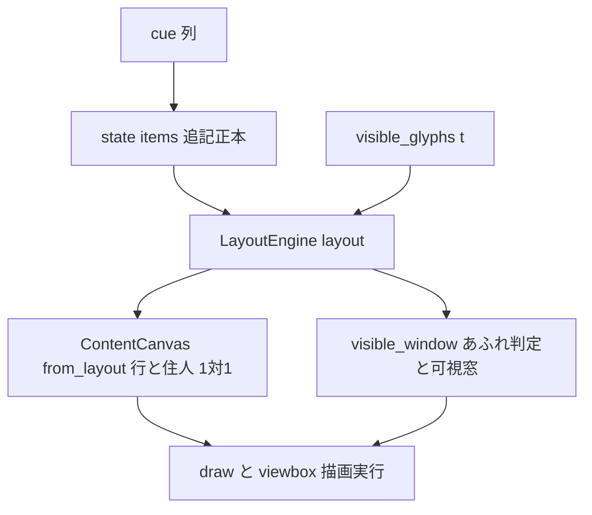
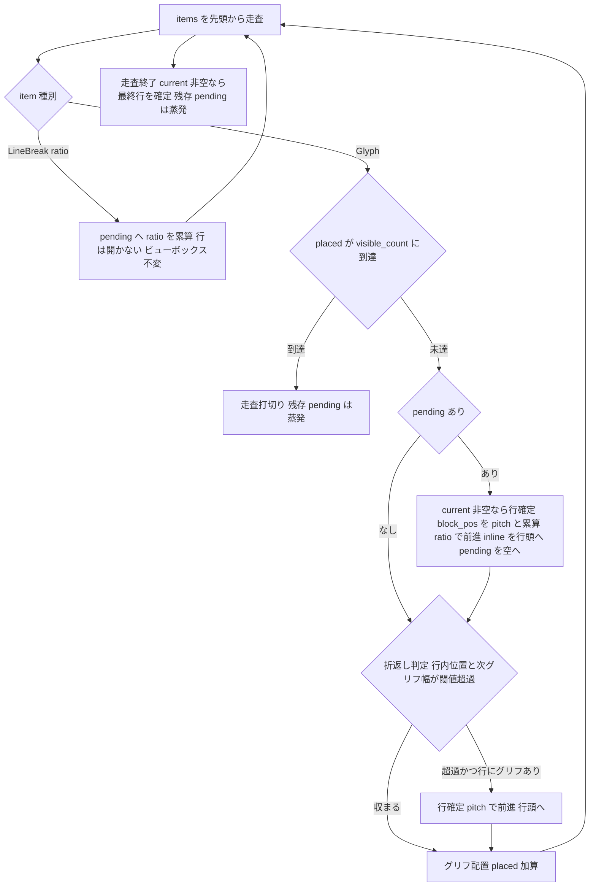

# 技術設計書: areka-P0-newline-defer

## Overview

**Purpose**: 完了済み `areka-P0-emo-text-layer`（crate `areka-emo-text`）の改行意味論を、到着即時の行送りから SSP 準拠の遅延（deferred newline）へ改訂する。実機（emo2 fixture・pasta SHIORI）でキャラ A→B の会話切替時に A のバルーンが意図せず 1 行スクロールする P0 不具合を、純粋層（layout）の判断分岐の改訂だけで解消する。

**Users**: 実機ゴーストの会話を見るユーザ（切替時の見た目が SSP と同じく自然になる）。および emo テキスト層の下流（canvas／visible_window／draw／viewbox——いずれも本番非改変で自動的に正しくなる）。

**Impact**: 変更は `LayoutEngine::layout` の走査ループ 1 箇所（`crates/areka-emo-text/src/layout.rs`）に閉じる。改行マーカーは「文字書き込み位置を次行先頭へ動かす予約」として走査ローカルに保留され、次の可視グリフ配置の直前にのみ一括実体化する。保留のみの改行は行を開かず・内容ビューボックスを変えず・あふれ判定に参加しない。関数シグネチャ・公開型・下流の本番コードはすべて不変。

### Goals

- 改行マーカー（NewLine cue／`\n`・`\n[ratio]`）の到着即時行送りを pending 化し、次の可視グリフ配置時にのみ一括実体化する（連続改行は ratio 累算・単一保留）。
- 未実体化の改行が行を開かず・あふれ判定に参加せず・スクロールを誘発しないことを構造的に成立させる（layout が空行を出力しなければ下流は自動的に正しい）。
- typewriter リビール進行と整合させる（可視 prefix 打切りを保留フラッシュより前に置く＝R4.2 の要）。
- 実体化されない保留改行の蒸発（talk 終了・`\c`／ClearAll）を、状態を持たない per-frame transient として成立させる。
- 判断分岐を純関数のまま保ち、`FixedMetrics` による決定論テストで全網羅する。既存の即時意味論檻は「意味の変更に伴う更新」を行う。

### Non-Goals

- pasta／fixture／サブモジュール／areka-sakura compile の改変（正当と裁定済み・非改変）。
- あふれ→スクロール機構それ自体（`visible_window` の可視窓決定・draw の全域再描画）の変更——評価タイミングのみが実体化時へ移る。
- `\n[ratio]` の ratio 解釈（既存正準表・`行送り量 = line_pitch × ratio`）の変更。
- `\_l` 等の他レイアウト系タグの新規対応。
- 画像等の非グリフ配置物の実出力対応（正準モデルは content 種別非依存に設計するが、本 spec の可視コンテンツはグリフのみ）。
- SSP の他の描画差異（フォント・descent 等）。

## Boundary Commitments

### This Spec Owns

- `LayoutEngine::layout`（`crates/areka-emo-text/src/layout.rs`）の走査ループが担う**改行の実体化タイミングの意味論**（遅延・累算・実体化・蒸発）。
- `ScrollPlanner::plan_with_overhangs`（`crates/areka-emo-text/src/viewbox.rs`）の**後方縮退ガードの拡張 1 点**（DD-9・遅延化で到達可能になる行内縮小フレーム列への防御・開発者承認 2026-07-18 のスコープ追加）。
- 上記意味論の決定論檻（既存檻の意味更新＋新規檻）——`layout.rs`／`canvas.rs`／`viewbox.rs` のテストモジュール、および `viewbox_draw.rs` の行内縮小 byte 等価恒久檻。
- 完了済み `areka-P0-emo-text-layer` R2.2（NewLine 即時行送り）意味論の正式改訂と、関連 doc コメントの整合更新。
- R8 実機サインオフの手順定義（有界 auto-exit＋ログ grep＋人間目視）。

### Out of Boundary

- `visible_window`／`ContentCanvas::from_layout`／`DrawExecutor`／`ViewboxExecutor`／`TextLayerState` の**本番コード**（非改変。layout の出力変化を通じて自動的に正しくなる——**例外は viewbox.rs の後方縮退ガード 1 点のみ（DD-9・This Spec Owns へ移管）**）。
- cue 層（`areka-sakura` の `TalkCue`／`CueCommand::NewLine`・duration 意味論）——NewLine cue は瞬時 duration 0 のまま非改変。
- `state.rs` の cue バッファ追記（後出し優先の記録）——`items` への `LineBreak` 追記は即時のまま維持する（遅延するのは行送りの可視化のみ・R4.3）。
- `areka-P0-choice-render` の宛先である `state.rs:224-229`（Choice シーム）——不触（W3 開始前に本 spec を完了させる編成契約）。

### Allowed Dependencies

- `areka-emo-text` 内部の既存層依存のみ: state（`TextItem`）→ layout → canvas → draw／viewbox。依存方向・シグネチャは不変。
- 新規 crate 依存なし。新規ファイルなし。

### Revalidation Triggers

- `LayoutEngine::layout` の出力契約（「出力行はすべて可視コンテンツを含む＝改行由来の空行を出力しない」）に依存する下流が現れた後、意味論を再変更する場合。
- `PositionedLine`／`VisibleWindow`／`ContentCanvas` の型形状を変える変更（本 spec では発生しない）。
- 将来の非グリフ配置物（画像等）導入時——「ビューボックスは可視コンテンツを実際に置いたときのみ拡張」の正準モデルを継承し、実体化トリガ（次の可視コンテンツ配置）へ画像を加える再検証が要る。
- `areka-P0-emo2-conformance-e2e`（下流）は本修正の実機効果を適合走行で最終確認する。

## Architecture

### Existing Architecture Analysis

データフロー（本 spec で不変・gap 分析 §1.2 の実測）:

- 行送りの本番分岐は `layout.rs` の `TextItem::LineBreak` アーム**唯一**（即時に行を閉じ `block_pos += block_dir * pitch * ratio`）。可視 prefix 打切り（`placed == visible_count` の break）は Glyph アームにのみあるため、末尾の trailing LineBreak も走査され空行を開き、その空行が `visible_window` のあふれ判定入力に参加してスクロールを誘発する——これがバグの所在。
- `canvas` は layout 出力の行を 1:1 で住人へ写すだけ・`visible_window` は行列を入力に取るだけ・`draw`／`viewbox` は `first_visible_line` を消費するだけ。**layout が空行を出さなくなれば、下流は本番非改変で自動的に正しくなる**。

### 正準モデル（要件確定事項の設計転写）

要件ディスカッションで開発者が確定した正準モデルを、設計の第一原理として固定する:

1. **改行＝予約（reservation）**: 改行マーカーは「文字書き込み位置を次行先頭（横書き＝左下方向への block 前進・縦書き＝軸読み替え）へ動かす予約」であり、**次の可視コンテンツが実際に配置された瞬間にのみ確定**する。
2. **ビューボックスは配置物のみが決める**: 内容ビューボックス（占有範囲）は「何か（可視コンテンツ）」を実際に置いたときにのみ拡張されうる。改行だけが連続しても占有範囲・あふれ判定入力は不変。この規則は content 種別非依存（本 spec の実装対象はグリフのみ・将来の画像配置も同一モデルを継承）。
3. **実体化は一括**: 連続改行は ratio を累算した単一の保留として持ち、次グリフ配置の直前に一括実体化する（中間空行は生じない）。
4. **蒸発**: 実体化しないまま talk が終わった保留・`\c`／ClearAll を受けた保留は破棄される。

### Architecture Pattern & Boundary Map

**採用パターン: Option A——`layout()` 走査ループ内のローカル pending**（gap 分析 §3 の第一候補を正式採用）。

- **Selected pattern**: 走査ローカル変数 `pending: Option<f32>`（Σratio）による遅延解釈。改行の「実体化するか否か」は毎フレームの純関数 `layout(items, visible_count, …)` が入力から決定し、フレームを跨ぐ状態を持たない。
- **棄却案**: Option B（state 層に pending を保持し items を実体化時に整形）は、`items`＝追記順の後出し優先正本という emo-text-layer の契約を壊し、canvas 1:1 不変条件と二重管理になり、純粋性が state 層へ漏れるため棄却（要件 R4.3「cue バッファへの追記自体は維持」と逆行）。Option C（visible_window 入力整形の明示関数追加）は、layout が空行を出さなくなれば入力から自動的に消えるため冗長＝R3.3「機構非改変」に対し過剰として棄却。
- **Simplification（synthesis 帰結）**: 新規型・新規シーム・新規ファイル・新規状態はゼロ。実体化判定は `visible_count` の純関数であるため、「reveal カーソルが改行を通過したか」を追跡する状態機械は不要（毎フレーム再導出で R4.1/R4.2 が自然成立する）。
- **Generalization（synthesis 帰結）**: 実体化トリガは「次の**可視コンテンツ**の配置」と定式化する（正準モデル 2）。M1 の可視コンテンツはグリフのみだが、実体化を「Glyph アームの配置直前」という**配置点**に置くことで、将来の画像住人も同じ配置点にフラッシュを置けば同一モデルを継承できる（インタフェースの一般化のみ・実装は現要件の範囲）。
- **Steering compliance**: 判断分岐は純粋層に閉じ GPU 非依存で全網羅（檻対象＝判断分岐のみ）・実装第一・layout は失敗経路を持たない純関数のままでログ規律の新規論点なし。

### 設計決定（DD-1〜DD-8・research.md §4 の 8 論点の決着）

| ID | 論点 | 決定 | 根拠 |
|---|---|---|---|
| DD-1 | 連続改行の実体化形 | **単一累算・中間空行なし**。`[a, \n, \n, b]` → 2 行（a／b・間隔 pitch×Σratio）。 | 要件正文が確定（1.3「累算した単一の保留」・2.2「累算 ratio 合計」・1.2「空行を可視構造へ反映しない」）。グリフの幾何位置は即時意味論と同一で、消えるのは空行住人のみ。 |
| DD-2 | 先頭改行（グリフ配置前の保留） | **空行を作らず行送りのみ**。`[\n, a]` → 1 行（a が `block_start + pitch×ratio` に配置）。 | 正準モデル 2（行は配置された可視コンテンツのみが作る）。実体化時に累算送りは幾何へ反映される（予約の確定）が、空行住人は生じない。 |
| DD-3 | 保留フラッシュと可視 prefix 打切りの順序 | **`placed == visible_count` の break を保留フラッシュより前に置く**（正準固定）。 | R4.2 の要。取り違えると「リビールカーソルが改行を通過したが次可視グリフが無い」ケースで行送りが漏れて壊れる。実装・レビューはこの順序を契約として扱う。 |
| DD-4 | `opened` フラグ | **撤去**し、末尾の行確定を `!current.is_empty()` で判定する。 | 遅延化後、行の確定は常にグリフ配置に隣接するため「グリフを 1 つも含まない末尾 current」は構造的に生じない（`opened` と等価）。フラグの意味残留を残すより単純。 |
| DD-5 | 保留の表現 | **`pending: Option<f32>`**（`None`＝保留なし・`Some(Σratio)`）。 | `\n[0]`（ratio 0）でも「行を替える（新行・送りゼロ）」意味を保存するため、`f32` 単独（0.0 と区別不能）ではなく Option。既存の即時意味論でも `LineBreak{0.0}` は行を閉じており、縮退挙動を等価に維持する。 |
| DD-6 | 下流の非改変確定 | `visible_window`／`canvas.rs`／`draw.rs`／`viewbox.rs`／`viewbox_draw.rs`／`state.rs` の**本番コードは原則非改変**。**例外＝viewbox.rs の後方縮退ガード 1 点（DD-9・実装中の実測で開発者追加承認 2026-07-18）**。 | canvas は行を写すだけ・visible_window は行列入力・draw/viewbox は `first_visible_line` 消費のみ（実測）。行 index 1:1 不変条件は「layout 出力の行」に対する契約であり、空行が出力されなくなっても保たれる。**訂正（実装中の実測）**: 「oracle=viewbox byte 等価は両側が同一 layout 出力を消費するため意味論非依存」はステートレスな oracle にのみ成立——stateful な viewbox（増分描画）は**フレーム列**依存であり、遅延化が新たに到達可能にするフレーム列で既存欠陥が露出する（DD-9）。 |
| DD-7 | 既存檻の棚卸し（実測確定） | 更新対象は **4 檻＋doc コメント**（詳細は Testing Strategy）。`draw.rs`・`viewbox.rs`・`viewbox_draw.rs` の檻は**アサーション非影響**（内部改行のみ使用／oracle=viewbox 等価は意味論非依存）。 | gap 分析 §4-6 の「draw.rs 檻更新見込み」は本設計の実測で否定（draw.rs:1627/1726/1730 の LineBreak はすべて後続グリフあり＝実体化される内部改行）。`viewbox_draw.rs:2074` の「幽霊空行」コメントのみ陳腐化（現象自体が本修正で消滅）→ コメント更新。 |
| DD-8 | R8 実機サインオフの grep 設計 | `emo2_real_run` 定石へ接続した**手順**として定義（新規常設テストは作らない・DoD の決定論担保は R7 檻が担う）。詳細は Testing Strategy「実機サインオフ」。 | 実機の talk 選択は SHIORI 依存で非決定のため、常設檻には載せない（決定論檻の対象は判断分岐のみ）。判定はログ marker の grep＋人間目視で有界に行う（実機サインオフの定石）。 |
| DD-9 | 遅延化で到達可能になる「行内縮小」フレーム列と viewbox 増分描画の既存欠陥（実装中に発見・スコープ追加） | `ScrollPlanner::plan_with_overhangs`（viewbox.rs）の後方縮退ガードを「行数減少（`residents.len() < prev_lines.len()`）」から「**同一 index 行の被覆不能な指紋変化**（block 位置移動・extent 縮小＝新 extent の変化行矩形が旧インクを覆えない）」まで拡張し、既存の全域ダーティ縮退へ合流させる。**開発者承認 2026-07-18・本 spec スコープへ追加**。 | 既存欠陥（行内縮小時に退避インクが未クリア）は**改行非依存**で再現（fresh-context デバッグ調査が改行ゼロの縮小列で同一 diverge を実証）。旧・即時意味論では trailing 空行が行数減少ガードを偶然発火させ欠陥を**マスク**していたが、遅延化（trailing 改行の蒸発）がマスクを外し、後方時刻ジャンプ（C8 検分・un-reveal）で `diag_line_boundary_dropout_vs_oracle` が正しく検出して落ちる。前方 typewriter（text prefix 伸長・extent 増加・block 不動）は不発＝増分ホットパス影響なし。行内開始位置は layout の不変則（全行同一の行内開始）ゆえ extent＋block_pos の指紋のみで被覆判定は健全。修正は viewbox.rs:209 の既存縮退哲学（「全域ダーティへ縮退して正しさを優先・最悪でもレガシー全域再描画と等価な 1 フレーム」）の**同型拡張**であり新機構ではない。R3.3「機構それ自体は非改変」は**あふれ評価タイミングの意味論**への規定であり、本修正は増分描画の正しさ欠陥の修復（oracle 等価の回復）＝意味論不変。 |

## File Structure Plan

新規ファイルなし・新規依存なし。変更はすべて `crates/areka-emo-text/src/` 内。

### Modified Files

| ファイル | 本番 | テスト/doc | 変更内容 |
|---|---|---|---|
| `crates/areka-emo-text/src/layout.rs` | **改訂**（唯一の本番変更） | 更新＋新規 | `layout()` 走査ループ: LineBreak アーム＝pending 累算へ・Glyph アーム＝break→フラッシュ→折返し→配置の順・`opened` 撤去・末尾 finish は `!current.is_empty()`。モジュール doc「可視 prefix 規則」（改行即時反映の記述）と `layout()` doc を遅延意味論へ更新。既存檻 3 本更新＋新規檻追加。 |
| `crates/areka-emo-text/src/canvas.rs` | 非改変 | 更新 | 檻 `empty_lines_are_preserved_as_empty_glyph_residents` を遅延意味論へ更新（trailing 改行→住人 1・1:1 維持）。doc コメント「空行も空のグリフ住人として保持」の記述を「layout 出力の行を 1:1 で写す（改行由来の空行は遅延意味論では生じない）」へ整合。 |
| `crates/areka-emo-text/src/state.rs` | 非改変 | doc のみ | R2.2 参照の doc コメント（「NewLine＝改行マーカー追記」）へ「行送りの可視化は layout の遅延解釈（newline-defer）」の注記を追加。追記動作・檻は不変。 |
| `crates/areka-emo-text/src/viewbox.rs` | **改訂（ガード 1 点・DD-9）** | 新規 | `plan_with_overhangs` の後方縮退条件を「行数減少」から「同一 index 行の被覆不能な指紋変化（block 位置移動・extent 縮小）」まで拡張（既存の全域ダーティ縮退へ合流）。新規檻: 行内縮小→全域縮退・前方伸長→増分維持（ホットパス檻）。 |
| `crates/areka-emo-text/src/viewbox_draw.rs` | 非改変 | コメント＋新規檻 | `viewbox_draw.rs:2074` 付近の「幽霊空行（未リビール NewLine による）」コメントを更新（遅延化により幽霊空行は生じない・シナリオ自体は oracle=viewbox 等価檻として有効なまま）。新規檻: **改行を一切含まない行内縮小**（例「おっはよー！」→「おっ」）の oracle vs viewbox byte 等価（DD-9 欠陥の改行非依存性を恒久固定）。 |
| `crates/areka-emo-text/src/draw.rs` | 非改変 | 非改変（見込み） | 檻はすべて内部改行（後続グリフあり）のみ使用のため非影響。実変更後の全スイート実行で確認する。 |

## System Flows

`layout()` 走査ループの改訂後の判断分岐（本 spec の檻対象そのもの）:

- **ゲート順序の契約（DD-3）**: Glyph アームは必ず「可視 prefix 打切り → 保留フラッシュ → 折返し判定 → 配置」の順。打切りが先にあることで、リビールカーソルが改行を通過済みでも次の可視グリフが無い限り行送りは起きない（R4.2）。
- **蒸発は無操作（R5）**: 保留は走査ローカルなので、打切り・走査終了で単に捨てられる＝talk 終了時の蒸発（5.2/5.3）は「何もしないこと」で成立する。`\c`／ClearAll（5.1）は state の既存全消去が items ごと改行マーカーを消すため、次フレームの layout に保留の種が残らない。
- **縦書き（R6）**: フラッシュの前進量は既存の軸読み替え式 `block_pos += block_dir * pitch * Σratio` に乗るだけで、遅延・累算・実体化・蒸発の分岐は 3 方向共通（アルゴリズム分岐なし——既存規律の維持）。

## Requirements Traceability

| Requirement | Summary | 実現要素 | 検証 |
|---|---|---|---|
| 1.1 | 改行の到着即時行送りをやめ保留として蓄積 | layout LineBreak アーム＝`pending` 累算（行を開かない） | 更新檻（trailing）＋新規檻 |
| 1.2 | 保留中は行を開かず空行を可視構造へ反映しない | LineBreak アームが `lines` に触れない・空行は出力されない | 新規檻（連続改行・先頭改行） |
| 1.3 | 連続改行は ratio 累算した単一保留 | `pending = Some(Σratio)`（DD-1/DD-5） | 新規檻（累算） |
| 1.4 | ratio 解釈（正準表）は不変 | 実体化時の前進量 `pitch × Σratio`（既存式のまま・係数不変） | 既存檻（`explicit_line_break_ratio_scales_line_feed`）が緑のまま |
| 1.5 | 保留のみではビューボックス不変 | 空行を出力しない＝`lines` 不変→占有範囲・あふれ入力不変 | 新規檻（改行のみ→0 行） |
| 2.1 | 次可視グリフ配置の直前に一括実体化 | Glyph アームのフラッシュ（DD-3 の順序） | 新規檻（実体化） |
| 2.2 | 累算 ratio 合計に基づく行送り量 | フラッシュの前進量 `block_dir × pitch × Σratio` | 新規檻（累算・端数） |
| 2.3 | 実体化後は保留を空へ | `pending.take()`（フラッシュで消費） | 新規檻（実体化後の後続配置） |
| 2.4 | 別テキスト状態の配置では実体化しない | 構造的成立: pending は単一 actor の items に対する単一 `layout()` 呼出のローカル（state の per-actor 分離は既存檻） | 既存檻（state per-actor）＋構造 |
| 3.1 | 保留はあふれ判定入力に不参加 | layout が空行を出力しない→`visible_window` 入力に現れない（本番非改変・DD-6） | 更新檻（trailing あふれ不発火） |
| 3.2 | 実体化後は従来どおりあふれ評価 | 実体化された行構成に対し既存 `visible_window` がそのまま働く | 新規檻（実体化後発火） |
| 3.3 | あふれ→スクロール機構自体は非改変 | `visible_window`／draw 全域再描画は不触（DD-6） | draw/viewbox 既存檻が緑のまま |
| 4.1 | 改行より後ろのグリフのリビール時点で実体化 | 実体化は `visible_count` の純関数（毎フレーム再導出・状態なし） | 新規檻（visible 増分で 1 行→2 行） |
| 4.2 | カーソル通過済みでも次可視グリフ無しなら保留維持 | break を フラッシュより前に置く順序契約（DD-3） | 更新檻（prefix 内改行） |
| 4.3 | R2.2 意味論改訂・cue バッファ追記は維持 | state 非改変（追記は即時のまま）・layout の解釈のみ変更・doc 更新 | state 既存檻が緑のまま |
| 5.1 | `\c`／ClearAll で保留ごと破棄 | state の既存全消去（items ごと消える・本番非改変） | state 既存檻（Clear/ClearAll）が緑のまま |
| 5.2 | talk 終了で実体化なしに蒸発 | pending は per-frame transient（走査終了で消える・無操作） | 更新檻（trailing）＝蒸発と同型 |
| 5.3 | 保留中の talk 終了は可視構造・あふれ判定に不反映 | 同上（空行を出力しない） | 更新檻（trailing あふれ不発火） |
| 6.1 | 縦書きでも遅延・累算・実体化・破棄が同一規則 | 分岐は 3 方向共通（軸読み替えの既存畳込みに乗る） | 新規檻（3 方向） |
| 6.2 | 実体化の行送りは軸読み替え正準表に従う | `block_dir × pitch × Σratio`（既存式） | 新規檻（vertical_rl／vertical_lr） |
| 7.1 | 判断分岐を純粋・決定論・全網羅で検証可能に | layout は純関数のまま・`FixedMetrics` で全分岐到達 | 新規檻一式＋既存決定論檻 |
| 7.2 | 既存の即時意味論檻を意味更新 | DD-7 の棚卸し（4 檻＋doc） | Testing Strategy「更新檻」 |
| 7.3 | 満杯付近＋保留のみ→不発火／実体化後→発火 | layout＋visible_window の合成檻（metrics 非依存） | 更新檻＋新規檻（前段/後段） |
| 8.1 | 実機で A→B 切替時の意図せぬスクロールが消える | DD-8 実機サインオフ手順（grep: あふれ発火 0 件） | 実機手順（自動 grep 部） |
| 8.2 | A→B→A で段落区切りが実体化・維持 | 同手順（人間目視）＋決定論等価物は R7 檻（再登壇実体化） | 実機手順（目視部）＋新規檻 |
| 8.3 | A 再登壇なしなら末尾保留は蒸発し痕跡なし | 同手順（目視・grep）＋決定論等価物は trailing 蒸発檻 | 実機手順＋更新檻 |

## Components and Interfaces

| Component | Layer | Intent | Req | 変更 | Contracts |
|---|---|---|---|---|---|
| `LayoutEngine::layout` | 純粋層（layout.rs） | 改行の遅延解釈を含む折返し・行送り決定 | 1.1–1.5, 2.1–2.3, 3.1, 4.1–4.2, 5.2–5.3, 6.1–6.2, 7.1 | **改訂** | Service |
| `LayoutEngine::visible_window` | 純粋層（layout.rs） | あふれ判定・可視窓決定 | 3.1–3.3, 7.3 | 非改変 | Service |
| `ContentCanvas::from_layout` | 純粋層（canvas.rs） | 行→住人 1:1 写像 | 3.3 | 非改変 | Service |
| `TextLayerState` | 純粋層（state.rs） | cue→items 追記・Clear 全消去・reveal | 2.4, 4.3, 5.1 | 非改変（doc のみ） | State |
| 実機サインオフ手順 | 運用（emo2_real_run 定石） | R8 の実機確認 | 8.1–8.3 | 手順定義 | — |

### 純粋層（layout.rs）

#### LayoutEngine::layout（改訂）

| Field | Detail |
|---|---|
| Intent | items 走査で折返し・行送りを解決する純関数。本 spec で改行の解釈を「即時行送り」から「保留→次可視グリフ配置時の一括実体化」へ改訂する。 |
| Requirements | 1.1, 1.2, 1.3, 1.4, 1.5, 2.1, 2.2, 2.3, 4.1, 4.2, 5.2, 5.3, 6.1, 6.2, 7.1 |

**Responsibilities & Constraints**

- シグネチャ不変: `pub fn layout(items: &[TextItem], visible_count: usize, region: &TextRegion, mode: WritingMode, font_height: f32, metrics: &dyn GlyphMetrics) -> Vec<PositionedLine>`。
- 保留は走査ローカル `pending: Option<f32>`（DD-5）。フレームを跨ぐ状態・新規フィールド・新規型を導入しない。
- 失敗経路なし（全入力で値を返す純関数のまま）。ログは追加しない（per-frame 純関数での保留ログはスパム＝既存の `visible_window` あふれ debug ログが実機観測の marker を担う）。

**Contracts**: Service [x]

##### Service Interface（振る舞い契約の改訂点）

- **Preconditions**: 不変（任意の items／visible_count／region／mode／metrics）。
- **Postconditions**（改訂）:
  1. 出力の各 `PositionedLine` は**少なくとも 1 グリフを含む**（改行由来の空行は出力されない——空行が出力されうるのは仕様上存在しなくなる）。
  2. 可視 prefix 内の改行マーカー列は、その後ろに可視グリフが存在する場合にのみ、直近グリフ行との間隔 `pitch × Σratio` として幾何に現れる（実体化）。
  3. 可視 prefix 末尾より後ろ・または後続可視グリフを持たない改行マーカーは、出力に一切影響しない（保留のまま蒸発）。
  4. 先頭改行（グリフ配置前の保留）は、最初の可視グリフ行の block 位置を `block_start + pitch × Σratio` へ前進させるが、空行は生じない（DD-2）。
  5. `LineBreak{ratio: 0.0}` を含む保留の実体化は「行を替え・送りゼロ」（DD-5・従来の縮退挙動を保存）。
  6. 同一入力→同一出力（決定論・不変）。
- **Invariants**: 折返し判定式・軸読み替え正準表・行矩形の規約・`visible_count` 打切り位置（グリフ個数基準）は不変。

**Implementation Notes**

- Integration: Glyph アームのゲート順序は「break → フラッシュ → 折返し → 配置」（DD-3・順序契約）。フラッシュは「`current` 非空なら `finish_line` で行確定→`block_pos += block_dir * pitch * Σratio`→`inline_pos = inline_start`→`pending = None`」。
- Validation: 全分岐が `FixedMetrics` で決定論到達可能（Testing Strategy）。
- Risks: 順序契約の取り違え（R4.2 破壊）が最大リスク——専用檻で固定する。`opened` 撤去（DD-4）は等価性の根拠（行確定は常にグリフ配置に隣接）をコード上のコメントで残す。

#### LayoutEngine::visible_window（非改変・summary のみ）

行列を入力とする既存の純関数のまま。保留改行は行として入力に現れないため、あふれ判定への不参加（3.1）は**入力の性質**として成立する。実体化後の行構成には従来どおり働く（3.2）。機構・式・ログとも不触（3.3）。

### 純粋層（canvas.rs／state.rs・非改変）

- `ContentCanvas::from_layout`: 行→住人 1:1 の写像契約は不変。遅延意味論では改行由来の空行が入力に来なくなるだけで、写像自体は空行を渡されれば従来どおり空住人にする（本番非改変・doc 表現のみ整合更新）。
- `TextLayerState`: `NewLine`→`items.push(LineBreak)` の即時追記・`Clear`/`ClearAll` の全消去・reveal 時刻式はすべて不変（4.3/5.1/2.4 の土台）。

## Data Models

本 spec はデータモデルを変更しない。

- `TextItem`（`Glyph`／`LineBreak { ratio }`）: 不変。改行マーカーは追記正本の住人のまま（「実体化するか否か」は layout の解釈で吸収——Adjacent expectations の理想形どおり）。
- `PositionedLine`／`VisibleWindow`／`ContentCanvas`／`Resident`: 型不変。
- 保留の表現 `pending: Option<f32>` は `layout()` 関数内のローカル変数であり、公開データモデルに現れない。

## Error Handling

- `layout()` は失敗経路を持たない純関数のまま（全入力で値を返す）。本 spec は新たな失敗経路・ログ経路を追加しない（「ログ無し失敗経路の禁止」に対し、失敗経路自体が存在しない設計を維持）。
- 縮退入力の挙動は Postconditions に定義済み: 改行のみ（→0 行）・先頭改行・`ratio 0`・`visible_count 0`——いずれも定義された値を返す。

## Testing Strategy

方針: 檻対象は判断分岐のみ（証明済み配線の再テストはしない）。全檻 metrics 非依存（`FixedMetrics`）・GPU 不要・決定論。既存檻の変更は R7.2 の規定どおり「陳腐化除外ではなく意味の変更に伴う更新」。

### 更新檻（4 本・DD-7 実測棚卸し）

| 檻（現行） | 場所 | 更新後の検証内容 |
|---|---|---|
| `line_break_within_visible_prefix_opens_empty_line` | layout.rs:714 | `[a, \n, b]` visible=1 → **1 行**（保留維持・行を開かない＝4.2）。visible=2 → 2 行（実体化＝4.1）。名称も遅延意味論へ改名。 |
| `trailing_line_break_opens_empty_line` | layout.rs:750 | `[あ, \n]` visible=1 → **1 行**（trailing は保留のまま蒸発・空行なし＝1.1/1.2/5.2）。 |
| `trailing_empty_line_participates_in_overflow` | layout.rs:1019 | 満杯 3 行＋trailing `\n` → **あふれ不発火**（`first_visible_line=0`・3.1/7.3 前段）。 |
| `empty_lines_are_preserved_as_empty_glyph_residents` | canvas.rs:468 | `[あ, \n]` → 行 1・**住人 1**（1:1 維持のまま空住人が生じない）。写像の一般性（空行を渡せば空住人）は synthetic な `PositionedLine` 入力で檻を残す（canvas 本番非改変の証）。 |

**非影響の確認（DD-7）**: `draw.rs`（1612/1708 系——内部改行のみ）・`viewbox.rs`・`viewbox_draw.rs`（oracle=viewbox byte 等価は両側が同一 layout 出力を消費するため意味論非依存）・`state.rs`／`sink.rs`／`actor.rs` の檻はアサーション変更不要の見込み。実変更後に全スイートを回し、落ちた檻があれば「意味の変更に伴う更新／陳腐化」を個別判定する（`viewbox_draw.rs:2074` の幽霊空行コメントは更新）。

**挙動シフトが予期される檻（viewbox_draw live-diff 系）**: live-diff 5 チェックポイントのシナリオ（viewbox_draw.rs:1546-1552/1827-1835 ほか）は `NewLine`→`Text` の at 分散により幽霊空行由来のスクロール発火タイミングを**シナリオ意図として含む**（2074-2075 コメントが明記）。遅延化で幽霊空行が消え発火時刻が後退するため、byte 等価アサーションは両側同時変化で緑のままでも、チェックポイントの状態前提（発火「直後」の切り取り）が変質しうる。tasks では本檻群を「挙動シフトが予期される檻」として扱い、(a) 落ちた場合は原則「意味の変更に伴う更新」として判定、(b) 緑のままでもチェックポイント前提コメント（2074-2075 ほか）の整合更新を独立の作業項目とする。

### 新規檻（layout.rs・すべて FixedMetrics）

1. **実体化と累算**（1.3/2.1/2.2/2.3）: `[a, \n, \n(0.5), b]` → 2 行・行間 `pitch × 1.5`・中間空行なし。実体化後の後続グリフは通常配置（pending 消費済み）。
2. **先頭改行**（DD-2/1.2）: `[\n, a]` → 1 行・block 位置 `start + pitch`。`[\n, \n]`（グリフなし）→ **0 行**（1.5: ビューボックス不変の構造的証明）。
3. **ratio 0 縮退**（DD-5/1.4）: `[a, \n(0), b]` → 2 行・同一 block 位置（行替えのみ・送りゼロ）。
4. **reveal 整合**（4.1/4.2）: 同一 items で visible を 1→2 と進め、1 行→2 行（改行より後ろのグリフのリビール時点でのみ実体化）を檻化。
5. **あふれの実体化時評価**（3.2/7.3 後段）: 満杯 3 行＋`\n`＋次グリフ（visible に含む）→ `visible_window` が従来どおり発火（`first_visible_line=1`）。更新檻 3（前段・不発火）と対で R7.3 を成す。
6. **縦書き同一規則**（6.1/6.2): 累算実体化＋trailing 蒸発を `vertical_rl`／`vertical_lr` で檻化（前進量は軸読み替え式・横書きと同一分岐）。
7. **決定論**（7.1）: 既存 `same_input_yields_identical_output` 系の入力へ連続・trailing 改行を含む列を追加（新分岐の同一入力→同一出力）。

### 新規檻（DD-9・viewbox.rs／viewbox_draw.rs）

8. **行内縮小の全域縮退**（viewbox.rs unit・純粋層）: 同一 index 行の text/extent が縮む新 canvas に対し `plan` が全域ダーティの Update（blit 0・面全域・全住人）へ縮退する。block 位置移動も同様。
9. **前方伸長の増分維持**（viewbox.rs unit・ホットパス檻）: text prefix 伸長・extent 増加・block 不動の変化行は従来どおり増分（変化行矩形のみの dirty）を維持し、全域縮退が誤発火しない。
10. **改行なし行内縮小の byte 等価**（viewbox_draw.rs・実 metrics）: 改行を一切含まない単一行の縮小再提示（「おっはよー！」→「おっ」）で oracle と viewbox の read_back が byte 一致する（DD-9 欠陥が改行非依存であることの恒久固定・`diag_line_boundary_dropout_vs_oracle` の後方ジャンプ検分は無改変のまま緑が正）。

R2.4（別テキスト状態で実体化しない）は、pending が単一 `layout()` 呼出のローカルであるという構造と、state の per-actor 分離既存檻で担保する（新規檻不要——構造的に他 actor の配置が本 actor の walk に入り込む経路が存在しない）。

### 実機サインオフ（8.1–8.3・DD-8・DoD は R7 檻＋本手順の実施記録）

`emo2_real_run` 定石（有界 auto-exit＋ログ grep＋人間目視）へ接続する。常設スイートには載せない（talk 選択が SHIORI 依存で非決定のため）。

1. **有界実走**: 実 helper 配置のうえ `AREKA_APP_SMOKE_EXIT_MS=180000`・`RUST_LOG=info,areka_emo_text=debug` で areka 実バイナリを emo2 fixture 起動（idle-talk Task6 実証と同一の定石・自発トークを複数捕捉できる窓）。
2. **シナリオ存在の grep**: `NewLine cue 適用` かつ `ratio=1.5` が 1 件以上（pasta `spot_newlines` 既定 1.5 の指紋＝spot 切替段落が実走に含まれた証）。0 件なら再実行（talk 抽選の外れ）。
3. **現象消失の grep（8.1/8.3）**: **主判定＝全走行で `あふれ発火`（`layout.rs` `visible_window` の既存 debug marker）が 0 件**。正当なあふれ（長文トーク）が同一実走に混入した場合は、機械的な窓判定は行わない（marker は actor フィールドを持たず毎フレーム発火のためログ単体で帰属不能）——**再実行で分離するか、人間目視＋R7 決定論檻を最終根拠とする**。grep は ANSI 色コード耐性のため素朴な固定文字列トークンで行う（`あふれ発火` と `ratio=1.5` を**別々に** grep・event 直結の複合 regex は空振りする既知の落とし穴）。
4. **段落区切り維持の目視（8.2）**: 実表示で A→B→A の再登壇時に段落区切りが 1 行分として現れること・A→B 切替時に A のバルーンが動かないことを人間が目視（GPU 合成窓はスクショ不可のため目視が正・決定論等価物は新規檻 1/4/5 が常設で担保）。

### 回帰（既存檻が緑のまま＝非影響の証）

`explicit_line_break_ratio_scales_line_feed`（内部改行の ratio 反映・1.4）・`vertical_line_break_feeds_column_axis`・`fractional_ratio_feed_scrolls_by_fractional_line_distance`・`broken_lines` 系 visible_window 檻・canvas `fractional_line_feed_survives_in_translation`・draw／viewbox 全檻・state／sink／actor 全檻。最終確認は `cargo test --workspace`（i686 host-32 成果物の先ビルド前提）。
