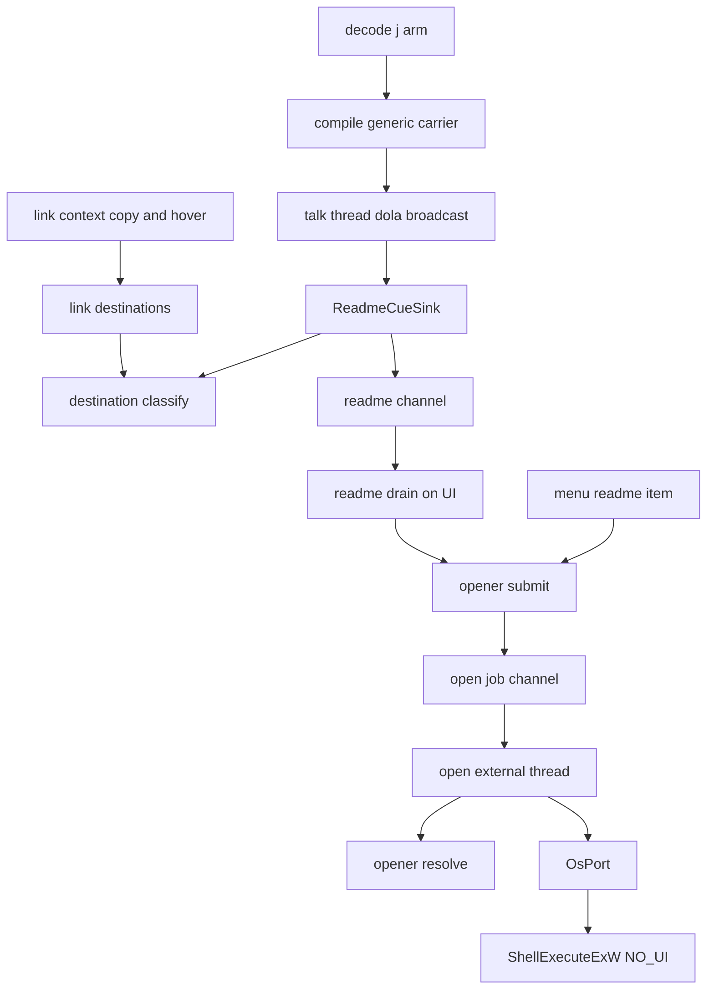
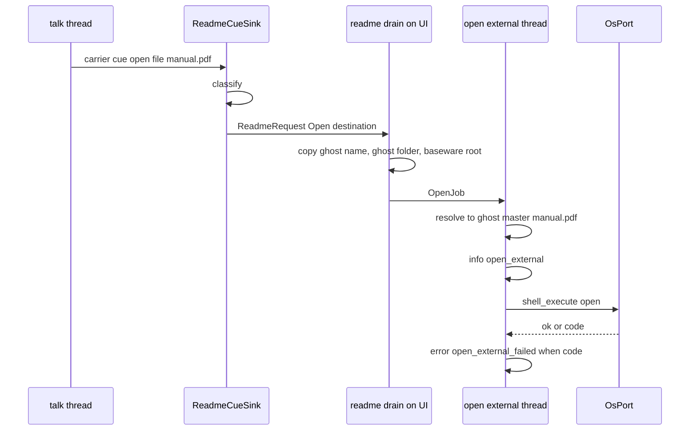
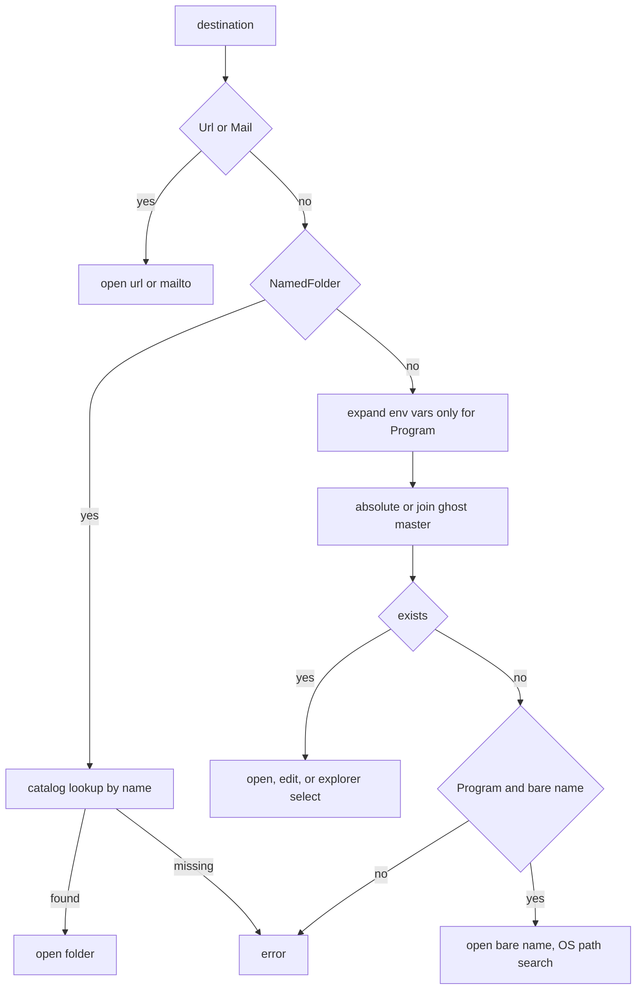

# Design Document: areka-P0-open-external-tags

## Overview

**Purpose**: バルーンから URL・ファイル・フォルダ・メールを開かせたいゴースト作者と、それを押す利用者のために、正典（ukadoc）の開く系の 6 つの形——`\j[ID]`・`\![open,file,…]`・`\![open,browser,…]`・`\![open,explorer,…]`・`\![open,editor,…]`・`\![open,mailer,…]`——を、OS の既定のアプリ（ファイルの関連付け・URL の既定のアプリ・「編集」の関連付け）で開けるようにする。

**Users**: ゴースト作者は SHIORI の応答に書くだけで外のものを開かせられる。利用者はバルーンの上でそれを押す。運用者（開発者・利用者）は、何が開かれたか・なぜ開けなかったかを記録と MCP の `get_log` で追える。後続の `link-context-copy`・`balloon-link-hover` は「台本から行き先を取り出す関数」を、`script-impact-tiers` は「開く処理の 1 か所」を使う。

**Impact**: 今の areka では `\j` は読み込みで捨てられ、`\![open,○○]` は受け取り手が `readme` しかなく、どれも黙って無視される。本設計は、⑴ `\j` を汎用の `\!` の運び手へ写す読み込みの腕を 1 本足し、⑵ 既に結線されている説明書の受け口（`ReadmeCueSink`）を開く系全体の受け口へ広げ、⑶ 今は UI スレッドで World を借りたまま `ShellExecuteW` を呼んでいる説明書の開き方を、開く専用の 1 本のスレッドへ移して 6 つの形と共通の「開く処理の 1 か所」にする。

### Goals

- 6 つの形が ukadoc どおりの行き先（相対パスは `ghost/master` から・`\![open,file]` は環境変数とパス探索）を OS の既定のアプリで開く。
- OS へ渡すのは 1 か所だけ。渡すたびに `info` 1 行（種類・解決した行き先・ゴースト名・元のタグの綴り）、失敗は `error!` 1 行（理由・符号）。記録の無い失敗経路は 0 本。
- 開くのに時間がかかっても、画面更新・入力・台本の再生が止まらない（UI スレッドも台本のスレッドも OS を待たない）。
- 台本から開く系の行き先を順に取り出す純粋な関数を、開く処理と**同じ規則の関数**で作る。
- 常時テストは OS を偽物に差し替え、実際のアプリを 1 つも起こさない。

### Non-Goals

- 外部アプリの設定画面・設定値・設定ファイル（開発者裁定で作らない）。
- 同意の窓・影響の段（`script-impact-tiers`）。差し込む場所を 1 か所にするところまで。
- `\![open,help]`・`\![open,configurationdialog]`・`\![open,ghostexplorer]` など SSP 自身の窓を開く形（受け取り手なしのまま）。
- `\![execute,http-get,…]` などネットワーク系。
- 選択肢の `script:` の実行・右クリックのコピー・ホバー・`\_a` の働き。
- `\![open,readme]` が**何を**開くか（説明書のファイルの決め方）は変えない。

## Boundary Commitments

### This Spec Owns

- **読み込みの腕**: `\j[ID]` を `Instruction::GenericCommand { name: "\\j", raw_args }` へ写す `decode_tag` の 1 腕と、運搬名の定数 `JUMP_TAG_CARRIER`（`areka-parsers` の命令の型の置き場）。
- **行き先の規則**（純粋）: どのタグのどの引数が行き先で、どの種類（URL・ファイル・フォルダ・メール・エディタ）か、どの入力を断るか。開く処理と「行き先を取り出す関数」の両方がこの 1 つの関数を呼ぶ。
- **行き先を取り出す関数** `link_destinations(script) -> Vec<Destination>`。
- **受け口の自己選別の広げ**: `ReadmeCueSink` が受理する組を `("open", readme|file|browser|explorer|editor|mailer)` と運搬名 `\j` まで広げる。
- **開く処理の 1 か所**: 行き先の解決（相対パス・環境変数・名前だけの実行ファイル・`種類,名前`）・OS へ渡す呼び出し・成功と失敗の記録・開く専用のスレッド。
- **OS の境界**: `ShellExecuteExW`（`SEE_MASK_FLAG_NO_UI`）と環境変数の読み取りを 1 つの trait に閉じ、本物 1 つと偽物（テスト）を持つ。`ShellExecute` を綴るファイルは本 spec の 1 ファイルだけ。
- **記録の振り分け**: 成功の `info` を `get_log` の `status` 種別へ入れる規則の 1 行。
- **台帳と表**: 網羅台帳の 6 行・受け取り手の表の 6 行・`doc/COMPAT_ARCHITECTURE.md` §8 の裁量の行。

### Out of Boundary

- dola の `CueCommand` の種類（足さない）・`compile.rs`（触らない）。
- `crates/areka/src/main.rs`・`crates/areka/src/emo2_boot/mod.rs`（同じウェーブ C4 の約束で触らない）。
- `crates/areka/src/mcp/` の共有ファイル（`mod.rs`・`resolve.rs`）。読みもしない（`mcp/mod.rs:6` が `mod resolve;` と非公開なので、ゴースト名は `GhostSlot` から直に読む）。
- 名前から 1 つを引く既存の純粋な関数（`resolve_switch_target`・`shell_candidates`・`balloon_candidates`）の中身。呼ぶだけで変えない。
- 同意の窓・選択肢の `script:`・コピー・ホバー・`\_a`。
- 説明書のファイルの決め方（`resolve_path`）と、説明書が無いときの `warn!`（今のまま）。

### Allowed Dependencies

- `crates/areka/src/readme/` の新しいファイル → `areka_parsers::sakura`（`parse`・`Instruction`・`JUMP_TAG_CARRIER`）・`areka_ghost::catalog`（`list_ghosts`・`BasewareRoot`）・`crate::emo2_boot::ghost_switch`（`resolve_switch_target`・`GhostSpec`）・`crate::emo2_boot::shell_balloon_resolve`（`shell_candidates`・`balloon_candidates`）・`crate::ghost_session::GhostSlot`・`crate::boot_config::BootContext`・`crate::log_history::TARGET_ERROR`・`windows`（既に有効な `Win32_UI_Shell`・`Win32_System_Com`）。
- `crates/areka/src/emo2_boot/readme_cue.rs` → `crate::readme`（要求の型）・`crate::readme::destination`（規則）。
- 依存の向き: `destination`（純粋）← `os_port`（境界の型と本物）← `opener`（解決・記録・スレッド）← `readme.rs`（結線・取り出し）← `readme_cue.rs`（台本のスレッドの受け口）。`destination` は World・fs・OS・記録のどれにも触れない。逆向きの import は誤り。
- 新しい外部クレート・`Cargo.toml`／`Cargo.lock` の変更: 0。`windows` の機能の追加: 0。

### Revalidation Triggers

- `Destination`・`Target`・`OpenKind` の形を変えたとき → `link-context-copy`・`balloon-link-hover` が再確認する。
- 開く処理の入口（`opener::submit`）の署名や、そこを通らない開き方を足したとき → `script-impact-tiers` が差し込む場所を再確認する。
- 運搬名 `JUMP_TAG_CARRIER` の綴りを変えたとき → 受け取り手の表・受け口・台帳。
- `decode_tag` の腕の並び（`anchor-tag-canon` が次に `"_a"` を足す）。並走の `mcp-author-tools`（C4-⑨）は `decode.rs` を「範囲と印を運ぶ」形へ載せ替える（`Raw` を作る所に印を付ける・返す `Instruction` は今と同じ）。本 spec の `"j"` の腕は `Raw` を作らないので印は付かない。後から main へ入る側が、相手の形に合わせて腕を置き直す。
- 受け取り手の表（`consumer_ledger.rs`）。並走の 2 本も同じ表を変える: `balloon-lifecycle-events` は 1 行、`mcp-author-tools` は 2 行と `#![allow(dead_code)]` の除去と一致のテスト `consumer_ledger_agreement_tests.rs`（表の各行に「受け口へ届く見本」を 1 つずつ持つ）。後から main へ入る側が、相手の変種・登記・見本を落とさず足し直し、総数とモジュールの doc の行数を実物から数え直す（本 spec の 6 行の見本は、`\j` は `http://` の URL・`open` の 5 組は引数つき。URL でない `\j` は受け口が断るので見本にならない）。
- 記録の取り決めの表（`doc/ssp-mcp/log-convention.md`）に行を足す他の spec。

## Architecture

### Existing Architecture Analysis

- **台本の流れ**: SHIORI の応答 → `areka_parsers::sakura::parse`（字句 → `decode`）→ `areka_sakura` の `compile` が `Instruction` を cue に変える → dola が台本のスレッドで全部の受け口へ配る。`\!` は `compile.rs:181` の腕 `Instruction::GenericCommand { name, raw_args } => {` が時間 0・書き出し位置を進めない汎用の運び手（`CueCommand::command_carrier`）に載せる。受け口はそれぞれ「名前＋第 1 引数」で自分の分だけを拾う。
- **`\j` の今**: `decode_tag` に `"j"` の腕が無く、`decode.rs:272` の `_ => decode_passthrough_tag(word, args),` で `Raw` になり、compile の最後の腕が捨てる。転記の先例は `decode.rs:203` の `"+" => decode_passthrough_bang(["change", "ghost", "random"].map(String::from).into()),`（裸の `\+` を汎用の `\!` へ写す）。
- **説明書の受け口の今**: `readme_cue.rs:84` の `if (name, selector) != (NAME_OPEN, SELECTOR_README) {` で `("open","readme")` だけを受理し、中身の無い `ReadmeRequest`（`readme.rs:27` の `pub(crate) struct ReadmeRequest;`）を UI スレッドへ送る。
- **結線の今**（触らない）: `emo2_boot/mod.rs:491` の `let (readme_tx, readme_rx) = std::sync::mpsc::channel::<crate::readme::ReadmeRequest>();`・`:492` の `let readme_sink = ReadmeCueSink::new(readme_tx);`・`:717-719` の `crate::readme::resolve_path(&ghost_root, ghost_runtime.mount().readme.as_deref());` と `crate::readme::wire_readme(world, readme_path, readme_rx);`。綴られているのは型名と 3 つの関数の署名だけなので、型の中身と関数の中身は変えられる。
- **開き方の今**: `readme.rs:165-198` の `open()` が唯一の `ShellExecuteW`。`readme.rs:154-158` の `drain_readme_requests` が入力の段（UI スレッド）で World を借りたまま呼ぶ。入口は台本（`drain_readme_requests`）とメニュー（`menu/mod.rs:313` の `readme::open_from_world(world);`）の 2 つ。
- **取り出しの登録**: `ghost_session.rs:61` の `readme::register_readme_drain(world);`（プロセスに 1 回）。

### Architecture Pattern & Boundary Map



**Architecture Integration**:
- 採る形: 「受け口は選別して運ぶだけ・UI は文脈を写して渡すだけ・OS を待つのは開く専用の 1 本のスレッドだけ」。OS の境界は trait 1 つ（本物と偽物）。
- 境界の分け方: 規則（純粋）・解決と記録（開く専用のスレッドで走る関数）・OS の呼び出し（trait の本物）を別ファイルに置き、テストは規則と解決を偽物の OS で同じスレッドのまま踏む。
- 守る既存の形: 汎用の `\!` の運び手と受け口の自己選別・受け取り手の表（`consumer_ledger.rs`）・取り出しを入力の段に置く形・`log_capture_kit` で呼んだスレッドの記録を拾うテスト。
- 新しい部品の理由: 開く専用のスレッド（要件 7.5・7.8）・OS の境界の trait（要件 10.1）・行き先の規則（要件 8.6）。
- steering との整合: OS の既定の受け口を使う（設定を写さない）・ログ無しの失敗経路を作らない・常時テストは x64 の偽の境界・1 ファイル 1,000 行以下・テストは兄弟ファイル。

### Technology Stack

| Layer | Choice / Version | Role in Feature | Notes |
|-------|------------------|-----------------|-------|
| 読み込み | `areka-parsers`（既存） | `\j` の腕・運搬名の定数 | 新しい依存なし |
| アプリ層 | `areka`（Rust 2024・`bevy_ecs` 0.19） | 受け口・取り出し・開く処理・スレッド | `std::thread::Builder`・`std::sync::mpsc` |
| OS | `windows` 0.62（既に有効な `Win32_UI_Shell`・`Win32_System_Com`） | `ShellExecuteExW`・`CoInitializeEx` | 機能の追加 0 |
| 記録 | `tracing`・`log_history`（既存） | `info`／`warn`／`error` と `get_log` の振り分け | 規則の表に 1 行 |

## File Structure Plan

### Directory Structure

```
crates/areka/src/
├── readme.rs                     # 結線・取り出し（既存を変更）: 要求の型・取り出し・説明書の開き方の入口・子の宣言
└── readme/                       # 新設（readme.rs の子）
    ├── destination.rs            # 行き先の規則（純粋）: OpenKind・Store・Target・Destination・Rejected・classify・link_destinations
    ├── destination_tests.rs      # 規則と取り出しの表のテスト（要件 8・10.3・10.4）
    ├── os_port.rs                # OS の境界: Verb・OsCall・trait OsPort・本物 WindowsShell・COM の初期化（ShellExecuteExW を綴る唯一のファイル）
    ├── opener.rs                 # 開く処理の 1 か所: OpenContext・OpenJob・OpenFailure・resolve・execute・serve・Opener（スレッド）・submit
    ├── opener_tests.rs           # 解決・記録・失敗経路・順序のテスト（偽の OsPort・要件 2〜7・10）
    └── opener_test_support.rs    # 偽の OsPort（呼ばれた OsCall を記録し、指定の符号を返す）と一時ゴーストの組み立て
```

`opener_tests.rs` が 1,000 行を超えそうなら、テーマで `opener_resolve_tests.rs`（解決）と `opener_execute_tests.rs`（記録・失敗・順序）に分け、共有部品は `opener_test_support.rs` に置く（structure.md の兄弟テストファイルの規則）。

### Modified Files

- `crates/areka-parsers/src/sakura/model.rs` — 運搬名の定数 `pub const JUMP_TAG_CARRIER: &str = "\\j";` を `Instruction` の近くに足す。
- `crates/areka-parsers/src/sakura/mod.rs` — 公開面の `pub use model::{…}` に `JUMP_TAG_CARRIER` を足す。
- `crates/areka-parsers/src/sakura/decode.rs` — `decode_tag` の `"f"` の腕（`decode.rs:270`）の次・`_` の腕の前に `"j"` の腕を 1 本だけ足す。他に変えるのは、`_` の腕のすぐ上の注記（「subset 外タグ（`\i` `\j` 等）はタスク 4.2 のパススルー領分。」）から `\j` を外す 1 行だけ（角括弧つきの `\j[…]` を読むようになると古くなるため。裸の `\j` を書く `decode_bare` 側の注記は、裸の `\j` が今のまま `Raw` なので変えない）。
- `crates/areka-parsers/src/sakura/decode_tests.rs` — `\j[…]` が運搬名の `GenericCommand` になり、引数を記述順のまま運ぶことのテストを足す。
- `crates/areka/src/readme.rs` — `ReadmeRequest` を中身つきの enum に変える・取り出しを「要求の列を取り出して 1 件ずつ渡す」形に変える・`open_from_world` に元の綴りの引数を足して OS を直接呼ばず `opener::submit` へ渡す・`open()` を削る・`register_readme_drain` で開く専用のスレッドを 1 度だけ起こす・子 module の宣言。
- `crates/areka/src/readme_tests.rs` — 本物の `ShellExecuteW` を呼ぶテスト（`open_records_a_missing_file_as_an_error_and_returns_err`）を、テスト用の送り先で「何を渡したか」を見るテストへ置き換える。要求の型の変更に追随する。
- `crates/areka/src/emo2_boot/readme_cue.rs` — 自己選別を開く系全体へ広げ、規則（`destination::classify`）で分類して送る・断るものは `warn!`・開封できない荷物の宛名の述語を `open` と `\j` に合わせる・モジュールの doc を改める。
- `crates/areka/src/emo2_boot/readme_cue_tests.rs` — `\![open,browser]` を担当外としていたテストを書き替え、各形の受理・断り・`\![open,help]` の担当外を判定する。
- `crates/areka/src/emo2_boot/consumer_ledger.rs` — `canonical()` に `("open", file|browser|explorer|editor|mailer)` と運搬名 `\j`（選別子なし）の 6 行を `ReadmeSink` で登記する・`ReadmeSink` の doc を「開く系の受け口」へ改める・総数の檻と `("open","browser")` の檻を書き替え、`("open","help")` が担当なしの檻を足す。
- `crates/areka/src/menu/mod.rs` — `open_readme` が `readme::open_from_world(world, readme::MENU_TAG)` を呼ぶ（元の綴りの代わりにメニューの印を渡す）。
- `crates/areka/src/log_history.rs` — `RULES` の `status` の並びに `rule("areka::readme", Kind::Status, false)` を 1 行足す。
- `doc/ssp-mcp/log-convention.md` — 規則の表に `status | areka::readme | 下も含む` を 1 行足し、「info の行を振り分ける 13 行」を 14 行に、`status` の説明に「外のものを開いた」を足す。
- `doc/ukadoc-coverage/ledger/sakura-script.toml` — 6 行の `status`・`owner`・`note`。
- `doc/COMPAT_ARCHITECTURE.md` — §8 に裁量の行を足す（下の「正典の沈黙と裁量」）。

`crates/areka/src/main.rs`・`crates/areka/src/emo2_boot/mod.rs`・`crates/areka-sakura/src/compile.rs`・dola・`crates/areka/src/mcp/` の変更は 0。

## System Flows

### 台本の `\![open,file,manual.pdf]` が開かれるまで



- 台本のスレッドは分類して送るだけ（OS も fs も待たない）。UI スレッドは World から文脈を写して送るだけ（OS を待たない。fs に触れるのは説明書の在否の確認——今のままのファイル 1 つの有無——だけ）。fs を読む解決（実在・フォルダか・目録の読み取り）と OS の呼び出しは開く専用のスレッドだけが行う（要件 7.5）。
- 送り道はどれも 1 本の mpsc で、開く専用のスレッドも 1 本なので、同じ台本の開く系のタグは書かれた順に開く（要件 7.8）。
- 断る入力（引数が無い・`\j` の ID が 3 つの形のどれでもない・`headline`／`plugin`）は受け口で `warn!` 1 行を残して送らない（要件 1.7・2.6・3.2・4.7・6.3）。

### 解決の分かれ道（開く専用のスレッド）



## Requirements Traceability

| Requirement | Summary | Components | Interfaces | Flows |
|-------------|---------|------------|------------|-------|
| 1.1 | `\j[http(s)://]` を URL として開く | JumpTagArm・Destination・Opener | `classify`→`Target::Url`・`resolve` | 台本の流れ |
| 1.2 | `\j[file:///絶対]` を関連付けで開く | Destination・Opener | `Target::Path`・`resolve` | 解決の分かれ道 |
| 1.3 | `\j[file:///相対]` は `ghost/master` 基準 | Opener | `resolve`（`OpenContext.ghost_dir`） | 解決の分かれ道 |
| 1.4 | `\j[mailto:]` で新しいメール | Destination・Opener | `Target::Mail` | 台本の流れ |
| 1.5 | `\j` を `\!` と同じ受け取り手へ・`CueCommand` 0 | JumpTagArm・ReadmeCueSink・ConsumerLedger | `JUMP_TAG_CARRIER` | 台本の流れ |
| 1.6 | `\j` は表示も時間も変えない | JumpTagArm | 既存の汎用の腕（時間 0） | — |
| 1.7 | 3 形以外は開かず `warn!` | Destination・ReadmeCueSink | `Rejection::UnknownJumpId` | 台本の流れ |
| 2.1 | `\![open,file,絶対]` を関連付けで開く・実行 | Destination・Opener | `Target::Program`・`resolve` | 解決の分かれ道 |
| 2.2 | 相対は `ghost/master` 基準 | Opener | `resolve` | 解決の分かれ道 |
| 2.3 | 環境変数を展開 | Opener・OsPort | `OsPort::env_var`・`expand_env` | 解決の分かれ道 |
| 2.4 | 名前だけの実行ファイルは OS のパス探索 | Opener | `resolve`（名前だけの分岐） | 解決の分かれ道 |
| 2.5 | 無い・OS が断った → `error!` | Opener | `OpenFailure::NotFound`・`OpenFailure::Os` | 台本の流れ |
| 2.6 | 引数なし → `warn!` | Destination・ReadmeCueSink | `Rejection::MissingArgument` | — |
| 3.1 | 既定のブラウザで開く | Destination・Opener | `Target::Url` | 台本の流れ |
| 3.2 | 引数なし → `warn!` | Destination・ReadmeCueSink | `Rejection::MissingArgument` | — |
| 3.3 | OS が断った → `error!` | Opener | `OpenFailure::Os` | 台本の流れ |
| 4.1 | フォルダを開く | Opener | `Target::Folder`→`Verb::Open` | 解決の分かれ道 |
| 4.2 | ファイルは選んだ状態でフォルダを開く | Opener | `explorer.exe /select,` | 解決の分かれ道 |
| 4.3 | 相対は `ghost/master` 基準 | Opener | `resolve` | 解決の分かれ道 |
| 4.4 | `ghost,名前` を目録で引く | Opener | `list_ghosts`＋`resolve_switch_target` | 解決の分かれ道 |
| 4.5 | `balloon,名前` を目録で引く | Opener | `balloon_candidates`＋名前の照合 | 解決の分かれ道 |
| 4.6 | `shell,名前` を今のゴーストの `shell` から引く | Opener | `shell_candidates`＋名前の照合 | 解決の分かれ道 |
| 4.7 | `headline`・`plugin`・他は開かず `warn!` | Destination・ReadmeCueSink | `Rejection::UnsupportedStore` | — |
| 4.8 | 名前に当たらない・無い → `error!` | Opener | `OpenFailure::NoMatch`・`NoBasewareRoot`・`NotFound` | 解決の分かれ道 |
| 5.1 | 「編集」の関連付けで開く | Destination・Opener | `Target::Edit`→`Verb::Edit` | 解決の分かれ道 |
| 5.2 | 表示行を無視 | Destination | `classify`（第 3 引数以降を読まない） | — |
| 5.3 | 相対は `ghost/master` 基準 | Opener | `resolve` | 解決の分かれ道 |
| 5.4 | 関連付けが無い・無い → `error!` | Opener | `OpenFailure::Os`（`ERROR_NO_ASSOCIATION`＝1155）・`NotFound` | — |
| 6.1 | 宛先の新しいメール | Opener | `Target::Mail`→`mailto:` を付ける | — |
| 6.2 | `mailto:` 付きはそのまま | Opener | `resolve`（大文字小文字を区別しない前置きの判定） | — |
| 6.3 | 引数なし → `warn!` | Destination・ReadmeCueSink | `Rejection::MissingArgument` | — |
| 6.4 | OS が断った → `error!` | Opener | `OpenFailure::Os` | — |
| 7.1 | OS へ渡すのは 1 か所・説明書も通す | Opener・OsPort・ReadmeDrain | `submit`・`execute`・`OsPort` | 台本の流れ |
| 7.2 | `info` 1 行（種類・行き先・ゴースト名・綴り） | Opener | `execute` の記録 | 台本の流れ |
| 7.3 | `get_log` で読める | LogRule | `RULES` の `areka::readme` 行 | — |
| 7.4 | 失敗は `error!`・`error` 種別・失敗経路の記録 0 漏れ | Opener | `OpenFailure`・`TARGET_ERROR` | 台本の流れ |
| 7.5 | 画面・入力・再生を止めない | Opener・ReadmeDrain・ReadmeCueSink | 開く専用のスレッド | 台本の流れ |
| 7.6 | 失敗でもメッセージボックスを出さない | Opener | 記録だけ | — |
| 7.7 | 設定値・設定画面・設定ファイル 0 | OsPort | OS の既定の動詞だけ | — |
| 7.8 | 台本の順に 1 つずつ | Opener | 1 本の mpsc＋1 本のスレッド | 台本の流れ |
| 8.1 | 行き先を順に返す | Destination | `link_destinations` | — |
| 8.2 | 種類と元の綴りを添える | Destination | `Destination.target.kind()`・`written`・`tag` | — |
| 8.3 | 開く系以外を含めない | Destination | `classify` が `None` | — |
| 8.4 | 純粋・解決しない | Destination | `link_destinations` | — |
| 8.5 | 無ければ空 | Destination | `link_destinations` | — |
| 8.6 | 開く処理と同じ規則・テストで固定 | Destination・ReadmeCueSink | `classify` を両方が呼ぶ | — |
| 9.1 | 網羅台帳の 6 行 | Docs | `sakura-script.toml`・`/// ukadoc:` | — |
| 9.2 | 受け取り手の表に 5 組（＋運搬名） | ConsumerLedger | `canonical()` | — |
| 9.3 | 表の既存テストの書き替え | ConsumerLedger | 総数の檻・担当なしの檻 | — |
| 9.4 | §8 に裁量を登記 | Docs | `COMPAT_ARCHITECTURE.md` §8 | — |
| 10.1 | OS を偽物にして記録で判定・実起動 0 | OsPort・opener_test_support | `FakeOs` | — |
| 10.2 | 6 形の解決と記録の判定 | opener_tests | `execute`・`resolve` | — |
| 10.3 | 3 形以外・引数なしで OS を呼ばない | destination_tests・readme_cue_tests | `classify`・受け口 | — |
| 10.4 | 取り出しの判定 | destination_tests | `link_destinations` | — |
| 10.5 | 失敗経路ごとに記録がある | opener_tests | `FakeOs` に失敗を返させる | — |
| 10.6 | x64 で決定論 | 全テスト | 一時フォルダ・偽の OS | — |

## Components and Interfaces

| Component | Domain/Layer | Intent | Req Coverage | Key Dependencies (P0/P1) | Contracts |
|-----------|--------------|--------|--------------|--------------------------|-----------|
| JumpTagArm | 読み込み（areka-parsers） | `\j[ID]` を運搬名の汎用コマンドへ写す | 1.5, 1.6 | `decode_tag`（P0） | Service |
| Destination | 規則（純粋） | 開く系の行き先・種類・断りを決める／台本から取り出す | 1.1, 1.4, 1.7, 2.6, 3.2, 4.7, 5.2, 6.3, 8.1-8.6 | `areka_parsers::sakura::parse`（P0） | Service |
| ReadmeCueSink（変更） | 台本のスレッドの受け口 | 開く系を選別・分類して UI へ送る・断りを記録 | 1.5, 1.7, 2.6, 3.2, 4.7, 6.3, 7.5, 8.6 | Destination（P0）・readme channel（P0） | Event |
| ReadmeDrain（変更） | UI スレッドの取り出し | 要求を取り出して開く処理へ渡す・説明書も同じ道へ | 7.1, 7.5 | Opener（P0） | Service, State |
| Opener | 開く処理の 1 か所 | 文脈の写し・解決・記録・開く専用のスレッド | 1.1-1.4, 2.1-2.5, 3.1, 3.3, 4.1-4.6, 4.8, 5.1, 5.3, 5.4, 6.1, 6.2, 6.4, 7.1-7.8 | OsPort（P0）・catalog（P1）・GhostSlot（P0）・BootContext（P1） | Service, Batch, State |
| OsPort | OS の境界 | `ShellExecuteExW` と環境変数を 1 か所に閉じる | 2.3, 7.1, 7.7, 10.1 | `windows`（P0） | Service |
| ConsumerLedger（変更） | 受け取り手の表 | 開く系 6 組を `ReadmeSink` に登記 | 1.5, 9.2, 9.3 | — | State |
| LogRule（変更） | 記録の振り分け | 成功の `info` を `status` へ | 7.3 | `log_history::RULES`（P0） | State |

### 読み込み

#### JumpTagArm

| Field | Detail |
|-------|--------|
| Intent | `\j[ID]` を `GenericCommand { name: JUMP_TAG_CARRIER, raw_args }` へ写す |
| Requirements | 1.5, 1.6 |

**Responsibilities & Constraints**
- `decode_tag` の `"f"` の腕の次・`_` の腕の前に `"j" => Instruction::GenericCommand { name: super::model::JUMP_TAG_CARRIER.to_owned(), raw_args: args },` の 1 腕だけを足す（定数は完全なパスで書き、`decode.rs:35` の `use super::model::{Choice, Instruction, MoveArgs, NewLineRatio, SurfaceArg};` の行も変えない）。引数は字句解析が割った列を記述順のまま運ぶ（意味は読まない＝転記層の規律）。
- 運搬名は `"\\j"`（`\f` の `FONT_TAG_CARRIER`＝`"\\f"` と同じ流儀）。`\!` のコマンド名と衝突しない（`\!` の名前はバックスラッシュで始まらない）。
- 定数は `areka-parsers` の `sakura/model.rs` に置き `sakura/mod.rs` から公開する（`decode.rs` から見え、`areka` からも見える場所。`areka_sakura::contract` は `areka-parsers` から見えない）。
- 時間 0・書き出し位置を進めない扱いは `compile.rs:181` の既存の腕がそのまま与える（要件 1.6）。`compile.rs`・dola は変えない。裸の `\j`（角括弧なし）は今のまま `Raw`（正典の形は `\j[ID]` だけ）。

**Contracts**: Service [x]

```rust
// crates/areka-parsers/src/sakura/model.rs
/// `\j[ID]` を運ぶ汎用キャリアのコマンド名（消費側はこの名前で自己選別する）。
pub const JUMP_TAG_CARRIER: &str = "\\j";
```

- Postconditions: `parse("\\j[http://a/]")` は `[GenericCommand { name: "\\j", raw_args: ["http://a/"] }]`。`\j[a,b]` は `raw_args: ["a","b"]`（ID は第 1 引数として読むのは消費側）。

### 規則（純粋）

#### Destination

| Field | Detail |
|-------|--------|
| Intent | 開く系のタグから行き先・種類・断りを決める唯一の規則と、台本から行き先を取り出す関数 |
| Requirements | 1.1, 1.4, 1.7, 2.6, 3.2, 4.7, 5.2, 6.3, 8.1, 8.2, 8.3, 8.4, 8.5, 8.6 |

**Responsibilities & Constraints**
- `classify` は (コマンド名, 引数の列) を受け、開く系でなければ `None`、開く系なら行き先か断りを返す。受け口（実行時）と `link_destinations`（取り出し）の両方がこの関数だけを呼ぶ（要件 8.6 を構造で保つ）。
- World・fs・OS・環境変数・記録のどれにも触れない（要件 8.4）。相対パスの解決・環境変数の展開・`mailto:` の付け足しはここでは行わず、書かれた綴りのまま持つ。
- 6 つの形の正典の URL（`/// ukadoc:`）を、`classify` の分岐の腕に 1 行ずつ置く（網羅台帳の証拠の置き場）。
- `\![open,readme]` は `classify` の対象外（`None`）。説明書は受け口が先に拾う（要件 8.3）。

**分類の表**（`name`・`args` は汎用の運び手の中身。`args[0]` が第 1 引数）

| タグ | 条件 | 結果 |
|---|---|---|
| `\j[ID]`（`name == JUMP_TAG_CARRIER`） | ID＝`args[0]`。`http://`・`https://` で始まる（大文字小文字を区別しない） | `Target::Url(ID)`・種類 URL |
| 同上 | `mailto:` で始まる | `Target::Mail(ID)`・種類 メール |
| 同上 | `file:///` で始まり、残りが空でない | `Target::Path(残り)`・種類 ファイル |
| 同上 | `file:///` の残りが空 | 断り `MissingArgument` |
| 同上 | 上のどれでもない・ID が無い・空 | 断り `UnknownJumpId` |
| `\![open,file,X]` | X が空でない | `Target::Program(X)`・種類 ファイル |
| `\![open,browser,X]` | 同上 | `Target::Url(X)`・種類 URL |
| `\![open,explorer,X]` | 引数が X の 1 つ（`args.len() == 2`）で X が空でない | `Target::Folder(X)`・種類 フォルダ |
| `\![open,explorer,種類,名前]` | `args.len() >= 3`。種類が `ghost`／`balloon`／`shell` で名前が空でない | `Target::NamedFolder { store, name }`・種類 フォルダ |
| 同上 | 種類が `headline`・`plugin`・その他 | 断り `UnsupportedStore(種類)` |
| `\![open,editor,X,表示行]` | X が空でない（第 3 引数以降は読まない） | `Target::Edit(X)`・種類 エディタ |
| `\![open,mailer,X]` | X が空でない | `Target::Mail(X)`・種類 メール |
| `\![open,file|browser|explorer|editor|mailer]` | X が無い・空・名前が空 | 断り `MissingArgument` |
| 上以外（`\![open,readme]`・`\![open,help]`・他の名前） | — | `None` |

- `written`（要件 8.1 の X）: `\j` は ID 全体（`file:///descript.txt` のまま）、`\![open,○○,X]` は X、`種類,名前` の形は `"種類,名前"`。
- `tag`（要件 7.2・8.2 の元の綴り）: 名前と引数から組み直した綴り（`\j[ID]`・`\![open,file,X]`）。字句解析が外した `"…"` の引用符と `\]` は戻らない（後続 2 本は行き先の値だけを使うので組み直しで足りる）。

**Contracts**: Service [x]

```rust
// crates/areka/src/readme/destination.rs
#[derive(Debug, Clone, Copy, PartialEq, Eq)]
pub(crate) enum OpenKind { Url, File, Folder, Mail, Editor }
impl OpenKind {
    /// 記録の欄 `kind` の値（"url" | "file" | "folder" | "mail" | "editor"）。
    pub(crate) fn as_str(self) -> &'static str;
}

#[derive(Debug, Clone, Copy, PartialEq, Eq)]
pub(crate) enum Store { Ghost, Balloon, Shell }

/// 書かれた綴りのままの行き先（解決は opener が行う）。変種は「解決の規則」ごとに分ける。
#[derive(Debug, Clone, PartialEq, Eq)]
pub(crate) enum Target {
    Url(String),                                   // そのまま OS へ
    Mail(String),                                  // mailto: が無ければ付けて OS へ
    Path(String),                                  // 絶対か ghost/master 基準・実在が要る（\j の file:/// と説明書）
    Program(String),                               // 環境変数を展開 → Path の規則 → 名前だけならパス探索
    Folder(String),                                // Path の規則 → フォルダは開く・ファイルは選んで示す
    NamedFolder { store: Store, name: String },    // 目録で名前を引く
    Edit(String),                                  // Path の規則 → 「編集」の動詞
}
impl Target {
    pub(crate) fn kind(&self) -> OpenKind;
}

#[derive(Debug, Clone, PartialEq, Eq)]
pub(crate) struct Destination {
    pub target: Target,
    /// 要件 8.1 の X（書かれた綴りのまま）。
    pub written: String,
    /// 元のタグの組み直した綴り（記録の欄 `tag`）。
    pub tag: String,
}

#[derive(Debug, Clone, PartialEq, Eq)]
pub(crate) enum Rejection {
    MissingArgument,
    UnknownJumpId,
    UnsupportedStore(String),
}

#[derive(Debug, Clone, PartialEq, Eq)]
pub(crate) struct Rejected { pub tag: String, pub reason: Rejection }

/// 開く系でなければ None。受け口と link_destinations の唯一の規則。
pub(crate) fn classify<S: AsRef<str>>(name: &str, args: &[S]) -> Option<Result<Destination, Rejected>>;

/// 台本の文字列から、開く系の行き先を現れた順に返す（断られるものは含めない）。
pub(crate) fn link_destinations(script: &str) -> Vec<Destination>;
```

- Preconditions: なし（どんな文字列でも panic しない）。
- Postconditions: `link_destinations` は `areka_parsers::sakura::parse(script)` の `GenericCommand` を順に `classify` へ通し、`Some(Ok(_))` だけを集める。開く系が無ければ空（要件 8.5）。
- Invariants: 同じ入力に同じ出力（要件 8.4）。`link_destinations` の結果は、同じ台本を再生したときに受け口が送り出す `Destination` の列と一致する（要件 8.6・テストで固定）。

**Implementation Notes**
- Integration: 後続の `link-context-copy`・`balloon-link-hover` は `crate::readme::destination::link_destinations` を呼ぶ（`readme.rs` で `pub(crate) mod destination;`）。台本は大きいことがあるので、呼び手は UI スレッドで巨大な台本を毎 tick 走査しない（関数は 1 回の線形走査）。
- Validation: 分類の表の全行を `destination_tests.rs` の表で判定する。
- Risks: `\j[ID]` の ID に `,` が入ると字句解析で割れる（`"…"` で囲めば守られる）。第 1 引数だけを ID とする。

### 台本のスレッドの受け口

#### ReadmeCueSink（変更）

| Field | Detail |
|-------|--------|
| Intent | 開く系の cue を自己選別し、分類して UI へ送る。断るものは記録する |
| Requirements | 1.5, 1.7, 2.6, 3.2, 4.7, 6.3, 7.5, 8.6 |

**Responsibilities & Constraints**
- 型名 `ReadmeCueSink` と `new(Sender<ReadmeRequest>)` は変えない（`emo2_boot/mod.rs` が綴っている）。
- `emit` の順: ⑴ キャリアを開封（開封できない荷物は、宛名が `open` か運搬名 `\j` なら `warn!`、他は `debug!`）⑵ `("open","readme")` なら今のまま（引数付きは `warn!`・引数なしは `ReadmeRequest::Readme`）⑶ それ以外は `destination::classify(name, &params)`: `None` は担当外（`debug!`）・`Some(Err(rejected))` は `warn!(event = "open_external_rejected", tag, reason)` を 1 行残して送らない・`Some(Ok(dest))` は `ReadmeRequest::Open(dest)` を送る ⑷ 送れなければ `warn!`（今のまま）。
- OS も fs も World も触らない（台本の再生を止めない・要件 7.5）。

**Contracts**: Event [x]
- Subscribed: 台本の全 cue（演者に依らず配られる）。
- Published: `ReadmeRequest`（下の ReadmeDrain）。
- Ordering: 1 本の mpsc へ cue の順に送る。

### UI スレッドの取り出し

#### ReadmeDrain（`readme.rs` の変更）

| Field | Detail |
|-------|--------|
| Intent | 受け口からの要求を入力の段で取り出し、開く処理の 1 か所へ渡す。説明書（台本・メニュー）も同じ道を通す |
| Requirements | 7.1, 7.5 |

**Responsibilities & Constraints**
- `ReadmeRequest` を `enum ReadmeRequest { Readme, Open(Destination) }` にする（`mod.rs` は型名だけを綴るので変わらない）。
- 取り出し（`drain_readme_requests`）は溜まった要求を全件取り出し、`Readme` は `open_from_world(world, SCRIPT_README_TAG)`、`Open(dest)` は `opener::submit(world, dest)` へ渡す。順序は届いた順。
- `open_from_world(world, tag)`: 持ち物が無い・説明書のファイルが無いときの `warn!` は今のまま（OS を呼ばない）。在れば説明書のパスを絶対パスにして `Destination { target: Target::Path(..), written, tag }` を作り `opener::submit` へ渡す。OS を直接呼ばない（`open()` は削る）。
- `register_readme_drain` は、取り出しの system の登録に加えて、`Opener` の持ち物が World に無ければ `Opener::spawn()` で開く専用のスレッドを 1 度だけ起こして入れる（呼び手 `ghost_session.rs:61` はプロセスに 1 回）。起こせなければ `error!(event = "open_external_spawn_failed")` を残し、以後の `submit` が要求ごとに `error!` を残す。
- メニューの「説明書」は `open_from_world(world, MENU_TAG)` を呼ぶ（記録の `tag` に「メニューから」と分かる印を入れる）。

**Contracts**: Service [x] / State [x]

```rust
// crates/areka/src/readme.rs
pub(crate) enum ReadmeRequest {
    /// 引数なしの `\![open,readme]`。
    Readme,
    /// 開く系の行き先（受け口が規則で分類済み）。
    Open(destination::Destination),
}
/// 台本の説明書の要求の綴り（記録の `tag`）。
const SCRIPT_README_TAG: &str = "\\![open,readme]";
/// メニューの「説明書」の印（記録の `tag`）。
pub(crate) const MENU_TAG: &str = "menu:readme";

pub(crate) fn open_from_world(world: &World, tag: &str);
pub(crate) fn drain_readme_requests(world: &mut World);
pub(crate) fn register_readme_drain(world: &mut World);
```

- State: `ReadmeWiring`（受信端・説明書のパス・初回の記録の印）は今のまま。新しい持ち物は `Opener`（下）だけ。

**Implementation Notes**
- Integration: 説明書のパスは `std::path::absolute` で絶対にしてから `Target::Path` の文字列にする（`ghost/master` 基準の解決に吸われないように）。文字列への写しは `to_string_lossy`（UTF-16 として不正なパスだけが崩れる。目録は UTF-8 でないフォルダ名を除外して読むので、崩れうるのはベースウェアの根そのものが UTF-16 として不正な場合だけ）。
- Validation: 既存の登録のテスト（`register_readme_drain_alone_adds_one_system_to_the_input_schedule`）に「`Opener` の持ち物が入る」を足す。`register_readme_drain` は `ghost_session::register_systems` 経由でテストの組み立て（`ghost_switch_test_support.rs`・`ghost_session_restart_tests.rs` など）からも呼ばれるので、「要求を送らないから OS は呼ばれない」という約束に頼らず、**テストのビルドでは本物の OS を呼べない形**にする（下の Opener の `spawn`）。
- Risks: `take_pending` は件数でなく要求の列を返す形に変わる（「全件取り出して 1 件も残さない」のテストは列の長さで判定し直す）。

### 開く処理の 1 か所

#### Opener

| Field | Detail |
|-------|--------|
| Intent | 文脈を写して 1 本のスレッドへ渡し、そこで解決・記録・OS の呼び出しを行う |
| Requirements | 1.1, 1.2, 1.3, 1.4, 2.1, 2.2, 2.3, 2.4, 2.5, 3.1, 3.3, 4.1, 4.2, 4.3, 4.4, 4.5, 4.6, 4.8, 5.1, 5.3, 5.4, 6.1, 6.2, 6.4, 7.1, 7.2, 7.4, 7.5, 7.6, 7.8 |

**Responsibilities & Constraints**
- **入口 `submit`（UI スレッド）**: すべての開き方（6 つの形・台本の説明書・メニューの説明書）が通る唯一の入口。`script-impact-tiers` の同意の窓はここへ差し込む。World から文脈（ゴースト名・ゴーストのフォルダ・ベースウェアの根）を写して `OpenJob` を送るだけで、fs も OS も待たない。
  - ゴースト名と根は `GhostSlot` から直に読む（`mcp/resolve.rs` は `mcp/mod.rs:6` の `mod resolve;` で非公開のため）。名前の決め方は `get_active_ghost_list` と同じ（descript の `name`、空・無しならゴーストのフォルダの絶対パス・末尾の区切りなし）。
  - 置き場が空（ゴーストが居ない）・`Opener` が無い・送れない（スレッドが落ちた）は、それぞれ `error!` 1 行で行き先と綴りを残して捨てる。
  - `BootContext` が無ければ `baseware: None`（`ghost`・`balloon` の名前の形だけが解決で失敗する）。
- **解決 `resolve`（開く専用のスレッド）**: `Destination` と文脈から `OsCall` を作る。`ghost/master` は `ghost_dir.join("ghost").join("master")`。
  - `Url(s)` → `open` で `s`。
  - `Mail(s)` → `mailto:` で始まらなければ（大文字小文字を区別しない）付けて `open`。
  - `Path(s)`・`Folder(s)`・`Edit(s)` → 絶対ならそのまま、相対なら `ghost/master` に繋ぐ。無ければ `NotFound`。
  - `Program(s)` → `%名前%` を `OsPort::env_var` で置き換え（未定義はそのまま残す＝OS の展開と同じ）→ `Path` と同じ規則。無く、かつ区切り（`\`・`/`・`:`）を含まない名前だけなら、名前のまま `open` へ渡す（OS のパス探索・要件 2.4）。
  - `Folder` → フォルダなら `open` でそのフォルダ、ファイルなら `open` で `explorer.exe`・引数 `/select,"<パス>"`。
  - `Edit` → `edit` でそのファイル（表示行は分類の段で捨ててある）。
  - `NamedFolder` → `Ghost`: `list_ghosts(root)` を `resolve_switch_target(&entries, &GhostSpec::Name(name))` で引く（`\![change,ghost,名前]` と同じ引き方）。`Balloon`: `balloon_candidates(root)`、`Shell`: `shell_candidates(ghost_dir)` を「descript の `name` → フォルダ名」の順・大文字小文字を区別して引く（`random`・`lastinstalled` などの特別な名前は解かない）。当たらなければ `NoMatch`、根が無ければ `NoBasewareRoot`、当たったフォルダが無ければ `NotFound`。当たれば `open` でそのフォルダ。
  - `Path`・`Program`（パスに解けたもの）を開くときの作業フォルダは、そのファイルのあるフォルダ（エクスプローラーでダブルクリックしたときと同じ）。それ以外は無し。
- **実行 `execute`（開く専用のスレッド）**: 解決に失敗 → `error!`。成功 → `info!` 1 行（OS へ渡す時点）→ `OsPort::shell_execute` → 失敗の符号なら `error!`。メッセージボックスは出さない（要件 7.6）。
- **スレッド `serve`／`Opener::spawn`**: 名前 `open-external` の 1 本。起動時に COM を STA で 1 度初期化してから（`ShellExecuteExW` の公式の注記どおり）`for job in rx { execute(&mut port, job) }`。World を落とすと送信端が落ちて受信が終わり、スレッドは自然に終わる。
  - スレッドが持つ OS の口は `#[cfg(not(test))]` では本物の `WindowsShell`、`#[cfg(test)]` では「OS を呼ばずに断る口」（`shell_execute` は呼ばれた `OsCall` をプロセス共有の記録へ積み、`Err` を返す・`env_var` は `None`）。COM の初期化も `#[cfg(not(test))]` だけ。これで後続の spec がテストの組み立てで開く系の台本を流しても、開発者の机で本物のアプリは起きない（要件 10.1）。`spawn` で起こしたスレッドへ 1 件送ると、断る口の記録に積まれ、`error!` 1 行（`reason = "os"`）が残ることを 1 本のテストで固定する。

**記録の形**（`kind`＝`OpenKind::as_str`・`destination` は解決した行き先・`tag` は元の綴り）

| 場面 | マクロ・target | event | 欄 |
|---|---|---|---|
| OS へ渡す（要件 7.2・7.3） | `info!`・既定（`areka::readme::opener`＝規則の表で `status`） | `open_external` | `kind`・`destination`・`ghost`・`tag`・`verb` |
| 解決に失敗（要件 2.5・4.8・5.4・7.4） | `error!(target: TARGET_ERROR, ghost = %名, …)` | `open_external_failed` | `kind`・`destination`（書かれた綴り）・`tag`・`reason`（`not_found`／`no_match`／`no_baseware_root`） |
| OS が断った（要件 2.5・3.3・5.4・6.4・7.4） | 同上 | `open_external_failed` | `kind`・`destination`・`tag`・`reason = "os"`・`code`（`GetLastError` の Win32 の符号） |
| 入口で捨てた（ゴースト無し・スレッド無し・送れない） | `error!(target: TARGET_ERROR, …)`（ゴーストが居れば `ghost = %名` も付ける） | `open_external_dropped` | `kind`・`destination`・`tag`・`reason` |

**Contracts**: Service [x] / Batch [x] / State [x]

```rust
// crates/areka/src/readme/opener.rs
#[derive(Debug, Clone, PartialEq, Eq)]
pub(crate) struct OpenContext {
    /// get_active_ghost_list と同じ名（記録の `ghost`）。
    pub ghost: String,
    /// ゴーストのフォルダ（`ghost/<フォルダ>`）の絶対パス。
    pub ghost_dir: PathBuf,
    /// ベースウェアの根（BootContext が無ければ None）。
    pub baseware: Option<areka_ghost::BasewareRoot>,
}

#[derive(Debug, Clone, PartialEq, Eq)]
pub(crate) struct OpenJob { pub destination: Destination, pub context: OpenContext }

#[derive(Debug, Clone, PartialEq, Eq)]
pub(crate) enum OpenFailure {
    NotFound(PathBuf),
    NoMatch { store: Store, name: String },
    NoBasewareRoot,
}

/// 解決（fs を読む・OS は呼ばない）。
pub(crate) fn resolve(dest: &Destination, ctx: &OpenContext, port: &dyn OsPort) -> Result<OsCall, OpenFailure>;
/// 1 件を解決して記録し OS へ渡す。失敗の経路は必ず 1 行記録する。
pub(crate) fn execute(port: &mut dyn OsPort, job: OpenJob);
/// 受信端が閉じるまで 1 件ずつ execute する（スレッドの中身）。
pub(crate) fn serve(rx: Receiver<OpenJob>, port: &mut dyn OsPort);

#[derive(bevy_ecs::prelude::Resource)]
pub(crate) struct Opener { tx: Sender<OpenJob> }
impl Opener {
    /// 開く専用のスレッドを起こす（COM の初期化と本物の OsPort を持つ）。
    pub(crate) fn spawn() -> std::io::Result<Opener>;
    /// テストで送り先だけを差し込む（スレッドを起こさない）。
    #[cfg(test)]
    pub(crate) fn from_sender(tx: Sender<OpenJob>) -> Opener;
}
/// 唯一の入口（UI スレッド）。文脈を写して送るだけ。
pub(crate) fn submit(world: &World, destination: Destination);
```

- Batch: Trigger＝`submit`。入力＝`OpenJob`。出力＝OS への 1 回の呼び出しと記録。冪等ではない（同じ要求を 2 度送れば 2 度開く・台本どおり）。やり直しはしない（失敗は記録して次へ）。
- State: 開く専用のスレッドは状態を持たない。`Opener` は送信端だけ。
- Concurrency: UI スレッドと台本のスレッドは送るだけ。fs と OS を触るのは開く専用のスレッドだけ。`resolve` が読む目録（`list_ghosts` など）は World を持たない純粋な fs の読み取り。

**Implementation Notes**
- Integration: `serve` と `execute` はテストから同じスレッドで呼ぶ（`log_capture_kit` は呼んだスレッドの記録しか拾わない）。`Opener::spawn` のスレッドの閉包だけが COM の初期化と本物の `WindowsShell` を持つ。
- Validation: 解決の全分岐・記録の全行を `opener_tests.rs` で偽の `OsPort` と一時フォルダ（`temp_path_kit`）で判定する。
- Risks: 開く専用のスレッドが `ShellExecuteExW` で長く待つと後ろの要求も待つ（順序を守るための代償・画面は止まらない）。アプリの終了時に溜まっている要求は捨てられる（終了を待たない）。文脈（ゴースト名・フォルダ）は台本を出した時点でなく UI で取り出した時点の `GhostSlot` から写すので、ゴーストの切り替えの境目の 1 tick に出た要求は、切り替え後のゴーストの名前・フォルダで解かれうる（取り出しは毎 tick なので境目だけ）。

### OS の境界

#### OsPort

| Field | Detail |
|-------|--------|
| Intent | OS へ渡す呼び出しと環境変数の読み取りを 1 つの trait に閉じる |
| Requirements | 2.3, 7.1, 7.7, 10.1 |

**Responsibilities & Constraints**
- 本 spec の中で `ShellExecuteExW` と `CoInitializeEx` を綴るのは `readme/os_port.rs` だけ（`CoInitializeEx` は既存のテスト `emo2_boot/assets_tests.rs` などにもあるので、見張るのは `ShellExecute` の綴りだけ）。`crates/areka/src` で `ShellExecute` の綴りがこのファイル以外に無いことをテストが見張る（要件 7.1）。
- 動詞は `open` と `edit` の 2 つだけ（OS の既定・areka 独自の設定値 0・要件 7.7）。窓の表示は `SW_SHOWNORMAL`、親の窓は無し。
- 呼ぶのは `ShellExecuteExW`。`fMask` は `SEE_MASK_FLAG_NO_UI`（OS のエラーの窓も「開く方法を選ぶ」窓も出さない・2026-10-05 開発者裁定＝設計ディスカッション議題 1）。戻り値が偽なら `Err(GetLastError の符号)`（例: 見つからない 2・関連付けが無い 1155）。窓が出ないので、開く専用のスレッドが利用者の操作を待って止まることも無い。

**Contracts**: Service [x]

```rust
// crates/areka/src/readme/os_port.rs
#[derive(Debug, Clone, Copy, PartialEq, Eq)]
pub(crate) enum Verb { Open, Edit }

#[derive(Debug, Clone, PartialEq, Eq)]
pub(crate) struct OsCall {
    pub verb: Verb,
    /// SHELLEXECUTEINFOW の lpFile（URL・パス・名前だけの実行ファイル・explorer.exe）。
    pub file: std::ffi::OsString,
    /// lpParameters（explorer.exe の /select だけが使う）。
    pub params: Option<std::ffi::OsString>,
    /// lpDirectory（作業フォルダ）。
    pub dir: Option<PathBuf>,
}

pub(crate) trait OsPort {
    /// OS へ渡す。失敗は GetLastError の Win32 の符号。
    fn shell_execute(&mut self, call: &OsCall) -> Result<(), u32>;
    /// 環境変数（Windows の規則で大文字小文字を区別しない）。
    fn env_var(&self, name: &str) -> Option<String>;
}

/// 本物（ShellExecuteExW（SEE_MASK_FLAG_NO_UI）・std::env::var）。
pub(crate) struct WindowsShell;
impl OsPort for WindowsShell { /* … */ }

/// 開く専用のスレッドの最初に 1 度だけ呼ぶ（COINIT_APARTMENTTHREADED | COINIT_DISABLE_OLE1DDE）。
/// 失敗は warn! を残して続ける。
pub(crate) fn init_com_for_shell();
```

### 表と記録の振り分け（要約）

- **ConsumerLedger**: `canonical()` に `("open","file")`・`("open","browser")`・`("open","explorer")`・`("open","editor")`・`("open","mailer")`・`(JUMP_TAG_CARRIER, None)` の 6 行を `CommandConsumer::ReadmeSink` で登記する。変種の名前は受け口の型名（`ReadmeCueSink`・`mod.rs` が綴るので変えない）に合わせて `ReadmeSink` のまま、doc を「開く系の受け口（説明書を含む）」へ改める。総数の檻は本 spec の分だけ 6 増やした値を、main を取り込んだ後の実物の行を数え直して書く（`balloon-lifecycle-events` との相互の約束）。`("open","help")`・`("open", None)` が担当なしであることを檻にする（要件 9.3）。
- **LogRule**: `log_history.rs:113` の `pub(crate) const RULES: &[Rule] = &[` の `status` の並びへ `rule("areka::readme", Kind::Status, false)` を足し、`doc/ssp-mcp/log-convention.md` の表（`log-rules:begin` と `end` の間）に同じ行を足す。表と `RULES` の一致は既存の `log_history_convention_tests.rs` が判定し、target の実在は `areka::readme` → `src/readme.rs` で通る。`areka::readme` の下で `info` を出すのは `open_external` の行だけ（説明書の他の記録は `debug`／`trace`／`warn`）。

### 網羅台帳の 6 行（要件 9.1）

| 行（`sakura-script.toml` の entry） | `status` | `note` に書くこと |
|---|---|---|
| `_5cj_5bID_5d:1`（`\j[ID]`） | `degraded` | `http(s)://`・`file:///`・`mailto:` は開く／それ以外の ID は開かず `warn!`（旧来のジャンプは無い）／ログ: 渡すたびに `info`（`status`）・失敗は `error` |
| `_5c_21_5bopen_2cfile_2c…` | `implemented` | 相対は `ghost/master`・環境変数・名前だけはパス探索／ログ同上 |
| `_5c_21_5bopen_2cbrowser_2c…` | `implemented` | OS の既定（外部アプリの設定は写さない）／ログ同上 |
| `_5c_21_5bopen_2cexplorer_2c…` | `degraded` | フォルダは開く・ファイルは選んで示す・`ghost`／`balloon`／`shell` の名前を引く／`headline`・`plugin` は開かず `warn!` |
| `_5c_21_5bopen_2ceditor_2c…` | `implemented` | 「編集」の関連付け・表示行は無視 |
| `_5c_21_5bopen_2cmailer_2c…` | `implemented` | `mailto:` を付けて既定のメールソフト |

- 6 行とも `owner = "areka-P0-open-external-tags"`。`implemented` の 4 行の証拠は `destination.rs` の `classify` の分岐の腕に置く `/// ukadoc: https://ssp.shillest.net/ukadoc/manual/list_sakura_script.html#<entry の後半>` の 1 行ずつ（`\j` と `explorer` の 2 行にも同じ形で置く）。`note` の書き方は既存の `\![open,readme]` の行（実装・縮退・壊れ方・ログ・根拠の場所）に倣う。

## Data Models

### Domain Model

- `Destination`（値）: 書かれた行き先・種類・元の綴り。規則が作り、受け口が運び、開く処理が解決する。取り出しの関数もこれを返す。
- `OpenJob`（値）: `Destination` と UI で写した `OpenContext`。開く専用のスレッドへ渡る唯一の荷物。
- `OsCall`（値）: OS へ渡す 1 回分（動詞・対象・引数・作業フォルダ）。偽物はこれを記録する。
- 不変条件: OS へ渡る `OsCall` は `execute` の中でしか作られず、`execute` の中で必ず `info` 1 行と対になる。失敗の経路（`OpenFailure` の全変種と `Err(符号)`）は必ず `error!` 1 行と対になる。

## Error Handling

### Error Strategy

失敗はすべて「記録して続ける」。ゴーストの動作・台本の再生・画面は止めない。メッセージボックスも同意の窓も出さない。

### Error Categories and Responses

| 失敗 | どこで | 記録 | 開くか |
|---|---|---|---|
| 引数が無い・空（要件 2.6・3.2・6.3） | 受け口 | `warn!` `open_external_rejected` `reason=MissingArgument` | 開かない |
| `\j` の ID が 3 形のどれでもない（要件 1.7） | 受け口 | `warn!` 同上 `reason=UnknownJumpId`・`tag` に ID | 開かない |
| `headline`・`plugin`・知らない種類（要件 4.7） | 受け口 | `warn!` 同上 `reason=UnsupportedStore(種類)`・`tag` に名前 | 開かない |
| 開封できない自分宛の荷物 | 受け口 | `warn!`（今のまま） | 開かない |
| 送れない（受信端が閉じた） | 受け口 | `warn!`（今のまま） | 開かない |
| ゴーストが居ない・開く専用のスレッドが無い・送れない | `submit` | `error!` `open_external_dropped` | 開かない |
| 行き先が無い（要件 2.5・4.8・5.4） | `execute` | `error!(target: TARGET_ERROR)` `reason=not_found` | 開かない |
| 名前に当たらない・根が無い（要件 4.8） | `execute` | 同上 `reason=no_match`／`no_baseware_root` | 開かない |
| OS が断った（関連付けが無い `ERROR_NO_ASSOCIATION`＝1155 など・OS の窓は出ない） | `execute` | `info` の後に `error!(target: TARGET_ERROR)` `reason=os`・`code` | OS 次第 |
| COM の初期化に失敗 | スレッドの起動 | `warn!` | 続ける（多くの場合 COM なしでも開ける） |
| スレッドを起こせない | `register_readme_drain` | `error!` `open_external_spawn_failed` | 以後は `submit` が要求ごとに `error!` |

### Monitoring

- 成功は `get_log` の `status` 種別（本文に `kind`・`destination`・`ghost`・`tag`）、失敗は `error` 種別（取り決めの target なので `ghost_name` で絞り込める。入口で捨てた行はゴーストが居ないときだけ名が無い）。断り（`warn!`）も `error` 種別に入る。

## Testing Strategy

すべて x64 で決定論。OS は `opener_test_support.rs` の偽の `OsPort`（呼ばれた `OsCall` を順に記録し、指定した符号を返す・環境変数は表で返す）。fs は `temp_path_kit` の一時フォルダに作った最小のゴースト（`ghost/<フォルダ>/ghost/master/descript.txt`・`shell/<フォルダ>/descript.txt`・根の `balloon/<フォルダ>/descript.txt`）。実際のアプリを起こす回数 0（要件 10.1・10.6）。

### Unit Tests（規則・`destination_tests.rs`）
- 分類の表の全行（`\j` の 3 形と大文字小文字・`file:///` の残りが空・3 形以外と空の ID・5 つの `open` の形・`種類,名前` の 3 種と `headline`／`plugin`／知らない種類・引数なし・表示行を読まない・`\![open,readme]`／`\![open,help]`／他の名前は `None`）（要件 1.1・1.4・1.7・2.6・3.2・4.7・5.2・6.3・10.3）。
- `link_destinations`: 6 つの形の混在の順序・`written` と種類と `tag`・`\![open,readme]`・`\q`・`\_a`・本文を含めない・断られるものを含めない・開く系が無ければ空（要件 8.1〜8.5・10.4）。
- 同じ台本を `parse` して得た汎用コマンドを運び手の cue にして受け口へ通したとき、送られた `Destination` の列が `link_destinations` と一致する（要件 8.6）。

### Unit Tests（読み込み・`decode_tests.rs`）
- `\j[http://a/]` が `GenericCommand { name: JUMP_TAG_CARRIER, raw_args: ["http://a/"] }` になる・引数を記述順のまま運ぶ・`Raw` にならない（要件 1.5）。

### Integration Tests（開く処理・`opener_tests.rs`）
- 6 つの形の解決（要件 10.2）: `\j` の URL・`mailto:`・`file:///` 絶対と相対／`open,file` の絶対・相対・`%TEMP%` 形の展開と未定義の変数の据え置き・`ghost/master` に在る名前だけ・無い名前だけ（名前のまま渡る）／`open,browser`／`open,explorer` のフォルダ・ファイル（`explorer.exe` と `/select,"…"`）・`ghost`／`balloon`／`shell` の名前（name とフォルダ名）／`open,editor`（動詞 `edit`）／`open,mailer` の付け足しと二重に付けないこと。偽物が記録した動詞・対象・引数・作業フォルダで判定する。
- 記録（要件 7.2・7.3）: 成功で `info` 1 行に `kind`・`destination`・`ghost`・`tag` が在る。捕捉した出来事のレベルと target を `log_history::classify` に通すと `status`、失敗の行は `error` で名がゴースト名になる。
- 失敗の経路 0 漏れ（要件 7.4・10.5）: `OpenFailure` の全変種と、偽物に `Err(2)`・`Err(1155)` を返させた場合のそれぞれで `error!` がちょうど 1 行（`reason`・`code`）。OS を呼ばない失敗では偽物の記録が 0 件。
- 順序（要件 7.8）: 3 件の `OpenJob` を送って送信端を落とし、同じスレッドで `serve` を呼ぶと、偽物の記録が送った順。
- 入口（要件 7.1）: `Opener::from_sender` の送り先で、`submit` が文脈（ゴースト名・フォルダ・根）を写した `OpenJob` を 1 件送る・ゴーストが居ない／`Opener` が無いと `error!` 1 行で送らない。
- 見張り（要件 7.1）: `crates/areka/src` の下で `ShellExecute` を綴るのは `readme/os_port.rs` だけ（見張りのテストファイル自身は除く）。

### Integration Tests（受け口・取り出し・表）
- `readme_cue_tests.rs`: 5 つの `open` の形と `\j` が `ReadmeRequest::Open` を 1 件送る・断る入力は送らず `warn!` 1 行・`\![open,help]` と裸の `\![open]` は担当外で警告なし・`\![open,readme]` の今のふるまいは変わらない（要件 1.7・2.6・3.2・4.7・6.3・10.3）。
- `readme_tests.rs`: 説明書が在ると `open_from_world` が `Target::Path`（絶対パス）と綴りを 1 件送る・無いと送らず `warn!`（今のまま）・取り出しが `Readme` と `Open` を届いた順に渡す。本物の `ShellExecuteW` を呼ぶテストは無くす（要件 7.1・10.1）。
- `consumer_ledger.rs` の檻: 6 組の登記・総数・`("open","help")` 担当なし（要件 9.2・9.3）。`mcp-author-tools` の一致のテストが先に main へ入っていれば、本 spec の 6 行の見本をそこへ足す。
- テストのビルドの開く専用のスレッド（要件 10.1）: `Opener::spawn` で起こしたスレッドへ 1 件送ると、OS を呼ばずに断る口の記録に積まれる（本物の `WindowsShell` はテストのビルドに現れない）。
- `log_history_convention_tests.rs`（既存）: 表と `RULES` の一致（要件 7.3）。

### 実機での確認（常時テストの外）
- `\j[https://…]`・`\![open,file,%SystemRoot%\notepad.exe]`・`\![open,file,notepad.exe]`・`\![open,explorer,…]`（フォルダ・ファイル）・`\![open,editor,…]`・`\![open,mailer,…]` を emo2 の台本で流し、開くこと・`get_log` の `status` と `error` に行が出ること・開いている間も吹き出しが動くことを見る。

## Security Considerations

- 台本は外のアプリを起こせる（`\![open,file]` は実行ファイルも実行する・正典どおり）。同意の窓は `script-impact-tiers` が `submit` へ差し込む。本 spec は「開くたびに必ず記録が残る」ことで追跡を保証する。
- `\![open,browser,X]` の X が URL の形でなくても判定せず OS へ渡す（OS は X をファイルとして扱いうる）。影響は `\![open,file]` と同じ範囲で、同意の窓の担当も同じ。
- 記録には行き先（URL・パス・宛先）がそのまま残る。areka の記録は手元の画面と `get_log`（手元の MCP）だけに出る。

## 正典の沈黙と裁量（`doc/COMPAT_ARCHITECTURE.md` §8 へ登記する行）

| 項目 | 裁量 |
|---|---|
| 外部アプリの選択（SSP の「本体設定 → 外部アプリ」） | 写さない。OS の既定（関連付け・URL の既定のアプリ・「編集」の関連付け）だけを使い、設定値・設定画面・設定ファイルは持たない |
| `\![open,editor,ファイル,表示行]` の表示行 | 常に無視する（ukadoc の「エディタの指定がない場合」と同じ） |
| `\![open,explorer,種類,名前]` の `headline`・`plugin` | areka に仕組みが無いので開かず `warn!` 1 行（台帳は `degraded`） |
| `\j[ID]` の旧来の「ID にジャンプ」 | `http://`・`https://`・`file:///`・`mailto:`（大文字小文字を区別しない）以外は開かず `warn!` 1 行（台帳は `degraded`・2026-10-05 開発者裁定） |
| `\j[file:///…]` のパーセント符号化 | 復号しない（書かれた綴りをパスとして読む） |
| `\![open,explorer,種類,名前]` の特別な名前（`random` など） | 解かない（名指しだけ・ukadoc の例も名指し） |
| 環境変数の展開 | ukadoc が書く `\![open,file]` だけで行う。未定義の変数はそのまま残す |
| `\![open,file]` の作業フォルダ | 開くファイルのあるフォルダ（エクスプローラーでダブルクリックしたときと同じ）。名前だけでパス探索に任せるときは指定しない |
| 開けなかったときの OS の窓 | 出さない（`SEE_MASK_FLAG_NO_UI`）。「見つかりません」の窓も、関連付けの無いファイルで「開く方法を選ぶ」窓も出ず、`error!` の記録だけで伝える（2026-10-05 開発者裁定）。選ぶ窓が欲しいという要望が出たら、関連付けが無い符号のときだけ動詞 `openas` で呼び直す形を足す |
